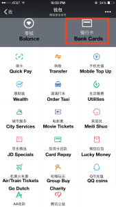
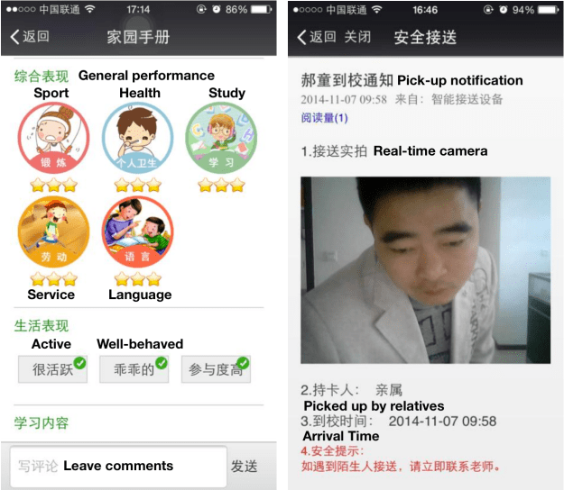

This post is all about WeChat, but it’s also about more than just WeChat. While seemingly just a messaging app, WeChat is actually more of a portal, a platform, and even a mobile operating system depending on how you look at it.

这篇文章是关于微信的，但也不仅仅是微信。 虽然看似只是一个消息应用程序，但微信实际上更像是一个门户、一个平台，甚至是一个移动操作系统，这取决于你如何看待它。

Much has been written about WeChat in the context of messaging app trends, but few outside of China really understand _how_ it works — and how it can pull off what for many companies (and countries) is still a far-off vision of a world managed entirely through our smartphones. Many of WeChat’s most interesting features — such as access to [city services](http://techcrunch.com/2015/04/24/why-wechat-city-services-is-a-game-changing-move-for-smartphone-adoption/) — are not even visible to users outside China. So why should people outside of China even care about WeChat? The first and most obvious reason is that it [points](http://recode.net/2015/05/19/western-messaging-apps-are-looking-to-chinas-wechat-for-inspiration/) to where Facebook and other messaging apps [could head](https://pando.com/2012/07/13/asia-may-once-again-pave-the-way-for-the-future-of-social-networks/). Second, WeChat [indicates](http://recode.net/2015/06/18/messaging-apps-and-platforms-of-convenience/) where the future of mobile [commerce](http://techcrunch.com/2015/06/10/never-leave/) may lie. Third, WeChat shows what it’s like to be both a [platform](http://techcrunch.com/2015/03/19/facebook-messenger-platform/) _and_ a mobile portal (what Yahoo [could have](http://ben-evans.com/benedictevans/2014/8/1/app-unbundling-search-and-discovery) been).

在消息应用趋势的背景下，关于微信的文章很多，但在中国以外很少有人真正了解 _它是如何_ 运作的——以及它如何实现对许多公司（和国家）来说仍然是一个遥远的世界管理愿景完全通过我们的智能手机。 微信的许多最有趣的功能——例如访问 [城市服务](http://techcrunch.com/2015/04/24/why-wechat-city-services-is-a-game-changing-move-for-smartphone-adoption/) ——甚至对中国以外的用户都看不到。 那么为什么中国以外的人还要关心微信呢？ 第一个也是最明显的原因是它 [指出](http://recode.net/2015/05/19/western-messaging-apps-are-looking-to-chinas-wechat-for-inspiration/) 了 Facebook 和其他消息应用程序 [的](https://pando.com/2012/07/13/asia-may-once-again-pave-the-way-for-the-future-of-social-networks/) 发展方向。 其次，微信 [预示](http://recode.net/2015/06/18/messaging-apps-and-platforms-of-convenience/) 的未来 [着移动商务](http://techcrunch.com/2015/06/10/never-leave/) 可能在哪里。 第三，微信展示了它既是一个 [平台](http://techcrunch.com/2015/03/19/facebook-messenger-platform/) _又_ 是一个移动门户（雅虎本 [可以](http://ben-evans.com/benedictevans/2014/8/1/app-unbundling-search-and-discovery) 成为）的感觉。

Ultimately, however, WeChat should matter to all of us because it shows what’s possible when an entire country — which currently has a smartphone penetration of [62%](http://www.reuters.com/article/2015/07/13/gsma-idUSnBw125058a+100+BSW20150713) (that’s almost 1/3 of its population) — “leapfrogs” over the PC era directly to mobile. WeChat was not a product that started as a website and then was adapted for mobile, it was (to paraphrase a certain [movie](https://youtu.be/F157geaXp_w)) _born into it, molded by it_.

然而，归根结底，微信对我们所有人都应该很重要，因为它展示了当整个国家——目前智能手机普及率达到 [62%](http://www.reuters.com/article/2015/07/13/gsma-idUSnBw125058a+100+BSW20150713) （几乎占其人口的 1/3）——“跨越”PC 时代直接进入移动的。 微信不是一个从网站开始然后适应移动端的产品，它是（套用某部 [电影](https://youtu.be/F157geaXp_w) ） _生于其中，由它塑造的_ 。

Most notable, however, for anyone in the tech business is WeChat’s average revenue per user or ARPU, which is estimated to be at least [$7 USD](http://qz.com/179007/wechat-is-nothing-like-whatsapp-and-that-makes-it-even-more-valuable/) — that’s _7X_ the ARPU of WhatsApp, the [largest](http://blogs.wsj.com/digits/2015/04/17/whatsapp-hits-800000-users-1-billion-by-year-end/) messaging platform in the world. How did WeChat do it?

然而，对于科技行业的任何人来说，最值得注意的是微信的每用户平均收入或 ARPU，估计至少 [为 7 美元](http://qz.com/179007/wechat-is-nothing-like-whatsapp-and-that-makes-it-even-more-valuable/) ——是 _的7 倍_ WhatsApp ARPU [世界上最大](http://blogs.wsj.com/digits/2015/04/17/whatsapp-hits-800000-users-1-billion-by-year-end/) 的消息平台 。 微信是怎么做到的？

## **But first, some background: What is WeChat?**

## **但首先，了解一些背景知识：什么是微信？**

Known in Chinese as Weixin (微信) — “micro letter” — [WeChat](https://vimeo.com/123624442) is first and foremost a messaging app for sending text, voice, and photos to friends and family. It was launched just 4 years ago by Chinese investment holding company Tencent, one of the largest internet companies in the world. As of earlier this year, WeChat had [549 million](https://www.techinasia.com/wechat-549-million-active-users-q1-2015/) monthly active users (MAUs) among over one billion registered users, almost all of them in Asia. To put that in context: That’s only 150M MAUs fewer than [Facebook Messenger](https://pando.com/2015/07/31/facebook-messenger-cheapest-quickest-way-zuckerberg-has-ever-acquired-700-million-users/), almost 3x the MAUs of Japan’s [Line](https://www.techinasia.com/line-reports-2014-revenues-of-656m-reaches-181m-monthly-active-users/), and 10x the MAUs of Korea’s [Kakao](http://www.wsj.com/articles/mobile-chat-service-kakaotalk-faces-growing-pains-1424885119) (which Tencent is also an investor in). \[Tencent is also a strategic investor in a number of U.S. startups, including some of ours.\]

在中文中被称为微信（微信）——“微信”—— [微](https://vimeo.com/123624442) 信首先是一个消息应用程序，用于向朋友和家人发送文本、语音和照片。 它是 4 年前由中国投资控股公司腾讯推出的，腾讯是世界上最大的互联网公司之一。 截至今年早些时候，微信在超过 10 亿注册用户中拥有 [5.49 亿](https://www.techinasia.com/wechat-549-million-active-users-q1-2015/) 月活跃用户 (MAU)，几乎所有用户都在亚洲。 换句话说：这仅比 [Facebook Messenger](https://pando.com/2015/07/31/facebook-messenger-cheapest-quickest-way-zuckerberg-has-ever-acquired-700-million-users/) 少 1.5 亿 MAU ，几乎是日本 [Line](https://www.techinasia.com/line-reports-2014-revenues-of-656m-reaches-181m-monthly-active-users/) 的 MAU 的 3倍，是韩国 [Kakao](http://www.wsj.com/articles/mobile-chat-service-kakaotalk-faces-growing-pains-1424885119) （腾讯也是其投资方）的 MAU 的 10 倍。 \[腾讯还是多家美国初创公司的战略投资者，其中包括我们的一些公司。\]

Downloading the app is free, and WeChat has only just begun to experiment with [advertising](https://www.techinasia.com/wechat-moments-adverts-test/) revenue, so where then does its ARPU magic lie? (Especially when one remembers the difficulty of monetizing other universal, utilitarian services like email.) The short answer is that it offers more _functionality_. Along with its basic communication features, WeChat users in China can access services to hail a taxi, order food delivery, buy movie tickets, play casual games, check in for a flight, send money to friends, access fitness tracker data, book a doctor appointment, get banking statements, pay the water bill, find geo-targeted coupons, recognize music, search for a book at the local library, meet strangers around you, follow celebrity news, read magazine articles, and even donate to charity … all in a single, integrated app.

收入才刚刚开始尝试 [下载应用是免费的，微信的广告](https://www.techinasia.com/wechat-moments-adverts-test/) ，那么它的ARPU魔力在哪里呢？ （尤其是当人们还记得将电子邮件等其他通用、实用的服务货币化的困难时。）简短的回答是它提供了更多的 _功能_ 。 除了基本的通讯功能外，中国的微信用户还可以使用微信叫出租车、订外卖、买电影票、玩休闲游戏、办理登机手续、给朋友汇款、访问健身追踪器数据、预约医生等服务约会、获取银行对账单、支付水费、查找地理定位优惠券、识别音乐、在当地图书馆查找书籍、结识周围的陌生人、关注名人新闻、阅读杂志文章，甚至向慈善机构捐款……全都在一个单一的集成应用程序。

In WeChat’s case, chat — not other content streams or a search box — is the “universal” [UI](http://dangrover.com/blog/2014/12/01/chinese-mobile-app-ui-trends.html#chatasui). (And while this post is not focusing on design, it is worth noting that Chinese apps tend to combine as many features as possible into one application. This is in stark contrast to Western apps, which lean towards “[app constellations](http://avc.com/2014/05/app-constellations/)”.)

在微信的例子中，聊天——不是其他内容流或搜索框——是“通用” [用户界面](http://dangrover.com/blog/2014/12/01/chinese-mobile-app-ui-trends.html#chatasui) 。 （虽然这篇文章并不关注设计，但值得注意的是，中国应用程序倾向于将尽可能多的功能组合到一个应用程序中。这与倾向于“ [应用程序星座](http://avc.com/2014/05/app-constellations/) ”的西方应用程序形成鲜明对比。）

## **How WeChat works #1: The app-within-an-app model — changes everything we think we know about ‘web vs. mobile’**

## **微信的工作原理 #1：应用内应用模式——改变了我们自以为知道的关于“网络与移动”的一切**

Philosophically, while Facebook and WhatsApp measure growth by the number of daily and monthly active users on their networks, WeChat cares more about how relevant and central WeChat is in addressing the daily, even hourly needs of its users. Instead of focusing on building the largest social network in the world, WeChat has focused on building a _mobile lifestyle_ — its goal is to address every aspect of its users’ lives, including non-social ones.

从哲学上讲，虽然 Facebook 和 WhatsApp 通过其网络上每日和每月活跃用户的数量来衡量增长，但微信更关心微信在满足用户日常甚至每小时需求方面的相关性和中心性。 微信并没有专注于打造世界上最大的社交网络，而是专注于打造一种 _移动生活方式_ ——其目标是解决用户生活的方方面面，包括非社交方面。

The way it achieves this goal is through one of the most unsurfaced aspects of WeChat: the pioneering model of “apps within an app”. Millions (note, not just thousands) of lightweight apps live inside WeChat, much like webpages live on the internet.

它实现这一目标的方式是通过微信最隐秘的方面之一：“应用内应用”的开创性模式。 数百万（请注意，不仅仅是数千）轻量级应用程序存在于微信中，就像互联网上的网页一样。

This makes WeChat more like a browser for mobile websites, or, arguably, a mobile operating system — complete with its own proprietary app store. Not what we’d expect from a messaging app.

这让微信更像是一个移动网站的浏览器，或者可以说是一个移动操作系统——拥有自己的专有应用程序商店。 这不是我们对消息应用程序的期望。

The lightweight apps on WeChat are called “official accounts”. Approved by WeChat after a brief application process, there are well over [10 million](http://mt.sohu.com/20150804/n418139020.shtml) of these official accounts on the platform — ranging from celebrities, banks, media outlets, and fashion brands to hospitals, drug stores, car manufacturers, internet startups, personal blogs, and more. It’s important to emphasize that these official accounts are nothing like verified accounts on U.S. social networks, where being “official” is mainly a badge of authenticity or identity verification. On WeChat, official accounts are approved to access exclusive APIs for payments, location, direct messages, voice messages, user IDs, and more. (Not every official account uses these APIs, but there are still millions of them that indeed are app-like.)

微信上的轻量级应用称为“公众号”。 经过简短的申请流程后获得微信批准，该平台上有超过 [1000 万](http://mt.sohu.com/20150804/n418139020.shtml) 个官方帐户——从名人、银行、媒体、时尚品牌到医院、药店、汽车制造商、互联网初创公司、个人博客，和更多。 需要强调的是，这些官方账户与美国社交网络上的经过验证的账户完全不同，在美国社交网络上，“官方”主要是真实性或身份验证的标志。 微信公众号获准访问支付、定位、私信、语音、用户ID等专属API。 （并非每个官方帐户都使用这些 API，但仍然有数百万个确实类似于应用程序。）

For the end-user, adding an official account is as simple as adding a friend. Furthermore, because users have to opt-in to official accounts, they are essentially always “logged in” to them. This is especially effective for lower frequency but important services like managing credit card statements or utility bills. Such apps are perfectly suited to the lightweight app model, because users are spared the trouble of downloading separate native full-featured apps (yet can still choose to do so if the preview of what the app does seems compelling enough). It’s a win-win either way.

对于终端用户来说，添加公众号就像添加好友一样简单。 此外，由于用户必须选择加入官方账户，他们基本上总是“登录”到官方账户。 这对于频率较低但很重要的服务尤其有效，例如管理信用卡报表或水电费账单。 此类应用程序非常适合轻量级应用程序模型，因为用户可以省去下载单独的本地全功能应用程序的麻烦（但如果应用程序的功能预览看起来足够吸引人，仍然可以选择这样做）。 无论哪种方式都是双赢的。

Developing official WeChat accounts has become so popular in China that new startups sometimes test their version 1.0 product on WeChat’s platform _before_ dedicating resources to building and marketing a standalone native app. Another benefit for developers is getting core app functionality without having to support multiple mobile OSes. Developers are also not forced to stay within the look-and-feel of the WeChat client, i.e., they aren’t constrained to some subset of HTML5. So when a user interacts with an official account, the user can click to a full web application experience without ever leaving WeChat. This empowers developers to deliver distinctive, custom app-like experiences while WeChat enforces the rules (messaging frequency, sensor permissions, etc.) that protect users.

开发官方微信账号在中国变得如此流行，以至于新创业公司有时会 _之前，先_ 在投入资源构建和营销独立的原生应用程序 在微信平台上测试他们的 1.0 版产品。 开发人员的另一个好处是无需支持多个移动操作系统即可获得核心应用程序功能。 开发人员也不会被迫停留在微信客户端的外观和感觉中，即，他们不会受限于 HTML5 的某些子集。 因此，当用户与公众号进行交互时，用户无需离开微信即可点击进入完整的网络应用体验。 这使开发人员能够提供独特的、自定义的类似应用程序的体验，而微信则执行保护用户的规则（消息频率、传感器权限等）。

These web-enabled, app-within-an-app official accounts are a breakthrough in messaging, and are one of many reasons that WeChat has become a flourishing platform for any company or influencer that wants a mobile presence in China.

这些支持网络、应用内应用的官方帐户是消息传递领域的一项突破，也是微信成为希望在中国开展移动业务的任何公司或影响者蓬勃发展的平台的众多原因之一。

## **How WeChat works #2: Payments as a portal to a brave new mobile world**

## **微信的工作原理#2：支付作为通往全新移动世界的门户**

The apps-within-an-app model described above is all about the official accounts _platform._ But the cornerstone of this model is payments, which are managed through a _portal_ that lives in a completely separate part of the app from official accounts (yet is still readily accessible). That portal takes the form of the WeChat “Wallet”, which is not a traditional wallet but a menu of carefully curated, pre-selected service providers that users can transact with after inputting their payment credentials.

上面说的app-within-an-app模式都是关于公众号 _平台的。_ 但这种模式的基石是支付，它是通过一个 _门户网站_ 管理的，该门户网站位于应用程序的一个与官方账户完全独立的部分（但仍然很容易访问）。 该门户采用微信“钱包”的形式，它不是传统的钱包，而是精心策划、预先选择的服务提供商的菜单，用户可以在输入支付凭证后与之进行交易。

I cannot emphasize the importance of this Wallet enough. It’s the Trojan horse that allows WeChat to quickly onboard user payment credentials that then unlock new monetization opportunities for the _entire_ ecosystem. (Which is why it’s very revealing that Facebook [hired](http://www.wired.com/2014/11/on-david-marcus-and-facebook/) the former CEO of Paypal to head up its own messaging platform efforts.)

我怎么强调这个钱包的重要性都不为过。 正是特洛伊木马让微信能够快速获取用户支付凭证，从而为 _整个_ 生态系统释放新的货币化机会。 （这就是为什么 Facebook [聘请](http://www.wired.com/2014/11/on-david-marcus-and-facebook/) 了 Paypal 的前 CEO 来领导自己的消息平台工作，这很能说明问题。）

To get a sense of how pervasive and successful this approach has been: At _least_ [one in five](http://www.shanghaidaily.com/business/it/Over-100m-users-pay-through-Tencents-WeChat-and-QQ/shdaily.shtml) active WeChat users are set up for WeChat “Payments”, a process that begins in the Wallet menu by linking a banking or credit card to the user account. Being set up for WeChat Payments means instant, frictionless ability to transact on the WeChat Wallet services, all official accounts that sell products or services, and any associated promotions or campaigns.

了解这种方法有多普遍和成功： _至少_ [有五分之一的](http://www.shanghaidaily.com/business/it/Over-100m-users-pay-through-Tencents-WeChat-and-QQ/shdaily.shtml) 活跃微信用户设置了微信“支付”，这个过程从钱包菜单开始，将银行卡或信用卡链接到用户帐户. 设置微信支付意味着可以在微信钱包服务、所有销售产品或服务的官方账户以及任何相关的促销或活动上进行即时、顺畅的交易。

To get a sense of this in the U.S.: Just imagine how many more transactions would occur on Facebook’s platform if more users linked their credit cards to [Messenger](http://www.nytimes.com/2015/03/18/technology/facebook-announces-a-payments-feature-for-its-messenger-app.html), how much faster Pinterest’s [buy-it button](https://about.pinterest.com/en/buy-it) would take off, how much faster Snapchat users would move from [sending cash](http://blogs.wsj.com/digits/2014/11/17/snapchat-debuts-way-to-send-cash-to-friends-in-a-snap/) to buying goods, and how many more Twitter users would pursue [options to buy](https://blog.twitter.com/2015/testing-new-ways-to-make-it-easier-to-discover-products-and-places) products. In this sense, WeChat gives us a window into the potential evolution of Western social networks and buying behaviors if they, too, succeed in convincing users to embrace payments on their platforms.

在美国感受一下：想象一下，如果更多用户将他们的信用卡链接到 [Messenger](http://www.nytimes.com/2015/03/18/technology/facebook-announces-a-payments-feature-for-its-messenger-app.html) ，Facebook 平台上会发生多少笔交易，Pinterest 的“ [购买”按钮](https://about.pinterest.com/en/buy-it) 会以多快的速度启动，Snapchat 用户的移动速度会多快从 [发送现金](http://blogs.wsj.com/digits/2014/11/17/snapchat-debuts-way-to-send-cash-to-friends-in-a-snap/) 到购买商品，还有多少 Twitter 用户会 [选择购买](https://blog.twitter.com/2015/testing-new-ways-to-make-it-easier-to-discover-products-and-places) 产品。 从这个意义上说，如果微信也能成功说服用户接受其平台上的支付，那么微信为我们提供了一个了解西方社交网络和购买行为潜在演变的窗口。

In China, meanwhile, usage of the WeChat Payments platform is growing so quickly that WeChat is experimenting with processing payments offline via QR codes at brick-and-mortar stores, live events, vending machines, restaurants, and hotels. The network effects are obvious and substantial: The more places that accept these payments, the more users will jump on board (and it goes both ways, both offline and online) … benefitting everyone all round.

与此同时，在中国，微信支付平台的使用增长如此之快，以至于微信正在尝试通过二维码在实体店、现场活动、自动售货机、餐厅和酒店处理离线支付。 网络效应是明显而实质性的：接受这些支付的地方越多，就会有越多的用户加入（而且是双向的，线下和线上）……让所有人都受益。

So what makes the wallet model work? The WeChat Wallet menu has several portal-like characteristics: as mentioned earlier, it has 1) built-in trust since designated partners have been vetted and selected by Tencent, as well as 2) automatic authentication of identity and payment, and 3) the ability to offer seamless experiences with third parties while never requiring the user to leave the WeChat app. For example, I’ve often heard people say they use “WeChat to hail a taxi,” when in fact ride-sharing service Dididache is actually providing that transportation service. Similarly, here’s an example of making a doctor appointment using WeChat, which appears seamlessly integrated within the app even though it is powered by third-party reservation service Jiuyi160.com:

那么是什么让钱包模型起作用呢？ 微信钱包菜单有几个类似门户的特性：如前所述，它具有 1) 内置信任，因为指定合作伙伴经过腾讯审核和选择，以及 2) 身份和支付的自动认证，以及 3)能够提供与第三方的无缝体验，同时从不要求用户离开微信应用程序。 例如，我经常听到人们说他们使用“微信叫出租车”，而实际上拼车服务滴滴滴提供的正是这种交通服务。 同样，这里有一个使用微信预约医生的例子，尽管它是由第三方预订服务九易160.com提供支持的，但它似乎无缝集成在应用程序中：

_These 5 screenshots, viewed left to right, show the flow of booking a doctor appointment via WeChat Wallet_

Note that to implement this direct doctor appointment feature, WeChat did not have to go sell some enterprise solution to hospitals in what would otherwise have been a long process (“[like passing a bill through Congress](https://a16z.com/2014/05/30/selling-saas-products-dont-sell-themselves/)”). Instead, WeChat focuses on taking care of the plumbing — overseeing the integration of such pre-existing services into its portal — by simply linking users from the wallet menu to webpages from within the app. It’s yet another way in which WeChat becomes an integrated browser for the mobile (and web) world.

请注意，要实现这种直接医生预约功能，微信不必向医院出售一些企业解决方案，否则这将是一个漫长的过程（“ [就像通过国会通过一项法案](https://a16z.com/2014/05/30/selling-saas-products-dont-sell-themselves/) ”）。 取而代之的是，微信通过简单地将用户从钱包菜单链接到应用程序内的网页，专注于维护管道——监督将此类预先存在的服务集成到其门户中。 这是微信成为移动（和网络）世界集成浏览器的另一种方式。

## How WeChat works #3: Kingmaking power where commerce (not just content!) is king

## 微信的运作方式#3：商业（不仅仅是内容！）为王的王权

Widespread adoption of WeChat Payments didn’t happen overnight; it was seeded through lots of proactive promotion. For example, earlier this year, Tencent launched a Chinese New Year [campaign](http://www.forbes.com/sites/davidyin/2015/02/19/tencents-wechat-sends-1-billion-virtual-red-envelopes-on-new-years-eve/) where third party advertisers gave away 500M RMB (~$81M USD) of free cash in red envelopes to WeChat Payment users in a single day. Prior to that, WeChat and ride-sharing service Dididache incented users to sign up for payments by [offering](https://www.techinasia.com/wechat-didi-dache-100000-taxi-rides-chinese-passengers/) free ride giveaways and discounts for hailing a taxi via WeChat.

微信支付的广泛采用并非一蹴而就； 它是通过大量主动推广播下种子的。 例如，今年早些时候，腾讯推出了一项中国新年 [活动](http://www.forbes.com/sites/davidyin/2015/02/19/tencents-wechat-sends-1-billion-virtual-red-envelopes-on-new-years-eve/) ，第三方广告商在一天内向微信支付用户赠送了 5 亿元人民币（约合 8100 万美元）的免费现金红包。 在此之前，微信和拼车服务 Dididache 通过 [提供](https://www.techinasia.com/wechat-didi-dache-100000-taxi-rides-chinese-passengers/) 免费乘车赠品和微信打车折扣来激励用户注册付款。

WeChat has also been busy creating [tools](http://walkthechat.com/weidian-released-amazing-data-about-wechat-e-commerce-in-china/) so that official accounts can open e-commerce stores that accept WeChat Payments — essentially making every business, including mom-and-pop shops without advanced tech or e-commerce resources, an instant mobile store.

微信也一直在忙于 [开发工具](http://walkthechat.com/weidian-released-amazing-data-about-wechat-e-commerce-in-china/) ，以便官方账户可以开设接受微信支付的电子商务商店——实质上是让每家企业，包括没有先进技术或电子商务资源的夫妻店，成为一个即时移动商店。

Beyond these promotions and resources, Tencent _architected_, and in some cases, _subsidized_ the payments system in WeChat’s early days. The resulting user adoption and portal model has given Tencent a kind of “kingmaking power” for Chinese apps (and by association, internet startups in China) because partner companies selected to be part of the WeChat Wallet portal get instant exposure to hundreds of millions of users.

除了这些促销和资源之外，腾讯 _设计_ 并在某些情况下 _补贴_ 还在微信早期 了支付系统。 由此产生的用户采用和门户模式为腾讯提供了一种对中国应用程序（以及相关联的中国互联网初创公司）的“王权”，因为被选中加入微信钱包门户的合作伙伴公司可以立即接触到数亿用户用户。

Having access to that kind of distribution is very hard for any partner company to turn down, despite the platform risk. But this is where aligned financial interests help protect some startups from the downsides of WeChat platform dependence: Most of the companies highlighted in the WeChat Wallet portal have taken investment dollars from Tencent, or were launched by them. This might explain why other Chinese internet giants with similar distribution power (Alibaba, Baidu, Qihoo360, and Xiaomi) have all been doubling down on early stage investments and going head-to-head with China’s top VC firms. Imagine what would happen if that trend [moved to the U.S.](http://techcrunch.com/2014/11/15/the-kingmaker-strategy-pioneered-by-the-chinese-internet-giants-coming-to-america/), and if Facebook or Snapchat ever decided to strike favorable deals through early stage investing.

尽管存在平台风险，但任何合作伙伴公司都很难拒绝获得这种分销渠道。 但这正是一致的财务利益有助于保护一些初创公司免受微信平台依赖的不利影响的地方：微信钱包门户网站上突出显示的大多数公司都从腾讯获得了投资，或者是由他们创办的。 这或许可以解释为什么其他具有类似分销能力的中国互联网巨头（阿里巴巴、百度、奇虎 360 和小米）都在早期投资上加倍下注，并与中国顶级风险投资公司正面交锋。 想象一下，如果这种趋势 [转移到美国](http://techcrunch.com/2014/11/15/the-kingmaker-strategy-pioneered-by-the-chinese-internet-giants-coming-to-america/) ，如果 Facebook 或 Snapchat 决定通过早期投资达成有利的交易，会发生什么。

## How WeChat works #4: When mobile doesn’t just navigate, but moves _into_ the physical world

## 微信的工作原理#4：当手机不只是导航，而是 _进入_ 物理世界

When people talk about mobile, they often throw concepts like “context-aware”, “sensor-enabled”, “personalized”, “interactive”, and other terms around. But in the U.S., these concepts remain either buzzwords or solo features in individual apps. We just don’t see the level of integration and frictionless mobile-first experiences we see in places like China through WeChat.

当人们谈论移动时，他们经常抛出“上下文感知”、“传感器启用”、“个性化”、“交互”等概念，以及其他术语。 但在美国，这些概念仍然是流行语或个别应用程序中的独有功能。 我们只是看不到我们通过微信在中国等地看到的集成水平和无摩擦的移动优先体验。

To put it bluntly: It’s like killing a buffalo and only using its skin for leather, as opposed to also using its meat, its milk, and more. In much the same way, most mobile experiences in the U.S. remain at a superficial, surface-only level … without really harnessing _all_ the parts of the phone, from GPS location to sensors to voice to camera.

直白地说：这就像杀死一头水牛，只用它的皮做皮革，而不是用它的肉、它的奶等。 以同样的方式，美国的大多数移动体验都停留在肤浅的、仅表面的层面……没有真正利用 _手机的所有_ 部分，从 GPS 定位到传感器到语音到摄像头。

So where most U.S. apps confine the smartphone camera to just taking photos of people and places, WeChat engages the camera to scan English text and translate it into Chinese, or to pay directly for a transaction. WeChat also better utilizes all the other smartphone sensors as sources of data input: It uses GPS when users search for businesses nearby. It calls upon the microphone to identify a TV show or a song on the radio. It uses the accelerometer when a user shakes a device to find strangers nearby to chat with. And it uses bluetooth when users add friends in their vicinity.

因此，大多数美国应用程序将智能手机摄像头限制为只能拍摄人物和地点的照片，而微信则让摄像头扫描英文文本并将其翻译成中文，或者直接支付交易费用。 微信还更好地利用所有其他智能手机传感器作为数据输入源：当用户搜索附近的企业时，它会使用 GPS。 它要求麦克风识别收音机中的电视节目或歌曲。 当用户摇动设备以寻找附近的陌生人聊天时，它会使用加速度计。 当用户在附近添加朋友时，它会使用蓝牙。

Put it all together, and you can get some pretty creative results. Take Chinese toy company Dan Dan Man, which created [Mon-Mon](http://v.qq.com/page/s/r/i/s0153j3wwri.html) (user ID: idandanman), a bluetooth-enabled stuffed animal toy that integrates WeChat with the offline world. Parents can use the Mon-Mon official account in WeChat to send personal voice messages and pre-recorded English courses or bedtime stories to the toy while they are at work or traveling. Kids immediately get those stories or messages, and can even press Mon-Mon’s belly to reply to their parents’ WeChat account in a message delivered back as a voicemail.

将它们放在一起，您可以获得一些非常有创意的结果。 以中国玩具公司蛋蛋漫为例，该公司创造了 [Mon-Mon](http://v.qq.com/page/s/r/i/s0153j3wwri.html) （用户 ID：idandanman），这是一款支持蓝牙的毛绒动物玩具，将微信与线下世界相结合。 父母在工作或旅行时，可以通过微信中的Mon-Mon公众号向玩具发送个人语音信息和预录的英语课程或睡前故事。 孩子们会立即收到这些故事或消息，甚至可以按着 Mon-Mon 的肚子，以语音邮件的形式回复父母的微信账号。

While this is just a toy — and funnily enough, a character that started off as a popular digital sticker on WeChat! — it shows the potential of integrating messaging platforms into the physical world when _all_ the parts of the buffalo, er, smartphone are utilized.

虽然这只是一个玩具——但有趣的是，这个角色最初是微信上流行的数字贴纸！ 部分时将消息传递平台集成到物理世界中的潜力。 _所有_ \- 它显示了在利用水牛，呃，智能手机的

Of course, there are many other, more useful examples of such online-offline integrations. With the 7-Eleven official account (user ID: GD7-11) for example, users can pay at 7-Eleven and Family Mart physical stores through a breezy, easy payment process where the cashier uses a standard handheld barcode scanner to get the customer’s Quick Pay barcode at the point of sale. 7-Eleven can then also target users with custom promotions at an optimal frequency that doesn’t flood them with unwanted marketing. Meanwhile, the Mei Wei Bu Yong Deng official account (user ID: mwbyd-now) lets users search through a directory of restaurants nearby, see how many people are currently waiting in line for a table at those restaurants, and even grab a number to wait in line without being physically present at the restaurant.

当然，这种线上线下整合还有很多其他更有用的例子。 以7-11公众号（用户ID：GD7-11）为例，用户可以在7-11和Family Mart实体店通过收银员使用标准手持条码扫描器获取客户的支付流程，轻松便捷地进行支付销售点的快速支付条形码。 然后，7-11 还可以以最佳频率向用户提供定制促销活动，而不会向他们发送不需要的营销信息。 同时，美味不永等公众号（用户ID：mwbyd-now）可以让用户搜索附近的餐厅目录，查看目前有多少人在这些餐厅排队等候，甚至可以抢号排队等候而没有亲自到餐厅。

And finally, it’s worth noting that WeChat is, according to Tim Cook on Apple’s most recent earnings call, [one of the top](http://9to5mac.com/2015/07/21/fy15-q3-earnings-call/) 3rd-party apps used on the Apple Watch. The possibilities for online-offline integration through wearables haven’t really begun to be explored yet.

最后，值得注意的是，蒂姆库克在 Apple 最近的财报电话会议上表示，微信是 [Apple Watch 上使用最多的](http://9to5mac.com/2015/07/21/fy15-q3-earnings-call/) 第 3 方应用程序之一。 通过可穿戴设备进行线上线下整合的可能性还没有真正开始探索。

## How WeChat works #5: Where social is just a feature, not the focus — liberating brands and celebrities in new ways

## 微信的运作方式#5：社交只是一个功能，而不是焦点——以新的方式解放品牌和名人

At the time WeChat was first created (2011), a Chinese Twitter-like service for 140-character posts called Sina Weibo already existed and had hundreds of millions of users. Celebrities, influencers, brands, and companies had official Weibo accounts and used them to broadcast public messages to millions of followers. For WeChat to make its official accounts platform work, then, it had to move beyond the framework and limitations of a social network — where content is king — to a system that prioritized usefulness and functionality above everything else.

在微信首次创建时（2011 年），新浪微博已经存在，类似于中国 Twitter 的 140 个字符的帖子服务已经存在，并拥有数亿用户。 名人、有影响力的人、品牌和公司都有官方微博账户，并用它们向数百万粉丝传播公共信息。 微信要想使其官方账户平台发挥作用，就必须超越社交网络的框架和局限——内容为王——建立一个将实用性和功能性放在首位的系统。

This focus on function over social has significant consequences for brands. Where brands must rely on static, one-size-fits all blasts in U.S. social networks — and users are confined to only liking, favoriting, commenting on, or sharing posts — WeChat shows us what’s possible when brands are offered more options for interacting with their users. For example, where Starbucks could post an offer for all users on its Facebook page, on WeChat, it could theoretically also allow a user to inquire after their gift card balance, place a favorite drink order, find the nearest store without having to specify intent, or receive a promotion tailored to drink preferences based on the weather in that city. Where a celebrity like Taylor Swift can share 140 characters about her upcoming concert on Twitter, on WeChat, she could send a concert discount code to users who purchased her album, or charge users a small fee for daily pre-recorded morning greetings (some celebrities in Asia actually already do this!).

这种对功能而非社交的关注对品牌产生了重大影响。 品牌必须依赖美国社交网络中静态的、一刀切的爆炸——用户仅限于点赞、收藏、评论或分享帖子——微信向我们展示了当品牌有更多的互动选择时可能发生的事情他们的用户。 例如，星巴克可以在其 Facebook 页面上为所有用户发布优惠，在微信上，理论上它还可以允许用户查询他们的礼品卡余额、下最喜欢的饮料订单、找到最近的商店而无需指定意图，或根据该城市的天气接收针对饮品偏好量身定制的促销活动。 像泰勒斯威夫特这样的名人可以在推特上分享她即将举行的演唱会的 140 个字符，在微信上，她可以向购买她专辑的用户发送演唱会折扣代码，或者向用户收取每日预录早安的小额费用（一些名人在亚洲实际上已经这样做了！）。

None of this functionality is that surprising on its own; we already expect this kind of thing inside a standalone Starbucks or Taylor Swift app. The point here is that brands are able to do this sort of personalization and interactivity from _within_ WeChat, through official accounts. And because WeChat official accounts are not limited to the content-constrained construct of a social network, they can deliver experiences that are more personalized, interactive, and ultimately have a higher chance of converting to a transaction.

这些功能本身并不令人惊讶。 我们已经在独立的星巴克或 Taylor Swift 应用程序中期待这种事情。 微信内部进行这种个性化和互动 _在_ 这里的重点是，品牌能够通过官方账户 。 而且由于微信公众号不局限于社交网络的内容受限结构，它们可以提供更加个性化、互动性更强的体验，并最终更有可能转化为交易。

WeChat also gives official account developers the ability to precisely target and segment users so they can deliver the right set of messages to the right set of users at the right time and place. Importantly, these CRM and marketing automation tools are completely free. While other social networks may also offer granular user targeting, those targeting capabilities apply only to purchasing ads. In WeChat’s case, brands can freely use these tools in all their interactions with users as they like.

微信还为公众号开发者提供了精确定位和细分用户的能力，这样他们就可以在正确的时间和地点向正确的用户群发送正确的消息。 重要的是，这些 CRM 和营销自动化工具是完全免费的。 虽然其他社交网络也可能提供精细的用户定位，但这些定位功能仅适用于购买广告。 以微信为例，品牌可以在与用户的所有互动中随心所欲地使用这些工具。

Interestingly, because the official accounts platform also allows for “white listing” of users, WeChat official accounts empower both large companies _and_ small- and medium-sized businesses (SMBs) to create easy-to-develop enterprise-grade solutions. By tiering access and permissions to ensure that these official accounts are not accessible to all WeChat users, developers can create reference training materials, document sharing tools, business request approval workflow processes, content management systems, frontline sales interfaces, and more. Even kindergarten schools become tech-savvy with such tools:

有趣的是，由于公众号平台还允许用户“白名单”，微信公众号使大公司 _和_ 中小型企业 (SMB) 能够创建易于开发的企业级解决方案。 通过分层访问和权限以确保所有微信用户无法访问这些官方帐户，开发人员可以创建参考培训材料、文档共享工具、业务请求批准工作流程、内容管理系统、一线销售界面等。 甚至幼儿园也可以通过这些工具变得精通技术：

_These screenshots of Chengdu 21st Kindergarten’s official account show how parents (whose WeChat IDs are whitelisted) can see real-time updates about their child while in school \[left\] or a photo of who picked up the child from school that day \[right\]_

In this way, WeChat can penetrate the enterprise much faster than competing or previous social networks. (Not unlike Slack, which is in some ways like a “white listed” chat room that has become a portal to so many other enterprise applications.)

通过这种方式，微信可以比竞争对手或之前的社交网络更快地渗透到企业中。 （与 Slack 不同，它在某些方面就像一个“白名单”聊天室，已成为许多其他企业应用程序的门户。）

WeChat reveals what’s possible when we take a mobile-first approach to platforms, portals, social networks, and brands. The question isn’t about how to replicate the same model elsewhere, or about why it wouldn’t (or would) work in the United States. The question we should ask, I believe, is how can every business rethink its model from the ground up, so it leads and not lags behind mobile?

微信揭示了当我们对平台、门户、社交网络和品牌采取移动优先方法时的可能性。 问题不在于如何在其他地方复制相同的模式，也不在于为什么它不会（或不会）在美国行得通。 我认为，我们应该问的问题是，每个企业如何才能从头开始重新思考其模式，从而领先而不落后于移动？

It’s worth sharing that before WeChat launched in 2011, the most popular messaging app in China was called QQ — and it was also made by Tencent. QQ started on the desktop and made its way onto feature phones in 2003 and smartphones in 2008. But when Tencent realized how game-changing the smartphone really was, they decided to tackle the problem with a blank slate rather than have the QQ team try to create a better smartphone app. So WeChat was created by an entirely new group of Tencent employees who were challenged to design a mobile messaging service without the legacy of PC. The result is what I’ve outlined here, and it still only scratches the surface. Who knows what’s coming next?

值得分享的是，在 2011 年微信推出之前，中国最流行的消息应用程序叫做 QQ——它也是腾讯制造的。 QQ 从桌面开始，2003 年进入功能手机，2008 年进入智能手机。但当腾讯意识到智能手机真正改变游戏规则时，他们决定从头开始解决这个问题，而不是让 QQ 团队尝试创建更好的智能手机应用程序。 因此，微信是由一群全新的腾讯员工创建的，他们面临着设计一种没有 PC 遗留问题的移动消息服务的挑战。 结果就是我在这里概述的内容，它仍然只触及表面。 谁知道接下来会发生什么？

_Editor: Sonal Chokshi @smc90_
