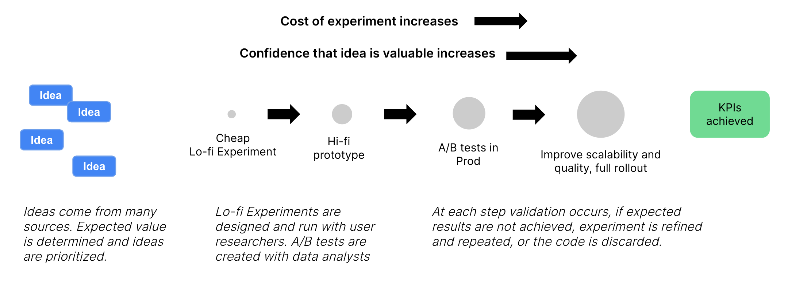

Etsy, an online marketplace for unique, handmade, and vintage items, has seen high growth over the last five years. Then the pandemic dramatically changed shoppers’ habits, leading to more consumers shopping online. As a result, the Etsy marketplace grew from 45.7 million buyers at the end of 2019 to 90.1 million buyers (97%) at the end of 2021 and from 2.5 to 5.3 million (112%) sellers in the same period.

Etsy 是一个独特的、手工制作的和复古物品的在线市场，有 在过去五年中实现了高速增长。 然后大流行急剧 改变了购物者的习惯，导致更多的消费者在线购物。 作为一个 结果，Etsy 市场从年底的 4570 万买家增长 2019 年到 2021 年底买家达到 9010 万 (97%)，从 2.5 增加到 5.3 百万 (112%) 卖家同期。

The growth massively increased demand on the technical platform, scaling traffic almost 3X overnight. And Etsy had signifcantly more customers for whom it needed to continue delivering great experiences. To keep up with that demand, they had to scale up infrastructure, product delivery, and talent drastically. While the growth challenged teams, the business was never bottlenecked. Etsy’s teams were able to deliver new and improved functionality, and the marketplace continued to provide a excellent customer experience. This article and the next form the story of Etsy’s scaling strategy.

增长极大地增加了对技术平台的需求，扩展 一夜之间流量几乎翻了 3 倍。 Etsy 的客户明显增多 它需要谁来继续提供出色的体验。 跟上 为了满足这种需求，他们必须扩大基础设施、产品交付和 人才大幅。 虽然增长对团队提出了挑战，但业务从未 瓶颈。 Etsy 的团队能够提供新的和改进的 功能，市场继续提供优秀的客户 经验。 这篇文章和下一篇文章构成了 Etsy 扩展策略的故事。

Etsy's foundational scaling work had started long before the pandemic. In 2017, Mike Fisher joined as CTO. Josh Silverman had recently joined as Etsy’s CEO, and was establishing institutional discipline to usher in a period of growth. Mike has a background in scaling high-growth companies, and along with Martin Abbott wrote several books on the topic, including [The Art of Scalability](https://www.amazon.com/gp/product/0134032802/ref=as_li_tl?ie=UTF8&camp=1789&creative=9325&creativeASIN=0134032802&linkCode=as2&tag=martinfowlerc-20) and [Scalability Rules](https://www.amazon.com/gp/product/013443160X/ref=as_li_tl?ie=UTF8&camp=1789&creative=9325&creativeASIN=013443160X&linkCode=as2&tag=martinfowlerc-20).

Etsy 的基础扩展工作早在大流行之前就开始了。 在 2017 年，Mike Fisher 加入，担任 CTO。 Josh Silverman 最近加入了 Etsy CEO，并正在建立制度纪律，迎来一段 生长。 Mike 拥有扩大高增长公司规模的背景，并且 与 Martin Abbott 一起写了几本关于这个主题的书，包括 [The Art of Scalability](https://www.amazon.com/gp/product/0134032802/ref=as_li_tl?ie=UTF8&camp=1789&creative=9325&creativeASIN=0134032802&linkCode=as2&tag=martinfowlerc-20) 和 [可扩展性规则](https://www.amazon.com/gp/product/013443160X/ref=as_li_tl?ie=UTF8&camp=1789&creative=9325&creativeASIN=013443160X&linkCode=as2&tag=martinfowlerc-20) 。

Etsy relied on physical hardware in two data centers, presenting several scaling challenges. With their expected growth, it was apparent that the costs would ramp up quickly. It affected product teams’ agility as they had to plan far in advance for capacity. In addition, the data centers were based in one state, which represented an availability risk. It was clear they needed to move onto the cloud quickly. After an assessment, Mike and his team chose the Google Cloud Platform (GCP) as the cloud partner and started to [plan a program to move their many systems onto the cloud](https://martinfowler.com/articles/bottlenecks-of-scaleups/etsy-cloud-scale.html).

Etsy 依靠两个数据中心的物理硬件，展示了几个 扩展挑战。 随着他们的预期增长，很明显 成本会迅速上升。 它影响了产品团队的敏捷性 提前计划容量。 此外，数据中心是 基于一个状态，这代表了可用性风险。 这很干净 他们需要快速迁移到云端。 经过评估，迈克和 他的团队选择了谷歌云平台 (GCP) 作为云合作伙伴，并且 开始 [计划一个计划来移动他们的 许多系统上云](https://martinfowler.com/articles/bottlenecks-of-scaleups/etsy-cloud-scale.html) 。

While the cloud migration was happening, Etsy was growing its business and its team. Mike identified the product delivery process as being another potential scaling bottleneck. The autonomy afforded to product teams had caused an issue: each team was delivering in different ways. Joining a team meant learning a new set of practices, which was problematic as Etsy was hiring many new people. In addition, they had noticed several product initiatives that did not pay off as expected. These indicators led leadership to re-evaluate the effectiveness of their product planning and delivery processes.

在进行云迁移的同时，Etsy 也在发展其业务，并且 它的团队。 Mike 将产品交付过程确定为另一个 潜在的扩展瓶颈。 赋予产品团队的自主权 引起了一个问题：每个团队都以不同的方式交付。 加入团队 意味着学习一套新的实践，这是有问题的，因为 Etsy 雇佣很多新人。 此外，他们还注意到了几种产品 没有像预期的那样得到回报的举措。 这些指标引领领导 重新评估其产品规划和交付的有效性 过程。

## Selecting a partner

## 选择合作伙伴

Etsy had never worked with a software development consultancy. To be able to scale product delivery and bring in some outside expertise, they started looking for a vendor. After an extensive search, they selected Thoughtworks, primarily because they perceived a close cultural fit and deep alignment regarding modern software development.

Etsy 从未与软件开发咨询公司合作过。 能够 为了扩大产品交付规模并引入一些外部专业知识，他们开始 寻找供应商。 经过广泛搜索后，他们选择了 Thoughtworks， 主要是因为他们感受到了紧密的文化契合度和深度一致性 关于现代软件开发。

Thoughtworks has a similar approach to Agile as Etsy – being Agile rather than doing Agile. Etsy's team was not looking to adopt a methodology that blindly follows strict rituals and practices, and wanted a partner that bases its approach on agile principles and culture. Thoughtworks is known for technical excellence and leadership in DevOps, Continuous Integration, and Continuous Delivery, all of which Etsy relies on heavily. In addition, the two companies shared similar principles regarding employee care, diversity, open-source, and technology sustainability.

Thoughtworks 与 Etsy 有类似的敏捷方法——敏捷 而不是做敏捷。 Etsy 的团队并不打算采用 盲目遵循严格的仪式和惯例的方法论，并希望 以敏捷原则和文化为基础的合作伙伴。 Thoughtworks 以卓越的技术和 DevOps 领域的领导地位而闻名， Etsy 所依赖的持续集成和持续交付 沉重地。 此外，两家公司有着相似的原则 关于员工关怀、多样性、开源和技术 可持续性。

The Thoughtworks team started by embedding into product teams, working with both buyer and seller teams, on various critical initiatives such as payment model changes, Search Engine Optimization (SEO), and a notification platform. This enabled Thoughtworks to understand how Etsy worked, created an immediate impact on delivery, and improved development practices such as automated testing.

Thoughtworks 团队首先融入产品团队，与 买卖双方团队，在各种关键举措上，如付款 模型更改、搜索引擎优化 (SEO) 和通知平台。 这使 Thoughtworks 能够了解 Etsy 的工作原理，立即创建 对交付的影响，以及改进的开发实践，例如自动化 测试。

For Thoughtworks, Etsy was quite different from the typical client. They are a fully digital company, and their technical process and product practises are very mature. Unlike most clients who engage Thoughtworks, Etsy had no large transformation to undertake, and no ingrained habits that needed a major shift. What they were seeking was outside perspective and supplementive skills, to help them incrementally improve and tackle their pressing initiatives. The culture and principles were already very aligned with Thoughtworks’ own, so the partnership became more of an exchange of ideas drawn from different experiences.

对于 Thoughtworks，Etsy 与典型的客户截然不同。 他们是一家完全数字化的公司，他们的技术流程和产品 做法非常成熟。 与大多数使用 Thoughtworks 的客户不同， Etsy 没有进行大的转型，也没有根深蒂固的习惯 这需要一个重大转变。 他们寻求的是外部视角 和补充技能，以帮助他们逐步改进和解决 他们的紧迫举措。 文化和原则已经很 与 Thoughtworks 自己的一致，因此合作关系变得更像是 交流从不同经验中得出的想法。

## Scaling Product Delivery and Discovery

## 扩展产品交付和发现

Thoughtworks and Etsy formed a cross-functional Product Delivery Culture (PDC) team to analyze the current product delivery process. They looked across the entire software development value stream and did a root cause analysis into the complaints of managers and team members.

Thoughtworks 和 Etsy 形成了跨职能的产品交付文化 (PDC) 团队分析当前的产品交付流程。 他们看着对面 整个软件开发价值流并做了根本原因分析 进入经理和团队成员的投诉。

Thoughtworks and Etsy formed a cross-functional Product Delivery Culture (PDC) team to analyze the current product delivery and discovery process. They analyzed the entire software development value stream, looking closely at the complaints of managers and team members. Selected events were replayed to gain a deep understanding of “how” it happened [rather than who?](https://www.kitchensoap.com/2014/11/14/the-infinite-hows-or-the-dangers-of-the-five-whys/). The Thoughtworks team, because they hadn’t lived through the problems, were able to bring an objective outsider perspective.

Thoughtworks 和 Etsy 组成了一个跨职能的 Product Delivery 文化 (PDC) 团队分析当前的产品交付和发现 过程。 他们分析了整个软件开发价值流， 密切关注经理和团队成员的投诉。 已选 事件被重播以获得对其“如何”发生的深刻理解 [而不是谁？](https://www.kitchensoap.com/2014/11/14/the-infinite-hows-or-the-dangers-of-the-five-whys/) . 思想工作坊 团队，因为他们没有经历过这些问题，所以能够带来 客观的局外人视角。

There were a number of things Etsy was doing really well:

Etsy 在很多方面做得非常好：

-   Cross-functional teams: They structured their teams around “4 table legs”: Product, Design, Engineering, and Analytics. All planning and delivery practices happen with collaboration among the groups.
-   跨职能团队：他们围绕“4 个桌腿”构建团队： 产品、设计、工程和分析。 所有计划和交付实践 通过小组之间的协作发生。
-   Incremental delivery of value to users: Continuous delivery is the core practice of their approach. A code change sitting in a repository and not deployed to users is not valuable, and effectively costs the company money. Etsy deploys hundreds of times a day, with a 30-minute commit to production lead time.
-   为用户增量交付价值：持续交付是核心 实践他们的方法。 代码更改位于存储库中，而不是 部署给用户的应用程序没有价值，实际上会浪费公司的钱。 易趣网 每天部署数百次，30 分钟投入生产领导 时间。
-   Features are prioritized using data: Product managers and data analysts collaborate to determine an expected value, measured by KPI changes. If the feature does not deliver enough value versus its cost, as evidenced by an A/B test, it is not rolled out, and the code is removed.
-   使用数据对功能进行优先排序：产品经理和数据分析师 协作确定预期值，通过 KPI 变化来衡量。 如果 正如 A/B 所证明的那样，该功能与其成本相比并没有提供足够的价值 测试，没有推出，去掉代码。

The team also uncovered opportunities for improvement:

该团队还发现了改进的机会：

-   Each team was doing delivery in different ways, having disparate processes and rituals, making onboarding new employees and changing teams difficult. Some teams were using a process like Scrum, while others did not use any formal process.
-   每个团队都以不同的方式进行交付，具有不同的流程 和仪式，使新员工入职和更换团队变得困难。 一些 团队正在使用像 Scrum 这样的流程，而其他团队则没有使用任何正式的流程 过程。
-   There were a number of initiatives that had not created value as they expected. For example, Etsy tried a gift wrap feature that had lower than expected adoption rates by sellers and buyers.
-   有许多举措没有创造价值，因为 他们期望。 例如，Etsy 尝试了一项礼品包装功能 买卖双方的采用率低于预期。
-   Prior to 2018, Etsy had been through a transitional period, with pivots in product strategy and leadership changes leading some product managers to expres a desire for greater ownership over their product decisions.
-   2018 年之前，Etsy 经历了一个过渡期， 主导产品战略和领导层变革的关键 经理表达了对其产品拥有更多所有权的愿望 决定。

## Time to learning

## 学习时间

The team created an improvement program, based on lean thinking and the ideas of Marty Cagan, who had recently presented at Etsy. The leadership team was reading his book Inspired.

该团队基于精益思想和 最近在 Etsy 上展示的 Marty Cagan 的想法。 领导班子是 读他的书启发。

> I promise you that at least half the ideas on your roadmap are not going to deliver what you hope. (By the way, the really good teams assume that at least three quarters of the ideas won’t perform like they hope.)
> 
> 我向你保证，至少有一半的想法 在您的路线图上，不会实现您的希望。 （顺便说一句， 真正优秀的团队认为至少四分之三的想法不会 像他们希望的那样表现。）
> 
> \-- [Marty Cagan, Inspired (p19)](https://www.amazon.com/gp/product/0981690408/ref=as_li_tl?ie=UTF8&camp=1789&creative=9325&creativeASIN=0981690408&linkCode=as2&tag=martinfowlerc-20)
> 
> —— [马蒂·凯根，受启发（第 19 页）](https://www.amazon.com/gp/product/0981690408/ref=as_li_tl?ie=UTF8&camp=1789&creative=9325&creativeASIN=0981690408&linkCode=as2&tag=martinfowlerc-20)

After some initial research the team came up with a metric they called Time to Learning – the time it took for a product team to validate an idea with a customer and gain a better understanding of its value. They had a baseline of 50 days that they wanted to reduce.

经过一些初步研究，团队提出了一个他们称之为时间的指标 到学习——产品团队用 客户并更好地了解其价值。 他们的基线是 他们想减少 50 天。

They were also looking at other metrics.

他们还在研究其他指标。

-   Improving the time to market
-   缩短上市时间
-   Improving the effectiveness of products (e.g. revenue, customer engagement)
-   提高产品的有效性（例如收入、客户 订婚）
-   Employee happiness
-   员工幸福

To impact the KPIs, they came up with a number of solution hypotheses:

为了影响 KPI，他们提出了一些解决方案假设：

## Light-weight prototypes that incorporate more direct user research

## 包含更多直接用户研究的轻量级原型

Etsy has strong experimentation infrastructure and analytics capabilities. They run many concurrent A/B tests on the marketplace. The problem the PDC team observed is that the feedback cycle can be quite slow. For an idea to be ready for an A/B test it had to be near production-level quality. It also had to have enough data to show statistical relevance. A/B tests would run for months in lesser-used parts of the marketplace.

Etsy 拥有强大的实验基础设施和分析能力。 他们在市场上运行许多并发的 A/B 测试。 PDC的问题 团队观察到反馈周期可能非常缓慢。 为了一个想法 准备好进行 A/B 测试，它必须接近生产级质量。 它也有 有足够的数据来显示统计相关性。 A/B 测试将运行 几个月在市场上较少使用的部分。

> To set your expectations, strong teams normally test many product ideas each week—on the order of 10 to 20 or more per week. I want to emphasize that these are experiments, typically run using prototypes. A prototype is not something that’s ready for prime time and certainly not something your company would try to sell and stand behind. But they’re immensely useful, as they’re all about learning fast and cheap.
> 
> 为了设定你的期望，强大的团队通常 每周测试许多产品创意——大约每周 10 到 20 个或更多。 我 想强调这些是实验，通常使用原型运行。 原型不是为黄金时段做好准备的东西，当然也不是 贵公司会尝试出售并支持的东西。 但他们是 非常有用，因为它们都是关于快速和便宜的学习。
> 
> \-- [Marty Cagan, Inspired (p27)](https://www.amazon.com/gp/product/0981690408/ref=as_li_tl?ie=UTF8&camp=1789&creative=9325&creativeASIN=0981690408&linkCode=as2&tag=martinfowlerc-20)
> 
> —— [马蒂·凯根，受启发（第 27 页）](https://www.amazon.com/gp/product/0981690408/ref=as_li_tl?ie=UTF8&camp=1789&creative=9325&creativeASIN=0981690408&linkCode=as2&tag=martinfowlerc-20)

To reduce the Time to Learning metric, the PDC team applied a lean UX approach. First, they started by quickly creating lo-fi prototypes and immediately showing them to users. Second, the team increased user feedback sessions to every two weeks and reduced the level of ceremony. Third, they created a dual-track system, with a design and research team continually working ahead of a delivery team. The idea was to efficiently gain confidence in an idea before it qualifies for an A/B test. By reducing the cost of experimentation, they could increase the variety and quantity of experiments, finding ideas that showed more value.

为了减少学习时间指标，PDC 团队应用了精益 UX 方法。 首先，他们首先快速创建低保真原型，然后 立即将它们展示给用户。 二、团队增加用户反馈 每两周举行一次会议，并减少仪式级别。 第三，他们 开创了双轨制，设计研发团队不断 在交付团队之前工作。 这个想法是为了有效地获得信心 在一个想法有资格进行 A/B 测试之前。 通过降低成本 实验，他们可以增加实验的种类和数量， 找到显示出更多价值的想法。

Figure 1: Experiment validation process

图 1：实验验证过程

We're releasing this article in two installments. The second installment will discuss the role of lean portfolio management, stronger product and engineering collaboration, and assess the impact of a product delivery culture.

我们分两期发布这篇文章。 第二期 将讨论精益投资组合管理、更强大的产品和 工程协作，并评估产品交付文化的影响。

To find out when we publish the next installment subscribe to the site's [RSS feed](https://martinfowler.com/feed.atom), Martin's [twitter stream](https://twitter.com/martinfowler), or Martin's [Mastodon feed](https://toot.thoughtworks.com/@mfowler).

要了解我们何时发布下一期，请订阅 网站的 [RSS 提要](https://martinfowler.com/feed.atom) ，马丁的 [推特流](https://twitter.com/martinfowler) ，或 马丁的 [乳齿象饲料](https://toot.thoughtworks.com/@mfowler) 。

___
