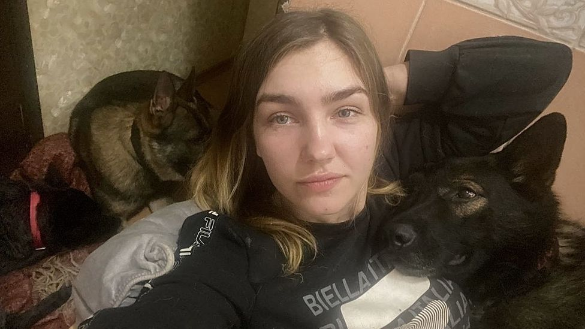
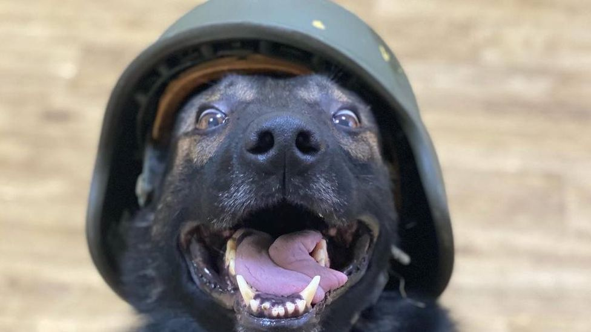
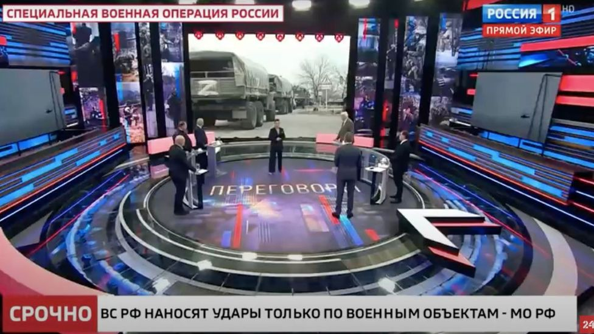
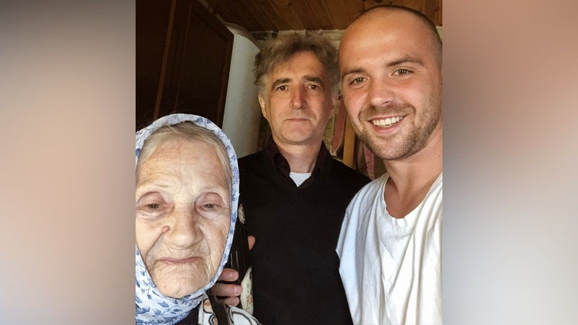
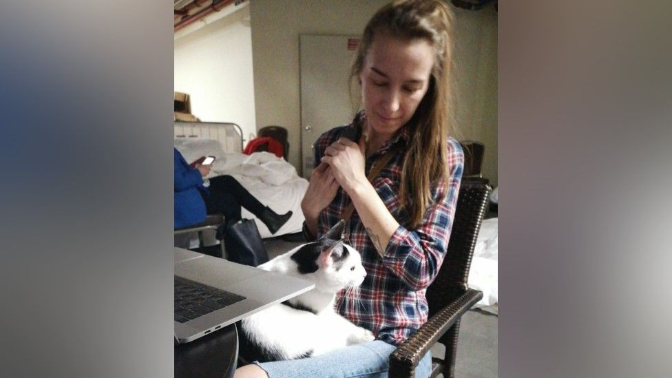

## 乌克兰战争：“我的城市遭到炮击，但妈妈不相信我”

Image source, Oleksandra

Image caption,

Oleksandra says her mother repeats the narratives of what she hears on Russian state TV

**Oleksandra and her four rescue dogs have been sheltering in the bathroom of her flat in Kharkiv since the shelling began.**

**自炮击开始以来，Oleksandra 和她的四只搜救犬一直躲在她位于哈尔科夫的公寓的浴室里。**

"When I heard the first explosions, I ran out of the house to get my dogs from their enclosures outside. People were panicking, abandoning their cars. I was so scared," she says.

“当我听到第一声爆炸声时，我跑出房子，把我的狗从外面的笼子里抱出来。人们惊慌失措，放弃了他们的汽车。我非常害怕，”她说。

The 25-year-old has been speaking regularly to her mother, who lives in Moscow. But in these conversations, and even after sending videos from her heavily bombarded hometown, Oleksandra is unable to convince her mother about the danger she is in.

这位 25 岁的女孩一直定期与住在莫斯科的母亲通话。 但在这些谈话中，甚至在从她遭受重创的家乡发送视频后，Oleksandra 也无法让她的母亲相信她所处的危险。

"I didn't want to scare my parents, but I started telling them directly that civilians and children are dying," she says.

“我不想吓唬我的父母，但我开始直接告诉他们平民和儿童正在死去，”她说。

"But even though they worry about me, they still say it probably happens only by accident, that the Russian army would never target civilians. That it's Ukrainians who're killing their own people."

“但即使他们担心我，他们仍然说这可能只是偶然发生的，俄罗斯军队永远不会以平民为目标。是乌克兰人在杀害他们自己的人民。”

It's common for Ukrainians to have family across the border in Russia. But for some, like Oleksandra, their Russian relatives have a contrasting understanding of the conflict. She believes it's down to the stories they are told by the tightly-controlled Russian media.

乌克兰人在俄罗斯边境有家人是很常见的。 但对于像奥列克桑德拉这样的一些人来说，他们的俄罗斯亲戚对这场冲突有着截然不同的理解。 她认为这取决于严格控制的俄罗斯媒体向他们讲述的故事。

Image source, Oleksandra

Image caption,

Oleksandra's dogs have been a source of support during the bombing

Oleksandra says her mother just repeats the narratives of what she hears on Russian state TV channels.

Oleksandra 说她的母亲只是重复她在俄罗斯国家电视频道上听到的故事。

"It really scared me when my mum exactly quoted Russian TV. They are just brainwashing people. And people trust them," says Oleksandra.

“当我妈妈完全引用俄罗斯电视时，我真的很害怕。他们只是在给人们洗脑。人们信任他们，”Oleksandra 说。

"My parents understand that some military action is happening here. But they say: 'Russians came to liberate you. They won't ruin anything, they won't touch you. They're only targeting military bases'."

“我的父母知道这里正在发生一些军事行动。但他们说：‘俄罗斯人是来解放你的。他们不会破坏任何东西，他们不会碰你。他们只针对军事基地’。”

While we were interviewing Oleksandra, the shelling went on. The internet connection was weak, so we had to exchange voice messages.

在我们采访 Oleksandra 时，炮击还在继续。 互联网连接很弱，所以我们不得不交换语音信息。

"I've almost forgotten what silence sounds like. They're shelling non-stop," she said.

“我几乎忘记了寂静是什么样子的。他们不停地炮击，”她说。

But on Russian state TV channels on the same day, there was no mention of the missiles striking Kharkiv's residential districts, of civilian deaths, or of four people killed while queuing for water.

但在同一天的俄罗斯国家电视台上，没有提到导弹袭击哈尔科夫居民区、平民死亡或四人在排队取水时遇难的消息。

Image source, Channel Rossiya 1

Image caption,

State TV channel Rossiya 1 refers to the war as a "special operation"

Russian media say the threat to Ukrainian civilians doesn't come from the Russian armed forces, it comes from Ukrainian nationalists using civilians as human shields.

俄罗斯媒体称，对乌克兰平民的威胁并非来自俄罗斯武装部队，而是来自以平民为人盾的乌克兰民族主义者。

Russian state TV channels justify the war by blaming Ukrainian aggression, and continue to call it "a special operation of liberation". Any Russian outlet using the words "war", "invasion" or "attack" faces being blocked by the country's media regulator for spreading "deliberately false information about the actions of Russian military personnel" in Ukraine.

俄罗斯国家电视台通过指责乌克兰的侵略来为这场战争辩护，并继续称其为“解放的特殊行动”。 任何使用“战争”、“入侵”或“攻击”等字眼的俄罗斯媒体都将面临被该国媒体监管机构封锁的风险，因为它们会在乌克兰传播“关于俄罗斯军事人员行动的故意虚假信息”。

And now a new law has passed through the Russian Parliament that means people who spread "fake" information about Russia's military forces could be jailed for up to 15 years.

现在俄罗斯议会通过了一项新法律，这意味着散布有关俄罗斯军队的“虚假”信息的人可能会被判处最高 15 年的监禁。

Some Russians have taken to the streets to protest against the war - but these demonstrations were not shown on the main state television channels.

一些俄罗斯人走上街头抗议战争——但这些示威活动并未在主要的国家电视频道上播出。

Mykhailo, a well-known Kyiv restaurateur, didn't have the time or inclination to watch Russian TV coverage of the invasion.

Mykhailo 是基辅著名的餐馆老板，他没有时间也没有兴趣观看俄罗斯电视台对入侵的报道。

When shelling of Ukraine's capital started, he and his wife were concentrating on how to protect their six-year-old daughter and baby son.

当乌克兰首都开始炮击时，他和妻子正在集中精力保护他们 6 岁的女儿和刚出生的儿子。

Image source, Mykhailo

Image caption,

Mykhailo with his father before the war

At night their children woke up at the sound of explosions and couldn't stop crying. The family made the decision to move to the outskirts of Kyiv and then flee abroad.

晚上，他们的孩子被爆炸声惊醒，哭个不停。 一家人决定搬到基辅郊区，然后逃往国外。

They travelled to Hungary, where Mykhailo left his wife and children and came back to Western Ukraine to help the war effort.

他们前往匈牙利，Mykhailo 在那里离开了他的妻子和孩子，回到乌克兰西部帮助战争。

He was surprised not to have heard from his father, who works at a monastery near Nizhny Novgorod in Russia. He called his father and described what was happening. His father replied that this wasn't true; there was no war and - in fact - Russians were saving Ukraine from Nazis.

父亲在俄罗斯下诺夫哥罗德附近的一座修道院工作，他没有收到父亲的消息，这让他很惊讶。 他打电话给他的父亲并描述了发生的事情。 他的父亲回答说这不是真的。 没有战争——事实上——俄罗斯人正在从纳粹手中拯救乌克兰。

Mykhailo said he felt he knew the power of Russian propaganda, but when he heard it from his father, he was devastated.

Mykhailo 说他觉得他知道俄罗斯宣传的力量，但当他从父亲那里听到这件事时，他感到非常震惊。

## Russia attacks Ukraine: More coverage

## 俄罗斯袭击乌克兰：更多报道

"My own father does not believe me, knowing that I'm here and see everything with my own eyes. And my mum, his ex-wife, is going through this too," he says.

“我自己的父亲不相信我，他知道我在这里并且亲眼看到了一切。我的妈妈，他的前妻，也在经历着这一切，”他说。

"She is hiding with my grandmother in the bathroom, because of the bombardment."

"She is hiding with my grandmother in the bathroom, because of the bombardment."

Russian media has been tightly controlled for many years and viewers are given an uncritical view of Russia and its actions around the world.

Russian media has been tightly controlled for many years and viewers are given an uncritical view of Russia and its actions around the world.

"The state narrative only ever shows Russia as the good guy." says Dr Joanna Szostek, an expert in Russia and political communications at University of Glasgow.

"The state narrative only ever shows Russia as the good guy." says Dr Joanna Szostek, an expert in Russia and political communications at University of Glasgow.

"Even the tales they tell about World War Two, the Great Patriotic War, Russia has never really done anything wrong. And this is why they won't believe it now."

"Even the tales they tell about World War Two, the Great Patriotic War, Russia has never really done anything wrong. And this is why they won't believe it now."

Most Russians, she says, don't look for other points of view. She believes the one-sided narrative that is highly critical of the West helps explain why Russians can have opposing views to their relatives in neighbouring countries.

Most Russians, she says, don't look for other points of view. She believes the one-sided narrative that is highly critical of the West helps explain why Russians can have opposing views to their relatives in neighbouring countries.

"People who criticise Russia have for so long been presented as traitors or foreign agents; critics are all foreign agents working for the West. So you don't even believe your own daughter."

"People who criticise Russia have for so long been presented as traitors or foreign agents; critics are all foreign agents working for the West. So you don't even believe your own daughter."

Anastasiya's parents live in a small village 20km (12 miles) away from the rebel-held Donetsk People's Republic. The village is still under the control of Kyiv authorities, but Russian state TV channels are always on in their house. They even have the clock set to Moscow time - a throwback to the Soviet past.

Anastasiya's parents live in a small village 20km (12 miles) away from the rebel-held Donetsk People's Republic. The village is still under the control of Kyiv authorities, but Russian state TV channels are always on in their house. They even have the clock set to Moscow time - a throwback to the Soviet past.

So when on 24 February, Anastasiya woke up in Kyiv to the sound of sirens, she knew how her parents would react.

So when on 24 February, Anastasiya woke up in Kyiv to the sound of sirens, she knew how her parents would react.

'My mum was the first person I called when I jumped out of bed at five, disoriented. She was surprised I called and sounded really calm, almost casual," she says.

'My mum was the first person I called when I jumped out of bed at five, disoriented. She was surprised I called and sounded really calm, almost casual," she says.

Anastasiya, a BBC Ukrainian correspondent who moved to Kyiv 10 years ago, heard bombs exploding after waking and was worried about where would be hit next.

Anastasiya, a BBC Ukrainian correspondent who moved to Kyiv 10 years ago, heard bombs exploding after waking and was worried about where would be hit next.

Image source, Anastasiya

Image caption,

Anastasiya - and her cat - have left home

"I called my mum again. I told her I was scared. 'Don't worry', she said, reassuringly. 'They \[Russia\] will never bomb Kyiv'."

"I called my mum again. I told her I was scared. 'Don't worry', she said, reassuringly. 'They \[Russia\] will never bomb Kyiv'."

But they are already doing it, Anastasiya replied.

But they are already doing it, Anastasiya replied.

"I told her there were casualties among civilians. 'But that's what we had too when Ukraine attacked Donbas!', she said, laughing. For a moment I couldn't breathe. Hearing my mum say this with such cruelty just broke my heart."

"I told her there were casualties among civilians. 'But that's what we had too when Ukraine attacked Donbas!', she said, laughing. For a moment I couldn't breathe. Hearing my mum say this with such cruelty just broke my heart."

Anastasiya believes the image Russian media has created is one of the "glorified Russian army" ridding Ukraine from Nazis. For years she avoided political arguments with her parents, but this time she slammed the phone down on her mum.

Anastasiya believes the image Russian media has created is one of the "glorified Russian army" ridding Ukraine from Nazis. For years she avoided political arguments with her parents, but this time she slammed the phone down on her mum.

We spoke to Anastasiya when she was travelling away from Kyiv after four nights in a bomb shelter. Her mind was on an uncertain future.

We spoke to Anastasiya when she was travelling away from Kyiv after four nights in a bomb shelter. Her mind was on an uncertain future.

"There are a lot of thoughts in my head now. What will happen to us all? Where is this going? Will I ever come back? Will I ever see my parents again? I still love them deeply, but something inside me has broken and I don't think it can ever be fixed."

"There are a lot of thoughts in my head now. What will happen to us all? Where is this going? Will I ever come back? Will I ever see my parents again? I still love them deeply, but something inside me has broken and I don't think it can ever be fixed."

## More on this story

## More on this story
