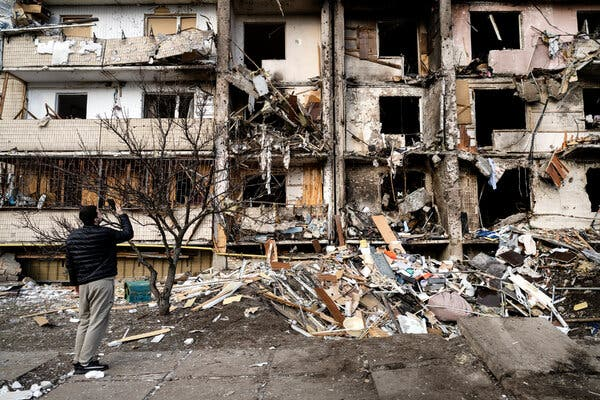
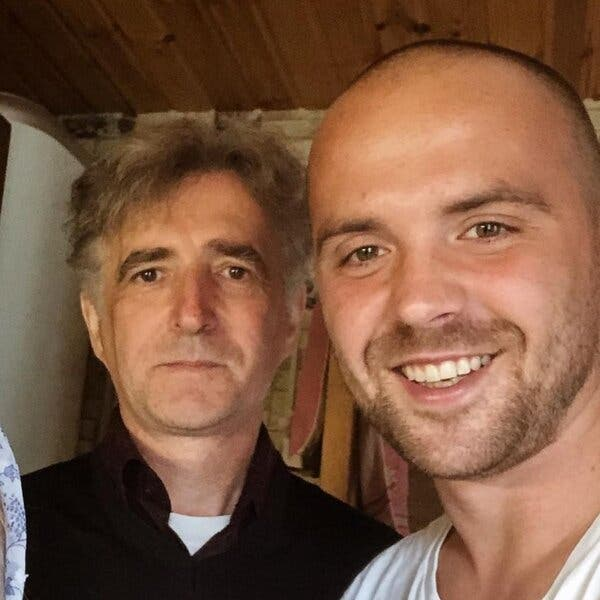
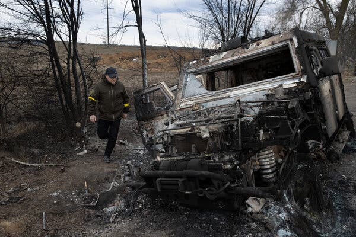
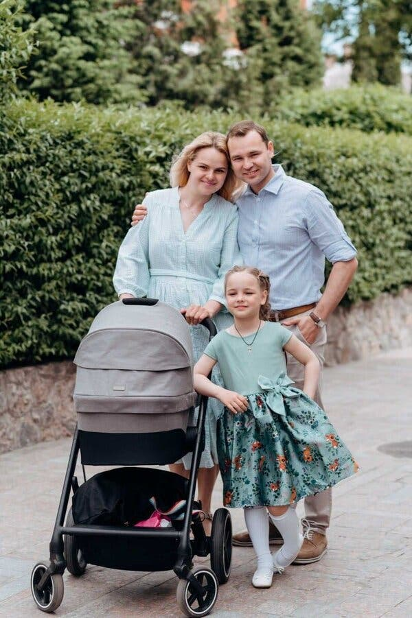
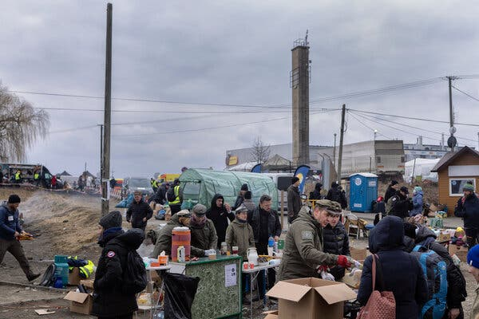

## 乌克兰人发现在俄罗斯的亲戚不相信这是一场战争

Many Ukrainians are encountering a confounding and frustrating backlash from family members in Russia who have bought into the official Kremlin messaging.

Credit...Lynsey Addario for The New York Times

LVIV, Ukraine — Four days after Russia began dropping artillery shells on Kyiv, Misha Katsurin, a Ukrainian restaurateur, was wondering why his father, a church custodian living in the Russian city of Nizhny Novgorod, hadn’t called to check on him.

乌克兰利沃夫——在俄罗斯开始向基辅投掷炮弹四天后，乌克兰餐馆老板米沙·卡苏林 (Misha Katsurin) 想知道为什么他的父亲，一位住在俄罗斯下诺夫哥罗德市的教堂管理员，没有打电话来看望他。

“There is a war, I’m his son, and he just doesn’t call,” Mr. Katsurin, who is 33, said in an interview. So, Mr. Katsurin picked up the phone and let his father know that Ukraine was under attack by Russia.

“有一场战争，我是他的儿子，他就是不打电话，”33 岁的胜林先生在接受采访时说。 于是，Katsurin 先生拿起电话，让父亲知道了乌克兰遭到俄罗斯袭击的消息。

“I’m trying to evacuate my children and my wife — everything is extremely scary,” Mr. Katsurin told him.

“我正试图疏散我的孩子和妻子——一切都非常可怕，”Katsurin 先生告诉他。

He did not get the response he expected. His father, Andrei, didn’t believe him.

他没有得到预期的回应。 他的父亲安德烈不相信他。

“No, no, no, no stop,” Mr. Katsurin said of his father’s initial response.

“不，不，不，不停，”Katsurin 先生谈到他父亲最初的反应时说。

Image

Credit...Misha Katsiurin

“He started to tell me how the things in _my_ country are going,” said Mr. Katsurin, who converted his restaurants into volunteer centers and is temporarily staying near the western Ukrainian city of Ternopil. “He started to yell at me and told me, ‘Look, everything is going like this. They are Nazis.’”

“他开始告诉我我国的情况如何 _，_ ”Katsurin 先生说，他将自己的餐馆改造成志愿者中心，目前暂时住在乌克兰西部城市捷尔诺波尔附近。 “他开始对我大吼大叫，并告诉我，‘看，一切都是这样的。 他们是纳粹分子。'”

As Ukrainians deal with the devastation of [the Russian attacks in their homeland](https://www.nytimes.com/news-event/ukraine-russia), many are also encountering a confounding and almost surreal backlash from family members in Russia, who refuse to believe that Russian soldiers could bomb innocent people, or even that a war is taking place at all.

应对俄罗斯袭击造成的破坏时 [当乌克兰人在他们的祖国](https://www.nytimes.com/news-event/ukraine-russia) ，许多人还遇到了来自俄罗斯家庭成员的令人困惑和近乎超现实的强烈反对，他们拒绝相信俄罗斯士兵会轰炸无辜的人，甚至拒绝相信一场战争正在发生根本。

These relatives have essentially bought into the official Kremlin position: that President [Vladimir V. Putin](https://www.nytimes.com/topic/person/vladimir-putin)’s army is conducting a limited “special military operation” with the honorable mission of “de-Nazifying” Ukraine. Mr. Putin has referred to the Ukrainian president, Volodymyr Zelensky, a native Russian speaker with a Jewish background, as a “drug-addled Nazi” in his attempts to justify the invasion.

这些亲属基本上接受了克里姆林宫的官方立场： [弗拉基米尔·V·普京总统](https://www.nytimes.com/topic/person/vladimir-putin) 的军队正在进行有限的“特殊军事行动”，其光荣使命是“去纳粹化”乌克兰。 普京先生在试图为入侵辩护时将乌克兰总统沃洛德米尔·泽伦斯基称为“吸毒成瘾的纳粹”，他是一位母语为俄语且有犹太背景的人。

Those narratives are emerging amid a wave of disinformation emanating from the Russian state as the Kremlin moves to clamp down on independent news reporting while shaping the messages most Russians are receiving.

随着克里姆林宫采取行动打压独立新闻报道，同时塑造大多数俄罗斯人正在接收的信息，这些叙述是在俄罗斯政府发出的一波虚假信息浪潮中出现的。

An estimated 11 million people in Russia have Ukrainian relatives. Many Ukrainian citizens are ethnic Russians, and those living in the southern and eastern parts of the country largely speak Russian as their native language.

据估计，俄罗斯有 1100 万人有乌克兰亲属。 许多乌克兰公民是俄罗斯人，居住在该国南部和东部的人大多以俄语为母语。

Russian television channels do not show the bombardment of Kyiv, Ukraine’s capital, and its suburbs, or the devastating attacks on Kharkiv, Mariupol, Chernihiv and other Ukrainian cities. They also do not show the peaceful resistance evident [in places like Kherson](https://www.nytimes.com/2022/03/05/world/europe/kherson-protests-ukraine.html), a major city in the south that Russian troops captured several days ago, and certainly not the protests against the war that have cropped up across Russia.

俄罗斯电视频道没有报道对乌克兰首都基辅及其郊区的轰炸，也没有报道对哈尔科夫、马里乌波尔、切尔尼戈夫和其他乌克兰城市的毁灭性袭击。 他们也没有表现出 [赫尔松等地明显的和平抵抗，当然也没有出现在俄罗斯各地出现的反对战争的抗议活动。](https://www.nytimes.com/2022/03/05/world/europe/kherson-protests-ukraine.html) 在几天前被俄罗斯军队攻占的南部主要城市

Instead they focus on the Russian military’s successes, without discussing the casualties among Russian soldiers. Many state television correspondents are embedded in eastern Ukraine, and not in the cities being pummeled by missiles and mortars. [Recent news reports](https://www.bbc.com/news/world-europe-60571737) made no mention of the [40-mile-long Russian convoy](https://www.nytimes.com/2022/03/01/world/europe/russian-convoy-ukraine.html) on a roadway north of Kyiv.

相反，他们专注于俄罗斯军队的成功，而没有讨论俄罗斯士兵的伤亡情况。 许多国家电视台记者驻扎在乌克兰东部，而不是在被导弹和迫击炮袭击的城市。 [最近的新闻报道](https://www.bbc.com/news/world-europe-60571737) 没有提到 [长达 40 英里的俄罗斯车队。](https://www.nytimes.com/2022/03/01/world/europe/russian-convoy-ukraine.html) 基辅以北一条公路上

On Friday, Russia also banned Facebook and Twitter to try to stem uncontrolled information.

周五，俄罗斯还禁止 Facebook 和 Twitter 试图阻止不受控制的信息。

All this, Mr. Katsurin said, explains why his father told him: “There are Russian soldiers there helping people. They give them warm clothes and food.”

Katsurin 先生说，这一切解释了为什么他的父亲告诉他：“那里有俄罗斯士兵在帮助人们。 他们给他们暖和的衣服和食物。”

Image

Credit...Tyler Hicks/The New York Times

Mr. Katsurin is not alone in his frustration. When Valentyna V. Kremyr wrote to her brother and sister in Russia to tell them that her son had spent days in a bomb shelter in the Kyiv suburb of Bucha because of the [intensive fighting there](https://www.nytimes.com/live/2022/03/01/world/ukraine-russia-war), she was also met with disbelief.

感到沮丧的并不只有 Katsurin 先生。 而在基辅郊区布哈的一个防空洞里呆了几天 [当瓦伦蒂娜·V·克雷米尔 (Valentyna V. Kremyr) 写信给她在俄罗斯的兄弟姐妹，告诉他们她的儿子因为那里的激烈战斗](https://www.nytimes.com/live/2022/03/01/world/ukraine-russia-war) ，她也感到难以置信。

“They believe that everything is calm in Kyiv, that no one is shelling Kyiv,” Ms. Kremyr said in a phone interview. She said her siblings think the Russians are striking military infrastructure “with precision, and that’s it.”

“他们认为基辅一切都很平静，没有人炮击基辅，”克雷米尔女士在接受电话采访时说。 她说她的兄弟姐妹认为俄罗斯人正在“精确地”打击军事基础设施，仅此而已。

She said her sister Lyubov, who lives in Perm, wished her a happy birthday on Feb. 25, the second day of the invasion. When Ms. Kremyr wrote back about the situation on the ground, her sister’s answer via direct message was simple: “No one is bombing Kyiv, and you should actually be afraid of the Nazis, whom your father fought against. Your children will be alive and healthy. We love the Ukrainian people, but you need to think hard about who you elected as president.”

她说，住在彼尔姆的姐姐柳博芙 (Lyubov) 祝她 2 月 25 日生日快乐，那是入侵的第二天。 当克雷米尔女士回信说当地的情况时，她姐姐通过直接消息的回答很简单：“没有人在轰炸基辅，你实际上应该害怕你父亲反对的纳粹分子。 你的孩子会健康地活着。 我们爱乌克兰人民，但你需要认真考虑一下你选了谁当总统。”

Ms. Kremyr said she sent photos from trusted media sites of mangled tanks and a destroyed building in Bucha to her brother, in Krasnoyarsk, but was met with a jarring response. “He said that this site is fake news,” she said, and that essentially the Ukrainian Army was doing the damage being blamed on Russians.

克雷米尔女士说，她将来自可信媒体网站的照片发送给了她在克拉斯诺亚尔斯克的哥哥，照片中的坦克和一座被毁的建筑在布哈被毁坏，但得到了不和谐的回应。 “他说这个网站是假新闻，”她说，而且基本上是乌克兰军队造成的损害被归咎于俄罗斯人。

“It is impossible to convince them of what they have done,” Ms. Kremyr said, referring to Russian forces.

“不可能让他们相信他们的所作所为，”克雷米尔女士说，她指的是俄罗斯军队。

Anastasia Belomytseva and her husband, Vladimir, have been encountering the same problem. They are residents of Kharkiv, in Ukraine’s north near the Russian border, which has been hit hard by Russian bombs. But they said in an interview that it was easier to explain the invasion to their 7-year-old daughter than to some of their relatives.

Anastasia Belomytseva 和她的丈夫 Vladimir 一直遇到同样的问题。 他们是哈尔科夫市的居民，哈尔科夫市位于乌克兰北部靠近俄罗斯边境的地方，那里曾受到俄罗斯炸弹的重创。 但他们在接受采访时表示，向他们 7 岁的女儿解释这次入侵比向他们的一些亲戚解释要容易得多。

Image

Credit...Anastasia Belomytseva

“They totally don’t understand what is happening here, they don’t understand that they just attacked us for no reason,” Ms. Belomytseva said. Her grandmother, and Mr. Belomytsev’s father, are in Russia.

“他们完全不明白这里发生了什么，他们不明白他们只是无缘无故地袭击了我们，”Belomytseva 女士说。 她的祖母和 Belomytsev 先生的父亲都在俄罗斯。

Asked whether they believe that an attack is happening, Ms. Belomytseva responded “NO!”

当被问及他们是否相信袭击正在发生时，Belomytseva 女士回答说“不！”

Parts of Kharkiv have been reduced to rubble, and its city hall is a burnt-out shell. Ms. Belomytseva said she was sending videos of the bombings to her relatives on Instagram, but they just responded with the Kremlin’s oft-repeated claims that the invasion is just a “special military operation” and that no civilians would be targeted.

哈尔科夫的部分地区已化为废墟，其市政厅已成为烧毁的空壳。 Belomytseva 女士说，她正在 Instagram 上向她的亲属发送爆炸视频，但他们只是回应克里姆林宫一再重申的入侵只是一次“特殊军事行动”，不会以平民为目标。

In reality, more than 350 civilians had died as of Saturday night, according to the United Nations. The real toll is probably much higher.

据联合国称，实际上，截至周六晚上，已有 350 多名平民死亡。 真正的损失可能要高得多。

For Svetlana, a 60-year-old woman living in Cherkasy, the hardest thing to accept is the advice she has received from her sister, who lives in Belarus, and her cousins in Tomsk, Russia: that she and other Ukrainians should not concern themselves with what is going on.

对于居住在切尔卡瑟的 60 岁妇女斯韦特兰娜来说，最难以接受的是她从住在白俄罗斯的姐姐和住在俄罗斯托木斯克的表亲那里得到的建议：她和其他乌克兰人不应该担心自己与正在发生的事情。

“It’s not that they don’t believe it is happening, but they think that the high-level politicians should figure it out,” said Svetlana, who was uncomfortable providing her last name.

“并不是他们不相信它正在发生，而是他们认为高层政治家应该弄清楚，”斯韦特兰娜说，她不愿透露自己的姓氏。

“I tell them that we are people too, and this has affected us,” she said. “I asked them not to hide their heads in the sand, I asked the mothers to think about not sending their sons to the army. The response was amazing to me. That is, that politicians are to blame for everything.”

“我告诉他们我们也是人，这影响了我们，”她说。 “我让他们不要把头藏在沙子里，我让妈妈们考虑一下不送儿子去当兵。 反应令我惊讶。 也就是说，政治家应该为一切负责。”

She displayed a WhatsApp exchange with her cousin showing that her cousin had also been swayed by a narrative being pushed by Russian state TV: that the West fomented this war, was thrilled to see two “brotherly nations” fighting each other and was expecting to reap a significant profit from it.

她展示了与她堂兄的 WhatsApp 交流，显示她的堂兄也被俄罗斯国家电视台推动的叙述所左右：西方煽动了这场战争，很高兴看到两个“兄弟国家”互相争斗并期待收获从中获得可观的利润。

Her cousin sent a string of messages asserting that Western defense companies were raising their profits, and that alternate sources of energy were being procured for the West.

她的堂兄发来一连串信息，声称西方国防公司正在提高利润，并且正在为西方采购替代能源。

It was not the response she had hoped for — no recognition of the gravity of the situation for Ukrainians or sympathy for the loss of human life.

这不是她所希望的回应——没有意识到乌克兰局势的严重性，也没有对生命损失表示同情。

Image

Credit...Maciek Nabrdalik for The New York Times

“Every day I send them the necessary information, but the response is that ‘This is some kind of fake information, that this cannot be the case at all, that no one can or will shoot at civilians,’” she said.

“我每天都向他们发送必要的信息，但他们的反应是‘这是某种虚假信息，根本不可能是这样，没有人可以也不会向平民开枪，’”她说。

Ms. Belomytseva, from Kharkiv, said that while her husband was still trying to communicate with his family in Russia, she had cut off most of her relatives there eight years ago, after the annexation of Crimea and the invasion of eastern Ukraine.

来自哈尔科夫的 Belomytseva 女士说，虽然她的丈夫仍在努力与他在俄罗斯的家人联系，但八年前，在克里米亚被吞并和乌克兰东部遭到入侵之后，她已经与那里的大部分亲戚断绝了联系。

But Mr. Katsurin said he could not push his closest family members out of his life.

但 Katsurin 先生说，他无法将最亲密的家人赶出自己的生活。

“They are our relatives, they’re the closest people we have, and this is not about them,” he said. “I am not angry at my father — I am angry at the Kremlin. I’m angry about the Russian propaganda. I’m not angry at these people. I understand that I cannot blame them in this situation.”

“他们是我们的亲戚，他们是我们最亲近的人，这与他们无关，”他说。 “我不是生我父亲的气——我是生克里姆林宫的气。 我对俄罗斯的宣传感到愤怒。 我不生这些人的气。 我明白在这种情况下我不能责怪他们。”

He said he thought about cutting his father off but decided that was the wrong response. “The easiest thing to do would be to say, ‘OK, now I don’t have a father,’” he said. “But I believe that I need to do this _because_ it is my father.”

他说他考虑过切断他父亲的联系，但认为这是错误的回应。 “最简单的做法就是说，'好吧，现在我没有父亲了，'”他说。 “但我相信我需要这样做， _因为_ 这是我的父亲。”

He said that if everyone worked to explain the truth to their families, the narrative could change. After a post on Instagram complaining about his father’s disbelief went viral, he launched a website, [papapover.com](https://papapover.com/en/), which means “Papa, believe,” with instructions for Ukrainians about how to speak to their family members about the war.

他说，如果每个人都努力向家人解释真相，故事就会改变。 在 Instagram 上抱怨他父亲不相信的帖子广为流传后，他开设了一个网站 [papapover.com](https://papapover.com/en/) ，意思是“爸爸，相信”，并指导乌克兰人如何与家人谈论战争。

“There are 11 million Russians who have relatives in Ukraine,” he said. “With 11 million people, everything can happen — from revolution to at least some resistance.”

“有 1100 万俄罗斯人在乌克兰有亲戚，”他说。 “有 1100 万人，一切都可能发生——从革命到至少一些抵抗。”

Nataliia Yermak contributed reporting.

Nataliia Yermak 对报告做出了贡献。

Valerie Hopkins is a correspondent based in Moscow. She previously covered Central and Southeastern Europe for a decade, most recently for the Financial Times. [@VALERIEinNYT](https://twitter.com/VALERIEinNYT)

A version of this article appears in print on March 7, 2022, Section A, Page 1 of the New York edition with the headline: Talking to Relatives in Russia, Ukrainians Hear, ‘What War?’. [Order Reprints](https://www.parsintl.com/publication/the-new-york-times/) | [Today’s Paper](https://www.nytimes.com/section/todayspaper) | [Subscribe](https://www.nytimes.com/subscriptions/Multiproduct/lp8HYKU.html?campaignId=48JQY)
