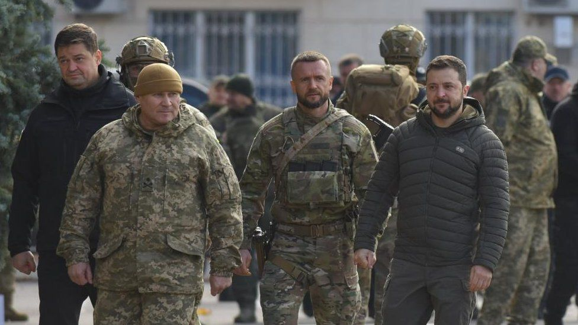
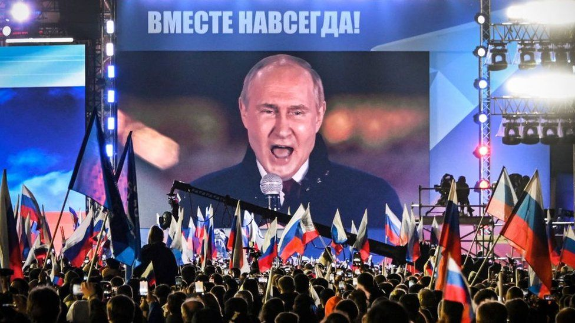
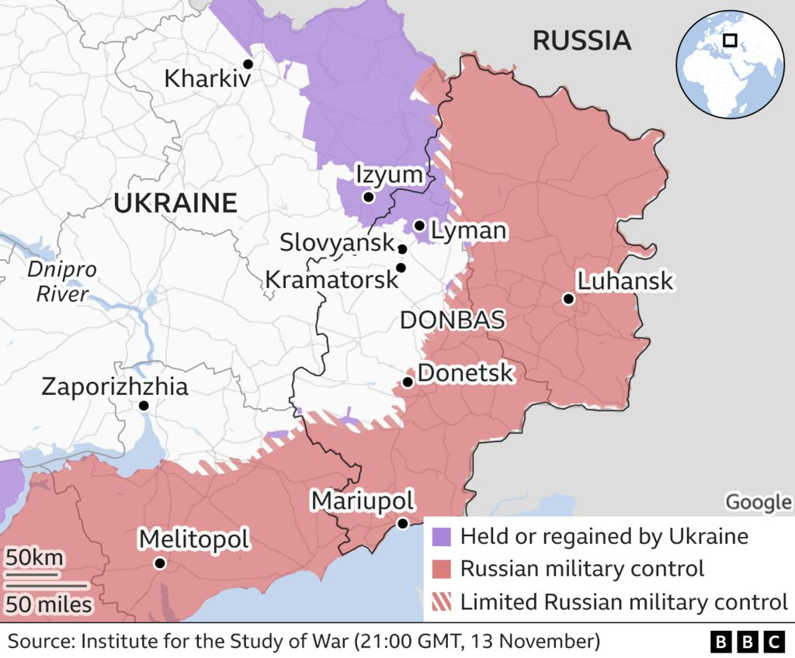
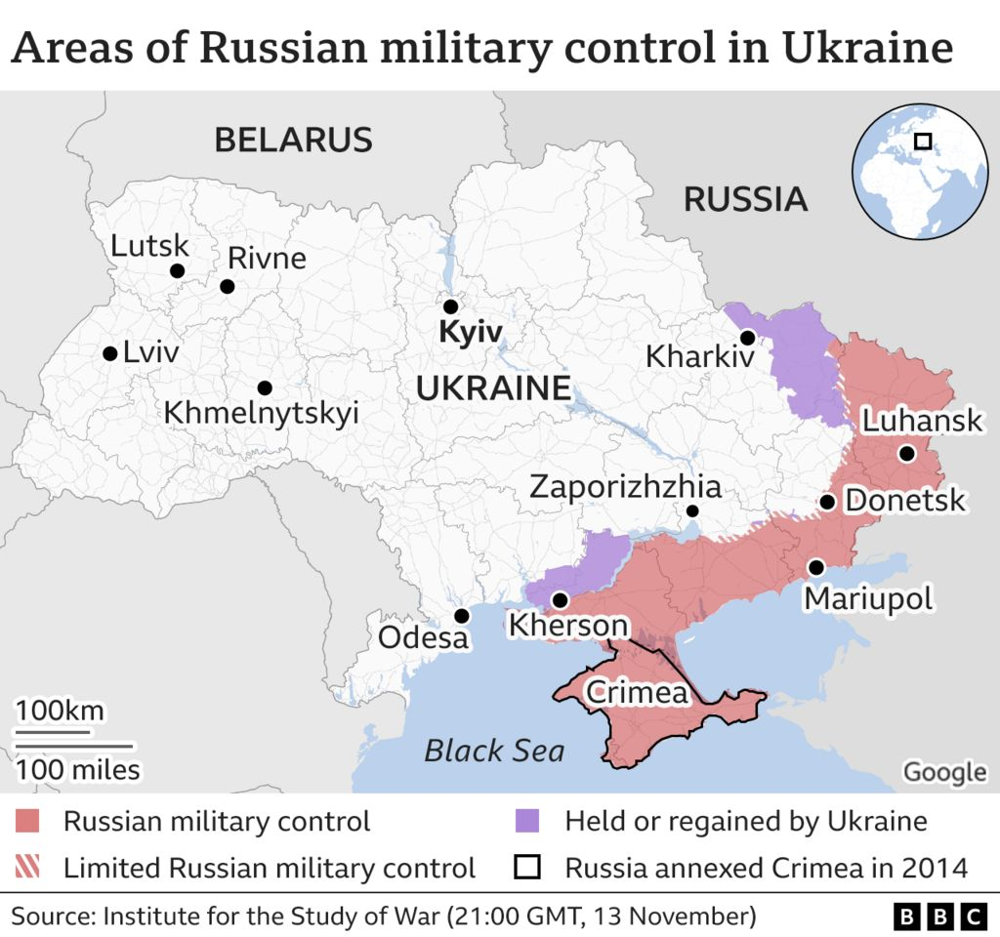

## 为什么俄罗斯入侵乌克兰，普京的战争失败了？

Media caption,

Watch: Ukraine's recapture of Kherson, in under a minute

观看：乌克兰在不到一分钟内夺回赫尔松

**When Vladimir Putin sent up to 200,000 soldiers into Ukraine on 24 February, he thought he could sweep into the capital Kyiv in a matter of days and depose the government.**

**当弗拉基米尔·普京 (Vladimir Putin) 于 2 月 24 日派遣多达 200,000 名士兵进入乌克兰时，他认为自己可以在几天内攻入首都基辅并推翻政府。**

Russian forces quickly captured big stretches of territory but failed to encircle Kyiv.

俄罗斯军队迅速占领了大片领土，但未能包围基辅。

Yet in the coming months they were forced into a series of humiliating retreats, first in the north and now in the south. To date, they have lost more than half the territory seized at the start of the invasion.

然而在接下来的几个月里，他们被迫进行了一系列屈辱的撤退，先是在北方，现在是在南方。 迄今为止，他们已经失去了入侵开始时夺取的一半以上领土。

## What was Putin's original goal?

## 普京最初的目标是什么？

Even now, Russia's leader describes the biggest European invasion since the end of World War Two as a "special military operation" rather than the full-scale war that has left millions of Ukrainians displaced inside their country and beyond.

即使是现在，俄罗斯领导人仍将自第二次世界大战结束以来最大规模的欧洲入侵描述为“特殊军事行动”，而不是让数百万乌克兰人在国内和国外流离失所的全面战争。

Sending troops into Ukraine from the north, south and east on 24 February, he told the Russian people his goal was to "[demilitarise and de-Nazify Ukraine](http://en.kremlin.ru/events/president/news/67843)". His declared aim was to protect people subjected to what he called eight years of bullying and genocide by Ukraine's government - claims which have no basis in evidence. It was framed as an attempt at preventing Nato from gaining a foothold in Ukraine. Another objective was soon added: [ensuring Ukraine's neutral status](http://en.kremlin.ru/events/president/news/67880).

2 月 24 日，他从北部、南部和东部派遣军队进入乌克兰，他告诉俄罗斯人民，他的目标是“ [使乌克兰非军事化和去纳粹化](http://en.kremlin.ru/events/president/news/67843) ”。 他宣称的目标是保护那些遭受他所谓的乌克兰政府八年欺凌和种族灭绝的人——这些说法没有证据依据。 它被诬陷为试图阻止北约在乌克兰获得立足点。 很快又增加了另一个目标： [确保乌克兰的中立地位](http://en.kremlin.ru/events/president/news/67880) 。

High on the agenda was toppling the government of Ukraine's elected president. "The enemy has designated me as target number one; my family is target number two," said Volodymyr Zelensky. Russian troops made two attempts to storm the presidential compound, according to his advisor.

High on the agenda was toppling the government of Ukraine's elected president. “敌人已将我指定为第一目标；我的家人是第二目标，”沃洛德米尔·泽伦斯基说。 据他的顾问称，俄罗斯军队曾两次试图冲进总统大院。

## It didn't add up

## 它没有加起来

Repeated Russian claims of Nazis and genocide in eastern Ukraine were completely unfounded but they have formed part of a narrative repeated by Russia since its proxy forces seized parts of the Luhansk and Donetsk regions in the east of the country in 2014, triggering a war with Ukrainian forces. "[It's crazy, sometimes not even they can explain what they are referring to](https://english.elpais.com/international/2022-03-25/ukraines-foreign-minister-putin-is-a-war-criminal-russia-will-feel-the-consequences-for-decades.html)," complained Ukraine's foreign minister Dmytro Kuleba.

俄罗斯一再声称乌克兰东部发生纳粹和种族灭绝是完全没有根据的，但自 2014 年其代理人部队占领该国东部的卢甘斯克和顿涅茨克地区的部分地区，引发与乌克兰的战争以来，它们已成为俄罗斯重复叙述的一部分军队。 “ [这太疯狂了，有时连他们都无法解释他们指的是什么](https://english.elpais.com/international/2022-03-25/ukraines-foreign-minister-putin-is-a-war-criminal-russia-will-feel-the-consequences-for-decades.html) ，”乌克兰外交部长 Dmytro Kuleba 抱怨道。

An opinion piece by Russian state-run news agency Ria Novosti in early April made clear that "denazification is inevitably also de-Ukrainisation" - in effect erasing the modern state of Ukraine.

俄罗斯官方通讯社 Ria Novosti 在 4 月初发表的一篇评论文章明确指出，“去纳粹化不可避免地也是去乌克兰化”——实际上是在抹杀乌克兰的现代状态。

It was published as [details emerged of war crimes](https://www.ohchr.org/sites/default/files/2022-10/A-77-533-AUV-EN.pdf) committed by Russian forces against civilians in Bucha, near Kyiv. An independent report later [accused Russia itself of state-orchestrated incitement to genocide](https://newlinesinstitute.org/wp-content/uploads/An-Independent-Legal-Analysis-of-the-Russian-Federations-Breaches-of-the-Genocide-Convention-in-Ukraine-and-the-Duty-to-Prevent-1-2.pdf).

它是在 [的战争罪行的细节浮出水面后](https://www.ohchr.org/sites/default/files/2022-10/A-77-533-AUV-EN.pdf) 俄罗斯军队在基辅附近的布查对平民犯下 发表的。 一份独立报告后来 [指责俄罗斯自己在国家策划的情况下煽动种族灭绝](https://newlinesinstitute.org/wp-content/uploads/An-Independent-Legal-Analysis-of-the-Russian-Federations-Breaches-of-the-Genocide-Convention-in-Ukraine-and-the-Duty-to-Prevent-1-2.pdf) 。

As for joining Nato, even before the invasion Ukraine reportedly agreed a provisional deal with Russia to stay out of the Western defensive alliance. Russia does not want its neighbour to join Nato, as it fears this would encroach too closely on its territory.

至于加入北约，据报道，甚至在入侵之前，乌克兰就与俄罗斯达成了一项临时协议，以避开西方防御联盟。 俄罗斯不希望其邻国加入北约，因为它担心这会过度侵占其领土。

By March, President Zelensky had publicly accepted joining Nato would not happen: "It's a truth and it must be recognised." Ukraine offered to become a non-aligned, non-nuclear state, but negotiations broke down.

到 3 月，泽伦斯基总统公开承认加入北约不会发生：“这是事实，必须得到承认。” 乌克兰提出成为一个不结盟、无核国家，但谈判破裂。

## How Putin changed his war aims

## 普京如何改变他的战争目标

A month into the invasion and it was clear Russia's campaign was not going to plan. Vladimir Putin dramatically scaled back his ambitions, declaring the first phase largely complete.

入侵一个月后，很明显俄罗斯的战役没有按计划进行。 弗拉基米尔·普京 (Vladimir Putin) 大幅缩减了他的野心，宣布第一阶段基本完成。

The military pulled back from around **Kyiv** and **Chernihiv** and regrouped in the north-east. The main goal was now the "**liberation of Donbas**" - broadly referring to Ukraine's two industrial regions in the east of Luhansk and Donetsk.

军队从 **基辅** 和 **切尔尼戈夫** 周围撤退，并在东北部重新集结。 现在的主要目标是“ **解放顿巴斯** ”——泛指乌克兰在卢甘斯克和顿涅茨克东部的两个工业区。

The reason for the withdrawal was a failure to appreciate the agility of Ukrainian forces or to secure supply lines. An early symbol of Russia's poor logistics was a 64km (40-mile) armoured convoy that ground to a halt near Kyiv.

撤军的原因是没有意识到乌克兰军队的敏捷性或无法确保补给线的安全。 俄罗斯物流不畅的早期标志是一支 64 公里（40 英里）长的装甲车队在基辅附近停了下来。

Russia's most recent retreat from the southern city of **Kherson** on 11 November was also down to destroyed supply lines and disrupted command systems, according to Ukraine's commander in chief, General Valeriy Zaluzhny.

俄罗斯最近一次于 11 月 11 日从南部城市 **赫尔松撤退也是因为供应线被毁，指挥系统被打乱。** 据乌克兰总司令瓦列里·扎卢日尼将军称，

Image source, OLEG PETRASYUK/EPA-EFE

Image caption,

President Volodymyr Zelensky (R) visited Kherson within days of Ukrainian forces liberating it from Russian occupation

Russian proxy forces had already seized a third of Donbas in 2014 in a war that had since turned into a largely frozen conflict. By late March they had claimed most of Luhansk but little more than half of Donetsk.

2014 年，俄罗斯代理人军队已经在一场战争中占领了顿巴斯的三分之一，此后演变成一场基本冻结的冲突。 到 3 月下旬，他们占领了卢甘斯克的大部分地区，但只占领了顿涅茨克的一半多一点。

Capturing the devastated port city of **Mariupol** in Donetsk in mid-May gave Vladimir Putin one of his few big victories and provided Russia with a much-needed land corridor from the border to Crimea, the Ukrainian peninsula seized by Russia in 2014.

5 月中旬占领顿涅茨克满目疮痍的港口城市 **马里乌波尔** 是弗拉基米尔·普京为数不多的重大胜利之一，并为俄罗斯提供了从边境到克里米亚的急需陆地走廊，克里米亚是俄罗斯在 2014 年占领的乌克兰半岛。

Russian forces still had hopes of seizing further territory in the south. A leading general had previously talked of land grabs along the Black Sea coast beyond Odesa towards a breakaway region of Moldova. "Control over the south of Ukraine is another way out to Transnistria," said Maj Gen Rustam Minnekayev.

俄罗斯军队仍然希望在南部夺取更多领土。 一位主要将军此前曾谈到在敖德萨以外的黑海沿岸向摩尔多瓦的一个分离地区掠夺土地。 “控制乌克兰南部是通往德涅斯特河沿岸的另一条出路，”鲁斯塔姆·明尼卡耶夫少将说。

By early July, Russia's leader was also able to claim full control of **Luhansk**, as Ukrainian forces lost as many as 50 to 100 soldiers a day to Russia's overwhelming firepower.

到 7 月初，俄罗斯领导人还能够完全控制 **卢甘斯克** ，因为乌克兰军队每天在俄罗斯压倒性的火力下损失多达 50 至 100 名士兵。

But the arrival of Western artillery, particularly American Himars missiles, soon took its toll on Russia's logistics hubs and arms depots in the east and an anticipated Ukrainian counter-offensive in the southern region of Kherson was also under way.

但是西方大炮的到来，尤其是美国的 Himars 导弹，很快就对俄罗斯在东部的后勤中心和军火库造成了损失，而乌克兰在南部赫尔松地区的预期反攻也在进行中。

In September, Vladimir Putin announced a "partial mobilisation" of some 300,000 troops with the aim of bolstering a 1,000km (620-mile) front line in the east. Russians fled the call-up in droves as the war came closer to home.

9 月，弗拉基米尔·普京 (Vladimir Putin) 宣布“部分动员”约 300,000 名士兵，以加强东部 1,000 公里（620 英里）的前线。 随着战争离家越来越近，俄罗斯人成群结队地逃离了征召。

On the backfoot, he declared that the two eastern regions and two others in the south - **Kherson and Zaporizhzhia** - were being annexed, even though none was fully under Russian control. They would be part of Russia forever, he said.

在后脚，他宣布东部的两个地区和南部的另外两个地区—— **赫尔松和扎波罗热** ——正在被吞并，尽管这些地区都没有完全处于俄罗斯的控制之下。 他说，他们将永远是俄罗斯的一部分。

Image source, Getty Images

Image caption,

Vladimir Putin addressed crowds in Moscow, with the words "Together forever" at the top of the screen

Weeks later, Russia retreated from Kherson city, the only regional capital seized in its 2022 war.

几周后，俄罗斯撤出赫尔松市，这是其在 2022 年战争中夺取的唯一地区首府。

Under a newly appointed commander, Gen Sergei Surovikin, Russia switched its strategy in October to destroying Ukraine's civilian infrastructure, destroying or damaging 40% of its power system with air raids across the country. It had failed on the battlefield, so now the Kremlin's aim was to target civilian morale.

在新任命的指挥官 Sergei Surovikin 将军的领导下，俄罗斯在 10 月改变了战略，转而摧毁乌克兰的民用基础设施，通过空袭摧毁或破坏乌克兰 40% 的电力系统。 它在战场上失败了，所以现在克里姆林宫的目标是打击平民士气。

Cities across Ukraine have been hit, and two people were killed in Poland after a missile landed on a farm close to its border with Ukraine. The incident raised fears of Nato being dragged into the conflict, although the US said it was unlikely the missile had been fired by Russia.

乌克兰各地的城市都遭到袭击，在波兰，一枚导弹落在靠近乌克兰边境的一个农场后，有两人丧生。 这一事件引发了人们对北约被卷入冲突的担忧，尽管美国表示导弹不太可能是俄罗斯发射的。

## Russia's big failures

## 俄罗斯的重大失败

The loss of Kherson city and the retreat of 30,000 Russian troops from the right bank of the River Dnipro capped a catalogue of Russian battlefield setbacks that add up to a broad picture of an invasion mired in failure.

赫尔松市的失利和 30,000 名俄罗斯军队从第聂伯河右岸撤退，为俄罗斯战场上的一系列挫折画上了句号，这些挫折加起来构成了入侵陷入失败的广泛画面。

The withdrawal from near Kyiv and from Chernihiv in March was followed by a dramatic retreat in early September from the north-eastern **Kharkiv** region, abandoning the big road and rail hub of **Kupyansk** and the strategic town of **Izyum**.

继 3 月从基辅附近和切尔尼戈夫撤军之后，9 月初又从东北 **哈尔科夫** 地区大规模撤退，放弃了大型公路和铁路枢纽 **库普扬斯克** 以及战略重镇 **伊久姆** 。

By late September, Ukrainian forces had also liberated another big hub, **Lyman**, four months after Russia had captured it.

到 9 月下旬，乌克兰军队还在 **俄罗斯占领莱曼** 四个月后解放了另一个大枢纽莱曼。

The failures extended beyond the battlefield. Ukraine achieved a symbolic victory with the sinking of the Russian navy's flagship Black Sea battle cruiser the **Moskva** in April. Weeks later Russian forces were forced to flee the tiny **Snake Island** outpost in the Black Sea.

失败超出了战场。 4 月，俄罗斯海军旗舰黑海战列巡洋舰 **莫斯科** 号沉没，乌克兰取得了象征性的胜利。 几周后，俄罗斯军队被迫逃离位于 **的小蛇岛前哨基地。** 黑海

**Crimea** too has seen big Russian setbacks. In early October an explosion badly damaged a bridge across the Kerch Strait, erected after Russia annexed Crimea in 2014. That devastating strike on Russian supply lines was later followed by a Ukrainian drone attack on Russia's Black Sea Fleet in Sevastopol.

**克里米亚** 也经历了俄罗斯的重大挫折。 10 月初，一场爆炸严重损坏了横跨刻赤海峡的一座桥梁，这座桥梁是在俄罗斯于 2014 年吞并克里米亚之后竖立起来的。俄罗斯补给线遭到毁灭性打击，随后乌克兰无人机对位于塞瓦斯托波尔的俄罗斯黑海舰队发动了袭击。

Although President Putin has sought to distance himself from such failures, his own authority appears damaged internationally.

尽管普京总统试图与这些失败保持距离，但他自己的权威在国际上似乎受到了损害。

After the drone attack on the Russian fleet, the Kremlin suspended its support for a Turkish-brokered deal for grain ships to sail safely through the Black Sea.

在无人机袭击俄罗斯舰队后，克里姆林宫暂停支持土耳其斡旋的一项粮食船安全航行通过黑海的协议。

But when the UN and Turkey decided to continue with the shipments regardless, President Putin lifted the suspension. As Germany's foreign minister observed, the international community had refused to be blackmailed.

但当联合国和土耳其决定不顾一切地继续运送货物时，普京总统解除了暂停。 正如德国外交部长所说，国际社会拒绝接受敲诈勒索。

## Has the invasion failed?

## 入侵失败了吗？

By most measures, Russia's war is failing but it still controls all the territory seized in 2014, as well as the coastal corridor from Crimea to the Russian border.

从大多数标准来看，俄罗斯的战争正在失败，但它仍然控制着 2014 年夺取的所有领土，以及从克里米亚到俄罗斯边境的沿海走廊。

President Putin's partial mobilisation is yet to make a substantial difference on the ground.

普京总统的部分动员尚未在实地产生实质性影响。

For months Russian forces have sought to capture the Donetsk town of Bakhmut and have made some minor gains near by, but it is an indication of the extent to which their ambitions have diminished.

几个月来，俄罗斯军队一直试图夺取顿涅茨克的巴赫穆特镇，并在附近取得了一些小成就，但这表明他们的野心已经减弱。

And if the Russian leader's aim really was to push Nato back, that too has failed because Sweden and Finland have applied to join, alarmed by Moscow's military threat.

如果俄罗斯领导人的目标真的是将北约推回，那也失败了，因为瑞典和芬兰已经申请加入，对莫斯科的军事威胁感到震惊。

## How Putin's messaging has changed

## 普京的信息发生了怎样的变化

For years, the Russian president has denied Ukraine its own statehood, writing in a lengthy 2021 essay that "[Russians and Ukrainians were one people](http://en.kremlin.ru/events/president/news/66181)" dating back to the late 9th Century.

多年来，这位俄罗斯总统一直否认乌克兰拥有自己的国家地位，他在 2021 年的一篇长文中写道，“ [俄罗斯人和乌克兰人是一个民族](http://en.kremlin.ru/events/president/news/66181) ”可以追溯到 9 世纪末。

That message was repeated in his two pre-war addresses, in which he accused Kyiv of trying to root out the Russian language and Nato of trying to gain a foothold in Ukraine. He later condemned his neighbour as "anti-Russia".

在他的两次战前讲话中重复了这一信息，他在讲话中指责基辅试图根除俄语，指责北约试图在乌克兰站稳脚跟。 他后来谴责他的邻居是“反俄罗斯”。

By September, it was the West that was to blame for trying to "weaken, divide and ultimately destroy our country" while it was Kyiv's fault for its "ambition to possess nuclear weapons".

到 9 月，试图“削弱、分裂并最终摧毁我们的国家”的是西方，而“拥有核武器的野心”则是基辅的错。

In reality it was an independent Ukraine that agreed to hand over all the nuclear weapons on its territory when the Soviet Union collapsed in 1991.

实际上，1991 年苏联解体时，是独立的乌克兰同意交出其领土上的所有核武器。

Meanwhile, President Putin made a succession of nuclear threats, talking of using all means at his disposal to protect Russia and cling on to its occupied territories.

与此同时，普京总统接连发出核威胁，表示要用一切手段保卫俄罗斯，保住被占领土。

"We will certainly make use of all weapon systems available to us. [This is not a bluff," he warned](http://en.kremlin.ru/events/president/news/69390).

他警告说：“我们肯定会利用我们可用的所有武器系统。 [这不是虚张声势](http://en.kremlin.ru/events/president/news/69390) 。 ”

## Is Nato to blame?

## 北约是罪魁祸首吗？

Nato member states have increasingly sent Ukraine air defence systems to protect its cities as well as missile systems, artillery and drones that have helped turn the tide against Russia's invasion.

北约成员国越来越多地向乌克兰派遣防空系统来保护其城市，并派遣导弹系统、火炮和无人机帮助扭转了俄罗斯入侵的局面。

But it is not to blame for the war and it was, after all, Russia's invasion that persuaded Sweden and Finland to apply formally to join the military alliance. When Russia said it was annexing four Ukrainian provinces in late September, Ukraine also said it was seeking fast-track Nato membership.

但这并不是这场战争的罪魁祸首，毕竟是俄罗斯的入侵说服了瑞典和芬兰正式申请加入军事同盟。 当俄罗斯在 9 月下旬表示要吞并乌克兰的四个省时，乌克兰也表示正在寻求加入北约的快速通道。

Blaming Nato's expansion eastwards is a Russian narrative that has gained some ground in Europe. Before the war, President Putin demanded Nato turn the clock back to 1997 and remove its forces and military infrastructure from Central Europe, Eastern Europe and the Baltics.

指责北约向东扩张是俄罗斯的一种说法，在欧洲已经取得了一些进展。 战前，普京总统要求北约将时钟拨回 1997 年，将其部队和军事基础设施撤出中欧、东欧和波罗的海地区。

In his eyes the West promised back in 1990 that Nato would expand "not an inch to the east", but did so anyway.

在他看来，西方早在 1990 年就承诺北约将“向东扩张一英寸”，但无论如何都这样做了。

That was before the collapse of the Soviet Union, however, so the promise made to then Soviet President Mikhail Gorbachev only referred to East Germany in the context of a reunified Germany.

然而，那是在苏联解体之前，所以当时的苏联总统米哈伊尔·戈尔巴乔夫 (Mikhail Gorbachev) 的承诺只是在德国统一的背景下提到东德。

Mr Gorbachev said later that "the topic of Nato expansion was never discussed" at the time.

戈尔巴乔夫后来说，当时“从未讨论过北约扩张的话题”。

Media caption,

Watch: Sweden and Finland formally submit Nato applications

观察：瑞典和芬兰正式提交北约申请

It is Nato's collective defence promise that worries President Putin most. Russian forces first invaded neighbour Georgia in 2008 and then sent troops into Ukraine six years later.

普京总统最担心的是北约的集体防御承诺。 俄罗斯军队于 2008 年首先入侵邻国格鲁吉亚，然后在六年后派兵进入乌克兰。

Nato maintains it never intended to deploy combat troops on its eastern flank, until Russia annexed Crimea illegally in 2014.

北约坚称，在俄罗斯于 2014 年非法吞并克里米亚之前，它从未打算在其东翼部署作战部队。

## More on this story

## 更多关于这个故事
