_Note on generalizations: this blog post covers a large span of topics. Some MEV experts may object to some of the simplifications I made to make this story more understandable. Some casual readers may find this too complex to follow. I tried to find a happy medium but probably didn’t succeed. Let me know if you have any concrete suggestions for improvement._

_关于概括的注意事项：这篇博文涵盖了广泛的主题。 一些 MEV 专家可能反对我为使这个故事更容易理解而做的一些简化。 一些不经意的读者可能会觉得这太复杂而无法理解。 我试图找到一个快乐的媒介，但可能没有成功。 如果您有任何具体的改进建议，请告诉我。_

## The email invitation

## 电子邮件邀请

Just months away from the final exam that would grant me [my master’s in Computer Science and my evenings and weekends back](https://www.ddmckinnon.com/2020/12/16/5-lessons-from-my-journey-with-georgia-techs-omscs/), the email arrived. The title: “Application of Bellman-Ford to new crypto markets”.

距离 [我获得计算机科学硕士学位的期末考试以及我回来](https://www.ddmckinnon.com/2020/12/16/5-lessons-from-my-journey-with-georgia-techs-omscs/) 的晚上和周末只有几个月的时间，电子邮件就到了。 标题：“Bellman-Ford 在新加密市场的应用”。

Interesting. While starting a new project was the last thing on my mind after spending the previous two years grinding away on OMSCS homework and the year prior [building a series of intellectually but not particularly financially successful trading bots on centralized crypto exchanges](https://www.ddmckinnon.com/2019/04/24/a-practical-treatise-on-pairs-trading-bellman-ford-shannons-demon-and-order-book-pressure-tales-from-18-months-of-cryptocurrency-arbitrage/), I couldn’t help but respond. The crypto market had been dead for a couple years, but I started to detect signs of life and wasn’t sure what else I would do with my post-graduation freedom while the world was still locked down.

有趣的。 在过去两年努力完成 OMSCS 作业以及前一年 [在中心化加密货币交易所构建了一系列在智力上但在财务上不是特别成功的交易机器人](https://www.ddmckinnon.com/2019/04/24/a-practical-treatise-on-pairs-trading-bellman-ford-shannons-demon-and-order-book-pressure-tales-from-18-months-of-cryptocurrency-arbitrage/) 之后，开始一个新项目是我心中的最后一件事，我忍不住回应。 加密货币市场已经死了几年，但我开始发现生命迹象，并且不确定在世界仍处于封锁状态时我还能用毕业后的自由做些什么。

A quick call delivered me more details. In 2017-2018, the general paradigm for crypto was to either buy-and-hold in one’s own wallet or swap via centralized exchanges. There wasn’t all that much you could do with cryptocurrencies on-chain (with some exceptions–RIP EtherDelta).

一个快速的电话给我提供了更多细节。 在 2017-2018 年，加密货币的一般范例是购买并持有在自己的钱包中或通过中心化交易所进行交换。 对于链上的加密货币，您无能为力（除了一些例外——RIP EtherDelta）。

Since then, a new innovation had taken hold: the smart contract. Smart contracts deployed on Ethereum and other blockchains enabled two (or more) users to swap tokens, lend money, or engage in other types of transactions without a central intermediary. This created a huge opportunity for an aspiring arbitrageur. Can you see why?

从那时起，一项新的创新开始兴起：智能合约。 部署在以太坊和其他区块链上的智能合约使两个（或更多）用户能够在没有中央中介的情况下交换代币、借钱或参与其他类型的交易。 这为有抱负的套利者创造了巨大的机会。 你能明白为什么吗？

By mid-2020, the centralized exchanges (CEXes) had become very efficient. Volume had consolidated (onto Binance, FTX, Coinbase, Kraken, and so on), professional market makers dominated (Alameda, Wintermute, SCP, Jane St., etc.), and the universe of tradable instruments remained relatively small as each new ticker had to be approved by the CEX leadership and backed with some guarantee of reasonable liquidity from market makers.

到 2020 年年中，中心化交易所 (CEXes) 变得非常高效。 交易量已经整合（到 Binance、FTX、Coinbase、Kraken 等），专业做市商占主导地位（Alameda、Wintermute、SCP、Jane St. 等），并且随着每个新行情的出现，可交易工具的范围仍然相对较小必须得到 CEX 领导层的批准，并得到做市商合理流动性的一些保证。

Decentralized exchanges (DEXes) did not have any of these attributes. Trading volume was fragmented across dozens of venues, each jockeying for position with various tricks like [SushiSwap’s vampire attack](https://www.gemini.com/cryptopedia/sushiswap-uniswap-vampire-attack). The cost of trading was generally very high (hundreds rather than tens of basis points on CEXes) because sophisticated market makers were only beginning to enter the system, liquidity was scarce, and they relied on capital-inefficient mechanics to function. And most importantly, no gatekeeper existed to control listing or ensure liquidity. Any user could create a COIN\_1/COIN\_2 instrument on any DEX that would create another potentially profitable arbitrage opportunity. With the advent of DEXes, the trading universe expanded by approximately two orders of magnitude.

去中心化交易所 (DEXes) 没有任何这些属性。 交易量分散在数十个场所，每个场所都通过 [SushiSwap 的吸血鬼攻击](https://www.gemini.com/cryptopedia/sushiswap-uniswap-vampire-attack) 等各种技巧争夺位置。 交易成本通常非常高（在 CEX 上是数百个基点而不是几十个基点），因为老练的做市商才刚刚开始进入该系统，流动性稀缺，而且他们依赖资本效率低下的机制来运作。 最重要的是，没有看门人来控制上市或确保流动性。 任何用户都可以在任何 DEX 上创建 COIN\_1/COIN\_2 工具，这将创造另一个潜在的有利可图的套利机会。 随着 DEX 的出现，交易范围扩大了大约两个数量级。

Together with the fact that significant volume was moving from CEXes to DEXes, these changes meant that times were getting good again for amateur arbitrageurs. Two days later, another email arrived in my inbox with the subject, “Invitation to join DeFi trading project”.

再加上大量交易量从 CEXes 转移到 DEXes，这些变化意味着业余套利者的时代再次变得美好。 两天后，另一封电子邮件到达了我的收件箱，主题是“邀请加入 DeFi 交易项目”。

## Brief detour on how DEXes/{CF,A}MMs work

## 简要介绍 DEXes/{CF,A}MMs 的工作原理

_Note: skip this section if you are already familiar with how {CF,A}MMs work, which is a prerequisite to the rest of the blog post._

_注意：如果您已经熟悉 {CF,A}MM 的工作原理，请跳过此部分，这是阅读其余博文的先决条件。_

Centralized exchanges like Binance, Coinbase, NYSE, and NASDAQ match buyers and sellers with a central limit order book (CLOB). Patient buyers and sellers post limit orders representing the price and size that they are willing to buy or sell a given asset. Impatient buyers and sellers place market orders that burn through the CLOB until the desired size is reached.

Binance、Coinbase、NYSE 和 NASDAQ 等中心化交易所通过中央限价订单簿 (CLOB) 匹配买卖双方。 有耐心的买家和卖家发布限价订单，表示他们愿意购买或出售给定资产的价格和规模。 不耐烦的买家和卖家下达的市场订单会消耗掉 CLOB，直到达到所需的大小。

This approach works really well for when the universe of tradable instruments is relatively small and some actor, a market maker, is willing to take the risk of placing limit orders (and correspondingly holding positions in both assets being traded) in exchange for collecting the premium between the best bid and the best ask. Without this actor or large uncorrelated trading volumes, price discovery fails, spreads widen, and trading ceases. We observe this to some extent in the housing market today where rising rates have driven the bid/ask spread to a level that is unacceptable to both sellers and buyers, dropping volume to a fraction of its typical level.

当可交易工具的范围相对较小并且某些参与者（做市商）愿意承担下限价订单（并相应地持有两种交易资产的头寸）以换取收取溢价的风险时，这种方法非常有效在最佳出价和最佳要价之间。 没有这个参与者或大量不相关的交易量，价格发现就会失败，价差扩大，交易就会停止。 我们在今天的房地产市场上在某种程度上观察到了这一点，利率上升已将买卖差价推高至买卖双方都无法接受的水平，成交量降至其典型水平的一小部分。

This problem can be solved with automatic or constant-function market maker (AMM). Instead of requiring an agent to dynamically provide and withdraw liquidity on a CLOB, an AMM does the same thing passively with an equation and bucket of capital.

这个问题可以通过自动或恒函数做市商 (AMM) 来解决。 AMM 不需要代理人动态提供和提取 CLOB 的流动性，而是使用等式和资本桶被动地做同样的事情。

Different AMMs use different functions, but the most common approach is constant product. This function, popularized by [Uniswap V2](https://uniswap.org/whitepaper.pdf), requires that the value of two assets in the AMM contract, called a pool from now on, remain equal. To translate English to math, (Rα −∆α)(Rβ +γ∆β) = k, where ∆α is the amount withdrawn from the pool, ∆β is the amount deposited into the pool, R are the corresponding reserves (buckets of capital), and γ is the trading fee. These conditions are analyzed in much more detail in Guillermo Angeris’s canonical paper, [An Analysis of Uniswap Markets](https://angeris.github.io/papers/uniswap_analysis.pdf).

不同的 AMM 使用不同的函数，但最常用的方法是常数积。 此功能由 [Uniswap V2](https://uniswap.org/whitepaper.pdf) 推广，要求 AMM 合约中的两种资产（从现在开始称为矿池）的价值保持相等。 将英语翻译成数学，(R α  −Δ α  )(R β  +γΔ β  ) = k，其中Δ α  是从池中提取的数量，Δ β  是存入池中的数量，R 是相应的准备金（资本桶），γ 是交易费用。 这些条件进行了更详细 [Guillermo Angeris 的规范论文《Uniswap 市场分析》对](https://angeris.github.io/papers/uniswap_analysis.pdf) 的分析。

Functionally, what this means is that anyone can create a market by depositing equal (in value) amounts of two coins without asking an exchange for permission or incentivizing a sophisticated third party to make the market. These depositors, called liquidity providers or LPs, are rewarded for their service in two ways: by creating a new market for a project or coin that they believe in and by fees that are generated from each swap. Each one of these markets is referred to as a pool.

从功能上讲，这意味着任何人都可以通过存入等量（价值）的两种代币来创建市场，而无需向交易所申请许可或激励经验丰富的第三方来创建市场。 这些被称为流动性提供者或 LP 的存款人通过两种方式获得服务奖励：通过为他们相信的项目或代币创建新市场，以及通过每次互换产生的费用。 这些市场中的每一个都被称为一个池。

## Brief detour on liquidations

## 清算的简要绕道

_Note: skip this section if you are already familiar with how DeFi liquidations work. This is not a prerequisite to understanding the rest of this blog post, but I do mention liquidations several times in the text._

_注意：如果您已经熟悉 DeFi 清算的工作原理，请跳过本节。 这不是理解这篇博文其余部分的先决条件，但我确实在文中多次提到清算。_

In addition to enabling users to swap assets without a central intermediary, smart contracts facilitate lending. The mechanics are much simpler than swaps. Alice and Bob both deposit funds into a lending contract (Aave, Compound, Maker, etc.). As long as Bob leaves his original funds locked in the protocol, he can withdraw ~50% more (this number depends on the protocol and asset) at some algorithmically determined rate that gets paid to Alice for providing the funds. This lets Bob create a short position, reinvest for a levered long, or withdraw spending money without selling the underlying and incurring a taxable event and Alice to generate a return on her capital.

除了使用户能够在没有中央中介的情况下交换资产外，智能合约还促进了借贷。 机制比掉期简单得多。 Alice 和 Bob 都将资金存入借贷合约（Aave、Compound、Maker 等）。 只要 Bob 将他的原始资金锁定在协议中，他就可以以某种算法确定的利率多提取约 50%（这个数字取决于协议和资产），并因提供资金而支付给 Alice。 这让鲍勃可以创建空头头寸，再投资杠杆多头，或者在不出售标的和招致应税事件的情况下提取花钱，而爱丽丝则可以产生资本回报。

The whole system works without any centralized system of enforcement because a liquidation reward is paid out to any address that flags loans that have crossed their collateralization threshold. This reward motivates traders to build systems that monitor the mempool and the external oracles that provide price information to the blockchain to compete to liquidate loans the moment they go bad. For those who would like to learn more, [Anton Evangelatov discusses building such a bot on his blog](https://powpark.com/post/2020-06-19-how-to-build-a-liquidator-bot-defi/).

整个系统在没有任何集中式执行系统的情况下运行，因为清算奖励会支付给任何标记已超过其抵押门槛的贷款的地址。 这种奖励激励交易员建立系统来监控内存池和向区块链提供价格信息的外部预言机，以便在贷款变坏时竞争清算贷款。 对于那些想要了解更多信息的人， [Anton Evangelatov 在他的博客上讨论了如何构建这样一个机器人](https://powpark.com/post/2020-06-19-how-to-build-a-liquidator-bot-defi/) 。

## Brief detour on arbitrage (atomic, statistical, and otherwise)

## 套利的简要介绍（原子的、统计的和其他的）

_Note: skip this section if you are already familiar with how arbitrage works on blockchains. This may be worth reading if you are only familiar with arbitrage in traditional financial markets._

_注意：如果您已经熟悉套利在区块链上的运作方式，请跳过本节。 如果您只熟悉传统金融市场的套利，这可能值得一读。_

In traditional capital markets, arbitrage typically refers to buying something on one venue and selling it on another (possibly through a series of intermediate transactions) for a higher price. However, in the most technical sense, these transactions are not truly risk-free. Prices can move mid-transaction, intermediate hops can fail to fill, counterparties can default, and so on. I observed this clearly [while running my CEX arbitrage strategy](https://www.ddmckinnon.com/2019/04/24/a-practical-treatise-on-pairs-trading-bellman-ford-shannons-demon-and-order-book-pressure-tales-from-18-months-of-cryptocurrency-arbitrage/). Often, I would detect a profitable trade, e.g. BTC → ETH → USDT → BTC, but find myself left with less BTC than I started with because the price on one of the legs moved against me before I could complete the transaction.

在传统的资本市场中，套利通常是指在一个场所购买某种东西并在另一个场所以更高的价格出售（可能通过一系列中间交易）。 然而，从最技术的意义上讲，这些交易并非真正没有风险。 价格可以在交易中移动，中间跃点可能无法填充，交易对手可能违约，等等。 清楚地观察到这一点 [我在运行我的 CEX 套利策略时](https://www.ddmckinnon.com/2019/04/24/a-practical-treatise-on-pairs-trading-bellman-ford-shannons-demon-and-order-book-pressure-tales-from-18-months-of-cryptocurrency-arbitrage/) 。 通常，我会检测到有利可图的交易，例如 BTC → ETH → USDT → BTC，但发现自己剩下的 BTC 比我开始时少，因为在我完成交易之前，其中一条边的价格对我不利。

When trading on DEXes, arbitrage (often called atomic arbitrage to differentiate from the strongly statistical arbitrage described above) is truly risk-free (excluding hacks and other types of attacks that we will discuss later). A smart contract can be written to either execute every leg of the trade and confirm profitability or revert, even across trading venues (DEXes).

在 DEX 上交易时，套利（通常称为原子套利以区别于上述强统计套利）是真正无风险的（不包括我们稍后将讨论的黑客攻击和其他类型的攻击）。 可以编写智能合约来执行交易的每一段并确认盈利能力或恢复，甚至跨交易场所 (DEX)。

Even better, the pools themselves can serve as a source of capital. If the trade size in the example above was 1 BTC, one could borrow the funds from the BTC/USDT pool, swap that BTC for ETH in the BTC/ETH pool, swap the ETH for USDT in the ETH/USDT pool, and return the USDT to the USDT/BTC pool to close the loop and pocket the USDT left over. Atomic arbitrage is probably the most capital efficient and least risky trading strategy ever created.

更好的是，资金池本身可以作为资金来源。 如果上例中的交易规模为 1 BTC，则可以从 BTC/USDT 池中借入资金，将该 BTC 交换为 BTC/ETH 池中的 ETH，将 ETH 交换为 ETH/USDT 池中的 USDT，然后返回USDT 到 USDT/BTC 池以关闭循环并将剩余的 USDT 装入口袋。 原子套利可能是有史以来资本效率最高、风险最低的交易策略。

While this blog post largely covers atomic arb, non-atomic (cross-chain, CEX/DEX, etc.) arb opportunities also exist in crypto and are likely an order of magnitude more profitable and less accessible due capital requirements and risk profile.

虽然这篇博文主要涵盖原子套利，但非原子（跨链、CEX/DEX 等）套利机会也存在于加密货币中，而且由于资本要求和风险状况，套利机会可能会高出一个数量级，而且更难获得。

## Brief detour on the optimal data structure for representing DEXes and CFMMs

## 代表 DEXes 和 CFMMs 的最佳数据结构的简要介绍

_Note: skip this section if you are already familiar with the most common way of representing trading pairs with a graph._

_注意：如果您已经熟悉用图表表示交易对的最常见方式，请跳过本节。_

With dozens of DEXes and thousands of potential trading pairs, one needs to think carefully about how to represent the state of the system. Fortunately, foreign exchange traders have already developed a fairly optimal solution to the problem. They create a graph of all possible trading opportunities with the nodes representing coins and the edges representing rates. If more than one rate exists, e.g. two DEXes offer the same instrument at inevitably two slightly different prices, more than one edge is drawn between two nodes, creating a multigraph.

拥有数十个 DEX 和数千个潜在交易对，需要仔细考虑如何表示系统状态。 幸运的是，外汇交易者已经针对该问题制定了相当优化的解决方案。 他们创建了一个包含所有可能交易机会的图表，节点代表硬币，边代表汇率。 如果存在不止一种汇率，例如，两个 DEX 以不可避免的两种略有不同的价格提供相同的工具，则在两个节点之间绘制不止一条边，从而创建多重图。

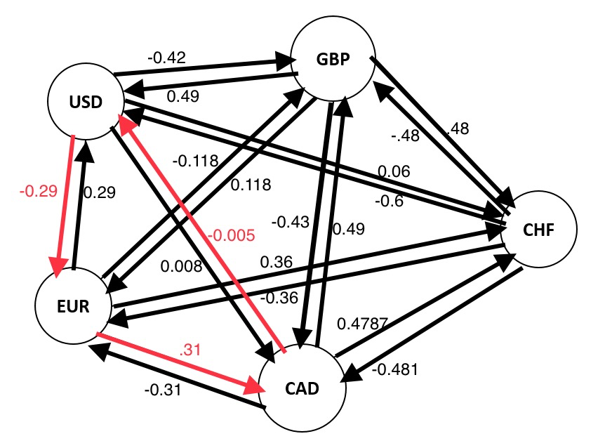

To find an arbitrage opportunity on such a data structure, one needs to find a closed loop of edges for which the product of the weights is greater than one. A number of relatively efficient algorithms have been devised to do this, e.g. [Bellman-Ford](https://en.wikipedia.org/wiki/Bellman%E2%80%93Ford_algorithm), [Ford-Fulkerson](https://en.wikipedia.org/wiki/Ford%E2%80%93Fulkerson_algorithm). Throughout this post, I will interchangeably refer to coins as nodes, prices/pools as nodes, potential arbs as cycles, and profitable arbs as negative cycles, reflecting this graph representation. 

要在这种数据结构上找到套利机会，需要找到权重乘积大于 1 的闭环边。 已经设计了许多相对有效的算法来执行此操作，例如 [Bellman-Ford](https://en.wikipedia.org/wiki/Bellman%E2%80%93Ford_algorithm) 和 [Ford-Fulkerson](https://en.wikipedia.org/wiki/Ford%E2%80%93Fulkerson_algorithm) 。 在这篇文章中，我将代币互换地称为节点，将价格/矿池称为节点，将潜在套利称为周期，将盈利套利称为负周期，以反映这种图形表示。

Note that this is by no means the only way to represent these DEXes. [Angeris _et al._](https://arxiv.org/pdf/2204.05238.pdf) show that representing the system as a bipartite graph with CFMMs and tokens as nodes and edges designating which tokens are traded on which venue makes calculating the optimal arbitrage path easier. While I never experimented with this approach, I believe it could solve some of the problems I discuss later in the post.

请注意，这绝不是表示这些 DEX 的唯一方法。 [安杰里斯 _等人。_](https://arxiv.org/pdf/2204.05238.pdf) 表明将系统表示为一个二分图，其中 CFMM 和代币作为节点和边，指定哪些代币在哪个场所交易，这使得计算最佳套利路径更加容易。 虽然我从未尝试过这种方法，但我相信它可以解决我在帖子后面讨论的一些问题。

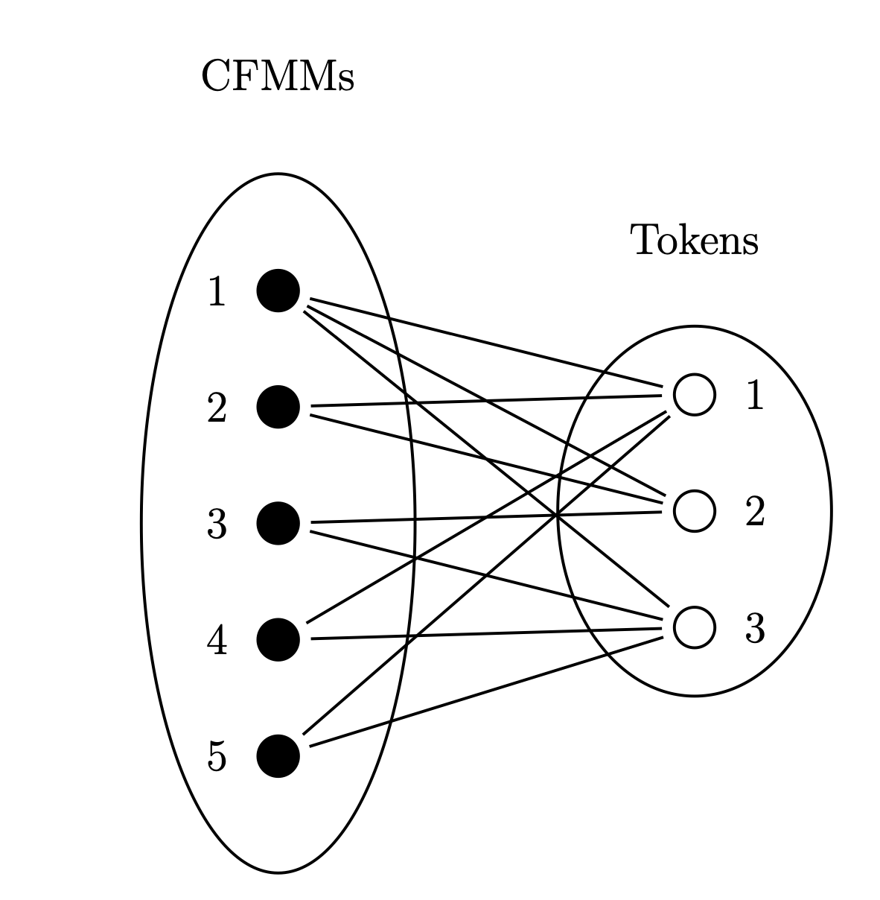

## Back to our story: Arb on Ethereum was (and is) competitive

## 回到我们的故事：以太坊上的 Arb 曾经（现在）具有竞争力

My new partners had already laid a strong foundation for our decentralized arb bot. [Anton](https://twitter.com/nonsens3) had [previously written a successful liquidation bot](https://powpark.com/post/2020-06-19-how-to-build-a-liquidator-bot-defi/) and [Nathan](https://twitter.com/NathanWorsley_) some software to analyze the entire network of pools. We needed to adapt the previous liquidation work to the new task. 

我的新合作伙伴已经为我们的去中心化套利机器人打下了坚实的基础。 [Anton](https://twitter.com/nonsens3) 之前 [编写了一个成功的清算机器人](https://powpark.com/post/2020-06-19-how-to-build-a-liquidator-bot-defi/) ， [Nathan](https://twitter.com/NathanWorsley_) 编写了一些软件来分析整个矿池网络。 我们需要根据新的任务调整之前的清算工作。

This involved several subsystems:

这涉及几个子系统：

1.  An opportunity-finder that would scan the blockchain to find all listed instruments and prune that set into a manageable graph using some heuristics like volume, recency, and risk.
2.  A listener to pass the state of the Ethereum blockchain to our bot including the reserves in each pool, the current gas prices, the state of our workers, and (later) the transactions in the mempool.
3.  A graph-maintainer that would consolidate all reserve changes into an up-to-date snapshot of the market.
4.  An arb-finder that would generate a profitable trade from a graph.
5.  An order executor that would package and sign the trade and send it to a miner.
6.  An arb contract that would execute our instructions on-chain and revert if the trade were not profitable.

1.  一个机会发现者，它将扫描区块链以找到所有列出的工具，并使用一些启发式方法（如交易量、新近度和风险）将其设置为可管理的图表。
2.  将以太坊区块链的状态传递给我们的机器人的侦听器，包括每个池中的储备、当前的天然气价格、我们的工人的状态，以及（稍后）内存池中的交易。
3.  一个图形维护器，可以将所有储备变化合并到最新的市场快照中。
4.  一个套利取景器，可以从图表中产生有利可图的交易。
5.  将打包和签署交易并将其发送给矿工的订单执行者。
6.  套利合约将在链上执行我们的指令，并在交易无利可图时恢复。

To put this in plain language, the basic idea then was that the bot would generate the graph offline on boot (this is slow), update the edge weights with every new block, and analyze the graph for profitable trades. If one existed, the bot would estimate the gas bid needed to land in position zero (ahead of competitors) in the following block and send a transaction containing size, path, and gas price to the miners. If the transaction were successful, the profit minus the gas costs would be deposited to our contract. If not, the transaction would revert, but we would be stuck with the gas bill.

用简单的语言来说，当时的基本思想是机器人会在启动时离线生成图表（这很慢），用每个新块更新边权重，并分析图表以进行有利可图的交易。 如果存在，机器人将估计在下一个区块中到达零位置（领先于竞争对手）所需的 gas 出价，并向矿工发送包含大小、路径和 gas 价格的交易。 如果交易成功，减去 gas 成本的利润将存入我们的合约。 否则，交易会恢复，但我们会被 gas 账单困住。

The listener and graph maintainer could largely be reused from the liquidation bot, but we needed to write an algorithm to calculate path and write a contract to execute this new time of order. While the former was solved by vanilla Bellman-Ford for my previous CEX bot, it wouldn’t do for the DEX bot for a few reasons:

监听器和图形维护器在很大程度上可以从清算机器人中重用，但我们需要编写一个算法来计算路径并编写一个合约来执行这个新的订单时间。 虽然前者是由 vanilla Bellman-Ford 为我之前的 CEX 机器人解决的，但它不适用于 DEX 机器人，原因如下：

1.  Bellman-Ford returns the percentage rather than absolute profit of a negative cycle, which makes it difficult to include an absolute gas cost in the graph (fees on DEXes are composed of relative trading fees, e.g. 0.3%, and absolute gas costs, e.g. 0.03 ETH). 
2.  Bellman-Ford terminates after finding its first negative cycle. This means that in a block there might be both a $10k arb and a $0.10 one and the algorithm would have a 50/50 chance of returning either.
3.  Bellman-Ford is deterministic. In the example above, the solution isn’t simply to re-run BF twice to find both.

1.  Bellman-Ford 返回负周期的百分比而不是绝对利润，这使得很难在图表中包含绝对 gas 成本（DEX 的费用由相对交易费用组成，例如 0.3%，以及绝对 gas 成本，例如 0.03以太坊）。
2.  Bellman-Ford 在找到第一个负循环后终止。 这意味着在一个区块中可能同时存在 10,000 美元和 0.10 美元的套利，并且算法有 50/50 的机会返回任何一个。
3.  Bellman-Ford 是确定性的。 在上面的例子中，解决方案不是简单地重新运行 BF 两次来找到两者。

On a CEX with relatively few assets, deep liquidity, many competitors, continuous price information, and no gas fees, none of these issues are a problem. If a negative cycle is detected, it is by-definition profitable and likely the only trade available.

在一个资产相对较少、流动性深、竞争者多、价格信息持续、没有 gas 费的 CEX 上，这些问题都不是问题。 如果检测到负循环，则根据定义它是有利可图的，并且可能是唯一可用的交易。

On a DEX, this is almost never the case. A very large graph (we pruned ours to ~1k nodes) that batched hundreds of transactions into a single block of price updates will inevitably contain many, many negative cycles. And because on-chain transactions require gas payments that are variable and independent of order size, many of these negative cycles are not even profitable. Practically, this means that returning a single negative cycle for a given block will almost never yield a trade worth making.

在 DEX 上，几乎从来没有这种情况。 一个非常大的图（我们将我们的图修剪到约 1k 个节点）将数百个交易分批放入一个价格更新块中，这将不可避免地包含许多很多负循环。 而且由于链上交易需要可变且与订单大小无关的 gas 支付，因此许多这些负循环甚至无法盈利。 实际上，这意味着为给定块返回单个负循环几乎永远不会产生值得进行的交易。

To solve this problem, we slightly modified Bellman-Ford. After detecting a negative cycle we would delete a random edge in that cycle and then rerun the algorithm. This could be repeated N times to generate N negative cycles that were all potentially profitable. While this approach doesn’t guarantee any kind of optimality it runs relatively quickly (N\* O(edges\*nodes)) and is easy to implement.

为了解决这个问题，我们稍微修改了 Bellman-Ford。 在检测到负循环后，我们将删除该循环中的随机边，然后重新运行算法。 这可以重复 N 次以生成 N 个负循环，这些循环都有可能获利。 虽然这种方法不能保证任何类型的最优性，但它运行相对较快 (N\* O(edges\*nodes)) 并且易于实施。

Determining profitability was also a little bit of a challenge. Sizing an arb order on a CEX is very simple: calculate the largest order possible using the best bid or ask from each leg. The chances of an arb emerging two levels deep in the order book is very small. On a DEX, there is usually no notion of order book. Pricing is continuous along a curve determined by that venue’s function.

确定盈利能力也是一个挑战。 在 CEX 上调整套利订单的大小非常简单：使用每条腿的最佳出价或要价计算可能的最大订单。 订单簿中出现两层套利的可能性非常小。 在 DEX 上，通常没有订单簿的概念。 定价沿着由该场所的功能确定的曲线连续进行。

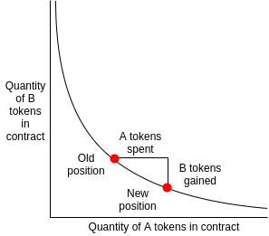

To determine whether a negative cycle would be profitable, we needed to use this curve to determine the optimal size, run that size through the arb path, and subtract estimated gas fee (the exchange fees were already included in the edge weights). Practically, this meant that we used binary search to determine optimal size for each negative cycle, which usually converged in ~10 steps, meaning that we needed to compute ~100 fairly complex calculations in each block, which was taking hundreds of milliseconds even running in parallel on a beefy machine.

为了确定负循环是否有利可图，我们需要使用此曲线来确定最佳规模，通过套利路径运行该规模，并减去估计的汽油费（交易费已包含在边权重中）。 实际上，这意味着我们使用二分搜索来确定每个负循环的最佳大小，这通常会在大约 10 步内收敛，这意味着我们需要在每个块中计算大约 100 个相当复杂的计算，这甚至需要数百毫秒的时间来运行在强大的机器上并行。

With these algorithms written, we were ready to start trading. We loaded up our contact with a few ETH (we always started and ended with ETH to avoid having to hold multiple currencies) and set the bot loose on mainnet. After a few trades, we immediately identified two problems:

编写完这些算法后，我们就可以开始交易了。 我们用一些 ETH 加载了我们的联系人（我们总是以 ETH 开始和结束以避免必须持有多种货币）并在主网上设置机器人。 经过几次交易，我们立即发现了两个问题：

1.  Other bots were not only reading the state of block N when sending trades to block N+1 but also monitoring the pending transactions in the N+1 mempool (the mempool is where proposed transactions are circulated before being confirmed on a block). While this would later manifest itself in a strategy called backrunning that we will discuss later, here the issue was with gas price. We predicted the gap price using information we had from block N but competitors would read our gas price from our transaction in the mempool and usually outbid us by 1 gwei.
2.  This business was really high risk. The game theory optimal gas price to pay for a given arb is essentially the value of that arb. To put this concretely, if a $10k arb exists and two bots are bidding up the gas price to get their transactions confirmed, they are both incentivized to bid gas right up to that value (and actually beyond; paying $10.1k to win a $10k transaction results in a net loss of $100 while paying $9.9k to lose a $10k transaction results in a net loss of $9.9k). Practically, this didn’t happen because the time for these bidding wars was constrained by the block time, but losing multiple transactions in a row with high gas prices could absolutely wipe out a poorly capitalized trader. This would later be resolved with Flashbots, but at that point, only a handful of miners were experimenting with this approach to block building.

1.  其他机器人不仅在向区块 N+1 发送交易时读取区块 N 的状态，而且还在监视 N+1 内存池中的待处理交易（内存池是提议的交易在区块确认之前流通的地方）。 虽然这稍后会在我们稍后将讨论的称为 backrunning 的策略中体现出来，但这里的问题是 gas 价格。 我们使用从区块 N 获得的信息预测差价，但竞争对手会从我们在 mempool 中的交易中读取我们的 gas 价格，并且通常比我们高出 1 gwei。
2.  这项业务确实是高风险的。 为给定套利支付的博弈论最优 gas 价格本质上是该套利的价值。 具体来说，如果存在 10,000 美元的套利并且两个机器人正在竞标 gas 价格以确认他们的交易，那么他们都被激励将 gas 价格提高到该价值（实际上超过；支付 10.1k 美元以赢得 10 美元k 笔交易导致 100 美元的净损失，而支付 9.9k 美元损失 10k 美元的交易导致净损失 9.9k 美元）。 实际上，这并没有发生，因为这些竞价战的时间受到区块时间的限制，但在高 gas 价格的情况下连续失去多笔交易绝对可以消灭资本不足的交易者。 这个问题后来用 Flashbots 解决了，但那时只有少数矿工在试验这种构建区块的方法。

Solving #1 was relatively easy. We wrote a mempool listener to track the highest gas bid in block N+1, modified our order-calculating module to enable recalculation of profits with higher gas prices, and adapted our order executor to resubmit orders with a higher gas price.

解决#1 相对容易。 我们编写了一个 mempool 侦听器来跟踪区块 N+1 中的最高 gas 出价，修改了我们的订单计算模块，以便能够重新计算更高 gas 价格的利润，并调整我们的订单执行器以更高 gas 价格重新提交订单。

However, #2 was tricky and perhaps intractable. Over the course of the O(weeks) it took us to get our system up and running, competition in the mempool heated up. It was clear that the key to winning on Ethereum was some combination of finding arbs that others missed, understanding network dynamics involved in getting transactions to miners ahead of the competition, and having very high tolerance for risk and drawdowns. However, this would all become moot as a new opportunity emerged.

然而，#2 很棘手，也许难以处理。 在 O(weeks) 的过程中，我们花了我们的系统启动和运行，mempool 中的竞争升温。 很明显，在以太坊上获胜的关键是找到其他人错过的套利、了解在竞争之前将交易提供给矿工所涉及的网络动态，以及对风险和回撤具有很高的容忍度。 然而，随着新机会的出现，这一切都将变得毫无意义。

## Enter Avalanche

## 进入雪崩

As we were struggling to ramp up on Ethereum mainnet, a trend was emerging. Alternative L1s like Matic (now Polygon), Avalanche, NEAR, BSC, Fantom, and Solana were beginning to attract attention. A large subset of them retained significant parts of the Ethereum Virtual Machine but added some twist to the consensus mechanism to increase throughput. 

当我们努力提升以太坊主网上线时，一种趋势正在出现。 Matic（现在是 Polygon）、Avalanche、NEAR、BSC、Fantom 和 Solana 等替代 L1 开始引起人们的注意。 其中很大一部分保留了以太坊虚拟机的重要部分，但对共识机制增加了一些扭曲以增加吞吐量。

Avalanche was most interesting to us because it did away with the mempool altogether, eliminating our biggest problem. Instead, Avalanche adopted a leader-less block production model where any validator could produce a block at any time and gas price was fixed at 225 gwei (both of these features would later change). Rather than needing to monkey with winning expensive gas auctions, we could propose our own block whenever an arb appeared. Speed would anoint the winner and the risk of losing an auction would decrease from potentially tens of thousands of dollars to a few cents.

Avalanche 对我们来说最有趣，因为它完全取消了内存池，从而解决了我们最大的问题。 相反，Avalanche 采用了一种无领导者的区块生产模型，其中任何验证者都可以随时生产一个区块，并且 gas 价格固定在 225 gwei（这两个特征后来都会改变）。 无需在昂贵的天然气拍卖中获胜，我们可以在套利出现时提出自己的区块。 速度将决定获胜者，失去拍卖的风险将从可能的数万美元降低到几美分。

In addition, the first DEX on Avalanche, Pangolin, had just launched and began to attract some volume. It offered relatively few instruments, making it much easier to construct and process the graph and find profitable cycles. Given our lack of success on Ethereum (I think that we had made a few thousand dollars profit at this point but were largely outsiders), we spent a long morning editing RPC endpoints, spinning up an Avalanche node, and adapting our order executor to the Pangolin router before bothering to deploy our own smart contract (it is possible to send arb orders to the DEX routers, but the profit guarantee is lost).

此外，Avalanche 上的第一个 DEX Pangolin 刚刚推出并开始吸引一些交易量。 它提供的工具相对较少，因此更容易构建和处理图表并找到盈利周期。 鉴于我们在以太坊上缺乏成功（我认为此时我们已经赚了几千美元的利润，但主要是局外人），我们花了一个漫长的上午来编辑 RPC 端点，启动一个 Avalanche 节点，并调整我们的订单执行器以适应在费心部署我们自己的智能合约之前穿山甲路由器（可以向 DEX 路由器发送套利订单，但会失去利润保证）。

A few anxious minutes after launching, we fired our first transaction. It succeeded! We were $0.81 richer before paying for gas because our computer program was listening to updates on a somewhat obscure blockchain and firing out transactions to profit from inefficiencies. And hilariously, this $0.81 had been lying on the sidewalk for 3 blocks and about 30 seconds. There was literally no one keeping prices efficient on Avalanche.

启动后焦急的几分钟，我们启动了第一笔交易。 成功了！ 在支付汽油费之前，我们的财富增加了 0.81 美元，因为我们的计算机程序正在监听一个有点模糊的区块链上的更新，并启动交易以从低效率中获利。 好笑的是，这 0.81 美元已经在人行道上躺了 3 个街区约 30 秒。 实际上没有人在 Avalanche 上保持价格有效。

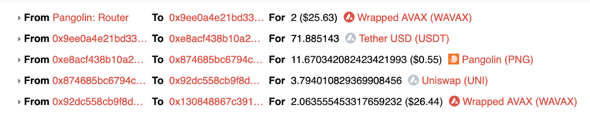

A quick recap of how this works. Alice swaps PNG for USDT. Because there is limited capital in the USDT/PNG pool, the price moves against her by let’s say 5%. The price for PNG in terms of USDT is now 5% lower than equilibrium. An arbitrageur needs to find a path that lets her reverse that trade, e.g. swap USDT for PNG, to restore equilibrium. In the case of our first trade above, we were able to put together a cycle from WAVAX to USDT to PNG to UNI and back to WAVAX that was able to claim back some fraction of the 5% slippage minus the gas, slippage, and trading fees.

快速回顾一下这是如何工作的。 Alice 将 PNG 换成 USDT。 由于 USDT/PNG 池中的资金有限，价格对她不利，比如说 5%。 以 USDT 计算的 PNG 价格现在比均衡价格低 5%。 套利者需要找到让她逆转交易的途径，例如将 USDT 换成 PNG，以恢复平衡。 在我们上面的第一笔交易的情况下，我们能够将一个从 WAVAX 到 USDT 到 PNG 到 UNI 再回到 WAVAX 的循环放在一起，能够收回 5% 滑点减去 gas、滑点和交易后的一部分费用。

Shockingly, our bot kept spitting out trades. $1 profit one minute. $5 the next. Pretty soon all of these little arbs were adding up to real money. We had built a money machine.

令人震惊的是，我们的机器人不断吐出交易。 一分钟赚 1 美元。 下一个5美元。 很快，所有这些小套利都累积成了真钱。 我们建造了一台赚钱机器。

## How an end to our fun forced us to learn the Avalanche gossip protocol

## 乐趣的终结如何迫使我们学习 Avalanche 八卦协议

For a few weeks, our little money machine hummed along without missing a beat. We built dashboards and monitors and established on-call rotations and dug in for the long haul. But then the printer stopped. Our transactions started landing behind competitors and reverting. The fun was over.

几个星期以来，我们的小型赚钱机器一直在嗡嗡作响，没有错过任何一个节拍。 我们构建了仪表板和监视器，并建立了随叫随到的轮换制度，并为长期工作埋下了伏笔。 但随后打印机停止了。 我们的交易开始落后于竞争对手并开始逆转。 乐趣结束了。

At that point, the universe of tradable instruments was still very small and only Pangolin and Zero (a newer DEX) had any kind of volume. There wasn’t much we could do to optimize the graph. On the code side, we made a few optimizations including delaying garbage collection, caching the contract ABI, and subscribing to _logs_ rather than _newHeads_ (these are both subscriptions supported by EVM-style nodes that deliver information about new transactions), which we found was a few milliseconds faster, but none of this made that much of a difference.

那时，可交易工具的范围仍然很小，只有 Pangolin 和 Zero（一种较新的 DEX）有一定的交易量。 我们无法优化图形。 在代码方面，我们做了一些优化，包括延迟垃圾收集、缓存合约 ABI 和订阅 _日志_ 而不是 _newHeads_ （这些都是 EVM 样式节点支持的订阅，提供有关新交易的信息），我们发现这是快了几毫秒，但这一切都没有太大的不同。

On a whim, we decided to connect our bot to a validator with around 10k AVAX staked instead of the regular node we were using for trading. Boom! The machine turned back on. We weren’t exactly sure what happened, but we were back in business.

一时兴起，我们决定将我们的机器人连接到一个验证器，而不是我们用于交易的常规节点，该验证器有大约 10k 的 AVAX 质押。 繁荣！ 机器重新打开。 我们不确定发生了什么，但我们又恢复了业务。

The next few months were a battle for stake. Our bot would oscillate between 0% and 100% market share depending on what partner we managed to convince to share her validators. It was clear that the path to long-term victory on Avalanche was dependent almost entirely on stake at that point and business development rather than software development would dominate our mindshare.

接下来的几个月是一场股权争夺战。 我们的机器人会在 0% 到 100% 的市场份额之间波动，这取决于我们设法说服哪个合作伙伴分享她的验证器。 很明显，在 Avalanche 上取得长期胜利的道路几乎完全取决于当时的利益，业务开发而非软件开发将主导我们的思想份额。

It wasn’t immediately clear why stake was so important. The Snowman consensus protocol used by Avalanche’s C-Chain allowed any validator to propose a block. Why would a larger validator be at a disadvantage?

目前还不清楚为什么股权如此重要。 Avalanche 的 C-Chain 使用的雪人共识协议允许任何验证者提议一个区块。 为什么更大的验证器会处于劣势？

It all came down to sampling. Snowman-vintage validators would gossip new blocks to one another through [a number of different message types](https://docs.avax.network/specs/network-protocol). When a new potentially arb-creating transaction was proposed, the validator or node through whom it was communicated via its RPC endpoint, sent a _PushQuery_ message to default 10 peers. Those 10 peers gossiped to 10 more and so on until a tipping point of validators accepted the block. This is described in more detail in the [Ava Labs whitepaper](https://assets.website-files.com/5d80307810123f5ffbb34d6e/6009805681b416f34dcae012_Avalanche%20Consensus%20Whitepaper.pdf). The _PushQuery_ message contains both the peer nodes’ preference for the tip of the blockchain and the proposed new block. The sooner one receives and decodes this message, the sooner one can update the graph and fire an arb out in response. Being one of those first 10 nodes was a huge competitive advantage.

这一切都归结为抽样。 相互闲聊新块 [Snowman-vintage 验证器会通过多种不同的消息类型](https://docs.avax.network/specs/network-protocol) 。 当一个新的潜在套利创建交易被提出时，通过其 RPC 端点与其通信的验证器或节点 _点发送一条PushQuery_ 向默认的 10 个对等 消息。 这 10 个对等点与另外 10 个对等点进行八卦，依此类推，直到验证者的临界点接受了该块。 中有更详细的描述 [这在Ava Labs 白皮书](https://assets.website-files.com/5d80307810123f5ffbb34d6e/6009805681b416f34dcae012_Avalanche%20Consensus%20Whitepaper.pdf) 。 PushQuery _。_ 消息包含对等节点对区块链尖端的偏好和提议的新区块 越早收到并解码此消息，就可以越早更新图形并发出响应作为响应。 成为前 10 个节点之一是一个巨大的竞争优势。

Those 10 nodes were selected via a stake weighted process. The probability of hearing about a transaction first scaled linearly with the stake of that node. Thus, a bot connected to a massive AVAX stake would have a nearly insurmountable advantage in arbitrage on Avalanche without access to a large edge elsewhere.

这 10 个节点是通过股权加权过程选出的。 听到交易的概率首先与该节点的权益成线性比例关系。 因此，连接到大量 AVAX 股份的机器人在 Avalanche 上的套利中将具有几乎不可逾越的优势，而无需在其他地方获得大优势。

## 6 months of tricks

## 6个月的技巧

The next six months were a battle on the blockchain. As interest in the Avalanche blockchain heated up, the competition for the growing arbitrage profits grew fiercer. Several very strong teams were backed by several groups with tens of millions of dollars in staked AVAX and market share swung wildly back and forth. Rather than getting bogged down in the details, I wanted to share a few fun examples of hacks that vaulted us back into the lead every time we thought we were down and out.

接下来的六个月是区块链上的一场战斗。 随着对 Avalanche 区块链的兴趣升温，对不断增长的套利利润的竞争也越来越激烈。 几个非常强大的团队得到了几个拥有数千万美元抵押 AVAX 和市场份额的团体的支持。 我不想陷入细节，而是想分享一些有趣的黑客攻击示例，每当我们认为自己陷入困境时，这些黑客攻击就会让我们重新回到领先地位。

## Remove timer in Avalanche Coreth

## 在 Avalanche Coreth 中删除计时器

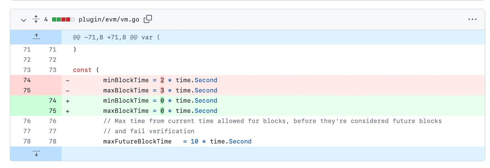

By default, the AvalancheGo node holds a block for between 2 and 3 seconds to accumulate transactions before gossiping to peers. While it seems extremely obvious that this timer would hurt a team trying to profit from speed, it was quite some time before arb teams started digging into the code to find and remove speed bumps like this. This little change 10x’ed our market share for a few weeks.

默认情况下，AvalancheGo 节点会保留一个块 2 到 3 秒，以便在与对等方闲聊之前积累事务。 虽然这个计时器似乎非常明显会伤害试图从速度中获利的团队，但在套利团队开始深入研究代码以查找和消除这样的减速带之前已经过了相当长的时间。 这个小小的变化使我们的市场份额在几周内增加了 10 倍。

## Spam peers with _PullQuery_ messages

## 垃圾邮件与 _PullQuery_ 消息对等

Getting a _PushQuery_ message in the first round is best, but one needn’t wait around to receive a new transaction as the vanilla protocol ordains. The Ava Labs docs aren’t super clear, but a _PullQuery_ message is sent to another node to learn of its current preference. Rather than wait for a _PushQuery_ message to arrive with the content of block N+1, a node can send _PullQuery_ messages every millisecond with the _ContainerID_ of N to every node to check if any of them have learned of N+1, which they communicate via a _Chit_. Once a new _ContainerID_ is received, the node immediately responds with a _Get_ message, which receives a _Put_ in response and contains the new transaction, which is then decoded and used to update the graph.

在第一轮中获得 _PushQuery_ 消息是最好的，但不必像普通协议规定的那样等待接收新交易。 Ava Labs 文档不是很清楚，但是 _PullQuery_ 消息被发送到另一个节点以了解其当前偏好。 消息，而不是等待 _带有块 N+1 内容的PushQuery_ 消息到达， _为 N 的PullQuery_ 节点可以每毫秒 _向每个节点发送ContainerID_ 以检查它们中是否有任何节点已经获悉 N+1，它们会进行通信通过 _Chit_ 。 一旦收到新的 _ContainerID_ ，节点立即响应 _Get_ 消息，该消息接收 _Put_ 响应并包含新事务，然后解码并用于更新图形。

All of these messages are a bit slow to send and decode, but this technique enabled a regular node with no stake to achieve ~5% market share against competitors with millions of AVAX staked.

所有这些消息的发送和解码都有点慢，但这种技术使没有质押的常规节点能够与拥有数百万 AVAX 质押的竞争对手相比获得约 5% 的市场份额。

## Prune cycles and replace Bellman-Ford

## 修剪循环并替换 Bellman-Ford

At this point, the number of tokens, pools, and DEXes began to explode on Avalanche. Manually whitelisting tokens and DEXes to create the graph was no longer scalable and the problems with Bellman-Ford mentioned earlier began to manifest themselves. Small arbs were blinding our algorithms to large potential profits. There was a pareto-esque distribution of arb profits and ensuring we tried for the big fish was far more important than a slight speed edge across all opportunities. We really did need to find the largest possible profit in every block.

此时，代币、矿池和 DEX 的数量开始在 Avalanche 上呈爆炸式增长。 手动将令牌和 DEX 列入白名单以创建图表不再具有可扩展性，前面提到的 Bellman-Ford 的问题开始显现出来。 小额套利让我们的算法看不到巨大的潜在利润。 套利利润呈帕累托式分布，确保我们为大鱼而努力远比在所有机会中获得轻微的速度优势重要得多。 我们确实需要在每个区块中找到最大可能的利润。

However, no closed-form algorithm existed to find the most negative cycle, much less the most profitable cycle through a given graph ([Guillermo’s paper](https://arxiv.org/pdf/2204.05238.pdf) referenced above should do this, but he had not yet published this work and I never took the time to verify the results). Instead, we had to check profits for every cycle by brute force.

然而，没有封闭形式的算法可以找到最负循环，更不用说通过给定图形找到最有利可图的循环（ [上面引用的 Guillermo 的论文](https://arxiv.org/pdf/2204.05238.pdf) 应该这样做，但他还没有发表这项工作，我也没有花时间去验证结果）。 相反，我们必须通过蛮力检查每个周期的利润。

Given that the number of cycles scales exponentially with graph size, we needed to prune this rapidly growing graph and prioritize the cycles we checked for opportunities. To prune the graph, we required heuristically determined minimum pool balances (~$5k), recent activity (>1 transaction in the last 14 days), and no fee-on-transfer tokens. To prune the cycles, limited ourselves to cycles length 4 or less and ranked them according to trailing 30-day profits. When a transaction came in that modified the balance of a pool contained in our graph, we checked the top 1024 cycles containing that pool for potential arbitrage.

鉴于循环的数量随图的大小呈指数增长，我们需要修剪这个快速增长的图并优先考虑我们检查机会的循环。 为了修剪图表，我们需要启发式确定的最低池余额（~5000 美元）、最近的活动（过去 14 天内有超过 1 笔交易），并且没有转账手续费代币。 为了修剪周期，将我们自己限制在 4 个或更短的周期长度，并根据过去 30 天的利润对它们进行排名。 当一笔交易修改了我们图表中包含的池的余额时，我们检查了包含该池的前 1024 个周期是否存在潜在套利。

These optimizations dropped our time to check for a potential arbitrage from hundreds of milliseconds to tens, but this was still too slow.

这些优化将我们检查潜在套利的时间从数百毫秒缩短到数十毫秒，但这仍然太慢了。

## Analytically calculate order size

## 分析计算订单大小

While checking each cycle increased our profits, it decreased our speed. Calculating the optimal order size by binary search for 1024 different cycles was costing us market share. Calculus would come to the rescue.

虽然检查每个周期增加了我们的利润，但它降低了我们的速度。 通过对 1024 个不同周期进行二进制搜索来计算最佳订单大小，这让我们失去了市场份额。 微积分会来拯救。

The vast majority (perhaps all at that point?) of trading on Avalanche was through UniswapV2 clones. This means that every DEX used the same constant-product function (images shamelessly stolen from [another one of Guillermo’s papers](https://arxiv.org/pdf/1911.03380.pdf)).

在 Avalanche 上进行的绝大多数交易（也许当时都是？）是通过 UniswapV2 克隆进行的。 这意味着每个 DEX 使用相同的常量积函数（图像无耻地从 [Guillermo 的另一篇论文中](https://arxiv.org/pdf/1911.03380.pdf) 窃取）。

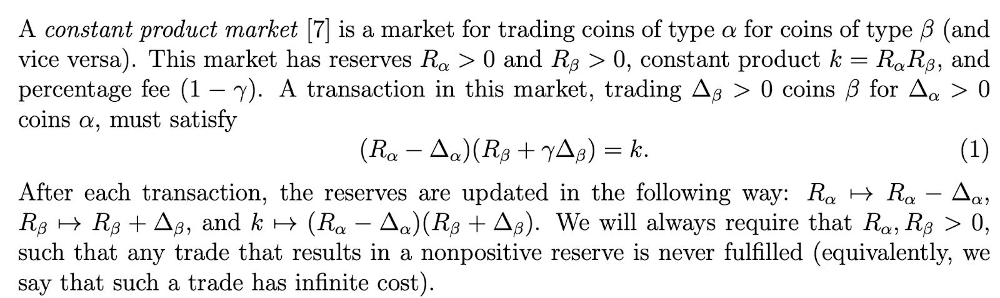

If we solve for ∆β, we generate [Uniswap’s well-known _getAmountOut_ function](https://github.com/Uniswap/v2-periphery/blob/master/contracts/libraries/UniswapV2Library.sol#L42-L50), γ∆αRβ/(Rα+γ∆α). Note that if we assume that the reserves are constant, which they are between transactions, this equation is differentiable with respect to ∆α, _amountIn_. This means that we can recursively create _getAmountOut_ functions for equations of any length, take the derivative, set it equal to zero, and calculate the optimal order size.

如果我们求解 ∆ β  ，我们将生成 [Uniswap 著名的 _getAmountOut_ 函数](https://github.com/Uniswap/v2-periphery/blob/master/contracts/libraries/UniswapV2Library.sol#L42-L50) γ∆ α  R β  /(R α  +γ∆ α  )。 请注意，如果我们假设准备金在交易之间是恒定的，则该等式对于 Δ α  和 _amountIn_ 是可微的。 这意味着我们可以递归地为任意长度的方程创建 _getAmountOut_ 函数，取导数，将其设置为零，并计算最佳订单大小。

The only problem is that this math is REALLY messy with some clever simplifications. The equation below is the derivative of a three-legged Uniswap arb (_x=amountIn_).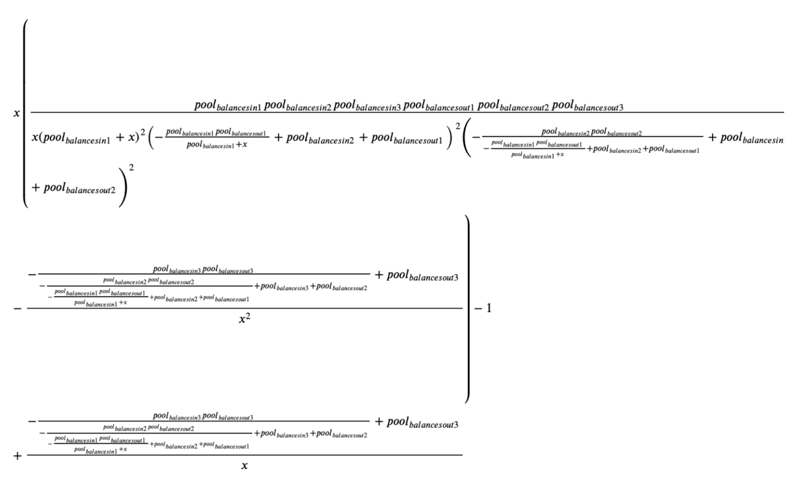

唯一的问题是这个数学真的很混乱，有一些巧妙的简化。 下面的等式是三足 Uniswap arb ( _x=amountIn_ ) 的导数。 

Fortunately, this simplifies nicely for [the types of people who can look at the expressions above and recognize that they are just a collection of sums and products](https://twitter.com/wardbradt/status/1417196568017620995).

，这很好地简化 [幸运的是，对于那些可以查看上面的表达式并认识到它们只是 sums 和 product 的集合的人来说](https://twitter.com/wardbradt/status/1417196568017620995) 了。

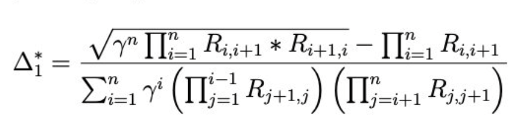

This equation sped up order size calculation by another factor of ten, dropping us into the millisecond range from receiving a new transaction to firing an arb.

这个等式将订单大小的计算速度提高了十倍，使我们进入从接收新交易到触发套利的毫秒范围内。

## Optimistic recursive order execution

## 乐观递归订单执行

The combination of these optimizations and continued success on the partnerships front vaulted us into the lead in the Avalanche arb race. However, we still had one last problem left to solve: the best arb for a given graph doesn’t necessarily extract all the inefficiencies out of the graph. A large arbitrage transaction could itself create a new arbitrage opportunity. Or two or more transactions might be necessary to fully capture the arbitrage created by the target transaction.

这些优化与合作伙伴关系方面的持续成功相结合，使我们在 Avalanche 套利竞赛中处于领先地位。 然而，我们还有最后一个问题需要解决：给定图形的最佳套利并不一定能从图形中提取所有低效部分。 大额套利交易本身就可以创造新的套利机会。 或者可能需要两个或多个交易才能完全捕获目标交易创建的套利。

Since we faced this problem, several clever algorithmic approaches have been proposed, but we took a pretty darn good shortcut. When sending an arb, we would assume that it succeeded, update our reserve values accordingly, check for another, and so on. We would recursively send transactions until all the arb was gone, ensuring that there wasn’t anything left for our competitors.

自从我们遇到这个问题以来，已经提出了几种聪明的算法方法，但我们选择了一条相当不错的捷径。 发送套利时，我们会假设它成功，相应地更新我们的保留值，检查另一个，等等。 我们会递归发送交易，直到所有套利都消失，确保没有任何东西留给我们的竞争对手。

## Victory at last (for a while)

## 终于胜利（暂时）

All this hard work paid off. By July, we had reached a ~90% market share in Avalanche arbitrage and even casual observers started to notice.

所有这些努力都得到了回报。 到 7 月，我们在 Avalanche 套利中的市场份额达到了约 90%，甚至连不经意的观察者也开始注意到了。

[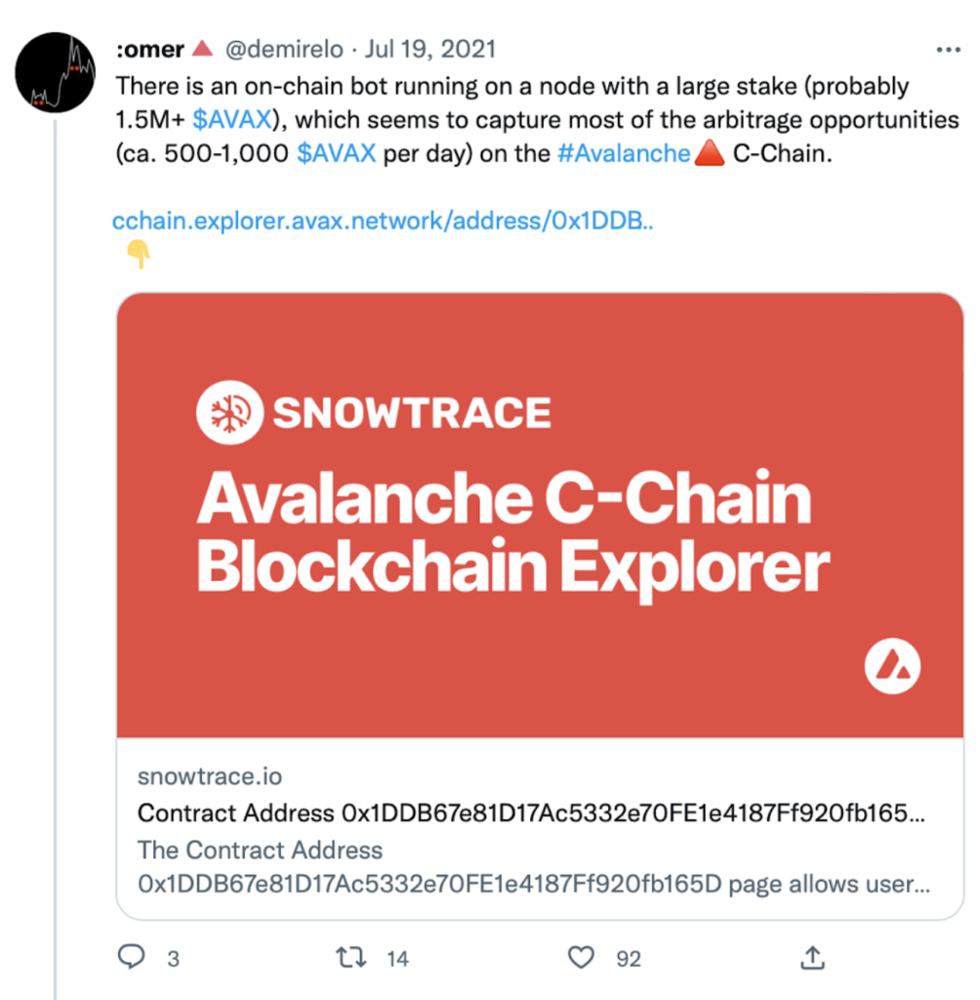](https://www.ddmckinnon.com/wp-content/uploads/2022/11/Screen-Shot-2022-11-27-at-12.48.04-PM.png)

## Congestion on the chain and the birth of Snowman++

## 链上拥塞与雪人++的诞生

The good times did not continue to roll. As the battle for stake and speed played out, a very strong competitor emerged. Every block was contentious as our two teams raced for every transaction. The very foundation of the leaderless Avalanche protocol began to quake. Essentially every potential arb created a forked chain that required reconciliation between the validators. The Avalanche team responded with [Snowman++](https://medium.com/avalancheavax/apricot-phase-four-snowman-and-reduced-c-chain-transaction-fees-1e1f67b42ecf).

美好的时光并没有继续滚动。 随着股权和速度之争的结束，一个非常强大的竞争对手出现了。 每个区块都存在争议，因为我们的两个团队都在为每笔交易而竞争。 无领导 Avalanche 协议的基础开始动摇。 基本上每个潜在的套利都创建了一个分叉链，需要验证器之间的协调。 回应 [Avalanche 团队用Snowman++](https://medium.com/avalancheavax/apricot-phase-four-snowman-and-reduced-c-chain-transaction-fees-1e1f67b42ecf) 。

This hard fork shifted the consensus engine toward what would become the Ethereum proof-of-stake model. Rather than allowing any validator to emit a block at any time, the next N validators were selected to produce blocks via a stake-weighted mechanism. The first validator on deck would have a window of M seconds to create a block or the opportunity would pass to the next one. If all N failed to propose a block, any validator could step in.

这个硬分叉将共识引擎转向了后来成为以太坊权益证明模型的东西。 不是允许任何验证者随时发出一个块，而是选择下 N 个验证者通过权益加权机制来生成块。 甲板上的第一个验证者将有 M 秒的窗口来创建一个块，否则机会将传递给下一个。 如果所有 N 都未能提议一个区块，则任何验证者都可以介入。

Snowman++ immediately had the desired effect. The moment it took effect, contention dropped to near zero and more transactions began appearing in each block. It also totally changed the game of arbitrage on Avalanche.

Snowman++ 立即产生了预期的效果。 它生效的那一刻，竞争降到接近于零，并且每个区块中开始出现更多的交易。 它还完全改变了 Avalanche 的套利游戏。

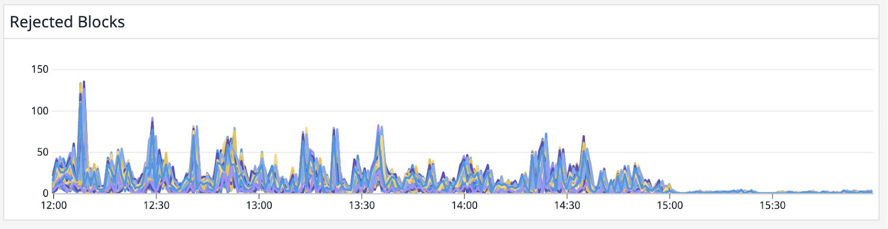

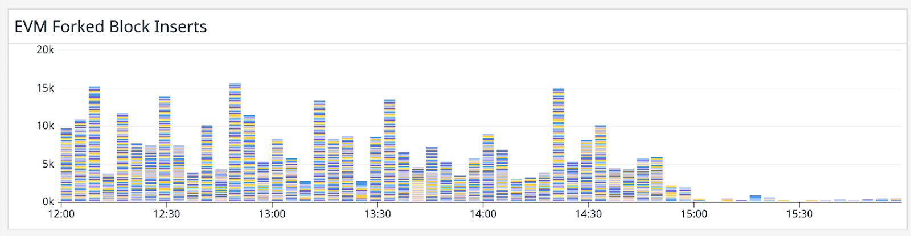

To succeed in a Snowball++ world, it was necessary to go back to some of the lessons we learned in Ethereum. Rather than mine transactions as soon as they were received (or with a small delay, depending on whether one adjusted the timers), transactions were held and batched into blocks at regular intervals. This means that a transaction would have already been broadly shared for many seconds before appearing on-chain. If one waited until the transaction was included in a block, she would find that the arbitrage opportunity was already gone. We would have to transition from inter- to intra-block arbitrage.

为了在 Snowball++ 世界中取得成功，有必要回顾我们在以太坊中学到的一些经验教训。 与其在收到交易后立即挖掘交易（或稍有延迟，具体取决于是否调整了计时器），而是定期保存交易并将其分批放入区块中。 这意味着交易在出现在链上之前已经被广泛共享了很多秒。 如果等到交易被打包进一个区块，她会发现套利机会已经没有了。 我们将不得不从区块间套利过渡到区块内套利。

This trading strategy is called backrunning. Instead of awaiting a new block, we listened to the mempool to for transactions considered for inclusion. If we found one that would trigger an arb if confirmed, we would submit the arb transaction directly to the block producer with the exact same gas price as the arb-creator with the goal to be one slot behind in the final block. Because transactions are ordered first by gas price and next by time, this was also a race.

这种交易策略称为回跑。 我们没有等待新区块，而是听取了内存池中考虑包含的交易。 如果我们发现一个在确认后会触发套利的交易，我们会将套利交易直接提交给区块生产者，其汽油价格与套利创建者完全相同，目标是在最后一个区块中落后一个时隙。 因为交易首先按 gas 价格排序，其次按时间排序，所以这也是一场竞赛。

This race was identical to the previous one with one major change on the networking layer. Instead of optimizing for hearing about new containers (blocks) quickly, one needed to optimize for hearing about new additions to the transaction mempool. These transactions were shared with the new _AppGossip_ message type, which were gossiped to both validators and non-validators without weighting by stake. This means that the arbitrageur with the most number of nodes rather than stake could control the mempool.

这场比赛与之前的比赛相同，只是网络层发生了重大变化。 与其优化以快速了解新容器（块），还不如优化以了解交易内存池的新增内容。 这些交易与新的 _AppGossip_ 消息类型共享，这些消息在不按股权加权的情况下被八卦给验证者和非验证者。 这意味着拥有最多节点而不是权益的套利者可以控制内存池。

Fortunately for us, these parameters were released ahead of the Snowman++ launch and we were ready. As the hard fork cut over, we spun up hundreds of full nodes (full nodes do not require any stake and thus are cheap to operate) to virtually guarantee that we were the first to hear about a transaction. Dominant market share was ours once again.

对我们来说幸运的是，这些参数是在 Snowman++ 发布之前发布的，我们已经做好了准备。 随着硬分叉的结束，我们启动了数百个完整节点（完整节点不需要任何股份，因此操作起来很便宜），几乎可以保证我们是第一个听到交易的人。 主导市场份额再次属于我们。

[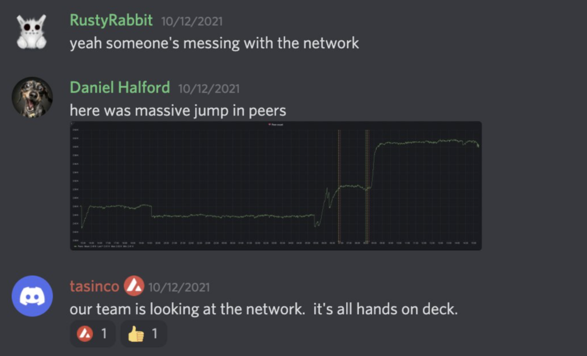](https://www.ddmckinnon.com/wp-content/uploads/2022/12/Screen-Shot-2022-12-02-at-7.32.09-AM.png)

Unfortunately for us, the Ava Labs team realized that treating full nodes and validators with parity perhaps didn’t make much sense. While we weren’t doing anything to impact the performance of the network, if we had wanted to, we easily could have used this configuration to censor transactions and cause other problems without no repercussions.

对我们来说不幸的是，Ava Labs 团队意识到以奇偶校验方式对待完整节点和验证器可能没有多大意义。 虽然我们没有做任何影响网络性能的事情，但如果我们愿意，我们可以很容易地使用此配置来审查交易并导致其他问题而不会产生任何影响。

They quickly shipped an updated version to edit the default _AppGossip_ parameters to sample only validators and ignore full nodes. This meant that it was back to a slightly modified battle for stake where number of nodes rather than absolute quantity of AVAX would anoint the winner.

他们迅速发布了一个更新版本来编辑默认的 _AppGossip_ 参数以仅对验证器进行采样并忽略完整节点。 这意味着它又回到了一场略有修改的权益争夺战，其中节点数量而不是 AVAX 的绝对数量将决定获胜者。

## Alpha decay

## α衰变

Hustle as we could, we eventually saw our market share drop. A few percent here. A few percent there. Soon, we weren’t making enough to pay the massive AWS bills that we were incurring in running a large network of validators and had to resort to running multiple machines on a single Hetzner machine until finally we couldn’t cover that cost either.

尽我们所能，我们最终看到我们的市场份额下降。 这里有百分之几。 那里有百分之几。 很快，我们赚的钱就不足以支付我们在运行大型验证器网络时产生的巨额 AWS 账单，不得不求助于在一台 Hetzner 机器上运行多台机器，直到我们最终也无法支付这笔费用。

A tip of the hat to the smart traders who outcompeted us and are still printing money today. Exactly how you did it continues to nag me to this day. If you ever felt like sharing your side of the story, I could finally lay to rest a little nagging part of my psyche.

向那些在竞争中胜过我们并且今天仍在印钞的聪明交易者致敬。 直到今天，你到底是怎么做到的一直困扰着我。 如果你想分享你的故事，我终于可以放下我心灵中的那部分唠叨了。

## Onward

## 向前

This entire project started with an email inspired by [my first blog post](https://www.ddmckinnon.com/2019/04/24/a-practical-treatise-on-pairs-trading-bellman-ford-shannons-demon-and-order-book-pressure-tales-from-18-months-of-cryptocurrency-arbitrage/). I wish I could be so lucky as to find a second opportunity in my inbox. After a bit of a break, I am beginning to explore this space again. If you are smart and motivated and would like to collaborate, drop me a line. I’ll plan on following this post up with a number of other experiments and side projects that didn’t quite fit into the narrative here, so stay tuned for more. Thanks for reading!

整个项目始于一封受 [我第一篇博文](https://www.ddmckinnon.com/2019/04/24/a-practical-treatise-on-pairs-trading-bellman-ford-shannons-demon-and-order-book-pressure-tales-from-18-months-of-cryptocurrency-arbitrage/) 启发的电子邮件。 我希望我能幸运地在收件箱中找到第二次机会。 稍作休息后，我又开始探索这个空间。 如果您聪明有干劲并愿意合作，请给我写信。 我将计划在这篇文章之后进行一些其他的实验和副项目，这些实验和项目不太适合这里的叙述，敬请期待更多。 谢谢阅读！
