In this guide, we'll go through the hot topics of FFmpeg. But before that, we'll cover some base ground to help you understand basic media concepts and FFmpeg. Feel free to skip the parts that are already trivial for you!

在本指南中，我们将讨论 FFmpeg 的热门话题。 但在此之前，我们将介绍一些基础知识，以帮助您了解基本的媒体概念和 FFmpeg。 随意跳过对您来说已经微不足道的部分！

## Introduction to FFmpeg

[FFmpeg.org](https://ffmpeg.org/about.html)'s definition is the following: "FFmpeg is the leading multimedia framework, able to decode, encode, transcode, mux, demux, stream, filter and play pretty much anything that humans and machines have created. It supports the most obscure ancient formats up to the cutting edge. No matter if they were designed by some standards committee, the community or a corporation."

[FFmpeg.org](https://ffmpeg.org/about.html) 的定义如下：“FFmpeg 是领先的多媒体框架，能够解码、编码、转码、mux、demux、流、过滤和播放人类和机器创造的几乎任何东西。它支持最晦涩的古老的格式一直到最前沿。无论它们是由某个标准委员会、社区还是公司设计的。”

I think of FFmpeg as the go-to application for audio/video manipulation in an automated or scripted manner.

我将 FFmpeg 视为以自动或脚本方式处理音频/视频的首选应用程序。

When you need to implement a service that manipulates video, or just have 300 media files that need to be converted into a different format, FFmpeg is your - nerdy - friend.

当您需要实施处理视频的服务，或者只有 300 个媒体文件需要转换为不同格式时，FFmpeg 是您的 - 书呆子 - 朋友。

FFmpeg can do large chunks of the basic functionalities of a modern Non-linear (NLE) video editors, e.g., Davinci Resolve Studio or Premiere Pro. But, it does not have a graphical interface in that sense as those behemoths do, and unarguably it is way less friendly.

FFmpeg 可以执行现代非线性 (NLE) 视频编辑器（例如 Davinci Resolve Studio 或 Premiere Pro）的大部分基本功能。 但是，它没有像那些庞然大物那样的图形界面，而且毫无疑问它不太友好。

In a general NLE, you might do things like these:

在一般的 NLE 中，您可能会执行以下操作：

1.  Click to import a file
2.  Drop it into the timeline
3.  Trim and Cut
4.  Add an overlay image
5.  Crop that overlay
6.  Add vignette
7.  Add some color changing effects, e.g. change the hue
8.  Add an extra audio track to the mix
9.  Change the volume
10.  Add some effects, e.g.: echo
11.  Export into various formats
12.  Export into a deployable video format
13.  Export the master audio in wav

1.  点击导入文件
2.  将它放入时间轴
3.  修剪和切割
4.  添加叠加图像
5.  裁剪叠加层
6.  添加插图
7.  添加一些颜色变化效果，例如改变色调
8.  在混音中添加额外的音轨
9.  改变音量
10.  添加一些效果，例如：echo
11.  导出为各种格式
12.  导出为可部署的视频格式
13.  以 wav 格式导出主音频

Or, to achieve the exact same thing, you could also execute this command:

或者，要实现完全相同的效果，您还可以执行以下命令：

Yes, it isn't friendly at all, but it is very, very powerful once you become friends with FFmpeg.

是的，它一点都不友好，但是一旦你与 FFmpeg 成为朋友，它就会非常非常强大。

Check out this comparison of the original and the edited one:

查看原始和编辑后的比较：

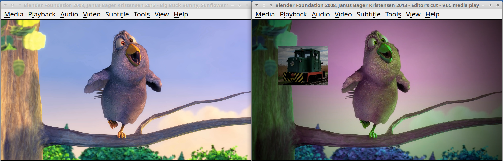

If you want to try this command out, get the [example](https://img.ly/blog/ultimate-guide-to-ffmpeg/#example-material) files and see it for yourself!

如果您想尝试此命令，请获取 [示例](https://img.ly/blog/ultimate-guide-to-ffmpeg/#example-material) 文件并亲自查看！

### Installing FFmpeg

### 安装 FFmpeg

FFmpeg is available for most common and even uncommon platforms and architectures. You can be on Linux, Mac OS X or Microsoft Windows, and you'll be able to run or link to FFmpeg.

FFmpeg 适用于大多数常见甚至不常见的平台和架构。 您可以在 Linux、Mac OS X 或 Microsoft Windows 上运行，并且可以运行或链接到 FFmpeg。

Installing FFmpeg is easy on most platforms! There is no installer, usually just a compressed archive you need to get for your platform and architecture.

在大多数平台上安装 FFmpeg 都很容易！ 没有安装程序，通常只是您需要为您的平台和体系结构获取的压缩存档。

In the case of Linux, most distributions include a pre-built FFmpeg in their software repositories. Therefore, you can install FFmpeg from those even more quickly.

对于 Linux，大多数发行版都在其软件存储库中包含一个预构建的 FFmpeg。 因此，您可以更快地从这些安装 FFmpeg。

-   [Download for Microsoft Windows](https://ffmpeg.org/download.html#build-windows)
-   [下载 Microsoft Windows](https://ffmpeg.org/download.html#build-windows)
-   [Download for Mac](https://ffmpeg.org/download.html#build-mac)
-   [下载适用于 Mac](https://ffmpeg.org/download.html#build-mac)
-   [Download for Linux](https://ffmpeg.org/download.html#build-linux)
-   [Linux 版下载](https://ffmpeg.org/download.html#build-linux)

### FFmpeg history

### FFmpeg 历史

The project was started in 2000 by the awesome [Fabrice Bellard](https://bellard.org/). The name is a concatenation of "FF" meaning "fast-forward" and MPEG, the name of a video standards group. It has been very well, active and alive since then, [releasing](https://ffmpeg.org/releases) a new release about every three months.

该项目于 2000 年由了不起的 [Fabrice Bellard](https://bellard.org/) 启动。 该名称是“FF”（意为“快进”）和 MPEG（视频标准组的名称）的组合。 从那时起，它一直非常活跃、活跃， [发布一个新版本。](https://ffmpeg.org/releases) 大约每三个月

### FFmpeg supported codecs and formats

### FFmpeg 支持的编解码器和格式

The default FFmpeg shipped with my Ubuntu Linux distribution supports about 460 codecs and 370 formats.

我的 Ubuntu Linux 发行版附带的默认 FFmpeg 支持大约 460 种编解码器和 370 种格式。

See it for yourself:

自己看看：

### Compilation of FFmpeg

### FFmpeg的编译

Keep in mind that the supported codecs and formats (and filters, demuxers, muxers, input and output methods, etc.) are highly dependent on the so-called compilation flags.

请记住，支持的编解码器和格式（以及过滤器、多路分解器、多路复用器、输入和输出方法等）高度依赖于所谓的编译标志。

This means that the above number only represents the fact that it supports at least this many codecs and formats. Still, there are even more that the package builders excluded for various reasons, e.g.: licensing, architecture, size considerations, etc.

这意味着上述数字仅代表它至少支持这么多编解码器和格式的事实。 尽管如此，由于各种原因，例如：许可、体系结构、大小考虑等，软件包构建器还排除了更多。

Since FFmpeg is [open source](https://ffmpeg.org/download.html#repositories), you can [compile FFmpeg](https://trac.ffmpeg.org/wiki/CompilationGuide) for yourself at any time.

由于 FFmpeg 是 [开源](https://ffmpeg.org/download.html#repositories) 的，您可以随时 [为自己编译 FFmpeg](https://trac.ffmpeg.org/wiki/CompilationGuide) 。

Suppose for example, that you care about your layer's size (therefore the bootstrap speed) in AWS Lambda. In this case, you can compile an FFmpeg binary that only contains the mp3 encoder for example, and nothing else.

例如，假设您关心 AWS Lambda 中层的大小（因此关心引导速度）。 在这种情况下，您可以编译一个只包含 mp3 编码器的 FFmpeg 二进制文件，而不包含任何其他内容。

Also, you might not want to run into licensing issues and leave out stuff that would cause problems for your use case. Therefore you choose to leave out particular codecs/formats. I highly recommend checking out the "--enable-gpl", "--enable-nonfree" and "--enable-version3" [compilation flags](https://github.com/FFmpeg/FFmpeg/blob/master/configure) in this case, as well as [this](https://ffmpeg.org/legal.html).

此外，您可能不希望遇到许可问题并遗漏会导致您的用例出现问题的内容。 因此，您选择忽略特定的编解码器/格式。 我强烈建议在这种情况下检查“--enable-gpl”、“--enable-nonfree”和“--enable-version3” [编译标志](https://github.com/FFmpeg/FFmpeg/blob/master/configure) ，以及 [这个](https://ffmpeg.org/legal.html) .

Or you might want to have a standalone FFmpeg binary in your project (e.g.: embedded, or some cloud instance), that does not depend on any operating system libraries. Then you want to make a so-called static build, that compiles in all the libraries into a single binary file, and does not depend on your OS' libraries and the runtime loading of other FFmpeg libraries. Search around for "--enable-static" in this case.

或者您可能希望在您的项目中有一个独立的 FFmpeg 二进制文件（例如：嵌入式或某些云实例），它不依赖于任何操作系统库。 然后你想做一个所谓的静态构建，将所有库编译成一个二进制文件，并且不依赖于你的操作系统的库和其他 FFmpeg 库的运行时加载。 在这种情况下搜索“--enable-static”。

Finally, you can find pre-built static FFmpeg builds [right here](https://johnvansickle.com/ffmpeg/) too.

找到预构建的静态 FFmpeg 构建 [最后，您也可以在这里](https://johnvansickle.com/ffmpeg/) 。

### FFmpeg's strengths

### FFmpeg的优势

FFmpeg reads and writes most video and audio formats that matter for most of us. It is a very capable and high-performance tool for converting and manipulating these formats.

FFmpeg 读取和写入对我们大多数人来说很重要的大多数视频和音频格式。 它是一种功能强大的高性能工具，可用于转换和操作这些格式。

But FFmpeg can do even more!

但是 FFmpeg 可以做的更多！

### Filtering

### 过滤

FFmpeg has vast amounts of filters for audio and video. Therefore, video manipulation is also a key feature of FFmpeg.

FFmpeg 有大量的音频和视频过滤器。 因此，视频处理也是FFmpeg的一个关键特性。

### Hardware acceleration

### 硬件加速

It does support many kinds of hardware accelerations! Video encoding is a very resource-intensive operation, and you might come across quite a few hardware devices or features that might speed up your process!

它确实支持多种硬件加速！ 视频编码是一项非常耗费资源的操作，您可能会遇到很多硬件设备或功能可能会加快您的进程！

Most notably, if you have an NVIDIA card, you can increase your H.264 or H.265 encoding and decoding throughput by multipliers compared to your CPU. But other things, such as VDPAU, VAAPI, or OpenCL, can be leveraged to boost your pipeline's throughput.

最值得注意的是，如果您有 NVIDIA 卡，与 CPU 相比，您可以通过乘数增加 H.264 或 H.265 编码和解码吞吐量。 但可以利用 VDPAU、VAAPI 或 OpenCL 等其他东西来提高管道的吞吐量。

Learn more about the supported hardware acceleration methods [here](https://trac.ffmpeg.org/wiki/HWAccelIntro).

了解有关支持的硬件加速方法的更多信息 [在此处](https://trac.ffmpeg.org/wiki/HWAccelIntro) 。

### Versatile input/output methods

### 多种输入/输出方法

FFmpeg is also very capable when it comes to accessing input and output data.

FFmpeg 在访问输入和输出数据方面也非常有能力。

Just to name a few: it can use your webcam, record from your microphone, grab your screen, or capture from your Blackmagic DeckLink. But FFmpeg can download directly from a web address, open all kinds of streams, read from a pipe, a socket, and of course, from files.

仅举几例：它可以使用您的网络摄像头，从您的麦克风录制，抓取您的屏幕，或从您的 Blackmagic DeckLink 捕捉。 但是 FFmpeg 可以直接从网址下载，打开各种流，从管道、套接字，当然还有文件中读取。

The same holds true for outputting the data. It can write to your webcam, play audio on your microphone... Just kidding:) It can output to files, streams, pipes, sockets and so on.

输出数据也是如此。 它可以写入您的网络摄像头，在您的麦克风上播放音频...开个玩笑:)它可以输出到文件、流、管道、套接字等。

### Running example commands

### 运行示例命令

This article is full of FFmpeg commands that are working examples. The reason for that is that you could test these out for yourself! But the command line interfaces of different operating systems are slightly different, so the commands in this article are meant to be executed in a Linux bash shell.

这篇文章充满了 FFmpeg 命令，它们都是工作示例。 这样做的原因是您可以自己测试这些！ 但不同操作系统的命令行界面略有不同，因此本文中的命令旨在在 Linux bash shell 中执行。

To adopt these command lines to Microsoft Windows, you might need to:

要将这些命令行应用于 Microsoft Windows，您可能需要：

1.  Change (cd) into the directory where you extracted the ffmpeg.exe. Alternatively, add that directory to the [path](https://duckduckgo.com/?t=ffab&q=add+binary+to+path+windows) to make it callable from anywhere.
2.  You might need to replace "ffmpeg" to "ffmpeg.exe"
3.  You will need to replace "**\\**"-s (backslashes) at the end of the lines with "**^**"-s (hats)
4.  You'll need to replace the `fontfile` argument's value to something like this:  `fontfile=/Windows/Fonts/arial.ttf` to get commands with the drawtext filter working.

1.  将 (cd) 更改为解压缩 ffmpeg.exe 的目录。 或者，将该目录添加到 [路径](https://duckduckgo.com/?t=ffab&q=add+binary+to+path+windows) 中以使其可从任何地方调用。
2.  您可能需要将“ffmpeg”替换为“ffmpeg.exe”
3.  您需要将行尾的“ **\\** ”-s（反斜杠）替换为“ **^** ”-s（帽子）
4.  你需要更换 `fontfile`参数的值是这样的： `fontfile=/Windows/Fonts/arial.ttf`获取使用 drawtext 过滤器工作的命令。

MacOS users will need steps #1 and #4.

MacOS 用户将需要步骤#1 和#4。

Now let's have a quick overview of media concepts. These concepts will be vital for us if we want to understand the latter sections of this article and FFmpeg's workings. To keep this section brief, it is a higher-level, simplified explanation of these concepts.

现在让我们快速了解一下媒体概念。 如果我们想要理解本文后面的部分和 FFmpeg 的工作原理，这些概念对我们来说至关重要。 为了使本节简短，它是对这些概念的更高层次的简化解释。

### Audio

### 声音的

We'll briefly cover the following terms:

我们将简要介绍以下术语：

1.  Sampling rate
2.  Bitrate
3.  Channels

1.  采样率
2.  比特率
3.  频道

### Sampling Rate

### 采样率

The sampling rate is the factor that shows how many times we measure/scan/sample the input data stream.

采样率是显示我们测量/扫描/采样输入数据流多少次的因素。

The image below shows the measurement windows (quantization) as gray bars.

下图将测量窗口（量化）显示为灰色条。

Why does this matter? Because it is a balancing act. If we measure the signal less often, we'll lose more details (bad). Also, by having fewer samples, we'll have less data in the end. Therefore the file size will be smaller (good).

为什么这很重要？ 因为这是一种平衡行为。 如果我们不经常测量信号，就会丢失更多细节（不好）。 此外，通过减少样本，我们最终会得到更少的数据。 因此文件大小会更小（好）。

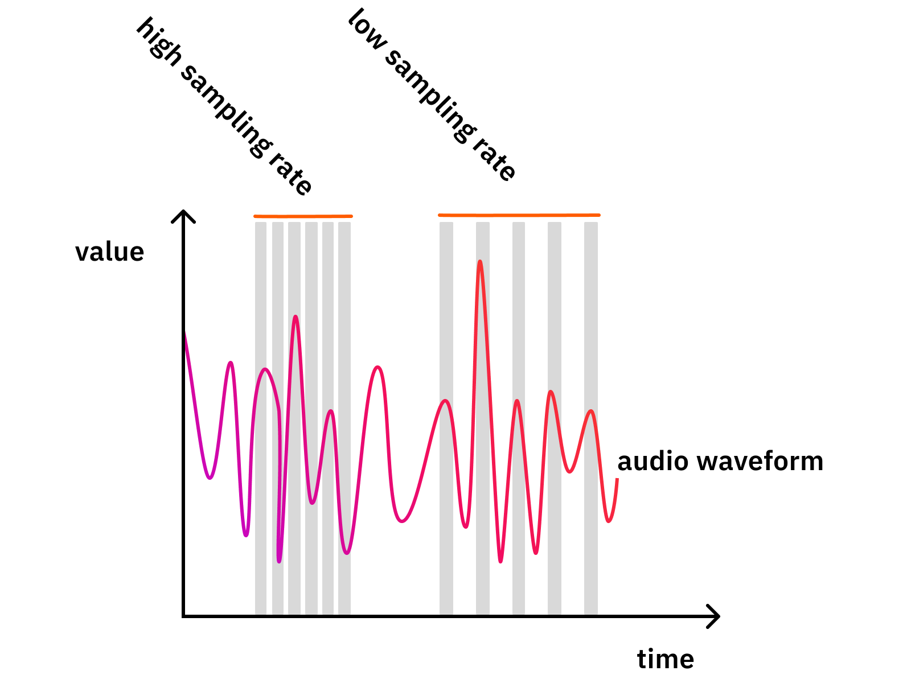

Here are some ballpark values:

以下是一些大概值：

-   8 kHz (GSM - Low quality)
-   8 kHz（GSM - 低质量）
-   44.1 kHz (CD - High quality)
-   44.1 kHz（CD - 高质量）
-   48 kHz (Very high quality)
-   48 kHz（非常高质量）
-   88.2 kHz (Insane - usually for production only)
-   88.2 kHz（疯狂 - 通常仅用于制作）
-   96 kHz (Insane - usually for production only)
-   96 kHz（疯狂 - 通常仅用于生产）

There are no definite "right answers" here. The question is what is "good enough" for your use case? GSM focuses on speech, and not even quality but understandability and the least possible amount of data. Therefore, they found that 8 kHz is enough (there are quite a few more tricks), for their purposes.

这里没有明确的“正确答案”。 问题是什么对您的用例来说“足够好”？ GSM 专注于语音，甚至不是质量而是可理解性和尽可能少的数据量。 因此，他们发现 8 kHz 足以满足他们的目的（还有很多技巧）。

The "CD quality" aimed for high quality. Therefore they chose 44.1 kHz, that number has some history in it, but the main reason for aiming above 40 kHz lies in physics and how the human ear works.

“CD品质”以高品质为目标。 因此他们选择了 44.1 kHz，这个数字有一些历史，但将目标定在 40 kHz 以上的主要原因在于物理学和人耳的工作原理。

There were two very smart guys whose [theorem](https://en.wikipedia.org/wiki/Nyquist%E2%80%93Shannon_sampling_theorem) basically says that if you want a quite good signal representation, you have to sample it at twice the speed as its original frequency. Human hearing generally [works](https://en.wikipedia.org/wiki/Hearing_range) up until about 20 kHz, so if you want "good quality", you should aim for at least 40 kHz. And 40 kHz + some headroom + some more physics + historical reasons = 44.1 kHz! :)

有两个非常聪明的人，他们的 [定理](https://en.wikipedia.org/wiki/Nyquist%E2%80%93Shannon_sampling_theorem) 基本上是说，如果你想要一个非常好的信号表示，你必须以两倍于其原始频率的速度对其进行采样。 人类的听觉通常 [在 20 kHz 左右时起作用](https://en.wikipedia.org/wiki/Hearing_range) ，因此如果您想要“高质量”，您的目标应该至少是 40 kHz。 40 kHz + 一些动态余量 + 一些物理 + 历史原因 = 44.1 kHz！ :)

As for the higher rates, those are only used when very high-quality audio editing is needed.

至于更高的速率，只有在需要非常高质量的音频编辑时才会使用。

### Bitrate

### 比特率

Bitrate represents the amount of data per second that results from our transcoding/quantization process. If it is 1411 kbit/s, that means that for every second of audio data, about 1411 kbit of output data will be produced.

比特率表示我们的转码/量化过程产生的每秒数据量。 如果是1411kbit/s，那就意味着每秒钟的音频数据，大约会产生1411kbit的输出数据。

Therefore, you can say that 1 minute of audio with 1411 kbit/sec will require:

因此，您可以说 1 分钟的 1411 kbit/sec 音频将需要：

`(1411 kbit / 8) kbyte * 60 second = 10582 kbyte = 10.33 mbyte`

`(1411 kbit / 8) kbyte * 60 second = 10582 kbyte = 10.33 mbyte`

Now, it is only easy like that with raw audio data and with a few simple codecs, e.g. PCM in WAVs.

现在，只有使用原始音频数据和一些简单的编解码器（例如 WAV 中的 PCM）才能轻松做到这一点。

Codecs compressing hard might throw your numbers around a little, as input data might be compressible with different rates. Variable bitrate is usually happening to save space. The encoder might output a lower bitrate if the data is "simple" and does not require high precision.

硬压缩的编解码器可能会使您的数字略有不同，因为输入数据可能会以不同的速率压缩。 通常会发生可变比特率以节省空间。 如果数据“简单”并且不需要高精度，编码器可能会输出较低的比特率。

Here are some ballpark values:

以下是一些大概值：

-   13 kbits/s (GSM quality)
-   13 kbits/s（GSM 质量）
-   320 kbit/s (High-quality MP3)
-   320 kbit/s（高品质 MP3）
-   1411 kbit/s (16bit WAV, CD quality, PCM)
-   1411 kbit/s（16 位 WAV、CD 质量、PCM）

### Channels

### 频道

Inside of most audio formats, you can have more audio channels. This means multiple, separated audio streams can be in the same file.

在大多数音频格式中，您可以拥有更多的音频通道。 这意味着多个分离的音频流可以在同一个文件中。

Many times, multiple channels have their own name:

很多时候，多个频道都有自己的名字：

-   If you have a single microphone, you will most probably record it into a single channel called Mono.
-   如果您只有一个麦克风，您很可能会将其录制到一个称为单声道的通道中。
-   General music from the FM radio or streaming services usually has two channels in a so-called "Stereo" configuration.
-   来自 FM 收音机或流媒体服务的一般音乐通常在所谓的“立体声”配置中有两个频道。

With stereo, there could be several methods how the audio "image" can be made richer by leveraging audio [panning](https://en.wikipedia.org/wiki/Panning_(audio)), time and phase-shifting and much more. There is a special recording technique too, called [Binaural recording](https://en.wikipedia.org/wiki/Binaural_recording), which is super awesome. Wear headphones for [this](https://www.youtube.com/watch?v=aQH-jwE_kfo), and don't be scared:)

来使音频“图像”变得更丰富 [对于立体声，可能有多种方法可以通过利用音频声像](https://en.wikipedia.org/wiki/Panning_(audio)) 、时间和相移等 。 还有一种特殊的录音技术，叫做 [双耳录音](https://en.wikipedia.org/wiki/Binaural_recording) ，非常棒。 戴上耳机 [为此](https://www.youtube.com/watch?v=aQH-jwE_kfo) ，不要害怕:)

For example, here are [Big Buck Bunny](https://peach.blender.org/)'s audio waveforms in [Audacity](https://www.audacityteam.org/):

例如，这里是 [Big Buck Bunny](https://peach.blender.org/) 中的音频波形 [在Audacity](https://www.audacityteam.org/) ：

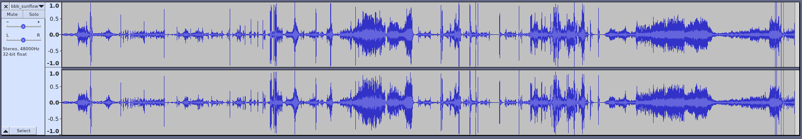

You can see that there are two lines of waveforms and also that they are pretty similar. That is normal, as you usually hear the same thing with your two ears, but the matter is in the subtle differences between the two. That's where directionality, richness, and all kinds of other effects lie.

您可以看到有两行波形，而且它们非常相似。 这很正常，因为您通常会用两只耳朵听到相同的声音，但问题在于两者之间的细微差别。 这就是方向性、丰富性和各种其他效果所在。

But why stop at two? The list continues:

但为什么停在两点？ 清单继续：

-   2.1, as it is often called, means three channels: 2 for stereo and one for the LFE ("low-frequency effects" a.k.a.: "bass").
-   2.1，正如它通常所说的那样，意味着三个通道：2 个用于立体声，1 个用于 LFE（“低频效果”又名：“低音”）。
-   5.1 is similar, with five directional channels (2 front, 1 center, 2 rear) and the LFE.
-   5.1 类似，有五个定向通道（2 个前置、1 个中置、2 个后置）和 LFE。

So channels are just separate "recordings" or "streams" of audio signals.

所以频道只是音频信号的单独“录音”或“流”。

### Image properties

### 图片属性

For images, there are quite a few parameters, but we'll check out only these:

对于图像，有很多参数，但我们只会检查这些：

-   Resolution
-   解析度
-   Bit-depth
-   位深度
-   Transparency
-   透明度

### Resolution

### 解析度

An image consists of pixels, single points that have a single color. The resolution of an image determines how many columns and rows of pixels are in an image. In other words: an image has a width and a height.

图像由具有单一颜色的像素、单个点组成。 图像的分辨率决定了图像中像素的列数和行数。 换句话说：图像具有宽度和高度。

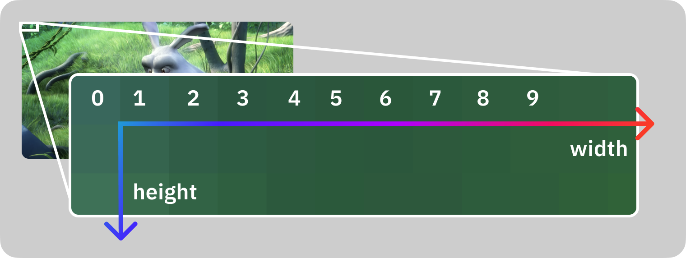

This image shows the first 10 pixels in the first row.

此图像显示第一行中的前 10 个像素。

Here are some ballpark values for resolution:

以下是分辨率的一些大概值：

-   "HD" or "Full HD" or "1K" or "1080p" means 1920x1080 pixels.
-   “高清”或“全高清”或“1K”或“1080p”表示 1920x1080 像素。
-   "4K" could mean a few values, but it should be about 3840x2160 pixels.
-   “4K”可能意味着一些值，但它应该是大约 3840x2160 像素。
-   A regular 16mp photo you make of your cat is about 4608x3456 pixels.
-   您为您的猫制作的普通 16mp 照片大约为 4608x3456 像素。
-   General social media image posts are about 1080x1080 pixels.
-   一般社交媒体图片帖子的大小约为 1080x1080 像素。

### Bit-depth

### 位深度

Bit-depth represents the number of bits used for storing a single pixel's color value. This is the same balancing game, and you need to decide between quality or file size.

位深度表示用于存储单个像素颜色值的位数。 这是同一个平衡游戏，您需要在质量或文件大小之间做出决定。

General ballpark values for bit-depth:

位深度的一般大概值：

| Bits | Colors | Notes |
| --- | --- | --- |
| 1 | 2 | Black & White |
| 8 | 256 | B/W or Limited color palette |
| 24 | 16.7m | 3x**8 bit** for R-G-B "True color" |
| 30 | 1073m | 3x**10 bit** for R-G-B "Deep color" |

| 位 | 颜色 | 笔记 |
| --- | --- | --- |
| 1 | 2 | 黑，白 |
| 8 | 256 | 黑白或有限调色板 |
| 24 | 16.7m | 3x **8 位** RGB“真彩色” |
| 30 | 1073米 | 3x **10 位** RGB“深色”的 |

These last two sometimes are referred to as "8 bit" or "10 bit" respectively, especially when talking about videos. That means 8/10 bits per single color channel.

最后两个有时分别称为“8 位”或“10 位”，尤其是在谈论视频时。 这意味着每个单一颜色通道 8/10 位。

### Transparency

### 透明度

Some image formats support an additional channel together with the red, green, and blue components: the alpha channel. The alpha channel determines how transparent a single pixel is, and it can have different bit-depths, it is usually either 1, 8 or 16 bits.

某些图像格式支持附加通道以及红色、绿色和蓝色分量：alpha 通道。 Alpha 通道决定了单个像素的透明度，它可以有不同的位深度，通常是 1、8 或 16 位。

If the alpha channel is 1 bit, then the format can encode a pixel to be either transparent or non-transparent. If it is 8 or more bits, then the format can encode 256 or more steps of transparency.

如果 alpha 通道是 1 位，则该格式可以将像素编码为透明或不透明。 如果它是 8 位或更多位，则该格式可以编码 256 或更多的透明度步骤。

### Video properties

### 视频属性

Video data is built by single images shown right after each other. This brings in most attributes of images and a few more!

视频数据由紧接着显示的单个图像构成。 这带来了图像的大多数属性以及更多！

So a video has a `resolution` that is its width and height.

所以一个视频有一个 `resolution`那就是它的宽度和高度。

Then the first obvious parameter of a video is the `framerate`, which defines how many images are shown in a second. Common values for this are 24, 25, 30, or 60.

那么视频的第一个明显参数是 `framerate`，它定义了每秒显示多少张图像。 其常用值为 24、25、30 或 60。

A video file also has a `codec` assigned to it, which is the format describing how all those images were compressed into this video file. There are many more attributes of videos, but this is a good start.

一个视频文件也有一个 `codec`分配给它，这是描述所有这些图像如何被压缩到这个视频文件中的格式。 视频还有很多属性，但这是一个好的开始。

### Video codecs

### 视频编解码器

Compression is a super important thing when it comes to video because you have thousands of images to keep together. If you aren't doing it in a smart way, then the resulting video will be very, very large.

对于视频来说，压缩是一件非常重要的事情，因为你有成千上万的图像需要保存在一起。 如果您没有以巧妙的方式进行操作，那么生成的视频将非常非常大。

Just imagine a 2-minute video, with 30 fps. That means it will have 60 s \* 2 \* 30 fps = 3600 frames! I have just taken a screenshot of an HD video, which was 730 kbyte in JPEG format. Now 3600 frame \* 730 kbyte equals 2.5 gigabytes!

想象一下 2 分钟的视频，每秒 30 帧。 这意味着它将有 60 s \* 2 \* 30 fps = 3600 帧！ 我刚刚截取了一个高清视频的屏幕截图，它是 JPEG 格式的 730 kbyte。 现在 3600 帧 \* 730 kbyte 等于 2.5 GB！

Can you imagine that? I hope not, and that's because compression brings that way, way down, to the level of tens of megabytes. These days a video of that size is quite high quality and about 2 hours long. Also, don't forget, that JPEG is already compressed, a single frame would be 6 mbyte when uncompressed. Now that 2-minute video would be 21 gigabytes if we'd store it uncompressed.

你能想象吗？ 我希望不会，那是因为压缩使这种方式下降到几十兆字节的水平。 如今，那种大小的视频质量相当高，时长约 2 小时。 另外，不要忘记，JPEG 已经被压缩，未压缩时单个帧为 6 兆字节。 如果我们不压缩地存储 2 分钟的视频，那么它的大小将达到 21 GB。

Standard codecs such as H.264 and H.265 are doing very clever and complex operations to achieve high compression ratios with good quality.

H.264 和 H.265 等标准编解码器正在执行非常巧妙和复杂的操作，以实现高质量的高压缩比。

Just think about that, most frames in a video are quite similar, only containing small differences. So if we could only store that little difference between frames, we'd won a huge bonus! And that's just one of the many tricks codecs do.

试想一下，视频中的大多数帧都非常相似，只有很小的差异。 因此，如果我们只能存储帧之间的微小差异，我们将获得巨大的奖励！ 而这只是编解码器的众多技巧之一。

Codec designers are also exploiting the weaknesses and features of the human eye. Such as the fact that we are more sensitive to light intensity changes than color changes (say hello to [YUV](https://en.wikipedia.org/wiki/YUV)). And they can get away with lower quality details for parts [that are moving fast](https://en.wikipedia.org/wiki/Motion_blur#Biology), and so on.

编解码器设计人员也在利用人眼的弱点和特征。 问好 [例如我们对光强度变化比颜色变化更敏感（向YUV](https://en.wikipedia.org/wiki/YUV) ）。 他们可以为 [快速移动](https://en.wikipedia.org/wiki/Motion_blur#Biology) 的零件等提供较低质量的细节。

Because why lose precious bits for things that you can't even notice?!

因为为什么要为您甚至无法注意到的事情丢失宝贵的信息？！

There are many codecs out there, with different goals in mind, although the majority focus on keeping the file size low.

市面上有许多编解码器，它们的目标各不相同，但大多数都专注于保持较小的文件大小。

-   H.264, H.265: These are the most common ones, with the widest support in browsers, phones, players, etc. It focuses on small file sizes with good quality. (At the cost of resource intensiveness.)
-   H.264、H.265：这些是最常见的，在浏览器、手机、播放器等中得到最广泛的支持。它侧重于小文件大小和高质量。 （以资源密集为代价。）
-   Apple ProRes, DNxHD: These are common formats for production. They focus on quality and ease of processing and not on file size.
-   Apple ProRes、DNxHD：这些是制作的常用格式。 他们关注质量和易于处理，而不是文件大小。

### Audio codecs

### 音频编解码器

The goal of audio codecs is the same as what we saw with the video codecs. It is just harder to demonstrate it as audio does not consist of single image frames but audio frames/packets. So an analog audio signal is of an almost infinite, or at least very high quality if you think of it.

音频编解码器的目标与我们在视频编解码器中看到的相同。 只是更难证明它，因为音频不包含单个图像帧，而是音频帧/数据包。 所以模拟音频信号的质量几乎是无限的，或者至少是非常高的质量，如果你想的话。

At the lowest level, the speed and amplitude resolution is very high. We could say "atomic", as we need to measure and store the speed and direction of atoms. So if you want to store that exactly, that will require a super high-quality measurement, which will also result in a very high bitrate data stream.

在最低级别，速度和幅度分辨率非常高。 我们可以说“原子”，因为我们需要测量和存储原子的速度和方向。 所以如果你想准确地存储它，那将需要超高质量的测量，这也会产生非常高的比特率数据流。

Thankfully, the sound is at least not propagating with light speed so we can save quite a lot just by that fact. (There's no need for an extreme sampling rate.) Then our hearing is very limited if we take the previous paragraph as a scale, so we win there again. We don't need most of that high precision that is there.

值得庆幸的是，声音至少没有以光速传播，因此我们可以节省很多。 （不需要极端的采样率。）那么如果我们以前一段为尺度，我们的听力是非常有限的，所以我们又赢了。 我们不需要那里的大部分高精度。

But still, if we take our hearing capability and want to store raw audio data with about 44.1 kHz of sample rate with about 1 Mbit/sec bitrate, we'd still get quite a lot of data. Check the calculations in the [audio bitrate](https://img.ly/blog/ultimate-guide-to-ffmpeg/#bitrate) section above.

但是，如果我们利用我们的听觉能力并希望以大约 44.1 kHz 的采样率和大约 1 Mbit/s 的比特率存储原始音频数据，我们仍然会得到相当多的数据。 检查 [上面音频比特率](https://img.ly/blog/ultimate-guide-to-ffmpeg/#bitrate) 部分中的计算。

So raw audio can be compressed further, which is what many popular codecs do. They also exploit the human senses, but this time the human ear. We started with the basics that the human ear has a limit on the frequencies it can detect. Therefore, we can save a lot by cutting out the range of frequencies outside our hearing range. Unless you are a bat, you are fine between 20-20khz! :)

因此可以进一步压缩原始音频，这是许多流行的编解码器所做的。 他们还利用人类的感官，但这次是人类的耳朵。 我们从基础知识开始，即人耳对其可检测的频率有限制。 因此，我们可以通过切断我们听力范围之外的频率范围来节省很多。 除非你是蝙蝠，否则你在 20-20khz 之间没问题！ :)

But there are other tricks, for example, [auditory masking](https://en.wikipedia.org/wiki/Auditory_masking). That means that the presence of one frequency can affect your capability to detect a different frequency. From the codec's viewpoint, it can skip encoding a few frequencies if it is smart enough to know which ones you'll not notice. I'm sure there are a lot more tricks, let me know if you know about a few more interesting ones!

但是还有其他技巧，例如 [听觉掩蔽](https://en.wikipedia.org/wiki/Auditory_masking) 。 这意味着一个频率的存在会影响您检测不同频率的能力。 从编解码器的角度来看，如果它足够聪明，知道您不会注意到哪些频率，它可以跳过编码一些频率。 我敢肯定还有很多技巧，如果您知道一些更有趣的技巧，请告诉我！

Here is a list of common codecs:

以下是常见编解码器的列表：

-   MP3, AAC, OGG: These are common lossy audio formats.
-   MP3、AAC、OGG：这些是常见的有损音频格式。
-   PCM (e.g. in a WAV container), FLAC: These are lossless formats.
-   PCM（例如在 WAV 容器中）、FLAC：这些是无损格式。
-   MIDI: It is a funny format. It is like a music sheet that might sound different on different players or settings. It is usually not made from real audio data, but from recording a digital keyboard or as an output from an audio composing software.
-   MIDI：这是一种有趣的格式。 它就像一张乐谱，在不同的播放器或设置下听起来可能会有所不同。 它通常不是由真实的音频数据制成，而是来自录制数字键盘或作为音频合成软件的输出。

### Containers

### 集装箱

Now we got through the fundamental building blocks, the image, the video, the video codecs, and the audio codecs, and we reached the top of this iceberg: the containers.

现在我们了解了基本构建块、图像、视频、视频编解码器和音频编解码器，我们到达了冰山的顶端：容器。

A container is a format specification, that combines all these streams into a single file format. It defines how to put all these data together, how to attach metadata (e.g. author, description, etc), how to synchronize these streams, and sometimes a container even contains indexes to aid seeking.

容器是一种格式规范，它将所有这些流组合成一个文件格式。 它定义了如何将所有这些数据放在一起，如何附加元数据（例如作者、描述等），如何同步这些流，有时容器甚至包含索引以帮助查找。

So, for example, a MOV container can contain an H.264 video stream and an AAC audio stream together.

因此，例如，MOV 容器可以同时包含 H.264 视频流和 AAC 音频流。

Common containers:

常用容器：

-   MOV
-   MOV
-   MP4
-   MP4
-   MKV
-   MKV
-   WebM
-   WebM
-   WAV (audio only)
-   WAV（仅音频）

## Example Material

## 示例材料

I will use these example materials as inputs in the following parts of this article. If you'd like to follow along, save these files for yourself!

我将使用这些示例材料作为本文以下部分的输入。 如果您想继续，请为自己保存这些文件！

| Name | Resource |
| --- | --- |
| Big Buck Bunny | [http://distribution.bbb3d.renderfarming.net/video/mp4/bbb\_sunflower\_1080p\_60fps\_normal.mp4](http://distribution.bbb3d.renderfarming.net/video/mp4/bbb_sunflower_1080p_60fps_normal.mp4) |
| Train | [train.jpg](https://storage.googleapis.com/imgly-static-assets/static/blog/ffmpeg-examples/train.jpg) |
| Smiley | [smiley.png](https://storage.googleapis.com/imgly-static-assets/static/blog/ffmpeg-examples/smiley.png) |
| Voice recording | [voice\_recording.wav](https://storage.googleapis.com/imgly-static-assets/static/blog/ffmpeg-examples/voice_recording.wav) |
| Big Buck Bunny's audio | ffmpeg -i bbb\_sunflower\_1080p\_60fps\_normal.mp4 -map 0:1 bbb\_audio.wav |

| 姓名 | 资源 |
| --- | --- |
| 大雄鹿兔 | [http://distribution.bbb3d.renderfarming.net/video/mp4/bbb\_sunflower\_1080p\_60fps\_normal.mp4](http://distribution.bbb3d.renderfarming.net/video/mp4/bbb_sunflower_1080p_60fps_normal.mp4) |
| 火车 | [火车.jpg](https://storage.googleapis.com/imgly-static-assets/static/blog/ffmpeg-examples/train.jpg) |
| 笑脸 | [笑脸.png](https://storage.googleapis.com/imgly-static-assets/static/blog/ffmpeg-examples/smiley.png) |
| 录音 | [语音录音.wav](https://storage.googleapis.com/imgly-static-assets/static/blog/ffmpeg-examples/voice_recording.wav) |
| Big Buck Bunny的音频 | ffmpeg -i bbb\_sunflower\_1080p\_60fps\_normal.mp4 -map 0:1 bbb\_audio.wav |

n

And we will make our own audio file by extracting the audio from the Big Buck Bunny movie! We'll use this file as an example, so after downloading the video file, please execute this:

我们将通过从 Big Buck Bunny 电影中提取音频来制作我们自己的音频文件！ 我们将使用此文件作为示例，因此在下载视频文件后，请执行以下命令：

By the middle of this article, you'll understand this command, but for now, just make sure to have the WAV file next to your video file to test out the commands later in the article.

到本文中间，您将了解此命令，但现在，只需确保视频文件旁边有 WAV 文件，以便在本文后面测试这些命令。

We'll use these files in the following parts of this article. Therefore make sure to get them!

我们将在本文的以下部分中使用这些文件。 因此一定要得到它们！

## FFplay and FFprobe

## FFplay 和 FFprobe

FFmpeg is the name of the main binary and the project itself, but it is shipped together with two other binaries, ffplay and ffprobe.

FFmpeg 是主二进制文件和项目本身的名称，但它与其他两个二进制文件 ffplay 和 ffprobe 一起提供。

Let's check them out quickly, right in the command line!

让我们在命令行中快速检查它们！

### FFplay

### 玩玩

FFplay is a basic video player, that can be used for playing media. It's not a friendly video player, but it is a good testing ground for various things.

FFplay 是一个基本的视频播放器，可用于播放媒体。 它不是一个友好的视频播放器，但它是各种事物的良好试验场。

To execute it, just simply supply a media file:

要执行它，只需简单地提供一个媒体文件：

If you want to test this exact command, you'll need to get the [example](https://img.ly/blog/ultimate-guide-to-ffmpeg/#example-material) files.

如果您想测试这个确切的命令，您需要获取 [示例](https://img.ly/blog/ultimate-guide-to-ffmpeg/#example-material) 文件。

For example, it can be used to preview filters (we'll discuss those [later](https://img.ly/blog/ultimate-guide-to-ffmpeg/#filtering)), but let's see an example:

例如，它可以用来预览过滤器（我们稍后会讨论 [）](https://img.ly/blog/ultimate-guide-to-ffmpeg/#filtering) ，但让我们看一个例子：

### FFprobe

### FF探针

FFprobe, as its name implies, is a tool for getting information about media files.

FFprobe，顾名思义，是一个获取媒体文件信息的工具。

This command:

这个命令：

Will return us some general information about the video file:

将向我们返回有关视频文件的一些一般信息：

I have abbreviated it heavily, as we'll check this out later.

我已经大大简化了它，因为我们稍后会检查它。

But FFprobe is way more powerful than just this!

但 FFprobe 远不止于此！

With the following command, we can get the same listing in JSON format, which is machine-readable!

使用以下命令，我们可以获得机器可读的 JSON 格式的相同列表！

The explanation of this command is the following:

该命令的解释如下：

-   "**\-v error -hide\_banner**": This part hides extra output, such as headers and the default build information.
-   “ **\-v error -hide\_banner** ”：这部分隐藏额外的输出，例如标题和默认构建信息。
-   "**\-print\_format json**": Obviously, this causes ffprobe to output a JSON.
-   “ **\-print\_format json** ”：显然，这会导致 ffprobe 输出一个 JSON。
-   "**\-show\_streams**" is the main switch that requests the stream information.
-   “ **\-show\_streams** ”是请求流信息的主要开关。

In this output, you can see three streams of data in this video file. The first (index: 0) is a video stream, that is an HD video with an H.264 codec. Then we have two audio streams, the first (index: 1) is a simple mp3 stream with stereo audio, and the second (index: 2) is an ac3 stream with 6 channels, most likely in an 5.1 configuration.

在此输出中，您可以看到此视频文件中的三个数据流。 第一个（索引：0）是视频流，即具有 H.264 编解码器的高清视频。 然后我们有两个音频流，第一个（索引：1）是一个带有立体声音频的简单 mp3 流，第二个（索引：2）是一个具有 6 个通道的 ac3 流，很可能是 5.1 配置。

I have removed quite a lot of output for brevity, but you can get way more information out of these streams, e.g. fps for the video stream and so on.

为简洁起见，我删除了相当多的输出，但您可以从这些流中获得更多信息，例如视频流的 fps 等。

Other than **\-show\_streams**, there are 3 more: **\-show\_format**, **\-show\_packets** and **\-show\_frames**. Unless you are really deep in the rabbit hole, you'll not need the last two, but **\-show\_format** could be useful:

除了 **\-show\_streams** ，还有 3 个： **\-show\_format** 、 **\-show\_packets** 和 **\-show\_frames** 。 除非你真的深陷兔子洞，否则你不需要最后两个，但 **\-show\_format** 可能会有用：

This is an overview of "what is this file". As we see, it is a MOV file (format\_name), with three streams (nb\_streams), and it is 634 seconds long. Also, there are some tags where we can see the title, the artist, and other information.

这是“这个文件是什么”的概述。 如我们所见，它是一个 MOV 文件 (format\_name)，具有三个流 (nb\_streams)，长度为 634 秒。 此外，还有一些标签，我们可以在其中看到标题、艺术家和其他信息。

## FFmpeg concepts

## FFmpeg 概念

Here is a quick intro to how FFmpeg actually works!

这是对 FFmpeg 实际工作原理的快速介绍！

For those who are just joining in: please get the [example assets](https://img.ly/blog/ultimate-guide-to-ffmpeg/#example-material) if you want to test out the commands shown in this chapter!

对于那些刚刚加入的人： [请获取示例资产！](https://img.ly/blog/ultimate-guide-to-ffmpeg/#example-material) 如果你想测试本章中显示的命令，

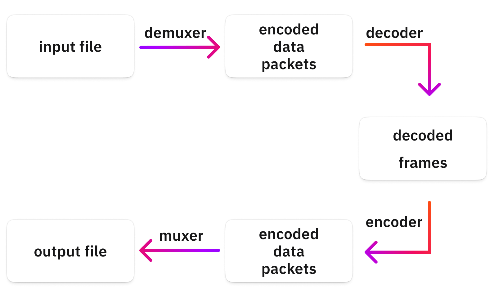

FFmpeg opens the file, decodes it into memory, then encodes the in-memory packets back and puts them into some container: some output file. The term "codec" is a mix of the words "**cod**er & **e**n**c**oder". Those are the magic parts before and after the "decoded frames".

FFmpeg 打开文件，将其解码到内存中，然后将内存中的数据包编码回来并将它们放入某个容器：某个输出文件。 术语“编解码器”是“编码器和编码器”这 **词** 的 **混合** 两个 **体** 。 这些是“解码帧”前后的神奇部分。

The decoded frames are uncompressed images in-memory, e.g. the most basic pixel format for video frames is called "rgb24". This just stores red, green, and blue values right after each other in 3x8 bits, or 3x1 byte, which could hold 16m colors.

解码帧是内存中未压缩的图像，例如，视频帧的最基本像素格式称为“rgb24”。 这只是以 3x8 位或 3x1 字节的形式依次存储红色、绿色和蓝色值，可以容纳 16m 种颜色。

The importance of this is that other than [a few exceptions](https://img.ly/blog/ultimate-guide-to-ffmpeg/#editing-without-reencoding), you can only manipulate or encode the decoded frames. So when we get to different audio/video filters or transcoding, you'll need the decoded frames for all that. But don't worry, FFmpeg does this automatically for you.

这一点的重要性在于，除了 [少数例外](https://img.ly/blog/ultimate-guide-to-ffmpeg/#editing-without-reencoding) ，您只能操作或编码解码帧。 因此，当我们使用不同的音频/视频过滤器或转码时，您将需要所有这些的解码帧。 但别担心，FFmpeg 会自动为您完成此操作。

### Inputs

### 输入

So you see and probably guessed, that FFmpeg must access the input data somehow. FFmpeg knows how to handle most media files, as the awesome people who develop FFmpeg and the related libraries made encoders and decoders for most formats available!

所以你看到并且可能猜到了，FFmpeg 必须以某种方式访问输入数据。 FFmpeg 知道如何处理大多数媒体文件，因为开发 FFmpeg 和相关库的优秀人员为大多数格式提供了编码器和解码器！

Don't think that it is a trivial thing.  Many formats are reverse engineered, a hard task requiring brilliant people.

不要认为这是一件小事。 许多格式都经过逆向工程，这是一项需要聪明人才能完成的艰巨任务。

So although we often refer to input files, the input could come from many sources, such as the network, a hardware device and so on. We'll learn more about that [later](https://img.ly/blog/ultimate-guide-to-ffmpeg/#inputs) on in this article.

因此，虽然我们经常提到输入文件，但输入可能来自许多来源，例如网络、硬件设备等。 了解更多相关信息。 [我们稍后](https://img.ly/blog/ultimate-guide-to-ffmpeg/#inputs) 将在本文中

Many media files are containers for different streams, meaning that a single file might contain multiple streams of content.

许多媒体文件是不同流的容器，这意味着单个文件可能包含多个内容流。

For example, a .mov file might contain one or more streams:

例如，一个 .mov 文件可能包含一个或多个流：

-   video tracks
-   视频轨道
-   audio tracks (e.g. for the different languages or audio formats such as stereo or 5.1)
-   音轨（例如不同的语言或音频格式，如立体声或 5.1）
-   subtitle tracks
-   字幕轨道
-   thumbnails
-   缩略图
-   ...
-   ...

All these are streams of data from the viewpoint of FFmpeg. Input files and their streams are numerically differentiated with a 0-based index. So, for example, 1:0 means the first(0) stream of the second(1) input file. We'll [learn more](https://img.ly/blog/ultimate-guide-to-ffmpeg/#mapping) about that later too!

从FFmpeg的角度来看，这些都是数据流。 输入文件及其流在数字上用基于 0 的索引进行区分。 因此，例如，1:0 表示第二个 (1) 输入文件的第一个 (0) 流。 我们稍后也会 [了解更多](https://img.ly/blog/ultimate-guide-to-ffmpeg/#mapping) ！

Important to note that FFmpeg can open any number of input files simultaneously, and the filtering and mapping will decide what it will do with those. Again more on that later!

重要的是要注意 FFmpeg 可以同时打开任意数量的输入文件，并且过滤和映射将决定它将如何处理这些文件。 稍后再详细介绍！

### Streams

### 溪流

As we have seen in the previous section, streams are the fundamental building blocks of containers. So every input file must have at least one stream. And that's what you can list by the simple `ffmpeg -i` command for example.

正如我们在上一节中所见，流是容器的基本构建块。 所以每个输入文件必须至少有一个流。 这就是您可以通过简单的方式列出的内容 `ffmpeg -i`命令例如。

A stream might contain an audio format such as MP3, or a video format such as an H.264 stream.

流可能包含音频格式（如 MP3）或视频格式（如 H.264 流）。

Also, a stream, depending on the codec, might contain multiple "things". For example, an mp3 or a WAV stream might include various audio channels.

此外，根据编解码器的不同，流可能包含多个“事物”。 例如，mp3 或 WAV 流可能包含各种音频通道。

So the building block hierarchy, in this case is: File → Stream → Channels.

所以构建块层次结构，在这种情况下是：文件 → 流 → 频道。

### Outputs

### 产出

Of course, an output could be a local file, but it doesn't need to be. It could be a socket, a stream and so on. In the same way as with inputs, you could have multiple outputs, and the mapping determines what goes into which output file.

当然，输出可以是本地文件，但不一定是。 它可以是套接字、流等。 与输入一样，您可以有多个输出，并且映射决定了哪些内容进入哪个输出文件。

The output also must have some format or container. Most of the time FFmpeg can and will guess that for us, mostly from the extension, but we can specify it too.

输出还必须具有某种格式或容器。 大多数时候 FFmpeg 可以并且会为我们猜测，主要是从扩展中，但我们也可以指定它。

### Mapping

### 测绘

Mapping refers to the act of connecting input file streams with output file streams. So if you give 3 input files and 4 output files to FFmpeg, you must also define what should go to where.

映射是指将输入文件流与输出文件流连接起来的行为。 所以如果你给 FFmpeg 3 个输入文件和 4 个输出文件，你还必须定义什么应该去哪里。

If you give a single input and a single output, then FFmpeg will guess it for you without specifying any mapping, but make sure you know how exactly that happens, to avoid surprises. More on all that later!

如果您提供单个输入和单个输出，那么 FFmpeg 会在不指定任何映射的情况下为您猜测，但请确保您知道这是如何发生的，以避免意外。 稍后会详细介绍！

### Filtering

### 过滤

Filtering stands for the feature of FFmpeg to modify the decoded frames (audio or video). Other applications might call them effects, but i'm sure there is a reason why FFmpeg calls them filters.

过滤代表 FFmpeg 修改解码帧（音频或视频）的特性。 其他应用程序可能称它们为效果，但我确信 FFmpeg 称它们为过滤器是有原因的。

There are two kinds of filtering supported by FFmpeg, simple and complex. In this article we'll only discuss the complex filters, as it is a superset of the simple filters, and this way, we avoid confusion and redundant content.

FFmpeg 支持两种过滤，简单的和复杂的。 在本文中，我们将只讨论复杂过滤器，因为它是简单过滤器的超集，这样我们就避免了混淆和冗余内容。

Simple filters are a single chain of filters between a single input and output. Complex filters can have more chains of filters, with any number of inputs and outputs.

简单过滤器是单个输入和输出之间的单链过滤器。 复杂的过滤器可以有更多的过滤器链，具有任意数量的输入和输出。

The following figure extends the previous overview image with the filtering module:

下图用过滤模块扩展了之前的概览图：

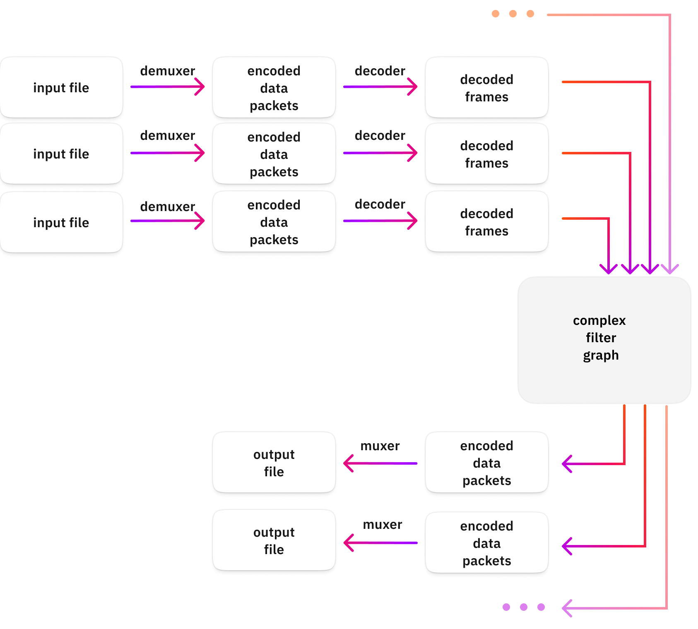

A `complex filter graph` is built from `filter chains`, which are built from `filters`.

一个 `complex filter graph`是从 `filter chains`，它们是从 `filters`.

So a single **filter** does a single thing, for example, changes the [volume](https://ffmpeg.org/ffmpeg-filters.html#volume). This filter is quite trivial, it has a single input, changes the volume, and it has a single output.

因此，单个 **过滤器** 只做一件事情，例如，改变 [音量](https://ffmpeg.org/ffmpeg-filters.html#volume) 。 这个过滤器非常简单，它有一个输入，改变音量，它有一个输出。

For video, we could check out the [scale](https://ffmpeg.org/ffmpeg-filters.html#scale) filter, which is also quite straightforward: it has a single input, scales the incoming frames, and it has a single output too.

对于视频，我们可以检查 [缩放](https://ffmpeg.org/ffmpeg-filters.html#scale) 过滤器，它也非常简单：它有一个输入，缩放输入帧，它也有一个输出。

You can **chain** these filters, meaning that you connect the output of one to the input of the next one! So you can have a [volume](https://ffmpeg.org/ffmpeg-filters.html#volume) filter after an [echo](https://ffmpeg.org/ffmpeg-filters.html#aecho) filter, for example, and this way, you'll add echo, and then you change the volume.

您可以 **链接** 这些过滤器，这意味着您可以将一个过滤器的输出连接到下一个过滤器的输入！ 例如，您可以 [添加一个音量](https://ffmpeg.org/ffmpeg-filters.html#volume) 过滤器之后 [在回声](https://ffmpeg.org/ffmpeg-filters.html#aecho) 过滤器，这样，您将添加回声，然后更改音量。

This way, your chain will have a single input, and it will do several things with it and will output something at the end.

这样，你的链将只有一个输入，它会用它做几件事，最后会输出一些东西。

Now, the "**complex**" comes in when you have multiple chains of these filters!

现在， **，“复杂”就会出现！** 当您拥有这些过滤器的多个链时

But before we go there, you should also know that some single filters might have multiple inputs or outputs!

但在我们开始之前，您还应该知道一些单个过滤器可能有多个输入或输出！

For example:

例如：

-   The [overlay](https://ffmpeg.org/ffmpeg-filters.html#overlay) filter puts 2 video streams above each other and will output a single video stream.
-   过滤器将 [叠加](https://ffmpeg.org/ffmpeg-filters.html#overlay) 2 个视频流放在彼此之上，并将输出单个视频流。
-   The [split](https://ffmpeg.org/ffmpeg-filters.html#split) filter splits a single video stream into 2+ video streams (by copying).
-   过滤器将 [拆分](https://ffmpeg.org/ffmpeg-filters.html#split) 单个视频流拆分为 2+ 个视频流（通过复制）。

So let's discuss a complex example from a bird's eye view! I have two video files, I want to put them above each other, and I want the output in two files/sizes, 720p and 1080p.

因此，让我们从鸟瞰的角度讨论一个复杂的例子！ 我有两个视频文件，我想将它们放在彼此之上，并且我想要输出两种文件/大小，720p 和 1080p。

Now, that's where complex filtering will be faithful to its name: to achieve this, you'll need several filter chains!

现在，这就是复杂过滤忠实于它的名字的地方：要实现这一点，您需要多个过滤器链！

-   Chain 1: `[input1.mp4] [input2.mp4]` → **overlay** → **split** → `[overlaid1] [overlaid2]`
-   链 1： `[input1.mp4] [input2.mp4]`→ **叠加** → **拆分** → `[overlaid1] [overlaid2]`
-   Chain 2: `[overlaid1]` → **scale** → `[720p_output]`
-   链 2： `[overlaid1]`→ **规模** → `[720p_output]`
-   Chain 3: `[overlaid2]` → **scale** → `[1080p_output]`
-   链 3： `[overlaid2]`→ **规模** → `[1080p_output]`

As you see, you can connect chains, and you can connect chains to output files. There is a rule that you can only consume a chain once, and that's why we used split instead of the same input for chains 2 and 3.

如您所见，您可以连接链，也可以将链连接到输出文件。 有一个规则，你只能消费一条链一次，这就是为什么我们使用拆分而不是链 2 和 3 的相同输入。

The takeaway is this: with complex filter graphs (and mapping), you can:

要点是：使用复杂的过滤图（和映射），您可以：

-   build individual chains of filters
-   构建单独的过滤器链
-   connect input files to filter chains
-   将输入文件连接到过滤器链
-   connect filter chains to filter chains
-   将过滤器链连接到过滤器链
-   connect filter chains to output files
-   将过滤器链连接到输出文件

## FFmpeg's command line system

## FFmpeg的命令行系统

For those who are just joining in: please get the [example assets](https://img.ly/blog/ultimate-guide-to-ffmpeg/#example-material) if you want to test out the commands shown in this chapter!

对于那些刚刚加入的人： [请获取示例资产！](https://img.ly/blog/ultimate-guide-to-ffmpeg/#example-material) 如果你想测试本章中显示的命令，

### FFmpeg CLI

### FFmpeg 命令行界面

Finally, we arrived at FFmpeg, and trust me, we'll execute it quite a lot of times! Let's see how FFmpeg's command line options are organized, as that is the first tricky part we need to understand!

最后，我们到达了 FFmpeg，相信我，我们会执行很多次！ 让我们看看 FFmpeg 的命令行选项是如何组织的，因为这是我们需要了解的第一个棘手的部分！

FFmpeg mostly thinks about input and output files and their options together with global options. You specify input files with the "-i" flag followed by a file name. For the output file, specify it as-is without any preceding CLI (command line interface) flag.

FFmpeg 主要考虑输入和输出文件及其选项以及全局选项。 您可以使用后跟文件名的“-i”标志指定输入文件。 对于输出文件，按原样指定它，前面没有任何 CLI（命令行界面）标志。

### Specifying an input file

### 指定输入文件

Let's specify just an input file:

让我们只指定一个输入文件：

The following image helps to understand the output:

下图有助于理解输出：

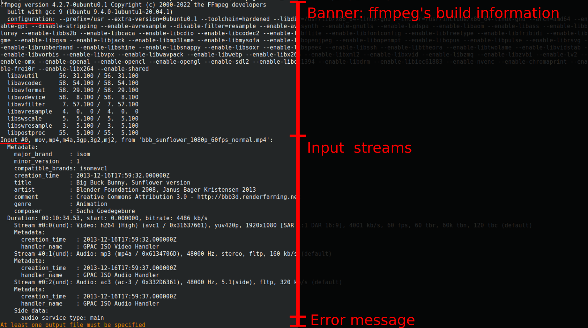

1.  First, you get the "banner", where you see the build information and lib versions. If you watch closely, you'll see the compilation flags, starting with **\--**, e.g. --enable-shared.
2.  Then you get the same output as we have seen with ffprobe earlier.
3.  And then you get a complaint that there is no output file(s) specified. That's fine for now.

1.  首先，您会看到“横幅”，您可以在其中看到构建信息和库版本。 如果仔细观察，您会看到编译标志，以 **\--** 开头，例如 --enable-shared。
2.  然后您将获得与我们之前使用 ffprobe 看到的相同的输出。
3.  然后你会收到一个投诉，说没有指定输出文件。 现在没关系。

You can remove the banner here with "-hide\_banner", but for brevity's sake I'll not include that anymore in the commands here, and I will leave it out from the outputs too.

您可以使用“-hide\_banner”删除此处的横幅，但为了简洁起见，我不会再将其包含在此处的命令中，并且我也会将其从输出中删除。

Now, let's get brave, and specify an output file!

现在，让我们勇敢一点，指定一个输出文件！

### Specifying an output

### 指定输出

As I've said earlier, the output file is understood by FFmpeg as it is just a filename. But more specifically, it is after the input(s) specifications, and it is not a value of any other switches.

正如我之前所说，FFmpeg 可以理解输出文件，因为它只是一个文件名。 但更具体地说，它在输入规范之后，而不是任何其他开关的值。

Don't be confused for now, but yes, FFmpeg can have as many inputs and outputs as you'd like. We'll cover that in more detail soon!

现在不要混淆，但是，FFmpeg 可以有任意多的输入和输出。 我们很快就会更详细地介绍它！

This command line specifies a single output file:

此命令行指定单个输出文件：

Before taking a look at the output, let me congratulate you! You have just converted a video file into an audio file, by keeping just the audio content!

在查看输出之前，让我祝贺你！ 您刚刚通过仅保留音频内容将视频文件转换为音频文件！

This is how you transcode! Of course, you'll want to specify more parameters later on.

这就是您转码的方式！ 当然，您稍后会想要指定更多参数。

So, here is the output:

所以，这是输出：

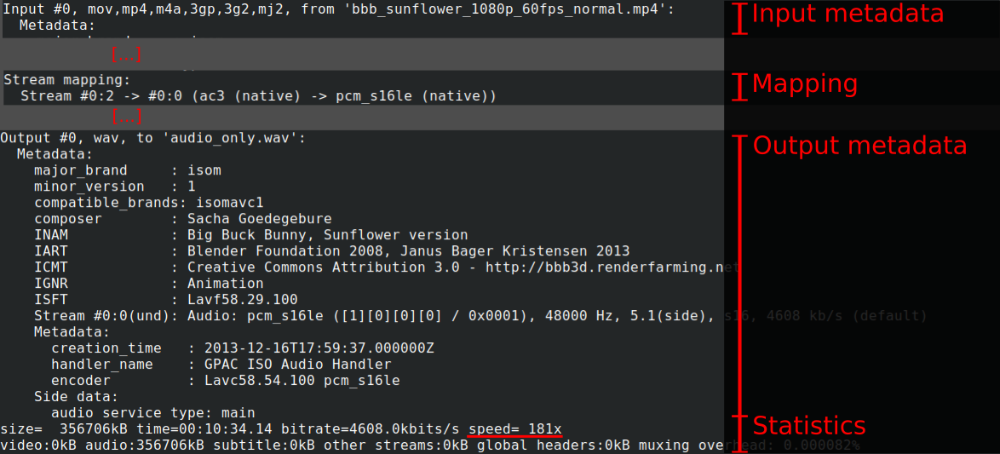

Let's analyze it!

我们来分析一下！

(1) First, we have our input metadata printing, which we saw many times already.

(1) 首先，我们有我们的输入元数据打印，我们已经看到很多次了。

(2) Then we have something called "stream mapping". We forced FFmpeg into a decision situation, as we specified an input file with 1 video and 2 audio streams. We said we wanted an audio output (guessed from the .wav extension). But we didn't specify which audio stream we wanted, so let's see what FFmpeg decided:

(2) 然后我们有一个叫做“流映射”的东西。 我们迫使 FFmpeg 陷入困境，因为我们指定了一个包含 1 个视频流和 2 个音频流的输入文件。 我们说我们想要音频输出（从 .wav 扩展名猜测）。 但是我们没有指定我们想要的音频流，所以让我们看看 FFmpeg 的决定：

-   "**Stream #0:2**" means "The first input file's third stream" or "input file index 0's stream with index 2." This is the input.
-   “ **Stream #0:2** ”表示“第一个输入文件的第三个流”或“具有索引 2 的输入文件索引 0 的流”。 这是输入。
-   "**\-> #0:0**" means the first output file's first stream. This is the output.
-   “ **\-> #0:0** ”表示第一个输出文件的第一个流。 这是输出。
-   [Here](https://ffmpeg.org/ffmpeg.html#Automatic-stream-selection) you can learn more about how FFmpeg decide this.
-   [在这里](https://ffmpeg.org/ffmpeg.html#Automatic-stream-selection) 您可以了解有关 FFmpeg 如何决定这一点的更多信息。
-   Later on, we'll manually override the mapping.
-   稍后，我们将手动覆盖映射。
-   Summary: FFmpeg decided to convert the third stream in the input file (the ac3 5.1 audio) into the first stream of the output file.
-   摘要：FFmpeg 决定将输入文件（ac3 5.1 音频）中的第三个流转换为输出文件的第一个流。

(3) Then we have our output metadata information. This reveals what FFmpeg will output. It usually copies most of the metadata, and here you also see the container/format information too.

(3) 然后我们有我们的输出元数据信息。 这揭示了 FFmpeg 将输出什么。 它通常会复制大部分元数据，在这里您还会看到容器/格式信息。

(4) And then we see the output summary. For example, the transcoding was 181x faster than the playback speed. Nice!

(4) 然后我们看到输出摘要。 例如，转码比播放速度快 181 倍。 好的！

### Understanding the command line order

### 了解命令行顺序

Before going further, let's understand FFmpeg's command line arguments from a bird's eye view!

在深入之前，我们先从鸟瞰的角度来了解一下FFmpeg的命令行参数吧！

In the [manual](https://ffmpeg.org/ffmpeg.html#Synopsis), you'll see this:

在 [手册](https://ffmpeg.org/ffmpeg.html#Synopsis) 中，您会看到：

(Parts in \[...\] are meant to be optional, and parts in {...} are meant to be specified 1 or more times.)

（\[...\] 中的部分是可选的，{...} 中的部分是指指定 1 次或多次。）

This is the general outline of how to specify inputs, outputs, input options, output options, and global options. The order matters, but it is easy to remember: global options, inputs and outputs. Also, i/o options come BEFORE the i/o specification.

这是如何指定输入、输出、输入选项、输出选项和全局选项的一般概要。 顺序很重要，但很容易记住：全局选项、输入和输出。 此外，i/o 选项出现在 i/o 规范之前。

Let's put these into pseudo command line options, to understand it better:

让我们将这些放入伪命令行选项中，以便更好地理解它：

As for the global options, these are the ones you might care about:

至于全局选项，这些是您可能关心的：

-   **\-hide\_banner**: To skip printing the banner.
-   **\-hide\_banner** ：跳过打印横幅。
-   **\-y**: To overwrite the output even if it exists.
-   **\-y** ：覆盖输出，即使它存在。

For example, you can run this as many times as you want:

例如，您可以根据需要多次运行它：

And it will overwrite the output and be less verbose than earlier.

它将覆盖输出并且比以前更简洁。

Without explaining the options themselves, let's just see some real-world examples with options:

在不解释选项本身的情况下，让我们只看一些带有选项的真实示例：

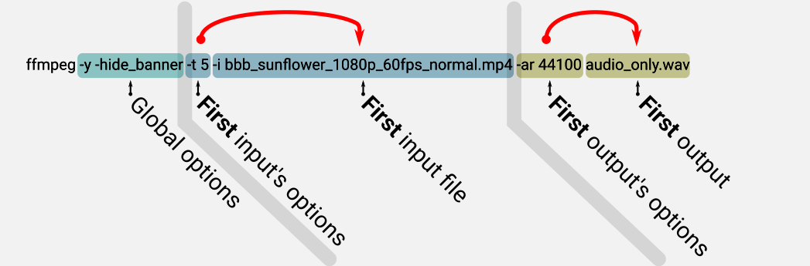

And here it is with two inputs and two outputs:

这里有两个输入和两个输出：

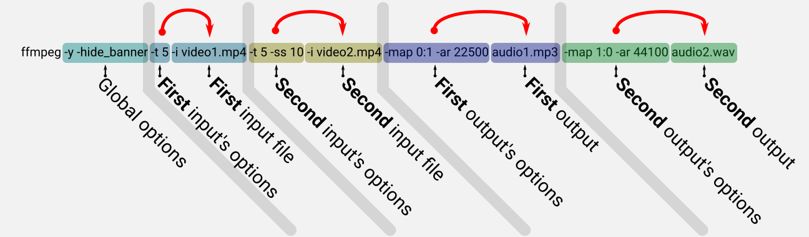

### Mapping files

### 映射文件

We saw above that this command:

我们在上面看到这个命令：

... will result in an audio file that contains one of the audio streams from the input video chosen by FFmpeg. This [automatic stream selection](https://ffmpeg.org/ffmpeg.html#Automatic-stream-selection) is usually handy when it is trivial. For example, when you have one stream as input and one output file, you don't need to specify any mapping manually.

... 将产生一个音频文件，其中包含 FFmpeg 选择的输入视频中的音频流之一。 这种 [自动流选择](https://ffmpeg.org/ffmpeg.html#Automatic-stream-selection) 在微不足道时通常很方便。 例如，当您有一个流作为输入和一个输出文件时，您不需要手动指定任何映射。

But in cases where it is not so trivial, you are usually better off manually specifying what you really want to do.

但在它不是那么微不足道的情况下，您通常最好手动指定您真正想做的事情。

The following image summarises what our current situation is:

下图总结了我们目前的情况：

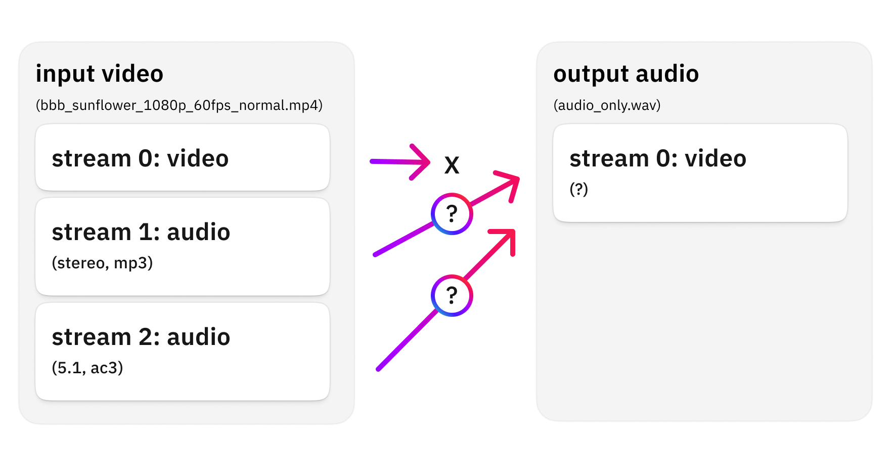

The video stream was not matched, as the output format was an audio file (.wav). But then FFmpeg chose Stream #2, because it has more channels.

视频流不匹配，因为输出格式是音频文件 (.wav)。 但是后来 FFmpeg 选择了 Stream #2，因为它有更多的通道。

So what if we'd like to get the stereo track instead? That is where mapping comes in! The mapping is a parameter of the OUTPUT file. Therefore the mapping arguments should come right before our output file definition!

那么如果我们想要获得立体声轨道呢？ 这就是映射的用武之地！ 映射是输出文件的一个参数。 因此映射参数应该在我们的输出文件定义之前！

The argument **\-map 0:1** means, that in the `output` (since we specify it as an output option) we'd like to have `Input #0`'s (the first input file) `Stream #1`!

参数 **\-map 0:1** 意味着，在 `output`（因为我们将其指定为输出选项）我们想要 `Input #0`的（第一个输入文件） `Stream #1`!

Let's see the relevant parts from the output!

让我们从输出中查看相关部分！

The "Stream #0:1 -> #0:0" part means that we have successfully overridden the mapping, to get the mp3 stream (0:1) into our output! Also, the output metadata reveals that we'll get a stereo result instead of the 5.1 earlier.

“Stream #0:1 -> #0:0”部分意味着我们已经成功覆盖映射，将 mp3 流 (0:1) 放入我们的输出中！ 此外，输出元数据显示我们将获得立体声结果，而不是之前的 5.1。

### Multiple outputs

### 多个输出

You can have multiple outputs from a single input, let's see when that might be useful!

您可以从单个输入获得多个输出，让我们看看它何时有用！

Let's say, we want to extract BOTH audio streams into two separate WAV files! It is super easy:

比方说，我们想将两个音频流提取到两个单独的 WAV 文件中！ 这非常简单：

See? I have just specified two output files with two mapping specifications! Also, I have sneaked in the "-y" to have it overwrite our previous file!

看？ 我刚刚用两个映射规范指定了两个输出文件！ 另外，我偷偷加入了“-y”让它覆盖我们以前的文件！

Let's check out the relevant parts of the output!

让我们检查输出的相关部分！

Now the mapping reveals two lines, as we have two outputs! And indeed, you'll get two .wav files as the output, one is stereo, and one is 5.1!

现在映射显示两条线，因为我们有两个输出！ 事实上，您会得到两个 .wav 文件作为输出，一个是立体声，一个是 5.1！

There might be several other reasons why you'd want to get multiple outputs. Let's briefly check out a few!

您想要获得多个输出可能还有其他几个原因。 让我们简要地检查一些！

Different formats:

不同的格式：

Wow, did you catch that? We just created a WAV and an mp3 in a single command line! I've reverted to the automatic stream selection for brevity's sake.

哇，你明白了吗？ 我们刚刚在一个命令行中创建了一个 WAV 和一个 mp3！ 为了简洁起见，我已经恢复到自动流选择。

A bit closer to real-life needs, you might want different output qualities:

更接近现实生活的需求，您可能需要不同的输出质量：

Here **\-b:a 320k** means "**b**itrate of **a**udio should be around **320 kbit/sec**". So I have requested FFmpeg to make two mp3s for me, from the stereo stream of the input.

这里 **\-b:a 320k** 音频 **表示** “ **的** 比特率应该在 **320 kbit/sec** 左右”。 所以我请求 FFmpeg 从输入的立体声流中为我制作两个 mp3。

Checking on the files, this is what we got:

检查文件，这是我们得到的：

One more common reason for having multiple outputs or using mapping is when we introduce filters into our pipeline, but that will be discussed later!

有多个输出或使用映射的一个更常见的原因是当我们将过滤器引入我们的管道时，但这将在稍后讨论！

Now you understand the foundations of how to communicate your basic requirements to FFmpeg via its command line! Great job! Now we can dive even deepert.

现在您了解了如何通过命令行将您的基本要求传达给 FFmpeg 的基础！ 很好！ 现在我们可以潜得更深了。

## Hands-on with FFmpeg

## 亲身体验 FFmpeg

In this section, we will discover and even try out some common features of FFmpeg!

在本节中，我们将发现甚至尝试 FFmpeg 的一些常用功能！

For those who are just joining in: please get the [example assets](https://img.ly/blog/ultimate-guide-to-ffmpeg/#example-material) if you want to test out the commands shown in this chapter!

对于那些刚刚加入的人： [请获取示例资产！](https://img.ly/blog/ultimate-guide-to-ffmpeg/#example-material) 如果你想测试本章中显示的命令，

### Inputs

### 输入

Let's see the common ways FFmpeg is fed with different data!

让我们看看 FFmpeg 使用不同数据的常见方式！

### File

### 文件

Of course, you have already seen that if you have a local file on your filesystem, FFmpeg is happy to read it!

当然，您已经看到，如果您的文件系统上有一个本地文件，FFmpeg 很乐意读取它！

This command which is exactly the same as one of our previous ones just reads a local file. Really, that's it.

该命令与我们之前的命令完全相同，只是读取本地文件。 真的，就是这样。

### Network

### 网络

Did you know, that FFmpeg can open a file directly on the network?!

你知道吗，FFmpeg 可以直接打开网络上的文件？！

The command above opens the file directly from the network and saves the first 5 seconds into a local file!

上面的命令直接从网络打开文件，并将前 5 秒保存到本地文件中！

I wanted to spare bandwidth for these awesome guys over renderfarming.net, so I added the duration flag: **\-t 5**. FFmpeg doesn't even download the full video for this operation. Isn't that wonderful?!

我想通过 renderfarming.net 为这些很棒的家伙腾出带宽，所以我添加了持续时间标志： **\-t 5** 。 FFmpeg 甚至不下载此操作的完整视频。 是不是很美妙？！

### Webcam

### 摄像头

FFmpeg can also open your webcam!

FFmpeg 也可以打开你的网络摄像头！

This is an example command for Linux:

这是 Linux 的示例命令：

This would record 10 seconds of your webcam!

这将记录您网络摄像头的 10 秒！

Accessing the webcam happens differently on different platforms. Also specifying parameters is different for each platform, so for this reason, if you'd like to access your webcam with FFmpeg, please refer to the documentation:

在不同的平台上访问网络摄像头的方式不同。 每个平台指定的参数也不同，因此，如果您想使用 FFmpeg 访问您的网络摄像头，请参阅文档：

-   [Linux](https://trac.ffmpeg.org/wiki/Capture/Webcam#Linux)
-   [Linux](https://trac.ffmpeg.org/wiki/Capture/Webcam#Linux)
-   [Windows](https://trac.ffmpeg.org/wiki/Capture/Webcam#Windows)
-   [视窗](https://trac.ffmpeg.org/wiki/Capture/Webcam#Windows)
-   [OS X](https://trac.ffmpeg.org/wiki/Capture/Webcam#OSX)
-   [操作系统](https://trac.ffmpeg.org/wiki/Capture/Webcam#OSX)

### Microphone

### 麦克风

Let's record some audio directly from your microphone!

让我们直接从麦克风录制一些音频！

List microphones:

列出麦克风：

Start 10 seconds of recording:

开始 10 秒的录音：

This command was meant to work on Linux, but you can check out how to do that on [Microsoft Windows](https://trac.ffmpeg.org/wiki/Capture/Desktop#Windows) or [macOS](https://trac.ffmpeg.org/wiki/Capture/Desktop#macOS).

此命令原本适用于 Linux，但您可以查看如何在 [Microsoft Windows](https://trac.ffmpeg.org/wiki/Capture/Desktop#Windows) 或 [macOS](https://trac.ffmpeg.org/wiki/Capture/Desktop#macOS) 上执行此操作。

### Pipe

### 管道

Finally, FFmpeg can read from a pipe, and also output to a pipe.

最后，FFmpeg 可以从管道读取，也可以输出到管道。

On Linux, you could do something like this:

在 Linux 上，你可以这样做：

This command would use the **cat** program to simply read in the video file and output it to its standard output. Then this output is piped INTO FFmpeg, through its standard input. The combination "**\-i -**" means "read from standard input". By the way, standard input would be your keyboard otherwise, if we wouldn't use any redirection here.

此命令将使用 **cat** 程序简单地读入视频文件并将其输出到标准输出。 然后通过其标准输入将此输出通过管道传输到 FFmpeg。 组合“ **\-i -** ”表示“从标准输入读取”。 顺便说一句，如果我们不在这里使用任何重定向，标准输入将是您的键盘。

Then we specify the required output format for FFmpeg, with "**\-f wav**". This is needed because now we'll have no output file name, and FFmpeg will not be able to guess the format. Then we specify "**pipe:1**" as an output, meaning we'd like FFmpeg to output to its standard output.

”指定 FFmpeg 所需的输出格式 **然后我们使用“ -f wav** 。 这是必需的，因为现在我们将没有输出文件名，FFmpeg 将无法猜测格式。 然后我们指定“ **pipe:1** ”作为输出，这意味着我们希望 FFmpeg 输出到它的标准输出。

From then, we pipe the data into a program called "**pv**", it is just a metering tool, that dumps information on the throughput (from its stdin to its stdout). Finally, we redirect pv's output into a WAV file.

从那时起，我们将数据通过管道传输到一个名为“ **pv** ”的程序中，它只是一个计量工具，可以转储有关吞吐量的信息（从其标准输入到标准输出）。 最后，我们将 pv 的输出重定向到一个 WAV 文件中。

You might ask why we'd want to do that, why we talk about this. Piping can be useful if you build a complex pipeline from different programs or if you want to spare reading and writing to a local file.

您可能会问我们为什么要这样做，为什么我们要谈论这个。 如果您从不同的程序构建复杂的管道，或者如果您想要节省读取和写入本地文件的时间，则管道会很有用。

For example, the node package [fluent-ffmpeg](https://www.npmjs.com/package/fluent-ffmpeg) can leverage this functionality by supplying input and output streams. For example, you can read from an S3 bucket and write to one directly.

例如，节点包 [fluent-ffmpeg](https://www.npmjs.com/package/fluent-ffmpeg) 可以通过提供输入和输出流来利用此功能。 例如，您可以从 S3 存储桶中读取并直接写入其中。

But be warned, hell is awaiting you on that road. No kidding. You need to research the limitations of this technique. For example, many formats can not be streamed in this manner, as they need random access to the output data to write the indices at the beginning of the file after processing.

但请注意，地狱就在那条路上等着你。 别开玩笑了。 您需要研究这种技术的局限性。 例如，许多格式不能以这种方式流式传输，因为它们需要随机访问输出数据以在处理后将索引写入文件的开头。

### Outputs

### 产出

FFmpeg can output into many protocols, from local file storage and ftp to message queue protocols all the way to streaming protocols.

FFmpeg 可以输出到许多协议，从本地文件存储和 ftp 到消息队列协议一直到流协议。

For more information, check out the documentation [here](https://ffmpeg.org/ffmpeg-protocols.html#Protocols).

有关详细信息，请查看 [此处](https://ffmpeg.org/ffmpeg-protocols.html#Protocols) 的文档。

## Transcoding audio with FFmpeg

## 使用 FFmpeg 转码音频

In this chapter, we'll be going to see how to transcode into audio with FFmpeg!

在本章中，我们将了解如何使用 FFmpeg 转码为音频！

The general formula is:

通用公式为：

### Choosing a format

### 选择格式

FFmpeg is quite smart, and by the extension, it can determine which codec to use. If you specify "audio.wav" or "audio.mp3" for example, FFmpeg will use the appropriate codec to do the encoding.

FFmpeg 相当聪明，通过扩展，它可以确定使用哪种编解码器。 例如，如果您指定“audio.wav”或“audio.mp3”，FFmpeg 将使用适当的编解码器进行编码。

It is perfectly guessing most of the time. But if you want to specify the format manually, then the "-f" flag is your friend.

大部分时间都是完全猜测。 但是如果你想手动指定格式，那么“-f”标志是你的朋友。

For this, you might want to consult the list of formats:

为此，您可能需要查阅格式列表：

So, these three commands will do exactly the same, but the last two requires the **\-f** flag.

因此，这三个命令的作用完全相同，但最后两个命令需要 **\-f** 标志。

### Setting the bitrate

### 设置比特率

In most cases. you want to specify the target bitrate you expect from your codec to output. If you are unsure what bitrate is, please read this article's [audio bitrate](https://img.ly/blog/ultimate-guide-to-ffmpeg/#bitrate) section.

在大多数情况下。 你想指定你期望从你的编解码器输出的目标比特率。 如果您不确定什么是比特率，请阅读本文的 [音频比特率](https://img.ly/blog/ultimate-guide-to-ffmpeg/#bitrate) 部分。

To specify the audio bitrate, use the "**\-b:a**" option with a corresponding value, e.g.:

要指定音频比特率，请使用“ **\-b:a** ”选项和相应的值，例如：

-   **\-b:a 320k**: For the mp3 codec this is considered high quality.
-   **\-b:a 320k** ：对于 mp3 编解码器，这被认为是高质量的。
-   **\-b:a 128k**: Lower quality.
-   **\-b:a 128k** ：较低的质量。
-   **\-b:a 64k**: Low quality.
-   **\-b:a 64k** ：低质量。

For example:

例如：

### Setting the sample rate

### 设置采样率

You may want to specify the sample rate to ensure quality or low output file size. Half the sample rate could mean half the output file size. If you are unsure what the sample rate is, please read the "[audio sample rate](https://img.ly/blog/ultimate-guide-to-ffmpeg/#sampling-rate)" section of this article.

您可能需要指定采样率以确保质量或较小的输出文件大小。 一半的采样率可能意味着一半的输出文件大小。 如果您不确定什么是采样率，请阅读本文的“ [音频采样率](https://img.ly/blog/ultimate-guide-to-ffmpeg/#sampling-rate) ”部分。

To specify the audio sample rate, use the "**\-ar**" option with a corresponding value, e.g.:

要指定音频采样率，请使用 **的“ -ar ”选项，例如：** 带有相应值

-   **\-ar 48000**: For high quality.
-   **\-ar 48000** ：为了高质量。
-   **\-ar 44100**: For CD quality (still high).
-   **\-ar 44100** ：CD 质量（仍然很高）。
-   **\-ar 22500**: A bit of a compromise, not recommended for music, but for speech, it might be enough.
-   **\-ar 22500** ：有点妥协，不推荐用于音乐，但对于语音，它可能就足够了。
-   **\-ar 8000**: Low quality, e.g. if you only want "understandable" speech.
-   **\-ar 8000** ：低质量，例如，如果您只想要“可理解的”语音。

For example:

例如：

### Setting the channel count

### 设置通道数

Setting the channel count can be useful, for example, if you have a stereo recording of a single person's speech. In that case, you might be content with just a mono output half the size of the original recording.

设置频道数可能很有用，例如，如果您有一个人讲话的立体声录音。 在那种情况下，您可能只满足于原始录音大小一半的单声道输出。

If you are unsure what an audio channel is, please read the "[audio channels](https://img.ly/blog/ultimate-guide-to-ffmpeg/#channels)" section of this article.

如果您不确定什么是音频通道，请阅读本文的“ [音频通道](https://img.ly/blog/ultimate-guide-to-ffmpeg/#channels) ”部分。

To specify the channel count use the  "**\-ac**" option with a corresponding value, e.g.:

要指定通道数，请使用 **的“ -ac ”选项，例如：** 带有相应值

-   **\-ac 1**: For mono
-   **\-ac 1** ：对于单声道
-   **\-ac 2**: For stereo
-   **\-ac 2** ：用于立体声
-   **\-ac 6**: For 5.1
-   **\-ac 6** ：对于 5.1

For example:

例如：

### Complete command line for converting audio with FFmpeg

### 使用 FFmpeg 转换音频的完整命令行

This is how you produce a high-quality output:

这就是您产生高质量输出的方式：

Check out [this](https://trac.ffmpeg.org/wiki/Encode/HighQualityAudio) documentation about good quality audio transcoding too!.

也请查看 [！](https://trac.ffmpeg.org/wiki/Encode/HighQualityAudio) 有关高质量音频转码的文档

### Lossless formats

### 无损格式

If you want to convert audio into a lossless format, here are a few choices for you:

如果您想将音频转换为无损格式，这里有几个选择供您选择：

It's good if you know that flac results in a smaller file than WAV, as WAV doesn't actually compress by default:

如果您知道 flac 生成的文件比 WAV 小，那很好，因为默认情况下 WAV 实际上并不压缩：

WAV is generally thought of as a lossless format, but keep in mind that the WAV container can contain lossy content too, but by default FFmpeg uses the pcm\_s16le format, which is the 16 bit PCM, that could be understood as lossless.

WAV 通常被认为是无损格式，但请记住，WAV 容器也可以包含有损内容，但默认情况下 FFmpeg 使用 pcm\_s16le 格式，即 16 位 PCM，可以理解为无损。

Learn more [here](https://en.wikipedia.org/wiki/WAV#Comparison_of_coding_schemes) and [here](https://trac.ffmpeg.org/wiki/audio%20types).

了解更多 [在这里](https://en.wikipedia.org/wiki/WAV#Comparison_of_coding_schemes) 和 [这里](https://trac.ffmpeg.org/wiki/audio%20types) 。

## Transcoding video with FFmpeg

## 使用 FFmpeg 转码视频

In this chapter, we'll be going to see how to transcode a video file into the two most common formats!

在本章中，我们将了解如何将视频文件转码为两种最常见的格式！

### Converting to H.264

### 转换为 H.264

[H264](https://en.wikipedia.org/wiki/Advanced_Video_Coding) is one of the most popular video codecs. Most devices, browsers and video players understand how to play it. It is efficient in storing video content, but as with most advanced video codecs, it is a resource intensive-process to encode and decode.

[H264](https://en.wikipedia.org/wiki/Advanced_Video_Coding) 是最流行的视频编解码器之一。 大多数设备、浏览器和视频播放器都知道如何播放它。 它可以高效地存储视频内容，但与大多数高级视频编解码器一样，编码和解码是一个资源密集型过程。

A complete command line for a high-quality H.264 transcoding with high-quality AAC audio is the following:

高质量 AAC 音频的高质量 H.264 转码的完整命令行如下：

Make sure to understand this command and to customize it to match your needs.

确保理解此命令并对其进行自定义以满足您的需要。

To help you do that, let's dissect this command!

为了帮助您做到这一点，让我们剖析这个命令！

Global options:

全局选项：

-   **\-y**: Overwrite the output.
-   **\-y** ：覆盖输出。

Input options:

输入选项：

-   **\-i bbb\_sunflower\_1080p\_60fps\_normal.mp4**: The input file.
-   **\-i bbb\_sunflower\_1080p\_60fps\_normal.mp4** ：输入文件。

Output options:

输出选项：

**\-c:v libx264**: Set the codec to libx264.

**\-c:v libx264** ：将编解码器设置为 libx264。

**\-preset slow**: libx264 has a lot of variables that you can be tune, and most of them balance the coding speed and the resulting file size. To make your life easier, there are [presets](https://trac.ffmpeg.org/wiki/Encode/H.264#Preset) by which you can easily declare what you need: small size or speed.

**\-preset slow** : libx264 有很多你可以调整的变量，其中大部分平衡了编码速度和生成的文件大小。 为了让您的生活更轻松， [您可以通过预设](https://trac.ffmpeg.org/wiki/Encode/H.264#Preset) 轻松地声明您需要什么：小尺寸或速度。

**\-crf 22**: This is the constant rate factor, the main option for setting image quality. It is a number between 0-51, where 0 is lossless, and 51 is the worst quality. Generally, you want something between 17 and 28. This is the option to tune the balance between image quality and file size. Check my comparison video [here](https://img.ly/blog/ultimate-guide-to-ffmpeg/#comparing-crf-values-with-h264-and-h265).

**\-crf 22** ：这是恒定速率因子，是设置图像质量的主要选项。 它是一个介于 0-51 之间的数字，其中 0 是无损的，51 是质量最差的。 通常，您需要介于 17 和 28 之间的值。这是调整图像质量和文件大小之间的平衡的选项。 查看我的比较视频 [在这里](https://img.ly/blog/ultimate-guide-to-ffmpeg/#comparing-crf-values-with-h264-and-h265) 。

**\-profile:v main -g 250 -pix\_fmt yuv420p**: These are advanced options, guaranteeing you a quite backward compatible result. (See [this](https://ffmpeg.org/ffmpeg-codecs.html#Options-26), [this](https://trac.ffmpeg.org/wiki/Encode/H.264#Profile), and [this](https://ffmpeg.org/ffmpeg.html#Advanced-Video-options).)

**\-profile:v main -g 250 -pix\_fmt yuv420p** ：这些是高级选项，可以保证向后兼容的结果。 （参见 [这个](https://ffmpeg.org/ffmpeg-codecs.html#Options-26) 、 [这个](https://trac.ffmpeg.org/wiki/Encode/H.264#Profile) 和 [这个](https://ffmpeg.org/ffmpeg.html#Advanced-Video-options) 。）

**\-map 0:0 -map 0:1**: You might not need this: these options are selecting the correct video and audio streams. [In our case](https://img.ly/blog/ultimate-guide-to-ffmpeg/#ffprobe), we have two audio streams, and we need the stereo one to avoid some issues with our aac stream.

**\-map 0:0 -map 0:1** ：您可能不需要这个：这些选项正在选择正确的视频和音频流。 [在我们的例子](https://img.ly/blog/ultimate-guide-to-ffmpeg/#ffprobe) 中，我们有两个音频流，我们需要立体声流来避免我们的 aac 流出现一些问题。

**\-acodec aac**: Select the AAC (Advanced Audio Coding) [codec](https://img.ly/blog/ultimate-guide-to-ffmpeg/#audio-codecs) for the audio in the output. We need to be more specific than just **\-f** for the format. We need to specify the audio codec here manually.

**\-acodec aac** ：为输出中的音频选择 AAC（高级音频编码） [编解码器](https://img.ly/blog/ultimate-guide-to-ffmpeg/#audio-codecs) 。 我们需要比仅 **\-f** 对于格式， 更具体。 我们需要在这里手动指定音频编解码器。

**\-ar 44100**: Set the audio [sampling rate](https://img.ly/blog/ultimate-guide-to-ffmpeg/#sampling-rate) (learn more about that in previous chapters of this article).

**\-ar 44100** ：设置音频 [采样率](https://img.ly/blog/ultimate-guide-to-ffmpeg/#sampling-rate) （在本文前面的章节中了解更多信息）。

**\-b:a 320k**: Set the audio [bitrate](https://img.ly/blog/ultimate-guide-to-ffmpeg/#bitrate) (learn more about that in previous chapters of this article).

**\-b:a 320k** ：设置音频 [比特率](https://img.ly/blog/ultimate-guide-to-ffmpeg/#bitrate) （在本文前面的章节中了解更多信息）。

**30seconds\_of\_bb.mkv**: The output file name. All the options since the last -i (or the last output file) considered to be a modifier for this output.

**30seconds\_of\_bb.mkv** ：输出文件名。 自最后一个 -i（或最后一个输出文件）以来的所有选项都被视为此输出的修饰符。

Let's see the output:

让我们看看输出：

From this, we understand that FFmpeg chose the mp3 stream from the input file because we told it to do so. (Remember, it has two audio streams in it, a stereo mp3 and a 5.1 ac3.) We also see that my machine could transcode with 35fps (0.58 times the playback speed), and our settings resulted in an average video bitrate of 4200 kbit/s.

由此，我们了解到 FFmpeg 从输入文件中选择了 mp3 流，因为我们告诉它这样做。 （请记住，它有两个音频流，一个立体声 mp3 和一个 5.1 ac3。）我们还看到我的机器可以 35fps（播放速度的 0.58 倍）转码，我们的设置导致平均视频比特率为 4200 kbit /秒。

The video bitrate is an interesting question in this mode. With the CRF option, we specify the "constant visual quality" we want. To reach a constant visual quality, the encoder works hard to guess how much it can compress certain parts of every frame, and the result of that guess defines the final average video bitrate.

在这种模式下，视频比特率是一个有趣的问题。 使用 CRF 选项，我们指定我们想要的“恒定视觉质量”。 为了达到恒定的视觉质量，编码器努力猜测它可以将每帧的某些部分压缩多少，并且该猜测的结果定义了最终的平均视频比特率。

If you want even better results with H.264, and you can afford a bit more processing time and a bit more complicated process, check out the [2-pass encoding](https://trac.ffmpeg.org/wiki/Encode/H.264#twopass) instead of the constant rate factor method introduced above.

如果您希望使用 H.264 获得更好的结果，并且可以承受更多的处理时间和更复杂的过程，请检查 [2-pass 编码](https://trac.ffmpeg.org/wiki/Encode/H.264#twopass) ，而不是上面介绍的恒定速率因子方法。

To learn more about these two different rate control methods, read the awesome [Understanding Rate Control Modes](https://slhck.info/video/2017/03/01/rate-control.html) article. And to learn more about the intricacies of H.264 encoding, check out the [H264 encoding guide](https://trac.ffmpeg.org/wiki/Encode/H.264).

要了解有关这两种不同速率控制方法的更多信息，请阅读很棒的 [了解速率控制模式](https://slhck.info/video/2017/03/01/rate-control.html) 一文。 要详细了解 H.264 编码的复杂性，请查看 [H264 编码指南](https://trac.ffmpeg.org/wiki/Encode/H.264) 。

Finally, [later on](https://img.ly/blog/ultimate-guide-to-ffmpeg/#comparing-crf-values-with-h264-and-h265), I will show you a comparison video that shows how different CRF values perform!

最后， [稍后](https://img.ly/blog/ultimate-guide-to-ffmpeg/#comparing-crf-values-with-h264-and-h265) ，我将向您展示一个比较视频，展示不同 CRF 值的表现！

### Converting to H.265

### 转换为 H.265

H.265 is the successor of H.264, according to the [official FFmpeg manual](https://trac.ffmpeg.org/wiki/Encode/H.265), it offers 25-50% bitrate savings while retaining the same visual quality.

H.265 是 H.264 的后继者，根据 [FFmpeg 官方手册](https://trac.ffmpeg.org/wiki/Encode/H.265) ，它提供 25-50% 的比特率节省，同时保持相同的视觉质量。

A complete command line for a high-quality H.265 transcoding with high-quality AAC audio is the following:

高质量 AAC 音频的高质量 H.265 转码的完整命令行如下：

And the result is:

结果是：

H.265 also has multiple rate control algorithms, I used the CRF method here. If you want to use a different rate control algorithm, then you may check out the [H.265 encoding guide](https://trac.ffmpeg.org/wiki/Encode/H.265). Also, check out the next section, where I'll reveal how different CRF values perform!

H.265也有多种码率控制算法，我这里用的是CRF的方法。 如果你想使用不同的码率控制算法，那么你可以查看 [H.265 编码指南](https://trac.ffmpeg.org/wiki/Encode/H.265) 。 另外，请查看下一节，我将在其中揭示不同 CRF 值的表现！

This command is almost the same as what we used in the [H.264 example](https://img.ly/blog/ultimate-guide-to-ffmpeg/#converting-to-h264) above, so please refer to that section to understand the arguments.

中使用的命令几乎相同 [此命令与我们在上面的H.264 示例](https://img.ly/blog/ultimate-guide-to-ffmpeg/#converting-to-h264) ，因此请参阅该部分以了解参数。

If we compare H.264 and H.265 with our commands above, taking into account this 10-minute long video on my system, these are the results:

如果我们将 H.264 和 H.265 与上面的命令进行比较，考虑到我系统上这段 10 分钟长的视频，结果如下：

-   H.264 is 3 times faster (35 fps vs 11 fps)
-   H.264 快 3 倍（35 fps 对 11 fps）
-   H.264 produces a 2 times larger file (318 mb vs 156 mb)
-   H.264 产生两倍大的文件（318 mb 对 156 mb）

### Comparing CRF values with H.264 and H.265

### 将 CRF 值与 H.264 和 H.265 进行比较

I have created a video for your convenience, that shows the different crf values in action. The selected frame had some movement on it with the leaves in the bunny's hand. Movement is important with video codecs, as usually that's where quality losses are first visible.

为了您的方便，我制作了一个视频，其中展示了不同的 crf 值。 选定的框架上有一些运动，兔子手里拿着叶子。 运动对于视频编解码器很重要，因为通常这是质量损失最先显现的地方。

This video shows how the different CRF values perform, from 0-51 with the H.264 and H.265 formats!

该视频展示了不同的 CRF 值如何执行，从 0-51 与 H.264 和 H.265 格式！

[H.264 & H.265 CRF comparison video](https://storage.googleapis.com/imgly-static-assets/static/blog/videos/vid-1-comparison-264-265.mov)

[H.264 & H.265 CRF 对比视频](https://storage.googleapis.com/imgly-static-assets/static/blog/videos/vid-1-comparison-264-265.mov)

(Can you guess which program I was using to make this?:))

（你能猜出我用哪个程序来做这个吗？:)）

## Basic editing with FFmpeg

## 使用 FFmpeg 进行基本编辑

In this section, we'll achieve basic editing tasks by using FFmpeg only!

在本节中，我们将仅使用 FFmpeg 完成基本的编辑任务！

We'll just get a basic mp4 with default settings in these examples to keep things simple. But to encode the result in a proper, high quality way, please check the earlier sections where we learned how to encode into H.264 and H.265!

为了简单起见，我们将在这些示例中获得具有默认设置的基本 mp4。 但要以正确、高质量的方式对结果进行编码，请查看前面我们学习如何编码为 H.264 和 H.265 的部分！

### Trimming from the beginning of the clip

### 从剪辑的开头修剪

It is possible to specify an in-point for a media file. By doing that, you essentially cut off the specified amount from the beginning of the input file. Therefore, FFmpeg will skip the first part of the file and only transcode the remainder!

可以为媒体文件指定入点。 通过这样做，您实际上从输入文件的开头切断了指定的数量。 因此，FFmpeg 将跳过文件的第一部分，只转码剩余部分！

For this, you need the "**\-ss**" flag! The value can be specified in seconds (5 or 5.2) or as a timestamp (HOURS:MM:SS.MILLISECONDS).

为此，您需要“ **\-ss** ”标志！ 该值可以以秒（5 或 5.2）为单位指定，也可以指定为时间戳 (HOURS:MM:SS.MILLISECONDS)。

To get the outro only, we could seek all the way to the end of the video! (It is 00:10:34.53 or 635 seconds long!)

为了得到结局，我们可以一直寻找到视频的结尾！ （它是 00:10:34.53 或 635 秒长！）

Seeking can be a bit tricky, so you may want to learn more about seeking [here](https://trac.ffmpeg.org/wiki/Seeking).

寻找可能有点棘手，因此您可能想在 [此处](https://trac.ffmpeg.org/wiki/Seeking) 了解有关寻找的更多信息。

### Trimming from the end of the clip

### 从剪辑的末尾开始修剪

You can also set an out-point for an input file, therefore shortening it. There are two options for this:

您还可以为输入文件设置一个出点，从而缩短它。 有两种选择：

-   **\-t**: This sets the duration.
-   **\-t** ：设置持续时间。
-   **\-to**: This sets the timestamp where the input video should stop.
-   **\-to** ：设置输入视频应该停止的时间戳。

These two are mutually exclusive, and also they do the same if no -ss is specified. The value can be specified in seconds (5 or 5.2) or as a timestamp (HOURS:MM:SS.MILLISECONDS).

这两者是互斥的，如果没有指定 -ss，它们的作用也是一样的。 该值可以以秒（5 或 5.2）为单位指定，也可以指定为时间戳 (HOURS:MM:SS.MILLISECONDS)。

Let's experiment with them!

让我们用它们做实验！

All four above commands result in exactly the same video. (For nerds: even the md5sum is the same.)

以上所有四个命令都会产生完全相同的视频。 （对于书呆子：即使是 md5sum 也是一样的。）

But let's see how they perform when we introduce seeking!

但是让我们看看当我们介绍寻求时它们的表现如何！

The first command will result in a 30 second long video, while the second command will be 20 seconds long only!

第一个命令将生成一个 30 秒长的视频，而第二个命令将只有 20 秒长！

The figure below shows the difference:

下图显示了差异：

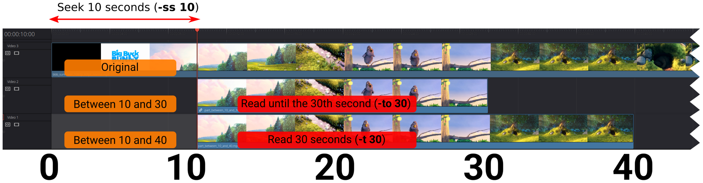

### Editing without reencoding

### 编辑而不重新编码

FFmpeg can do something I'm not aware of in any other popular NLE: it can edit videos without reencoding them!

FFmpeg 可以做一些我在任何其他流行的 NLE 中都不知道的事情：它可以编辑视频而无需重新编码！

The usual [workflow](https://img.ly/blog/ultimate-guide-to-ffmpeg/#ffmpeg-concepts) is to decode the data frames (a/v) into memory, modify them as much as we like and then encode them into a new video file. The problem with this is that unless you work with raw or lossless codecs, you'll lose some quality in the process. Another issue with this approach is that it is computationally intensive.

通常的 [工作流程](https://img.ly/blog/ultimate-guide-to-ffmpeg/#ffmpeg-concepts) 是将数据帧（a/v）解码到内存中，根据需要对其进行修改，然后将它们编码为新的视频文件。 这样做的问题是，除非您使用原始或无损编解码器，否则您会在此过程中损失一些质量。 这种方法的另一个问题是它是计算密集型的。

For certain operations, you can configure FFmpeg, to keep the data frames intact, and this way, you can avoid decoding and encoding them! This is incredibly faster than regular transcoding, usually hundreds of times faster.

对于某些操作，你可以配置FFmpeg，保持数据帧的完整性，这样就可以避免解码和编码！ 这比常规转码快得令人难以置信，通常快数百倍。

The "certain operations" are those that don't need to modify the data frames themselves. For example, you can cut and trim this way. Also, you can manipulate streams while keeping others, like you can replace the audio track without touching the video frames.

“某些操作”是那些不需要修改数据框本身的操作。 例如，您可以这样切割和修剪。 此外，您可以在保留其他流的同时操纵流，就像您可以在不触及视频帧的情况下替换音轨一样。

All this is a bit of magic, and there are caveats you need to prepare for, but it is good if you know about this, as it is often handy!

所有这一切都有些神奇，您需要准备一些注意事项，但如果您知道这一点，那将是很好的，因为它通常很方便！

The trick lies in two options:

诀窍在于两个选项：

-   **\-c:v copy**: The "copy" video codec
-   **\-c:v copy** ：“复制”视频编解码器
-   **\-c:a copy**: The "copy" audio codec
-   **\-c:a copy** ：“复制”音频编解码器

Let's see a few examples!

让我们看几个例子！

#### Remove audio while keeping the video without reencoding

#### 在不重新编码的情况下保留视频的同时删除音频

Here, we used the "**\-an**" option, which removes all audio streams. I remembered it as "**a**udio **n**o", but that is just my mnemonic:)

在这里，我们使用了“ **\-an** ”选项，它删除了所有音频流。 我记得它是“ **a** udio **n** o”，但这只是我的记忆:)

Let's see how fast it was:

让我们看看它有多快：

So It processed the whole 10 minutes of video in 2 seconds, 349x faster than playback, with 20950 fps!

所以它在 2 秒内处理了整个 10 分钟的视频，比播放速度快 349 倍，达到 20950 fps！

#### Remove video while keeping the audio without reencoding

#### 在不重新编码的情况下保留音频的同时删除视频

Here, we used the "**\-vn**" option, which removes all video streams. I remembered it as "**v**ideo **n**o".

在这里，我们使用了“ **\-vn** ”选项，它删除了所有视频流。 我记得它是“ **v** ideo **n** o”。

Let's see how fast it was:

让我们看看它有多快：

776x faster than playback, finished in about a second, not bad!

比回放快 776 倍，大约一秒就完成了，不错！

#### Cut and trim without reencoding

#### 无需重新编码即可剪切和修剪

There could be precision issues with seeking while you do this, so you may want to learn more about seeking and copying [here](https://trac.ffmpeg.org/wiki/Seeking).

了解有关搜索和复制的更多信息 [当您执行此操作时，搜索可能会出现精度问题，因此您可能想在此处](https://trac.ffmpeg.org/wiki/Seeking) 。

#### Replace audio on video file without reencoding

#### 无需重新编码即可替换视频文件中的音频

We have removed audio and video already, but what if we want to swap them?

我们已经删除了音频和视频，但如果我们想交换它们怎么办？

There is quite a lot going on in here, so let's explain the parts!

这里发生了很多事情，所以让我们解释一下这些部分！

First, we have two inputs (**\-i**), meaning we are better off manually specifying the [mapping](https://img.ly/blog/ultimate-guide-to-ffmpeg/#mapping). The command would work without the "**\-map**" options, but it would ignore our second input.

首先，我们有两个输入 ( **\-i** )，这意味着我们最好手动指定 [映射](https://img.ly/blog/ultimate-guide-to-ffmpeg/#mapping) 。 该命令可以在没有“ **\-map** ”选项的情况下运行，但它会忽略我们的第二个输入。

`-map "0:v" -map "1:a"` means that please use the first file's (first) video stream and the second file's (first) audio stream.

`-map "0:v" -map "1:a"`表示请使用第一个文件的（第一个）视频流和第二个文件的（第一个）音频流。

With `-c:v copy -c:a copy`, we require FFmpeg to copy the already encoded data packets without touching them. Therefore FFmpeg's work is mostly really just copying bytes, no decoding, no encoding.

和 `-c:v copy -c:a copy`，我们要求 FFmpeg 复制已经编码的数据包而不触及它们。 因此 FFmpeg 的工作实际上大部分只是复制字节，没有解码，没有编码。

Not surprisingly, that's what we see in the stream mapping too:

毫不奇怪，这也是我们在流映射中看到的：

And since it is just copying, it was crazy fast, 162x of the playback speed, or almost 10k frames per second!

而且由于它只是复制，所以速度快得惊人，播放速度的 162 倍，或者说几乎每秒 10k 帧！

But!

但！

Execute the exact same command, but with "bbb\_with\_replaced\_audio.**mp4**" (.mp4 container instead of .mov) as an output file! You'll get this:

执行完全相同的命令，但使用“bbb\_with\_replaced\_audio.mp4”（. **mp4** 容器而不是 .mov）作为输出文件！ 你会得到这个：

The message is quite clear. You can not have a pcm\_s16le (raw WAV, say that 10 times:)) stream in an MP4 container. I'm not sure if it is FFmpeg's or the container's lack of support, but we need to solve this. If you run into this situation, you might consider two solutions:

信息非常明确。 你不能在 MP4 容器中有 pcm\_s16le（原始 WAV，说 10 次:)）流。 我不确定是 FFmpeg 的问题还是容器不支持，但我们需要解决这个问题。 如果遇到这种情况，您可能会考虑两种解决方案：

1.  Change the container: I've just tried MOV, and it worked.
2.  Encode the audio: We still copy the video data, and encoding audio isn't that painful.

1.  更改容器：我刚刚尝试了 MOV，并且成功了。
2.  编码音频：我们仍然复制视频数据，编码音频并不那么痛苦。

I just showed you option #1, so let's see option #2:

我刚刚向您展示了选项 #1，让我们看看选项 #2：

This copies the video frames and encodes our WAV into a supported codec to be held in the mp4 container. You can refer back to the [audio encoding](https://img.ly/blog/ultimate-guide-to-ffmpeg/#how-to-transcode-audio-with-ffmpeg) section if you want to learn more about that.

这将复制视频帧并将我们的 WAV 编码为支持的编解码器，以保存在 mp4 容器中。 可以参考 [音频编码部分。](https://img.ly/blog/ultimate-guide-to-ffmpeg/#how-to-transcode-audio-with-ffmpeg) 如果您想了解更多相关信息，

Here is the output:

这是输出：

"Only" 36x faster than playback, 2176 fps, still not that bad!

“仅”比回放快 36 倍，2176 fps，还不错！

## Filtering overview

## 筛选概述

FFmpeg supports many audio and video [filters](https://ffmpeg.org/ffmpeg-filters.html). Currently, there are 116 audio and 286 video filters, but there are a bit more if we count the hardware accelerated ones too.

FFmpeg 支持许多音频和视频 [过滤器](https://ffmpeg.org/ffmpeg-filters.html) 。 目前，有 116 个音频和 286 个视频过滤器，但如果我们也算上硬件加速过滤器，则数量会更多一些。

So how do we leverage them?

那么我们如何利用它们呢？

There are two ways to define filters, but I'm going to explain the complex filter, as the difference is not much, but it is more versatile. So there is a global option for FFmpeg, called: **`-filter_complex`**. With quite a weird syntax, you can specify all your filters and their parameters right after this option.

有两种定义过滤器的方法，我这里主要介绍复杂过滤器，两者区别不大，但通用性更强。 所以FFmpeg有一个全局选项，叫做： **`-filter_complex`**. 使用非常奇怪的语法，您可以在此选项之后立即指定所有过滤器及其参数。

You can imagine the process with the following image:

你可以用下图想象这个过程：

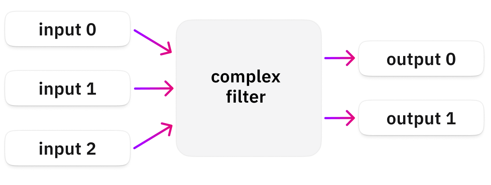

Basically, your filter graph can access all the inputs (-i a.mp4 -i b.mp4 -i c.mp4), and it can produce as many outputs as you like (-map might be needed).

基本上，您的过滤器图可以访问所有输入 (-i a.mp4 -i b.mp4 -i c.mp4)，并且它可以产生任意数量的输出（可能需要 -map）。

### Basic syntax

### 基本语法

Let's take a look at a simple, basic example:

让我们看一个简单的基本示例：

Although `-filter_complex` is a global option, I like to put it after the inputs and before the outputs as it is a bit easier to overlook the whole command that way. Thankfully the command line parser of FFmpeg is smart enough, and it works.

虽然 `-filter_complex`是一个全局选项，我喜欢将它放在输入之后和输出之前，因为这样更容易忽略整个命令。 值得庆幸的是，FFmpeg 的命令行解析器足够聪明，而且可以正常工作。

The command above produces a 5-second-long video, where the text "HELLO THERE" is overlaid on the intro of Big Buck Bunny.

上面的命令生成一个 5 秒长的视频，其中文本“HELLO THERE”覆盖在 Big Buck Bunny 的介绍上。

Let's understand the weird format for specifying filters!

让我们了解指定过滤器的奇怪格式！

We'll go bottom-up, and we'll build it from there. So the most basic format is this:

我们将自下而上，然后从那里构建它。 所以最基本的格式是这样的：

For example:

例如：

The first thing before the first equal (=) sign is the filter's name, which is the [drawtext](https://ffmpeg.org/ffmpeg-filters.html#drawtext-1) filter in this case. Then we have our first argument, "text" and its value "'HELLO THERE'". Right after that, separated with a colon (:) comes the next argument, "y" with a value of "20".

第一个等号 (=) 之前的第一件事是过滤器的名称，在本例中是 [drawtext](https://ffmpeg.org/ffmpeg-filters.html#drawtext-1) 过滤器。 然后我们有了第一个参数“text”及其值“'HELLO THERE'”。 紧接着，用冒号 (:) 分隔的是下一个参数“y”，值为“20”。

You can guess what each of the text, y, x, fontsize and fontfile arguments do, as it is quite self-explaining. But especially for the first time, you'll heavily rely on the [filtering documentation](https://ffmpeg.org/ffmpeg-filters.html) to understand every filter and every argument.

您可以猜出每个文本、y、x、fontsize 和 fontfile 参数的作用，因为它不言自明。 但尤其是第一次，您将严重依赖 [过滤文档](https://ffmpeg.org/ffmpeg-filters.html) 来理解每个过滤器和每个参数。

Also, several characters are reserved, such as: `, : =` and a few others depending on your environment, so sooner or later you need to learn about [escaping](https://ffmpeg.org/ffmpeg-filters.html#toc-Notes-on-filtergraph-escaping) too.

此外，还保留了几个字符，例如： `, : =`和其他一些取决于你的环境，所以迟早你也需要学习 [逃避](https://ffmpeg.org/ffmpeg-filters.html#toc-Notes-on-filtergraph-escaping) 。

To recap, our pipeline looks like this now:

回顾一下，我们的管道现在看起来像这样：

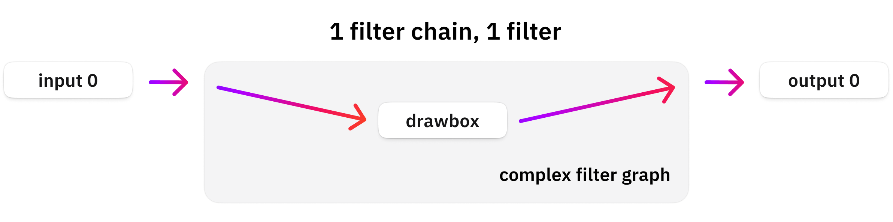

### Multiple filters in a chain

### 链中的多个过滤器

This previous command is a single filter chain that consists of a single filter only, but you could have more filters put right after each other! It means that the output of one filter will be the input for the next! The way to do this is by separating them with a comma!

前面的命令是一个单独的过滤器链，仅由一个过滤器组成，但您可以将更多的过滤器放在一起！ 这意味着一个过滤器的输出将成为下一个过滤器的输入！ 做到这一点的方法是用逗号分隔它们！

Let's draw two boxes with the [drawbox](https://ffmpeg.org/ffmpeg-filters.html#drawbox) filter!

过滤器绘制两个盒子 [让我们用drawbox](https://ffmpeg.org/ffmpeg-filters.html#drawbox) ！

See? The output of the first filter is passed to the output of the second filter!

看？ 第一个过滤器的输出传递给第二个过滤器的输出！

Let's visualize our pipeline again:

让我们再次想象我们的管道：

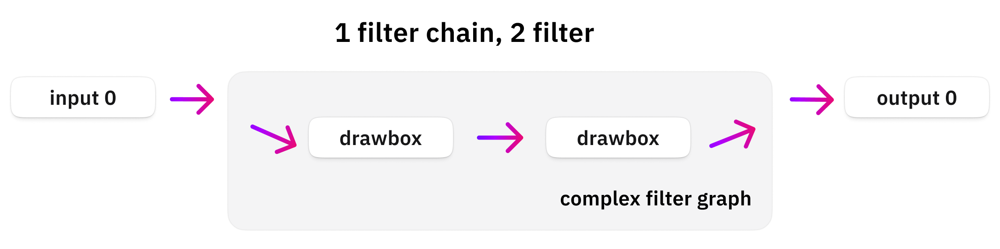

### Input and output pads

### 输入和输出焊盘

Now, we have skipped something this far, because for simple uses FFmpeg is smart enough to do it for us. And this is the specification of a chain's input and output pads!

现在，我们已经跳过了一些东西，因为对于简单的使用，FFmpeg 足够聪明，可以为我们做这件事。 这是链的输入和输出垫的规格！

Let's draw just a single rectangle for now:

现在让我们只画一个矩形：

FFmpeg sees that the input for our filter chain is a single video file, and the output is a single output video file. Therefore, it safely assumes that we want that single input as the input of our single filter chain. And that single output should be the single output of our single output chain.

FFmpeg 看到我们过滤器链的输入是单个视频文件，输出是单个输出视频文件。 因此，它安全地假设我们希望该单一输入作为我们单一过滤器链的输入。 那个单一输出应该是我们单一输出链的单一输出。

That's really nice, as, in simple situations like this, we don't need to assign and map inputs and outputs manually! But when we get more inputs, filter chains, or outputs, it is no longer possible. Therefore, we need to understand how to assign inputs and outputs!

这真的很好，因为在像这样的简单情况下，我们不需要手动分配和映射输入和输出！ 但是当我们获得更多的输入、过滤器链或输出时，它就不再可能了。 因此，我们需要了解如何分配输入和输出！

First of all, let's compare the following two command lines. They result in exactly the same result, but the second one represents what FFmpeg does internally (roughly):

首先，让我们比较以下两个命令行。 它们产生完全相同的结果，但第二个代表 FFmpeg 内部（大致）所做的事情：

Do you see the difference? Before our filter chain, an "input pad" is defined: `[0:v]`. The expected format between the square brackets is documented in the [stream selection](https://ffmpeg.org/ffmpeg.html#Stream-selection) section of the official documentation, and this article already [covered](https://img.ly/blog/ultimate-guide-to-ffmpeg/#mapping) it.

你看得到差别吗？ 在我们的过滤器链之前，定义了一个“输入板”： `[0:v]`. 方括号之间的预期格式记录在官方文档的 [流选择](https://ffmpeg.org/ffmpeg.html#Stream-selection) 部分，本文已经 [介绍](https://img.ly/blog/ultimate-guide-to-ffmpeg/#mapping) 了它。

But, a quick summary:

但是，快速总结：

-   **0:v**: This means the first video stream of the first input file.
-   **0:v** ：这意味着第一个输入文件的第一个视频流。
-   **0:v:0**: Means exactly the same thing but in a long form.
-   **0:v:0** ：意思完全相同，但形式很长。
-   **0:0**: Means the first stream of the first input file (not recommended, as it could be anything in theory. It could be a subtitle stream, a thumbnail, a video or an audio stream...)
-   **0:0** : 表示第一个输入文件的第一个流（不推荐，因为它可以是理论上的任何东西。它可以是字幕流，缩略图，视频或音频流......）
-   **0:a**: This means the first audio stream of the first input file.
-   **0:a** ：这意味着第一个输入文件的第一个音频流。
-   **0:a:0**: Means exactly the same thing but in a long form.
-   **0:a:0** ：意思完全相同，但形式很长。
-   **0:a:1**: Means the second (index #1) audio stream of the first input file.
-   **0:a:1** ：表示第一个输入文件的第二个（索引#1）音频流。

So we can specify which input file should be connected to which input of the filter graph!

所以我们可以指定哪个输入文件应该连接到过滤器图的哪个输入！

Also, something similar is going on at the end! Do you see, the `[out_link_0]` output pad definition at the end of our filter chain?

另外，最后还有类似的事情发生！ 你看到了吗 `[out_link_0]`滤波器链末尾的输出焊盘定义？

The naming here is easier, as basically you can specify any arbitrary name in here. It roughly means, "please store the output data under this name".

这里的命名更容易，因为基本上你可以在这里指定任意名称。 大致意思是，“请将输出数据存储在这个名称下”。

And when you specify your output file, you can or need to map it by selecting one of your filter graph outputs! Therefore, we must add the -map "\[out\_link\_0\]" option before our output file.

当您指定输出文件时，您可以或需要通过选择您的过滤器图输出之一来映射它！ 因此，我们必须在输出文件之前添加 -map "\[out\_link\_0\]" 选项。

This map option means this: "Please save the data stream with this name into the following output file."

此映射选项的意思是：“请将具有此名称的数据流保存到以下输出文件中。”

This is how you can visualize this input/output mapping:

这是可视化此输入/输出映射的方式：

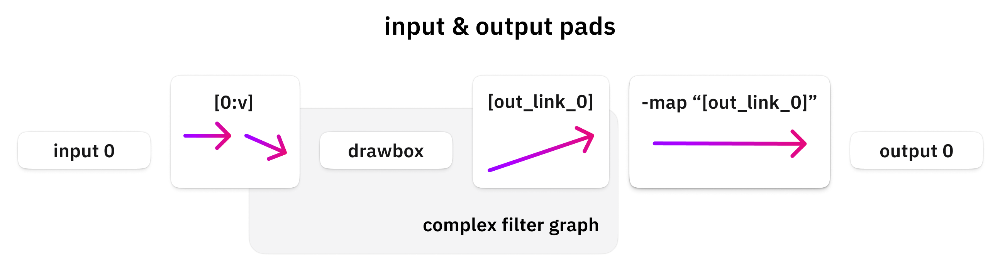

### Multiple chains

### 多条链

Coming from the previous sections, you are now ready to see and understand an even more complicated configuration, which has multiple input files, output files, and filter chains!

从前面的部分开始，您现在已经准备好看到和理解一个更复杂的配置，它有多个输入文件、输出文件和过滤器链！

Let's see the output (two files next to each other):

让我们看看输出（两个文件彼此相邻）：

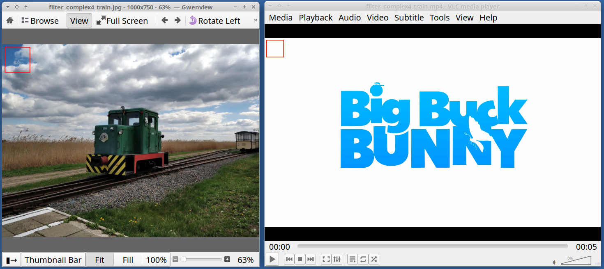

We had two inputs, and we got two output files, an image, and a video, with a red rectangle on them, with a single command!

我们有两个输入，我们有两个输出文件，一个图像和一个视频，上面有一个红色矩形，只需要一个命令！

Are you still here? I hope! Let's understand what happened in that crazy command! We have two input files:

你还在吗？ 我希望！ 让我们了解那个疯狂命令中发生了什么！ 我们有两个输入文件：

-   **\-i train.jpg**: A simple image file
-   **\-i train.jpg** ：一个简单的图像文件
-   **\-t 5 -i bbb\_sunflower\_1080p\_60fps\_normal.mp4**: Our video file, but to make it quick, just the first five seconds of it
-   **\-t 5 -i bbb\_sunflower\_1080p\_60fps\_normal.mp4** ：我们的视频文件，但为了快点，只有前五秒

Then the first thing to note is that we have two filter chains! They are separated with a "**;**".

那么首先要注意的是，我们有两个过滤器链！ 它们以“ **;** ”分隔。

Our first filter graph is this: `[0:v]...[train_box]`

我们的第一个过滤图是这样的： `[0:v]...[train_box]`

-   This requests the first input file as an input
-   这请求第一个输入文件作为输入
-   Draws a red box
-   绘制一个红色框
-   Saves the output into the "train\_box" output pad
-   将输出保存到“train\_box”输出板

Our second filter graph is this: `[1:v]...[bbb_box]`

我们的第二个过滤图是这样的： `[1:v]...[bbb_box]`

-   This requests the second input file as an input
-   这请求第二个输入文件作为输入
-   Draws a red box
-   绘制一个红色框
-   Saves the output into the "bbb\_box" output pad
-   将输出保存到“bbb\_box”输出板

And finally, we got two outputs, each mapping to one of the outputs of the filter graph:

最后，我们得到了两个输出，每个都映射到过滤器图的输出之一：

-   **\-map "\[train\_box\]" filter\_complex4\_train.jpg**
-   **\-map “\[train\_box\]” filter\_complex4\_train.jpg**
-   **\-map "\[bbb\_box\]" filter\_complex4\_bbb.mp4**
-   **\-地图“\[bbb\_box\]”filter\_complex4\_bbb.mp4**

Here is the same thing visually:

这是视觉上的同一件事：

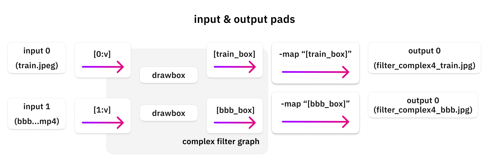

If you are thinking about making it even more complex and making filter graphs that combine multiple inputs into one for example, you are on the right track! It is possible, and we will get to that!

例如，如果您正在考虑让它变得更复杂，并制作将多个输入组合成一个的过滤图，那么您就走在了正确的轨道上！ 这是可能的，我们会做到的！

This was the introduction to the filtering system and its syntax.

这是对过滤系统及其语法的介绍。

## Editing video

## 编辑视频

Now let's get to know a few filters and make some interesting stuff!

现在让我们了解一些过滤器并制作一些有趣的东西！

### Resizing or scaling

### 调整大小或缩放

The [scale](https://ffmpeg.org/ffmpeg-filters.html#scale) filter is a simple one, yet it is quite powerful!

过滤器是一个简单的 [scale](https://ffmpeg.org/ffmpeg-filters.html#scale) 过滤器，但它非常强大！

The arguments speak for themselves, but a few things:

这些论点不言而喻，但有几点：

-   Specifying -1 to either width or height means rescaling while keeping the aspect ratio.
-   将 -1 指定为宽度或高度意味着在保持纵横比的同时重新缩放。
-   "force\_original\_aspect\_ratio" can be `increase`, `decrease`. Meaning it will increase or decrease the image to fit the specified bounding box while keeping the aspect ratio.
-   “force\_original\_aspect\_ratio”可以是 `increase`, `decrease`. 这意味着它将增加或减少图像以适应指定的边界框，同时保持纵横比。

### Adding text

### 添加文字

We have already covered this a little, so let's dive deeper!

我们已经对此进行了一些介绍，所以让我们深入探讨一下！

This is what we used earlier:

这是我们之前使用的：

Now let's discover how to align the text!

现在让我们了解如何对齐文本！

Many filters, including drawtext, support variables in some of its argument's values. If you scroll down in the [documentation of drawtext](https://ffmpeg.org/ffmpeg-filters.html#drawtext-1), you'll find this:

许多过滤器（包括 drawtext）在其某些参数值中支持变量。 如果您向下滚动 [drawtext 的文档](https://ffmpeg.org/ffmpeg-filters.html#drawtext-1) ，您会发现：

> "The parameters for x and y are expressions containing the following constants and functions: "

And after this part, you'll see many variables which you can include in your x and y variables!

在这部分之后，您将看到许多可以包含在 x 和 y 变量中的变量！

Let's see:

让我们来看看：

And this is what we'll get in the end:

这就是我们最终会得到的：

I need to mention one good trick that might not be obvious at first. So the `text_h` variable is a tricky one, because different text will be of different height! E.g.: "\_\_\_\_" and "WWW"  will result in a different height.

我需要提到一个一开始可能并不明显的好技巧。 所以 `text_h`变量是一个棘手的变量，因为不同的文本会有不同的高度！ 例如：“\_\_\_\_”和“WWW”会产生不同的高度。

For this reason, you do not always want to use text\_h or even just a constant y=value expression but rather, you need to align text by its **[baseline](https://en.wikipedia.org/wiki/Baseline_(typography))**. So just remember to use the "**ascent**" variable whenever you need to align text vertically!

出于这个原因，您并不总是希望使用 text\_h 或什至只是一个常量 y=value 表达式，而是您需要通过其 **[baseline](https://en.wikipedia.org/wiki/Baseline_(typography))** 对齐文本。 所以只要记住在 **使用“ ascent ”变量！** 需要垂直对齐文本时

Check out these two examples! Each has two drawtext filters printing "\_" and "\_H":

看看这两个例子！ 每个都有两个 drawtext 过滤器打印“\_”和“\_H”：

Now let's compare the difference:

现在让我们比较一下差异：

See? This is the difference between aligning the "top left" or the "baseline" of the text!

看？ 这就是对齐文本的“左上角”或“基线”的区别！

### Adding an overlay

### 添加叠加层

Overlaying is a very interesting thing to do with FFmpeg. Let's jump right in!

使用 FFmpeg 进行叠加是一件非常有趣的事情。 让我们开始吧！

#### Basic

#### 基本的

Easy as that!

就这么简单！

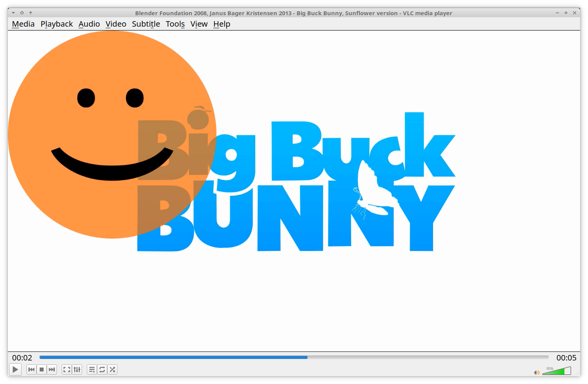

Of course, the [overlay](https://ffmpeg.org/ffmpeg-filters.html#overlay) filter has a ton of options, but I wanted to demonstrate the easiest possible command line. We don't even need to mess with input/output pads, as FFmpeg automatically understands the situation: two inputs for the overlay filter and its single output into a single output.

当然， [覆盖](https://ffmpeg.org/ffmpeg-filters.html#overlay) 过滤器有很多选项，但我想演示最简单的命令行。 我们甚至不需要弄乱输入/输出板，因为 FFmpeg 会自动理解这种情况：叠加过滤器的两个输入及其单个输出到单个输出。

But just to exercise, we could have executed it like this:

但只是为了练习，我们可以这样执行：

And this would result in the same output! Check it out, now I have specified the two inputs for the overlay: `[0:v][1:v]`!

这将导致相同的输出！ 检查一下，现在我已经为叠加层指定了两个输入： `[0:v][1:v]`!

#### Aligned

#### 对齐

Let's align the smiley into the center!

让我们将笑脸对齐到中心！

As we have seen with the drawtext, the overlay filter's arguments also support a few dynamic variables. We'll use those to achieve what we want!

正如我们在 drawtext 中看到的那样，覆盖过滤器的参数也支持一些动态变量。 我们将使用这些来实现我们想要的！

#### Preprocessing the input for overlay

#### 为叠加预处理输入

Let's get a bit creative!

让我们来点创意吧！

I want to make it [smaller](https://ffmpeg.org/ffmpeg-filters.html#scale), and I also want to [blur](https://ffmpeg.org/ffmpeg-filters.html#scale) it!

我想把它 [变小](https://ffmpeg.org/ffmpeg-filters.html#scale) ，我也想 [模糊](https://ffmpeg.org/ffmpeg-filters.html#scale) 它！

Now pause for a minute, and think about it, how you'd do that?!

现在暂停一分钟，想想看，你会怎么做？！

...

...

Ready?

准备好？

For this we needed to have two filter graphs!

为此，我们需要有两个过滤图！

The first one is this: `[1:v]scale=w=200:h=-1,gblur=sigma=3[smiley]`

第一个是这样的： `[1:v]scale=w=200:h=-1,gblur=sigma=3[smiley]`

-   Scales the input image (the smiley).
-   缩放输入图像（笑脸）。
-   Then the scaled output is also blurred.
-   然后缩放后的输出也很模糊。
-   Then the output is saved into the output pad named "smiley".
-   然后将输出保存到名为“笑脸”的输出垫中。

Then, we have our second filter graph: `[0:v][smiley]overlay=x=100:y=100`

然后，我们有第二个过滤器图： `[0:v][smiley]overlay=x=100:y=100`

-   This takes as input the first input file (the video).
-   这将第一个输入文件（视频）作为输入。
-   This also takes as input the output pad named "smiley". (We are connecting two chains this time!)
-   这也将名为“smiley”的输出垫作为输入。 （这次我们连接两条链！）
-   Then the overlay filter does its overlaying thing, and we trust FFmpeg to pair the unnamed output with the single output file we specified.
-   然后覆盖过滤器执行其覆盖操作，我们相信 FFmpeg 会将未命名的输出与我们指定的单个输出文件配对。

#### Reusing content

#### 重用内容

Let's do one more, a really complicated one!

让我们再做一个，一个非常复杂的！

Let's have the outro overlaid over the intro!

让片尾覆盖片头！

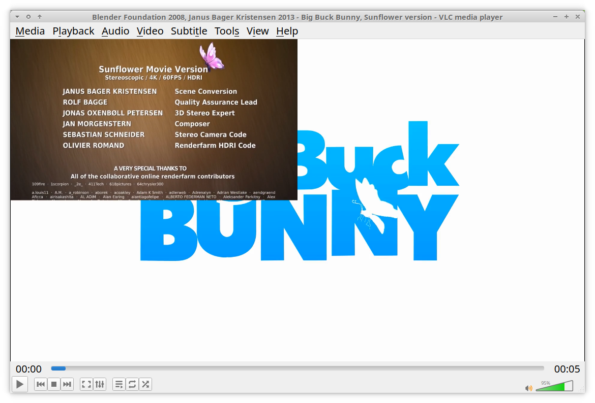

We could have achieved it in several ways, e.g. we could use the [trim](https://ffmpeg.org/ffmpeg-filters.html#trim) filter, but to keep it easy, we just open the same file twice and [seek/trim](https://img.ly/blog/ultimate-guide-to-ffmpeg/#cutting-off-from-the-beginning-of-the-clip) them.

我们可以通过多种方式实现它，例如我们可以使用 [修剪](https://ffmpeg.org/ffmpeg-filters.html#trim) 过滤器，但为了简单起见，我们只打开同一个文件两次并 [搜索/修剪](https://img.ly/blog/ultimate-guide-to-ffmpeg/#cutting-off-from-the-beginning-of-the-clip) 它们。

-   **\-t 5 -i bbb\_sunflower\_1080p\_60fps\_normal.mp4**: Open the video, and keep the first five seconds of it.
-   **\-t 5 -i bbb\_sunflower\_1080p\_60fps\_normal.mp4** : 打开视频，保留前五秒。
-   **\-t 5 -ss 00:09:40 -i bbb\_sunflower\_1080p\_60fps\_normal.mp4**: Open the same video again, but seek to the end and keep five seconds from there.
-   **\-t 5 -ss 00:09:40 -i bbb\_sunflower\_1080p\_60fps\_normal.mp4** ：再次打开同一个视频，但寻找到最后并保持五秒钟。

Then we have two filter graphs again, one scales down the outro, and the second is just an overlay.

然后我们又有两个过滤图，一个按比例缩小结尾，第二个只是一个叠加层。

Are you excited?:) I hope these made-up examples opened up your eye for the possibilities, and I hope you'll create very creative stuff with this knowledge!

你兴奋吗？:) 我希望这些虚构的例子能开阔你的眼界，让你看到各种可能性，我希望你能利用这些知识创造出非常有创意的东西！

### Chroma keying, green screen, blue screen

### 色度键控、绿屏、蓝屏

In this section, we'll use chroma keying to remove the background from Big Buck Bunny's intro, and then we will put the transparent logo over the original video, as if it would be some kind of a logo overlay!

在本节中，我们将使用色度键控从 Big Buck Bunny 的介绍中删除背景，然后我们将透明徽标放在原始视频上，就好像它是某种徽标覆盖一样！

So just to recap, Big Buck Bunny's first few seconds are like this:

回顾一下，Big Buck Bunny 的前几秒是这样的：

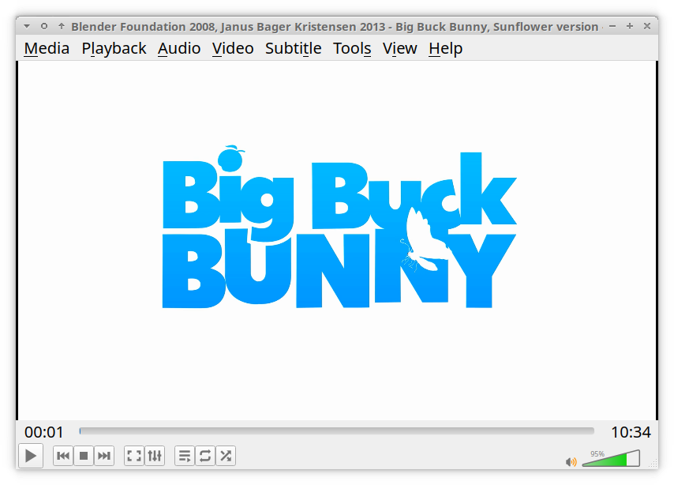

And this is the result:

这是结果：

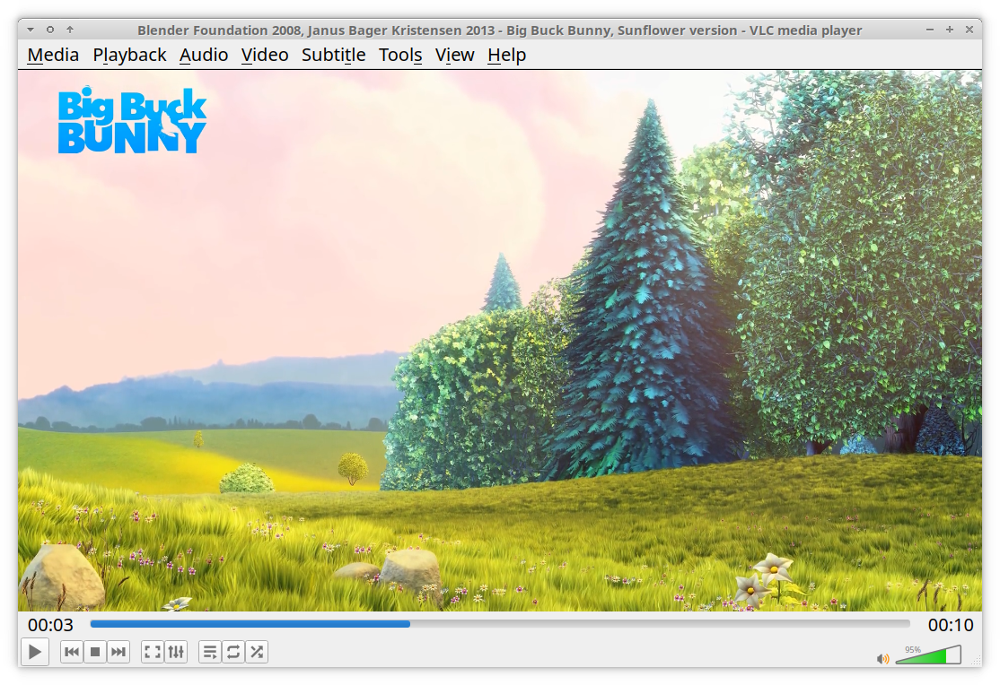

Also, the butterfly moves its wings repeatedly!

还有，蝴蝶反复挥动翅膀！

Let's examine the command!

让我们检查命令！

-   **\-ss 0.5 -t 2 -i bbb\_sunflower\_1080p\_60fps\_normal.mp4**: We read in the intro from 0.5 to 2.5 seconds.
-   **\-ss 0.5 -t 2 -i bbb\_sunflower\_1080p\_60fps\_normal.mp4** ：我们在介绍中读了 0.5 到 2.5 秒。
-   **\-ss 10 -i bbb\_sunflower\_1080p\_60fps\_normal.mp4**: We read in the video, starting from the 10th second.
-   **\-ss 10 -i bbb\_sunflower\_1080p\_60fps\_normal.mp4** ：我们在视频中阅读，从第 10 秒开始。

Then we have two filter graphs, the first being this:

然后我们有两个过滤器图，第一个是这样的：

`[0:v]chromakey=color=0xfdfdfd:similarity=0.1:blend=0.2 , scale=w=-1:h=300 , loop=loop=-1:start=0:size=120[intro]`

`[0:v]chromakey=color=0xfdfdfd:similarity=0.1:blend=0.2 , scale=w=-1:h=300 , loop=loop=-1:start=0:size=120[intro]`

As we see, we have three filters in here!

如我们所见，这里有三个过滤器！

-   **[chromakey](https://ffmpeg.org/ffmpeg-filters.html#chromakey)**: This one takes a color and a few parameters as input, and outputs transparent frames. The specified color + the blended areas will be the transparent sections. In our case we replaced the white-ish (#fdfdfd) background color with transparency.
-   **[chromakey](https://ffmpeg.org/ffmpeg-filters.html#chromakey)** ：这个将颜色和一些参数作为输入，并输出透明帧。 指定的颜色+混合区域将是透明部分。 在我们的例子中，我们用透明色替换了白色 (#fdfdfd) 背景色。
-   **[scale](https://ffmpeg.org/ffmpeg-filters.html#scale)**: We resize the full 1080p image into something around 300px high.
-   **[scale](https://ffmpeg.org/ffmpeg-filters.html#scale)** ：我们将完整的 1080p 图像调整为大约 300px 高。
-   **[loop](https://ffmpeg.org/ffmpeg-filters.html#loop)**: With the loop filter, we repeat all the 2 seconds worth of 120 frames (60\*2) over and over again, to have the butterfly move its wings continuously.
-   **[loop](https://ffmpeg.org/ffmpeg-filters.html#loop)** ：使用循环过滤器，我们一遍又一遍地重复所有 2 秒的 120 帧 (60\*2)，让蝴蝶不断地摆动翅膀。

And then, finally we have the second filter graph:

然后，最后我们有了第二个过滤图：

`[1:v][intro]overlay=x=-40:y=-40`

`[1:v][intro]overlay=x=-40:y=-40`

Nothing fancy, just an overlay of the original video and our chrome keyed intro.

没什么特别的，只是原始视频和我们的 chrome 键控介绍的叠加。

### What else?

### 还有什么？

You might want to check out a few more [filters](https://ffmpeg.org/ffmpeg-filters.html#toc-Video-Filters), that I didn't cover here.

您可能想查看更多 [的过滤器。](https://ffmpeg.org/ffmpeg-filters.html#toc-Video-Filters) 我未在此处介绍

Here are just a few interesting ones:

这里只是一些有趣的：

-   [colorcorrect](https://ffmpeg.org/ffmpeg-filters.html#colorcorrect)
-   [色彩校正](https://ffmpeg.org/ffmpeg-filters.html#colorcorrect)
-   [colorchannelmixer](https://ffmpeg.org/ffmpeg-filters.html#colorchannelmixer)
-   [颜色通道混合器](https://ffmpeg.org/ffmpeg-filters.html#colorchannelmixer)
-   [colorize](https://ffmpeg.org/ffmpeg-filters.html#colorize)
-   [着色](https://ffmpeg.org/ffmpeg-filters.html#colorize)
-   [fps](https://ffmpeg.org/ffmpeg-filters.html#fps)
-   [每秒帧数](https://ffmpeg.org/ffmpeg-filters.html#fps)
-   [trim](https://ffmpeg.org/ffmpeg-filters.html#trim)
-   [修剪](https://ffmpeg.org/ffmpeg-filters.html#trim)
-   [crop](https://ffmpeg.org/ffmpeg-filters.html#crop)
-   [庄稼](https://ffmpeg.org/ffmpeg-filters.html#crop)
-   [delogo](https://ffmpeg.org/ffmpeg-filters.html#delogo)
-   [delogo](https://ffmpeg.org/ffmpeg-filters.html#delogo)
-   [derain](https://ffmpeg.org/ffmpeg-filters.html#derain)
-   [明天](https://ffmpeg.org/ffmpeg-filters.html#derain)
-   [deshake](https://ffmpeg.org/ffmpeg-filters.html#deshake)
-   [去抖动](https://ffmpeg.org/ffmpeg-filters.html#deshake)
-   [erosion](https://ffmpeg.org/ffmpeg-filters.html#erosion)
-   [侵蚀](https://ffmpeg.org/ffmpeg-filters.html#erosion)
-   [edgedetect](https://ffmpeg.org/ffmpeg-filters.html#edgedetect)
-   [边缘检测](https://ffmpeg.org/ffmpeg-filters.html#edgedetect)
-   [hflip](https://ffmpeg.org/ffmpeg-filters.html#hflip)
-   [翻转](https://ffmpeg.org/ffmpeg-filters.html#hflip)
-   [vflip](https://ffmpeg.org/ffmpeg-filters.html#vflip)
-   [翻转](https://ffmpeg.org/ffmpeg-filters.html#vflip)
-   [hstack](https://ffmpeg.org/ffmpeg-filters.html#hstack)
-   [堆栈](https://ffmpeg.org/ffmpeg-filters.html#hstack)
-   [vstack](https://ffmpeg.org/ffmpeg-filters.html#vstack)
-   [vstack](https://ffmpeg.org/ffmpeg-filters.html#vstack)
-   [xstack](https://ffmpeg.org/ffmpeg-filters.html#xstack)
-   [堆栈](https://ffmpeg.org/ffmpeg-filters.html#xstack)
-   [lumakey](https://ffmpeg.org/ffmpeg-filters.html#lumakey)
-   [亮度键](https://ffmpeg.org/ffmpeg-filters.html#lumakey)
-   [reverse](https://ffmpeg.org/ffmpeg-filters.html#reverse)
-   [撤销](https://ffmpeg.org/ffmpeg-filters.html#reverse)
-   [rotate](https://ffmpeg.org/ffmpeg-filters.html#rotate)
-   [旋转](https://ffmpeg.org/ffmpeg-filters.html#rotate)
-   [scroll](https://ffmpeg.org/ffmpeg-filters.html#scroll)
-   [滚动](https://ffmpeg.org/ffmpeg-filters.html#scroll)
-   [pad](https://ffmpeg.org/ffmpeg-filters.html#pad)
-   [软垫](https://ffmpeg.org/ffmpeg-filters.html#pad)
-   [vignette](https://ffmpeg.org/ffmpeg-filters.html#vignette)
-   [小插图](https://ffmpeg.org/ffmpeg-filters.html#vignette)
-   [zoompan](https://ffmpeg.org/ffmpeg-filters.html#zoompan)
-   [缩放平移](https://ffmpeg.org/ffmpeg-filters.html#zoompan)

## Audio manipulation

## 音频处理

In this chapter, we'll be going to check out some [audio manipulation techniques](https://ffmpeg.org/ffmpeg-filters.html#toc-Audio-Filters) with FFmpeg!

在本章中，我们将检查一些 [的音频处理技术！](https://ffmpeg.org/ffmpeg-filters.html#toc-Audio-Filters) 使用 FFmpeg

First of all, let's see our [example](https://img.ly/blog/ultimate-guide-to-ffmpeg/#example-material) file:

首先，让我们看看我们的 [示例](https://img.ly/blog/ultimate-guide-to-ffmpeg/#example-material) 文件：

It is a voice recording, and it is intentionally... well, quite bad.

这是一段录音，而且是故意的……好吧，很糟糕。

From the waveform, it is obvious that there are very different volume ranges in it. This is an example recording where each sentence was read in different strengths: "normal", "whisper" or "powerful", this is why you see repeating patterns of amplitude ranges on the image.

从波形中可以明显看出，其中有非常不同的音量范围。 这是一个示例记录，其中每个句子都以不同的强度阅读：“正常”、“耳语”或“强大”，这就是为什么您会在图像上看到重复的振幅范围模式。

It isn't visible, but it has some noise too, and of course, it is not normalized or enhanced in any way. Yet.

它不可见，但也有一些噪音，当然，它没有以任何方式标准化或增强。 然而。

Please note that there are different scenarios, requirements, and ways to enhance audio. This is a simplified method to show the outline of the process in this article. I'm not an audio engineer, although I have some experience in the area. So if you know it better, feel free to fine-tune it for yourself even more, or contact me and recommend improvements!

请注意，有不同的场景、要求和增强音频的方法。 这是显示本文过程概要的简化方法。 我不是音频工程师，尽管我在该领域有一些经验。 因此，如果您更了解它，请随时为自己进行更多微调，或者联系我并提出改进建议！

I'm showing an example here with a very rough input, one that you'd just reject in real life as it would be useless due to its quality. But it is an excellent example to show the different steps of the enhancing process and to see what can be done to it!

我在这里展示了一个非常粗略的输入示例，您在现实生活中会拒绝这种输入，因为它的质量会导致它毫无用处。 但这是一个很好的例子，可以展示增强过程的不同步骤，并看看可以对它做些什么！

The following steps are built upon each other, and we'll reach the complete command at the [end](https://img.ly/blog/ultimate-guide-to-ffmpeg/#putting-it-all-together)!

以下步骤是相辅相成的， [最后](https://img.ly/blog/ultimate-guide-to-ffmpeg/#putting-it-all-together) 我们将得到完整的命令！

Don't forget that these settings are specific to this voice recording. Sadly this can not be generalized too much.

不要忘记这些设置是特定于此录音的。 遗憾的是，这不能一概而论。

### Gate

### 门

Let's start with the [gate](https://ffmpeg.org/ffmpeg-filters.html#agate) filter!

让我们从 [门](https://ffmpeg.org/ffmpeg-filters.html#agate) 过滤器开始吧！

A gate is like a switch that opens only if the signal is stronger than the threshold. So if the signal level is lower than the threshold, it cuts to complete silence. Although you might soften or delay this cut with the _knee_, _attack_, and _release_ arguments.

门就像一个开关，只有在信号强于阈值时才会打开。 因此，如果信号电平低于阈值，它就会完全静音。 尽管您可能会软化或延迟使用 _膝盖_ 、 _攻击_ 和 _释放_ 参数进行切割。

We'll use this filter as a basic noise reduction method now! This helps us remove the noise between words and sentences by cutting it to silence. It doesn't remove noise in any other way, e.g. it doesn't touch the static on the voice itself.

我们现在将使用此过滤器作为基本的降噪方法！ 这有助于我们消除单词和句子之间的噪音，将其静音。 它不会以任何其他方式消除噪音，例如，它不会触及声音本身的静电。

Check this out!

看一下这个！

Let's hear it: [gate.wav](https://img.ly/blog/upwork50/janbussieck/the-ultimate-guide-to-ffmpeg/-/raw/edit/assets/audio/gate.wav)

让我们听听： [gate.wav](https://img.ly/blog/upwork50/janbussieck/the-ultimate-guide-to-ffmpeg/-/raw/edit/assets/audio/gate.wav)

And let's see it:

让我们看看：

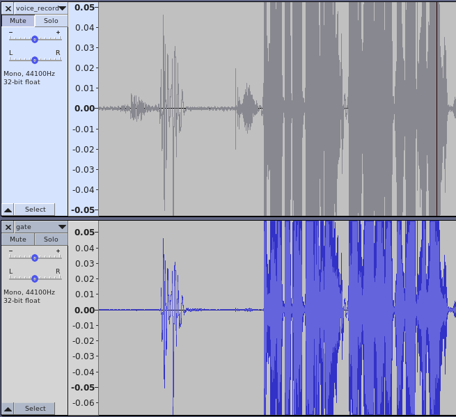

As you can see, the "silent" parts were attenuated heavily, while the above-the-threshold parts remained similar. Those parts were still affected by the knee, attack, and release arguments determining how hard (knee) and quick (attack/release) the cut is.

如您所见，“无声”部分被严重衰减，而高于阈值的部分保持相似。 这些部分仍然受到膝盖、攻击和释放参数的影响，这些参数决定了切割的难度（膝盖）和速度（攻击/释放）。

I've left a quite high release timeout here to avoid sudden dips in the amplitude.

我在这里留了一个相当高的释放超时以避免振幅突然下降。

This is where we are right now:

这就是我们现在所在的位置：

The silent parts are more silent than before, but still, the amplitude range or the dynamic range is quite high. You must change your volume levels to hear everything and void blowing your speakers/brain out.

静音部分比以前更静音，但振幅范围或动态范围仍然很高。 你必须改变你的音量水平才能听到一切，避免让你的扬声器/大脑爆炸。

### Equalization

### 均衡

Before fixing that, let's do a bit more housekeeping. Let's do some equalization and frequency filtering!

在解决这个问题之前，让我们做更多的内务处理。 让我们做一些均衡和频率过滤！

We'll use these filters:

我们将使用这些过滤器：

-   [highpass](https://ffmpeg.org/ffmpeg-filters.html#highpass)
-   [高通](https://ffmpeg.org/ffmpeg-filters.html#highpass)
-   [lowpass](https://ffmpeg.org/ffmpeg-filters.html#lowpass)
-   [低通](https://ffmpeg.org/ffmpeg-filters.html#lowpass)
-   [anequalizer](https://ffmpeg.org/ffmpeg-filters.html#anequalizer)
-   [均衡器](https://ffmpeg.org/ffmpeg-filters.html#anequalizer)

Let's hear it: [gate\_eq.wav](https://storage.googleapis.com/imgly-static-assets/static/blog/ffmpeg-audio/audio-5-gate.wav)

让我们来听听： [gate\_eq.wav](https://storage.googleapis.com/imgly-static-assets/static/blog/ffmpeg-audio/audio-5-gate.wav)

This command gradually attenuates frequencies below 100hz, as there are not much valuable content in there, but it can really lower the clarity of the speech.

此命令逐渐衰减 100hz 以下的频率，因为那里没有太多有价值的内容，但它确实会降低语音的清晰度。

Then we do the same, but for frequencies above 10 kHz. This is mostly needed because we have a lot of high-frequency noise, so this is a workaround for those. Also, a male voice is generally deeper than a woman's, so you might want to pay attention to how low you can put the bar.

然后我们做同样的事情，但频率高于 10 kHz。 这是最需要的，因为我们有很多高频噪声，所以这是解决这些问题的方法。 此外，男声通常比女声低沉，因此您可能需要注意可以将音调降低到多低。

Then comes anequalizer, which has a crazy an exceptional way of setting its arguments:

然后是一个均衡器，它有一种疯狂的特殊方式来设置它的参数：

This: `anequalizer=c0 f=250 w=100 g=2 t=1|c0 f=700 w=500 g=-5 t=1|c0 f=2000 w=1000 g=2 t=1` means:

这个： `anequalizer=c0 f=250 w=100 g=2 t=1|c0 f=700 w=500 g=-5 t=1|c0 f=2000 w=1000 g=2 t=1`方法：

-   at 250hz with a width of 100hz boost by 2 db, with Chebyshev type 1 filter on channel 0.
-   在 250hz，宽度为 100hz，提升 2 db，在通道 0 上使用 Chebyshev type 1 滤波器。
-   at 700hz with a width of 500hz attenuate by 5 db, with Chebyshev type 1 filter on channel 0.
-   在 700hz，宽度为 500hz，衰减 5 db，在通道 0 上使用 Chebyshev type 1 滤波器。
-   at 2000hz with a width of 1000hz attenuate by 2 db, with Chebyshev type 1 filter on channel 0.
-   在 2000hz，宽度为 1000hz，衰减 2 db，在通道 0 上使用切比雪夫 1 型滤波器。

I agree. You might have used a friendlier equalizer in your life than this one:)

我同意。 您可能在生活中使用过比这个更友好的均衡器:)

Those values are based on experimentation and common recommendations for voice. Feel free to tune it for your own needs!

这些值基于语音的实验和通用建议。 随意根据自己的需要调整它！

Let's compare the frequency plots before and after:

让我们比较前后的频率图：

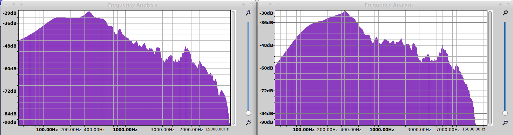

Tip: To see the frequency plot in Audacity, open a file, select all, and choose Analyze → Plot spectrum!

提示：要在 Audacity 中查看频率图，请打开一个文件，全选，然后选择 Analyze → Plot spectrum！

### Compression

### 压缩

The [compressor](https://ffmpeg.org/ffmpeg-filters.html#acompressor) filter applies [dynamic range compression](https://en.wikipedia.org/wiki/Dynamic_range_compression) on the incoming audio data. To simplify this, the compressor varies the attenuation based on the incoming signal level. Basically, when you watch a badly mastered movie, this is what you are doing. When it is way too loud in some action scene, you reach for the remote control or mouse to lower the volume, but in the next moment, you will not hear what your heroes are saying, so you increase it back again.

器 [压缩](https://ffmpeg.org/ffmpeg-filters.html#acompressor) 过滤器 [应用动态范围压缩](https://en.wikipedia.org/wiki/Dynamic_range_compression) 对传入的音频数据 。 为了简化这一点，压缩器根据输入信号电平改变衰减。 基本上，当你看一部母带不好的电影时，这就是你在做的事情。 在某些动作场景中音量太大时，您可以使用遥控器或鼠标将音量调低，但下一刻，您将听不到您的英雄在说什么，因此您又将音量调高。

Dynamic range compression roughly does the same. You may set it up in a way so that it would attenuate louder parts, therefore keeping the overall volume range relatively small.

动态范围压缩大致相同。 您可以通过某种方式设置它，使其衰减较大的部分，从而使整体音量范围保持相对较小。

It often happens that performers on the stage use a high dynamic range. Many performers will shout at one moment and then whisper in the next to increase drama or keep the attention. If you want to avoid manually adjusting the volume in real-time (while blowing off your speakers and pulling your hair out), then a compressor will save you in these situations!

舞台上的表演者经常使用高动态范围。 许多表演者会在某一时刻大声喊叫，然后在下一时刻耳语以增加戏剧性或保持注意力。 如果您想避免实时手动调节音量（同时吹掉您的扬声器并拔掉您的头发），那么在这些情况下，压缩器可以为您解救！

This is why our example audio consists of different speaking strengths, so that we could see the dramatic effect of this filter.

这就是为什么我们的示例音频包含不同的说话强度，以便我们可以看到此过滤器的戏剧效果。

Let's hear it: [gate\_eq\_comp.wav](https://storage.googleapis.com/imgly-static-assets/static/blog/ffmpeg-audio/audio-1-gate-eq-comp.wav)

让我们来听听： [gate\_eq\_comp.wav](https://storage.googleapis.com/imgly-static-assets/static/blog/ffmpeg-audio/audio-1-gate-eq-comp.wav)

And let's compare the result of this with the original waveform!

让我们将这个结果与原始波形进行比较！

Original:

原来的：

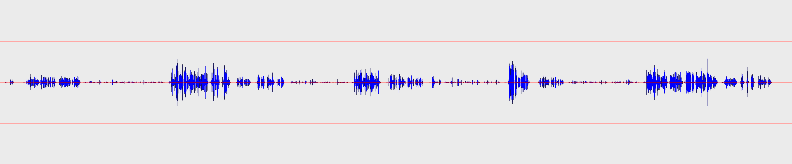

Result:

结果：

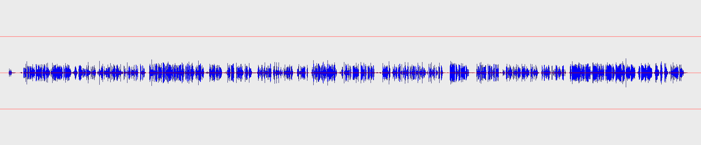

Quite dramatic, isn't it?:)

很戏剧化，不是吗？:)

Let's analyze this: `acompressor=level_in=6:threshold=0.025:ratio=20:makeup=6`

让我们分析一下： `acompressor=level_in=6:threshold=0.025:ratio=20:makeup=6`

First, `level_in=6`  sets the input gain. It is 1 by default, but since our example, audio is extremely silent at places, we boost up the whole thing before processing.

第一的， `level_in=6`设置输入增益。 默认情况下为 1，但由于我们的示例，音频在某些地方非常安静，我们在处理之前提升了整个声音。

Then `threshold=0.025` defines that everything above 0.025 should be attenuated.

然后 `threshold=0.025`定义高于 0.025 的所有值都应衰减。

Based on the image below, I've decided to cut at this point, as this is above most of the whispering, which cuts hard pops and "s"-es even in the "whisper zone".

根据下图，我决定在这一点上切掉，因为这是在大部分耳语之上，即使在“耳语区”也能切掉硬爆破音和“s”-es。

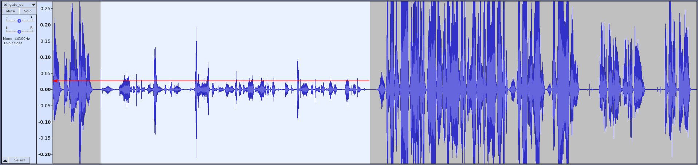

Then `ratio=20` means 1:20 in attenuation ratio, which means that if the level rises 20 dB above the threshold, it will be only 1 dB above the line after the attenuation. Basically, this is a very strong compression ratio, it is almost a [limiter](https://ffmpeg.org/ffmpeg-filters.html#alimiter).

Then `ratio=20` means 1:20 in attenuation ratio, which means that if the level rises 20 dB above the threshold, it will be only 1 dB above the line after the attenuation. Basically, this is a very strong compression ratio, it is almost a [limiter](https://ffmpeg.org/ffmpeg-filters.html#alimiter).

This far, we boosted the signal, then turned down everything that was above our "whisper line" with a quite strong ratio, and now, everything is basically at the whisper level, even the parts that are shouting.

This far, we boosted the signal, then turned down everything that was above our "whisper line" with a quite strong ratio, and now, everything is basically at the whisper level, even the parts that are shouting.

Finally, with the `makeup=6` we just bring back everything to the level where the "normal" parts were before.

最后，随着 `makeup=6`我们只是将所有内容恢复到“正常”部分之前的水平。

Let's take a look back now, to understand why we used the gate and did the equalization before the compressor.

现在让我们回顾一下，了解为什么我们使用门并在压缩器之前进行均衡。

Generally, you want to remove unneeded parts and frequencies before compression, as the compressor will likely increase those too! So by removing most of the noise in the gaps, we avoided `level_in=6` to increase them too! And the same goes for the high- and lowpass filtering.

通常，您希望在压缩前删除不需要的部分和频率，因为压缩器也可能会增加它们！ 所以通过消除间隙中的大部分噪音，我们避免了 `level_in=6`也增加它们！ 高通和低通滤波也是如此。

### Changing the volume

### 改变音量

Now, if we want to make the result a bit louder, we could increase the previous step's `makeup` argument, or leverage the volume [filter](https://ffmpeg.org/ffmpeg-filters.html#volume).

现在，如果我们想让结果更响亮一点，我们可以增加上一步的 `makeup`参数，或利用音量 [过滤器](https://ffmpeg.org/ffmpeg-filters.html#volume) 。

While we are at it, let's cut the first 4 seconds too with `-ss 4`.

当我们这样做的时候，让我们把前 4 秒也用 `-ss 4`.

Let's hear it: [gate\_eq\_volume\_comp.wav](https://storage.googleapis.com/imgly-static-assets/static/blog/ffmpeg-audio/audio-2-gate_eq_volume_comp.wav)

让我们来听听： [gate\_eq\_volume\_comp.wav](https://storage.googleapis.com/imgly-static-assets/static/blog/ffmpeg-audio/audio-2-gate_eq_volume_comp.wav)

### Let's make audio gate again

### 让我们再次制作音频门

Excuse me for that title:)

对不起，这个标题：）

So as I've described earlier, compression can amplify the noises, so you might want to run the result through a gate again:

因此，正如我之前所述，压缩会放大噪声，因此您可能希望再次通过门运行结果：

Let's hear it: [gate\_eq\_volume\_comp\_gate.wav](https://storage.googleapis.com/imgly-static-assets/static/blog/ffmpeg-audio/audio-3-gate_eq_volume_comp_gate.wav)

让我们听听： [gate\_eq\_volume\_comp\_gate.wav](https://storage.googleapis.com/imgly-static-assets/static/blog/ffmpeg-audio/audio-3-gate_eq_volume_comp_gate.wav)

In this case, I've used a softer gate, with `ratio=1.5`. Because of this, I could use shorter attack and release delays too, as the attenuation is not that strong, it isn't causing hard dips in the audio.

在这种情况下，我使用了一个更柔和的门， `ratio=1.5`. 因此，我也可以使用更短的启动和释放延迟，因为衰减不是那么强，不会导致音频急剧下降。

### Putting it all together

### 把它们放在一起

Just a single command could have achieved all the steps above:

只需一个命令就可以完成上述所有步骤：

I just copy-pasted all the filters right after each other with a comma between them.

I just copy-pasted all the filters right after each other with a comma between them.

Isn't it beautiful? Yeah, it isn't, but it is very practical:)

是不是很美？ 是的，它不是，但它非常实用:)

For the last time, check out the difference:

最后一次，检查差异：

-   Original: [voice\_recording.wav](https://storage.googleapis.com/imgly-static-assets/static/blog/ffmpeg-audio/audio-4-voice_recording.wav)
-   原文： [voice\_recording.wav](https://storage.googleapis.com/imgly-static-assets/static/blog/ffmpeg-audio/audio-4-voice_recording.wav)
-   Final: [gate\_eq\_volume\_comp\_gate.wav](https://storage.googleapis.com/imgly-static-assets/static/blog/ffmpeg-audio/audio-3-gate_eq_volume_comp_gate.wav)
-   最终： [gate\_eq\_volume\_comp\_gate.wav](https://storage.googleapis.com/imgly-static-assets/static/blog/ffmpeg-audio/audio-3-gate_eq_volume_comp_gate.wav)

It has less noise, more clear voice, and a small volume range. Therefore it is easy on your ears!

噪音更小，声音更清晰，音量范围小。 因此，这对您来说很容易！

### What else?

### 还有什么？

You might want to check out a few more [filters](https://ffmpeg.org/ffmpeg-filters.html#toc-Audio-Filters) that I didn't cover here.

您可能想查看 [的更多过滤器。](https://ffmpeg.org/ffmpeg-filters.html#toc-Audio-Filters) 我未在此处介绍

Here are just a few interesting ones:

这里只是一些有趣的：

-   [adeclick](https://ffmpeg.org/ffmpeg-filters.html#adeclick)
-   [点按](https://ffmpeg.org/ffmpeg-filters.html#adeclick)
-   [adeclip](https://ffmpeg.org/ffmpeg-filters.html#adeclip)
-   [剪辑](https://ffmpeg.org/ffmpeg-filters.html#adeclip)
-   [aecho](https://ffmpeg.org/ffmpeg-filters.html#aecho)
-   [回声](https://ffmpeg.org/ffmpeg-filters.html#aecho)
-   [deesser](https://ffmpeg.org/ffmpeg-filters.html#deesser)
-   [去嘶声](https://ffmpeg.org/ffmpeg-filters.html#deesser)
-   [alimiter](https://ffmpeg.org/ffmpeg-filters.html#alimiter)
-   [否则](https://ffmpeg.org/ffmpeg-filters.html#alimiter)

## Documentation

## 文档

For your convenience, let me list the most important documentations that might be important for you! Most of these were already linked many times in this article.

为了您的方便，让我列出可能对您很重要的最重要的文档！ 其中大部分已在本文中多次链接。

-   [FFmpeg main documentation](https://ffmpeg.org/ffmpeg.html)
-   [FFmpeg 主要文档](https://ffmpeg.org/ffmpeg.html)
-   [FFmpeg WIKI](https://trac.ffmpeg.org/wiki)
-   [FFmpeg 维基](https://trac.ffmpeg.org/wiki)
-   [FFmpeg compilation guide](https://trac.ffmpeg.org/wiki/CompilationGuide)
-   [FFmpeg编译指南](https://trac.ffmpeg.org/wiki/CompilationGuide)
-   [FFmpeg filters documentation](https://ffmpeg.org/ffmpeg-filters.html)
-   [FFmpeg 过滤器文档](https://ffmpeg.org/ffmpeg-filters.html)
-   [FFmpeg formats documentation](https://ffmpeg.org/ffmpeg-formats.html)
-   [FFmpeg 格式文档](https://ffmpeg.org/ffmpeg-formats.html)
-   [H.264 Video Encoding Guide](https://trac.ffmpeg.org/wiki/Encode/H.264)
-   [H.264 视频编码指南](https://trac.ffmpeg.org/wiki/Encode/H.264)
-   [H.265 Video Encoding Guide](https://trac.ffmpeg.org/wiki/Encode/H.265)
-   [H.265 视频编码指南](https://trac.ffmpeg.org/wiki/Encode/H.265)

If you got this far from top to bottom, then you are a true hero! I hope you enjoyed this, and I also hope that it inspired you to create something awesome with FFmpeg!

如果你从上到下都做到了这一点，那么你就是一个真正的英雄！ 我希望你喜欢这个，我也希望它能激励你用 FFmpeg 创造一些很棒的东西！

Please consider [donating](https://ffmpeg.org/donations.html) to FFmpeg they are awesome.

请考虑 [捐赠](https://ffmpeg.org/donations.html) 给 FFmpeg，它们很棒。
