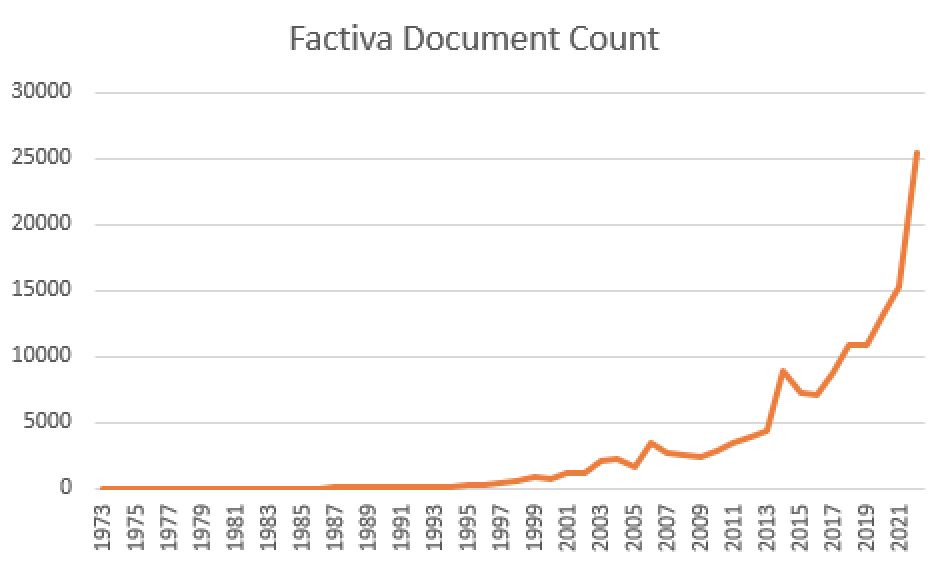
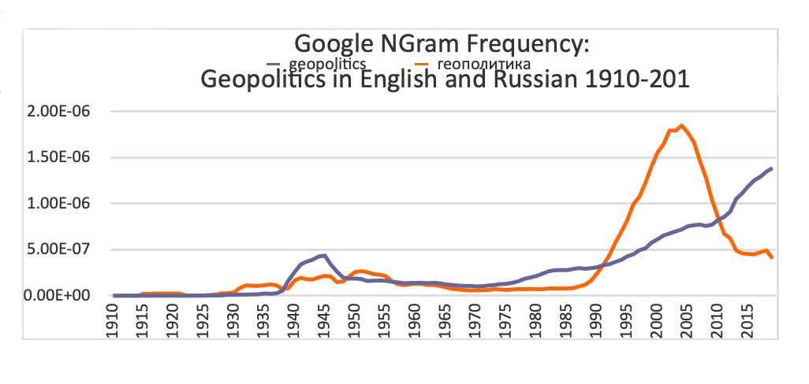

Today everyone talks geopolitics. The idea is infectious. It appears to come from nowhere. Twenty years ago, the term was exotic, and the meaning behind it quaint. The world was different then. In 2002, _America Unrivaled_ – a book edited by my Princeton colleague, G John Ikenberry, the foremost exponent of the idea of liberal internationalism – asked why there was so little resistance from other countries to American power projection. That was when the momentum in the United States for an attack on Iraq was building up. The contributors argued that there was no balancing against the unipolar moment that had been created with the disintegration of the Soviet Union: in short, no geopolitics. That changed in the course of the 2000s, and the word ‘geopolitics’ began its road to a dominance of political discourse.

今天每个人都在谈论地缘政治。 这个想法很有感染力。 它似乎不知从何而来。 二十年前，这个词是异国情调的，它背后的含义也很古怪。 那时的世界不一样了。 2002 年，我在 _美国无与伦比_ 一本书《 普林斯顿大学的同事约翰·伊肯伯里 ( G John Ikenberry，自由国际主义思想的最重要倡导者) 编辑的 》询问了为什么其他国家对美国力量投射的阻力如此之小。 就在那时，美国进攻伊拉克的势头正在增强。 撰稿人争辩说，苏联解体造成的单极时刻没有平衡：简而言之，没有地缘政治。 这种情况在 2000 年代发生了变化，“地缘政治”一词开始占据政治话语的主导地位。

There are simple numerical indicators (see Figure 1 below). A compilation of all newspaper uses of ‘geopolitics’ in English-language publications shows a remarkable increase, in two surges, one after the 2007-08 global financial crisis, and the second after 2014-15, in the aftermath of Russia’s annexation of Crimea and the European refugee crisis that followed the Syrian war.

有简单的数字指标（ 见下图 1 ）。 对所有报纸在英文出版物中使用“地缘政治”的汇编显示，在两次激增中显着增加，一次是在 2007-08 年全球 金融 危机之后，第二次是 在2014-15 年 俄罗斯吞并克里米亚之后以及叙利亚战争之后的欧洲难民危机。

Figure 1

We often associate the beginning of the modern turn to geopolitics with two men, Vladimir Putin and Xi Jinping. Putin defined his historic mission in terms of geopolitics. The collapse of the Soviet Union, he declared, had been the greatest geopolitical catastrophe of the 20th century. The explosion of geopolitical thinking already took place in 1990s Russia (see Figure 2 below). Putin’s speech at the Munich Conference on Security Policy in 2007 was a turning point, which he began with a denunciation of the concept of unipolarity:

我们经常将现代转向地缘政治的开端与弗拉基米尔·普京 (Vladimir Putin) 和习近平这两个人联系在一起。 普京从地缘政治的角度界定了他的历史使命。 他宣称，苏联解体是 20 世纪最大的地缘政治灾难。 地缘政治思维的大爆发在 1990 年代的俄罗斯就已发生（见下 图 2 ）。 普京在 2007 年慕尼黑安全政策会议上的讲话是一个转折点，他首先谴责了单极概念：

> One state and, of course, first and foremost the United States, has overstepped its national borders in every way. This is visible in the economic, political, cultural and educational policies it imposes on other nations. Well, who likes this? Who is happy about this?

Figure 2

Putin’s language is a characteristic expression of the geopolitical mindset, and reflects the sense that geopolitics involves making good losses, and compensating for inferiority and the memory of humiliation. That language is also present with China’s wish to break the legacy of ‘a century of humiliation’ that followed the Opium Wars, when Britain and other imperialist powers used [the trade in drugs](https://aeon.co/essays/how-european-empires-broke-the-habit-of-opium-consumption) to destroy the morale and the capability of the Chinese population.

普京的语言是地缘政治思维方式的典型表现，体现了地缘政治吃亏、赔本、耻辱的意识。 中国希望打破鸦片战争后“百年屈辱”的遗留问题，当时英国和其他帝国主义列强利用毒品贸易摧毁了中国人民的士气和 [能力](https://aeon.co/essays/how-european-empires-broke-the-habit-of-opium-consumption) 。

The Chinese turn to reflection on global geopolitics also started with the global financial crisis, when it looked as if China was rescuing global capitalism. Xi Jinping’s predecessor, Hu Jintao, had already urged in 2009 that China should assert four strengths, ‘more influential power in politics, more competitiveness in the economic field, more affinity in its image’ and ‘more appealing force in morality’. He concluded: ‘The prospect of global multipolarisation has become clearer.’

中国人对全球地缘政治的反思也始于全球金融危机，当时中国似乎在拯救全球资本主义。 习近平的前任胡锦涛在 2009 年就已经提出，中国应该坚持四大优势，“政治上更具影响力、经济上更具竞争力、形象上更具亲和力”和“道德感召力更强”。 他总结说：“全球多极化的前景已经变得更加清晰。”

Crimea and the Syrian refugees brought geopolitics home to everyone else. The Russian attack on Ukraine in 2022 is another turning point, where attention was focused on Russia’s ability to exert pressure by choking off gas supplies. Today’s US is obsessed with geopolitical challenges, and consequently with reframing the world. The US treasury secretary Janet Yellen talked about a reordering of globalisation in which countries should reorder trade relations so that they would manage supply chains by ‘friend-shoring’, building relations only with countries that were reliable allies, and reducing dependence on strategic competitors. That vision is a sign of a new US nervousness.

克里米亚和叙利亚难民将地缘政治带入了其他所有人的视野。 2022 年俄罗斯对乌克兰的袭击是另一个转折点，人们的注意力集中在俄罗斯通过切断天然气供应来施加压力的能力上。 今天的美国痴迷于地缘政治挑战，并因此着迷于重塑世界。 美国财政部长珍妮特耶伦谈到了全球化的重新排序，其中各国应该重新排序贸易关系，以便他们通过“支持朋友”来管理供应链，只与可靠的盟友建立关系，并减少对战略竞争对手的依赖。 这一愿景表明美国出现了新的紧张情绪。

The soft-power European Union too has taken up the fad, as the European Commission’s president Ursula von der Leyen promised a turn to a geopolitical Commission. In a globalised world, many Europeans thought that Europe needed a voice. The argument that large member countries – France, Germany or Italy – could not on their own be really influential in global politics appeared attractive. Josep Borrell, the EU’s de facto foreign minister, gave programmatic statements about the problems of multilateralism and openness, and how ‘we must relearn the language of power and conceive of Europe as a top-tier geostrategic actor.’

欧盟的软实力也迎头赶上，欧盟委员会主席乌尔苏拉 ·冯德莱恩 承诺转向地缘政治委员会。 在全球化的世界中，许多欧洲人认为欧洲需要发言权。 大型成员国——法国、德国或意大利——不能靠自己在全球政治中真正发挥影响力的论点似乎很有吸引力。 欧盟 事实上 的外交部长何塞普·博雷尔 (Josep Borrell) 就多边主义和开放性问题以及“我们必须如何重新学习强权语言并将欧洲视为顶级地缘战略参与者”的问题发表了纲领性声明。

Do the politicians and pundits who speak of geopolitics really know what they are talking about? Geopolitics is a classically ambiguous or nebulous term, with an innocent and a dangerous use. For some, it is a vague sense of continents and big geographical spaces, or just that geography matters in the sense that the United Kingdom is more likely to trade with France and Ireland than with New Zealand; for others, it is about a claim that reality consists of endless conflict and struggle, in which space matters more than ideas, maps more than chaps. This is a bleak, conflictual, zero-sum world.

谈论地缘政治的政治家和权威人士真的知道他们在谈论什么吗？ 地缘政治是一个经典的模棱两可或含糊不清的术语，具有无辜和危险的用途。 对一些人来说，这是对大陆和广阔地理空间的模糊认识，或者只是地理问题，因为英国更可能与法国和爱尔兰进行贸易，而不是与新西兰进行贸易； 对于其他人来说，它是关于现实由无休止的冲突和斗争组成的主张，其中空间比想法更重要，地图比小伙子更重要。 这是一个凄凉、冲突、零和的世界。

Space and place clearly matter. At some times, the attention of the world focuses on particular geographic hotspots: some dominate the geopolitical imagination, the eastern Mediterranean, the Dardanelles. The passage between the Black Sea and the Mediterranean assumes a global significance, a thin needle that connects the grain-producing areas of autocratically controlled central Eurasia to starving consumers.

空间和地点显然很重要。 有时，世界的注意力集中在特定的地理热点上：一些主宰地缘政治的想象，东地中海，达达尼尔海峡。 黑海和地中海之间的通道具有全球意义，是一根细针，将专制控制的欧亚大陆中部的粮食产区与饥饿的消费者联系起来。

It is worth asking where all this demand for geopolitics originated, where the link between geopolitics and humiliation was born. What could be further from the carnage of Ukraine, the tensions in the Taiwan Straits or Gaza, or the busy waters of the Bosporus, than a peaceful Bavarian farm? Set in the green rolling hills to the south-west of Munich, near Lake Ammer, and just a few miles away from a Benedictine monastery on a hill overlooking the water, it’s where thousands of Bavarians come annually in a pilgrimage – for beer. Unlike most Bavarian cattle farms, the cows are not a mottled brown and white, but heavier, bigger, with a thick tousled black coat: a Scottish breed, Galloways. The farm, the Hartschimmelhof, has been in family hands since the beginning of the 20th century, when it was given as a wedding present from his father-in-law to Karl Haushofer, the most influential figure in the development of the study of geopolitics in the early 20th century.

值得一 问的是，所有这些对地缘政治的需求从何而来，地缘政治与屈辱之间的联系又是从何而来。 除了乌克兰的大屠杀、台湾海峡或加沙的紧张局势或博斯普鲁斯海峡繁忙的水域，还有什么比和平的巴伐利亚农场更远离呢？ 坐落在慕尼黑西南部连绵起伏的绿色山丘上，靠近阿默湖，距离俯瞰湖水的山上的本笃会修道院仅几英里，每年都有成千上万的巴伐利亚人前来朝圣——喝啤酒。 与大多数巴伐利亚养牛场不同，这里的奶牛不是斑驳的棕白相间，而是更重、更大，披着厚厚的、凌乱的黑色皮毛：苏格兰品种 Galloways。 Hartschimmelhof 农场自 20 世纪初以来一直由家族所有， 当时它是他的岳父送给地缘政治研究发展中最有影响力的人物 Karl Haushofer 的结婚礼物在 20世纪初。

It was Haushofer who laid the basis for the definitional shiftiness of the term. He saw himself as _the_ prophet of geopolitics, but – typically and revealingly – could never clearly explain what it actually was. A characteristic attempt was ‘the science of the political life form in its natural living space’. Or a normative demand that ‘geopolitics will and must be the geographic conscience of the state’.

Haushofer 为该术语的定义变化奠定了基础。 他将自己视为 _地缘政治的先知_ ，但——典型地、具有启发性的——永远无法清楚地解释它到底是什么。 一个典型的尝试是“在其自然生活空间中研究政治生命形式的科学”。 或者是“地缘政治将而且必须成为国家的地理良知”的规范性要求。

I visited Hartschimmelhof last summer with my family. The farm shop that sells paper goods was open only a few hours a week, as publicised online. We arrived in the right time slot, and the door was open. As we entered, an eerie mixture of music and birdsong started to play from a speaker in the corner of the room. But there was no one in sight. Outside the old farmhouse opposite the shop there was a notice warning of a dangerous dog and, indeed, hidden behind some rather overgrown bushes rustled a large dark shape. It didn’t bark, and on a closer approach it turned out to be a black Galloway calf that seemed to have separated itself from the main herd.

去年夏天我和家人一起去了 Hartschimmelhof。 正如网上宣传的那样，出售纸制品的农场商店每周只营业几个小时。 我们在正确的时间段到达，门是开着的。 当我们进入时，房间角落的扬声器开始播放音乐和鸟鸣的怪异混合物。 但是没有人在视线中。 在商店对面的旧农舍外面，有一条危险的狗警告警告，事实上，在一些杂草丛生的灌木丛后面，沙沙作响的是一个巨大的黑色形状。 它没有吠叫，走近一看，原来是一头黑色的加洛韦小牛，似乎已经脱离了大群。

Hitler found the concept congruent with his amoral view of international relations

希特勒发现这个概念与他对国际关系的非道德观是一致的

The whole setup at Hartschimmelhof exudes mystery. That is appropriate for geopolitics. The word _Geopolitik_, which Haushofer took up with relish, had been coined by a Swedish politician, Johan Rudolf Kjellén, above all in the book _Introduction to Swedish Geography_ (1900). Kjellén later developed the theory that European history was driven by the contest for three river basins: of the Rhine, the Danube, and the Vistula.

Hartschimmelhof 的整个布置都散发着神秘的气息。 这适用于地缘政治。 )一词 _豪斯霍费尔 (Haushofer) 津津乐道的地缘政治 ( Geopolitik_ 是瑞典政治家约翰·鲁道夫·谢伦 (Johan Rudolf Kjellén) 在《 _瑞典地理概论》( Introduction to Swedish Geography_ , 1900) 一书中创造的。 谢伦后来发展了这样一个理论，即欧洲历史是由三个流域的争夺驱动的：莱茵河、多瑙河和维斯杜拉河。

Haushofer conscientiously listed his other influences as the German geographer Friedrich Ratzel, whose work centred around the concept of space (_Raum_) and who introduced the concept _Lebensraum_ or living space, and the English geographer (and director of the London School of Economics) Halford Mackinder. Mackinder laid down a distinction, which became very influential in both Germany and Russia, about the different ideologies and structures of maritime and land powers, although he – unlike the German and Russian successors – saw classical Rome as a sea power, and the Greeks as a Slavic land power. ‘It is probably one of the most striking coincidences of history that the seaward and the landward expansion of Europe should, in a sense, continue the ancient opposition between Roman and Greek,’ he [wrote](https://www.jstor.org/stable/1775498) in 1904. The critical impulse, to which Mackinder gave the label ‘pivot area’, always came from the centre of the Eurasian landmass.

Haushofer 认真地列出了他的其他影响，如德国地理学家 Friedrich Ratzel，他的工作以空间概念 ( _Raum_ ) 为中心，并引入了 _Lebensraum_ 或生活空间的概念，以及英国地理学家（和伦敦经济学院院长）Halford Mackinder . 麦金德对海上和陆地强国的不同意识形态和结构进行了区分，这在德国和俄罗斯都非常有影响，尽管他——与德国和俄罗斯的继任者不同——将古典罗马视为海上强国，而希腊人则是斯拉夫的土地力量。 “从某种意义上说，欧洲向海和向陆地的扩张应该延续罗马和希腊之间古老的对立，这可能是历史上最引人注目的巧合之一。” [写道：](https://www.jstor.org/stable/1775498) 他在 1904 年 “枢纽区”这个标签，总是来自欧亚大陆的中心。

Haushofer was fascinated by Asian politics, and used his Tokyo experience for his doctoral thesis _Dai Nihon: Reflections on Greater Japan’s Military Strength, World Position, and Future_ (1913). Oddly, it looked as if the countries on the ‘outer crescent’ identified by Mackinder knew better about how to use or apply power than the continental countries, which still needed to learn geopolitics. Specifically, Haushofer was convinced that Germany should imitate Japan and Japan’s pursuit of clashes with its neighbours, China and Russia. Haushofer wanted to ‘direct Central Europe’s gaze to the strengthening and rejuvenation that Japan owes to the storm of steel,’ necessarily produced by war.

豪斯霍费尔对亚洲政治着迷，并利用他在东京的经历撰写了博士论文《 _大日本：对大日本的军事实力、世界地位和未来的思考》_ （1913 年）。 奇怪的是，麦金德确定的“外新月”国家似乎比大陆国家更了解如何使用或运用权力，大陆国家仍需学习地缘政治。 具体来说，豪斯霍费尔坚信德国应该效仿日本和日本寻求与邻国中国和俄罗斯发生冲突的做法。 豪斯霍费尔希望“将中欧的目光引向日本因钢铁风暴而得到的加强和复兴”，这必然是 由战争产生的。

Karl Haushofer and Rudolf Hess _c_1920\. Courtesy Wikimedia

After the end of the First World War, Haushofer thought that there was a need for a vast public re-education to ‘awaken the sleeping geopolitical instinct’ that British and Japanese people already possessed, the lack of which was leading to chaos in central Europe: ‘decomposition’ in Upper Silesia, on ‘the dissolving Rhine front’ which would be followed by ‘dissolution’ on the Vistula and Danubian fronts. One of Haushofer’s students, Rudolf Hess, brought Haushofer’s view of _Geopolitik_ to the attention of the young Munich agitator Adolf Hitler, who found the concept useful and congruent with his amoral view of international relations, and made the critical term _Lebensraum_ a central part of a new political programme. Haushofer’s most intense contact with Hitler was probably during the period of Hitler’s very loose confinement in Landsberg Prison after the failure of the 1923 Beer Hall putsch. Haushofer regularly visited Hess in prison, where the Nazi leader was dictating his biographical manifesto _Mein Kampf_ to Hess. How much of Haushofer went into the Nazi bible? Most recent scholars of Hitler and Nazism are sceptical; the innumerable Hitler biographies devote little space to him. There is no mention in Hitler’s book of the noun ‘geopolitics’. But there is plenty of reference to the inevitability of conflict and of the imperative German demand for _Lebensraum_.

第一次世界大战结束后，豪斯霍费尔认为有必要进行大规模的公共再教育，以“唤醒沉睡的地缘政治本能”，英国人和日本人已经拥有这种本能，而这种本能的缺乏导致了中欧的混乱：上西里西亚的“分解”，在“溶解的莱茵河前线”上，随后在维斯杜拉河和多瑙河前线发生“溶解”。 Haushofer 的一名学生 Rudolf Hess 将 Haushofer 的 _地缘政治_ 观点引起了年轻的慕尼黑煽动者阿道夫希特勒的注意，希特勒发现这个概念很有用并且符合他对国际关系的非道德观，并将批评性术语 _Lebensraum_ 作为其核心部分新的政治纲领。 豪斯霍费尔与希特勒最密切的接触可能是在 1923 年啤酒馆政变失败后希特勒被非常宽松地关押在兰茨贝格监狱期间。 豪斯霍费尔定期探访监狱中的赫斯，这位纳粹领导人正在那里口述他的传记宣言 _我的奋斗_ 到赫斯。 有多少 Haushofer 进入了纳粹圣经？ 最近研究希特勒和纳粹主义的学者们持怀疑态度。 数不胜数的希特勒传记几乎没有篇幅介绍他。 希特勒的书中没有提到“地缘政治”这个名词。 但是有很多地方提到了冲突的不可避免性以及德国对 _Lebensraum_ 的迫切要求。

In the 1930s, however, especially in the UK and the US, Haushofer was frequently regarded as the central influence on Hitler. Immediately after the 1939 Nazi-Soviet pact, the British _New Statesman and Nation_ magazine explained that the Russo-German agreement had ‘little to do with the official “ideology” of the Nazi programme, the rantings against “Bolshevik subhumanity” or the romantic vision of a trek of German colonists on the medieval model to win a new “Lebensraum” in the Ukraine. They are hard and realistic and to a considerable extent they have been stolen from the intellectual arsenal of British Imperialism,’ – ie, from Mackinder. On the other side of the Atlantic, there were similar interpretations. A magazine [article](https://online.ucpress.edu/currenthistory/article-abstract/53/1/10/185815/Hitler-s-Scientists1-000-Nazi-Scientists) of June 1941 claimed: ‘Major General Professor Dr Karl Haushofer and his Geo-Political Institute in Munich with its 1,000 scientists, technicians and spies are almost unknown to the public, even in the Reich. But their ideas, their charts, maps, statistics, information and plans have dictated Hitler’s moves from the very beginning.’

然而，在 1930 年代，尤其是在英国和美国，豪斯霍费尔经常被视为对希特勒有核心影响的人。 在 1939 年纳粹-苏联协定之后，英国 _《新政治家与国家》_ 杂志立即解释说，俄德协定“与纳粹计划的官方‘意识形态’、反对‘布尔什维克的非人性’的咆哮或浪漫主义愿景无关”德国殖民者以中世纪模式为在乌克兰赢得新的“生活空间”而进行的长途跋涉。 它们坚硬而现实，在相当大的程度上它们是从英帝国主义的知识分子武器库中偷来的，'——即从麦金德那里偷来的。 在大西洋的另一边，也有类似的解释。 1941 年 6 月的一篇杂志 [文章](https://online.ucpress.edu/currenthistory/article-abstract/53/1/10/185815/Hitler-s-Scientists1-000-Nazi-Scientists) 声称：“少将卡尔豪斯霍夫教授和他在慕尼黑的地缘政治研究所及其 1,000 名科学家、技术人员和间谍几乎不为公众所知，即使在德国也是如此。 但他们的想法、图表、地图、统计数据、信息和计划从一开始就决定了希特勒的行动。

In fact, Haushofer was in increasing difficulty during the Nazi dictatorship. The initial problem was that Nazi race laws categorised his wife Martha, to whom he was absolutely devoted, as Jewish. As long as Hess was the fuhrer’s deputy, Haushofer was protected. Then after Hess’s dramatic air flight to Scotland in May 1941, itself a manifestation of the way Hess interpreted geopolitics, there was no powerful patron, and the Gestapo suspected the Haushofer family had given Hess advice about his flight. Haushofer’s eldest son Albrecht, who had worked in the office of Joachim von Ribbentrop, was arrested briefly, and on his release cultivated a new relationship with the military opposition. After the July 1944 bomb plot, Albrecht tried to hide, but was eventually arrested and killed by the SS in the last days of the war, on 23 April 1945. Karl Haushofer was also interned for a month in Dachau.

事实上，豪斯霍费尔在纳粹独裁统治期间的处境越来越艰难。 最初的问题是纳粹种族法将他绝对忠诚的妻子玛莎归类为犹太人。 只要赫斯是元首的副手，豪斯霍费尔就会受到保护。 然后在 1941 年 5 月赫斯戏剧性地飞往苏格兰之后，这本身就是赫斯解释地缘政治的方式的体现，没有强大的赞助人，盖世太保怀疑豪斯霍费尔家族向赫斯提供了关于他飞行的建议。 豪斯霍费尔的长子阿尔布雷希特曾在约阿希姆·冯·里宾特洛甫的办公室工作，他曾短暂被捕，获释后与军事反对派建立了新的关系。 炸弹阴谋发生后 1944 年 7 月的 ，阿尔布雷希特试图躲藏起来，但最终在战争的最后几天，即 1945 年 4 月 23 日 ，被党卫军逮捕并杀害。卡尔·豪斯霍费尔 (Karl Haushofer) 也在达豪 (Dachau) 被拘禁了一个月。

Geopolitics was turning into a new manifestation of US nervousness and a rationale for asserting dominance

地缘政治正在成为美国紧张情绪的新表现和主张主导地位的理由

After the war, preparing for the Nuremberg war crimes trial, the US chief of counsel Sidney S Alderman, in a memorandum for the US associate justice Robert H Jackson, wrote that:

战后，为准备纽伦堡战争罪审判，美国首席法律顾问西德尼·奥尔德曼 (Sidney S Alderman) 在给美国副法官罗伯特·杰克逊 (Robert H. Jackson) 的备忘录中写道：

> Haushofer was Hitler’s intellectual godfather. It was Haushofer, rather than Hess, who wrote _Mein Kampf_ and who furnished the backbone for the Nazi bible and what we call the common criminal plan. Geopolitics was not merely academic theory. It was a driving, dynamic plan for the conquest of the heartland of Eurasia and for domination of the world by the conquest of that heartland.

However, in the end Jackson appears not to have been convinced, and a few weeks later released Haushofer from internment.

然而，最终杰克逊似乎并没有被说服，几周后豪斯霍弗被释放。

The background to Jackson’s surprising decision was the intervention of the Jesuit scholar of international relations (and geopolitician, and founder of the School of Foreign Service at Georgetown University in Washington, DC) Edmund Walsh. Haushofer quickly saw Walsh as his benign and powerful ‘mentor’, and succeeded in convincing him that _Mein Kampf_ was just one of ‘many ephemeral agitational publications’ that had nothing to do with geopolitics. Geopolitics might be useful: the concept had begun to fascinate many US thinkers.

杰克逊做出令人惊讶的决定的背景是耶稣会国际关系学者（地缘政治家，华盛顿特区乔治敦大学外交学院创始人）埃德蒙沃尔什的干预。 豪斯霍弗很快将沃尔什视为他和蔼而强大的“导师”，并成功地说服他， _我的奋斗_ 只是与地缘政治无关的“许多短暂的鼓动出版物”之一。 地缘政治可能会有用：这个概念已经开始吸引许多美国思想家。

Walsh was not an obvious candidate to be a geopolitician: as a Jesuit, he had always insisted on the strong necessity of morality in foreign relations. But by the end of the Second World War, he believed that ‘with the annihilation of the German _Geopolitik_, a new form \[of\] geopolitics is asserting itself in Eastern and Central Europe,’ and the Soviets were ‘succeeding brilliantly in acquiring domination of Mackinder’s heartland’. Geopolitics was turning into both a new manifestation of American nervousness and a rationale for asserting dominance. There was then a need for something more than the assertion of morality: ‘Unless you can back up your ideals and your hopes by something more than mere words, then the steam-roller goes on and on and on.’

沃尔什显然不是地缘政治家的候选人：作为耶稣会士，他一直坚持外交关系中道德的强烈必要性。 但到第二次世界大战结束时，他相信“随着德国地 _缘政治_ 的毁灭，一种新形式的地缘政治正在东欧和中欧确立自己的地位”，而苏联“在获得对欧洲的统治方面取得了辉煌的成功”麦金德的中心地带”。 地缘政治正在成为美国紧张情绪的新表现，也是确立主导地位的理由。 那时需要的不仅仅是道德主张：“除非你能用不仅仅是语言的东西来支持你的理想和希望，否则蒸汽压路机会继续下去。 ”

Months after his release from American internment, on 10 March 1946, deeply depressed, Karl and Martha killed themselves, and were buried on the Hartschimmelhof. The devoted couple left a note and two empty coffins for their younger son Heinz to find, and a precise map of the location on the farm where their bodies were to be found.

，卡尔和玛莎从美国的拘留所获释几个月后， 1946 年 3 月10 日 在极度沮丧的情况下自杀，并被埋葬在 Hartschimmelhof。 这对忠诚的夫妇留下了一张纸条和两个空棺材，让他们的小儿子海因茨找到，并留下了他们尸体所在农场位置的精确地图。

The geopolitical doctrine was not just attractive to the emerging Western superpower. Haushofer also had a substantial following in the Soviet Union. The most prominent disciple was Karl Radek, the secretary of the Comintern, who later became a critic of Stalin, but in the 1930s maintained contacts with German diplomats that his friends attempted to justify as an anticipation of the geopolitically necessary Stalin-Hitler pact of August 1939. The driving idea was to reverse the loss of influence that Germans and Russians believed they had suffered at the hands of the Western powers. Radek also was involved in an initiative to translate Haushofer into Russian. There was a wider interest: a Russian geopolitical journal flourished in the 1920s. The _Great Soviet Encyclopaedia_ (1929) included an interesting article by the Hungarian cartographer and Soviet intelligence official Alexander Radó on ‘Geopolitics’, which it explained as a largely German phenomenon, intensified by the experience of German defeat and revolution in 1918-19: ‘Geopolitics ideologically sharpened and distinguished itself as a distinct academic system only thanks to the ideological upheavals linked to the imperialist war and revolution in Germany.’

地缘政治学说 不仅对新兴的西方超级大国有吸引力。 豪斯霍费尔在苏联也有大量追随者。 最著名的门徒是共产国际秘书卡尔·拉狄克，他后来成为斯大林的批评者，但在 1930 年代与德国外交官保持联系，他的朋友们试图证明这是对地缘政治必要的斯大林-希特勒八月协定的 预期1939 年。 推动的想法是扭转德国人和俄罗斯人认为他们在西方列强手中遭受的影响力丧失。 拉狄克还参与了一项将 Haushofer 翻译成俄语的计划。 有更广泛的兴趣：俄罗斯地缘政治杂志在 20 年代蓬勃发展。 伟大的 _苏联百科全书_ （1929 年）收录了匈牙利制图师和苏联情报官员亚历山大·拉多 (Alexander Radó) 撰写的一篇关于“地缘政治”的有趣文章，该文章将其解释为主要是德国现象，并因德国战败和革命的经历而加剧 1918-19 年： “地缘政治学在意识形态上变得敏锐，并成为一个独特的学术体系，这要归功于与德国帝国主义战争和革命相关的意识形态动荡。”

Geopolitics had a powerful attraction in Russia, the focus of Mackinder’s 1904 pivot. As in 1920s Germany, the doctrine flourished in the wake of the disintegration of a powerful old empire, pushed by the perception that disintegration meant political humiliation imposed by the outside world. There was then a renaissance of geopolitics in 1990s Russia, in the aftermath of the collapse of the Soviet Union. Putin argued that there was a spiral of decay triggered by the collapse of the Soviet empire: ‘The epidemic of collapse has spilled over to Russia itself.’ The man who prompted the revival was Alexander Dugin, who in 2019 explained the origins of his interpretation:

地缘政治在俄罗斯具有强大的吸引力，这是麦金德 1904 年转向的焦点。 与 20 年代的德国一样，这一学说在强大的旧帝国解体之后蓬勃发展，这是因为人们认为解体意味着外部世界强加的政治屈辱。 在 1990 年代的俄罗斯，在苏联解体之后，地缘政治出现了复兴。 普京辩称，苏联帝国的崩溃引发了螺旋式衰退：“崩溃的流行病已经蔓延到俄罗斯本身。” 促使复兴的人是亚历山大·杜金 (Alexander Dugin)，他在 2019 年解释了他的解释的起源：

> \[I\]n the 1980s-90s I encountered the status of geopolitics as a discipline in the international expert community. I discovered geopolitics by way of Karl Haushofer and the works of the Conservative Revolution and I thought that geopolitics is a kind of politically incorrect doctrine which is greatly explanatory and of great use to us, to Russia. In my eyes, I thought that geopolitics has the status of something past, something prohibited, something politically incorrect – and I liked that.

Dugin bears more than a casual resemblance to his mentor Karl Haushofer. In the same way as more commentators outside Germany held Haushofer to be the strategic mastermind of Hitlerism, it is much more common in the West than in Russia to attribute to Dugin Putin’s espousal of the obviously geopolitical Eurasian project. Haushofer wanted a land bloc stretching from Germany through Russia to Japan, and was upset by Hitler’s attack on the Soviet Union in Operation Barbarossa. Dugin talks about creating a Eurasian empire and a new-fascist international that encompasses Europe; Putin often seems more interested in recreating a Russian empire and sphere of influence, and in weakening the EU and the US.

Dugin 与他的导师 Karl Haushofer 的相似之处绝非偶然。 正如德国以外的更多评论员认为豪斯霍费尔是希特勒主义的战略策划者一样，西方比俄罗斯更普遍地将杜金普京对明显地缘政治欧亚项目的拥护归因于此。 豪斯霍费尔想要一个从德国经俄罗斯延伸到日本的陆地集团，并对希特勒在巴巴罗萨行动中对苏联的进攻感到不安。 杜金谈到要建立一个欧亚帝国和一个囊括欧洲的新法西斯国际； 普京似乎更感兴趣的是重建俄罗斯帝国和势力范围，以及削弱欧盟和 美国。

Even the personal lives of these two ideologues present a grim correspondence. The Nazi regime killed Haushofer’s son. It is likely that the Russian security services were behind the assassination of Dugin’s daughter Darya after a festival called Tradition, and that they wanted to use the killing both to place the blame on Ukraine and to intimidate Darya’s father, who had been criticising Putin from a nationalist perspective.

甚至这两位理论家的个人生活也呈现出严峻的对应关系。 纳粹政权杀害了豪斯霍费尔的儿子。 俄罗斯安全部门很可能是 Dugin 的女儿 Darya 在一个名为 Tradition 的节日后被暗杀的幕后黑手，他们想利用这起暗杀事件将责任归咎于乌克兰，并恐吓 Darya 的父亲，后者一直批评普京民族主义视角。

Both thinkers fascinate outsiders trying to work out the intellectual dynamics of a dangerous challenge. When the US imposed sanctions on key figures in Russia back in 2015, Dugin was on the list. Like the US and UK commentators of the 1930s, academics are probably overestimating the appeal of a geopolitical thinker to a political leader. Putin himself consistently downplays the connection of Dugin to the Russian government; but it may well be useful to Putin to have even more radical figures in the background in order to appear reasonable, calculated and statesmanlike in his methodology and approach to international relations.

两位思想家都让局外人着迷，他们试图找出危险挑战的智力动力。 早在 2015 年美国对俄罗斯关键人物实施制裁时，杜金就在名单上。 与 1930 年代的美国和英国评论员一样，学术界可能高估了地缘政治思想家对政治领导人的吸引力。 普京本人一直淡化杜金与俄罗斯政府的关系。 但对普京来说，让更激进的人物出现在背景中可能很有用，以便在他处理国际关系的方法论和方法上显得合理、有计划和有政治家风度。

As in the interwar era, geopolitics has become a buzzword that brings with it a contagious idea. Geopolitics should be recognised as what it is: an attempt to understand the world by people and countries that believe they are losing out. As in post-1919 Germany, it looks like an appealing way of explaining a newly chaotic world to the confused. The real danger is that this mode of thinking appears so attractive that it poisons everyone else’s politics too. The haunted world of Haushofer, and of the Hartschimmelhof, is a monument to a confusing response to confusion: and a grim warning.

与两次世界大战之间的时代一样，地缘政治已成为一个流行语，带来了一种具有感染力的想法。 地缘政治应该被视为它的本质：认为自己正在失败的人民和国家试图了解世界。 与 1919 年后的 德国一样，它看起来像是一种向困惑的人解释新混乱世界的吸引人的方式。 真正的危险在于，这种思维方式看起来如此有吸引力，以至于它也毒害了其他所有人的政治。 Haushofer 和 Hartschimmelhof 闹鬼的世界是对混乱的混乱反应的纪念碑：也是一个严峻的警告。
