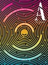

I glanced into my teenage daughter’s bedroom one spring afternoon last year, expecting to find her staring absentmindedly at the Zoom screen that passed for high school during the pandemic. Instead, she was laughing uproariously at a video she had found. I asked her what she was looking at. “It’s an old man dancing like a chicken and singing,” she told me.

去年春天的一个下午，我 瞥了一眼我 十几岁的女儿的卧室，以为她会心不在焉地盯着大流行期间高中毕业的 Zoom 屏幕。 相反，她正对着她发现的一段视频放声大笑。 我问她在看什么。 “这是一个像小鸡一样跳舞唱歌的老人，”她告诉我。

## Explore the March 2022 Issue

## 探索 2022 年 3 月号

Check out more from this issue and find your next story to read.

查看本期的更多内容，找到您要阅读的下一个故事。[View More](https://www.theatlantic.com/magazine/toc/2022/03/)

I came over to her laptop, not being above watching someone making an idiot of himself for 15 seconds of social-media fame. What I found instead was the septuagenarian rock star Mick Jagger, in a fairly recent concert, croaking out the Rolling Stones’ megahit “(I Can’t Get No) Satisfaction”—a song that debuted on the charts when I was a year old—for probably the millionth time. An audience of tens of thousands of what looked to be mostly Baby Boomers and Gen Xers sang along rapturously.

我走到她的笔记本电脑前，看着有人在社交媒体上出名 15 秒，让自己出丑。 相反，我发现的是七十多岁的摇滚明星米克贾格尔，在最近的一场音乐会上，他唱出了滚石乐队的热门单曲“(I Can't Get No) Satisfaction”——这首歌在我一岁时就登上了排行榜——可能是第一百万次。 数万名看起来主要是婴儿潮一代和 X 世代的观众一起狂欢地唱歌。

“Is this serious?” she asked. “Do people your age actually like this?” I took umbrage, but had to admit it was a legitimate question. “Kind of,” I answered. It wasn’t just the music, or even the performance, I assured her. To my mind, the longevity of that particular song—No. 2 on _Rolling Stone_ magazine’s original list of the “[500 Greatest Songs of All Time](https://www.rollingstone.com/music/music-lists/500-greatest-songs-of-all-time-151127/)”—has a lot to do with a deep truth it speaks.

“这很严重吗？” 她问。 “你这个年纪的人真的喜欢这个吗？” 我很生气，但不得不承认这是一个合理的问题。 “有点儿，”我回答。 这不仅仅是音乐，甚至是表演，我向她保证。 在我看来，那首特定歌曲的寿命——不。 在 _滚石_ 杂志最初的“ [有史以来最伟大的500 首歌曲](https://www.rollingstone.com/music/music-lists/500-greatest-songs-of-all-time-151127/) ”榜单中排名第 2 的歌曲与它所讲述的深刻真理有很大关系。

As we wind our way through life, I explained, satisfaction—the joy from fulfillment of our wishes or expectations—is evanescent. No matter what we achieve, see, acquire, or do, it seems to slip from our grasp.

我解释说，当我们在生活中蜿蜒前行时，满足感——满足我们的愿望或期望而带来的快乐——是转瞬即逝的。 无论我们取得什么、看到什么、获得什么或做什么，它似乎都从我们的掌握中溜走了。

I was on a roll now. Satisfaction, I told my daughter, is the greatest paradox of human life. We crave it, we believe we can get it, we glimpse it and maybe even experience it for a brief moment, and then it vanishes. But we never give up on our quest to get and hold on to it. “I try, and I try, and I try, and I try,” Jagger sings. How? Through sex and consumerism, according to the song. By building a life that is ever more baroque, expensive, and laden with crap.

我现在很顺利。 我告诉女儿，满足是人类生活中最大的悖论。 我们渴望它，我们相信我们可以得到它，我们瞥见它，甚至可能短暂地体验它，然后它就消失了。 但我们永远不会放弃获得并坚持下去的追求。 “我尝试，我尝试，我尝试，我尝试，”贾格尔唱道。 如何？ 根据歌曲，通过性和消费主义。 通过建立一种更加巴洛克式、昂贵和充满垃圾的生活。

“You’ll see,” I told her.

“你会看到的，”我告诉她。

My daughter’s mirth now utterly extinguished, she had the expression I imagine Jean-Paul Sartre’s daughter must have had every day. “So life is just a rat race, and we’re doomed to an existence of dissatisfaction?” she asked. “That sucks.”

我女儿的欢笑现在完全消失了，她的表情是我想象让-保罗·萨特的女儿每天都会有的表情。 “所以生活只是一场老鼠赛跑，我们注定要存在不满？” 她问。 “太糟糕了。”

“It does suck,” I said. “But we’re not doomed.” I told her we can beat this affliction if we work to truly understand it—and if we’re willing to make some difficult changes to the way we live.

“它确实很糟糕，”我说。 “但我们并没有注定失败。” 我告诉她，如果我们努力真正理解它，并且愿意对我们的生活方式做出一些艰难的改变，我们就能战胜它。

___

_Want to explore more about the science of happiness? Join Arthur C. Brooks and other experts May 1–3 at_ The Atlantic’_s In Pursuit of Happiness event. Learn more about in-person and virtual registration [here](https://www.theatlantic.com/live/pursuit-of-happiness-2022/)._

_想探索更多关于幸福的科学吗？ 5 月 1 日至 3 日，与亚瑟·布鲁克斯 (Arthur C. Brooks) 和其他专家一起参加_ 《大西洋月刊》 _的“追求幸福”活动。 了解有关面对面和虚拟注册的更多信息 [在此处](https://www.theatlantic.com/live/pursuit-of-happiness-2022/) 。_

___

“Like what?” she asked, her eyes narrowing with the healthy suspicion that comes from being the child of a social scientist, and thus an unwitting participant in many behavioral experiments.

“像什么？” 她问道，由于身为社会科学家的孩子，因此不知情地参与了许多行为实验，她的眼睛因健康的怀疑而眯起来。

I paused. It was in fact a question to which I’d devoted a lot of my time over the previous few years—not just professionally but personally, and with sometimes uneven results.

我停顿了一下。 事实上，在过去的几年里，我花了很多时间来研究这个问题——不仅是专业上的，而且是个人上的，有时结果参差不齐。

Even the most successful people suffer from the dissatisfaction problem. I remember once seeing LeBron James—the world’s greatest basketball player—with a look of abject despair on his face after his Cleveland Cavaliers lost the NBA championship to the Golden State Warriors. All of the world’s wealth and accolades were like straw in that moment of loss.

即使是最 成功的人也会遇到不满意的问题。 我记得有一次看到勒布朗·詹姆斯——世界上最伟大的篮球运动员——在他的克利夫兰骑士队输给金州勇士队后，脸上露出极度绝望的表情。 世界上所有的财富和荣誉在那一刻都像稻草一样失落。

## Recommended Reading

## 推荐读物

Abd al-Rahman III, the emir and caliph of Córdoba in 10th-century Spain, summed up a life of worldly success at about age 70: “I have now reigned above 50 years in victory or peace; beloved by my subjects, dreaded by my enemies, and respected by my allies. Riches and honors, power and pleasure, have waited on my call.”

10 世纪西班牙科尔多瓦的埃米尔和哈里发阿卜杜勒拉赫曼三世 (Abd al-Rahman III) 总结了他在 70 岁左右的世俗成功生活：“我现在在位超过 50 年，无论是胜利还是和平； 为我的臣民所爱戴，为我的敌人所畏惧，为我的盟友所尊敬。 富贵、权势、享乐，都在等着我的召唤。”

And the payoff? “I have diligently numbered the days of pure and genuine happiness which have fallen to my lot,” he wrote. “They amount to 14.”

和回报？ 他写道：“我勤奋地计算着落在我身上的纯真幸福的日子。” “他们总共有 14 个人。”

As an observer, I understand the problem. I write a [column about human happiness](https://www.theatlantic.com/projects/how-build-life/) for _The Atlantic_ and teach classes on the subject at Harvard. I know that satisfaction is one of the core “macronutrients” of happiness (the other two being enjoyment and meaning), and that its slippery nature is one of the reasons happiness is often so elusive as well.

作为旁观者，我理解这个问题。 写了 [一篇关于人类幸福](https://www.theatlantic.com/projects/how-build-life/) 我为 _大西洋_ 的专栏，并在哈佛教授这方面的课程。 我知道满足感是幸福的核心“常量营养素”之一（另外两个是享受和意义），而它的易变性也是幸福往往如此难以捉摸的原因之一。

[Listen: Arthur C. Brooks’s podcast, _How to Build a Happy Life_](https://www.theatlantic.com/podcasts/how-to-build-a-happy-life/)

[收听：Arthur C. Brooks 的播客， _如何打造幸福生活_](https://www.theatlantic.com/podcasts/how-to-build-a-happy-life/)

Yet time and again, I have fallen into the trap of believing that success and its accompaniments would fulfill me. On my 40th birthday I made a bucket list of things I hoped to do or achieve. They were mainly accomplishments only a wonk could want: writing books and columns about serious subjects, teaching at a top school, traveling to give lectures and speeches, maybe even leading a university or think tank. Whether these were good and noble goals or not, they were _my_ goals, and I imagined that if I hit them, I would be satisfied.

然而，一次又一次，我陷入了相信成功及其伴随会令我满足的陷阱。 在我 40 岁生日那天，我列了一个遗愿清单，列出了我希望做或实现的事情。 他们主要是只有书呆子才能想要的成就：写关于严肃主题的书籍和专栏，在一流学校任教，旅行演讲和演讲，甚至可能领导大学或智囊团。 不管这些目标是不是美好和崇高的目标，它们都是 _我的_ 目标，我想如果我实现了它们，我就会感到满足。

I found that list nine years ago, when I was 48, and realized that I had achieved every item on it. I had been a tenured professor, then the president of a think tank. I was giving frequent speeches, had written some books that had sold well, and was writing columns for _The New York Times_. But none of that had brought me the lasting joy I’d envisioned. Each accomplishment thrilled me for a day or a week—maybe a month, never more—and then I reached for the next rung on the ladder.

九年前，我 48 岁时找到了这份清单，意识到我已经实现了上面的每一项。 我曾是一名终身教授，然后是一家智库的总裁。 我经常发表演讲，写了一些畅销书，并为 _纽约时报_ 撰写专栏。 但这些都没有给我带来我所预想的持久快乐。 每一项成就都让我兴奋了一天或一周——也许一个月，再也不会了——然后我伸手去爬梯子上的下一个梯级。

I’d devoted my life to climbing those rungs. I was still devoting my life to climbing—beavering away 60 to 80 hours a week to accomplish the next thing, all the while terrified of losing the last thing. The costs of that kind of existence are exceedingly obvious, but it was only when I looked back at my list that I genuinely began to question the benefits—and to think seriously about the path I was walking.

我毕生致力于攀登那些阶梯。我仍然毕生致力于攀登——每周节省60到80个小时来完成下一件事，同时害怕失去最后一件事。这种存在的代价非常明显，但只有当我回头看我的清单时，我才真正开始质疑好处——并认真思考我走过的道路。

And what about you?

那你呢？

Your goals are probably very different from mine, and perhaps your lifestyle is too. But the trap is the same. Everyone has dreams, and they beckon with promises of sweet, lasting satisfaction if you achieve them. But dreams are liars. When they come true, it’s … fine, for a while. And then a new dream appears.

你的目标可能与我的非常不同，也许你的生活方式也是如此。 但陷阱是一样的。 每个人都有梦想，如果你实现了梦想，他们就会以甜蜜、持久的满足感向你招手。 但梦想是骗子。 当它们成真时，它……很好，暂时。 然后一个新的梦想出现了。

Mick Jagger’s satisfaction dilemma—and ours—starts with a rudimentary formula: Satisfaction = getting what you want.

Mick Jagger 和我们的满意度困境始于一个基本公式：  满意度 = 得到你想要的

It’s so simple, and yet its power is deeply encoded within us. Give a 3-year-old the french fry she is reaching for and see her satisfied expression. But then, after a couple of seconds, watch the wanting return. And that’s the actual problem, isn’t it? The Stones’ song should really have been titled “(I Can’t Keep No) Satisfaction.” It’s almost as if our brains are programmed to prevent us from enjoying anything for very long.

它是如此简单，但它的力量却深深植根于我们的内心。 给一个 3 岁的孩子她正伸手要的炸薯条，看看她满意的表情。 但是，几秒钟后，看着想要的回报。 这才是真正的问题，不是吗？ 滚石乐队的歌曲真的应该命名为“(I Can't Keep No) Satisfaction”。 就好像我们的大脑被编程为阻止我们长时间享受任何事物一样。

In fact, they are. The term _homeostasis_ was introduced in 1926 by a physiologist named Walter B. Cannon, who showed in his book _The Wisdom of the Body_ that we have built-in mechanisms to regulate our temperature, as well as our levels of oxygen, water, salt, sugar, protein, fat, and calcium. But the concept applies much more broadly than that: To survive, all living systems tend to maintain stable conditions as best they can.

事实上，他们是。 一词 _稳态_ 于 1926 年由生理学家沃尔特·B·坎农 (Walter B. Cannon) 提出，他在他的著作 _《身体的智慧》 (The Wisdom of the Body)_ 中指出，我们有调节体温以及氧气、水、盐分含量的内在机制，糖、蛋白质、脂肪和钙。 但这个概念的适用范围远不止于此：为了生存，所有生命系统都倾向于尽可能保持稳定的条件。

[Watch: Jeff Goldberg and Arthur C. Brooks on the science of happiness](https://www.youtube.com/watch?v=uRnBSMM9jk0)

[观看：Jeff Goldberg 和 Arthur C. Brooks 谈幸福的科学](https://www.youtube.com/watch?v=uRnBSMM9jk0)

Homeostasis keeps us alive and healthy. But it also explains why drugs and alcohol work as they do, as opposed to how we wish they would. While that first dose of a new recreational substance might give you great pleasure, your previously naive brain quickly learns to sense an assault on its equilibrium and fights back by neutralizing the effect of the entering drug, making it impossible to get the first feeling back. As the Bucknell University neuroscientist Judith Grisel explains brilliantly in her book, [_Never Enough: The Neuroscience and Experience of Addiction_](https://bookshop.org/books/never-enough-the-neuroscience-and-experience-of-addiction/9780525434900), addiction is in part [a by-product of homeostasis](https://www.ncbi.nlm.nih.gov/pmc/articles/PMC4862361/): As the brain becomes used to continual drug-induced production of dopamine—the neurotransmitter of pleasure, which plays a large role in nearly all addictive behaviors—it steeply curtails ordinary production, making another hit necessary simply to feel normal.

体内平衡让我们保持活力和健康。 但这也解释了为什么药物和酒精的作用与我们希望的相反。 虽然第一次服用一种新的娱乐物质可能会给你带来极大的快乐，但你以前幼稚的大脑很快就会学会感知对其平衡的攻击，并通过中和进入药物的作用进行反击，从而无法找回最初的感觉。 正如巴克内尔大学神经科学家 Judith Grisel 在她的书“ [_永远不够：成瘾的神经科学和经验”中_](https://bookshop.org/books/never-enough-the-neuroscience-and-experience-of-addiction/9780525434900) 精彩地解释的那样，成瘾部分 [是体内平衡的副产品](https://www.ncbi.nlm.nih.gov/pmc/articles/PMC4862361/) ：随着大脑习惯于持续药物诱导产生多巴胺 - 神经递质快感，它在几乎所有成瘾行为中都起着重要作用——它急剧减少了正常的生产，使得仅仅为了感觉正常就需要再一次打击。

The same set of principles works on our emotions. When you get an emotional shock—good or bad—your brain wants to re-equilibrate, making it hard to stay on the high or low for very long. This is especially true when it comes to positive emotions, for primordial reasons that we’ll get into shortly. It’s why, when you achieve conventional, acquisitive success, you can never get enough. If you base your sense of self-worth on success—money, power, prestige—you will run from victory to victory, initially to keep feeling good, and then to avoid feeling awful.

同样的原则也适用于我们的情绪。 当你受到情绪冲击时——无论好坏——你的大脑想要重新平衡，因此很难长时间保持高潮或低潮。 当涉及到积极情绪时尤其如此，我们很快就会谈到最原始的原因。 这就是为什么当你获得传统的、获得性的成功时，你永远不会得到足够的。 如果你的自我价值感建立在成功——金钱、权力、声望——的基础上，你就会从胜利跑到胜利，最初是为了保持良好的感觉，然后是为了避免感觉糟糕。

The unending race against the headwinds of homeostasis has a name: the “hedonic treadmill.” No matter how fast we run, we never arrive. “At home I dream that at Naples, at Rome, I can be intoxicated with beauty, and lose my sadness,” Ralph Waldo Emerson wrote in his 1841 essay, “[Self-Reliance](https://archive.vcu.edu/english/engweb/transcendentalism/authors/emerson/essays/selfreliance.html).” “I pack my trunk, embrace my friends, embark on the sea, and at last wake up in Naples, and there beside me is the stern fact, the sad self, unrelenting, identical, that I fled from.”

与体内平衡的逆风进行无休止的竞赛有一个名字：“享乐跑步机”。 不管我们跑得多快，我们永远也到不了。 “在家里，我梦想在那不勒斯，在罗马，我可以陶醉在美丽之中，而不再悲伤，”拉尔夫沃尔多爱默生在他 1841 年的文章“ [自力更生](https://archive.vcu.edu/english/engweb/transcendentalism/authors/emerson/essays/selfreliance.html) ”中写道。 “我收拾行李，拥抱我的朋友，踏上大海，最后在那不勒斯醒来，身边是一个严酷的事实，一个悲伤的自我，无情的，相同的，我逃离。”

[Read: Arthur C. Brooks’s articles on how to build a life](https://www.theatlantic.com/projects/how-build-life/)

[阅读：Arthur C. Brooks 关于如何打造生活的文章](https://www.theatlantic.com/projects/how-build-life/)

Scholars argue over whether our happiness has an immutable set point, or if it might move around a little over the course of our life due to general circumstances. But no one has ever found that immediate bliss from a major victory or achievement will endure. As for money, [more of it helps up to a point](https://www.pnas.org/content/107/38/16489)—it can buy things and services that relieve the problems of poverty, which are sources of _unhappiness_. But forever chasing money as a source of enduring satisfaction simply does not work. “The nature of \[adaptation\] condemns men to live on a hedonic treadmill,” the psychologists Philip Brickman and Donald T. Campbell wrote in 1971, “to seek new levels of stimulation merely to maintain old levels of subjective pleasure, to never achieve any kind of permanent happiness or satisfaction.”

学者们争论我们的幸福是否有一个不变的设定点，或者它是否会由于一般情况而在我们的生活中稍微移动。 但是，没有人发现重大胜利或成就带来的即时幸福会持续下去。 至于金钱， [更多的钱在一定程度上有帮助](https://www.pnas.org/content/107/38/16489) ——它可以购买缓解贫困问题的东西和服务，而贫困是 _不快乐_ 的根源。 但是永远追逐金钱作为持久满足的源泉是行不通的。 心理学家菲利普·布里克曼 (Philip Brickman) 和唐纳德·T·坎贝尔 (Donald T. Campbell) 在 1971 年写道：“\[适应\] 的本质迫使人们生活在享乐的跑步机上，寻求新的刺激水平，只是为了维持旧的主观愉悦水平，永远无法获得任何一种永久的幸福或满足。”

Yet even if you recognize all this, getting off the treadmill is hard. It feels dangerous. Our urge for _more_ is quite powerful, [but stronger still is our resistance to _less_](https://www.scientificamerican.com/article/what-is-loss-aversion/). That’s one of the insights that earned Princeton’s Daniel Kahneman the 2002 Nobel Prize in Economics, for work he did with the late Stanford psychologist Amos Tversky.

然而，即使您认识到这一切，离开跑步机也很困难。 感觉很危险。 我们对 _更多_ 的渴望非常强烈， [的抵制仍然更强烈 _但我们对更少_](https://www.scientificamerican.com/article/what-is-loss-aversion/) 。 这是普林斯顿大学丹尼尔卡尼曼获得 2002 年诺贝尔经济学奖的见解之一，因为他与已故斯坦福大学心理学家阿莫斯特沃斯基的合作。

So you try and you try, but you make no lasting progress toward your goal. You find yourself running simply to avoid being thrown off the back of the treadmill. The wealthy keep accumulating far beyond anything they could possibly spend, and sometimes [more than they want to bequeath to their children](https://www.theatlantic.com/family/archive/2019/10/big-inheritances-how-much-to-leave/600703/). They hope that at some point they will feel happy, their lives complete, and are terrified of what will happen if they stop running. As the great 19th-century philosopher Arthur Schopenhauer said, “Wealth is like sea-water; the more we drink, the thirstier we become; and the same is true of fame.”

所以你试了又试，但你没有在朝着你的目标取得持久的进展。 你发现自己跑步只是为了避免被甩出跑步机的后部。 富人不断积累，远远超过他们可能花掉的任何东西，有时甚至 [超过他们想留给子女的](https://www.theatlantic.com/family/archive/2019/10/big-inheritances-how-much-to-leave/600703/) 钱。 他们希望在某个时候他们会感到快乐，他们的生活完整，并且害怕如果他们停止跑步会发生什么。 正如 19 世纪伟大的哲学家亚瑟·叔本华所说：“财富就像海水； 我们喝得越多，就越渴； 名声也是如此。”

According to evolutionary psychology, our tendency to strive for more is perfectly understandable. Throughout most of human history, starvation loomed closer than it does, for the most part, today. A “rich” caveman had a few extra animal skins and arrowheads, and maybe a few piles of seeds and dried fish to spare. With this plenty, he might survive a bad winter.

根据进化心理学， 我们追求更多的倾向是完全可以理解的。 在人类历史的大部分时间里，饥饿比今天更接近。 一个“富有”的穴居人有一些额外的兽皮和箭头，也许还有几堆种子和干鱼备用。 有了这些，他可能会度过一个糟糕的冬天。

Our troglodyte ancestors didn’t just want to make it through the winter, though; they had bigger ambitions. They wanted to find allies and mates too, with the goal (whether conscious or not) of passing on their genes. And what would make that possible? Among other things, the accumulation of animal skins, demonstrating greater competence, prowess, and attractiveness than the hominid in the next cave over.

不过，我们的穴居人祖先不只是想熬过冬天； 他们有更大的野心。 他们也想找到盟友和伴侣，目的是（无论有意或无意）传递他们的基因。 是什么让这成为可能？ 除其他外，兽皮的积累比下一个洞穴中的原始人更能证明自己的能力、实力和吸引力。

Surprisingly little has changed since then. Scholars have shown that our acquisitive tendencies persist amid plenty and regularly exceed our needs. [This owes to our vestigial urges](https://ourworld.unu.edu/en/why-do-we-over-consume)—software that still exists in our brains from ancient times.

令人惊讶的是，从那以后几乎没有什么变化。 学者们已经表明，我们的贪婪倾向会在充足的情况下持续存在，并且经常会超出我们的需求。 [这要归功于我们残留的冲动](https://ourworld.unu.edu/en/why-do-we-over-consume) ——从远古时代就存在于我们大脑中的软件。

[From the June 2009 issue: What makes us happy?](https://www.theatlantic.com/magazine/archive/2009/06/what-makes-us-happy/307439/)

[摘自 2009 年 6 月号：什么让我们快乐？](https://www.theatlantic.com/magazine/archive/2009/06/what-makes-us-happy/307439/)

Competing with rivals for mates helps explain our weird fixation on social comparison. When we think about satisfaction from success (or possessions or fitness or good looks), there’s another element to consider: Success is relative. Satisfaction requires not just that you continuously run in place on your own hedonic treadmill, [but that you run slightly faster than other people are running on theirs](https://www.vox.com/the-goods/22547185/consumerism-competition-history-interview). This is why people with hundreds of millions of dollars can feel like failures if their friends are billionaires, and why famous Hollywood actors can be despondent that others are even more famous.

与对手竞争配偶有助于解释我们对社会比较的怪癖。 当我们考虑成功带来的满足感（或财产、健康或美貌）时，还有另一个因素需要考虑：成功是相对的。 满足感不仅需要您在自己的跑步机上持续原地跑步， [还需要您跑得比其他人在他们的跑步机上跑得稍快](https://www.vox.com/the-goods/22547185/consumerism-competition-history-interview) 。 这就是为什么拥有数亿美元的人在朋友是亿万富翁时会感到失败，以及为什么好莱坞著名演员会因为别人更有名而感到沮丧。

At some level, we all know that social comparison is ridiculous and harmful, and extensive research confirms this: “Keeping up with the Joneses” is [associated with](https://pubmed.ncbi.nlm.nih.gov/32222022/) anxiety and even depression. In a [series of experiments](http://sonjalyubomirsky.com/wp-content/themes/sonjalyubomirsky/papers/LR1997.pdf) that required subjects to solve puzzles, for instance, the unhappiest people were consistently those paying the most attention to how they performed relative to other subjects. The small rush of pleasure we get from doing better than some can easily be swallowed up by the unhappiness from doing worse than others. But the urge to have more than others, to be more than others, tugs at us relentlessly.

在某种程度上，我们都知道社会比较是荒谬和有害的，广泛的研究证实了这一点：“与时俱进” [与](https://pubmed.ncbi.nlm.nih.gov/32222022/) 焦虑甚至抑郁有关。 例如，在 [一系列](http://sonjalyubomirsky.com/wp-content/themes/sonjalyubomirsky/papers/LR1997.pdf) 要求受试者解决难题的实验中，最不快乐的人始终是那些最关注自己相对于其他受试者表现如何的人。 我们从比某些人做得更好中获得的小快感很容易被比其他人做得更差的不快乐所吞没。 但是，想要比别人拥有更多、比别人更多的冲动无情地拖着我们。

We live in a time when we are regularly counseled to get back to nature, to our long-ago past—in our diets, our sense of communal obligation, and more. But if our goal is happiness that endures, following our natural urges does not help us, in the main. That is Mother Nature’s cruel hoax. Happiness doesn’t help propagate the species, so nature doesn’t select for it. If you conflate intergenerational survival with happiness, that’s your problem, not nature’s.

我们生活在这样一个时代，我们经常被建议回归自然，回归我们很久以前的过去——在我们的饮食、我们的公共义务感等等方面。 但是，如果我们的目标是持久的幸福，那么遵循我们的自然冲动基本上对我们没有帮助。 那是大自然母亲的残酷骗局。 幸福无助于繁殖物种，因此大自然不会选择它。 如果你将代际生存与幸福混为一谈，那是你的问题，而不是自然的问题。

In fact, [our natural state is dissatisfaction](https://www.ncbi.nlm.nih.gov/pmc/articles/PMC3652533/), punctuated by brief moments of satisfaction. You might not like the hedonic treadmill, but Mother Nature thinks it’s pretty great. She likes watching you strive to achieve an elusive goal, because strivers get the goods—even if they don’t enjoy them for long. More mates, better mates, better chances of survival for our children—these ancient mandates are responsible for much of the code that runs incessantly in the deep recesses of our brains. It doesn’t matter whether you’ve found your soul mate and would never stray; the algorithms designed to get us more mates (or allow us to make an upgrade) continue whirring, which is why you still want to be attractive to strangers. Neurobiological instinct—which we experience as dissatisfaction—is what drives us forward.

事实上， [我们的自然状态是不满足](https://www.ncbi.nlm.nih.gov/pmc/articles/PMC3652533/) ，偶尔会有短暂的满足。 您可能不喜欢享乐跑步机，但大自然母亲认为它非常棒。 她喜欢看你努力实现一个难以捉摸的目标，因为奋斗者会得到好处——即使他们享受的时间不长。 更多的伴侣，更好的伴侣，为我们的孩子提供更好的生存机会——这些古老的命令对我们大脑深处不断运行的大部分代码负责。 你是否找到了你的灵魂伴侣并且永远不会流浪并不重要； 旨在让我们获得更多伴侣（或让我们升级）的算法继续运转，这就是为什么你仍然想对陌生人有吸引力。 神经生物学的本能——我们将其体验为不满——是推动我们前进的动力。

There are many other, related examples of evolved tendencies that militate against enduring happiness—for example, the tendency toward jealous misery in our romantic relationships. (Mother Nature, while inviting us to cheat, would also like us to be highly alert to the possibility that our partner might be cheating. [Studies](http://sites.oxy.edu/clint/evolution/articles/SexualandEmotionalInfidelity.pdf) [find](https://www.sciencedaily.com/releases/2015/10/151008083755.htm) that men, who are at risk of spending resources to unwittingly raise children who aren’t theirs, fixate most on sexual infidelity; women, who are at risk that their mate will become attached to—and thus divert resources to—another female and her children, respond most negatively to emotional infidelity.)

还有许多其他相关的例子表明进化倾向会影响持久的幸福——例如，在我们的浪漫关系中倾向于嫉妒痛苦。 （大自然母亲在邀请我们出轨的同时，也希望我们高度警惕我们的伴侣可能出轨的可能性。 [研究](http://sites.oxy.edu/clint/evolution/articles/SexualandEmotionalInfidelity.pdf) [发现](https://www.sciencedaily.com/releases/2015/10/151008083755.htm) ，男性可能会花费资源在不知不觉中抚养不是他们自己的孩子，最关注性不忠；女性有可能会依附于另一名女性和她的孩子，从而将资源转移给另一名女性和她的孩子，她们对情感上的不忠反应最消极。）

The insatiable goals to acquire more, succeed conspicuously, and be as attractive as possible lead us to objectify one another, and even ourselves. When people see themselves as little more than their attractive bodies, jobs, or bank accounts, it brings great suffering. Studies show that self-objectification is [associated with](https://www.sciencedirect.com/science/article/abs/pii/S0145213416301909?via%3Dihub) a sense of invisibility and lack of autonomy, and physical self-objectification has a [direct relationship with](https://journals.sagepub.com/doi/10.1111/1471-6402.t01-1-00076) eating disorders and depression in women. [Professional self-objectification](https://www.theatlantic.com/family/archive/2021/09/self-objectification-work/620246/) is a tyranny every bit as nasty. You become a heartless taskmaster to yourself, seeing yourself as nothing more than _Homo economicus_. Love and fun are sacrificed for another day of work, in search of a positive internal answer to the question _Am I successful yet?_ We become cardboard cutouts of real people.

获得更多、取得显着成功和尽可能吸引人的永不满足的目标导致我们将彼此，甚至我们自己物化。 当人们认为自己只不过是他们迷人的身体、工作或银行账户时，就会带来巨大的痛苦。 研究表明，自我客体化 [与](https://www.sciencedirect.com/science/article/abs/pii/S0145213416301909?via%3Dihub) 隐形感和缺乏自主性有关，身体上的自我客体化 [的饮食失调和抑郁症有直接关系](https://journals.sagepub.com/doi/10.1111/1471-6402.t01-1-00076) 与女性 [。 专业的自我物化](https://www.theatlantic.com/family/archive/2021/09/self-objectification-work/620246/) 是一种暴政，同样令人讨厌。 你变成了自己的无情监工，把自己看成是 _经济人_ 。 为了新一天的工作而牺牲了爱和乐趣，以寻找对 _我成功了吗？_ 我们变成了真人的纸板剪纸。

[From the January/February 2003 issue: Does money buy happiness?](https://www.theatlantic.com/magazine/archive/2003/01/does-money-buy-happiness/308430/)

[摘自 2003 年 1 月/2 月号：金钱能买到幸福吗？](https://www.theatlantic.com/magazine/archive/2003/01/does-money-buy-happiness/308430/)

It makes no sense in modern life to use our energies to have five cars, five bathrooms, or even five pairs of sneakers, but we just … want them. Neuroscientists have looked into this. Dopamine is excreted in response to thoughts about [buying new things](https://www.elle.com/fashion/shopping/a41845/shopping-dopamine/), [winning money](https://www.ncbi.nlm.nih.gov/pmc/articles/PMC3845016/), [acquiring more power or fame](https://www.psychologytoday.com/us/blog/in-excess/201403/why-we-seek-the-high-stardom), [having new sexual partners](https://www.sciencedirect.com/science/article/abs/pii/S0924933810701553). The brain evolved to reward us for the behaviors that kept us alive and made us more likely to pass on our DNA. This may be an anachronism, at least to some degree, but it is a fact of our lives nonetheless.

在现代生活中，用我们的精力去拥有五辆汽车、五个浴室，甚至五双运动鞋是没有意义的，但我们只是……想要它们。 神经科学家对此进行了研究。 多巴胺会随着对 [购买新事物](https://www.elle.com/fashion/shopping/a41845/shopping-dopamine/) 、 [赢钱](https://www.ncbi.nlm.nih.gov/pmc/articles/PMC3845016/) 、 [获得更多权力或名望](https://www.psychologytoday.com/us/blog/in-excess/201403/why-we-seek-the-high-stardom) 、 [拥有新性伴侣](https://www.sciencedirect.com/science/article/abs/pii/S0924933810701553) 的想法而分泌。 大脑进化为奖励我们让我们活着并使我们更有可能传递我们的 DNA 的行为。 这可能是不合时宜的，至少在某种程度上是这样，但它仍然是我们生活中的事实。

For the faithful, satisfaction has another name: heaven.

对于忠实的人来说， 满足还有另一个名字：天堂。

Many religions promise heaven to believers. We rarely think carefully about what that entails—harps and clouds?—but the Roman Catholic Church is [helpfully specific](https://www.vatican.va/archive/ENG0015/__P2M.HTM) about it. Heaven grants us the “beatific vision”: God showing himself to us face-to-face, making us know his true nature—and thereby granting us the “fulfillment of the deepest human longings, the state of supreme, definitive happiness.” Or, as the English mystic Juliana of Norwich wrote of heaven, “all shall be well, and all shall be well, and all manner of thing shall be well.” In other words, heaven is pure satisfaction that lasts.

许多宗教向信徒承诺天堂。 我们很少仔细考虑这意味着什么——竖琴和云彩？——但罗马天主教堂 [对此](https://www.vatican.va/archive/ENG0015/__P2M.HTM) 有帮助。 天堂赐予我们“幸福的愿景”：上帝面对面地向我们展示自己，让我们了解他的真实本性——从而赐予我们“人类最深切的渴望的实现，至高无上的幸福状态”。 或者，正如英国神秘主义者诺里奇的朱莉安娜所写的天堂，“一切都会好起来，一切都会好起来，所有的事情都会好起来。” 换句话说，天堂是持久的纯粹满足。

Why can’t we seem to be so well on Earth? The 13th-century Catholic priest Thomas Aquinas answers this in his magisterial _Summa Theologiae_. He defines the satisfaction problem as one of misbegotten goals: idols that distract us from God, the true source of our bliss. Even if you are not a religious believer, Thomas’s list of the goals that beguile but never satisfy rings true. They include money, power, pleasure, and honor. As Thomas puts it [in the case of money](https://ccel.org/ccel/aquinas/summa/summa.FS_Q2_A1.html),

为什么我们不能在地球上看起来那么好？ 13 世纪的天主教神父托马斯·阿奎那 (Thomas Aquinas) 在他权威的 _《神学大全》( Summa Theologiae_ ) 中回答了这个问题。 他将满意度问题定义为错误的目标之一：使我们分心的偶像，上帝是我们幸福的真正源泉。 即使您不是宗教信徒，Thomas 列出的那些令人着迷但永远无法满足的目标听起来也是正确的。 它们包括金钱、权力、享乐和荣誉。 时所说 [正如托马斯在谈到金钱](https://ccel.org/ccel/aquinas/summa/summa.FS_Q2_A1.html) 的那样，

> In the desire for wealth and for whatsoever temporal goods … when we already possess them, we despise them, and seek others … The reason of this is that we realize more their insufficiency when we possess them: and this very fact shows that they are imperfect, and the sovereign good does not consist therein.

> 在对财富和任何世俗商品的渴望中......当我们已经拥有它们时，我们鄙视它们，并寻找他人......原因是，当我们拥有它们时，我们更意识到它们的不足：这一事实本身表明它们不完美，主权利益并不包含其中。

In other words, _(It don’t bring no) satisfaction._ Thomas Aquinas might not fill a stadium with Boomers, but he describes the Jaggerian Dissatisfaction Matrix far better than old Mick himself.

换句话说， _（它不会带来）满足感。_ 托马斯·阿奎那 (Thomas Aquinas) 可能不会让婴儿潮一代填满体育场，但他对贾格尔式不满矩阵的描述远胜于老米克本人。

The satisfaction problem, then, is our natural attachment to these inadequate things. If this sounds a bit Buddhist to you, it should. It is very similar to the Buddha’s first “Noble Truth”: that life is suffering—_duhkha_ in Sanskrit, also translated as “dissatisfaction”—and that the cause of this suffering is craving, desire, and attachment to worldly things. Thomas Aquinas and the Buddha (and Jagger, for that matter) were saying the same thing.

那么，满意度问题就是我们对这些不足之处的自然依恋。 如果这对您来说听起来有点佛系，那应该是。 这与佛陀的第一个“圣谛”非常相似：生命就是苦 _——梵语中的duhkha_ ，也被翻译为“不满”——而这种苦的原因是对世间事物的贪爱、欲望和执着。 托马斯·阿奎那和佛陀（就此而言，还有贾格尔）说的是同一件事。

Note that neither Thomas nor the Buddha argued that worldly rewards are inherently evil. In fact, they can be used for great good. Money is [crucial for a functioning society and supporting your family;](https://www.theatlantic.com/magazine/archive/2003/01/does-money-buy-happiness/308430/) power can be wielded to lift others up; pleasure leavens life; and honor can attract attention to the sources of moral elevation. But as attachments—as ends instead of means—the problem is simple: They cannot satisfy.

请注意，托马斯和佛陀都不认为世俗的回报本质上是邪恶的。 事实上，它们的用途非常广泛。 金钱 [对于社会运转和养家糊口至关重要；](https://www.theatlantic.com/magazine/archive/2003/01/does-money-buy-happiness/308430/) 可以运用力量来提升他人； 快乐滋养生命； 荣誉可以吸引人们注意道德提升的来源。 但作为附件——作为目的而不是手段——问题很简单：它们无法满足。

And this leads us back to my daughter’s question: Are we doomed, in this earthly life at least, to an existence of continual dissatisfaction?

这让我们回到我女儿的问题：至少在今世的生活中，我们是否注定要持续不断地感到不满？

If you ever visit Taiwan, the one attraction you must not miss is the National Palace Museum. Arguably the greatest collection of Chinese art and artifacts in the world, the museum contains roughly 700,000 items whose dates range from more than 8,000 years ago, during the Neolithic period, all the way to the modern era.

如果你 去台湾，一定不能错过的景点就是国立故宫博物院。 该博物馆可以说是世界上最大的中国艺术品和手工艺品收藏馆，收藏了大约 700,000 件物品，其年代从 8,000 多年前的新石器时代一直到现代。

If there is one problem with the museum, it is precisely its abundance. No one can take in more than a fraction of it in a single visit. That’s why, one afternoon a few years ago, I hired a guide to show me a few famous pieces and explain their significance. Little did I know that, with one remark, my guide was about to help me crack my own satisfaction puzzle.

如果博物馆有一个问题，那就是它的丰富性。 没有人能在一次访问中吸收超过它的一小部分。 这就是为什么几年前的一个下午，我聘请了一位导游带我参观几件著名的作品并解释它们的意义。 我几乎不知道，只要一句话，我的向导就可以帮助我破解我自己的满意度难题。

Looking at a massive jade carving of the Buddha from the Qing dynasty, my guide offhandedly remarked that this was a good illustration of how the Eastern view of art differs from the Western view. “How so?” I asked.

看着一尊巨大的清代玉雕佛像，我的导游随口说，这很好地说明了东方艺术观与西方艺术观的不同之处。 “怎么会这样？” 我问。

He answered my question with a question: “What do you think of when I ask you to imagine a work of art yet to be started?”

他用一个问题回答了我的问题：“当我让你想象一件尚未开始的艺术作品时，你会怎么想？”

“An empty canvas, I guess,” I responded.

“我猜是一块空画布，”我回答道。

“Right,” he said. Many Westerners tend to see art as being created from nothing. But there’s another way to view it: “The art already exists,” and the job of artists is simply to reveal it. He told me that his image of art yet to be started was an uncarved block of jade, like what ultimately became the Buddha in front of us. The art is not visible until the artist takes away the stone that is not part of the sculpture, but it is already there nonetheless. Not all artistic philosophy fits this East-versus-West distinction; Michelangelo once said, “The sculpture is already complete within the marble block, before I start my work … I just have to chisel away the superfluous material.” But I took my guide’s point in—as it were—broad strokes.

“对，”他说。 许多西方人倾向于认为艺术是从无到有创造出来的。 但还有另一种看法：“艺术已经存在”，而艺术家的工作只是揭示它。 他告诉我，他尚未开始的艺术形象是一块未雕琢的玉石，就像我们面前最终成为的佛陀一样。 在艺术家拿走不属于雕塑的石头之前，艺术是不可见的，但它已经在那里了。 并非所有的艺术哲学都适合这种东西方的区别。 米开朗基罗曾说：“在我开始工作之前，雕塑已经在大理石块中完成了……我只需要凿掉多余的材料。” 但我接受了我的向导的观点——可以说是——粗略的。

Art mirrors life, and therein lies a potential solution to the satisfaction dilemma.

艺术反映生活，其中存在解决满意度困境的潜在方法。

As we grow older in the West, we generally think we should have a lot to show for our lives—a lot of trophies. According to numerous Eastern philosophies, this is backwards. As we age, we shouldn’t accumulate more to represent ourselves, but rather strip things away to find our true selves—and thus, to find happiness and peace. The [_Tao Te Ching_](https://bookshop.org/books/tao-te-ching-a-new-english-version/9780061142666), a Chinese text compiled around the fourth century B.C. that is the foundation of Taoism, makes this point with elegance:

在西方，随着年龄的增长，我们通常认为我们的生活应该有很多值得炫耀的东西——很多奖杯。 根据许多东方哲学，这是倒退的。 随着年龄的增长，我们不应该积累更多的东西来代表自己，而应该剥离事物来找到我们真正的自我——从而找到幸福与和平。 作为 [_《道德经》优雅地阐述了这一点：_](https://bookshop.org/books/tao-te-ching-a-new-english-version/9780061142666) 道家基础的公元前四世纪左右编撰的中国文本

> People would be content  
> with their simple, everyday lives,  
> in harmony, and free of desire.
> 
> 人们会很满足  
> 他们用简单的日常生活，  
> 和谐而无欲。
> 
> When there is no desire,  
> all things are at peace.
> 
> 没有欲望的时候，  
> 万物相安。

In my early 50s, when I visited the National Palace Museum, my life was jammed with possessions, accomplishments, relationships, opinions, and commitments. It took an offhand remark from a museum guide to help me absorb the teachings of Thomas Aquinas and the Buddha—or for that matter, modern social science—and commit to stop trying to add more and more, but instead start taking things away.

在我 50 岁出头的时候，当我参观国立故宫博物院时，我的生活充满了财产、成就、关系、观点和承诺。 一位博物馆导游随口说了一句话，帮助我吸收了托马斯·阿奎那和佛陀的教义——或者就此而言，现代社会科学——并承诺不再试图增加越来越多的东西，而是开始把东西拿走。

In truth, our formula, _Satisfaction = getting what you want_, leaves out one key component. To be more accurate, it should be:

事实上，我们的公式， _满意度 = 得到你想要_ 的，遗漏了一个关键因素。 更准确的说，应该是：

> _Satisfaction = what you have ÷ what you want_

> 满意度 = 你所拥有的 ÷ 你想要的

All of our evolutionary and biological imperatives focus us on increasing the numerator—our _haves_. But the more significant action is in the denominator—our _wants_. The modern world is made up of clever ways to make our wants explode without us realizing it. Even the Dalai Lama, [arguably the world’s most enlightened man](https://www.theatlantic.com/family/archive/2021/02/dalai-lama-gentle-transgressive-individuality-happiness/617901/), admits to it. “Sometimes I visit supermarkets,” he says in [_The Art of Happiness_](https://bookshop.org/books/the-art-of-happiness-a-handbook-for-living-9781573227544/9781573227544). “I really love to see supermarkets, because I can see so many beautiful things. So, when I look at all these different articles, I develop a feeling of desire, and my initial impulse might be, ‘Oh, I want this; I want that.’ ”

我们所有的进化和生物学要求都将我们集中在增加分子——我们的 _财产_ 上。 但更重要的作用在于分母——我们的 _需求_ 。 现代世界充满了使我们的需求在我们没有意识到的情况下爆炸的巧妙方法。 达赖喇嘛 [甚至可以说是世界上最开明的人](https://www.theatlantic.com/family/archive/2021/02/dalai-lama-gentle-transgressive-individuality-happiness/617901/) 也承认这一点。 “有时我会去超市，”他在 [_《幸福的艺术_](https://bookshop.org/books/the-art-of-happiness-a-handbook-for-living-9781573227544/9781573227544) 》中说道。 “我真的很喜欢逛超市，因为我可以看到很多美丽的东西。 所以，当我看到所有这些不同的文章时，我产生了一种渴望的感觉，我最初的冲动可能是，‘哦，我想要这个； 我要那个。' ”

The secret to satisfaction is not to increase our haves—that will never work (or at least, it will never last). That is the treadmill formula, not the satisfaction formula. The secret is to manage our wants. By managing what we want instead of what we have, we give ourselves a chance to lead more satisfied lives.

满足的秘诀不是增加我们的财富——那永远行不通（或者至少，它永远不会持久）。 那是跑步机公式，而不是满意度公式。 秘诀在于管理我们的需求。 通过管理我们想要的而不是我们拥有的，我们让自己有机会过上更满意的生活。

These were the ideas I related to my daughter that spring afternoon. She listened with interest, then made a brief rejoinder. “So what you’re saying is that the secret to satisfaction is simple,” she said. “I just have to go against several million years of evolutionary biology,” plus the entirety of modern culture, “and I’ll be all set.”

这些是我在那个春天的下午和我女儿谈起的想法。 她饶有兴趣地听着，然后作了简短的反驳。 “所以你的意思是，满足的秘诀很简单，”她说。 “我只需要反对几百万年的进化生物学，”加上整个现代文化，“我就准备好了。”

Obviously, I couldn’t leave the topic there. One of the reasons people often don’t trust academics like me is that we always talk about problems, but rarely provide realistic solutions. Even worse, we often ignore our own wisdom. I’ve known plenty of bankrupt economists and miserable happiness experts.

显然，我不能把话题留在那里。 人们通常不信任像我这样的学者的原因之一是我们总是谈论问题，但很少提供切合实际的解决方案。 更糟糕的是，我们常常忽视自己的智慧。 我认识很多破产的经济学家和悲惨的幸福专家。

But she knew this wasn’t all just theory to me. We’d moved two years before, from Bethesda, Maryland, a power suburb of Washington, D.C., to a small town outside Boston. I’d resigned from a chief-executive position to teach and write, trading away virtually all day-to-day contact with political and business elites—and was quickly forgotten by most. I hadn’t hidden the reason for the move, and my family was fully behind it: I was taking [my own advice](https://www.theatlantic.com/magazine/archive/2019/07/work-peak-professional-decline/590650/), published in these pages three years ago, to find a new kind of success and a deeper kind of happiness. That project was not about satisfaction alone; it also involved recognizing that, professionally, most people peak earlier in life than they expect to, and decline faster—and that to resist this is counterproductive and ultimately futile. But it entailed getting off the hedonic treadmill—swapping evanescent professional thrills for more enduring fulfillment that could last well into the back half of my life. When life’s rhythms involuntarily slowed further during the pandemic, I had all the more time to think about making that transition work.

但她知道这对我来说不仅仅是理论。 两年前，我们从马里兰州的贝塞斯达 (Bethesda) 华盛顿特区的郊区搬到了波士顿郊外的一个小镇。 我辞去了首席执行官的职位，转而从事教学和写作，几乎放弃了与政界和商界精英的所有日常接触——很快就被大多数人遗忘了。 我没有隐瞒搬家的原因，我的家人全力支持：我 [听取了三年前发表在这些页面上的自己的建议](https://www.theatlantic.com/magazine/archive/2019/07/work-peak-professional-decline/590650/) ，去寻找一种新的成功和更深层次的幸福。 该项目不仅仅是为了满足； 它还涉及认识到，从职业上讲，大多数人的人生高峰期比他们预期的要早，而且衰退得更快——而抵制这一点只会适得其反，最终是徒劳的。 但这需要摆脱享乐主义的跑步机——将转瞬即逝的职业兴奋换成更持久的满足感，这种满足感可能会持续到我后半生。 当大流行期间生活的节奏不由自主地进一步放缓时，我有更多的时间来考虑如何让这种转变奏效。

So I did have some practical suggestions for my daughter on how to beat the dissatisfaction curse—three habits I have developed for my own life that are grounded in philosophy and social-science research.

因此，我确实为我的女儿提供了一些关于如何克服不满魔咒的实用建议——我在哲学和社会科学研究的基础上为自己的生活养成了三个习惯。

##### I. Go from prince to sage

##### 一、从君子到圣人

One scholar who did propose real solutions to life’s problems was Thomas Aquinas. He didn’t just explain the satisfaction conundrum; he offered an answer and lived it himself.

托马斯·阿奎那 (Thomas Aquinas) 是一位提出真正解决生活问题的学者。 他不仅解释了满意度难题； 他提供了一个答案并亲自实践了。

The youngest son of Count Landulf of Aquino, Thomas was born around 1225 in his family’s castle in central Italy. He was sent to be educated at the first Benedictine monastery, at Montecassino. As the youngest son of a noble family, he was expected to one day become the abbot of the monastery, a post of enormous social prestige.

托马斯是阿基诺的兰道夫伯爵最小的儿子，大约 1225 年出生在他家族位于意大利中部的城堡中。 他被送到蒙特卡西诺的第一个本笃会修道院接受教育。 作为一个贵族家庭的小儿子，他有望有一天成为寺院的住持，这是一个享有巨大社会声望的职位。

But Thomas had no interest in this worldly glory. Around the age of 19, he joined the recently created Dominican order, a group of friars dedicated to poverty and itinerant preaching. This, he felt, was his true identity. The life of wealth and privilege needed to be chipped away to find it.

但托马斯对这种世俗的荣耀不感兴趣。 19 岁左右，他加入了最近成立的多米尼加修道会，这是一群致力于贫穷和巡回布道的修道士。 他觉得，这才是他的真实身份。 财富和特权的生活需要被剥夺才能找到它。

Thomas pursued the work of a scholar and teacher, producing dense philosophical treatises that are still profoundly influential today. He is known as the greatest philosopher of his age. But this legacy was never his aim. On the contrary, he considered his work to be nothing more than an expression of his love for God and a desire to help his fellow human beings.

托马斯从事学者和教师的工作，创作了密集的哲学论文，这些论文至今仍具有深远的影响。 他被称为他那个时代最伟大的哲学家。 但这份遗产从来都不是他的目标。 相反，他认为他的工作只不过是表达他对上帝的爱和帮助他的人类同胞的愿望。

The Buddha cracked the satisfaction code in a strikingly similar way. He was born a prince named Siddhartha Gautama around the sixth century B.C., in the region that is now on the border between Nepal and India. After his mother died just days after his birth, his father vowed to protect the infant prince from life’s miseries, and thus kept him shut inside the palace, where all his earthly needs and desires would be met.

佛陀以惊人相似的方式破解了满足密码。 大约在公元前六世纪，他出生在一个名叫悉达多·乔达摩 (Siddhartha Gautama) 的王子，出生在现在尼泊尔和印度边界的地区。 他的母亲在他出生几天后就去世了，他的父亲发誓要保护这个婴儿王子免受生活的苦难，因此把他关在宫殿里，在那里他所有的世俗需求和欲望都会得到满足。

Siddhartha never ventured beyond that palace until he was 29 years old, when, overcome by curiosity, he asked a charioteer to show him the outside world. On his tour, he encountered an old man, another man wracked with disease, and a decaying corpse. He was troubled by these sights, which his charioteer told him were inevitable in our mortal lives. He then encountered an ascetic who, through renunciation of worldly goods, had achieved not a release from disease and death but, rather, a release from the fear of them.

直到 29 岁时，悉达多才敢走出这座宫殿，当时他出于好奇，请一位车夫带他看看外面的世界。 在他的旅途中，他遇到了一个老人，另一个被疾病折磨的人和一具腐烂的尸体。 他对这些景象感到不安，他的车夫告诉他，这些景象在我们凡人的生活中是不可避免的。 然后他遇到了一个苦行者，他通过放弃世俗的东西，并没有从疾病和死亡中解脱出来，而是从对它们的恐惧中解脱出来。

Siddhartha left his kingdom soon after, and renounced all his attachments. Sitting under the Bodhi tree, he became the Buddha. He spent the rest of his life sharing his wisdom with a growing flock that today numbers more than half a billion people.

不久之后，悉达多离开了他的王国，并放弃了他所有的依恋。 坐菩提树下成佛。 在他的余生中，他与不断壮大的群体分享他的智慧，这些群体如今已超过 50 亿人。

I am no Saint Thomas and no Lord Buddha. And my current post at Harvard hardly qualifies as a repudiation of the world’s rewards. Even so, I’ve tried to take a lesson from their lives—that satisfaction lies not in attaining high status and holding on to it for dear life, but in helping other people—including by sharing whatever knowledge and wisdom I’ve acquired. That’s one reason I stepped down from a job in the public eye to concentrate on writing and teaching. If I take another leadership role in my career, my focus will be on what I want to share with others, not what I want to accumulate for myself.

我不是圣托马斯，也不是佛陀。 而我目前在哈佛的职位几乎不能算是对世界奖励的否定。 即便如此，我还是试图从他们的生活中吸取教训——满足感不在于获得高位并终生坚守，而是在于帮助他人——包括分享我所获得的任何知识和智慧。 这就是我辞去公众眼中的工作以专注于写作和教学的原因之一。 如果我在我的职业生涯中担任另一个领导角色，我的重点将放在我想与他人分享的东西上，而不是我想为自己积累的东西。

##### II. Make a reverse bucket list

##### 二。 制作一个反向遗愿清单

One practical way to whittle down our wants is to simply look at the counsel we get that is turning us into dissatisfied _Homo economicus_, and then do the opposite. For example, many self-help guides suggest making a bucket list on your birthday, so as to reinforce your worldly aspirations. Making a list of the things you want is temporarily satisfying, because it stimulates dopamine. But it creates attachments, which in turn create dissatisfaction as they grow.

减少我们的需求的一种实用方法是简单地看看我们得到的建议，这些建议正在把我们变成不满 _的经济人_ ，然后反其道而行之。 例如，许多自助指南建议在您的生日那天列一个遗愿清单，以增强您的世俗愿望。 列出你想要的东西是暂时的满足，因为它会刺激多巴胺。 但是它会产生依恋，随着它们的成长，反过来又会产生不满。

I’ve instead begun to compile a “reverse bucket list,” to make the ideas in this essay workable in my life. Each year on my birthday, I list my wants and attachments—the stuff that fits under Thomas Aquinas’s categories of money, power, pleasure, and honor. I try to be completely honest. I don’t list stuff I would actually hate and never choose, like a sailboat or a vacation house. Rather, I go to my weaknesses, most of which—I’m embarrassed to admit—involve the admiration of others for my work.

相反，我已经开始编制一份“反向遗愿清单”，以使这篇文章中的想法在我的生活中可行。 每年生日那天，我都会列出我的需求和依恋——符合托马斯·阿奎那的金钱、权力、享乐和荣誉类别的东西。 我试着完全诚实。 我不会列出我实际上讨厌而且永远不会选择的东西，比如帆船或度假屋。 相反，我会直面自己的弱点，其中大部分——我不好意思承认——都与他人对我工作的钦佩有关。

Then I imagine myself in five years. I am happy and at peace, living a life of purpose and meaning. I make another list of the forces that would bring me this happiness: my faith, my family, my friendships, the work I am doing that is inherently satisfying and meaningful and that serves others.

然后我想象五年后的自己。 我快乐而平静，过着有目的和有意义的生活。 我再列出一份能给我带来这种幸福的力量清单：我的信仰、我的家庭、我的友谊，以及我正在做的工作，这些工作本质上是令人满意和有意义的，并且可以为他人服务。

Inevitably, these sources of happiness are “intrinsic”—they come from within and revolve around love, relationships, and deep purpose. They have little to do with the admiration of strangers. I contrast them with the things on the first list, which are generally “extrinsic”—the outside rewards associated with Thomas’s list of idols. Most research has shown that intrinsic rewards lead to far [more](https://www.apa.org/members/content/intrinsic-motivation) [enduring](https://www.sciencedirect.com/science/article/abs/pii/S0092656608001360) happiness than extrinsic rewards.

不可避免地，这些幸福的来源是“内在的”——它们来自内心，围绕着爱、人际关系和深层目标。 他们与陌生人的钦佩关系不大。 我将它们与第一个列表中的事物进行对比，后者通常是“外在的”——与托马斯的偶像列表相关的外部奖励。 大多数研究表明， [得多。](https://www.apa.org/members/content/intrinsic-motivation) [持久](https://www.sciencedirect.com/science/article/abs/pii/S0092656608001360) 与外在奖励相比，内在奖励带来的快乐要

I consider how extrinsic things compete with the intrinsic underpinnings of my happiness for time, attention, and resources. I imagine myself sacrificing my relationships for the admiration of strangers, and the result down the line in my life. With this in mind, I confront the bucket list. I reflect on each item, telling myself that while a particular desire is not evil, it won’t bring me the happiness and peace I seek. Finally, I go back to the list of things that will bring me real happiness. I commit to pursuing these things.

我考虑外在事物如何与我幸福的内在基础争夺时间、注意力和资源。 我想象自己为了陌生人的钦佩而牺牲自己的人际关系，以及我生命中的结果。 考虑到这一点，我面对遗愿清单。 我反思每一件物品，告诉自己虽然某种特定的欲望不是邪恶的，但它不会给我带来我所寻求的幸福与和平。 最后，我回到能给我带来真正幸福的事情清单上。 我致力于追求这些事情。

Given my itch for admiration, I have made a point of trying to pay less attention to how others perceive me, by turning away these thoughts when they emerge. I have let many relationships go that were really only about professional advancement. I work somewhat less than I did in years past. It takes conscious effort to avoid backsliding—the treadmill beckons often, and little spritzes of dopamine tempt me to return to my old ways. But my changes in behavior have mostly been permanent, and I’ve been happier as a result.

鉴于我对钦佩的渴望，我已经通过在这些想法出现时将这些想法转移开来努力减少对别人如何看待我的关注。 我已经放弃了很多关系，而这些关系实际上只是为了职业发展。 我的工作比过去几年少了一些。 避免倒退需要有意识的努力——跑步机经常在招手，多巴胺的小喷发诱使我回到原来的方式。 但我的行为改变大多是永久性的，因此我变得更快乐了。

I’m not arguing here that there’s anything wrong with visiting the exotic place you’ve always dreamed of seeing, or running a marathon, or otherwise pushing your capabilities to do or make something difficult, professionally or otherwise. Work that feels more like a mission provides purpose; travel can be inherently valuable and enjoyable; learning a skill or meeting a challenge can bring intrinsic satisfaction; meaningful activities pursued with friends or loved ones can deepen relationships. But ask yourself whether the attraction of your bucket-list items, be they professional or experiential, derives mostly from how much they will make others admire or envy you. These motivations will never lead to deep satisfaction.

在这里，我并不是说参观您一直梦想看到的异国情调的地方、参加马拉松比赛或以其他方式推动您的能力去做或做一些困难的事情有什么不对，无论是专业的还是其他的。 感觉更像是使命的工作提供了目的； 旅行本来就是有价值和愉快的； 学习技能或迎接挑战可以带来内在的满足感； 与朋友或爱人进行有意义的活动可以加深关系。 但问问自己，你的遗愿清单项目的吸引力，无论是专业的还是经验的，是否主要源于它们会让别人钦佩或羡慕你的程度。 这些动机永远不会带来深刻的满足感。

##### III. Get smaller

##### 三、 变小

Lately, there has been an explosion of books on minimalism, which all recommend downsizing your life to get happier—to chip away the detritus of your life. But it’s not just about having less stuff to weigh you down. We can, in fact, find immense fullness when we pay attention to smaller and smaller things. The Buddhist master Thich Nhat Hanh explains this in his book [_The Miracle of Mindfulness_](https://bookshop.org/books/the-miracle-of-mindfulness-an-introduction-to-the-practice-of-meditation/9780807012390): “While washing the dishes one should only be washing the dishes, which means that while washing the dishes one should be completely aware of the fact that one is washing the dishes.” Why? If we are thinking about the past or future, “we are not alive during the time we are washing the dishes.”

最近，关于极简主义的书籍呈爆炸式增长，它们都建议缩小你的生活以获得更快乐——去除你生活中的碎屑。 但这不仅仅是让你感到压力的东西变少了。 事实上，当我们关注越来越小的事物时，我们可以找到巨大的充实感。 》一书中解释了这一点 [_佛教大师 Thich Nhat Hanh 在他的《正念的奇迹_](https://bookshop.org/books/the-miracle-of-mindfulness-an-introduction-to-the-practice-of-meditation/9780807012390) ：“在洗碗时，应该只洗碗，这意味着在洗碗时，应该完全意识到自己正在洗碗这一事实” 为什么？ 如果我们想的是过去或未来，“在我们洗碗的时候，我们还没有活着。”

For many years I had a beloved friend, someone a couple of decades my senior with whom I worked throughout my 20s. In his 40s, he was diagnosed with an aggressive form of cancer, and given six months to live. By some miracle or another, he survived those six months, and then another six, and then almost three decades more.

多年来，我一直有一个挚爱的朋友，他比我大几十年，在我 20 多岁的时候一直和他一起工作。 在他 40 多岁时，他被诊断出患有侵袭性癌症，只能活六个月。 奇迹般地，他挺过了那六个月，然后又活了六个月，然后又活了近 30 年。

He was never “cured,” however. His doctor told him the cancer was a wolf at the door, biding its time. Sooner or later the wolf would slip in, which it ultimately did a couple of years ago. But the three decades under this cloud were not a burden. On the contrary, they reminded him every day of the gift that was the current day, and thus, to look for his satisfactions not in audacious, multiyear life goals, but in tiny, everyday moments of beauty with his beloved wife and daughter.

然而，他从未被“治愈”。 他的医生告诉他，癌症是门口的狼，正在等待时机。 狼迟早会溜进来，几年前它终于做到了。 但这乌云下的三个十年并不是负担。 相反，他们每天都提醒他今天的礼物，因此，他不是在大胆的、多年的生活目标中寻找满足感，而是在与他心爱的妻子和女儿一起度过的微小的、日常的美好时刻中寻找满足感。

Some years ago, a few close friends were at his home, eating and drinking out in his garden. It was dusk, and he asked us to gather around a plant with small, closed flowers. “Watch a flower,” he instructed. We did so, for about 10 minutes, in silence. All at once, the flowers popped open, which we learned that they did every evening. We gasped in amazement. It was a moment of intense satisfaction.

几年前，几个好朋友在他家，在他的花园里吃喝。 黄昏时分，他让我们聚集在一株开着小而闭合的花的植物周围。 “看一朵花，”他指示道。 我们默默地这样做了大约 10 分钟。 突然间，花朵突然开放，我们了解到它们每天晚上都会开放。 我们惊叹不已。 这是一个非常满足的时刻。

But here’s the thing I still can’t get over: Unlike most of the junk on my old bucket list, that satisfaction endured. That memory still brings me joy—more so than many of my life’s earthly “accomplishments”—not because it was the culmination of a large goal, but because it was an unexpected gift, a tiny miracle.

但我仍然无法克服的是：与我旧遗愿清单上的大多数垃圾不同，这种满足感经久不衰。 那段记忆至今仍给我带来快乐——比我一生中的许多世俗“成就”更快乐——不是因为它是一个伟大目标的顶点，而是因为它是一份意想不到的礼物，一个小小的奇迹。

The prince will always skip the small satisfactions of life, forgoing a flower at dusk for money, power, or prestige. But the sage never makes this mistake, and I try not to either. Each day, I have an item on my to-do list that involves being truly present for an ordinary occurrence. A lot of this revolves around [my religious practice as a Catholic](https://www.theatlantic.com/family/archive/2021/09/happiness-walking-pilgrimage/620075/), including daily Mass with my wife and meditative prayer. It also includes walks with no devices, listening only to the world outside. These are truly satisfying things.

王子总是会跳过生活中的小满足，为了金钱、权力或威望而放弃黄昏时分的一朵花。 但圣人从不犯这种错误，我也尽量不犯。 每天，我的待办事项清单上都有一项涉及在普通事件中真实存在的项目。 其中很多都围绕着 [我作为天主教徒的宗教实践](https://www.theatlantic.com/family/archive/2021/09/happiness-walking-pilgrimage/620075/) ，包括与妻子的日常弥撒和冥想祈祷。 它还包括不带任何设备的步行，只听外面的世界。 这些都是真正令人满意的事情。

My daughter went off to college a few months after our talk about the science of satisfaction. After the isolation and lockdowns of COVID-19, and the sad joke that was her senior year of high school, she made a run for the border, enrolling at a university in Spain. I am bereft. We do send each other several messages every day, though. They are almost never about work or school. Instead, we share small moments: a photo of a rainy street, a silly joke, the number of push-ups she just did.

我女儿上 在我们谈论满足感的科学几个月后， 了大学。 在 COVID-19 的隔离和封锁以及高中最后一年的悲伤笑话之后，她跑到边境，在西班牙的一所大学就读。 我失散了。 不过，我们确实每天都会互相发送几条消息。 它们几乎与工作或学校无关。 相反，我们分享一些小瞬间：一张雨天街道的照片、一个愚蠢的笑话、她刚刚做的俯卧撑的数量。

I don’t know whether this is giving her a head start on freeing herself from the paradox of dissatisfaction, but it is like medicine for me. Each message is like the evening of the flower—a brief glimpse of the beatific vision of heaven, perhaps—bringing quiet satisfaction.

我不知道这是否让她抢先一步摆脱不满的悖论，但这对我来说就像一剂良药。 每条信息都像花开的夜晚——也许是对天堂美好景象的短暂一瞥——带来平静的满足。

Each of us can ride the waves of attachments and urges, hoping futilely that someday, somehow, we will get and keep that satisfaction we crave. Or we can take a shot at free will and self-mastery. It’s a lifelong battle against our inner caveman. Often, he wins. But with determination and practice, we can find respite from that chronic dissatisfaction and experience the joy that is true human freedom.

我们每个人都可以驾驭依恋和冲动的浪潮，徒劳地希望有一天，我们会以某种方式获得并保持我们渴望的满足感。 或者我们可以自由意志和自我控制地进行拍摄。 这是一场与我们内心穴居人的终生战斗。 通常，他赢了。 但凭借决心和实践，我们可以从长期的不满中找到喘息的机会，体验真正的人类自由的快乐。

___

This essay is adapted from Arthur C. Brooks’s new book, [_From Strength to Strength: Finding Success, Happiness, and Deep Purpose in the Second Half of Life_](http://www.penguinrandomhouse.com/books/646134/from-strength-to-strength-by-arthur-c-brooks/). It appears in the [March 2022](https://www.theatlantic.com/magazine/toc/2022/03/) print edition with the headline “The Satisfaction Trap.”

本文改编自 Arthur C. Brooks 的新书《 [_从力量到力量：在人生的下半场寻找成功、幸福和深刻的目标》_](http://www.penguinrandomhouse.com/books/646134/from-strength-to-strength-by-arthur-c-brooks/) 。 它出现在 [2022 年 3 月](https://www.theatlantic.com/magazine/toc/2022/03/) 的印刷版中，标题为“满足陷阱”。

_When you buy a book using a link on this page, we receive a commission. Thank you for supporting_ The Atlantic.

_当您使用此页面上的链接购买图书时，我们会收到佣金。 感谢您支持_ 大西洋。
