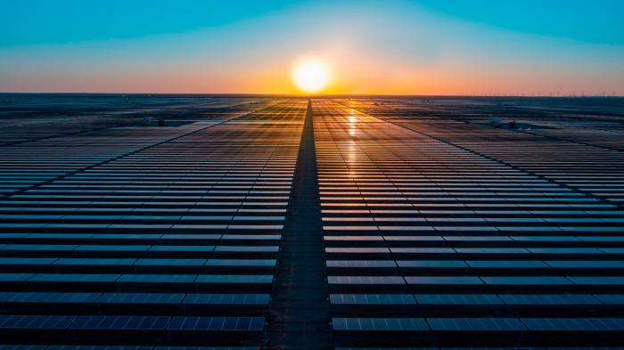

When Paddy Padmanathan first pitched the idea of introducing a sliver of renewable energy into Saudi Arabia’s electricity supply, the state utility gave him short shrift.

当 Paddy Padmanathan 首次提出将一小部分可再生能源引入沙特阿拉伯电力供应的想法时，国家公用事业公司对他置若罔闻。

The chief executive of Riyadh-based energy firm ACWA Power recalls being politely told to “go away” in 2007 after it was pointed out that the supplier was receiving oil at a “very competitive price,” far cheaper than solar.

总部位于利雅得的能源公司 ACWA Power 的首席执行官回忆说，2007 年，在有人指出供应商以“极具竞争力的价格”接收石油，远比太阳能便宜后，他被礼貌地告知“走开”。

It was a predictable response in the world’s top crude exporter, which has for decades happily burnt billions of barrels of oil to fuel power plants, desalination units and industries at heavily subsidised rates. “The incentive was not there,” says the Anglo-Sri Lankan executive.

这个世界最大原油出口国的反应在意料之中，几十年来，它以高额补贴的价格愉快地燃烧了数十亿桶石油，为发电厂、海水淡化厂和工业提供燃料。 “没有动力，”这位英斯里兰卡高管表示。

But 15 years on, he and ACWA are on the front lines of the Middle East’s most ambitious renewables programme as the energy-guzzling kingdom that is one of the planet’s top emitters of CO₂ promises to go greener and cleaner. Saudi Arabia last year set the target of having half its electricity generated by renewables by 2030.

但 15 年过去了，他和 ACWA 站在中东最雄心勃勃的可再生能源计划的前线，因为这个能源消耗大国是地球上最大的二氧化碳排放国之一，它承诺变得更加绿色和清洁。 沙特阿拉伯去年设定了到 2030 年将可再生能源发电量减半的目标。

That means raising the amount of power generated by solar and wind from less than 1 gigawatt to 58 gigawatts in just over seven years. ACWA, a state-affiliated company, is the lead vehicle developing renewable projects.

这意味着在短短七年多的时间里，将太阳能和风能发电量从不到 1 吉瓦提高到 58 吉瓦。 ACWA 是一家国有公司，是开发可再生能源项目的主要机构。

“Yes, it’s ambitious, \[but\] it’s been done in a heartbeat in China, it’s been done on a significant basis in India,” Padmanathan says. “Money is not in short supply \[and\] the commitment is there from the procurer. The supply chain, yes it’s a challenge, but it’s not insurmountable.”

“是的，这是雄心勃勃的，\[但\]它在中国一蹴而就，在印度已经取得了重大进展，”Padmanathan 说。 “钱并不短缺 \[而且\] 采购商有承诺。 供应链，是的，这是一个挑战，但并非不可克服。”

The state-backed plan, if successful, would represent a radical shift in the kingdom and be critical for Riyadh to lower its emissions to net zero by 2060, as it pledged in October 2021 and reconfirmed at COP27 this month.

国家支持的计划如果成功，将代表沙特王国的根本转变，并且对于利雅得到 2060 年将排放量降至净零至关重要，正如它在 2021 年 10 月承诺并在本月的 COP27 上再次确认的那样。

Despite the state’s dependence on fossil fuels, officials say the kingdom is serious about tackling climate change and adapting to the energy transition — even as it enjoys a huge petrodollar windfall from oil prices driven up by Russia’s invasion of Ukraine.

尽管该国依赖化石燃料，但官员们表示，该王国在应对气候变化和适应能源转型方面是认真的——即使它因俄罗斯入侵乌克兰推高油价而获得了巨额石油美元的意外收获。

They cite plans to harness emissions generated by the production of hydrocarbons by developing carbon capture and storage technology; ambitions to become the world’s top exporter of clean hydrogen; and the launch last year of Riyadh’s “green initiative,” with goals that include planting 10bn trees in the kingdom.

他们引用了通过开发碳捕获和储存技术来控制碳氢化合物生产产生的排放的计划； 成为世界最大清洁氢出口国的雄心； 去年利雅得启动了“绿色倡议”，其目标包括在王国种植 100 亿棵树。

But climate experts remain sceptical that the kingdom will meet its promises, having watched previous announcements about renewables come and go with little, if any, traction on the ground.

但气候专家仍然怀疑该王国是否会兑现其承诺，因为之前看到有关可再生能源的公告来来去去，但几乎没有实际行动。

Instead, they see a state addicted to fossil fuels that has historically been obstructive at global climate change talks. At COP27, it [successfully campaigned](https://www.ft.com/content/344ec421-510d-4099-a903-a818b8fb8f90) alongside other countries to keep language on the phaseout of all fossil fuels out of the final declaration.

相反，他们看到的是一个沉迷于化石燃料的国家，这个国家历来在全球气候变化谈判中一直处于阻挠状态。 在 COP27 上，它 [成功地](https://www.ft.com/content/344ec421-510d-4099-a903-a818b8fb8f90) 与其他国家一起开展活动，将有关逐步淘汰所有化石燃料的语言排除在最终宣言之外。

“It’s a little hard to take it seriously before having actually seen the concrete development,” says Mia Moisio at the NewClimate Institute. “There’s a history of kind of stop-and-go in terms of renewable energy policy.”

“在真正看到具体的发展之前，很难认真对待它，”新气候研究所的米娅·莫伊西奥 (Mia Moisio) 说。 “在可再生能源政策方面有一种走走停停的历史。”

## ‘A triple-win situation’

## “三赢局面”

But officials in Riyadh say this time there is genuine appetite for renewables — with more at stake than burnishing the kingdom’s image with the green lobby.

但利雅得的官员表示，这一次对可再生能源产生了真正的兴趣——这比通过绿色游说团体来提升王国的形象更重要。

While much of the world is looking to transition to cleaner energy to wean themselves off fossil fuels, in Saudi Arabia the shift is just as much about freeing up more crude oil for export.

虽然世界上大部分地区都在寻求转向更清洁的能源以摆脱对化石燃料的依赖，但在沙特阿拉伯，这种转变同样是为了释放更多的原油用于出口。

The calculus among Saudi policymakers is that even as nations seek to go green, the world will still need oil, particularly from the lowest cost producers like Saudi Arabia.

沙特决策者的考量是，即使各国寻求绿色发展，世界仍将需要石油，尤其是沙特阿拉伯等成本最低的产油国。

The less the kingdom burns for domestic use, the more it will be able to export at global prices, reaping more petrodollars to help finance the government’s grandiose plans to develop the nation.

王国为国内使用燃烧的燃料越少，它就越能以全球价格出口，收获更多的石油美元来资助政府发展国家的宏伟计划。

“It’s a triple-win situation,” says energy minister Prince Abdulaziz bin Salman, in that it will save the kingdom money, bring in revenues, and lower domestic emissions. “We wish we had the means to do it in one year, but because we need to expand our gas master system it will have to be in a phased approach.”

“这是一个三赢的局面，”能源部长阿卜杜勒阿齐兹·本·萨勒曼亲王说，因为这将为王国节省资金、带来收入并减少国内排放。 “我们希望我们有办法在一年内完成，但因为我们需要扩展我们的天然气总系统，所以必须分阶段进行。”

He estimates that the kingdom could make a net saving of $130bn in the years to 2030 by introducing more gas and renewables into the energy mix and freeing up oil to export.

他估计，通过在能源结构中引入更多的天然气和可再生能源，并释放石油用于出口，沙特阿拉伯可以在到 2030 年的几年内净节省 1300 亿美元。

At present, just under half of Saudi Arabia’s electricity is fired by oil and related liquids, with the kingdom burning an average of 1mn barrels of crude and related liquids a day to keep the lights, air conditioners and desalination plants on. The remainder relies on gas.

目前，沙特阿拉伯将近一半的电力来自石油和相关液体，该王国平均每天燃烧 100 万桶原油和相关液体，以维持电灯、空调和海水淡化厂的运转。 其余的依靠天然气。

Saudi officials make no apologies for insisting oil will remain core to their plans, despite Riyadh’s push to diversify the petrodollar-dependent economy.

尽管利雅得推动依赖石油美元的经济多元化，但沙特官员并没有为坚持石油仍将是其计划的核心而道歉。

As part of the strategy, Saudi government entities have been mobilised to support an “oil sustainability programme” to ensure the commodity remains part of the future energy mix by developing new uses for hydrocarbons, including using polymer-based materials in concrete, roads, tiles and packaging.

作为该战略的一部分，沙特政府实体已动员起来支持“石油可持续性计划”，通过开发碳氢化合物的新用途，包括在混凝土、道路、瓷砖中使用聚合物基材料，确保该商品仍然是未来能源结构的一部分和包装。

It is what Prince Abdulaziz describes as a “hedge” to ensure the longevity of oil’s future as traditional uses of the fuel, particularly for transport, decline and the kingdom looks at how best to monetise its primary resource while it can.

这就是阿卜杜勒阿齐兹亲王所描述的“对冲”，以确保石油作为燃料的传统用途，特别是在运输方面的未来寿命，衰退和王国正在研究如何尽可能最好地将其主要资源货币化。

“You will still have growth \[in oil demand\], and even if you plateau or it comes down, look at who \[else\] is going to remain producing,” Prince Abdulaziz says. “In absolute numbers, your production may not change, as a matter of fact it may grow because some other producers may shrink.”

“\[石油需求\] 仍然会增长，即使达到稳定或下降，也要看看 \[其他\] 谁会继续生产，”阿卜杜勒阿齐兹亲王说。 “在绝对数字上，你的产量可能不会改变，事实上它可能会增长，因为其他一些生产商可能会缩减。”

The kingdom is already working to increase its production capacity from 12.2mn b/d to 13.4mn b/d by late 2026, and Prince Abdulaziz says that transitioning to renewables will equate to “adding excess capacity which was going down the drain”.

该王国已经在努力到 2026 年底将其产能从 1220 万桶/天增加到 1340 万桶/天，阿卜杜勒阿齐兹亲王表示，向可再生能源转型将等同于“增加正在付诸东流的过剩产能”。

Hence, the “government is totally incentivised to do that \[renewables\] programme”, he says.

因此，“政府完全有动力去做那个\[可再生能源\]计划”，他说。

## Power-hungry kingdom

## 权力饥渴的王国

For years there have been warnings that Saudi Arabia’s voracious domestic energy consumption was on an unsustainable path as cheap, subsidised prices fostered an environment of excessive use and waste.

多年来，一直有人警告称，沙特阿拉伯贪婪的国内能源消费正走在一条不可持续的道路上，因为廉价的补贴价格助长了过度使用和浪费的环境。

Households account for about 40 per cent of the country’s electricity consumption, with air-conditioners responsible for more than two-thirds of that figure in a country where summer temperatures can soar to about 50C. In 2020, the nation of about 34mn people was the planet’s 11th largest energy consumer, according to the US International Energy Administration.

家庭用电量约占该国用电量的 40%，而在这个夏季气温可飙升至 50 摄氏度左右的国家，空调占该数字的三分之二以上。 根据美国国际能源署的数据，2020 年，这个拥有约 3400 万人口的国家是全球第 11 大能源消费国。

Twelve years ago, Khalid al-Falih, then-head of Saudi Aramco and current investment minister, warned that domestic energy demand was expected to rise from about 3.4mn b/d of oil equivalent to about 8.3mn b/d of oil equivalent by 2028. If there were no efficiency improvements and it remained “business as usual” the oil availability for exports would decline by 3mn b/d, he predicted.

12 年前，时任沙特阿美公司负责人、现任投资部长的哈立德·法利赫 (Khalid al-Falih) 警告称，国内能源需求预计将从 340 万桶/日石油当量增加到 830 万桶/日石油当量。他预测，到 2028 年，如果没有提高效率并且保持“一切照旧”，用于出口的石油供应量将下降 300 万桶/天。

The kingdom began considering alternatives, including a brief dalliance with renewables that led it to establish the King Abdullah City for Atomic and Renewable Energy in 2010, a sprawling research campus to be based in Riyadh. Three years later, it released a white paper that outlined ambitions of producing 23.9GW of renewables by 2020 and 54GW by 2032.

该王国开始考虑替代方案，包括与可再生能源的短暂调情，这导致它在 2010 年建立了阿卜杜拉国王原子能和可再生能源城，这是一个庞大的研究园区，将设在利雅得。 三年后，它发布了一份白皮书，概述了到 2020 年生产 23.9GW 可再生能源和到 2032 年生产 54GW 的雄心。

There were even boasts from officials that Saudi Arabia would export solar to Europe in winter. Yet none of those plans made it off the drawing board.

甚至有官员吹嘘沙特阿拉伯将在冬季向欧洲出口太阳能。 然而，这些计划都没有从绘图板上脱颖而出。

“The leadership, the people in high positions, have been conscious of it, but I think there’s also been major conflicts of interest and major differences of opinions,” Moiso says.

“领导层和身居高位的人已经意识到这一点，但我认为还存在重大利益冲突和重大意见分歧，”莫伊索说。

Instead, the focus was put on ramping up gas production, which historically was considered less financially attractive to develop than oil. Since 2010, gas production has increased by almost a third to more than 9bn cubic feet. By 2030, the kingdom hopes to increase production by more than half.

相反，重点放在提高天然气产量上，从历史上看，人们认为开发天然气的经济吸引力不如石油。 自 2010 年以来，天然气产量增加了近三分之一，超过 90 亿立方英尺。 到 2030 年，沙特希望将产量增加一半以上。

The authorities have also sought to curb decades of soaring electricity consumption through an energy efficiency programme as demand had been growing at an average annual rate of about 6 per cent since 1990 — double the global average.

由于需求自 1990 年以来以年均 6% 的速度增长——是全球平均水平的两倍，当局还试图通过一项能源效率计划来遏制数十年来飙升的电力消耗。

“The problem was the energy intensity was \[increasing\], so to produce each extra dollar of gross domestic product you would require more and more energy,” says Fahad Alajlan, president of the King Abdullah Petroleum Studies and Research Center (Kapsarc), a Riyadh-based think-tank.

“问题在于能源强度正在 \[ 增加 \]，所以要生产每多 1 美元的国内生产总值，你就需要越来越多的能源，”阿卜杜拉国王石油研究中心 (Kapsarc) 主席 Fahad Alajlan 说，位于利雅得的智囊团。

The policymakers realised that by failing to address the issue of energy demand, he adds, “the opportunity cost they were wasting was huge.”

他补充说，政策制定者意识到，由于未能解决能源需求问题，“他们浪费的机会成本是巨大的。”

In 2016, financial pressures drove Riyadh to raise electricity and fuel prices as it began to tackle the politically sensitive issue of price reform, while grappling with a yawning budget deficit and an economic slowdown. It followed up with a second round of price rises two years later, including a 260 per cent tariff increase for some household users.

2016 年，财政压力促使利雅得提高电力和燃料价格，因为它开始解决政治上敏感的价格改革问题，同时还要应对庞大的预算赤字和经济放缓。 两年后，它又进行了第二轮价格上涨，其中包括对一些家庭用户提高 260% 的关税。

While the move was designed to ease the burden on the treasury, it also signalled an attempt to address a culture of profligacy as many Saudis, born into a cradle-to-grave welfare system, have traditionally had little reason to fret over energy bills or wastage because of the subsidised system.

虽然此举旨在减轻财政部的负担，但它也标志着试图解决挥霍无度的文化，因为许多沙特人出生在从摇篮到坟墓的福利制度中，传统上没有理由为能源账单或由于补贴制度造成的浪费。

The reforms, combined with a period of subdued economic growth, caused electricity demand to flatten and drop in 2019 for the first time on record.

改革加上一段时期的经济增长低迷，导致电力需求在 2019 年趋于平缓并出现有记录以来的首次下降。

In per capita terms, consumption declined 3 per cent per year on average between 2016 and 2019, although it was still nearly three times the global average, according to Kapsarc.

根据 Kapsarc 的数据，按人均计算，消费量在 2016 年至 2019 年期间平均每年下降 3%，但仍是全球平均水平的近三倍。

In June, a World Bank report estimated that Saudi Arabia was losing $128bn a year by subsidising energy, from explicit costs such as pricing petroleum products and energy lower than the international market, to implicit costs such as air pollution and global warming.

6 月，世界银行的一份报告估计，沙特阿拉伯每年因能源补贴而损失 1280 亿美元，从石油产品和能源定价低于国际市场的显性成本，到空气污染和全球变暖等隐性成本。

Saudi Arabia consumes about 3.6mn barrels of crude and related liquids a day to meet its domestic energy and fuel needs, says Jim Krane, a Gulf energy expert at Rice University’s Baker Institute for Public Policy. “The oil intensity in the kingdom is just unsustainable.”

莱斯大学贝克公共政策研究所的海湾能源专家吉姆克兰表示，沙特阿拉伯每天消耗约 360 万桶原油和相关液体以满足其国内能源和燃料需求。 “这个王国的石油强度是不可持续的。”

## The turning point

## 转折点

Saudi officials acknowledge there has in the past been uncertainty and discomfort towards renewables.

沙特官员承认过去对可再生能源存在不确定性和不适。

Padmanathan recalls a period when there was a lot of internal debate, concern that renewables would eat into oil and gas “as well as disbelief that, really, can it be cost competitive?”

Padmanathan 回忆起有一段时期存在很多内部辩论，担心可再生能源会吞噬石油和天然气，“并且不相信它真的具有成本竞争力吗？”

At times it has been unclear which entity was driving the renewables agenda. “It was all carrying on in a vague manner for a few years,” he says.

有时不清楚是哪个实体在推动可再生能源议程。 “几年来，这一切都以一种模糊的方式进行，”他说。

The “inflection point,” he says, was around 2015 when prices for solar tariffs fell, particularly in the Gulf, which has gone on to deliver some of the world’s lowest rates.

他说，“拐点”出现在 2015 年左右，当时太阳能关税价格下降，特别是在海湾地区，该地区的关税一直是世界上最低的。

The following year, Crown Prince Mohammed bin Salman unveiled Riyadh’s plan to overhaul the conservative kingdom, which set “an initial target” of generating 9.5GW through renewables and to develop local industry to serve the sector.

次年，王储穆罕默德·本·萨勒曼公布了利雅得改革保守王国的计划，该计划设定了通过可再生能源发电 9.5GW 的“初始目标”，并发展当地工业以服务于该行业。

Padmanathan says greater clarity came after the energy ministry was given a more central role in preparing a master plan and “validating the work done by different agencies”.

Padmanathan 说，在能源部在制定总体规划和“验证不同机构所做的工作”方面发挥更重要的作用后，情况变得更加清晰。

Policymakers realised they would struggle to achieve their targets “tender by tender,” he says, and instead determined that the Public Investment Fund, the $620bn sovereign wealth fund, would be given the responsibility for 70 per cent of the renewables target, with the remainder put out to competitive tender.

他说，政策制定者意识到他们将难以通过“招标投标”的方式实现他们的目标，而是决定由价值 6200 亿美元的主权财富基金公共投资基金负责 70% 的可再生能源目标，其中其余部分进行竞争性招标。

ACWA, now 44 per cent owned by the PIF after receiving its first direct investment in 2018, has become the main vehicle through which the sovereign fund aims to deliver on its commitment of getting 42GW online by 2030.

ACWA 在 2018 年获得第一笔直接投资后，现在由 PIF 持有 44% 的股份，已成为该主权基金实现其到 2030 年实现 42GW 上网承诺的主要工具。

The kingdom currently has about 3GW under construction and 7.1GW tendered. Prince Abdulaziz says the target is to have another 15GW tendered this year and next. Asked how Riyadh will meet its targets, he returns to the theme of freeing up oil to export. “That’s the incentive,” he says.

该王国目前约有 3GW 在建项目和 7.1GW 招标项目。 阿卜杜勒阿齐兹王子表示，目标是在今明两年再招标 15GW。 当被问及利雅得将如何实现其目标时，他回到了释放石油出口的主题。 “这就是动机，”他说。

## What to believe

## 相信什么

But even those who believe the plans are feasible, question whether the kingdom will meet its schedule.

但即使是那些相信这些计划可行的人，也会质疑王国能否如期完成。

Nick Mabey, co-found of Third Generation Environmentalism, says Saudi Arabia’s goals were “technically viable” but questioned the “political will”.

Third Generation Environmentalism 的联合创始人 Nick Mabey 表示，沙特阿拉伯的目标“在技术上是可行的”，但质疑“政治意愿”。

“The big question mark is why they haven’t been doing it already,” he says. “I’m intrinsically sceptical . . . but this is not philanthropy, this is purely in their economic and political interests.”

“最大的问号是为什么他们还没有这样做，”他说。 “我本质上持怀疑态度。 . . 但这不是慈善事业，这纯粹是为了他们的经济和政治利益。”

He adds that no one is going to think Riyadh “is going to become a supporter of Greta Thunberg and rapid climate transition. But the fact is the more people who displace dirty fuels, like oil, with renewables . . . it’s good for the planet.”

他补充说，没有人会认为利雅得“会成为 Greta Thunberg 和快速气候转变的支持者。 但事实是越来越多的人用可再生能源替代石油等肮脏燃料。 . . 这对地球有好处。”

Few doubt the kingdom’s potential as a producer of renewables as it boasts vast stretches of sparsely populated desert that is prime land for solar farms.

几乎没有人怀疑该王国作为可再生能源生产国的潜力，因为它拥有大片人烟稀少的沙漠，是太阳能农场的主要土地。

“The Saudis’ advantage in solar is almost the same as its advantage in oil. It’s the cheapest place to make solar electricity in the world,” Krane says. “They’ve got just oodles of empty land that is controlled by the state and also happens to be near cities.”

“沙特在太阳能方面的优势几乎与其在石油方面的优势相同。 这是世界上太阳能发电成本最低的地方，”克兰说。 “他们只有大量由国家控制的空地，而且恰好靠近城市。”

But, he adds, “their credibility in meeting targets is not, let’s say, ironclad”.

但是，他补充说，“可以说，他们实现目标的可信度并不是铁定的”。

In 2018, Prince Mohammed signed a preliminary agreement with SoftBank for a $200bn scheme to develop a solar parks project to generate 200GW, promising that the deal was “a huge step in human history”. But there has been no progress or public updates on that project.

2018 年，穆罕默德亲王与软银签署了一份初步协议，计划斥资 2000 亿美元开发一个发电量为 200GW 的太阳能园区项目，承诺该交易是“人类历史上的一大步”。 但是该项目没有任何进展或公开更新。

There are also questions about what electricity demand will look like over the next decade as Riyadh pushes ahead with hugely ambitious plans to modernise the nation.

随着利雅得推进雄心勃勃的国家现代化计划，未来十年的电力需求情况也存在疑问。

This includes a raft of megaprojects, including Neom, Prince Mohammed’s flagship project, which is a vast development on the kingdom’s western coast supposed to be powered by clean energy; a target of transforming Riyadh into one of the world’s top 10 richest cities, and an industrial and logistic programme that seeks to attract $425bn in investment over a decade, with cheap energy one of its selling cards.

这包括一系列大型项目，包括穆罕默德亲王的旗舰项目 Neom，这是沙特王国西海岸的一个大型开发项目，本应由清洁能源提供动力； 一个目标是将利雅得转变为世界十大最富有的城市之一，一个旨在在十年内吸引 4250 亿美元投资的工业和物流计划，廉价能源是其卖点之一。

When the development plan was launched six years ago it forecast that local energy consumption would increase threefold by 2030. The current installed electricity capacity is about 85GW, and it is expected to be expanded to about 140GW by 2030.

六年前启动发展计划时预测，到2030年当地能源消耗将增长三倍。目前装机容量约为85GW，预计到2030年将扩大至约140GW。

“There have been a lot of dramatic pronouncements. Producing the power to make all those things happen is going to be a Herculean lift. Doing it with 50 per cent renewables is going to be even tougher,” Krane says. “They have to meet demand growth for all these new projects while shutting down oil-fired plants and replacing them with renewables.”

“有很多戏剧性的声明。 产生使所有这些事情发生的力量将是一项艰巨的任务。 用 50% 的可再生能源做到这一点将更加困难，”Krane 说。 “他们必须满足所有这些新项目的需求增长，同时关闭燃油电厂并用可再生能源取而代之。”

   

An ACWA Power site in Saudi Arabia. The group has become the main vehicle through which the state’s sovereign fund aims to deliver on its commitment of getting 42GW online by 2030

Still, Padmanathan says he is “absolutely sure” that by 2030 there will not be a “single drop” of liquids burnt for domestic power.

尽管如此，Padmanathan 表示他“绝对确定”到 2030 年不会有“一滴”液体燃烧用于家庭发电。

“For Saudi to build 40GW or 60GW in 10 years, it’s not an issue. It’s a country that does megaprojects,” he says. “It takes a while to get the ducks lined up, but . . . it starts ramping up very fast.”

“沙特在 10 年内建造 40GW 或 60GW，这不是问题。 这是一个进行大型项目的国家，”他说。 “把鸭子排好需要一段时间，但是…… . . 它开始非常快速地上升。”

Much will depend on the whims of the leadership. As an autocracy, the kingdom has a streamlined, top-down policymaking process.

很大程度上取决于领导层的一时兴起。 作为一个专制国家，沙特拥有精简的、自上而下的决策过程。

Leaders can also be “capricious”, Krane says. “It’s important to view the energy transition through the lens of regime security. Saudi ruling elites depend on oil exports to maintain their power. They certainly want to develop a Plan B in case oil demand goes away, but right now their biggest concern is protecting the oil business.”

克兰说，领导者也可能“反复无常”。 “从政权安全的角度来看能源转型很重要。 沙特统治精英依靠石油出口来维持权力。 他们当然想制定 B 计划以防石油需求消失，但目前他们最关心的是保护石油业务。”
