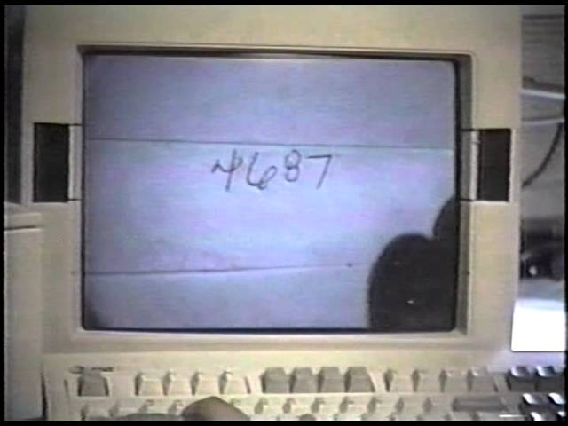

## Prologue: The Deep Learning Tsunami

## 序言：深度学习海啸

> “Deep Learning waves have lapped at the shores of computational linguistics for several years now, but 2015 seems like the year when the full force of the tsunami hit the major Natural Language Processing (NLP) conferences.” -[Dr. Christopher D. Manning, Dec 2015](http://www.mitpressjournals.org/doi/pdf/10.1162/COLI_a_00239)
> 
> “深度学习浪潮已经拍打计算语言学的海岸好几年了，但 2015 年似乎是海啸全面冲击主要自然语言处理 (NLP) 会议的一年。” - [Christopher D. Manning 博士，2015 年 12 月](http://www.mitpressjournals.org/doi/pdf/10.1162/COLI_a_00239)

This may sound hyperbolic - to say the established methods of an entire field of research are quickly being superseded by a new discovery, as if hit by a research ‘tsunami’. But, this catastrophic language is appropriate for describing the meteoric rise of Deep Learning over the last several years - a rise characterized by drastic improvements over reigning approaches towards the hardest problems in AI, massive investments from industry giants such as Google, and exponential growth in research publications (and Machine Learning graduate students). Having taken several classes on Machine Learning, and even used it in undergraduate research, I could not help but wonder if this new ‘Deep Learning’ was anything fancy or just a scaled up version of the ‘artificial neural nets’ that were already developed by the late 80s. And let me tell you, the answer is quite a story - the story of not just neural nets, not just of a sequence of research breakthroughs that make Deep Learning somewhat more interesting than ‘big neural nets’ (that I will attempt to explain in a way that just about anyone can understand), but most of all of how several unyielding researchers made it through dark decades of banishment to finally redeem neural nets and achieve the dream of Deep Learning.

这听起来可能有些夸张——也就是说，整个研究领域的既定方法正在迅速被一项新发现所取代，就像受到研究“海啸”的袭击一样。 但是，这种灾难性的语言很适合描述深度学习在过去几年中的迅速崛起——这种崛起的特点是对解决 AI 中最棘手问题的主导方法进行了大幅改进，谷歌等行业巨头的大规模投资，以及人工智能领域的指数级增长。研究出版物（和机器学习研究生）。 上过几门机器学习课程，甚至在本科研究中使用过它后，我不禁想知道这种新的“深度学习”是否有什么花哨的东西，或者只是已经开发的“人工神经网络”的放大版本80年代后期。 让我告诉你，答案是一个故事——不仅仅是神经网络的故事，不仅仅是一系列研究突破的故事，这些突破使深度学习比“大型神经网络”更有趣（我将尝试在一种几乎任何人都能理解的方式），但最重要的是几位不屈不挠的研究人员如何度过黑暗的几十年放逐，最终挽救神经网络并实现深度学习的梦想。

## Part 1: The Beginnings (1950s-1980s)

## 第 1 部分：开端（1950 年代至 80 年代）

The beginning of a story spanning half a century, about how we learned to make computers learn. In this part, we shall cover the birth of neural nets with the Perceptron in 1958, the AI Winter of the 70s, and neural nets’ return to popularity with backpropagation in 1986.

一个跨越半个世纪的故事的开始，关于我们如何学会让计算机学习。 在这一部分中，我们将介绍 1958 年神经网络与感知器的诞生，70 年代的 AI 寒冬，以及 1986 年神经网络因反向传播而重新流行。

## The Centuries Old Machine Learning Algorithm

## 百年历史的机器学习算法

Linear regression [(Source)](https://upload.wikimedia.org/wikipedia/commons/3/3a/Linear_regression.svg)

Let’s start with a brief primer on what Machine Learning is. Take some points on a 2D graph, and draw a line that fits them as well as possible. What you have just done is generalized from a few example of pairs of input values (x) and output values (y) to a general function that can map any input value to an output value. This is known as linear regression, and it is a wonderful little [200 year old](https://en.wikipedia.org/wiki/Linear_regression#cite_note-4) technique for extrapolating a general function from some set of input-output pairs. And here’s why having such a technique is wonderful: there is an incalculable number of functions that are hard to develop equations for directly, but are easy to collect examples of input and output pairs for in the real world - for instance, the function mapping an input of recorded audio of a spoken word to an output of what that spoken word is.

让我们从简要介绍什么是机器学习开始。 在二维图形上取一些点，并绘制一条尽可能适合它们的线。 您刚刚所做的是从输入值 (x) 和输出值 (y) 对的几个示例概括为可以将任何输入值映射到输出值的通用函数。 这被称为线性回归，它是一种具有 [200 年历史](https://en.wikipedia.org/wiki/Linear_regression#cite_note-4) 的奇妙技术，用于从一组输入输出对中推断出一个通用函数。 这就是为什么拥有这种技术很棒：有无数函数很难直接开发方程式，但很容易在现实世界中收集输入和输出对的示例 - 例如，函数映射将口语的录制音频输入到该口语是什么的输出。

Linear regression is a bit too wimpy a technique to solve the problem of speech recognition, but what it does is essentially what **supervised Machine Learning** is all about: ‘learning’ a function given a **training set** of **examples**, where each example is a pair of an input and output from the function (we shall touch on the unsupervised flavor in a little while). In particular, machine learning methods should derive a function that can generalize well to inputs not in the training set, since then we can actually apply it to inputs for which we do not have an output. For instance, Google’s current speech recognition technology is powered by Machine Learning with a massive training set, but not nearly as big a training set as all the possible speech inputs you might task your phone with understanding.

线性回归是一种解决语音识别问题的技术，但它所做的基本上就是 **监督机器学习** “学习”一个函数 **的全部内容：在给定训练样本集** 情况下 **的** ，其中每个样本都是一对函数的输入和输出（我们稍后会谈到无监督的风格）。 特别是，机器学习方法应该派生出一个函数，该函数可以很好地泛化到不在训练集中的输入，因为那时我们实际上可以将它应用于我们没有输出的输入。 例如，谷歌目前的语音识别技术由机器学习提供支持，具有庞大的训练集，但训练集的规模远不及您可能会要求手机理解的所有可能的语音输入。

This generalization principle is so important that there is almost always a **test set** of data (more examples of inputs and outputs) that is not part of the training set. The separate set can be used to evaluate the effectiveness of the machine learning technique by seeing how many of the examples the method correctly computes outputs for given the inputs. The nemesis of generalization is **overfitting** - learning a function that works really well for the training set but badly on the test set. Since machine learning researchers needed means to compare the effectiveness of their methods, over time there appeared standard **datasets** of training and testing sets that could be used to evaluate machine learning algorithms.

这种泛化原则非常重要，以至于几乎总是有一个 **的测试** 不属于训练集 数据集（更多输入和输出示例）。 通过查看该方法在给定输入的情况下正确计算输出的示例数量，可以使用单独的集合来评估机器学习技术的有效性。 泛化的克星是 **过度拟合** ——学习一个在训练集上效果很好但在测试集上效果很差的函数。 由于机器学习研究人员需要比较其方法有效性的方法，因此随着时间的推移出现 **标准数据集。** 了可用于评估机器学习算法的训练和测试集的

Okay okay, enough definitions. Point is - our line drawing exercise is a very simple example of supervised machine learning: the points are the training set (X is input and Y is output), the line is the approximated function, and we can use the line to find Y values for X values that don’t match any of the points we started with. Don’t worry, the rest of this history will not be nearly so dry as all this. Here we go.

好的好的，足够的定义。 点是——我们的画线练习是一个非常简单的有监督机器学习的例子：点是训练集（X是输入，Y是输出），线是近似函数，我们可以用线来求Y值对于与我们开始的任何点都不匹配的 X 值。 别担心，这段历史的其余部分不会像这一切那么枯燥。 开始了。

## The Folly of False Promises

## 虚假承诺的愚蠢

Why have all this prologue with linear regression, since the topic here is ostensibly neural nets? Well, in fact linear regression bears some resemblance to the first idea conceived specifically as a method to make machines learn: [Frank Rosenblatt’s **Perceptron**](http://psycnet.apa.org/index.cfm?fa=buy.optionToBuy&id=1959-09865-001)

.

既然这里的主题表面上是神经网络，为什么还要用线性回归来开场白呢？ 好吧，事实上线性回归与第一个想法有一些相似之处，特别是作为一种让机器学习的方法： [Frank Rosenblatt 的 **Perceptron**](http://psycnet.apa.org/index.cfm?fa=buy.optionToBuy&id=1959-09865-001)

.

A diagram showing how the Perceptron works. [(Source)](http://cse-wiki.unl.edu/wiki/images/0/0f/Perceptron.webp)

A psychologist, Rosenblatt conceived of the Percetron as a simplified mathematical model of how the neurons in our brains operate: it takes a set of binary inputs (nearby neurons), multiplies each input by a continuous valued weight (the synapse strength to each nearby neuron), and thresholds the sum of these weighted inputs to output a 1 if the sum is big enough and otherwise a 0 (in the same way neurons either fire or do not). Most of the inputs to a Perceptron are either some data or the output of another Perceptron, but an extra detail is that Perceptrons also have one special ‘bias’ input, which just has a value of 1 and basically ensures that more functions are computable with the same input by being able to offset the summed value. This model of the neuron built on the work of Warren McCulloch and Walter Pitts [Mcculoch-Pitts](http://www.minicomplexity.org/pubs/1943-mcculloch-pitts-bmb.pdf)

, who showed that a neuron model that sums binary inputs and outputs a 1 if the sum exceeds a certain threshold value, and otherwise outputs a 0, can model the basic OR/AND/NOT functions. This, in the early days of AI, was a big deal - the predominant thought at the time was that making computers able to perform formal logical reasoning would essentially solve AI.

作为一名心理学家，Rosenblatt 将 Percetron 设想为我们大脑中神经元如何运作的简化数学模型：它采用一组二进制输入（附近的神经元），将每个输入乘以连续值权重（每个附近神经元的突触强度） ), 并且阈值这些加权输入的总和输出 1 如果总和足够大否则输出 0 (以同样的方式神经元要么开火要么不开火)。 感知器的大部分输入要么是一些数据，要么是另一个感知器的输出，但一个额外的细节是感知器还有一个特殊的“偏置”输入，它的值为 1，基本上可以确保更多的函数可以用通过能够抵消求和值来获得相同的输入。 这个神经元模型建立在 Warren McCulloch 和 Walter Pitts [Mcculoch-Pitts的工作之上](http://www.minicomplexity.org/pubs/1943-mcculloch-pitts-bmb.pdf)

表明神经元模型对二进制输入求和，如果总和超过某个阈值则输出 1，否则输出 0，可以对基本的 OR/AND/NOT 函数建模。 这在 AI 的早期是一件大事——当时的主流思想是让计算机能够执行形式逻辑推理将从根本上解决 AI 问题。

Another diagram, showing the biological inspiration. The **activation function** is what people now call the non-linear function applied to the weighted input sum to produce the output of the artificial neuron - in the case of Rosenblatt's Perceptron, the function just a thresholding operation. [(Source)](http://cs231n.github.io/neural-networks-1/)

However, the Mcculoch-Pitts model lacked a mechanism for learning, which was crucial for it to be usable for AI. This is where the Perceptron excelled - Rosenblatt came up with a way to make such artificial neurons learn, inspired by the [foundational work](http://onlinelibrary.wiley.com/doi/10.1002/cne.900930310/abstract)

of Donald Hebb. Hebb put forth the unexpected and hugely influential idea that knowledge and learning occurs in the brain primarily through the formation and change of synapses between neurons - concisely stated as Hebb’s Rule:

然而，Mcculoch-Pitts 模型缺乏学习机制，而这对于它可用于 AI 至关重要。 的启发，想出了一种让这种人工神经元学习的方法 [这就是 Perceptron 擅长的地方——Rosenblatt 受到基础工作](http://onlinelibrary.wiley.com/doi/10.1002/cne.900930310/abstract)

唐纳德赫布。 Hebb 提出了意想不到且影响深远的想法，即知识和学习主要通过神经元之间突触的形成和变化在大脑中发生——简明扼要地表述为 Hebb 规则：

> “When an axon of cell A is near enough to excite a cell B and repeatedly or persistently takes part in firing it, some growth process or metabolic change takes place in one or both cells such that A’s efficiency, as one of the cells firing B, is increased.”
> 
> “当细胞 A 的轴突足够接近以激发细胞 B 并反复或持续地参与激发它时，一个或两个细胞就会发生一些生长过程或代谢变化，从而使 A 的效率，因为其中一个细胞激发 B , 增加了。”

The Perceptron did not follow this idea exactly, but having weights on the inputs allowed for a very simple and intuitive learning scheme: given a **training set** of input-output examples the Perceptron should ‘learn’ a function from, for each example increase the weights if the Perceptron output for that example’s input is too low compared to the example, and otherwise decrease the weights if the output is too high. Stated ever so slightly more formally, the algorithm is as follows:

Perceptron 并没有完全遵循这个想法，但是在输入上有权重允许一个非常简单和直观的学习方案：给定一 **训练集** 组输入输出示例的 ，Perceptron 应该从中“学习”一个函数，对于每个示例增加权重如果该示例输入的感知器输出与示例相比太低，否则如果输出太高则减少权重。 更正式地说，该算法如下：

1.  Start off with a Perceptron having random weights and a training set
2.  For the inputs of an example in the training set, compute the Perceptron’s output
3.  If the output of the Perceptron does not match the output that is known to be correct for the example:
    -   If the output should have been 0 but was 1, decrease the weights that had an input of 1.
    -   If the output should have been 1 but was 0, increase the weights that had an input of 1.
4.  Go to the next example in the training set and repeat steps 2-4 until the Perceptron makes no more mistakes

1.  从具有随机权重和训练集的感知器开始
2.  对于训练集中示例的输入，计算感知器的输出
3.  如果感知器的输出与示例的已知正确输出不匹配：
    -   如果输出本应为 0 但为 1，则减少输入为 1 的权重。
    -   如果输出本应为 1 但为 0，则增加输入为 1 的权重。
4.  转到训练集中的下一个示例并重复步骤 2-4，直到感知器不再出错

This procedure is simple, and produces a simple result: an input linear function (the weighted sum), just as with linear regression, ‘squashed’ by a non-linear **activation function** (the thresholding of the sum). It’s fine to threshold the sum when the function can only have a finite set of output values (as with logical functions, in which case there are only two - True/1 and False/0), and so the problem is not so much to generate a continuous-numbered output for any set of inputs - regression - as to categorize the inputs with a correct label - **classification**.

这个过程很简单，并产生一个简单的结果：输入线性函数（加权总和），就像线性回归一样，被非线性 **激活函数** “压缩” （总和的阈值）。 当函数只能有一组有限的输出值时（与逻辑函数一样，在这种情况下只有两个 - True/1 和 False/0），可以对总和进行阈值处理，所以问题不在于为任何一组输入生成连续编号的输出 - 回归 - 以使用正确的标签对输入进行分类 - **分类** 。

'Mark I Perceptron at the Cornell Aeronautical Laboratory', hardware implementation of the first Perceptron (Source: Wikipedia / Cornell Library)

Rosenblatt implemented the idea of the Perceptron in custom hardware (this being before fancy programming languages were in common use), and showed it could be used to learn to classify simple shapes correctly with 20x20 pixel-like inputs. And so, machine learning was born - a computer was built that could approximate a function given known input and output pairs from it. In this case it learned a little toy function, but it was not difficult to envision useful applications such as converting the mess that is human handwriting into machine-readable text.

Rosenblatt 在定制硬件中实现了 Perceptron 的想法（这是在花哨的编程语言被普遍使用之前），并表明它可以用于学习使用 20x20 像素输入正确分类简单形状。 因此，机器学习诞生了——一台计算机可以在给定已知输入和输出对的情况下逼近一个函数。 在这种情况下，它学会了一点玩具功能，但不难想象有用的应用程序，例如将人类手写的混乱转换为机器可读的文本。

But wait, so far we’ve only seen how one Perceptron is able to learn to output a one or a zero - how can this be extended to work for classification tasks with many categories, such as human handwriting (in which there are many letters and digits as the categories)? This is impossible for one Perceptron, since it has only one output, but functions with multiple outputs can be learned by having multiple Perceptrons in a **layer**, such that all these Perceptrons receive the same input and each one is responsible for one output of the function. Indeed, neural nets (or, formally, ‘Artificial Neural Networks’ - ANNs) are nothing more than layers of Perceptrons - or neurons, or units, as they are usually called today - and at this stage there was just one layer - the **output layer**. So, a prototypical example of neural net use is to classify an image of a handwritten digit. The inputs are the pixels of the image , and there are 10 output neurons with each one corresponding to one of the 10 possible digit values. In this case only one of the 10 neurons output 1, the highest weighted sum is taken to be the correct output, and the rest output 0.

但是等等，到目前为止，我们只看到了一个感知器如何能够学习输出一个 1 或一个 0 - 如何将其扩展到具有许多类别的分类任务，例如人类手写（其中有许多字母和数字作为类别）？ 这对于一个感知器来说是不可能的，因为它只有一个输出，但是具有多个输出的函数可以通过在一个 **层** 中有多个感知器来学习，这样所有这些感知器都接收相同的输入并且每个感知器负责函数的一个输出. 实际上，神经网络（或正式地称为“人工神经网络” - ANN）只不过是感知器层 - 或神经元或单位，正如今天通常所说的那样 - 在这个阶段只有一层 - **输出层** 。 因此，神经网络使用的一个典型例子是对手写数字的图像进行分类。 输入是图像的像素，有 10 个输出神经元，每个神经元对应 10 个可能的数字值之一。 在这种情况下，10 个神经元中只有一个输出 1，最高加权和被认为是正确的输出，其余输出 0。

A neural net with multiple outputs.

It is also possible to conceive of neural nets with artificial neurons different from the Perceptron. For instance, the thresholding activation function is not strictly necessary; Bernard Widrow and Tedd Hoff soon explored the option of just outputting the weight input in 1960 with [“An adaptive “ADALINE” neuron using chemical “memistors”](http://www-isl.stanford.edu/~widrow/papers/t1960anadaptive.pdf)

, and showed how these ‘Adaptive Linear Neurons’ could be incorporated into electrical circuits with ‘memistors’ - resistors with memory. They also showed that not having the threshold activation function is mathematically nice, because the neuron’s learning mechanism can be formally based on minimizing the error through good ol’ calculus. See, with the neuron’s function not being made weird by this sharp thresholding jump from 0 to 1, a measure of how much the error changes when each weight is changed (the derivative) can be used to drive the error down and find the optimal weight values. As we shall see, finding the right weights using the derivatives of the training error with respect to each weight is exactly how neural nets are typically trained to this day.

也可以设想具有不同于感知器的人工神经元的神经网络。 例如，阈值激活函数并不是绝对必要的； 1960 年，Bernard Widrow 和 Tedd Hoff 很快探索了仅输出权重输入的选项， [“使用化学“记忆器”的自适应“ADALINE”神经元](http://www-isl.stanford.edu/~widrow/papers/t1960anadaptive.pdf)

，并展示了如何将这些“自适应线性神经元”与“记忆电阻”（具有记忆的电阻器）结合到电路中。 他们还表明，没有阈值激活函数在数学上很好，因为神经元的学习机制可以形式化地基于通过良好的微积分最小化错误。 看，神经元的功能不会因为从 0 到 1 的这种急剧的阈值跳跃而变得奇怪，当每个权重改变时误差变化的度量（导数）可以用来降低误差并找到最佳权重值。 正如我们将看到的，使用关于每个权重的训练误差的导数来找到正确的权重正是迄今为止神经网络通常被训练的方式。

If we think about ADALINE a bit more we will come up with a further insight: finding a set of weights for a number of inputs is really just a form of linear regression. And again, as with linear regression, this would not be enough to solve the complex AI problems of Speech Recognition or Computer Vision. What McCullough and Pitts and Rosenblatt were really excited about is the broad idea of Connectionism: that networks of such simple computational units can be vastly more powerful and solve the hard problems of AI. And, Rosenblatt said as much, as in this frankly ridiculous New York Times quote [from the time](http://query.nytimes.com/gst/abstract.html?res=9D01E4D8173DE53BBC4053DFB1668383649EDE)

:

如果我们更多地考虑 ADALINE，我们将得出更深入的见解：为多个输入找到一组权重实际上只是线性回归的一种形式。 同样，与线性回归一样，这不足以解决语音识别或计算机视觉等复杂的 AI 问题。 真正让 McCullough、Pitts 和 Rosenblatt 兴奋的是连接主义的广泛理念：这种简单计算单元的网络可以变得更加强大，并解决 AI 的难题。 而且，罗森布拉特说了很多，就像纽约时报这段坦率荒谬的引述 [来自当时](http://query.nytimes.com/gst/abstract.html?res=9D01E4D8173DE53BBC4053DFB1668383649EDE)

:

> “The Navy revealed the embryo of an electronic computer today that it expects will be able to walk, talk, see, write, reproduce itself an be conscious of its existence … Dr. Frank Rosenblatt, a research psychologist at the Cornell Aeronautical Laboratory, Buffalo, said Perceptrons might be fired to the planets as mechanical space explorers”
> 
> “海军今天透露了一台电子计算机的胚胎，它希望能够走路、说话、看、写、复制自己并意识到它的存在……弗兰克·罗森布拉特博士，布法罗康奈尔航空实验室的研究心理学家，说感知器可能会作为机械太空探索者被发射到行星上”

Or, have a look at this TV segment from the time:

或者，看看当时的这个电视片段：

The stuff promised in this video - still not really around.

This sort of talk no doubt irked other researchers in AI, many of whom were focusing on approaches based on manipulation of symbols with concrete rules that followed from the mathematical laws of logic. Marvin Minsky, founder of the MIT AI Lab, and Seymour Papert, director of the lab at the time, were some of the researchers who were skeptical of the hype and in 1969 published their skepticism in the form of rigorous analysis on of the limitations of Perceptrons in a seminal book aptly named [Perceptrons](https://mitpress.mit.edu/books/perceptrons)

. Interestingly, Minksy may have actually been the first researcher to implement a hardware neural net with 1951’s [SNARC](https://en.wikipedia.org/wiki/Stochastic_neural_analog_reinforcement_calculator) (Stochastic Neural Analog Reinforcement Calculator)

, which preceded Rosenblatt’s work by many years. But the lack of any trace of his work on this system and the critical nature of the analysis in _Perceptrons_ suggests that he concluded this approach to AI was a dead end. The most widely discussed element of this analysis is the elucidation of the limits of a Perceptron - they could not, for instance, learn the simple boolean function XOR because it is not **linearly separable**. Though the history here is vague, this publication is widely believed to have helped usher in the first of the **AI Winters** - a period following a massive wave of hype for AI characterized by disillusionment that causes a freeze to funding and publications.

这种谈话无疑激怒了 AI 的其他研究人员，他们中的许多人都专注于基于符号操作的方法，这些符号具有遵循数学逻辑定律的具体规则。 麻省理工学院 AI 实验室的创始人 Marvin Minsky 和当时的实验室主任 Seymour Papert 是一些对炒作持怀疑态度的研究人员，并于 1969 年以对人工智能的局限性进行严格分析的形式发表了他们的怀疑论。一本名为 [Perceptrons的开创性书籍中的感知器](https://mitpress.mit.edu/books/perceptrons)

. 有趣的是，Minksy 实际上可能是第一个使用 1951 年的 [SNARC](https://en.wikipedia.org/wiki/Stochastic_neural_analog_reinforcement_calculator) （随机神经模拟增强计算器）实现硬件神经网络的研究人员

，比罗森布拉特的工作早很多年。 但是，他在这个系统上的工作没有任何踪迹，而且 _Perceptrons_ 中分析的批判性表明他认为这种 AI 方法是死胡同。 该分析中讨论最广泛的元素是对感知器限制的阐明——例如，他们无法学习简单的布尔函数 XOR，因为它不是 **线性可分** 的。 尽管这里的历史含糊不清，但人们普遍认为该出版物帮助迎来了第一个 **AI 寒冬** ——这是在对 AI 的大规模炒作浪潮之后的一个时期，其特征是幻灭导致资金和出版物冻结。

Visualization of the limitations of Perceptrons. Finding a linear function on the inputs X,Y to correctly ouput + or - is equivalent to drawing a line on this 2D graph separating all + cases from - cases; clearly, for the third case this is impossible.

## The Thaw of the AI Winter

## 人工智能寒冬的解冻

So, things were not good for neural nets. But why? The idea, after all, was to combine a bunch of simple mathematical neurons to do complicated things, not to use a single one. In other terms, instead of just having one **output layer**, to send an input to arbitrarily many neurons which are called a **hidden layer** because their output acts as input to another hidden layer or the output layer of neurons. Only the output layer’s output is ‘seen’ - it is the answer of the neural net - but all the intermediate computations done by the hidden layer(s) can tackle vastly more complicated problems than just a single layer.

所以，事情对神经网络不利。 但为什么？ 毕竟，这个想法是组合一堆简单的数学神经元来做复杂的事情，而不是使用一个。 换句话说，不是只有一个 **输出层** ，而是将输入发送到任意多个神经元，这些神经元被称为 **隐藏层** ，因为它们的输出充当另一个隐藏层或神经元输出层的输入。 只有输出层的输出是“可见的”——它是神经网络的答案——但隐藏层完成的所有中间计算可以解决比单层复杂得多的问题。

Neural net with two hidden layers [(Excellent Source)](http://cs231n.github.io/neural-networks-1/)

The reason hidden layers are good, in basic terms, is that the hidden layers can find **features** within the data and allow following layers to operate on those features rather than the noisy and large raw data. For example, in the very common neural net task of finding human faces in an image, the first hidden layer could take in the raw pixel values and find lines, circles, ovals, and so on within the image. The next layer would receive the position of these lines, circles, ovals, and so on within the image and use those to find the location of human faces - much easier! And people, basically, understood this. In fact, until recently machine learning techniques were commonly not applied directly to raw data inputs such as images or audio. Instead, machine learning was done on data after it had passed through **feature extraction** - that is, to make learning easier machine learning was done on preprocessed data from which more useful features such as angles or shapes had been already extracted.

从根本上说，隐藏层之所以好，是因为隐藏层可以在数据中找到 **特征** ，并允许后续层对这些特征进行操作，而不是对嘈杂的大型原始数据进行操作。 例如，在非常常见的从图像中寻找人脸的神经网络任务中，第一个隐藏层可以获取原始像素值并在图像中找到直线、圆、椭圆等。 下一层将接收图像中这些线、圆、椭圆等的位置，并使用它们来查找人脸的位置——容易得多！ 人们基本上理解这一点。 事实上，直到最近，机器学习技术通常还没有直接应用于图像或音频等原始数据输入。 相反，机器学习是在数据通过 **特征提取** 之后进行的——也就是说，为了使学习更容易，机器学习是在预处理数据上进行的，从中已经提取了更有用的特征，如角度或形状。

Visualization of traditional handcrafted feature extraction. [(Source)](http://lear.inrialpes.fr/people/vandeweijer/color_descriptors.html)

So, it is important to note Minsky and Papert’s analysis of Perceptrons did not merely show the impossibility of computing XOR with a single Perceptron, but specifically argued that it had to be done with multiple layers of Perceptrons - what we now call multilayer neural nets - and that Rosenblatt’s learning algorithm did not work for multiple layers. And that was the real problem: the simple learning rule previously outlined for the Perceptron does not work for multiple layers. To see why, let’s reiterate how a single layer of Perceptrons would learn to compute some function:

因此，重要的是要注意 Minsky 和 Papert 对感知器的分析不仅表明用单个感知器计算 XOR 是不可能的，而且还特别指出它必须用多层感知器来完成——我们现在称之为多层神经网络——并且 Rosenblatt 的学习算法不适用于多层。 这才是真正的问题：之前为感知器概述的简单学习规则不适用于多层。 为了了解原因，让我们重申单层感知器如何学习计算某些函数：

1.  A number of Perceptrons equal to the number of the function’s outputs would be started off with small initial weights
2.  For the inputs of an example in the training set, compute the Perceptrons’ output
3.  For each Perceptron, if the output does not match the example’s output, adjust the weights accordingly
4.  Go to the next example in the training set and repeat steps 2-4 until the Perceptrons no longer make mistakes

1.  数量等于函数输出数量的感知器将从较小的初始权重开始
2.  对于训练集中示例的输入，计算感知器的输出
3.  对于每个感知器，如果输出与示例的输出不匹配，则相应地调整权重
4.  转到训练集中的下一个示例并重复步骤 2-4，直到感知器不再出错

The reason why this does not work for multiple layers should be intuitively clear: the example only specifies the correct output for the final output layer, so how in the world should we know how to adjust the weights of Perceptrons in layers before that? The answer, despite taking some time to derive, proved to be once again based on age-old calculus: the chain rule. The key realization was that if the neural net neurons were not quite Perceptrons, but were made to compute the output with an activation function that was still non-linear but also differentiable, as with Adaline, not only could the derivative be used to adjust the weight to minimize error, but the chain rule could also be used to compute the derivative for all the neurons in a prior layer and thus the way to adjust their weights would also be known. Or, more simply: we can use calculus to assign some of the blame for any training set mistakes in the output layer to each neuron in the previous hidden layer, and then we can further split up blame if there is another hidden layer, and so on - we **backpropagate** the error. And so, we can find how much the error changes if we change any weight in the neural net, including those in the hidden layers, and use an optimization technique (for a long time, typically **stochastic gradient descent**) to find the optimal weights to minimize the error.

这对多层不起作用的原因应该很直观：该示例仅指定了最终输出层的正确输出，那么我们到底应该如何知道在此之前如何调整层中感知器的权重呢？ 尽管需要一些时间才能得出答案，但事实证明它再次基于古老的微积分：链式法则。 关键的认识是，如果神经网络神经元不完全是感知器，而是用一个仍然是非线性但可微的激活函数来计算输出，就像 Adaline 一样，导数不仅可以用来调整权重以最小化误差，但链式法则也可用于计算前一层中所有神经元的导数，因此调整它们权重的方法也将是已知的。 或者，更简单地说：我们可以使用微积分将输出层中任何训练集错误的部分责任分配给前一个隐藏层中的每个神经元，然后如果还有另一个隐藏层，我们可以进一步拆分责任，等等在-我们 **反向传播** 错误。 ，我们可以发现误差会发生多少变化 **因此，如果我们改变神经网络中的任何权重，包括隐藏层中的权重，并使用优化技术（很长一段时间，通常是随机梯度下降** ）来找到最佳权重 最小化错误。

The basic idea of backpropagation. [(Source)](http://devblogs.nvidia.com/parallelforall/inference-next-step-gpu-accelerated-deep-learning/)

**Backpropagation** was derived by multiple researchers in the early 60’s and implemented to run on computers much as it is today as early as 1970 by Seppo Linnainmaa

, but Paul Werbos was first in the US to propose that it could be used for neural nets after analyzing it in depth in his 1974 PhD Thesis

. Interestingly, as with Perceptrons he was loosely inspired by work modeling the human mind, in this case the psychological theories of Freud as [he himself recounts](http://www.die.uchile.cl/ieee-cis/evic2005/files/AD2004Werbosv2.pdf)

:

**反向传播** 由 60 年代初期的多位研究人员推导出来，并在 1970 年由 Seppo Linnainmaa 实现并像今天一样在计算机上运行

，但 Paul Werbos 在 1974 年的博士论文中对其进行了深入分析后，首先在美国提出它可以用于神经网络

。 有趣的是，与感知器一样，他受到了对人类思维建模的工作的松散启发，在这种情况下，弗洛伊德的心理学理论正如 [他自己所叙述的那样](http://www.die.uchile.cl/ieee-cis/evic2005/files/AD2004Werbosv2.pdf)

:

> “In 1968, I proposed that we somehow imitate Freud’s concept of a backwards flow of credit assignment, flowing back from neuron to neuron … I explained the reverse calculations using a combination of intuition and examples and the ordinary chainrule, though it was also exactly a translation into mathematics of things that Freud had previously proposed in his theory of psychodynamics!”
> 
> “1968 年，我提议我们以某种方式模仿弗洛伊德的信用分配逆流概念，从一个神经元流回到另一个神经元……我结合直觉和例子以及普通的链式规则解释了逆向计算，尽管它也完全是一个将弗洛伊德先前在他的心理动力学理论中提出的事物转化为数学！”

Despite solving the question of how multilayer neural nets could be trained, and seeing it as such while working on his PhD thesis, Werbos did not publish on the application of backprop to neural nets until 1982 due to the chilling effects of the AI Winter. In fact, Werbos thought the approach would make sense for solving the problems pointed out in _Perceptrons_, but the community at large lost any faith in tackling those problems:

尽管解决了如何训练多层神经网络的问题，并且在撰写博士论文时也看到了这一点，但由于 AI 寒冬的寒蝉效应，Werbos 直到 1982 年才发表关于反向传播在神经网络中的应用。 中指出的问题是有意义的 _事实上，Werbos 认为该方法对于解决Perceptrons_ ，但整个社区对解决这些问题失去了信心：

> “Minsky’s book was best known for arguing that (1) we need to use MLPs \[multilayer perceptrions, another term for multilayer neural nets\] even to represent simple nonlinear functions such as the XOR mapping; and (2) no one on earth had found a viable way to _train_ MLPs good enough to learn such simple functions. Minsky’s book convinced most of the world that neural networks were a discredited dead-end – the worst kind of heresy. Widrow has stressed that this pessimism, which squashed the early “perceptron” school of AI, should not really be blamed on Minsky. Minsky was merely summarizing the experience of hundreds of sincere researchers who had tried to find good ways to train MLPs, to no avail. There had been islands of hope, such as the algorithm which Rosenblatt called “backpropagation” (not at all the same as what we now call backpropagation!), and Amari’s brief suggestion that we might consider least squares \[what is the basis of simple linear regression\] as a way to train neural networks (without discussion of how to get the derivatives, and with a warning that he did not expect much from the approach). But the pessimism at that time became terminal. In the early 1970s, I did in fact visit Minsky at MIT. I proposed that we do a joint paper showing that MLPs can in fact overcome the earlier problems … But Minsky was not interested(14). In fact, no one at MIT or Harvard or any place I could find was interested at the time.”
> 
> “明斯基的书最著名的论点是 (1) 我们需要使用 MLP \[多层感知器，多层神经网络的另一个术语\] 甚至来表示简单的非线性函数，例如 XOR 映射； (2) 地球上还没有人找到一种可行的方法来 _训练_ MLP 足以学习如此简单的功能。 明斯基的书让世界上大多数人相信神经网络是一个名誉扫地的死胡同——最糟糕的一种异端邪说。 威德罗强调，这种摧毁了人工智能早期“感知器”学派的悲观主义，不应该真正归咎于明斯基。 明斯基只是总结了数百名真诚的研究人员的经验，他们曾试图找到训练 MLP 的好方法，但无济于事。 曾经有过希望之岛，例如 Rosenblatt 称为“反向传播”的算法（与我们现在所说的反向传播完全不同！），以及 Amari 的简短建议我们可以考虑最小二乘法 \[简单线性算法的基础是什么？回归\] 作为一种训练神经网络的方法（没有讨论如何获得导数，并警告说他对这种方法没有太大期望）。 但当时的悲观情绪已经到了绝境。 70 年代初期，我确实拜访了麻省理工学院的明斯基。 我建议我们写一篇联合论文，表明 MLP 实际上可以克服早期的问题……但明斯基不感兴趣 (14)。 事实上，当时麻省理工学院或哈佛大学或我能找到的任何地方都没有人对此感兴趣。”

It seems that it was because of this lack of academic interest that it was not until more than a decade later, in 1986, that this approach was popularized in [“Learning representations by back-propagating errors”](http://www.iro.umontreal.ca/~vincentp/ift3395/lectures/backprop_old.pdf) by David Rumelhart, Geoffrey Hinton, and Ronald Williams

. Despite the numerous discoveries of the method (the paper even explicitly mentions David Parker and Yann LeCun as two people who discovered it beforehand) the 1986 publication stands out for how concisely and clearly the idea is stated. In fact, as a student of Machine Learning it is easy to see that the description in their paper is essentially identical to the way the concept is still explained in textbooks and AI classes. A [retrospective in IEEE](http://www-isl.stanford.edu/~widrow/papers/j199030years.pdf)

echoes this notion:

似乎正是因为缺乏学术兴趣，直到十多年后，即 1986 年，这种方法才在 [的“Learning representations by back-propacating errors”](http://www.iro.umontreal.ca/~vincentp/ift3395/lectures/backprop_old.pdf) David Rumelhart、Geoffrey Hinton 和 Ronald 中得到普及威廉姆斯

。 尽管该方法有许多发现（该论文甚至明确提到 David Parker 和 Yann LeCun 是事先发现它的两个人），但 1986 年的出版物因其对这一想法的简洁明了而引人注目。 事实上，作为机器学习的学生，很容易看出他们论文中的描述与教科书和 AI 课程中对概念的解释方式基本相同。 回顾展 [IEEE](http://www-isl.stanford.edu/~widrow/papers/j199030years.pdf)

呼应了这个概念：

> “Unfortunately, Werbos’s work remained almost unknown in the scientific community. In 1982, Parker rediscovered the technique \[39\] and in 1985, published a report on it at M.I.T. \[40\]. Not long after Parker published his findings, Rumelhart, Hinton, and Williams \[41\], \[42\] also rediscovered the techniques and, largely as a result of the clear framework within which they presented their ideas, they finally succeeded in making it widely known.”
> 
> “不幸的是，Werbos 的工作在科学界几乎无人知晓。 1982 年，Parker 重新发现了这项技术 \[39\]，并于 1985 年在 MIT \[40\] 发表了一篇关于它的报告。 在 Parker 发表他的发现后不久，Rumelhart、Hinton 和 Williams \[41\]、\[42\] 也重新发现了这些技术，并且主要由于他们提出想法的清晰框架，他们最终成功地使它广为人知”

But the three authors went much further than just present this new learning algorithm. In the same year they published the much more in-depth [“Learning internal representations by error propagation”](http://psych.stanford.edu/~jlm/papers/PDP/Volume%201/Chap8_PDP86.pdf)

, which specifically addressed the problems discussed by Minsky in _Perceptrons_. Though the idea was conceived by people in the past, it was precisely this formulation in 1986 that made it widely understood how multilayer neural nets could be trained to tackle complex learning problems. And so, neural nets were back! Next, we shall see how just a few years later backpropagation and some other tricks discussed in “Learning internal representations by error propagation” were applied to a very significant problem: enabling computers to read human handwriting.

但是三位作者远不止提出这种新的学习算法。 同年，他们发表了更深入的 [“通过错误传播学习内部表示”](http://psych.stanford.edu/~jlm/papers/PDP/Volume%201/Chap8_PDP86.pdf)

中讨论的问题 _，它专门解决了 Minsky 在Perceptrons_ 。 虽然这个想法是过去的人构思出来的，但正是 1986 年的这个提法让人们广泛理解了如何训练多层神经网络来解决复杂的学习问题。 因此，神经网络又回来了！ 接下来，我们将看到仅仅几年后反向传播和“通过错误传播学习内部表示”中讨论的一些其他技巧如何应用于一个非常重要的问题：使计算机能够阅读人类手写体。

## Part 2: Neural Nets Blossom (1980s-2000s)

## 第 2 部分：神经网络开花结果（1980 年代至 2000 年代）

## Neural Nets Gain Vision

## 神经网络获得愿景

Yann LeCun's LeNet demonstrated [(Source)](http://yann.lecun.com/exdb/lenet/gifs/asamples.gif).

With the secret to training multilayer neural nets uncovered, the topic was once again ember-hot and the lofty ambitions of Rosenblatt seemed to perhaps be in reach. It took only until 1989 for another key finding now universally cited in textbooks and lectures to be [published](http://www.sciencedirect.com/science/article/pii/0893608089900208)

: “Multilayer feedforward networks are universal approximators”. Essentially, it mathematically proved that multiple layers allow neural nets to theoretically implement any function, and certainly XOR.

随着训练多层神经网络的秘密被揭开，这个话题再次变得炙手可热，Rosenblatt 的远大抱负似乎指日可待。 直到 1989 年，另一项重要发现才 [发表，现在已在教科书和讲座中普遍引用](http://www.sciencedirect.com/science/article/pii/0893608089900208)

：“多层前馈网络是通用逼近器”。 从本质上讲，它从数学上证明了多层允许神经网络在理论上实现任何功能，当然还有 XOR。

But, this is mathematics, where you could imagine having endless memory and computation power should it be needed - did backpropagation allow neural nets to be used for anything in the real world? Oh yes. Also in 1989, Yann LeCun et al. at the AT&T Bell Labs demonstrated a very significant real-world application of backpropagation in ["”Backpropagation Applied to Handwritten Zip Code Recognition”](http://yann.lecun.com/exdb/publis/pdf/lecun-89e.pdf)

. You may think it fairly unimpressive for a computer to be able to correctly understand handwritten digits, and these days it is indeed quite quaint, but prior to the publication the messy and inconsistent scrawls of us humans proved a major challenge to the much more tidy minds of computers. The publication, working with a large dataset from the US Postal Service, showed neural nets were entirely capable of this task. And much more importantly, it was first to highlight the practical need for a key modifications of neural nets beyond plain backpropagation toward modern deep learning:

但是，这是数学，如果需要的话，你可以想象拥有无穷无尽的内存和计算能力——反向传播是否允许神经网络用于现实世界中的任何事情？ 哦是的。 同样在 1989 年，Yann LeCun 等人。 在 AT&T 贝尔实验室，在 [“”Backpropagation Applied to Handwritten Zip Code Recognition”中演示了反向传播在现实世界中的一个非常重要的应用](http://yann.lecun.com/exdb/publis/pdf/lecun-89e.pdf)

。 你可能认为计算机能够正确理解手写数字并不令人印象深刻，现在它确实很古怪，但在出版之前，我们人类凌乱和不一致的涂鸦证明了对更整洁的头脑的重大挑战的电脑。 该出版物使用美国邮政服务的大型数据集，表明神经网络完全有能力完成这项任务。 更重要的是，它首先强调了对神经网络进行关键修改的实际需求，超越了现代深度学习的简单反向传播：

> “Classical work in visual pattern recognition has demonstrated the advantage of extracting local features and combining them to form higher order features. Such knowledge can be easily built into the network by forcing the hidden units to combine only local sources of information. Distinctive features of an object can appear at various location on the input image. Therefore it seems judicious to have a set of feature detectors that can detect a particular instance of a feature anywhere on the input place. Since the _precise_ location of a feature is not relevant to the classification, we can afford to lose some position information in the process. Nevertheless, _approximate_ position information must be preserved, to allow the next levels to detect higher order, more complex features (Fukushima 1980; Mozer 1987).”
> 
> “视觉模式识别中的经典工作已经证明了提取局部特征并将它们组合起来形成高阶特征的优势。 通过强制隐藏单元仅结合本地信息源，可以轻松地将此类知识构建到网络中。 对象的独特特征可以出现在输入图像的不同位置。 因此，拥有一组可以在输入位置的任何位置检测特征的特定实例的特征检测器似乎是明智的。 由于特征的 _精确_ 位置与分类无关，我们可以承受在此过程中丢失一些位置信息。 然而， _必须保留大概_ 的位置信息，以允许下一层检测更高阶、更复杂的特征（Fukushima 1980；Mozer 1987）。”

A visualization of how this neural net works. [(Source)](http://image.slidesharecdn.com/bp2slides-090922011749-phpapp02/95/the-back-propagation-learning-algorithm-10-728.webp?cb=1253582278)

Or, more concretely: the first hidden layer of the neural net was **convolutional** - instead of each neuron having a different weight for each pixel of the input image (40x60=2400 weights), the neurons only have a small set of weights (5x5=25) that were applied a whole bunch of small subsets of the image of the same size. So, for instance instead of having 4 different neurons learn to detect 45 degree lines in each of the 4 corners of the input image, a single neuron could learn to detect 45 degree lines on subsets of the image and do that everywhere within it. Layers past the first work in a similar way, but take in the ‘local’ features found in the previous hidden layer rather than pixel images, and so ‘see’ successively larger portions of the image since they are combining information about increasingly larger subsets of the image. Finally, the last two layers are just plain normal neural net layers that use the higher-order larger features generated by the convolutional layers to determine which digit the input image corresponds to. The method proposed in this 1989 paper went on to be the basis of nationally deployed check-reading systems, as demonstrated by LeCun in this gem of a video:

或者，更具体地说：神经网络的第一个隐藏层是 **卷积** 层——而不是每个神经元对输入图像的每个像素都有不同的权重（40x60=2400 个权重），神经元只有一小部分权重（5x5= 25）应用了一大堆相同大小的图像的小子集。 因此，例如，不是让 4 个不同的神经元学习在输入图像的 4 个角中的每个角中检测 45 度线，而是单个神经元可以学习检测图像子集上的 45 度线并在其中的任何地方执行此操作。 第一个层之后的层以类似的方式工作，但采用在前一个隐藏层而不是像素图像中发现的“局部”特征，因此“看到”图像的更大部分，因为它们正在组合关于越来越大的图像子集的信息图片。 最后，最后两层只是普通的普通神经网络层，它们使用卷积层生成的高阶较大特征来确定输入图像对应的数字。 这篇 1989 年的论文中提出的方法后来成为全国部署的检查阅读系统的基础，正如 LeCun 在这段视频中所展示的那样：

The reason for why this is helpful is intuitively if not mathematically clear: without such constraints the network would have to learn the same simple things (such as detecting 45 degree lines, small circles, etc) a whole bunch of times for each portion of the image. But with the constraint there, only one neuron would need to learn each simple feature - and with far fewer weights overall, it could do so much faster! Moreover, since the pixel-exact locations of such features do not matter the neuron could basically skip neighboring subsets of the image - **subsampling**, now known as a type of **pooling** - when applying the weights, further reducing the training time. The addition of these two types of layers - convolutional and pooling layers - are the primary distinctions of **Convolutional Neural Nets** (**CNNs/ConvNets**) from plain old neural nets.

这有帮助的原因是直观的，即使在数学上不是很清楚：如果没有这样的限制，网络将不得不为网络的每个部分学习相同的简单事物（例如检测 45 度线、小圆圈等）很多次图片。 但是由于那里的限制，只有一个神经元需要学习每个简单的特征——而且总体权重要少得多，它可以做得更快！ 此外，由于这些特征的像素精确位置无关紧要，神经元基本上可以跳过图像的相邻子集—— **子采样** ，现在称为一种 **池** 化——在应用权重时，进一步减少了训练时间。 添加这两种类型的层——卷积层和池化层——是 **卷积神经网络** ( **CNNs/ConvNets** ) 与普通旧神经网络的主要区别。

A nice visualization of CNN operation [(Source)](https://sites.google.com/site/5kk73gpu2013/assignment/cnn)

At that time, the convolution idea was called ‘weight sharing’, and it was actually discussed in the 1986 extended analysis of backpropagation by Rumelhart, Hinton, and Williams

. Actually, the credit goes even further back - Minsky and Papert’s 1969 analysis of Perceptrons was thorough enough to pose a problem that motivated this idea. But, as before, others have also independently explored the concept - namely, Kunihiko Fukushima in 1980 with his notion of the [Neurocognitron](http://www.cs.princeton.edu/courses/archive/spr08/cos598B/Readings/Fukushima1980.pdf)

. And, as before, the ideas behind it drew inspiration from studies of the brain:

当时，卷积思想被称为“权重共享”，实际上在 1986 年 Rumelhart、Hinton 和 Williams 的反向传播扩展分析中讨论过

。 实际上，功劳可以追溯到更早之前——Minsky 和 Papert 1969 年对感知器的分析非常透彻，足以提出一个激发这个想法的问题。 但是，和以前一样，其他人也独立探索了这个概念——即福岛邦彦在 1980 年提出的 [神经认知机概念](http://www.cs.princeton.edu/courses/archive/spr08/cos598B/Readings/Fukushima1980.pdf)

。 而且，和以前一样，它背后的想法从大脑研究中汲取灵感：

> “According to the hierarchy model by Hubel and Wiesel, the neural network in the visual cortex has a hierarchy structure: LGB (lateral geniculate body)->simple cells->complex cells->lower order hypercomplex cells->higher order hypercomplex cells. It is also suggested that the neural network between lower order hypercomplex cells and higher order hypercomplex cells has a structure similar to the network between simple cells and complex cells. In this hierarchy, a cell in a higher stage generally has a tendency to respond selectively to a more complicated feature of the stimulus pattern, and, at the same time, has a larger receptive field, and is more insensitive to the shift in position of the stimulus pattern. … Hence, a structure similar to the hierarchy model is introduced in our model.”
> 
> “根据 Hubel 和 Wiesel 的层次模型，视觉皮层中的神经网络具有层次结构：LGB（外侧膝状体）->简单细胞->复杂细胞->低阶超复杂细胞->高阶超复杂细胞。 还表明低阶超复杂细胞和高阶超复杂细胞之间的神经网络具有类似于简单细胞和复杂细胞之间的网络的结构。 在这个层级中，处于较高阶段的细胞一般倾向于选择性地对刺激模式的更复杂特征作出反应，同时具有更大的感受野，对位置的变化更不敏感。刺激模式。 ……因此，我们的模型中引入了类似于层次模型的结构。”

LeCun continued to be a major proponent of CNNs at Bell Labs, and his work on them resulted in major commercial use for check-reading in the mid 90s - his talks and interviews often include [the fact that](http://www.kdnuggets.com/2014/02/exclusive-yann-lecun-deep-learning-facebook-ai-lab.html) “At some point in the late 1990s, one of these systems was reading 10 to 20% of all the checks in the US.”

.

LeCun 在贝尔实验室一直是 CNN 的主要支持者，他在 90 年代中期的工作导致了检查阅读的主要商业用途——他的演讲和采访经常包括 [这样一个事实：](http://www.kdnuggets.com/2014/02/exclusive-yann-lecun-deep-learning-facebook-ai-lab.html) “在 1990 年代后期的某个时候，其中一个系统读取了美国所有支票的 10% 到 20%。”

.

## Neural Nets Go Unsupervised

## 神经网络不受监督

Automating the rote and utterly uninteresting task of reading checks is a great instance of what Machine Learning can be used for. Perhaps a less predictable application? Compression. Meaning, of course, finding a smaller representation of some data from which the original data can be reconstructed. Learned compression may very well outperform stock compression schemes, when the learning algorithm can find features within the data stock methods would miss. And it is very easy to do - just train a neural net with a small hidden layer to just output the input:

自动执行阅读支票这一死记硬背且完全无趣的任务是机器学习可用于的一个很好的例子。 也许是一个不太可预测的应用程序？ 压缩。 当然，这意味着找到一些数据的更小表示，从中可以重建原始数据。 当学习算法可以在数据库存方法中找到特征时，学习压缩可能会很好地优于库存压缩方案。 而且这很容易做到——只需训练一个带有小隐藏层的神经网络来输出输入：

An autoencoder neural net. [(Source)](http://research.chtsai.org/papers/iml-bkp.html)

This is an **autoencoder** neural net, and is a method for learning compression - efficiently translating (encoding) data to a compact format and back to itself (auto). See, the output layer computes its outputs, which ideally are the same as the input to the neural net, using only the hidden layer’s outputs. Since the hidden layer has fewer outputs than does the input layer, the output of the hidden layer is the compressed representation of the input data, which can be reconstructed with the output layer.

这是一个 **自动编码器** 神经网络，是一种学习压缩的方法 - 有效地将数据转换（编码）为紧凑格式并返回自身（自动）。 看，输出层计算其输出，理想情况下，输出与神经网络的输入相同，仅使用隐藏层的输出。 由于隐藏层的输出比输入层少，隐藏层的输出是输入数据的压缩表示，可以用输出层重建。

A more explicit view of an autoencoder compression. [(Source)](http://stats.stackexchange.com/questions/114385/what-is-the-difference-between-convolutional-neural-networks-restricted-boltzma)

Notice a neat thing here: the only thing we need for training is some input data. This is in contrast to the requirement of supervised machine learning, which needs a training set of input-output pairs (**labeled data**) in order to approximate a function that can compute such outputs from such inputs. And indeed, autoencoders are not a form of supervised learning; they are a form of **unsupervised learning**, which only needs a set of input data (**unlabeled data**) in order to find some hidden structure within that data. In other words, unsupervised learning does not approximate a function so much as it derives one from the input data to another useful representation of that data. In this case, this representation is just a smaller one from which the original data can still be reconstructed, but it can also be used for finding groups of similar data (**clustering**) or other inference of **latent variables** (some aspect that is known to exist for the data but the value of which is not known).

注意这里有一件整洁的事情：我们唯一需要训练的是一些输入数据。 这与监督机器学习的要求形成对比，监督机器学习需要一组输入输出对（ **标记数据** ）的训练集，以便近似可以从此类输入计算此类输出的函数。 事实上，自动编码器不是一种监督学习形式； 它们是一种 **无监督学习** 形式，只需要一组输入数据（ **未标记数据** ）即可在该数据中找到一些隐藏结构。 换句话说，无监督学习并没有逼近一个函数，而是从输入数据中导出一个函数到该数据的另一个有用表示。 在这种情况下，这种表示只是一个较小的表示，仍然可以从中重建原始数据，但它也可以用于查找相似数据组（ **聚类** 的其他推断 **）或潜在变量** （已知存在的某些方面对于数据但其价值未知）。

Clustering, a very common unsupervised learning application. [(Source)](https://en.wikipedia.org/wiki/K-means_clustering)

There were other unsupervised applications of neural networks explored prior to and after the discovery of backpropagation, most notably Self Organizing Maps

, which produce a low-dimensional representation of data good for visualization, and Adapative Resonance Theory

, which can learn to classify arbitrary input data without being told correct classifications. If you think about it, it is intuitive that quite a lot can be learned from unlabeled data. Say you have a dataset of a bunch of images of handwritten digits, without labels of which digit each image corresponds to. Well, an image with some digit in that dataset most likely looks most like all the other images with that same digit, and so though a computer may not know which digit all those images correspond to, it should still be able to find that they all correspond to the same one. This, **pattern recognition**, is really what most of machine learning is all about, and arguably also is the basis for the great powers of the human brain. But, let us not digress from our exciting deep learning journey, and get back to autoencoders.

在发现反向传播之前和之后，还有其他无监督的神经网络应用被探索，最著名的是自组织映射

，产生有利于可视化的低维数据表示，以及自适应共振理论

，它可以在没有被告知正确分类的情况下学习对任意输入数据进行分类。 如果您考虑一下，很直观地可以从未标记的数据中学到很多东西。 假设你有一个包含一堆手写数字图像的数据集，没有每个图像对应哪个数字的标签。 好吧，在该数据集中带有某个数字的图像很可能看起来最像所有其他具有相同数字的图像，因此尽管计算机可能不知道所有这些图像对应的是哪个数字，但它仍然应该能够找到它们对应同一个。 这一点， **模式识别** ，确实是大多数机器学习的全部内容，也可以说是人类大脑强大功能的基础。 但是，让我们不要离开激动人心的深度学习之旅，回到自动编码器。

Self Organizing Maps - mapping a large vector of inputs into a grid of neuron outputs, where each output is a cluster. Nearby neurons represent similar clusters. [(Source)](http://lcdm.astro.illinois.edu/static/code/mlz/MLZ-1.0/doc/html/somz.html)

As with weight-sharing, the idea of autoencoders was first discussed in the aforementioned extensive 1986 analysis of backpropagation <a href="https://www.skynettoday.com/overviews/neural-net-history#fn:part2_3" rel="footnote">17</a>, and as with weight-sharing it resurfaced in more research in the following years

, including by Hinton himself

. This paper, with the fun title [“Autoencoders, Minimum Description Length, and Helmholts Free Energy”](http://www.cs.toronto.edu/~fritz/absps/cvq.pdf), posits that “A natural approach to unsupervised learning is to use a model that defines probability distribution over observable vectors” and uses a neural net to learn such a model. So here’s another neat thing you can do with neural nets: approximate probability distributions.

与权重共享一样，自动编码器的概念在上述 1986 年对反向传播 <a href="https://www.skynettoday.com/overviews/neural-net-history#fn:part2_3" rel="footnote">17 </a> 的广泛分析中首次被讨论，并且与权重共享一样，它在随后几年的更多研究中重新浮出水面

，包括欣顿本人

. 这篇论文的标题很有趣 [，“自动编码器、最小描述长度和亥姆霍兹自由能”](http://www.cs.toronto.edu/~fritz/absps/cvq.pdf) ，假设“无监督学习的一种自然方法是使用定义可观察向量概率分布的模型”，并使用神经网络来学习这种一个模型。 所以这是你可以用神经网络做的另一件巧妙的事情：近似概率分布。

## Neural Nets Gain Beliefs

## 神经网络获得信任

In fact, before being co-author of the seminal 1986 paper on backpropagation learning algorithm, Hinton worked on a neural net approach for learning probability distributions in the 1985 [“A Learning Algorithm for Boltzmann Machines”](http://www.cs.toronto.edu/~fritz/absps/cogscibm.pdf)

. Boltzmann Machines are networks just like neural nets and have units that are very similar to Perceptrons, but instead of computing an output based on inputs and weights, each unit in the network can compute a probability of it having a value of 1 or 0 given the values of connected units and weights. The units are therefore **stochastic** - they behave according to a probability distribution, rather than in a known deterministic way. The Boltzmann part refers [to a probability distribution](https://en.wikipedia.org/wiki/Boltzmann_distribution) that has to do with the states of particles in a system based the particles’ energy and on the thermodynamic temperature of that system. This distribution defines not only the mathematics of the Boltzmann machines, but also the interpretation - the units in the network themselves have energies and states, and learning is done by minimizing the energy of the system - a direct inspiration from thermodynamics. Though a bit unintuitive, this energy-based interpretation is actually just one example of an **energy-based model**, and fits in the **energy-based learning** theoretical framework with which many learning algorithms can be expressed

.

事实上，在成为 1986 年关于反向传播学习算法的开创性论文的合著者之前，Hinton 在 1985 年的 [“玻尔兹曼机学习算法”中研究了一种用于学习概率分布的神经网络方法](http://www.cs.toronto.edu/~fritz/absps/cogscibm.pdf)

。 玻尔兹曼机是类似于神经网络的网络，具有与感知器非常相似的单元，但不是根据输入和权重计算输出，网络中的每个单元都可以计算其值为 1 或 0 的概率连接单元和权重的值。 因此，这些单位是 **随机** 的- 它们根据概率分布而不是已知的确定性方式运行。 玻尔兹曼部分指 [的是概率分布](https://en.wikipedia.org/wiki/Boltzmann_distribution) ，它与基于粒子能量和系统热力学温度的系统中的粒子状态有关。 这种分布不仅定义了玻尔兹曼机的数学，还定义了解释——网络中的单元本身具有能量和状态，学习是通过最小化系统的能量来完成的——这是热力学的直接灵感。 虽然有点不直观，但这种基于能量的解释实际上只是 **基于能量的模型的一个例子** ，并且符合 **基于能量的学习** 理论框架，可以表达许多学习算法

.

A simple belief, or bayesian, network - a Boltzmann machine is basically this but with undirected/symmetric connections and trainable weights to learn the probabilities in a particular fashion. [(Source)](https://commons.wikimedia.org/wiki/File:SimpleBayesNet.svg)

Back to Boltzmann Machines. When such units are put together into a network, they form a graph, and so are a **graphical model** of data. Essentially, they can do something very similar to normal neural nets: some **hidden units** compute the probability of some **hidden variables** (the outputs - classifications or features for data) given known values of **visible units** that represent **visible variables** (the inputs - pixels of images, characters in text, etc.). In our classic example of classifying images of digits, the hidden variables are the actual digit values, and the visible variables are the pixels of the image; given an image of the digit ‘1’ as input, the value of visible units is known and the hidden unit modeling the probability of the image representing a ‘1’ should have a high output probability.

回到玻尔兹曼机。 当这些单元被放在一个网络中时，它们就形成了一个图形，数据的 **图形模型** 也是如此。 从本质上讲，它们可以做一些与普通神经网络非常相似的事情：一些 **隐藏单元** 计算一些 **隐藏变量** 的已知值 **的可见单元** 的概率（输出 - 数据的分类或特征）给定代表 **可见变量** （输入 - 图像的像素） 、文本中的字符等）。 在我们经典的数字图像分类示例中，隐藏变量是实际数字值，可见变量是图像的像素； 给定数字“1”的图像作为输入，可见单元的值是已知的，并且隐藏单元对表示“1”的图像的概率进行建模应该具有高输出概率。

An example Boltzmann machine. Each line has an associated weight, as with a neural net. Notice there are no layers here - everything can sort of be connected to everything. We'll talk about this variation on neural net in a little bit... [(Source)](https://en.wikipedia.org/wiki/File:Boltzmannexamplev1.webp)

So, for the classification task, there is now a nice way of computing the probability of each category. This is very analogous to actually computing the output values of a normal classification neural net, but these nets have another neat trick: they can generate plausible looking input data. This follows from the probability equations involved - not only does the net learn the probabilities of values for the hidden variables given known values for the visible variables, but also the inverse of that - visible probabilities given known hidden values. So, if we want to generate a ‘1’ digit image, the units corresponding to the pixel variables have known probabilities of outputting a 1 and an image can be probabilistically generated; these networks are **generative graphical models**. Though it is possible to do supervised learning with very similar goals as normal neural nets, the unsupervised learning task of learning a good generative model - probabilistically learning the hidden structure of some data - is commonly what these nets are used for. Most of this was not really that novel, but the learning algorithm presented and the particular formulation that enabled it were, as stated in the paper itself:

因此，对于分类任务，现在有一种计算每个类别概率的好方法。 这与实际计算普通分类神经网络的输出值非常相似，但这些网络还有另一个巧妙的技巧：它们可以生成看似合理的输入数据。 这是从所涉及的概率方程得出的——网络不仅在给定可见变量已知值的情况下学习隐藏变量值的概率，而且在给定已知隐藏值的情况下学习可见概率的倒数。 所以，如果我们要生成一个'1'位的图像，像素变量对应的单元有已知的输出1的概率，就可以概率生成一幅图像； 这些网络是 **生成图形模型** 。 尽管可以以与普通神经网络非常相似的目标进行监督学习，但学习良好生成模型的无监督学习任务——概率学习某些数据的隐藏结构——通常是这些网络的用途。 其中大部分并不是那么新颖，但正如论文本身所述，所呈现的学习算法和支持它的特定公式是：

> “Perhaps the most interesting aspect of the Boltzmann Machine formulation is that it leads to a domain-independent learning algorithm that modifies the connection strengths between units in such a way that the whole network develops an internal model which captures the underlying structure of its environment. There has been a long history of failure in the search for such algorithms (Newell, 1982), and many people (particularly in Artificial Intelligence) now believe that no such algorithms exist.”
> 
> “也许玻尔兹曼机公式最有趣的方面是它导致了一种独立于域的学习算法，该算法修改单元之间的连接强度，从而使整个网络开发一个内部模型来捕获其环境的底层结构。 在寻找此类算法的过程中，失败的历史由来已久（Newell，1982 年），许多人（尤其是人工智能领域的人） 现在相信不存在这样的算法。”

Without delving into the full details of the algorithm, here are some highlights: it is a variant on **maximum-likelihood** algorithms, which simply means that it seeks to maximize the probability of the net’s visible unit values matching with their known correct values. Computing the actual most likely value for each unit all at the same time turns out to be much too computationally expensive, so in training **Gibbs Sampling** - starting the net with random unit values and iteratively reassigning values to units given their connections’ values - is used to give some actual known values. When learning using a training set, the visible units are just set to have the value of the current training example, so sampling is done to get values for the hidden units. Once some ‘real’ values are sampled, we can do something similar to backpropagation - take a derivative for each weight to see how we can change so as to increase the probability of the net doing the right thing.

在不深入研究该算法的全部细节的情况下，这里有一些亮点：它是 **最大似然** 算法的一种变体，这仅仅意味着它寻求最大化网络的可见单位值与其已知正确值匹配的概率。 同时计算每个单元的实际最可能值被证明在计算上过于昂贵，因此在训练 **吉布斯采样** 时——使用随机单元值开始网络，并根据它们的连接值迭代地将值重新分配给单元——被使用给出一些实际的已知值。 当使用训练集学习时，可见单元只是设置为具有当前训练示例的值，因此进行采样以获得隐藏单元的值。 一旦对一些“真实”值进行了采样，我们就可以做一些类似于反向传播的事情——对每个权重取一个导数，看看我们如何改变以增加网络做正确事情的概率。

As with neural net, the algorithm can be done both in a supervised fashion (with known values for the hidden units) or in an unsupervised fashion. Though the algorithm was demonstrated to work (notably, with the same ‘encoding’ problem that autoencoder neural nets solve), it was soon apparent that it just did not work very well - Redford M. Neal’s 1992 [“Connectionist learning of belief networks”](http://www.zabaras.com/Courses/BayesianComputing/Papers/1-s2.0-0004370292900656-main.pdf)

justified a need for a faster approach by stating that: “These capabilities would make the Boltzmann machine attractive in many applications, were it not that its learning procedure is generally seen as being painfully slow”. And so Neal introduced a similar idea in the **belief net**, which is essentially like a Boltzmann machine with directed, forward connections (so that there are again layers, as with the the neural nets we have seen before, and unlike the Boltzmann machine image above). Without getting into mucky probability math, this change allowed the nets to be trained with a faster learning algorithm. We actually saw a ‘belief net’ just above with the sprinkler and rain variables, and the term was chosen precisely because this sort of probability-based modeling has a close relationship to ideas from the mathematical field of probability, in addition to its link to the field of Machine Learning.

与神经网络一样，该算法可以以监督方式（隐藏单元的已知值）或以非监督方式完成。 尽管该算法被证明有效（值得注意的是，自动编码器神经网络解决了相同的“编码”问题），但很快就很明显它并没有很好地工作 - Redford M. Neal 1992 年的 [“信念网络的连接主义学习”](http://www.zabaras.com/Courses/BayesianComputing/Papers/1-s2.0-0004370292900656-main.pdf)

证明了对更快方法的需求：“这些功能将使玻尔兹曼机在许多应用中具有吸引力，但它的学习过程通常被认为非常慢”。 所以 Neal 在 **信念网** 中引入了类似的想法，它本质上就像一个具有定向前向连接的玻尔兹曼机（因此又存在层，就像我们之前看到的神经网络一样，与上面的玻尔兹曼机器图像不同). 在不涉及复杂的概率数学的情况下，这一变化允许使用更快的学习算法对网络进行训练。 我们实际上在上面看到了一个带有洒水器和雨水变量的“信念网”，之所以选择这个术语，正是因为这种基于概率的建模除了与概率数学领域的思想有密切关系外，还与机器学习领域。

An explanation of belief nets. [(Source)](http://www.slideserve.com/Leo/restricted-boltzmann-machines-and-deep-belief-networks)

Though this approach was an advance upon Boltzmann machines, it was still just too slow - the math for correctly deriving probabilistic relations between variables is such that a ton of computation is typically required without some simplifying tricks. And so Hinton, along with Neal and two other co-authors, soon came up with extra tricks in the 1995 [“The **wake-sleep algorithm** for unsupervised neural networks”](http://citeseerx.ist.psu.edu/viewdoc/download?doi=10.1.1.82.804&rep=rep1&type=pdf)

. These tricks called for a slightly different belief net setup, which was now deemed [“The Helmholtz Machine”](http://www.gatsby.ucl.ac.uk/~dayan/papers/hm95.pdf)

. Skirting the details once again, the key idea was to have separate sets of weights for inferring hidden variables from visible variables (**recognition weights**) and vice versa (**generative weights**), and to keep the directed aspect of Neal’s belief nets. This allows the training to be done much faster, while being applicable to the unsupervised and supervised learning problems of Boltzmann Machines.

虽然这种方法是玻尔兹曼机的进步，但它仍然太慢了——正确推导变量之间概率关系的数学是这样的，通常需要大量的计算而没有一些简化技巧。 因此，Hinton 与 Neal 和其他两位合著者很快在 1995 年 [的“ **的唤醒-睡眠算法”中提出了额外的技巧** 无监督神经网络](http://citeseerx.ist.psu.edu/viewdoc/download?doi=10.1.1.82.804&rep=rep1&type=pdf)

。 这些技巧需要稍微不同的信念网设置，现在被认为是 [“亥姆霍兹机器”](http://www.gatsby.ucl.ac.uk/~dayan/papers/hm95.pdf)

. 再次绕过细节，关键思想是拥有单独的权重集，用于从可见变量（ **识别权重** ）推断隐藏变量，反之亦然（ **生成权重** ），并保持 Neal 信念网的定向方面。 这使得训练可以更快地完成，同时适用于玻尔兹曼机的无监督和监督学习问题。

Finally, belief nets could be trained somewhat fast! Though not quite as influential, this algorithmic advance was a significant enough forward step for unsupervised training of belief nets that it could be seen as a companion to the now almost decade-old publication on backpropagation. But, by this point new machine learning methods had begun to also emerge, and people were again beginning to be skeptical of neural nets since they seemed so intuition-based and since computers were still barely able to meet their computational needs. As we’ll soon see, a new AI Winter for neural nets began just a few years later…

最后，信念网可以训练得更快！ 虽然影响不大，但这种算法进步对于信念网络的无监督训练来说是一个足够重要的进步，它可以被视为现在将近十年历史的反向传播出版物的姊妹篇。 但是，此时新的机器学习方法也开始出现，人们再次开始对神经网络持怀疑态度，因为它们看起来非常基于直觉，而且计算机仍然勉强能够满足他们的计算需求。 正如我们很快就会看到的，神经网络的新 AI 冬天在几年后开始了……

## Neural Nets Make Decisions

## 神经网络做出决定

Having discovered the application of neural nets to unsupervised learning, let us also quickly see how they were used in the third branch of machine learning: **reinforcement learning**. This one requires the most mathy notation to explain formally, but also has a goal that is very easy to describe informally: learn to make good decisions. Given some theoretical agent (a little software program, for instance), the idea is to make that agent able to decide on an **action** based on its current **state**, with the reception of some **reward** for each action and the intent of getting the maximum **utility** in the long term. So, whereas supervised learning tells the learning algorithm exactly what it should learn to output, reinforcement learning provides ‘rewards’ as a by-product of making good decisions over time, and does not directly tell the algorithm the correct decisions to choose. From the outset it was a very abstracted decision making model - there were a finite number of states, and a known set of actions with known rewards for each state. This made it easy to write very elegant equations for finding the optimal set of actions, but hard to apply to real problems - problems with continuous states or hard-to-define rewards.

了解了神经网络在无监督学习中的应用，让我们也快速了解一下它们是如何在机器学习的第三个分支： **强化学习** 中使用的。 这需要最数学符号来正式解释，但也有一个非常容易非正式描述的目标：学会做出正确的决定。 给定一些理论上的代理（例如，一个小软件程序），其想法是让该代理能够 **决定一个动作** 根据其当前 **状态** ，并为每个动作接收一些 **奖励** 并获得最大 **效用** 的意图在长期。 因此，虽然监督学习准确地告诉学习算法它应该学习输出什么，但强化学习提供“奖励”作为随着时间的推移做出正确决策的副产品，并且不会直接告诉算法选择正确的决策。 从一开始，它就是一个非常抽象的决策模型——有有限数量的状态，以及一组已知的动作，每个状态都有已知的奖励。 这使得编写非常优雅的方程式来寻找最佳动作集变得容易，但很难应用于实际问题——具有连续状态或难以定义奖励的问题。

Reinforcement learning. [(Source)](http://www2.hawaii.edu/~chenx/ics699rl/grid/rl.html)

This is where neural nets come in. Machine learning in general, and neural nets in particular, are good at dealing with messy continuous data or dealing with hard to define functions by learning them from examples. Although classification is the bread and butter of neural nets, they are general enough to be useful for many types of problems - the descendants of Bernard Widrow’s and Ted Hoff’s Adaline were used for adaptive filters in the context of electrical circuits, for instance. And so, following the resurgence of research caused by backpropagation, people soon devised ways of leveraging the power of neural nets to perform reinforcement learning. One of the early examples of this was solving a simple yet classic problem: the balancing of a stick on a moving platform, known to students in control classes everywhere as the inverted pendulum problem

.

这就是神经网络的用武之地。一般来说，机器学习，尤其是神经网络，擅长处理混乱的连续数据或通过从示例中学习来处理难以定义的函数。 尽管分类是神经网络的基础，但它们的通用性足以解决许多类型的问题——例如，Bernard Widrow 和 Ted Hoff 的 Adaline 的后代被用于电路环境中的自适应滤波器。 因此，随着反向传播引起的研究复兴，人们很快想出了利用神经网络的力量来执行强化学习的方法。 这方面的早期例子之一是解决一个简单而经典的问题：移动平台上的一根棍子的平衡，各地控制班的学生都将其称为倒立摆问题

.

The double pendulum control problem - a step up from the single pendulum version, which is a classic control and reinforcement learning task. [(Source)](hhttp://www.pdx.edu/biomedical-signal-processing-lab/inverted-double-pendulum)

As with adaptive filtering, this research was strongly relevant to the field of Electrical Engineering, where control theory had been a major subfield for many decades prior to neural nets’ arrival. Though the field had devised ways to deal with many problems through direct analysis, having a means to deal with more complex situations through learning proved useful as evidenced by the hefty 7000 (!) citations of the 1990 “Identification and control of dynamical systems using neural networks”

. Perhaps predictably, there was another field separate from Machine Learning where neural nets were useful - robotics. A major example of early neural net use for robotics came from CMU’s NavLab with 1989’s [“Alvinn: An autonomous land vehicle in a neural network”](http://www.dtic.mil/dtic/tr/fulltext/u2/a218975.pdf)

:

与自适应滤波一样，这项研究与电气工程领域密切相关，在神经网络出现之前的几十年里，控制理论一直是该领域的一个主要子领域。 尽管该领域已经设计出通过直接分析来处理许多问题的方法，但通过学习来处理更复杂情况的方法被证明是有用的，正如 1990 年“使用神经系统识别和控制动力系统”的大量 7000（！）引用所证明的那样网络”

. 也许可以预见，还有一个与机器学习不同的领域，神经网络在其中很有用——机器人学。 早期将神经网络用于机器人技术的一个主要例子来自 CMU 的 NavLab 以及 1989 年的 [“Alvinn：神经网络中的自主陆地车辆”](http://www.dtic.mil/dtic/tr/fulltext/u2/a218975.pdf)

:

As discussed in the paper, the neural net in this system learned to control the vehicle through plain supervised learning using sensor and steering data recorded while a human drove. There was also research into teaching robots using reinforcement learning specifically, as exemplified by the 1993 PhD thesis [“Reinforcement learning for robots using neural networks”](http://www.dtic.mil/dtic/tr/fulltext/u2/a261434.pdf)

. The thesis showed that robots could be taught behaviors such as wall following and door passing in reasonable amounts of time, which was a good thing considering the prior inverted pendulum work requires impractical lengths of training.

正如论文中所讨论的那样，该系统中的神经网络使用人类驾驶时记录的传感器和转向数据，通过简单的监督学习来学习控制车辆。 1993 年的博士论文 [“Reinforcement learning for robots using neural networks”也有专门针对使用强化学习来教授机器人的研究。](http://www.dtic.mil/dtic/tr/fulltext/u2/a261434.pdf)

. 论文表明，机器人可以在合理的时间内学会跟随墙壁和通过门等行为，考虑到之前的倒立摆工作需要不切实际的训练时间，这是一件好事。

These disparate applications in other fields are certainly cool, but of course the most research on reinforcement learning and neural nets was happening within AI and Machine Learning. And here, one of the most significant results in the history of reinforcement learning was achieved: a neural net that learned to be a world class backgammon player. Dubbed [TD-Gammon](http://courses.cs.washington.edu/courses/cse590hk/01sp/Readings/tesauro95cacm.pdf), the neural net was trained using a standard reinforcement learning algorithm and was one of the first demonstrations of reinforcement learning being able to outperform humans on relatively complicated tasks

. And it was specifically a reinforcement learning approach that worked here, as the same research showed just using a neural net without reinforcement learning did not work nearly as well.

这些在其他领域的不同应用当然很酷，但当然大多数关于强化学习和神经网络的研究都发生在人工智能和机器学习中。 在这里，实现了强化学习历史上最重要的成果之一：学习成为世界级西洋双陆棋玩家的神经网络。 被称为 [TD-Gammon](http://courses.cs.washington.edu/courses/cse590hk/01sp/Readings/tesauro95cacm.pdf) 的神经网络使用标准的强化学习算法进行训练，是强化学习能够在相对复杂的任务上胜过人类的首批示范之一

. 尤其是强化学习方法在这里发挥了作用，因为同一项研究表明，仅使用神经网络而不进行强化学习几乎没有效果。

The neural net that learned to play expert-level Backgammon. [(Source)](https://webdocs.cs.ualberta.ca/~sutton/book/ebook/node108.html)

But, as we have seen happen before and will see happen again in AI, research hit a dead end. The predictable next problem to tackle using the TD-Gammon approach was investigated by Sebastian Thrun in the 1995 [“Learning To Play the Game of Chess”](http://www-preview.ri.cmu.edu/pub_files/pub1/thrun_sebastian_1995_8/thrun_sebastian_1995_8.pdf), and the results were not good

. Though the neural net learned decent play, certainly better than a complete novice at the game, it was still far worse than a standard computer program (GNU-Chess) implemented long before. The same was true for the other perennial challenge of AI, Go

. See, TD-Gammon sort of cheated - it learned to evaluate positions quite well, and so could get away with not doing any ‘search’ over multiple future moves and instead just picking the one that led to the best next position. But the same is simply not possible in chess or Go, games which are a challenge to AI precisely because of needing to look many moves ahead and having so many possible move combinations. Besides, even if the algorithm were smarter, the hardware of the time just was not up to the task - Thrun reported that “NeuroChess does a poor job, because it spends most of its time computing board evaluations. Computing a large neural network function takes two orders of magnitude longer than evaluating an optimized linear evaluation function (like that of GNU-Chess).” The weakness of computers of the time relative to the needs of the neural nets was a very real issue, and as we shall see not the only one…

但是，正如我们已经看到并会在 AI 中再次发生的那样，研究走到了死胡同。 中研究了使用 TD-Gammon 方法解决的可预见的下一个问题 [Sebastian Thrun 在 1995 年的“Learning To Play the Game of Chess”](http://www-preview.ri.cmu.edu/pub_files/pub1/thrun_sebastian_1995_8/thrun_sebastian_1995_8.pdf) ，但结果并不理想

。 尽管神经网络学会了体面的下棋，肯定比游戏的新手要好，但它仍然比很久以前实施的标准计算机程序（GNU-Chess）差得多。 人工智能的另一个长期挑战围棋也是如此

. 看，TD-Gammon 有点被骗了——它学会了很好地评估位置，因此可以不对未来的多个动作进行任何“搜索”，而只是选择导致下一个最佳位置的动作。 但在国际象棋或围棋中，这完全是不可能的，这些游戏对 AI 来说是一个挑战，正是因为需要向前看很多步并且有很多可能的步法组合。 此外，即使算法更智能，当时的硬件也无法胜任这项任务——Thrun 报告说，“NeuroChess 做得很差，因为它把大部分时间都花在了计算棋盘评估上。 计算一个大型神经网络函数比评估优化的线性评估函数（如 GNU-Chess 的函数）要长两个数量级。” 当时计算机相对于神经网络需求的弱点是一个非常现实的问题，而且我们将看到的不仅仅是……

## Neural Nets Get Loopy

## 神经网络变得疯狂

As neat as unsupervised and reinforcement learning are, I think supervised learning is still my favorite use case for neural nets. Sure, learning probabilistic models of data is cool, but it’s simply much easier to get excited for the sorts of concrete problems solved by backpropagation. We already saw how Yann Lecun achieved quite good recognition of handwritten text (a technology which went on to be nationally deployed for check-reading, and much more a while later…), but there was another obvious and greatly important task being worked on at the same time: understanding human speech.

与无监督学习和强化学习一样简洁，我认为监督学习仍然是我最喜欢的神经网络用例。 当然，学习数据的概率模型很酷，但更容易对反向传播解决的具体问题感到兴奋。 我们已经看到 Yann LeCun 如何实现对手写文本的良好识别（这项技术后来在全国范围内部署用于检查阅读，一段时间后更多......），但还有另一项明显且非常重要的任务正在开展同时：理解人类语言。

As with writing, understanding human speech is quite difficult due to the practically infinite variation in how the same word can be spoken. But, here there is an extra challenge: long sequences of input. See, for images it’s fairly simple to crop out a single letter from an image and have a neural net tell you which letter that is, input->output style. But with audio it’s not so simple - separating out speech into characters is completely impractical, and even finding individual words within speech is less simple. Plus, if you think about human speech, generally hearing words in context makes them easier to understand than being separated. While this structure works quite well for processing things such as images one at a time, input->output style, it is not at all well suited to long streams of information such as audio or text. The neural net has no ‘memory’ with which an input can affect another input processed afterward, but this is precisely how we humans process audio or text - a string of word or sound inputs, rather than a single large input. Point being: to tackle the problem of understanding speech, researchers sought to modify neural nets to process input as a stream of input as in speech rather than one batch as with an image.

与写作一样，由于同一个词的发音方式实际上有无穷无尽的变化，因此理解人类语言非常困难。 但是，这里有一个额外的挑战：输入的长序列。 你看，对于图像来说，从图像中裁剪出单个字母并让神经网络告诉你哪个字母是输入-> 输出样式是相当简单的。 但对于音频，事情就没那么简单了——将语音分离成字符是完全不切实际的，甚至在语音中找到单个单词也不那么简单。 另外，如果你想想人类的语言，通常在上下文中听到单词比分开听更容易理解。 虽然这种结构非常适合处理诸如一次处理一个图像、输入-> 输出样式的事物，但它根本不适合处理音频或文本等长信息流。 神经网络没有“记忆”，输入可以影响随后处理的另一个输入，但这正是我们人类处理音频或文本的方式——一串单词或声音输入，而不是单个大输入。 要点是：为了解决理解语音的问题，研究人员试图修改神经网络以将输入处理为语音中的输入流，而不是图像中的一批。

One approach to this, by Alexander Waibel et. al (including Hinton), was introduced in the 1989 [“Phoneme recognition using **time-delay neural networks**”](http://www.cs.toronto.edu/~fritz/absps/waibelTDNN.pdf)

. These time-delay neural networks (TDNN) were very similar to normal neural networks, except each neuron processed only a subset of the input and had several sets of weights for different delays of the input data. In other words, for a sequence of audio input, a ‘moving window’ of the audio is input into the network and as the window moves the same bits of audio are processed by each neuron with different sets of weights based on where in the window the bit of audio is. This is best understood with a quick illustration:

Alexander Waibel 等人提出的一种方法。 al（包括Hinton），在1989年的 [“Phoneme recognition using **time-delay neural networks** ”中被引入](http://www.cs.toronto.edu/~fritz/absps/waibelTDNN.pdf)

. 这些时间延迟神经网络 (TDNN) 与普通神经网络非常相似，不同之处在于每个神经元仅处理输入的一个子集，并且针对输入数据的不同延迟具有几组权重。 换句话说，对于一系列音频输入，音频的“移动窗口”被输入到网络中，随着窗口移动，每个神经元根据窗口中的位置使用不同的权重集处理相同的音频位音频位是。 通过快速说明可以最好地理解这一点：

Time delay neural networks. [(Source)](https://electroviees.wordpress.com/tag/chacha/)

In a sense, this is quite similar to what CNNs do - instead of looking at the whole input at once, each unit looks at just a subset of the input at a time and does the same computation for each small subset. The main difference here is that there is no idea of time in a CNN, and the ‘window’ of input for each neuron is always moved across the whole input image to compute a result, whereas in a TDNN there actually is sequential input and output of data. Fun fact: [according to Hinton](https://youtu.be/vShMxxqtDDs?t=26m4s), the idea of TDNNs is what inspired LeCun to develop convolutional neural nets. But, funnily enough CNNs became essential for image processing, whereas in speech recognition TDNNs have been surpassed to another approach - **recurrent neural nets** (RNNs). See, all the networks that have been discussed so far have been **feedforward** networks, meaning that the output of neurons in a given layer acts as input to only neurons in a next layer. But, it does not have to be so - there is nothing prohibiting us brave computer scientists from connecting output of the last layer act as an input to the first layer, or just connecting the output of a neuron to itself. By having the output of the network ‘loop’ back into the network, the problem of giving the network memory as to past inputs is solved so elegantly!

从某种意义上说，这与 CNN 所做的非常相似——不是一次查看整个输入，每个单元一次只查看输入的一个子集，并对每个小子集进行相同的计算。 这里的主要区别是在 CNN 中没有时间概念，每个神经元的输入“窗口”总是在整个输入图像上移动以计算结果，而在 TDNN 中实际上是顺序输入和输出数据的。 有趣的事实： [根据 Hinton](https://youtu.be/vShMxxqtDDs?t=26m4s) 的说法，TDNN 的想法启发了 LeCun 开发卷积神经网络。 但是，有趣的是，CNN 成为图像处理必不可少的部分，而在语音识别中，TDNN 已被另一种方法超越 - **递归神经网络** (RNN)。 看，到目前为止讨论的所有网络都是 **前馈** 网络，这意味着给定层中神经元的输出仅作为下一层神经元的输入。 但是，并非必须如此——没有什么能阻止我们勇敢的计算机科学家将最后一层的输出连接起来作为第一层的输入，或者只是将神经元的输出连接到它自己。 通过将网络“循环”的输出返回到网络中，为网络提供关于过去输入的记忆的问题就这样优雅地解决了！

Diagram of a Recurrent Neural Net. Recall Boltzmann Machines from before? Surprise! Those were recurrent neural nets. [(Source)](http://www.wolframalpha.com/docs/timeline/computable-knowledge-history-6.html)

Well, it’s not quite so simple. Notice the problem - if backpropagation relies on ‘propagating’ the error from the output layer backward, how do things work if the first layer connects back to the output layer? The error would go ahead and propagate from the first layer back to the output layer, and could just keep looping through the network, infinitely. The solution, independently derived by multiple groups, is **backpropagation through time**. Basically, the idea is to ‘unroll’ the recurrent neural network by treating each loop through the neural network as an input to another neural network, and looping only a limited number of times.

好吧，事情并不那么简单。 请注意问题 - 如果反向传播依赖于从输出层向后“传播”错误，那么如果第一层连接回输出层，事情将如何进行？ 错误会继续并从第一层传播回输出层，并且可以无限地在网络中循环。 由多个小组独立得出的解决方案是 **通过时间进行反向传播** 。 基本上，这个想法是通过将神经网络中的每个循环视为另一个神经网络的输入来“展开”循环神经网络，并且只循环有限的次数。

The wonderfully intuitive backpropagation through time concept. [(Source)](https://upload.wikimedia.org/wikipedia/en/e/ee/Unfold_through_time.webp)

This fairly simple idea actually worked - it was possible to train recurrent neural nets. And indeed, multiple people explored the application of RNNs to speech recognition. But, here is a twist you should now be able to predict: this approach did not work very well. To find out why, let’s meet another modern giant of Deep Learning: Yoshua Bengio. Starting work on speech recognition with neural nets around 1986, he co-wrote many papers on using ANNs and RNNs for speech recognition, and ended up working at the AT&T Bell Labs on the problem just as Yann LeCun was working with CNNs there. In fact, in 1995 they co-wrote the summary paper [“Convolutional Networks for Images, Speech, and Time-Series”](http://yann.lecun.com/exdb/publis/pdf/lecun-bengio-95a.pdf)

, the first of many collaborations among them. But, before then Bengio wrote the 1993 [“A Connectionist Approach to Speech Recognition”](http://www.iro.umontreal.ca/~lisa/publications2/index.php/attachments/single/161)

. Here, he summarized the general failure of effectively teaching RNNs:

这个相当简单的想法实际上奏效了——可以训练递归神经网络。 事实上，很多人都在探索 RNN 在语音识别中的应用。 但是，您现在应该能够预测到一个转折点：这种方法效果不佳。 为了找出原因，让我们认识一下深度学习的另一位现代巨人：Yoshua Bengio。 1986 年左右开始使用神经网络进行语音识别，他与人合着了许多关于使用 ANN 和 RNN 进行语音识别的论文，最后在 AT&T 贝尔实验室研究这个问题，就像 Yann LeCun 在那里研究 CNN 一样。 事实上，在 1995 年，他们共同撰写了摘要论文 [“图像、语音和时间序列的卷积网络”](http://yann.lecun.com/exdb/publis/pdf/lecun-bengio-95a.pdf)

，这是他们之间许多合作中的第一个。 但是，在此之前 Bengio 写了 1993 年 [的“语音识别的连接主义方法”](http://www.iro.umontreal.ca/~lisa/publications2/index.php/attachments/single/161)

. 在这里，他总结了有效教授 RNN 的普遍失败：

> “Although recurrent networks can in many instances outperform static networks, they appear more difficult to train optimally. Our experiments tended to indicate that their parameters settle in a suboptimal solution which takes into account short term dependencies but not long term dependencies. For example in experiments described in (ctation) we found that simple duration constraints on phonemes had not at all been captured by the recurrent network. … Although this is a negative result, a better understanding of this problem could help in designing alternative systems for learning to map input sequences to output sequences with long term dependencies eg for learning finite state machines, grammars, and other language related tasks. Since gradient based methods appear inadequate for this kind of problem we want to consider alternative optimization methods that give acceptable results even when the criterion function is not smooth.”
> 
> “虽然循环网络在许多情况下可以胜过静态网络，但它们似乎更难进行最佳训练。 我们的实验倾向于表明它们的参数在次优解决方案中稳定下来，该解决方案考虑了短期依赖性但没有考虑长期依赖性。 例如，在 (ctation) 中描述的实验中，我们发现循环网络根本没有捕获音素的简单持续时间限制。 …… 虽然这是一个否定的结果，但更好地理解这个问题可能有助于设计替代系统来学习将输入序列映射到输出序列 长期依赖性，例如用于学习有限状态机、语法和其他与语言相关的任务。 由于基于梯度的方法似乎不足以解决此类问题，我们希望考虑替代优化方法，即使在标准函数不平滑时也能提供可接受的结果。”

## Neural Nets Start to Speak

## 神经网络开始说话

Speaking of Bengio, his contributions with respect to neural nets go well beyond this work with CNNs and RNNs. In particular, this history would not be complete without covering his seminal paper 2003 “[A Neural Probabilistic Language Model](https://jmlr.org/papers/volume3/tmp/bengio03a.pdf)”. As the title implies, this work had to do with using neural nets to do language modeling – a fundamental task in the field of Natural Language Processing, which boils down to predicting what seeing some number of words and predicting what words come next (essentially, what autocomplete does). The task has by then been studied for a long time, with the classical approaches essentially being to count how often individual words and varios word combiations (otherwise known as [n-grams](https://en.wikipedia.org/wiki/N-gram)) happen in a bunch of text, and then using these counts to estimate the probability for any given word being the one to come next:

说到 Bengio，他在神经网络方面的贡献远远超出了 CNN 和 RNN 方面的工作。 ” ，这段历史就不会完整 [特别是，如果不包括他 2003 年的开创性论文“神经概率语言模型](https://jmlr.org/papers/volume3/tmp/bengio03a.pdf) 。 正如标题所暗示的那样，这项工作与使用神经网络进行语言建模有关——这是自然语言处理领域的一项基本任务，归结为预测看到一些单词的内容并预测接下来会出现什么单词（本质上，自动完成功能）。 到那时，这项任务已经被研究了很长时间，经典方法本质上是计算单个单词和各种单词组合（也称为 [n-grams](https://en.wikipedia.org/wiki/N-gram) ）在一堆文本中出现的频率，然后使用这些计数来估计任何给定单词成为下一个单词的概率：

The wonderfully intuitive backpropagation through time concept. [(Source)](https://thegradient.pub/understanding-evaluation-metrics-for-language-models/)

While this approach was highly succesful, it was also inherently limited, since it required seeing a word or a combination of words to predict where it would occur, and human language has an huge number of words which have exponentially many combinations. In contrast, us humans don’t only reason about language in terms of what we have seen but also what we know about each word’s meaning; if we have only seen “I have a pet dog” and then learn that there exists such as word as “cat” that is also a common pet, we would have no trouble imagining that “I have a pet cat” as something that someone is likely to say.

虽然这种方法非常成功，但它也有内在的局限性，因为它需要看到一个词或词的组合来预测它会出现在哪里，而人类语言有大量的词，这些词的组合呈指数级增长。 相比之下，我们人类不仅根据我们所看到的，而且根据我们对每个词的含义的了解来推理语言； 如果我们只看过“I have a pet dog”，然后知道存在像“cat”这样的词也是一种常见的宠物，我们可以毫不费力地将“I have a pet cat”想象成某人说的东西很可能会说。

So, how do we get computers to understand how similar different words are? After all, the meaning of words are quite subtle, and something simple like comparing words’ definitions in terms of what words are in them is therefore not likely to work well. Well, it turns out that the subtlety of meaning can nicely be captured in a format that also easily allows for evaluating similarity: lists of numbers. Just as any (x,y) point in a 2D space has a known distance from any other point in that space, so does any point in a 100D space have known distances from all other points, and it could be said that closer points are more similar and farther points are less similar. Therefore, if we could map every word to an appropriate point in a many-dimensional space, such that similar words are mapped to nearby points, that should be quite useful for language modeling. Hinrich Schütze introduced this idea in his 1993 papers [“Word Space”](https://wordrepr.danieldk.eu/schuetze-1993.pdf), in which he showed how to compute “Word Vectors” with matrix processing over counts of phrase co-occurences, resulting in the ability to find the most similar words for any given query word:

那么，我们如何让计算机了解不同单词的相似程度呢？ 毕竟，单词的含义是非常微妙的，因此像比较单词的定义这样简单的事情就不太可能奏效。 好吧，事实证明，可以用一种也可以轻松评估相似性的格式很好地捕捉含义的微妙之处：数字列表。 正如 2D 空间中的任何 (x,y) 点与该空间中任何其他点的距离已知一样，100D 空间中的任何点与所有其他点的距离也是已知的，并且可以说更近的点是更相似和更远的点不太相似。 因此，如果我们可以将每个单词映射到多维空间中的适当点，这样相似的单词就可以映射到附近的点，这对于语言建模应该是非常有用的。 Hinrich Schütze 在他 1993 年的论文 [“Word Space”](https://wordrepr.danieldk.eu/schuetze-1993.pdf) 中介绍了这个想法，他在其中展示了如何使用矩阵处理对短语共现计数进行“Word Vectors”计算，从而能够为任何给定查询找到最相似的单词单词：

Using word vectors to find the most similar words for some query words. [(Source)](https://wordrepr.danieldk.eu/schuetze-1993.pdf)

So, where do neural nets enter this picture? Well, there are many ways one could get word vectors, and the above paper’s approach was just one. What if instead, you used the word vectors as inputs to a neural net that was optimized to correctly do language modeling? And then both the vectors associated with the word’s and the overall neural net’s ability to correctly do language modeling can be jointly optimized using backpropagation from the appropriate error function. And that’s where we get back to [A Neural Probabilistic Language Model](https://jmlr.org/papers/volume3/tmp/bengio03a.pdf), since that’s what the paper essentially describes.

那么，神经网络在哪里进入这个画面？ 好吧，有很多方法可以获得词向量，而上述论文的方法只是其中一种。 相反，如果您使用词向量作为经过优化以正确进行语言建模的神经网络的输入，会怎样？ 然后，与单词相关的向量和整个神经网络正确进行语言建模的能力都可以使用来自适当误差函数的反向传播进行联合优化。 这就是我们回到 [神经概率语言模型](https://jmlr.org/papers/volume3/tmp/bengio03a.pdf) 的地方，因为这就是论文的本质描述。

The diagram of the neural net used for language modeling in this paper. [(Source)](https://jmlr.org/papers/volume3/tmp/bengio03a.pdf)

This is now a hugely cited work, but as with the other things we’ve seen above, it took some time for the usefulness of word vectors and neural nets for language modeling to be appreciated. And we shall see why next…

这是现在被大量引用的工作，但与我们在上面看到的其他事情一样，我们花了一些时间才认识到词向量和神经网络在语言建模方面的实用性。 我们接下来会看到为什么……

## A New Winter Dawns

## 新的冬季黎明

Back to the 90s – there was a problem. A big problem. And the problem, basically, was what so recently was a huge advance: backpropagation. See, convolutional neural nets were important in part because backpropagation just did not work well for normal neural nets with many layers. And that’s the real key to deep-learning - having many layers, in today’s systems as many as 20 or more. But already by the late 1980’s, it was known that deep neural nets trained with backpropagation just did not work very well, and particularly did not work as well as nets with fewer layers. The reason, in basic terms, is that backpropagation relies on finding the error at the output layer and successively splitting up blame for it for prior layers. Well, with many layers this calculus-based splitting of blame ends up with either huge or tiny numbers and the resulting neural net just does not work very well - the ‘vanishing or exploding gradient problem’. Jurgen Schmidhuber, another Deep Learning luminary, summarizes the more formal explanation well

:

回到 90 年代——有一个问题。 一个大问题。 基本上，问题在于最近取得的巨大进步：反向传播。 你看，卷积神经网络很重要，部分原因是反向传播对于多层的普通神经网络效果不佳。 这就是深度学习的真正关键所在——拥有许多层，在当今的系统中多达 20 层或更多层。 但早在 80 年代后期，人们就知道用反向传播训练的深度神经网络并不能很好地工作，尤其是不如层数更少的网络。 从根本上讲，原因是反向传播依赖于在输出层发现错误并连续将错误归咎于前几层。 好吧，对于许多层，这种基于微积分的责任划分最终会以巨大或微小的数字结束，由此产生的神经网络不能很好地工作——“消失或爆炸梯度问题”。 另一位深度学习杰出人物 Jurgen Schmidhuber 很好地总结了更正式的解释

:

> “A diploma thesis (Hochreiter, 1991) represented a milestone of explicit DL research. As mentioned in Sec. 5.6, by the late 1980s, experiments had indicated that traditional deep feedforward or recurrent networks are hard to train by backpropagation (BP) (Sec. 5.5). Hochreiter’s work formally identified a major reason: Typical deep NNs suffer from the now famous problem of vanishing or exploding gradients. With standard activation functions (Sec. 1), cumulative backpropagated error signals (Sec. 5.5.1) either shrink rapidly, or grow out of bounds. In fact, they decay exponentially in the number of layers or CAP depth (Sec. 3), or they explode. “
> 
> “毕业论文（Hochreiter，1991 年）代表了显式 DL 研究的里程碑。 正如在第二节中提到的。 5.6，到 80 年代后期，实验表明传统的深度前馈或循环网络很难通过反向传播 (BP) 进行训练（第 5.5 节）。 Hochreiter 的工作正式确定了一个主要原因：典型的深度神经网络遭受现在著名的梯度消失或爆炸问题。 使用标准激活函数（第 1 节），累积反向传播误差信号（第 5.5.1 节）要么迅速缩小，要么增长超出范围。 事实上，它们在层数或 CAP 深度（第 3 节）方面呈指数衰减，或者它们会爆炸。 “

Backpropagation through time is essentially equivalent to a neural net with a whole lot of layers, so RNNs were particularly difficult to train with Backpropagation. Both Sepp Hochreiter, advised by Schmidhuber, and Yoshua Bengio published papers on the inability of learning long-term information due to limitations of backpropagation

. The analysis of the problem did reveal a solution - Schmidhuber and Hochreiter introduced a very important concept in 1997 that essentially solved the problem of how to train recurrent neural nets, much as CNNs did for feedforward neural nets - [**Long Short Term Memory**](http://deeplearning.cs.cmu.edu/pdfs/Hochreiter97_lstm.pdf) (LSTM)

. In simple terms, as with CNNs the LTSM breakthrough ended up being a small alteration to the normal neural net model <a href="https://www.skynettoday.com/overviews/neural-net-history#fn:part3_10" rel="footnote">40</a>:

时间反向传播本质上等同于具有很多层的神经网络，因此使用反向传播训练 RNN 特别困难。 在 Schmidhuber 的建议下，Sepp Hochreiter 和 Yoshua Bengio 都发表了关于由于反向传播的限制而无法学习长期信息的论文

. 对问题的分析确实揭示了一个解决方案——Schmidhuber 和 Hochreiter 在 1997 年引入了一个非常重要的概念，从本质上解决了如何训练递归神经网络的问题，就像 CNN 对前馈神经网络所做的那样—— [**长短期记忆**](http://deeplearning.cs.cmu.edu/pdfs/Hochreiter97_lstm.pdf) (LSTM)

. 简单来说，与 CNN 一样，LTSM 的突破最终是对普通神经网络模型 <a href="https://www.skynettoday.com/overviews/neural-net-history#fn:part3_10" rel="footnote">40 </a> 的一个小改动：

> “The basic LSTM idea is very simple. Some of the units are called Constant Error Carousels (CECs). Each CEC uses as an activation function f, the identity function, and has a connection to itself with fixed weight of 1.0. Due to f’s constant derivative of 1.0, errors backpropagated through a CEC cannot vanish or explode (Sec. 5.9) but stay as they are (unless they “flow out” of the CEC to other, typically adaptive parts of the NN). CECs are connected to several nonlinear adaptive units (some with multiplicative activation functions) needed for learning nonlinear behavior. Weight changes of these units often profit from error signals propagated far back in time through CECs. CECs are the main reason why LSTM nets can learn to discover the importance of (and memorize) events that happened thousands of discrete time steps ago, while previous RNNs already failed in case of minimal time lags of 10 steps.”
> 
> “基本的 LSTM 思想非常简单。 一些单元称为恒定误差传送带 (CEC)。 每个 CEC 都使用身份函数 f 作为激活函数，并与自身具有固定权重 1.0 的连接。 由于 f 的常数导数为 1.0，通过 CEC 反向传播的错误不会消失或爆炸（第 5.9 节），而是保持原样（除非它们“流出”CEC 到其他，通常是 NN 的自适应部分）。 CEC 连接到学习非线性行为所需的几个非线性自适应单元（一些具有乘法激活函数）。 这些单元的权重变化通常受益于通过 CEC 及时传播的错误信号。 CEC 是 LSTM 网络可以学习发现（并记住）数千个离散时间步之前发生的事件的重要性的主要原因，而以前的 RNN 在 10 步的最小时间滞后的情况下已经失败了。”

But, this did little to fix the larger perception problem that neural nets were janky and did not work very well. They were seen as a hassle to work with - the computers were not fast enough, the algorithms were not smart enough, and people were not happy. So, around the mid 90s, a new AI Winter for neural nets began to emerge - the community once again lost faith in them. A new method called Support Vector Machines, which in the very simplest terms could be described as a mathematically optimal way of training an equivalent to a two layer neural net, was developed and started to be seen as superior to the difficult to work with neural nets. In fact, the 1995 [“Comparison of Learning Algorithms For Handwritten Digit Recognition”](http://yann.lecun.com/exdb/publis/pdf/lecun-95b.pdf)

by LeCun et al. found that this new approach worked better or the same as all but the best designed neural nets:

但是，这对解决更大的感知问题无济于事，即神经网络运行不佳且效果不佳。 他们被视为工作上的麻烦——计算机不够快，算法不够智能，人们也不开心。 因此，在 90 年代中期左右，神经网络的新 AI 寒冬开始出现——社区再次对它们失去了信心。 一种称为支持向量机的新方法，用最简单的术语可以描述为一种数学上优化的训练等效于两层神经网络的方法，它被开发出来并开始被视为优于难以使用的神经网络. 事实上，1995 年的 [“Comparison of Learning Algorithms For Handwritten Digit Recognition”](http://yann.lecun.com/exdb/publis/pdf/lecun-95b.pdf)

LeCun 等人。 发现这种新方法比设计最好的神经网络效果更好或相同：

> “The \[support vector machine\] classifier has excellent accuracy, which is most remarkable, because unlike the other high performance classifiers, it does not include _a priori_ knowledge about the problem. In fact, this classifier would do just as well if the image pixels were permuted with a fixed mapping. It is still much slower and memory hungry than the convolutional nets. However, improvements are expected as the technique is relatively new.”
> 
> “\[支持向量机\] 分类器具有出色的准确性，这是最引人注目的，因为与其他高性能分类器不同，它不包含 _有关问题的先验_ 知识。 事实上，如果用固定映射排列图像像素，这个分类器也能做到同样的效果。 它仍然比卷积网络慢得多并且需要内存。 然而，由于该技术相对较新，预计会有所改进。”

Other new methods, notably Random Forests, also proved to be very effective and with lovely mathematical theory behind them. So, despite the fact that CNNs consistently had state of the art performance, enthusiasm for neural nets dissipated and the machine learning community at large once again disavowed them. Winter was back. But worry not, for next we shall see how a small group of researchers persevered in this research climate and ultimately made Deep Learning what it is today.

其他新方法，特别是随机森林，也被证明是非常有效的，并且背后有可爱的数学理论。 因此，尽管 CNN 始终拥有最先进的性能，但对神经网络的热情消散了，整个机器学习社区再次否定了它们。 冬天回来了。 但不要担心，接下来我们将看到一小群研究人员如何在这种研究氛围中坚持不懈，并最终使深度学习成为今天的样子。

> “Ask anyone in machine learning what kept neural network research alive and they will probably mention one or all of these three names: Geoffrey Hinton, fellow Canadian Yoshua Bengio and Yann LeCun, of Facebook and New York University.”
> 
> “问机器学习领域的任何人是什么让神经网络研究保持活力，他们可能会提到以下三个名字中的一个或全部：Geoffrey Hinton、来自 Facebook 和纽约大学的加拿大同胞 Yoshua Bengio 和 Yann LeCun。”

## Part 3: Deep Learning (2000s-2010s)

## 第 3 部分：深度学习（2000 年代-2010 年代）

In this last part of our history, we will get to the end of our story and see how deep learning emerged from the slump neural nets found themselves in by the late 90s, and the amazing state of the art results it has achieved since.

在我们历史的最后一部分，我们将结束我们的故事，看看深度学习是如何从 90 年代末的低迷神经网络中崛起的，以及它取得的令人惊叹的最先进成果。

## The Funding of More Layers

## 更多层次的资助

With the ascent of Support Vector Machines and the failure of backpropagation, the early 2000s were a dark time for neural net research. LeCun and Hinton variously mention how in this period their papers or the papers of their students were routinely rejected from being published due to their subject being Neural Nets. Certainly research in Machine Learning and AI was still very active, and other people were also still working with neural nets, but citation counts from the time make it clear that the excitement had leveled off, even if it did not completely evaporate. Still, Hinton, Bengio, and Lecun in particular persevered in their belief neural nets merit research.

随着支持向量机的兴起和反向传播的失败，2000 年代初期是神经网络研究的黑暗时期。 LeCun 和 Hinton 分别提到了这一时期他们的论文或他们学生的论文由于主题是神经网络而经常被拒绝发表。 当然，机器学习和人工智能的研究仍然非常活跃，其他人也仍在研究神经网络，但当时的引用计数清楚地表明，这种兴奋已经趋于平缓，即使它没有完全消失。 尽管如此，Hinton、Bengio 和 LeCun 特别坚持认为神经网络值得研究。

And they found a strong ally outside the research realm: The Canadian government. Funding from the Canadian Institute for Advanced Research (CIFAR), which encourages basic research without direct application, was what motivated Hinton to move to Canada in 1987, and funded his work afterward. But, the funding was ended in the mid 90s just as sentiment towards neural nets was becoming negative again. Rather than relenting and switching his focus, Hinton fought to continue work on neural nets, and managed to secure more funding from CIFAR as told well in [this exemplary piece](http://www.thestar.com/news/world/2015/04/17/how-a-toronto-professors-research-revolutionized-artificial-intelligence.html)<a href="https://www.skynettoday.com/overviews/neural-net-history#fn:part4_1" rel="footnote">45</a>:

他们在研究领域之外找到了一个强大的盟友：加拿大政府。 加拿大高级研究所 (CIFAR) 的资助鼓励无需直接应用的基础研究，这促使 Hinton 于 1987 年移居加拿大，并在之后资助了他的工作。 但是，随着对神经网络的情绪再次变得消极，资金在 90 年代中期结束。 Hinton 没有放松和转移他的注意力，而是努力继续在神经网络上的工作，并设法从 CIFAR 获得更多资金，正如 [这篇示范性文章](http://www.thestar.com/news/world/2015/04/17/how-a-toronto-professors-research-revolutionized-artificial-intelligence.html) <a href="https://www.skynettoday.com/overviews/neural-net-history#fn:part4_1" rel="footnote">45 </a> 中所说的那样：

> “But in 2004, Hinton asked to lead a new program on neural computation. The mainstream machine learning community could not have been less interested in neural nets.
> 
> “但是在 2004 年，Hinton 要求领导一个关于神经计算的新项目。 主流机器学习社区对神经网络的兴趣不容小觑。

> “It was the worst possible time,” says Bengio, a professor at the Université de Montréal and co-director of the CIFAR program since it was renewed last year. “Everyone else was doing something different. Somehow, Geoff convinced them.”
> 
> “那是最糟糕的时期，”蒙特利尔大学教授、CIFAR 项目自去年更新以来的联合主任 Bengio 说。 “其他人都在做不同的事情。 不知何故，杰夫说服了他们。”

> “We should give (CIFAR) a lot of credit for making that gamble.”
> 
> “我们应该给予（CIFAR）很多功劳来进行这场赌博。”

> CIFAR “had a huge impact in forming a community around deep learning,” adds LeCun, the CIFAR program’s other co-director. “We were outcast a little bit in the broader machine learning community: we couldn’t get our papers published. This gave us a place where we could exchange ideas.””
> 
> CIFAR “对形成一个围绕深度学习的社区产生了巨大影响，”CIFAR 项目的另一位联合主任 LeCun 补充道。 “我们在更广泛的机器学习社区中有点被排斥：我们无法发表论文。 这给了我们一个可以交流想法的地方。”

The funding was modest, but sufficient to enable a small group of researchers to keep working on the topic. As Hinton tells it, they hatched a conspiracy: “rebrand” the frowned-upon field of neural nets with the moniker “deep learning” <a href="https://www.skynettoday.com/overviews/neural-net-history#fn:part4_1" rel="footnote">45</a>. Then, what every researcher must dream of actually happened: Hinton, Simon Osindero, and Yee-Whye Teh published a paper in 2006 that was seen as a breakthrough, a breakthrough significant enough to rekindle interest in neural nets: [**A fast learning algorithm for deep belief nets**](https://www.cs.toronto.edu/~hinton/absps/fastnc.pdf)

. Though, as we’ll see, the approaches used in the paper have been superceded by newer work, the movement that is ‘deep learning’ can be said to have started precisely with this paper. But, more important than the name was the idea - that neural networks with many layers really could be trained well, if the weights are initialized in a clever way rather than randomly. Hinton [once expressed](https://youtu.be/vShMxxqtDDs?t=6m59s) the need for such an advance at the time:

资金不多，但足以让一小群研究人员继续研究该课题。 正如 Hinton 所说，他们策划了一个阴谋：用“深度学习” <a href="https://www.skynettoday.com/overviews/neural-net-history#fn:part4_1" rel="footnote">45 </a> 的绰号“重塑”不受欢迎的神经网络领域。 然后，每个研究人员梦寐以求的事情真的发生了：Hinton、Simon Osindero 和 Yee-Whye Teh 在 2006 年发表了一篇被视为突破的论文，这一突破意义重大，足以重新点燃人们对神经网络的兴趣： [**A fast learning algorithm for deep信念网**](https://www.cs.toronto.edu/~hinton/absps/fastnc.pdf)

. 虽然，正如我们将看到的，本文中使用的方法已被更新的工作所取代，但可以说“深度学习”运动正是从这篇论文开始的。 但是，比名字更重要的是这个想法——如果权重以一种巧妙的方式而不是随机的方式初始化，那么具有多层的神经网络真的可以训练得很好。 Hinton [当时曾表示](https://youtu.be/vShMxxqtDDs?t=6m59s) 需要这样的进步：

> “Historically, this was very important in overcoming the belief that these deep neural networks were no good and could never be trained. And that was a very strong belief. A friend of mine sent a paper to ICML \[International Conference on Machine Learning\], not that long ago, and the referee said it should not accepted by ICML, because it was about neural networks and it was not appropriate for ICML. In fact if you look at ICML last year, there were no papers with ‘neural’ in the title accepted, so ICML should not accept papers about neural networks. That was only a few years ago. And one of the IEEE journals actually had an official policy of \[not accepting your papers\]. So, it was a strong belief.”
> 
> “从历史上看，这对于克服认为这些深度神经网络不好并且永远无法训练的信念非常重要。 这是一个非常坚定的信念。 前不久有个朋友给ICML发了一篇论文，审稿人说ICML不接受，因为是神经网络，不适合ICML。 事实上，如果你看看去年的 ICML，没有接受标题中带有“神经”的论文，所以 ICML 不应该接受有关神经网络的论文。 那只是几年前的事了。 其中一份 IEEE 期刊实际上有一项官方政策 \[不接受您的论文\]。 所以，这是一个坚定的信念。”

A Restricted Boltzmann Machine. [(Source)](http://deeplearning.net/tutorial/rbm.html)

So what was the clever way of initializing weights? The basic idea is to train each layer one by one with unsupervised training, which starts off the weights much better than just giving them random values, and then finishing with a round of supervised learning just as is normal for neural nets. Each layer starts out as a Restricted Boltzmann Machine (RBM), which is just a Boltzmann Machine without connections between hidden and visible units as illustrated above, and is taught a generative model of data in an unsupervised fashion. It turns out that this form of Boltzmann machine can be trained in an efficient manner introduced by Hinton in the 2002 [“Training Products of Experts by Minimizing Contrastive Divergence”](http://www.cs.toronto.edu/~fritz/absps/tr00-004.pdf)

. Basically, this algorithm maximizes something other than the probability of the units generating the training data, which allows for a nice approximation and turns out to still work well. So, using this method, the algorithm is as such:

那么初始化权重的巧妙方法是什么？ 基本思想是通过无监督训练逐层训练每一层，这比只给它们随机值更好地开始权重，然后以一轮监督学习结束，就像神经网络的正常做法一样。 每一层都以受限玻尔兹曼机 (RBM) 开始，它只是一个玻尔兹曼机，如上图所示，隐藏单元和可见单元之间没有连接，并以无监督方式教授数据生成模型。 事实证明，这种形式的玻尔兹曼机可以通过 Hinton 在 2002 年 [“通过最小化对比散度训练专家产品”中引入的有效方式进行训练](http://www.cs.toronto.edu/~fritz/absps/tr00-004.pdf)

. 基本上，该算法最大化了除了单元生成训练数据的概率之外的其他东西，这允许一个很好的近似并且结果仍然运行良好。 因此，使用这种方法，算法如下：

1.  Train an RBM on the training data using contrastive-divergence. This is the first layer of the belief net.
2.  Generate the hidden values of the trained RBM for the data, and train another RBM using those hidden values. This is the second layer - ‘stack’ it on top of the first and keep weights in just one direction to form a belief net.
3.  Keep doing step 2 for as many layers as are desired for the belief net.
4.  If classification is desired, add a small set of hidden units that correspond to the classification labels and do a variation on the wake-sleep algorithm to ‘fine-tune’ the weights. Such combinations of unsupervised and supervised learning are often called **semi-supervised** learning.

1.  使用对比发散在训练数据上训练 RBM。 这是信念网的第一层。
2.  为数据生成经过训练的 RBM 的隐藏值，并使用这些隐藏值训练另一个 RBM。 这是第二层——将其“堆叠”在第一层之上，并仅在一个方向上保持权重以形成信念网。
3.  对信念网所需的层数继续执行第 2 步。
4.  如果需要分类，请添加一小组与分类标签相对应的隐藏单元，并对唤醒-睡眠算法进行变体以“微调”权重。 这种无监督学习和监督学习的组合通常称为 **半监督** 学习。

The layerwise pre-training that Hinton introduced. [(Source)](http://deeplearning.net/tutorial/rbm.html)

The paper concluded by showing that deep belief networks (DBNs) had state of the art performance on the standard MNIST character recognition dataset, significantly outperforming normal neural nets with only a few layers. Yoshua Bengio et al. followed up on this work in 2007 with [“Greedy Layer-Wise Training of Deep Networks”](http://papers.nips.cc/paper/3048-greedy-layer-wise-training-of-deep-networks.pdf)

, in which they present a strong argument that deep machine learning methods (that is, methods with many processing steps, or equivalently with hierarchical feature representations of the data) are more efficient for difficult problems than shallow methods (which two-layer ANNs or support vector machines are examples of).

该论文的结论是，深度信念网络 (DBN) 在标准 MNIST 字符识别数据集上具有最先进的性能，显着优于只有几层的普通神经网络。 Yoshua Bengio 等人。 跟进这项工作 [在 2007 年以“深度网络的贪婪分层训练”](http://papers.nips.cc/paper/3048-greedy-layer-wise-training-of-deep-networks.pdf)

，其中他们提出了一个强有力的论点，即深度机器学习方法（即具有许多处理步骤的方法，或等效地具有数据的分层特征表示的方法）对于困难问题比浅层方法（双层 ANN 或支持向量机的例子）。

Another view of unsupervised pre-training, using autoencoders instead of RBMs. [(Source)](https://commons.wikimedia.org/wiki/File:Stacked_Autoencoders.webp?uselang=ru)

They also present reasons for why the addition of unsupervised pre-training works, and conclude that this not only initializes the weights in a more optimal way, but perhaps more importantly leads to more useful learned representations of the data. In fact, using RBMs is not that important - unsupervised pre-training of normal neural net layers using backpropagation with plain Autoencoders layers proved to also work well. Likewise, at the same time another approach called Sparse Coding also showed that unsupervised feature learning was a powerful approach for improving supervised learning performance.

他们还提出了为什么添加无监督预训练有效的原因，并得出结论，这不仅以更优化的方式初始化权重，而且可能更重要的是导致更有用的数据学习表示。 事实上，使用 RBM 并不是那么重要 - 使用反向传播和普通自动编码器层对正常神经网络层进行无监督预训练证明也很有效。 同样，与此同时，另一种称为稀疏编码的方法也表明，无监督特征学习是提高监督学习性能的有效方法。

So, the key really was having many layers of computing units so that good high-level representation of data could be learned - in complete disagreement with the traditional approach of hand-designing some nice feature extraction steps and only then doing learning using those features. Hinton and Bengio’s work had empirically demonstrated that fact, but more importantly, showed the premise that deep neural nets could not be trained well to be false. This, LeCun had already demonstrated with CNNs throughout the 90s, but neural nets still went out of favor. Bengio, in collaboration with Yann LeCun, reiterated this on [“Scaling Algorithms Towards AI”](http://yann.lecun.com/exdb/publis/pdf/bengio-lecun-07.pdf)

:

因此，关键实际上是拥有多层计算单元，以便可以学习良好的高级数据表示——这与传统的手工设计一些很好的特征提取步骤然后才使用这些特征进行学习的方法完全不同。 Hinton 和 Bengio 的工作从经验上证明了这一事实，但更重要的是，表明了深度神经网络无法很好地训练为错误的前提。 LeCun 在整个 90 年代已经用 CNN 证明了这一点，但神经网络仍然失宠。 Bengio 与 Yann LeCun 合作，在 [“向 AI 扩展算法”中重申了这一点](http://yann.lecun.com/exdb/publis/pdf/bengio-lecun-07.pdf)

:

> “Until recently, many believed that training deep architectures was too difficult an optimization problem. However, at least two different approaches have worked well in training such architectures: simple gradient descent applied to convolutional networks \[LeCun et al., 1989, LeCun et al., 1998\] (for signals and images), and more recently, layer-by-layer unsupervised learning followed by gradient descent \[Hinton et al., 2006, Bengio et al., 2007, Ranzato et al., 2006\]. Research on deep architectures is in its infancy, and better learning algorithms for deep architectures remain to be discovered. Taking a larger perspective on the objective of discovering learning principles that can lead to AI has been a guiding perspective of this work. We hope to have helped inspire others to seek a solution to the problem of scaling machine learning towards AI.”
> 
> “直到最近，许多人认为训练深度架构是一个太难的优化问题。 然而，至少有两种不同的方法在训练此类架构方面效果很好：应用于卷积网络的简单梯度下降 \[LeCun et al., 1989, LeCun et al., 1998\]（用于信号和图像），以及最近的 layer-逐层无监督学习，然后是梯度下降 \[Hinton et al., 2006, Bengio et al., 2007, Ranzato et al., 2006\]。 深度架构的研究还处于起步阶段，更好的深度架构学习算法仍有待发现。 从更大的角度看待发现可以导致人工智能的学习原则这一目标一直是这项工作的指导视角。 我们希望能帮助激励其他人寻求解决方案，以解决将机器学习扩展到 AI 的问题。”

And inspire they did. Or at least, they started; though deep learning had not yet gained the tsumani momentum that it has today, the wave had unmistakably begun. Still, the results at that point were not that impressive - most of the demonstrated performance in the papers up to this point was for the MNIST dataset, a classic machine learning task that had been the standard benchmark for algorithms for about a decade. Hinton’s 2006 publication demonstrated a very impressive error rate of only 1.25% on the test set, but SVMs had already gotten an error rate of 1.4%, and even simple algorithms could get error rates in the low single digits. And, as was pointed out in the paper, Yann LeCun already demonstrated error rates of 0.95% in 1998 using CNNs in the paper [“Gradient-based learning applied to document recognition”](http://yann.lecun.com/exdb/publis/pdf/lecun-98.pdf).

并激励他们做到了。 或者至少，他们开始了； 尽管深度学习尚未获得今天的海啸势头，但这一浪潮无疑已经开始。 不过，当时的结果并不那么令人印象深刻——到目前为止，论文中展示的大部分性能都是针对 MNIST 数据集的，这是一项经典的机器学习任务，大约十年来一直是算法的标准基准。 Hinton 2006 年的出版物展示了非常令人印象深刻的错误率，在测试集上仅为 1.25%，但 SVM 的错误率已经达到 1.4%，即使是简单的算法也可以获得低个位数的错误率。 并且，正如论文中指出的那样，Yann LeCun 已经在 1998 年使用 CNN 在论文 [“基于梯度的学习应用于文档识别”](http://yann.lecun.com/exdb/publis/pdf/lecun-98.pdf) 中展示了 0.95% 的错误率。

So, doing well on MNIST was not necessarily that big a deal. Aware of this and confident that it was time for deep learning to take the stage, Hinton and two of his graduate students, Abdel-rahman Mohamed and George Dahl, demonstrated their effectiveness at a far more challenging AI task: [Speech Recognition](http://www.cs.toronto.edu/~gdahl/papers/dbnPhoneRec.pdf)

. Using DBNs, the two students and Hinton managed to improve on a decade-old performance record on a standard speech recognition dataset. This was an impressive achievement, but in retrospect seems like only a hint at what was coming – in short, many more broken records.

因此，在 MNIST 上取得好成绩并不一定有什么大不了的。 Hinton 和他的两个研究生 Abdel-rahman Mohamed 和 George Dahl 意识到这一点并确信是时候让深度学习登场了，他们在一项更具挑战性的 AI 任务中展示了他们的有效性： [语音识别](http://www.cs.toronto.edu/~gdahl/papers/dbnPhoneRec.pdf)

。 使用 DBN，这两个学生和 Hinton 设法改进了标准语音识别数据集上十年前的性能记录。 这是一项令人印象深刻的成就，但回想起来，这似乎只是对即将发生的事情的暗示——简而言之，就是打破更多的记录。

## The Development of Big Data

## 大数据的发展

So, algorithmic advancements were certainly made and led to increasing excitement about neural nets. But, this alone did not overcome the limitations of neural nets seen in the 90s. After all, to train a neural net you don’t only need the optimization algorithm, you also need another crucial ingredient: the data. As we’ve covered long ago near the start of this piece, neural nets are often trained via supervised training from labeled examples, and so to apply them to any given problem requires having this data.

因此，算法的进步无疑取得了进展，并导致人们对神经网络越来越兴奋。 但是，仅此一项并不能克服 90 年代神经网络的局限性。 毕竟，要训练神经网络，您不仅需要优化算法，还需要另一个关键要素：数据。 正如我们很久以前在这篇文章的开头所介绍的那样，神经网络通常是通过标记示例的监督训练来训练的，因此将它们应用于任何给定的问题都需要拥有这些数据。

But, to tackle difficult tasks neural nets need lots of such data, getting large datasets is not trivial. While it may not seem as conceptually difficult as coming up with clever algorithms, it’s still a lot of work, and having the insight to decide on the right inputs and outputs to enable new research it also important. So, it’s crucial not to overlook this topic or take it for granted. We’ve already mentioned [The MNIST database of handwritten digits](http://yann.lecun.com/exdb/mnist/) (“a classic machine learning task that had been the standard benchmark for algorithms for about a decade”), which was made by modifying data first released by the National Institute of Standards and Technology in 1995. Next, we’ll look at the datasets that emerged in the 2000s and were crucial to the development of deep learning.

但是，为了解决困难的任务，神经网络需要大量此类数据，获取大型数据集并非易事。 虽然这在概念上似乎不像想出聪明的算法那么困难，但它仍然需要大量工作，并且具有洞察力来决定正确的输入和输出以支持新的研究也很重要。 因此，至关重要的是不要忽视这个话题或认为它是理所当然的。 我们已经提到 [了手写数字的 MNIST 数据库](http://yann.lecun.com/exdb/mnist/) （“一个经典的机器学习任务，大约十年来一直是算法的标准基准”），它是通过修改美国国家标准与技术研究院于1995 年。接下来，我们将研究 2000 年代出现的对深度学习发展至关重要的数据集。

The MNIST dataset. [(Source)](https://en.wikipedia.org/wiki/MNIST_database#/media/File:MnistExamples.webp)

But, there is only so much you can do with a dataset of hand-written digits. Computer Vision aims at enabling machines to understand images in ways analogous to humans, which of course includes recognizing what objects are present in a given image. So, in the 2000s researchers set out to create datasets that could be used to work on this problem. Starting in 2005, there was the annual [The PASCAL Visual Object Classes (VOC) Challenge](http://citeseerx.ist.psu.edu/viewdoc/download?doi=10.1.1.167.6629&rep=rep1&type=pdf). Then there were also [Caltech 101](http://www.vision.caltech.edu/Image_Datasets/Caltech101/) and [Caltech 256](http://www.vision.caltech.edu/Image_Datasets/Caltech256/) datasets, likewise influential for Computer Vision research. But for our topic of deep learning, there is undoubtedly a most important development to focus on: ImageNet.

但是，对于手写数字的数据集，你能做的只有这么多。 计算机视觉旨在使机器能够以类似于人类的方式理解图像，这当然包括识别给定图像中存在的对象。 因此，在 2000 年代，研究人员着手创建可用于解决此问题的数据集。 从 2005 年开始，每年都会举办 [PASCAL 视觉对象类 (VOC) 挑战赛](http://citeseerx.ist.psu.edu/viewdoc/download?doi=10.1.1.167.6629&rep=rep1&type=pdf) 。 然后还有 [Caltech 101](http://www.vision.caltech.edu/Image_Datasets/Caltech101/) 和 [Caltech 256](http://www.vision.caltech.edu/Image_Datasets/Caltech256/) 数据集，同样对计算机视觉研究有影响。 但是对于我们的深度学习这个话题，无疑有一个最重要的发展值得关注：ImageNet。

As covered well in Quartz’s [The data that transformed AI research — and possibly the world](https://qz.com/1034972/the-data-that-changed-the-direction-of-ai-research-and-possibly-the-world/), Professor Fei-Fei Li’s idea of creating a dataset containing images for most of the concepts in the massive [WordNet](https://wordnet.princeton.edu/) database (which is like a giant dictionary of english words grouped by their meanings) required creating a dataset of unprecedented size. Fortunately, soon after the idea came about so did the option to crowdsource (split the work of labeling data to many people via the internet), and the project could go ahead. Still, it took years of work before Li and her students and collaborators released their dataset and [a paper](http://www.image-net.org/papers/imagenet_cvpr09.pdf) in 2009. By then, the dataset had 3.2 million images for 5247 concepts, still a long way away from the final goal of 50 million images but also orders of magnitude larger than the scale of prior datasets.

正如 Quartz 的 [The data that transversed AI research — and possibly the world](https://qz.com/1034972/the-data-that-changed-the-direction-of-ai-research-and-possibly-the-world/) 大多数概念的图像 [中所述，Fei-Fei Li 教授的想法是创建一个数据集，其中包含大量WordNet](https://wordnet.princeton.edu/) 数据库（就像一个巨大的英语单词词典）中的 按其含义）需要创建一个前所未有的大小的数据集。 幸运的是，在这个想法出现后不久，众包的选项也出现了（通过互联网将标记数据的工作分配给许多人），并且该项目可以继续进行。 尽管如此，在 2009 年 Li 和她的学生和合作者发布他们的数据集和 [一篇论文](http://www.image-net.org/papers/imagenet_cvpr09.pdf) 之前，经过了多年的努力。到那时，该数据集已经拥有 5247 个概念的 320 万张图像，距离 5000 万张图像的最终目标还有很长的路要走，但也比先前数据集的规模大几个数量级。

Images from the ImageNet dataset. [(Source)](http://www.image-net.org/papers/imagenet_cvpr09.pdf)

Still, it was not immediately apparent to the Computer Vision community that this dataset would indeed enable major advancements. After all, and learning to categorize so many different types of objects from so large a set of images was not yet attempted that the algorithms of that day. Even when the dataset was paired down for the ImageNet Large Scale Visual Recognition Challenge (which had just 1000 types of objects and only 150,000 images), the first year’s winning entry could not pick the right category with 5 guesses for 30% of the test dataset. So, it was a hard problem, and therefore also a good challenge with which to demonstrate the potential of neural nets. But, it will take several more years and the last piece of the deep learning puzzle for us to get to that…

尽管如此，对于计算机视觉社区来说，这个数据集确实会带来重大进步并不是很明显。 毕竟，当时的算法还没有尝试从如此庞大的一组图像中学习对如此多不同类型的对象进行分类。 即使数据集被配对用于 ImageNet 大规模视觉识别挑战（只有 1000 种对象和 150,000 张图像），第一年的获奖作品也无法通过 30% 的测试数据集的 5 次猜测来选择正确的类别. 因此，这是一个难题，因此也是展示神经网络潜力的一个很好的挑战。 但是，我们还需要几年的时间和深度学习拼图的最后一块来解决这个问题……

## The Importance of Brute Force

## 蛮力的重要性

The algorithmic advances and new datasets described above were undoubtedly important to the emergence of deep learning, but there was another essential component that had emerged in the decade since the 1990s: pure computational power. Following Moore’s law, computers got dozens of times faster since the slow days of the 90s, making learning with large datasets and many layers much more tractable. But even this was not enough - CPUs were starting to hit a ceiling in terms of speed growth, and computer power was starting to increase mainly through weakly parallel computations with several CPUs. To learn the millions of weights typical in deep models, the limitations of weak CPU parallelism had to be left behind and replaced with the massively parallel computing powers of GPUs. Realizing this is, in part, how Abdel-rahman Mohamed, George Dahl, and Geoff Hinton accomplished their record breaking speech recognition performance

:

上述算法进步和新数据集无疑对深度学习的出现很重要，但自 1990 年代以来的十年间出现了另一个重要组成部分：纯计算能力。 遵循摩尔定律，自 90 年代的低迷时期以来，计算机的速度提高了数十倍，这使得使用大型数据集和多层进行学习变得更加容易处理。 但这还不够——CPU 在速度增长方面开始触及天花板，计算机能力开始增加，主要是通过多个 CPU 的弱并行计算。 为了学习深度模型中典型的数百万个权重，必须抛弃弱 CPU 并行性的局限性，并用 GPU 的大规模并行计算能力取而代之。 在某种程度上，意识到这一点是 Abdel-rahman Mohamed、George Dahl 和 Geoff Hinton 如何实现破纪录的语音识别性能的

:

> “Inspired by one of Hinton’s lectures on deep neural networks, Mohamed began applying them to speech - but deep neural networks required too much computing power for conventional computers – so Hinton and Mohamed enlisted Dahl. A student in Hinton’s lab, Dahl had discovered how to train and simulate neural networks efficiently using the same high-end graphics cards which make vivid computer games feasible on personal computers.
> 
> “受到 Hinton 关于深度神经网络的一次演讲的启发，Mohamed 开始将它们应用于语音——但是深度神经网络需要传统计算机的计算能力太多——所以 Hinton 和 Mohamed 招募了 Dahl。 作为 Hinton 实验室的一名学生，Dahl 发现了如何使用相同的高端显卡有效地训练和模拟神经网络，这使得生动的电脑游戏在个人电脑上变得可行。

> They applied the same method to the problem of recognizing fragments of phonemes in very short windows of speech,” said Hinton. “They got significantly better results than previous methods on a standard three-hour benchmark.””
> 
> 他们将相同的方法应用于识别非常短的语音窗口中的音素片段的问题，”Hinton 说。 “在标准的三小时基准测试中，他们获得的结果明显好于以前的方法。”

It’s hard to say just how much faster using GPUs over CPUs was in this case, but the paper [“Large-scale Deep Unsupervised Learning using Graphics Processors”](http://www.machinelearning.org/archive/icml2009/papers/218.pdf)

of the same year suggests a number: 70 times faster. Yes, 70 times - reducing weeks of work into days, even a single day. The authors, who had previously developed Sparse Coding, included the prolific Machine Learning researcher Andrew Ng, who increasingly realized that making use of lots of training data and of fast computation had been greatly undervalued by researchers in favor of incremental changes in learning algorithms. This idea was strongly supported by 2010’s [“Deep Big Simple Neural Nets Excel on Handwritten Digit Recognition”](http://arxiv.org/pdf/1003.0358.pdf)

(notably co-written by J. Schmidhuber, one of the inventors of the recurrent LTSM networks), which showed a whopping %0.35 error rate could be achieved on the MNIST dataset without anything more special than really big neural nets, a lot of variations on the input, and efficient GPU implementations of backpropagation. These ideas had existed for decades, so although it could not be said that algorithmic advancements did not matter, this result did strongly support the notion that the brute force approach of big training sets and fast parallelized computations were also crucial.

很难说在这种情况下使用 GPU 比使用 CPU 快多少，但是论文 [“使用图形处理器进行大规模深度无监督学习”](http://www.machinelearning.org/archive/icml2009/papers/218.pdf)

同年的 暗示了一个数字：快了70倍。 是的，70 次——将数周的工作减少到几天，甚至一天。 之前开发过稀疏编码的作者包括多产的机器学习研究员 Andrew Ng，他越来越意识到研究人员大大低估了利用大量训练数据和快速计算的价值，而赞成学习算法的渐进式变化。 这个想法得到了 2010 年的 [“Deep Big Simple Neural Nets Excel on Handwritten Digit Recognition”的大力支持](http://arxiv.org/pdf/1003.0358.pdf)

（特别是由循环 LTSM 网络的发明者之一 J. Schmidhuber 共同撰写的），它表明在 MNIST 数据集上可以实现高达 %0.35 的错误率，除了真正的大型神经网络之外没有任何特别之处，很多输入的变化，以及反向传播的高效 GPU 实现。 这些想法已经存在了几十年，所以虽然不能说算法的进步不重要，但这个结果确实有力地支持了这样一种观点，即大训练集的蛮力方法和快速并行计算也很重要。

Dahl and Mohamed’s use of a GPU to get record breaking results was an early and relatively modest success, but it was sufficient to incite excitement and for the two to be invited to intern at Microsoft Research<a href="https://www.skynettoday.com/overviews/neural-net-history#fn:part4_1" rel="footnote">45</a>. Here, they would have the benefit from another trend in computing that had emerged by then: Big Data. That loosest of terms, which in the context of machine learning is easy to understand - lots of training data. And lots of training data is important, because without it neural nets still did not do great - they tended to overfit (perfectly work on the training data, but not generalize to new test data). This makes sense - the complexity of what large neural nets can compute is such that a lot of data is needed to avoid them learning every little unimportant aspect of the training set - but was a major challenge for researchers in the past. So now, the computing and data gathering powers of large companies proved invaluable. The two students handily proved the power of deep learning during their three month internship, and Microsoft Research has been at the forefront of deep learning speech recognition ever since.

达尔和穆罕默德使用 GPU 获得破纪录的结果是一个早期的、相对温和的成功，但这足以激发兴奋，并让两人被邀请到微软研究院实习 <a href="https://www.skynettoday.com/overviews/neural-net-history#fn:part4_1" rel="footnote">45 </a> 。 在这里，他们将受益于当时出现的另一种计算趋势：大数据。 这个最宽松的术语，在机器学习的背景下很容易理解——大量的训练数据。 大量的训练数据很重要，因为没有它，神经网络仍然表现不佳——它们往往会过度拟合（完美地处理训练数据，但不能泛化到新的测试数据）。 这是有道理的——大型神经网络可以计算的复杂性使得需要大量数据来避免它们学习训练集中每一个不重要的小方面——但这在过去对研究人员来说是一个重大挑战。 所以现在，大公司的计算和数据收集能力被证明是无价的。 两位同学在三个月的实习中轻而易举地证明了深度学习的强大，微软研究院从此走在了深度学习语音识别领域的前沿。

Microsoft was not the only BigCompany to recognize the power of deep learning (though it was handily the first). Navdeep Jaitly, another student of Hinton’s, went off to a summer internship at Google in 2011. There, he worked on Google’s speech recognition, and showed their existing setup could be much improved by incorporating deep learning. The revised approach soon powered Android’s speech recognition, replacing much of Google’s carefully crafted prior solution <a href="https://www.skynettoday.com/overviews/neural-net-history#fn:part4_1" rel="footnote">45</a>.

微软并不是唯一一家认识到深度学习力量的大公司（尽管它是第一家）。 Navdeep Jaitly 是 Hinton 的另一名学生，他于 2011 年前往谷歌进行暑期实习。在那里，他从事谷歌的语音识别工作，并展示了他们现有的设置可以通过结合深度学习得到很大改进。 修改后的方法很快为 Android 的语音识别提供了支持，取代了谷歌之前精心设计的大部分解决方案 <a href="https://www.skynettoday.com/overviews/neural-net-history#fn:part4_1" rel="footnote">45 </a> 。

Besides the impressive effects of humble PhD interns on these gigantic companies’ products, what is notable here is that both companies were making use of the same ideas - ideas that were out in the open for anyone to work with. And in fact, the work by Microsoft and Google, as well as IBM and Hinton’s lab, resulted in the impressively titled [“Deep Neural Networks for Acoustic Modeling in Speech Recognition: The Shared Views of Four Research Groups”](http://static.googleusercontent.com/media/research.google.com/en//pubs/archive/38131.pdf)

in 2012. Four research groups - three from companies that could certainly benefit from a briefcase full of patents on the emerging wonder technology of deep learning, and the university research group that popularized that technology - working together and publishing their results to the broader research community. If there was ever an ideal scenario for industry adopting an idea from research, this seems like it.

除了卑微的博士生实习生对这些大公司的产品产生了令人印象深刻的影响之外，这里值得注意的是两家公司都在利用相同的想法——这些想法是公开的，任何人都可以与之合作。 事实上，微软和谷歌以及 IBM 和 Hinton 实验室的工作产生了令人印象深刻的标题 [“语音识别中声学建模的深度神经网络：四个研究小组的共同观点”](http://static.googleusercontent.com/media/research.google.com/en//pubs/archive/38131.pdf)

在 2012 年。四个研究小组 - 三个来自肯定可以从装满深度学习的新兴奇迹技术专利的公文包中受益的公司，以及普及该技术的大学研究小组 - 共同合作并将他们的结果发布到更广泛的研究中社区。 如果工业界采用研究中的想法有一个理想的场景，这似乎就是这样。

Not to say the companies were doing this for charity. This was the beginning of all of them exploring how to commercialize the technology, and most of all Google. But it was perhaps not Hinton, but Andrew Ng who incited the company to become likely the world’s biggest commercial adopter and proponent of the technology. In 2011, Ng [incidentally met](https://medium.com/backchannel/google-search-will-be-your-next-brain-5207c26e4523#.b3x9b7ods) with the legendary Googler Jeff Dean while visiting the company, and chatted about his efforts to train neural nets with Google’s fantastic computational resources. This intrigued Dean, and together with Ng they formed Google Brain - an effort to build truly giant neural nets and explore what they could do. The work resulted in unsupervised neural net learning of an unprecedented scale - 16,000 CPU cores powering the learning of a whopping 1 billion weights (for comparison, Hinton’s breakthrough 2006 DBN had about 1 million weights). The neural net was trained on Youtube videos, entirely without labels, and learned to recognize the most common objects in those videos - leading of course to the internet’s collective glee over the net’s discovery of cats:

更不用说这些公司这样做是为了慈善。 这是他们所有人探索如何将该技术商业化的开始，尤其是谷歌。 但可能不是 Hinton，而是 Andrew Ng 促使该公司成为全球最大的技术商业采用者和支持者。 2011年，吴 [恩达在参观公司时偶然遇到](https://medium.com/backchannel/google-search-will-be-your-next-brain-5207c26e4523#.b3x9b7ods) 了谷歌传奇人物杰夫迪恩，并聊起了他利用谷歌出色的计算资源训练神经网络的努力。 这引起了 Dean 的兴趣，他们与 Ng 一起组建了 Google Brain——致力于构建真正巨大的神经网络并探索它们的功能。 这项工作导致了前所未有规模的无监督神经网络学习——16,000 个 CPU 内核为高达 10 亿个权重的学习提供动力（相比之下，Hinton 的突破性 2006 年 DBN 有大约 100 万个权重）。 神经网络在 Youtube 视频上接受训练，完全没有标签，并学会了识别这些视频中最常见的物体——当然导致互联网对网络发现猫的集体欢呼：

Google's famous neural-net learned cat. This is the optimal input to one of the neurons. [(Source)](https://googleblog.blogspot.com/2012/06/using-large-scale-brain-simulations-for.html)

Cute as that was, it was also useful. As they reported in a regularly published paper, the features learned by the model could be used for record setting performance on a standard computer vision benchmark

. With that, Google’s internal tools for training massive neural nets were born, and they have only continued to evolve since. The wave of deep learning research that began in 2006 had now undeniably made it into industry.

虽然可爱，但也很有用。 正如他们在定期发表的论文中所报告的那样，该模型学习到的特征可用于在标准计算机视觉基准测试中创纪录的性能

。 于是，谷歌用于训练大规模神经网络的内部工具诞生了，并且从那以后它们一直在不断发展。 不可否认，始于 2006 年的深度学习研究浪潮现已进入工业界。

## The Deep Learning Equation

## 深度学习方程

While deep learning was making it into industry, the research community was hardly keeping still. The discovery that efficient use of GPUs and computing power in general was so important made people examine long-held assumptions and ask questions that should have perhaps been asked long ago - namely, why exactly does backpropagation not work well? The insight to ask why the old approaches did not work, rather than why the new approaches did, led Xavier Glort and Yoshua Bengio to write [“Understanding the difficulty of training deep feedforward neural networks”](http://jmlr.org/proceedings/papers/v9/glorot10a/glorot10a.pdf) in 2010

. In it, they discussed two very meaningful findings:

在深度学习进入工业界的同时，研究界几乎没有停滞不前。 GPU 和计算能力的有效使用通常如此重要这一发现促使人们审视长期以来的假设并提出可能早就应该提出的问题——即反向传播究竟为何效果不佳？ 文，提出了为什么旧方法不起作用，而不是新方法为什么起作用的洞察力 [撰写了“了解训练深度前馈神经网络的难度”一](http://jmlr.org/proceedings/papers/v9/glorot10a/glorot10a.pdf) Xavier Glort 和 Yoshua Bengio在 2010 年

. 在其中，他们讨论了两个非常有意义的发现：

1.  The particular non-linear activation function chosen for neurons in a neural net makes a big impact on performance, and the one often used by default is not a good choice.
2.  It was not so much choosing random weights that was problematic, as choosing random weights without consideration for which layer the weights are for. The old vanishing gradient problem happens, basically, because backpropagation involves a sequence of multiplications that invariably result in smaller derivatives for earlier layers. That is, unless weights are chosen with difference scales according to the layer they are in - making this simple change results in significant improvements.

1.  为神经网络中的神经元选择的特定非线性激活函数对性能有很大影响，默认情况下经常使用的激活函数并不是一个好的选择。
2.  与其说选择随机权重有问题，不如选择随机权重而不考虑权重用于哪一层。 旧的梯度消失问题的发生基本上是因为反向传播涉及一系列乘法，这些乘法总是导致较早层的导数较小。 也就是说，除非根据它们所在的层选择具有不同比例的权重 - 进行这种简单的更改会导致显着的改进。

Different activation functions. The ReLU is the \*\*rectified linear unit\*\*. [(Source)](https://imiloainf.wordpress.com/2013/11/06/rectifier-nonlinearities/)

The second point is quite clear, but the first opens the question: ‘what, then, is the best activation function’? Three different groups explored the question (a group with LeCun, with [“What is the best multi-stage architecture for object recognition?”](http://yann.lecun.com/exdb/publis/pdf/jarrett-iccv-09.pdf)

, a group with Hinton, in [“Rectified linear units improve restricted boltzmann machines”](http://www.cs.toronto.edu/~fritz/absps/reluICML.pdf)

, and a group with Bengio -[“Deep Sparse Rectifier Neural Networks”](https://www.utc.fr/~bordesan/dokuwiki/_media/en/glorot10nipsworkshop.pdf)

), and they all found the same surprising answer: the very much non-differentiable and very simple function f(x)=max(0,x) tends to be the best. Surprising, because the function is kind of weird - it is not strictly differentiable, or rather is not differentiable precisely at zero, so on paper as far as math goes it looks pretty ugly. But, clearly the zero case is a pretty small mathematical quibble - a bigger question is why such a simple function, with constant derivatives on either side of 0, is so good. The answer is not precisely known, but a few ideas seem pretty well established:

第二点很清楚，但第一点提出了一个问题：“什么是最好的激活函数”？ 三个不同的小组探讨了这个问题（与 LeCun 的小组， [“What is the best multi-stage architecture for object recognition?”](http://yann.lecun.com/exdb/publis/pdf/jarrett-iccv-09.pdf)

，与 Hinton 的一组，在 [“修正线性单元改进受限玻尔兹曼机”中](http://www.cs.toronto.edu/~fritz/absps/reluICML.pdf)

和 Bengio 的一组 - [“Deep Sparse Rectifier Neural Networks”](https://www.utc.fr/~bordesan/dokuwiki/_media/en/glorot10nipsworkshop.pdf)

)，他们都找到了同样令人惊讶的答案：非常不可微且非常简单的函数 f(x)=max(0,x) 往往是最好的。 令人惊讶的是，因为这个函数有点奇怪——它不是严格可微的，或者更确切地说在零处不可微分，所以在数学上它看起来很丑陋。 但是，零的情况显然是一个非常小的数学问题——一个更大的问题是为什么这样一个简单的函数，在 0 的两边都有常数导数，为什么这么好。 答案并不完全清楚，但一些想法似乎已经很成熟：

1.  Rectified activation leads to **sparse** representations, meaning not many neurons actually end up needing to output non-zero values for any given input. In the years leading up to this point sparsity was shown to be beneficial for deep learning, both because it represents information in a more robust manner and because it leads to significant computational efficiency (if most of your neurons are outputting zero, you can in effect ignore most of them and compute things much faster). Incidentally, researchers in computational neuroscience first introduced the importance of sparse computation in the context of the brain’s visual system, a decade before it was explored in the context of machine learning.
2.  The simplicity of the function, and its derivatives, makes it much faster to work with than the exponential sigmoid or the trigonometric tanh. As with the use of GPUs, this turns out to not just be a small boost but really important for being able to scale neural nets to the point where they perform well on challenging problems.
3.  A later analysis titled [“Rectifier Nonlinearities Improve Neural Network Acoustic Models”](http://ai.stanford.edu/~amaas/papers/relu_hybrid_icml2013_final.pdf), co-written by Andrew Ng, also showed the constant 0 or 1 derivative of the ReLU not too detrimental to learning. In fact, it helps avoid the vanishing gradient problem that was the bane of backpropagation. Furthermore, beside producing more sparse representations, it also produces more distributed representations - meaning is derived from the combination of multiple values of different neurons, rather than being localized to individual neurons.

1.  修正激活导致 **稀疏** 表示，这意味着实际上没有多少神经元最终需要为任何给定输入输出非零值。 在这之前的几年里，稀疏性被证明对深度学习有益，这既是因为它以更稳健的方式表示信息，也是因为它会带来显着的计算效率（如果你的大部分神经元输出零，你实际上可以忽略其中的大部分并更快地计算事物）。 顺便说一句，计算神经科学的研究人员首先在大脑视觉系统的背景下介绍了稀疏计算的重要性，这比在机器学习的背景下进行探索早了十年。
2.  该函数及其导数的简单性使其比指数 sigmoid 或三角函数 tanh 更快地工作。 与使用 GPU 一样，事实证明这不仅是一个小的提升，而且对于能够将神经网络扩展到它们在具有挑战性的问题上表现良好的程度来说非常重要。
3.  后来的分析题为 [“整流器非线性改进神经网络声学模型”](http://ai.stanford.edu/~amaas/papers/relu_hybrid_icml2013_final.pdf) ，由 Andrew Ng 合着，也表明 ReLU 的常数 0 或 1 导数对学习不太不利。 事实上，它有助于避免梯度消失问题，这是反向传播的祸根。 此外，除了产生更多的稀疏表示之外，它还产生更多的分布式表示——意义来自不同神经元的多个值的组合，而不是局限于单个神经元。

At this point, with all these discoveries since 2006, it had become clear that unsupervised pre-training is not essential to deep learning. It was helpful, no doubt, but it was also shown that in some cases well-done, purely supervised training (with the correct starting weight scales and activation function) could outperform training that included the unsupervised step. So, why indeed, did purely supervised learning with backpropagation not work well in the past? Geoffrey Hinton [summarized the findings up to today in these four points](https://youtu.be/IcOMKXAw5VA?t=21m29s):

在这一点上，自 2006 年以来的所有这些发现表明，无监督预训练对于深度学习来说并不是必不可少的。 毫无疑问，这是有帮助的，但它也表明，在某些情况下，做得好、纯监督的训练（具有正确的起始体重秤和激活函数）可以胜过包括无监督步骤的训练。 那么，为什么过去使用反向传播的纯监督学习效果不佳呢？ Geoffrey Hinton [将迄今为止的发现总结为以下四点](https://youtu.be/IcOMKXAw5VA?t=21m29s) ：

1.  Our labeled datasets were thousands of times too small.
2.  Our computers were millions of times too slow.
3.  We initialized the weights in a stupid way.
4.  We used the wrong type of non-linearity.

1.  我们标记的数据集太小了数千倍。
2.  我们的计算机速度太慢了数百万倍。
3.  我们以一种愚蠢的方式初始化了权重。
4.  我们使用了错误类型的非线性。

So here we are. Deep learning. The culmination of decades of research, all leading to this:

所以我们到了。 深度学习。 数十年研究的结晶，所有这些都导致了这一点：

> **Deep Learning =  
> Lots of training data + Parallel Computation + Scalable, smart algorithms**
> 
> **深度学习 =  
> 大量训练数据 + 并行计算 + 可扩展的智能算法**

I wish I was first to come up with this delightful equation, but it seems others came up with it before me. [(Source)](http://www.computervisionblog.com/2015/05/deep-learning-vs-big-data-who-owns-what.html)

Not to say all there was to figure out was figured out by this point. Far from it. What had been figured out is exactly the opposite: that peoples’ intuition was often wrong, and in particular unquestioned decisions and assumptions were often very unfounded. Asking simple questions, trying simple things - these had the power to greatly improve state of the art techniques. And precisely that has been happening, with many more ideas and approaches being explored and shared in deep learning since. An example: [“Improving neural networks by preventing co-adaptation of feature detectors”](http://arxiv.org/pdf/1207.0580.pdf)

by G. E. Hinton et al. The idea is very simple: to prevent overfitting, randomly pretend some neurons are not there while training. This straightforward idea - called **Dropout** - is a very efficient means of implementing the hugely powerful approach of ensemble learning, which just means learning in many different ways from the training data. Random Forests, a dominating technique in machine learning to this day, is chiefly effective due to being a form of ensemble learning. Training many different neural nets is possible but is far too computationally expensive, yet this simple idea in essence achieves the same thing and indeed significantly improves performance.

并不是说所有要弄清楚的都在这一点上弄清楚了。 离得很远。 弄清楚的情况恰恰相反：人们的直觉往往是错误的，尤其是毫无疑问的决定和假设往往是毫无根据的。 提出简单的问题，尝试简单的事情——这些都能够极大地提高最先进的技术水平。 正是这种情况一直在发生，此后在深度学习中探索和分享了更多的想法和方法。 一个例子： [“通过防止特征检测器的共同适应来改进神经网络”](http://arxiv.org/pdf/1207.0580.pdf)

GE Hinton 等人。 这个想法很简单：为了防止过度拟合，在训练时随机假装一些神经元不存在。 这个直截了当的想法——称为 **Dropout——** 是一种非常有效的方法，可以实现非常强大的集成学习方法，这意味着以许多不同的方式从训练数据中学习。 迄今为止，随机森林是机器学习中的一种主导技术，它之所以有效，主要是因为它是一种集成学习形式。 训练许多不同的神经网络是可能的，但计算成本太高，但这个简单的想法本质上实现了同样的事情，并且确实显着提高了性能。

Still, having all these research discoveries since 2006 is not what made the computer vision or other research communities again respect neural nets. What did do it was something somewhat less noble: completely destroying non-deep learning methods on a modern competitive benchmark. Geoffrey Hinton enlisted two of his Dropout co-writers, Alex Krizhevsky and Ilya Sutskever, to apply the ideas discovered to create an entry to the ImageNet Large Scale Visual Recognition Challenge (ILSVRC)-2012 computer vision competition. To me, it is very striking to now understand that their work, described in [“ImageNet Classification with deep convolutional neural networks”](http://www.cs.toronto.edu/~fritz/absps/imagenet.pdf)

, is the combination of very old concepts (a CNN with pooling and convolution layers, variations on the input data) with several new key insight (very efficient GPU implementation, ReLU neurons, dropout), and that this, precisely this, is what modern deep learning is.

尽管如此，自 2006 年以来的所有这些研究发现并不是让计算机视觉或其他研究社区再次尊重神经网络的原因。 它所做的是一些不太高尚的事情：在现代竞争基准上完全摧毁非深度学习方法。 Geoffrey Hinton 招募了他的两位 Dropout 合著者 Alex Krizhevsky 和 Ilya Sutskever，将发现的想法应用到 ImageNet 大规模视觉识别挑战 (ILSVRC)-2012 计算机视觉竞赛中。 对我来说，现在了解到他们在 [“ImageNet Classification with deep convolutional neural networks”中描述的工作是非常惊人的](http://www.cs.toronto.edu/~fritz/absps/imagenet.pdf)

，是非常古老的概念（具有池化和卷积层的 CNN，输入数据的变化）与几个新的关键见解（非常有效的 GPU 实现、ReLU 神经元、dropout）的结合，而这正是这现代深度学习是。

So, how did they do? Far, far better than the next closest entry: their error rate was %15.3, whereas the second closest was %26.2. This, the first and only CNN entry in that competition, was an undisputed sign that CNNs, and deep learning in general, had to be taken seriously for computer vision. Now, almost all entries to the competition are CNNs - a neural net model Yann LeCun was working with since 1989. And, remember LSTM recurrent neural nets, devised in the 90s by Sepp Hochreiter and Jürgen Schmidhuber to solve the backpropagation problem? Those, too, are now state of the art for sequential tasks such as speech processing.

那么，他们是怎么做到的呢？ 远远好于下一个最接近的条目：它们的错误率为 %15.3，而第二接近的错误率为 %26.2。 这是该竞赛中第一个也是唯一一个 CNN 参赛作品，这是一个无可争议的标志，表明 CNN 和一般的深度学习必须认真对待计算机视觉。 现在，几乎所有参赛作品都是 CNN——Yann LeCun 自 1989 年以来一直在使用的神经网络模型。而且，还记得 LSTM 递归神经网络吗，它是 90 年代由 Sepp Hochreiter 和 Jürgen Schmidhuber 设计的，用于解决反向传播问题？ 这些现在也是语音处理等顺序任务的最先进技术。

This was the turning point. A mounting wave of excitement about possible progress has culminated in undeniable achievements that far surpassed what other known techniques could manage. The tsunami metaphor that we started with in part 1, this is where it began, and it has been growing and intensifying to this day. Deep learning is here, and no winter is in sight.

这是转折点。 对可能取得的进展的兴奋浪潮越来越高，最终取得了不可否认的成就，这些成就远远超过了其他已知技术所能达到的水平。 我们在第 1 部分开始的海啸隐喻，就是它的开始，直到今天它一直在增长和加强。 深度学习来了，冬天还看不到。

A good retrospective given in a TED talk by Fei-Fei Li.

## Epilogue: The Decade of Deep Learning

## 结语：深度学习的十年

If this were a movie, the 2012 ImageNet competition would likely have been the climax, and now we would have a progression of text describing ‘where are they now’. Yann LeCun - Facebook. Geoffrey Hinton - Google. Andrew Ng - Coursera, Google, Baidu, and more. Bengio, Schmidhuber, and Li actually still in academia but with their own industry affiliations too, and presumably with many more citations and/or grad students

(and, the many more who contributed to the emergence of Deep Learning . Though the ideas and achievements of deep learning are definitely exciting, while writing this I was inevitably also moved that these people, who worked in this field for decades (even as most abandoned it), are now rich, successful, and most of all better situated to do research than ever. All these peoples’ ideas are still very much out in the open, and in fact basically all these companies are open sourcing their deep learning frameworks, like some sort of utopian vision of industry-led research. What a story.

如果这是一部电影，2012 年的 ImageNet 竞赛可能会达到高潮，现在我们会有一系列描述“他们现在在哪里”的文本。 Yann LeCun - 脸书。 Geoffrey Hinton - 谷歌。 Andrew Ng - Coursera、谷歌、百度等。 Bengio、Schmidhuber 和 Li 实际上仍在学术界，但也有自己的行业背景，并且可能有更多的引用和/或研究生

（以及更多为深度学习的出现做出贡献的人。尽管深度学习的思想和成就绝对令人兴奋，但在撰写本文时，我不可避免地也被这些在该领域工作了几十年的人所感动（即使作为大多数人放弃了它），现在富有，成功，而且最重要的是比以往任何时候都更有条件进行研究。所有这些人的想法仍然非常公开，事实上基本上所有这些公司都在开源他们的深度学习框架，就像某种以行业为主导的研究的乌托邦愿景。真是个故事。

Since 2012, it’s fair to say Deep Learning has revolutionized much of AI as a field. As we read at the start of all this, “2015 seems like the year when the full force of the tsunami hit the major Natural Language Processing (NLP) conferences.” And so it was with Computer Vision, Robotics, Audio Processing, AI for Medicine, and so much more. To summarize all the ground breaking developments in this period would take its own lengthy sub-history, and has already been done nicely in the blog post [“The Decade of Deep Learning”](https://bmk.sh/2019/12/31/The-Decade-of-Deep-Learning/). Suffice it today, progress since 2012 was swift and ongoing, and has seen all the applications of neural nets we have seen so far (to reinforcement learning, language modeling, image classification, and much more) extended to leverage Deep Learning resulting in ground breaking accomplishments.

自 2012 年以来，可以说深度学习彻底改变了 AI 作为一个领域。 正如我们在这一切开始时读到的那样，“2015 年似乎是海啸的全部力量袭击主要自然语言处理 (NLP) 会议的一年。” 计算机视觉、机器人技术、音频处理、医学人工智能等等也是如此。 总结这一时期所有突破性的发展需要自己漫长的子历史，并且已经在博客文章 [“深度学习的十年”中](https://bmk.sh/2019/12/31/The-Decade-of-Deep-Learning/) 很好地完成了。 今天就够了，自 2012 年以来的进步是迅速和持续的，并且已经看到我们迄今为止看到的神经网络的所有应用（强化学习、语言建模、图像分类等）扩展到利用深度学习，从而取得突破性进展成就。

Performance on the ImageNet Benchmark over the years. From the [2019 AI Index Report](https://hai.stanford.edu/research/ai-index-2019).

With such progress came much excitement, and the field of AI rapidly grew:

这样的进步带来了很多兴奋，人工智能领域迅速发展：

Attendance of major AI conference over the years. From the [2019 AI Index Report](https://hai.stanford.edu/research/ai-index-2019).

And now here were at 2020. AI as a field is huge and still moving fast, but many of the low-hanging fruit with respect to tackling AI problems with Deep Learning have been plucked, and we are increasingly in a time expanding outwards in terms of varied applications of neural nets and Deep Learning

. And for good reason: Deep Learning still works best only when there is a huge dataset of input-output examples to learn from, which is not true for many problems in AI, and has other major limitations (interpretability, verifiability, and more). Although this is where this brief history, the history of neural nets is very much still being written, and shall be for some time. Let us hope this powerful technology continues to blossom, and is used primarily to further human well-being and progress well into the future.

现在是 2020 年。人工智能作为一个领域是巨大的，并且仍在快速发展，但是在使用深度学习解决人工智能问题方面，许多唾手可得的果实已经被采摘，而且我们越来越多地向外扩张神经网络和深度学习的各种应用

. 并且有充分的理由：深度学习只有在有大量输入输出示例数据集可供学习时才能发挥最佳作用，这对于 AI 中的许多问题而言并非如此，并且还有其他主要限制（可解释性、可验证性等）。 虽然这是这段简短的历史，但神经网络的历史仍在书写中，而且还会持续一段时间。 让我们希望这项强大的技术继续蓬勃发展，并主要用于促进人类福祉和未来的进步。

___

**Citation**

**引用**

This piece is an updated and expanded version of blog posts originally released in 2015 on www.andreykurenkov.com. Please cite this version.

本文是最初于 2015 年在 www.andreykurenkov.com 上发布的博客文章的更新和扩展版本。 请引用这个版本。

For attribution in academic contexts or books, please cite this work as

对于学术背景或书籍中的归属，请将此作品引用为

> Andrey Kurenkov, “A Brief History of Neural Nets and Deep Learning”, Skynet Today, 2020.
> 
> Andrey Kurenkov，“神经网络和深度学习简史”，《今日天网》，2020 年。

BibTeX citation:

中文提供引用：

> @article{kurenkov2020briefhistory,  
> author = {Kurenkov, Andrey},  
> title = {A Brief History of Neural Nets and Deep Learning},  
> journal = {Skynet Today},  
> year = {2020},  
> howpublished = {\\url{[https://skynettoday.com/overviews/neural-net-history](https://skynettoday.com/overviews/neural-net-history) } },  
> }
> 
> @article{kurenkov2020briefhistory,  
> 作者 = {Kurenkov, Andrey},  
> title = {神经网络和深度学习简史},  
> journal = {今日天网},  
> 年份 = {2020},  
> howpublished = {\\url{ [https://skynettoday.com/overviews/neural-net-history](https://skynettoday.com/overviews/neural-net-history) } },  
> }
