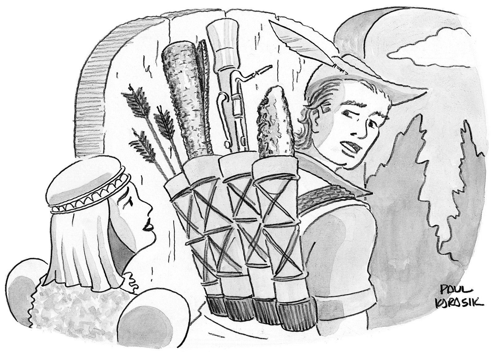

Once you’ve thanked and said goodbye to the items that do not spark joy, what can you do with them?

一旦你感谢并告别了那些不会激发快乐的物品，你能用它们做什么？

Lately, I, a maximalist, have been yearning to be a minimalist. I am not alone. “People are stuck in their houses and sick of their stuff,” Randy Sabin, who runs estate and Internet sales, told me over the phone from Morris, Connecticut. “It’s staring them in the face. They have to dust it.” A survey conducted by the storage marketplace Neighbor found that quasi-house arrest has made seventy-eight per cent of respondents realize that they have more possessions than they need. What to do with this First World surplus? Your children don’t want it. The son of a friend, when offered his pick of items from his grandfather’s estate—an antique clock? an Emmy?—took a toilet plunger. In my apartment, it’s got so cluttered that sometimes, when I leave—usually to acquire more stuff—it crosses my mind that I should leave a “Dear Burglar” note, urging the intruder to help herself.

最近，我这个极简主义者一直渴望成为极简主义者。 我并不孤单。 “人们被困在自己的房子里，厌倦了他们的东西，”经营房地产和互联网销售的兰迪萨宾在康涅狄格州莫里斯通过电话告诉我。 “它正盯着他们的脸。 他们必须除尘。” 存储市场 Neighbor 进行的一项调查发现，准软禁让 78% 的受访者意识到他们拥有的财产比他们需要的多。 如何处理第一世界的盈余？ 你的孩子不想要它。 一个朋友的儿子，当他从他祖父的遗产中挑选一件古董钟表时？ 艾美奖？——拿了一个马桶塞。 在我的公寓里，它变得如此混乱，以至于有时，当我离开时——通常是为了获得更多的东西——我会想到我应该留下一张“亲爱的窃贼”字条，敦促入侵者自救。

A few months ago, I decided to deaccession an assortment of my things by whatever means feasible: selling, donating, recycling, giving them away, losing them on the subway, or reserving a spot for them on the next Mars Explorer. I gathered my unwanteds and piled them in the living room. A fraction of what was in that jumble: seven antique glass cake stands that belonged to my mother; a dormitory’s worth of new sheet sets and blankets for a bed size that is not mine; a set of Lenox china that my grandmother gave to my mother, who gave it to me, and was never used; clothes galore; a Viking stove grate that arrived cracked, and which I saved because I planned to weld it into a sculpture someday, after I learned how to weld; several rolls of Trump toilet paper that I wrongly thought were amusing a few years ago. I wish I could have added my boyfriend’s too large Le Corbusier lounger. (There are Web sites, such as NeverLikedItAnyway.com, that will buy your ex’s leavings, ranging from engagement rings to “Rick and Morty” socks.)

几个月前，我决定通过任何可行的方式出售我的各种东西：出售、捐赠、回收、赠送、在地铁上丢失，或者在下一个火星探索者号上为它们预留位置。 我收集了不需要的东西，把它们堆在客厅里。 那堆东西的一小部分：属于我母亲的七个古董玻璃蛋糕架； 一个宿舍的新床单和毯子，适合不是我的床尺寸； 我祖母送给我母亲的一套 Lenox 瓷器，她又给了我，但从未使用过； 衣服多； 一个维京炉子的炉排到货时开裂了，我把它留了下来，因为我打算在学会焊接之后，有一天把它焊接成一个雕塑； 几年前我误以为很好笑的几卷特朗普卫生纸。 我希望我可以添加我男朋友的 Le Corbusier 太大的躺椅。 （有些网站，例如 NeverLikedItAnyway.com，会购买你前任的遗物，从订婚戒指到“瑞克和莫蒂”的袜子。）

Some will have you believe that the hardest part of parting with your belongings is choosing which items must go. Not so; saying goodbye is easy. Finding new homes for your stuff is the challenge. In December, a Brooklyn woman offered the entire contents of her closet (more than fifty pieces) to her online neighborhood network, much of it gratis. A month later, lots of her clothes were still available. Turns out people prefer cheap to free.

有些人会让您相信，与您的物品分开时最困难的部分是选择必须离开的物品。 不是这样； 说再见很容易。 为您的物品寻找新家是一项挑战。 去年 12 月，一位布鲁克林妇女向她的在线社区网络提供了她衣橱里的全部物品（超过 50 件），其中大部分是免费的。 一个月后，她的很多衣服仍然可以买到。 事实证明，人们更喜欢便宜而不是免费。

If Melania Trump can auction off the big white hat she wore when she met the Macrons (plus a watercolor of her in the hat and an N.F.T. of that watercolor) for a hundred and seventy thousand dollars, don’t we all deserve a little something for our castoffs?

如果梅拉尼娅特朗普能以十七万美元的价格拍卖她遇到马克龙时戴的大白帽子（加上她在帽子上的水彩画和那幅水彩画的 NFT），难道我们都应该得到一点东西吗为了我们的弃儿？

TIP No. 1: Life is not “Antiques Roadshow.” The thingies you found in your grandfather’s drawer after he died are his dentures, not a valuable Jurassic-age fossil.

提示 1：生活不是“古董路演”。 你祖父死后在他的抽屉里找到的东西是他的假牙，而不是有价值的侏罗纪时代化石。

The first thing I tried to unload was four folk-art handbags, each constructed out of braided cigarette-pack wrappers by incarcerated Americans in the nineteen-fifties and sixties. I’d amassed the collection in the nineties, on eBay, for reasons that now elude me. I consulted with Stan Jennings, a retired postal worker, for guidance on selling them. Jennings has been selling goods on eBay and Etsy for clients since 1998. I asked him: Should I list the purses as a group or individually? If you offer them as a package deal, he explained, you’ll lose collectors, who prefer to cherry-pick; your likely buyer will be a dealer interested in reselling, and who therefore won’t offer much. Should I auction the purse or sell it at a fixed price? For unique, rare, or high-demand items, Jennings said, choose the former—and hope for a bidding war. If items are readily available, go for the latter, which allows impulsive buyers to snatch them at the click of a button. (According to Don Heiden, who runs the Auction Professor channel on YouTube, fixed-price “Buy It Now” items tend to fetch a higher price than those at auctions.) Any particular words one should use in the description? “Unique.” “Conversation piece.” “Smoke-free home.”

我试图卸下的第一件东西是四个民间艺术手提包，每个手提包都是用 19 世纪 50 年代和 60 年代被监禁的美国人编织的香烟包装纸制成的。 我在 90 年代在 eBay 上收集了这些收藏品，但现在我想不通。 我咨询了退休邮递员斯坦·詹宁斯 (Stan Jennings)，以获取有关出售它们的指导。 自 1998 年以来，詹宁斯一直在 eBay 和 Etsy 上为客户销售商品。我问他：我应该将钱包作为一个整体列出还是单独列出？ 他解释说，如果你将它们作为一揽子交易提供，你就会失去喜欢挑选的收藏家； 您可能的买家将是对转售感兴趣的经销商，因此他们不会提供太多。 我应该拍卖钱包还是以固定价格出售？ 詹宁斯说，对于独特的、稀有的或高需求的物品，选择前者——并希望进行一场竞价战。 如果物品一应俱全，就选择后者，这样一来，冲动的买家只需点击一下按钮就可以抢走它们。 （根据在 YouTube 上经营拍卖教授频道的 Don Heiden 的说法，固定价格的“立即购买”物品往往比拍卖的价格更高。）在描述中应该使用哪些特定的词？ “独特的。” “谈话片。” “无烟之家。”

TIP No. 2: A good story can clinch a sale.

提示 2：好的故事可以促成销售。

Include the provenance and a heartwarming anecdote in your description. “This dried filbert nut,” you might say, “was Napoleon’s lucky charm. He carried the shell in his pocket during the Battle of Austerlitz and credits it with his victory.” Without that narrative, the nut is just a nut. As to why you are getting rid of this valuable heirloom, it behooves you to explain. Received one just like it last Arbor Day? Downsizing? Nut allergy?

在您的描述中包括出处和感人的轶事。 “这种干榛子，”你可能会说，“是拿破仑的幸运符。 在奥斯特里茨战役期间，他将贝壳装在口袋里，并将胜利归功于它。” 没有这种叙述，坚果只是一个坚果。 至于你为什么要处理掉这件珍贵的传家宝，你应该解释一下。 收到一个和去年植树节一样的？ 裁员？ 坚果过敏？

My “Vintage Tramp Art Cigarette Pack Wrapper purse prison inmates 1960’s” was put up on eBay (“. . . a piece of history . . .”) for the site’s hundred and fifty-two million buyers for seventy-five dollars. I’d bought it for about that much. (Listing is free on eBay for your first two hundred and fifty items each month; the fee on sales for most categories is 12.55 per cent.) No offers. I added “Collectible” to the title and lowered the price to sixty-five dollars. Still no offers. I tried my luck on Etsy, a site that specializes in crafts, handmade jewelry, wedding accoutrements such as veils, vintage anything, and decorative stickers. If the TV show “Portlandia” were a Web site, it would be Etsy. (Twenty-cent listing fee; five-per-cent transaction charge.) No takers.

我的“Vintage Tramp Art Cigarette Pack Wrapper purse prison prisones 1960's”以 75 美元的价格在 eBay 上发布（“……一段历史……”），该网站有 1.52 亿买家。 我花了大约那么多钱买了它。 （每月前 250 件商品在 eBay 上免费刊登；大多数类别的销售费用为 12.55%。）没有报价。 我在标题中添加了“收藏品”，并将价格降至 65 美元。 仍然没有报价。 我在 Etsy 上碰了碰运气，这是一个专门销售手工艺品、手工珠宝、面纱等婚礼装备、古董和装饰贴纸的网站。 如果电视节目“Portlandia”是一个网站，那么它就是 Etsy。 （20% 的上市费；5% 的交易费。）没有接受者。

I shifted my attention to the heaps of clothes that looked better on my couch than on me. There are plenty of eBay alternatives specializing in schmatta. Depop is the cool-kids’ table in the cafeteria of e-commerce. Ninety per cent of the app’s users are twenty-five or younger, and the merchandise reflects this demographic: a goth corset bustier with boning (seventy-five dollars); a plush phone case in the shape of a panda (twenty-three dollars); rollerblades (twenty-two dollars and ninety-nine cents), with many items styled into ensembles. (Depop takes ten per cent of every item sold.) Poshmark, frequented by a slightly older buyer, sees itself as not merely a selling tool but also as a social stomping ground. Throughout the day, there are Posh Parties—virtual shopping events organized by sellers around certain themes: “Everything Petite Posh Party,” “Wow-Worthy Wardrobe Posh Party,” “Clothes I’m Now Too Fat to Wear” (I made that one up). During these virtual gatherings, members are encouraged to mingle. Here is some representative banter from a cosmetics Posh party: “😃👍Congrats on your HOST PICK!! I’m sharing with my followers and hope for a sale for you!! . . . . . . 🤑💵💥CHA-CHING!!💥💵🤑 💚❤️💙🧡💜💚❤️💙🧡💜💚❤️💙🧡💜 🥳🎉🎈🥳🎉🎈🥳🎉🎈🥳🎉🎈 💚❤️💙🧡💜💚❤️” No thank you, Poshmark; all my friend slots are taken. (Twenty-per-cent commission for items over fifteen dollars.)

我把注意力转移到沙发上看起来比我身上好看的一堆衣服上。 有很多专门从事 schmatta 的 eBay 替代品。 Depop是电商食堂里的酷儿桌。 该应用程序 90% 的用户年龄在 25 岁或以下，商品反映了这一人群：带去骨的哥特紧身胸衣（75 美元）； 熊猫形状的毛绒手机壳（23 美元）； 旱冰鞋（22 美元 99 美分），许多物品都设计成套装。 （Depop 抽取每件售出商品的 10%。）Poshmark 是一位年龄稍大的买家经常光顾的地方，它不仅将自己视为一种销售工具，而且还是一个社交平台。 一整天，都有豪华派对——由卖家围绕特定主题组织的虚拟购物活动：“一切娇小的豪华派对”、“令人惊叹的衣橱豪华派对”、“我现在太胖不能穿的衣服”（我做的那个一个）。 在这些虚拟聚会中，鼓励成员交流。 以下是来自化妆品豪华派对的一些具有代表性的玩笑：“😃👍恭喜你获得了 HOST PICK！！ 我正在与我的追随者分享，希望能为您出售！！ . . . . . . 🤑💵💥cha-ching !!💥💵🤑💚❤️💙🧡💜💚❤️💙🧡💜💚❤️💙🧡💜💚❤️💙🧡💜💙🧡💜️波什马克； 我所有的朋友插槽都被占用了。 （超过 15 美元的商品收取 20% 的佣金。）

Are you the type who still ventures outdoors? The most expeditious way to discover whether your whatnot is worth something or nothing is to visit an actual consignment shop in an actual building. Not long ago, I lugged a few bags to La Boutique Resale, an establishment that occupies the second and third floors of a brownstone on Madison Avenue. Frank Aquino, a co-owner, scrutinized each of my offerings with the intensity of an F.D.A. inspector checking a hamburger patty for E. coli: a fur hat was found to have a small but fatal stain on the grosgrain interior band; a pair of beige linen Manolo Blahniks lacked enough of what Aquino called the “wow” factor; the dominant color in a clutch bag—let’s call it Grey Poupon—was unappreciated. I took home a receipt for four items (two scarves, a Krizia tweed suit, and a stingray-skin evening bag; respectively, forty-nine and fifty-nine dollars, a hundred and fifty dollars, eighty dollars). I’ll receive half of whatever sells within ninety days.

你是那种还在户外冒险的人吗？ 发现你的东西是否值钱或一文不值的最快捷方法是访问实际建筑物中的实际寄售店。 不久前，我拖着几个包去了 La Boutique Resale，这是一家位于麦迪逊大街上褐砂石建筑二楼和三楼的商店。 共同所有者弗兰克·阿基诺 (Frank Aquino) 仔细检查了我的每一件产品，其检查员的强度就像 FDA 检查员检查汉堡肉饼中是否存在大肠杆菌一样：发现一顶皮帽的罗缎内带上有一个小而致命的污渍； 一双米色亚麻 Manolo Blahniks 缺乏阿基诺所说的“哇”因素； 手拿包中的主色调——我们称它为 Gray Poupon——没有受到重视。 我拿回了一张四件商品的收据（两条围巾、一套 Krizia 粗花呢西装和一个黄貂鱼皮晚装包；分别是四十九美元和五十九美元、一百五十美元、八十美元）。 九十天内，我将收到销售的一半。

Closer to home—wherever you may live—you can sell your stuff to your neighbors via one of many online garage-sale platforms. I tried two of them—Craigslist and Facebook Marketplace. According to Jessa Lingel, the author of “An Internet for the People: The Politics and Promise of Craigslist,” they represent two different models of the shared economy. Craigslist has, by intention, remained a snapshot of the Internet from the nineties, a time when Web sites were less about making money than about fostering community. Craigslist has not gone public and has made only a small profit since its beginnings, compared with Facebook, which made eighty-six billion dollars in 2020, the vast majority in targeted ads. When you get rid of a couch on Craigslist, you are getting rid of a couch; when you get rid of a couch on Facebook, you may be saying goodbye to your data, too.

在离家更近的地方——无论你住在哪里——你都可以通过众多在线车库销售平台之一将你的东西卖给你的邻居。 我尝试了其中的两个——Craigslist 和 Facebook Marketplace。 根据《为人民服务的互联网：Craigslist 的政治和前景》一书的作者杰萨·林格尔 (Jessa Lingel) 的说法，它们代表了共享经济的两种不同模式。 Craigslist 有意保留了 90 年代互联网的缩影，那个时代的网站与其说是为了赚钱，不如说是为了培养社区。 与 Facebook 相比，Craigslist 尚未上市，自成立以来仅赚取了微薄利润，Facebook 在 2020 年赚取了 860 亿美元，其中绝大部分来自定向广告。 当你在 Craigslist 上摆脱沙发时，你就是在摆脱沙发； 当你摆脱 Facebook 上的沙发时，你可能也在和你的数据说再见。

I listed thirteen items on Facebook Marketplace and Craigslist, and sold seven. Here’s what I learned: When it’s cold out, cozy bed linens sell like hotcakes. The transactions were speedy, and there were no commissions and no shipping fees, since the lucky winners pick up their acquisitions at a mutually convenient spot—for instance, the lobby of my apartment building. A nurse from Queens sent me a photograph of my erstwhile bowl displayed on her shelf, and the woman who came for the microfibre sheet set followed up with a thank-you message that included details of her sister’s weight-loss journey. It is the closest an adult can come to having a lemonade stand.

我在 Facebook Marketplace 和 Craigslist 上列出了 13 件商品，并卖出了 7 件。 这是我学到的东西：天气寒冷时，舒适的床上用品会像烤饼一样畅销。 交易速度很快，没有佣金，也没有运费，因为幸运的获胜者会在双方都方便的地点领取他们的物品——例如，我公寓大楼的大厅。 一位来自皇后区的护士给我发了一张我以前用过的碗的照片，照片放在她的架子上，那位来拿超细纤维床单套装的女士随后发了一条感谢信息，其中包括她姐姐减肥之旅的细节。 这是最接近成年人的柠檬水摊。

On the other hand, you’d probably make more money per hour by babysitting. My niece set out to sell a bunch of things that she’d used at her wedding. She started by listing a water cooler—original price twenty-five dollars—on Facebook Marketplace. “I received ten-plus inquiries, but many turned out to be no-shows and others tried to haggle,” she told me. “One guy asked, ‘Can you do it for seven?’ I had to coördinate a pickup time and place, and arrange for payment, and it was a huge hassle. I ended up deciding to give everything else away because it felt like way too much work for seven dollars.”

另一方面，你可能会通过保姆每小时赚更多的钱。 我的侄女打算卖掉她在婚礼上用过的一堆东西。 她首先在 Facebook Marketplace 上列出了一个饮水机——原价 25 美元。 “我收到了十多个询问，但很多都没有出现，还有一些人试图讨价还价，”她告诉我。 “一个人问，'你能做到七点吗？' 我不得不协调取件时间和地点，并安排付款，这是一个巨大的麻烦。 我最终决定放弃其他所有东西，因为感觉七美元的工作量太大了。”

The gift economy—a system whereby goods are not sold but given away—has been around for as long as we’ve had things. Native Americans from the Northwest Pacific Coast held potlatch feasts at which property and goods were lavished upon neighboring tribes, mainly for the purpose of showing off wealth. Today, among the seventy per cent of respondents who said they got rid of stuff during quarantine, the majority donated them, according to Neighbor, a site billed as “the Airbnb of storage,” which enables you to rent space in neighbors’ houses to store your junk. (Who are these people with extra closets? I hate them.) The reasons for donating are manifold, ranging from the goodness of your heart to the goodness of a tax writeoff.

自从我们有东西以来，礼物经济——一种不出售而是赠送商品的系统——一直存在。 来自西北太平洋沿岸的美洲原住民举办夸富宴，向邻近部落挥霍财产和货物，主要是为了炫耀财富。 据 Neighbor 称，如今，在 70% 表示他们在隔离期间丢弃了东西的受访者中，大多数人捐赠了它们存放你的垃圾。 （这些有额外壁橱的人是谁？我讨厌他们。）捐赠的原因是多方面的，从你内心的善意到减税的善意。

Let’s start with Freecycle and the Buy Nothing Project, two worldwide social networks (more than nine million and five million members, respectively) that operate on the local level, where members give away items they no longer want and request others that they are looking for. If you like extremely short stories, the entries on both these apps are rich with drama:

让我们从 Freecycle 和 Buy Nothing Project 开始，这两个全球社交网络（分别有超过 900 万和 500 万会员）在地方层面运营，会员在其中赠送他们不再想要的物品并向其他人索取他们正在寻找的物品. 如果您喜欢极短的故事，那么这两个应用程序上的条目都充满了戏剧性：

> “My mother-in-law insisted I needed these jewelry boxes, but I really don’t. Do you?”
> 
> “我的婆婆坚持我需要这些首饰盒，但我真的不需要。 你？”
> 
> “Spray starch, typically used for Men’s shirts. Feels full. I think this might be left over from a former relationship. It should also move on.”
> 
> “喷淀粉，通常用于男式衬衫。 感觉很饱。 我认为这可能是以前的关系遗留下来的。 它也应该继续前进。”
> 
> “We were totally unprepared for the possibility of our baby deciding to want out a few weeks ahead (on our living room floor into her father’s hands, no big deal) . . . . If anyone has preemie clothing/items they no longer need to help carry us the next few weeks to when she’s hopefully grown enough to fit into what we have, I would be so grateful.”
> 
> “我们完全没有准备好让我们的孩子提前几周决定离开（在我们客厅的地板上交给她父亲，没什么大不了的）。 . . . 如果有人有早产儿的衣服/物品，他们在接下来的几周内不再需要帮助携带我们，希望她长大到足以适应我们所拥有的东西时，我将非常感激。”

TIP No. 3: If you want to give away an assortment of things online, stipulate that the winner takes all. Otherwise, someone will cherry-pick the Makita cordless drill and leave you with the rusty files, mauve bed skirt, and avocado slicer.

提示 3：如果您想在网上赠送各种各样的东西，请规定赢家通吃。 否则，有人会挑选 Makita 无绳电钻，把生锈的锉刀、紫红色床裙和鳄梨切片机留给你。

Nobody on Craigslist, I discovered, cared to pay five dollars for three rolls of Trump toilet paper, still in the package. Over on Freecycle, there were seven requests within two days of my posting, plus one inquiry about whether I had any Biden toilet paper. A number of Buy Nothing members were interested in my good-as-new copy of “The Intelligent Person’s Guide to Giving in New York City: How to Donate or Recycle Everything,” by Lynn Savarese, published twelve years ago.

我发现，Craigslist 上没有人愿意花 5 美元购买三卷仍在包装中的特朗普卫生纸。 在 Freecycle 上，在我发帖后的两天内收到了 7 个请求，另外还有一个关于我是否有拜登厕纸的询问。 许多 Buy Nothing 会员对我的新书“纽约市聪明人捐赠指南：如何捐赠或回收一切”感兴趣，作者是 Lynn Savarese，该书于 12 年前出版。

“I’m robbing the Sheriff of Nottingham’s coach at ten-thirty. Then yoga at noon. Followed by my bassoon lesson. The baguette is for lunch.”

“我在十点三十分抢了诺丁汉警长的马车。 然后中午练瑜伽。 接下来是我的巴松管课。 法式面包是午餐吃的。”

Cartoon by Paul Karasik

保罗·卡拉西克 (Paul Karasik) 的卡通片

The etiquette governing whom to select among multiple suitors is discussed with Talmudic rigor on Buy Nothing message boards. Some favor letting the offer “simmer” (a Buy Nothing term), so that you have an opportunity to spend quality online time conversing with more neighbors. Others allow a Web site called Wheel of Names to randomly choose a winner. Then, there are those who ask would-be recipients to describe how they plan to use your gift, so that you can pick the most compelling story. Bear in mind that the object under discussion could, for example, be a partially consumed tub of cheese balls.

在 Buy Nothing 留言板上以 Talmudic 的严谨性讨论了在多个追求者中选择谁的礼节。 一些人赞成让报价“酝酿”（“什么都不买”的术语），这样您就有机会花优质的在线时间与更多邻居交谈。 其他人允许名为 Wheel of Names 的网站随机选择获胜者。 然后，有些人会要求潜在的接受者描述他们打算如何使用你的礼物，这样你就可以挑选出最引人入胜的故事。 请记住，所讨论的对象可能是一桶部分食用完的奶酪球。

For those who would like to give less interactively and more anonymously, there are innumerable worthy charities. Goodwill was founded in 1902 by a Boston minister who collected goods from the rich, hired the poor to mend them, and then either sold them back to the rich or gave them to the poor. Today, Goodwill has more than three thousand stores across the country. Most of them are willing to take just about anything you’d give to a friend. The Free Store Project will accept most things except furniture, and you’re welcome to permanently borrow what’s there. (“Take what you need. Give when you can” is the slogan of this place; open 24/7; more than a dozen locations, across Manhattan, Queens, and Brooklyn.) There are lots of other obscure, specialized organizations. For instance, all those old, unusable mascara wands in your bathroom cabinet? Mail them to Wands for Wildlife, a nonprofit that started off as a program at the Appalachian Wildlife Refuge, in North Carolina. These will be shared with wildlife caretakers to comb away fly eggs, dirt, fleas, ticks, and larvae from the wings of birds and the fur of animals (wandsforwildlife.org). Fur coat? It is said that nobody wants fur these days, but animals do. Rehabilitators, like those at Sacred Friends, in Norfolk, Virginia, cut up old coats and use the scraps as little capes and stoles to keep sick animals warm (1sthawksnest@gmail.com). PETA wants your pelts, too. The organization donates them to the homeless (“the only humans with any excuse to wear fur,” according to its Web site), and lately it has shipped fur garments to Afghanistan and Iraq for use by refugees.

对于那些想要更少互动和更多匿名捐赠的人来说，有无数有价值的慈善机构。 Goodwill 由一位波士顿牧师于 1902 年创立，他从富人那里收集商品，雇用穷人修理它们，然后将它们卖回给富人或送给穷人。 如今，商誉在全国拥有三千多家门店。 他们中的大多数人都愿意接受你送给朋友的任何东西。 免费商店项目将接受除家具以外的大部分物品，欢迎您永久借用其中的物品。 （“拿走你需要的。尽可能给予”是这个地方的口号；全天候开放；在曼哈顿、皇后区和布鲁克林有十几个地点。）还有许多其他不知名的专业组织。 例如，浴室柜中所有那些旧的、无法使用的睫毛膏棒？ 将它们邮寄给 Wands for Wildlife，这是一个非营利组织，最初是北卡罗来纳州阿巴拉契亚野生动物保护区的一个项目。 这些将与野生动物管理员共享，以清除鸟类翅膀和动物皮毛上的飞蛋、污垢、跳蚤、蜱虫和幼虫 (wandsforwildlife.org)。 皮毛大衣？ 据说如今没有人想要毛皮，但动物却想要。 康复者，例如弗吉尼亚州诺福克的 Sacred Friends 的康复者，将旧外套剪裁成小斗篷和披肩，为生病的动物保暖 (1sthawksnest@gmail.com)。 PETA 也想要您的毛皮。 该组织将它们捐赠给无家可归者（“唯一有理由穿皮草的人”，据其网站称），最近它已将皮草服装运往阿富汗和伊拉克供难民使用。

St. Jude’s Ranch for Children will accept any greeting cards, used or new, that you mail to the organization—except Hallmark, American Greetings, and Disney cards. Blame copyright laws. (100 St. Jude’s St., Boulder City, NV 89005.) That piano you thought you were going to play? Give it to someone who really will, or so he thinks (pianoadoption.com/free-pianos/). Never getting married again? Cash for your wedding dress here: stillwhite.com. Your old bras are welcomed with open arms at the Bra Recyclers, a Phoenix-based enterprise that has sent more than four million bras to homeless shelters, schools, foster programs, and other nonprofits all over the world. As Elaine Birks-Mitchell, the founder of the Bra Recyclers, explained to me over Zoom, bras are not just about fashion. For girls in developing countries, they make it possible to play sports and attend school without embarrassment.

St. Jude's Ranch for Children 将接受您邮寄给该组织的任何新旧贺卡——Hallmark、American Greetings 和 Disney 贺卡除外。 责怪版权法。 （100 St. Jude's St., Boulder City, NV 89005。）您认为您要弹奏的那架钢琴？ 把它送给真正愿意的人，或者他认为是这样的人 (pianoadoption.com/free-pianos/)。 永远不会再结婚？ 在这里为您的婚纱换取现金：stillwhite.com。 Bra Recyclers 会张开双臂欢迎您的旧文胸，这是一家总部位于凤凰城的企业，已向世界各地的无家可归者收容所、学校、寄养项目和其他非营利组织发送了超过 400 万件文胸。 正如 Bra Recyclers 的创始人 Elaine Birks-Mitchell 在 Zoom 上向我解释的那样，文胸不仅仅是时尚。 对于发展中国家的女孩来说，她们可以毫无尴尬地参加体育运动和上学。

What to do with your nine-foot-tall resin giraffe? The people at Burberry donate theirs, along with a couple of gorillas and some toucans (all are retired store displays) to Materials for the Arts—the largest creative-reuse center in New York City. The goal of the center, founded in 1978, is to provide art supplies to schools and creative types in underserved communities. Feel free to visit the organization’s thirty-five-thousand-square-foot warehouse in Long Island City to drop off your buttons and beads and bric-a-brac, where they will join an array of Winsor & Newton markers, jars from makeup manufacturers, Flavor Paper wallpaper, artificial Christmas trees, orange jumpsuits from “Orange Is the New Black,” office chairs from Bloomberg—and, soon, the broken grate from my Viking stove.

如何处理你的九英尺高的树脂长颈鹿？ Burberry 的员工将他们的作品连同几只大猩猩和一些巨嘴鸟（全部都是退役的商店陈列品）捐赠给纽约市最大的创意再利用中心 Materials for the Arts。 该中心成立于 1978 年，其目标是为服务欠缺社区的学校和创意类型提供艺术用品。 欢迎参观该组织位于长岛市的 35000 平方英尺的仓库，放下您的纽扣、珠子和小摆设，它们将加入一系列温莎牛顿记号笔、化妆品制造商的罐子、风味纸壁纸、人造圣诞树、“橙色是新的黑色”中的橙色连身衣、彭博社的办公椅——很快，我的维京炉子上的炉排也坏了。

Another good place to donate: the sidewalks of New York and many other cities function as smorgasbords of secondhand goods. A sofa that I couldn’t give away online was snagged an hour after I left it at the curb. The Instagram account StoopingNYC photographically chronicles what’s up for grabs on the streets in all five boroughs. No mattresses, though, since every city dweller fears bedbugs more than the Delta variant.

另一个捐赠的好地方：纽约和许多其他城市的人行道是二手商品的大杂烩。 我无法在网上赠送的一张沙发在我把它留在路边一个小时后就被抢走了。 Instagram 帐户 StoopingNYC 用照片记录了所有五个行政区街头抢手货。 不过，没有床垫，因为每个城市居民都比 Delta 版本更害怕臭虫。

In the New York area, Renewable Recycling will pick up your mattress for a modest fee and repurpose its components, turning the padding into cushion fillings, the springs into appliances, and the wood frames into mulch. To find a taker or hauler near you, consult the listings on ByeByeMattress.com and Earth911.com. If you have too many corks from wine bottles lying around, maybe recycling isn’t your biggest problem. Nevertheless, two companies, ReCORK and the Cork Forest Conservation Alliance, will take your bottle stoppers, and make sure they find an afterlife in shoes, fishing tackle, model-train tracks, and more.

在纽约地区，Renewable Recycling 将以适度的费用收取您的床垫并重新利用其组件，将填充物变成坐垫填充物，将弹簧变成电器，将木框架变成覆盖物。 要找到您附近的承运人或搬运工，请查阅 ByeByeMattress.com 和 Earth911.com 上的列表。 如果你周围有太多酒瓶的软木塞，也许回收不是你最大的问题。 尽管如此，ReCORK 和 Cork Forest Conservation Alliance 两家公司将带走您的瓶塞，并确保他们在鞋子、渔具、模型火车轨道等方面找到来生。

Electronics deserves its own paragraph, given that e-waste is “the fastest growing waste stream in the world,” according to the World Economic Forum. Always looking out for herself, Alexa informs me that it’s illegal to throw out electronics in many states. Yet more than fifty million tons of the stuff is produced every year and only twenty per cent of it is formally recycled. (If you like to measure everything in Eiffel Towers, that’s the equivalent of about five thousand of them.) Better to give your old tech items to Computers with Causes, which passes them on to people and organizations that need them, or to World Computer Exchange, an organization that refurbishes computers and then donates them to schools, libraries, community centers, and hospitals in developing countries (computerswithcauses.org; worldcomputerexchange.org). If you’d rather sell your devices, Decluttr will give you cash; Amazon’s trade-in program will compensate you in Amazon gift cards; and SellCell compares more than forty buyback companies so that you can get the most cash for your cell phone.

根据世界经济论坛的说法，鉴于电子垃圾是“世界上增长最快的垃圾流”，因此电子产品值得一提。 总是照顾自己的 Alexa 告诉我，在许多州扔掉电子产品是违法的。 然而，每年生产的材料超过 5000 万吨，其中只有 20% 被正式回收。 （如果你想测量埃菲尔铁塔中的所有东西，那相当于大约五千个。）最好将你的旧技术项目交给 Computers with Causes，后者将它们传递给需要它们的人和组织，或者 World Computer Exchange，一个翻新计算机然后将它们捐赠给发展中国家的学校、图书馆、社区中心和医院的组织（computerswithcauses.org；worldcomputerexchange.org）。 如果你宁愿卖掉你的设备，Decluttr 会给你现金； 亚马逊的以旧换新计划将以亚马逊礼品卡的形式补偿您； 和SellCell对比四十多家回购公司，让你的手机拿到最多的现金。

Finally we come to the heavy, bulky crapola, especially furniture, that is prohibitively expensive to ship, and not much fun to drag to a thrift shop. Most of it arrived in trucks and, I am happy to report, some of it can be taken away in trucks. There are many junk-removal services (1-800-Got-Junk?, Junk King, College HUNKS Hauling Junk & Moving), but I’m partial to the Junkluggers, because once it showed up with two trucks and swooped up mountains of castoffs (including a parking meter) from my boyfriend’s storage unit; so far, the junk has never come back. (It charges around nine hundred to a thousand dollars to remove a truckful in the New York area.) Moreover, the organization tries its darndest to donate your junk to charity and give you a tax-deductible receipt. GreenDrop, which may sound like a square on the Candy Land board, is a donation dropoff-and-pickup service that serves the East Coast. You can designate which of the handful of charities it partners with you’d like your flotsam and jetsam delivered to. The organization accepts kitchenware, games, books, and small appliances and furniture. If you live somewhere outside the GreenDrop domain, you can consult the directory on the Donation Town Web site which suggests charities nationwide that pick up in or nearest your Zip Code (Donationtown.org). Other organizations that just might come for your stuff include Habitat for Humanity ReStores (home goods, including air-conditioners); and Pickup Please (easy-to-arrange scheduling and pickups, usually within twenty-four hours of request; helps American veterans).

最后，我们来到笨重的 crapola，尤其是家具，运输成本高得令人望而却步，拖到旧货店也没什么意思。 其中大部分是用卡车运来的，我很高兴地报告，其中一些可以用卡车运走。 有很多垃圾清除服务（1-800-Got-Junk?、Junk King、College HUNKS Hauling Junk & Moving），但我偏爱 Junkluggers，因为一旦它带着两辆卡车出现并冲上大山我男朋友储藏室的废弃物（包括停车计时器）； 到目前为止，垃圾再也没有回来。 （在纽约地区运走一卡车垃圾大约需要九百到一千美元。）此外，该组织会尽最大努力将您的垃圾捐给慈善机构，并给您一张免税收据。 GreenDrop 听起来像是 Candy Land 板上的一个正方形，是一项服务于东海岸的捐赠接送服务。 您可以指定它与您合作的少数慈善机构中的哪些，您希望将您的漂浮物和jetsam 交付给。 该组织接受厨具、游戏、书籍、小家电和家具。 如果您居住在 GreenDrop 域之外的某个地方，您可以查阅 Donation Town 网站上的目录，该网站建议全国范围内的慈善机构在您的邮政编码 (Donationtown.org) 或附近接收。 其他可能会为您的东西而来的组织包括 Habitat for Humanity ReStores（家居用品，包括空调）； 和 Pickup Please（易于安排的日程安排和接送，通常在请求后 24 小时内完成；帮助美国退伍军人）。

Schedule permitting, volunteers at the House of Good Deeds, in New York City, will pick up whatever you have to give, in its graffiti-covered van or school bus. The aims of this nonprofit are to help those in need and to keep as much as possible out of landfills. The charity was started, in 2017, by Leon Feingold and his fiancée, Yuanyuan Wang, who was given a diagnosis of terminal endometrial cancer a few days after the couple became engaged. They were so moved by the kindness of strangers and friends, who, responding to a social-media post, helped not only with medical bills but also with all the wedding costs, that Feingold and Wang created the House of Good Deeds. Wang died shortly after the wedding, but the charity has flourished. Since its founding, there have been regular giveaway events, at which everyone is encouraged to take whatever he or she desires rather than leaving it for a hypothetical person who might need it more, and then to reciprocate the gesture later. “Let’s say Bill Gates saw a belt buckle he liked,” Feingold told me over the phone. “We’d want him to take it and pay it forward.” Has Gates ever come to an event? “Not yet, but he’s welcome to the belt buckle.” Donations can be dropped off 24/7 at the House of Good Deeds office, which is also Feingold’s apartment. If Feingold is away or asleep, you can leave them with the doorman (1 River Place, Suite 1406, New York, New York; 917-325-4548).

如果时间允许，纽约市善行之家的志愿者将乘坐满是涂鸦的货车或校车领取您必须提供的任何东西。 这个非营利组织的目标是帮助有需要的人，并尽可能远离垃圾填埋场。 该慈善机构于 2017 年由 Leon Feingold 和他的未婚妻王媛媛发起，他们在订婚几天后被诊断出患有晚期子宫内膜癌。 他们被陌生人和朋友的善意所感动，他们在社交媒体上回复了一条帖子，不仅帮助支付医疗费用，还帮助支付所有婚礼费用，因此法因戈尔德和王创建了善行之家。 婚礼后不久王就去世了，但慈善事业却蓬勃发展。 自成立以来，一直定期举办赠品活动，鼓励每个人拿走他或她想要的任何东西，而不是将它留给可能更需要它的假设人，然后再做出回报。 “比方说，比尔盖茨看到了一个他喜欢的皮带扣，”范戈尔德在电话中告诉我。 “我们希望他接受并支付。” 盖茨参加过活动吗？ “还没有，但欢迎他使用皮带扣。” 捐款可以 24/7 全天候送到善行之家办公室，该办公室也是 Feingold 的公寓。 如果 Feingold 不在或睡着了，您可以将它们交给门卫（1 River Place, Suite 1406, New York, New York；917-325-4548）。

People divesting themselves of quantities of books (and this applies to LPs, too) often start by thinking, Oh, boy, I’m going to make so much money selling these precious volumes!, and end up saying, “I will pay you any amount of money to take this shit off my hands.” A friend who specializes in rare books at a big auction house told me, “I get calls all the time from people who say, ‘I have four thousand books, and I think they’re valuable.’ My first thought is: No, they’re not. Usually, if a collection is valuable someone knows.” To determine how much a single book will go for (not what you’ll get for it), check the price of similar books on a site, such as AbeBooks, Alibris, or Biblio. If you have a huge library, Michael Pyron, a bookbinder and bookseller in Conshohocken, Pennsylvania, suggests putting together a representative box and taking it to a bookseller, who can then decide whether your collection warrants a house call. The Strand, in Manhattan, will accept walk-ins of up to forty books and will give you cash. (If you’d prefer store credit, you’ll earn fifty per cent more.) As to what types of books are accepted, Billy Mowbray, who co-manages the buying desk, e-mailed to say that “a good guideline for most subjects is going to be titles which are considered classics or those published within the past year.”

人们放弃大量书籍（这也适用于 LP）通常会开始想，哦，天哪，我要卖这些珍贵的书赚很多钱！，最后说，“我会付钱给你多少钱都可以把这狗屎从我手中拿走。” 一位在大型拍卖行专门从事珍本书籍的朋友告诉我，“我经常接到人的电话，他们说，‘我有四千本书，我认为它们很有价值。’” 我的第一个想法是：不，他们不是。 通常，如果一件藏品有价值，有人会知道。” 要确定一本书能卖多少钱（而不是你会得到多少），请查看网站上类似书籍的价格，例如 AbeBooks、Alibris 或 Biblio。 如果你有一个巨大的图书馆，宾夕法尼亚州 Conshohocken 的装订商和书商 Michael Pyron 建议将一个代表性的盒子放在一起并带到书商那里，然后他们可以决定你的收藏是否值得上门拜访。 位于曼哈顿的 The Strand 将接受最多 40 本书的预约，并会给你现金。 （如果你更喜欢商店信用，你会多赚 50%。）至于哪些类型的书被接受，购买柜台的共同管理人 Billy Mowbray 在电子邮件中说“这是一个很好的指导方针大多数主题将是被认为是经典或过去一年内出版的书名。”

TIP No. 4: Be forewarned: Age doesn’t make a book intrinsically valuable.

提示 4：预先警告：年龄并不能使一本书具有内在价值。

Nor is the worth of a book necessarily enhanced by its being a first edition. The first printing of the first London edition of the first Harry Potter book is “stupidly expensive” (one sold for around $471,000), Pyron said, explaining that not many copies were printed because no one expected that it would become the Pet Rock of the publishing business. First editions late in a series can go for less than the cost of postage. The same supply-and-demand reckoning applies to signed copies. Hemingway? Yes. Updike? Not so much. It turns out he signed so many books that it’s a mystery how he found time to write any.

一本书的价值也不一定会因为它是第一版而提高。 派伦说，第一部《哈利·波特》伦敦版的首次印刷“贵得离谱”（一本售价约 471,000 美元），并解释说印刷的份数不多，因为没有人预料到它会成为英国的宠物摇滚。出版业务。 系列后期的第一版售价可能低于邮费。 同样的供需计算也适用于签名副本。 海明威？ 是的。 厄普代克？ 没那么多。 事实证明他签了很多书，以至于他是如何抽出时间写任何一本书的都是一个谜。

“For me, the threshold is a book I can put a price of twenty-five dollars or above on,” Pyron told me. “If a dealer is offering you a dollar a book, it’s not worth shopping around,” he said. “If someone offers you a hundred and fifty dollars for a book, it might be worth getting another opinion.”

“对我来说，门槛是一本我可以标价 25 美元或更高的书，”派伦告诉我。 “如果经销商出价给你一美元一本书，那不值得货比三家，”他说。 “如果有人出价 150 美元买一本书，可能值得征求其他意见。”

It’s probably time to throw your remaining books overboard—but throw them where they’ll matter. For instance, prison libraries (libguides.ala.org/PrisonLibraries/bookstoprisons); Books for Africa (booksforafrica.org); public libraries (betterworldbooks.com/go/donate).

可能是时候把你剩下的书扔到海里了——但要把它们扔到重要的地方。 例如，监狱图书馆 (libguides.ala.org/PrisonLibraries/bookstoprisons)； 非洲图书（booksforafrica.org）； 公共图书馆 (betterworldbooks.com/go/donate)。

The desperate go to the dump, which seems like a not-trying-too-hard euphemism for the landfill. What we used to call a dump—ripe rubbage, rats, l’eau du rotten egg—has been illegal since 1976. The dump has been replaced by the transfer station, strictly regulated sites that operate as temporary repositories until the refuse can be transported to landfills. If landfills are the Las Vegas of waste management (what goes there stays there), recycling and transfer stations are communist utopias where givers are encouraged to be takers, too. Need some Christmas decorations, side tables, the contents of an old lady’s scarf drawer, perfectly good books, mulch?

绝望的人去垃圾场，这似乎是垃圾填埋场的委婉说法。 自 1976 年以来，我们过去称之为垃圾场的东西——成熟的垃圾、老鼠、l'eau du rotten egg——一直是非法的。垃圾场已被转运站取代，在垃圾可以运输之前，这些转运站是严格监管的临时存放地到垃圾填埋场。 如果垃圾填埋场是废物管理的拉斯维加斯（去那里的东西留在那里），那么回收站和转运站就是共产主义的乌托邦，在那里也鼓励给予者成为索取者。 需要一些圣诞装饰品、边桌、老太太围巾抽屉里的东西、非常好的书、覆盖物？

As you surely have heard, the younger generations have no interest in inheriting the loot amassed by their materialistic baby-boomer parents. Silver, crystal, fondue sets, Ethan Allen hutches—they want none of it. Why are they looking gift horses in the mouth? A young friend tried to explain. “Our generation wants to feel like we’re in a space that we put together and designed ourselves, not a microcosm of our parents’ house,” he said.“Since so many of us were largely financially dependent on our parents into our early twenties, we want to feel like we built some aspect of our lives without help.”

正如您肯定听说过的那样，年轻一代没有兴趣继承他们的物质主义婴儿潮一代父母积累的战利品。 银器、水晶、奶酪火锅、Ethan Allen 厨具——他们什么都不想要。 他们为什么要眼睁睁地看着礼物马？ 一位年轻的朋友试图解释。 他说：“我们这一代人想要感觉自己置身于一个我们自己组装和设计的空间，而不是我们父母房子的缩影。”二十多岁，我们想要感觉自己在没有帮助的情况下建立了生活的某些方面。”

A twenty-seven-year-old told me that she’s grown used to sharing six hundred square feet of space, “which involves a very defined stuff limit.” She added, “Also, I think our generation doesn’t have the expectation of owning a home or living in a much larger space, so we learn to buy things that we need and have space for, rather than accumulating a bunch of junk that will fit into some larger home that we’ll live in someday.” A friend’s twenty-eight-year-old son offered the most philosophical explanation. “Maybe we buy as much stuff as any other generation, but much of it is digital—in-app purchases or memberships or things to be stored in the cloud,” he said. “This allows us the illusion of being minimalist. We’ve substituted spiritual clutter for stacks of paper.”

一位 27 岁的年轻人告诉我，她已经习惯了分享 600 平方英尺的空间，“这涉及到非常明确的物品限制。” 她补充说，“另外，我认为我们这一代人并不期望拥有一个家或住在更大的空间，所以我们学会购买我们需要的东西并有空间，而不是积累一堆垃圾将适合我们有一天会住的更大的房子。” 一位朋友 28 岁的儿子给出了最有哲理的解释。 “也许我们购买的东西和其他任何一代人一样多，但其中大部分是数字化的——应用内购买、会员资格或存储在云端的东西，”他说。 “这让我们产生了极简主义的错觉。 我们用精神上的混乱代替了成堆的纸。”

TIP No. 5: A major perk of death is that you don’t have to clean up after yourself. If you can’t muster the courage to deal with your three storage units, leave the contents to your heirs. Mention in the will that there’s something valuable in one of them. ♦

提示 5：死亡的一个主要好处是你不必自己清理。 如果您不能鼓起勇气处理您的三个存储单元，请将内容留给您的继承人。 在遗嘱中提到其中一个有一些有价值的东西。 ♦

An earlier version of this article misstated the name of Materials for the Arts.

这篇文章的早期版本错误地陈述了艺术材料的名称。
