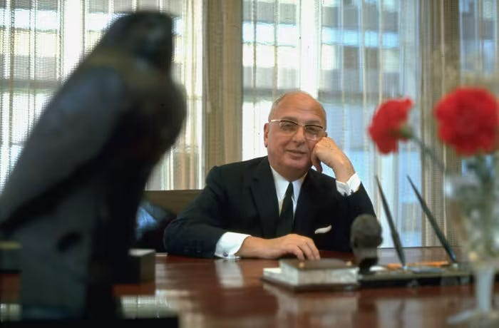
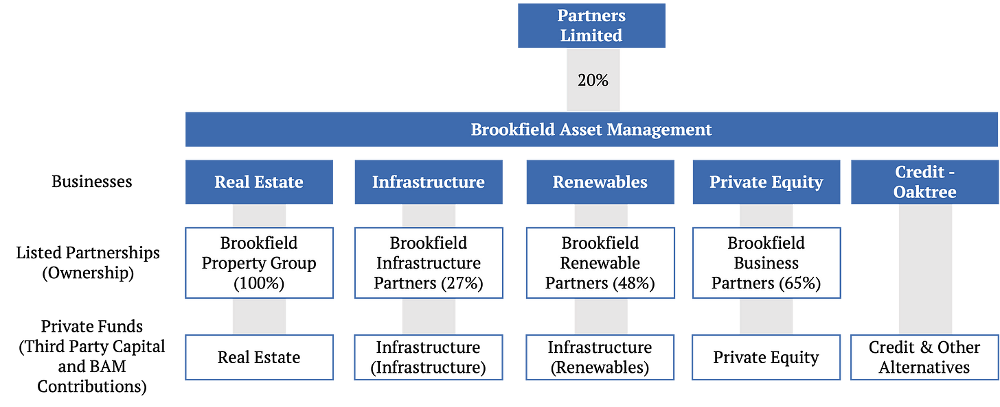
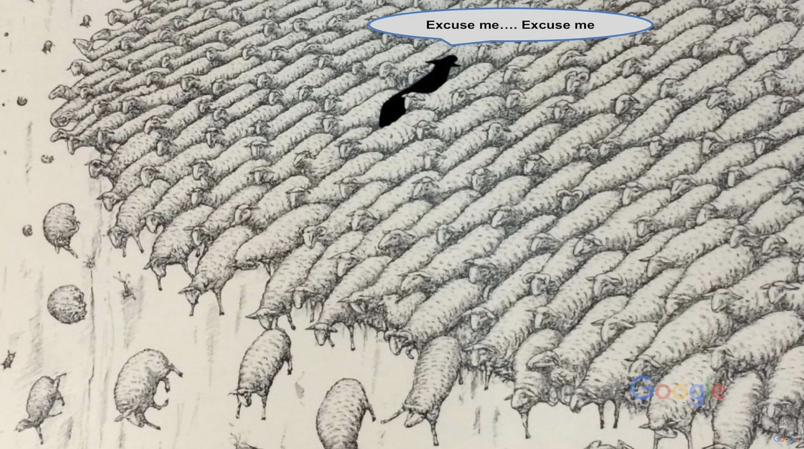
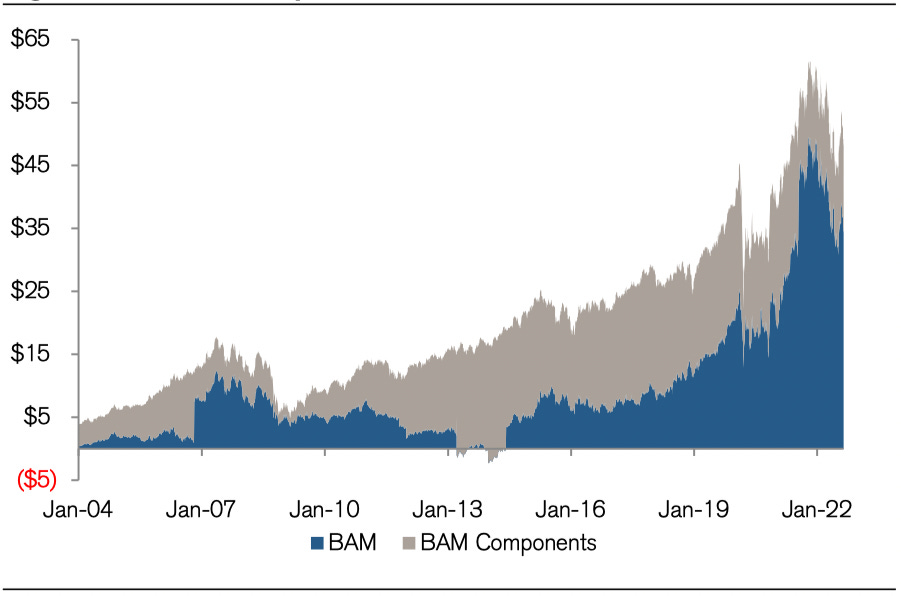

_Welcome to another issue of **Net Interest**, where I distil 25+ years of experience analysing and investing in financial stocks into a weekly newsletter. This week’s topic is Brookfield Asset Management, one of the most interesting companies in Canada. Once a conglomerate, it has spent 20 years transitioning into a large investment management firm. Next week, the metamorphosis will be complete when it spins off its asset management business onto the Toronto and New York stock exchanges. **Paying subscribers get some extra goodies, too — please consider joining them by clicking here. Thanks!**_

_欢迎阅读另一期 **Net Interest** ，我将 25 年以上的金融股票分析和投资经验提炼成每周时事通讯。 本周的主题是加拿大最有趣的公司之一布鲁克菲尔德资产管理公司。 它曾经是一家企业集团，用了 20 年的时间转型为一家大型投资管理公司。 下周，当它将资产管理业务分拆到多伦多和纽约证券交易所时，转型将完成。 **付费订户也可以获得一些额外的好东西——请考虑通过单击此处加入他们。 谢谢！**_

_“Private-equity funds are the conglomerates of this era.”_ — [Jeff Immelt](https://www.ft.com/content/58d234f0-b48c-11db-b707-0000779e2340)

_“私募股权基金是这个时代的企业集团。”_ — [杰夫·伊梅尔特](https://www.ft.com/content/58d234f0-b48c-11db-b707-0000779e2340)

One of the first stocks I ever bought was a UK-listed share called Trafalgar House. It was the early 1990s, many years before I would begin managing money professionally, and I was still learning my way around the stock market. Based on the rudimentary analysis I did, the stock looked cheap – but then it would have done: Trafalgar House was a conglomerate. And as I would later learn, conglomerates almost always look cheap.

我购买的第一批股票之一是在英国上市的股票，名为 Trafalgar House。 那是 1990 年代初，比我开始专业理财早了很多年，我仍在学习如何在股票市场上打拼。 根据我所做的初步分析，这只股票看起来很便宜——但它本来就很便宜：Trafalgar House 是一家企业集团。 正如我后来了解到的那样，企业集团几乎总是看起来很便宜。

Conglomerates became fashionable during the 1960s. Their growth stemmed from [three sources](https://www.thediff.co/p/engineering-a-conglomerate). First, strict enforcement of antitrust regulations made it harder for companies to combine within industries, so managers looked outwards to satisfy expansionary ambitions. Second, lax accounting rules allowed acquisitive companies to post deceptively high growth rates, easing their access to capital markets to fund further growth. And third, business studies was emerging as an academic discipline and with it the notion that general management skill could be applied across different sectors. In the ten years after 1965, some 80% of all merger and acquisition activity in the US involved conglomerates. 

企业集团在 1960 年代开始流行。 他们的成长源于 [三个来源](https://www.thediff.co/p/engineering-a-conglomerate) 。 首先，反垄断法规的严格执行使得公司更难在行业内联合，因此管理者将目光投向外部以满足扩张的野心。 其次，宽松的会计规则允许收购公司实现看似高的增长率，从而使他们更容易进入资本市场，为进一步增长提供资金。 第三，商业研究正在成为一门学科，随之而来的是一般管理技能可以应用于不同部门的概念。 在 1965 年之后的十年里，美国大约 80% 的并购活动涉及企业集团。

It was against this backdrop that Trafalgar House was born. The company was floated on the London Stock Exchange in 1963, initially as a property developer before it embarked on a multi-year acquisition spree that saw it pick up businesses across hospitality, property, housebuilding, shipping, construction and engineering. Among its assets: the storied Ritz Hotel and the Cunard shipping line.

正是在这样的背景下，特拉法加之家诞生了。 该公司于 1963 年在伦敦证券交易所上市，最初是一家房地产开发商，之后开始了多年的收购热潮，收购了酒店、房地产、房屋建筑、航运、建筑和工程等领域的业务。 它的资产包括：著名的丽思酒店和丘纳德航运公司。

But the company came unstuck in the recession of 1990. Having overexpanded in the years prior, it was forced to write down the value of several of its assets, increasing the burden on its debt. The financial problems also exposed underlying operating problems: Acquisitions were never properly integrated and as a result costs remained high, management controls were scant and information flowing to the centre was suspect. “The group went round making acquisitions that were not bedded in,” [said](https://www.independent.co.uk/news/business/from-bad-to-worst-1526066.html) one analyst at the time. “You had a lot of businesses that were really fiefdoms, independent operations.”

但该公司在 1990 年的经济衰退中脱颖而出。在前几年过度扩张后，它被迫减记部分资产的价值，增加了债务负担。 财务问题也暴露了潜在的运营问题：收购从未得到妥善整合，因此成本居高不下，管理控制不足，流向该中心的信息令人怀疑。 “该集团四处进行没有准备好的收购，” [表示](https://www.independent.co.uk/news/business/from-bad-to-worst-1526066.html) 当时的一位分析师 。 “你有很多业务是真正的封地，独立运营。”

It was just after this that I got involved. Mismanagement aside, the company had some attractive assets and as a portfolio they appeared to be worth more than the Trafalgar House stock price suggested. Sadly, I never got to see that valuation gap crystallised. The company was taken over by a Norwegian industrial group in 1996 for £904 million and I just about made my money back. It was a lesson in the vagaries of valuing a conglomerate.

就在这之后，我参与了进来。 撇开管理不善不谈，该公司拥有一些有吸引力的资产，作为一个投资组合，它们的价值似乎高于 Trafalgar House 股价所暗示的价值。 可悲的是，我从未看到估值差距具体化。 该公司于 1996 年以 9.04 亿英镑的价格被一家挪威工业集团收购，我差一点就把钱赚回来了。 这是对企业集团估值变幻莫测的一个教训。

Trafalgar House was not the only conglomerate to stumble. Over the 1980s and into the 1990s, many were unwound. It turns out few managers have the skills to steer businesses simultaneously across disparate sectors, and extra layers of management increase costs. In addition, investors came to realise that they can effect diversification directly, via portfolio construction, without needing to rely on a company to do it for them. In the US, conglomerates like Litton Industries and ITT preceded Trafalgar House to the wall. 

Trafalgar House 并不是唯一一家跌跌撞撞的企业集团。 在 80 年代和 1990 年代，许多人都被解散了。 事实证明，很少有经理人具备同时管理不同部门业务的技能，而且额外的管理层次会增加成本。 此外，投资者开始意识到他们可以通过投资组合构建直接实现多元化，而无需依赖公司为他们做这件事。 在美国，Litton Industries 和 ITT 等企业集团先于 Trafalgar House 破产。

In Canada, however, one conglomerate thrived through reinvention. Once one of the largest companies in the country, it employed more than 110,000 Canadians and constituted 15% of the Toronto Stock Exchange. Like Trafalgar House, it faced collapse in the wake of the 1990 recession but, unlike Trafalgar House, it restructured and is still around today. That company is Brookfield Asset Management. Next week, it completes its restructuring by spinning off an asset management business that it has been cultivating alongside its agglomerated businesses for 20 years. 

然而，在加拿大，一家企业集团通过重塑而蓬勃发展。 它曾经是加拿大最大的公司之一，雇佣了超过 110,000 名加拿大人，占多伦多证券交易所 15% 的股份。 与 Trafalgar House 一样，它在 1990 年经济衰退后面临倒闭，但与 Trafalgar House 不同的是，它经过重组，至今仍在使用。 那家公司是布鲁克菲尔德资产管理公司。 下周，它完成了重组，剥离了与集团业务一起培育了 20 年的资产管理业务。

By all accounts, Sam Bronfman was a domineering entrepreneur. He navigated Prohibition in the US to grow his family’s Montreal-based distillery business, Seagram, into one of the largest in the world, producing brands such as Chivas Regal, Mumms and Martell. But having initially set the business up alongside his brothers, he later sought to cut them out. “The business is mine,” [he told](https://amzn.to/3Vfwh6F) his brother Allan, a vice-president and director in the business. “You must understand that the words ‘we’ and ‘us’ no longer apply.”

众所周知，山姆·布朗夫曼是一位霸道的企业家。 他驾驭了美国的禁酒令，将其家族位于蒙特利尔的酿酒厂 Seagram 发展成为世界上最大的酿酒厂之一，生产 Chivas Regal、Mumms 和 Martell 等品牌。 但最初是与他的兄弟们一起创办这家公司，后来他试图将他们排除在外。 “生意是我的，” [他告诉](https://amzn.to/3Vfwh6F) 他的兄弟艾伦，艾伦是公司的副总裁兼董事。 “你必须明白，‘我们’和‘我们’这两个词不再适用。”

In the early 1960s, Sam forced Allan to sell him the Seagram shares that Allan had placed in trust for his children for a consideration of $16 million. By then, Allan’s children, Edward and Peter, were in their early 30s and, eager to make a go of it themselves, used the proceeds to seed their own investment business. The business, called Edper as a portmanteau of their names, made its first major independent investment in 1969. Sam was so jealous, he threw Edward and Peter out of his offices.

1960 年代初，Sam 以 1600 万美元的对价强迫 Allan 将 Allan 为他的孩子托管的 Seagram 股票卖给他。 那时，Allan 的孩子 Edward 和 Peter 已经 30 岁出头，他们急切地想自己动手，用所得资金创办了自己的投资业务。 1969 年，这家名为 Edper 的公司进行了第一笔重大独立投资。Sam 非常嫉妒，他将 Edward 和 Peter 赶出了办公室。

Sam Bronfman, the original Logan Roy | Arthur Schatz/LIFE/Getty

Over the next twenty years, Edper grew into a giant conglomerate. By 1990, the Edper empire controlled 32 public companies and hundreds of private companies. Its holdings included Trizec (North America’s largest publicly traded developer), Royal LePage (Canada’s largest real-estate brokerage), John Labatt (Canada’s second largest brewer), Noranda (a C$10 billion natural resources giant), Noranda Forest and MacMillan Bloedel (leaders in paper products), and London Life (Canada’s largest insurer). Some of these businesses were held via a holding company, Brascan, which also maintained power and transportation interests in Brazil. (Brascan is a portmanteau of Brasil and Canada; they like portmanteaus in Canada.)

在接下来的 20 年里，Edper 成长为一家大型企业集团。 到 1990 年，埃德珀帝国控制了 32 家上市公司和数百家私营公司。 其持股包括 Trizec（北美最大的上市开发商）、Royal LePage（加拿大最大的房地产经纪公司）、John Labatt（加拿大第二大啤酒商）、Noranda（市值 100 亿加元的自然资源巨头）、Noranda Forest 和 MacMillan Bloedel（纸制品的领导者）和伦敦人寿（加拿大最大的保险公司）。 其中一些业务由控股公司 Brascan 持有，该公司还在巴西拥有电力和运输权益。 （Brascan 是巴西和加拿大的混成词；他们喜欢加拿大的混成词。）

Steering Edper’s growth was a man called Jack Cockwell, a South African accountant whom Edward and Peter had hired when he was still in his twenties. Cockwell perfected various strategies to obtain control of companies while minimising the amount of capital the firm needed to deploy. One strategy was to take a controlling stake in a public company that would take a controlling stake in another public company that would take a controlling stake in yet another, so that Edper could exercise control with a relatively small holding in the underlying company. Cockwell [called](https://www.nytimes.com/1992/05/24/business/the-bronfmans-leveraged-leviathan.html) this the “cascading effect of leverage”.

指导埃德珀成长的是一个名叫杰克·科克威尔的人，他是一名南非会计师，爱德华和彼得在他 20 多岁时就雇用了他。 Cockwell 完善了各种策略来获得对公司的控制权，同时最大限度地减少公司需要部署的资本量。 一种策略是取得一家上市公司的控股权，而另一家上市公司将取得另一家上市公司的控股权，而另一家上市公司又将控股另一家上市公司，这样埃德珀就可以在持有基础公司相对较小的股份的情况下行使控制权。 Cockwell 将此 [称为](https://www.nytimes.com/1992/05/24/business/the-bronfmans-leveraged-leviathan.html) “杠杆的级联效应”。

Other strategies included cross-ownership or partial ownership of a parent company by its subsidiary, and the use of restricted or non-voting shares for public investors with super-voting shares being retained for insiders. Together, the strategies enabled Edper to control billions of dollars of assets without having to use much of its own money.

其他策略包括其子公司对母公司的交叉所有权或部分所有权，以及为公众投资者使用限制性或无投票权的股份，并为内部人员保留超级投票权的股份。 总之，这些策略使 Edper 能够控制数十亿美元的资产，而无需使用自己的大量资金。

A [newspaper story](https://www.independent.co.uk/news/business/legacy-of-a-bootlegger-canada-s-giant-edper-conglomerate-created-by-the-outcast-cousins-of-the-bronfman-drinks-dynasty-is-in-trouble-and-may-be-slipping-into-unfamiliar-hands-adam-corelli-reports-1473003.html) from 1990 provides a worked example:

1990 年的一篇 [报纸报道](https://www.independent.co.uk/news/business/legacy-of-a-bootlegger-canada-s-giant-edper-conglomerate-created-by-the-outcast-cousins-of-the-bronfman-drinks-dynasty-is-in-trouble-and-may-be-slipping-into-unfamiliar-hands-adam-corelli-reports-1473003.html) 提供了一个可行的例子：

> _“The process worked along these lines: Hees International, the group’s Toronto-based merchant banker, would handle the issue of Cdollars 100m worth of shares in an Edper company, half of which would be bought by Edper and the other half sold to the public. Hees would then take the dollars 100m proceeds and invest it in a dollars 200m share issue of a subsidiary of the first company, with the public again picking up half. That process, repeated five times, turns Cdollars 50m into Cdollars 1.2bn. In other words, a Bronfman-controlled company picks up Cdollars 1.2bn and yet Edper puts up only 3.125 percent of it.”_
> 
> _“这个过程是按照这些思路进行的：Hees International，该集团位于多伦多的商业银行家，将处理 Edper 公司价值 1 亿美元的 Cdollars 股票的发行，其中一半将由 Edper 购买，另一半将出售给公众. Hees 然后将 1 亿美元的收益投资于第一家公司的子公司发行的 2 亿美元股票，公众再次获得一半。 这个过程重复五次，将 Cdollars 50m 变成 Cdollars 12 亿。 换句话说，一家 Bronfman 控制的公司获得了 12 亿美元的 Cdollars，而 Edper 只提供了其中的 3.125%。”_

The upshot is that while Edper maintained control of its subsidiaries, its effective equity interest in those at the bottom of the pyramid was small. According to the 1991 Hees annual report, Edper’s equity interest in a range of large subsidiaries was no more than 13%. To get there, Edper companies issued more securities than anyone else in Canada during the 1980s, raising more than C$30 billion in equity.

结果是，虽然 Edper 保留了对其子公司的控制权，但它在金字塔底部的有效股权很少。 根据 Hees 1991 年的年报，Edper 在一系列大型子公司中的股权不超过 13%。 为实现这一目标，Edper 公司在 1980 年代发行了比加拿大任何其他公司都多的证券，筹集了超过 300 亿加元的股权。

The result was a complex corporate web. So dizzying was the structure that the Globe and Mail once [likened](https://brookfield.substack.com/p/an-introduction-to-edper-and-brookfield-899) investing in Edper to watching a basketball game in the dark:

结果是一个复杂的企业网络。 如此令人眼花缭乱的结构，以至于《环球邮报》曾 [：](https://brookfield.substack.com/p/an-introduction-to-edper-and-brookfield-899) 将投资 Edper 比作在黑暗中观看篮球比赛

> _“Shareholder-spectators know there is a game going on because they can hear the ball bouncing and feet scuffling on the floor; they just can’t see what’s happening… But there is a big electronic board overhead that periodically flashes the score so spectators can see how their team is doing. Chief strategist Jack Cockwell and his team of crackerjack lawyers, accountants and bankers tell their shareholders ahead of time what the score will be. They believe the audience should be satisfied as long as the numbers match up to what the managers promised.”_
> 
> _“股东观众知道有一场比赛正在进行，因为他们可以听到球在地板上弹跳和双脚在地板上扭打的声音； 他们只是看不到正在发生的事情……但是头顶上有一个巨大的电子板，它会定期闪烁比分，以便观众可以看到他们的团队表现如何。 首席策略师杰克·科克威尔和他的律师、会计师和银行家团队提前告诉他们的股东比分是多少。 他们认为，只要数字与经理们承诺的相符，观众就应该感到满意。”_

In 1990, the structure began to splinter. The global recession that hit Trafalgar House in the UK also sent shockwaves through Canada. Companies within the Edper group were very highly leveraged, in some cases having used equity stakes in other Edper companies as collateral. As stock prices fell, debt levels became exposed. Debt backed by hard assets such as property proved no safer, as commercial real estate values also fell. Analysts estimate there may have been between C$30 billion and C$50 billion of debt in the group, serviced by dividends that flowed from subsidiaries up to the parent company. Having listed the ultimate parent company, Edper Enterprises, in 1989, Cockwell and the Bronfman brothers saw the value of its equity decline by 90%. 

1990 年，结构开始分裂。 袭击英国特拉法加大厦的全球经济衰退也给加拿大带来了冲击波。 Edper 集团内的公司杠杆率非常高，在某些情况下使用其他 Edper 公司的股权作为抵押品。 随着股价下跌，债务水平暴露无遗。 事实证明，由房地产等硬资产支持的债务并不安全，因为商业房地产价值也下跌了。 分析师估计，该集团可能有 300 亿至 500 亿加元的债务，由从子公司流向母公司的股息偿还。 在最终母公司 Edper Enterprises 于 1989 年上市后，Cockwell 和 Bronfman 兄弟发现其股权价值下降了 90%。

The company rushed to deleverage. In a single week in February 1993, management sold off stakes in Labatt and pulp and paper giant MacMillan Bloedel in what Canadian business reporters took to calling “the great Edper lawn sale”. All told, between 1991 and 1993 the Edper companies raised more than C$9 billion through share issues, asset sales and debt financing. 

公司急于去杠杆。 在 1993 年 2 月的一周内，管理层出售了 Labatt 和纸浆和造纸巨头 MacMillan Bloedel 的股份，加拿大商业记者称之为“伟大的 Edper 草坪出售”。 总而言之，在 1991 年至 1993 年间，Edper 公司通过股票发行、资产出售和债务融资筹集了超过 90 亿加元。

At the end of it, in 1995, the Bronfman brothers exited the business, leaving Cockwell as the main shareholder. Cockwell folded the remaining assets into Brascan and organised the business around three key divisions: real estate (from Trizec), power (from Brascan), and financial services (formerly Trilon). He also hired a young accountant of his own, Bruce Flatt. Flatt joined the firm in 1990 at the age of 25, became chief executive of the real estate business in 2000 and took over from Cockwell as chief executive of the now renamed parent company, Brookfield Asset Management, in 2002. 

最后，在 1995 年，Bronfman 兄弟退出了公司，Cockwell 成为了主要股东。 Cockwell 将剩余资产并入 Brascan，并围绕三个主要部门组织业务：房地产（来自 Trizec）、电力（来自 Brascan）和金融服务（前身为 Trilon）。 他还聘请了自己的年轻会计师布鲁斯·弗拉特 (Bruce Flatt)。 Flatt 于 1990 年加入公司，当时他 25 岁，2000 年成为房地产业务的首席执行官，并于 2002 年接替 Cockwell 成为现已更名的母公司 Brookfield Asset Management 的首席执行官。

As the conglomerate model of financial capitalism waned, another model took hold. Private equity buyouts gained momentum throughout the 1980s, spearheaded by firms like KKR and [Blackstone](https://www.netinterest.co/p/blackstones-moment). Initially, private equity firms made a lot of money _dismantling_ conglomerates, using leveraged buyouts to pick up “orphan assets” from failing conglomerate organisations. Yet although buyouts occurred as individual events, they were typically carried out by the same firms, the same partners, and housed in the same portfolios. Over time, those firms and portfolios got large enough that they now resemble the conglomerates of old. 

随着金融资本主义的集团模式衰落，另一种模式开始流行。 等公司的带动下，私募股权收购在整个 1980 年代势头强劲 [在 KKR 和Blackstone](https://www.netinterest.co/p/blackstones-moment) 。 最初，私募股权公司通过 _解散_ 企业集团赚了很多钱，利用杠杆收购从倒闭的企业集团中收购“孤儿资产”。 然而，尽管收购是作为个别事件发生的，但它们通常由相同的公司、相同的合作伙伴执行，并位于相同的投资组合中。 随着时间的推移，这些公司和投资组合变得足够大，以至于它们现在类似于旧的联合企业。

Take Blackstone. As of mid-2021, the firm controlled 250 companies across a range of industries, in aggregate employing more than half a million people. There are differences between Blackstone and a conglomerate, of course. Each of Blackstone’s constituent companies is organised and funded by a separate investment partnership and remains independent of the other companies’ operations. And while a conglomerate is organised as a perpetual corporation, private equity funds typically have a limited life (say, 12 years) at the end of which they have to sell their investments and return capital to fund investors.

以黑石为例。 截至 2021 年年中，该公司控制着各行各业的 250 家公司，员工总数超过 50 万人。 当然，黑石与企业集团之间存在差异。 Blackstone 的每家子公司均由独立的投资合伙企业组织和资助，并保持独立于其他公司的运营。 虽然企业集团是作为永续公司组织的，但私募股权基金通常只有有限的生命周期（比如 12 年），到期后他们必须出售投资并将资本返还给基金投资者。

But there are similarities, too. Blackstone runs a “portfolio operations” team to provide functional support across its portfolio companies, helping company management across areas such as procurement, healthcare and data science. At the time of its [investor day](https://s23.q4cdn.com/714267708/files/doc_events/2018-Blackstone-Investor-Day-Conference_PDFdownload_2.pdf) in 2018, the Blackstone team comprised 36 professionals plus 35 external advisors and had delivered $600 million of savings in the last full year. These are exactly the kind of “synergies” originally promised by conglomerates. 

但也有相似之处。 Blackstone 运营着一个“投资组合运营”团队，为其投资组合公司提供职能支持，帮助公司在采购、医疗保健和数据科学等领域进行管理。 在 2018 年的 [投资者日](https://s23.q4cdn.com/714267708/files/doc_events/2018-Blackstone-Investor-Day-Conference_PDFdownload_2.pdf) ，Blackstone 团队由 36 名专业人士和 35 名外部顾问组成，在过去一整年节省了 6 亿美元。 这些正是企业集团最初承诺的那种“协同效应”。

Private equity firms’ own capital commitment to deals has also increased over the years. While initially the private equity model centred on investing other people’s money, firms now allocate their own capital more extensively. KKR [deployed](https://irpages2.eqs.com/download/companies/kkrinc/Presentations/April%202021%20Investor%20Day.pdf) an average of $2.4 billion per year of its own capital in investments in the four years through 2020, up from $1.5 billion in the four years prior. Apollo’s CEO, Marc Rowan, has [likened](https://www.netinterest.co/p/apollo-rising) his balance sheet intensive model to the ultimate successful conglomerate – Berkshire Hathaway. 

多年来，私募股权公司自身对交易的资本承诺也有所增加。 虽然最初的私募股权模型以投资他人的资金为中心，但公司现在更广泛地分配自己的资本。 截至 2020 年的四年里， KKR [在](https://irpages2.eqs.com/download/companies/kkrinc/Presentations/April%202021%20Investor%20Day.pdf) 平均每年将自有资本投入 24 亿美元的投资，高于前四年的 15 亿美元。 Apollo 的首席执行官 Marc Rowan [比作最终成功的企业集团 – 伯克希尔哈撒韦公司。](https://www.netinterest.co/p/apollo-rising) 将他的资产负债表密集型模型

In some ways, the conglomerate model and the private equity model are converging. Yet while in most cases it’s the traditional private equity model that’s encroaching on conglomerate turf, at Brookfield it is the other way around.

在某些方面，企业集团模式和私募股权模式正在趋同。 然而，虽然在大多数情况下是传统的私募股权模式侵占了企业集团的地盘，但在布鲁克菲尔德，情况恰恰相反。

“We had our own money invested in our own businesses and over time we figured out which ones we like,” Bruce Flatt [said](https://www.youtube.com/watch?v=y3UOPlIHADw) in a recent interview. “And then we raised money around those businesses… And then decided that the way that we could fund businesses without taking undue risk was to start partnering with clients, with institutions. And eventually we brought institutions into deals and eventually we did what many other private equity firms were doing which was raise funds.”

“我们将自己的资金投资于自己的业务，随着时间的推移，我们发现了自己喜欢的业务，”布鲁斯·弗拉特 [。](https://www.youtube.com/watch?v=y3UOPlIHADw) 在最近的一次采访中说 “然后我们围绕这些业务筹集资金……然后决定，我们可以在不承担不当风险的情况下为企业提供资金的方式是开始与客户和机构合作。 最终我们让机构参与交易，最终我们做了很多其他私募股权公司正在做的事情，那就是筹集资金。”

Taking control of Brookfield’s predecessor, Brascan, in 2002, Flatt “[continued to narrow](https://www.annualreports.com/HostedData/AnnualReports/PDF/bnn2003.pdf) the areas where we operate, while at the same time, broadening our activities within each of these areas.” He sold off the cyclical mining interests the group owned while retaining the infrastructure assets that had been built around them. He also launched investment funds to attract external capital. By the end of 2003, the firm had $5 billion assets under management across five funds, including $1.2 billion seeded by Brascan itself. Today, the firm has over $750 billion of assets under management, of which $407 billion are fee-earning, drawn in from around 2,100 institutional investors globally. 

2002 年，Flatt 接管了 Brookfield 的前身 Brascan，“ [继续缩小](https://www.annualreports.com/HostedData/AnnualReports/PDF/bnn2003.pdf) 我们的经营范围，同时扩大我们在每个领域的活动。” 他卖掉了该集团拥有的周期性矿业权益，同时保留了围绕这些权益建设的基础设施资产。 他还发起了投资基金以吸引外部资本。 到 2003 年底，该公司通过五个基金管理着 50 亿美元的资产，其中包括由 Brascan 自己投资的 12 亿美元。 如今，该公司管理着超过 7500 亿美元的资产，其中 4070 亿美元是来自全球约 2100 家机构投资者的收费资产。

Flatt articulated his business strategy as being “to own, manage and build businesses which generate sustainable free cash flows.” His key performance targets were annual growth in cash flow per share of 15% and a long-term goal of 20% cash return on equity.

弗拉特将他的商业战略表述为“拥有、管理和建立能够产生可持续自由现金流的企业”。 他的主要业绩目标是每股现金流量每年增长 15%，长期目标是 20% 的现金股本回报率。

Although he was intent on steering the group in a new direction, he continued to borrow from many of the strategies devised by Jack Cockwell, who stayed on as chairman throughout. Rather than float individual businesses, though, he grouped assets into silos and floated them as listed partnerships on the Toronto and New York Stock Exchanges. Over time, the firm spun off stakes in Brookfield Property Partners, Brookfield Infrastructure Partners, Brookfield Renewable Partners and Brookfield Business Partners. These entities represent permanent capital vehicles, allowing other investors to participate in their underlying assets as direct shareholders. But as the manager of these entities, Brookfield levies fees, meaning it is able to extract a share of their cash flows disproportionate to its equity holding. 

尽管他打算将集团引向新的方向，但他继续借鉴杰克·科克威尔 (Jack Cockwell) 设计的许多策略，后者一直担任董事长。 不过，他没有让个别企业上市，而是将资产组合成孤岛，并将它们作为上市合伙企业在多伦多和纽约证券交易所上市。 随着时间的推移，该公司剥离了 Brookfield Property Partners、Brookfield Infrastructure Partners、Brookfield Renewable Partners 和 Brookfield Business Partners 的股份。 这些实体代表永久资本工具，允许其他投资者作为直接股东参与其基础资产。 但作为这些实体的管理者，布鲁克菲尔德收取费用，这意味着它能够从其现金流中提取与其股权不成比例的份额。

Flatt also concentrated control of the entire group in the hands of a few partners. An entity called Partners Limited, controlled by Flatt, Cockwell and around 40 others, owns 20% of Brookfield but retains special voting rights and has the power to appoint nine out of the group’s 16 directors. Partners is a [legacy](https://ffj-online.org/wp-content/uploads/2013/02/01-Lionel-Connacher-affidavit-sworn-July-12-1996-2.pdf) of the Bronfman days, “formed in 1987 to provide the senior group managers with a financing vehicle to pool their resources and thereby become a financial partner with Peter Bronfman in the control of the Edper group.”

弗莱特还将整个集团的控制权集中在少数合伙人手中。 一个名为 Partners Limited 的实体，由 Flatt、Cockwell 和其他约 40 人控制，拥有 Brookfield 20% 的股份，但保留特别投票权，并有权任命该集团 16 名董事中的 9 名。 Partners 是 Bronfman 时代的 [遗产](https://ffj-online.org/wp-content/uploads/2013/02/01-Lionel-Connacher-affidavit-sworn-July-12-1996-2.pdf) ，“成立于 1987 年，旨在为高级集团经理提供融资工具，以集中他们的资源，从而成为 Edper 集团控制下的 Peter Bronfman 的财务合作伙伴。”

Brookfield Asset Management corporate structure, Sept 2022

Another trick he has carried through from the Cockwell days is communicating the “the score” on “the big electronic board overhead”. Cognisant of the complexity of his operations, Flatt regularly tells investors what he thinks the group is worth. He calls it the firm’s “plan value”. Back in 2002 when he became CEO, he estimates the “plan value” was $4 a share. He now pins it at $82-94 per share. Looking out to 2027, he counsels investors that it should hit $175-198. 

他从科克威尔时代继承下来的另一个技巧是在“头顶上的大电子板”上传达“比分”。 意识到自己业务的复杂性，弗拉特经常告诉投资者他认为该集团的价值。 他称之为公司的“计划价值”。 早在 2002 年他成为首席执行官时，他就估计“计划价值”为每股 4 美元。 他现在将其定价为每股 82-94 美元。 展望 2027 年，他建议投资者应该达到 175-198 美元。

While these strategies may be unusual in the world of conglomerates, they are less unusual in the world of private equity. The listed partnerships are analogous to funds, with the benefit that they are permanent – indeed, [as we have discussed here before](https://www.netinterest.co/p/other-peoples-money), permanent capital has become a more widespread theme within the industry. And by owning so much Brookfield stock, management interests are aligned. In his 2012 letter to shareholders, Flatt wrote: “\[Senior management is\] commit\[ed\] to align our interests with yours by holding the vast majority of our individual net worth in Brookfield equity.”

虽然这些策略在企业集团的世界中可能不寻常，但在私募股权的世界中却并不那么罕见。 上市合伙企业类似于基金，好处是它们是永久性的——事实上， [正如我们之前在这里讨论的那样](https://www.netinterest.co/p/other-peoples-money) ，永久性资本已成为行业内更广泛的主题。 通过拥有如此多的 Brookfield 股票，管理层的利益是一致的。 弗拉特在 2012 年致股东的信中写道：“\[高级管理层\]承诺\[ed\]通过持有布鲁克菲尔德股权中我们个人净资产的绝大部分，使我们的利益与你们的利益保持一致。”

Since taking over as CEO twenty years ago, Flatt has delivered compound returns of 19% per annum for shareholders. This is slightly ahead of the growth in “plan value” of 16% per annum plus a dividend yield of 2% as a result of some multiple expansion along the way. There are several reasons for the success. 

自二十年前接任首席执行官以来，弗拉特每年为股东带来 19% 的复合回报。 这略高于每年 16% 的“计划价值”增长加上 2% 的股息收益率，这是由于一路上的一些多重扩张造成的。 成功有几个原因。

First, Brookfield benefited from clear tailwinds. The group’s focus is “long life” assets like infrastructure and real estate which performed well when interest rates fell. It raises the question how those assets will perform now that rates are backing up. The company argues that its assets provide inflation protection, but management also thinks/hopes that “as inflation abates…interest rates will slowly come down, but this might take some time, depending on how long it takes to harness inflation.” Its real estate business is particularly exposed, although it no longer gets the transparency of its own listed partnership – last year, Brookfield bought in the share of Brookfield Property Partners it didn’t own at a 25% discount to carrying value. 

首先，布鲁克菲尔德受益于明显的顺风。 该集团的重点是基础设施和房地产等“长期”资产，这些资产在利率下降时表现良好。 这就提出了一个问题，即在利率回升的情况下，这些资产将如何表现。 该公司辩称其资产提供了通货膨胀保护，但管理层也认为/希望“随着通货膨胀减弱……利率将慢慢下降，但这可能需要一些时间，具体取决于控制通货膨胀需要多长时间。” 它的房地产业务尤其暴露，尽管它不再获得其上市合伙企业的透明度——去年，Brookfield 以低于账面价值 25% 的折扣购买了它不拥有的 Brookfield Property Partners 的股份。

Second, Brookfield has managed risk well. Learning from the near collapse of Edper, the company employs a series of strategies to reduce risk. It preserves a high level of liquidity and matches “liquidity and duration of the assets and operations being financed” to debt characteristics. Debt typically has recourse only to a specific asset, even if it is more expensive than cross-collateralized finance. As a result, during the global financial crisis, “we did not have to face the major issues which a number of others have had to.” The firm currently carries $11 billion of long-term debt on $79 billion of equity, and has $70 billion of cash and semi-liquid investments on hand. 

其次，布鲁克菲尔德很好地管理了风险。 从 Edper 的几近倒闭中吸取教训，该公司采用了一系列策略来降低风险。 它保持高水平的流动性，并将“资产和运营的流动性和持续时间”与债务特征相匹配。 债务通常仅对特定资产具有追索权，即使它比交叉抵押融资更昂贵。 因此，在全球金融危机期间，“我们不必面对许多其他国家不得不面对的重大问题。” 该公司目前持有 110 亿美元的长期债务和 790 亿美元的股权，手头有 700 亿美元的现金和半流动性投资。

Third, the firm buys well, embracing a “value investing” mindset in its approach to investments. Flatt emphasises the importance of “purchas\[ing\] assets at a discount to their replacement cost, building a margin of safety into our acquisitions.” Flatt himself made his mark overseeing the acquisition of a 1.2 million square foot interest in Three World Financial Centre at a substantial discount to replacement value in the immediate aftermath of 9/11. The firm subsequently went on a shopping spree for $4.1 billion of investment during the tail end of the global financial crisis, and bought “various distressed real estate and infrastructure investments” in Europe during the sovereign debt crisis. “We keep this picture in the office to remind our people that one should always look for opportunity away from where the crowd is going,” [says](https://www.youtube.com/watch?v=vmt1Li1Rnes) Flatt:

第三，该公司买得好，在其投资方法中采用“价值投资”思维。 Flatt 强调了“以低于重置成本的折扣购买资产，为我们的收购建立安全边际”的重要性。 9/11 事件后，弗拉特本人因监督以低于重置价值的大幅折扣收购了三世界金融中心 120 万平方英尺的权益而名声大噪。 该公司随后在全球金融危机末期疯狂收购 41 亿美元的投资，并在主权债务危机期间在欧洲购买了“各种不良房地产和基础设施投资”。 “我们将这张照片放在办公室里，以提醒我们的员工，人们应该始终在远离人群的地方寻找机会，” [说：](https://www.youtube.com/watch?v=vmt1Li1Rnes) 弗拉特

Always look for opportunity away from where the crowd is going

Finally, size became a competitive advantage in the asset classes Brookfield is active in, unlike in public market investing (as we discussed in _[Zuckerman’s Curse and the Economics of Fund Management](https://www.netinterest.co/p/zuckermans-curse-and-the-economics)_):

最后，规模成为布鲁克菲尔德活跃的资产类别的竞争优势，这与公开市场投资不同（正如我们在 _[祖克曼的诅咒和基金管理经济学中](https://www.netinterest.co/p/zuckermans-curse-and-the-economics)_ 所讨论的那样）：

> _“We are often asked why we do not have the same issues that some public equity managers have investing funds as they grow larger. The difference is that infrastructure (as well as real estate and private equity) usually becomes more attractive as investments get larger. The competition for larger acquisitions is less and the sophistication required to operate these assets increases because of their complexity, therefore favoring large and experienced managers. Lastly, the larger assets acquired are generally also higher quality – they often have better counterparties, and stronger management teams.”_ (Brookfield Asset Management Letter to Shareholders, 2018 Q4)
> 
> _“我们经常被问到，为什么我们没有遇到一些公共股权经理在规模扩大时投资基金所面临的相同问题。 不同之处在于，基础设施（以及房地产和私募股权）通常随着投资规模的扩大而变得更具吸引力。 大型收购的竞争较少，运营这些资产所需的复杂性因其复杂性而增加，因此有利于大型和经验丰富的管理人员。 最后，收购的资产规模越大，质量通常也越高——它们通常拥有更好的交易对手和更强大的管理团队。”_ （Brookfield Asset Management 致股东的信，2018 年第四季度）

Even though Bruce Flatt works hard to communicate his firm’s “plan value”, investors are not always convinced. Questions persist as to whether Brookfield is a conglomerate or an asset manager. Over the years, the market-implied value of the asset management component has fluctuated wildly.

尽管 Bruce Flatt 努力传达其公司的“计划价值”，但投资者并不总是信服。 关于布鲁克菲尔德是一家企业集团还是一家资产管理公司的问题仍然存在。 多年来，资产管理部分的市场隐含价值波动剧烈。

Valuing the BAM “stub” | Credit Suisse

As a result, Brookfield is finally spinning out its asset manager. Next week, shareholders will receive one share in a new company, Brookfield Asset Management Ltd (BAM) for every four shares they currently own in the holding company, which will be renamed Brookfield Corporation (BN). It’s not entirely a clean break though. The holding company will retain a 75% interest in the manager, and will also continue to extract fees. Although the asset management company will retain 100% of its fee-related earnings, all of the carried interest on existing funds and a third of gross carried interest earned on new funds will stay with the holding company.

因此，Brookfield 终于分拆了其资产管理公司。 下周，股东们将获得一家新公司 Brookfield Asset Management Ltd (BAM) 的一股股份，他们目前持有的控股公司股份每四股将更名为 Brookfield Corporation (BN)。 不过，这并不完全是一个彻底的突破。 控股公司将保留管理人75%的权益，还将继续收取费用。 尽管资产管理公司将保留 100% 的费用相关收益，但现有基金的所有附带权益和新基金所赚取的总附带权益的三分之一将归控股公司所有。

Shareholders in the Corporation therefore have exposure to three platforms:

因此，公司的股东可以接触到三个平台：

-   The **“conglomerate”.** The firm carries around $60 billion of equity exposure on its own balance sheet – $11 billion in renewable power and transition; $8 billion in infrastructure; $4 billion in private equity; and $35 billion in real estate. Going forward, it will also count its stake in the asset management business. These assets currently generate around $2 billion of annual distributions. 
    
-   The **“conglomerate”.** The firm carries around $60 billion of equity exposure on its own balance sheet – $11 billion in renewable power and transition; $8 billion in infrastructure; $4 billion in private equity; and $35 billion in real estate. Going forward, it will also count its stake in the asset management business. These assets currently generate around $2 billion of annual distributions. 
    
    “ **集团”。** 该公司在其资产负债表上持有约 600 亿美元的股权——110 亿美元用于可再生能源和转型； 80亿美元的基础设施； 40亿美元的私募股权； 以及 350 亿美元的房地产。 展望未来，它还将计算其在资产管理业务中的股份。 这些资产目前产生约 20 亿美元的年度分配。
    

-   The **“asset manager”** has over $400 billion of fee-earning assets. Brookfield reckons this can grow to $1 trillion. The manager currently throws off fee-related earnings of close to $2 billion per year, which the company projects will grow to $4.3 billion by 2027; by then, some carried interest may be kicking in, too.
    
-   The **“asset manager”** has over $400 billion of fee-earning assets. Brookfield reckons this can grow to $1 trillion. The manager currently throws off fee-related earnings of close to $2 billion per year, which the company projects will grow to $4.3 billion by 2027; by then, some carried interest may be kicking in, too.
    
    “ **资产经理”** 拥有超过 4000 亿美元的收费资产。 Brookfield 估计这可以增长到 1 万亿美元。 这位经理目前每年与费用相关的收入接近 20 亿美元，公司预计到 2027 年将增长到 43 亿美元； 到那时，一些附带利益也可能开始发挥作用。
    

-   In addition, the firm has an emerging **insurance business**. It currently has $10 billion of equity invested in it on $40 billion of assets. The company reckons it can grow those assets to $400 billion.
    
-   In addition, the firm has an emerging **insurance business**. It currently has $10 billion of equity invested in it on $40 billion of assets. The company reckons it can grow those assets to $400 billion.
    
    此外，该公司还有新兴的 **保险业务** 。 它目前在 400 亿美元的资产上投资了 100 亿美元的股权。 该公司估计它可以将这些资产增加到 4000 亿美元。
    

It’s too late for Trafalgar House, but the shift from conglomerate to asset manager is a neat one. Following the spin next week, we’ll learn if it’s enough to banish the discount.

对于 Trafalgar House 来说为时已晚，但从企业集团向资产管理公司的转变是一个巧妙的转变。 在下周旋转之后，我们将了解是否足以取消折扣。

_For more on Brookfield, [Colossus](https://www.joincolossus.com/) recently released a ‘[Business Breakdown](https://www.joincolossus.com/episodes/48001359/shayegh-brookfield-asset-management?tab=transcript)’ of the company, which includes plenty of [additional resources](https://www.joincolossus.com/episodes/48001359/shayegh-brookfield-asset-management?tab=blocks). Brookfield’s [September investor day](https://bam.brookfield.com/presentations) presentation is also useful reading. In addition, [Austin Value Capital](http://www.austinvaluecapital.com/resources.html) has a compilation of letters, annual reports, investor day presentations and annual supplements of Brookfield and its associated companies on their website. Finally, Manual of Ideas members might like Alex Gilchrist’s ‘[A Profile in Leadership: Bruce Flatt, CEO of Brookfield Asset Management](https://moiglobal.com/bruce-flatt-brookfield-asset-management/)’._

_有关 Brookfield 的更多信息， [Colossus](https://www.joincolossus.com/) 最近发布了该公司的“ [业务分解](https://www.joincolossus.com/episodes/48001359/shayegh-brookfield-asset-management?tab=transcript) ”，其中包括大量 [其他资源](https://www.joincolossus.com/episodes/48001359/shayegh-brookfield-asset-management?tab=blocks) 。 Brookfield 的 [9 月投资者日](https://bam.brookfield.com/presentations) 演讲也是有用的读物。 此外， [Austin Value Capital](http://www.austinvaluecapital.com/resources.html) 在其网站上还有 Brookfield 及其关联公司的信件、年度报告、投资者日介绍和年度增刊的汇编。 最后，Manual of Ideas 成员可能会喜欢 Alex Gilchrist 的“ [领导力简介：Brookfield Asset Management 首席执行官 Bruce Flatt](https://moiglobal.com/bruce-flatt-brookfield-asset-management/) ”。_
