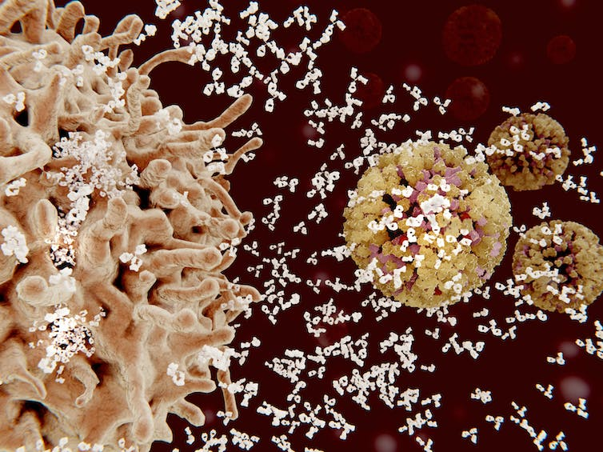
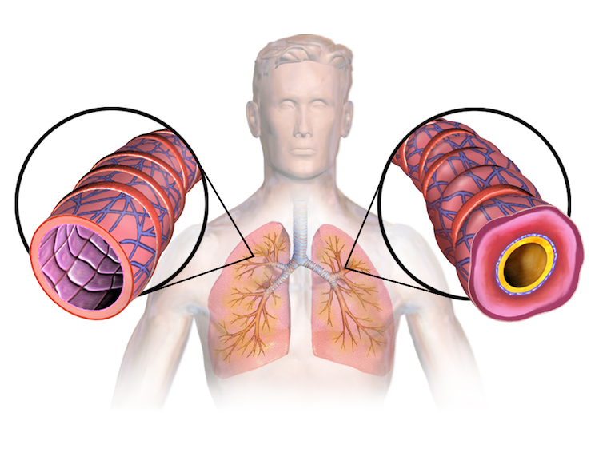

When your body fights off an infection, you develop a fever. If you have arthritis, your joints will hurt. If a bee stings your hand, your hand will swell up and become stiff. These are all manifestations of [inflammation](https://doi.org/10.1007/s11515-011-1123-9) occurring in the body.

当您的身体抵抗感染时，您就会发烧。 如果你有关节炎，你的关节会受伤。 如果蜜蜂蜇了您的手，您的手会肿胀并变得僵硬。 这些都是 [炎症的表现。](https://doi.org/10.1007/s11515-011-1123-9) 身体发生

We are two [immunologists](https://scholar.google.com/citations?user=jJVj3sUAAAAJ&hl=en&oi=ao) [who study](https://scholar.google.com/citations?user=af7TahQAAAAJ&hl=en&oi=ao) how the immune system reacts [during infections, vaccination and autoimmune diseases](https://pubmed.ncbi.nlm.nih.gov/?term=nagarkatti+p&sort=date) where the body starts attacking itself.

我们是两名 [免疫学家](https://scholar.google.com/citations?user=jJVj3sUAAAAJ&hl=en&oi=ao) [，研究](https://scholar.google.com/citations?user=af7TahQAAAAJ&hl=en&oi=ao) 免疫系统 [在感染、疫苗接种和自身免疫性疾病](https://pubmed.ncbi.nlm.nih.gov/?term=nagarkatti+p&sort=date) 期间身体开始攻击自身时的反应。

While inflammation is commonly associated with the pain of an injury or the many diseases it can cause, it is an important part of the normal immune response. The problems arise when this normally helpful function overreacts or overstays its welcome.

虽然炎症通常与受伤疼痛或它可能引起的许多疾病有关，但它是正常免疫反应的重要组成部分。 当这个通常有用的功能反应过度或过分受欢迎时，就会出现问题。

Inflammation is a process in which antibody-producing cells – like the large beige cell on the left of this image – rush to the site of an infection to attack an invader, such as the flu virus in yellow. [Juan Gaertner/Science Photo Library via Getty Images](https://www.gettyimages.com/detail/illustration/immune-response-to-a-virus-illustration-royalty-free-illustration/724237117?phrase=antibodies%20infection&adppopup=true)

## What is inflammation?

## 什么是炎症？

Generally speaking, the term inflammation refers to all activities of the immune system that occur where the body is trying to fight off potential or real infections, clear toxic molecules or recover from physical injury. There are [five classic physical signs](https://doi.org/10.1186%2F1476-9255-1-1) of acute inflammation: heat, pain, redness, swelling and loss of function. Low-grade inflammation might not even produce noticeable symptoms, but the underlying cellular process is the same.

一般来说，炎症一词是指身体试图抵抗潜在或真正的感染、清除有毒分子或从身体损伤中恢复时发生的免疫系统的所有活动。 急性炎症有 [五个典型的体征](https://doi.org/10.1186%2F1476-9255-1-1) ：发热、疼痛、发红、肿胀和功能丧失。 低度炎症甚至可能不会产生明显的症状，但潜在的细胞过程是相同的。

Take a bee sting, for example. The immune system is like a military unit with a wide range of tools in its arsenal. After sensing the toxins, bacteria and physical damage from the sting, the immune system [deploys various types of immune cells](https://theconversation.com/coronavirus-b-cells-and-t-cells-explained-141888) to the site of the sting. These include [T cells, B cells, macrophages and neutrophils](https://www.niaid.nih.gov/research/immune-cells), among other cells.

以蜜蜂蜇伤为例。 免疫系统就像一个军事单位，其武器库中有各种各样的工具。 在感知到毒物、细菌和被蜇伤的物理损伤后，免疫系统 [会将各种类型的免疫细胞部署](https://theconversation.com/coronavirus-b-cells-and-t-cells-explained-141888) 到被蜇的部位。 这些包括 [T 细胞、B 细胞、巨噬细胞和中性粒细胞](https://www.niaid.nih.gov/research/immune-cells) 等细胞。

The [B cells produce antibodies](https://www.ncbi.nlm.nih.gov/books/NBK26884/). Those antibodies can kill any bacteria in the wound and neutralize toxins from the sting. [Macrophages and neutrophils engulf bacteria](https://doi.org/10.3389/fimmu.2012.00174) and destroy them. [T cells don’t produce antibodies, but kill any virus-infected cell](https://doi.org/10.1038/d41586-021-00367-7) to prevent viral spread.

B [细胞产生抗体](https://www.ncbi.nlm.nih.gov/books/NBK26884/) 。 这些抗体可以杀死伤口中的任何细菌并中和蜇伤产生的毒素。 [巨噬细胞和嗜中性粒细胞吞噬](https://doi.org/10.3389/fimmu.2012.00174) 并摧毁细菌。 [T 细胞不产生抗体，但会杀死任何被病毒感染的细胞](https://doi.org/10.1038/d41586-021-00367-7) 以防止病毒传播。

Additionally, these immune cells produce [hundreds of types of molecules](https://doi.org/10.1177/1091581815584918) called cytokines – otherwise known as mediators – that help fight threats and repair harm to the body. But just like in a military attack, inflammation comes with collateral damage.

此外，这些免疫细胞会产生 [数百种](https://doi.org/10.1177/1091581815584918) 称为细胞因子的分子——也称为介质——有助于对抗威胁和修复对身体的伤害。 但就像在军事攻击中一样，炎症会带来附带损害。

The mediators that help kill bacteria also kill some healthy cells. Other similar mediating molecules cause blood vessels to leak, leading to accumulation of fluid and influx of more immune cells.

帮助杀死细菌的介质也会杀死一些健康细胞。 其他类似的介导分子会导致血管渗漏，导致体液积聚和更多免疫细胞涌入。

This collateral damage is the reason you develop swelling, redness and pain around a bee sting or after getting a flu shot. Once the immune system clears an infection or foreign invader – whether the toxin in a bee sting or a chemical from the environment – different parts of the inflammatory response take over and help repair the damaged tissue.

这种附带损害是您在蜜蜂蜇伤或注射流感疫苗后出现肿胀、发红和疼痛的原因。 一旦免疫系统清除了感染或外来入侵者——无论是蜜蜂蜇伤中的毒素还是环境中的化学物质——炎症反应的不同部分就会接管并帮助修复受损组织。

After a few days, your body will neutralize the poison from the sting, eliminate any bacteria that got inside and heal any tissue that was harmed.

几天后，您的身体会中和蜇伤产生的毒素，消灭进入里面的所有细菌，并治愈所有受伤的组织。

Asthma is caused by inflammation that leads to swelling and a narrowing of airways in the lungs, as seen in the right cutaway in this image. [BruceBlaus/Wikimedia Commons](https://commons.wikimedia.org/wiki/File:Asthma_(Lungs).png#/media/File:Asthma_(Lungs).png), [CC BY-SA](http://creativecommons.org/licenses/by-sa/4.0/)

## Inflammation as a cause of disease

## 炎症是疾病的原因

Inflammation is a double-edged sword. It is critical for fighting infections and repairing damaged tissue, but when inflammation occurs for the wrong reasons or [becomes chronic](https://theconversation.com/long-covid-how-researchers-are-zeroing-in-on-the-self-targeted-immune-attacks-that-may-lurk-behind-it-169911), the damage it causes [can be harmful](https://theconversation.com/despite-its-disastrous-effects-covid-19-offers-some-gifts-to-medicine-an-immunology-expert-explains-what-it-can-teach-us-about-autoimmune-disease-174952).

炎症是一把双刃剑。 它对于抵抗感染和修复受损组织至关重要，但当炎症因错误原因发生或 [变成慢性](https://theconversation.com/long-covid-how-researchers-are-zeroing-in-on-the-self-targeted-immune-attacks-that-may-lurk-behind-it-169911) 时，它造成的损害 [可能是有害](https://theconversation.com/despite-its-disastrous-effects-covid-19-offers-some-gifts-to-medicine-an-immunology-expert-explains-what-it-can-teach-us-about-autoimmune-disease-174952) 的。

[Allergies](https://doi.org/10.1111/j.1600-065x.2011.01020.x), for example, develop when the immune system mistakenly recognizes innocuous substances – like peanuts or pollen – as dangerous. The harm can be minor, like itchy skin, or dangerous if someone’s throat closes up.

[就会出现过敏症](https://doi.org/10.1111/j.1600-065x.2011.01020.x) 例如，当免疫系统错误地将花生或花粉等无害物质识别为危险物质时， 。 伤害可能是轻微的，例如皮肤发痒，或者如果某人的喉咙紧闭就会很危险。

Chronic inflammation damages tissues over time and can lead to [many noninfectious clinical disorders](https://doi.org/10.1038/s41591-019-0675-0), including cardiovascular diseases, neurodegenerative disorders, obesity, diabetes and some types of cancers.

随着时间的推移，慢性炎症会损害组织，并可能导致 [许多非感染性临床疾病](https://doi.org/10.1038/s41591-019-0675-0) ，包括心血管疾病、神经退行性疾病、肥胖、糖尿病和某些类型的癌症。

The immune system can sometimes mistake one’s own organs and tissues for invaders, leading to inflammation throughout the body or in specific areas. This self-targeted inflammation is what causes the symptoms of [autoimmune diseases](https://doi.org/10.1289/ehp.99107s5661) such as lupus and arthritis.

免疫系统有时会将自己的器官和组织误认为是入侵者，导致全身或特定区域发炎。 这种以自我为目标的炎症是导致 [自身免疫性疾病症状的原因。](https://doi.org/10.1289/ehp.99107s5661) 狼疮和关节炎等

Another cause of chronic inflammation that researchers like us are currently studying is defects in the [mechanisms that curtail inflammation](https://doi.org/10.3389/fimmu.2016.00160) after the body clears an infection.

像我们这样的研究人员目前正在研究的慢性炎症的另一个原因是 [减少炎症的机制存在缺陷。](https://doi.org/10.3389/fimmu.2016.00160) 在身体清除感染后

While inflammation mostly plays out at a cellular level in the body, it is far from a simple mechanism that happens in isolation. Stress, diet and nutrition, as well as genetic and environmental factors, have all been shown [to regulate inflammation](https://doi.org/10.3389%2Ffimmu.2020.570083) in some way.

虽然炎症主要在体内的细胞水平上发挥作用，但它远非孤立发生的简单机制。 压力、饮食和营养，以及遗传和环境因素，都被证明 [可以某种方式调节炎症](https://doi.org/10.3389%2Ffimmu.2020.570083) 。

There is still a lot to be learned about what leads to harmful forms of inflammation, but a [healthy diet](https://doi.org/10.3390%2Fnu11081933) and [avoiding stress](https://doi.org/10.1016%2Fj.copsyc.2015.03.007) can go a long way toward helping maintain the delicate balance between a strong immune response and harmful chronic inflammation.

关于导致有害形式的炎症的原因还有很多需要了解，但 [健康的饮食](https://doi.org/10.3390%2Fnu11081933) 和 [避免压力](https://doi.org/10.1016%2Fj.copsyc.2015.03.007) 可以大大有助于维持强大的免疫反应和有害的慢性炎症之间的微妙平衡。
