-   29 min read
-   29 分钟阅读
-   [Design Patterns](https://www.smashingmagazine.com/category/design-patterns), [Usability](https://www.smashingmagazine.com/category/usability), [UX](https://www.smashingmagazine.com/category/ux), [Accessibility](https://www.smashingmagazine.com/category/accessibility)
-   [设计模式](https://www.smashingmagazine.com/category/design-patterns) ， [可用性](https://www.smashingmagazine.com/category/usability) ， [用户体验](https://www.smashingmagazine.com/category/ux) ， [辅助功能](https://www.smashingmagazine.com/category/accessibility)

How difficult can it be to design a bulletproof language selector? It’s not as straightforward as one might think. We need to avoid redirects, decouple our language and country presets, allow for overrides, and use non-modal windows. Let’s dive in!

Imagine that you’ve just arrived in Tokyo. Full of impatience and excitement, you are just about to hit the road, yet there it comes: an **urgent warning** from your mobile provider, nudging you to top up your dwindling balance. With some justified concern, you go to the website, just to be redirected to the **Japanese version of the site**. You can’t read Japanese just yet, yet there is no obvious option to change the location, and there is no option to change the language either.

想象一下，您刚刚抵达东京。 充满不耐烦和兴奋，你正要上路，但它来了：来自你的移动供应商的 **紧急警告** ，催促你补充你日益减少的余额。 带着一些合理的担忧，你访问了该网站，只是被重定向到该 **网站的日文版** 。 您还不能阅读日语，但没有明显的更改位置的选项，也没有更改语言的选项。

As the data keeps dwindling, you juggle between auto-translation and your limited VPN options — just to run out of data in the middle of the session. The language selector is somewhere there, yet it’s disguised between cryptic symbols and mysterious icons, nowhere to be found on the spot.

随着数据不断减少，您需要在自动翻译和有限的 VPN 选项之间来回折衷——只是为了在会话中间耗尽数据。 语言选择器就在那里，但它隐藏在神秘的符号和神秘的图标之间，当场无处可寻。

[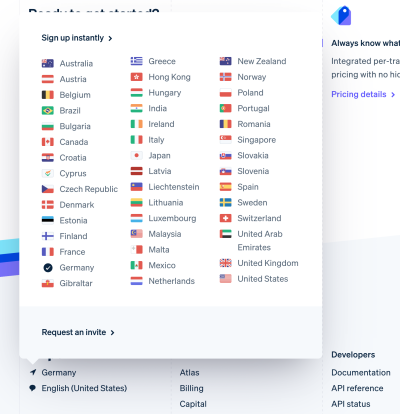](https://stripe.com/)

Stripe with a popover allowing users to jump to a different country in the footer. [Stripe](https://stripe.com/) ([Large preview](https://cloud.netlifyusercontent.com/assets/344dbf88-fdf9-42bb-adb4-46f01eedd629/7ad18cfe-12b4-4fb4-81bb-9695dc0cb9d9/1-designing-better-language-selector.png))

Chances are high that at some point you had a similar experience as well. As designers, we can of course make language selectors **more obvious and noticeable**, yet most of the time, the appearance of a component is only a part of the problem.

您很有可能在某个时候也有过类似的经历。 作为设计师，我们当然可以把语言选择器做得 **更明显、更引人注目** ，但大多数时候，组件的外观只是问题的一部分。

Too often, when we design interfaces, we subconsciously embed our **personal assumptions**, biases and expectations into our work. Of course, we can’t possibly consider all exceptions and all edge cases, along with all happy or unhappy coincidences. So we focus on the most common situations, eventually breaking a beautifully orchestrated user experience entirely for some of our disgruntled users.

很多时候，当我们设计界面时，我们会下意识地将我们的 **个人假设** 、偏见和期望嵌入到我们的工作中。 当然，我们不可能考虑所有例外和所有边缘情况，以及所有快乐或不快乐的巧合。 因此，我们专注于最常见的情况，最终为我们的一些心怀不满的用户完全打破了精心策划的用户体验。

Can we fix it? Absolutely! We just need to decouple presets, allow for overrides and allow users to specify their intent. But before we dive in, let’s explore what options we have in front of us.

我们可以修复它吗？ 绝对地！ 我们只需要解耦预设，允许覆盖并允许用户指定他们的意图。 但在我们深入研究之前，让我们先探讨一下摆在我们面前的选项。

This article is part of our ongoing series on [design patterns](https://www.smashingmagazine.com/category/design-patterns). It’s also a part of the upcoming [4-weeks live UX training](https://smashingconf.com/online-workshops/workshops/vitaly-friedman-ux/) 🍣 and will be in our recently released [video course](https://smart-interface-design-patterns.com/) soon.

本文是我们正在进行的 [设计模式](https://www.smashingmagazine.com/category/design-patterns) 系列文章的一部分。 它也是即将到来 [的为期 4 周的现场 UX 培训](https://smashingconf.com/online-workshops/workshops/vitaly-friedman-ux/) 的一部分🍣，并将很快出现在我们最近发布的 [视频课程中](https://smart-interface-design-patterns.com/) 。

## The Fine Little Details Of A Language Selector [#](https://www.smashingmagazine.com/2022/05/designing-better-language-selector/#the-fine-little-details-of-a-language-selector)

## 语言选择器的细节 [#](https://www.smashingmagazine.com/2022/05/designing-better-language-selector/#the-fine-little-details-of-a-language-selector)

Usually, we know when we need a language selector. Every multi-lingual website will need one, and this definitely holds true for public services and companies residing in countries with multiple national languages. It is also necessary for **global brands**, organizations and the hospitality industry — as well as eCommerce where goods might be paid in various currencies and shipped to various destinations around the world.

通常，我们知道什么时候需要语言选择器。 每个多语言网站都需要一个，这对于居住在使用多种语言的国家/地区的公共服务和公司来说绝对适用。 也是必要的，在电子商务中，商品可能以各种货币支付并运送到世界各地的各个目的地。 **这对于全球品牌** 、组织和酒店业以及电子商务

[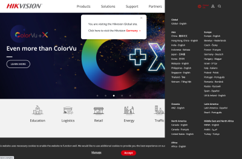](https://www.hikvision.com/en/)

[Hikvision](https://www.hikvision.com/en/) with a sidebar overlay on the right. [Hikvinson](https://www.hikvision.com/en/) ([Large preview](https://cloud.netlifyusercontent.com/assets/344dbf88-fdf9-42bb-adb4-46f01eedd629/d021f79c-3c78-4f37-9d53-7ffa1418b5ba/2-designing-better-language-selector.png))

Where do we place a language selector? Well, users have their usual suspects of course. In my experience, when asked to change a country or language, a vast majority of users will immediately **head to the header of the page first**, and if they can’t find it there, they’ll jump all the way to the bottom of the page and scout the footer next.

我们在哪里放置语言选择器？ 好吧，用户当然有他们通常的怀疑。 根据我的经验，当被要求更改国家或语言时，绝大多数用户会立即 **首先转到页面的标题** ，如果在那里找不到，他们会一直跳到页面底部页面，然后查看页脚。

As for indicators of country selection, flags actually do work fairly well, and if users can’t spot them, they seek other icons that might represent a language in one way or the other — such as the globe icon or a “translation” icon. Obviously, when it comes to translations of articles or specific pages, users rely on the [laws of locality](https://learnui.design/blog/the-3-laws-of-locality.html) and search for a selection of language next to the title of the article. So far so good.

至于国家选择指标，旗帜实际上工作得很好，如果用户找不到它们，他们会寻找可能以某种方式代表一种语言的其他图标——比如地球图标或“翻译”图标. 显然，当涉及到文章或特定页面的翻译时，用户依赖 [当地的法律](https://learnui.design/blog/the-3-laws-of-locality.html) 并在文章标题旁边搜索语言选择。 到目前为止，一切都很好。

[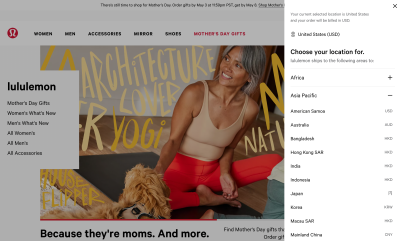](https://shop.lululemon.com/)

Lululemon with a sidebar overlay on the right. The language is selected with a separated dropdown. [Lululemon](https://shop.lululemon.com/) ([Large preview](https://cloud.netlifyusercontent.com/assets/344dbf88-fdf9-42bb-adb4-46f01eedd629/cc54664b-cd80-4df1-b01b-9355d1dc5fb0/3-designing-better-language-selector.png))

Design-wise, however, there are plenty of intricate details that we need to account for. Surely the selector on its own will live somewhere in the footer of the page, and it is also very likely to make its appearance in the header as well. However, we could also **auto-redirect users** based on their location and **auto-detect language** based on the browser’s preferences, or prompt a modal window and ask users to select a region first. We could be using text labels or abbreviations, icons or flags, native or custom dropdowns, preferences panes or sidebars, toggles, or standalone pages.

然而，在设计方面，我们需要考虑很多复杂的细节。 当然，选择器本身会存在于页面页脚的某个位置，而且它也很可能会出现在页眉中。 然而，我们也可以 **自动重定向用户** 根据用户的位置 **，并根据浏览器的偏好自动检测语言** ，或者提示一个模态窗口并要求用户先选择一个区域。 我们可以使用文本标签或缩写、图标或标志、本机或自定义下拉菜单、首选项窗格或侧边栏、切换按钮或独立页面。

As we will see, many of these solutions have usability issues on their own; and if we want to **maximize clarity and reduce ambiguity**, we need to come up with a proper strategy of how to label and group languages, how to present them, and how to make the language selector obvious to users — without running into a wild mixture of accessibility and auto-translation problems down the line.

正如我们将看到的，这些解决方案中的许多都有自己的可用性问题； 如果我们想 **最大限度地提高清晰度并减少歧义** ，我们需要想出一个正确的策略来标记和分组语言，如何呈现它们，以及如何让语言选择器对用户显而易见——而不是乱七八糟地混在一起可访问性和自动翻译问题。

Let’s start with something that is probably obvious, but worth stating nevertheless — auto-redirects might be helpful, but they often cause more frustration and annoyance than a help.

让我们从可能很明显但仍然值得一提的事情开始——自动重定向可能会有帮助，但它们往往比帮助更让人沮丧和烦恼。

More after jump! Continue reading below ↓

## Avoid Auto-Redirects [#](https://www.smashingmagazine.com/2022/05/designing-better-language-selector/#avoid-auto-redirects)

## 避免自动重定向 [#](https://www.smashingmagazine.com/2022/05/designing-better-language-selector/#avoid-auto-redirects)

Many websites rely on redirects based on **user’s location (IP) or browser’s language**. However, if a person is located in Tokyo, it doesn’t necessarily imply that they fluently read Japanese. And if their preferred locale is Dutch, it doesn’t mean that they want to deliver physical items to the Netherlands. In the same way, if the preferred locale is French, yet it isn’t available on the site, a user might encounter a fallback language that isn’t necessarily the language that they are most comfortable with.

许多网站依赖于基于 **用户位置 (IP) 或浏览器语言的** 重定向。 但是，如果一个人位于东京，并不一定意味着他们能流利地阅读日语。 如果他们的首选语言环境是荷兰语，这并不意味着他们想将实物物品运送到荷兰。 同样，如果首选语言环境是法语，但该语言在站点上不可用，则用户可能会遇到不一定是他们最熟悉的语言的后备语言。

**We can’t confidently infer users’ preferences** without asking them first. That doesn’t mean that we should avoid redirects at all costs though. If a user happens to be connecting to a US website from Germany, it‘s perfectly reasonable to nudge them towards a German website. But if they happen to be connecting to a German website with an English locale preferred, it would be confusing to redirect them to the UK or US version of the site — even though it might very well be the user’s intent in some rare cases.

**用户，我们就无法自信地推断出他们的偏好** 如果不先询问 。 但这并不意味着我们应该不惜一切代价避免重定向。 如果用户碰巧从德国连接到美国网站，将他们推向德国网站是完全合理的。 但是，如果他们碰巧连接到首选英语语言环境的德语网站，将他们重定向到该网站的英国或美国版本将会造成混淆——尽管在极少数情况下这很可能是用户的意图。

In general, **redirects based on location** are probably more instructive than redirects based on the browser’s language, but they are error-prone, too.

一般来说， **基于位置** 的重定向可能比基于浏览器语言的重定向更有指导意义，但它们也容易出错。

[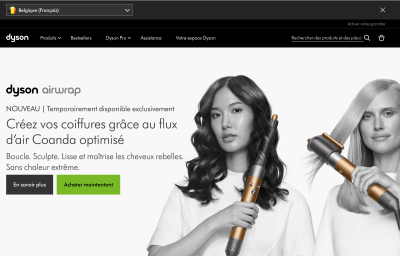](https://www.dyson.be/fr)

A language selector drop-down in the header of [Dyson.be](https://www.dyson.be/fr). ([Large preview](https://cloud.netlifyusercontent.com/assets/344dbf88-fdf9-42bb-adb4-46f01eedd629/daed8803-d2c8-4d9e-a963-e0391faef8cf/4-designing-better-language-selector.png))

On the very first visit, [Dyson.com](https://www.dyson.be/fr) nudges visitors to select the preferred region and language in the header on the page. Users can dismiss the bar and locate the language selector in the footer of the page again.

在第一次访问时， [Dyson.com 会促使](https://www.dyson.be/fr) 访问者在页面标题中选择首选地区和语言。 用户可以关闭该栏并再次在页面底部找到语言选择器。

[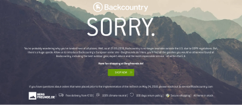](http://backcountry.com/)

[Backcountry](http://backcountry.com/) auto-redirects users to another website. ([Large preview](https://cloud.netlifyusercontent.com/assets/344dbf88-fdf9-42bb-adb4-46f01eedd629/7863bbe0-79d5-4084-8066-680ca9beb278/58-designing-better-language-selector.png))

[Backcountry](http://backcountry.com/), a US company for outdoor gear and clothing, automatically redirects its users to another site. Since 2018, the website is no longer available outside the U.S. as an answer to the GDPR regulations. Without a VPN, it’s **impossible to reach the website**, for example, to purchase and deliver a gift for a friend located in the U.S.

[Backcountry](http://backcountry.com/) 是一家美国户外装备和服装公司，它会自动将其用户重定向到另一个站点。 自 2018 年以来，作为对 GDPR 法规的回应，该网站不再在美国境外可用。 没有 VPN，就 **无法访问该网站** ，例如，为位于美国的朋友购买和运送礼物

[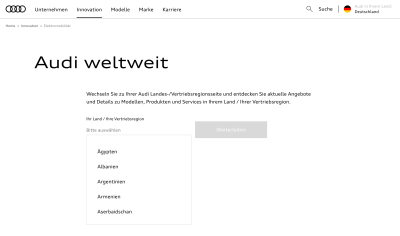](https://www.audi.com/de.html)

[Audi](https://www.audi.com/de.html) auto-redirects users based on location. ([Large preview](https://cloud.netlifyusercontent.com/assets/344dbf88-fdf9-42bb-adb4-46f01eedd629/22c0525d-38ff-4c10-b652-8205f06aa8e6/59-designing-better-language-selector.png))

[Audi](https://www.audi.com/de.html) automatically redirects users to a country deemed as a **best fit**. However, users can choose their country by clicking on the language selector in the right upper corner. On click, a modal shows up with autocomplete and a disabled “Continue” button.

[奥迪](https://www.audi.com/de.html) 自动将用户重定向到一个被认为 **最合适** 的国家。 然而，用户可以通过点击右上角的语言选择器来选择他们的国家。 单击时，会显示一个带有自动完成功能和禁用的“继续”按钮的模式。

[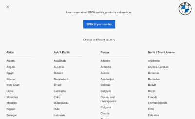](https://www.bmw.com/)

[BMW](https://www.bmw.com/) avoids auto-redirect and guides users to a choice that works for them. ([Large preview](https://cloud.netlifyusercontent.com/assets/344dbf88-fdf9-42bb-adb4-46f01eedd629/99550a32-ad47-466d-b310-8630920b517a/61-designing-better-language-selector.png))

A global [BMW website](https://www.bmw.com/) doesn’t automatically redirect users to any website. Instead, you can locate the **“BMW in your country” option** in the right upper corner of the header. It opens a modal with all the options listed, along with the prominent button at the top “BMW in your country”, which, on click, redirects users to the website considered to be the best fit for them.

全球 [BMW 网站](https://www.bmw.com/) 不会自动将用户重定向到任何网站。 相反，您可以 **找到“您所在国家/地区的 BMW”选项** 在标题的右上角 。 它会打开一个模式，其中列出了所有选项，以及顶部“您所在国家/地区的 BMW”的突出按钮，单击该按钮会将用户重定向到被认为最适合他们的网站。

[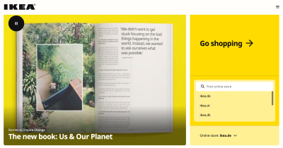](https://www.ikea.com/)

[IKEA](https://www.ikea.com/), with a smart autocomplete for a language selection. ([Large preview](https://cloud.netlifyusercontent.com/assets/344dbf88-fdf9-42bb-adb4-46f01eedd629/99f66be3-fee3-4d15-a887-4ebe11a23725/62-designing-better-language-selector.png))

[IKEA](https://www.ikea.com/), without an automatic redirect, but with a very large country selector that understands **domains, endonyms and languages** of the largest countries in the world. The “Go shopping” button might be the biggest button in the world and might deserve a spot in the World Guinness Records Book. Unfortunately, on the site, you can change the country, but not always the language.

[IKEA](https://www.ikea.com/) ，没有自动重定向，但有一个非常大的国家选择器，可以理解 **世界上最大国家的域名、地名和语言** 。 “去购物”按钮可能是世界上最大的按钮，可能值得在世界吉尼斯纪录中占有一席之地。 不幸的是，在网站上，您可以更改国家/地区，但不能总是更改语言。

While **polite nudging is reasonable**, automatic redirects are not. Once we start moving users from one site to another without asking them at all, we start baking our assumptions into the design, and that’s usually a red flag. We shouldn’t be surprised by increased levels of frustration and abandonment as a result. Ironically, this data is rarely tracked or known as the abandonment is happening on the “other” website, with different departments and teams on the other side of the globe.

虽然 **礼貌的推动是合理** 的，但自动重定向则不然。 一旦我们开始将用户从一个站点转移到另一个站点而根本不询问他们，我们就开始将我们的假设融入设计中，这通常是一个危险信号。 我们不应该对因此而增加的挫折感和放弃感感到惊讶。 具有讽刺意味的是，这些数据很少被跟踪或知道，因为放弃发生在“其他”网站上，不同的部门和团队位于地球的另一端。

Either way, whether we want to nudge users towards a different website, or we absolutely need to use an auto-redirect, it’s definitely a good idea to always allow users to **override redirects** with manual preferences. This requires us to tame our assumptions and decouple our presets.

无论哪种方式，无论我们是想将用户推向不同的网站，还是我们绝对需要使用自动重定向，始终允许用户 **覆盖重定向** 使用手动偏好 绝对是一个好主意。 这需要我们驯服我们的假设并解耦我们的预设。

## Decouple Location and Language Presets [#](https://www.smashingmagazine.com/2022/05/designing-better-language-selector/#decouple-location-and-language-presets)

## 解耦位置和语言预设 [#](https://www.smashingmagazine.com/2022/05/designing-better-language-selector/#decouple-location-and-language-presets)

Many websites rely on an assumption that **location, language and currency** are usually tightly coupled. After all, if a user chooses a location in Germany, they are very likely to prefer the German language and see prices in Euro. However, this is based on assumptions that work for many people, but **break the experience entirely** for others.

许多网站都假设 **位置、语言和货币** 通常紧密相关。 毕竟，如果用户选择德国的位置，他们很可能更喜欢德语并以欧元查看价格。 然而，这是基于对许多人有效的假设，但 **对其他人来说却完全破坏了体验** 。

[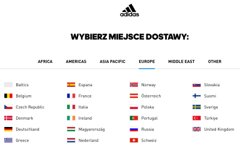](https://www.adidas.com/)

Delivery location and language selection are tightly coupled on [Adidas](https://www.adidas.de/). It’s impossible to adjust the country and the preferred language separately. ([Large preview](https://cloud.netlifyusercontent.com/assets/344dbf88-fdf9-42bb-adb4-46f01eedd629/8c54d2c5-531a-4f7d-a0c2-de938e96d559/6-designing-better-language-selector.png))

For example, if you want to purchase sneakers on [Adidas](https://www.adidas.de/) from Germany but deliver them to your friend in Poland, you need to be able to make sense of the Polish language when checking out. You can either choose the German language with delivery to Germany or the Polish language with delivery to Poland. It’s impossible to select the English language with delivery options to Poland, for example. In other words, **both language and location are tightly coupled**.

例如，如果您想从德国的 [阿迪达斯](https://www.adidas.de/) 购买运动鞋，但要将它们运送给您在波兰的朋友，则您需要在结账时能够理解波兰语。 您可以选择交付到德国的德语或交付到波兰的波兰语。 例如，无法选择带有波兰送货选项的英语。 换句话说， **语言和位置都是紧密耦合的** 。

As it turns out, there are plenty of scenarios where this assumption doesn’t work:

事实证明，在很多情况下这个假设都不成立：

-   A person is using a **German VPN**, but not be located in Germany nor understands German;
-   一个人正在使用 **德国 VPN** ，但不在德国也不懂德语；
-   A person is connecting from Germany, but be **visiting for a few days**, and they might not speak nor read German at all;
-   一个人从德国转机，但要 **访问几天** ，他们可能根本不会说或看不懂德语；
-   A person is living in Germany, access a website in German, but prefers to pay with a company’s credit card in USD, rather than in EUR;
-   一个人住在德国，访问德语网站，但更喜欢用公司的信用卡支付美元，而不是欧元；
-   A person is living in Germany might want to deliver an item from an American store to an **American friend**, but keeps getting redirected to a German website;
-   居住在德国的人可能想从美国商店向 **美国朋友** 运送商品，但不断被重定向到德国网站；
-   A person is connecting from the USA but needs to be able to provide a VAT number because the product will be purchased by a German office with a **German credit card**.
-   一个人从美国连接，但需要能够提供增值税号，因为该产品将由德国办事处使用 **德国信用卡** 购买。

Of course, we might consider all these situations to be **very rare edge cases** and dismiss them. But first, we need to track how many people actually experience such issues and end up leaving as a result. In practice, especially for global brands, these numbers might be more significant than one might think.

当然，我们可能会认为所有这些情况都是 **非常罕见的边缘情况** 并忽略它们。 但首先，我们需要跟踪有多少人实际遇到过此类问题并最终离开。 在实践中，尤其是对于全球品牌而言，这些数字可能比人们想象的更重要。

These problems appear because we frame common situations in tightly coupled and rather **inflexible presets**. Surely presets are useful as default options, but they break down when defaults aren’t good enough. That’s why it’s usually a good idea to decouple all presets, and allow users to make standalone choices.

这些问题的出现是因为我们在紧密耦合且相当 **不灵活的预设** 中构建常见情况。 当然，预设作为默认选项很有用，但当默认值不够好时，它们就会崩溃。 这就是为什么解耦所有预设并允许用户做出独立选择通常是个好主意。

[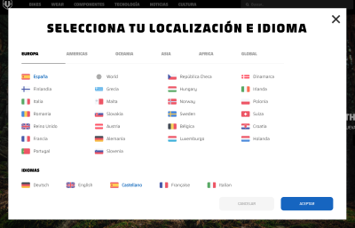](https://mondraker.com/es/es)

A similar design, but a different approach. On Mondraker, users select location and language separately. [Mondraker](https://mondraker.com/es/es) ([Large preview](https://cloud.netlifyusercontent.com/assets/344dbf88-fdf9-42bb-adb4-46f01eedd629/4487f1b3-80ff-4582-84fb-e8cda00968d9/7-designing-better-language-selector.png))

On [Mondraker](https://mondraker.com/es/es), users **select location and language separately**. All countries are grouped into tabs, and at the bottom users can choose the language of their preference. A very similar design, but a quite different approach. A downside: labeling all countries in a selected language is probably not as effective as using corresponding native labels instead.

在 [Mondraker 上](https://mondraker.com/es/es) ，用户 **分别选择位置和语言** 。 所有国家都被分组到标签中，用户可以在底部选择他们喜欢的语言。 一个非常相似的设计，但一个完全不同的方法。 缺点：用选定的语言标记所有国家可能不如使用相应的本地标签有效。

[Monese](https://monese.com/gb/en) with tabs, separating language and country selection. ([Large preview](https://cloud.netlifyusercontent.com/assets/344dbf88-fdf9-42bb-adb4-46f01eedd629/63fa1fc9-56ea-49b7-9c8e-9ac4fd171227/monese.jpg))

[Monese](https://monese.com/gb/en) shows **two tabs** in the right upper corner of the header. Users can switch between language and country, defining preferences for each separately.

[Monese](https://monese.com/gb/en) 显示 **两个选项卡** 在标题的右上角 。 用户可以在语言和国家之间切换，分别为每个人定义偏好。

User preferences don’t have to be limited by country and language alone. We can allow users to **customize further parts of the UI**, from currency and auto-translation to units of measurement and date formatting.

用户首选项不必仅受国家和语言的限制。 我们可以允许用户 **自定义 UI 的更多部分** ，从货币和自动翻译到度量单位和日期格式。

## Allow Users To Set Custom Preferences [#](https://www.smashingmagazine.com/2022/05/designing-better-language-selector/#allow-users-to-set-custom-preferences)

## 允许用户设置自定义首选项 [#](https://www.smashingmagazine.com/2022/05/designing-better-language-selector/#allow-users-to-set-custom-preferences)

For many sites, language and location are just the first important attributes that convey what website might be a good fit for a customer. However, to deliver value to users, we might want to go a little bit beyond that.

对于许多网站，语言和位置只是传达哪个网站可能适合客户的首要重要属性。 然而，为了向用户提供价值，我们可能想要超越这一点。

[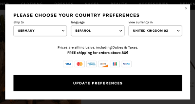](https://www.revolve.com/)

[Revolve](https://www.revolve.com/) with separate selections for language, country and currency. ([Large preview](https://cloud.netlifyusercontent.com/assets/344dbf88-fdf9-42bb-adb4-46f01eedd629/487e522a-d728-4cf2-aae0-272c7e91c2d1/10-designing-better-language-selector.png))

[Revolve.com](https://www.revolve.com/) uses **language, country and currency presets** based on the user’s IP and their browser’s locale. However, users can override these presets with custom preferences. They can choose a country for shipping, the language on the site and the currency. The hint for preferences is located in the header, with a combination of a language abbreviation, flag and a currency indicator.

[Revolve.com](https://www.revolve.com/) 使用 **语言、国家和货币预设** 根据用户的 IP 和浏览器的区域设置 。 但是，用户可以使用自定义首选项覆盖这些预设。 他们可以选择运送国家、网站语言和货币。 首选项提示位于标题中，包含语言缩写、标志和货币指示符的组合。

These details are enough to **show all products with the final price** that includes delivery costs to their country and in the currency that’s most familiar to them. That’s what the perfect decoupling of location, language and currency is.

这些详细信息足以 **显示所有产品的最终价格** ，包括运往他们国家的运费，并以他们最熟悉的货币显示。 这就是位置、语言和货币的完美解耦。

[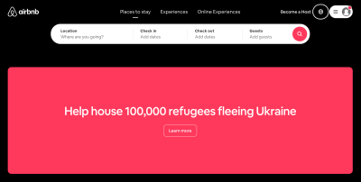](https://www.airbnb.com/)

[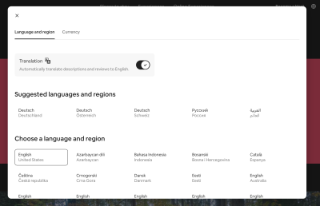](https://www.airbnb.com/)

The language and country selection are decoupled on [AirBnB](https://www.airbnb.com/). ([Large preview](https://cloud.netlifyusercontent.com/assets/344dbf88-fdf9-42bb-adb4-46f01eedd629/1b34af0e-c9e1-4155-acc6-085a697362a2/12-designing-better-language-selector.png))

[AirBnB](https://www.airbnb.com/) suggests languages and regions in groups, but also allows users to adjust their preferences and choose a language and region of their choice. Additionally, users can **opt-in to automatically translate descriptions** and reviews to English. The modal is prompted by a tap on the globe icon in the right upper corner of the header.

[AirBnB](https://www.airbnb.com/) 会按组推荐语言和地区，但也允许用户调整他们的偏好并选择他们喜欢的语言和地区。 此外，用户可以 **选择自动将描述** 和评论翻译成英文。 通过点击标题右上角的地球图标来提示模态。

Once the settings are set, users can jump from one location to another, **compare prices in the same currency** and see reviews automatically translate to a language that they might understand better. That’s undoubtedly a win for the users.

设置完成后，用户可以从一个位置跳到另一个位置， **比较相同货币的价格，** 并看到评论自动翻译成他们可能更好理解的语言。 这无疑是用户的胜利。

[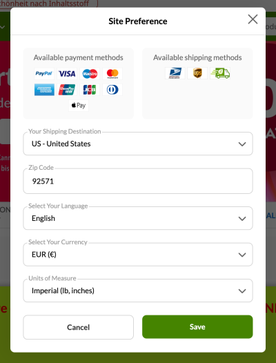](https://de.iherb.com/)

[iHerb](https://de.iherb.com/) with plenty of extra preferences available to users. ([Large preview](https://cloud.netlifyusercontent.com/assets/344dbf88-fdf9-42bb-adb4-46f01eedd629/2fd37bf3-01e8-4dcc-a584-b715c599e310/13-designing-better-language-selector.png))

[iHerb](https://de.iherb.com/) goes the extra mile by providing a whole range of additional preferences for their users. Not only can users choose their language, preferred currency and shipping destination (and specify it with ZIP code for US destinations) — they can also choose **preferred units of measure** and check available payment methods and available shipping methods. Bonus points for smart autocomplete input rather than a not-so-good old-fashioned [<select>-dropdown](https://www.fuckdropdowns.com/).

[iHerb](https://de.iherb.com/) 通过为用户提供一系列额外的偏好，走得更远。 用户不仅可以选择他们的语言、首选货币和送货目的地（并为美国目的地指定邮政编码）——他们还可以选择 **首选计量单位** 并检查可用的付款方式和可用的送货方式。 智能自动完成输入的奖励点，而不是不太好的老式 [<select>-dropdown](https://www.fuckdropdowns.com/) 。

[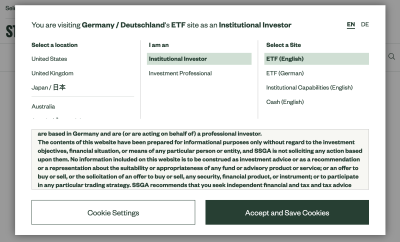](https://www.ssga.com/de/en_gb/institutional/etfs/funds/spdr-sp-500-ucits-etf-dist-spy5-gy)

[State Street of Global Advisors](https://www.ssga.com/de/en_gb/institutional/etfs/funds/spdr-sp-500-ucits-etf-dist-spy5-gy) provides not only a choice of location, but also settings for roles and types of available sites. ([Large preview](https://cloud.netlifyusercontent.com/assets/344dbf88-fdf9-42bb-adb4-46f01eedd629/63d0d8f5-bbd2-4695-8a12-dc860e99218b/14-designing-better-language-selector.png))

Some slightly different preferences can be defined on the [State Street of Global Advisors](https://www.ssga.com/de/en_gb/institutional/etfs/funds/spdr-sp-500-ucits-etf-dist-spy5-gy). On the first visit, a modal window appears explaining to users some of the assumptions that the interface is making about the location and their interests. Within the modal window, users can change a location, **specify their role** and choose a preferred type of site for their visit.

可以在 [State Street of Global Advisors](https://www.ssga.com/de/en_gb/institutional/etfs/funds/spdr-sp-500-ucits-etf-dist-spy5-gy) 上定义一些略有不同的偏好。 第一次访问时，会出现一个模式窗口，向用户解释界面对位置和他们的兴趣所做的一些假设。 在模态窗口中，用户可以更改位置、 **指定他们的角色** 并选择他们访问的首选站点类型。

In general, these are some of the useful adjustments that we could allow users to specify to customize the entire experience for them:

一般来说，这些是我们可以允许用户指定的一些有用的调整，以便为他们定制整个体验：

-   Shipping location
-   发货地点
-   Preferred currency
-   首选货币
-   Units of measure
-   计量单位
-   **Time/date formatting**
-   **时间/日期格式**
-   Time zones preferences
-   时区偏好
-   **Level of experience**
-   **经验等级**

The question, of course, is how to **surface all these settings to the user** — in a separate settings page, as a sidebar, in the header, or the footer? One disputable option is to show the settings in a modal or non-modal window upon entry to the site.

当然，问题是如何将 **所有这些设置呈现给用户** ——在单独的设置页面中，作为侧边栏，在页眉中，还是在页脚中？ 一个有争议的选择是在进入站点时在模态或非模态窗口中显示设置。

## A Case For Non-Modal Dialogs [#](https://www.smashingmagazine.com/2022/05/designing-better-language-selector/#a-case-for-non-modal-dialogs)

## 非模态对话框的案例 [#](https://www.smashingmagazine.com/2022/05/designing-better-language-selector/#a-case-for-non-modal-dialogs)

Admittedly, modal windows are [rarely a good idea](https://www.nngroup.com/articles/modal-nonmodal-dialog/). They are disruptive and annoying as they require immediate attention. However, they are appropriate when we need to draw the user’s attention to important details — be it loss of data, mutually exclusive preferences or critical errors.

诚然，模态窗口 [很少是个好主意](https://www.nngroup.com/articles/modal-nonmodal-dialog/) 。 它们具有破坏性和烦人性，因为它们需要立即引起注意。 然而，当我们需要将用户的注意力吸引到重要细节时，它们是合适的——无论是数据丢失、相互排斥的偏好还是严重错误。

Some of the websites listed above **prompt a modal window** on the very first visit, asking users to specify their intent and their preferences before using the site. On others, default presets are silently applied, with an option to adjust them if needed — sometimes in a modal, and sometimes on a dedicated page.

上面列出的一些网站 **在第一次访问时会提示一个模式窗口** ，要求用户在使用该网站之前指定他们的意图和偏好。 在其他人身上，默认预设是静默应用的，如果需要，可以选择调整它们——有时在模态中，有时在专用页面上。

[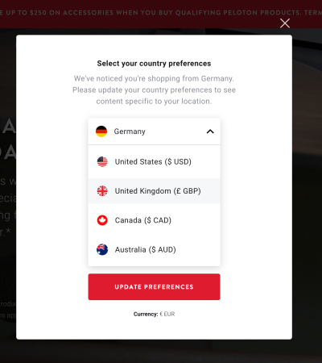](https://www.onepeloton.com/)

[Peloton](https://www.onepeloton.com/) provides a choice for country preferences in a modal upon website entry. ([Large preview](https://cloud.netlifyusercontent.com/assets/344dbf88-fdf9-42bb-adb4-46f01eedd629/2597d68b-0e79-4751-868c-b79d879d5980/15-designing-better-language-selector.png))

While modal windows will always be noticed, [usability tests show](https://youtu.be/mAiNdU1go1A?t=3744) that they are often **instinctively dismissed**, sometimes even before users realize what content they contain. On the other hand, users often don’t pay attention to any accessory navigation such as choice of currency, measurements or shipping location as they are very much focused on products. It’s only if the change of the language is necessary that they might notice that further settings can be adjusted as well.

虽然模态窗口总是会被注意到，但 [可用性测试表明](https://youtu.be/mAiNdU1go1A?t=3744) 它们经常被 **本能地忽略** ，有时甚至在用户意识到它们包含什么内容之前。 另一方面，用户通常不会注意任何辅助导航，例如选择货币、尺寸或送货地点，因为他们非常关注产品。 只有在需要更改语言时，他们才会注意到还可以调整进一步的设置。

[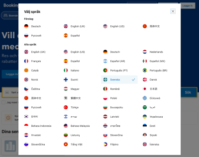](https://booking.com/)

A language selector appearing in a modal on [Booking](https://booking.com/). ([Large preview](https://cloud.netlifyusercontent.com/assets/344dbf88-fdf9-42bb-adb4-46f01eedd629/a4caba1d-fcb7-4ff4-ad75-47f42d539173/17-designing-better-language-selector.png))

[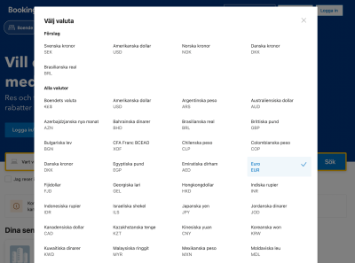](https://booking.com/)

A currency selector with most popular options listed on the top on [Booking](https://booking.com/). ([Large preview](https://cloud.netlifyusercontent.com/assets/344dbf88-fdf9-42bb-adb4-46f01eedd629/e9130a99-6bdf-4e6b-9f9c-ef4dbf900cb7/18-designing-better-language-selector.png))

Rather than using one modal with tabs, [Booking](https://booking.com/) uses **separate buttons** in the header for currency and language. The interface infers some settings from the user and applies them directly, with an option to override these settings. Rather than using a `<select>`\-dropdown, which is often the slowest form component, all options are **displayed in plain text**, hence being searchable by in-browser search.

没有使用带有选项卡的单一模式，而是 [Booking](https://booking.com/) 使用 **单独的按钮** 在标题中 来显示货币和语言。 该界面从用户那里推断出一些设置并直接应用它们，并提供覆盖这些设置的选项。 而不是使用 `<select>`\-dropdown，通常是最慢的表单组件，所有选项都 **以纯文本显示** ，因此可以通过浏览器内搜索进行搜索。

[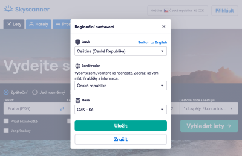](https://www.skyscanner.com/)

[Skyscanner](https://www.skyscanner.com/), with the language, location and currency all decoupled and displayed in a modal window. ([Large preview](https://cloud.netlifyusercontent.com/assets/344dbf88-fdf9-42bb-adb4-46f01eedd629/1f97dfc6-f254-45b4-88c1-1765459a05a2/19-designing-better-language-selector.png))

For comparison, [Skyscanner](https://www.skyscanner.com/) allows users to prompt all customization options with one large button, grouping all options in a few drop-downs. Also, the interface always allows users to fall back to the English language if they’ve accidentally made a mistake.

相比之下， [Skyscanner](https://www.skyscanner.com/) 允许用户使用一个大按钮提示所有自定义选项，将所有选项分组在几个下拉列表中。 此外，如果用户不小心犯了错误，该界面始终允许用户退回到英语。

**Which option is better?** Ultimately, this will of course be decided by usability tests. In this particular case, showing a modal window upon entry might not be a bad idea since it provides tangible value to users — a value that they might not be able to spot otherwise. However, there might be an alternative option that could work even better — using a **non-modal dialog** instead.

**哪个选项更好？** 最终，这当然将由可用性测试决定。 在这种特殊情况下，在输入时显示模态窗口可能不是一个坏主意，因为它为用户提供了有形的价值——他们可能无法通过其他方式发现的价值。 然而，可能有一个更好的替代选项——使用 **非模态对话框** 。

[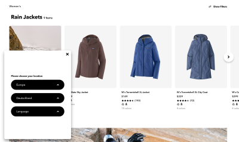](https://www.patagonia.com/home/)

Patagonia uses a non-modal for location and language selection. [Patagonia](https://www.patagonia.com/home/) ([Large preview](https://cloud.netlifyusercontent.com/assets/344dbf88-fdf9-42bb-adb4-46f01eedd629/24eb7a65-0ad6-456d-bda6-0625d946b318/20-designing-better-language-selector.png))

Upon website entry on [Patagonia](https://www.patagonia.com/home/), a **sticky non-modal dialog** appears in the left bottom corner. Users can choose location and language and save their preferences as a cookie. They can also always bring the selection back by accessing the preferences bar in the footer.

在 [Patagonia](https://www.patagonia.com/home/) 一个 **粘性非模态对话框** 上输入网站后，左下角会出现 。 用户可以选择位置和语言，并将他们的偏好保存为 cookie。 他们还可以随时通过访问页脚中的首选项栏来恢复选择。

[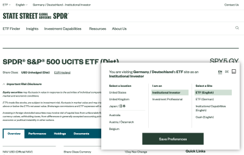](https://www.ssga.com/de/en_gb/institutional/etfs/funds/spdr-sp-500-ucits-etf-dist-spy5-gy)

Replacing modals with non-modals is usually a good idea. A mock-up of [State Street Global Advisors - SPDR](https://www.ssga.com/de/en_gb/institutional/etfs/funds/spdr-sp-500-ucits-etf-dist-spy5-gy). ([Large preview](https://cloud.netlifyusercontent.com/assets/344dbf88-fdf9-42bb-adb4-46f01eedd629/2bccba3f-eb0e-49dd-8258-d01d982a35be/22-designing-better-language-selector.png))

In the mock-up above, the important **content isn’t blocked by the modal**; users can scroll, navigate, select and copy-paste. However, the preference pane appears in the bottom right section of the screen. It can also be collapsed or minimized, but it does require an action from the user. It is a little bit more intrusive than when silently placed in the global navigation, but is easier to discover as well.

在上面的模型中，重要 **内容没有被模态挡住** ； 用户可以滚动、导航、选择和复制粘贴。 但是，首选项窗格出现在屏幕的右下角。 它也可以折叠或最小化，但需要用户执行操作。 它比静静地放置在全局导航中时更具侵入性，但也更容易发现。

If you aren’t certain about the best option for your project, consider adding a link in the navigation bar first. Measure [design KPIs](https://www.smashingmagazine.com/2022/04/boosting-ux-with-design-kpis/) and test how they change with a non-modal option — a much **less intruding and more friendly** option — and ultimately a modal. Chances are high that the modals might perform better than one might think.

如果您不确定项目的最佳选择，请考虑先在导航栏中添加一个链接。 衡量 [设计 KPI](https://www.smashingmagazine.com/2022/04/boosting-ux-with-design-kpis/) 并测试它们如何使用非模态选项（一种 **侵入性小得多且更友好的** 选项）以及最终的模态选项进行更改。 很有可能模态的表现比人们想象的要好。

Large corporations know the problem too well: navigating dozens of options in a **small overlay**, or even a large modal is quite cumbersome and requires a **healthy dose of scrolling**. So it’s not very surprising that often websites present all available options on separate pages, broken down by regions and sometimes illustrated with country flags.

大公司太了解这个问题了：在一个 **小的叠加层** 中导航几十个选项，甚至是一个大的模式都非常麻烦，需要 **适当的滚动** 。 因此，网站通常在单独的页面上显示所有可用选项，按地区分类，有时还用国旗说明，这并不奇怪。

[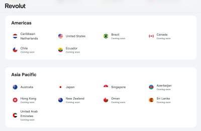](https://www.revolut.com/en-DE/change-country)

[Revolut](https://www.revolut.com/en-DE/change-country) with all available options displayed on a dedicated page. ([Large preview](https://cloud.netlifyusercontent.com/assets/344dbf88-fdf9-42bb-adb4-46f01eedd629/91c91e45-b876-47dc-b9c8-9f25920d0dff/23-designing-better-language-selector.png))

[Revolut](https://www.revolut.com/en-DE/change-country) displays all available options on a separate, dedicated page. The countries are **written in the English language**, organized in groups and listed alphabetically. However, the page doesn’t only showcase available locations, but also locations that aren’t available yet. For this particular case, it might be a good idea to allow users to filter — e.g. hide all unavailable locations, perhaps with a toggle or tab above the list.

[Revolut](https://www.revolut.com/en-DE/change-country) 在单独的专用页面上显示所有可用选项。 这些国家/地区 **以英文书写** ，分组并按字母顺序排列。 但是，该页面不仅展示可用位置，还展示尚不可用的位置。 对于这种特殊情况，允许用户过滤可能是个好主意——例如，隐藏所有不可用的位置，可能在列表上方使用切换或选项卡。

[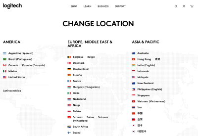](https://www.logitech.com/en-us/change-location.html)

[Logitech](https://www.logitech.com/en-us/change-location.html) displays languages in their local format — that might be easier to deal with for a truly global audience. ([Large preview](https://cloud.netlifyusercontent.com/assets/344dbf88-fdf9-42bb-adb4-46f01eedd629/47815086-19ca-40f8-becc-3976efb7bdfd/24-designing-better-language-selector.png))

[Logitech](https://www.logitech.com/en-us/change-location.html) displays most **languages in their local format** — e.g. “Deutschland” for Germany, and “中文” for China. This eliminates the assumption that the user needs to understand English to find the country or language of their choice. On the page, all countries (and available languages) are grouped by geography and displayed across columns, making it easier for users to discover them.

[罗技](https://www.logitech.com/en-us/change-location.html) 显示大多数 **以本地格式** 语言——例如，“Deutschland”代表德国，“中文”代表中国。 这消除了用户需要理解英语才能找到他们选择的国家或语言的假设。 在该页面上，所有国家（和可用语言）都按地理位置分组并跨栏显示，使用户更容易发现它们。

[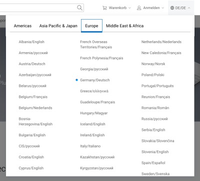](https://dell.com/)

Countries grouped into tabs on [Dell](https://dell.com/). ([Large preview](https://cloud.netlifyusercontent.com/assets/344dbf88-fdf9-42bb-adb4-46f01eedd629/e6455e05-dd05-40e9-b569-2285d5875d5c/25-designing-better-language-selector.png))

Rather than displaying all available options on one long page, [Dell](https://dell.com/) breaks countries by regions within **tabs**. No flags are being used, making the scanning a bit more difficult. Countries and languages are combined. In this case, less scrolling is required to find a location that would fit users best.

不是在一个长页面上显示所有可用选项，而是 [戴尔](https://dell.com/) 中按地区划分国家/地区 **在选项卡** 。 没有使用标志，使扫描更加困难。 国家和语言结合在一起。 在这种情况下，需要更少的滚动来找到最适合用户的位置。

[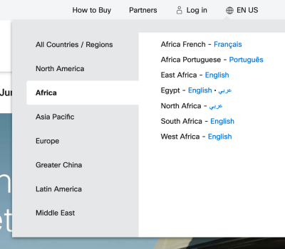](https://www.cisco.com/)

Vertical tabs in action on [Cisco](https://www.cisco.com/). ([Large preview](https://cloud.netlifyusercontent.com/assets/344dbf88-fdf9-42bb-adb4-46f01eedd629/e2fd9092-d5d1-48f7-ae55-970c7b2feb2b/26-designing-better-language-selector.png))

Not all tabs are alike though. [Cisco](https://www.cisco.com/) uses a small overlay with **vertical tabs**, rather than horizontal ones. This makes the selection very compact, and the solution very straightforward. It’s worth noting that the main disadvantage of tabs is that they make the content inaccessible with an in-browser search (well, [for now](https://twitter.com/addyosmani/status/1520459804656824320)). The user always has to select a region first.

但并非所有选项卡都一样。 [Cisco](https://www.cisco.com/) 使用带有 **垂直选项卡** 的小覆盖层，而不是水平选项卡。 这使得选择非常紧凑，解决方案也非常简单。 值得注意的是，选项卡的主要缺点是它们使内容无法通过浏览器内搜索访问（好吧， [现在](https://twitter.com/addyosmani/status/1520459804656824320) ）。 用户总是必须首先选择一个区域。

[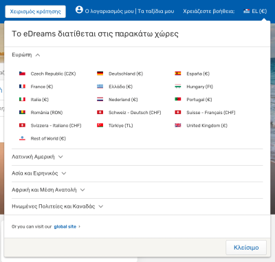](https://www.edreams.gr/)

[eDreams](https://www.edreams.gr/) with accordions in action. ([Large preview](https://cloud.netlifyusercontent.com/assets/344dbf88-fdf9-42bb-adb4-46f01eedd629/738ff172-4cea-464e-88c4-b90673eda4cc/27-designing-better-language-selector.png))

Another option, of course, is to group the countries with a **vertical accordion**, as it’s done on [eDreams](https://www.edreams.gr/), for example. You might need a bit more vertical space as a result, but all options can be scanned from top to bottom in one go.

当然，另一种选择是使用 **垂直手风琴** 上就是这样做的 [在eDreams](https://www.edreams.gr/) 对国家/地区进行分组，例如 。 因此，您可能需要更多的垂直空间，但可以一次从上到下扫描所有选项。

[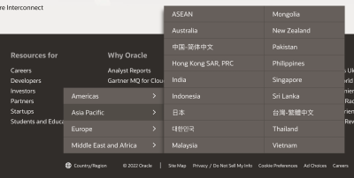](https://www.oracle.com/index.html)

[Oracle](https://www.oracle.com/index.html) ([Large preview](https://cloud.netlifyusercontent.com/assets/344dbf88-fdf9-42bb-adb4-46f01eedd629/93e870cc-5400-4dac-a225-899021f3eb0e/63-designing-better-language-selector.png))

A slightly different kind of country selector on [Oracle](https://www.oracle.com/index.html): a **click-through overlay menu**, with all countries grouped, rather than displaying a standalone page. That’s a very compact and straightforward solution.

上一种略有不同的国家/地区选择器 [Oracle](https://www.oracle.com/index.html) ： **点击覆盖菜单** ，将所有国家/地区分组，而不是显示独立页面。 这是一个非常紧凑和直接的解决方案。

If you need to display a wide range of languages, explore if you can group and display them on a single page. If it’s getting too overwhelming, consider grouping them within accordions or tabs — assuming that tabs appear like tabs and don’t contain cryptic labels. Or even better: provide users with poignant autocomplete suggestions.

如果您需要显示多种语言，请探索是否可以将它们分组并显示在一个页面上。 如果它变得过于庞大，请考虑将它们分组在手风琴或选项卡中 - 假设选项卡看起来像选项卡并且不包含神秘标签。 或者更好：为用户提供尖锐的自动完成建议。

## Show Autocomplete Suggestions [#](https://www.smashingmagazine.com/2022/05/designing-better-language-selector/#show-autocomplete-suggestions)

## 显示自动完成建议 [#](https://www.smashingmagazine.com/2022/05/designing-better-language-selector/#show-autocomplete-suggestions)

Getting autocomplete right isn’t an easy task. This is especially difficult if we are dealing with multiple pieces of information at once, i.e. both country and language. For it to work well, we need to **support frequent abbreviations**, [endonyms](https://en.wikipedia.org/wiki/List_of_countries_and_dependencies_and_their_capitals_in_native_languages), and shorthands for all available options. And then, of course, our autocomplete suggestions should display both countries and languages, with an option to choose one option or another. Plus, we also might want to consider the support of multiple “primary” languages (English, French, Spanish, to name a few). Thats’ not easy at all!

获得正确的自动完成功能并非易事。 如果我们同时处理多条信息，即国家和语言，这尤其困难。 为了使其正常工作，我们需要 **支持所有可用选项的常用缩写** 、 [地名](https://en.wikipedia.org/wiki/List_of_countries_and_dependencies_and_their_capitals_in_native_languages) 和简写。 然后，当然，我们的自动完成建议应该同时显示国家和语言，并提供选择一个选项或另一个选项的选项。 此外，我们还可能要考虑支持多种“主要”语言（英语、法语、西班牙语等）。 这一点都不容易！

[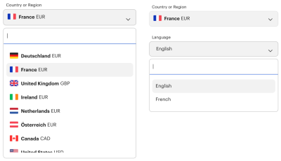](https://frame.work/de/en/locale/edit)

[Framework](https://frame.work/de/en/locale/edit) ([Large preview](https://cloud.netlifyusercontent.com/assets/344dbf88-fdf9-42bb-adb4-46f01eedd629/24fff3ea-2a49-4bbd-bcdc-37e92bb4b365/64-designing-better-language-selector.png))

On [Framework](https://frame.work/de/en/locale/edit), users can select country and language separately, both with autocomplete, with the **most frequent options highlighted** on focus. There is no need to scroll through the list of countries to find the preferred option. While this might be perfectly enough for some scenarios, it might not be sufficient in a situation when the user’s country isn’t available in the list. Instead, we could indicate the **closest locations** to the preferred option, rather than guiding a user to a dead end.

在 [Framework](https://frame.work/de/en/locale/edit) 上，用户可以分别选择国家和语言，两者都具有自动完成功能， **最常用的选项突出显示** 在焦点上。 无需滚动浏览国家/地区列表即可找到首选选项。 虽然这对于某些情况可能已经足够了，但在用户所在国家/地区不在列表中的情况下可能还不够。 相反，我们可以指示 **最接近** 首选选项的位置，而不是将用户引导到死胡同。

[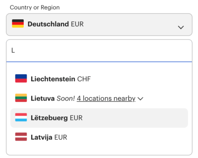](https://frame.work/de/en/locale/edit)

We could allow users to jump to the locations nearby. Just a mock-up. ([Large preview](https://cloud.netlifyusercontent.com/assets/344dbf88-fdf9-42bb-adb4-46f01eedd629/92d45ad8-c24b-4bb3-b5fb-a07e6a0bbb3c/30-designing-better-language-selector.png))

In the mock-up above, **“4 locations nearby”** could open an accordion, highlighting the closest locations next to Lithuania (_Lietuva),_ indented. This pattern might not be applicable when a user is trying to open a new bank account, but it might be useful when a user is looking for a particular office in their country, but can’t locate it.

在上面的模型中， **“附近的 4 个位置”** 可以打开手风琴，突出显示离立陶宛 ( _Lietuva) 最近的位置，_ 缩进。 当用户试图开设一个新的银行账户时，此模式可能不适用，但当用户在其国家/地区寻找特定办公室但无法找到时，它可能很有用。

[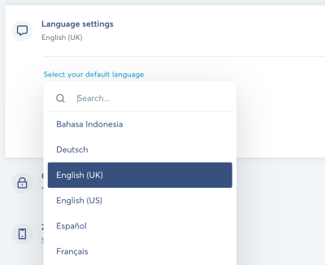](https://wise.com/)

[Wise](https://wise.com/) ([Large preview](https://cloud.netlifyusercontent.com/assets/344dbf88-fdf9-42bb-adb4-46f01eedd629/83e6d480-3ce5-4715-ab00-292445d969ea/31-designing-better-language-selector.png))

[Wise](https://wise.com/) also includes autocomplete for language settings. If the same language appears in multiple items, the autocomplete specifies what country it refers to. All language options are presented in their local format.

[Wise](https://wise.com/) 还包括语言设置的自动完成功能。 如果相同的语言出现在多个项目中，自动完成会指定它所指的国家/地区。 所有语言选项均以其本地格式显示。

[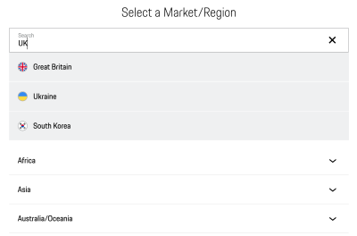](https://www.porsche.com/)

[Porsche](https://www.porsche.com/) ([Large preview](https://cloud.netlifyusercontent.com/assets/344dbf88-fdf9-42bb-adb4-46f01eedd629/d7f1725a-990b-43f6-9cc5-f57473c57e8b/32-designing-better-language-selector.png))

[Porsche](https://www.porsche.com/) uses an accordion along with autocomplete as a page overlay. The interface supports abbreviations and indicates available options with flag icons.

[保时捷](https://www.porsche.com/) 使用手风琴和自动完成作为页面覆盖。 该界面支持缩写并使用旗帜图标指示可用选项。

Undoubtedly autocomplete is a great addition to language selection. However, when testing it, explore how people use autocomplete, and what they are actually typing to find their country. Sometimes the **fine-tuning of making autocomplete work** for many different languages might be an effort way too underestimated and way too time-consuming.

毫无疑问，自动完成是对语言选择的一个很好的补充。 然而，在测试它时，探索人们如何使用自动完成，以及他们实际输入的内容来找到他们的国家。 有时， **为许多不同的语言进行自动完成工作的微调** 可能是一种被低估的方式，而且非常耗时。

## Grouping Countries [#](https://www.smashingmagazine.com/2022/05/designing-better-language-selector/#grouping-countries)

## 分组国家 [#](https://www.smashingmagazine.com/2022/05/designing-better-language-selector/#grouping-countries)

Not every location or language has to represent with a separate entry in the language selector. If multiple countries are speaking the same language, what if indicated by grouping countries within one option?

并非每个位置或语言都必须在语言选择器中用单独的条目表示。 如果多个国家使用同一种语言，如果将国家分组在一个选项中怎么办？

[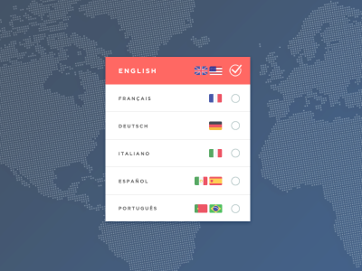](https://dribbble.com/shots/2386084-Language-Selection-Modal/attachments/9275096?mode=media)

Can we groupo countries and languages? A mock-up by [Daniel Marchini](https://dribbble.com/shots/2386084-Language-Selection-Modal/attachments/9275096?mode=media). ([Large preview](https://cloud.netlifyusercontent.com/assets/344dbf88-fdf9-42bb-adb4-46f01eedd629/4044800c-6c28-484d-b5ab-0ece50411fd8/33-designing-better-language-selector.png))

Daniel Marchini has come up with an [interesting concept](https://dribbble.com/shots/2386084-Language-Selection-Modal/attachments/9275096?mode=media) of **grouping flags within a single selection**. If the content will appear exactly the same for multiple countries, is it really necessary to show them separately? For example, the Portuguese language is displayed as an option for Portugal and Brazil, while the Spanish language is highlighted for Mexico and Spain. Obviously, not all countries could be grouped this way, but if you target users from specific countries, this might be worth a shot.

Daniel Marchini 提出了一个 [有趣的概念](https://dribbble.com/shots/2386084-Language-Selection-Modal/attachments/9275096?mode=media) ，即 **在单个选择中对标志进行分组** 。 如果内容在多个国家/地区显示完全相同，是否真的有必要分别显示它们？ 例如，葡萄牙语显示为葡萄牙和巴西的选项，而西班牙语则突出显示墨西哥和西班牙。 显然，并非所有国家/地区都可以这样分组，但如果您针对特定国家/地区的用户，这可能值得一试。

[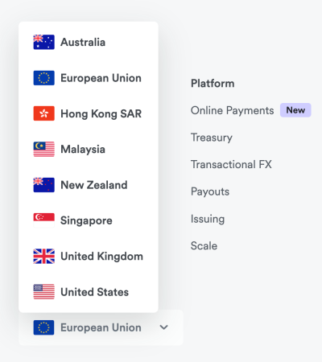](https://www.airwallex.com/eu)

European Union representing all European countries at once, on [Airwallex](https://www.airwallex.com/eu). ([Large preview](https://cloud.netlifyusercontent.com/assets/344dbf88-fdf9-42bb-adb4-46f01eedd629/b4218426-66cd-40d0-b95d-daf126ba15ef/34-designing-better-language-selector.png))

[Airwallex](https://www.airwallex.com/eu)’s country selector groups all European countries as “European Union”. The service is available in the **entire European Union**, so it’s not necessary to select an individual country. However, if you have a slightly longer list of options, and you are looking for an option to open a bank account in the Netherlands, you might need a bit of time to realize that the Netherlands is assumed as a country within the European Union.

[Airwallex](https://www.airwallex.com/eu) 的国家选择器将所有欧洲国家归为“欧盟”。 该服务在 **整个欧盟** 可用，因此无需选择单个国家/地区。 但是，如果您的选项列表稍长一些，并且您正在寻找在荷兰开设银行账户的选项，您可能需要一些时间才能意识到荷兰被假定为欧盟内的一个国家。

## Use Flags For Countries, Text Labels For Languages [#](https://www.smashingmagazine.com/2022/05/designing-better-language-selector/#use-flags-for-countries-text-labels-for-languages)

## 为国家使用标志，为语言使用文本标签 [#](https://www.smashingmagazine.com/2022/05/designing-better-language-selector/#use-flags-for-countries-text-labels-for-languages)

When designing a country selector, it feels almost natural to think about the flags they are represented by. After all, compared to just plain text, it should be much easier for users to locate the icon that they can immediately recognize. This is indeed true, however, as James Offer has suggested in his wonderful blog on [Flags are not languages](http://www.flagsarenotlanguages.com/blog/), flags are specific to countries, but **languages often cross borders**.

在设计国家/地区选择器时，考虑它们所代表的旗帜感觉几乎是自然而然的。 毕竟，与纯文本相比，用户应该更容易找到他们可以立即识别的图标。 然而，这确实是事实，正如 James Offer 在他关于 [旗帜不是语言](http://www.flagsarenotlanguages.com/blog/) 的精彩博客中所建议的那样，旗帜是特定于国家/地区的，但 **语言往往跨越国界** 。

We can find French-speaking people in Canada, Vietnam, Senegal, Switzerland, and many other countries. It would be inaccurate to assume that all users from these countries associate their choice of language with a French flag.

我们可以在加拿大、越南、塞内加尔、瑞士和许多其他国家找到讲法语的人。 假设来自这些国家/地区的所有用户都将他们选择的语言与法国国旗联系起来是不准确的。

[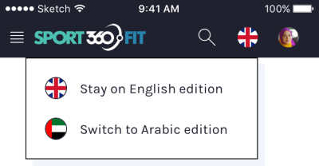](https://uxdesign.cc/my-take-on-language-selectors-945caceb58f7)

[Zsolt Szilvai](https://uxdesign.cc/my-take-on-language-selectors-945caceb58f7) ([Large preview](https://cloud.netlifyusercontent.com/assets/344dbf88-fdf9-42bb-adb4-46f01eedd629/a8c6a273-46ac-404c-9329-5717c41ba600/36-designing-better-language-selector.png))

In the article “[My Take On Language Selectors](https://uxdesign.cc/my-take-on-language-selectors-945caceb58f7)”, Zsolt Szilvai shows an interesting example of such a conundrum. During the usability tests of an application designed for the UAE, many people found the fact that the Arabic language was visualized with one single flag, as it is used in many countries and cannot be identified with any particular flag alone.

在“ [我对语言选择器](https://uxdesign.cc/my-take-on-language-selectors-945caceb58f7) 的看法”一文中，Zsolt Szilvai 展示了此类难题的一个有趣示例。 在为阿联酋设计的应用程序的可用性测试中，许多人发现阿拉伯语是用一个单一的标志来形象化的，因为它在许多国家使用，不能单独用任何特定的标志来识别。

[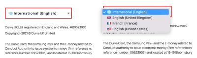](https://www.curve.com/)

[Curve](https://www.curve.com/) ([Large preview](https://cloud.netlifyusercontent.com/assets/344dbf88-fdf9-42bb-adb4-46f01eedd629/11512b03-5609-47ad-a9af-a0c40fdb9a7d/65-designing-better-language-selector.png))

[Curve.com](https://www.curve.com/) opts in for a default international version which is available in English. There are a few other options available as well but one might wonder about the difference between “International (English)” and “English (United States)”. When flags are used to indicate languages, it can quickly become a little bit confusing.

[Curve.com](https://www.curve.com/) 选择默认的国际版本，该版本有英文版本。 还有一些其他选项可用，但人们可能想知道“国际（英语）”和“英语（美国）”之间的区别。 当标志用于表示语言时，它很快就会变得有点混乱。

[Backmarket](https://www.backmarket.com/) ([Large preview](https://cloud.netlifyusercontent.com/assets/344dbf88-fdf9-42bb-adb4-46f01eedd629/8b7e3224-7d89-4954-8e69-4b374c42cc5e/39-designing-better-language-selector.png))

[Backmarket](https://www.backmarket.com/) includes a **list of flags in the footer** of the page to indicate local sites of the marketplace. When we want to drive users to specific local websites, we can safely use flags that best represent countries, rather than languages. Many sites also just add links in the footer instead, making language labels easier to find with an in-browser search.

[Backmarket](https://www.backmarket.com/) 中包含一个 **在页面的页脚** 标志列表，以指示市场的本地站点。 当我们想要将用户带到特定的本地网站时，我们可以安全地使用最能代表国家的标志，而不是语言。 许多网站也只是在页脚中添加链接，使语言标签更容易通过浏览器内搜索找到。

[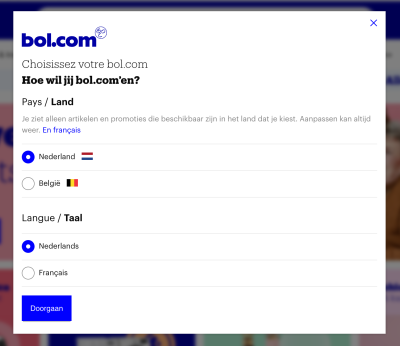](https://www.bol.com/nl/nl/)

[Bol](https://www.bol.com/nl/nl/) ([Large preview](https://cloud.netlifyusercontent.com/assets/344dbf88-fdf9-42bb-adb4-46f01eedd629/4b843148-26fe-4727-8711-62c516c5c937/40-designing-better-language-selector.png))

Flags for countries, and plain text for languages. Everything seems to be about right on [Bol.com](https://www.bol.com/nl/nl/). The country selector (with a flag) is located in the right upper corner, where most users expect it.

国家的旗帜和语言的纯文本。 上的一切似乎都 [Bol.com](https://www.bol.com/nl/nl/) 差不多。 国家/地区选择器（带有旗帜）位于右上角，这是大多数用户期望的位置。

To avoid misunderstandings, make sure that you use flags if your users need to select a **specific country**. However, if you’re providing users with a choice of a **specific language**, then flags are probably not going to work well. There, an autocomplete with all available countries and labels for languages written next to them might work better.

/地区，请确保使用标志 **为避免误解，如果您的用户需要选择特定国家** 。 但是，如果您为用户提供 **特定语言** 的选择，那么标志可能不会很好地发挥作用。 在那里，自动完成所有可用的国家和旁边写的语言标签可能会更好。

This of course brings up a question: how should these labels actually be written? In English or in a language’s local format?

这当然会带来一个问题：这些标签到底应该怎么写？ 用英语还是用一种语言的本地格式？

## Label Languages Locally [#](https://www.smashingmagazine.com/2022/05/designing-better-language-selector/#label-languages-locally)

## 本地标签语言 [#](https://www.smashingmagazine.com/2022/05/designing-better-language-selector/#label-languages-locally)

Assumptions are error-prone, and if it goes for combinations of currency, language and location, this holds true for how we label languages as well. We shouldn’t assume that a user will be speaking one of the languages we choose to see as a default option. Instead, when users select a language, usually it’s better to always use the name of the language **in its local format**.

假设很容易出错，如果它适用于货币、语言和位置的组合，这也适用于我们如何标记语言。 我们不应该假设用户会说我们选择视为默认选项的语言之一。 相反，当用户选择一种语言时，通常最好始终使用 **本地格式** 的语言名称。

So rather than offering a choice of _German_ and _Chinese_, assuming that users understand English, we can label these options as _Deutsch_ and _中文_.

因此，与其提供 _德语_ 和 _中文_ 的选择，假设用户懂英语，我们可以将这些选项标记为 _德语_ 和 _中文_ 。

[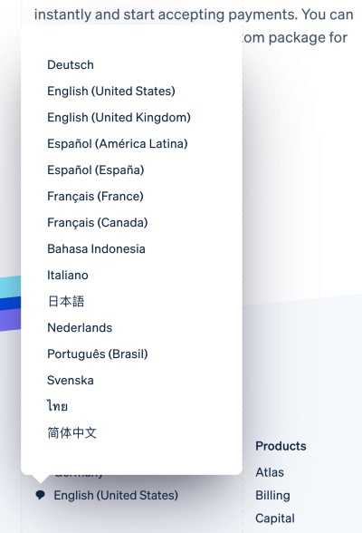](https://stripe.com/)

On [Stripe](https://stripe.com/), each language is labelled locally. No flags in use. Stripe ([Large preview](https://cloud.netlifyusercontent.com/assets/344dbf88-fdf9-42bb-adb4-46f01eedd629/d6bc7abb-fd85-4e41-8e7e-42cb254543f7/41-designing-better-language-selector.png))

But if the languages are labeled locally, somebody who happens to be in China might be experiencing issues switching to a slightly more familiar language. Surely flags would help to locate a button that would allow for that, but we could also **prefix the selected language with a label**, for example, “Language” to make it easier to spot the selector. Or we could just add a link saying “English” in the header. This of course relies on assumptions we are making, but it might be easier than hopping through the navigation bar and view-source with fingers crossed.

但是，如果这些语言是本地标记的，那么碰巧在中国的人可能会遇到切换到稍微熟悉的语言的问题。 当然，标志将有助于找到允许这样做的按钮，但我们也可以 **在所选语言前加上标签** ，例如“语言”，以便更容易找到选择器。 或者我们可以在标题中添加一个“英语”链接。 这当然依赖于我们所做的假设，但它可能比用手指交叉浏览导航栏和查看源代码更容易。

[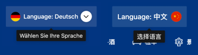](https://booking.com/)

[Booking](https://booking.com/) ([Large preview](https://cloud.netlifyusercontent.com/assets/344dbf88-fdf9-42bb-adb4-46f01eedd629/00ebb517-4ae3-4b08-9b7c-6b9e8f6a8e6b/66-designing-better-language-selector.png))

[Booking](https://booking.com/) provides a hint to indicate that users can change the language in a local language. If you prefer to show a hint on hover, that’s one of the very few cases where one might consider using a language that many users would understand, and it could be English.

[Booking](https://booking.com/) 提供了一个提示，提示用户可以用本地语言更改语言。 如果您更喜欢在悬停时显示提示，这是极少数可能会考虑使用许多用户都能理解的语言的情况之一，它可能是英语。

[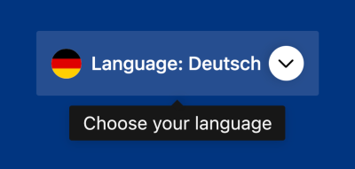](https://booking.com/)

[Booking](https://booking.com/) ([Large preview](https://cloud.netlifyusercontent.com/assets/344dbf88-fdf9-42bb-adb4-46f01eedd629/8e25fc2d-cf29-4872-a2be-08deea0c49b3/45-designing-better-language-selector.png))

## The Globe and Translate Icons [#](https://www.smashingmagazine.com/2022/05/designing-better-language-selector/#the-globe-and-translate-icons)

## 地球仪和翻译图标 [#](https://www.smashingmagazine.com/2022/05/designing-better-language-selector/#the-globe-and-translate-icons)

Since flags can be somewhat problematic, what would be a reasonable alternative to them? As briefly mentioned at the beginning of the article, we can also use icons such as “Globe” or “Translate” to indicate the choice of locales. There is as well an [official language icon](http://www.languageicon.org/), which is free to use, but unfortunately is still not as recognizable as the other icons.

由于标志可能有点问题，什么是它们的合理替代品？ 正如文章开头简要提到的，我们还可以使用“Globe”或“Translate”等图标来指示语言环境的选择。 还有一个 [官方语言图标](http://www.languageicon.org/) ，可以免费使用，但不幸的是，它仍然不像其他图标那样容易识别。

[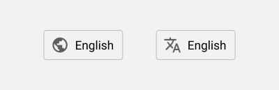](https://uxdesign.cc/designing-language-selectors-that-work-well-with-assistive-technology-c645a16e73e7)

Language selector buttons with icons. Icon 1 shows the earth, icon 2 shows two letters from different alphabets. Designed by Zsolt Szilvai. [Zsolt Szilvai](https://uxdesign.cc/designing-language-selectors-that-work-well-with-assistive-technology-c645a16e73e7) ([Large preview](https://cloud.netlifyusercontent.com/assets/344dbf88-fdf9-42bb-adb4-46f01eedd629/97a39647-f975-4089-88e1-4f110ee3f7cb/47-designing-better-language-selector.png))

Surely not everybody will be able to understand the icon in combination with a word that they can barely decipher, but if it’s prominently located in the header or the footer, the chance to be discovered are significantly higher.

当然不是每个人都能理解图标与他们几乎无法破译的单词的组合，但如果它位于页眉或页脚的显着位置，被发现的机会就会大大增加。

[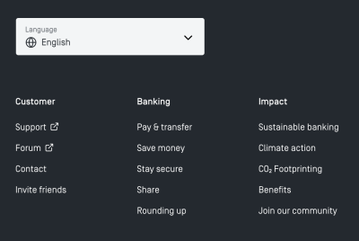](https://www.tomorrow.one/en-EU/)

[Tomorrow](https://www.tomorrow.one/en-EU/) ([Large preview](https://cloud.netlifyusercontent.com/assets/344dbf88-fdf9-42bb-adb4-46f01eedd629/efbe04fc-8e61-4471-9fa8-5381431ead89/48-designing-better-language-selector.png))

[Tomorrow.one](https://www.tomorrow.one/en-EU/) displays a large drop-down selector with a globe icon in the footer of each page. It’s not available in the header on the site. Because pages aren’t very long, that’s probably not a big problem, but users might give up if they have to embark on a long-running scrolling marathon, or if the [infinite scroll](https://www.smashingmagazine.com/2022/03/designing-better-infinite-scroll/) prevents them from reaching the footer.

[Tomorrow.one](https://www.tomorrow.one/en-EU/) 在每个页面的页脚显示一个带有地球图标的大型下拉选择器。 它在网站的标题中不可用。 因为页面不是很长，所以这可能不是什么大问题，但是如果用户不得不开始长时间的滚动马拉松，或者 [无限滚动](https://www.smashingmagazine.com/2022/03/designing-better-infinite-scroll/) 阻止他们到达页脚，他们可能会放弃。

[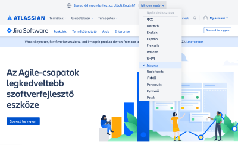](https://www.atlassian.com/it/software/jira)

[Atlassian](https://www.atlassian.com/it/software/jira) ([Large preview](https://cloud.netlifyusercontent.com/assets/344dbf88-fdf9-42bb-adb4-46f01eedd629/4aa08b40-3b51-4b17-9c62-925d6b443ac9/49-designing-better-language-selector.png))

On [Atlassian](https://www.atlassian.com/it/software/jira), the language selector is tucked at the very end of the page in the footer, with a globe icon indicating the selection. However, if the user with a different browser language preference enters the site, it **suggests changing the language** at the very top of the page, with a globe icon appearing there, too.

在 [Atlassian](https://www.atlassian.com/it/software/jira) 上，语言选择器隐藏在页面末尾的页脚中，并带有一个表示选择的地球图标。 但是，如果具有不同浏览器语言偏好的用户进入该站点，它会 **建议在页面的最顶部更改语言** ，那里也会出现一个地球图标。

[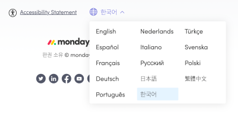](https://monday.com/lang/ko/)

[Monday](https://monday.com/lang/ko/) ([Large preview](https://cloud.netlifyusercontent.com/assets/344dbf88-fdf9-42bb-adb4-46f01eedd629/ac61ad17-d208-494e-8d06-599185c32658/51-designing-better-language-selector.png))

[Monday.com](https://monday.com/lang/ko/) keeps the language selection at the very top of the page, in the left upper corner. All options are presented in **three columns**, with the current selection highlighted in blue.

[Monday.com](https://monday.com/lang/ko/) 将语言选择保留在页面的最顶部，在左上角。 所有选项都显示在 **三列** 中，当前选择以蓝色突出显示。

While flags are easier to recognize, icons can work as an alternative option as well, especially if you need to provide users with language options, rather than choices for location. Even if the selection is provided in the header, it’s a safe bet to also place it at the bottom to ensure that users can find it when they need to.

虽然标志更容易识别，但图标也可以用作替代选项，尤其是当您需要为用户提供语言选项而不是位置选择时。 即使在标题中提供了选择，也将其放在底部是一个安全的选择，以确保用户在需要时可以找到它。

## Avoid Language Shorthands or Initials [#](https://www.smashingmagazine.com/2022/05/designing-better-language-selector/#avoid-language-shorthands-or-initials)

## 避免语言速记或首字母缩写 [#](https://www.smashingmagazine.com/2022/05/designing-better-language-selector/#avoid-language-shorthands-or-initials)

Another interesting problem that Zsolt Szilvai has [discovered](https://uxdesign.cc/my-take-on-language-selectors-945caceb58f7shows) in testing is related to the use **abbreviations, initials or shorthands** to indicate a particular language. When we are running out of space in navigation, we could be using “EN” for English, or “DE” for Germany, or “UA” for Ukraine. Indeed, these shorthands are often well-understood, but they bring surprising results when a user’s browser auto-translates all websites in a particular language.

Zsolt Szilvai 在测试中 [发现](https://uxdesign.cc/my-take-on-language-selectors-945caceb58f7shows) 的另一个有趣的问题与使用 **缩写、首字母或速记** 来表示特定语言有关。 当我们在导航中用完空间时，我们可以使用“EN”表示英语，或“DE”表示德国，或“UA”表示乌克兰。 事实上，这些缩写通常很容易理解，但是当用户的浏览器自动翻译所有网站的特定语言时，它们会带来令人惊讶的结果。

[Decathlon](https://uxdesign.cc/my-take-on-language-selectors-945caceb58f7) with quite surprising language options on mobile (on the right). ([Large preview](https://cloud.netlifyusercontent.com/assets/344dbf88-fdf9-42bb-adb4-46f01eedd629/d5613484-7ffd-4d5c-9efa-ee7c323c51be/decathlon.png))

Not only does it often result in broken menus and surprising layouts; **browsers also translate language shorthands**, producing an interface that might be very difficult to make sense of. However, were the shorthands avoided in favor of the full local name of the language, the user wouldn’t have to deal with these issues at all. Instead, the translator would help them find a language that would work better for them.

它不仅经常导致菜单损坏和布局令人惊讶； **浏览器也会翻译语言缩写** ，生成一个可能很难理解的界面。 但是，如果避免使用简写而使用语言的完整本地名称，则用户根本不必处理这些问题。 相反，翻译会帮助他们找到一种更适合他们的语言。

[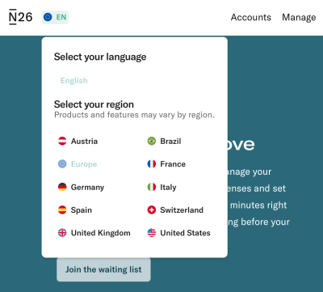](https://uxdesign.cc/my-take-on-language-selectors-945caceb58f7)

[N26](https://n26.com/en-eu). ([Large preview](https://cloud.netlifyusercontent.com/assets/344dbf88-fdf9-42bb-adb4-46f01eedd629/2e234f38-b784-42f4-81f7-c246166608b0/56-designing-better-language-selector.png))

[N26.de](https://n26.com/en-eu) uses a shorthand “EN” for “English”. The selected language is **disabled in the list of options**, but it’s probably a good idea to increase the color contrast a little. As users scroll down the page, the header remains sticky, so there is really no need to display the language selector in the footer as well.

[N26.de](https://n26.com/en-eu) 使用“英语”的简写“EN”。 所选语言 **在选项列表中被禁用** ，但稍微增加颜色对比度可能是个好主意。 当用户向下滚动页面时，页眉保持粘性，因此实际上没有必要在页脚中也显示语言选择器。

[Wise](https://wise.com/), with languages displayed in full in a drop-down. ([Large preview](https://cloud.netlifyusercontent.com/assets/344dbf88-fdf9-42bb-adb4-46f01eedd629/ac7ed3ac-091e-4c3e-a198-c2a8e4924553/57-designing-better-language-selector.png))

[Wise](https://wise.com/) uses shorthands for language selection in the right upper corner, but displays the **languages in full** on click, with a noticeable focus style to indicate where a user currently is. This avoids the problem of auto-translation that often turns abbreviations into seemingly random strings.

[Wise](https://wise.com/) 在右上角使用简写来选择语言，但 **在点击时会完整显示语言** ，并以明显的焦点样式指示用户当前所在的位置。 这避免了经常将缩写词变成看似随机字符串的自动翻译问题。

## Wrapping Up [#](https://www.smashingmagazine.com/2022/05/designing-better-language-selector/#wrapping-up)

## 总结 [#](https://www.smashingmagazine.com/2022/05/designing-better-language-selector/#wrapping-up)

The country and language selector might appear like a quite trivial design challenge, but there are plenty of fine details that make or break the experience. When designing one, always **decouple presets** and reduce assumptions about groups that are likely to go together. Users expect the language selector to be located in the header or the footer of each page, and they often watch out for flags, “Globe” or “Translate” icons to find it.

国家和语言选择器可能看起来像是一个非常微不足道的设计挑战，但有很多细节决定了体验的成败。 在设计一个时，始终 **解耦预设** 并减少对可能组合在一起的组的假设。 用户希望语言选择器位于每个页面的页眉或页脚中，并且他们通常会留意标志、“地球”或“翻译”图标以找到它。

If you have just a few languages, a drop-down overlay might be perfectly enough. If you need 10–15 languages, perhaps it’s worth exploring the option of a non-modal overlay with autocomplete. If there are even more options to display, consider using a standalone page, with countries grouped into tabs or accordions.

如果您只有几种语言，下拉叠加层可能就足够了。 如果您需要 10-15 种语言，也许值得探索具有自动完成功能的非模态覆盖选项。 如果要显示更多选项，请考虑使用独立页面，将国家/地区分组到选项卡或手风琴中。

## Language Selector Checklist [#](https://www.smashingmagazine.com/2022/05/designing-better-language-selector/#language-selector-checklist)

## 语言选择器清单 [#](https://www.smashingmagazine.com/2022/05/designing-better-language-selector/#language-selector-checklist)

As usual, here’s a general checklist of a few **important guidelines to consider** when designing a better language selector:

像往常一样，这里有一些 **要考虑的重要准则的一般清单：** 在设计更好的语言选择器时

-   **Nudge users**, but avoid auto-redirects.
-   **推动用户** ，但避免自动重定向。
-   Decouple presets, be it location, language, or anything else.
-   解耦预设，无论是位置、语言还是其他任何东西。
-   Allow users to set **custom preferences** (currency, time zones, units of measure).
-   允许用户设置 **自定义首选项** （货币、时区、计量单位）。
-   Consider using a **non-modal dialog**.
-   考虑使用 **非模态对话框** 。
-   Organize countries and languages in sections, tabs, and accordions.
-   在部分、选项卡和手风琴中组织国家和语言。
-   Provide input with **autocomplete suggestions**.
-   提供带有 **自动完成建议** 的输入。
-   Use flags for countries, but avoid them for languages.
-   为国家使用国旗，但避免为语言使用国旗。
-   Consider the _Globe_ and _Translate_ icons instead of flags.
-   考虑使用 _Globe_ 和 _Translate_ 图标而不是旗帜。
-   **Label languages locally**, e.g. _Deutsch_ instead of _German_.
-   **在本地标记语言** ，例如 _用Deutsch_ 代替 _German_ 。
-   Avoid language shorthands or initials.
-   避免使用语言缩写或缩写。
-   For accessibility reasons, make sure the country selector appears in the header as well as in the footer, and is keyboard-accessible.
-   出于可访问性原因，请确保国家/地区选择器出现在页眉和页脚中，并且可以通过键盘访问。

## Meet Smart Interface Design Patterns [#](https://www.smashingmagazine.com/2022/05/designing-better-language-selector/#meet-smart-interface-design-patterns)

## 认识智能界面设计模式 [#](https://www.smashingmagazine.com/2022/05/designing-better-language-selector/#meet-smart-interface-design-patterns)

If you are interested in similar insights around UX, take a look at [**Smart Interface Design Patterns**](https://smart-interface-design-patterns.com/), our shiny new **8h-video course** with 100s of practical examples from real-life projects. Plenty of design patterns and guidelines on everything from accordions and dropdowns to complex tables and intricate web forms — with 5 new segments added every year. _Just sayin’!_ [Check a free preview](https://www.youtube.com/watch?v=aSP5oR9g-ss).

如果您对围绕 UX 的类似见解感兴趣，请查看 [**智能界面设计模式**](https://smart-interface-design-patterns.com/) ，这是我们闪亮的全新 **8 小时视频课程** ，其中包含 100 个来自现实生活项目的实例。 从手风琴和下拉菜单到复杂的表格和错综复杂的 Web 表单，有大量的设计模式和指南——每年新增 5 个部分。 _只是在说'！_ [检查免费预览](https://www.youtube.com/watch?v=aSP5oR9g-ss) 。

Meet [Smart Interface Design Patterns](https://smart-interface-design-patterns.com/), our new video course on interface design & UX.

100 design patterns & real-life examples.  
8h-video course + live UX training. [Free preview](https://www.youtube.com/watch?v=aSP5oR9g-ss).

100 种设计模式与现实生活 例子。  
8 小时视频课程 + 现场用户体验培训。 [免费预览](https://www.youtube.com/watch?v=aSP5oR9g-ss) 。

## Resources [#](https://www.smashingmagazine.com/2022/05/designing-better-language-selector/#resources)

## 资源 [#](https://www.smashingmagazine.com/2022/05/designing-better-language-selector/#resources)

-   [Flags are not languages](http://www.flagsarenotlanguages.com/blog/), a blog by James Offer
-   [旗帜不是语言](http://www.flagsarenotlanguages.com/blog/) ，James Offer 的博客
-   [“My take on language selectors”](https://uxdesign.cc/my-take-on-language-selectors-945caceb58f7) + [accessible implementation details](https://uxdesign.cc/designing-language-selectors-that-work-well-with-assistive-technology-c645a16e73e7), by Zsolt Szilvai
-   [“我对语言选择器的看法”](https://uxdesign.cc/my-take-on-language-selectors-945caceb58f7) \+ [可访问的实现细节](https://uxdesign.cc/designing-language-selectors-that-work-well-with-assistive-technology-c645a16e73e7) ，作者 Zsolt Szilvai
-   [UX practice: Skyscanner’s language selector](https://medium.com/nyc-design/ux-practice-skyscanners-language-selector-276167b4ed84)
-   [UX 实践：Skyscanner 的语言选择器](https://medium.com/nyc-design/ux-practice-skyscanners-language-selector-276167b4ed84)
-   [Language switching UI/UX on multilingual sites](https://www.robertjelenic.com/language-switching-ui-ux-on-multilingual-sites/), by Robert Jelenic
-   [多语言网站上的语言切换 UI/UX](https://www.robertjelenic.com/language-switching-ui-ux-on-multilingual-sites/) ，作者：Robert Jelenic
-   [Best practices for presenting website language selection](https://www.robertjelenic.com/language-switching-ui-ux-on-multilingual-sites/)
-   [呈现网站语言选择的最佳实践](https://www.robertjelenic.com/language-switching-ui-ux-on-multilingual-sites/)
-   [UI/UX design of a language selector](https://share-design.kr/en/article/ui-ux-design/1)
-   [语言选择器的 UI/UX 设计](https://share-design.kr/en/article/ui-ux-design/1)
-   [Interesting language selector patterns on Siemens Design System](https://ux.siemens-healthineers.com/ui-marcom/components/language-selection/usage/index.html)
-   [西门子设计系统上有趣的语言选择器模式](https://ux.siemens-healthineers.com/ui-marcom/components/language-selection/usage/index.html)
-   [Designing a language switch: Examples and best practices](https://usersnap.com/blog/design-language-switch/), by Thomas Peham
-   [设计语言切换：示例和最佳实践](https://usersnap.com/blog/design-language-switch/) ，作者：Thomas Peham

## Related Articles [#](https://www.smashingmagazine.com/2022/05/designing-better-language-selector/#related-articles)

## 相关文章 [#](https://www.smashingmagazine.com/2022/05/designing-better-language-selector/#related-articles)

If you find this article useful, here’s an overview of similar articles we’ve published over the years — and a few more are coming your way.

如果您觉得这篇文章有用，这里是我们多年来发表的类似文章的概述 — 还有一些文章即将出版。

-   [Designing A Better Infinite Scroll](https://www.smashingmagazine.com/2022/03/designing-better-infinite-scroll/)
-   [Designing A Better Infinite Scroll](https://www.smashingmagazine.com/2022/03/designing-better-infinite-scroll/)
-   [Designing Better Breadcrumbs](https://www.smashingmagazine.com/2022/04/breadcrumbs-ux-design/)
-   [Designing Better Breadcrumbs](https://www.smashingmagazine.com/2022/04/breadcrumbs-ux-design/)
-   [Designing A Better Carousel UX](https://www.smashingmagazine.com/2022/04/designing-better-carousel-ux/)
-   [Designing A Better Carousel UX](https://www.smashingmagazine.com/2022/04/designing-better-carousel-ux/)
-   [Designing A Better Accordion](https://www.smashingmagazine.com/2017/06/designing-perfect-accordion-checklist/)
-   [Designing A Better Accordion](https://www.smashingmagazine.com/2017/06/designing-perfect-accordion-checklist/)
-   [Designing A Better Responsive Configurator](https://www.smashingmagazine.com/2018/02/designing-a-perfect-responsive-configurator/)
-   [Designing A Better Responsive Configurator](https://www.smashingmagazine.com/2018/02/designing-a-perfect-responsive-configurator/)
-   [Designing A Better Birthday Picker](https://www.smashingmagazine.com/2021/05/frustrating-design-patterns-birthday-picker/)
-   [Designing A Better Birthday Picker](https://www.smashingmagazine.com/2021/05/frustrating-design-patterns-birthday-picker/)
-   [Designing A Better Date and Time Picker](https://www.smashingmagazine.com/2017/07/designing-perfect-date-time-picker/)
-   [Designing A Better Date and Time Picker](https://www.smashingmagazine.com/2017/07/designing-perfect-date-time-picker/)
-   [Designing A Better Feature Comparison](https://www.smashingmagazine.com/2017/08/designing-perfect-feature-comparison-table/)
-   [Designing A Better Feature Comparison](https://www.smashingmagazine.com/2017/08/designing-perfect-feature-comparison-table/)
-   [Designing A Better Slider](https://www.smashingmagazine.com/2017/07/designing-perfect-slider/)
-   [Designing A Better Slider](https://www.smashingmagazine.com/2017/07/designing-perfect-slider/)
-   “[Form Design Patterns Book](https://www.smashingmagazine.com/printed-books/form-design-patterns/),” written by Adam Silver
-   “[Form Design Patterns Book](https://www.smashingmagazine.com/printed-books/form-design-patterns/),” written by Adam Silver

 (il)
