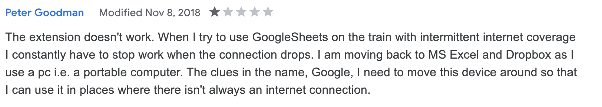
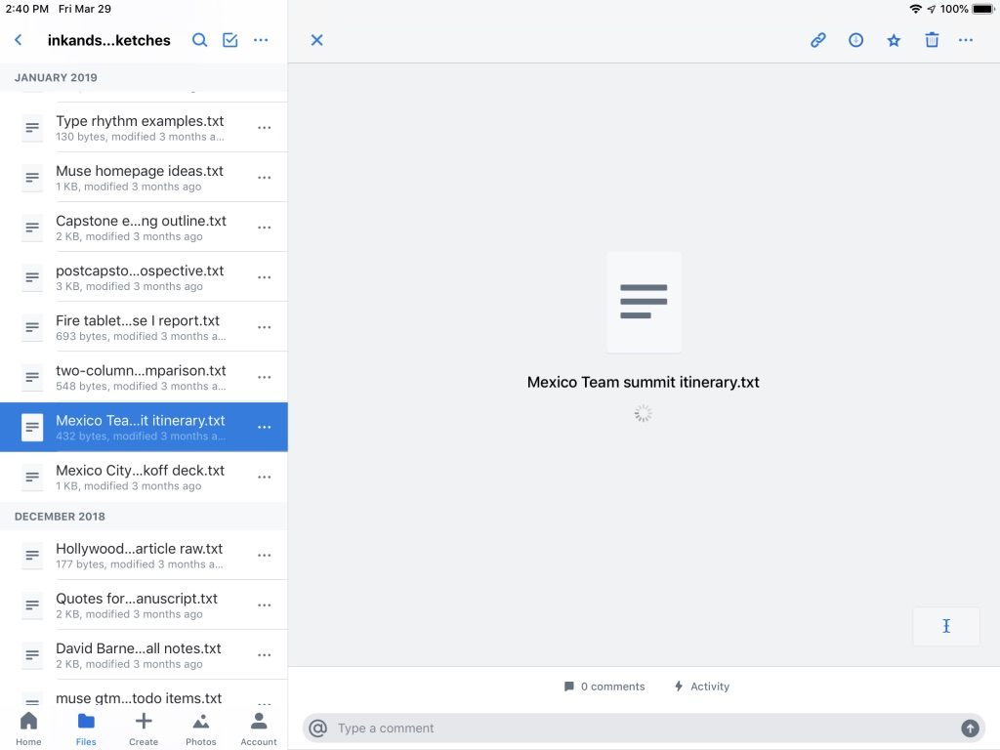
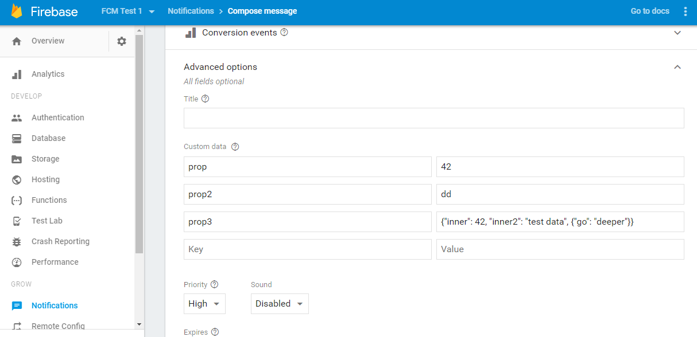
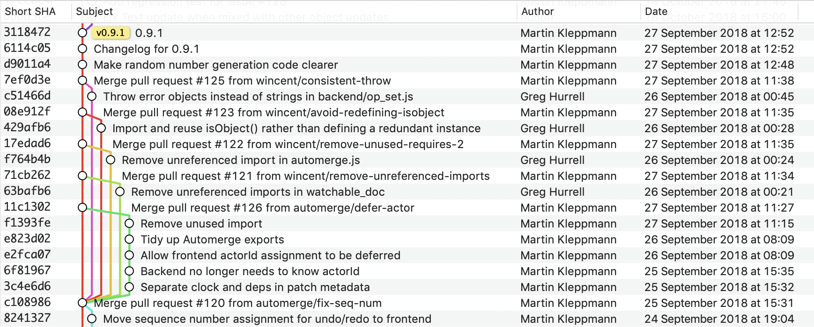

You own your data, in spite of the cloud

尽管有云，你还是拥有自己的数据

Cloud apps like Google Docs and Trello are popular because they enable real-time collaboration with colleagues, and they make it easy for us to access our work from all of our devices. However, by centralizing data storage on servers, cloud apps also take away ownership and agency from users. If a service shuts down, the software stops functioning, and data created with that software is lost.

Google Docs和Trello等云应用程序很受欢迎，因为它们可以与同事进行实时协作，并且它们使我们能够轻松地从所有设备访问我们的作品。然而，通过将数据存储集中在服务器上，云应用程序也剥夺了用户的所有权和代理权。如果服务关闭，软件将停止工作，并且使用该软件创建的数据将丢失。

In this article we propose “local-first software”: a set of principles for software that enables both collaboration and ownership for users. Local-first ideals include the ability to work offline and collaborate across multiple devices, while also improving the security, privacy, long-term preservation, and user control of data.

在本文中，我们提出了“本地优先软件”：一套软件原则，使用户能够协作和拥有。本地优先的理想包括离线工作和跨多个设备协作的能力，同时提高数据的安全性、隐私性、长期保存和用户控制。

We survey existing approaches to data storage and sharing, ranging from email attachments to web apps to Firebase-backed mobile apps, and we examine the trade-offs of each. We look at Conflict-free Replicated Data Types (CRDTs): data structures that are multi-user from the ground up while also being fundamentally local and private. CRDTs have the potential to be a foundational technology for realizing local-first software.

我们调查了现有的数据存储和共享方法，从电子邮件附件到Web应用程序，再到Firebase支持的移动应用程序，并检查了每种应用程序的权衡。我们来看看无冲突复制数据类型（CRDT）：从头开始都是多用户的数据结构，同时也从根本上是本地和私有的。CRDT有潜力成为实现本地第一软件的基础技术。

We share some of our findings from developing local-first software prototypes at Ink & Switch over the course of several years. These experiments test the viability of CRDTs in practice, and explore the user interface challenges for this new data model. Lastly, we suggest some next steps for moving towards local-first software: for researchers, for app developers, and a startup opportunity for entrepreneurs.

我们分享了几年来在Ink & Switch开发本地首创软件原型的一些发现。这些实验在实践中测试了CRDT的可行性，并探讨了这种新数据模型的用户界面挑战。最后，我们建议一些迈向本地优先软件的后续步骤：面向研究人员、应用程序开发人员，以及企业家的创业机会。

This article has also been published in PDF format in the proceedings of the Onward! 2019 conference. Please cite it as:

这篇文章也以PDF格式在前进的议事录中发布！2019年会议。请将其引用为：

> Martin Kleppmann, Adam Wiggins, Peter van Hardenberg, and Mark McGranaghan. Local-first software: you own your data, in spite of the cloud. 2019 ACM SIGPLAN International Symposium on New Ideas, New Paradigms, and Reflections on Programming and Software (Onward!), October 2019, pages 154–178. doi:10.1145/3359591.3359737

## [Motivation: collaboration and ownership](https://www.inkandswitch.com/local-first/#motivation-collaboration-and-ownership)

## [动机：协作和所有权](https://www.inkandswitch.com/local-first/#motivation-collaboration-and-ownership)

It’s amazing how easily we can collaborate online nowadays. We use Google Docs to collaborate on documents, spreadsheets and presentations; in Figma we work together on user interface designs; we communicate with colleagues using Slack; we track tasks in Trello; and so on. We depend on these and many other online services, e.g. for taking notes, planning projects or events, remembering contacts, and a whole raft of business uses.

令人惊奇的是，如今我们可以轻松地进行在线协作。 我们使用 Google Docs 协作处理文档、电子表格和演示文稿； 在 Figma 中，我们共同致力于用户界面设计； 我们使用 Slack 与同事交流； 我们在 Trello 中跟踪任务； 等等。 我们依赖于这些和许多其他在线服务，例如做笔记、计划项目或事件、记住联系人以及大量的业务用途。

Today’s cloud apps offer big benefits compared to earlier generations of software: seamless collaboration, and being able to access data from any device. As we run more and more of our lives and work through these cloud apps, they become more and more critical to us. The more time we invest in using one of these apps, the more valuable the data in it becomes to us.

与前几代软件相比，如今的云应用程序提供了巨大的优势：无缝协作，以及能够从任何设备访问数据。 随着我们越来越多地通过这些云应用程序运行我们的生活和工作，它们对我们变得越来越重要。 我们投入使用其中一个应用程序的时间越多，其中的数据对我们来说就越有价值。

However, in our research we have spoken to a lot of creative professionals, and in that process we have also learned about the downsides of cloud apps.

然而，在我们的研究中，我们与许多创意专业人士进行了交谈，并且在这个过程中我们也了解了云应用程序的缺点。

When you have put a lot of creative energy and effort into making something, you tend to have a deep emotional attachment to it. If you do creative work, this probably seems familiar. (When we say “creative work,” we mean not just visual art, or music, or poetry — many other activities, such as explaining a technical topic, implementing an intricate algorithm, designing a user interface, or figuring out how to lead a team towards some goal are also creative efforts.)

当你投入了大量的创造力和精力来制作某件东西时，你往往会对它产生深深的情感依恋。 如果您从事创造性工作，这可能看起来很熟悉。 （当我们说“创造性工作”时，我们指的不仅仅是视觉艺术、音乐或诗歌——还有许多其他活动，例如解释技术主题、实施复杂算法、设计用户界面或弄清楚如何领导一个团队团队朝着某个目标也是创造性的努力。）

In the process of performing that creative work, you typically produce files and data: documents, presentations, spreadsheets, code, notes, drawings, and so on. And you will want to keep that data: for reference and inspiration in the future, to include it in a portfolio, or simply to archive because you feel proud of it. It is important to _feel ownership_ of that data, because the creative expression is something so personal.

在执行创造性工作的过程中，您通常会生成文件和数据：文档、演示文稿、电子表格、代码、注释、绘图等。 你会想要保留这些数据：以供将来参考和启发，将其包含在投资组合中，或者只是因为你为此感到自豪而存档。 重要的是要 _感受到数据的所有权_ ，因为创造性的表达是非常个人化的。

Unfortunately, cloud apps are problematic in this regard. Although they let you access your data anywhere, all data access must go via the server, and you can only do the things that the server will let you do. In a sense, you don’t have full ownership of that data — the cloud provider does. In the words of a [bumper sticker](http://www.chriswatterston.com/blog/my-there-is-no-cloud-sticker): “There is no cloud, it’s just someone else’s computer.”

不幸的是，云应用程序在这方面存在问题。 尽管它们允许您在任何地方访问您的数据，但所有数据访问都必须通过服务器进行，您只能做服务器让您做的事情。 从某种意义上说，您不拥有该数据的完全所有权——云提供商拥有。 用 [保险杠贴纸](http://www.chriswatterston.com/blog/my-there-is-no-cloud-sticker) 的话来说：“没有云，它只是别人的电脑。”

When data is stored on “someone else’s computer”, that third party assumes a degree of control over that data. Cloud apps are provided as a service; if the service is unavailable, you cannot use the software, and you can no longer access your data created with that software. If the service shuts down, even though you might be able to export your data, without the servers there is normally no way for you to continue running your own copy of that software. Thus, you are at the mercy of the company providing the service.

当数据存储在“其他人的计算机”上时，该第三方对该数据具有一定程度的控制权。 云应用程序作为服务提供； 如果该服务不可用，您将无法使用该软件，并且您将无法再访问使用该软件创建的数据。 如果服务关闭，即使您可以导出数据，但如果没有服务器，您通常无法继续运行您自己的该软件副本。 因此，您受制于提供服务的公司。

Before web apps came along, we had what we might call “old-fashioned” apps: programs running on your local computer, reading and writing files on the local disk. We still use a lot of applications of this type today: text editors and IDEs, Git and other version control systems, and many specialized software packages such as graphics applications or CAD software fall in this category.

在网络应用程序出现之前，我们有所谓的“老式”应用程序：在本地计算机上运行的程序，在本地磁盘上读取和写入文件。 我们今天仍然使用很多这种类型的应用程序：文本编辑器和 IDE、Git 和其他版本控制系统，以及许多专用软件包，如图形应用程序或 CAD 软件都属于这一类。

In old-fashioned apps, the data lives in files on your local disk, so you have full agency and ownership of that data: you can do anything you like, including long-term archiving, making backups, manipulating the files using other programs, or deleting the files if you no longer want them. You don’t need anybody’s permission to access your files, since they are yours. You don’t have to depend on servers operated by another company.

在老式应用程序中，数据保存在本地磁盘上的文件中，因此您拥有该数据的完全代理权和所有权：您可以做任何您喜欢的事情，包括长期存档、制作备份、使用其他程序处理文件、或者如果您不再需要这些文件，请将其删除。 您不需要任何人的许可即可访问您的文件，因为它们是您的。 您不必依赖另一家公司运营的服务器。

To sum up: the cloud gives us collaboration, but old-fashioned apps give us ownership. Can’t we have the best of both worlds?

总结一下：云给了我们协作，但老式的应用程序给了我们所有权。 我们不能两全其美吗？

We would like both the convenient cross-device access and real-time collaboration provided by cloud apps, and also the personal ownership of your own data embodied by “old-fashioned” software.

我们既希望云应用程序提供便捷的跨设备访问和实时协作，也希望“老式”软件体现对您自己数据的个人所有权。

## [Seven ideals for local-first software](https://www.inkandswitch.com/local-first/#seven-ideals-for-local-first-software)

## [本地优先软件的七个理想](https://www.inkandswitch.com/local-first/#seven-ideals-for-local-first-software)

We believe that data ownership and real-time collaboration are not at odds with each other. It is possible to create software that has all the advantages of cloud apps, while also allowing you to retain full ownership of the data, documents and files you create.

我们相信数据所有权和实时协作并不矛盾。 可以创建具有云应用程序所有优势的软件，同时还允许您保留对您创建的数据、文档和文件的完全所有权。

We call this type of software **local-first software**, since it prioritizes the use of local storage (the disk built into your computer) and local networks (such as your home WiFi) over servers in remote datacenters.

我们将这种类型的软件称为 **本地优先软件** ，因为它优先使用本地存储（计算机内置的磁盘）和本地网络（例如您的家庭 WiFi），而不是远程数据中心的服务器。

In cloud apps, the data on the server is treated as the primary, authoritative copy of the data; if a client has a copy of the data, it is merely a cache that is subordinate to the server. Any data modification must be sent to the server, otherwise it “didn’t happen.” In local-first applications we swap these roles: we treat the copy of the data on your local device — your laptop, tablet, or phone — as the primary copy. Servers still exist, but they hold secondary copies of your data in order to assist with access from multiple devices. As we shall see, this change in perspective has profound implications.

在云应用程序中，服务器上的数据被视为数据的主要权威副本； 如果客户端有数据的副本，它只是从属于服务器的缓存。 任何数据修改都必须发送到服务器，否则它“没有发生”。 在本地优先应用程序中，我们交换了这些角色：我们将本地设备（笔记本电脑、平板电脑或手机）上的数据副本视为主要副本。 服务器仍然存在，但它们保存您数据的二级副本，以协助从多个设备进行访问。 正如我们将要看到的，这种观点的改变具有深远的影响。

Here are seven ideals we would like to strive for in local-first software.

以下是我们希望在本地优先软件中努力实现的七个理想。

### [1\. No spinners: your work at your fingertips](https://www.inkandswitch.com/local-first/#1-no-spinners-your-work-at-your-fingertips)

### [1\. 没有微调器：您的工作触手可及](https://www.inkandswitch.com/local-first/#1-no-spinners-your-work-at-your-fingertips)

Much of today’s software [feels slower](https://danluu.com/input-lag/) than previous generations of software. Even though CPUs have become ever faster, there is often a perceptible delay between some user input (e.g. clicking a button, or hitting a key) and the corresponding result appearing on the display. In [previous work](https://www.inkandswitch.com/slow-software.html) we measured the performance of modern software and analyzed why these delays occur.

今天的许多软件 [感觉](https://danluu.com/input-lag/) 比前几代软件慢。 尽管 CPU 变得越来越快，但在某些用户输入（例如单击按钮或敲击某个键）与显示在显示屏上的相应结果之间通常存在可察觉的延迟。 在 [之前的工作](https://www.inkandswitch.com/slow-software.html) 中，我们测量了现代软件的性能并分析了为什么会出现这些延迟。

Server-to-server round-trip times between AWS datacenters in various locations worldwide. Data from: Peter Bailis, Aaron Davidson, Alan Fekete, et al.: “[Highly Available Transactions: Virtues and Limitations](http://arxiv.org/pdf/1302.0309.pdf),” VLDB 2014.

全球不同地点的 AWS 数据中心之间的服务器到服务器往返时间。 数据来自：Peter Bailis、Aaron Davidson、Alan Fekete 等人：“ [高可用性交易：](http://arxiv.org/pdf/1302.0309.pdf) 优缺点”，VLDB 2014。

With cloud apps, since the primary copy of the data is on a server, all data modifications, and many data lookups, require a round-trip to a server. Depending on where you live, the server may well be located on another continent, so the speed of light places a limit on how fast the software can be.

对于云应用程序，由于数据的主要副本位于服务器上，因此所有数据修改和许多数据查找都需要往返服务器。 根据您居住的地方，服务器很可能位于另一个大陆，因此光速限制了软件的速度。

Local-first software is different: because it keeps the primary copy of the data on the local device, there is never a need for the user to wait for a request to a server to complete. All operations can be handled by reading and writing files on the local disk, and data synchronization with other devices happens quietly in the background.

本地优先软件不同：因为它将数据的主要副本保存在本地设备上，用户永远不需要等待对服务器的请求完成。 所有操作都可以通过读写本地磁盘文件来完成，与其他设备的数据同步在后台悄悄进行。

While this by itself does not guarantee that the software will be fast, we expect that local-first software has the potential to respond near-instantaneously to user input, never needing to show you a spinner while you wait, and allowing you to operate with your data at your fingertips.

虽然这本身并不能保证软件会很快，但我们希望本地优先软件有可能近乎即时地响应用户输入，永远不需要在您等待时向您展示微调器，并允许您使用您的数据触手可及。

### [2\. Your work is not trapped on one device](https://www.inkandswitch.com/local-first/#2-your-work-is-not-trapped-on-one-device)

### [2\. 你的工作不会局限在一台设备上](https://www.inkandswitch.com/local-first/#2-your-work-is-not-trapped-on-one-device)

Users today rely on several computing devices to do their work, and modern applications must support such workflows. For example, users may capture ideas on the go using their smartphone, organize and think through those ideas [on a tablet](https://www.inkandswitch.com/capstone-manuscript.html), and then type up the outcome as a document on their laptop.

今天的用户依靠多种计算设备来完成他们的工作，现代应用程序必须支持这样的工作流程。 例如，用户可以在旅途中使用智能手机捕捉想法，在 [平板电脑上](https://www.inkandswitch.com/capstone-manuscript.html) 组织和思考这些想法，然后在笔记本电脑上将结果作为文档输入。

This means that while local-first apps keep their data in local storage on each device, it is also necessary for that data to be synchronized across all of the devices on which a user does their work. Various data synchronization technologies exist, and we discuss them in detail in a [later section](https://www.inkandswitch.com/local-first/#existing-models).

这意味着虽然本地优先应用程序将其数据保存在每台设备的本地存储中，但也有必要在用户开展工作的所有设备之间同步该数据。 存在各种数据同步技术，我们将在 [后面的部分](https://www.inkandswitch.com/local-first/#existing-models) 中详细讨论它们。

Most cross-device sync services also store a copy of the data on a server, which provides a convenient off-site backup for the data. These solutions work quite well as long as each file is only edited by one person at a time. If several people edit the same file at the same time, conflicts may arise, which we discuss in the [section on collaboration](https://www.inkandswitch.com/local-first/#collaboration).

大多数跨设备同步服务还在服务器上存储数据副本，这为数据提供了方便的异地备份。 只要每个文件一次仅由一个人编辑，这些解决方案就可以很好地工作。 如果几个人同时编辑同一个文件，可能会出现冲突，我们 [在协作部分](https://www.inkandswitch.com/local-first/#collaboration) 讨论过。

### [3\. The network is optional](https://www.inkandswitch.com/local-first/#3-the-network-is-optional)

### [3.网络可选](https://www.inkandswitch.com/local-first/#3-the-network-is-optional)

Personal mobile devices move through areas of varying network availability: unreliable coffee shop WiFi, while on a plane or on a train going through a tunnel, in an elevator or a parking garage. In developing countries or rural areas, infrastructure for Internet access is sometimes patchy. While traveling internationally, many mobile users disable cellular data due to the cost of roaming. Overall, there is plenty of need for offline-capable apps, such as for researchers or journalists who need to write while in the field.

个人移动设备在不同网络可用性的区域移动：不可靠的咖啡店 WiFi，在飞机上或在穿过隧道的火车上，在电梯或停车场中。 在发展中国家或农村地区，互联网接入的基础设施有时参差不齐。 在国际旅行时，许多移动用户由于漫游费用而禁用蜂窝数据。 总体而言，对于需要在现场写作的研究人员或记者等具有离线功能的应用程序存在大量需求。

“Old-fashioned” apps work fine without an Internet connection, but cloud apps typically don’t work while offline. For several years the [Offline First](http://offlinefirst.org/) movement has been encouraging developers of web and mobile apps to improve offline support, but in practice it has been difficult to retrofit offline support to cloud apps, because tools and libraries designed for a server-centric model do not easily adapt to situations in which users make edits while offline.

“老式”应用程序在没有互联网连接的情况下也能正常工作，但云应用程序通常在离线时无法运行。 多年来，“ [离线优先](http://offlinefirst.org/) ”运动一直在鼓励 Web 和移动应用程序的开发人员改进离线支持，但在实践中，很难将离线支持改造为云应用程序，因为为以服务器为中心的模型设计的工具和库不容易适应用户在离线时进行编辑的情况。

Since local-first applications store the primary copy of their data in each device’s local filesystem, the user can read and write this data anytime, even while offline. It is then synchronized with other devices sometime later, when a network connection is available. The data synchronization need not necessarily go via the Internet: local-first apps could also use Bluetooth or local WiFi to sync data to nearby devices.

由于本地优先应用程序将其数据的主要副本存储在每个设备的本地文件系统中，因此用户可以随时读取和写入这些数据，即使是在离线状态下。 稍后，当网络连接可用时，它会与其他设备同步。 数据同步不一定要通过互联网：本地优先应用程序也可以使用蓝牙或本地 WiFi 将数据同步到附近的设备。

Moreover, for good offline support it is desirable for the software to run as a locally installed executable on your device, rather than a tab in a web browser. For mobile apps it is already standard that the whole app is downloaded and installed before it is used.

此外，为了获得良好的离线支持，软件最好作为本地安装的可执行文件运行在您的设备上，而不是 Web 浏览器中的选项卡。 对于移动应用程序，在使用之前下载并安装整个应用程序已经成为标准。

### [4\. Seamless collaboration with your colleagues](https://www.inkandswitch.com/local-first/#4-seamless-collaboration-with-your-colleagues)

### [4\. 与同事无缝协作](https://www.inkandswitch.com/local-first/#4-seamless-collaboration-with-your-colleagues)

Collaboration typically requires that several people contribute material to a document or file. However, in old-fashioned software it is problematic for several people to work on the same file at the same time: the result is often a _conflict_. In text files such as source code, resolving conflicts is tedious and annoying, and the task quickly becomes very difficult or impossible for complex file formats such as spreadsheets or graphics documents. Hence, collaborators may have to agree up front who is going to edit a file, and only have one person at a time who may make changes.

协作通常需要多人为文档或文件贡献材料。 然而，在老式软件中，多人同时处理同一个文件是有问题的：结果往往是 _冲突_ 。 在源代码等文本文件中，解决冲突既乏味又烦人，而对于电子表格或图形文档等复杂文件格式，这项任务很快就会变得非常困难或不可能完成。 因此，合作者可能必须预先同意谁将编辑文件，并且一次只能有一个人可以进行更改。

A [“conflicted copy”](https://help.dropbox.com/syncing-uploads/conflicted-copy) on Dropbox. The user must merge the changes manually.

Dropbox 上的 [“冲突副本”](https://help.dropbox.com/syncing-uploads/conflicted-copy) 。 用户必须手动合并更改。

In Evernote, if a note is changed concurrently, it is moved to a [“conflicting changes” notebook](https://discussion.evernote.com/topic/86113-how-do-i-resolve-sync-conflicts/), and there is nothing to support the user in resolving the situation — not even a facility to compare the different versions of a note.

在 Evernote 中，如果一条笔记同时被更改，它会被移动到一个 [“冲突更改”笔记本](https://discussion.evernote.com/topic/86113-how-do-i-resolve-sync-conflicts/) 中，并且没有任何东西可以支持用户解决这种情况——甚至没有比较笔记不同版本的工具。

In Git and other version control systems, several people may modify the same file in different commits. Combining those changes often results in [merge conflicts](https://git-scm.com/book/en/v2/Git-Branching-Basic-Branching-and-Merging#_basic_merge_conflicts), which can be resolved using specialized tools (such as [DiffMerge](https://www.sourcegear.com/diffmerge/), shown here). These tools are primarily designed for line-oriented text files such as source code; for other file formats, tool support is much weaker.

在 Git 和其他版本控制系统中，几个人可能会在不同的提交中修改同一个文件。 组合这些更改通常会导致 [合并冲突](https://git-scm.com/book/en/v2/Git-Branching-Basic-Branching-and-Merging#_basic_merge_conflicts) ，这可以使用专门的工具（例如 [DiffMerge](https://www.sourcegear.com/diffmerge/) ，此处显示）来解决。 这些工具主要设计用于面向行的文本文件，例如源代码； 对于其他文件格式，工具支持要弱得多。

On the other hand, cloud apps such as Google Docs have vastly simplified collaboration by allowing multiple users to edit a document simultaneously, without having to send files back and forth by email and without worrying about conflicts. Users have come to expect this kind of seamless real-time collaboration in a wide range of applications.

另一方面，Google Docs 等云应用程序允许多个用户同时编辑文档，而无需通过电子邮件来回发送文件，也不用担心冲突，从而大大简化了协作。 用户已经开始期待在广泛的应用程序中实现这种无缝的实时协作。

In local-first apps, our ideal is to support real-time collaboration that is on par with the best cloud apps today, or better. Achieving this goal is one of the biggest challenges in realizing local-first software, but we believe it is possible: in a [later section](https://www.inkandswitch.com/local-first/#future) we discuss technologies that enable real-time collaboration in a local-first setting.

在本地优先应用程序中，我们的理想是支持与当今最好的云应用程序相当或更好的实时协作。 实现这一目标是实现本地优先软件的最大挑战之一，但我们相信这是可能的：在 [后面的部分](https://www.inkandswitch.com/local-first/#future) 中，我们将讨论在本地优先设置中实现实时协作的技术。

Moreover, we expect that local-first apps can support various workflows for collaboration. Besides having several people edit the same document in real-time, it is sometimes useful for one person to tentatively propose changes that can be reviewed and selectively applied by someone else. Google Docs supports this workflow with its [suggesting mode](https://support.google.com/docs/answer/6033474), and [pull requests](https://help.github.com/en/articles/about-pull-requests) serve this purpose in GitHub.

此外，我们希望本地优先应用程序能够支持各种协作工作流。 除了让几个人实时编辑同一份文档外，有时一个人尝试性地提出可以由其他人审查和有选择地应用的更改是很有用的。 支持此工作流 [Google Docs 以其建议模式](https://support.google.com/docs/answer/6033474) ，并且 [拉取请求](https://help.github.com/en/articles/about-pull-requests) 在 GitHub 中用于此目的。

In Google Docs, collaborators can either edit the document directly, or they can [suggest changes](https://support.google.com/docs/answer/6033474), which can then be accepted or rejected by the document owner.

在 Google 文档中，协作者可以直接编辑文档，也可以 [提出更改建议](https://support.google.com/docs/answer/6033474) ，然后由文档所有者接受或拒绝。

The collaboration workflow on GitHub is based on [pull requests](https://help.github.com/en/articles/about-pull-requests). A user may change multiple source files in multiple commits, and submit them as a proposed change to a project. Other users may review and amend the pull request before it is finally merged or rejected.

GitHub 上的协作工作流程基于 [拉取请求](https://help.github.com/en/articles/about-pull-requests) 。 用户可以在多次提交中更改多个源文件，并将它们作为对项目的建议更改提交。 其他用户可以在最终合并或拒绝之前审查和修改拉取请求。

### [5\. The Long Now](https://www.inkandswitch.com/local-first/#5-the-long-now)

### [5\. 漫长的现在](https://www.inkandswitch.com/local-first/#5-the-long-now)

An important aspect of data ownership is that you can continue accessing the data for a long time in the future. When you do some work with local-first software, your work should continue to be accessible indefinitely, even after the company that produced the software is gone.

数据所有权的一个重要方面是您可以在未来很长一段时间内继续访问数据。 当您使用本地优先软件进行某些工作时，您的工作应该可以无限期地继续访问，即使在生产该软件的公司不在之后也是如此。

Cuneiform script on clay tablet, ca. 3000 BCE. Image from [Wikimedia Commons](https://commons.wikimedia.org/wiki/File:Early_writing_tablet_recording_the_allocation_of_beer.jpg)

泥板上的楔形文字，约 公元前 3000 年。 图片来自 [维基共享资源](https://commons.wikimedia.org/wiki/File:Early_writing_tablet_recording_the_allocation_of_beer.jpg)

“Old-fashioned” apps continue to work forever, as long as you have a copy of the data and some way of running the software. Even if the software author goes bust, you can continue running the last released version of the software. Even if the operating system and the computer it runs on become obsolete, you can still run the software in a virtual machine or emulator. As storage media evolve over the decades, you can copy your files to new storage media and continue to access them.

只要您拥有数据副本和某种运行软件的方式，“老式”应用程序将永远有效。 即使软件作者破产，您也可以继续运行该软件的最新发布版本。 即使运行它的操作系统和计算机已经过时，您仍然可以在虚拟机或模拟器中运行该软件。 随着存储介质几十年来的发展，您可以将文件复制到新的存储介质并继续访问它们。

On the other hand, cloud apps depend on the service continuing to be available: if the service is unavailable, you cannot use the software, and you can no longer access your data created with that software. This means you are betting that the creators of the software will continue supporting it for a long time — at least as long as you care about the data.

另一方面，云应用程序依赖于持续可用的服务：如果服务不可用，您将无法使用该软件，也无法再访问使用该软件创建的数据。 这意味着您打赌软件的创建者将在很长一段时间内继续支持它——至少只要您关心数据。

Although there does not seem to be a great danger of Google shutting down Google Docs anytime soon, [popular products](https://en.wikipedia.org/wiki/Google_Reader) do sometimes [get shut down](https://killedbygoogle.com/) or [lose data](https://www.independent.co.uk/arts-entertainment/music/news/myspace-songs-lost-website-move-migration-mp3-music-server-accounts-a8827881.html), so we know to be careful. And even with long-lived software there is the risk that the pricing or features change in a way you don’t like, and with a cloud app, continuing to use the old version is not an option — you will be upgraded whether you like it or not.

尽管谷歌短期内关闭 Google Docs 似乎并没有太大的危险，但 [流行的产品](https://en.wikipedia.org/wiki/Google_Reader) 有时确实会 [关闭](https://killedbygoogle.com/) 或 [丢失数据](https://www.independent.co.uk/arts-entertainment/music/news/myspace-songs-lost-website-move-migration-mp3-music-server-accounts-a8827881.html) ，所以我们知道要小心。 即使是长期使用的软件，也存在定价或功能以您不喜欢的方式发生变化的风险，而对于云应用程序，继续使用旧版本不是一种选择——无论您是否愿意，都会升级它与否。

Local-first software enables greater longevity because your data, and the software that is needed to read and modify your data, are all stored locally on your computer. We believe this is important not just for your own sake, but also for future historians who will want to read the documents we create today. Without longevity of our data, we risk creating [what Vint Cerf calls a “digital Dark Age](https://www.bbc.co.uk/news/science-environment-31450389).”

本地优先软件可以延长使用寿命，因为您的数据以及读取和修改数据所需的软件都本地存储在您的计算机上。 我们相信这不仅对您自己很重要，而且对未来想要阅读我们今天创建的文件的历史学家也很重要。 如果我们的数据无法长期保存，我们就有可能创造 [出 Vint Cerf 所说的“数字黑暗时代](https://www.bbc.co.uk/news/science-environment-31450389) ”。

Some file formats (such as plain text, JPEG, and PDF) are so ubiquitous that they will probably be readable for centuries to come. The US Library of Congress also [recommends XML, JSON, or SQLite](https://www.sqlite.org/locrsf.html) as archival formats for datasets. However, in order to read less common file formats and to preserve interactivity, you need to be able to run the original software (if necessary, in a virtual machine or emulator). Local-first software enables this.

某些文件格式（例如纯文本、JPEG 和 PDF）非常普遍，可能在未来几个世纪都可读。 美国国会图书馆还 [推荐将 XML、JSON 或 SQLite](https://www.sqlite.org/locrsf.html) 作为数据集的归档格式。 但是，为了读取不太常见的文件格式并保持交互性，您需要能够运行原始软件（如有必要，在虚拟机或模拟器中）。 本地优先软件可以实现这一点。

### [6\. Security and privacy by default](https://www.inkandswitch.com/local-first/#6-security-and-privacy-by-default)

### [6\. 默认安全和隐私](https://www.inkandswitch.com/local-first/#6-security-and-privacy-by-default)

One problem with the architecture of cloud apps is that they store all the data from all of their users in a centralized database. This large collection of data is an attractive target for attackers: a [rogue](https://www.vice.com/en_us/article/xwnva7/snapchat-employees-abused-data-access-spy-on-users-snaplion) [employee](https://www.bloomberg.com/news/articles/2019-04-10/is-anyone-listening-to-you-on-alexa-a-global-team-reviews-audio), or a hacker who gains access to the company’s servers, can read and tamper with all of your data. Such security breaches are sadly [terrifyingly common](https://en.wikipedia.org/wiki/List_of_data_breaches), and with cloud apps we are unfortunately at the mercy of the provider.

云应用架构的一个问题是它们将来自所有用户的所有数据存储在一个集中式数据库中。 如此庞大的数据集合对攻击者来说是一个极具吸引力的目标： [流氓](https://www.vice.com/en_us/article/xwnva7/snapchat-employees-abused-data-access-spy-on-users-snaplion) [员工](https://www.bloomberg.com/news/articles/2019-04-10/is-anyone-listening-to-you-on-alexa-a-global-team-reviews-audio) 或获得公司服务器访问权限的黑客可以读取和篡改您的所有数据。 可悲的是，此类安全漏洞非常 [普遍](https://en.wikipedia.org/wiki/List_of_data_breaches) ，不幸的是，对于云应用程序，我们只能任由提供商摆布。

While Google has a world-class security team, the sad reality is that most companies do not. And while Google is good at defending your data against external attackers, the company internally is free to use your data in a myriad ways, such as feeding your data into its machine learning systems.

虽然谷歌拥有世界一流的安全团队，但不幸的是大多数公司都没有。 虽然谷歌擅长保护您的数据免受外部攻击者的侵害，但公司内部可以通过多种方式自由使用您的数据，例如将您的数据输入其机器学习系统。

Maybe you feel that your data would not be of interest to any attacker. However, for many professions, dealing with sensitive data is an important part of their work. For example, medical professionals handle sensitive patient data, investigative journalists handle confidential information from sources, governments and diplomatic representatives conduct sensitive negotiations, and so on. Many of these professionals cannot use cloud apps due to regulatory compliance and confidentiality obligations.

也许您觉得任何攻击者都不会对您的数据感兴趣。 然而，对于许多职业来说，处理敏感数据是他们工作的重要组成部分。 例如，医疗专业人员处理敏感的患者数据，调查记者处理消息来源的机密信息，政府和外交代表进行敏感的谈判，等等。 由于法规遵从性和保密义务，其中许多专业人员无法使用云应用程序。

Local-first apps, on the other hand, have better privacy and security built in at the core. Your local devices store only your own data, avoiding the centralized cloud database holding everybody’s data. Local-first apps can use _end-to-end encryption_ so that any servers that store a copy of your files only hold encrypted data that they cannot read.

另一方面，本地优先应用程序的核心内置了更好的隐私和安全性。 您的本地设备只存储您自己的数据，避免集中式云数据库保存每个人的数据。 本地优先应用程序可以使用 _端到端加密_ ，这样任何存储文件副本的服务器都只会保存它们无法读取的加密数据。

### [7\. You retain ultimate ownership and control](https://www.inkandswitch.com/local-first/#7-you-retain-ultimate-ownership-and-control)

### [7\. 您保留最终的所有权和控制权](https://www.inkandswitch.com/local-first/#7-you-retain-ultimate-ownership-and-control)

With cloud apps, the service provider has the power to restrict user access: for example, in October 2017, several Google Docs users were [locked out of their documents](https://www.washingtonpost.com/news/the-switch/wp/2017/10/31/a-mysterious-message-is-locking-google-docs-users-out-of-their-files/) because an automated system incorrectly flagged these documents as abusive. In local-first apps, the ownership of data is vested in the user.

借助云应用程序，服务提供商有权限制用户访问：例如，2017 年 10 月，一些 Google Docs 用户被 [锁定在他们的文档之外，](https://www.washingtonpost.com/news/the-switch/wp/2017/10/31/a-mysterious-message-is-locking-google-docs-users-out-of-their-files/) 因为自动化系统错误地将这些文档标记为滥用。 在本地优先的应用程序中，数据的所有权属于用户。

To disambiguate “ownership” in this context: we don’t mean it in the legal sense of intellectual property. A word processor, for example, should be oblivious to the question of who owns the copyright in the text being edited. Instead we mean ownership in the sense of user agency, autonomy, and control over data. You should be able to copy and modify data in any way, write down any thought, and no company should restrict what you are allowed to do.

在这种情况下要消除“所有权”的歧义：我们不是指知识产权的法律意义上的。 例如，文字处理器应该不会理会谁拥有正在编辑的文本的版权这一问题。 相反，我们指的是用户代理、自主权和对数据的控制意义上的所有权。 你应该能够以任何方式复制和修改数据，写下任何想法，任何公司都不应限制你被允许做的事情。

In cloud apps, the ways in which you can access and modify your data are limited by the APIs, user interfaces, and terms of service of the service provider. With local-first software, all of the bytes that comprise your data are stored on your own device, so you have the freedom to process this data in arbitrary ways.

在云应用程序中，您访问和修改数据的方式受到服务提供商的 API、用户界面和服务条款的限制。 使用本地优先软件，构成数据的所有字节都存储在您自己的设备上，因此您可以自由地以任意方式处理这些数据。

With data ownership comes responsibility: maintaining backups or other preventative measures against data loss, protecting against ransomware, and general organizing and managing of file archives. For many professional and creative users, as introduced in [the introduction](https://www.inkandswitch.com/local-first/#motivation), we believe that the trade-off of more responsibility in exchange for more ownership is desirable. Consider a significant personal creation, such as a PhD thesis or the raw footage of a film. For these you might be willing to take responsibility for storage and backups in order to be certain that your data is safe and fully under your control.

数据所有权带来责任：维护备份或其他防止数据丢失的预防措施，防止勒索软件，以及文件存档的一般组织和管理。 对于许多专业和有创造力的用户，正如介绍中 [所介绍的](https://www.inkandswitch.com/local-first/#motivation) ，我们认为以更多责任换取更多所有权的权衡是可取的。 考虑一个重要的个人创作，例如博士论文或电影的原始镜头。 对于这些，您可能愿意负责存储和备份，以确保您的数据安全且完全在您的控制之下。

## [Existing data storage and sharing models](https://www.inkandswitch.com/local-first/#existing-data-storage-and-sharing-models)

## [现有的数据存储和共享模型](https://www.inkandswitch.com/local-first/#existing-data-storage-and-sharing-models)

We believe professional and creative users deserve software that realizes the local-first goals, helping them collaborate seamlessly while also allowing them to retain full ownership of their work. If we can give users these qualities in the software they use to do their most important work, we can help them be better at what they do, and potentially make a significant difference to many people’s professional lives.

我们相信，专业和富有创造力的用户应该得到实现本地优先目标的软件，帮助他们无缝协作，同时让他们保留对自己工作的完全所有权。 如果我们能够在用户用来完成最重要工作的软件中提供这些品质，我们就可以帮助他们更好地完成工作，并可能对许多人的职业生涯产生重大影响。

However, while the ideals of local-first software may resonate with you, you may still be wondering how achievable they are in practice. Are they just utopian thinking?

然而，虽然本地优先软件的理念可能会引起您的共鸣，但您可能仍然想知道它们在实践中的可行性如何。 他们只是乌托邦式的想法吗？

In the remainder of this article we discuss what it means to realize local-first software in practice. We look at a wide range of existing technologies and break down how well they satisfy the local-first ideals. In the following tables, ✓ means the technology meets the ideal, — means it partially meets the ideal, and ✗ means it does not meet the ideal.

在本文的其余部分，我们将讨论在实践中实现本地优先软件的意义。 我们研究了范围广泛的现有技术，并分析了它们在多大程度上满足了本地优先的理念。 下表中， ✓ 表示技术符合理想， — 表示部分符合理想， ✗ 表示不符合理想。

As we shall see, many technologies satisfy some of the goals, but none are able to satisfy them all. Finally, we examine a technique from the cutting edge of computer science research that might be a foundational piece in realizing local-first software in the future.

正如我们将要看到的，许多技术满足了部分目标，但没有一项能够满足所有目标。 最后，我们研究了一种来自计算机科学研究前沿的技术，它可能是未来实现本地优先软件的基础。

### [How application architecture affects user experience](https://www.inkandswitch.com/local-first/#how-application-architecture-affects-user-experience)

### [应用架构如何影响用户体验](https://www.inkandswitch.com/local-first/#how-application-architecture-affects-user-experience)

Let’s start by examining software from the end user’s perspective, and break down how well different software architectures meet the [seven goals](https://www.inkandswitch.com/local-first/#seven-ideals) of local-first software. In the [next section](https://www.inkandswitch.com/local-first/#dev-infrastructure) we compare storage technologies and APIs that are used by software engineers to build applications.

让我们从最终用户的角度审视软件开始，并分解不同的软件架构如何满足本地优先软件的 [七个目标](https://www.inkandswitch.com/local-first/#seven-ideals) 。 在 [下一节](https://www.inkandswitch.com/local-first/#dev-infrastructure) 中，我们将比较软件工程师用来构建应用程序的存储技术和 API。

#### [Files and email attachments](https://www.inkandswitch.com/local-first/#files-and-email-attachments)

#### [文件和电子邮件附件](https://www.inkandswitch.com/local-first/#files-and-email-attachments)

|  | 1\. Fast | 2\. Multi-device | 3\. Offline | 4\. Collaboration | 5\. Longevity | 6\. Privacy | 7\. User control |
| --- | --- | --- | --- | --- | --- | --- | --- |
| Files + email attachments | ✓ | — | ✓ | ✗ | ✓ | — | ✓ |

|  | 1\. 快 | 2\. 多设备 | 3.离线 | 4.协作 | 5.长寿 | 6.隐私 | 7.用户控制 |
| --- | --- | --- | --- | --- | --- | --- | --- |
| 文件 + 电子邮件附件 | ✓ | — | ✓ | ✗ | ✓ | — | ✓ |

Viewed through the lens of our seven goals, traditional files have many desirable properties: they can be viewed and edited offline, they give full control to users, and they can readily be backed up and preserved for the long term. Software relying on local files also has the potential to be very fast.

从我们的七个目标的角度来看，传统文件有许多令人满意的特性：它们可以离线查看和编辑，它们赋予用户完全控制权，并且它们可以很容易地备份和长期保存。 依赖本地文件的软件也有可能非常快。

However, accessing files from multiple devices is trickier. It is possible to transfer a file across devices using various technologies:

但是，从多个设备访问文件比较棘手。 可以使用各种技术跨设备传输文件：

-   Sending it back and forth by email;
-   通过电子邮件来回发送；
-   Passing a USB drive back and forth;
-   来回传递 USB 驱动器；
-   Via a distributed file system such as a [NAS server](https://en.wikipedia.org/wiki/Network-attached_storage), [NFS](https://en.wikipedia.org/wiki/Network_File_System), [FTP](https://en.wikipedia.org/wiki/File_Transfer_Protocol), or [rsync](https://linux.die.net/man/1/rsync);
-   通过分布式文件系统，例如 [NAS 服务器](https://en.wikipedia.org/wiki/Network-attached_storage) 、 [NFS](https://en.wikipedia.org/wiki/Network_File_System) 、 [FTP](https://en.wikipedia.org/wiki/File_Transfer_Protocol) 或 [rsync](https://linux.die.net/man/1/rsync) ；
-   Using a cloud file storage service like Dropbox, Google Drive, or OneDrive (see [later section](https://www.inkandswitch.com/local-first/#dropbox));
-   使用云文件存储服务，如 Dropbox、Google Drive 或 OneDrive（见 [后面部分](https://www.inkandswitch.com/local-first/#dropbox) ）；
-   Using a version control system such as Git (see [later section](https://www.inkandswitch.com/local-first/#git)).
-   使用 Git 等版本控制系统（参见 [后面的部分](https://www.inkandswitch.com/local-first/#git) ）。

Of these, email attachments are probably the most common sharing mechanism, especially among users who are not technical experts. Attachments are easy to understand and trustworthy. Once you have a copy of a document, it does not spontaneously change: if you view an email six months later, the attachments are still there in their original form. Unlike a web app, an attachment can be opened without any additional login process.

其中，电子邮件附件可能是最常见的共享机制，尤其是在非技术专家的用户中。 附件通俗易懂，值得信赖。 一旦您拥有一份文件的副本，它就不会自发地改变：如果您在六个月后查看一封电子邮件，附件仍然以其原始形式存在。 与网络应用程序不同，无需任何额外的登录过程即可打开附件。

The weakest point of email attachments is collaboration. Generally, only one person at a time can make changes to a file, otherwise a difficult manual merge is required. File versioning quickly becomes messy: a back-and-forth email thread with attachments often leads to filenames such as `Budget draft 2 (Jane's version) final final 3.xls`.

电子邮件附件的最弱点是协作。 通常，一次只有一个人可以对文件进行更改，否则需要进行困难的手动合并。 文件版本控制很快变得混乱：带有附件的来回电子邮件线程通常会导致文件名如 `Budget draft 2 (Jane's version) final final 3.xls`.

Nevertheless, for apps that want to incorporate local-first ideas, a good starting point is to offer an export feature that produces a widely-supported file format (e.g. plain text, PDF, PNG, or JPEG) and allows it to be shared e.g. via email attachment, Slack, or WhatsApp.

然而，对于想要融入本地优先想法的应用程序，一个好的起点是提供导出功能，以生成广泛支持的文件格式（例如纯文本、PDF、PNG 或 JPEG）并允许共享它，例如通过电子邮件附件、Slack 或 WhatsApp。

#### [Web apps: Google Docs, Trello, Figma, Pinterest, etc.](https://www.inkandswitch.com/local-first/#web-apps-google-docs-trello-figma-pinterest-etc)

#### [网络应用程序：Google Docs、Trello、Figma、Pinterest 等。](https://www.inkandswitch.com/local-first/#web-apps-google-docs-trello-figma-pinterest-etc)

|  | 1\. Fast | 2\. Multi-device | 3\. Offline | 4\. Collaboration | 5\. Longevity | 6\. Privacy | 7\. User control |
| --- | --- | --- | --- | --- | --- | --- | --- |
| Google Docs | — | ✓ | — | ✓ | — | ✗ | — |
| Trello | — | ✓ | — | ✓ | — | ✗ | ✗ |
| Pinterest | ✗ | ✓ | ✗ | ✓ | ✗ | ✗ | ✗ |

|  | 1\. 快 | 2\. 多设备 | 3.离线 | 4.协作 | 5.长寿 | 6.隐私 | 7.用户控制 |
| --- | --- | --- | --- | --- | --- | --- | --- |
| 谷歌文档 | — | ✓ | — | ✓ | — | ✗ | — |
| 特雷洛 | — | ✓ | — | ✓ | — | ✗ | ✗ |
| 平特雷斯特 | ✗ | ✓ | ✗ | ✓ | ✗ | ✗ | ✗ |

At the opposite end of the spectrum are pure web apps, where the user’s local software (web browser or mobile app) is a thin client and the data storage resides on a server. The server typically uses a large-scale database in which the data of millions of users are all mixed together in one giant collection.

在频谱的另一端是纯网络应用程序，其中用户的本地软件（网络浏览器或移动应用程序）是一个瘦客户端，数据存储驻留在服务器上。 服务器通常使用一个大型数据库，其中数百万用户的数据全部混合在一个巨大的集合中。

Web apps have set the standard for real-time collaboration. As a user you can trust that when you open a document on any device, you are seeing the most current and up-to-date version. This is so overwhelmingly useful for team work that these applications have become dominant. Even traditionally local-only software like Microsoft Office is making the transition to cloud services, with [Office 365 eclipsing locally-installed Office as of 2017](http://fortune.com/2017/07/20/microsoft-office-365-earnings/).

Web 应用程序为实时协作设定了标准。 作为用户，您可以相信，当您在任何设备上打开文档时，您看到的是最新版本。 这对团队合作非常有用，以至于这些应用程序已成为主导。 即使像 Microsoft Office 这样传统上仅限于本地的软件也在向云服务过渡， [截至 2017 年，Office 365 使本地安装的 Office 黯然失色](http://fortune.com/2017/07/20/microsoft-office-365-earnings/) 。

With the rise of [remote work and distributed teams](https://medium.com/@anupamr/distributed-teams-are-the-new-cloud-for-startups-14240a9822d7), real-time collaborative productivity tools are becoming even more important. Ten users on a team video call can bring up the same Trello board and each make edits on their own computer while simultaneously seeing what other users are doing.

随着 [远程工作和分布式团队](https://medium.com/@anupamr/distributed-teams-are-the-new-cloud-for-startups-14240a9822d7) 的兴起，实时协作生产力工具变得更加重要。 团队视频通话中的 10 个用户可以调出同一个 Trello 看板，每个人都可以在自己的计算机上进行编辑，同时可以看到其他用户在做什么。

The flip side to this is a total loss of ownership and control: the data on the server is what counts, and any data on your client device is unimportant — it is merely a cache. Most web apps have little or no support for offline working: if your network hiccups for even a moment, you are locked out of your work mid-sentence.

另一方面是完全失去所有权和控制权：服务器上的数据才是最重要的，客户端设备上的任何数据都不重要——它只是一个缓存。 大多数网络应用程序很少或根本不支持离线工作：如果您的网络出现哪怕是片刻的问题，您就会被锁定在工作中途。

If Google Docs detects that it is offline, it blocks editing of the document.

如果 Google Docs 检测到它处于离线状态，它会阻止对文档的编辑。

A few of the best web apps [hide the latency of server communication](https://uxplanet.org/optimistic-1000-34d9eefe4c05) using JavaScript, and try to provide limited offline support (for example, the [Google Docs offline plugin](https://chrome.google.com/webstore/detail/google-docs-offline/ghbmnnjooekpmoecnnnilnnbdlolhkhi)). However, these efforts appear retrofitted to an application architecture that is fundamentally centered on synchronous interaction with a server. Users report mixed results when trying to work offline.

一些最好的网络应用程序 [使用 JavaScript隐藏了服务器通信的延迟](https://uxplanet.org/optimistic-1000-34d9eefe4c05) ，并尝试提供有限的离线支持（例如， [Google Docs 离线插件](https://chrome.google.com/webstore/detail/google-docs-offline/ghbmnnjooekpmoecnnnilnnbdlolhkhi) ）。 然而，这些努力似乎是对基本上以与服务器的同步交互为中心的应用程序架构的改造。 用户在尝试脱机工作时报告的结果好坏参半。

A negative user review of the Google Docs offline extension.

用户对 Google 文档离线扩展的负面评论。

Some web apps, for example Milanote and Figma, offer installable desktop clients that are essentially repackaged web browsers. If you try to use these clients to access your work while your network is intermittent, while the vendor’s servers are experiencing an outage, or after the vendor has been acquired and shut down, it becomes clear that your work was never truly yours.

一些网络应用程序，例如 Milanote 和 Figma，提供可安装的桌面客户端，这些客户端本质上是重新打包的网络浏览器。 如果您尝试使用这些客户端访问您的工作，而您的网络是间歇性的，而供应商的服务器正在经历中断，或者在供应商被收购并关闭之后，很明显您的工作从来都不是您的。

The [Figma](https://www.figma.com/) desktop client in action.

运行中的 [Figma](https://www.figma.com/) 桌面客户端。

#### [Dropbox, Google Drive, Box, OneDrive, etc.](https://www.inkandswitch.com/local-first/#dropbox-google-drive-box-onedrive-etc)

#### [Dropbox、Google Drive、Box、OneDrive 等。](https://www.inkandswitch.com/local-first/#dropbox-google-drive-box-onedrive-etc)

|  | 1\. Fast | 2\. Multi-device | 3\. Offline | 4\. Collaboration | 5\. Longevity | 6\. Privacy | 7\. User control |
| --- | --- | --- | --- | --- | --- | --- | --- |
| Dropbox | ✓ | — | — | ✗ | ✓ | — | ✓ |

|  | 1\. 快 | 2\. 多设备 | 3.离线 | 4.协作 | 5.长寿 | 6.隐私 | 7.用户控制 |
| --- | --- | --- | --- | --- | --- | --- | --- |
| 投递箱 | ✓ | — | — | ✗ | ✓ | — | ✓ |

Cloud-based file sync products like [Dropbox](https://www.dropbox.com/), [Google Drive](https://www.google.com/drive/), [Box](https://www.box.com/), or [OneDrive](https://onedrive.live.com/) make files available on multiple devices. On desktop operating systems (Windows, Linux, Mac OS) these tools work by watching a designated folder on the local file system. Any software on your computer can read and write files in this folder, and whenever a file is changed on one computer, it is automatically copied to all of your other computers.

基于云的文件同步产品，如 [Dropbox](https://www.dropbox.com/) 、 [Google Drive](https://www.google.com/drive/) 、 [Box](https://www.box.com/) 或 [OneDrive](https://onedrive.live.com/) ，可以在多个设备上使用文件。 在桌面操作系统（Windows、Linux、Mac OS）上，这些工具通过监视本地文件系统上的指定文件夹来工作。 您计算机上的任何软件都可以读取和写入此文件夹中的文件，并且只要一台计算机上的文件发生更改，它就会自动复制到所有其他计算机上。

As these tools use the local filesystem, they have many attractive properties: access to local files is fast, and working offline is no problem (files edited offline are synced the next time an Internet connection is available). If the sync service were shut down, your files would still remain unharmed on your local disk, and it would be easy to switch to a different syncing service. If your computer’s hard drive fails, you can restore your work simply by installing the app and waiting for it to sync. This provides good longevity and control over your data.

由于这些工具使用本地文件系统，因此它们具有许多吸引人的特性：访问本地文件速度快，离线工作没有问题（离线编辑的文件会在下次有 Internet 连接时同步）。 如果关闭同步服务，您的文件在本地磁盘上仍不会受到损害，并且可以轻松切换到不同的同步服务。 如果您的计算机硬盘驱动器发生故障，您只需安装该应用程序并等待其同步即可恢复您的工作。 这提供了良好的使用寿命和对数据的控制。

However, on mobile platforms (iOS and Android), Dropbox and its cousins use a completely different model. The mobile apps do not synchronize an entire folder — instead, they are thin clients that fetch your data from a server one file at a time, and by default they do not work offline. There is a [“Make available offline”](https://help.dropbox.com/mobile/access-files-offline) option, but you need to remember to invoke it ahead of going offline, it is clumsy, and only works when the app is open. The [Dropbox API](https://www.dropbox.com/developers) is also very server-centric.

然而，在移动平台（iOS 和 Android）上，Dropbox 和它的同类产品使用完全不同的模型。 移动应用程序不会同步整个文件夹 - 相反，它们是瘦客户端，一次从服务器获取一个文件的数据，默认情况下它们不会脱机工作。 有一个 [“使离线可用”](https://help.dropbox.com/mobile/access-files-offline) 选项，但你需要记住在离线之前调用它，它很笨拙，而且只有在应用程序打开时才有效。 。 [Dropbox API](https://www.dropbox.com/developers) 也非常以服务器为中心

Users of the Dropbox mobile app spend a lot of time looking at spinners, a stark contrast to the at-your-fingertips feeling of the Dropbox desktop product.

Dropbox 移动应用程序的用户花费大量时间查看微调器，这与 Dropbox 桌面产品触手可及的感觉形成鲜明对比。

The weakest point of file sync products is the lack of real-time collaboration: if the same file is edited on two different devices, the result is a conflict that needs to be merged manually, as discussed [previously](https://www.inkandswitch.com/local-first/#collaboration). The fact that these tools synchronize files in any format is both a strength (compatibility with any application) and a weakness (inability to perform format-specific merges).

文件同步产品的最弱点是缺乏实时协作：如果在两个不同的设备上编辑同一个文件，结果就是冲突，需要手动合并， [如前所述](https://www.inkandswitch.com/local-first/#collaboration) 。 事实上，这些工具可以同步任何格式的文件，这既是优点（与任何应用程序的兼容性）也是缺点（无法执行特定格式的合并）。

#### [Git and GitHub](https://www.inkandswitch.com/local-first/#git-and-github)

#### [Git 和 GitHub](https://www.inkandswitch.com/local-first/#git-and-github)

|  | 1\. Fast | 2\. Multi-device | 3\. Offline | 4\. Collaboration | 5\. Longevity | 6\. Privacy | 7\. User control |
| --- | --- | --- | --- | --- | --- | --- | --- |
| Git+GitHub | ✓ | — | ✓ | — | ✓ | — | ✓ |

|  | 1\. 快 | 2\. 多设备 | 3.离线 | 4.协作 | 5.长寿 | 6.隐私 | 7.用户控制 |
| --- | --- | --- | --- | --- | --- | --- | --- |
| Git+GitHub | ✓ | — | ✓ | — | ✓ | — | ✓ |

[Git](https://git-scm.com/) and [GitHub](https://github.com/) are primarily used by software engineers to collaborate on source code. They are perhaps the closest thing we have to a true local-first software package: compared to server-centric version control systems such as [Subversion](https://subversion.apache.org/), Git works fully offline, it is fast, it gives full control to users, and it is suitable for long-term preservation of data. This is the case because a Git repository on your local filesystem is a primary copy of the data, and is not subordinate to any server.

[Git](https://git-scm.com/) 和 [GitHub](https://github.com/) 主要供软件工程师用于协作处理源代码。 它们可能是我们拥有的最接近真正的本地优先软件包的东西：与以服务器为中心的版本控制系统（如 [Subversion](https://subversion.apache.org/) ）相比，Git 完全离线工作，它速度快，可以完全控制用户，并且适用于长期保存数据。 这是因为本地文件系统上的 Git 存储库是数据的主要副本，并且不从属于任何服务器。

A repository hosting service like GitHub enables collaboration around Git repositories, accessing data from multiple devices, as well as providing a backup and archival location. Support for mobile devices is currently weak, although [Working Copy](https://workingcopyapp.com/) is a promising Git client for iOS. GitHub stores repositories unencrypted; if stronger privacy is required, it is possible for you to run your own repository server.

像 GitHub 这样的存储库托管服务支持围绕 Git 存储库进行协作，从多个设备访问数据，以及提供备份和存档位置。 目前对移动设备的支持很弱，尽管 [Working Copy](https://workingcopyapp.com/) 是一个很有前途的 iOS Git 客户端。 GitHub 存储未加密的存储库； 如果需要更强的隐私，您可以运行自己的存储库服务器。

We think the Git model points the way toward a future for local-first software. However, as it currently stands, Git has two major weaknesses:

我们认为 Git 模型为本地优先软件的未来指明了方向。 然而，就目前而言，Git 有两个主要弱点：

1.  Git is excellent for asynchronous collaboration, especially using [pull requests](https://help.github.com/en/articles/about-pull-requests), which take a coarse-grained set of changes and allow them to be discussed and amended before merging them into the shared master branch. But Git has no capability for real-time, fine-grained collaboration, such as the automatic, instantaneous merging that occurs in tools like Google Docs, Trello, and Figma.
2.  Git is highly optimized for code and similar line-based text files; other file formats are treated as binary blobs that cannot meaningfully be edited or merged. Despite GitHub’s efforts to display and compare [images](https://github.blog/2011-03-21-behold-image-view-modes/), [prose](https://github.blog/2014-02-14-rendered-prose-diffs/), and [CAD files](https://github.blog/2013-09-17-3d-file-diffs/), non-textual file formats remain second-class in Git.

1.  Git 非常适合异步协作，尤其是使用 [pull requests](https://help.github.com/en/articles/about-pull-requests) 时，它采用粗粒度的更改集，并允许在将它们合并到共享主分支之前对它们进行讨论和修改。 但 Git 没有实时、细粒度协作的能力，例如在 Google Docs、Trello 和 Figma 等工具中发生的自动、即时合并。
2.  Git 针对代码和类似的基于行的文本文件进行了高度优化； 其他文件格式被视为无法进行有意义的编辑或合并的二进制 blob。 尽管 GitHub 努力显示和比较 [图像](https://github.blog/2011-03-21-behold-image-view-modes/) 、 [散文](https://github.blog/2014-02-14-rendered-prose-diffs/) 和 [CAD 文件](https://github.blog/2013-09-17-3d-file-diffs/) ，但非文本文件格式在 Git 中仍然是次要的。

It’s interesting to note that most software engineers have been reluctant to embrace cloud software for their editors, IDEs, runtime environments, and build tools. In theory, we might expect this demographic of sophisticated users to embrace newer technologies sooner than other types of users. But if you ask an engineer why they don’t use a cloud-based editor like [Cloud9](https://aws.amazon.com/cloud9/) or [Repl.it](https://repl.it/), or a runtime environment like [Colaboratory](https://colab.research.google.com/), the answers will usually include “it’s too slow” or “I don’t trust it” or “I want my code on my local system.” These sentiments seem to reflect some of the same motivations as local-first software. If we as developers want these things for ourselves and our work, perhaps we might imagine that other types of creative professionals would want these same qualities for their own work.

有趣的是，大多数软件工程师都不愿意将云软件用于他们的编辑器、IDE、运行时环境和构建工具。 从理论上讲，我们可能期望这种复杂的用户群体比其他类型的用户更快地接受新技术。 但是，如果你问工程师为什么他们不使用像 [Cloud9](https://aws.amazon.com/cloud9/) 或 [Repl.it](https://repl.it/) 这样的基于云的编辑器，或者像 [Colaboratory](https://colab.research.google.com/) 这样的运行时环境，答案通常包括“它太慢了”或“我不信任它”或者“我希望我的代码在我的本地系统上。” 这些情绪似乎反映了一些与本地优先软件相同的动机。 如果我们作为开发人员希望自己和我们的工作具备这些品质，也许我们可以想象其他类型的创意专业人士也会希望他们自己的工作具有这些相同的品质。

### [Developer infrastructure for building apps](https://www.inkandswitch.com/local-first/#developer-infrastructure-for-building-apps)

### [用于构建应用程序的开发人员基础架构](https://www.inkandswitch.com/local-first/#developer-infrastructure-for-building-apps)

Now that we have examined the user experience of a range of applications through the lens of the local-first ideals, let’s switch mindsets to that of an application developer. If you are creating an app and want to offer users some or all of the local-first experience, what are your options for data storage and synchronization infrastructure?

既然我们已经通过本地优先理念的视角检查了一系列应用程序的用户体验，让我们将思维模式转换为应用程序开发人员的思维模式。 如果您正在创建应用程序并希望为用户提供部分或全部本地优先体验，您对数据存储和同步基础架构有哪些选择？

#### [Web app (thin client)](https://www.inkandswitch.com/local-first/#web-app-thin-client)

#### [Web 应用程序（瘦客户端）](https://www.inkandswitch.com/local-first/#web-app-thin-client)

|  | 1\. Fast | 2\. Multi-device | 3\. Offline | 4\. Collaboration | 5\. Longevity | 6\. Privacy | 7\. User control |
| --- | --- | --- | --- | --- | --- | --- | --- |
| Web apps | ✗ | ✓ | ✗ | ✓ | ✗ | ✗ | ✗ |

|  | 1\. 快 | 2\. 多设备 | 3.离线 | 4.协作 | 5.长寿 | 6.隐私 | 7.用户控制 |
| --- | --- | --- | --- | --- | --- | --- | --- |
| 网络应用 | ✗ | ✓ | ✗ | ✓ | ✗ | ✗ | ✗ |

A web app in its purest form is usually a Rails, Django, PHP, or Node.js program running on a server, storing its data in a SQL or NoSQL database, and serving web pages over HTTPS. All of the data is on the server, and the user’s web browser is only a thin client.

最纯粹形式的 Web 应用程序通常是在服务器上运行的 Rails、Django、PHP 或 Node.js 程序，将其数据存储在 SQL 或 NoSQL 数据库中，并通过 HTTPS 提供网页。 所有数据都在服务器上，用户的网络浏览器只是一个瘦客户端。

This architecture offers many benefits: zero installation (just visit a URL), and nothing for the user to manage, as all data is stored and managed in one place by the engineering and DevOps professionals who deploy the application. Users can access the application from all of their devices, and colleagues can easily collaborate by logging in to the same application.

这种架构提供了许多好处：零安装（只需访问一个 URL），用户无需管理，因为所有数据都由部署应用程序的工程和 DevOps 专业人员在一个地方存储和管理。 用户可以从他们的所有设备访问应用程序，同事可以通过登录同一应用程序轻松协作。

On the other hand, a web app that needs to perform a request to a server for every user action is going to be slow. It is possible to [hide the round-trip times](https://uxplanet.org/optimistic-1000-34d9eefe4c05) in some cases by using client-side JavaScript, but these approaches quickly break down if the user’s internet connection is unstable.

另一方面，需要为每个用户操作向服务器执行请求的 Web 应用程序会很慢。 在某些情况下，可以 [隐藏往返时间，但如果用户的互联网连接不稳定，这些方法很快就会失效。](https://uxplanet.org/optimistic-1000-34d9eefe4c05) 通过使用客户端 JavaScript

Despite many efforts to make web browsers more offline-friendly ([manifests](https://developer.mozilla.org/en-US/docs/Web/HTML/Using_the_application_cache), [localStorage](https://developer.mozilla.org/en-US/docs/Web/API/Window/localStorage), [service workers](https://developers.google.com/web/fundamentals/primers/service-workers/), and [Progressive Web Apps](https://developers.google.com/web/progressive-web-apps/), among others), the architecture of web apps remains fundamentally server-centric. Offline support is an afterthought in most web apps, and the result is accordingly fragile. In many web browsers, if the user clears their cookies, [all data in local storage is also deleted](https://stackoverflow.com/questions/8537112/when-is-localstorage-cleared); while this is not a problem for a cache, it makes the browser’s local storage unsuitable for storing data of any long-term importance.

尽管为使 Web 浏览器更加离线友好（ [清单](https://developer.mozilla.org/en-US/docs/Web/HTML/Using_the_application_cache) 、 [localStorage](https://developer.mozilla.org/en-US/docs/Web/API/Window/localStorage) 、 [service workers](https://developers.google.com/web/fundamentals/primers/service-workers/) 和 [Progressive Web Apps](https://developers.google.com/web/progressive-web-apps/) 等）做出了许多努力，但 Web 应用程序的架构基本上仍然以服务器为中心。 离线支持在大多数 Web 应用程序中都是事后才想到的，因此结果很脆弱。 在许多网络浏览器中，如果用户清除了他们的 cookie， [本地存储中的所有数据也会被删除](https://stackoverflow.com/questions/8537112/when-is-localstorage-cleared) ； 虽然这对缓存来说不是问题，但它使浏览器的本地存储不适合存储任何长期重要的数据。

Relying on third-party web apps also scores poorly in terms of longevity, privacy, and user control. It is possible to improve these properties if the web app is open source and users are willing to self-host their own instances of the server. However, we believe that self-hosting is [not a viable option](https://rosenzweig.io/blog/the-federation-fallacy.html) for the vast majority of users who do not want to become system administrators; moreover, most web apps are closed source, ruling out this option entirely.

依赖第三方网络应用程序在寿命、隐私和用户控制方面的得分也不高。 如果 Web 应用程序是开源的并且用户愿意自行托管他们自己的服务器实例，则可以改进这些属性。 但是，我们认为 [，自托管并不是一个可行的选择](https://rosenzweig.io/blog/the-federation-fallacy.html) 对于绝大多数不想成为系统管理员的用户来说 ； 此外，大多数网络应用程序都是封闭源代码，完全排除了这种选择。

All in all, we speculate that web apps will never be able to provide all the local-first properties we are looking for, due to the fundamental thin-client nature of the platform. By choosing to build a web app, you are choosing the path of data belonging to you and your company, not to your users.

总而言之，由于平台的基本瘦客户端特性，我们推测 Web 应用程序永远无法提供我们正在寻找的所有本地优先属性。 通过选择构建 Web 应用程序，您选择的数据路径属于您和您的公司，而不是属于您的用户。

#### [Mobile app with local storage (thick client)](https://www.inkandswitch.com/local-first/#mobile-app-with-local-storage-thick-client)

#### [具有本地存储的移动应用程序（胖客户端）](https://www.inkandswitch.com/local-first/#mobile-app-with-local-storage-thick-client)

|  | 1\. Fast | 2\. Multi-device | 3\. Offline | 4\. Collaboration | 5\. Longevity | 6\. Privacy | 7\. User control |
| --- | --- | --- | --- | --- | --- | --- | --- |
| Thick client | ✓ | — | ✓ | ✗ | — | ✗ | ✗ |

|  | 1\. 快 | 2\. 多设备 | 3.离线 | 4.协作 | 5.长寿 | 6.隐私 | 7.用户控制 |
| --- | --- | --- | --- | --- | --- | --- | --- |
| 胖客户端 | ✓ | — | ✓ | ✗ | — | ✗ | ✗ |

iOS and Android apps are locally installed software, with the entire app binary downloaded and installed before the app is run. Many apps are nevertheless thin clients, similarly to web apps, which require a server in order to function (for example, Twitter, Yelp, or Facebook). Without a reliable Internet connection, these apps give you spinners, error messages, and unexpected behavior.

iOS 和 Android 应用程序是本地安装的软件，在应用程序运行之前下载并安装了整个应用程序二进制文件。 然而，许多应用程序都是瘦客户端，类似于 Web 应用程序，它们需要服务器才能运行（例如，Twitter、Yelp 或 Facebook）。 如果没有可靠的 Internet 连接，这些应用程序会给您带来旋转图标、错误消息和意外行为。

However, there is another category of mobile apps that are more in line with the local-first ideals. These apps store data on the local device in the first instance, using a persistence layer like [SQLite](https://sqlite.org/), [Core Data](https://developer.apple.com/documentation/coredata), or just plain files. Some of these (such as [Clue](https://helloclue.com/) or [Things](https://culturedcode.com/things/)) started life as a single-user app without any server, and then added a cloud backend later, as a way to sync between devices or share data with other users.

然而，还有一类移动应用程序更符合本地优先的理念。 这些应用程序首先将数据存储在本地设备上，使用诸如 [SQLite](https://sqlite.org/) 、 [Core Data](https://developer.apple.com/documentation/coredata) 之类的持久层或仅使用普通文件。 其中一些（例如 [Clue](https://helloclue.com/) 或 [Things](https://culturedcode.com/things/) ）一开始是没有任何服务器的单用户应用程序，后来添加了云后端，作为在设备之间同步或与其他用户共享数据的一种方式。

These thick-client apps have the advantage of being fast and working offline, because the server sync happens in the background. They generally continue working if the server is shut down. The degree to which they offer privacy and user control over data varies depending on the app in question.

这些胖客户端应用程序具有快速和离线工作的优势，因为服务器同步发生在后台。 如果服务器关闭，它们通常会继续工作。 他们提供隐私和用户对数据的控制的程度因所讨论的应用程序而异。

Things get more difficult if the data may be modified on multiple devices or by multiple collaborating users. The developers of mobile apps are generally experts in end-user app development, not in distributed systems. We have seen multiple app development teams writing their own ad-hoc diffing, merging, and conflict resolution algorithms, and the resulting data sync solutions are often unreliable and brittle. A more specialized storage backend, as discussed in the next section, can help.

如果数据可能在多个设备上或由多个协作用户修改，事情就会变得更加困难。 移动应用程序的开发人员通常是终端用户应用程序开发方面的专家，而不是分布式系统方面的专家。 我们已经看到多个应用程序开发团队编写了他们自己的临时差异、合并和冲突解决算法，而由此产生的数据同步解决方案通常不可靠且脆弱。 下一节将讨论的更专业的存储后端可以提供帮助。

#### [Backend-as-a-Service: Firebase, CloudKit, Realm](https://www.inkandswitch.com/local-first/#backend-as-a-service-firebase-cloudkit-realm)

#### [后端即服务：Firebase、CloudKit、Realm](https://www.inkandswitch.com/local-first/#backend-as-a-service-firebase-cloudkit-realm)

|  | 1\. Fast | 2\. Multi-device | 3\. Offline | 4\. Collaboration | 5\. Longevity | 6\. Privacy | 7\. User control |
| --- | --- | --- | --- | --- | --- | --- | --- |
| Firebase, CloudKit, Realm | — | ✓ | ✓ | — | ✗ | ✗ | ✗ |

|  | 1\. 快 | 2\. 多设备 | 3.离线 | 4.协作 | 5.长寿 | 6.隐私 | 7.用户控制 |
| --- | --- | --- | --- | --- | --- | --- | --- |
| Firebase、CloudKit、领域 | — | ✓ | ✓ | — | ✗ | ✗ | ✗ |

[Firebase](https://firebase.google.com/) is the most successful of mobile backend-as-a-service options. It is essentially a local on-device database combined with a cloud database service and data synchronization between the two. Firebase allows sharing of data across multiple devices, and it supports [offline use](https://firebase.google.com/docs/firestore/manage-data/enable-offline). However, as a proprietary hosted service, we give it a low score for privacy and longevity.

[Firebase](https://firebase.google.com/) 是最成功的移动后端即服务选项。 它本质上是一个本地设备上的数据库，结合了云数据库服务和两者之间的数据同步。 Firebase 允许跨多个设备共享数据，并且它支持 [离线使用](https://firebase.google.com/docs/firestore/manage-data/enable-offline) 。 但是，作为专有托管服务，我们在隐私和寿命方面给它低分。

Firebase offers a great experience for you, the developer: you can view, edit, and delete data in a free-form way in the Firebase console. But the user does not have a comparable way of accessing, manipulating and managing their data, leaving the user with little ownership and control.

Firebase 为开发人员提供了极佳的体验：您可以在 Firebase 控制台中以自由形式查看、编辑和删除数据。 但用户没有类似的方式来访问、操作和管理他们的数据，从而使用户几乎没有所有权和控制权。

The Firebase console: great for developers, off-limits for the end user.

Firebase 控制台：非常适合开发人员使用，但最终用户禁止使用。

[Apple’s CloudKit](https://developer.apple.com/icloud/cloudkit/) offers a Firebase-like experience for apps willing to limit themselves to the iOS and Mac platforms. It is a key-value store with syncing, good offline capabilities, and it has the added benefit of being built into the platform (thereby sidestepping the clumsiness of users having to create an account and log in). It’s a great choice for indie iOS developers and is used to good effect by tools like [Ulysses](https://ulysses.app/), [Bear](https://bear.app/), [Overcast](https://overcast.fm/), and many more.

[Apple 的 CloudKit](https://developer.apple.com/icloud/cloudkit/) 为愿意将自己限制在 iOS 和 Mac 平台上的应用程序提供了类似 Firebase 的体验。 它是一个具有同步、良好离线功能的键值存储，并且它具有内置于平台中的额外好处（从而避免了用户必须创建帐户和登录的笨拙）。 它是独立 iOS 开发人员的绝佳选择，并被 [Ulysses](https://ulysses.app/) 、 [Bear](https://bear.app/) 、 [Overcast](https://overcast.fm/) 等工具使用并取得了良好的效果。

With one checkbox, Ulysses syncs work across all of the user’s connected devices, thanks to its use of CloudKit.

由于使用了 CloudKit，只需一个复选框，Ulysses 就可以在用户的所有连接设备上同步工作。

Another project in this vein is [Realm](https://realm.io/). This persistence library for iOS gained popularity compared to Core Data due to its cleaner API. The client-side library for local persistence is called _Realm Database_, while the associated Firebase-like backend service is called _[Realm Object Server](https://docs.realm.io/sync/what-is-realm-platform)_. Notably, the object server is [open source and self-hostable](https://github.com/realm/realm-object-server), which reduces the risk of being locked in to a service that might one day disappear.

另一个类似的项目是 [Realm](https://realm.io/) 。 与 Core Data 相比，这个适用于 iOS 的持久性库因其更简洁的 API 而广受欢迎。 用于本地持久性的客户端库称为 _Realm Database_ ，而相关的类似 Firebase 的后端服务称为 _[Realm Object Server](https://docs.realm.io/sync/what-is-realm-platform)_ 。 值得注意的是，对象服务器是 [开源和可自托管的](https://github.com/realm/realm-object-server) ，这降低了被锁定到某天可能消失的服务的风险。

Mobile apps that treat the on-device data as the primary copy (or at least more than a disposable cache), and use sync services like Firebase or iCloud, get us a good bit of the way toward local-first software.

将设备上的数据视为主要副本（或至少不仅仅是一次性缓存）并使用 Firebase 或 iCloud 等同步服务的移动应用程序，让我们在本地优先软件方面取得了很大进展。

#### [CouchDB](https://www.inkandswitch.com/local-first/#couchdb)

#### [沙发数据库](https://www.inkandswitch.com/local-first/#couchdb)

|  | 1\. Fast | 2\. Multi-device | 3\. Offline | 4\. Collaboration | 5\. Longevity | 6\. Privacy | 7\. User control |
| --- | --- | --- | --- | --- | --- | --- | --- |
| CouchDB | — | — | ✓ | ✗ | — | — | — |

|  | 1\. 快 | 2\. 多设备 | 3.离线 | 4.协作 | 5.长寿 | 6.隐私 | 7.用户控制 |
| --- | --- | --- | --- | --- | --- | --- | --- |
| 沙发数据库 | — | — | ✓ | ✗ | — | — | — |

[CouchDB](https://couchdb.apache.org/) is a database that is notable for pioneering a multi-master replication approach: several machines each have a fully-fledged copy of the database, each replica can independently make changes to the data, and any pair of replicas can synchronize with each other to exchange the latest changes. CouchDB is designed for use on servers; [Cloudant](https://www.ibm.com/cloud/cloudant) provides a hosted version; [PouchDB](https://pouchdb.com/) and [Hoodie](http://hood.ie/) are sibling projects that use the same sync protocol but are designed to run on end-user devices.

[CouchDB](https://couchdb.apache.org/) 是一个以开创多主复制方法而著称的数据库：几台机器每台都有一个完整的数据库副本，每个副本都可以独立地对数据进行更改，并且任何一对副本都可以相互同步以交换最新的变化。 CouchDB 专为在服务器上使用而设计； [Cloudant](https://www.ibm.com/cloud/cloudant) 提供托管版本； [PouchDB](https://pouchdb.com/) 和 [Hoodie](http://hood.ie/) 是兄弟项目，它们使用相同的同步协议，但设计为在最终用户设备上运行。

Philosophically, CouchDB is closely aligned to the local-first principles, as evidenced in particular by the [CouchDB book](http://guide.couchdb.org/), which provides an excellent introduction to relevant topics such as [distributed consistency](http://guide.couchdb.org/editions/1/en/consistency.html), [replication](http://guide.couchdb.org/editions/1/en/replication.html), [change notifications](http://guide.couchdb.org/editions/1/en/notifications.html), and [multiversion concurrency control](https://en.wikipedia.org/wiki/Multiversion_concurrency_control).

从哲学上讲，CouchDB 与本地优先原则密切相关， [CouchDB 书籍](http://guide.couchdb.org/) 等相关主题进行了出色的介绍 [尤其证明了这一点，该书对分布式一致性](http://guide.couchdb.org/editions/1/en/consistency.html) 、 [复制](http://guide.couchdb.org/editions/1/en/replication.html) 、 [更改通知](http://guide.couchdb.org/editions/1/en/notifications.html) 和 [多版本并发控制](https://en.wikipedia.org/wiki/Multiversion_concurrency_control) 。

While CouchDB/PouchDB allow multiple devices to concurrently make changes to a database, these changes lead to conflicts that need to be explicitly resolved by application code. This conflict resolution code is difficult to write correctly, making CouchDB impractical for applications with very fine-grained collaboration, like in Google Docs, where every keystroke is potentially an individual change.

虽然 CouchDB/PouchDB 允许多个设备同时对数据库进行更改，但这些更改会导致需要由应用程序代码显式解决的冲突。 这种冲突解决代码很难正确编写，这使得 CouchDB 对于具有非常细粒度协作的应用程序不切实际，例如在 Google Docs 中，每次击键都可能是一个单独的更改。

In practice, the CouchDB model has [not been widely adopted](https://medium.com/offline-camp/couchdb-pouchdb-and-hoodie-as-a-stack-for-progressive-web-apps-a6078a985f18). Various reasons have been cited for this: scalability problems when a separate database per user is required; difficulty embedding the JavaScript client in native apps on iOS and Android; the problem of conflict resolution; the unfamiliar MapReduce model for performing queries; and more. All in all, while we agree with much of the philosophy behind CouchDB, we feel that the implementation has not been able to realize the local-first vision in practice.

在实践中，CouchDB 模型并 [没有被广泛采用](https://medium.com/offline-camp/couchdb-pouchdb-and-hoodie-as-a-stack-for-progressive-web-apps-a6078a985f18) 。 对此有多种原因： 当每个用户需要一个单独的数据库时会出现可扩展性问题； 难以将 JavaScript 客户端嵌入到 iOS 和 Android 上的本机应用程序中； 冲突解决问题； 用于执行查询的不熟悉的 MapReduce 模型； 和更多。 总而言之，虽然我们同意 CouchDB 背后的大部分理念，但我们认为实施未能在实践中实现本地优先的愿景。

## [Towards a better future](https://www.inkandswitch.com/local-first/#towards-a-better-future)

## [走向更美好的未来](https://www.inkandswitch.com/local-first/#towards-a-better-future)

As we have shown, none of the existing data layers for application development fully satisfy the local-first ideals. Thus, three years ago, our lab set out to search for a solution that gives seven green checkmarks.

正如我们所展示的，没有一个用于应用程序开发的现有数据层完全满足本地优先的理想。 因此，三年前，我们的实验室着手寻找一种能给出七个绿色复选标记的解决方案。

|  | 1\. Fast | 2\. Multi-device | 3\. Offline | 4\. Collaboration | 5\. Longevity | 6\. Privacy | 7\. User control |
| --- | --- | --- | --- | --- | --- | --- | --- |
| ??? | ✓ | ✓ | ✓ | ✓ | ✓ | ✓ | ✓ |

|  | 1\. 快 | 2\. 多设备 | 3.离线 | 4.协作 | 5.长寿 | 6.隐私 | 7.用户控制 |
| --- | --- | --- | --- | --- | --- | --- | --- |
| ??? | ✓ | ✓ | ✓ | ✓ | ✓ | ✓ | ✓ |

We have found some technologies that appear to be promising foundations for local-first ideals. Most notably are the family of distributed systems algorithms called [Conflict-free Replicated Data Types](https://en.wikipedia.org/wiki/Conflict-free_replicated_data_type) (CRDTs).

我们发现了一些技术，它们似乎是实现本地优先理想的有前途的基础。 的分布式系统算法系列。 [最值得注意的是称为无冲突复制数据类型](https://en.wikipedia.org/wiki/Conflict-free_replicated_data_type) (CRDT)

### [CRDTs as a foundational technology](https://www.inkandswitch.com/local-first/#crdts-as-a-foundational-technology)

### [CRDT 作为基础技术](https://www.inkandswitch.com/local-first/#crdts-as-a-foundational-technology)

CRDTs emerged from academic computer science research [in 2011](https://pages.lip6.fr/Marc.Shapiro/papers/RR-7687.pdf). They are general-purpose data structures, like hash maps and lists, but the special thing about them is that they are multi-user from the ground up.

从学术计算机科学研究 [CRDTs于 2011 年](https://pages.lip6.fr/Marc.Shapiro/papers/RR-7687.pdf) 中出现。 它们是通用数据结构，如哈希映射和列表，但它们的特殊之处在于它们从头开始就是多用户的。

Every application needs some data structures to store its document state. For example, if your application is a text editor, the core data structure is the array of characters that make up the document. If your application is a spreadsheet, the data structure is a matrix of cells containing text, numbers, or formulas referencing other cells. If it is a vector graphics application, the data structure is a tree of graphical objects such as text objects, rectangles, lines, and other shapes.

每个应用程序都需要一些数据结构来存储其文档状态。 例如，如果您的应用程序是一个文本编辑器，那么核心数据结构就是组成文档的字符数组。 如果您的应用程序是电子表格，则数据结构是包含文本、数字或引用其他单元格的公式的单元格矩阵。 如果它是矢量图形应用程序，则数据结构是图形对象树，例如文本对象、矩形、线条和其他形状。

If you are building a single-user application, you would maintain those data structures in memory using model objects, hash maps, lists, records/structs and the like. If you are building a collaborative multi-user application, you can swap out those data structures for CRDTs.

如果您正在构建单用户应用程序，您将使用模型对象、哈希映射、列表、记录/结构等在内存中维护这些数据结构。 如果您正在构建一个协作的多用户应用程序，您可以将这些数据结构换成 CRDT。

Two devices initially have the same to-do list. On device 1, a new item is added to the list using the `.push()` method, which appends a new item to the end of a list. Concurrently, the first item is marked as done on device 2. After the two devices communicate, the CRDT automatically merges the states so that both changes take effect.

两个设备最初具有相同的待办事项列表。 在设备 1 上，使用 `.push()`方法，它将一个新项目追加到列表的末尾。 同时，第一个项目在设备 2 上被标记为完成。两个设备通信后，CRDT 自动合并状态，使两个更改生效。

The diagram above shows an example of a to-do list application backed by a CRDT with a [JSON data model](http://arxiv.org/abs/1608.03960). Users can view and modify the application state on their local device, even while offline. The CRDT keeps track of any changes that are made, and syncs the changes with other devices in the background when a network connection is available.

的 CRDT 支持的待办事项列表应用程序示例 [上图显示了一个由具有JSON 数据模型](http://arxiv.org/abs/1608.03960) 。 用户可以在其本地设备上查看和修改应用程序状态，即使是在离线状态下。 CRDT 跟踪所做的任何更改，并在网络连接可用时在后台与其他设备同步更改。

If the state was concurrently modified on different devices, the CRDT merges those changes. For example, if users concurrently add new items to the to-do list on different devices, the merged state contains all of the added items in a consistent order. Concurrent changes to different objects can also be merged easily. The only type of change that a CRDT cannot automatically resolve is when multiple users concurrently update the same property of the same object; in this case, the CRDT keeps track of the conflicting values, and leaves it to be resolved by the application or the user.

如果在不同设备上同时修改了状态，则 CRDT 会合并这些更改。 例如，如果用户同时向不同设备上的待办事项列表添加新项目，则合并状态包含所有添加的项目，顺序一致。 对不同对象的并发更改也可以轻松合并。 CRDT 无法自动解决的唯一更改类型是当多个用户同时更新同一对象的同一属性时； 在这种情况下，CRDT 会跟踪冲突的值，并将其留给应用程序或用户解决。

Thus, CRDTs have some similarity to version control systems like Git, except that they operate on richer data types than text files. CRDTs can sync their state via any communication channel (e.g. via a server, over a peer-to-peer connection, by Bluetooth between local devices, or even on a USB stick). The changes tracked by a CRDT can be as small as a single keystroke, enabling Google Docs-style real-time collaboration. But you could also collect a larger set of changes and send them to collaborators as a batch, more like a pull request in Git. Because the data structures are general-purpose, we can develop general-purpose tools for storage, communication, and management of CRDTs, saving us from having to re-implement those things in every single app.

因此，CRDT 与 Git 等版本控制系统有一些相似之处，除了它们在比文本文件更丰富的数据类型上运行。 CRDT 可以通过任何通信通道（例如，通过服务器、通过对等连接、通过本地设备之间的蓝牙，甚至在 USB 记忆棒上）同步它们的状态。 CRDT 跟踪的更改可以小到一次击键，从而实现 Google Docs 风格的实时协作。 但您也可以收集更大的更改集并将它们作为批次发送给协作者，更像是 Git 中的拉取请求。 因为数据结构是通用的，所以我们可以开发用于存储、通信和管理 CRDT 的通用工具，从而使我们不必在每个应用程序中重新实现这些东西。

For a more technical introduction to CRDTs we suggest:

对于 CRDT 的更多技术介绍，我们建议：

-   Alexei Baboulevitch’s [Data Laced with History](http://archagon.net/blog/2018/03/24/data-laced-with-history/)
-   Alexei Baboulevitch 的 [历史数据](http://archagon.net/blog/2018/03/24/data-laced-with-history/)
-   Martin Kleppmann’s [Convergence vs Consensus](https://www.youtube.com/watch?v=B5NULPSiOGw) ([slides](https://speakerdeck.com/ept/convergence-versus-consensus-crdts-and-the-quest-for-distributed-consistency))
-   Martin Kleppmann 的 [趋同与共识](https://www.youtube.com/watch?v=B5NULPSiOGw) （ [幻灯片](https://speakerdeck.com/ept/convergence-versus-consensus-crdts-and-the-quest-for-distributed-consistency) ）
-   Shapiro et al.’s [comprehensive survey](https://hal.inria.fr/inria-00555588/document)
-   Shapiro 等人的 [综合调查](https://hal.inria.fr/inria-00555588/document)
-   Attiya et al.’s [formal specification of collaborative text editing](http://software.imdea.org/~gotsman/papers/editing-podc16.pdf)
-   Attiya 等人 [的协作文本编辑的正式规范](http://software.imdea.org/~gotsman/papers/editing-podc16.pdf)
-   Gomes et al.’s [formal verification of CRDTs](https://dl.acm.org/citation.cfm?doid=3152284.3133933)
-   Gomes等人 [对CRDTs的形式化验证](https://dl.acm.org/citation.cfm?doid=3152284.3133933)

Ink & Switch has developed an open-source, JavaScript CRDT implementation called [Automerge](https://github.com/automerge/automerge). It is based on our earlier research on [JSON CRDTs](https://arxiv.org/pdf/1608.03960.pdf). We have then combined Automerge with the [Dat networking stack](https://datproject.org/) to form [Hypermerge](https://github.com/automerge/hypermerge). We do not claim that these libraries fully realize local-first ideals — more work is still required.

的开源 JavaScript CRDT 实现 [Ink & Switch 开发了一个名为Automerge](https://github.com/automerge/automerge) 。 它基于我们早期对 [JSON CRDT](https://arxiv.org/pdf/1608.03960.pdf) 的研究。 然后我们将 Automerge 与 [Dat 网络堆栈](https://datproject.org/) 结合起来形成 [Hypermerge](https://github.com/automerge/hypermerge) 。 我们并不声称这些图书馆完全实现了本地优先的理想——仍然需要做更多的工作。

However, based on our experience with them, we believe that CRDTs have the potential to be a foundation for a new generation of software. Just as packet switching was an enabling technology for the Internet and the web, or as capacitive touchscreens were an enabling technology for smartphones, so we think CRDTs may be the foundation for collaborative software that gives users full ownership of their data.

然而，根据我们的经验，我们相信 CRDT 有潜力成为新一代软件的基础。 正如数据包交换是互联网和网络的一项支持技术，或者电容式触摸屏是智能手机的一项支持技术，所以我们认为 CRDT 可能是协作软件的基础，让用户能够完全拥有他们的数据。

### [Ink & Switch prototypes](https://www.inkandswitch.com/local-first/#ink--switch-prototypes)

### [墨水和开关原型](https://www.inkandswitch.com/local-first/#ink--switch-prototypes)

While academic research has made good progress designing the algorithms for CRDTs and verifying their theoretical correctness, there is so far relatively little industrial use of these technologies. Moreover, most industrial CRDT use has been in server-centric computing, but we believe this technology has significant potential in client-side applications for creative work.

虽然学术研究在设计 CRDT 算法并验证其理论正确性方面取得了良好进展，但迄今为止这些技术的工业应用相对较少。 此外，大多数工业 CRDT 的使用都是在以服务器为中心的计算中，但我们相信这项技术在客户端应用程序中具有巨大的创造性工作潜力。

This was the motivation for [our lab](https://www.inkandswitch.com/) to embark on a series of experimental prototypes with collaborative, local-first applications built on CRDTs. Each prototype offered an end-user experience modeled after an existing app for creative work such as Trello, Figma, or Milanote.

这是 [我们实验室](https://www.inkandswitch.com/) 着手进行一系列实验原型的动机，这些原型具有基于 CRDT 构建的协作性、本地优先的应用程序。 每个原型都提供了以现有应用程序为模型的最终用户体验，用于创意工作，例如 Trello、Figma 或 Milanote。

These experiments explored questions in three areas:

这些实验探讨了三个方面的问题：

-   **Technology viability.** How close are CRDTs to being usable for working software? What do we need for network communication, or installation of the software to begin with?
-   **技术可行性。** CRDT 距离可用于工作软件有多近？ 网络通信或软件安装需要什么？
-   **User experience.** How does local-first software feel to use? Can we get a seamless Google Docs-like real-time collaboration experience without an authoritative centralized server? How about a Git-like, offline-friendly, asynchronous collaboration experience for data types other than source code? And generally, how are user interfaces different without a centralized server?
-   **用户体验。** 本地优先软件使用起来感觉如何？ 没有权威的中心化服务器，我们能否获得类似 Google Docs 的无缝实时协作体验？ 对于源代码以外的数据类型，类似 Git 的、离线友好的异步协作体验如何？ 通常，没有集中式服务器的用户界面有何不同？
-   **Developer experience.** For an app developer, how does the use of a CRDT-based data layer compare to existing storage layers like a SQL database, a filesystem, or Core Data? Is a distributed system harder to write software for? Do we need schemas and type checking? What will developers use for debugging and introspection of their application’s data layer?
-   **开发者经验。** 对于应用程序开发人员，使用基于 CRDT 的数据层与 SQL 数据库、文件系统或 Core Data 等现有存储层相比如何？ 分布式系统更难编写软件吗？ 我们需要模式和类型检查吗？ 开发人员将使用什么来调试和自省其应用程序的数据层？

We built three prototypes using [Electron](https://electronjs.org/), JavaScript, and [React](https://reactjs.org/). This gave us the rapid development capability of web technologies while also giving our users a piece of software they can download and install, which we discovered is an important part of the local-first feeling of ownership.

我们使用 [Electron](https://electronjs.org/) 、JavaScript 和 [React](https://reactjs.org/) 构建了三个原型。 这给了我们网络技术的快速开发能力，同时也给了我们的用户一个他们可以下载和安装的软件，我们发现这是本地优先所有权的重要组成部分。

#### [Kanban board](https://www.inkandswitch.com/local-first/#kanban-board)

#### [看板](https://www.inkandswitch.com/local-first/#kanban-board)

[Trellis](https://github.com/automerge/trellis#readme) is a [Kanban board](https://en.wikipedia.org/wiki/Kanban_board) modeled after the popular [Trello](https://trello.com/) project management software.

[Trellis](https://github.com/automerge/trellis#readme) 是一个 [的看板。](https://en.wikipedia.org/wiki/Kanban_board) 为蓝本 [以流行的Trello](https://trello.com/) 项目管理软件

Trellis offers a Trello-like experience with local-first software. The change history on the right reflects changes made by all users active in the document.

Trellis 使用本地优先软件提供类似 Trello 的体验。 右侧的更改历史反映了文档中所有活动用户所做的更改。

On this project we experimented with [WebRTC](https://webrtc.org/) for the network communication layer.

在这个项目中，我们在网络通信层试验了 [WebRTC](https://webrtc.org/) 。

On the user experience side, we designed a rudimentary “change history” inspired by Git and Google Docs’ “[See New Changes](https://support.google.com/docs/answer/190843)” that allows users to see the operations on their Kanban board. This includes stepping back in time to view earlier states of the document.

在用户体验方面，我们受 Git 和 Google Docs 的“ [查看新更改](https://support.google.com/docs/answer/190843) ”启发设计了一个基本的“更改历史记录” ，允许用户在他们的看板上查看操作。 这包括及时后退以查看文档的早期状态。

Watch Trellis in action with the [demo video](https://www.youtube.com/watch?v=L9fdyDlhByM) or [download a release](https://github.com/automerge/trellis/releases) and try it yourself.

观看 Trellis 的 [演示视频](https://www.youtube.com/watch?v=L9fdyDlhByM) 或 [下载版本](https://github.com/automerge/trellis/releases) 并亲自试用。

#### [Collaborative drawing](https://www.inkandswitch.com/local-first/#collaborative-drawing)

#### [合作绘图](https://www.inkandswitch.com/local-first/#collaborative-drawing)

[PixelPusher](https://github.com/automerge/pixelpusher#readme) is a collaborative drawing program, bringing a Figma-like real-time experience to [Javier Valencia](https://www.jvalen.com/)’s [Pixel Art to CSS](https://www.pixelartcss.com/).

[PixelPusher](https://github.com/automerge/pixelpusher#readme) 带来类似 Figma 的实时体验 [是一个协作绘图程序，为Javier Valencia](https://www.jvalen.com/) 的 [Pixel Art to CSS](https://www.pixelartcss.com/) 。

Drawing together in real-time. A URL at the top offers a quick way to share this document with other users. The “Versions” panel on the right shows all branches of the current document. The arrow buttons offer instant merging between branches.

实时绘图。 顶部的 URL 提供了一种与其他用户共享此文档的快捷方式。 右侧的“版本”面板显示当前文档的所有分支。 箭头按钮提供分支之间的即时合并。

On this project we experimented with network communication via peer-to-peer libraries from the [Dat project](https://datproject.org/).

中的点对点库试验了网络通信 [在这个项目中，我们通过Dat 项目](https://datproject.org/) 。

User experience experiments include URLs for document sharing, a visual branch/merge facility inspired by Git, a conflict-resolution mechanism that highlights conflicted pixels in red, and basic user identity via user-drawn avatars.

用户体验实验包括用于文档共享的 URL、受 Git 启发的可视化分支/合并工具、以红色突出显示冲突像素的冲突解决机制，以及通过用户绘制的头像实现基本用户身份。

Read the [full project report](https://medium.com/@pvh/pixelpusher-real-time-peer-to-peer-collaboration-with-react-7c7bc8ecbf74) or [download a release](https://github.com/automerge/pixelpusher/releases) to try it yourself.

阅读 [完整的项目报告](https://medium.com/@pvh/pixelpusher-real-time-peer-to-peer-collaboration-with-react-7c7bc8ecbf74) 或 [下载一个版本](https://github.com/automerge/pixelpusher/releases) 来亲自尝试。

#### [Media canvas](https://www.inkandswitch.com/local-first/#media-canvas)

#### [半帆布](https://www.inkandswitch.com/local-first/#media-canvas)

[PushPin](https://inkandswitch.github.io/pushpin/) is a mixed media canvas workspace similar to [Miro](https://miro.com/) or [Milanote](https://www.milanote.com/). As our third project built on Automerge, it’s the most fully-realized of these three. Real use by our team and external test users put more strain on the underlying data layer.

[PushPin](https://inkandswitch.github.io/pushpin/) 是一个类似于 [Miro](https://miro.com/) 或 [Milanote](https://www.milanote.com/) 的混合媒体画布工作区。 作为我们基于 Automerge 构建的第三个项目，它是这三个项目中实现最全面的项目。 我们的团队和外部测试用户的实际使用给底层数据层带来了更多压力。

PushPin’s canvas mixes text, images, discussion threads, and web links. Users see each other via presence avatars in the toolbar, and navigate between their own documents using the URL bar.

PushPin 的画布混合了文本、图像、讨论线程和 Web 链接。 用户通过工具栏中的在线头像看到彼此，并使用 URL 栏在他们自己的文档之间导航。

PushPin explored nested and connected shared documents, varied renderers for CRDT documents, a more advanced identity system that included an “outbox” model for sharing, and support for sharing ephemeral data such as selection highlights.

PushPin 探索了嵌套和连接的共享文档、CRDT 文档的各种渲染器、更高级的身份系统，其中包括用于共享的“发件箱”模型，并支持共享临时数据，例如选择亮点。

Watch the [PushPin demo video](https://www.youtube.com/watch?v=Dox3XAoTCyg) or [download a release](https://github.com/inkandswitch/pushpin/releases) and try it yourself.

观看 [PushPin 演示视频](https://www.youtube.com/watch?v=Dox3XAoTCyg) 或 [下载版本](https://github.com/inkandswitch/pushpin/releases) 并亲自试用。

#### [Findings](https://www.inkandswitch.com/local-first/#findings)

#### [发现](https://www.inkandswitch.com/local-first/#findings)

Our goal in developing the three prototypes Trellis, PixelPusher and PushPin was to evaluate the technology viability, user experience, and developer experience of local-first software and CRDTs. We tested the prototypes by regularly using them within the development team (consisting of five members), reflecting critically on our experiences developing the software, and by conducting individual usability tests with approximately ten external users. The external users included professional designers, product managers, and software engineers. We did not follow a formal evaluation methodology, but rather took an exploratory approach to discovering the strengths and weaknesses of our prototypes.

我们开发三个原型 Trellis、PixelPusher 和 PushPin 的目标是评估本地优先软件和 CRDT 的技术可行性、用户体验和开发人员体验。 我们通过在开发团队（由五名成员组成）中定期使用原型来测试原型，批判性地反思我们开发软件的经验，并通过与大约十名外部用户进行单独的可用性测试。 外部用户包括专业设计师、产品经理和软件工程师。 我们没有遵循正式的评估方法，而是采用探索性方法来发现原型的优缺点。

In this section we outline the lessons we learned from building and using these prototypes. While these findings are somewhat subjective, we believe they nevertheless contain valuable insights, because we have gone further than other projects down the path towards production-ready local-first applications based on CRDTs.

在本节中，我们概述了我们从构建和使用这些原型中学到的经验教训。 虽然这些发现有些主观，但我们相信它们仍然包含有价值的见解，因为我们比其他项目走得更远，朝着基于 CRDT 的生产就绪本地优先应用程序迈进了一步。

**CRDT technology works.**

**CRDT 技术有效。**

From the beginning we were pleasantly surprised by the reliability of Automerge. App developers on our team were able to integrate the library with relative ease, and the automatic merging of data was almost always straightforward and seamless.

从一开始，我们就对 Automerge 的可靠性感到惊喜。 我们团队的应用程序开发人员能够相对轻松地集成库，并且数据的自动合并几乎总是直接和无缝的。

**The user experience with offline work is splendid.**

**离线工作的用户体验非常棒。**

The process of going offline, continuing to work for as long as you want, and then reconnecting to merge changes with colleagues worked well. While other applications on the system threw up errors (“offline! warning!”) and blocked the user from working, the local-first prototypes function normally regardless of network status. Unlike browser-based systems, there is never any anxiety about whether the application will work or the data will be there when the user needs it. This gives the user a feeling of ownership over their tools and their work, just as we had hoped.

离线、想工作多久就继续工作、然后重新连接以与同事合并更改的过程运作良好。 当系统上的其他应用程序抛出错误（“离线！警告！”）并阻止用户工作时，无论网络状态如何，本地优先原型都能正常运行。 与基于浏览器的系统不同，当用户需要时，用户永远不会担心应用程序是否可以工作或数据是否存在。 正如我们所希望的那样，这让用户对他们的工具和他们的工作有一种主人翁感。

**Developer experience is viable when combined with [Functional Reactive Programming](http://people.seas.harvard.edu/~chong/pubs/pldi13-elm.pdf) (FRP).**

**相结合时，开发人员体验是可行的。 [与功能反应式编程](http://people.seas.harvard.edu/~chong/pubs/pldi13-elm.pdf) (FRP)**

The FRP model of React fits well with CRDTs. A data layer based on CRDTs means the user’s document is simultaneously getting updates from the local user (e.g. as they type into a text document) but also from the network (as other users and other devices make changes to the document).

React 的 FRP 模型非常适合 CRDT。 基于 CRDT 的数据层意味着用户的文档同时从本地用户（例如，当他们键入文本文档时）和网络（当其他用户和其他设备对文档进行更改时）获取更新。

Because the FRP model reliably synchronizes the visible state of the application with the underlying state of the shared document, the developer is freed from the tedious work of tracking changes arriving from other users and reconciling them with the current view. Also, by ensuring all changes to the underlying state are made through a single function (a [“reducer”](https://redux.js.org/basics/reducers)), it’s easy to ensure that all relevant local changes are sent to other users.

因为 FRP 模型可靠地将应用程序的可见状态与共享文档的基础状态同步，开发人员从跟踪来自其他用户的更改并将它们与当前视图协调的繁琐工作中解放出来。 此外，通过确保对底层状态的所有更改都通过单个函数（ [“reducer”](https://redux.js.org/basics/reducers) ）进行，可以轻松确保将所有相关的本地更改发送给其他用户。

The result of this model was that all of our prototypes realized real-time collaboration and full offline capability with little effort from the application developer. This is a significant benefit as it allows app developers to focus on their application rather than the challenges of data distribution.

该模型的结果是，我们所有的原型都实现了实时协作和完全离线功能，而应用程序开发人员几乎没有付出任何努力。 这是一个显着的好处，因为它允许应用程序开发人员专注于他们的应用程序而不是数据分发的挑战。

**Conflicts are not as significant a problem as we feared.**

**冲突并不像我们担心的那么严重。**

We are often asked about the effectiveness of automatic merging, and many people assume that application-specific conflict resolution mechanisms are required. However, we found that users surprisingly rarely encounter conflicts in their work when collaborating with others, and that generic resolution mechanisms work well. The reasons for this are:

我们经常被问及自动合并的有效性，许多人认为需要特定于应用程序的冲突解决机制。 然而，我们发现用户在与他人协作时很少在工作中遇到冲突，而且通用解决机制运行良好。 这样做的原因是：

1.  Automerge tracks changes at a fine-grained level, and takes datatype semantics into account. For example, if two users concurrently insert items at the same position into an array, Automerge combines these changes by positioning the two new items in a deterministic order. In contrast, a textual version control system like Git would treat this situation as a conflict requiring manual resolution.
2.  Users have an intuitive sense of human collaboration and avoid creating conflicts with their collaborators. For example, when users are collaboratively editing an article, they may agree in advance who will be working on which section for a period of time, and avoid concurrently modifying the same section.

1.  Automerge 在细粒度级别跟踪更改，并考虑数据类型语义。 例如，如果两个用户同时在同一位置将项目插入数组，Automerge 会通过以确定的顺序定位两个新项目来组合这些更改。 相反，像 Git 这样的文本版本控制系统会将这种情况视为需要手动解决的冲突。
2.  用户对人类协作有直觉，避免与协作者发生冲突。 例如，当用户协同编辑一篇文章时，他们可能会提前约定一段时间内谁在哪个版块上工作，避免同时修改同一版块。

When different users concurrently modify different parts of the document state, Automerge will merge these changes cleanly without difficulty. With the Kanban app, for example, one user could post a comment on a card and another could move it to another column, and the merged result will reflect both of these changes. Conflicts arise only if users concurrently modify the same property of the same object: for example, if two users concurrently change the position of the same image object on a canvas. In such cases, it is often arbitrary how they are resolved and satisfactory either way.

当不同的用户同时修改文档状态的不同部分时，Automerge 将毫无困难地干净利落地合并这些更改。 例如，使用看板应用程序，一个用户可以在卡片上发表评论，另一个用户可以将其移至另一列，合并后的结果将反映这两种更改。 仅当用户同时修改同一对象的同一属性时才会出现冲突：例如，如果两个用户同时更改同一图像对象在画布上的位置。 在这种情况下，它们的解决方式和令人满意的方式通常是任意的。

Automerge’s data structures come with a small set of default resolution policies for concurrent changes. In principle, one might expect different applications to require different merge semantics. However, in all the prototypes we developed, we found that the default merge semantics to be sufficient, and we have so far not identified any case requiring customised semantics. We hypothesise that this is the case generally, and we hope that future research will be able to further test this hypothesis.

Automerge 的数据结构带有一小组用于并发更改的默认解析策略。 原则上，人们可能期望不同的应用程序需要不同的合并语义。 然而，在我们开发的所有原型中，我们发现默认的合并语义就足够了，到目前为止我们还没有发现任何需要自定义语义的情况。 我们假设这种情况普遍存在，我们希望未来的研究能够进一步检验这一假设。

**Visualizing document history is important.**

**可视化文档历史很重要。**

In a distributed collaborative system another user can deliver any number of changes to you at any moment. Unlike centralized systems, where servers mediate change, local-first applications need to find their own solutions to these problems. Without the right tools, it can be difficult to understand how a document came to look the way it does, what versions of the document exist, or where contributions came from.

在分布式协作系统中，另一个用户可以随时向您提交任意数量的更改。 与服务器调解变化的集中式系统不同，本地优先应用程序需要找到自己的解决方案来解决这些问题。 如果没有合适的工具，可能很难理解一份文档是如何变成现在这个样子的、存在哪些版本的文档或贡献来自何处。

In the Trellis project we experimented with a “time travel” interface, allowing a user to move back in time to see earlier states of a merged document, and automatically highlighting recently changed elements as changes are received from other users. The ability to traverse a potentially complex merged document history in a linear fashion helps to provide context and could become a universal tool for understanding collaboration.

在 Trellis 项目中，我们尝试了一个“时间旅行”界面，允许用户及时返回以查看合并文档的早期状态，并在从其他用户收到更改时自动突出显示最近更改的元素。 以线性方式遍历潜在复杂的合并文档历史记录的能力有助于提供上下文，并可能成为理解协作的通用工具。

**URLs are a good mechanism for sharing.**

**URL 是一种很好的共享机制。**

We experimented with a number of mechanisms for sharing documents with other users, and found that a URL model, inspired by the web, makes the most sense to users and developers. URLs can be copied and pasted, and shared via communication channels such as email or chat. Access permissions for documents beyond secret URLs remain an open research question.

我们试验了多种与其他用户共享文档的机制，发现受 Web 启发的 URL 模型对用户和开发人员最有意义。 可以复制和粘贴 URL，并通过电子邮件或聊天等通信渠道共享。 超出秘密 URL 的文档访问权限仍然是一个悬而未决的研究问题。

**Peer-to-peer systems are never fully “online” or “offline” and it can be hard to reason about how data moves in them.**

**点对点系统永远不会完全“在线”或“离线”，并且很难推断数据在其中的移动方式。**

A traditional centralized system is generally “up” or “down,” states defined by each client by their ability to maintain a steady network connection to the server. The server determines the truth of a given piece of data.

传统的集中式系统通常处于“启动”或“关闭”状态，由每个客户端根据其与服务器保持稳定网络连接的能力来定义。 服务器确定给定数据的真实性。

In a decentralized system, we can have a kaleidoscopic complexity to our data. Any user may have a different perspective on what data they either have, choose to share, or accept. For example, one user’s edits to a document might be on their laptop on an airplane; when the plane lands and the computer reconnects, those changes are distributed to other users. Other users might choose to accept all, some, or none of those changes to their version of the document.

在去中心化系统中，我们的数据可能具有千变万化的复杂性。 任何用户都可能对他们拥有、选择共享或接受的数据有不同的看法。 例如，一个用户对文档的编辑可能在他们飞机上的笔记本电脑上； 当飞机着陆并且计算机重新连接时，这些更改将分发给其他用户。 其他用户可能会选择接受对他们的文档版本所做的全部、部分或全部更改。

Different versions of a document can lead to confusion. As with a Git repository, what a particular user sees in the “master” branch is a function of the last time they communicated with other users. Newly arriving changes might unexpectedly modify parts of the document you are working on, but manually merging every change from every user is tedious. Decentralized documents enable users to be in control over their own data, but further study is needed to understand what this means in practical user-interface terms.

文档的不同版本可能会导致混淆。 与 Git 存储库一样，特定用户在“master”分支中看到的内容是他们上次与其他用户通信时的功能。 新到达的更改可能会意外修改您正在处理的文档的某些部分，但是手动合并来自每个用户的每个更改是乏味的。 分散文档使用户能够控制自己的数据，但需要进一步研究以了解这在实际用户界面术语中意味着什么。

**CRDTs accumulate a large change history, which creates performance problems.**

**CRDT 积累了大量的变更历史，这会产生性能问题。**

Our team used PushPin for “real” documents such as sprint planning. Performance and memory/disk usage quickly became a problem because CRDTs store all history, including character-by-character text edits. These pile up, but can’t easily be truncated because it’s impossible to know when someone might reconnect to your shared document after six months away and need to merge changes from that point forward.

我们的团队将 PushPin 用于“真实”文档，例如冲刺计划。 性能和内存/磁盘使用很快成为一个问题，因为 CRDT 存储了所有历史记录，包括逐个字符的文本编辑。 这些堆积起来，但不容易被截断，因为无法知道六个月后某人何时会重新连接到您的共享文档，并且需要从那时起合并更改。

We continue to optimize Automerge, but this is a major area of ongoing work.

我们继续优化 Automerge，但这是正在进行的工作的一个主要领域。

**Network communication remains an unsolved problem.**

**网络通信仍然是一个未解决的问题。**

CRDT algorithms provide only for the merging of data, but say nothing about how different users’ edits arrive on the same physical computer.

CRDT 算法只提供数据的合并，但没有说明不同用户的编辑如何到达同一台物理计算机。

In these experiments we tried network communication via [WebRTC](https://webrtc.org/); a [“sneakernet”](https://en.wikipedia.org/wiki/Sneakernet) implementation of copying files around with Dropbox and USB keys; possible use of the [IPFS protocols](https://ipfs.io/); and eventually settled on the [Hypercore](https://github.com/mafintosh/hypercore) peer-to-peer libraries from [Dat](https://datproject.org/).

在这些实验中，我们尝试通过 [WebRTC](https://webrtc.org/) 进行网络通信； 使用 Dropbox 和 USB 密钥复制文件的 [“sneakernet”](https://en.wikipedia.org/wiki/Sneakernet) 实现； 可能使用 [IPFS 协议](https://ipfs.io/) ； 并最终选择了 [的Hypercore](https://github.com/mafintosh/hypercore) 点对点库 [来自Dat](https://datproject.org/) 。

CRDTs do not require a peer-to-peer networking layer; using a server for communication is fine for CRDTs. However, to fully realize the longevity goal of local-first software, we want applications to outlive any backend services managed by their vendors, so a decentralized solution is the logical end goal.

CRDT 不需要点对点网络层； 使用服务器进行通信对于 CRDT 来说很好。 然而，为了充分实现本地优先软件的长寿目标，我们希望应用程序的寿命超过其供应商管理的任何后端服务，因此分散式解决方案是合乎逻辑的最终目标。

The use of P2P technologies in our prototypes yielded mixed results. On one hand, these technologies are nowhere near production-ready: [NAT traversal](https://tools.ietf.org/html/rfc5389), in particular, is unreliable depending on the particular router or network topology where the user is currently connected. But the promise suggested by P2P protocols and the [Decentralized Web](https://decentralizedweb.net/) community is substantial. Live collaboration between computers without Internet access feels like magic in a world that has come to depend on centralized APIs.

在我们的原型中使用 P2P 技术产生了不同的结果。 一方面，这些技术离生产就绪还差得很远： [NAT 遍历](https://tools.ietf.org/html/rfc5389) 尤其不可靠，具体取决于用户当前连接的特定路由器或网络拓扑。 但 P2P 协议和去 [中心化网络](https://decentralizedweb.net/) 社区所暗示的承诺是巨大的。 在一个依赖于集中式 API 的世界中，无法访问 Internet 的计算机之间的实时协作感觉就像魔法一样。

**Cloud servers still have their place for discovery, backup, and burst compute.**

**云服务器仍然有其发现、备份和突发计算的位置。**

A real-time collaborative prototype like PushPin lets users share their documents with other users without an intermediating server. This is excellent for privacy and ownership, but can result in situations where a user shares a document, and then closes their laptop lid before the other user has connected. If the users are not online at the same time, they cannot connect to each other.

像 PushPin 这样的实时协作原型允许用户在没有中间服务器的情况下与其他用户共享他们的文档。 这对于隐私和所有权来说非常好，但可能会导致用户共享文档，然后在其他用户连接之前合上笔记本电脑的盖子。 如果用户不同时在线，则无法相互连接。

Servers thus have a role to play in the local-first world — not as central authorities, but as “cloud peers” that support client applications without being on the critical path. For example, a cloud peer that stores a copy of the document, and forwards it to other peers when they come online, could solve the closed-laptop problem above.

因此，服务器在本地优先的世界中扮演着一个角色——不是作为中央机构，而是作为支持客户端应用程序而不在关键路径上的“云对等点”。 例如，存储文档副本并在其他对等点上线时将其转发给其他对等点的云对等点可以解决上述封闭式笔记本电脑问题。

Similarly, cloud peers could be:

同样，云节点可以是：

-   an archival/backup location (especially for phones or other devices with limited storage);
-   存档/备份位置（尤其是手机或其他存储空间有限的设备）；
-   a bridge to traditional server APIs (such as weather forecasts or a stock tickers);
-   连接传统服务器 API（例如天气预报或股票代码）的桥梁；
-   a provider of burst computing resources (like rendering a video using a powerful GPU).
-   突发计算资源的提供者（例如使用强大的 GPU 渲染视频）。

The key difference between traditional systems and local-first systems is not an absence of servers, but a change in their responsibilities: they are in a supporting role, not the source of truth.

传统系统和本地优先系统之间的主要区别不是没有服务器，而是它们的职责发生了变化：它们处于辅助角色，而不是真相的来源。

### [How you can help](https://www.inkandswitch.com/local-first/#how-you-can-help)

### [你可以如何提供帮助](https://www.inkandswitch.com/local-first/#how-you-can-help)

These experiments suggest that local-first software is possible. Collaboration and ownership are not at odds with each other — we can get the best of both worlds, and users can benefit.

这些实验表明本地优先软件是可能的。 协作和所有权彼此并不矛盾——我们可以两全其美，用户也可以从中受益。

However, the underlying technologies are still a work in progress. They are good for developing prototypes, and we hope that they will evolve and stabilize in the coming years, but realistically, it is not yet advisable to replace a proven product like Firebase with an experimental project like Automerge in a production setting today.

然而，底层技术仍在进行中。 它们有利于开发原型，我们希望它们能在未来几年内发展和稳定，但实际上，在今天的生产环境中，用 Automerge 等实验性项目取代 Firebase 等成熟产品尚不可取。

If you believe in a local-first future, as we do, what can you (and all of us in the technology field) do to move us toward it? Here are some suggestions.

如果您像我们一样相信本地优先的未来，您（以及我们技术领域的所有人）可以做些什么来推动我们实现这一目标？ 这里有一些建议。

#### [For distributed systems and programming languages researchers](https://www.inkandswitch.com/local-first/#for-distributed-systems-and-programming-languages-researchers)

#### [对于分布式系统和编程语言研究人员](https://www.inkandswitch.com/local-first/#for-distributed-systems-and-programming-languages-researchers)

Local-first software has benefited tremendously from recent research into distributed systems, including CRDTs and peer-to-peer technologies. The current research community is making excellent progress in improving the performance and power of CRDTs and we eagerly await further results from that work. Still, there are interesting opportunities for further work.

本地优先软件从最近对分布式系统的研究中受益匪浅，包括 CRDT 和点对点技术。 当前的研究界在提高 CRDT 的性能和功率方面取得了巨大进展，我们热切期待这项工作的进一步结果。 尽管如此，仍有一些有趣的机会可以进行进一步的工作。

Most CRDT research operates in a model where all collaborators immediately apply their edits to a single version of a document. However, practical local-first applications require more flexibility: users must have the freedom to reject edits made by another collaborator, or to make private changes to a version of the document that is not shared with others. A user might want to apply changes speculatively or reformat their change history. These concepts are well understood in the distributed source control world as “branches,” “forks,” “rebasing,” and so on. There is little work to date on understanding the algorithms and programming models for collaboration in situations where multiple document versions and branches exist side-by-side.

大多数 CRDT 研究都在一个模型中运行，在该模型中，所有合作者立即将他们的编辑应用到文档的单个版本中。 然而，实际的本地优先应用程序需要更大的灵活性：用户必须能够自由拒绝其他合作者所做的编辑，或者对不与他人共享的文档版本进行私人更改。 用户可能想推测性地应用更改或重新格式化他们的更改历史记录。 这些概念在分布式源代码控制世界中被很好地理解为“分支”、“分叉”、“变基”等。 迄今为止，在多个文档版本和分支并存的情况下，理解用于协作的算法和编程模型的工作很少。

We see further interesting problems around types, schema migrations, and compatibility. Different collaborators may be using different versions of an application, potentially with different features. As there is no central database server, there is no authoritative “current” schema for the data. How can we write software so that varying application versions can safely interoperate, even as data formats evolve? This question has analogues in cloud-based API design, but a local-first setting provides additional challenges.

我们在类型、模式迁移和兼容性方面看到了更多有趣的问题。 不同的协作者可能正在使用不同版本的应用程序，可能具有不同的功能。 由于没有中央数据库服务器，因此没有权威的“当前”数据模式。 我们如何编写软件，使不同的应用程序版本可以安全地互操作，即使数据格式在演变？ 这个问题在基于云的 API 设计中有类似的问题，但本地优先设置提供了额外的挑战。

#### [For Human-Computer Interaction (HCI) researchers](https://www.inkandswitch.com/local-first/#for-human-computer-interaction-hci-researchers)

#### [对于人机交互 (HCI) 研究人员](https://www.inkandswitch.com/local-first/#for-human-computer-interaction-hci-researchers)

For centralized systems, there are ample examples in the field today of applications that indicate their “sync” state with a server. Decentralized systems have a whole host of interesting new opportunities to explore user interface challenges.

对于集中式系统，当今领域中有大量应用程序示例表明它们与服务器处于“同步”状态。 去中心化系统有一大堆有趣的新机会来探索用户界面的挑战。

We hope researchers will consider how to communicate online and offline states, or available and unavailable states for systems where any other user may hold a different copy of data. How should we think about connectivity when everyone is a peer? What does it mean to be “online” when we can collaborate directly with other nodes without access to the wider Internet?

我们希望研究人员考虑如何传达在线和离线状态，或者任何其他用户可能持有不同数据副本的系统的可用和不可用状态。 当每个人都是同行时，我们应该如何考虑连通性？ 当我们可以直接与其他节点协作而无需访问更广泛的互联网时，“在线”意味着什么？

The “railroad track” model, as used in [GitX](https://rowanj.github.io/gitx/) for visualizing the structure of source code history in a Git repository.

“铁轨”模型，在 [GitX](https://rowanj.github.io/gitx/) 中用于可视化 Git 存储库中源代码历史的结构。

When every document can develop a complex version history, simply through daily operation, an acute problem arises: how do we communicate this version history to users? How should users think about versioning, share and accept changes, and understand how their documents came to be a certain way when there is no central source of truth? Today there are two mainstream models for change management: a source-code model of diffs and patches, and a Google Docs model of suggestions and comments. Are these the best we can do? How do we generalize these ideas to data formats that are not text? We are eager to see what can be discovered.

当每一个文档都可以发展出复杂的版本历史，仅仅通过日常操作，一个尖锐的问题就出现了：我们如何将这个版本历史传达给用户？ 用户应该如何考虑版本控制、共享和接受更改，以及在没有中央事实来源的情况下理解他们的文档是如何以某种方式出现的？ 今天有两种主流的变更管理模型：差异和补丁的源代码模型，以及建议和评论的 Google Docs 模型。 这些是我们能做的最好的吗？ 我们如何将这些想法推广到非文本的数据格式？ 我们渴望看到可以发现什么。

While centralized systems rely heavily on access control and permissions, the same concepts do not directly apply in a local-first context. For example, any user who has a copy of some data cannot be prevented from locally modifying it; however, other users may choose whether or not to subscribe to those changes. How should users think about sharing, permissions, and feedback? If we can’t remove documents from others’ computers, what does it mean to “stop sharing” with someone?

虽然集中式系统严重依赖访问控制和权限，但相同的概念并不直接适用于本地优先的上下文。 例如，无法阻止任何拥有某些数据副本的用户在本地修改它； 但是，其他用户可以选择是否订阅这些更改。 用户应该如何考虑共享、权限和反馈？ 如果我们无法从其他人的计算机上删除文档，那么“停止与某人共享”意味着什么？

We believe that the assumption of centralization is deeply ingrained in our user experiences today, and we are only beginning to discover the consequences of changing that assumption. We hope these open questions will inspire researchers to explore what we believe is an untapped area.

我们相信，中心化的假设在我们今天的用户体验中根深蒂固，我们才刚刚开始发现改变这种假设的后果。 我们希望这些开放性问题能够激发研究人员探索我们认为尚未开发的领域。

#### [For practitioners](https://www.inkandswitch.com/local-first/#for-practitioners)

#### [对于从业者](https://www.inkandswitch.com/local-first/#for-practitioners)

If you’re a software engineer, designer, product manager, or independent app developer working on production-ready software today, how can you help? We suggest taking incremental steps toward a local-first future. Start by scoring your app:

如果您是一名软件工程师、设计师、产品经理或独立应用程序开发人员，目前正在开发可用于生产的软件，您能提供什么帮助？ 我们建议采取渐进的步骤来实现本地优先的未来。 首先为您的应用评分：

|  | 1\. Fast | 2\. Multi-device | 3\. Offline | 4\. Collaboration | 5\. Longevity | 6\. Privacy | 7\. User control |
| --- | --- | --- | --- | --- | --- | --- | --- |
| Your app |  |  |  |  |  |  |  |

|  | 1\. 快 | 2\. 多设备 | 3.离线 | 4.协作 | 5.长寿 | 6.隐私 | 7.用户控制 |
| --- | --- | --- | --- | --- | --- | --- | --- |
| 你的应用 |  |  |  |  |  |  |  |

Then some strategies for improving each area:

然后是改进每个领域的一些策略：

-   **Fast.** Aggressive caching and downloading resources ahead of time can be a way to prevent the user from seeing spinners when they open your app or a document they previously had open. Trust the local cache by default instead of making the user wait for a network fetch.
-   **快速地。** 积极的缓存和提前下载资源是一种防止用户在打开您的应用程序或他们之前打开的文档时看到微调器的方法。 默认情况下信任本地缓存，而不是让用户等待网络获取。
-   **Multi-device.** Syncing infrastructure like Firebase and iCloud make multi-device support relatively painless, although they do introduce longevity and privacy concerns. Self-hosted infrastructure like [Realm Object Server](https://docs.realm.io/sync/getting-started-1/getting-a-realm-object-server-instance) provides an alternative trade-off.
-   **多设备。** Firebase 和 iCloud 等同步基础设施使多设备支持相对轻松，尽管它们确实会带来寿命和隐私问题。 这样的自托管基础设施 [像Realm Object Server](https://docs.realm.io/sync/getting-started-1/getting-a-realm-object-server-instance) 提供了另一种权衡。
-   **Offline.** In the web world, [Progressive Web Apps](https://developers.google.com/web/progressive-web-apps/) offer features like Service Workers and app manifests that can help. In the mobile world, be aware of [WebKit](https://developer.apple.com/documentation/webkit) frames and other network-dependent components. Test your app by turning off your WiFi, or using traffic shapers such as the [Chrome Dev Tools network condition simulator](https://developers.google.com/web/tools/chrome-devtools/network/network-conditions) or the [iOS network link conditioner](https://nshipster.com/network-link-conditioner/).
-   **离线。** 在网络世界中， [Progressive Web Apps](https://developers.google.com/web/progressive-web-apps/) 提供了 Service Workers 和应用程序清单等功能，可以提供帮助。 在移动世界中，请注意 [WebKit](https://developer.apple.com/documentation/webkit) 框架和其他依赖于网络的组件。 通过关闭 WiFi 或使用流量调节器（例如 [Chrome Dev Tools 网络条件模拟器](https://developers.google.com/web/tools/chrome-devtools/network/network-conditions) 或 [iOS 网络链接调节](https://nshipster.com/network-link-conditioner/) 器）来测试您的应用程序。
-   **Collaboration.** Besides CRDTs, the more established technology for real-time collaboration is [Operational Transformation](http://www.codecommit.com/blog/java/understanding-and-applying-operational-transformation) (OT), as implemented e.g. in [ShareDB](https://github.com/share/sharedb).
-   **合作。** 除了 CRDT 之外，更成熟的实时协作技术是 [操作转换](http://www.codecommit.com/blog/java/understanding-and-applying-operational-transformation) (OT)，例如在 [ShareDB](https://github.com/share/sharedb) 中实现的。
-   **Longevity.** Make sure your software can easily export to flattened, standard formats like JSON or PDF. For example: mass export such as [Google Takeout](https://takeout.google.com/settings/takeout); continuous backup into stable file formats [such as in GoodNotes](https://support.goodnotes.com/hc/en-us/articles/202168425-How-should-I-backup-my-documents-); and JSON download of documents [such as in Trello](https://help.trello.com/article/747-exporting-data-from-trello-1).
-   **长寿。** 确保您的软件可以轻松导出为扁平化的标准格式，如 JSON 或 PDF。 例如： [Google Takeout](https://takeout.google.com/settings/takeout) 等批量导出； 连续备份成稳定的文件格式 [，例如 GoodNotes](https://support.goodnotes.com/hc/en-us/articles/202168425-How-should-I-backup-my-documents-) ； 和 JSON 下载文档 [，例如在 Trello 中](https://help.trello.com/article/747-exporting-data-from-trello-1) 。
-   **Privacy.** Cloud apps are fundamentally non-private, with employees of the company and governments able to peek at user data at any time. But for mobile or desktop applications, try to make clear to users when the data is stored only on their device versus being transmitted to a backend.
-   **隐私。** 云应用程序基本上是非私有的，公司和政府的员工可以随时查看用户数据。 但对于移动或桌面应用程序，当数据仅存储在他们的设备上而不是传输到后端时，请尽量向用户说明。
-   **User control.** Can users easily back up, duplicate, or delete some or all of their documents within your application? Often this involves re-implementing all the basic filesystem operations, as Google Docs has done with Google Drive.
-   **用户控制。** 用户能否在您的应用程序中轻松备份、复制或删除他们的部分或全部文档？ 这通常涉及重新实现所有基本的文件系统操作，就像 Google Docs 对 Google Drive 所做的那样。

#### [Call for startups](https://www.inkandswitch.com/local-first/#call-for-startups)

#### [呼吁初创企业](https://www.inkandswitch.com/local-first/#call-for-startups)

If you are an entrepreneur interested in building developer infrastructure, all of the above suggests an interesting market opportunity: “Firebase for CRDTs.”

如果你是一位对构建开发人员基础设施感兴趣的企业家，以上所有内容都表明了一个有趣的市场机会：“用于 CRDT 的 Firebase”。

Such a startup would need to offer a great developer experience and a local persistence library (something like SQLite or Realm). It would need to be available for mobile platforms (iOS, Android), native desktop (Windows, Mac, Linux), and web technologies (Electron, Progressive Web Apps).

这样的初创公司需要提供出色的开发人员体验和本地持久性库（类似于 SQLite 或 Realm）。 它需要适用于移动平台（iOS、Android）、本地桌面（Windows、Mac、Linux）和网络技术（Electron、Progressive Web Apps）。

User control, privacy, multi-device support, and collaboration would all be baked in. Application developers could focus on building their app, knowing that the easiest implementation path would also given them top marks on the local-first scorecard. As litmus test to see if you have succeeded, we suggest: do all your customers’ apps continue working in perpetuity, even if all servers are shut down?

用户控制、隐私、多设备支持和协作都将融入其中。应用程序开发人员可以专注于构建他们的应用程序，因为他们知道最简单的实施路径也会让他们在本地优先记分卡上获得最高分。 作为检验您是否成功的试金石，我们建议：即使所有服务器都已关闭，您所有客户的应用程序是否仍能永久运行？

We believe the “Firebase for CRDTs” opportunity will be huge as CRDTs come of age. We’d like to hear from you if you’re working on this.

我们相信，随着 CRDT 的成熟，“CRDT 的 Firebase”机会将是巨大的。 如果您正在处理此问题，我们希望收到您的来信。

## [Conclusions](https://www.inkandswitch.com/local-first/#conclusions)

## [结论](https://www.inkandswitch.com/local-first/#conclusions)

Computers are one of the most important creative tools mankind has ever produced. Software has become the conduit through which our work is done and the repository in which that work resides.

计算机是人类有史以来最重要的创造性工具之一。 软件已经成为我们完成工作的管道和工作所在的存储库。

In the pursuit of better tools we moved many applications to the cloud. Cloud software is in many regards superior to “old-fashioned” software: it offers collaborative, always-up-to-date applications, accessible from anywhere in the world. We no longer worry about what software version we are running, or what machine a file lives on.

为了追求更好的工具，我们将许多应用程序迁移到了云端。 云软件在许多方面优于“老式”软件：它提供协作、始终最新的应用程序，可从世界任何地方访问。 我们不再担心我们运行的是什么软件版本，或者一个文件存在于哪台机器上。

However, in the cloud, ownership of data is vested in the servers, not the users, and so we became borrowers of our own data. The documents created in cloud apps are destined to disappear when the creators of those services cease to maintain them. Cloud services defy long-term preservation. No Wayback Machine can restore a sunsetted web application. The Internet Archive cannot preserve your Google Docs.

然而，在云中，数据的所有权属于服务器，而不是用户，因此我们成为了自己数据的借用者。 当这些服务的创建者停止维护时，在云应用程序中创建的文档注定会消失。 云服务无法长期保存。 没有 Wayback Machine 可以恢复已停用的 Web 应用程序。 Internet Archive 无法保存您的 Google 文档。

In this article we explored a new way forward for software of the future. We have shown that it is possible for users to retain ownership and control of their data, while also benefiting from the features we associate with the cloud: seamless collaboration and access from anywhere. It is possible to get the best of both worlds.

在本文中，我们探索了未来软件的新发展方向。 我们已经证明，用户可以保留对其数据的所有权和控制权，同时还可以从我们与云相关联的功能中受益：无缝协作和从任何地方访问。 两全其美是可能的。

But more work is needed to realize the local-first approach in practice. Application developers can take incremental steps, such as improving offline support and making better use of on-device storage. Researchers can continue improving the algorithms, programming models, and user interfaces for local-first software. Entrepreneurs can develop foundational technologies such as CRDTs and peer-to-peer networking into mature products able to power the next generation of applications.

但要在实践中实现本地优先方法还需要做更多的工作。 应用程序开发人员可以采取渐进的步骤，例如改进离线支持和更好地利用设备上的存储。 研究人员可以继续改进本地优先软件的算法、编程模型和用户界面。 企业家可以将 CRDT 和对等网络等基础技术开发成能够为下一代应用程序提供动力的成熟产品。

Today it is easy to create a web application in which the server takes ownership of all the data. But it is too hard to build collaborative software that respects users’ ownership and agency. In order to shift the balance, we need to improve the tools for developing local-first software. We hope that you will join us.

今天，创建一个服务器拥有所有数据所有权的 Web 应用程序很容易。 但是构建尊重用户所有权和代理权的协作软件太难了。 为了改变平衡，我们需要改进开发本地优先软件的工具。 我们希望您能加入我们。

We welcome your thoughts, questions, or critique: [@inkandswitch](https://twitter.com/inkandswitch "给我们发推文@inkandswitch") or [hello@inkandswitch.com](mailto:hello@inkandswitch.com "给我们发电子邮件 给我们发").

我们欢迎您的想法、问题或批评： [@inkandswitch](https://twitter.com/inkandswitch "推文@inkandswitch") 或 [hello@inkandswitch.com](mailto:hello@inkandswitch.com "给我们发电子邮件") 。

### [Acknowledgments](https://www.inkandswitch.com/local-first/#acknowledgments)

### [致谢](https://www.inkandswitch.com/local-first/#acknowledgments)

Martin Kleppmann is supported by a grant from The Boeing Company. Thank you to our collaborators at Ink & Switch who worked on the prototypes discussed above: Julia Roggatz, Orion Henry, Roshan Choxi, Jeff Peterson, Jim Pick, and Ignatius Gilfedder. Thank you also to Heidi Howard, Roly Perera, and to the anonymous reviewers from [Onward!](https://2019.splashcon.org/track/splash-2019-Onward-Essays) for feedback on a draft of this article.

Martin Kleppmann 得到了波音公司的资助。 感谢我们在 Ink & Switch 的合作者，他们致力于上述原型：Julia Roggatz、Orion Henry、Roshan Choxi、Jeff Peterson、Jim Pick 和 Ignatius Gilfedder。 还要感谢 Heidi Howard、Roly Perera 以及来自 [Onward 的匿名审稿人！](https://2019.splashcon.org/track/splash-2019-Onward-Essays) 以获得对本文草稿的反馈。
