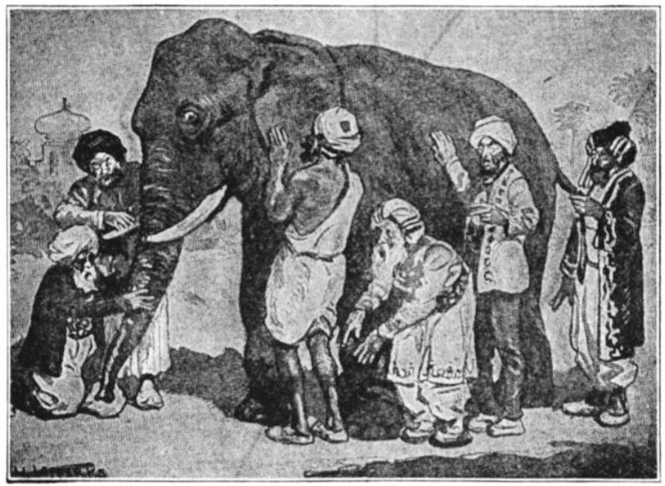

_A famous Indian parable describes five blind men encountering an elephant for the first time. They each decide to touch the elephant to understand what the animal is like._

_“An elephant is smooth and hard, like bone,” says the man who grasped its tusk_

_“Nonsense, an elephant is soft like leather,” says the man who felt its ear._

_“You’re both wrong; an elephant is rough like a tree,” says the man who touched its leg._

_The five men begin arguing vehemently, each convinced that he is right. None of them manages to convince the other of anything, except that everyone else is untrustworthy._

This is my favorite fable. It says so much in so few words, about the way we reside in our lonely heads, why alignment is an Everest mountain, how the shape of truth is diamond-faceted.

这是我最喜欢的寓言。 它用很少的文字说了很多，关于我们在孤独的头脑中的居住方式，为什么对齐是珠穆朗玛峰，真理的形状如何是钻石面的。

I see this story often used to describe organization dysfunction — _See? This is why Sales and Product keep quarreling!_

我看到这个故事经常被用来描述组织功能障碍—— _看到了吗？ 这就是为什么Sales和Product一直吵架的原因！_

But hear me out. Recently, I’ve started to see this story as a perfect embodiment of another topic: the 3 most common mistakes teams make in [using data](https://joulee.medium.com/the-data-informed-manifesto-9dd8c240382f).

但请听我说完。 最近，我开始将这个故事视为另一个主题的完美体现：团队在 [使用数据](https://joulee.medium.com/the-data-informed-manifesto-9dd8c240382f) 时最常犯的 3 个错误。

Ready to explore this elephant with me?

准备好和我一起探索这头大象了吗？

## Mistake #1: Rejecting Data that Doesn’t Match Your Beliefs

## 错误 #1：拒绝与您的信念不符的数据

The obvious thing we — who are not newbies to elephants — can recognize is that _none of the blind men are wrong!_

我们——不是大象的新手——显而易见的是， _没有一个盲人是错的！_

An elephant is simultaneously soft like leather, smooth as a bone, and rough like tree bark. It’s also a million other adjectives, because it’s a complex, majestic animal! Such is our world, one where we extol the wise words of [Walt](https://www.penguin.co.uk/articles/2020/09/walt-whitman-leaves-of-grass-i-contain-multitudes-twitter-meme): _Do I contradict myself? Very well then I contradict myself (I am large, I contain multitudes)._

大象既像皮革一样柔软，又像骨头一样光滑，又像树皮一样粗糙。 它也是一百万个其他形容词，因为它是一种复杂、雄伟的动物！ 这就是我们的世界，我们在其中赞美 [沃尔特](https://www.penguin.co.uk/articles/2020/09/walt-whitman-leaves-of-grass-i-contain-multitudes-twitter-meme) 的睿智话语： _我自相矛盾吗？ 好吧，那我自相矛盾（我很大，我有很多人）。_

But in a team setting, when you’re locked in a tense battle of wills, it’s hard to remember this. Everything becomes binary.

但在团队环境中，当你陷入一场紧张的意志较量中时，很难记住这一点。 一切都变成二进制。

Consider a data analyst sharing experiment results: _Unfortunately, this new redesign decreased user engagement by 5%._

考虑一位数据分析师分享实验结果： _不幸的是，这种新的重新设计使用户参与度降低了 5%。_

_No way,_ retorts the designer. _This redesign is way WAY better. Can’t you see for yourself how much simpler it is? People loved it in the lab. And look at this Twitter feedback!_ <cue visual of many fire emojis>

_不可能，_ 设计师反驳道。 _这种重新设计要好得多。 你自己看不出它有多简单吗？ 人们喜欢它在实验室里。 看看这个 Twitter 反馈！_ <许多火焰表情符号的视觉提示>

I’m embarrassed to admit I have made various forms of the above argument. Like the blind men, I turtled into a narrow definition of the truth: I only embraced data that confirmed what I wanted to believe — _This redesign is Awesome!_

我不好意思承认我对上述论点提出过各种形式。 像盲人一样，我对事实做了一个狭隘的定义：我只接受了证实我想相信的数据—— _这个重新设计太棒了！_

> This is the number one killer of data discipline: Instead of testing my intuition with data, I was seeking data that confirmed my intuition.
> 
> 这是数据纪律的头号杀手：我没有用数据来测试我的直觉，而是在寻找可以证实我直觉的数据。

In most instances where we bring up conflicting pieces of data, the reality is that _both_ viewpoints are true — there are indeed people who love the new redesign, while on average it causes more people to use the feature less (a lesson I learned the hard way, [see Exhibit A here](https://joulee.medium.com/whatevers-best-for-the-people-thats-what-we-do-ed75a0ee7641)).

在我们提出相互矛盾的数据的大多数情况下，现实情况是 _两种_ 观点都是正确的——确实有人喜欢新的重新设计，而平均而言，它会导致更多的人更少地使用该功能（我从中学到的教训）方式， [请参见此处的附件 A](https://joulee.medium.com/whatevers-best-for-the-people-thats-what-we-do-ed75a0ee7641) ）。

Instead of trying to prove one’s opinions, we should aim to broaden our view of reality to incorporate _all_ the data. Only then will we more clearly “see” the whole elephant.

我们不应试图证明自己的观点，而应着眼于拓宽我们对现实的看法以纳入 _所有_ 数据。 只有这样，我们才能更清楚地“看到”整头大象。

## Mistake #2: Selecting Ineffective Methods of Measurement

## 错误 #2：选择无效的测量方法

If none of the blind men were technically _wrong_ about the elephant, then the million dollar question becomes:

如果没有盲人在技术上 _对大象有错误_ ，那么百万美元的问题就变成了：

_What, exactly, is the best way to describe an elephant?_

_确切地说，描述大象的最佳方式是什么？_

Just now, I asked this question to a pack of kids in my yard. They hollered out answers like _Big!_ _Long trunk!_ _Grey!_ Nobody in this (admittedly limited) study suggested comparisons to bone, trees, or leather.

刚才，我向院子里的一群孩子问了这个问题。 他们大喊大叫 _！_ _长长的后备箱！_ _灰色的！_ 在这项（诚然有限的）研究中，没有人建议将其与骨头、树木或皮革进行比较。

Perhaps using touch to describe an elephant is unideal. Perhaps limiting said touch to a few inches of surface area on a single occasion is even less ideal.

也许用触觉来形容大象是不理想的。 也许将所述触摸一次限制在几英寸的表面积内更不理想。

If 5 people in a research lab swiped around your feature muttering _yeah, this is nice,_ would you conclude that your entire population of 20M users will love it?

如果研究实验室中有 5 个人在你的功能周围滑动并喃喃自语 _，这很好，_ 你会得出结论，你的整个 2000 万用户都会喜欢它吗？

When we talk about data, we must accept that every standard of measurement is a proxy for reality. Picking the best proxies to shed light on what you care about is an art, not a science. Every metric you come up with will have shortcomings in conveying the complete truth.

当我们谈论数据时，我们必须接受每一个衡量标准都是现实的代表。 选择最好的代理来阐明你关心的是一门艺术，而不是一门科学。 您提出的每个指标在传达完整真相方面都会存在缺陷。

Take Time Spent On App, for instance. This metric is often used as a proxy for answering _How worthy of one’s precious time is this?_, aka more Time Spent = More Valuable Service. Netflix, TikTok, and Fortnite proudly brandish their time spent numbers.

以在 App 上花费的时间为例。 该指标通常用作回答 _“这是多么值得一个人的宝贵时间？”_ 的代理。 ，又名花费更多时间 = 更有价值的服务。 Netflix、TikTok 和 Fortnite 自豪地炫耀着他们花费的时间数字。

But take the case of a travel booking site. When I browse for flights or a hotel, I’m typically searching for a good price on a particular date and location. If I spend a lot of time on the site over a few days, what does that reveal? That I’m having fun exploring hotels? That I’m frustrated because it’s taking forever to find options that match my criteria? It’s murky; time spent isn’t super telling in this case.

但以旅游预订网站为例。 当我浏览航班或酒店时，我通常会搜索特定日期和地点的优惠价格。 如果我在几天内花很多时间在该网站上，那会揭示什么？ 我在探索酒店时玩得开心吗？ 我很沮丧，因为要花很长时间才能找到符合我标准的选项？ 这是阴暗的； 在这种情况下，花费的时间并不能说明问题。

To know the best way to understand app value or to describe an elephant, we need to know the _why_. We need a _purpose_ before we need the data.

要知道了解应用程序价值或描述大象的最佳方式，我们需要知道 _原因_ 。 在我们需要数据之前，我们需要一个 _目的_ 。

_Help people easily recognize an elephant in the wild if they encounter one_ is an entirely different purpose than _Evaluate whether hunting elephants can be profitable_ or _Determine if wild elephants are thriving._

_帮助人们在遇到大象时轻松识别野外大象_ 是否繁盛是完全不同的目的。 _与评估狩猎大象是否有利可图_ 或 _确定野生大象_

Once you know your purpose, you must then continually iterate on the best proxies of measurement to give you a picture of reality.

一旦你知道了你的目的，你就必须不断地迭代最佳的测量代理来给你一个现实的画面。

If I’m trying to improve the health of wild elephants, should I take stock of their height or their weight? Their color or their distance travelled? Their lifespan or their herd size? For how many elephants can I get this information easily and accurately? How often can I get updates?

如果我想改善野生大象的健康状况，我应该评估它们的身高还是体重？ 他们的颜色或他们走过的距离？ 他们的寿命还是他们的畜群规模？ 对于多少头大象，我可以轻松准确地获得这些信息？ 我多久可以获得一次更新？

There’s no right answer here; the only way forward is to keep iterating on the best proxies for reality as it relates to our purpose.

这里没有正确答案； 唯一的前进方向是不断迭代与我们的目标相关的现实的最佳代理。

## Mistake #3: Failing to Turn Disagreements into Learnings

## 错误 #3：未能将分歧转化为经验教训

So data is messy and reality skews more complex than we imagine.

所以数据是混乱的，现实比我们想象的更复杂。

What then? Is there anything those blind men could have done to avert the crisis of shattered friendship?

然后怎样呢？ 那些盲人可以做些什么来避免友谊破裂的危机？

Yes indeed, if only they knew the power of turning disagreements into _falsifiable hypotheses,_ in other words, turning their assumptions into _true or false_ tests.

是的，如果他们知道将分歧转化为 _可证伪假设_ 的力量，换句话说，将他们的假设转化为 _真或假_ 测试。

An example of a good falsifiable hypothesis: _Simplifying our onboarding flow will improve new user retention after one week_. We can actually make a wager on this! Our whole team can stand around and look at the results of user retention after one week and be exactly on the same page about whether it happened or not.

一个很好的可证伪假设的例子： _简化我们的入职流程将在一周后提高新用户保留率_ 。 其实我们可以赌一把！ 我们整个团队可以围观一周后的用户留存结果，并就这件事是否发生达成一致。

Contrast this with a less falsifiable hypothesis, like _Changing our illustrations will make our product more tasteful._ What does tasteful mean? Who gets to judge? We could argue about this all night.

将此与不太可证伪的假设进行对比，例如 _更改我们的插图将使我们的产品更有品味。_ 有品位是什么意思 谁来评判？ 我们可以为此争论一整夜。

Another way to ask this is: _What evidence would convince you that your belief is wrong?_ Then, listen closely to what the person says and propose a way to collect that evidence. This is what top data-informed companies like Netflix, Google, Amazon do; they love channeling their inner scientist and running A/B tests to test their beliefs.

另一种问法是： _什么证据可以说服你相信你的信念是错误的？_ 然后，仔细聆听此人所说的内容并提出收集证据的方法。 这就是 Netflix、谷歌、亚马逊等顶级数据公司所做的； 他们喜欢引导他们内心的科学家并运行 A/B 测试来检验他们的信念。

Even if you can’t do a pure controlled experiment, you can still make concrete guesses about what will happen. Nothing helps a group learn like writing down each person’s bets on a public board and checking the scorecard after the game.

即使你不能做一个纯粹的受控实验，你仍然可以对会发生什么做出具体的猜测。 没有什么比在公共棋盘上写下每个人的赌注并在赛后检查记分卡更能帮助团队学习的了。

“An elephant is smooth and hard, like bone,” says the man who grasped its tusk.

“大象光滑而坚硬，像骨头一样，”抓住象牙的人说。

“Nonsense, an elephant is soft like leather,” says the man who touched its ear.

“胡说八道，大象软得像皮革。”摸了摸大象耳朵的人说。

Imagine if the third man had said, “Let us ask another 100 people what they think, and see what the majority opinion is.”

想象一下，如果第三个人说：“让我们再问 100 个人的想法，看看大多数人的意见是什么。”

We’ll all make better decisions — and more friends — this way.

我们都会以这种方式做出更好的决定——并结交更多朋友。

—

—

_Like what you read? Please check out_ [_Manifesto for the Data-Informed_](https://joulee.medium.com/the-data-informed-manifesto-9dd8c240382f)_, the foundation article for this series of explorations into what it means to use data well._

_喜欢你读的东西吗？ 请查看_ [_Manifesto for the Data-Informed_](https://joulee.medium.com/the-data-informed-manifesto-9dd8c240382f) _，这是本系列探索充分利用数据的基础文章。_
