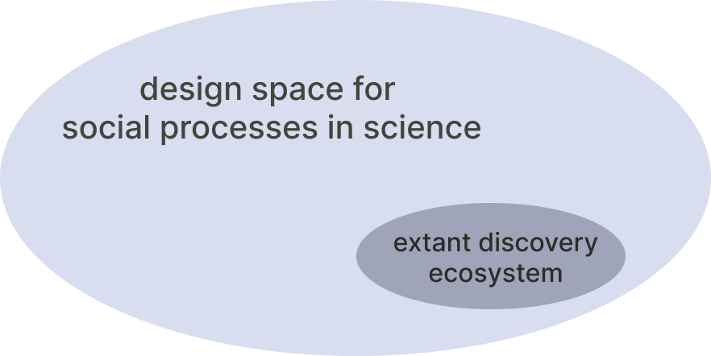
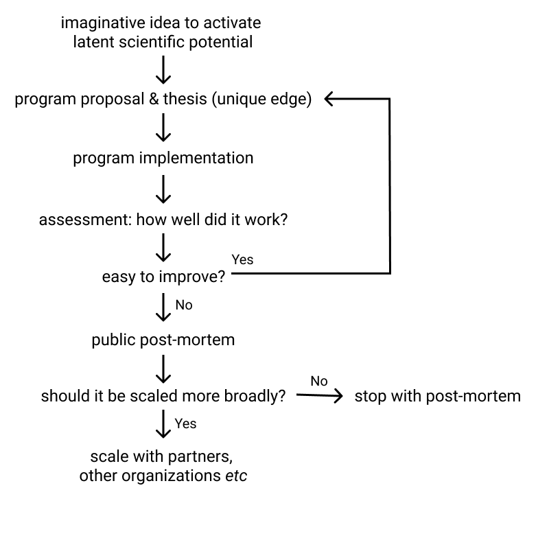
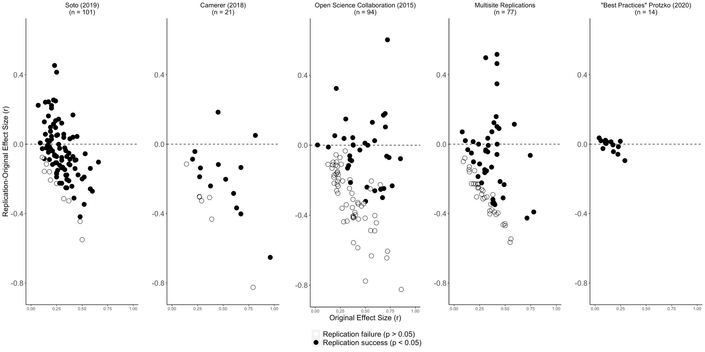
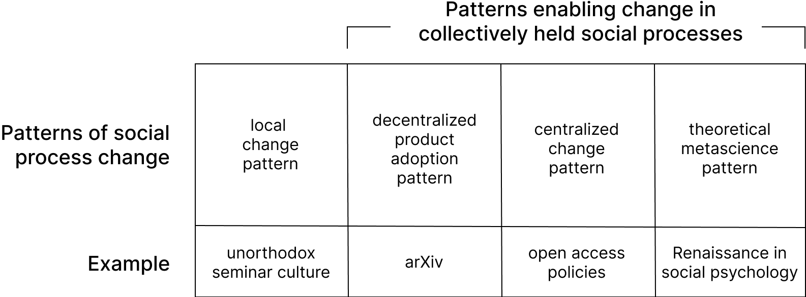
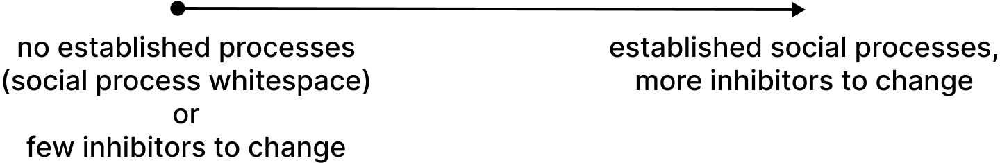
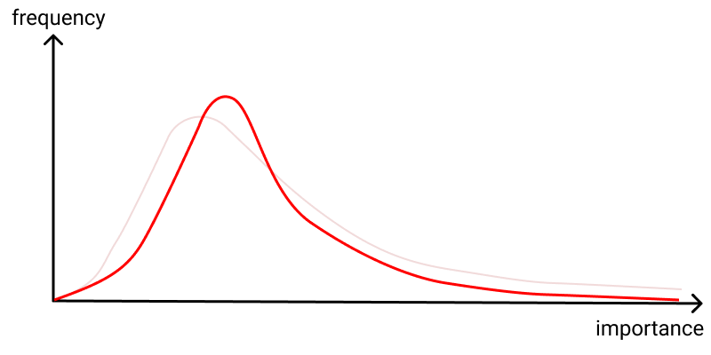
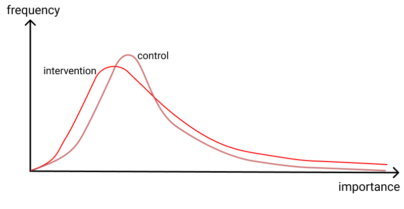

**Contents**

-   [How does the culture of science change?](https://scienceplusplus.org/metascience/index.html#how-does-the-culture-of-science-change)
-   [Part 1: Exploring the metascience design space](https://scienceplusplus.org/metascience/index.html#part-1-exploring-the-metascience-design-space)
    -   [The funder as detector-and-predictor: one heuristic for exploring the metascience design space](https://scienceplusplus.org/metascience/index.html#the-funder-as-detector-and-predictor-one-heuristic-for-exploring-the-metascience-design-space)
    -   [Metascience as an imaginative design practice](https://scienceplusplus.org/metascience/index.html#metascience-as-an-imaginative-design-practice)
-   [Part 2: The decentralized improvement of the social processes of science](https://scienceplusplus.org/metascience/index.html#part-2-the-decentralized-improvement-of-the-social-processes-of-science)
    -   [Bottlenecks inhibiting decentralized improvement](https://scienceplusplus.org/metascience/index.html#bottlenecks-inhibiting-decentralized-improvement)
    -   [A prototype of success: the replication crisis and the Renaissance in social psychology](https://scienceplusplus.org/metascience/index.html#a-prototype-of-success-the-replication-crisis-and-the-renaissance-in-social-psychology)
    -   [Learning from the Renaissance in social psychology](https://scienceplusplus.org/metascience/index.html#learning-from-the-renaissance-in-social-psychology)
    -   [Metascience entrepreneurship](https://scienceplusplus.org/metascience/index.html#metascience-entrepreneurship)
    -   [Patterns of metascience entrepreneurship](https://scienceplusplus.org/metascience/index.html#patterns-of-metascience-entrepreneurship)
    -   [Can we use decisive metascientific results to drive improvement in the social processes of science?](https://scienceplusplus.org/metascience/index.html#can-we-use-decisive-metascientific-results-to-drive-improvement-in-the-social-processes-of-science)
    -   [Theoretical metascience beyond RCTs](https://scienceplusplus.org/metascience/index.html#theoretical-metascience-beyond-rcts)
    -   [A metascience accelerator to drive change](https://scienceplusplus.org/metascience/index.html#a-metascience-accelerator-to-drive-change)
    -   [Important points not otherwise covered](https://scienceplusplus.org/metascience/index.html#important-points-not-otherwise-covered)
-   [Is transformative improvement possible in the culture of science?](https://scienceplusplus.org/metascience/index.html#is-transformative-improvement-possible-in-the-culture-of-science)
-   [Acknowledgments](https://scienceplusplus.org/metascience/index.html#acknowledgments)
-   [Citation information](https://scienceplusplus.org/metascience/index.html#citation-information)
-   [Appendices](https://scienceplusplus.org/metascience/index.html#appendices)
    -   [Other opportunities to transform science: artificial intelligence, India, China, space colonization, and intelligence augmentation](https://scienceplusplus.org/metascience/index.html#other-opportunities-to-transform-science-artificial-intelligence-india-china-space-colonization-and-intelligence-augmentation)
    -   [The trouble caused by scale](https://scienceplusplus.org/metascience/index.html#the-trouble-caused-by-scale)
    -   [Challenges in achieving structural diversity](https://scienceplusplus.org/metascience/index.html#challenges-in-achieving-structural-diversity)
-   [Footnotes](https://scienceplusplus.org/metascience/index.html#footnotes)

By [Michael Nielsen](https://michaelnielsen.org/) and [Kanjun Qiu](https://kanjun.me/)

October 18, 2022

_How does the culture of science change and improve? Many people have identified shortcomings in core social processes of science, such as peer review, how grants are awarded, how people are selected to become scientists, and so on. Yet despite often compelling criticisms, strong barriers inhibit widespread change in such social processes. The result is near stasis, and apathy about the prospects for improvement. People sometimes start new research institutions intended to do things differently; unfortunately such institutions are often changed more by the existing ecosystem than they change it. In this essay we sketch a vision of how the social processes of science may be rapidly improved. In this vision, metascience plays a key role: it deepens our understanding of which social processes best support discovery; that understanding can then help drive change. We introduce the notion of a metascience entrepreneur, a person seeking to achieve a scalable improvement in the social processes of science. We argue that: (1) metascience is an imaginative design practice, exploring an enormous design space for social processes; (2) that exploration aims to find new social processes which unlock latent potential for discovery; (3) decentralized change must be possible, so outsiders with superior ideas can't be blocked by established power centers; (4) ideally, change would align with what is best for science and for humanity, not merely what is fashionable, politically popular, or media-friendly; (5) the net result would be a far more structurally diverse set of environments for doing science; and (6) this would enable crucial types of work difficult or impossible within existing environments. For this vision to succeed metascience must develop and intertwine three elements: an imaginative design practice, an entrepreneurial discipline, and a research field. Overall, it is a vision in which metascience is an engine of improvement for the social processes and ultimately the culture of science._

_文化如何 科学的改变和改进？ 很多人都认出了 科学核心社会过程的缺陷，例如同行评审， 如何授予资助，如何选择人们成为科学家， 等等。 然而，尽管经常有令人信服的批评，但存在强大的障碍 抑制这种社会进程的广泛变化。 结果近了 停滞不前，对改善的前景漠不关心。 人们 有时会成立新的研究机构打算做一些事情 不同的； 不幸的是，这些机构经常被更多地改变 现有的生态系统比他们改变它。 在这篇文章中，我们勾画了一个 科学的社会过程如何可能迅速发展的愿景 改善。 在这一愿景中，元科学起着关键作用：它加深了我们的 了解哪些社会过程最能支持发现； 那 理解可以帮助推动变革。 我们引入的概念 一位元科学企业家，一个寻求实现可扩展性的人 改进科学的社会过程。 我们认为：（1） 元科学是一种富有想象力的设计实践，探索巨大的 为社会进程设计空间； (2) 探索的目的是发现 释放潜在发现潜力的新社会进程； (3) 去中心化的改变必须是可能的，所以局外人有更好的 既定的权力中心无法阻止想法； (4) 理想情况下， 变化将与对科学和人类最有利的东西保持一致，而不是 仅仅是时尚的、政治上流行的或媒体友好的； (5) 最终结果将是一组结构上更加多样化的 从事科学研究的环境； (6) 这将使关键 在现有环境中困难或不可能完成的工作类型。 为了实现这一愿景，元科学必须发展和交织 三个要素：富有想象力的设计实践、创业精神 学科和研究领域。 总的来说，这是一个愿景 元科学是改进社会进程的引擎， 最终是科学文化。_

## How does the culture of science change?

## 科学文化如何改变？

Imagine you're a science fiction author writing a story depicting a scientific discovery made by an alien species. In your story you show the alien scientists up close – how they work, how they live. Would you show them working within institutions resembling human universities, with the PhD system, grant agencies, academic journals, and so on? Would they use social processes like peer review and citation? Would the alien scientists have interminable arguments, as human scientists do, about the merits of the h-index and impact factor and similar attempts to measure science?

想象一下，您是一位科幻小说作家，正在撰写一篇描述外星物种的科学发现的故事。 在您的故事中，您近距离展示了外星科学家——他们如何工作，如何生活。 你会展示他们在类似于人类大学的机构中工作吗，有博士学位系统、资助机构、学术期刊等等？ 他们会使用同行评审和引用等社交流程吗？ 外星科学家是否会像人类科学家一样，对 h 指数和影响因子的优点以及衡量科学的类似尝试进行无休止的争论？

Almost certainly, the design of our human scientific social processes has been too contingent on the accidents of history for the answers to those questions to all be "yes". It seems unlikely that humanity has found the best possible means of allocating scarce scientific resources! We doubt even the most fervent proponents of, say, Harvard or the US National Science Foundation would regard them as a platonic ideal. Nor does it seem likely the h-index and similar measures are universal measures of scientific merit.

几乎可以肯定的是，我们人类科学社会进程的设计过于依赖于历史的偶然性，以至于这些问题的答案都是“是”。 人类似乎不太可能找到分配稀缺科学资源的最佳方法！ 我们怀疑即使是哈佛或美国国家科学基金会最狂热的支持者也会将它们视为柏拉图式的理想。 h 指数和类似指标似乎也不太可能是衡量科学价值的普遍指标。

This doesn't mean the aliens wouldn't have many scientific facts and methodological ideas in common with humanity – plausibly, for instance, the use of mathematics to describe the universe, or the central role of experiment in improving our understanding. But it also seems likely such aliens will have radically different social processes to support science. What would those social processes be? Could they have developed scientific institutions as superior to ours as modern universities are to the learned medieval monasteries?

这并不意味着外星人不会有许多与人类相同的科学事实和方法论思想——例如，似乎可以使用数学来描述宇宙，或者实验在提高我们的理解方面的核心作用。 但这些外星人似乎也有可能拥有截然不同的社会过程来支持科学。 这些社会过程是什么？ 他们能否发展出优于我们的科学机构，就像现代大学优于博学的中世纪修道院一样？

The question "how would aliens do science?" is fun to consider, if fanciful. But it's also a good stimulus for immediately human-relevant questions. For instance: suppose you were given a large sum of money – say, a hundred million dollars, or a billion dollars, or even ten or a hundred billion or a trillion dollars – and asked to start a new scientific institution, perhaps a research institute or funder. What would you do with the money?

“外星人将如何做科学？”的问题。 考虑起来很有趣，如果幻想的话。 但它也是对直接与人类相关的问题的良好刺激。 例如：假设你得到了一大笔钱——比如说，一亿美元，或者十亿美元，甚至十、一千亿或者一万亿美元——并被要求建立一个新的科学机构，也许是一个研究所或资助者。 你会用这笔钱做什么？

Would you aim to incrementally improve on the approaches currently taken by Harvard, the NSF, HHMI, and so on? Or would you attempt to create radically new institutions, which transcend existing institutions, a new organizational approach to doing science? Not just in the sense of new scientific ideas or methods in specific fields, but rather _new social processes for science_; that is, new ways to select and support human beings to make discoveries? Our distant ancestors did not, after all, anticipate the immense improvements possible in humanity's discovery ecosystem[1](https://scienceplusplus.org/metascience/index.html#fn1). Perhaps, with sufficient insight, further transformative improvements are possible?

您的目标是逐步改进哈佛、NSF、HHMI 等目前采用的方法吗？ 还是您会尝试创建超越现有机构的全新机构，一种从事科学研究的新组织方法？ 不仅仅是特定领域的新科学思想或方法，而是 _新的科学社会进程_ ； 也就是说，选择和支持人类进行发现的新方法？ 毕竟，我们的远祖并没有预料到人类探索生态系统 [1 ](https://scienceplusplus.org/metascience/index.html#fn1) 可能出现的巨大改进。 也许，有了足够的洞察力，进一步的变革性改进是可能的？

These questions aren't just hypothetical. Lots of concrete work has been done on the question: "what's wrong with the social processes of science, and how can we improve them?" Some of this work is in papers, essays, and manifestos explaining how to fix or improve peer review or funding or hiring or the career structure of science, and so on. Early entries in the genre include such celebrated works as Francis Bacon's [The New Atlantis](https://www.gutenberg.org/files/2434/2434-h/2434-h.htm) and [Novum Organum](https://www.gutenberg.org/files/45988/45988-h/45988-h.htm), and Vannevar Bush's [Science – The Endless Frontier](https://www.nsf.gov/od/lpa/nsf50/vbush1945.htm). And, of course, there is much modern work: from fields including the economics of science funding, the science of science, science and technology studies, science policy, and others; in the mass media; and on social media and in informal conversation amongst scientists.

这些问题不仅仅是假设性的。 针对“科学的社会过程出了什么问题，我们如何改进它们？”这个问题已经做了很多具体的工作。 其中一些工作出现在论文、论文和宣言中，解释了如何修复或改进同行评审、资助、招聘或科学的职业结构等。 该类型的早期作品包括 Francis Bacon 的 [The New Atlantis](https://www.gutenberg.org/files/2434/2434-h/2434-h.htm) 和 [Novum Organum](https://www.gutenberg.org/files/45988/45988-h/45988-h.htm) 以及 Vannevar Bush 的 [Science – The Endless Frontier](https://www.nsf.gov/od/lpa/nsf50/vbush1945.htm) 等著名作品。 当然，还有很多现代工作：来自科学资助经济学、科学科学、科学技术研究、科学政策等领域； 在大众媒体上； 在社交媒体和科学家之间的非正式对话中。

Alongside these proposals, many adventurous people are building new and sometimes daringly different scientific organizations. There are big new research institutes, such as the Arc Institute, DeepMind, and Altos. There are tiny pirate insurgencies, such as the Center for Open Science, DynamicLand, EleutherAI, and dozens or perhaps even hundreds more[2](https://scienceplusplus.org/metascience/index.html#fn2). There are new funders, such as Convergent Research, Fast Grants, the FTX Foundation, VitaDAO, and many more. Of course, many of these are differentiated in part by their specific research focus: for example, DeepMind was one of the first large organizations focused on artificial intelligence research. But many also have theses based in part on new or unusual approaches to the basic social processes of science. And when we talk to the founders of such organizations they often express hope that not only will their organization succeed, it will be a beacon, succeeding so spectacularly that the underlying social ideas will spread widely, improving humanity's discovery ecosystem as a whole.

除了这些提议，许多富有冒险精神的人正在建立新的、有时甚至是截然不同的科学组织。 有大型的新研究机构，例如 Arc Institute、DeepMind 和 Altos。 有一些小型的盗版叛乱组织，例如开放科学中心、DynamicLand、EleutherAI，以及数十个甚至数百个 [2 ](https://scienceplusplus.org/metascience/index.html#fn2) 。 有新的资助者，例如 Convergent Research、Fast Grants、FTX Foundation、VitaDAO 等等。 当然，其中许多在一定程度上因其特定的研究重点而有所区别：例如，DeepMind 是最早专注于人工智能研究的大型组织之一。 但许多人的论文也部分基于对科学的基本社会过程的新的或不寻常的方法。 当我们与此类组织的创始人交谈时，他们经常表示希望他们的组织不仅会成功，而且会成为一座灯塔，取得如此巨大的成功，以至于潜在的社会理念将广泛传播，从而改善整个人类的发现生态系统。

How realistic is that hope? Does our discovery ecosystem improve in response to successful experiments with new social processes? Or is it resistant to change, only improving slowly? In a nutshell, this essay explores the question: how well does the discovery ecosystem learn, and can we improve the way it learns? As we address this question, many related questions naturally arise: does the discovery ecosystem enable the rapid trial of a multitude of wildly imaginative social processes? Or are only tiny, incremental changes ever possible? Can outsiders with great ideas displace existing approaches? Or can change only come from people and organizations who already have enormous power?

这个希望有多现实？ 我们的发现生态系统是否会因新社会过程的成功实验而得到改善？ 还是它抗拒改变，只能慢慢改进？ 简而言之，本文探讨的问题是：发现生态系统的学习效果如何，我们能否改进它的学习方式？ 当我们解决这个问题时，自然会出现许多相关问题：发现生态系统是否能够快速试用大量富有想象力的社会过程？ 还是只有微小的、渐进的变化是可能的？ 有好主意的局外人能否取代现有方法？ 或者改变只能来自已经拥有巨大权力的人和组织？

What we'll find is a discovery ecosystem in a state of near stasis, with strong barriers inhibiting the improvement of key social processes. We believe it's possible to change this situation. In this essay we sketch a vision in which metascience drives rapid improvement in the social processes of science. This vision requires a strong theoretical discipline of metascience, able to obtain results decisive enough to drive the adoption of new social processes, including processes that may displace incumbents. It also requires a strong ecosystem of metascience entrepreneurs, people working to achieve scalable change in the social processes of science. In some sense, the essay explores what it would mean for humanity to do metascience seriously. And it's about placing that endeavor at the core of science. We believe the net result will be a portfolio of social processes far more structurally diverse than today, enabling crucial types of work difficult or impossible within existing environments, and so expanding the range of possible discoveries.

我们将发现一个处于近乎停滞状态的发现生态系统，存在阻碍关键社会进程改进的强大障碍。 我们相信有可能改变这种情况。 在这篇文章中，我们描绘了一个愿景，即元科学推动科学社会进程的快速改进。 这一愿景需要强大的元科学理论学科，能够获得足够决定性的结果来推动采用新的社会进程，包括可能取代现任者的进程。 它还需要一个强大的元科学企业家生态系统，人们致力于在科学的社会过程中实现可扩展的变革。 从某种意义上说，这篇文章探讨了认真从事元科学对人类意味着什么。 这是关于将这种努力置于科学的核心。 我们相信最终的结果将是一个结构上比今天更加多样化的社会过程组合，使现有环境中难以或不可能完成的关键类型的工作成为可能，从而扩大可能发现的范围。

As far as we are aware, these questions have not previously been explored in depth. To make the questions more concrete, let's sketch a few specific examples of unusual social processes that could be (or are being) trialled today by adventurous funders or research organizations[3](https://scienceplusplus.org/metascience/index.html#fn3). These sketches are intended as brief illustrative examples, to evoke what we mean by "changed social processes". Though the examples are modest and conservative – indeed, some ideas may be familiar to you[4](https://scienceplusplus.org/metascience/index.html#fn4), though perhaps not all – versions scaled out across science would significantly change the culture of science. It's a long list, to emphasize the many diverse opportunities for imaginative change. Later in the essay we develop deeper ways of thinking that generate many more ideas for change.

据我们所知，这些问题以前没有被深入探讨过。 为了使问题更具体，让我们举几个不寻常的社会过程的具体例子，这些社会过程今天可能（或正在）由冒险的资助者或研究组织 [3 ](https://scienceplusplus.org/metascience/index.html#fn3) 进行试验。 这些草图旨在作为简短的说明性示例，以唤起我们所说的“改变的社会过程”的含义。 尽管这些例子是适度和保守的——事实上，有些想法可能对你来说很熟悉 [4 ](https://scienceplusplus.org/metascience/index.html#fn4) ，尽管可能不是全部——跨科学扩展的版本将显着改变科学文化。 这是一个很长的清单，以强调想象力变化的许多不同机会。 在文章的后面，我们发展了更深入的思维方式，产生了更多的变革想法。
    
-   **Fund-by-variance:** Instead of funding grants that get the highest average score from reviewers, a funder should use the variance (or kurtosis or some similar measurement of disagreement[5](https://scienceplusplus.org/metascience/index.html#fn5)) in reviewer scores as a primary signal: only fund things that are highly polarizing (some people love it, some people hate it). One thesis to support such a program is that you may prefer to fund projects with a modest chance of outlier success over projects with a high chance of modest success. An alternate thesis is that you should aspire to fund things _only_ you would fund, and so should look for signal to that end: projects everyone agrees are good will certainly get funded elsewhere. And if you merely fund what everyone else is funding, then you have little marginal impact[6](https://scienceplusplus.org/metascience/index.html#fn6),[7](https://scienceplusplus.org/metascience/index.html#fn7).
    
    **Fund-by-variance：** 资助者不应资助从评审员那里获得最高平均分的资助，而应使用评审员评分中的方差（或峰态或一些类似的分歧度量 [5 ](https://scienceplusplus.org/metascience/index.html#fn5) ）作为主要信号：只资助高度评价的项目偏光（有些人喜欢，有些人讨厌）。 支持这样一个项目的一个论点是，你可能更愿意资助那些取得异常成功的机会不大的项目，而不是那些成功机会不大的项目。 另一个论点是，你应该立志 _只_ 资助你愿意资助的事情，因此应该为此寻找信号：每个人都认为好的项目肯定会在其他地方获得资助。 如果您只是资助其他人都在资助的事情，那么您的边际影响就很小 [6 ](https://scienceplusplus.org/metascience/index.html#fn6) ,  [7 ](https://scienceplusplus.org/metascience/index.html#fn7) 。
        
-   **Century Grant Program[8](https://scienceplusplus.org/metascience/index.html#fn8):** Solicit grant applications for projects to be funded for 100 years. Done through an endowment model, the cost would be a small multiple of conventional 5- or 10-year funding. The point is to elicit an important type of intellectual dark matter[9](https://scienceplusplus.org/metascience/index.html#fn9): problems of immense scientific value that can't be investigated on short timelines. Inspired by seminal projects such as the CO2 monitoring at the Mauna Loa observatory, the Framingham Heart Study, and the Cape Grim Air Archive.
    
    **Century Grant Program [8 ](https://scienceplusplus.org/metascience/index.html#fn8) :** 为资助 100 年的项目征求资助申请。 通过捐赠模型完成，成本将是传统 5 年或 10 年资金的一小部分。 重点是引出一种重要的智力暗物质 [9 ](https://scienceplusplus.org/metascience/index.html#fn9) ：无法在短时间内研究的具有巨大科学价值的问题。 受到莫纳罗亚天文台二氧化碳监测、弗雷明汉心脏研究和格里姆角航空档案馆等开创性项目的启发。
        
-   **Tenure insurance:** Tenure-track scientists often play it safe in the projects they take on. Encourage people to swing for the fences by offering a large payout if they fail to receive tenure. Supposing 80% of tenure-track faculty receive tenure[10](https://scienceplusplus.org/metascience/index.html#fn10), the cost for a large payout would only be a modest addition to an existing benefits package. A premium of $8k per year for 6 years, with a 5x multiplier and reasonable assumptions about interest rates, would result in a payout of over $300k. That's several years of pre-tenure salary in many fields and at many institutions. This suggestion is an instance of two more general patterns: (1) moving risk to parties who can more easily bear it, making the system as a whole less risk averse; and (2) a plausible way to increase people's ambition is to de-risk by improving their fallback options in the event of failure[11](https://scienceplusplus.org/metascience/index.html#fn11).
    
    **终身保险：** 终身职位科学家通常在他们承担的项目中谨慎行事。 如果人们未能获得任期，则通过提供大笔支出来鼓励他们回避。 假设 80% 的终身教职员工获得终身教职 [10 ](https://scienceplusplus.org/metascience/index.html#fn10) ，大笔支出的成本只是对现有福利方案的适度增加。 6 年每年 8,000 美元的保费，加上 5 倍乘数和合理的利率假设，将导致支出超过 30 万美元。 在许多领域和许多机构，这是几年的任职前薪水。 这个建议是两种更普遍的模式的一个例子：（1）将风险转移给更容易承担风险的各方，使整个系统不那么厌恶风险； (2) 增加人们雄心壮志的一个可行方法是通过改善失败时的后备选择来降低风险 [11 ](https://scienceplusplus.org/metascience/index.html#fn11) 。
        
-   **Failure audit:** Many funders advocate high-risk, high-reward research, but this is often mere research theater, not seriously meant. For instance, in 2018 the European Research Council issued a self-congratulatory report claiming that: (a) they fund mostly "high risk" work; and (b) almost all the work they fund succeeds, with 79% of projects achieving either a "scientific breakthrough" or a "major scientific advance". If almost every project succeeds, then this is not a definition of "high risk" we recognize[12](https://scienceplusplus.org/metascience/index.html#fn12). To prove the seriousness of their intent about risk, funders could run credible independent audits on their grant programs, and if the _failure_ rate for grants persists _below_ some threshold (say, 50%), the program manager is fired[13](https://scienceplusplus.org/metascience/index.html#fn13). Or, at a different level of abstraction, the entire funder could be audited, and if the number of grant programs which fails is below 50%, the funder's director is fired.
    
    **失败审计：** 许多资助者提倡高风险、高回报的研究，但这通常只是研究戏剧，并不是认真的。 例如，欧洲研究委员会在 2018 年发布了一份沾沾自喜的报告，声称：(a) 他们资助的主要是“高风险”工作； (b) 他们资助的几乎所有工作都取得了成功，79% 的项目实现了“科学突破”或“重大科学进步”。 如果几乎每个项目都成功了，那么这就不是我们公认的“高风险”定义 [12 ](https://scienceplusplus.org/metascience/index.html#fn12) 。 为了证明他们对风险意图的严肃性，资助者可以对他们的资助计划进行可靠的独立审计，如果资助的 _失败_ 率持续 _低于_ 某个阈值（比如 50%），项目经理将被解雇 [13 ](https://scienceplusplus.org/metascience/index.html#fn13) 。 或者，在不同的抽象层次上，可以对整个资助者进行审计，如果失败的资助计划数量低于 50%，资助者的董事将被解雇。
        
-   **Acquisition pipeline for research institutes:** People often lament the loss of (or large changes in) great private research institutes past – PARC in the 1970s is perhaps the best modern example[14](https://scienceplusplus.org/metascience/index.html#fn14). If PARC-in-the-1970s was so great, why didn't the NSF acquire it? An acquisition would have been within their mission, and almost certainly a far-better-than-median use of NSF's funds[15](https://scienceplusplus.org/metascience/index.html#fn15). There might well have been political or bureaucratic barriers, but if so the problem lies in politics and bureaucracy, not in the merit of the idea. If public (or philanthropic) acquisition of private research institutes was common, it may incentivize the creation of more outstanding private research institutes.
    
    **研究机构的收购渠道：** 人们常常哀叹过去伟大的私人研究机构的流失（或巨大的变化）——1970 年代的 PARC 或许是现代最好的例子 [14 ](https://scienceplusplus.org/metascience/index.html#fn14) 。 如果 70 年代的 PARC 如此伟大，为什么 NSF 没有收购它？ 收购将符合他们的使命，而且几乎可以肯定，NSF 资金的使用远好于平均水平 [15 ](https://scienceplusplus.org/metascience/index.html#fn15) 。 很可能存在政治或官僚障碍，但如果是这样，问题在于政治和官僚主义，而不是想法的优点。 如果公共（或慈善）收购私人研究机构很普遍，它可能会激励更多优秀私人研究机构的创建。
        
-   **Pull immigration programs:** Moving between countries is an intimidating and arduous exercise, often involving a considerable amount of know-how. There is no _a priori_ reason some enterprising country – let's say Estonia, which has run several innovative experiments in the way they approach immigration – couldn't simply identify outstanding people they'd like as immigrants, and directly recruit them. Imagine a valet shows up on the doorstep of every science olympiad student in the world, with a first-class plane ticket to Estonia, a pre-approved visa, an offer of several years of first-rate private mentoring in whatever field or fields they desire, a stipend, and housing as part of a community of similarly extraordinary students. It'd be interesting to see what the long-run outcomes from such a community would be[16](https://scienceplusplus.org/metascience/index.html#fn16).
    
    **拉式移民计划：** 在国家之间移动是一项艰巨而艰巨的工作，通常涉及大量的专业知识。 一些有进取心的国家——比方说爱沙尼亚，它在处理移民问题的方式上进行了多项创新实验——没有任何 _先验_ 原因不能简单地确定他们想要移民的优秀人才，并直接招募他们。 想象一下，一名贴身男仆出现在世界上每一位科学奥林匹克学生的家门口，手里拿着飞往爱沙尼亚的头等舱机票、预先批准的签证，以及在他们所处的任何领域提供多年一流私人指导的机会愿望，津贴和住房作为同样杰出学生社区的一部分。 看看这样一个社区的长期结果是什么会很有趣 [16 ](https://scienceplusplus.org/metascience/index.html#fn16) 。
        
-   **Open Source Institute:** Like a research university, but instead of producing understanding in the form of research papers, it would produce understanding in the form of open source software and open protocols (with a penumbra of concomitant goods, such as prototypes, demos, open data and, yes, papers). Based on the thesis that sometimes important new understanding isn't best expressed in words, but rather in code or protocols. A number of superficially similar programs already operate, but none (as far we know) genuinely change the underlying political economy – the means by which people build their reputation and career – which is the primary point.
    
    **开源研究所：** 就像一所研究型大学，但它不是以研究论文的形式产生理解，而是以开源软件和开放协议的形式产生理解（伴随着一系列伴随产品，如原型、演示、开放数据，是的，还有论文）。 基于这样的论点，有时重要的新理解最好不是用文字来表达，而是用代码或协议来表达。 许多表面上相似的项目已经在运作，但没有一个（据我们所知）真正改变潜在的政治经济学——人们建立声誉和职业生涯的方式——这是主要的一点。
        
-   **Institute for Traveling Scientists:** A yacht that sails around the world, boarding and de-boarding scientists in each port. It would be a mobile version of places like the Stanford Center for Advanced Study in the Behavioral Sciences – somewhere stimulating and relaxing for scientists to go on sabbatical, learn a new field, or perhaps write that book they've been meaning to write. Inspired in part by Craig Venter's round-the-world trip for the Ocean Sequencing Project.
    
    **Institute for Traveling Scientists：** 一艘环游世界的游艇，在每个港口让科学家上下船。 这将是像斯坦福行为科学高级研究中心这样的地方的移动版本——科学家们可以在这里休假、学习新领域或者写他们一直想写的书来激发和放松。 部分灵感来自 Craig Venter 为海洋测序项目进行的环球旅行。
        
-   **Long-shot prizes:** Purchase insurance premiums against extremely unlikely possibilities that would transform the world. A proof that P ≠ NP. A proof that P = NP. A constructive algorithm solving NP-complete problems quickly. Cold fusion. True faster-than-light travel. A perpetual motion machine. And so on. The more unlikely the outcome, the larger the prize can be, even for a small premium[17](https://scienceplusplus.org/metascience/index.html#fn17). Cheap, unlikely to succeed, and extraordinarily impactful if it led to solutions to such problems[18](https://scienceplusplus.org/metascience/index.html#fn18).
    
    **Long-shot prizes：** 为改变世界的极不可能的可能性购买保险费。 P ≠ NP 的证明。 P = NP 的证明。 一种快速解决 NP 完全问题的构造性算法。 冷聚变。 真正的超光速旅行。 永动机。 等等。 结果越不可能，奖金就越大，即使是小额保费 [17 ](https://scienceplusplus.org/metascience/index.html#fn17) 。 成本低廉，不太可能成功，而且如果它能解决此类问题，将具有非凡的影响力 [18 ](https://scienceplusplus.org/metascience/index.html#fn18) 。
        
-   **Public hall of shame / anti-portfolio:** The venture capital firm Bessemer Venture Partners maintains a [public anti-portfolio](https://www.bvp.com/anti-portfolio) of companies where they had an opportunity to invest, but failed. It includes enormously successful companies such as Apple, Google, Facebook, Tesla, and many others. Each failure is accompanied by a short story naming the Bessemer partner who had the opportunity to invest but didn't, and describing (often fancifully and amusingly) why they failed to invest. Every science funder, every university, and every scientific journal in the world should maintain a similar anti-portfolio. Alternately, a collective anti-portfolio could be constructed by a third party willing to tolerate some opprobrium. It wouldn't be popular[19](https://scienceplusplus.org/metascience/index.html#fn19). But done well it would be invaluable.
    
    **公共耻辱大厅/反投资组合：** 风险投资公司 Bessemer Venture Partners 维护着一个 [公开的反投资组合](https://www.bvp.com/anti-portfolio) ，其中包含他们有机会投资但失败的公司。 它包括非常成功的公司，例如 Apple、Google、Facebook、Tesla 和许多其他公司。 每一次失败都伴随着一个短篇故事，其中提到有机会投资但没有投资的 Bessemer 合伙人，并描述（通常是幻想和有趣地）他们投资失败的原因。 世界上每一个科学资助者、每所大学和每一个科学期刊都应该维护一个类似的反投资组合。 或者，一个集体的反投资组合可以由愿意容忍一些谴责的第三方构建。 它不会流行 [19 ](https://scienceplusplus.org/metascience/index.html#fn19) 。 但如果做得好，那将是无价的。
        
-   **Interdisciplinary Institute:** Most proposals for interdisciplinarity are tepid. Take interdisciplinarity seriously, by setting up an institute which identifies (say) 30 different disciplines, and then hires three people to work at the intersection of every possible pairing of disciplines. That's just 1305 people – a large program, but tiny on the scale of modern science. This would be a deliberately variance-inducing strategy. Most pairings of disciplines would produce little, but there are likely a few where great discoveries would unexpectedly be made through the combination. Those few would pay for all the rest. A less expensive approach would be to sample from randomly chosen pairs of disciplines, with the disciplines potentially coming from a much longer list.
    
    **跨学科研究所：** 大多数跨学科建议都不温不火。 认真对待跨学科，通过建立一个研究所来确定（比方说）30 个不同的学科，然后雇佣三个人在每一个可能的学科配对的交叉点工作。 那只是 1305 人——一个庞大的计划，但在现代科学的规模上却很小。 这将是一种故意引起差异的策略。 大多数学科的组合不会产生什么成果，但可能有一些学科会通过组合出乎意料地取得重大发现。 那几个人会支付其余的费用。 一种成本较低的方法是从随机选择的学科对中抽样，这些学科可能来自更长的列表。
        
-   **At-the-Bench Fellowship:** In their heyday, senior scientists at places such as Bell Labs and Cambridge's Laboratory for Molecular Biology often carried out research work themselves, or in direct, hands-on collaboration with 1-3 others[20](https://scienceplusplus.org/metascience/index.html#fn20). Yet modern universities often strongly encourage scientists to take on a managerial role, applying for grants but being hands off in research work. This Fellowship would fund senior scientists to spend essentially all their time actually doing science. The thesis here is that for some types of work, important discoveries are most likely if done by someone highly skilled, with a deeply developed affinity for some part of nature. Put another way, the thesis is that for some scientists there are increasing returns to focused expertise, not the diminishing returns assumed in the conventional scientist-becomes-manager-of-a-large-group model.
    
    **At-the-Bench Fellowship：** 在他们的全盛时期，贝尔实验室和剑桥分子生物学实验室等地的资深科学家经常自己开展研究工作，或者直接与其他 1-3 人进行实际合作 [20 ](https://scienceplusplus.org/metascience/index.html#fn20) 。 然而，现代大学通常强烈鼓励科学家担任管理角色，申请资助但不参与研究工作。 该奖学金将资助资深科学家，让他们基本上把所有时间都花在做科学上。 这里的论点是，对于某些类型的工作，重要的发现最有可能是由技能高超的人完成的，并且对自然的某些部分具有深厚的亲和力。 换句话说，这个论点是，对于一些科学家来说，专注的专业知识的回报会增加，而不是传统的科学家成为大型团队经理的模型中假设的回报递减。
        
-   **Printing press for funders:** An entity endowed with $10 billion could spin out new funders each year; it could spin out, for instance, a single funder with a roughly $500 million endowment, perhaps running a competition to find the operators of the new funder. Or it could spin out a larger number of smaller funders. If each new funder had a radically different thesis, this could significantly increase the structural diversity of science; and perhaps increase the diversity of ambient working environments available to scientists. It would also be possible to set up a similar kind of printing press for research organizations, _mutatis mutandis_. And, perhaps, to set up sunset clauses for the organizations, so they don't permanently occupy organizational space in the discovery ecosystem; organizational longevity would then necessarily be through people and ideas being passed to future organizations, not organizational inertia.
    
    **资助者的印刷机：** 一个拥有 100 亿美元的实体每年可以分拆出新的资助者； 例如，它可能会分拆出一个拥有大约 5 亿美元捐赠基金的单一资助者，也许会举办一场比赛来寻找新资助者的运营商。 或者它可以分拆出更多的小型资助者。 如果每个新的资助者都有截然不同的论点，这可能会显着增加科学的结构多样性； 并可能增加科学家可用的周围工作环境的多样性。 还可以为研究机构建立类似的印刷机， _比照必要_ 的。 并且，也许，为组织设置日落条款，这样他们就不会永久占据发现生态系统中的组织空间； 组织的长寿必然是通过将人员和想法传递给未来的组织，而不是组织惰性。
        
-   **Excitement quotient for funders:** Scientists often apply for grants on the basis of what they believe is fundable, rather than with their best ideas[21](https://scienceplusplus.org/metascience/index.html#fn21). We've spoken with scientists who tell us "I know I can get funding for many fashionable-but-unimportant projects, but I can't get funding for the work I think is most important". Why should a funder or anonymous peer reviewer know better than the scientist how they should use their skills? It has the flavor of the busybody stranger who tells a parent they're parenting wrong. Many funders effectively give veto power to such strangers. One approach to partially address this is for an independent agency to sample people applying to different funders, asking: "how excited were you about this grant application?" They can then publicly rate different funders by comparing excitement scores. This would place pressure on funders to fund work applicants were excited about, and raise questions if it was mostly pro forma.
    
    **资助者的兴奋系数：** 科学家通常根据他们认为可以资助的东西申请资助，而不是根据他们最好的想法 [21 ](https://scienceplusplus.org/metascience/index.html#fn21) 。 我们与科学家交谈过，他们告诉我们“我知道我可以为许多时髦但不重要的项目获得资金，但我无法为我认为最重要的工作获得资金”。 为什么资助者或匿名同行评审员应该比科学家更了解他们应该如何使用他们的技能？ 它有爱管闲事的陌生人的味道，他们告诉父母他们的养育方式是错误的。 许多资助者有效地赋予了这些陌生人一票否决权。 部分解决这个问题的一种方法是让独立机构对申请不同资助者的人进行抽样，询问：“您对这项拨款申请有多兴奋？” 然后他们可以通过比较兴奋分数来公开评价不同的资助者。 这会给资助者施加压力，资助申请人感兴趣的工作，如果它主要是形式上的，就会提出问题。
    

With these examples in mind, we may restate the basic questions of the essay. Suppose, for instance, that the first of these ideas, "fund-by-variance", was given a serious trial, perhaps with multiple rounds of debugging and improvement. Suppose it was found that when implemented well it was a decisive improvement over the committee-based peer review approach used today by many funders. Would it then be adopted broadly? Or would other institutions ignore or resist it? In a healthy, dynamic discovery ecosystem it would spread widely, displacing inferior methods when appropriate. By contrast, in a static ecosystem, even if the early trials were extremely successful, other institutions would be slow to respond, or resistant to change. They would get hung up over whether the approach came from the "right" originator, or was prestigious enough. In a healthy discovery ecosystem the improved idea could come from anywhere.

考虑到这些例子，我们可以重述文章的基本问题。 例如，假设这些想法中的第一个，“按差异提供资金”，经过了认真的试验，可能需要进行多轮调试和改进。 假设发现如果实施得当，它是对许多资助者今天使用的基于委员会的同行评审方法的决定性改进。 那么它会被广泛采用吗？ 还是其他机构会忽视或抵制它？ 在一个健康、动态的发现生态系统中，它会广泛传播，并在适当的时候取代劣质方法。 相比之下，在静态生态系统中，即使早期试验非常成功，其他机构也会反应迟缓，或者抵制变革。 他们会纠结于这种方法是否来自“正确的”发起者，或者是否足够有声望。 在一个健康的发现生态系统中，改进的想法可能来自任何地方。

In early drafts of this essay we were hesitant about writing the concrete list of ideas above. We worried that it would anchor readers on "these are the changes Nielsen and Qiu are arguing for". But the individual programs are not the point; indeed we'll suggest many more (and sometimes deeper) ideas later in this essay. Rather, the point is that a flourishing ecosystem would rapidly generate and seriously trial an enormous profusion of ideas, including many ideas far more imaginative than anything listed above. The best of those ideas would be rigorously tested, iterated on, debugged, and scaled out to improve the entire discovery ecosystem. Indeed, if truly bold ideas were being trialled, then they would include many ideas we would at first disapprove of, but sometimes the evidence for them would be so strong that we'd be forced to change our minds.

在这篇文章的早期草稿中，我们对写出上面的具体想法清单犹豫不决。 我们担心它会把读者固定在“这些是尼尔森和邱争论的变化”上。 但是个别程序不是重点； 事实上，我们将在本文后面提出更多（有时更深入）的想法。 相反，关键是一个繁荣的生态系统会迅速产生并认真试验大量的想法，其中包括许多比上面列出的任何想法都更具想象力的想法。 这些想法中最好的将经过严格测试、迭代、调试和扩展，以改进整个发现生态系统。 事实上，如果真正大胆的想法正在试验中，那么它们会包含许多我们起初不赞成的想法，但有时支持它们的证据会如此强大，以至于我们不得不改变主意。

As stated above, the focus of this essay is how the discovery ecosystem improves. Part of the motivation for this focus is the belief that the design space for promising new social processes is vast:

如上所述，本文的重点是如何改进发现生态系统。 这种关注的部分动机是相信有前途的新社会过程的设计空间是巨大的：

We won't prove this belief. But we'll try to make it plausible. In Part 1 of the essay we'll discuss heuristics for exploring this metascience design space. These heuristics arise out of plausible models of how human beings make discoveries. Indeed, all the social processes of science reflect and are grounded in such models – often implicit or informal folk theories – of how discovery happens. Weak metascientific ideas result in weak social processes; stronger metascientific ideas result in stronger processes. Insofar as we can improve our metascientific theories, we can improve the way human beings make discoveries. A good way to develop that understanding is to explore boldly in the design space above, understanding which ideas do and don't work, and why.

我们不会证明这个信念。 但我们会努力让它看起来合理。 在本文的第 1 部分中，我们将讨论探索这个元科学设计空间的启发式方法。 这些启发式方法源于人类如何进行发现的合理模型。 事实上，科学的所有社会过程都反映并基于这样的模型——通常是隐含的或非正式的民间理论——关于发现是如何发生的。 微弱的元科学思想导致微弱的社会过程； 更强的元科学思想会导致更强大的过程。 只要我们可以改进我们的元科学理论，我们就可以改进人类发现的方式。 培养这种理解的一个好方法是在上面的设计空间中大胆探索，了解哪些想法行得通，哪些行不通，以及为什么。

Throughout this introduction we've used many different-but-related terms, talking about changing the social processes of science; changing the culture of science; changing the institutions of science; changing the discovery ecosystem; and so on. From now on we'll use "social processes of science" as an informal catchall. By that we mean the institutional practices, incentives, norms (and so on) widely used in science. So when we talk about change to the social processes of science we are talking about changes to things like peer review, or hiring practices, or how funders approach risk, as well as broader ideas, such as the "pull immigration" or "printing press for funders" or "anti-portfolio" ideas mentioned above. The phrase "social processes of science" is unfortunately unwieldy. But it is nonetheless very helpful to have such a catchall. We will save the use of other terms for when we have a more specific need.

在整个介绍中，我们使用了许多不同但相关的术语，谈论改变科学的社会进程； 改变科学文化； 改变科学机构； 改变发现生态系统； 等等。 从现在开始，我们将使用“科学的社会过程”作为非正式的统称。 我们指的是在科学中广泛使用的制度实践、激励措施、规范（等等）。 因此，当我们谈论科学社会过程的变化时，我们谈论的是同行评审、招聘实践、资助者处理风险的方式等方面的变化，以及更广泛的想法，如“拉动移民”或“印刷机”对于资助者”或上面提到的“反投资组合”的想法。 不幸的是，“科学的社会过程”这个短语并不适用。 但是，拥有这样一个包罗万象的东西还是很有帮助的。 当我们有更具体的需要时，我们将保留使用其他术语。

As noted earlier, the essay is an entry in the field of metascience. This still emerging field overlaps and draws upon many well-established fields, including the philosophy, history, and sociology of science, as well as newer fields such as the economics of science funding, the science of science, science policy, and others. While we draw on all these fields, there are notable differences in our focus. Unlike the philosophy of science, we are more concerned with social processes than methodology. The two are intertwined, so this is a difference of degree, not kind, but is nonetheless real. Of course, fields such as the sociology of science and the science of science do focus on social processes, but the focus is primarily descriptive, not imaginative design and active intervention, as discussed in our work. The exception is science policy, which has design and intervention as core goals. However, in the science policy world interventions are often focused on what is practical within existing power structures. We shall be concerned with more _a priori_ questions of principle, and enabling decentralized change, i.e., change that may occur outside existing power structures. For all these reasons we think of the essay as simply part of metascience.

如前所述，这篇论文是元科学领域的一个条目。 这个新兴领域与许多成熟领域重叠并借鉴，包括科学的哲学、历史和社会学，以及科学资助经济学、科学科学、科学政策等较新的领域。 虽然我们利用了所有这些领域，但我们的重点存在显着差异。 与科学哲学不同，我们更关心社会过程而不是方法论。 两者是交织在一起的，所以这是程度的差异，不是善意的，但却是真实的。 当然，科学社会学和科学科学等领域确实关注社会过程，但重点主要是描述性的，而不是我们工作中讨论的富有想象力的设计和积极干预。 科学政策是个例外，它以设计和干预为核心目标。 然而，在科学政策世界中，干预通常集中在现有权力结构中的实用性上。 我们会更关心 _先验_ 的原则问题，并促成分散的变革，即可能发生在现有权力结构之外的变革。 由于所有这些原因，我们认为这篇文章只是元科学的一部分。

One factor not discussed in the main body of the essay is the relationship between metascience and several external factors affecting the future of science (artificial intelligence, the rise of China and India, the colonization of space, and intelligence augmentation). We discuss these briefly in an [Appendix](https://scienceplusplus.org/metascience/index.html#app_external_factors) to the essay. The focus in the body of the essay is more endogenous to science.

论文正文中没有讨论的一个因素是元科学与影响科学未来的几个外部因素（人工智能、中国和印度的崛起、太空殖民和智能增强）之间的关系。 中简要讨论了这些 [我们在本文的附录](https://scienceplusplus.org/metascience/index.html#app_external_factors) 。 论文正文的重点更符合科学。

Underlying the essay is the assumption that improved social processes can radically transform and improve science. Most scientists we've spoken with agree with at least a weak form of this assumption. For instance, many strongly advocate metascientific principles like: the importance of freedom of inquiry for scientists; or that it strengthens science if outsiders can overturn established theories on the strength of evidence, not their credentials. For science to work well, such ideas must be expressed, even if imperfectly, in the design of the social processes of science. As said above, the quality of our social processes (and of our institutions) is determined by the quality of the metascientific ideas they embody.

文章的基础是假设改进的社会过程可以从根本上改变和改进科学。 与我们交谈过的大多数科学家至少同意这种假设的一种弱形式。 例如，许多人强烈提倡元科学原则，例如：自由探究对科学家的重要性； 或者，如果局外人可以根据证据而不是凭据推翻既定理论，科学就会得到加强。 为了使科学运作良好，这些想法必须在科学社会过程的设计中得到表达，即使是不完美的。 如上所述，我们的社会过程（以及我们的制度）的质量取决于它们所体现的元科学思想的质量。

But our assumption in this essay is much stronger than that weak form. Again: we believe improved social processes can radically transform and improve science. It's not so obvious this is true. Some scientists we talk with are excited by this idea, and agree that new social processes may be transformative. Others sharply disagree, telling us that broad, ecosystem-level social changes make little substantive difference to the actual science. Indeed, several notable scientists have expressed this to us using minor variations on a single phrase: "all that matters is to fund good people doing good work". Several others have said words to the effect of: "I admire your optimism, but the system never really gets any better, there's just more and more bureaucracy and 'accountability'". It's possible those people are correct. But the only way to determine that is to actively explore the question: what if there are truly transformative social processes waiting to be discovered?

但是我们在这篇文章中的假设比那个弱形式强得多。 再一次：我们相信改进的社会过程可以从根本上改变和改进科学。 这不是很明显这是真的。 与我们交谈的一些科学家对这个想法感到兴奋，并同意新的社会进程可能具有变革性。 其他人则强烈反对，他们告诉我们，广泛的、生态系统层面的社会变化对实际科学几乎没有实质性影响。 事实上，几位著名的科学家已经用一个短语的细微变化向我们表达了这一点：“重要的是资助做好事的好人”。 其他一些人的大意是：“我钦佩你的乐观态度，但系统从来没有真正变得更好，只是官僚主义和‘问责制’越来越多”。 那些人可能是正确的。 但确定这一点的唯一方法是积极探索这个问题：如果有真正的变革性社会过程等待被发现怎么办？

We'll proceed on that assumption for now, and return at the end of the essay to reconsider whether it is true. For now, let us merely recount an anecdote from the legal scholar and computer scientist Nick Szabo[22](https://scienceplusplus.org/metascience/index.html#fn22). Szabo writes of how, during the early Renaissance, exploring the oceans was an extremely risky business. Ships could run aground, or be blown badly off course by storms. Sometimes entire crews and ships and cargoes were lost. There were risks at all levels of an expedition, from the health and livelihood of individual sailors through to financiers who faced ruin if the ship ran aground or was badly damaged. But, Szabo points out, this risk profile changed considerably in the 14th century, when Genovese merchants invented maritime insurance: for the cost of a modest premium, the people financing the expedition would not suffer if the ship was damaged. This spread the risk, and made the expedition much less risky for some (though not all[23](https://scienceplusplus.org/metascience/index.html#fn23)) participants. That change in the funding system helped enable a new age of exploration, discovery, and prosperity.

我们现在将继续这个假设，并在本文结尾处返回以重新考虑它是否正确。 现在，让我们仅重述法律学者和计算机科学家 Nick Szabo [22 ](https://scienceplusplus.org/metascience/index.html#fn22) 的一则轶事。 萨博写道，在文艺复兴早期，探索海洋是一项风险极大的事业。 船只可能会搁浅，或者被风暴吹得严重偏离航线。 有时，整个船员、船只和货物都会丢失。 探险的各个层面都存在风险，从个体水手的健康和生计到如果船只搁浅或严重受损将面临破产的金融家。 但是，Szabo 指出，这种风险状况在 14 世纪发生了很大变化，当时热那亚商人发明了海上保险：只要支付适度的保费，资助探险的人就不会在船舶受损时遭受损失。 这分散了风险，并大大降低了一些（虽然不是全部 [23 ](https://scienceplusplus.org/metascience/index.html#fn23) 名）参与者的探险风险。 资助体系的这种变化帮助开启了一个探索、发现和繁荣的新时代。

It is easy to imagine a salty Genovese sea captain, upon being asked how to improve shipping, saying that you "just need good ships, crewed by good sailors". This would be in the vein of our scientist friends telling us "just fund good people doing good work". It contains a large grain of truth, but is not incompatible with system-level ideas radically improving the situation. The salty scientists are correct, but only within a limited outlook. Research organizations do need to be maniacal about funding good people with good projects; they can _also_ make system-level changes which have much more profound effects. This essay is about such system-level changes.

不难想象，当被问及如何改善航运时，一位喜怒无常的热那亚船长会说你“只需要好船，由好水手驾驶”。 这与我们的科学家朋友告诉我们“只资助做好事的好人”的想法是一致的。 它包含大量真理，但与从根本上改善情况的系统级想法并不矛盾。 咸味科学家是正确的，但只是在有限的视野内。 研究机构确实需要疯狂地用好项目资助好人； 他们还 _可以_ 进行具有更深远影响的系统级更改。 这篇文章就是关于这样的系统级变化。

Put another way: we believe our salty scientists are blind to just how strongly systems and social processes shape creative work. This isn't because they're unimaginative. Often, it's because the systems change they've seen during their own careers is mostly bureaucracies making themselves happier (and often everyone else unhappier), with more red tape and demands for accountability. Naturally, such scientists are cynical about the prospects for improvement. We hope to make a convincing case that much more unconventional changes are possible, resulting in a profoundly different and better discovery system.

换句话说：我们相信我们的科学家们对系统和社会过程对创造性工作的影响有多大视而不见。 这并不是因为他们缺乏想象力。 通常，这是因为他们在自己的职业生涯中看到的系统变化主要是官僚主义让他们自己更快乐（通常其他人更不快乐），有更多的繁文缛节和问责制要求。 自然地，这些科学家对改进的前景持怀疑态度。 我们希望提出一个令人信服的案例，证明更多非常规的变化是可能的，从而产生一个截然不同和更好的发现系统。

A variation of this line of critique is that the current social processes of science _already_ produce many terrific outcomes. This is certainly true! It's a humbling experience to talk to the best scientists: what they can do is genuinely astounding. And you think to yourself: "this is it, these are extraordinary human beings, being used by humanity to near their full capacity". It's a wonderful achievement of humanity that we do support such people. And it's reasonable to ask why we'd need anything else. Why not just scale this up? Indeed, sometimes when talking with such people we encounter friendly or skeptical bewilderment. For them and their friends, the current system works well, and they don't see the need for anything different. But perhaps there are very different types of scientist (and scientific work) who could _also_ achieve astounding things in science, perhaps achievements which the current system is unknowingly bottlenecked on, because their personality type doesn't thrive within that system? And perhaps they, and their approach to science, would thrive if there was more structural diversity in the social processes of science? This is a central point to which we shall return.

这种批评的一种变体是，当前科学的社会进程 _已经_ 产生了许多了不起的成果。 这当然是真的！ 与最优秀的科学家交谈是一种令人谦卑的经历：他们能做的事情确实令人震惊。 你自己想：“就是这样，这些都是非凡的人，被人类利用以接近他们的全部能力”。 我们确实支持这些人，这是人类的一项了不起的成就。 并且问为什么我们还需要其他东西是合理的。 为什么不扩大规模呢？ 确实，有时在与这些人交谈时，我们会遇到友好或怀疑的困惑。 对他们和他们的朋友来说，当前的系统运行良好，他们认为没有任何不同的必要。 但也许有非常不同类型的科学家（和科学工作）也可以 _在_ 科学上取得惊人的成就，也许是当前系统在不知不觉中遇到瓶颈的成就，因为他们的人格类型在该系统中无法茁壮成长？ 如果科学的社会过程中有更多的结构多样性，也许他们和他们的科学方法会蓬勃发展？ 这是我们将要回到的中心点。

At first glance, this essay may appear to be an entry in that flourishing genre, what's-wrong-with-science-and-how-to-fix-it? This genre is well represented on social media, in conversation among scientists, and in articles in the scientific and mainstream media. "Here are the things wrong with peer review \[or grant agencies, or universities, or _etc_…\] – and how to fix them." Indeed, the genre is not new: you can find discussions of these issues going back decades and even centuries. Each generation confronts the problems anew, and proposes solutions anew. But although there is no shortage of grand hopes and plans, progress is often slow.

乍一看，这篇文章似乎是那种蓬勃发展的体裁的一个条目，科学出了什么问题以及如何解决它？ 这种流派在社交媒体、科学家之间的对话以及科学和主流媒体的文章中都有很好的体现。 “这是同行评审 \[或资助机构、大学 _等_ ……\] 的问题——以及如何解决这些问题。” 事实上，这种类型并不新鲜：你可以找到几十年甚至几个世纪前对这些问题的讨论。 每一代人都会重新面对问题，并提出新的解决方案。 但是，尽管不乏宏大的希望和计划，但进展往往很缓慢。

Our point of view is different in a crucial way: we are not proposing a single silver bullet. We believe the opportunity is far larger. What we want is a flourishing ecosystem of people with wildly imaginative and insightful ideas for new social processes; and for those ideas to be tested and the best ideas scaled out. We will show, in part by example, that there are many _different_ possible approaches to fixing peer review \[or grant agencies, universities,…\]. Instead of believing we already know the answers, and just need to implement them, it's better to develop a discovery ecosystem which can rapidly improve its own processes. The fundamental underlying questions are: How do social processes in science change? Is there a general theory of such change? Is it possible to speed up and improve that change? This subject isn't fashionable in the same way as yet another proposal for "how to fix grant agencies" or "how to fix universities". But we believe it is a fundamental issue in the way human beings make discoveries, is a central problem of metascience, and at the very core of science[24](https://scienceplusplus.org/metascience/index.html#fn24).

我们的观点在一个关键方面有所不同：我们提出的不是单一的灵丹妙药。 我们相信机会要大得多。 我们想要的是一个繁荣的生态系统，人们对新的社会进程有着天马行空的想象力和深刻的想法； 并测试这些想法，并推广最好的想法。 我们将部分通过示例展示，有许多 _不同_ 的可能方法来修复同行评审\[或资助机构、大学……\]。 与其相信我们已经知道答案，只需要实施它们，不如开发一个可以快速改进自身流程的发现生态系统。 基本的潜在问题是：科学中的社会过程如何变化？ 有没有关于这种变化的一般理论？ 是否有可能加快和改善这种变化？ 这个主题不像另一个“如何修复赠款机构”或“如何修复大学”的提案那样流行。 但我们相信这是人类发现方式中的一个基本问题，是元科学的核心问题，也是科学的核心 [24 ](https://scienceplusplus.org/metascience/index.html#fn24) .

As a final note, we've used informal language throughout the essay, and that may make some readers mistake it for journalism. But while it is in part a synthesis, that isn't the primary intent. Rather, it's intended as a creative research contribution: a broad vision of the purpose and potential of metascience, and how it can change science. We introduce terminology and simple models for many key elements of metascience, and sketch many core problems. Our arguments unavoidably sometimes use speculative and incomplete reasoning. We shall borrow from many existing fields, but our work isn't primarily intended as a contribution to those fields. Rather, it's intended as a sketch of part of the emerging proto-field of metascience, to help it along the way to becoming a fully fledged field[25](https://scienceplusplus.org/metascience/index.html#fn25).

最后一点，我们在整篇文章中都使用了非正式语言，这可能会让一些读者将其误认为是新闻。 但是，虽然它在某种程度上是一种综合，但这并不是主要目的。 相反，它旨在作为一种创造性的研究贡献：元科学的目的和潜力的广阔视野，以及它如何改变科学。 我们为元科学的许多关键要素介绍了术语和简单模型，并概述了许多核心问题。 我们的论点不可避免地有时会使用推测和不完整的推理。 我们将从许多现有领域借鉴，但我们的工作主要不是为了对这些领域做出贡献。 相反，它旨在作为元科学的新兴原型领域的一部分的草图，以帮助它成为一个完全成熟的领域 [25 ](https://scienceplusplus.org/metascience/index.html#fn25) 。

One conception of metascience is that it's about fine-tuning science, making incremental tweaks to social processes such as peer review or grant-making. But we conceive of metascience differently, believing radically different and far better social processes are possible, and that the metascience design space is vast and mostly unexplored:

元科学的一个概念是它是关于微调科学，对同行评审或赠款等社会过程进行渐进式调整。 但我们对元科学的看法不同，相信完全不同和更好的社会过程是可能的，并且元科学设计空间广阔且大部分尚未开发：

Indeed, we believe the design space is so large that exploring it will require decades or centuries, at the least. Still, in Part 1 we hope to evoke something of that grand size. We'll explore the space, focusing initially on simple program ideas that could be trialled unilaterally by some imaginative funder. Although this initial focus is restricted, it can be used to illustrate generative design heuristics that help explore in imaginative ways. Later we'll broaden our scope. Along the way we'll sometimes run across well-known ideas – things like the currently fashionable idea of funding lotteries, or the idea that one should fund people, not projects. But to keep the discussion fresh we'll also mention ideas that have only rarely been discussed, or which to our knowledge are novel.

事实上，我们相信设计空间如此之大，探索它至少需要数十年或数百年的时间。 不过，在第 1 部分中，我们希望唤起一些如此宏大的东西。 我们将探索这个空间，最初关注的是可以由一些富有想象力的资助者单方面试验的简单程序创意。 尽管这个最初的重点是有限的，但它可以用来说明有助于以富有想象力的方式进行探索的生成式设计启发式方法。 稍后我们将扩大我们的范围。 在此过程中，我们有时会遇到众所周知的想法——比如目前流行的资助彩票的想法，或者应该资助人而不是项目的想法。 但为了保持讨论的新鲜感，我们还会提到很少讨论的想法，或者据我们所知是新颖的想法。

Let's begin with a simple heuristic for exploring the design space. We call this the _funder-as-detector-and-predictor model_[26](https://scienceplusplus.org/metascience/index.html#fn26), or just the detector-and-predictor model, for short. As the name implies, this is a two-part model. In one part of the model, we think of a science funder as a kind of detector or sensor[27](https://scienceplusplus.org/metascience/index.html#fn27), a collective human instrument aiming to locate intellectual dark matter. That is, it aims to locate important ideas or signals present in the discovery ecosystem, but ignored by existing funders. For example, the Century Grant Program aims to elicit a class of previously invisible intellectual dark matter – ideas for projects that should last a century or more. There may be many great ideas for such projects out there; there may be few such ideas. We won't know unless we do a determined search! In this part of the model, crucial questions to ask include: what types of important signal are present in the system, but are currently ignored? Is there information which is systematically being hidden; and, if so, how might it be elicited? And what new mechanisms can we develop to locate and amplify signal[28](https://scienceplusplus.org/metascience/index.html#fn28)? Concretely: what do the body of scientists know that is important, and yet currently either invisible (or not visible enough) to funders? And how can we surface that information?

让我们从探索设计空间的简单启发式开始。 我们将此称为 _资助者作为检测器和预测器模型_ [26 ](https://scienceplusplus.org/metascience/index.html#fn26) ，或简称为检测器和预测器模型。 顾名思义，这是一个由两部分组成的模型。 在模型的一部分中，我们将科学资助者视为一种检测器或传感器 [27 ](https://scienceplusplus.org/metascience/index.html#fn27) ，一种旨在定位智能暗物质的集体人类仪器。 也就是说，它旨在定位发现生态系统中存在但被现有资助者忽视的重要想法或信号。 例如，世纪资助计划旨在引出一类以前看不见的智力暗物质——应该持续一个世纪或更长时间的项目的想法。 这些项目可能有很多好主意； 可能很少有这样的想法。 除非我们进行坚定的搜索，否则我们不会知道！ 在模型的这一部分，要问的关键问题包括：系统中存在哪些类型的重要信号，但目前被忽略了？ 是否有被系统地隐藏的信息； 如果是这样，它是如何被引出的？ 我们可以开发什么新机制来定位和放大信号 [28 ](https://scienceplusplus.org/metascience/index.html#fn28) ？ 具体来说：科学家们知道什么是重要的，但目前对资助者来说是不可见的（或不够明显）？ 我们如何才能显示这些信息？

In the second part of the detector-and-predictor model, funders are thought of as predictors, trying to predict future outcomes. In particular, they use some inference process to make decisions about an uncertain future, on the basis of incomplete current information. (This is the underlying problem to be solved in funding discovery.) As an example, the idea of high-variance funding is based on a simple change to the inference method used to make decisions: instead of using typical or average scores, use the variance in scores to help decide which proposals to fund. In this part of the detector-and-predictor model, crucial questions include: what information might we collect? What hedging and aggregation and indirection strategies might be used? Where is there asymmetric opportunity? Or opportunity for unique marginal impact? What are the possible contractual designs? Where is the risk, and how can it be moved and transformed?

在检测器和预测器模型的第二部分，资助者被认为是预测器，试图预测未来的结果。 特别是，他们使用一些推理过程根据不完整的当前信息对不确定的未来做出决策。 （这是资金发现中要解决的根本问题。）例如，高方差资金的想法是基于对用于决策的推理方法的简单改变：使用典型或平均分数代替分数差异有助于决定资助哪些提案。 在检测器和预测器模型的这一部分，关键问题包括：我们可能收集哪些信息？ 可以使用哪些对冲、聚合和间接策略？ 哪里有不对称的机会？ 还是产生独特边际影响的机会？ 有哪些可能的合同设计？ 风险在哪里，如何转移和转化？

Many of the suggestions we made in the introduction may be understood through the lens of the detector-and-predictor model. We already mentioned the Century Grant Program and high-variance funding, but many others may also be viewed this way. For instance: failure audits are about observing the outcomes from the inference model, in order to determine whether it's achieving some desired end, and using incentives to change the model used. Or: the pull immigration program is about surfacing previously invisible intellectual dark matter. Many of the programs involve both parts of the model: high-variance funding changes, as already mentioned, the prediction method, but will also likely elicit different types of grant proposal, encouraging people with riskier ideas to apply. In this sense, what you detect and how you predict are interwoven. More broadly: it's stimulating to simply look through the earlier examples, and see how the model applies (or not).

我们在介绍中提出的许多建议可以通过检测器和预测器模型的镜头来理解。 我们已经提到了世纪资助计划和高差异资金，但许多其他人也可以这样看待。 例如：失败审计是关于观察推理模型的结果，以确定它是否达到了预期的目的，并使用激励措施来改变所使用的模型。 或者：拉式移民计划是关于让以前看不见的智力暗物质浮出水面。 许多项目都涉及模型的两个部分：如前所述，高方差资金改变了预测方法，但也可能会引发不同类型的拨款提案，鼓励具有更高风险想法的人申请。 从这个意义上说，你检测到的和你预测的是交织在一起的。 更广泛地说：简单地浏览前面的示例并了解模型如何应用（或不应用）是令人兴奋的。

The detector-and-predictor model is not intended to be universally applicable, nor to be literally correct as a descriptive model. Rather, it's a _generative design heuristic_, to help generate plausible, interesting program ideas. By playing with the model you can easily generate an endless supply of potential programs. To illustrate, let's describe four more programs motivated by a view of the funder as a detector searching out intellectual dark matter.

检测器和预测器模型并非旨在普遍适用，也不是字面上正确的描述性模型。 相反，它是一种 _生成式设计启发式方法_ ，有助于生成合理、有趣的程序创意。 通过使用该模型，您可以轻松生成无穷无尽的潜在程序。 为了说明这一点，让我们描述另外四个项目，这些项目的动机是将资助者视为寻找智能暗物质的探测器。
    
-   **Endowed professorships by 25:** Many of history's great scientists made key discoveries while very young. This was true, for example, of giants such as Newton, Darwin, and Einstein. It's also been true more recently: think of Joshua Lederberg, discovering bacterial conjugation at the age of 21, or Brian Josephson, discovering the tunneling current between superconductors at the age of 22. Concerningly, in recent times the age at which scientists can establish independent research programs has substantially increased[29](https://scienceplusplus.org/metascience/index.html#fn29). Often, people who begin research in their early 20s can't establish independent programs until their late 30s or 40s(!) Instead, they work on someone else's research program, or leave science. The thesis of this endowment program is that it will unlock latent potential for discovery if we give some young people full independence to follow their ideas. To this end, establish endowed professorships (and associated project support) at a few outstanding institutions, say Harvard and Cambridge, for promising scientists no more than 25 years old. If even a few recapitulate the success of a Lederberg or a Josephson such a program would be well worth it[30](https://scienceplusplus.org/metascience/index.html#fn30).
    
    **25 岁授予教授职位：** 历史上许多伟大的科学家在非常年轻的时候就做出了重大发现。 例如，牛顿、达尔文和爱因斯坦等巨人就是如此。 最近也是如此：想想 Joshua Lederberg，他在 21 岁时发现了细菌结合，或者 Brian Josephson，他在 22 岁时发现了超导体之间的隧道电流。令人担忧的是，最近科学家们可以建立独立的年龄研究计划大幅增加 [29 ](https://scienceplusplus.org/metascience/index.html#fn29) 。 通常，20 出头就开始研究的人要到 30 多岁或 40 多岁（！），才能建立独立的项目。相反，他们从事别人的研究项目，或者离开科学。 这个捐赠计划的论点是，如果我们让一些年轻人完全独立地追随他们的想法，它将释放潜在的发现潜力。 为此，在哈佛和剑桥等一些杰出机构为年龄不超过 25 岁的有前途的科学家设立捐赠教授职位（和相关项目支持）。 如果即使有少数人重述 Lederberg 或 Josephson 的成功，这样的计划也是值得的 [30 ](https://scienceplusplus.org/metascience/index.html#fn30) .
        
-   **Focused Research Organizations (FROs):** First trialled in 2021, these are organizations of scientists and engineers which "require levels of coordinated engineering or system-building inaccessible to academia", often tens of millions of dollars[31](https://scienceplusplus.org/metascience/index.html#fn31). They aim to produce a well-defined tool, technology, or scientific dataset. Examples include: [E11 bio](https://e11.bio/), developing tools to make it relatively easy and inexpensive to map mice brains, down to the level of single synapses; and the [Cultivarium](https://www.cultivarium.org/) – most work in synthetic biology has been focused on a few model organisms, but the Cultivarium is developing tools to make synthetic biology routine in a much wider range of organisms. At first glance, FROs seem similar to endeavors such as LIGO, the LHC, and the human genome project, each of which also involved large-scale science and engineering in pursuit of well-defined ends. But in the past such endeavors were conceived and funded on a bespoke basis. The innovation of FROs is that they are a _scalable_ way of eliciting and creating such entities; the underlying thesis is that such a scalable means would reveal many valuable FROs that are currently latent. It is (again) a mechanism to search out and activate a kind of intellectual dark matter[32](https://scienceplusplus.org/metascience/index.html#fn32).
    
    **重点研究组织 (FRO)：** 于 2021 年首次试验，这些是科学家和工程师的组织，“需要学术界无法达到的协调工程或系统建设水平”，通常需要数千万美元 [31 ](https://scienceplusplus.org/metascience/index.html#fn31) 。 他们的目标是生成定义明确的工具、技术或科学数据集。 示例包括： [E11 bio](https://e11.bio/) ，开发工具，使绘制小鼠大脑图变得相对容易且成本低廉，直至单个突触的水平； 和 [Cultivarium——](https://www.cultivarium.org/) 合成生物学的大部分工作都集中在一些模式生物上，但 Cultivarium 正在开发工具，使合成生物学在更广泛的生物体中成为常规。 乍一看，FRO 似乎与 LIGO、大型强子对撞机和人类基因组计划等努力相似，每一项都涉及大规模科学和工程，以追求明确的目标。 但在过去，此类努力是在定制的基础上构思和资助的。 FRO 的创新之处在于它们是一种 _可扩展_ 的引发和创建此类实体的方式； 基本论点是，这种可扩展的方法将揭示许多当前潜在的有价值的 FRO。 它（再次）是一种寻找和激活一种智能暗物质的机制 [32 ](https://scienceplusplus.org/metascience/index.html#fn32) .
        
-   **Para-academic Fellowship:** A Fellowship for people to do independent research work outside academia. The underlying thesis is that there are many such people who have extremely unusual combinations of skills, skills unlikely to be found in academia, but which may enable important discoveries. Think of people such as Jane Jacobs, Judith Rich Harris, and Robert Ballard. Indeed, if we go back further in time, think of the young Albert Einstein, during his time in the Swiss Patent Office. Again: this is building a detector for a class of undervalued intellectual dark matter, and then funding whatever seems most promising[33](https://scienceplusplus.org/metascience/index.html#fn33).
    
    **Para-academic Fellowship：** 为在学术界之外进行独立研究工作的人们提供的奖学金。 潜在的论点是，有许多这样的人拥有极其不寻常的技能组合，这些技能不太可能在学术界找到，但可能会促成重要的发现。 想一想 Jane Jacobs、Judith Rich Harris 和 Robert Ballard 等人。 事实上，如果我们回到更远的时间，想想年轻的阿尔伯特·爱因斯坦在瑞士专利局工作期间。 重申一遍：这是为一类被低估的智力暗物质建造一个探测器，然后资助任何看起来最有希望的事情 [33 ](https://scienceplusplus.org/metascience/index.html#fn33) 。
        
-   **Discipline-switching Fellowship:** To make it easy for outstanding scientists to change fields. We have met many scientists who have no trouble getting funding in the field they are currently working in, but who tell us they would prefer to be working in some other field. This is strange: they have funding to work on projects they're not so keen on, but not for things they consider more promising. Sometimes they have some special insight or edge that they feel gives them an advantage in their desired new area. Others feel they have run the course of what they have to contribute in their current field. Whatever the reason, funders currently largely ignore this information: it is, yet again, intellectual dark matter. Surfacing and acting on it will help people better use their talents. Done at sufficient scale, it would help established but moribund fields die. And it would also surface useful aggregate information: if people are unexpectedly going into unglamorous fields or leaving high status fields, that's a striking signal that something is afoot. Many small-scale programs along these lines are already done; it would be interesting to make, say, 50,000 such grants each year, providing a huge injection of disciplinary liquidity into science[34](https://scienceplusplus.org/metascience/index.html#fn34).
    
    **学科转换奖学金：** 让杰出的科学家更容易转换领域。 我们遇到过许多科学家，他们在他们目前从事的领域获得资助并不困难，但他们告诉我们他们更愿意在其他领域工作。 这很奇怪：他们有资金从事他们不太热衷的项目，但没有资金用于他们认为更有前途的项目。 有时他们有一些特殊的洞察力或优势，他们认为这些洞察力或优势使他们在他们想要的新领域中具有优势。 其他人则觉得他们已经完成了在当前领域必须做出的贡献。 不管是什么原因，资助者目前在很大程度上忽视了这一信息：它又一次成为智力暗物质。 浮出水面并付诸行动将有助于人们更好地发挥自己的才能。 如果规模足够大，它将帮助已建立但垂死的领域消亡。 它还会显示有用的汇总信息：如果人们意外地进入不起眼的领域或离开地位高的领域，这是一个明显的信号，表明有事情正在发生。 许多沿着这些方向的小规模项目已经完成； 每年提供 50,000 笔这样的资助会很有趣，为科学注入大量的学科流动性 [34 ](https://scienceplusplus.org/metascience/index.html#fn34) .
    

As with the program ideas suggested in the opening section, we're not claiming that any one of these program ideas would revolutionize science. Indeed, we're not even claiming any particular one would work well at all; some might work quite poorly (though we're not sure which!) A healthy discovery system should trial a profusion of ideas, including many which fail; that's what it means to be trying risky things. We do believe it's worth trialling all the ideas above, and many more. Conducting such trials would help answer an immense variety of questions, things like: how much demand is there for discipline switching? What are the resulting flows of scientists between disciplines? What determines those flows? How well do young people perform as Principal Investigators? Are there systematic differences in the directions they explore? And so on, a cornucopia of questions, partial answers, and useful data. In that sense, even "failed" programs would be successful: they will contribute crucial knowledge to our understanding of metascience. And in the event that one of the programs works strikingly well, it can be scaled up. It may even begin to change the culture of science.

与开篇部分提出的计划想法一样，我们并不是说这些计划想法中的任何一个都会彻底改变科学。 事实上，我们甚至没有声称任何特定的一个都可以很好地工作； 有些可能效果很差（尽管我们不确定哪个！）一个健康的发现系统应该尝试大量的想法，包括许多失败的想法； 这就是尝试冒险的事情的意思。 我们确实相信值得尝试上述所有想法，甚至更多。 进行此类试验将有助于回答各种各样的问题，例如：学科转换的需求有多大？ 科学家在学科之间的流动是什么？ 是什么决定了这些流量？ 年轻人作为首席研究员的表现如何？ 他们探索的方向是否存在系统差异？ 等等，大量的问题、部分答案和有用的数据。 从这个意义上说，即使是“失败”的项目也会成功：它们将为我们对元科学的理解贡献重要的知识。 如果其中一个程序运行得非常好，它就可以扩大规模。 它甚至可能开始改变科学文化。

There is a particular sense in which existing funders already change their "detector": they actively search for new _research subfields_ to fund. Consider, for instance, the way the NIH systematically expands their panel areas. Or the way DARPA searches for technological whitespace. But the notion of intellectual dark matter goes much further than that[35](https://scienceplusplus.org/metascience/index.html#fn35). The unifying motivating question is: what does the body of scientists know that is important, and yet is currently either invisible (or not visible enough) to funders? For example, FROs are not principally about expanding the range of fields being considered; rather, they are about a change in the structure of scientific problem which may be attacked at all. How do you know such intellectual dark matter exists? You can't. But the success of bespoke prior projects such as LIGO, the LHC, and the human genome project at least suggest it's worth looking. Similarly, the Discipline-switching Fellowship isn't about expanding the range of fields considered, but rather about making use of scientists' knowledge of their own comparative advantage. And again, this is suggested by famous examples: Francis Crick from physics to molecular biology; Ed Witten from mathematics to physics. And so on. If you talk with individual scientists, and appreciate the barriers preventing such switching, you realize the intellectual dark matter exists, and a scalable Discipline-switching Fellowship is natural. Such intellectual dark matter is replete in the history and current practice of science. By searching out specific examples, it's possible to identify many more programs in the vein of those above[36](https://scienceplusplus.org/metascience/index.html#fn36).

从某种意义上说，现有的资助者已经改变了他们的“探测器”：他们积极寻找新的 _研究子领域_ 来资助。 例如，考虑一下 NIH 系统地扩展其面板区域的方式。 或者 DARPA 搜索技术空白的方式。 但智力暗物质的概念远不止于此 [35 ](https://scienceplusplus.org/metascience/index.html#fn35) 。 统一的激励问题是：科学家们知道什么是重要的，但目前对资助者来说是不可见的（或不够明显）？ 例如，FRO 主要不是为了扩大所考虑的领域范围； 相反，它们是关于可能会受到攻击的科学问题结构的改变。 你怎么知道这样的智力暗物质存在？ 你不能。 但 LIGO、大型强子对撞机和人类基因组计划等先前定制项目的成功至少表明它值得一看。 同样，Discipline-switching Fellowship 并不是要扩大所考虑的领域范围，而是要利用科学家对自身比较优势的知识。 著名的例子也再次表明了这一点：弗朗西斯·克里克从物理学到分子生物学； Ed Witten 从数学到物理学。 等等。 如果你与个别科学家交谈，并了解阻止这种转换的障碍，你就会意识到知识暗物质的存在，并且一个可扩展的学科转换奖学金是自然而然的。 这种智能暗物质在科学的历史和当前的实践中充满了。 通过搜索具体示例，可以识别出更多与上述示例类似的程序 [36 ](https://scienceplusplus.org/metascience/index.html#fn36) .

The programs just described were generated by thinking of funders as detectors. What if we focus instead on funders as predictors, trying to develop new inference procedures to make decisions? Again, there are an immense number of ways this can be done. Here's three program suggestions based on changed prediction methods:

刚刚描述的程序是通过将资助者视为探测器而产生的。 如果我们转而关注资助者作为预测者，试图开发新的推理程序来做出决定，会怎样？ 同样，有很多方法可以做到这一点。 以下是基于更改的预测方法的三个程序建议：
    
-   **Elicit-the-secret-thesis:** Sometimes a scientist undertakes a project because they have some special secret, something they know that no-one else fully appreciates, giving them a unique competitive edge. Feynman talked about the necessity of having "to think that I have some kind of inside track… that I have some special mathematical trick that I'm going to use that \[my competitors\] don't have, or some kind of a talent"[37](https://scienceplusplus.org/metascience/index.html#fn37). But if you're a scientist with such an edge, you're in a bind when it comes to funding. You _don't_ want to disclose this special edge in a peer-reviewed grant: you may be telling competitors your best ideas! Thus: _the standard peer review procedure_ _sometimes suppresses the information that would be most useful_ _for making decisions_. It's an inverse market for lemons[38](https://scienceplusplus.org/metascience/index.html#fn38), a form of asymmetric knowledge where perverse incentives inhibit the applicant from revealing how good their idea is. Of course, some projects have competitive edges of a less easy-to-copy nature (e.g., special equipment or personnel). But not all. A grant application could have a short separate section, where scientists are asked to describe any secret competitive edge they have. The funder would promise this secret thesis is seen only by the (professional, not peer) program manager. The secret thesis could then be used as an input in the decision-making; sometimes, it would be the decisive input.
    
    **引出秘密论文：** 有时，科学家会开展一个项目，因为他们有一些特殊的秘密，一些他们知道但没有人完全理解的秘密，这给了他们独特的竞争优势。 费曼谈到有必要“认为我有某种内线……我有一些我将要使用的特殊数学技巧，\[我的竞争对手\]没有，或者某种天赋” [37 ](https://scienceplusplus.org/metascience/index.html#fn37) . 但如果你是一名具有这种优势的科学家，那么在资金问题上你就会陷入困境。 您 _不想_ 在同行评审的资助中透露这种特殊优势：您可能会告诉竞争对手您最好的想法！ 因此： _标准的同行评审程序_ _有时会抑制_ _对决策_ 最有用的信息。 这是柠檬的反向市场 [38 ](https://scienceplusplus.org/metascience/index.html#fn38) ，一种不对称知识的形式，其中不正当的激励措施阻止申请人透露他们的想法有多好。 当然，一些项目具有不易复制的竞争优势（例如，特殊设备或人员）。 但不是所有的。 资助申请可以有一个简短的单独部分，要求科学家描述他们拥有的任何秘密竞争优势。 资助者会承诺这个秘密论文只会被（专业的，而不是同行的）项目经理看到。 然后可以将秘密论文用作决策的输入； 有时，这将是决定性的输入。
        
-   **A quota for young program managers:** Suppose 50 percent of program managers were required to be appointed before age 28, and only allowed to serve for five years. Perhaps offer program manager jobs to all the Hertz or NSF Graduate Fellows at age 27? How would that change the nature of decisions made? Conventional wisdom says it requires age and experience to make good decisions. Perhaps that wisdom is correct. But the thesis here is that younger program managers would make systematically different decisions to today's incumbents, an effective change in inference method, and perhaps with some advantages relative to the current situation. It would also be interesting to try similar ideas at other levels of a funder, perhaps at the level of the overall CEO or Director. What would a 25 year-old Director do differently, compared to the 50-, 60- and even 70-somethings common now at most funders?
    
    **年轻项目经理的配额：** 假设 50% 的项目经理必须在 28 岁之前被任命，并且只能任职五年。 也许在 27 岁时向所有 Hertz 或 NSF 研究生提供项目经理职位？ 这将如何改变所做决策的性质？ 传统观点认为，做出正确的决定需要年龄和经验。 也许这种智慧是正确的。 但这里的论点是，年轻的项目经理会做出与今天的现任者系统性不同的决定，这是推理方法的有效改变，并且可能相对于当前情况具有一些优势。 在资助者的其他级别尝试类似的想法也很有趣，也许是在整个 CEO 或董事级别。 与现在大多数资助者常见的 50 岁、60 岁甚至 70 多岁的董事相比，25 岁的董事会做些什么不同的事情？
        
-   **A "Nobel prize" for funders:** The early stages of important discoveries often look strange and illegible: people grappling with fundamental ideas in ways at the margin of, or outside, conventional wisdom. Since such projects often look like anything but sure bets, there is a strong incentive for funders to delay support – just when it is most needed – in order to avoid looking foolish. This is especially true of individual program managers, who naturally shy away from funding things that may later seem silly or frivolous. It's striking to contrast this situation with venture capital, where there is a strong incentive to fund in the earliest stages, when stock is cheap _because_ of the uncertainty; the net result is more chance of looking silly when things fail, but also a much larger windfall if things work out[39](https://scienceplusplus.org/metascience/index.html#fn39). It's interesting to think about ways of rewarding the science funders – especially individuals – who are first to put their own reputations on the line to support such projects. This can be done in many ways: one natural way is to create one or more prizes to publicly recognize such brave funders.
    
    **资助者的“诺贝尔奖”：** 重要发现的早期阶段通常看起来很奇怪且难以辨认：人们以传统智慧的边缘或之外的方式努力研究基本思想。 由于此类项目通常看起来不像是万无一失的赌注，因此资助者有强烈的动机推迟支持——就在最需要的时候——以避免看起来很愚蠢。 对于个别项目经理来说尤其如此，他们自然会回避资助那些后来可能看起来愚蠢或无聊的事情。 将这种情况与风险投资形成鲜明对比，风险投资在早期阶段有强烈的投资动机， _因为_ 不确定性导致股票价格低廉； 最终结果是，当事情失败时，更有可能看起来很傻，但如果事情顺利，也会有更大的意外收获 [39 ](https://scienceplusplus.org/metascience/index.html#fn39) 。 思考如何奖励科学资助者——尤其是个人——是很有趣的，他们首先将自己的声誉置于危险之中以支持此类项目。 这可以通过多种方式实现：一种自然的方式是设立一个或多个奖项来公开表彰这些勇敢的资助者。
    

We could explore the generative power of the detector-and-predictor model at much greater length. Each element can be riffed upon endlessly, generating many more program ideas. But that's not our purpose in this essay. Rather, the model is here as an example of a generative design heuristic which can be used to explore one (tiny!) part of the metascience design space. Let's now discuss more briefly several other such design heuristics. Each provides a different way of exploring that design space, while illustrating the broader idea of metascience as an imaginative design practice.

我们可以更深入地探索检测器和预测器模型的生成能力。 每个元素都可以无限重复，产生更多的程序创意。 但这不是我们写这篇文章的目的。 相反，该模型在这里作为生成设计启发式的示例，可用于探索元科学设计空间的一个（微小！）部分。 现在让我们更简要地讨论其他几种此类设计启发式方法。 每一种都提供了探索设计空间的不同方式，同时将元科学作为一种富有想象力的设计实践进行了更广泛的阐述。

The detector-and-predictor-model poses the question: where is there intellectual dark matter, and how to detect and amplify it? The underlying thesis is that there are many such types of dark matter, and by identifying new types we can activate untapped latent potential for discovery. Now, let's briefly discuss four other metascientific questions motivating different ways of exploring the design space. Each question needs an essay or book of its own, and could generate dozens or hundreds of program ideas, each with its own in-depth treatment[40](https://scienceplusplus.org/metascience/index.html#fn40). But we believe these brief descriptions evoke what is possible, and help convey different theses about where there is latent potential for discovery.

检测器和预测器模型提出了一个问题：智能暗物质在哪里，如何检测和放大它？ 基本论点是暗物质有很多类型，通过识别新类型，我们可以激活未开发的潜在发现潜力。 现在，让我们简要讨论其他四个激发探索设计空间的不同方式的元科学问题。 每个问题都需要自己的一篇文章或一本书，并且可以产生数十或数百个程序创意，每个都有自己的深入处理 [40 ](https://scienceplusplus.org/metascience/index.html#fn40) 。 但我们相信，这些简短的描述唤起了可能，并有助于传达关于哪里存在潜在发现潜力的不同论点。
    
-   **How to 10x the rate at which new fields are created?** The physicist Paul Dirac once said that the 1920s, when quantum mechanics was discovered, was a period in which it was very easy "for any second-rate physicist to do first-rate work"[41](https://scienceplusplus.org/metascience/index.html#fn41). Indeed, history suggests the early days of new scientific fields are often golden ages, with fundamental questions about the world being answered quickly and easily. By contrast, later work often requires far more effort to make progress on more incremental questions. As Dirac said decades after the discovery of quantum mechanics: "There has not been such a glorious time since. It is very difficult now for a first-rate physicist to do second-rate work." We believe science is badly bottlenecked on field formation. In particular, we believe current social processes in science are designed to support work in existing fields, but strongly inhibit work critical to the creation of new fields. What programs would dramatically increase the rate of production of fruitful new fields? (And how to simultaneously avoid the creation of unfruitful Potemkin fields, animated by money rather than deep ideas?) Such programs would support ideas which are: in their very early stages[42](https://scienceplusplus.org/metascience/index.html#fn42); illegible through conventional processes; outside standard disciplines; and from unusual sources. To develop such programs would mean understanding early signals that a new field is stirring, and designing to detect and support those signals. We believe many such signals are actively _selected against_ in existing funding programs, and selecting for them would unlock tremendous latent potential for discovery.
    
    **如何将创建新字段的速度提高 10 倍？** 物理学家保罗·狄拉克 (Paul Dirac) 曾说过，在发现量子力学的 20 年代，“任何二流的物理学家都可以轻松完成一流的工作” [41 ](https://scienceplusplus.org/metascience/index.html#fn41) 。 事实上，历史表明，新科学领域的早期往往是黄金时代，关于世界的基本问题可以快速、轻松地得到解答。 相比之下，后期工作通常需要付出更多努力才能在更多增量问题上取得进展。 正如狄拉克在量子力学发现几十年后所说：“从那以后，还没有过这样辉煌的时代。现在一流的物理学家很难做二流的工作。” 我们认为科学在领域形成方面存在严重瓶颈。 特别是，我们认为当前的科学社会进程旨在支持现有领域的工作，但强烈抑制对创造新领域至关重要的工作。 哪些计划可以显着提高富有成效的新田地的生产率？ （以及如何同时避免创造没有成果的 Potemkin 领域，由金钱而不是深刻的想法驱动？）这样的计划将支持以下想法： 在他们的早期阶段 [42 ](https://scienceplusplus.org/metascience/index.html#fn42) ; 通过传统工艺难以辨认； 标准学科之外； 以及来自不寻常的来源。 开发此类程序意味着了解新领域正在兴起的早期信号，并设计以检测和支持这些信号。 我们相信，在现有的资助计划中，许多这样的信号都被积极地 _选择_ 出来，而选择它们将释放巨大的潜在发现潜力。
        
-   **How to greatly increase support for high risk, high reward projects?** This is based on the idea, popular though not universal among scientists, that an enormous opportunity in science is to increase support for high risk, high reward research[43](https://scienceplusplus.org/metascience/index.html#fn43). As we mentioned earlier, funders often talk about "high risk, high reward" research in their marketing brochures, but it's often merely words and research theater, not actual risk. To develop programs to support genuine risk means developing commitment mechanisms that tie allocation of resources to risk. We've already seen some design ideas that can help: measuring risk, bundling and unbundling and moving it around, through ideas like insurance and hedging; improving scientists' fallback options (one of many possible means of de-risking); increasing variation and disagreement; increasing pressure for a thesis identifying a unique competitive edge. These ideas arose incidentally as we developed other ideas. Pursued for their own sake, they could be developed much further, and other primitives introduced. It's notable that existing science funders seem to be bringing little urgency to the pursuit of such ideas: for instance, for more than a decade we've heard funders talk about "taking a portfolio approach". None, that we know of, have actually gone beyond largely toothless informal heuristic approaches. Indeed, they are not even systematically using the simplest of tools – things like dollar cost averaging, routine portfolio rebalancing, insurance or hedging, much less more sophisticated ideas. Institutional investors in the financial markets take risk seriously, and routinely use such ideas. Science funders could and should develop analogous ideas. Risk can potentially be designed, and the relationship to reward understood[44](https://scienceplusplus.org/metascience/index.html#fn44).
    
    **如何大幅加大对高风险、高回报项目的支持力度？** 这是基于一种流行但在科学家中并不普遍的想法，即科学中的一个巨大机会是增加对高风险、高回报研究的支持 [43 ](https://scienceplusplus.org/metascience/index.html#fn43) 。 正如我们之前提到的，资助者经常在他们的营销手册中谈论“高风险、高回报”的研究，但通常只是空谈和研究戏剧，而不是实际风险。 开发支持真正风险的计划意味着开发将资源分配与风险挂钩的承诺机制。 我们已经看到了一些可以提供帮助的设计理念：通过保险和对冲等理念衡量风险、捆绑和分拆以及转移风险； 改善科学家的后备选择（许多可能的去风险手段之一）； 变化和分歧增加； 论文识别独特竞争优势的压力越来越大。 这些想法是在我们发展其他想法时偶然产生的。 为了它们自己的缘故，它们可以进一步发展，并引入其他原语。 值得注意的是，现有的科学资助者似乎对追求这些想法并不紧迫：例如，十多年来，我们一直听到资助者谈论“采取投资组合方法”。 据我们所知，没有一个实际上超越了基本上没有牙齿的非正式启发式方法。 事实上，他们甚至没有系统地使用最简单的工具——比如美元成本平均、常规投资组合再平衡、保险或对冲，更不用说更复杂的想法了。 金融市场的机构投资者非常重视风险，并经常使用这些想法。 科学资助者可以而且应该发展类似的想法。 可以潜在地设计风险，并理解与奖励的关系 [44 ](https://scienceplusplus.org/metascience/index.html#fn44) .
        
-   **How to fix the problems with hypothesis testing? (The reproducibility movement)** Hypothesis testing has been widely used in science for decades, and plays a central role in many fields. It has been known almost as long that it is susceptible to questionable research practices: p-hacking, the file drawer effect, and many others. The meta-researcher John Ioannidis has used this to argue that "most published research findings are false"[45](https://scienceplusplus.org/metascience/index.html#fn45). The rough claim was that a large fraction of results in many fields amount to little more than statistical noise. In the 2010s a small cadre of people seriously developed a suite of greatly improved research practices that aimed to make those fields much more reliable. This work is ongoing, but initial results are encouraging, and we discuss this work more in Part 2 of this essay. The underlying thesis is that these changed practices enable much stronger foundations for many fields, and consequently a reliable accumulation of knowledge. That may sound dry, but it parses out close to: it means these fields can begin to make reliable, cumulative progress. And that's an enormous, transformative change[46](https://scienceplusplus.org/metascience/index.html#fn46).
    
    **如何解决假设检验的问题？ （可重复性运动）** 假设检验在科学中被广泛应用了几十年，并在许多领域发挥着核心作用。 人们几乎早就知道它容易受到可疑研究实践的影响：p-hacking、文件抽屉效应等等。 元研究员 John Ioannidis 以此论证“大多数已发表的研究结果都是错误的” [45 ](https://scienceplusplus.org/metascience/index.html#fn45) 。 粗略的说法是，许多领域的大部分结果只不过是统计噪音。 在 2010 年代，一小群人认真地开发了一套大大改进的研究实践，旨在使这些领域更加可靠。 这项工作正在进行中，但初步结果令人鼓舞，我们将在本文的第 2 部分中更多地讨论这项工作。 基本论点是，这些改变的实践为许多领域奠定了更坚实的基础，从而可靠地积累了知识。 这听起来可能很枯燥，但它的解析接近于：这意味着这些领域可以开始取得可靠的、累积的进展。 这是一个巨大的变革性变化 [46 ](https://scienceplusplus.org/metascience/index.html#fn46) .
        
-   **How to ensure scientists share results openly, so others may build on their work?** **(The modern open science movement[47](https://scienceplusplus.org/metascience/index.html#fn47))** In the 17th century, scientists often kept their discoveries entirely secret, or would "publish" accounts only in the form of anagrams, which could later be unscrambled to establish priority over competitors. Early metascientists such as Henry Oldenburg realized science and humanity would be far better served if scientists openly shared their discoveries. They worked hard to establish the scientific journal system, a kind of collective long-term memory for humanity, one that enabled scientists to build on each others' results. Modern computer networks radically expand the possibilities for open science, enabling scientists to build on each others' ideas, data, and code in formerly unprecedented ways. This enables an ongoing restructuring of how scientists work, both individually and collectively.
    
    **如何确保科学家公开分享成果，以便其他人可以在他们的工作基础上再接再厉？** **（现代开放科学运动 [47 ](https://scienceplusplus.org/metascience/index.html#fn47) ）** 在 17 世纪，科学家们通常将他们的发现完全保密，或者只以字谜的形式“发布”帐户，以后可以对其进行解读以确立优先于竞争对手的地位。 亨利·奥尔登堡 (Henry Oldenburg) 等早期元科学家意识到，如果科学家公开分享他们的发现，科学和人类将会得到更好的服务。 他们努力建立科学期刊系统，这是人类的一种集体长期记忆，使科学家能够在彼此成果的基础上进行建设。 现代计算机网络从根本上扩展了开放科学的可能性，使科学家能够以前所未有的方式建立彼此的想法、数据和代码。 这使得能够不断重组科学家个人和集体的工作方式。
    

There are many other plausible questions one might ask, other generative heuristics to explore the design space. Even more briefly: (1) In biology evolutionary innovation often follows catastrophe; this happens in markets too; would it lead to an explosion of discovery if we temporarily but drastically decreased (and then increased) funding to entities such as the NSF? We don't expect this suggestion to be popular, but that does not mean it's wrong. (2) Can we use cryptoeconomics to radically improve the political economy of science, creating far stronger alignment between individual incentives and collective social good[48](https://scienceplusplus.org/metascience/index.html#fn48)? (3) Can we diversify exploration and unleash creativity by _decreasing_ the amount of grant overhead, since overhead incentivizes universities to follow grant agency fashion, and is thus a strong centralizing force[49](https://scienceplusplus.org/metascience/index.html#fn49)?

人们可能会问许多其他似是而非的问题，其他用于探索设计空间的生成式启发法。 更简单地说：（1）在生物学中，进化创新往往伴随着灾难； 这也发生在市场上； 如果我们暂时但大幅减少（然后增加）对 NSF 等实体的资助，是否会导致发现的爆炸式增长？ 我们不期望这个建议会流行，但这并不意味着它是错误的。 (2) 我们能否使用密码经济学从根本上改善科学的政治经济学，在个人激励和集体社会利益之间建立更强大的一致性 [48 ](https://scienceplusplus.org/metascience/index.html#fn48) ？ 资助管理费用来实现探索的多样化并释放创造力 _(3) 我们能否通过减少_ ，因为管理费用会激励大学追随资助机构的时尚，因此是一种强大的集中力量 [49 ](https://scienceplusplus.org/metascience/index.html#fn49) ？

These questions are different to "where is there intellectual dark matter, and how to detect and amplify it?" But each expresses a different design heuristic, helping us explore different parts of the metascience design space[50](https://scienceplusplus.org/metascience/index.html#fn50). As we noted earlier, the value of those heuristics lies not in their descriptive correctness or universality[51](https://scienceplusplus.org/metascience/index.html#fn51), but rather in their ability to help generate good new design ideas. Each is based upon a plausible broad thesis about where there is latent potential for discovery, and sketches mechanisms to unlock that potential. The greater the potential and the better it is activated, the more transformative.

这些问题不同于“智力暗物质在哪里，如何检测和放大？” 但每一个都表达了不同的设计启发式，帮助我们探索元科学设计空间的不同部分 [50 ](https://scienceplusplus.org/metascience/index.html#fn50) 。 正如我们之前提到的，这些启发式方法的价值不在于其描述的正确性或普遍性 [51 ](https://scienceplusplus.org/metascience/index.html#fn51) ，而在于它们有助于产生优秀的新设计理念的能力。 每一个都基于一个关于哪里有潜在发现潜力的合理广泛的论点，并勾勒出释放这种潜力的机制。 潜力越大，激活得越好，变革性就越大。

Underlying these heuristics is a view of metascience as an _imaginative design practice_. It's a view very different from that common in the natural sciences, which are most often about more deeply understanding existing systems, or natural variations thereof[52](https://scienceplusplus.org/metascience/index.html#fn52),[53](https://scienceplusplus.org/metascience/index.html#fn53). Design, by contrast, is about inventing fundamental new types of object and action, which don't obviously occur in nature. Consider Genovese maritime insurance as an example. It wasn't a change to how ships were built, or sailors trained. Rather, it introduced a radical new interlinked set of abstractions – the insurance premium, counterparties, spreading of risk, insurance payouts. These are beautiful, non-obvious ideas, none of which naturally occur in the world. Rather, they were invented through deep design imagination. And despite being "made up", they transformed humanity's relationship to the world. This is characteristic of design imagination. It must have seemed to the Genovese that financiers were "naturally" reluctant to finance expeditions, given the risks, and that this was a fixed feature of the world. And yet design showed that this was an illusion, which could be radically changed.

这些启发式的基础是元科学作为一种 _富有想象力的设计实践_ 的观点。 这是一种与自然科学中常见的观点截然不同的观点，后者通常是关于更深入地了解现有系统或其自然变体 [52 ](https://scienceplusplus.org/metascience/index.html#fn52) 、  [53 ](https://scienceplusplus.org/metascience/index.html#fn53) 。 相比之下，设计是关于发明基本的新型对象和行为，这些在自然界中显然不会发生。 以热那亚海上保险为例。 这并没有改变船舶的建造方式或水手的训练方式。 相反，它引入了一组全新的相互关联的抽象概念——保险费、交易对手、风险分散、保险赔付。 这些都是美丽的、不明显的想法，世界上没有一个是自然发生的。 相反，它们是通过深刻的设计想象力发明的。 尽管是“虚构的”，但它们改变了人类与世界的关系。 这是设计想象力的特点。 在热那亚人看来，考虑到风险，金融家们“自然地”不愿意资助探险，这是世界的一个固定特征。 然而设计表明这是一种错觉，可以从根本上改变。

We mention this because discussions of metascience often give short shrift to imaginative design. We often meet people who think metascience means studying relatively minor tweaks to existing social processes, for things like peer review, hiring, granting, and so on. Those minor tweaks are genuinely valuable, and can teach us much. But we believe that imaginative design can be at the core of metascience. That means inventing fundamental new primitives for the social processes of science. It means developing tremendous design imagination and insight and new ideas to explore the metascience design space. We believe the most important and powerful social primitives in this design space are yet to be discovered.

我们之所以提到这一点，是因为对超科学的讨论常常忽视富有想象力的设计。 我们经常遇到这样的人，他们认为元科学意味着研究对现有社会过程的相对较小的调整，例如同行评审、招聘、资助等。 这些微小的调整确实很有价值，可以教会我们很多东西。 但我们相信富有想象力的设计可以成为元科学的核心。 这意味着为科学的社会过程发明基本的新原语。 这意味着发展巨大的设计想象力和洞察力以及新的想法来探索元科学设计空间。 我们相信这个设计空间中最重要和最强大的社会原语尚未被发现。

It's challenging to illustrate this idea of imaginative design as well as we should like. That's in part because truly imaginative design is hard. The individual program ideas we've described illustrate no more than rather modest levels of imagination. A few – ideas like the failure audits or tenure insurance or the Century Grant Program – do involve moderately striking new design ideas (not all ours!). But they're not as imaginative as maritime insurance was in its time. Still, we hope you'll think of individual program ideas like these as points in a pointilist sketch to evoke metascience as a design practice. And we're confident that deeper and more imaginative ideas are possible than anything we gesture at here. Developing such ideas is part of the challenge and opportunity of metascience.

很难按照我们的意愿来说明这种富有想象力的设计理念。 这部分是因为真正富有想象力的设计很难。 我们所描述的各个程序想法仅说明了适度的想象力。 一些想法——比如失败审计或终身保险或世纪资助计划——确实涉及适度引人注目的新设计想法（不是我们的全部！）。 但它们不像当时的海上保险那样富有想象力。 尽管如此，我们还是希望您能将像这样的个别程序想法视为点画素描中的要点，以唤起元科学作为一种设计实践。 我们相信，比我们在这里提出的任何建议都更深入、更有想象力的想法是可能的。 发展这样的想法是元科学的挑战和机遇的一部分。

There's no reason to expect scientists to be good at this sort of design. Scientists are users of the discovery system, not (for the most part) designers. There's no reason they should deeply understand how to improve it, any more than someone who drives a car should understand how to design and build a great car. A good driver will notice problems with their car, and may have important insights about cars. But that doesn't mean they'll understand the origins of those problems in the design, or how to fix them, or how to design new and better cars. Just because someone is good at science doesn't mean they have the skills of a good designer. Worse, they're sometimes convinced they _know_, and will ignore or hold in low regard people who actually have more insight about these things. It's all "soft skills", not "real knowledge of science", in this view, and so how could an outsider have anything useful to say? Contrariwise, just because someone has strong convictions about the social processes of science, doesn't mean they actually have much insight. Indeed, we confess to much self-doubt on this point. On this issue, humanity is still figuring out how to tell the difference between people with insight and people who merely have strong convictions about how science should be[54](https://scienceplusplus.org/metascience/index.html#fn54).

没有理由期望科学家擅长这种设计。 科学家是发现系统的用户，而不是（在大多数情况下）设计者。 他们没有理由应该深入了解如何改进它，就像开车的人应该了解如何设计和制造一辆好车一样。 一个好的司机会注意到他们汽车的问题，并且可能对汽车有重要的见解。 但这并不意味着他们会了解设计中这些问题的根源，或者如何解决这些问题，或者如何设计新的更好的汽车。 仅仅因为某人擅长科学并不意味着他们拥有优秀设计师的技能。 更糟糕的是，他们有时 _自以为知道_ ，并且会忽视或低估那些实际上对这些事情有更多洞察力的人。 在这种观点下，都是“软技能”，而不是“真正的科学知识”，局外人怎么可能有什么好说的？ 相反，仅仅因为某人对科学的社会过程有强烈的信念，并不意味着他们实际上有很多洞察力。 事实上，我们承认在这一点上有很多自我怀疑。 在这个问题上，人类仍在弄清楚如何区分有洞察力的人和仅仅对科学应该如何发展有强烈信念的人 [54 ](https://scienceplusplus.org/metascience/index.html#fn54) .

We've been developing the idea of metascience as an imaginative design practice. In Part 2 we'll argue that this is one of three major components of metascience. The other two components are: (1) metascience as an entrepreneurial discipline, actually trialling and then scaling out new social processes; and (2) metascience as a research field, aimed at deepening our understanding of the social processes of science, in part as a tool to evaluate their impact on discovery. All three components must work together for metascience to be successful.

我们一直在将元科学的理念发展为一种富有想象力的设计实践。 在第 2 部分中，我们将论证这是元科学的三个主要组成部分之一。 其他两个组成部分是：（1）元科学作为一门创业学科，实际上是在试验然后扩展新的社会过程； (2) 元科学作为一个研究领域，旨在加深我们对科学社会过程的理解，部分作为一种工具来评估它们对发现的影响。 所有三个组成部分必须协同工作才能使元科学取得成功。

The point about scaling out deserves amplification. Our discussions so far have been of modest pilot trials that could be done unilaterally today. If such ideas were scaled out broadly, they would change science far more profoundly than the trials: they would change the culture of science, i.e., the ambient environment and background working assumptions scientists take for granted.

关于横向扩展的观点值得放大。 到目前为止，我们讨论的是今天可以单方面进行的适度试点试验。 如果这些想法被广泛推广，它们将比试验更深刻地改变科学：它们将改变科学文化，即科学家认为理所当然的周围环境和背景工作假设。

As a concrete example, suppose programs to support much higher risk work were scaled out broadly. Done well, the culture would change so that it was _routine_ for scientists to pursue extremely ambitious and risky projects. Taken far enough, some scientists may begin to worry about their plans not being risky enough, rather than too risky[55](https://scienceplusplus.org/metascience/index.html#fn55). This change in culture would have many follow-on effects: in how scientists choose what to work on; in how they develop and change over the course of their working lives; in the personality characteristics of the people who choose to go into and remain in science; and so on. We believe it's not an exaggeration to say that such a change would transform the culture of science. And it would be a qualitatively different kind of change than merely a trial program.

举一个具体的例子，假设支持高风险工作的项目被广泛扩展。 如果做得好，文化就会改变，这样 _科学家们就可以例行公事_ 地从事极具雄心和风险的项目。 走得够远，一些科学家可能开始担心他们的计划风险不够，而不是风险太大 [55 ](https://scienceplusplus.org/metascience/index.html#fn55) 。 这种文化上的变化会产生许多后续影响：科学家如何选择研究方向； 他们在工作生涯中如何发展和改变； 选择进入并留在科学领域的人的性格特征； 等等。 我们相信，说这种变化将改变科学文化并不为过。 这将是一种质的改变，而不仅仅是一个试验项目。

That's just one example. Many others could be given. But we trust the broader points are clear: (1) large cultural shifts are different in kind from unilateral pilot trials, even if the cultural shift is "merely" making widespread some idea of the trial; and (2) each of the trial ideas above have natural extensions as part of broader cultural changes.

那只是一个例子。 可以给出许多其他的。 但我们相信更广泛的观点是明确的：(1) 大规模的文化转变与单边试点试验在本质上是不同的，即使文化转变“仅仅”使试验的某些想法广为流传； (2) 作为更广泛的文化变革的一部分，上述每个试验想法都有自然的延伸。

Summarizing, and looking ahead, in the vision that will emerge, metascience is _not_ just about the study of science, understanding descriptively what is happening. It has as a fundamental goal interventions to change science. And metascience is _not_ only about incremental interventions. It is also about wildly imaginative design, conjuring new fundamental elements for social processes in science. This is what we mean when we say metascience is an imaginative design discipline. Furthermore, metascience is _not_ just theoretical. That is, it is not just about new understanding (and papers), in the conventional academic mode. It requires building new organizations, new programs, new tools, and new systems. Only by such entrepreneurial building is it possible to test metascientific ideas, and to improve our understanding. That improvement is both valuable in its own right, and also improves what people can build in the future. At the same time, it is _not_ sufficient just to build local systems. Metascience also requires moving from (comparatively) small trials to broader cultural changes in science. That is the main subject of Part 2 of the essay.

总结并展望未来，在即将出现的愿景中，元 _科学不仅仅是_ 关于科学研究，描述性地理解正在发生的事情。 它的基本目标是干预以改变科学。 元科学 _不仅仅是_ 增量干预。 它还涉及极富想象力的设计，为科学中的社会进程创造新的基本元素。 这就是我们所说的元科学是一门富有想象力的设计学科的意思。 此外，元科学 _不仅仅是_ 理论性的。 也就是说，它不仅仅是传统学术模式下的新理解（和论文）。 它需要建立新的组织、新的程序、新的工具和新的系统。 只有通过这样的创业建设，才有可能检验元科学的想法，并提高我们的理解。 这种改进本身就很有价值，而且还改进了人们在未来可以建造的东西。 同时， _。_ 仅仅构建本地系统是不够的 元科学还需要从（相对）小型试验转向更广泛的科学文化变革。 这是本文第 2 部分的主题。

## Bottlenecks inhibiting decentralized improvement

## 阻碍分散改进的瓶颈

Imagine you're a graduate student with a brilliant idea to improve the way science is funded. Chafing under what you perceive as a flawed academic system, you learn about the history of science and alternate funding models. You talk with many scientists, and delve into alternate models of the allocation of resources – ranging over fields such as finance, organizational psychology, and anthropology. You develop and discard many ideas; over time, your ideas get more imaginative and insightful. And you gradually develop insights you believe would enable you to create a new funding agency, one that would, given time and resources, be vastly superior to the status quo. You raise pilot funding, and begin to operate. You identify some misconceptions in your ideas, and improve them still further. Suppose you did all this, and your idea genuinely was vastly better for science than existing funders, such as the NSF and NIH. Would your funder rapidly grow to be larger and more influential than the NSF and NIH? This has not happened in the modern era. Nor has it happened that such an outsider has rapidly grown a research organization to a scale outstripping Harvard and Cambridge and other incumbents. Examples like Janelia and Altos might seem superficially to be examples, but they are not: they didn't grow because they were better; rather, they were simply endowed in advance by wealthy donors. Indeed, the possibility of such growth happening seems almost ludicrous. Garage band research organizations don't grow to worldwide pre-eminence[56](https://scienceplusplus.org/metascience/index.html#fn56). But we'll argue that this kind of change is both highly desirable and potentially feasible in science.

想象一下，你是一名研究生，有一个绝妙的想法来改善科学的资助方式。 对你认为有缺陷的学术体系感到恼火，你了解了科学史和替代资助模式。 你与许多科学家交谈，并深入研究资源分配的替代模型——涵盖金融、组织心理学和人类学等领域。 您发展并放弃了许多想法； 随着时间的推移，您的想法会变得更加富有想象力和洞察力。 然后你逐渐形成你认为可以让你创建一个新的资助机构的洞察力，一个在给定时间和资源的情况下会远远优于现状的机构。 您筹集试点资金，并开始运营。 你在你的想法中发现了一些误解，并进一步改进它们。 假设你做了所有这些，而且你的想法真的比现有的资助者（如 NSF 和 NIH）对科学要好得多。 你的资助者会迅速成长为比 NSF 和 NIH 更大、更有影响力的吗？ 这在现代还没有发生。 也没有发生过这样一个局外人迅速将研究机构发展到超过哈佛、剑桥和其他老牌机构的规模。 像 Janelia 和 Altos 这样的例子从表面上看似乎是例子，但它们不是：它们没有成长，因为它们更好； 相反，它们只是由富有的捐助者预先捐赠的。 事实上，发生这种增长的可能性几乎是荒谬的。 Garage band 研究组织不会成长为世界一流的 [56 ](https://scienceplusplus.org/metascience/index.html#fn56) . 但我们认为，这种变化在科学上是非常可取的，而且可能是可行的。

One tremendous strength of modern science is that a similar phenomenon _does_ happen routinely with scientific ideas: outsiders or people with little power (e.g., graduate students) replacing established ideas with better ones. There are many famous examples. Think of the way the young and unheralded Francis Crick, James Watson, and Rosalind Franklin triumphed over Linus Pauling in the race to decode the structure of DNA. Pauling was the most famous chemist then alive, and he announced his (incorrect!) structure for DNA first; Crick, Watson, and Franklin were scrappy outsiders, apparently beaten to the punch. But they were right, and Pauling was wrong, and their structure[57](https://scienceplusplus.org/metascience/index.html#fn57) was almost immediately accepted by the scientific community, including Pauling(!) Or think of the 22 year old Brian Josephson, whose work on superconductivity was publicly rebutted in a paper by John Bardeen, the only person ever to win two Nobel Prizes in physics. But Josephson was right and Bardeen was wrong, and the physics community quickly sided with Josephson. Or perhaps the most famous example of all: the 26 year old Albert Einstein, a patent clerk who proposed new conceptions of space, time, mass, and energy. And in almost no time his ideas triumphed over the old.

现代科学的一个巨大优势是，类似的现象 _确实_ 经常发生在科学思想上：局外人或没有权力的人（例如，研究生）用更好的想法取代既定的想法。 有很多著名的例子。 想一想年轻而默默无闻的弗朗西斯·克里克、詹姆斯·沃森和罗莎琳德·富兰克林是如何在破解 DNA 结构的竞赛中战胜莱纳斯·鲍林的。 鲍林是当时最著名的化学家，他首先宣布了他的（不正确的！）DNA 结构； 克里克、沃森和富兰克林是好斗的局外人，显然是被打败了。 但他们是对的，鲍林错了，他们的结构 [57 ](https://scienceplusplus.org/metascience/index.html#fn57) 几乎立即被包括鲍林在内的科学界所接受（！）或者想想 22 岁的布赖恩约瑟夫森，他在超导性方面的工作在约翰的一篇论文中被公开反驳巴丁，唯一获得两次诺贝尔物理学奖的人。 但约瑟夫森是对的，巴丁是错的，物理学界很快就站在约瑟夫森一边。 或者也许是最著名的例子：26 岁的阿尔伯特·爱因斯坦，一名专利文员，提出了空间、时间、质量和能量的新概念。 几乎很快，他的思想就战胜了旧思想。

These examples are exalted. But something similar happens routinely at a much less exalted level. One of the best things a graduate student can do in their PhD is convincingly show that a celebrated idea of one of their elders is incomplete (often a gentle way of saying "wrong") or needs extension. That's the way careers are made, and the ideas of science are updated and improved. While this process is often bumpy, this replacement or improvement of scientific ideas is genuinely routine. It's foundational for science, and happens so often that it's tempting to take for granted. But it only happens because extraordinary institutions ensure that good ideas from relative outsiders can get a fair hearing, even when they contradict established wisdom[58](https://scienceplusplus.org/metascience/index.html#fn58). The value of such decentralized change in ideas has been understood since at least the time of Francis Bacon, who argued for the primacy of experiment and against the received authority of Church and State. And it was baked into the Royal Society's motto, _nullius in verba_, take no-one's word for it, chosen in 1660, and still used today. Of course, our scientific institutions don't always achieve this ideal of supporting decentralized change in ideas! There are many cases – think of Lynn Margulis or Gregor Mendel or Alfred Wegener – where the establishment resisted new ideas long after they should have been taken seriously. But nonetheless our scientific institutions do remarkably well, protecting and testing novel ideas, and amplifying genuine improvements, even when they come from outsiders.

这些例子是崇高的。 但类似的事情经常发生在一个不那么崇高的水平上。 研究生在攻读博士学位期间能做的最好的事情之一就是令人信服地表明他们的一位长辈的著名想法是不完整的（通常是一种温和的说“错误”的方式）或需要扩展。 这就是事业的发展方式，科学思想的更新和改进。 虽然这个过程常常是坎坷的，但这种科学思想的替代或改进确实是例行公事。 它是科学的基础，而且经常发生，以至于人们很容易认为这是理所当然的。 但这只是因为非凡的机构确保来自相对局外人的好想法能够得到公平的听证，即使它们与既定智慧相矛盾 [58 ](https://scienceplusplus.org/metascience/index.html#fn58) 。 至少从弗朗西斯·培根 (Francis Bacon) 时代开始，人们就已经了解这种分散的思想变革的价值，培根主张实验至上，反对教会和国家公认的权威。 它被写入皇家学会的座右铭， _nullius in verba_ ，无人相信，于 1660 年选择，至今仍在使用。 当然，我们的科学机构并不总能实现支持思想分散变革的理想！ 在许多情况下——想想 Lynn Margulis、Gregor Mendel 或 Alfred Wegener——当权者在本应认真对待新想法很久之后才抵制它们。 但尽管如此，我们的科学机构做得非常好，保护和测试新颖的想法，扩大真正的改进，即使它们来自外部。

What about the analogous process for updating the social processes of science? We began this section with the concrete example of a graduate student attempting to displace today's funders or universities. But the idea can also be interpreted more broadly, to include widespread changes to social processes such as peer review, funding, hiring, and so on, such as the alternatives discussed in Part 1. In an ideal world there would be a means by which many ideas for new social processes could be easily trialled, and then taken quickly through the following _metascience learning loop_[59](https://scienceplusplus.org/metascience/index.html#fn59):

更新科学社会过程的类似过程又如何呢？ 我们以一个研究生试图取代当今的资助者或大学的具体例子开始本节。 但是这个想法也可以被更广泛地解释，包括对社会过程的广泛变化，例如同行评审、资助、招聘等，例如第 1 部分中讨论的替代方案。在理想的世界中，会有一种方法可以许多关于新社会过程的想法可以很容易地进行试验，然后通过以下 _元科学学习循环_ [59 ](https://scienceplusplus.org/metascience/index.html#fn59) 快速采纳：

Many of the steps in this diagram could be accomplished today by daring and imaginative funders. But some of the steps are very difficult to accomplish today. In particular, suppose you trial some new social process, and find it greatly superior to existing processes. How would you scale it? In this section, we argue that there are many strong forces inhibiting scaling, enough so that many existing social processes in science are in a state of near stasis, almost unable to change. More broadly, in Part 2 we'll discuss whether and how it is possible to move out of this stasis, so the social processes of science can be much more rapidly improved.

今天，大胆而富有想象力的资助者可以完成这张图中的许多步骤。 但有些步骤在今天很难完成。 特别是，假设您尝试了一些新的社会流程，并发现它大大优于现有流程。 你会如何扩展它？ 在本节中，我们认为有许多强大的力量抑制了规模化，足以使科学中许多现有的社会过程处于近乎停滞的状态，几乎无法改变。 更广泛地说，在第 2 部分中，我们将讨论是否有可能以及如何摆脱这种停滞状态，从而可以更快地改进科学的社会进程。

When we criticize (say) funders for being near stasis, we're often immediately told: "that's not true, funders try new processes all the time! Just look at all the interest in funding lotteries!" Funding lotteries are the idea that instead of deciding grant outcomes through a peer review process, they should fund grants _at random_ from among the pool of applicants (usually after filtering out obviously kooky ideas). The hope is that this will increase the diversity of project ideas submitted. The idea seems to have first been seriously suggested by Daniel Greenberg in 1998[60](https://scienceplusplus.org/metascience/index.html#fn60). It's been developed over the quarter century since, and began to receive small-scale trials in the latter part of the 2010s. Now, in the early 2020s, funding lotteries are a fashionable topic of investigation. And it's plausible that over the next decade or so they will be widely deployed, although we doubt they'll become the dominant mode of funding.

当我们批评（比如说）资助者接近停滞不前时，我们通常会立即被告知：“这不是真的，资助者一直在尝试新的流程！看看大家对资助彩票的兴趣就知道了！” 资助彩票的想法是，他们不应该通过同行评审过程来决定资助结果，而是应该 _中随机_ 从申请人群 资助资助（通常在过滤掉明显古怪的想法之后）。 希望这将增加提交的项目想法的多样性。 1998 年，Daniel Greenberg 似乎首先认真地提出了这个想法 [60 ](https://scienceplusplus.org/metascience/index.html#fn60) 。 它已经发展了四分之一个世纪，并在 2010 年代后期开始接受小规模试验。 现在，在 2020 年代初期，资助彩票是一个流行的调查话题。 在未来十年左右的时间里，它们可能会得到广泛部署，尽管我们怀疑它们是否会成为主要的融资方式。

Funding lotteries are genuinely interesting, and we're pleased to see serious trials. But we're unimpressed by them as a rebuttal to the charge of stasis. They're rather the exception that proves the rule. It's hardly dynamism when it takes a quarter century to get widespread interest in and serious trials of one idea! There should have been (at least) a hundred ideas equally or more ambitious trialled over the same period. A flood, not a trickle. Most of those ideas would have failed, or been qualified successes. And, ideally, a few would have succeeded so decisively that they'd now be deployed at scale. Funding today _ought_ to look vastly different than a quarter century ago. Not just different in the sense of making the administering bureaucracies happier – more process, more red tape, more requirements for "accountability". No: vastly scientifically better, enabling an explosion of discovery. When _The New York Times_ ran [a laudatory 2020 article](https://web.archive.org/web/20220105023613/https://www.nytimes.com/2020/02/14/science/research-funding-lotteries.html) about encouraging results from small-scale trials of funding lotteries, they briefly noted the response of the NSF and NIH: "The U.S. National Science Foundation and the National Institutes of Health say that they have not tested lotteries and don't currently plan to do so." Improving their approach isn't a top institutional priority and matter of urgency for those agencies. It's something to do only if it doesn't interfere with other priorities.

资助彩票真的很有趣，我们很高兴看到严肃的试验。 但我们对他们作为对停滞指控的反驳不以为然。 他们更像是证明规则的例外。 当一个想法需要四分之一个世纪的时间才能引起广泛的兴趣和认真的试验时，这很难说是活力！ 在同一时期应该（至少）有一百个同样或更雄心勃勃的想法得到试验。 是洪水，不是涓涓细流。 大多数这些想法都会失败，或者是合格的成功。 而且，理想情况下，一些人会取得如此决定性的成功，以至于他们现在将被大规模部署。 今天的资金 _看起来应该_ 与四分之一个世纪前大不相同。 不仅仅是在让管理官僚机构更快乐的意义上有所不同——更多的流程、更多的繁文缛节、更多的“问责制”要求。 不：在科学上要好得多，可以实现发现的爆炸式增长。 当 _《纽约时报》_ 在 2020 年刊登 [一篇](https://web.archive.org/web/20220105023613/https://www.nytimes.com/2020/02/14/science/research-funding-lotteries.html) 关于资助彩票的小规模试验令人鼓舞的结果时，他们简要地提到了美国国家科学基金会和美国国立卫生研究院的回应：“美国国家科学基金会和美国国立卫生研究院表示，他们还没有测试了彩票，目前不打算这样做。” 改进他们的方法并不是机构的首要任务，也不是这些机构的当务之急。 只有在不干扰其他优先事项的情况下，才要做这件事。

We believe there are four main reasons scalable change to social processes is hard in science. First is the centralization of control over science in a small number of large funders and influential research institutions[61](https://scienceplusplus.org/metascience/index.html#fn61). If you ask scientists to tell you how granting, hiring, and peer review are broken, many will tell you about a plethora of problems, and make suggestions for improvement. Unfortunately, many of the suggestions are of the form: "The NIH \[or NSF or _Nature_ or Harvard or one of a small handful of other organizations\] should \[do such-and-such\]". This may work if the Director of the NIH or the NSF throws their weight behind the proposal. But that happens rarely. When most resources are under the control of a few organizations which are not designed to undergo radical organizational change, those organizations are a bottleneck preventing improvement.

我们认为，在科学上很难对社会过程进行可扩展的改变有四个主要原因。 首先是少数大型资助者和有影响力的研究机构对科学的集中控制 [61 ](https://scienceplusplus.org/metascience/index.html#fn61) 。 如果你让科学家告诉你资助、聘用和同行评审是如何被打破的，许多人会告诉你一大堆问题，并提出改进建议。 不幸的是，许多建议都是这样的形式：“NIH \[或 NSF 或 _Nature_ 或哈佛或少数其他组织之一\] 应该 \[做某事\]”。 如果 NIH 或 NSF 的主任支持该提案，这可能会奏效。 但这种情况很少发生。 当大多数资源都在少数组织的控制之下，而这些组织并不是为了进行彻底的组织变革而设计的，那么这些组织就会成为阻碍改进的瓶颈。

Second, in many cases there is no single organization or person who can make a change. Again, you hear: "The system needs to change the incentives \[or norms or processes\] in \[such-and-such a way\]". Even when true, no-one is singly responsible for processes such as peer review, or the importance of high impact journals, or _etc_. You can't get a meeting with the _Director of Science-as-a-Whole_ and convince them to throw their weight behind a change. They are, instead, collective action problems. This does not mean single individuals can't have a big impact: if the Director of the NIH went on the warpath against impact factor, for instance, they could make a big difference. But it's still a community-held norm, and requires collective change. Of course, you may complain privately that the incentives are not right, and "something should be done"[62](https://scienceplusplus.org/metascience/index.html#fn62). But while that may blow off steam, sensible working scientists mostly just get on with their scientific work.

其次，在许多情况下，没有一个组织或个人可以做出改变。 同样，您会听到：“系统需要以 \[如此这般的方式\] 改变激励措施 \[或规范或流程\]”。 即使是真的，也没有人单独对同行评审、高影响力期刊的重要性等流程 _负责_ 。 您无法与 _整体科学总监_ 会面并说服他们全力支持变革。 相反，它们是集体行动问题。 这并不意味着一个人不能产生很大的影响：例如，如果 NIH 的主任继续反对影响因子，他们可能会产生很大的影响。 但它仍然是一个社区规范，需要集体改变。 当然，你可能会私下抱怨激励不对，“应该做点什么” [62 ](https://scienceplusplus.org/metascience/index.html#fn62) 。 但是，尽管这可能会让人泄气，但明智的工作科学家大多只是继续他们的科学工作。

The third factor, which reinforces the first two, is network effects that homogenize social processes. Over and over we hear variations on: "I'd like to try this new thing – publishing in an unconventional way, supporting students in high risk or unfashionable work, changing to an unfashionable field – but I have a responsibility to my students and collaborators to toe the line right now." There's a tyranny of the community: people won't try unusual things, since their community would look askance; the unusual things therefore never get serious attention; as a result, the community thinks poorly of those very possibilities. Such communities have mechanisms designed to help them collectively change their scientific ideas, but no similar mechanism for changing their social processes. This is compounded by a shadow of the future: people worrying about imagined future judgments of their community. Suppose, for example, someone wishes to experiment with sharing their scientific results in a non-standard way: they must weigh that desire against the (imagined) future negative judgment of some hiring or granting committee. This may seem a small thing, but community judgment is so important in science that it strongly inhibits experimentation.

第三个因素强化了前两个因素，是使社会过程同质化的网络效应。 我们一遍又一遍地听到各种说法：“我想尝试这个新事物——以非常规的方式出版，支持学生从事高风险或不时髦的工作，转向一个不时髦的领域——但我对我的学生和合作者负有责任现在就听话。” 社区存在暴政：人们不会尝试不寻常的事情，因为他们的社区会被人看不起； 因此，不寻常的事情永远不会受到重视； 结果，社区对这些可能性的看法很差。 这些社区有旨在帮助他们集体改变科学观念的机制，但没有类似的机制来改变他们的社会进程。 未来的阴影使情况更加复杂：人们担心他们社区未来的想象判断。 例如，假设某人希望尝试以非标准方式分享他们的科学成果：他们必须权衡这种愿望与某些招聘或资助委员会（想象的）未来的负面判断。 这似乎是一件小事，但社区判断在科学中是如此重要，以至于它强烈地抑制了实验。

These three factors badly bottleneck change within existing institutions. The obvious workaround is to build _new_ institutions which by fiat may ignore the first two factors. Such new institutions could, for example, simply declare that publication in high-impact journals is forbidden to employees, or engage in practices strongly encouraging high risk work. But when this is done, the third factor – network effects – influence the startup institution even more strongly. Scientists considering working for Jazzy Not-for-Profit (or for-Profit) Startup Institute must ponder: do they really want to give up publication in high impact journals? Or to work on risky projects that may not pan out? Or to do anything else which violates the norms of their scientific community? If they ever decide to leave their Jazzy Startup Institute job, won't they then have a tough time finding another good job? After all, other potential employers haven't changed _their_ standards, just because Jazzy Startup Institute has. The shadow of the future looms strongly for such ventures, causing a kind of regression to the institutional mean. One of us (MN) has worked in many unusual startup research organizations. The perennial question within such organizations is: if I hew to local aspirations, will that damage my chances of getting a job anywhere else?

这三个因素严重阻碍了现有机构的变革。 显而易见的解决方法是建立 _新_ 的机构，这些机构可能会强制忽略前两个因素。 例如，这些新机构可以简单地宣布禁止员工在高影响力期刊上发表文章，或者采取强烈鼓励高风险工作的做法。 但当这样做时，第三个因素——网络效应——对创业机构的影响会更大。 考虑为 Jazzy 非营利（或营利）创业研究所工作的科学家必须思考：他们真的要放弃在高影响力期刊上发表文章吗？ 或者从事可能不会成功的风险项目？ 或者做任何其他违反他们科学界规范的事情？ 如果他们决定离开 Jazzy Startup Institute 的工作，他们会不会很难找到另一份好工作？ 毕竟，其他潜在雇主并没有改变 _他们的_ 标准，只是因为 Jazzy Startup Institute 改变了。 未来的阴影强烈地笼罩着这些企业，导致一种向制度均值的倒退。 我们中的一员 (MN) 曾在许多不同寻常的初创研究机构工作过。 此类组织内部长期存在的问题是：如果我坚持当地的愿望，这会不会影响我在其他地方找到工作的机会？

Now, such forces could be overcome if Jazzy Startup Institute seemed likely to grow to be far larger than others, so its standards became dominant and replaced those of the existing community. But there's a fourth bottleneck, which is that there's _no natural feedback loop driving growth in new institutions_. In particular, even if a new institution is scientifically outstanding, that does not mean it will grow to be much larger than existing institutions. Between these four bottlenecking factors, the discovery ecosystem can only change many of its social processes very slowly.

现在，如果 Jazzy Startup Institute 看起来有可能发展得比其他机构大得多，那么这些力量就可以被克服，因此它的标准成为主导并取代了现有社区的标准。 但还有第四个瓶颈，即 _没有自然的反馈回路来推动新机构的增长_ 。 特别是，即使一个新机构在科学上很出色，也不意味着它会比现有机构大得多。 在这四个瓶颈因素之间，发现生态系统只能非常缓慢地改变其许多社会过程。

With that said, these bottlenecks only apply to change in certain kinds of social process: those which are _collectively held_. It is often possible to change social processes when they're not controlled by central agencies, or network consensus, or strongly influenced by community judgment or the shadow of the future. And when we look empirically, we see lots of variation in labs and institutions in just these ways. We've seen labs with very unusual approaches to mentorship, for example, or to hosting visitors, or to seminar culture[63](https://scienceplusplus.org/metascience/index.html#fn63), and so on. Such variations in social process fall outside the bottlenecking forces mentioned above, and so can be changed unilaterally. Such changes are of great interest, both from the practical point of view of doing better science, and as objects of study within metascience. But they're not within the scope of this essay. In this sense, the essay is about a vision of a particular aspect of metascience, that aspect concerned with improving social processes that are collectively held, and so subject to these bottlenecks. For the most part, we'll omit the "collectively held" from "collectively held social processes" through the rest of the essay, though it should be understood.

话虽如此，这些瓶颈只适用于某些社会进程的变化：那些 _集体持有_ 的。 当社会过程不受中央机构或网络共识控制，或不受社区判断或未来阴影的强烈影响时，通常可以改变社会过程。 当我们从经验上看时，我们会看到实验室和机构在这些方面存在很多差异。 我们已经看到实验室采用非常不寻常的指导方法，例如，接待访客或研讨会文化 [63 ](https://scienceplusplus.org/metascience/index.html#fn63) 等等。 社会进程的这种变化不在上述瓶颈力量之内，因此可以单方面改变。 这样的变化是非常有趣的，无论是从做更好的科学的实践角度来看，还是作为元科学的研究对象。 但它们不在本文的讨论范围内。 从这个意义上说，这篇文章是关于元科学特定方面的愿景，该方面涉及改善集体持有的社会进程，因此受到这些瓶颈的影响。 在大多数情况下，我们将在本文的其余部分省略“集体举行的社会过程”中的“集体举行”，尽管应该理解这一点。

We've argued that stasis affects collectively held social processes in science. This stasis may be illustrated in many ways, and we'll now briefly mention a few. These examples are not meant as dispositive evidence, but rather are merely plausible illustrative examples.

我们认为，停滞会影响科学中的集体社会进程。 这种停滞可以通过多种方式来说明，现在我们将简要提及其中的几种。 这些例子并不是决定性的证据，而只是似是而非的说明性例子。

One such example is provided by the Shanghai Rankings, the longest-running ranking of the world's research universities. In the 19 years since being founded in 2003, the Top 10 Universities have merely shuffled around, every single year, with just one exception (#8 in 2003 was replaced in 2004's table). Of course, such rankings are only imperfect, and perhaps do not capture genuine changes within the research ecosystem. But neither does this seem illustrative of dynamism and change[64](https://scienceplusplus.org/metascience/index.html#fn64)! By contrast, if you consider the top ten technology companies in the NASDAQ index, they've been transformed over the same time period. 2022's biggest companies include Meta (Facebook), which didn't exist at all in 2003; Tesla, which began operation in 2003; and Alphabet (Google), which was a promising but still small private company in 2003. Many of today's other behemoths were relatively small in 2003, like NVIDIA, Amazon, and Apple, all far down the NASDAQ. As we noted at the beginning of this section, it simply wasn't possible in 2003 for a grad student to start their own research university, and to have it grow to be one of the top 10 research universities in the world. And yet the analogous thing did happen with NASDAQ companies. There is far more institutional dynamism in tech than there is in research. This is not an intrinsic fact about the world, but rather a consequence of the ways the institutions are designed, and so can be changed.

上海大学排名就是这样一个例子，它是世界研究型大学运行时间最长的排名。 自 2003 年成立以来的 19 年里，排名前 10 的大学每年都在换位，只有一所例外（2003 年排名第 8 的大学在 2004 年的表格中被取代）。 当然，这样的排名并不完美，可能没有反映研究生态系统内的真正变化。 但这似乎也不能说明活力和变化 [64 ](https://scienceplusplus.org/metascience/index.html#fn64) ！ 相比之下，如果你考虑纳斯达克指数中排名前十的科技公司，它们在同一时期发生了转变。 2022 年最大的公司包括 Meta（Facebook），它在 2003 年根本不存在； 特斯拉，2003 年开始运营； 和 Alphabet（谷歌），它在 2003 年是一家很有前途但仍然很小的私营公司。今天的许多其他巨头在 2003 年都相对较小，例如 NVIDIA、亚马逊和苹果，它们在纳斯达克的表现都远低于市场。 正如我们在本节开头指出的那样，在 2003 年，研究生根本不可能创办自己的研究型大学，并让它成长为世界前 10 名研究型大学之一。 然而，类似的事情确实发生在纳斯达克公司。 与研究相比，技术领域的制度活力要大得多。 这不是关于世界的内在事实，而是制度设计方式的结果，因此可以改变。

As another illustrative example, consider the case of Katalin Kariko, one of the key scientists behind the messenger RNA (mRNA) vaccines that helped end the Covid-19 pandemic that dominated the world in the early 2020s[65](https://scienceplusplus.org/metascience/index.html#fn65). Kariko worked in relative obscurity for decades. Never earning more than $60,000 per year, she was ultimately demoted by the University of Pennsylvania. Her grant applications were repeatedly turned down: "Every night I was working: grant, grant, grant… And it came back always no, no, no." A key collaborator said of their attempts to raise funding: "People were not interested in mRNA. The people who reviewed the grants said mRNA will not be a good therapeutic, so don't bother," and summarized the situation: "When your idea is against the conventional wisdom that makes sense to the star chamber, it is very hard to break out". Kariko eventually left the university and academia.

作为另一个说明性示例，请考虑 Katalin Kariko 的案例，他是信使 RNA (mRNA) 疫苗背后的主要科学家之一，该疫苗帮助结束了 2020 年代初主导世界的 Covid-19 大流行 [65 ](https://scienceplusplus.org/metascience/index.html#fn65) 。 Kariko 在相对默默无闻的情况下工作了几十年。 她的年收入从未超过 60,000 美元，最终被宾夕法尼亚大学降级。 她的拨款申请一再被拒绝：“每天晚上我都在工作：拨款，拨款，拨款……但结果总是不，不，不。” 一位主要合作者谈到他们筹集资金的尝试时说：“人们对 mRNA 不感兴趣。审查拨款的人说 mRNA 不会是一种很好的治疗方法，所以别费心了，”并总结了情况：“当你的想法违背了星室的常识，是很难突破的”。 Kariko 最终离开了大学和学术界。

On its own this story doesn't illustrate stasis. Rather, it seems merely to be a story of mistakes made by the NIH and the University of Pennsylvania. But _any_ system will always make mistakes. The issue of stasis arises when we ask whether the discovery ecosystem systematically learns from such mistakes? Have the NIH or the University of Pennsylvania done a serious post mortem on this failure, and made determined changes to the way they do things? The signs are not encouraging. The University of Pennsylvania, which demoted Kariko before she left, now [runs advertisements](https://twitter.com/penn/status/1355983425681956875?lang=en) touting the way "Penn researchers made the breakthrough" leading to the mRNA vaccines. And Sudip Parikh, chief executive of the American Association for the Advancement of Science, claims that "The mRNA vaccines are a product of doubling our investment in the NIH"[66](https://scienceplusplus.org/metascience/index.html#fn66). He's not entirely wrong: some later work on the mRNA vaccines did benefit from NIH funding. But at the crucial early stages, when support was most needed, it was: "And it came back always no, no, no." If research organizations can and will take credit for discoveries where they manifestly screwed up, how can the discovery ecosystem get any better[67](https://scienceplusplus.org/metascience/index.html#fn67)?

这个故事本身并不能说明停滞。 相反，它似乎只是美国国立卫生研究院和宾夕法尼亚大学所犯错误的故事。 但 _任何_ 系统总会出错。 当我们问发现生态系统是否系统地从此类错误中吸取教训时，停滞问题就出现了。 美国国立卫生研究院或宾夕法尼亚大学是否对这次失败进行了认真的事后分析，并坚决改变了他们做事的方式？ 迹象并不令人鼓舞。 宾夕法尼亚大学在 Kariko 离开之前对其进行了降级，现在 [投放广告宣传](https://twitter.com/penn/status/1355983425681956875?lang=en) “宾夕法尼亚大学的研究人员取得了突破”，从而研制出了 mRNA 疫苗。 美国科学促进会首席执行官 Sudip Parikh 声称，“mRNA 疫苗是我们对 NIH 投资翻倍的产物” [66 ](https://scienceplusplus.org/metascience/index.html#fn66) 。 他并非完全错误：后来一些关于 mRNA 疫苗的工作确实受益于 NIH 的资助。 但在关键的早期阶段，当最需要支持的时候，却是：“结果总是不，不，不。” 如果研究机构能够并且愿意将他们明显搞砸的发现归功于他们，那么发现生态系统如何才能变得更好 [67 ](https://scienceplusplus.org/metascience/index.html#fn67) ?

Kariko's story has been told and retold so many times, in so many high-profile places, that it may become an exception to the rule, and actually lead to genuine change. But the pattern is commonplace. In the late 1980s the molecular biologist Douglas Prasher figured out how to clone the green fluorescent protein (GFP) giving some jellyfish their bright green color. Prasher realized the bright green color made GFP potentially an excellent tracer, a kind of tag that could be used to track the location of cells (in other organisms, not just jellyfish), and thus monitor things like gene expression in an organism[68](https://scienceplusplus.org/metascience/index.html#fn68). Unfortunately, Prasher's requests for further funding were turned down; fortunately for humanity, the work was taken up by other scientists, some of whom later received the 2008 Nobel Prize in Chemistry. One of the Laureates stated of Prasher's contribution: "They could've easily given the prize to Douglas and the other two and left me out"[69](https://scienceplusplus.org/metascience/index.html#fn69). At the time of the Nobel Prize, Prasher was unable to obtain work in science, and was instead working as a shuttle bus driver for a car dealership. Honest work, making a contribution, but also something that could be done by many people. It's hard not to agree with one of his former colleagues, who said it was a "staggering waste of talent"[70](https://scienceplusplus.org/metascience/index.html#fn70).

Kariko 的故事在如此多的引人注目的地方被讲述和重述了太多次，以至于它可能成为规则的例外，并实际上导致真正的改变。 但这种模式很普遍。 在 20 世纪 80 年代后期，分子生物学家道格拉斯·普拉舍 (Douglas Prasher) 想出了如何克隆绿色荧光蛋白 (GFP)，从而使一些水母呈现出亮绿色。 Prasher 意识到亮绿色使 GFP 成为一种潜在的优秀示踪剂，一种可用于追踪细胞位置的标签（在其他生物体中，而不仅仅是水母），从而监测生物体中的基因表达等情况 [68 ](https://scienceplusplus.org/metascience/index.html#fn68) 。 不幸的是，Prasher 的进一步资助请求被拒绝了； 对人类来说幸运的是，这项工作被其他科学家接手，其中一些人后来获得了 2008 年诺贝尔化学奖。 一位获奖者谈到普拉舍的贡献时说：“他们本可以轻松地将奖项授予道格拉斯和其他两位，而将我排除在外” [69 ](https://scienceplusplus.org/metascience/index.html#fn69) 。 获得诺贝尔奖时，普拉舍无法从事科学工作，而是在一家汽车经销店担任穿梭巴士司机。 诚实做事，做出贡献，而且是很多人都能做的事情。 很难不同意他的一位前同事的说法，他说这是“惊人的人才浪费” [70 ](https://scienceplusplus.org/metascience/index.html#fn70) .

Again: the issue is not that a mistake was made by the funder. Large-scale systems operating under conditions of great uncertainty will _always_ make mistakes. Such mistakes are an important and indeed inevitable part of the process. The real problem is how to make those systems _responsive_, so they learn from their errors. And so, as with Kariko, the right question to ask is: has there been a serious post mortem on the error with Prasher? And has there been any systematic change in funding or hiring practice as a result? Again: we know of no major initiative to make such changes. Unfortunately, the discovery ecosystem currently appears to learn little from such errors.

再说一次：问题不在于资助者犯了错误。 在不确定性很大的条件下运行的大型系统 _总是_ 会出错。 此类错误是该过程中重要且确实不可避免的部分。 真正的问题是如何使这些系统 _响应_ ，以便它们从错误中吸取教训。 因此，与 Kariko 一样，正确的问题是：是否对 Prasher 的错误进行了认真的事后分析？ 因此，资金或招聘实践是否有任何系统性变化？ 再说一次：我们不知道进行此类更改的重大举措。 不幸的是，发现生态系统目前似乎从此类错误中学到的东西很少。

You might respond: wasn't all this work ultimately done anyway? So is the failure to support the work really an indictment of the current discovery system? And does it matter if it doesn't change in response to such apparent errors? The trouble with this argument is that we've no way of knowing what discoveries are not being made _at all_. We see merely the tip of the iceberg, scorned scientists who managed to just barely find their way through. But how many Katalin Kariko's have been missed? How many are struggling out there right now, perhaps on the verge of leaving science? And how many have already left science, or never even made the entry?

你可能会回应：所有这些工作最终不是都完成了吗？ 那么，未能支持这项工作真的是对当前发现系统的控诉吗？ 如果它不响应这些明显的错误而改变，这有关系吗？ 这个论点的问题在于我们根本无法知道哪些发现没有被 _。_ 做出 我们只看到了冰山一角，嘲笑勉强找到出路的科学家。 但是有多少 Katalin Kariko 被遗漏了？ 有多少人现在正在苦苦挣扎，也许正处于离开科学的边缘？ 有多少人已经离开了科学界，或者甚至从未进入过科学界？

Unfortunately, most of the examples of change in social processes that we know of are changes toward more bureaucracy and "accountability". It's perhaps unsurprising that bureaucracies want more (seeming) control, but it often seems likely that such changes have done as much to hurt science as to help. Peter Higgs, the physicist who won the Nobel Prize for proposing the Higgs boson – in some sense, the ultimate cause of mass in the universe – has stated: "Today I wouldn't get an academic job. It's as simple as that", and described himself as "an embarrassment to the department when they did research assessment exercises"[71](https://scienceplusplus.org/metascience/index.html#fn71). David Deutsch, co-founder of the field of quantum computing, conceived quantum computers in the early 1980s without any grant funding. Later, in 1985, Deutsch received a small grant for followup work. In 2018 [he asked](https://twitter.com/DavidDeutschOxf/status/982233180081029128) a member of the granting committee if he would have gotten that grant under 2018 criteria and was told "no chance", that he could not have ticked any of those boxes. In his Nobel Lecture, Sydney Brenner, one of the great molecular biologists, stated: "I want particularly to record the patient and generous support given to me by the Medical Research Council of Great Britain. Such long term research could not be done today, when everybody is intent only on assured short term results and nobody is willing to gamble. Innovation comes only from the assault on the unknown"[72](https://scienceplusplus.org/metascience/index.html#fn72). And in 2009 in the _The New York Times_, Richard Klausner, a former director of the NIH's National Cancer Institute, said[73](https://scienceplusplus.org/metascience/index.html#fn73): "There is no conversation that I have ever had about the grant system that doesn't have an incredible sense of consensus that it is not working. That is a terrible wasted opportunity for the scientists, patients, the nation and the world." In the 13 years since, the NIH – the world's largest science funder – has only made relatively small, incremental changes to how it operates.

不幸的是，我们所知道的大多数社会进程变化的例子都是朝着更多官僚主义和“问责制”的方向发展。 官僚机构想要更多（表面上的）控制也许不足为奇，但这些变化似乎对科学的伤害与对科学的帮助一样大。 因提出希格斯玻色子而获得诺贝尔奖的物理学家彼得希格斯——从某种意义上说，希格斯玻色子是宇宙中质量的最终原因——曾表示：“今天我找不到学术工作。就这么简单”，并将自己描述为“当他们进行研究评估练习时让部门感到尴尬” [71 ](https://scienceplusplus.org/metascience/index.html#fn71) 。 量子计算领域的联合创始人大卫·多伊奇 (David Deutsch) 在 1980 年代初期在没有任何资助的情况下构想出了量子计算机。 后来，在 1985 年，多伊奇获得了一笔用于后续工作的小额资助。 2018 年 [，他询问](https://twitter.com/DavidDeutschOxf/status/982233180081029128) 资助委员会的一名成员，他是否会根据 2018 年的标准获得资助，但被告知“没有机会”，他无法勾选任何这些方框。 伟大的分子生物学家之一悉尼·布伦纳 (Sydney Brenner) 在他的诺贝尔演讲中说：“我特别想记录英国医学研究委员会给予我的耐心和慷慨支持。今天无法进行如此长期的研究，当每个人都只关注有保证的短期结果而没有人愿意赌博时。创新只来自对未知的攻击” [72 ](https://scienceplusplus.org/metascience/index.html#fn72) 。 2009 年， _在《纽约时报》_ 美国国立卫生研究院国家癌症研究所前所长理查德·克劳斯纳 (Richard Klausner) [上说73 ](https://scienceplusplus.org/metascience/index.html#fn73) ：“我所进行过的关于拨款系统的对话，没有一次没有令人难以置信的共识感它不起作用。对于科学家、患者、国家和世界来说，这是一个可怕的浪费机会。” 在此后的 13 年里，NIH——世界上最大的科学资助者——只对其运作方式进行了相对较小的渐进式改变。

In this section, we've argued that many of the social processes of science are in stasis, and identified four bottlenecking forces responsible for that stasis. Our argument is not watertight, and we don't expect to convince people who do not want to be convinced. But we believe the argument is plausible enough to proceed. In the remainder of this essay we ask: how can we avoid or weaken these bottlenecking forces, to achieve scalable improvements in the social processes of science?

在本节中，我们论证了许多科学的社会过程处于停滞状态，并确定了导致这种停滞的四种瓶颈力量。 我们的论点并非无懈可击，我们不期望说服不想被说服的人。 但我们相信这个论点是合理的，足以继续下去。 在本文的其余部分，我们会问：我们如何避免或削弱这些瓶颈力量，以实现科学社会过程的可扩展改进？

## A prototype of success: the replication crisis and the Renaissance in social psychology

## 成功的原型：复制危机和社会心理学的复兴

So, is there any prospect for breaking this near stasis? In an ideal world we'd recount many inspiring stories of change, and develop a playbook for what we shall later dub metascience entrepreneurship[74](https://scienceplusplus.org/metascience/index.html#fn74). Unfortunately, the inhibiting forces are strong, and many of the examples we looked at while researching the essay were depressing: "stories of sclerosis" is a better title for a horror movie than an essay about science. Still there are some partial successes, and in this section we discuss a major change we admire, both to see what we can learn, and to try to understand what remains to be done.

那么，有没有可能打破这种近乎停滞的局面？ 在一个理想的世界里，我们会讲述许多鼓舞人心的变革故事，并为我们后来称之为元科学创业 [74 ](https://scienceplusplus.org/metascience/index.html#fn74) 的内容编写一本剧本。 不幸的是，抑制力很强，我们在研究这篇文章时看到的许多例子都令人沮丧：“硬化的故事”是一部恐怖电影的标题，而不是一篇关于科学的文章。 仍然有一些部分成功，在本节中，我们将讨论一个我们钦佩的重大变化，既要了解我们可以学到什么，又要尝试了解还有哪些工作要做。

The example comes from the replication crisis in social psychology[75](https://scienceplusplus.org/metascience/index.html#fn75), which we briefly mentioned earlier. The crisis is usually described as a negative event, but as we'll see it can be viewed as a positive prototype for changed social processes, while also illustrating the challenges of making such changes. It is perhaps most often associated to a remarkable 2015 paper[76](https://scienceplusplus.org/metascience/index.html#fn76), which attempted to replicate the results of 100 experimental social psychology papers, all taken from leading psychology journals. This 2015 paper, put together by a collaboration of 270 authors calling itself the Open Science Collaboration, found that only 36 of the 100 replications reported statistically significant results; by contrast, 97 of the original studies reported statistically significant results. Furthermore, the mean effect sizes in the replications were roughly half of the original effect sizes.

这个例子来自社会心理学中的复制危机 [75 ](https://scienceplusplus.org/metascience/index.html#fn75) ，我们在前面简要提到过。 危机通常被描述为负面事件，但正如我们将看到的那样，它可以被视为改变社会进程的积极原型，同时也说明了进行此类改变所面临的挑战。 它可能最常与 2015 年发表的一篇非凡论文 [76 ](https://scienceplusplus.org/metascience/index.html#fn76) 联系在一起，该论文试图复制 100 篇实验性社会心理学论文的结果，这些论文均取自领先的心理学期刊。 这篇 2015 年的论文由 270 位自称为开放科学协作组织的作者合作完成，发现 100 次重复中只有 36 次报告了具有统计学意义的结果； 相比之下，97 项原始研究报告了具有统计学意义的结果。 此外，复制中的平均效果大小大约是原始效果大小的一半。

This paper helped ignite a major controversy not just within social psychology, but broadly across science. Many people considered the drop from 97% to 36% a sign that something was badly amiss in social psychology. A 2015 _New York Times_ article quoted Jelte Wicherts, an associate professor of scientific methodology and statistics at Tilburg University, as saying[77](https://scienceplusplus.org/metascience/index.html#fn77):

这篇论文不仅在社会心理学领域，而且在整个科学界引发了一场重大争论。 许多人认为从 97% 下降到 36% 是社会心理学出现严重问题的迹象。 2015 年 _纽约时报_ 的一篇文章引用了蒂尔堡大学科学方法和统计学副教授 Jelte Wicherts 的话说 [77 ](https://scienceplusplus.org/metascience/index.html#fn77) ：

> I think we knew or suspected that the literature had problems, but to see it so clearly, on such a large scale – it's unprecedented.
> 
> 我认为我们知道或怀疑文献存在问题，但在如此大的范围内如此清楚地看到它——这是前所未有的。

In the seven years since publication, the Open Science Collaboration's 2015 paper has been cited more than 7,000 times. We've had individual scientists tell us things like: "I no longer trust many of _my own_ papers before \[some date, typically around 2014-2016\]". It's not that they were dishonest in the earlier papers: rather, they were proceeding honestly and carefully as they understood things at that time, but they now understand that the methodological approaches they used in earlier work were unreliable.

自发表以来的七年里，Open Science Collaboration 2015 年的论文被引用了 7,000 多次。 我们有个别科学家告诉我们这样的事情：“我不再相信 _我_ 之前的许多论文 \[某个日期，通常在 2014-2016 年左右\]”。 并不是说他们在早期的论文中不诚实，而是他们在当时的理解中诚实而谨慎地进行，但他们现在明白他们在早期工作中使用的方法论方法是不可靠的。

Some well-known social psychologists were unhappy with the furor. In the same _New York Times_ article, Norbert Schwarz, a professor of psychology at the University of Southern California, commented:

一些著名的社会心理学家对这种狂热感到不满。 在 _纽约时报_ 的同一篇文章中，南加州大学心理学教授 Norbert Schwarz 评论说：

> There's no doubt replication is important, but it's often just an attack, a vigilante exercise
> 
> 毫无疑问，复制很重要，但它通常只是一种攻击，一种警惕的练习

In a highly critical response to the 2015 paper, also published in _Science_[78](https://scienceplusplus.org/metascience/index.html#fn78), researchers at Harvard and the University of Virginia concluded:

对 2015 年发表在《 _科学_ [》杂志78上的论文做出了高度批评性的回应，得出结论： ](https://scienceplusplus.org/metascience/index.html#fn78) 哈佛大学和弗吉尼亚大学的研究人员

> We applaud efforts to improve psychological science, many of which have been careful, responsible, and effective, and we appreciate the effort that went into producing OSC \[the Open Science Collaboration\]. But metascience is not exempt from the rules of science. OSC used a benchmark that did not take into account the multiple sources of error in their data, used a relatively low-powered design that demonstrably underestimates the true rate of replication, and permitted considerable infidelities that almost certainly biased their replication studies toward failure. As a result, OSC seriously underestimated the reproducibility of psychological science.
> 
> 我们赞赏为改善心理科学所做的努力，其中许多努力是谨慎、负责和有效的，我们赞赏为产生 OSC \[开放科学合作\] 所做的努力。 但元科学并不能免于科学规则。 OSC 使用的基准没有考虑到他们数据中的多种错误来源，使用了一个相对低功率的设计，明显低估了真实的复制率，并且允许相当大的不忠，这几乎肯定会使他们的复制研究偏向于失败。 结果，OSC 严重低估了心理科学的可重复性。

As suggested by these quotes, the 2015 Open Science Collaboration paper triggered a lot of pushback and a robust and still ongoing conversation. What did the unsuccessful replications mean? Were there major problems in some techniques commonly used in social psychology? Were major reforms in the field needed? And what (if anything) did it mean for other fields of science? The paper had many thoughtful caveats, e.g.:

正如这些引述所暗示的那样，2015 年开放科学协作论文引发了很多阻力，并引发了一场激烈且仍在进行的对话。 复制失败意味着什么？ 社会心理学常用的一些技术是否存在重大问题？ 该领域是否需要进行重大改革？ 这对其他科学领域意味着什么（如果有的话）？ 该论文有许多深思熟虑的警告，例如：

> It is also too easy to conclude that a failure to replicate a result means that the original evidence was a false positive. Replications can fail if the replication methodology differs from the original in ways that interfere with observing the effect. We conducted replications designed to minimize a priori reasons to expect a different result by using original materials, engaging original authors for review of the designs, and conducting internal reviews. Nonetheless, unanticipated factors in the sample, setting, or procedure could still have altered the observed effect magnitudes… After this intensive effort to reproduce a sample of published psychological findings, how many of the effects have we established are true? Zero. And how many of the effects have we established are false? Zero. Is this a limitation of the project design? No. It is the reality of doing science, even if it is not appreciated in daily practice. Humans desire certainty, and science infrequently provides it… Scientific progress is a cumulative process of uncertainty reduction that can only succeed if science itself remains the greatest skeptic of its explanatory claims.
> 
> 也很容易得出无法复制结果意味着原始证据是假阳性的结论。 如果复制方法在干扰观察效果的方式上与原始方法不同，则复制可能会失败。 我们进行了复制，旨在通过使用原始材料、聘请原始作者审查设计以及进行内部审查，最大限度地减少预期不同结果的先验原因。 尽管如此，样本、环境或程序中的意外因素仍可能改变观察到的影响大小……在重现已发表的心理学发现样本的大量努力之后，我们确定的影响有多少是真实的？ 零。 我们确定的效果中有多少是错误的？ 零。 这是项目设计的限制吗？ 不，这是做科学的现实，即使在日常实践中不被欣赏。 人类渴望确定性，而科学很少提供它……科学进步是一个减少不确定性的累积过程，只有科学本身仍然对其解释性主张持最大怀疑态度，它才能成功。

As earlier quotes suggest, there is disagreement about what's causing the replication crisis. However, many scientists suspect the cause is certain practices widely used in social psychology that may make it easy to publish incorrect results. For example: the practice of only publishing a study when it obtains a statistically significant finding. That sounds reasonable – after all, when things don't pan out, doesn't it make sense to move along quickly to your next project? It's practical also, since many scientific journals are extremely reluctant to publish null findings. But this practice has a dark side. If you do enough studies, pure chance means that occasionally you will obtain what looks like "evidence" for an effect, but was really a statistical fluke. Furthermore, if null results are seldom reported, that means the literature may fill up with papers providing "evidence" which is just such statistical flukes. What seems like a reasonable practice can create a consequential bias in scientific journals.

正如前面的引述所暗示的那样，对于导致复制危机的原因存在分歧。 然而，许多科学家怀疑原因是社会心理学中广泛使用的某些做法可能很容易发布不正确的结果。 例如：仅在获得具有统计意义的发现时才发表研究的做法。 这听起来很合理——毕竟，当事情没有成功时，快速转移到你的下一个项目不是很有意义吗？ 这也很实用，因为许多科学期刊极不愿意发表无效的发现。 但这种做法有阴暗面。 如果你做了足够的研究，纯粹的机会意味着你偶尔会获得看起来像是某种效果的“证据”，但实际上是统计上的侥幸。 此外，如果很少报告无效结果，则意味着文献中可能充满了提供“证据”的论文，而这正是统计上的侥幸。 看似合理的做法可能会在科学期刊中产生相应的偏见。

We've focused on the role of the 2015 Open Science Collaboration paper in triggering the replication crisis. But the replication crisis arose gradually. It's beyond our scope to do a full history, but useful to sketch some of the background. At first this brief history will seem disconnected to the arc of the essay: not a changed social process in sight! But we'll eventually see that these apparently disconnected historical facts reflect _why_ it's so hard to change social processes, and what ultimately needed to happen. The 2015 paper was the culmination of a series of troubling events over 2011-2015. This series began in 2011 when a well-known social psychologist named Diederik Stapel was found to have committed fraud, fabricating data on a large scale. Since then, more than 50 of Stapel's papers have been retracted[79](https://scienceplusplus.org/metascience/index.html#fn79). The year 2011 also saw the publication of a paper by the social psychologist Daryl Bem[80](https://scienceplusplus.org/metascience/index.html#fn80), using the methods of social psychology to demonstrate evidence for precognition(!!) This wasn't a crank, it was a well-known and respected social psychologist publishing a peer reviewed paper in the high-profile _Journal of Personality and Social Psychology_. Furthermore, unlike in Stapel's case, there was no suspicion of fraud. Bem's work used standard practices in the field[81](https://scienceplusplus.org/metascience/index.html#fn81). However, the extremely surprising nature of the results posed a sharp question about whether those standard practices might sometimes produce unreliable results.

我们专注于 2015 年开放科学合作论文在引发复制危机中的作用。 但复制危机逐渐出现。 完整的历史超出了我们的范围，但勾勒出一些背景很有用。 乍一看，这段简短的历史似乎与文章的主线脱节：看不到改变的社会进程！ 但我们最终会看到，这些明显互不相关的历史事实反映出 _改变社会进程如此困难的原因_ ，以及最终需要发生的事情。 2015 年的论文是 2011-2015 年一系列令人不安的事件的高潮。 这个系列开始于 2011 年，当时一位名叫 Diederik Stapel 的著名社会心理学家被发现犯有欺诈行为，大规模伪造数据。 从那时起，Stapel 的 50 多篇论文被撤回 [79 ](https://scienceplusplus.org/metascience/index.html#fn79) 。 也发表了一篇论文 [2011 年社会心理学家 Daryl Bem 80 ](https://scienceplusplus.org/metascience/index.html#fn80) ，使用社会心理学的方法证明了预知的证据（!!）这不是怪人，这是一位著名且受人尊敬的社会心理学家高调发表同行评议论文 _人格与社会心理学杂志_ 。 此外，与 Stapel 的案例不同，没有欺诈嫌疑。 Bem 的工作使用了该领域的标准做法 [81 ](https://scienceplusplus.org/metascience/index.html#fn81) 。 然而，结果的极其令人惊讶的性质提出了一个尖锐的问题，即这些标准做法有时是否会产生不可靠的结果。

In 2012, Stéphane Doyen, and colleagues[82](https://scienceplusplus.org/metascience/index.html#fn82) published an attempt to replicate the famous "priming" effect in psychology – the result in "which participants unwittingly exposed to the stereotype of age walked slower when exiting the laboratory". That replication failed. It was an embarrassing failure for the field, in part because in 2011 Nobel Laureate Daniel Kahneman had published a widely-read popular book[83](https://scienceplusplus.org/metascience/index.html#fn83) which described the priming studies extensively. In the book, Kahneman states about priming: "disbelief is not an option. The results are not made up, nor are they statistical flukes. You have no choice but to accept that the major conclusions of these studies are true." Yet the failed replications led Kahneman to lose much confidence in the field, and he wrote a widely distributed letter, noting that "questions have been raised about the robustness of priming results" and that "I see a train wreck looming"[84](https://scienceplusplus.org/metascience/index.html#fn84). Kahneman's letter received a lot of public scrutiny.

2012 年，Stéphane Doyen 及其同事 [82 ](https://scienceplusplus.org/metascience/index.html#fn82) 发表了一项复制心理学中著名的“启动”效应的尝试——其结果是“参与者在离开实验室时不知不觉地暴露于年龄的刻板印象中，走得更慢”。 该复制失败。 对于该领域来说，这是一次令人尴尬的失败，部分原因是 2011 年诺贝尔奖获得者丹尼尔卡尼曼 (Daniel Kahneman) 出版了一本广为阅读的畅销书 [83 ](https://scienceplusplus.org/metascience/index.html#fn83) ，其中广泛描述了启动研究。 在书中，卡尼曼谈到启动：“怀疑不是一种选择。结果不是虚构的，也不是统计上的侥幸。你别无选择，只能接受这些研究的主要结论是真实的。” 然而，失败的复制导致卡尼曼对该领域失去信心，他写了一封广为流传的信件，指出“人们对启动结果的稳健性提出了质疑”，并且“我看到火车残骸迫在眉睫” [84 ](https://scienceplusplus.org/metascience/index.html#fn84) 。 卡尼曼的信受到了很多公众的关注。

With these events in the background, in 2012 it began to be common to use the phrase "replication crisis" to describe the state of social psychology[85](https://scienceplusplus.org/metascience/index.html#fn85). Many social psychologists were concerned about the state of their field, and a steady drip of troubling results continued until the 2015 Open Science Collaboration paper demonstrated that the problems weren't just sporadic, but were plausibly affecting the entire field.

在这些事件的背景下，2012 年开始普遍使用“复制危机”一词来描述社会心理状态 [85 ](https://scienceplusplus.org/metascience/index.html#fn85) 。 许多社会心理学家都在关注他们所在领域的现状，并且不断出现令人不安的结果，直到 2015 年开放科学协作论文证明这些问题不仅仅是零星的，而且似乎正在影响整个领域。

But while the replication crisis came to a head over 2011-2015, many of the problems had been known for decades. Writing in 1985, the well-known psychologist Paul Meehl[86](https://scienceplusplus.org/metascience/index.html#fn86) identified 10 "obfuscating influences" in what he called "soft psychology". These were widely-used practices, including the practice described above, of only submitting for publication studies which obtain statistical significance. Meehl did not hold back:

但是，虽然复制危机在 2011-2015 年达到了顶峰，但许多问题几十年来一直为人所知。 著名心理学家保罗·米尔 (Paul Meehl) [86 ](https://scienceplusplus.org/metascience/index.html#fn86) 在 1985 年撰文指出，在他所谓的“软心理学”中，有 10 种“令人困惑的影响”。 这些是广泛使用的做法，包括上述做法，仅提交具有统计显着性的出版研究。 米尔没有隐瞒：

> The net epistemic effect of these ten obfuscating influences is that the usual research literature is well nigh uninterpretable…. If the reader is impelled to object at this point "Well, but for heaven's sake, you are practically saying that the whole tradition of testing substantive theories in soft psychology by null hypothesis refutation is a mistake, despite R. A. Fisher and Co. in agronomy," that complaint does not disturb me because that is exactly what I am arguing.
> 
> 这十种混淆影响的净认知效应是，通常的研究文献几乎无法解释……。 如果读者在这一点上被迫反对“好吧，但看在上帝的份上，你实际上是在说，尽管 RA Fisher and Co. 在农学领域，通过零假设反驳来检验软心理学中实质性理论的整个传统是一个错误， “这种抱怨并没有打扰我，因为这正是我在争论的内容。

"Well nigh uninterpretable" is about as damning a phrase as we know to describe a large fraction of an entire field. Similar points, though less flamboyantly phrased, have often been made by other scientists. Writing in 1975, the well-known social psychologist Anthony Greenwald identified[87](https://scienceplusplus.org/metascience/index.html#fn87) many of the same problems with significance testing. Among others, he identified the following behaviors as problematic:

“Well nigh uninterpretable”是我们所知道的用来描述整个领域的很大一部分的短语。 其他科学家也经常提出类似的观点，虽然措辞不那么华丽。 著名的社会心理学家安东尼·格林沃尔德 (Anthony Greenwald) 在 1975 年写道，发现了 [87 ](https://scienceplusplus.org/metascience/index.html#fn87) 许多与显着性检验相同的问题。 其中，他认为以下行为是有问题的：

> submitting results for publication more often when the null hypothesis has been rejected than when it has not been rejected… continuing research on a problem when results have been close to rejection of the null hypothesis ("near significant"), while abandoning the problem if rejection of the null hypothesis is not close… failing to report initial data collections (renamed as "pilot data" or "false starts")… using stricter editorial standards for evaluating manuscripts that conclude in favor of, rather than against, the null hypothesis.
> 
> 当原假设被拒绝时比未被拒绝时更频繁地提交结果以供发表……当结果接近拒绝原假设（“接近显着”）时继续研究问题，而如果拒绝则放弃问题零假设的结果并不接近……未能报告初始数据收集（重命名为“试验数据”或“错误的开始”）……使用更严格的编辑标准来评估得出赞成而非反对零假设结论的手稿。

All these practices are understandable, very human behaviors. If your study "almost" shows statistical significance, it's tempting to run just a few more analyses in the hope of meeting the threshold for significance. That way you can publish it, rather than abandoning months of work as unpublishable! Unfortunately, such practices may also lead to a scientific literature full of erroneous conclusions. As mentioned in Part 1, in 2005 the meta-researcher John Ioannidis published the provocatively-titled "Why Most Published Research Findings Are False". The essence of Ioannidis's paper is that in many parts of science we lack good theories to tell us what are plausible hypotheses and what are not. Because of that, people are likely to test many false hypotheses: if they test far more false hypotheses than true (say, 20 false hypotheses for each true one), then false positives might outnumber true positives in the published literature! Indeed, for any given experimental data set it's often possible to run many different analyses, and in this way you're very likely to eventually find some apparently-interesting hypothesis that seems(!) supported by the data. The scientific literature would fill up with plausible results that were really just statistical flukes, not indicative of anything about nature.

所有这些做法都是可以理解的，非常人性化的行为。 如果您的研究“几乎”显示出统计显着性，则很容易再进行一些分析以期达到显着性的阈值。 这样您就可以发布它，而不是因为无法发布而放弃几个月的工作！ 不幸的是，这种做法也可能导致充满错误结论的科学文献。 如第 1 部分所述，2005 年元研究员约翰·约阿尼迪斯 (John Ioannidis) 发表了题为“为什么大多数已发表的研究结果是错误的”的挑衅性文章。 Ioannidis 论文的实质是，在科学的许多领域，我们都缺乏好的理论来告诉我们什么是似是而非的假设。 正因为如此，人们可能会检验许多假假设：如果他们检验的假假设远多于真假假设（例如，每个真假假设对应 20 个假假设），那么在已发表的文献中，假阳性的数量可能会超过真阳性！ 事实上，对于任何给定的实验数据集，通常可以运行许多不同的分析，并且通过这种方式，您很可能最终会发现一些看似（！）数据支持的明显有趣的假设。 科学文献中充斥着似是而非的结果，这些结果实际上只是统计上的侥幸，对自然没有任何指示。

Prior to the replication crisis coming to a head over 2011-2015, the papers by Meehl, Greenwald, and Ioannidis were highly-cited papers by well-known scientists. And there were other papers in a similar vein, correctly pointing out severe problems with standard practice in social psychology and other fields. Yet these well-founded criticisms caused few discernible changes in the practices actually carried out by scientists. Put starkly: the problems underlying the replication crisis had been widely known for _decades_ before 2011-2015. And yet almost nothing had been done about it.

在 2011-2015 年复制危机达到顶峰之前，Meehl、Greenwald 和 Ioannidis 的论文是知名科学家的高引用论文。 还有其他类似的论文，正确地指出了社会心理学和其他领域标准实践的严重问题。 然而，这些有充分根据的批评并未对科学家实际执行的实践造成明显的改变。 已经广为人知 _的几十年里_ 坦率地说：复制危机背后的问题在 2011-2015 年之前 。 然而几乎没有人对此采取任何行动。

The great benefit of the crisis of 2011-2015 is that it was so acute that it helped instigate genuine methodological and social change. Many of these changes are being expressed in changed social processes. One is a gradual rise in scientists and journals using an approach to publishing papers called _Registered Reports_[88](https://scienceplusplus.org/metascience/index.html#fn88). In the standard approach to publishing papers, scientists design and perform an experiment, analyze the results, and then submit a paper describing the results to a journal. The paper is peer reviewed and (if it passes peer review) is published. To pass peer review, a paper must be judged methodologically sound, and also "scientifically interesting". High-profile journals, in particular, set a high bar for what counts as "interesting". Unfortunately: "We looked for such-and-such an effect and found nothing" isn't usually considered "interesting". This creates a bad incentive: as a scientist, it's tempting to keep asking different questions of your data until you find a significant effect, one plausibly meeting the bar for "interesting", and so can publish. Or it's tempting to keep taking just a little more data until you achieve significance (and so can publish). And so on. Something which seems innocuous, even sensible – the desire of journals to publishing interesting positive results – has many bad consequences.

2011-2015 年危机的巨大好处在于，它非常尖锐，有助于激发真正的方法论和社会变革。 其中许多变化都体现在变化的社会进程中。 一是越来越多的科学家和期刊使用一种称为 _注册报告_ [88 ](https://scienceplusplus.org/metascience/index.html#fn88) 的方法发表论文。 在发表论文的标准方法中，科学家设计并进行实验，分析结果，然后向期刊提交描述结果的论文。 该论文经过同行评审，并（如果通过同行评审）发表。 要通过同行评审，一篇论文必须在方法论上被判定为合理的，并且还“在科学上有趣”。 特别是知名期刊，对“有趣”的内容设定了很高的标准。 不幸的是：“我们寻找某某效果，但一无所获”通常不被认为是“有趣的”。 这产生了一种不良动机：作为一名科学家，很容易对您的数据提出不同的问题，直到您发现显着的影响，一个似乎符合“有趣”标准的问题，然后才能发表。 或者，在您获得显着性（并且可以发布）之前，继续获取更多数据是很诱人的。 等等。 一些看似无伤大雅甚至明智的事情——期刊希望发表有趣的积极结果——会带来许多不良后果。

Registered Reports radically change this model. The idea is for scientists to design their study in advance: exactly what data is to be taken, exactly what analyses are to be run, what questions asked. That study design is then pre-registered publicly, and _before data is taken_ the design is refereed at the journal. The referees can't know whether the results are "interesting", since no data has yet been taken. There are (as yet) no results! Rather, they're looking to see if the design is sound, and if the questions being asked are interesting – which is quite different to whether the answers are interesting! If the paper passes this round of peer review, only then are the experiments done, and the paper completed. A routine second round of refereeing is then done, to ensure methodological soundness, and the paper is published. As of this writing (2022), more than 300 journals are publishing Registered Reports.

注册报告从根本上改变了这种模式。 这个想法是让科学家提前设计他们的研究：究竟要获取什么数据，要进行什么分析，提出什么问题。 该研究设计然后公开预注册， _在获取数据之前，_ 该设计在期刊上被引用。 裁判无法知道结果是否“有趣”，因为尚未获取数据。 有（至今）没有结果！ 相反，他们正在查看设计是否合理，以及提出的问题是否有趣——这与答案是否有趣是完全不同的！ 如果论文通过了这一轮同行评审，那么实验就完成了，论文也就完成了。 然后进行例行的第二轮评审，以确保方法论的合理性，并发表论文。 截至撰写本文时（2022 年），超过 300 种期刊正在发布注册报告。

There are encouraging signs that pre-registered study designs like this are helping address the methodological problems described above. Consider the following five graphs. The graphs show the results from five major studies[89](https://scienceplusplus.org/metascience/index.html#fn89), each of which attempted to replicate many experiments from the social sciences literature. Filled in circles indicate the replication found a statistically significant result, in the same direction as the original study. Open circles indicate this criterion wasn't met. Circles above the line indicate the replication effect was larger than the original effect size, while circles below the line indicate the effect size was smaller. A high degree of replicability would mean many experiments with filled circles, clustered fairly close to the line. Here's what these five replication studies actually found:

有令人鼓舞的迹象表明，像这样的预注册研究设计有助于解决上述方法问题。 考虑以下五张图。 这些图表显示了五项主要研究 [89 ](https://scienceplusplus.org/metascience/index.html#fn89) 的结果，每项研究都试图从社会科学文献中复制许多实验。 实心圆圈表示复制发现了统计上显着的结果，与原始研究的方向相同。 空心圆圈表示不符合此标准。 线上方的圆圈表示复制效果大于原始效果大小，而线下方的圆圈表示效果大小较小。 高度的可复制性意味着许多实验都带有实心圆圈，聚集在离直线很近的地方。 以下是这五项复制研究的实际发现：

As you can see, the first four replication studies show many replications with questionable results – large changes in effect size, or a failure to meet statistical significance. This suggests a need for further investigation, and possibly that the initial result was faulty. The fifth study is different, with statistical significance replicating in all cases, and much smaller changes in effect sizes. This is a 2020 study by John Protzko _et al_[90](https://scienceplusplus.org/metascience/index.html#fn90) that aims to be a "best practices" study. By this, they mean the original studies were done using pre-registered study design, as well as: large samples, and open sharing of code, data and other methodological materials, making experiments and analysis easier to replicate. The labs that did the original studies each did their own self-confirmatory replication; they then asked three other labs to perform replications – the fifth graph above shows combined results from those independent replications. In short, the replications in the fifth graph are based on studies using much higher evidentiary standards than had previously been the norm in psychology. Of course, the results don't show that the effects are real. But they're extremely encouraging, and suggest the spread of ideas like Registered Reports contribute to substantial progress.

如您所见，前四项复制研究显示许多复制结果有问题——效应量发生巨大变化，或未能达到统计显着性。 这表明需要进一步调查，并且可能最初的结果是错误的。 第五个研究不同，在所有情况下都具有重复的统计显着性，并且效应量的变化要小得多。 于 2020 年开展的一项研究 _这是 John Protzko等人_ [90 ](https://scienceplusplus.org/metascience/index.html#fn90) ，旨在成为一项“最佳实践”研究。 通过这种方式，他们意味着原始研究是使用预先注册的研究设计完成的，以及：大样本，以及代码、数据和其他方法材料的公开共享，使实验和分析更容易复制。 进行原始研究的实验室各自进行了自己的自我确认复制； 然后他们要求其他三个实验室进行复制——上面的第五张图显示了这些独立复制的综合结果。 简而言之，第五张图中的重复是基于使用比以前的心理学规范高得多的证据标准的研究。 当然，结果并不表明效果是真实的。 但他们非常鼓舞人心，并表明注册报告等思想的传播有助于取得实质性进展。

While the replication crisis is usually described negatively, it seems to us that in retrospect the 2010s will be seen as the beginning of a Renaissance in social psychology. 2011-2015 wasn't a negative time, but rather was the period when people began to shine a spotlight on problems that had existed for decades, and to take action to address those problems[91](https://scienceplusplus.org/metascience/index.html#fn91). The eventual result will likely be a much-improved field. This is expressed through improved norms, improved tools, improved training, but all instantiated and funneled through new social processes, perhaps including most notably the widespread use of pre-registration, as well as ideas like open sharing of data and other materials.

虽然复制危机通常被负面描述，但在我们看来，回顾 2010 年代将被视为社会心理学复兴的开始。 2011-2015 年并不是一个消极的时期，而是人们开始关注已经存在了几十年的问题，并采取行动解决这些问题的时期 [91 ](https://scienceplusplus.org/metascience/index.html#fn91) 。 最终的结果可能是一个大大改进的领域。 这通过改进规范、改进工具、改进培训来表达，但所有这些都通过新的社会流程实例化和汇集，可能包括最显着的预注册的广泛使用，以及开放共享数据和其他材料等想法。

That said, it's still a work in progress. Code and data sharing to help enable replication is increasing rapidly, but is far from universal. And it's not yet clear just how frequently used pre-registration should be. The earlier, non-preregistered style is useful for rapid exploratory work; eliminating that style entirely would set psychology back. It's important to be able to explore quickly and unrigorously! Such exploratory studies should continue to be done, but we need to be far more cautious in how we think about the results. Alongside those exploratory studies will be more rigorous studies, with much higher standards of evidence, using ideas like pre-registration. The end result may be two or more common styles of publication, with different epistemological statuses. Speculation aside, the underlying changes are still nascent: changes in people's values, their informal folk models of how to do science, and the way those are reified in social processes. But while nascent, progress is encouraging. It's an example where the social processes of science are changing in a significant way, broadly across a field. Social psychology is undergoing a major cultural change.

也就是说，它仍在进行中。 有助于实现复制的代码和数据共享正在迅速增加，但远未普及。 目前还不清楚预注册的使用频率应该是多少。 较早的非预注册风格对于快速探索工作很有用； 完全消除这种风格会使心理退缩。 能够快速且不严谨地探索是很重要的！ 这种探索性研究应该继续进行，但我们需要更加谨慎地看待结果。 除了这些探索性研究之外，还将进行更严格的研究，采用更高的证据标准，使用预注册等理念。 最终结果可能是两种或更多种具有不同认识论地位的共同出版风格。 撇开推测不谈，潜在的变化仍处于初期阶段：人们价值观的变化、他们关于如何从事科学研究的非正式民间模式的变化，以及这些在社会进程中具体化的方式。 但是，虽然刚刚起步，但进展令人鼓舞。 这是一个例子，其中科学的社会过程正在以一种显着的方式发生变化，广泛地跨越一个领域。 社会心理学正在经历一场重大的文化变革。

When we discuss the replication crisis with metascience colleagues we're occasionally told the work on replication is "good, but boring". It's not the incredible sunny optimism of flashy new research institutes, or fancy ideas for new funding approaches. No-one is giving triumphant interviews about how they're coming to save science. It's a set of simple but powerful ideas for social and methodological changes which will make social psychology more reliable. But while it isn't flashy, it _is_ scaling out. Not just one or a few local changes, but significant and broad structural changes to the social processes by which psychology operates. And it did so after decades of inaction. It is a valuable example of how the social processes of science can change, from which much can be learned.

当我们与元科学同事讨论复制危机时，我们偶尔会被告知复制工作“很好，但很无聊”。 这不是华而不实的新研究机构令人难以置信的阳光乐观，也不是新筹资方式的奇思妙想。 没有人在接受关于他们将如何拯救科学的采访时洋洋得意。 这是一套简单但有力的社会和方法论变革思想，将使社会心理学更加可靠。 虽然它并不华丽，但它 _正在_ 向外扩展。 不仅仅是一个或几个局部变化，而是对心理学运作的社会过程的重大而广泛的结构变化。 在几十年的无所作为之后，它做到了。 这是科学的社会过程如何改变的一个有价值的例子，可以从中学到很多东西。

> A crisis is a terrible thing to waste. – Paul Romer
> 
> 浪费危机是一件可怕的事情。 – 保罗·罗默

What can we learn from the Renaissance in social psychology? For us, one important learning is that a deep crisis can help enable a broad change in the social processes of science. As we've seen, for decades well-known scientists had pointed out problems in the practices of social psychology, and suggested ideas for solution. Yet that understanding did not produce a major crisis, nor did it produce substantive change. Even minor crises – Bem's 2011 paper on precognition, or Doyen's 2012 failure to replicate the priming studies – were not enough. The crisis didn't become acute until the 2015 Open Science Collaboration. Only at that point did scientists and institutions start to become broadly willing to consider alternative ways of working[92](https://scienceplusplus.org/metascience/index.html#fn92).

我们可以从社会心理学的文艺复兴中学到什么？ 对我们来说，一个重要的教训是，一场深刻的危机可以帮助推动科学社会进程的广泛变革。 正如我们所见，几十年来，知名科学家一直在指出社会心理学实践中的问题，并提出解决方案。 然而，这种理解并没有产生重大危机，也没有产生实质性的变化。 即使是小危机——Bem 2011 年关于预知的论文，或 Doyen 2012 年未能复制启动研究——也不够。 直到 2015 年开放科学合作组织，危机才变得尖锐。 直到那时，科学家和机构才开始普遍愿意考虑其他工作方式 [92 ](https://scienceplusplus.org/metascience/index.html#fn92) 。

Of course, a crisis alone was also not enough. It required deep new ideas, such as Registered Reports[93](https://scienceplusplus.org/metascience/index.html#fn93), as well as the toolbuilding and infrastructure necessary to make them work. It required partnerships with journals and other organizations, so that Registered Reports had a chance to be widely adopted. It required branding and marketing and narrative-crafting, to get widespread adoption and to begin a change in the internalized values of scientists. It required the building of yet more tools and infrastructure to store code and data and materials, to enable easier replication. And, as we'll see, it required institution-building. If those things hadn't happened on top of the acute crisis, the field would still be stuck. In this sense, the crisis instigated the conditions under which change was possible. But it required many other elements for change to actually take place.

当然，光有危机也是不够的。 它需要深入的新想法，例如 Registered Reports [93 ](https://scienceplusplus.org/metascience/index.html#fn93) ，以及使它们发挥作用所需的工具构建和基础设施。 它需要与期刊和其他组织建立合作伙伴关系，以便注册报告有机会被广泛采用。 它需要品牌营销和叙事制作，才能得到广泛采用，并开始改变科学家的内化价值观。 它需要构建更多的工具和基础设施来存储代码、数据和材料，以便更容易复制。 而且，正如我们将看到的，它需要制度建设。 如果那些事情没有发生在严重的危机之上，这个领域仍然会停滞不前。 从这个意义上说，危机促成了变革成为可能的条件。 但它需要许多其他因素才能真正发生变化。

Many of these required elements are outside the usual job description for scientists. Consider that Greenwald, Meehl, and Ioannidis were all doing what academic research scientists conventionally do: developing ideas and understanding, publishing papers. But while ideas and understanding are important, on their own they aren't enough to produce change. And scientists are usually "not supposed" to build tools and infrastructure, unless to take data immediately needed in their scientific work[94](https://scienceplusplus.org/metascience/index.html#fn94), nor are they "supposed" to get involved in branding and marketing, activities that many scientists turn their noses up at. Yet those activities are essential for cultural change. Thus, the actions necessary to achieve change are not part of what is traditionally regarded as a scientist's job. This is a major inhibitor in achieving such change.

许多这些必需的元素都超出了科学家通常的工作描述。 想想格林沃尔德、米尔和约阿尼迪斯都在做学术研究科学家通常做的事情：发展想法和理解，发表论文。 但是，尽管想法和理解很重要，但它们本身并不足以产生变化。 立即需要数据，他们 [科学家们通常“不应该”构建工具和基础设施，除非他们的科学工作94 ](https://scienceplusplus.org/metascience/index.html#fn94) 也不“应该”参与品牌和营销，许多科学家对这些活动嗤之以鼻。 然而，这些活动对于文化变革至关重要。 因此，实现变革所必需的行动不属于传统上被视为科学家工作的一部分。 这是实现这种变化的主要障碍。

Many people have played important roles in instigating the replication crisis. But perhaps no single person has done more than Brian Nosek. Nosek is a social psychologist who until 2013 was a professor at the University of Virginia. In 2013, Nosek took leave from his tenured position to co-found the Center for Open Science (COS) as an independent not-for-profit (jointly with Jeff Spies, then a graduate student in his lab). Nosek and the COS were key co-organizers of the 2015 replication paper by the Open Science Collaboration. Nosek and the COS have also been (along with Daniël Lakens, Chris Chambers, and many others) central in developing Registered Reports. In particular, they founded and operate the OSF website, which is the key infrastructure supporting Registered Reports. That's not all OSF does, it's also a general platform for scientists to share papers, code, and data, and is designed to make it easy for other labs to replicate work. Finally, Nosek's been a frequent public advocate for replication, doing on-the-ground work to change how scientists think about the subject, which has required both strong scientific argument and also good marketing and brand-building. In short, Nosek and the COS are key figures in driving a massive, systemic change in social psychology. They're helping change the culture of science.

许多人在引发复制危机中发挥了重要作用。 但也许没有人比 Brian Nosek 做得更多。 Nosek 是一位社会心理学家，直到 2013 年，他一直是弗吉尼亚大学的教授。 2013 年，Nosek 从他的终身职位上休假，共同创立了开放科学中心 (COS) 作为一个独立的非营利组织（与 Jeff Spies 共同创立，当时他是他实验室的一名研究生）。 Nosek 和 COS 是 Open Science Collaboration 2015 年复制论文的主要共同组织者。 Nosek 和 COS（与 Daniël Lakens、Chris Chambers 和许多其他人一起）也是开发注册报告的核心。 特别是，他们创建并运营了 OSF 网站，该网站是支持注册报告的关键基础设施。 这并不是 OSF 所做的全部，它还是科学家共享论文、代码和数据的通用平台，旨在让其他实验室能够轻松复制工作。 最后，Nosek 经常公开倡导复制，开展实地工作以改变科学家对该主题的看法，这既需要强有力的科学论证，也需要良好的营销和品牌建设。 简而言之，Nosek 和 COS 是推动社会心理学发生大规模系统性变革的关键人物。 他们正在帮助改变科学文化。

The origin story of the COS is interesting. In 2007 and 2008, Nosek submitted several grant proposals to the NSF and NIH, suggesting many of the ideas that would eventually mature into the COS[95](https://scienceplusplus.org/metascience/index.html#fn95). All these proposals were turned down. Between 2008 and 2012 he gave up applying for grants for metascience. Instead, he mostly self-funded his lab, using speaker's fees from talks about his prior professional work. A graduate student of Nosek's named Jeff Spies did some preliminary work developing the site that would become OSF. In 2012 this got some media attention, and as a result was noticed by several private foundations, including a foundation begun by a billionaire hedge fund operator, John Arnold, and his wife, Laura Arnold. The Arnold Foundation reached out and rapidly agreed to provide some funding, ultimately in the form of a $5.25 million grant.

COS 的起源故事很有趣。 在 2007 年和 2008 年，Nosek 向 NSF 和 NIH 提交了多项资助提案，提出了许多最终会成熟为 COS [95 ](https://scienceplusplus.org/metascience/index.html#fn95) 的想法。 所有这些提议都被拒绝了。 2008 年至 2012 年间，他放弃了元科学项目的申请。 相反，他的实验室主要是自筹资金，使用他之前专业工作的演讲费。 Nosek 的研究生 Jeff Spies 做了一些初步工作，开发了后来成为 OSF 的网站。 2012 年，这引起了一些媒体的关注，并因此引起了几家私人基金会的注意，其中包括由亿万富翁对冲基金运营商约翰·阿诺德 (John Arnold) 和他的妻子劳拉·阿诺德 (Laura Arnold) 创办的基金会。 阿诺德基金会伸出援手，并迅速同意提供一些资金，最终以 525 万美元的赠款形式提供。

Buoyed by the funding, in 2013 Nosek left the University of Virginia to start the Center for Open Science. This may seem strange: why not keep it at the university? But as we've seen the work of the COS was not social psychology in the conventional sense. Rather, Nosek was something else, a _metascience entrepreneur_, working to achieve a scalable change in the social processes of science. Setting the COS up independently gave them freedom to operate in ways difficult in a conventional academic environment. For instance, in many universities it would be difficult and slow to hire the designers and programmers needed to develop infrastructure such as OSF and Registered Reports. Nosek estimated to us that roughly 1-in-5 of the COS staff could be considered researchers in anything like the conventional sense. The repeated objection when attempting to make such hires in an academic environment is "that's-not-really-science". It's ironic, in retrospect: Nosek and the COS are having tremendous impact on psychology, as a consequence of placing metascience at the core of their practice. It's a more expansive view of what a scientist can be.

在资金的鼓舞下，Nosek 于 2013 年离开了弗吉尼亚大学，创办了开放科学中心。 这可能看起来很奇怪：为什么不把它留在大学里呢？ 但正如我们所见，COS 的工作并不是传统意义上的社会心理学。 相反，Nosek 是一位 _元科学企业家_ ，致力于在科学的社会进程中实现可扩展的变革。 独立设置 COS 使他们能够自由地以传统学术环境中难以进行的方式运作。 例如，在许多大学中，聘请开发 OSF 和注册报告等基础设施所需的设计师和程序员既困难又缓慢。 Nosek 向我们估计，大约五分之一的 COS 员工可以被视为传统意义上的研究人员。 试图在学术环境中进行此类聘用时反复反对的是“那不是真正的科学”。 具有讽刺意味的是，回想起来：Nosek 和 COS 对心理学产生了巨大的影响，这是将元科学置于其实践核心的结果。 这是对科学家可以成为什么样的人的更广泛的看法。

This story concretely reflects many of the inhibiting factors we discussed earlier. Consider the "that's-not-really-science" problem: change in the social processes of science is no-one's job, certainly not the job of working scientists. Or the challenge of raising funds via conventional channels: it seems to us not an accident that the COS ultimately raised money from an unconventional source. And then the structural obstacle of hostility from important peers. Nosek [reports](https://twitter.com/briannosek/status/1224725684960088069) a journalist telling him that a "big shot" peer had said "Nosek is John Arnold's willing idiot". Tage Rai, who became an editor at _Science_ magazine after the 2015 article, repeatedly attacked work on replication, [claiming](https://twitter.com/tage_rai/status/1304985745157914624) for instance that there "are powerful private and gov't interests hoping to co-opt the replication crisis to gain leverage over deciding what kind of research you can produce", and [directly attacking Nosek](https://twitter.com/tage_rai/status/1305586100501729282). So the replication crisis is a story of perseverance, not just by Nosek, but by everyone involved. We've argued here that cultural change is often enabled by sustained critique of powerful institutions in science. This requires bravery, and may have substantial professional consequences, under science's self-governing model, whereby an individual's future is determined by the judgments of their colleagues. Creating a crisis for scientific institutions is a deeply unpopular career move.

这个故事具体反映了我们之前讨论的许多抑制因素。 考虑一下“这不是真正的科学”问题：改变科学的社会过程不是任何人的工作，当然也不是在职科学家的工作。 或者通过传统渠道筹集资金的挑战：在我们看来，COS 最终从非常规渠道筹集资金并非偶然。 然后是来自重要同行的敌意的结构性障碍。 Nosek [报道](https://twitter.com/briannosek/status/1224725684960088069) 一名记者告诉他，一位“大人物”同行曾说过“Nosek 是约翰·阿诺德心甘情愿的白痴”。 》杂志编辑的 Tage Rai _在 2015 年的文章发表后成为《科学_ 一再攻击复制工作， [例如声称](https://twitter.com/tage_rai/status/1304985745157914624) “有强大的私人和政府利益希望利用复制危机来获得影响力来决定采用何种复制方式”。你可以进行的研究”，并 [直接攻击诺塞克](https://twitter.com/tage_rai/status/1305586100501729282) 。 因此，复制危机是一个关于坚持不懈的故事，不仅仅是 Nosek，而是所有相关人员。 我们在此讨论过，文化变革通常是由对强大的科学机构的持续批评促成的。 这需要勇气，并且可能会产生重大的专业后果，在科学的自治模式下，个人的未来取决于同事的判断。 为科学机构制造危机是一种非常不受欢迎的职业举动。

Nosek and the Center for Open Science have played a key role in the Renaissance in social psychology. However, it's unfair and historically incomplete to single out an individual as much as we have: the work we've described is part of a movement involving hundreds or thousands of other people. Unfortunately, a detailed history of the replication crisis is beyond our scope. To those many people whose work we have unfairly omitted, our apologies. The reason we've given this incomplete history is because it highlights an important pattern for change in the social processes of science: that of the metascience entrepreneur.

Nosek 和开放科学中心在社会心理学的复兴中发挥了关键作用。 然而，像我们这样单独挑出一个人是不公平的，而且在历史上是不完整的：我们所描述的工作是涉及成百上千其他人的运动的一部分。 不幸的是，复制危机的详细历史超出了我们的范围。 对于那些我们不公平地忽略了他们工作的人，我们深表歉意。 我们之所以给出这段不完整的历史，是因为它突出了科学社会过程变化的一个重要模式：元科学企业家的模式。

> You never change things by fighting the existing reality. To change something, build a new model that makes the existing model obsolete. – Buckminster Fuller
> 
> 你永远不会通过与现有现实作斗争来改变事情。 要改变某些东西，请构建一个新模型，使现有模型过时。 – 巴克明斯特·富勒

A _metascience entrepreneur_ is a person, especially an outsider, who aims to make a scalable improvement in the social processes of science. They take responsibility for making change happen. To list a few metascience entrepreneurs now or recently active: there's Paul Ginsparg, who founded the arXiv preprint server. There's Heather Joseph and Peter Suber, each instrumental in different ways in helping increase open access to scientific papers. There's Adam Marblestone, Anastasia Gamick, Sam Rodriques, and Tom Kalil, who are developing the Focused Research Organizations we mentioned earlier. There's Don Braben, who started the Venture Research Unit at BP and later University College London, making the case for giving scientists far more freedom to pursue ambitious lines of research. There's Brian Nosek and many others at work on the Renaissance in social psychology. And, of course, there are many other metascience entrepreneurs[96](https://scienceplusplus.org/metascience/index.html#fn96). Not all changes in the social processes of science come about through metascience entrepreneurship, but it is an extremely important pattern[97](https://scienceplusplus.org/metascience/index.html#fn97).

是一个 _元科学企业家_ 人，尤其是局外人，其目标是在科学的社会过程中进行可扩展的改进。 他们负责让改变发生。 列举一些现在或最近活跃的超科学企业家：Paul Ginsparg，他创立了 arXiv 预印本服务器。 有 Heather Joseph 和 Peter Suber，他们各自以不同的方式帮助增加对科学论文的开放访问。 Adam Marblestone、Anastasia Gamick、Sam Rodriques 和 Tom Kalil 正在开发我们之前提到的重点研究组织。 唐·布拉本 (Don Braben) 在 BP 和后来的伦敦大学学院创办了风险研究部门，为科学家们提供更多自由来从事雄心勃勃的研究。 布莱恩·诺塞克 (Brian Nosek) 和其他许多人都在研究社会心理学的文艺复兴。 当然，还有许多其他元科学企业家 [96 ](https://scienceplusplus.org/metascience/index.html#fn96) 。 并非所有科学社会进程的变化都来自元科学创业，但这是一种极其重要的模式 [97 ](https://scienceplusplus.org/metascience/index.html#fn97) .

The term metascience entrepreneur is new, and we considered many terms before deciding to use this one. Perhaps the best alternative we considered is "applied metascientist": it's shorter, rolls off the tongue more easily, and some scientists are suspicious of the commercial overtones of "entrepreneur"[98](https://scienceplusplus.org/metascience/index.html#fn98). However, a problem with "applied metascientist" is that it implicitly suggests a body of theoretical metascience, which is then used by the applied metascientist. In practice, we expect the connection to be strongly bidirectional, and for this reason have preferred "metascience entrepreneur". We are concerned that the term may mislead people into thinking it's about making a profit; rather, it's about a more expansive notion of entrepreneurship, as a person working to build the future. In any case, a good term for this concept is certainly needed, and we're open to better language.

元科学企业家这个词是新的，我们在决定使用这个之前考虑了很多术语。 也许我们考虑的最佳选择是“应用元科学家”：它更短，更容易脱口而出，一些科学家怀疑“企业家” [98 ](https://scienceplusplus.org/metascience/index.html#fn98) 的商业色彩。 然而，“应用元科学家”的一个问题是它隐含地暗示了一个理论元科学体系，然后由应用元科学家使用。 在实践中，我们期望这种联系是双向的，因此我们更喜欢“元科学企业家”。 我们担心这个词可能会误导人们认为它是关于盈利的； 相反，它是关于一个更广泛的企业家精神概念，作为一个致力于建设未来的人。 无论如何，这个概念肯定需要一个好的术语，我们愿意接受更好的语言。

We've argued that creating a crisis has sometimes been crucial in instigating widespread changes in social processes. Is it possible to avoid creating a crisis, or is it necessary? We believe it is possible to avoid this when the social process is in whitespace, but it's much harder when there's an incumbent system and network effects inhibiting change. For instance, prior to the replication crisis it was extremely difficult for social psychologists to unilaterally adopt better practices. This was in part for practical reasons (the tools and infrastructure were lacking), and in part for social reasons (doing so would place them and their collaborators at a short-term competitive disadvantage over their peers). Similarly, while (say) someone like Don Braben can run a trial program for his approach to scientific freedom, that doesn't mean his approach will gain traction in displacing more traditional approaches. That would likely require a crisis of confidence in those traditional approaches, to help instigate a change.

我们认为，制造危机有时对于引发社会进程的广泛变化至关重要。 是否有可能避免制造危机，或者是否有必要？ 我们相信，当社交过程处于空白状态时，可以避免这种情况，但当现有系统和网络效应抑制变化时，要避免这种情况要困难得多。 例如，在复制危机之前，社会心理学家很难单方面采用更好的做法。 这部分是出于实际原因（缺乏工具和基础设施），部分是出于社会原因（这样做会使他们和他们的合作者在短期竞争中处于劣势）。 同样，虽然（比方说）像 Don Braben 这样的人可以为他的科学自由方法运行一个试验项目，但这并不意味着他的方法会在取代更传统的方法方面获得牵引力。 这可能需要对这些传统方法产生信任危机，以帮助促成变革。

In our explanation of metascience entrepreneurship, we've emphasized the role of outsiders. Of course, people like Nosek, Ginsparg, _et al_ aren't outsiders in certain senses: after all, they've spent their careers as working scientists. But we mean outsiders in the sense that they weren't decision makers at powerful institutions, able to move vast sums of capital, or change policy. Nor were they enormously wealthy, and able to simply build what they desired. The reason it's important to have outsiders as metascience entrepreneurs is that it will decentralize change in the social processes of science. That will expand the range of people who can cause change; and increase the range of ideas that are tried. Indeed, it may be essential for outsiders to participate, if severe and sustained critique of existing institutions is required. A crisis can be extremely difficult to instigate from inside a system. Nosek, recall, was unable to obtain support from conventional funders; when he did obtain funding, he took leave from his academic job to set up the Center for Open Science. Of course, over time he's partnered with existing institutions to cause change. But the change was instigated from outside existing power centers. That's the pattern of a successful revolution.

在我们对元科学创业的解释中，我们强调了局外人的作用。 当然，像 Nosek、Ginsparg _等人_ 在某种意义上并不是局外人：毕竟，他们的职业生涯都是作为科学家度过的。 但我们指的是局外人，他们不是强大机构的决策者，无法转移大量资本或改变政策。 他们也不是非常富有，能够简单地建造他们想要的东西。 让局外人成为元科学企业家很重要的原因是，它将分散科学社会过程中的变化。 这将扩大可以引起变革的人的范围； 并增加尝试的想法范围。 事实上，如果需要对现有机构进行严厉和持续的批评，那么局外人的参与可能是必不可少的。 从系统内部引发危机可能极其困难。 记得 Nosek 无法获得传统资助者的支持； 当他确实获得资助时，他辞去了学术工作，成立了开放科学中心。 当然，随着时间的推移，他与现有机构合作以促成变革。 但这种变化是从现有权力中心之外发起的。 这就是成功革命的模式。

For these reasons, we don't expect all or even most of the best ideas for change to come from the directors of a few major grant agencies; nor from wealthy individuals hoping to have an impact. We expect the best ideas will come from unexpected people at the edge. As we noted earlier, it was a huge achievement of the 17th century scientific revolution to decentralize change in ideas: Bacon helped break the monopoly of the Church and Aristotle on authority; the Royal Society baked decentralization into their motto, _nullius in verba_, take no-one's word for it. We need the same kind of decentralized ability to change social processes in science. And there is currently no institutional means to make such changes.

出于这些原因，我们不期望所有甚至大部分最好的变革想法都来自少数几个主要资助机构的主管； 也不是来自希望产生影响的富人。 我们预计最好的想法将来自意想不到的处于边缘的人。 正如我们之前提到的，分散思想变革是 17 世纪科学革命的巨大成就：培根帮助打破了教会和亚里士多德对权威的垄断； 皇家学会将权力下放纳入了他们的座右铭， _nullius in verba_ ，相信任何人的话。 我们需要同样的去中心化能力来改变科学中的社会进程。 目前还没有任何制度手段来做出这样的改变。

This outsider-oriented approach may be contrasted with an insider-oriented approach. Certainly, many people want to help existing funders and research organizations trial new ideas, and to scale out the best, perhaps doing something like J-PAL-for-science. The people leading and advising such organizations can do much good, but these are likely to be insider roles, incremental and evolutionary. Many people think that if they just go work at their favorite funder for a few years, they can make the big changes necessary. But they get bogged down in the inertia of existing systems. Most organizations are not designed to rapidly change, and they're certainly not designed to admit error in their past ways of doing things. We've had conversations where people at the top of some of the world's largest funding agencies express the belief that their hands are tied: the organization requires a much larger change than it is capable of making. It's very different to the outside view of the metascience entrepreneur, who may be working in social process whitespace, or with truly disruptive criticism of existing institutions. Similarly, some of those people at the funders have expressed to us that they are doing metascience entrepreneurship. And yet they're not: their obstacles are quite different, and require separate analysis.

这种面向外部的方法可能与面向内部的方法形成对比。 当然，许多人希望帮助现有的资助者和研究组织试验新想法，并扩大最好的范围，或许可以做一些像 J-PAL-for-science 这样的事情。 领导和建议此类组织的人可以做很多好事，但这些很可能是内部角色，渐进的和渐进的。 许多人认为，如果他们只是在他们最喜欢的资助者那里工作几年，就可以做出必要的重大改变。 但是他们陷入了现有系统的惯性之中。 大多数组织的设计初衷并不是为了快速变化，而且它们当然也不是为了承认过去做事方式的错误而设计的。 在我们的对话中，一些世界上最大的资助机构的高层人士表达了他们的束缚的信念：该组织需要比它能够做出的更大的改变。 这与元科学企业家的外部观点截然不同，元科学企业家可能在社会过程空白区工作，或者对现有机构提出真正具有破坏性的批评。 同样，资助者中的一些人向我们表示，他们正在做元科学创业。 然而他们不是：他们的障碍完全不同，需要单独分析。

This is why we've focused on metascience entrepreneurship, and (in what follows) on structural changes intended to help enable outsiders to win. Outsiders may well start with far fewer resources than incumbents; but if their ideas and execution are better, in an ideal system they would grow to outcompete those incumbents.

这就是为什么我们专注于元科学创业，以及（在下文中）旨在帮助外来者获胜的结构变化。 局外人一开始的资源可能远远少于现任者； 但是，如果他们的想法和执行力更好，那么在理想的系统中，他们将成长为超越那些现任者。

The work of such metascience entrepreneurs potentially looks quite different from what is usually evaluated as promising. Surprisingly many proposals come from true outsiders (sometimes denizens of Silicon Valley), including sometimes people who have had no more than modest success in a scientific career. This used to annoy one of us (MN), when he saw overconfident pronouncements about "what's wrong with science" from such outsiders[99](https://scienceplusplus.org/metascience/index.html#fn99). The retort which came to mind: "If you know so much about science, why haven't you made any important discoveries?" But he's (somewhat!) changed his mind. Overconfidence in determined action is a feature of Silicon Valley that deserves to be emulated elsewhere, enabling ideas to be explored that otherwise would not be[100](https://scienceplusplus.org/metascience/index.html#fn100). Of course, it usually fails. But genuine scientific successes may pay for all the rest. We would not have invested in DeepMind, a company started by green graduate students with venture capital backing. And we would have been wrong, not just financially, but more importantly scientifically. Sometimes outsiders find better ways of doing things.

这些元科学企业家的工作可能看起来与通常被评估为有前途的工作大不相同。 令人惊讶的是，许多提议来自真正的局外人（有时是硅谷居民），有时包括在科学事业中仅取得微薄成功的人。 当我们中的一个人 (MN) 看到来自这些局外人的关于“科学出了什么问题”的过于自信的声明时，这曾经惹恼过他 [99 ](https://scienceplusplus.org/metascience/index.html#fn99) 。 想到的反驳是：“如果你对科学了解那么多，为什么你没有做出任何重要发现？” 但他（有点！）改变了主意。 对果断行动的过度自信是硅谷的一个特点，值得其他地方效仿，使创意得以探索，否则就不会 [100 ](https://scienceplusplus.org/metascience/index.html#fn100) 。 当然，它通常会失败。 但真正的科学成功可能会支付所有其他费用。 我们不会投资 DeepMind，一家由绿色研究生在风险投资支持下创办的公司。 我们会错的，不仅仅是在经济上，更重要的是在科学上。 有时局外人会找到更好的做事方法。

Let's return to the metascience learning loop:

让我们回到元科学学习循环：

There are many things existing organizations can do to enable this process. All of the metascience entrepreneurs discussed above have already had (or likely will have) world-changing impact, far beyond a typical scientific grant; despite this, all have had unusual amounts of trouble raising funding. Funders aren't usually looking to fund this activity, often regarding it as "not really science". Cultural change isn't currently anybody's job. As a funder, two simple enabling activities would be:

现有组织可以做很多事情来实现这个过程。 上面讨论的所有元科学企业家已经（或可能会）产生改变世界的影响，远远超出了典型的科学资助； 尽管如此，所有人都在筹集资金方面遇到了不同寻常的困难。 资助者通常不打算资助这项活动，通常将其视为“不是真正的科学”。 文化变革目前不是任何人的工作。 作为资助者，两个简单的支持活动是：
    
-   **Metascience Entrepreneurship Fellowship:** A three-year fellowship for metascience entrepreneurs. We expect it would be especially helpful for people at an early stage: existing funders are especially unwilling to fund early efforts, when it would be most helpful. Such a fellowship could be used to buy out salary (or provide for a leave of absence) for people in established positions. We'd love to see such funding (or something more) offered to people such as Elisabeth Bik, James Heathers, Tal Yarkoni, and others. Of course, many challenges would need to be overcome. As mentioned, current metascience entrepreneurs are often decried by their peers as "not doing science" _\[sic\]_; this fellowship would need to be handled carefully to manufacture status amongst scientists. Another concern is over the perception of the fellow having "left" science: this could partially be addressed by providing (say) two years of re-entry salary into their former area if they decide not to continue with the project. The fellowship could also be a step toward a:
    
    **Metascience Entrepreneurship Fellowship：** 面向元科学企业家的三年奖学金。 我们希望它对处于早期阶段的人们特别有帮助：现有的资助者特别不愿意资助早期的努力，而早期的努力是最有帮助的。 这种奖学金可用于为固定职位的人买断工资（或提供休假）。 我们很乐意看到为 Elisabeth Bik、James Heathers、Tal Yarkoni 等人提供此类资金（或更多资金）。 当然，需要克服许多挑战。 如前所述，当前的元科学企业家经常被同行谴责为“不做科学” _\[原文如此\]_ ； 需要谨慎处理这项奖学金，以在科学家中建立地位。 另一个问题是人们对“离开”科学的看法：如果他们决定不继续该项目，可以通过提供（比方说）两年重新进入他们以前的领域的薪水来部分解决这个问题。 奖学金也可能是朝着以下方向迈出的一步：
        
-   **Metascience Entrepreneurship Organization:** Currently, projects such as the Center for Open Science are funded as bespoke one-offs. It would be better if such efforts could be produced in a scalable way. Metascience entrepreneurship often involves many different activities: theoretical metascience, tool-building, institution-building, community-building, cultural change, partnership-forming, policy work, and so on. This requires multiple people acting in a co-ordinated way.
    
    **Metascience Entrepreneurship Organization：** 目前，像开放科学中心这样的项目是作为定制的一次性资助的。 如果这种努力能够以可扩展的方式进行，那就更好了。 元科学创业通常涉及许多不同的活动：理论元科学、工具构建、制度建设、社区建设、文化变革、伙伴关系形成、政策工作等。 这需要多人以协调的方式行动。
    

As we've noted, metascience entrepreneurship often requires a crisis for change to be possible. However, crises also make incumbents unhappy. In many instances, if people aren't shouting at a metascience entrepreneur, it means they're not having much impact. Brian Nosek being called "John Arnold's willing idiot" is in some sense a sign of success. Or, more subtly, dismissing the people as "not real scientists", but rather merely cleaning up the work of their betters. Put another way: community anger or dismissiveness may in fact be a useful proxy for success. For these reasons, programs like those above may be a good target for outsiders, funders with strong stomachs and a contrarian desire to leapfrog the Scientific Establishment. Over the long run, a good goal would be to change the conception of a scientist's role so it includes metascience entrepreneurship.

正如我们所指出的，元科学创业通常需要危机才能使变革成为可能。 然而，危机也会让现任者不高兴。 在许多情况下，如果人们不对元科学企业家大喊大叫，就意味着他们没有产生太大影响。 Brian Nosek 被称为“John Arnold 心甘情愿的白痴”在某种意义上是成功的标志。 或者，更巧妙地，将这些人斥为“不是真正的科学家”，而只是清理他们上级的工作。 换句话说：社区的愤怒或不屑一顾实际上可能是成功的有用指标。 由于这些原因，像上面这样的项目可能是局外人、胃口大开的资助者以及有超越科学机构的反向愿望的好目标。 从长远来看，一个好的目标是改变科学家角色的概念，使其包括元科学创业。

In a more conventional mode, it should be possible for all funders (and, more broadly, scientific institutions) to set up an:

在更传统的模式中，所有资助者（以及更广泛的科学机构）应该可以建立：

-   **Internal metascience program:** Funders should set aside at least 10% of funds for trialling dozens of wildly imaginative programs, for evaluating them seriously against baselines, and then iterating and eventually discarding or scaling up the programs, rapidly creating space for new programs to be trialled.
-   **内部元科学项目：** 资助者应拨出至少 10% 的资金用于试验数十个极富想象力的项目，根据基线认真评估它们，然后迭代并最终放弃或扩大项目，迅速为新项目的试验创造空间.

Ten percent is a lot by current standards. We think of it as the funder's self-improvement fund. In the early 20th century, top-level athletes often "trained" mainly by playing their sport. They didn't really understand how to train. But training is where you try new things, figure out how to make them work, and change your game, perhaps radically. Putting in ten percent seems like a lower bound on what it would mean to take training seriously.

按照目前的标准，百分之十已经很多了。 我们将其视为资助者的自我提升基金。 在 20 世纪初，顶级运动员通常主要通过运动来“训练”。 他们并不真正了解如何训练。 但训练是你尝试新事物、弄清楚如何让它们发挥作用并改变你的游戏方式的地方，也许是从根本上改变。 投入百分之十似乎是认真对待培训的下限。

What we'd like to see, ultimately, is the emergence of a thriving community of metascientists[101](https://scienceplusplus.org/metascience/index.html#fn101). This community would blend both theoretical metascience, studies of what works well, as well as metascience entrepreneurship, attempting to imagine and build the social processes of the future. In this future, metascientist would become a shared aspirational identity, much as "scientist" or "entrepreneur" is now. A community of practice could develop, sharing ideas, mentorship, resources, and so on. It could identify patterns to improve science, and patterns which result in failure[102](https://scienceplusplus.org/metascience/index.html#fn102). The lack of awareness of these patterns means that today most attempts at metascience entrepreneurship simply fail or never get off the ground. Over the remainder of the essay we'll make the case that if this community thrived, it could place metascience at the core of science, a kind of engine or dynamo driving decentralized improvement in the social processes of science.

我们最终希望看到的是出现一个繁荣的元科学家社区 [101 ](https://scienceplusplus.org/metascience/index.html#fn101) 。 这个社区将融合理论元科学、对有效方法的研究以及元科学创业，试图想象和构建未来的社会进程。 在这个未来，元科学家将成为一个共同的理想身份，就像现在的“科学家”或“企业家”一样。 实践社区可以发展、分享想法、指导、资源等。 它可以识别改进科学的模式，以及导致失败的模式 [102 ](https://scienceplusplus.org/metascience/index.html#fn102) 。 缺乏对这些模式的认识意味着今天大多数元科学创业的尝试都以失败告终或从未起步。 在本文的其余部分，我们将论证如果这个社区蓬勃发展，它可以将元科学置于科学的核心，一种推动科学社会进程分散改进的引擎或发电机。

We've discussed the replication crisis in detail because it suffers extreme versions of many of the inhibiting effects identified earlier. We don't have space here to discuss many other examples in similar detail. But it's helpful to identify some of the different patterns that metascience entrepreneurs have used.

我们已经详细讨论了复制危机，因为它遭受了先前确定的许多抑制作用的极端版本。 我们这里没有篇幅来详细讨论许多其他示例。 但识别元科学企业家使用的一些不同模式是有帮助的。

The preprint arXiv, for example, relies for its success primarily on building a great product that is attractive to scientists. One major inhibiting factor was that "it just wasn't science". The founder of the arXiv, Paul Ginsparg, was a well-known physicist working in string theory at Los Alamos National Laboratory (LANL). But as he developed the arXiv it consumed more and more of his time, and he gradually became what we would call a full-time metascience entrepreneur. He ultimately resigned his position at the lab after receiving an unfavorable performance evaluation, describing him as having "no particular computer skills contributing to lab programs; easily replaced, and moreover overpaid, according to an external market survey". He went to Cornell University, and more and more of his professional identity became invested in the arXiv. One of his new colleagues at Cornell said of his Los Alamos performance evaluation, "Evidently their form didn't have a box for: ‘completely transformed the nature and reach of scientific information in physics and other fields’"[103](https://scienceplusplus.org/metascience/index.html#fn103).

例如，预印本 arXiv 的成功主要依赖于构建对科学家有吸引力的伟大产品。 一个主要的阻碍因素是“这不是科学”。 arXiv 的创始人 Paul Ginsparg 是著名的物理学家，在洛斯阿拉莫斯国家实验室 (LANL) 从事弦理论研究。 但随着他开发 arXiv，它占用了他越来越多的时间，他逐渐成为我们所说的全职超科学企业家。 在收到不利的绩效评估后，他最终辞去了实验室的职位，称他“没有对实验室项目有贡献的特殊计算机技能；根据外部市场调查，很容易被替换，而且薪水过高”。 他去了康奈尔大学，他越来越多的专业身份投入到 arXiv 中。 他在康奈尔大学的一位新同事谈到他在洛斯阿拉莫斯的表现评估时说，“显然他们的形式没有一个盒子：‘完全改变了物理学和其他领域科学信息的性质和范围’” [103 ](https://scienceplusplus.org/metascience/index.html#fn103) .

The arXiv didn't suffer as strongly from inhibiting network effects as did the changes we've discussed in social psychology. For instance, for the most part a scientist submitting to the arXiv doesn't suffer any ill effects. When they first use the arXiv they may fear getting scooped or violating journal publication policies, but these relatively minor fears are usually quickly overcome[104](https://scienceplusplus.org/metascience/index.html#fn104). The arXiv adopted a clever growth strategy, starting in a relatively narrow area – high-energy theoretical physics – where they could bootstrap off Ginsparg's professional connections. Scientists in closely adjacent areas would then start checking in, making those adjacent areas good avenues for addition to the arXiv[105](https://scienceplusplus.org/metascience/index.html#fn105). It remains unfortunate that the arXiv's revenues are far lower than _The Physical Review_, perhaps the premier publisher in physics; the arXiv has become far more important for the progress of physics (never mind other sciences) than _The Physical Review_.

arXiv 并没有像我们在社会心理学中讨论的变化那样受到抑制网络效应的强烈影响。 例如，在大多数情况下，提交给 arXiv 的科学家不会受到任何不良影响。 当他们第一次使用 arXiv 时，他们可能会害怕被独家报道或违反期刊出版政策，但这些相对较小的恐惧通常很快就会被克服 [104 ](https://scienceplusplus.org/metascience/index.html#fn104) 。 arXiv 采取了一个聪明的发展战略，从一个相对狭窄的领域开始——高能理论物理学——在那里他们可以引导 Ginsparg 的专业联系。 然后，紧邻区域的科学家将开始登记，使这些邻近区域成为添加到 arXiv [105 ](https://scienceplusplus.org/metascience/index.html#fn105) 的良好途径。 不幸的是，arXiv 的收入远低于 _The Physical Review_ ，它可能是物理学领域的主要出版商； 对于物理学（更不用说其他科学）的进步，arXiv 已经变得比 _The Physical Review_ 重要得多。

A very different approach to metascience entrepreneurship has been taken by open access advocates such as Heather Joseph and Peter Suber, who have helped intellectually architect and lobby for open access policies. We said earlier that it's rarely practical to pursue change by working through powerful grant agencies. But that's the strategy that's been (successfully!) pursued by open access lobbyists. The essence is to convince powerful granting bodies and their political masters to adopt open access mandates. For example, the US Congress made it so that from 2008 on NIH-funded research had to be made open access within 12 months of publication. This policy has since been strengthened, including most recently in 2022, when the White House directed all US government agencies funding research to develop policies which would make that research immediately openly accessible. This progress has been achieved through extensive lobbying over the past 20 years. In this sense it's quite different from arXiv: it's not a product used directly by scientists, but rather a policy change aimed at achieving collective action. To get this action taken, it's been necessary to enlist help from leading scientists to influence powerful entities, but not to convince every individual in a scientific community. We note, however, that some of the same inhibiting patterns are still in play: echoing earlier examples, Suber resigned his position as a tenured professor, and was funded by a series of temporary grants.

Heather Joseph 和 Peter Suber 等开放获取倡导者采取了一种非常不同的元科学创业方法，他们帮助在智力上构建和游说开放获取政策。 我们之前说过，通过强大的资助机构来寻求变革是不切实际的。 但这正是开放获取游说者一直（成功！）追求的策略。 本质是说服强大的授权机构和他们的政治主人采用开放获取授权。 例如，美国国会规定，从 2008 年起，NIH 资助的研究必须在发表后 12 个月内开放获取。 此后，这项政策得到加强，包括最近一次在 2022 年，当时白宫指示所有资助研究的美国政府机构制定政策，使该研究立即公开获取。 这一进展是通过过去 20 年的广泛游说取得的。 从这个意义上说，它与 arXiv 有很大不同：它不是科学家直接使用的产品，而是旨在实现集体行动的政策变化。 为了采取这一行动，有必要争取领先科学家的帮助以影响强大的实体，但不必说服科学界的每一个人。 然而，我们注意到，一些相同的抑制模式仍在发挥作用：与之前的例子相呼应，Suber 辞去了终身教授的职位，并获得了一系列临时拨款的资助。

Another metascience entrepreneur, Don Braben, started the Venture Research Unit with funding from BP in the 1980s. This was an attempt to identify and fund unusually adventurous scientific work. Braben was interested in funding scientists who were potential members of what he called "the Planck Club", people doing work of a caliber comparable to Max Planck, the originator of quantum mechanics. Braben convinced BP to spend upward of 20 million GBP on the Venture Research Unit, funding roughly 30 proposals from scientists around the world. To convey the flavor of what he was looking for, Braben has proposed the BRAVERI score (Braben Venture Research Index), which gives high scores to proposals for research which: is difficult to define; addresses no extant peer group; would have trouble being published in a mainstream journal; has little or no competition; and has no clear definition of success at the outset. To give more concrete flavor, for the timescale component of the score, Braben proposes rewarding projects where the timescale is "indeterminate" and "successes, whatever they are could be achieved at any time, or never". By contrast, a project would be penalized if it was "expected to meet its targets in the time allowed"[106](https://scienceplusplus.org/metascience/index.html#fn106). The Venture Research Unit was a remarkable trial, and he's written several striking books about this and related topics[107](https://scienceplusplus.org/metascience/index.html#fn107). It's influenced other programs, but it's not an example of decisive scaling of change in the culture of science. For instance: no large-scale funding program that we know of is using criteria clearly descended from BRAVERI. It's an example of the difficulty in scaling. We expect most metascience entrepreneurs today will meet the same fate, regardless of whether their idea is a decisive improvement over the status quo or not.

另一位元科学企业家唐·布拉本 (Don Braben) 于 1980 年代在 BP 的资助下创办了风险研究部门。 这是一次确定和资助异常冒险的科学工作的尝试。 Braben 有兴趣资助那些他称之为“普朗克俱乐部”的潜在成员的科学家，这些人从事的工作水平可与量子力学的创始人马克斯·普朗克相提并论。 Braben 说服 BP 在风险研究部门投入超过 2000 万英镑，为来自世界各地的科学家提出的大约 30 项提案提供资金。 为了传达他正在寻找的东西的味道，Braben 提出了 BRAVERI 分数（Braben Venture Research Index），该分数为以下研究提案提供高分： 难以定义； 不涉及现存的对等群体； 很难在主流期刊上发表； 几乎没有或没有竞争； 并且一开始就没有明确的成功定义。 为了给出更具体的味道，对于分数的时间尺度部分，Braben 提出了奖励项目，其中时间尺度是“不确定的”和“成功，无论它们是什么，都可以在任何时候实现，或者永远不会”。 相比之下，如果一个项目“预计在允许的时间内达到其目标”，则会受到惩罚 [106 ](https://scienceplusplus.org/metascience/index.html#fn106) 。 Venture Research Unit 是一个了不起的尝试，他写了几本关于这个和相关主题的引人注目的书 [107 ](https://scienceplusplus.org/metascience/index.html#fn107) 。 它影响了其他项目，但它并不是科学文化变革的决定性规模的例子。 例如：据我们所知，没有任何大型资助计划使用明显源自 BRAVERI 的标准。 这是扩展困难的一个例子。 我们预计今天的大多数元科学企业家将遭遇同样的命运，无论他们的想法是否对现状具有决定性的改进。

There are many striking contrasts between these instances of metascience entrepreneurship. As we've seen, Braben's approach has not yet scaled out. While he provides a nice list of projects funded, it's not decisive evidence that his approach is better than the conventional approach. Someone initially hostile to Braben would be unlikely to be won over by the evidence he gives. By contrast, the Center for Open Science is succeeding because they have obtained decisive evidence that: (a) things weren't working in social psychology; and (b) they have developed a far better set of social and methodological processes. The evidence is so strong it has won over even people initially hostile to the approach[108](https://scienceplusplus.org/metascience/index.html#fn108). The arXiv and open access mandates are different yet again. The open access mandates were achieved by persuading powerful people and institutions. The arXiv achieved change through individual scientists making the decision to routinely use the arXiv. We are personally in favor of both, and believe the core arguments made for them are correct – indeed, one of us (MN) worked for some years as an open science advocate. But despite that, someone hostile to those arguments could in good faith remain so[109](https://scienceplusplus.org/metascience/index.html#fn109): we don't have overwhelming proof that either the arXiv or the open access mandates are decisively better for science. With that said: we're sympathetic to the decentralized product adoption pattern used by the arXiv. Absent strong evidence to the contrary, we trust individual scientists to choose what's best for them. We're more cautious about the centralized change pattern exemplified by the open access mandates. A danger with any centralized pattern is that persuasion and politics may result in damaging processes being adopted, unless a high evidentiary bar is applied at the point of control. Note that we're not talking here about the specific open access policies, which we strongly believe are helpful, but rather making an abstract point about the nature of the change mechanism. The key overall point is that we want patterns of successful change to result in improvements to science.

这些元科学创业的例子之间有许多鲜明的对比。 正如我们所见，Braben 的方法尚未横向扩展。 虽然他提供了一份很好的资助项目清单，但这并不是他的方法优于传统方法的决定性证据。 最初对布拉本怀有敌意的人不太可能被他提供的证据说服。 相比之下，开放科学中心之所以成功，是因为他们获得了决定性的证据：(a) 社会心理学中的事情并不奏效； (b) 他们开发了一套更好的社会和方法流程。 证据是如此强大，甚至赢得了最初对这种方法 [108 ](https://scienceplusplus.org/metascience/index.html#fn108) 持敌意的人的支持。 arXiv 和开放获取的要求又一次不同了。 开放获取任务是通过说服有权势的人和机构来实现的。 arXiv 通过个别科学家决定常规使用 arXiv 实现了变化。 我们个人支持两者，并相信为它们提出的核心论点是正确的——事实上，我们中的一个人 (MN) 作为开放科学倡导者工作了多年。 但尽管如此，对这些论点怀有敌意的人可能会真诚地保持这种态度 [109 ](https://scienceplusplus.org/metascience/index.html#fn109) ：我们没有压倒性的证据证明 arXiv 或开放获取授权对科学来说绝对更好。 话虽如此：我们对 arXiv 使用的去中心化产品采用模式表示同情。 如果没有相反的有力证据，我们相信科学家个人会选择最适合他们的方法。 我们对以开放访问授权为代表的集中式变更模式更加谨慎。 任何集中模式的一个危险是，说服和政治可能导致采用破坏性流程，除非在控制点应用高证据标准。 请注意，我们在这里不是在谈论具体的开放访问政策，我们坚信这些政策是有帮助的，而是对变更机制的性质提出一个抽象的观点。 总体关键点是我们希望成功改变的模式能够促进科学的进步。

We've identified several distinct patterns of metascience entrepreneurship. Through the remainder of the essay we'll focus on one in particular, used in the replication crisis. That pattern is perhaps the most challenging, requiring both decisive results in theoretical metascience and effective metascience entrepreneurship to drive change. But first let's make some summary remarks about the other patterns. In general, the decentralized product adoption pattern has limited range of applicability, since many social processes aren't expressed through products. But when it does apply it can be very powerful, and not strongly subject to the earlier inhibiting effects. For that reason we won't discuss it much through the remainder of the essay. The centralized change pattern can work, but has the problem that arbitrary changes can be made on the basis of good optics, political palatability, and so on, without any guarantee of improvement. Of course, no-one will think that's _their_ program! The best way of making this a good pattern is to improve evidentiary standards from theoretical metascience. Our subsequent discussion of theoretical metascience thus applies to this pattern. As we noted earlier social processes that are local and not collectively held can be changed relatively easily, and for that reason we don't discuss them further. Through the remainder of the essay we focus on the theoretical metascience pattern. It applies to many social processes, and it's able to overcome all the inhibiting factors mentioned earlier, including entrenched norms, the shadow of the future, network effects, and so on.

我们已经确定了几种不同的元科学创业模式。 在本文的其余部分，我们将特别关注在复制危机中使用的一个。 这种模式可能是最具挑战性的，既需要理论元科学的决定性成果，也需要有效的元科学企业家精神来推动变革。 但首先让我们对其他模式做一些总结。 一般来说，去中心化产品采用模式的适用范围有限，因为许多社会过程不是通过产品来表达的。 但是当它真的应用时，它会非常强大，并且不会强烈地受到早期抑制作用的影响。 出于这个原因，我们不会在本文的其余部分对此进行太多讨论。 集中变革模式可以奏效，但存在的问题是可以在良好的视觉效果、政治适口性等基础上任意改变，而不能保证改进。 当然，没有人会认为那是 _他们的_ 节目！ 使之成为良好模式的最佳方式是从理论元科学中提高证据标准。 因此，我们随后对理论元科学的讨论适用于这种模式。 正如我们之前提到的，局部而非集体持有的社会过程可以相对容易地改变，因此我们不进一步讨论它们。 通过本文的其余部分，我们将重点放在理论元科学模式上。 它适用于许多社会过程，它能够克服前面提到的所有抑制因素，包括根深蒂固的规范、未来的阴影、网络效应等等。

Incorporating the earlier distinction between changes in local versus collectively held social processes, we can sum up the situation visually as follows:

结合之前地方和集体社会进程变化之间的区别，我们可以直观地总结如下情况：

There's also a sliding scale in difficulty between doing work on social processes where there's no existing established process or few inhibitors, and situations where there are major inhibitors and established processes:

在没有现成的既定过程或几乎没有抑制因素的社会过程中开展工作，以及存在主要抑制因素和既定过程的情况之间，难度也呈递增趋势：

Let's return again to the metascience learning loop,

让我们再次回到元科学学习循环，

The replication crisis in social psychology is an example where scaling has been achieved, with metascientific results driving major changes to an entire field. Is it possible to develop a broader array of metascientific results strong enough to drive similar improvements in other social processes? Variations on this vision have been proposed by many people. For example, in 2012 Pierre Azoulay[110](https://scienceplusplus.org/metascience/index.html#fn110) proposed that:

社会心理学中的复制危机是一个已经实现扩展的例子，元科学结果推动了整个领域的重大变化。 是否有可能开发出更广泛的元科学成果，足以推动其他社会进程的类似改进？ 许多人已经提出了这个愿景的变体。 例如，2012 年 Pierre Azoulay [110 ](https://scienceplusplus.org/metascience/index.html#fn110) 提出：

> It is time to turn the scientific method on ourselves. In our attempts to reform the institutions of science, we should adhere to the same empirical standards that we insist on when evaluating research results. We already know how: by subjecting proposed reforms to a prospective, randomized controlled experiment. Retrospective analyses using selected samples are often little more than veiled attempts to justify past choices.
> 
> 是时候将科学方法应用到我们自己身上了。 在我们改革科学机构的尝试中，我们应该坚持我们在评估研究结果时所坚持的相同经验标准。 我们已经知道如何：通过对拟议的改革进行前瞻性随机对照实验。 使用选定样本的回顾性分析通常只不过是为过去的选择辩护的含蓄尝试。

Many initiatives in this vein are underway. They include the Research on Research Institute[111](https://scienceplusplus.org/metascience/index.html#fn111), led by James Wilsdon; the work by Paul Niehaus and Heidi Williams to develop J-PAL-for-science[112](https://scienceplusplus.org/metascience/index.html#fn112); and the proposal, led by Brian Nosek, for an NSF Science and Technology Center for Improving Science[113](https://scienceplusplus.org/metascience/index.html#fn113). There are also related ideas, like the proposal from James Evans and Jacob Foster to use research on metaknowledge to "reshape science"[114](https://scienceplusplus.org/metascience/index.html#fn114).

许多这方面的举措正在进行中。 它们包括由 James Wilsdon 领导的 Research on Research Institute [111 ](https://scienceplusplus.org/metascience/index.html#fn111) ； Paul Niehaus 和 Heidi Williams 开发 J-PAL-for-science [112 ](https://scienceplusplus.org/metascience/index.html#fn112) 的工作； 以及由布赖恩·诺塞克 (Brian Nosek) 领导的美国国家科学基金会 (NSF) 改进科学科学技术中心 [113 ](https://scienceplusplus.org/metascience/index.html#fn113) 的提案。 还有一些相关的想法，例如 James Evans 和 Jacob Foster 提出的利用元知识研究来“重塑科学”的提议 [114 ](https://scienceplusplus.org/metascience/index.html#fn114) 。

This vision arises out of a much older tradition of measuring science. One early example comes from James Cattell, who in 1910 wrote an early book about metascience[115](https://scienceplusplus.org/metascience/index.html#fn115), posing the challenge: "It is surely time for scientific men _\[sic\]_ to apply scientific method to determine the circumstances that promote or hinder the advancement of science." Today, merely naming the disciplines that have contributed to this tradition takes some time – economics, scientometrics, science policy, and many more. Let us look briefly at a few representative results from several of these literatures. We do so with no pretense of completeness. Rather, our intent is to provide some context to better understand the opportunity and challenge for metascience.

这一愿景源于测量科学的古老传统。 一个早期的例子来自詹姆斯·卡特尔 (James Cattell)，他在 1910 年写了一本关于元科学的早期书籍 [115 ](https://scienceplusplus.org/metascience/index.html#fn115) ，提出了挑战：“现在肯定是科学家 _\[原文如此\]_ 应用科学方法来确定促进或阻碍科学进步的环境的 时候了。 ” 今天，仅仅命名为这一传统做出贡献的学科就需要花费一些时间——经济学、科学计量学、科学政策等等。 让我们简要地看一下这些文献中的一些代表性结果。 我们这样做并没有假装完整。 相反，我们的目的是提供一些背景信息以更好地理解元科学的机遇和挑战。

One rich vein of work is the idea of comparing different countries against one another. This has been done, for example, in papers by Robert May and David King[116](https://scienceplusplus.org/metascience/index.html#fn116), who use measures such as citations, publications, and prizes to do country-level comparisons. It's also been pursued, in very different ways, by economists such as Robert Solow, Zvi Griliches, Paul Romer, and Robert Gordon, who have tried to develop an understanding of the relationship between scientific research and concepts from economics such as GDP growth. Both these veins of work can be viewed as a kind of macroscience, attempting to develop aggregate measures to understand (and in many cases manage) the progress of science at a high level. There's also a more intermediate-level mesoscience, things like the Shanghai rankings of research universities, or the UK Research Excellence Framework (REF), which ranks individual university departments. Both these veins of work evaluate science at high levels of abstraction – high enough that they are not intrinsically connected to social processes in a straightforward way, nor to systematically improving our understanding of what works, when, and why. With that said, we have heard many stories of the way evaluations like the Shanghai rankings and the REF affect behavior and processes. It will be interesting to monitor the long-run effect of such evaluations on the rate at which the discovery ecosystem learns.

一项丰富的工作脉络是将不同国家相互比较的想法。 在论文中已经做到了这一点 [例如，罗伯特·梅 (Robert May) 和大卫·金 (David King) 116 ](https://scienceplusplus.org/metascience/index.html#fn116) ，他们使用引用、出版物和奖项等措施来进行国家层面的比较。 罗伯特·索洛 (Robert Solow)、兹维·格里利奇 (Zvi Griliches)、保罗·罗默 (Paul Romer) 和罗伯特·戈登 (Robert Gordon) 等经济学家也以截然不同的方式追求这一点，他们试图加深对科学研究与经济学概念（如 GDP 增长）之间关系的理解。 这两项工作都可以被视为一种宏观科学，试图制定综合措施来理解（在许多情况下管理）高水平的科学进步。 还有一个更中级的介观科学，比如研究型大学的上海排名，或者对各个大学院系进行排名的英国卓越研究框架 (REF)。 这两种工作脉络都在高度抽象的层面上评估科学——足够高，以至于它们没有以直接的方式与社会过程有内在的联系，也没有系统地提高我们对什么有效、何时有效以及为什么有效的理解。 话虽如此，我们听说过许多关于上海排名和 REF 等评估如何影响行为和过程的故事。 监测此类评估对发现生态系统学习速度的长期影响将很有趣。

Another rich vein of work is focused less on aggregates, and more on understanding the details of individual scientists, discoveries, and programs. Again, we'll merely mention a few representative lines of work, out of thousands that could be given[117](https://scienceplusplus.org/metascience/index.html#fn117). There is work, for example, studying what team structures make for important work and why, like the paper "Large teams develop and small teams disrupt science and technology", by Lingfei Wu, Dashun Wang, and James Evans[118](https://scienceplusplus.org/metascience/index.html#fn118). There is work studying the increasing age at which scientists make major discoveries, and why that increase may be occurring, like that of Benjamin Jones[119](https://scienceplusplus.org/metascience/index.html#fn119). There is work doing retrospective analyses of funding programs, like Caroline Wagner and Jeffrey Alexander's analysis[120](https://scienceplusplus.org/metascience/index.html#fn120) of the NSF's Small Grants for Exploratory Research program.

另一个丰富的工作脉络较少关注聚合，而更多地关注了解个别科学家、发现和项目的细节。 同样，我们将仅提及几项具有代表性的工作，在数千项工作中可以给予 [117 ](https://scienceplusplus.org/metascience/index.html#fn117) 。 例如，研究团队结构对重要工作的影响及其原因，如 Lingfei Wu、Dashun Wang 和 James Evans [118 ](https://scienceplusplus.org/metascience/index.html#fn118) 的论文“大团队发展，小团队破坏科学技术” 。 有研究研究科学家做出重大发现的年龄越来越大，以及为什么会出现这种增长，例如本杰明·琼斯 [119 ](https://scienceplusplus.org/metascience/index.html#fn119) 的研究。 有对资助计划进行回顾性分析的工作，例如 Caroline Wagner 和 Jeffrey Alexander 对 NSF 的探索性研究小额资助计划的分析 [120 ](https://scienceplusplus.org/metascience/index.html#fn120) 。

This vein of work gives rise to many striking descriptive facts about science. The work is often suggestive of changes. For instance, the Wu _et al_ paper just mentioned suggests that: "both small and large teams are essential to a flourishing ecology of science and technology, and \[…\] to achieve this, science policies should aim to support a diversity of team sizes". As another example, a tremendous amount of work has been done on the relationship between aging and breakthrough discoveries, which has led to much concern at some funders about the aging of their grantees, and attempts to change the situation.

这种工作脉络产生了许多关于科学的惊人描述性事实。 这项工作通常暗示着变化。 例如，刚刚提到的 Wu _等人_ 的论文表明：“小型和大型团队对于繁荣的科技生态都是必不可少的，\[...\] 为实现这一目标，科学政策应旨在支持团队规模的多样性” . 再举一个例子，在老龄化与突破性发现之间的关系上已经做了大量工作，这导致一些资助者对他们的受助人老龄化的担忧，并试图改变这种情况。

It is interesting to contrast these styles of work with the replication crisis in social psychology. There, the metascientific results were so strong they forced change on a resistant field. Recall the early inability to raise funding from conventional funders; and attacks from central figures of the field, characterizing Brian Nosek as "John Arnold's willing idiot". And yet despite that resistance, they appear likely to revolutionize the methodology and social processes of an entire field. That has required both entrepreneurial building, as discussed in the last two sections, and _also_ extremely strong theoretical results. Recall the theoretical takeaways from our earlier discussion: (1) there is a significant problem where conventional (pre-2015) practices give rise to many apparently non-replicable "discoveries"; but (2) improved practices do replicate. These conclusions arise from a large body of work – we mentioned a few key papers, but really it's the body of work that matters. Taken together, they are decisive metascientific results, strong enough to drive real change. By contrast, most results – like those mentioned in the past few paragraphs – are more descriptive results, often documenting interesting facts, but rarely dispositive of change, especially when it would upset an existing order.

将这些工作风格与社会心理学中的复制危机进行对比是很有趣的。 在那里，元科学的结果是如此强大，以至于迫使一个抗拒的领域发生变化。 回想一下早期无法从传统资助者那里筹集资金的情况； 以及该领域核心人物的攻击，将布赖恩·诺塞克描述为“约翰·阿诺德心甘情愿的白痴”。 然而，尽管存在阻力，它们似乎有可能彻底改变整个领域的方法论和社会进程。 正如上两节所讨论的那样，这既需要创业建设， _也_ 需要极强的理论成果。 回想一下我们之前讨论的理论要点：(1) 传统（2015 年之前）的做法会产生许多明显不可复制的“发现”，这是一个重大问题； 但是 (2) 改进的做法确实可以复制。 这些结论来自大量的工作——我们提到了一些关键论文，但真正重要的是工作的主体。 总而言之，它们是决定性的元科学成果，足以推动真正的变革。 相比之下，大多数结果——就像过去几段中提到的那些——是更具描述性的结果，通常记录有趣的事实，但很少决定改变，尤其是当它会扰乱现有秩序时。

The vision we are interested in, then, is of a metascience which routinely obtain results strong enough to drive real change, even when the evidence comes from outsiders. It is useful to compare the situation to fields where it is routine to obtain such decisive results. Think of the theory of relativity, which overturns some of humanity's most dearly-held ideas about space and time, energy and mass. Many students of physics are initially hostile to relativity, disliking the violence it does to their pre-conceived notions. But the evidence for relatively is so overwhelming that they are forced to accept a new order. That new order accepted, it radically changes the way they interact with the world. In a similar way, the replication crisis has provided a set of theoretical results so strong that it caused a crisis of confidence in old processes, and caused a transition to new processes. But there are as yet very few other results as strong in metascience. Most results are merely suggestive, not dispositive of change. Certainly, they are not strong enough to overcome opposition from powerful entrenched interests. Is it possible to routinely develop metascientific results strong enough to drive real, counterintuitive change in our social processes, even when those results disrupt the existing order?

因此，我们感兴趣的愿景是一种元科学，它通常会获得足够强大的结果来推动真正的变革，即使证据来自外部。 将这种情况与通常会获得如此决定性结果的领域进行比较是很有用的。 想一想相对论，它推翻了人类最珍视的一些关于空间和时间、能量和质量的观念。 许多物理学专业的学生最初对相对论怀有敌意，不喜欢它对他们先入为主的观念造成的暴力。 但相对的证据是如此压倒性，以至于他们被迫接受新的命令。 新秩序被接受，它从根本上改变了他们与世界互动的方式。 以类似的方式，复制危机提供了一组如此强大的理论结果，以至于它导致了对旧流程的信任危机，并导致了向新流程的过渡。 但是在元科学方面，很少有其他结果如此强大。 大多数结果只是暗示性的，而不是改变的决定性因素。 当然，它们还不足以克服强大的既得利益集团的反对。 是否有可能定期开发出足够强大的元科学结果来推动我们社会过程中真正的、违反直觉的变化，即使这些结果扰乱了现有秩序？

To express these ideas from now we'll use the term _decisive result_ to mean a result sufficiently strong that it would routinely convince someone who was initially hostile or had a vested interest in a different conclusion. This is not a rigorous or precise definition, but it does encode a useful criterion, capturing the notion of a result strong enough to force change, driving the scaling step in the metascience learning loop. To repeat the above in this new language: the key results of the replication crisis were, altogether, a decisive result in this way.

从现在开始，为了表达这些想法，我们将使用“ _决定性结果_ ”一词来表示足够强大的结果，以至于它通常会说服最初怀有敌意或对不同结论有既得利益的人。 这不是一个严格或精确的定义，但它确实编码了一个有用的标准，捕捉了一个足以迫使改变的结果的概念，推动了元科学学习循环中的缩放步骤。 用这种新语言重复上述内容：复制危机的关键结果总的来说是这种方式的决定性结果。

It's notable that the kind of work required to obtain decisive results isn't just business-as-usual. We'll have more to say about this in the next section, but: consider the extraordinary scale of the Open Science Collaboration: 270 people working together over several years to replicate 100 experiments. Furthermore, this was merely a small part of a much larger effort. There have been many large-scale replication studies; studies of individual questionable research practices; and studies of proposed solutions, like pre-registration. It's a major co-ordinated body of work that is only decisive when considered together as a body. The Open Science Collaboration was far beyond the scale of just another nice paper; but it was also only a small part of what was required. Such a large and nuanced body of work seems required when pursuing a compelling understanding of complex social systems. And, of course, such decisive results still require entrepreneurial activity to result in change.

值得注意的是，获得决定性结果所需的工作不仅仅是一切照旧。 我们将在下一节对此进行更多讨论，但是：考虑一下开放科学协作的非凡规模：270 人在几年内一起工作以复制 100 个实验。 此外，这只是更大努力的一小部分。 已经有很多大规模的复制研究； 对个别有问题的研究实践的研究； 以及研究建议的解决方案，例如预注册。 这是一个主要的协调工作体系，只有当作为一个整体考虑时才具有决定性。 Open Science Collaboration 远远超出了另一篇好论文的规模； 但这也只是所需内容的一小部分。 在追求对复杂社会系统的令人信服的理解时，似乎需要如此庞大而细致的工作。 当然，这种决定性的结果仍然需要创业活动来带来改变。

The situation in metascience today is similar to one that arises often in many parts of the social sciences. One dream of many social sciences is that they will help guide human behavior, and help improve the design of human institutions. Perhaps, for example, psychology can help people lead happier lives, be better parents, and so on? Perhaps economics can help us make better choices about the way central banks set interest rates, about housing policy, immigration policy, the minimum wage, and so on?

今天元科学的情况与社会科学许多领域经常出现的情况类似。 许多社会科学的梦想之一是它们将有助于指导人类行为，并有助于改善人类制度的设计。 或许，例如，心理学可以帮助人们过上更幸福的生活，成为更好的父母等等？ 也许经济学可以帮助我们在中央银行设定利率的方式、住房政策、移民政策、最低工资等方面做出更好的选择？

This is a marvelous dream which has led to significant successes. But there are also challenges. One is the intrinsic difficulty of solving the problems: a question like "what should the minimum wage be?" is immensely complex, involving a tremendous number of different variables. Second, it's difficult to balance the interests, values, and power of different groups. Third, even if these difficulties can be overcome, and you develop an extraordinarily compelling answer, there is still the problem of whether there is institutional capacity to make the changes. Using social science to motivate change – especially when it runs against some people's perceived self-interest – is extremely difficult[121](https://scienceplusplus.org/metascience/index.html#fn121).

这是一个奇妙的梦想，它已经取得了巨大的成功。 但也存在挑战。 一个是解决问题的内在困难：像“最低工资应该是多少？”这样的问题。 非常复杂，涉及大量不同的变量。 其次，很难平衡不同群体的利益、价值观和权力。 第三，即使这些困难可以克服，你得出一个非常有说服力的答案，仍然存在是否有制度能力来做出改变的问题。 使用社会科学来推动变革——尤其是当它违背某些人认为的自身利益时——是极其困难的 [121 ](https://scienceplusplus.org/metascience/index.html#fn121) 。

Another reflection of these issues has been discussed by the development economist Lant Pritchett, who described program evaluations in development economics as "weapons against the weak"[122](https://scienceplusplus.org/metascience/index.html#fn122). That is, politically weak or unpopular programs tend to be much more stringently evaluated. In this view, those evaluations are often ways of justifying decisions that powerful people want made. When our theoretical tools are weak, politics will dominate over evidence. Policy entrepreneurs, certain of the righteousness of their cause, will wield papers as weapons to serve their ends, even when they are wrong about how the world works. It will be extremely difficult for change to come from outsiders, even when they have important and correct new ideas about the world.

发展经济学家 Lant Pritchett 讨论了这些问题的另一种反映，他将发展经济学中的项目评估描述为“对抗弱者的武器” [122 ](https://scienceplusplus.org/metascience/index.html#fn122) 。 也就是说，政治上薄弱或不受欢迎的项目往往会受到更严格的评估。 按照这种观点，这些评估通常是为有权势的人希望做出的决定辩护的方式。 当我们的理论工具薄弱时，政治将凌驾于证据之上。 政策企业家确信他们的事业是正义的，他们会将报纸作为武器来达到他们的目的，即使他们对世界运作方式的看法是错误的。 改变来自局外人将是极其困难的，即使他们对世界有重要和正确的新想法。

A fundamental question of metascience then is: can we develop results that can be used as weapons against the strong, enabling decentralized improvement in the social processes of science[123](https://scienceplusplus.org/metascience/index.html#fn123)? As our discussion of the social sciences suggests, this is a considerable challenge! In the passage quoted above, Pierre Azoulay makes a general, broad methodological suggestion for how to do it: "by subjecting proposed reforms to a prospective, randomized controlled experiment." In this section we'll consider and critique this idea, and make some suggestions for building upon it.

元科学的一个基本问题是：我们能否开发出可用作对抗强者的武器的成果，从而在科学的社会过程中实现分散式改进 [123 ](https://scienceplusplus.org/metascience/index.html#fn123) ？ 正如我们对社会科学的讨论所表明的那样，这是一个相当大的挑战！ 在上面引用的段落中，皮埃尔·阿祖莱 (Pierre Azoulay) 就如何做到这一点提出了一个一般性的、广泛的方法论建议：“通过对拟议的改革进行前瞻性、随机对照实验。” 在本节中，我们将考虑和评论这个想法，并提出一些建议以构建它。

A striking prototype in this vein is the 2011 paper "Incentives and Creativity: Evidence from the Academic Life Sciences", by Azoulay, Graff Zivin, and Manso (AGZM for short). Informally, AGZM is often described as testing "people-based" versus "project-based" funding. In particular, it compares the outcomes of the HHMI Investigator program, which gives scientists freedom to work on what they want, with NIH funding, where scientists must seek approval for each new project. AGZM does an unusually careful comparison of the two approaches. It doesn't just look at outputs from the two programs. The trouble is that the people entering the two programs might have different backgrounds, interests, and capabilities. Instead, AGZM attempt to make a fair like-to-like comparison, so the HHMI program can plausibly be considered an intervention, and NIH a control. It's not a randomized controlled trial (RCT) – there's (currently) no way to randomize scientists into HHMI or NIH. But it's plausibly RCT-like. AGZM obtain many striking results, including finding a 39% increase in publication output for HHMI-funded scientists; furthermore, that increase becomes 96% when focused on papers in the top 1% of the citation distribution. These all seem suggestive that "people, not projects" is correct.

Azoulay、Graff Zivin 和 Manso（简称 AGZM）于 2011 年发表的论文“激励和创造力：来自学术生命科学的证据”就是这方面的一个引人注目的原型。 非正式地，AGZM 通常被描述为测试“以人为本”与“以项目为基础”的资金。 特别是，它比较了 HHMI Investigator 计划的结果，该计划使科学家可以自由地从事他们想要的工作，而 NIH 资助则科学家必须为每个新项目寻求批准。 AGZM 对这两种方法进行了异常仔细的比较。 它不仅仅查看两个程序的输出。 问题是进入这两个项目的人可能有不同的背景、兴趣和能力。 相反，AGZM 试图进行公平的同类比较，因此 HHMI 项目可以合理地被视为干预，而 NIH 是对照。 这不是随机对照试验 (RCT)——（目前）没有办法将科学家随机分配到 HHMI 或 NIH。 但这很可能是 RCT 式的。 AGZM 获得了许多惊人的结果，包括发现 HHMI 资助的科学家的出版物产量增加了 39%； 此外，当关注引文分布前 1% 的论文时，该增幅达到 96%。 这些似乎都在暗示“人，而不是项目”是正确的。

AGZM has much to recommend it, notably the idea of doing an intervention and making a fair comparison. It's also got many limitations, as we shall see below. This means that it is not a decisive result in the sense described above. It's true that if you want to believe in "people, not projects", then AGZM provides a fig leaf. But if you don't, then we doubt it would convince anyone otherwise. And that's what decisive evidence can do: convince you of things you regard as _a priori_ unlikely or distasteful. We ourselves personally prefer "people, not projects", and for that reason are sympathetic to AGZM's conclusions. But that's a good reason to be distrustful: if the same type of evidence had shown "projects, not people", we would find reasons to distrust[124](https://scienceplusplus.org/metascience/index.html#fn124). That is the litmus test for a decisive result in metascience: is the evidence strong enough to drive real change to displace an existing social process, despite the opposition of people who favor that process?

AGZM 有很多值得推荐的地方，尤其是进行干预和进行公平比较的想法。 它也有很多限制，我们将在下面看到。 这意味着它不是上述意义上的决定性结果。 诚然，如果您想相信“人，而不是项目”，那么 AGZM 提供了一块遮羞布。 但如果你不这样做，那么我们怀疑它能否说服其他人。 这就是决定性证据的作用：说服你相信你认为 _先验_ 不可能或令人反感的事情。 我们个人更喜欢“人，而不是项目”，因此对 AGZM 的结论表示赞同。 但这是不信任的一个很好的理由：如果相同类型的证据显示“项目，而不是人”，我们就会找到不信任的理由 [124 ](https://scienceplusplus.org/metascience/index.html#fn124) 。 这是元科学决定性结果的试金石：证据是否足够强大，足以推动真正的变革以取代现有的社会进程，尽管赞成该进程的人反对？

In what follows we briefly critique AGZM and similar RCT-like proposals, and make a few observations about how to obtain decisive metascientific results. We won't solve the general problem of how to obtain such results: that will take thousands of people many decades. One small indicator of the difficulty of the problem is that the decisive results of the replication crisis weren't obtain by an RCT; rather, they were obtained in a bespoke fashion, in response to a particular problem. Still, despite the challenges, we are optimistic that further work will develop approaches strong enough to routinely provide decisive metascientific results, completing the metascience learning loop.

在下文中，我们简要评论了 AGZM 和类似 RCT 的提议，并对如何获得决定性的元科学结果进行了一些观察。 我们不会解决如何获得这样的结果的一般问题：这将需要数千人花费数十年时间。 问题难度的一个小指标是复制危机的决定性结果不是通过 RCT 获得的； 相反，它们是针对特定问题以定制方式获得的。 尽管如此，尽管面临挑战，我们仍然乐观地认为，进一步的工作将开发出足够强大的方法，以定期提供决定性的元科学结果，完成元科学学习循环。

**Isn't discovery intrinsically extremely slow to evaluate?** A common retort to any effort to improve the social processes of science is: "It's impossible to do this well because it takes so long to understand the importance of scientific discoveries. Doesn't that make it impossible to set up learning feedback loops like the ones you're talking about?" There's some truth to this: it often does take a very long time to understand the importance of a discovery. But it does not therefore follow that we can't make progress. That would be like saying "the human eye can only resolve down to tens of microns, therefore it's impossible to see _E. coli_ bacteria". Much of the challenge in science – and we expect in metascience – is to develop better theories and better instruments to amplify signal amidst the noise. It's a challenge to develop better metascientific instruments, perhaps a metascience microscope or chronoscope[125](https://scienceplusplus.org/metascience/index.html#fn125) to help us better and more rapidly understand the importance of scientific work, amplifying currently illegible signals into something meaningful. Good scientists do this kind of evaluation intuitively: the challenge is to figure out how to do it as well or even better systematically. With that said, this isn't a concrete proposal, we're merely pointing out that the "reasoning" many people use here is a _non sequitur_: "it's not so obvious how to do this, therefore it's impossible". And that's just wrong: the history of science is in considerable part about learning to see better.

**发现本质上不是评估起来非常慢吗？** 对任何改善科学社会过程的努力的普遍反驳是：“不可能做好这件事，因为要花很长时间才能理解科学发现的重要性。这难道不会导致无法建立学习反馈循环，例如你说的那些？” 这有一定的道理：通常确实需要很长时间才能理解一项发现的重要性。 但这并不因此就意味着我们不能取得进展。 这就好比说“人眼只能分辨到几十微米，所以不可能看到 _大肠杆菌_ ”。 科学中的大部分挑战——我们预计在元科学中——是开发更好的理论和更好的仪器来在噪音中放大信号。 开发更好的元科学仪器是一项挑战，也许元科学显微镜或计时仪 [125 ](https://scienceplusplus.org/metascience/index.html#fn125) 可以帮助我们更好、更快地理解科学工作的重要性，将目前难以辨认的信号放大为有意义的东西。 优秀的科学家会凭直觉进行这种评估：挑战在于弄清楚如何系统地进行评估，甚至做得更好。 话虽如此，这不是一个具体的建议，我们只是指出许多人在这里使用的“推理”是一个 _不合逻辑_ ：“如何做到这一点并不是那么明显，因此这是不可能的”。 这是完全错误的：科学史在很大程度上是关于学会看得更清楚。

**Seriously study the outliers:** It's not controversial to say it's a good idea to support potentially Nobel Prizewinning research! But when people study research outcomes they often focus on the bulk of the curve, i.e., more or less typical outcomes, not extreme outliers. This was true in many of the examples we mentioned earlier, looking at statistics of team size, age distributions, citation aggregates, and so on. It's a kind of data-based approach, aimed at forming an overall picture of what's going on. But there's an implicit tension lurking: there is no _a priori_ reason that what is good for the bulk of the curve is also good for outlier outcomes. Indeed, improving typical outcomes by better controlling the process may suppress exactly the kind of wild variation underlying outliers. We've discussed this point in detail in a prior essay[126](https://scienceplusplus.org/metascience/index.html#fn126), which goes more deeply into some associated problems[127](https://scienceplusplus.org/metascience/index.html#fn127) than we shall here. A nice shorthand for thinking about it is the following diagram:

**认真研究异常值：** 支持可能获得诺贝尔奖的研究是一个好主意，这没有争议！ 但是当人们研究研究结果时，他们通常会关注曲线的大部分，即或多或少的典型结果，而不是极端的异常值。 在我们之前提到的许多例子中都是如此，查看团队规模、年龄分布、引用总量等的统计数据。 这是一种基于数据的方法，旨在对正在发生的事情形成一个整体图景。 但是潜伏着一种隐含的紧张关系：没有 _先验的_ 理由表明对曲线的大部分有利也对异常结果有利。 事实上，通过更好地控制过程来改善典型结果可能会完全抑制离群值背后的那种疯狂变化。 我们已经在之前的一篇文章 [126 ](https://scienceplusplus.org/metascience/index.html#fn126) 更深入地探讨了一些相关问题 [127 ](https://scienceplusplus.org/metascience/index.html#fn127) 中详细讨论了这一点，它比我们在这里 。 考虑它的一个很好的速记是下图：

As a specific example, we noted above that AGZM used as a metric the increase in total publication output, as well as the increase in top-1% cited papers. While top 1% is certainly good, most such papers are still in the bulk of the curve, they're not actual outliers. Implicit in such an evaluation is the assumption that you want to improve the bulk of the curve. But if outliers actually dominate discovery, then they should be the core of what we try to evaluate and support. Improving the bulk may ignore what is most important and lead to erroneous or even counterproductive conclusions.

作为一个具体的例子，我们在上面提到 AGZM 将总出版物产出的增长以及前 1% 被引论文的增长作为衡量标准。 虽然前 1% 肯定不错，但大多数此类论文仍处于曲线的主体，它们并不是真正的异常值。 这种评估中隐含的假设是您想要改善曲线的大部分。 但是，如果离群值实际上主导了发现，那么它们应该是我们试图评估和支持的核心。 提高体积可能会忽略最重要的部分，并导致错误甚至适得其反的结论。

Now, with that being said we also believe it is valuable to consider such bulk measures. But the picture formed will be deeply incomplete unless the outliers are also identified and studied. So any serious evaluation program must also systematically identify the most important outliers and compare those. In other words, serious comparisons of different approaches to discovery should combine both the bulk of the curve and also identify and compare outlier case studies. To do only one and not the other is, in our opinion, a potentially misleading mistake. This is in contrast to a common point of view which is to treat large data-based studies as somehow intrinsically "more serious" than a few case studies about outliers. But this is a case where anecdotes may trump data. At the very least, such case studies must be considered as first-class participants in the evaluation process, alongside more data-based approaches. It is only by taking both seriously that it is possible to see whether and when there are tensions between the bulk and outliers[128](https://scienceplusplus.org/metascience/index.html#fn128).

现在，话虽如此，我们也认为考虑此类批量措施是有价值的。 但是除非异常值也被识别和研究，否则所形成的图景将是非常不完整的。 因此，任何认真的评估计划还必须系统地识别最重要的异常值并进行比较。 换句话说，对不同发现方法的认真比较应该结合大部分曲线，还应该识别和比较异常案例研究。 在我们看来，只做一个而不做另一个是一个潜在的误导性错误。 这与一种普遍观点形成对比，这种观点认为基于大数据的研究在某种程度上本质上比一些关于异常值的案例研究“更严重”。 但在这种情况下，轶事可能胜过数据。 至少，此类案例研究必须与更多基于数据的方法一起被视为评估过程中的一流参与者。 只有认真对待两者，才有可能看出群体和异常值之间是否以及何时存在紧张关系 [128 ](https://scienceplusplus.org/metascience/index.html#fn128) .

One challenge in comparing outliers from different programs is that the size of the program matters a great deal. A program with a $10 billion budget should be expected to have many more extreme outlier outcomes than a program with a $10 million budget. This makes comparing outliers tricky. For instance, it's popular to laud Bell Labs for their many Nobel-worthy discoveries. It's true, they were exceptional. But they also had a research budget on the order of many hundreds of millions of dollars a year, for decades (2022 dollars)[129](https://scienceplusplus.org/metascience/index.html#fn129). They should have done very well at that scale! One plausible way of making a fair comparison to a much smaller research laboratory is to compare randomly chosen but equally sized subsets of the research outputs. (It would be a good research problem to make that comparison fairly!) An illustrative example close to our hearts is the [Dynamicland laboratory](https://dynamicland.org/) in the San Francisco Bay Area. This is an exceptional and very unusual independent laboratory. But in part because it is so unusual it has sometimes struggled for funding. We've often extolled its virtues to potential funders. Some of them – usually wealthy people in tech – have made the observation that Dynamicland's output doesn't yet appear as impressive as the very best outcomes from Bell Labs – things like information theory and the transistor. This is true. However, Bell Labs had two to three orders of magnitude more funding in any given year, and existed over the better part of a century, not less than a decade. It would be shocking if Dynamicland could compare on outliers. But we expect that if you compared Dynamicland to a randomly chosen Dynamicland-sized slice of Bell Labs the comparison would be extremely favorable to Dynamicland. This point is illustrated in more quantitative detail in an [Appendix](https://scienceplusplus.org/metascience/index.html#app_scale) to the essay[130](https://scienceplusplus.org/metascience/index.html#fn130).

比较来自不同程序的异常值的一个挑战是程序的大小非常重要。 与预算为 1000 万美元的项目相比，预算为 100 亿美元的项目应该会产生更多的极端异常结果。 这使得比较异常值变得棘手。 例如，人们普遍赞扬贝尔实验室的许多值得诺贝尔奖的发现。 的确，他们很特别。 但他们也有每年数亿美元的研究预算，持续数十年（2022 美元） [129 ](https://scienceplusplus.org/metascience/index.html#fn129) 。 他们应该在那个规模上做得很好！ 与规模小得多的研究实验室进行公平比较的一种合理方法是比较随机选择但大小相同的研究成果子集。 （公平地进行这种比较将是一个很好的研究问题！）我们心中的一个说明性例子是 [的Dynamicland 实验室](https://dynamicland.org/) 旧金山湾区 。 这是一个特殊且非常不寻常的独立实验室。 但部分原因是它太不寻常了，它有时会为资金而苦苦挣扎。 我们经常向潜在的资助者赞扬它的优点。 他们中的一些人——通常是科技界的富人——观察到 Dynamicland 的成果还没有像贝尔实验室的最好成果那样令人印象深刻——比如信息论和晶体管。 这是真实的。 然而，贝尔实验室在任何给定年份的资金都多两到三个数量级，并且存在了一个世纪的大部分时间，不少于十年。 如果 Dynamicland 能够比较异常值，那将是令人震惊的。 但我们希望，如果您将 Dynamicland 与随机选择的 Dynamicland 大小的贝尔实验室切片进行比较，那么比较将对 Dynamicland 极为有利。 这一点在更详细的定量说明中 [附录](https://scienceplusplus.org/metascience/index.html#app_scale) 论文 [130 ](https://scienceplusplus.org/metascience/index.html#fn130) ．

**One-and-a-half cheers for citations:** It's a cliche in metascience that "citations-are-limited-or-bad-and-we-have-qualms-about-using-them… but we're going to use them because ¯\\(ツ)\_/¯". A venerable example comes from Eugene Garfield, the creator of the Science Citation Index, who enumerated many thoughtful criticisms of citation analysis and commented that[131](https://scienceplusplus.org/metascience/index.html#fn131): "none of the criticisms are unfounded. Most of them are based on facets of citation analysis that pose either theoretical or real problems in using the technique to evaluate people. Those using citation data to evaluate research performance at any level, but particularly at the level of individuals, must understand both its subtleties and its limitations."

**为引文欢呼半声：** 元科学中的陈词滥调是“引文是有限的或不好的，我们对使用它们有疑虑……但我们将使用它们因为¯\\ (ツ)  \_/¯”。 一个令人尊敬的例子来自科学引文索引的创建者尤金加菲尔德，他列举了许多对引文分析的深思熟虑的批评并评论说 [131 ](https://scienceplusplus.org/metascience/index.html#fn131) ：“没有一个批评是没有根据的。他们中的大多数都是基于引文分析的各个方面，这些方面提出了使用该技术评估人员的理论或实际问题。那些使用引文数据评估任何级别（尤其是个人级别）的研究绩效的人，必须了解其微妙之处和局限性。”

But despite such hand-wringing about the limitations of citation analysis, it is extremely widely used. This is illustrated by our prototypical example, AGZM, which relies on _ad hoc_ citation-based measures to quantify scientific merit. It's not the only thing they use, but it is their primary metric.

但是，尽管人们对引文分析的局限性感到担忧，它还是得到了极其广泛的应用。 我们的原型示例 AGZM 说明了这一点，它依赖于 _基于特定_ 引用的度量来量化科学价值。 这不是他们使用的唯一东西，但这是他们的主要指标。

It's easy to understand why citation analysis is so popular. Citation data is relatively easily available. Citation analysis is easy to apply across disciplines, producing clear "results" with a pleasing sheen of quantitative rigor and respectability. You can scale the analysis up, all while not needing to understand anything much about the underlying ideas in the scientific literature itself. And you can write lots of papers with relatively simple scripts.

很容易理解为什么引文分析如此受欢迎。 引文数据相对容易获得。 引文分析很容易跨学科应用，产生清晰的“结果”，具有令人愉悦的量化严谨性和可敬性。 您可以扩大分析范围，同时不需要对科学文献本身的基本思想有任何了解。 而且你可以用相对简单的脚本写很多论文。

All told, this kind of citation analysis seems to have many of the same benefits as choosing a basketball team's players by simply trying to maximize the total height of the players. It's not entirely wrong. But it's also not taking the problem seriously, and will certainly mislead. Citations have no intrinsic connection to scientific progress at all; they are closer to exhaust from progress, not progress itself. Proposals to understand the evolution of ideas in detail are often dismissed as "not scalable". But it seems strange to us to prioritize scalability as the binding constraint over understanding what's actually going on. If you're going to learn to do something well at scale, it makes sense to first learn to do it well locally, even if that approach is not obviously scalable[132](https://scienceplusplus.org/metascience/index.html#fn132). Fortunately, we believe a complementary approach is possible:

总而言之，这种引文分析似乎与通过简单地尝试最大化球员的总身高来选择篮球队的球员有许多相同的好处。 这并不完全错误。 但也没有把问题当回事，肯定会误导人。 引用与科学进步根本没有内在联系； 他们更接近于进步，而不是进步本身。 详细了解思想演变的建议通常被驳回为“不可扩展”。 但对我们来说，将可扩展性作为约束条件优先于理解实际发生的事情似乎很奇怪。 如果您要学会大规模地做好某事，那么首先学会在本地做好它是有意义的，即使这种方法显然不具有可扩展性 [132 ](https://scienceplusplus.org/metascience/index.html#fn132) 。 幸运的是，我们相信一种互补的方法是可能的：

**Two-and-a-half cheers for the history of science:** By contrast to citation analysis, there is already a field that studies the evolution, influence, and importance of ideas in science: the history of science. A good illustrative example, one of many, is the work of Abraham Pais. An outstanding theoretical physicist as a young man, in his 50s he switched to become a full-time historian, writing excellent biographies of Albert Einstein and Niels Bohr, as well as a history of particle physics. As just one example, consider Pais's beautiful biography of Einstein, "Subtle is the Lord"[133](https://scienceplusplus.org/metascience/index.html#fn133). What you learn from Pais is how to think about Einstein's work. Why did it matter? Where did the ideas come from? How did they change later thinking? How did they change the course of science, and of human civilization? He traces the lineage of thought, through letters, papers, books, and other people's accounts. In this way, we come to appreciate both Einstein's changing internal understanding, and also how that fits into the collective mind and intellectual landscape of the time. By contrast, citation analysis seems almost like (a caricature of) behaviorist psychology, studying the external forms of science, but not in any depth the evolution of the intrinsic underlying ideas. It is only by doing the latter that we can properly grasp the changed understanding. That is the remit of history of science, and also (to some extent) of the sociology and philosophy of science.

**为科学史欢呼两声：** 与引文分析相比，已经有一个领域研究科学思想的演变、影响和重要性：科学史。 一个很好的说明性例子是 Abraham Pais 的作品，这是众多例子中的一个。 他年轻时是一位杰出的理论物理学家，50 多岁时转为全职历史学家，撰写了阿尔伯特·爱因斯坦和尼尔斯·玻尔的精彩传记，以及一部粒子物理学史。 仅举一个例子，想想派斯写的关于爱因斯坦的美丽传记，“微妙是主” [133 ](https://scienceplusplus.org/metascience/index.html#fn133) 。 你从派斯那里学到的是如何思考爱因斯坦的工作。 为什么这很重要？ 这些想法是从哪里来的？ 他们是如何改变后来的想法的？ 他们如何改变科学和人类文明的进程？ 他通过信件、文件、书籍和其他人的叙述来追溯思想的谱系。 通过这种方式，我们开始欣赏爱因斯坦不断变化的内在理解，以及它如何融入当时的集体思想和知识图景。 相比之下，引文分析似乎几乎像行为主义心理学（的漫画），研究科学的外在形式，但不深入研究内在基本思想的演变。 只有做到后者，才能正确把握变化的认识。 这是科学史的职权范围，也是（在某种程度上）社会学和科学哲学的职权范围。

Now, of course, the history of science is a very active field. But, so far as we know, its approach is not usually used as the basis for program comparisons of the type we are discussing. And it's easy to see why: it's not scalable and superficially "objective" in the way citation analysis appears to be. But we believe it is far more reliable, getting at the actual importance of ideas. It's especially preferable for understanding the importance of individual outlier discoveries. And, as we said above: if you're going to learn to do something well at scale, it makes sense to first learn to do it well locally, even if that approach is not obviously scalable. And so we believe that the techniques of the history of science should take on a central role in making program comparisons, especially in understanding the outliers. It can and should be placed at the foundation of scalable analyses. Citation analysis is also valuable, but we believe it should be secondary.

现在，当然，科学史是一个非常活跃的领域。 但是，据我们所知，它的方法通常不用作我们正在讨论的类型的程序比较的基础。 原因很容易理解：它不像引文分析那样具有可扩展性和表面上的“客观”。 但我们相信它更可靠，因为它了解想法的实际重要性。 它对于理解个别离群值发现的重要性尤其可取。 而且，正如我们上面所说：如果你要学会大规模地做好某事，那么首先学会在本地做好它是有意义的，即使这种方法显然不是可扩展的。 因此，我们认为科学史技术应该在进行程序比较方面发挥核心作用，尤其是在理解异常值方面。 它可以而且应该放在可扩展分析的基础上。 引文分析也很有价值，但我们认为它应该是次要的。

Of course, a major challenge is that the history of science has the benefit of long hindsight. Pais was able to look back and understand what happened decades earlier, combining both serious historical research with a deep understanding of the underlying ideas[134](https://scienceplusplus.org/metascience/index.html#fn134). But even with that depth of understanding it's harder to do this nearer to real time, when the dust hasn't yet settled. This is certainly a challenge, and maybe even an intrinsic problem: part of what makes great scientists great is that they have superb taste (or, in some cases, luck) in what they choose to work on. It may be intrinsically difficult to scale this kind of taste. Still, we believe this approach is worth making a central plank in any approach to program evaluation.

当然，一个主要的挑战是科学史具有长期后见之明的好处。 派斯能够回顾并理解几十年前发生的事情，将严肃的历史研究与对基本思想的深刻理解相结合 [134 ](https://scienceplusplus.org/metascience/index.html#fn134) 。 但即使有了如此深入的理解，在尘埃尚未落定时，也很难做到更接近实时。 这当然是一个挑战，甚至可能是一个内在问题：伟大的科学家之所以伟大，部分原因在于他们对自己选择的工作有着高超的品味（或者在某些情况下，运气）。 衡量这种品味可能本质上是困难的。 尽管如此，我们相信这种方法值得在任何计划评估方法中作为核心。

**Three cheers for structural diversity:** As a general principle for evaluation, we believe there should be a strong presumption favoring structural diversity in social processes. Such structural diversity is a core, precious resource for science, a resource enlarging the range of problems humanity can successfully attack. The reason is that different ambient environments enable different kinds of work. Problems easily soluble in one environment may be near insoluble in another; and vice versa. Indeed, often we don't _a priori_ know what environment would best enable an attack on an important problem. Thus it's important to ensure many very different environments are available, and to enable scientists to liquidly move between them[135](https://scienceplusplus.org/metascience/index.html#fn135). In this view, structural diversity is a resource to be fostered and protected, not homogenized away for bureaucratic convenience, or the false god of efficiency. What we need is a diverse range of very different environments, expressing a wide range of powerful ideas about how to support discovery. In some sense, the range of available environments is a reflection of our collective metascientific intelligence. And monoculture is the enemy of creative work.

**为结构多样性欢呼三声：** 作为评估的一般原则，我们认为应该有一个支持社会进程结构多样性的强有力的假设。 这种结构多样性是科学的核心、宝贵资源，是一种扩大人类可以成功解决的问题范围的资源。 原因是不同的周围环境可以进行不同类型的工作。 在一种环境中容易解决的问题在另一种环境中可能几乎无法解决； 反之亦然。 并不 _事实上，我们通常事先_ 知道什么环境最适合对一个重要问题进行攻击。 因此，重要的是要确保有许多非常不同的环境可用，并使科学家能够在它们之间流动 [135 ](https://scienceplusplus.org/metascience/index.html#fn135) 。 从这个角度来看，结构多样性是一种需要培养和保护的资源，而不是为了官僚主义的便利或效率的假神而被同质化。 我们需要的是各种不同的环境，表达关于如何支持发现的广泛而有力的想法。 在某种意义上，可用环境的范围反映了我们集体的元科学智慧。 单一文化是创造性工作的敌人。

Structural diversity is sometimes opposed. We've heard people describe instances of it as "too chaotic" or "too confusing". When startup initiatives are announced they often attract far greater critical scrutiny than incumbents. This is a recurring pattern: from Janelia Farm to the Thiel Fellowship to the Santa Fe Institute, and many others. We've been repeatedly told it's "common knowledge" that these are underperforming or even failing. Yet upon closer scrutiny it often seems that such initiatives are outstanding successes, with negative impressions not driven by serious evaluation.

结构多样性有时是对立的。 我们听到人们将它的实例描述为“太混乱”或“太令人困惑”。 当宣布启动计划时，它们通常会比现有企业吸引更多的批判性审查。 这是一个反复出现的模式：从 Janelia Farm 到 Thiel Fellowship 到 Santa Fe Institute，等等。 我们一再被告知，这些产品表现不佳甚至失败是“常识”。 然而，经过更仔细的审查，这些举措似乎往往取得了显着的成功，但负面印象并不是由认真的评估驱动的。

An instructive example is the Thiel Fellowship. Begun in 2010, this is a program by which talented people of about age 20 are offered $100k to drop out of university and pursue ambitious independent projects. The total cost of the program is a few million dollars per year, equivalent to a handful of NIH R01 grants. Critical scrutiny has included negative articles about the Fellowship in _The New York Times_, _The Wall Street Journal_, _The LA Times_, and other prominent sources. Former Harvard President Lawrence Summers described it as: "the single most misdirected bit of philanthropy in this decade". And yet it has supported foundational work in cryptoeconomics, artificial intelligence, and a wide variety of startups. We believe any reasonable evaluation would show it to be an extraordinary success, if compared dollar for dollar with most other programs. Certainly, the Thiel Fellowship's budget is a rounding error on the scale of Harvard and similar institutions.

一个有启发性的例子是泰尔奖学金。 该计划始于 2010 年，向 20 岁左右的有才华的人提供 10 万美元，让他们从大学辍学并从事雄心勃勃的独立项目。 该计划的总成本为每年几百万美元，相当于少量的 NIH R01 赠款。 批判性审查包括 _《纽约时报》_ 、 _《华尔街日报》_ 、 _《洛杉矶时报》_ 和其他重要来源对联谊会的负面报道。 哈佛大学前校长劳伦斯萨默斯将其描述为：“这十年来慈善事业中最误导的一点”。 然而，它支持了加密经济学、人工智能和各种初创公司的基础工作。 我们相信，如果与大多数其他计划进行逐美元比较，任何合理的评估都会表明它取得了非凡的成功。 当然，蒂尔奖学金的预算与哈佛和类似机构的规模相比是一个四舍五入的误差。

One way to think about it is this: if you donate $10 million to Harvard or a similar incumbent, then a reasonable rough model is that that money will go to _the best thing Harvard didn't already fund_. But Harvard has an enormous budget. And so it will fund something far down Harvard's priority list: something Harvard thought wasn't good enough to fund with its first several billion dollars in spending. By contrast, startup ventures striking out in new directions are doing the best they can in those directions. Diminishing marginal returns haven't yet set in. Structural diversity may be chaotic and confusing, but it also offers a chance to escape the tyranny of diminishing marginal returns, and to enable new kinds of creative work. We discuss some of the detailed challenges of achieving structural diversity in [an Appendix](https://scienceplusplus.org/metascience/index.html#challenges-in-achieving-structural-diversity)[136](https://scienceplusplus.org/metascience/index.html#fn136).

一种思考方式是：如果你向哈佛或类似的现任者捐赠 1000 万美元，那么一个合理的粗略模型是这笔钱将用于 _哈佛尚未资助的最好的事情_ 。 但是哈佛有一个巨大的预算。 因此，它将资助哈佛优先事项清单上的一些事情：哈佛认为不够好，无法用其最初的数十亿美元支出提供资金。 相比之下，开拓新方向的初创企业在这些方向上尽其所能。 边际收益递减尚未出现。结构多样性可能是混乱和令人困惑的，但它也提供了一个机会来摆脱边际收益递减的暴政，并促成新的创造性工作。 中讨论了实现结构多样性的一些详细挑战 [我们在附录](https://scienceplusplus.org/metascience/index.html#challenges-in-achieving-structural-diversity) [136 ](https://scienceplusplus.org/metascience/index.html#fn136) 。

Behind all this you can imagine a _metascience accelerator_, either a new organization or a strongly empowered part of an existing organization, taking a profusion of ideas through the metascience learning loop, over and over:

在这一切的背后，你可以想象一个 _元科学加速器_ ，无论是一个新组织还是现有组织的强大部分，一遍又一遍地通过元科学学习循环获取大量想法：

Each time through the core loop would provide more information. The accelerator would provide support to scale trial programs that were succeeding. It would publish detailed post mortems not just of successes, but of failures. The accelerator would provide mentors who deeply understood the key theoretical ideas of metascience, and also provide practical support for metascience entrepreneurs. Such support would assist in: tool-building, marketing, branding; in fairly evaluating programs, aiming to achieve decisive new metascience results; in instigating crises as a way of achieving change; and aggressively promoting improved new approaches, and attacking poorly performing incumbents. It would be tempting for the accelerator to avoid owning failures: consider the example of the Gates Foundation, which solicited an RCT to evaluate the impact of an educational initiative; and then tried to bury the results when they didn't like them[137](https://scienceplusplus.org/metascience/index.html#fn137). But it is only in candidly admitting failure that the community can actually learn; in this, there is credibility. Of course, there is a tension between managing funder relations (which often requires writing laudatory self-reports), and actually improving the way you do science. The latter must take precedence over the former for such an accelerator to be anything more than an empty exercise.

每次通过核心循环都会提供更多信息。 该加速器将为扩大成功的试验项目提供支持。 它不仅会发布成功的详细事后分析，还会发布失败的详细分析。 加速器将为元科学的关键理论思想提供深刻理解的导师，也为元科学创业者提供实践支持。 这种支持将有助于：工具构建、市场营销、品牌推广； 在公平评估计划中，旨在取得决定性的新元科学成果； 煽动危机作为实现变革的一种方式； 并积极推广改进的新方法，并攻击表现不佳的现任者。 加速器很容易避免承认失败：想想盖茨基金会的例子，它征求了一项随机对照试验来评估一项教育计划的影响； 然后当他们不喜欢他们时试图掩埋结果 [137 ](https://scienceplusplus.org/metascience/index.html#fn137) 。 但只有坦诚承认失败，社区才能真正吸取教训； 这就是可信度。 当然，管理资助者关系（这通常需要撰写赞美的自我报告）与实际改进您从事科学研究的方式之间存在紧张关系。 后者必须优先于前者，这样的加速器才能成为空洞的练习。

## Important points not otherwise covered

## 未另行涵盖的要点

Let us conclude Part 2 with a brief discussion of three issues that are important for metascience, but which we have ignored in the core of our treatment.

让我们在第 2 部分的结尾简要讨论三个对元科学很重要的问题，但我们在处理的核心中忽略了这些问题。

**Using "metascience" to unintentionally make things worse:** There's a disastrous future possible where "metascience" is used by bureaucracies as a lever to justify ever-increased control. "Let's measure and improve things!" is the bureaucrat's sincerely well-meaning war cry. It is understandable that the people running funders and research institutions – often brilliant, imaginative people – will think they know just the right way to improve things. Yet the usual _de facto_ outcome of such efforts is to centralize decision-making power, and so to suppress much of the messy, illegible potential latent in the community of scientists. We fear a future in which armies of metascientists go forth, suggesting "improvements" which move more power to the center, and impose an ever larger burden on scientists. One sees this already in some misuses of scientometrics as a tool of measurement and control. Capital and centralized authority may determine much about how people behave, but they have no influence whatsoever over how Nature behaves. The correct response is to impose an expectation of metascientific humility on incumbent organizations; and to hold to especially high standards of evidence any proposed "improvement" which increases the power of incumbents or the burden on scientists.

**使用“元科学”无意中使事情变得更糟：** 官僚机构使用“元科学”作为杠杆来证明不断增加的控制是合理的，这可能会带来灾难性的未来。 “让我们衡量和改进事情！” 是官僚真诚善意的战吼。 可以理解的是，管理资助者和研究机构的人——通常是才华横溢、富有想象力的人——会认为他们知道改进事情的正确方法。 然而，这些努力通常的 _实际_ 结果是集中决策权，从而压制科学家群体中许多潜在的混乱、难以辨认的潜力。 我们担心未来会出现大量的元科学家，提出“改进”，将更多的权力转移到中心，并给科学家带来越来越大的负担。 人们已经在将科学计量学作为一种测量和控制工具的一些误用中看到了这一点。 资本和中央集权可能在很大程度上决定了人们的行为方式，但它们对自然的行为方式没有任何影响。 正确的反应是对现任组织强加一种元科学谦逊的期望； 并坚持特别高的证据标准，任何提议的“改进”都会增加现任者的权力或科学家的负担。

**Contrasting metascience with macroscience:** There's a point of view in which what matters for science is government spending on research as a fraction of GDP; the number of PhDs a country produces; number of papers; number of citations, and so on. These, in turn, are purportedly related to measures such as GDP and productivity growth. Nations do "capacity building" in "priority areas". It's science-by-the-barrel, viewing it as a commodity to be bought and sold. This macroscopic view is very different from the view we've developed, which focuses on understanding mechanisms of action, and improving specific social processes and culture. By contrast, the macroscopic view does not usually have strong specific mechanisms of action, other than "more science is good", and contingent _ad hoc_ assumptions (e.g.: "AI is important, we should invest more in it"). To some extent the two views are complementary. But we also believe that over the long term most macroscopic value is likely to be a consequence of improved social processes and culture. It is such improvements which can produce qualitative changes inaccessible through merely "more science".

**将元科学与宏观科学进行对比：** 有一种观点认为，对科学而言重要的是政府在研究上的支出占 GDP 的比例； 一个国家产生的博士学位数量； 论文数量； 被引用次数等。 反过来，这些据称与 GDP 和生产率增长等指标有关。 各国在“优先领域”进行“能力建设”。 这是一桶一桶的科学，将其视为可以买卖的商品。 这种宏观观点与我们提出的观点截然不同，后者侧重于理解行动机制，改善特定的社会过程和文化。 相比之下，宏观观点通常没有强大的具体行动机制，除了“科学越多越好”和 _临时的临时_ 假设（例如：“人工智能很重要，我们应该在它上面投入更多”）。 在某种程度上，这两种观点是互补的。 但我们也相信，从长远来看，最宏观的价值可能是社会进程和文化改善的结果。 正是这种改进可以产生仅通过“更多科学”无法实现的质变。

**Metascience doesn't determine what we value:** There are central questions metascience can't answer. Consider a question like how fast NSF versus NIH versus DARPA grows. Or: how to prioritize efforts at diversity, equity, and inclusion. These aren't purely metascientific questions, but are about what human beings think are important and valuable. They necessarily and correctly involve political priorities, which reflect the values and judgments of stakeholders. Metascience can help us understand how better to achieve particular desired ends, but cannot on its own determine what those ends ought to be. The distinction is related to Hume's is-ought distinction. You can, for example, embark on a metascientific program of understanding how to design and achieve particular risk profiles. As those principles and design ideas are developed, they can be deployed in service of better achieving the goals suggested by our values and political priorities. But they won't determine those values and political priorities! We've ignored these issues through the main body of the essay. We expect that, as a practical matter, many of the ideas of metascience can be developed independently of values and stakeholder interests. But ultimately all must play a role.

**超科学并不能决定我们看重什么：** 有一些核心问题是超科学无法回答的。 考虑一个问题，比如 NSF、NIH 和 DARPA 的增长速度有多快。 或者：如何优先考虑多样性、公平性和包容性。 这些不是纯粹的元科学问题，而是关于人类认为重要和有价值的东西。 它们必然且正确地涉及政治优先事项，这反映了利益相关者的价值观和判断。 元科学可以帮助我们了解如何更好地实现特定的预期目标，但不能自行确定这些目标应该是什么。 这种区分与休谟的是-应该区分有关。 例如，您可以着手了解如何设计和实现特定风险状况的元科学计划。 随着这些原则和设计理念的发展，它们可以用于更好地实现我们的价值观和政治优先事项所建议的目标。 但他们不会决定那些价值观和政治优先事项！ 我们在本文的正文中忽略了这些问题。 我们期望，作为一个实际问题，许多元科学的想法可以独立于价值观和利益相关者的利益而发展。 但最终所有人都必须发挥作用。

## Is transformative improvement possible in the culture of science?

## 科学文化中的变革性改进是否可能？

> This present moment used to be the unimaginable future. – Stewart Brand
> 
> 这一刻曾经是难以想象的未来。 – 斯图尔特品牌

We've just written 30,000 words about improving the culture of science. To what end? Even if we could rapidly change science's culture, maybe today's discovery ecosystem is close to the best possible? Can we only make tiny incremental improvements, or are truly transformative improvements possible – changes that would surprise or shock scientists of previous generations with their novelty? Of course, this question is beyond the scope of what we can discuss with confidence. But we cannot resist a few speculative thoughts.

我们刚刚写了 30,000 字关于改善科学文化的文章。 为了什么目的？ 即使我们能够迅速改变科学文化，也许今天的发现生态系统已接近最佳状态？ 我们是否只能进行微小的渐进式改进，或者真正的变革性改进是否可能——让前几代科学家以其新颖性感到惊讶或震惊的变化？ 当然，这个问题超出了我们可以放心讨论的范围。 但我们无法抗拒一些推测性的想法。

One reasonable conjecture is that today's ecosystem is close to the best possible. In this view, any kvetching you hear is either people looking for minor improvements, or people who are mistaken or expressing sour grapes. It's easy to find superficial support for this position. As we noted in the introduction the best scientists today are doing astounding work. And if you talk with such people it is natural to wonder: "is it possible to do better than the way this amazing person is already operating? Surely all that's needed is to scale up the organizations that produce such people, and to improve the way we support them?"

一个合理的推测是，今天的生态系统已接近最佳状态。 按照这种观点，您听到的任何抱怨要么是人们在寻求微小的改进，要么是人们犯了错误或表达了酸葡萄。 很容易找到对这个职位的表面支持。 正如我们在引言中指出的那样，当今最优秀的科学家正在做着令人震惊的工作。 如果你与这样的人交谈，你很自然地会想：“是否有可能比这个了不起的人已经在运作的方式做得更好？当然，所需要的只是扩大培养这些人的组织，并改进方式我们支持他们？”

But there is a hole in such an argument. Even if you accept that certain types of work are superbly supported by today's system, that doesn't mean there aren't bottlenecks preventing other crucial types of work. In this view, there are researchers with particular canonical working styles – perhaps a Robert Langer or George Church[138](https://scienceplusplus.org/metascience/index.html#fn138) – which accord well with what universities are oriented to support. In those cases, they have large labs, many grad students and postdocs, a stream of papers and grants (and overhead) in the vanguard of mainstream fields, a combination of salespersonship and management and leadership and science. This is terrific and we're glad universities support it. But perhaps there are other not-currently-canonical working styles – that of a Katalin Kariko or Stephen Wiesner or Douglas Prasher, for instance – which aren't so congenial to today's institutions. And perhaps those working styles enable scientific work which is crucial, but near-impossible to do within the existing ecosystem. That is, you can stack up as many canonical researchers as you like and they _still_ won't do the non-canonical work; it's a bottleneck on our capacity for discovery.

但这样的论点是有漏洞的。 即使您承认某些类型的工作得到当今系统的出色支持，但这并不意味着没有阻碍其他关键类型工作的瓶颈。 从这个角度来看，有些研究人员具有特定的规范工作风格——也许是罗伯特·兰格或乔治·丘奇 [138—— ](https://scienceplusplus.org/metascience/index.html#fn138) 这与大学旨在支持的目标非常吻合。 在那些情况下，他们拥有大型实验室、许多研究生和博士后、主流领域先锋的一系列论文和资助（以及间接费用），以及销售人员与管理、领导力与科学的结合。 这太棒了，我们很高兴大学支持它。 但或许还有其他目前不规范的工作风格——例如 Katalin Kariko 或 Stephen Wiesner 或 Douglas Prasher 的工作风格——它们不太适合当今的机构。 也许这些工作方式使科学工作成为可能，这是至关重要的，但在现有的生态系统中几乎不可能完成。 也就是说，您可以根据需要堆叠任意多的规范研究人员，而他们 _仍然_ 不会做非规范的工作； 这是我们发现能力的瓶颈。

In this view, a benefit of new social processes and new cultures is that they can enable new types of work not easily possible in existing environments. And, furthermore, those new types of work may play an irreplaceable role in furthering science. As just one example, we've suggested increasing the rate at which new fields are founded. Implicit in this suggestion is three ideas: (1) that field-founding often requires types of work which are difficult to support within today's discovery ecosystem; (2) those new types of work can be enabled by new types of environment; and (3) science is currently bottlenecked on field-founding, and so enabling field-founding work would unlock tremendous latent potential for discovery. In this way, creating a new cultural niche can have a transformative effect on science. Analogous arguments can be made for many of the other ideas sketched earlier.

按照这种观点，新社会进程和新文化的好处是它们可以促成在现有环境中不容易实现的新型工作。 此外，这些新型工作可能在促进科学发展方面发挥不可替代的作用。 举一个例子，我们建议提高新领域的建立速度。 该建议隐含了三个想法：(1) 实地创建通常需要在当今发现生态系统中难以支持的工作类型； (2) 新型环境可以促成这些新型工作； (3) 科学目前在实地考察方面存在瓶颈，因此开展实地考察工作将释放巨大的潜在发现潜力。 通过这种方式，创造一个新的文化生态位可以对科学产生变革性的影响。 对于之前概述的许多其他想法，可以提出类似的论点。

Of course, new environments and new social processes don't just change what types of work are immediately possible. Over the long term they may transform _who goes into science_; _how they grow and change over the course of their lives_; the _collective norms and shared assumptions and tools they have available to them_; and the _structure of the networks that carry expertise and problems_ _and resources to individuals_. This in turn changes the problem flux they're exposed to, the types of people they talk to, the resources and expertise available, and the values and incentives shaping their growth. Indeed, it potentially changes the entire cognitive and emotional experience of being a scientist. It is those longer-term changes which can enable the "same" person to do radically different types of work, including work very difficult to do today. This is why we believe cultural shifts may completely transform science.

当然，新的环境和新的社会进程不仅仅会改变哪些类型的工作可以立即成为可能。 从长远来看，他们可能会改变 _进入科学领域的人_ ； _他们在一生中如何成长和改变_ ； 的 _他们可以使用_ 集体规范和共同假设和工具； 以及将 _专业知识、问题_ _和资源带给个人_ 的网络结构。 这反过来又改变了他们面临的问题变化、与之交谈的人的类型、可用的资源和专业知识，以及塑造他们成长的价值观和激励机制。 事实上，它可能会改变作为科学家的整个认知和情感体验。 正是那些长期的变化可以让“同一”个人从事完全不同类型的工作，包括今天很难做的工作。 这就是为什么我们相信文化转变可能会彻底改变科学。

It's worth contrasting this to a common romantic ideal, memorably expressed by Vannevar Bush, that science is best done through "the free play of free intellects". Or, as many people have said to us: "Aren't top people at top places able to do as they want? Why not just do more of that? Let's minimize red tape, reduce the amount of administration and grant-writing, and get out of the way!" Versions of these sentiments are also sometimes expressed in the what's-wrong-with-science-and-how-to-fix-it genre. There is merit in these ideas, but resource constraints mean the question "whose intellect gets to play freely" becomes omnipresent. After all, the phrase originates in the document credited as the origin of the US National Science Foundation! So while "the free play of free intellects" seems attractive, it is not usually attainable. But more importantly, such ideas fail to address the crucial role of culture and environment. It's an individualist philosophy, while discovery is fundamentally a networked endeavor[139](https://scienceplusplus.org/metascience/index.html#fn139). Changed culture doesn't matter because it eliminates inconveniences in scientists' lives. It matters because it transforms scientists themselves, and the structure of their networks, and so transforms and enlarges the kinds of work that can be done[140](https://scienceplusplus.org/metascience/index.html#fn140).

值得将此与万尼瓦尔·布什 (Vannevar Bush) 令人难忘地表达的一个普遍的浪漫理想进行对比，即科学最好通过“自由智力的自由发挥”来完成。 或者，就像很多人对我们说的那样：“难道高层的人不能随心所欲吗？为什么不多做一些呢？让我们尽量减少繁文缛节，减少管理和资助申请的数量，以及避让！” 这些情绪的版本有时也以“科学出了什么问题”和“如何解决”这一类型来表达。 这些想法有其优点，但资源限制意味着“谁的智力可以自由发挥”的问题变得无处不在。 毕竟，该短语起源于被认为是美国国家科学基金会起源的文件！ 因此，尽管“自由知识分子的自由游戏”看起来很有吸引力，但通常无法实现。 但更重要的是，这些想法未能解决文化和环境的关键作用。 这是一种个人主义哲学，而发现从根本上说是一种网络化的努力 [139 ](https://scienceplusplus.org/metascience/index.html#fn139) 。 改变文化并不重要，因为它消除了科学家生活中的不便。 这很重要，因为它改变了科学家本身及其网络的结构，从而改变和扩大了可以完成的工作种类 [140 ](https://scienceplusplus.org/metascience/index.html#fn140) 。

In this essay we've attempted to peer into and shape the future. It's a sketch, and the ideas and language need development. It needs to be improved by experience. And it's possible to make a case against this vision. The social processes of science have incredible inertia: it's like turning a supertanker around. It's easy to conclude the situation is intractable. Still, there is value in persistence: the culture and social processes of science are jewels of human civilization. We have an opportunity to make them rapidly self-improving, and to develop metascience into an engine driving improvement in the way humanity understands the world. It is humanity's ability to improve the discovery ecosystem that will ultimately determine the long-run health of science.

在这篇文章中，我们试图窥探和塑造未来。 这是草图，思想和语言需要发展。 需要通过经验来改进。 并且有可能反对这一愿景。 科学的社会过程具有难以置信的惯性：就像让超级油轮掉头一样。 很容易得出结论，情况很棘手。 尽管如此，坚持还是有价值的：科学的文化和社会进程是人类文明的瑰宝。 我们有机会让他们快速自我完善，并将元科学发展成为推动人类理解世界方式改进的引擎。 人类改善发现生态系统的能力将最终决定科学的长期健康发展。

## Acknowledgments

## 致谢

MN's work was supported by the Astera Institute. KQ's work was supported by Generally Intelligent. Our thinking has been formed in conversation with hundreds of people over several decades. Our thanks to them all. Especial thanks to: Scott Aaronson, Dorit Aharonov, Dave Albert, Josh Albrecht, Sam Altman, Marc Andreessen, Nadia Asparouhova, Pierre Azoulay, Nick Beckstead, Juan Benet, Alexander Berger, Nick Bloom, Ed Boyden, Adam Brown, Stuart Buck, Howard Burton, Carl Caves, David Chapman, Jennifer Chayes, Seemay Chou, Ike Chuang, Matt Clancy, Patrick Collison, Tyler Cowen, Dom Cummings, Laura Deming, David Deutsch, Artur Ekert, Chris Fuchs, Julia Galef, Anastasia Gamick, Danny Goroff, Ilan Gur, Gwern, Melissa Hagemann, Timo Hannay, Robin Hanson, Demis Hassabis, Sabine Hossenfelder, Anton Howes, Elanor Huntington, Tim Hwang, Heather Joseph, Tom Kalil, Alan Kay, Julia Kempe, Ottoline Leyser, Adam Marblestone, Andy Matuschak, Jed McCaleb, Gerard Milburn, Evan Miyazono, Cameron Neylon, Brian Nosek, Chris Olah, Catherine Olsson, Tim O'Reilly, James Phillips, Ben Reinhardt, José Luis Ricón, Gerry Rubin, Halina Rubinsztein-Dunlop, Terry Rudolph, Grant Sanderson, Ben Schumacher, David Siddle, Star Simpson, Lee Smolin, Rob Spekkens, David Spergel, Peter Suber, Umesh Vazirani, Bret Victor, Marc Warner, Mike Webb, Eric Weinstein, Andrew White, John Wilbanks, and Heidi Williams. For feedback on drafts of the essay, we thank: Kat Baney, David Chapman, David Lang, Evan Miyazono, Brian Nosek, and Janelle Tam. Especial thanks to: Patrick Collison, with whom MN collaborated on a precursor project; to Grant Sanderson, for initial encouragement to undertake this project; to David Chapman for help and encouragement in overcoming a crucial difficulty, and for many generous conversations; and to Brian Nosek for conversations about the origin of the Center for Open Science. The icons for navigation were [created by Freepik-Flaticon](https://www.flaticon.com/free-icons/home-button), and the table of contents benefits from code supplied by Michael Keenan, and adapted from Jim Babcock. Finally, thanks to the wonderful, maddening, collective genius and collective boor that is Twitter – simultaneously history's most able, most irritating, and most distracting research assistant and research stimulant.

MN 的工作得到了 Astera 研究所的支持。 KQ 的工作得到了 Generally Intelligent 的支持。 几十年来，我们的想法是在与数百人的交谈中形成的。 我们感谢他们所有人。 特别感谢：Scott Aaronson、Dorit Aharonov、Dave Albert、Josh Albrecht、Sam Altman、Marc Andreessen、Nadia Asparouhova、Pierre Azoulay、Nick Beckstead、Juan Benet、Alexander Berger、Nick Bloom、Ed Boyden、Adam Brown、Stuart Buck、Howard伯顿、卡尔·凯夫斯、大卫·查普曼、詹妮弗·查耶斯、西梅·周、艾克·庄、马特·克兰西、帕特里克·科里森、泰勒·考恩、多姆·卡明斯、劳拉·戴明、大卫·多伊奇、阿图尔·埃克特、克里斯·福克斯、朱莉娅·加莱夫、阿纳斯塔西娅·加米克、丹尼·戈罗夫、伊兰·古尔，格温，梅丽莎·哈格曼，蒂莫·汉内，罗宾·汉森，黛米斯·哈萨比斯，萨宾·霍森费尔德，安东·豪斯，埃拉诺·亨廷顿，蒂姆·黄，希瑟·约瑟夫，汤姆·卡里尔，艾伦·凯，朱莉娅·肯佩，奥托琳·莱瑟，亚当·马布尔斯通，安迪·马图沙克，杰德·麦克莱布、杰拉德·米尔伯恩、埃文·宫园、卡梅隆·尼伦、布赖恩·诺塞克、克里斯·奥拉、凯瑟琳·奥尔森、蒂姆·奥莱利、詹姆斯·菲利普斯、本·莱因哈特、何塞·路易斯·里孔、格里·鲁宾、哈利娜·鲁宾斯坦-邓禄普、特里·鲁道夫、格兰特·桑德森、本·舒马赫、大卫·西德尔、明星辛普斯 上，Lee Smolin、Rob Spekkens、David Spergel、Peter Suber、Umesh Vazirani、Bret Victor、Marc Warner、Mike Webb、Eric Weinstein、Andrew White、John Wilbanks 和 Heidi Williams。 对于本文草稿的反馈，我们感谢：Kat Baney、David Chapman、David Lang、Evan Miyazono、Brian Nosek 和 Janelle Tam。 特别感谢：Patrick Collison，MN 与他合作开展了前体项目； Grant Sanderson，最初鼓励他进行这个项目； 感谢大卫查普曼在克服关键困难时的帮助和鼓励，以及许多慷慨的谈话； 和 Brian Nosek 讨论开放科学中心的起源。 导航图标是 [由 Freepik-Flaticon 创建](https://www.flaticon.com/free-icons/home-button) ，目录受益于 Michael Keenan 提供的代码，并改编自 Jim Babcock。 最后，感谢 Twitter 这美妙的、令人发狂的、集体的天才和集体的蠢货——同时也是历史上最有能力、最令人恼火和最令人分心的研究助手和研究兴奋剂。

## Citation information

## 引用信息

For attribution in academic contexts, please cite this work as:

对于学术背景下的归属，请将此作品引用为：

Michael Nielsen and Kanjun Qiu, "A Vision of Metascience: An Engine of Improvement for the Social Processes of Science", [https://scienceplusplus.org/metascience/index.html](https://scienceplusplus.org/metascience/index.html), San Francisco (2022).

Michael Nielsen 和 Kanjun Qiu，“元科学的愿景：科学社会过程的改进引擎”， [https](https://scienceplusplus.org/metascience/index.html) ://scienceplusplus.org/metascience/index.html ，旧金山（2022 年）。

## Appendices

## 附录

## Other opportunities to transform science: artificial intelligence, India, China, space colonization, and intelligence augmentation

## 其他改变科学的机会：人工智能、印度、中国、太空殖民和智能增强

There are several external factors we've ignored through this essay, which may eventually be highly relevant to the future progress of science. We'll now briefly turn to those factors, and how they relate to metascience.

我们在这篇文章中忽略了几个外部因素，这些因素最终可能与未来的科学进步高度相关。 我们现在将简要地转向这些因素，以及它们与元科学的关系。

Perhaps the most fashionable is artificial intelligence (AI). Some well-informed people confidently believe AI will soon transform science (and the world), while others believe it's no big deal. The recent success of DeepMind on protein structure prediction is impressive: we humans are now learning a great deal about proteins from our machines. And while that's "merely" one (important) problem, one wonders: will this kind of breakthrough become routine? Are AI systems going to drive more and more progress in science? Will they drive improvements in themselves[141](https://scienceplusplus.org/metascience/index.html#fn141)? Might they eventually transform the engine of scientific discovery? Ilya Sutskever, Chief Scientist at the AI company OpenAI, [tweeted](https://twitter.com/ilyasut/status/1505754945860956160): "In the future, it will be obvious that the sole purpose of science was to build AGI \[artificial general intelligence\]". The statement is absurdly over-the-top – the billions of people whose lives have been improved by pre-AGI science could not possibly agree – and was perhaps meant merely as marketing for his company. But it may have a grain of truth.

也许最时髦的是人工智能（AI）。 一些消息灵通的人自信地相信人工智能将很快改变科学（和世界），而其他人则认为这没什么大不了的。 DeepMind 最近在蛋白质结构预测方面取得的成功令人印象深刻：我们人类现在正在从我们的机器中学习大量关于蛋白质的知识。 虽然这“只是”一个（重要的）问题，但有人想知道：这种突破会成为常规吗？ 人工智能系统是否会推动越来越多的科学进步？ 他们会推动自身的进步 [141 ](https://scienceplusplus.org/metascience/index.html#fn141) 吗？ 他们最终会改变科学发现的引擎吗？ 人工智能公司 OpenAI 的首席科学家 Ilya Sutskever [发推](https://twitter.com/ilyasut/status/1505754945860956160) 文说：“未来，很明显，科学的唯一目的是构建 AGI \[通用人工智能\]”。 该声明荒谬地夸大其词——通过前 AGI 科学改善了生活的数十亿人不可能同意——并且可能只是为了他的公司的营销。 但它可能有一定道理。

For our purposes, the point is that if AI does completely transform science, then modifying the social processes of science today may matter little for the long run. Of course, this argument can be used in favor of not thinking about _anything_ except AI in the medium-term future. It's AI-as-thought-terminating-cliche. We know some people with this view. But we believe there's enough uncertainty about this that improving the social processes of science remains a question of considerable interest.

就我们的目的而言，关键是如果人工智能确实彻底改变了科学，那么从长远来看，改变当今科学的社会过程可能无关紧要。 当然，这个论点可以用来支持 _任何东西_ 在中期的未来不考虑人工智能以外的 。 这是 AI-as-thought-terminating-陈词滥调。 我们认识一些持这种观点的人。 但我们相信这方面存在足够的不确定性，因此改进科学的社会过程仍然是一个引起相当大兴趣的问题。

AI isn't the only event which might plausibly cause a new scientific revolution. India and China are rapidly developing their parts of the overall discovery ecosystem. In so doing, they may decide to mostly copy the institutional approaches of the US and Europe. But we hope they will seize the opportunity to be different and (perhaps) vastly better than extant institutions. Doing so will require imagination and insight and courage; we hope metascience will contribute useful ideas. It's a tremendous opportunity for those countries and, we hope, for humanity[142](https://scienceplusplus.org/metascience/index.html#fn142).

人工智能并不是唯一可能引发新科学革命的事件。 印度和中国正在迅速发展他们在整个发现生态系统中的各个部分。 在这样做的过程中，他们可能会决定主要复制美国和欧洲的制度方法。 但我们希望他们能抓住机会与众不同，并且（也许）比现有机构好得多。 这样做需要想象力、洞察力和勇气； 我们希望元科学能贡献有用的想法。 这对这些国家来说是一个巨大的机会，我们希望对人类也是如此 [142 ](https://scienceplusplus.org/metascience/index.html#fn142) 。

Another potentially transformative opportunity is humanity's colonization of space. This is similar to the opportunity for science afforded by India and China, but ultimately far larger (and more challenging). The colonization of space is still just beginning, but seems likely to gain pace over the next century and in the centuries that follow. It will provide enormous challenges, and also incredible opportunities to trial new institutional ideas. Again: we hope our descendants will have the courage and creativity to reimagine our institutions. Given the courage and imagination it will take to colonize space, that seems likely! We hope and expect that a flourishing field of metascience will contribute to any such reimagination.

另一个潜在的变革机会是人类对太空的殖民化。 这类似于印度和中国为科学提供的机会，但最终要大得多（也更具挑战性）。 太空殖民化才刚刚开始，但在下个世纪和随后的几个世纪里似乎可能会加快步伐。 它将带来巨大的挑战，同时也将带来难以置信的机会来尝试新的制度理念。 再次重申：我们希望我们的后代有勇气和创造力重新构想我们的机构。 鉴于殖民太空所需的勇气和想象力，这似乎是有可能的！ 我们希望并期待一个蓬勃发展的元科学领域将有助于任何此类重新想象。

Finally, there is the possibility of new technologies for intelligence augmentation. Humanity's existing technologies for intelligence augmentation – language, writing, the alphabet, mathematics, the printing press, early computers – have each transformed how human beings think and discover. Will we develop new technologies for intelligence augmentation that enable further such transformations[143](https://scienceplusplus.org/metascience/index.html#fn143)? As with AI it's difficult to say how any such transformation would relate to metascience. But insofar as metascience is able to work toward universal truths about discovery it will inform the future of science no matter what.

最后，还有用于智能增强的新技术的可能性。 人类现有的智力增强技术——语言、写作、字母表、数学、印刷机、早期计算机——每一项都改变了人类思考和发现的方式。 我们是否会开发新的智能增强技术来实现进一步的此类转换 [143 ](https://scienceplusplus.org/metascience/index.html#fn143) ？ 与 AI 一样，很难说任何此类转变如何与元科学相关。 但就元科学能够致力于发现有关普遍真理而言，无论如何，它都将为科学的未来提供信息。

## The trouble caused by scale

## 水垢带来的烦恼

As we noted in the body of the essay a major challenge in evaluating and comparing novel social processes is that the scale of the trial may matter in ways that are hard to reason about. In particular, outlier-dominated processes can show surprising relationships between the scale at which the process is trialled and the outcome. This can, for example, lead you to falsely conclude that a trial process performs worse than an incumbent, simply because the incumbent has much more scale.

正如我们在文章正文中指出的那样，评估和比较新的社会过程的一个主要挑战是试验的规模可能以难以推理的方式产生影响。 特别是，异常值主导的过程可以显示过程试验规模与结果之间令人惊讶的关系。 例如，这可能会导致您错误地得出结论，认为试用流程比现有流程表现更差，仅仅是因为现有流程的规模要大得多。

To understand what's going on, it helps to think about the (non outlier dominated) world we usually live in. If you put ten times as much fuel in your car, you expect it to go about ten times further. If you plant ten times as much of a crop, you expect about ten times as much of a harvest. Of course, in both cases there are exceptions – maybe some of the larger land area isn't very good, causing part of the crop to fail. But the basic intuition is right, and it's relatively straightforward to reason about variations.

要了解正在发生的事情，想想我们通常生活的（非异常值主导的）世界会有所帮助。如果您在汽车中加入十倍的燃料，您预计它会行驶大约十倍。 如果你种植十倍的农作物，你期望十倍的收成。 当然，这两种情况都有例外——也许一些较大的土地面积不是很好，导致部分作物歉收。 但基本的直觉是正确的，而且推理变化也相对简单。

This has consequences when you make comparisons. Suppose you are comparing the fuel efficiency of two cars, and are told that one of the cars will get 100 miles on 5 gallons of gas, while the other car will get 1200 miles on 50 gallons of gas. Obviously, you'd conclude the second car was more fuel efficient! The strange thing about outlier-dominated processes is that this reasoning can utterly fail to hold, and fail to hold in ways that are difficult to reason about.

当您进行比较时，这会产生影响。 假设您正在比较两辆汽车的燃油效率，并被告知其中一辆汽车使用 5 加仑汽油可以行驶 100 英里，而另一辆汽车使用 50 加仑汽油可以行驶 1200 英里。 显然，您会得出第二辆车更省油的结论！ 异常值主导过程的奇怪之处在于，这种推理可能完全站不住脚，并且无法以难以推理的方式站住脚。

There's a nice toy model that can be used to illustrate this. The model is not realistic – that's not its point. Rather, the point is to illustrate a tricky issue that we believe holds more generally. The purpose of this Appendix is to lay out the toy model, to help readers build intuition.

有一个很好的玩具模型可以用来说明这一点。 该模型不切实际——这不是重点。 相反，关键是要说明一个我们认为更普遍存在的棘手问题。 本附录的目的是布置玩具模型，帮助读者建立直觉。

Suppose we have two approaches to science funding, which we'll call , the control (representing an existing approach), and (the intervention, representing a new approach). The basic idea is to suppose we have some way of quantifying the importance of discoveries, and both and have heavy tails under this measure of importance, but: the intervention is much heavier tailed (i.e., is more likely to produce enormous outliers), while on typical outcomes the intervention performs a little worse than the control. Qualitatively, the idea is that the distributions may be depicted as:

假设我们有两种科学资助方法，我们称之为 ，控件（代表现有方法），以及 （干预，代表一种新方法）。 基本思想是假设我们有某种方法可以量化发现的重要性，并且两者 和 有重尾，但是：干预的尾部更重（即，更有可能产生巨大的异常值），而在典型的结果上，干预的表现比控制差一点。 定性地，这个想法是分布可以描述为：

If the intervention is worse in typical behavior, then for a small trial the intervention will _appear_ worse than the control , since a much smaller number of samples means has much less opportunity to benefit from the heavy-tailedness. It's not that the existing approach is actually better. It's rather that it has tremendous scale, which means it benefits from occasional outlier outcomes. By contrast, the intervention has relatively few opportunities to benefit; if it had similar scale, the outliers would be more pronounced than . Put another way: in heavy-tailed systems the number of "shots on goal" you get matters a lot.

如果干预在典型行为中更糟，那么对于一个小试验，干预 会 _显得_ 比对照差 ，因为更少的样本意味着 从重尾效应中获益的机会要少得多。 不是现有的方法 实际上更好。 而是它具有巨大的规模，这意味着它受益于偶尔的异常结果。 相比之下，干预 受益的机会相对较少； 如果它具有相似的规模，异常值会比 \_ 换句话说：在重尾系统中，您获得的“射正”次数非常重要。

Of course, scientific discoveries aren't fungible, and can't be quantified in this way. But this is nonetheless useful as a toy model or intuition pump to illustrate the underlying issue. In particular, it's easy to construct explicit examples of distributions with the properties just described. One example is if is a log-normal distribution with and ; is a power-law distribution with shape parameter and with minimal value . We did repeated computer simulations[144](https://scienceplusplus.org/metascience/index.html#fn144), drawing 100 times from the intervention, and 100,000 times from the control. When we did 1,000 such simulations, we found that roughly 63 percent of the time: (1) the median of the intervention was lower than the control; (2) the average values of the trial intervention were also lower than the control; but (3) if the trial intervention was extended to have the same number of samples as the control, it actually had a _higher_ average value, with the average being substantially shifted due to more opportunities for outliers. Moreover, the shift was often quite significant, with an average 39% increase when the trial was extended out. The scale really matters, enough so that a comparison would likely be strongly misleading without taking scale into account. How best to do that we leave as an open problem.

当然，科学发现不是可替代的，也不能以这种方式量化。 但这仍然可以作为玩具模型或直觉泵来说明潜在问题。 特别是，很容易构造具有刚刚描述的属性的显式分布示例。 一个例子是如果 是一个对数正态分布 和 ; 是具有形状参数的幂律分布 且价值最小 。 我们确实重复了计算机模拟 [144 ](https://scienceplusplus.org/metascience/index.html#fn144) ，从干预中抽取了 100 次，从控制中抽取了 100,000 次。 当我们进行 1,000 次这样的模拟时，我们发现大约 63% 的时间：(1) 干预的中位数低于控制； (2)试验干预的平均值也低于对照； 但是 (3) 如果将试验干预扩展到与对照组具有相同数量的样本，它实际上具有 _更高_ 的平均值，由于更多的异常值机会，平均值会发生显着变化。 此外，这种转变通常非常显着，延长试验后平均增加 39%。 规模真的很重要，以至于在不考虑规模的情况下进行比较可能会产生强烈的误导。 我们将如何最好地做到这一点作为一个悬而未决的问题。

Of course, this toy model is contrived and artificial. But the fundamental point is clear. Indeed, it even seems plausible as a description of certain historic situations, like that of Bell Labs, as discussed in the body of the essay. As mentioned there, the idealization of Bell Labs is typically based on a few very important outcomes: the transistor, information theory, theory of superconductivity, and a few others. But Bell Labs was enormous, and it's difficult to untangle those successes from the fact that their scale meant they were able to take a lot of shots on goal. Some looked like Shannon producing information theory. But most are justifiably forgotten. And this makes it tricky to compare them to much smaller operations.

当然，这个玩具模型是做作的和人造的。 但基本点很清楚。 事实上，正如文章正文中所讨论的那样，它甚至似乎可以作为对某些历史情况的描述，例如贝尔实验室的情况。 正如那里提到的，贝尔实验室的理想化通常基于一些非常重要的成果：晶体管、信息论、超导理论等等。 但是贝尔实验室非常庞大，很难将这些成功与他们的规模意味着他们能够射中目标这一事实区分开来。 有些看起来像是香农提出的信息论。 但大多数人有理由忘记。 这使得将它们与更小的操作进行比较变得棘手。

## Challenges in achieving structural diversity

## 实现结构多样性的挑战

In the body of the essay we've advocated for structural diversity in scientific culture. There are many associated challenges, and in this Appendix we describe a few. Most broadly, there's the _portfolio construction problem_: what regulating mechanisms should set the portfolio of available environments?

在本文的正文中，我们提倡科学文化的结构多样性。 有许多相关的挑战，在本附录中我们描述了一些。 最广泛地说，存在 _投资组合构建问题_ ：什么样的调节机制应该设置可用环境的投资组合？

The portfolio construction problem has many subproblems. One is the _unbounded growth problem_. To illustrate this problem, let's return to the example of Focused Research Organizations (FROs). Adam Marblestone, the co-creator of FROs, has told us that he frequently hears the critique that "not everything should be a FRO". He sometimes hears this even after he repeatedly emphasizes that "not everything should be a FRO". It's easy to see why people worry. FROs have just recently been launched, and it's possible the first few FROs will go poorly, and the idea may sink. But it's also possible that one of the first FROs will be a spectacular success. All of a sudden there may be many laudatory articles about the model. Other funders may start to launch FRO-like programs. That may lead to still more articles, and more FRO-like programs. In such a situation: what sets the final scale? Do funders become FRO-happy? FROs hit many satisfying spots for them: they're highly legible, goal-oriented, measurable, with good stories and optics. All things funders love; FROs are, in many ways, a too-natural thing for funders to want to scale! Perhaps we reach a state where some scientists begin to complain that everything is FROs, FROs, FROs, that's the only way to get anything funded. What was healthy growth becomes malignancy. Or do we instead reach a situation where FROs are one component in a diverse heteroculture, used when appropriate, but without other work being unnaturally shoehorned into the model? What sets the scale?

投资组合构建问题有很多子问题。 一是 _无限增长问题_ 。 为了说明这个问题，让我们回到重点研究组织 (FRO) 的例子。 FRO 的联合创始人 Adam Marblestone 告诉我们，他经常听到“并非所有东西都应该是 FRO”的批评。 即使在他反复强调“不是所有的东西都应该是 FRO”之后，他有时也会听到这句话。 很容易看出人们为什么担心。 FRO 最近刚刚推出，前几个 FRO 可能会很糟糕，这个想法可能会落空。 但也有可能首批 FRO 之一将取得巨大成功。 一时之间，可能会有很多赞美该模型的文章。 其他资助者可能会开始启动类似 FRO 的项目。 这可能会导致更多文章和更多类似 FRO 的程序。 在这种情况下：什么决定了最终的规模？ 资助者会变得对 FRO 满意吗？ FRO 为他们带来了很多令人满意的地方：它们高度清晰、以目标为导向、可衡量、具有良好的故事和视觉效果。 资助者喜爱的一切； 在很多方面，FRO 对于资助者来说是一件太自然的事情，以至于他们不想扩大规模！ 也许我们会达到这样一种状态，一些科学家开始抱怨一切都是 FRO，FRO，FRO，这是获得任何资助的唯一途径。 健康的成长变成了恶性肿瘤。 或者我们是否会遇到这样一种情况，即 FRO 是多元文化中的一个组成部分，在适当的时候使用，但没有其他工作被不自然地硬塞进模型中？ 什么设定了规模？

The same story can be repeated for many ideas for new social processes. We very much like Registered Reports, but it would be a bad mistake if they became compulsory. More exploratory and speculative work is also extremely important. Ideas like fund-by-variance and fund-by-lottery likely have significant advantages over conventional approaches; but they shouldn't replace them entirely. The trouble in all these cases is the lack of good self-regulating mechanisms. It's easy to end up with research monocultures, when it would be far healthier to have a diverse portfolio of approaches co-existing, with the relative scale regulated by some mechanism ensuring the ongoing health of science.

对于新社会进程的许多想法，可以重复同样的故事。 我们非常喜欢注册报告，但如果它们成为强制性的，那将是一个严重的错误。 更多的探索性和推测性工作也极为重要。 像方差基金和彩票基金这样的想法可能比传统方法具有显着优势； 但他们不应该完全取代它们。 所有这些情况的问题在于缺乏良好的自我调节机制。 研究单一文化很容易结束，而多种方法共存会更健康，相对规模由某种机制调节，确保科学的持续健康发展。

The fundamental question is: what sets the scale for any such program? Is it fashion and fickle perception and politics and highly legible stories? Or is it the scientific contribution, and the value of the program as a part of the wider ecosystem? At present, it is almost entirely the former, and only incidentally the latter. Of course, fashion and fickle perception and politics often do not present as such. They present as enthusiastic articles by well-meaning people in _Nature_ and _Science_ and _The New York Times_. They present as enthusiastic and brilliant founders of new institutions, with their pet ideas about _how things could be better_. This is excellent for generating new social processes, but a terrible basis for evaluation[145](https://scienceplusplus.org/metascience/index.html#fn145). The net result is a natural monoculture, an oligarchy in which there's either far too much or not nearly enough of something. This is a disaster for science.

根本问题是：什么决定了任何此类计划的规模？ 是时尚、善变的观念、政治和清晰易读的故事吗？ 还是该计划作为更广泛生态系统的一部分的科学贡献和价值？ 目前，几乎完全是前者，后者只是偶然。 当然，时尚、变化无常的观念和政治往往不会如此呈现。 上发表了好心人的热情文章 _他们在《自然》_ 、 _《科学_ 》和 _《纽约时报》_ 。 的想法 _他们以新机构的热情和才华横溢的创始人的形象出现，带着他们对事情如何变得更好_ 。 这对于产生新的社会过程非常有用，但却是一个糟糕的评估基础 [145 ](https://scienceplusplus.org/metascience/index.html#fn145) 。 最终结果是一种自然的单一文化，一种寡头政治，其中要么太多，要么几乎不够。 这对科学来说是一场灾难。

Unfortunately, we don't have good answers for these questions! Just to summarize the problems as we see them: there's the _portfolio construction problem_, and three related subproblems. (1) The _unbounded growth problem_: finding a healthy regulator for the ultimate scale of a process; (2) The _metascience alignment problem_: whether the ultimate scale of a process is set by the value to humanity and science, or by fashion and politics; (3) A problem we haven't yet explicitly mentioned, the _extinction problem_: how to scale down processes which are working poorly, a kind of creative destruction for science. This is something science currently does extremely poorly; the result is long-lived institutions and communities and processes which crowd out new entrants[146](https://scienceplusplus.org/metascience/index.html#fn146). It's possible there are no perfect or near-perfect answers to any of these problems. But we believe far better answers are possible than we have today, through imaginative theoretical work and mechanism design. In the meantime, even without solving these global problems of portfolio construction, it seems worth focusing more locally, on identifying new processes that deserve to be amplified.

不幸的是，我们对这些问题没有很好的答案！ 只是总结一下我们看到的问题：有 _投资组合构建问题_ ，以及三个相关的子问题。 (1) _无界增长问题_ ：为一个过程的最终规模寻找一个健康的调节器； (2) _元科学对齐问题_ ：一个过程的最终规模是由对人文和科学的价值决定的，还是由时尚和政治决定的； (3) 一个我们还没有明确提到的问题， _灭绝问题_ ：如何缩小运行不佳的过程，这是一种对科学的创造性破坏。 这是科学目前做得非常糟糕的事情； 结果是长期存在的机构和社区以及排挤新进入者的过程 [146 ](https://scienceplusplus.org/metascience/index.html#fn146) 。 这些问题中的任何一个都可能没有完美或接近完美的答案。 但我们相信，通过富有想象力的理论工作和机制设计，我们可以获得比今天更好的答案。 与此同时，即使不解决这些投资组合构建的全球性问题，似乎也值得更多地关注本地，以确定值得扩大的新流程。

___

1.  We'll use the term _discovery ecosystem_ to denote the set of organizations and social processes that engage in basic science. It includes much work done by universities, national laboratories, some industrial laboratories, and many independent research institutes, thinktanks, and independent researchers. In speaking with academics we've noticed they sometimes assume that nearly all noteworthy basic science is done within universities. This is, however, not even close to true. We use the term "ecosystem" to help suggest that many of these organizations wink in and out of existence, or change form, and that there are familial similarities between many of them. In general, we've found evolutionary metaphors helpful in thinking about this landscape.[↩︎](https://scienceplusplus.org/metascience/index.html#fnref1)
    
2.  A partial but useful catalog of new research organizations has been collected by Sam Arbesman, the [Overedge Catalog](https://arbesman.net/overedge/). See also: Nadia Asparouhova, ["Understanding science funding in tech, 2011-2021"](https://nadia.xyz/science-funding) (2022).[↩︎](https://scienceplusplus.org/metascience/index.html#fnref2)
    
3.  Incidentally, here and throughout we accept this dichotomy between funders and research institutions. It is a false dichotomy (though a useful present-day approximation), making certain assumptions about the way in which labor should be divided. It's easy to come up with example mechanisms which fall outside this dichotomy: an obvious one is distributed mechanisms for the allocation of resources, such as have been proposed by the Decentralized Science (DeSci) community, with ideas like Distributed Autonomous Organizations (DAOs). And, of course, organizations like professional societies and journals also fall outside the dichotomy. Instinctively, we feel that the metascience accelerator discussed later in the essay really ought to sit outside this dichotomy too: it's a set of ideas that should have multiple instantiations.[↩︎](https://scienceplusplus.org/metascience/index.html#fnref3)
    
4.  In the footnotes we cite some antecedents we believe the reader may find of especial interest, but our citations are rather _ad hoc_ and incomplete, since our intent in listing these ideas is merely to evoke some of the many possibilities. We apologize to and ask for understanding from those whose work we have unfairly slighted.[↩︎](https://scienceplusplus.org/metascience/index.html#fnref4)
    
5.  There are many variations of this idea possible. Another one is to assign an Advocate and a Devil's Advocate for each grant. Yet other variations back off from a hard insistence on variance, and instead mix polarization and consensus models.[↩︎](https://scienceplusplus.org/metascience/index.html#fnref5)
    
6.  This fund-by-variance strategy can be done at other levels of abstraction, not just the level of individual grants. For instance, instead of getting involved in new program areas by consensus, funders could look for program areas which are controversial. One implementation would be to only start a new program area if it is strongly supported by some program managers, and strongly opposed by some program managers. The idea is motivated by the observation that DARPA has often chosen highly unusual programs, which then very nearly force grant applications which would be considered unorthodox by other funders. Similar select-by-variance ideas could be applied to hiring, selecting areas for new departments at universities, even for setting up entirely new institutions.[↩︎](https://scienceplusplus.org/metascience/index.html#fnref6)
    
7.  There is at least some weak evidence against the idea: Adrian G. Barnett, Scott R. Glisson, and Stephen Gallo, [Do funding applications where peer reviewers disagree have higher citations? A cross-sectional study](https://www.ncbi.nlm.nih.gov/pmc/articles/PMC6171721.2/) (2018).[↩︎](https://scienceplusplus.org/metascience/index.html#fnref7)
    
8.  Note that this is a proper noun, and so capitalized, whereas the preceding item, fund-by-variance, is an abstract strategy applicable in many contexts, and so is lower case. This kind of distinction will recur throughout the essay. Where possible we prefer concreteness and capitalization, and rely on the reader's imagination to generalize. However, when it is more informative to work with a higher degree of abstraction we shall do so.[↩︎](https://scienceplusplus.org/metascience/index.html#fnref8)
    
9.  This term has also been used by Samo Burja in his 2019 essay [Intellectual Dark Matter](https://medium.com/the-long-now-foundation/intellectual-dark-matter-2e5890aa8d8f). His focus is on tacit and lost knowledge, and so is rather different than ours, which is focused on hidden ideas with potential to drive scientific discovery. Still, all seem like part of a larger category.[↩︎](https://scienceplusplus.org/metascience/index.html#fnref9)
    
10.  It's surprisingly difficult to find good data on tenure rates. One useful report is: Michael J. Dooris and Marianne Guidos, "Tenure Achievement Rates at Research Universities" (2006). That report suggests that at many research universities something like 50-60% of tenure track faculty are eventually tenured at that university, with considerable variation. However, much of the deficit is due to faculty moving to jobs elsewhere. The actual tenure rate for people who go up for tenure review is, for the one university where they have data (Penn State), much higher: 89%. All these factors (and more) would need to be taken into account in the design of a serious tenure insurance program. However, for the sketch in the essay, an estimate of 80% seems fine as a ballpark figure.[↩︎](https://scienceplusplus.org/metascience/index.html#fnref10)
    
11.  The idea of tenure insurance was, as far as we know, originated in conversation between Patrick Collison and Michael Nielsen.[↩︎](https://scienceplusplus.org/metascience/index.html#fnref11)
    
12.  The report is at [Qualitative Evaluation of Complete Projects Funded by the European Research Council](https://erc.europa.eu/sites/default/files/document/file/2018-qualitative-evaluation-projects.pdf) (2017). There are various ways one might try to reconcile the facts we mention. The two best we can think of: (1) The original project ideas really did overwhelmingly fail, but the projects achieved some other extremely valuable outcome; (2) The use of "high-risk" should be understood as a socially-constructed _a priori_ judgment: if describing a project to others in the field, most would say "that sounds very risky", but in fact the recipient was so resourceful (or perhaps lucky) that they succeeded anyway. If the ERC meant either of these things, they failed to note it in their report. We believe a more likely hypothesis is that the review was a marketing document intended to make the ERC look good, not a serious evaluation of risk.[↩︎](https://scienceplusplus.org/metascience/index.html#fnref12)
    
13.  Of course, there are many problems with this proposal. Most obviously: won't this incentivize program managers to actively select bad projects, to reach their failure quota? It's easy to think of plausible ways this might be avoided. However, in these brief program evocations we won't try to debug the proposals. In a similar way, failed / not failed, and fired / not fired are demarcations which need more thought and refinement. As a practical matter, debugging and iteration will certainly be required, not just of this proposal, but of all of them. Again: these are program evocations, not full proposals.[↩︎](https://scienceplusplus.org/metascience/index.html#fnref13)
    
14.  Perhaps the other most-cited example from relatively recent times is Bell Labs. As we'll discuss later in the essay, Bell Labs was certainly very good, but its budget was also enormous – at their respective peaks, more than an order of magnitude larger per year than PARC. Bell Labs also persisted as a research lab for far longer. On a per-dollar basis it seems likely to us that PARC was far more successful.[↩︎](https://scienceplusplus.org/metascience/index.html#fnref14)
    
15.  Incidentally, it's possible to make a case that PARC would have inevitably declined in the 1980s, with key staff exiting for more applied positions at companies such as Microsoft, Apple, and even Atari. The story of the changes that actually happened are told in chapters 24-26 of Michael Hiltzik's book "Dealers of Lightning" (1999). If a severe decline was inevitable, then one might argue that an NSF or similar acquisition would have been a bad idea. That would not, however, establish that such acquisitions are in general a bad idea. The Google acquisition of DeepMind seems like an example of this acquisition strategy succeeding well, at least as judged by research impact.[↩︎](https://scienceplusplus.org/metascience/index.html#fnref15)
    
16.  It could plausibly be net negative for humanity to move brilliant teenagers from the developing world to richer countries. Certainly, jingoists or the self-interested in richer countries could easily make a superficially plausible case that it would be a net positive for humanity. But that doesn't make it true, and the situation seems to us rather complicated to assess, with many positives and negatives.[↩︎](https://scienceplusplus.org/metascience/index.html#fnref16)
    
17.  There's a certain type of closed-minded "scientist" who would hate this. These people could, perhaps, be sought out to act as insurance counterparties. Certainly, if they're genuinely outraged at the possibility of (say) a prize for perpetual motion, then they should be willing to accept (say) a $100 premium against the possibility of a $10,000 payout. After all, "it's free money!" is what they (claim to) believe. Put together 10,000 such people, and you have a $100 million prize. It's amusing to imagine a DAO of people poo-poohing perpetual motion, acting as counterparties for the prize. Though impossible, at present, to imagine such people joining a DAO.[↩︎](https://scienceplusplus.org/metascience/index.html#fnref17)
    
18.  An obvious argument against this is that many such prizes would be dwarfed by the intrinsic commercial incentive. Even a billion dollar prize for cheap cold fusion would (plausibly) be tiny compared to the commercial payout. While this argument is reasonable, it is perhaps less true in practice than one might think. There are many historic instances where the person or organization who creates a technology was not suited to building a successful company around that technology. There's also something about the concrete vividness of such a prize: the founder of the $10 million X-Prize, Peter Diamandis, has estimated that more than $100 million was spent trying to win the prize. That is, despite the superficial rational investment calculus, in practice investors behaved quite differently. It's interesting to ponder the reasons for what seems like overinvestment. In some sense it seems that the investors must have viewed the possibility of a prize (and the publicity and other halo effects) as a kind of subsidy, and on the margin that was enough to change their behavior.[↩︎](https://scienceplusplus.org/metascience/index.html#fnref18)
    
19.  When we talk with funders about this idea we encounter a deluge of objections. As far as we can tell these are mostly proxies for "we'd be really uncomfortable doing this, and would much prefer to not be publicly accountable for bad decisions in such a clear cut way. Certainly, we don't want individual program managers _\[etc\]_ to be accountable". While that is perhaps an uncharitable interpretation of their comments, we believe it is likely true, in part because both of us so intensely dislike being held accountable in such a way. It really is deeply unpleasant! Kudos to the partners at Bessemer Venture Partners for their willingness to do this publicly and with such good humor.[↩︎](https://scienceplusplus.org/metascience/index.html#fnref19)
    
20.  We owe this observation to James Phillips.[↩︎](https://scienceplusplus.org/metascience/index.html#fnref20)
    
21.  This is attested in part by scientists who participated in the Fast Grants program; of those who received a grant, "78% said that they would change their research program \`a lot' if their existing funding could be spent in an unconstrained fashion." (Patrick Collison, Tyler Cowen, and Patrick Hsu, [What We Learned Doing Fast Grants](https://future.com/what-we-learned-doing-fast-grants/)). It is also attested by Thomas Sinkjær, former director of the Danish National Research Foundation, explaining that he and the board of the foundation: "spoke with more than 400 young scientists and kept hearing the same depressing refrain: many were writing grants not for work they really wanted to do, but for projects they thought could get funded. Often, they were not even bringing their best ideas to the table." (Thomas Sinkjær, [Fund ideas, not pedigree, to find fresh insight](https://www.nature.com/articles/d41586-018-02743-2), _Nature_ (2018)).[↩︎](https://scienceplusplus.org/metascience/index.html#fnref21)
    
22.  Nick Szabo, [The Birth of Insurance](https://web.archive.org/web/20150507134912/http://szabo.best.vwh.net:80/insurance.html) (2005).[↩︎](https://scienceplusplus.org/metascience/index.html#fnref22)
    
23.  A reasonable response is: "That's not much good if you're a sailor". Of course, this is an analogy to make a point about systems change, not meant to be directly applied. Nonetheless, it's worth noting that many of the points we discuss amount to ways of de-risking individual sailor / scientist lives – ideas like tenure insurance.[↩︎](https://scienceplusplus.org/metascience/index.html#fnref23)
    
24.  Speaking very loosely, and with a great deal of hubris, in this essay we aim to do for revolutions in the social processes of science what Kuhn did for scientific ideas in "The Structure of Scientific Revolutions". We amused ourselves while writing with the title "The Structure of Scientific Social Revolutions". Of course, a big difference is that Kuhn was able to analyze an extant situation already designed to support such revolutions in ideas. Science today is _not_ designed to support social revolutions. And so a better title might be: "Structures to Support Scientific Social Revolutions".[↩︎](https://scienceplusplus.org/metascience/index.html#fnref24)
    
25.  We are using terms like "proto-field" and "field" here, which may be taken to imply that metascience is purely a research field. That is not the case. Rather, as we shall argue later, to be successful metascience must develop and intertwine three elements: an imaginative design practice, an entrepreneurial discipline, and a research field.[↩︎](https://scienceplusplus.org/metascience/index.html#fnref25)
    
26.  Our discussion is framed in terms of funders, though the model may be easily and fruitfully adapted to other research organizations.[↩︎](https://scienceplusplus.org/metascience/index.html#fnref26)
    
27.  There are several related but different framings which are also helpful. One that's quite close, but suggests different avenues of investigation, is that this is about search-and-inference. As this model is meant primarily to be a generative design tool, such changes in framing can be very helpful. A more radical change in framing is suggested by Joël de Rosnay's 1979 book [The Macroscope.](http://pcp.vub.ac.be/MACRBOOK.html) By macroscope, de Rosnay means (roughly) an instrument capable of seeing the big picture of some complex system. It may be thought of by contrast to a microscope: whereas a microscope lets you view the fine detail of a system, a macroscope lets you form an overall view of a complex system. So: funder-as-detector-and-predictor may also usefully be rephrased as funder-as-macroscope-and-predictor.[↩︎](https://scienceplusplus.org/metascience/index.html#fnref27)
    
28.  This framing owes a lot to: F. A. Hayek, "The Use of Knowledge in Society", _The American Economic Review_ (1945).[↩︎](https://scienceplusplus.org/metascience/index.html#fnref28)
    
29.  The trend has been widely discussed, and there is a large literature. A stimulating recent paper with many references is: Haochuan Cui, Lingfei Wu, and James A. Evans, [Aging Scientists and Slowed Advance](https://arxiv.org/abs/2202.04044) (2022).[↩︎](https://scienceplusplus.org/metascience/index.html#fnref29)
    
30.  Experiments along these lines are being done by the Thiel Fellowship and [New Science](https://newscience.org/). In some sense, there are many similar experiments within academic science: things like the Royal Society Fellowships in the UK, for instance, or the Hanna Gray Fellowships from HHMI. Informal conversation suggests that these are often viewed as minting young superstars, who are anticipated to go on to great things. Of course, it's very different to have been granted an endowed professorship rather than these temporary positions.[↩︎](https://scienceplusplus.org/metascience/index.html#fnref30)
    
31.  An introduction to FROs may be found in: Adam Marblestone, Anastasia Gamick, Tom Kalil, Cheryl Martin, Milan Cvitkovic, and Samuel G. Rodriques, [Unblock research bottlenecks with non-profit start-ups](https://www.nature.com/articles/d41586-022-00018-5) (2022).[↩︎](https://scienceplusplus.org/metascience/index.html#fnref31)
    
32.  It's fun to think of the Century Grant Program as like FROs, but tipped sideways in time. That is, FROs aim to achieve scale in the here-and-now, while the Century Grant Program aims to achieve scale over time.[↩︎](https://scienceplusplus.org/metascience/index.html#fnref32)
    
33.  A discussion of the origin of the term para-academia may be found in: Alex Wardrop and Debora Withers (_ed._), [The Para-Academic Handbook](https://library.oapen.org/handle/20.500.12657/42468) (2014). We're using the term in a related, but different sense, simply to mean the act of doing research outside conventional university or institutional (including industrial laboratory) settings.[↩︎](https://scienceplusplus.org/metascience/index.html#fnref33)
    
34.  A nice recent example of such a program is the [Pivot Fellowship](https://www.simonsfoundation.org/2022/02/15/new-simons-foundation-pivot-fellowship-enables-researchers-to-explore-new-fields/) recently introduced by the Simons Foundation.[↩︎](https://scienceplusplus.org/metascience/index.html#fnref34)
    
35.  This, in turn, is a special case of exploring social process whitespace, which is the main theme of Part 1 of this essay, and a major theme of the entire essay.[↩︎](https://scienceplusplus.org/metascience/index.html#fnref35)
    
36.  It's interesting and instructive to ask scientists for wild things they'd like to do, but can't. A tiny minority of scientists will immediately talk about such things. They may even have a side project working on some aspect of it (a point made to us by Evan Miyazono). But many are simply silent. And some will describe the boringly conventional in response – it's surprising how many will respond with whatever is currently fashionable at the NSF _etc_. One of the most imaginative scientists we know, a MacArthur Fellow, once told one of us (roughly): "Even very conservative scientists often have wild ideas. But it's often hard to get them to talk about them. They have good reasons to keep quiet. My preferred method is to get them liquered up. It still turns out that even some very good scientists have no wild ideas. But sometimes you're really surprised when someone you thought was conservative has many crazy ideas." Even with all that said: over time, many people become programmed by the system, and learn to see only those things which are possible. Still, it's fun to have these conversations.[↩︎](https://scienceplusplus.org/metascience/index.html#fnref36)
    
37.  In Christopher Sykes, "No Ordinary Genius" (1994).[↩︎](https://scienceplusplus.org/metascience/index.html#fnref37)
    
38.  George A. Akerlof, "The Market for 'Lemons': Quality Uncertainty and the Market Mechanism", _The Quarterly Journal of Economics_ (1970).[↩︎](https://scienceplusplus.org/metascience/index.html#fnref38)
    
39.  Academic scientists sometimes talk about "high risk, high reward" research, but are often themselves extremely rigid and conservative. As an example, after the boutique orange juice company Juicero failed, on social media we saw many people, including many scientists, lambast Juicero and the venture capital ecosystem, claiming it was obviously going to fail. But they were doing so merely with eagle-eyed hindsight: indeed, many of the reasons we saw stated for Juicero's failure applied equally to the boutique coffee company Keurig, which was an enormous success. An appetite for risk means that some things _will_ fail badly; such failures are a natural consequences of correct systemic behavior. (This is, it is worth noting, quite distinct from cases of fraud, such as Theranos.)[↩︎](https://scienceplusplus.org/metascience/index.html#fnref39)
    
40.  Something we've struggled with in writing this section is depth of description. We're trying to evoke an (enormous) design space, and the idea of what imaginative design means. We're trying to explore broadly, asking many fundamental questions, playfully proposing many ideas, and exploring many heuristics for design. But each of these ideas is really a world unto itself, and needs an extended treatment. In early drafts of the essay we expanded out some of those ideas. Unfortunately, it made the essay impossibly long, and destroyed much of the evocative effect. And so we've gone for evocation at the expense of depth. And that depth really is a sacrifice: to make any of these ideas work would require very considerable depth. We hope you forgive us for this rapid tour of part of the design space, and keep in mind the depth that is really required.[↩︎](https://scienceplusplus.org/metascience/index.html#fnref40)
    
41.  Paul Dirac, "Directions in Physics" (1978).[↩︎](https://scienceplusplus.org/metascience/index.html#fnref41)
    
42.  Our experience in talking to current funders is that what they consider "early" is usually very late, often one or several decades after actual early work. Real early-stage work seems to be almost entirely illegible to such funders, a form of intellectual dark matter. For calibration on what we mean: early work on AI and AI safety was no later than the 1940s, prior to Turing's famous 1952 paper; on quantum computing was no later than in the 1980s (or arguably the 1970s, prior to Feynman's famous 1982 paper, but after, e.g., seminal contributions by people such as Wiesner, Bennett, and Holevo); and on nanotech no later than the 1970s, prior to Drexler's famous 1981 paper, though well after Feynman's speech "There's Plenty of Room at the Bottom". For a funder to be good at funding early-stage work they'd need an approach that could plausibly fund that kind of work. Few do.[↩︎](https://scienceplusplus.org/metascience/index.html#fnref42)
    
43.  As far as we know, this idea has not been thoroughly explored. Indeed, even the basic thesis of a connection between risk and reward is on shaky ground: it's easy to think of examples of project ideas which are high risk, low reward. In financial markets, the connection between risk and reward is explained by portfolio theory, with the simple (and mostly empirically true, though there are exceptions) observation that if two portfolios have the same expected value, but one has higher risk, investors will usually prefer the lower-risk one, so driving down its price. Thus the rule of thumb: high risk, high reward. But this reasoning fails in multiple ways in science funding: there's no obvious notion of expected value; no thick market of funders driving competition on price; indeed, the very notion of a buyer is rather murky. We can attempt to rescue the argument by thinking of a very different type of market in which scientists allocate time and attention to projects with different expected intellectual payoffs; following the same logic does yield a connection between risk and reward. But several steps in the resulting argument hold no more than weakly, and we expect the conclusion to hold no more than weakly. A better argument may be the (more historically contingent fact) that there is an over-supply of funding money going to low-risk projects, due to systemic facts about the way existing funders (and their ultimate sources of capital) operate. And so funders with a genuine appetite for risk – DARPA is the only obvious large candidate – benefit greatly by having a near monopoly. They are, in some sense, underpaying relative to results. These ideas need much further development. We are encouraged by recent work in the economics of science funding literature, e.g.: Chiara Franzoni, Paula Stephan, and Reinhilde Veugelers, [Funding Risky Research](https://www.nber.org/papers/w28905) (2021); Pierre Azoulay and Danielle Li, [Scientific Grant Funding](https://www.nber.org/papers/w26889) (2020); and Wesley H. Greenblatt, Suman K. Maity, Roger P. Levy, and Pierre Azoulay, "Does Grant Peer Review Penalize Scientific Risk Taking? Evidence from the NIH" (forthcoming).[↩︎](https://scienceplusplus.org/metascience/index.html#fnref43)
    
44.  A stimulating talk on this subject is: Eric R. Weinstein, \[\[[https://pirsa.org/08090036](https://pirsa.org/08090036)\]\[Sheldon Glashow Owes me a Dollar (and 17 years of interest): What happens in the marketplace of ideas when the endless frontier meets the efficient frontier?\]\] (2008).[↩︎](https://scienceplusplus.org/metascience/index.html#fnref44)
    
45.  The claim is ironic, even self-illustrating, since the argument and simulations in the paper don't reliably demonstrate the claim, except in some very loose sense. The reference is: John P. A. Ioannidis, [Why Most Published Research Findings Are False](https://journals.plos.org/plosmedicine/article?id=10.1371/journal.pmed.0020124), _PLoS medicine_ (2005).[↩︎](https://scienceplusplus.org/metascience/index.html#fnref45)
    
46.  A more skeptical, albeit much more speculative and less well worked out, view on the value is outlined [here](https://twitter.com/michael_nielsen/status/1558044167028084736).[↩︎](https://scienceplusplus.org/metascience/index.html#fnref46)
    
47.  Good starting places for understanding the rise of open science in the 17th and 18th centuries are: Paul David, [The Historical Origins of 'Open Science': An Essay on Patronage, Reputation and Common Agency Contracting in the Scientific Revolution](https://papers.ssrn.com/sol3/papers.cfm?abstract_id=2209188) (2013), and: Marie Boas Hall, "Henry Oldenburg: Shaping the Royal Society", Oxford University Press (2002). An account of the modern open science revolution may be found in: Michael Nielsen, "Reinventing Discovery", Princeton University Press (2011).[↩︎](https://scienceplusplus.org/metascience/index.html#fnref47)
    
48.  This idea has its origins in 1990s discussions from the Cypherpunks, and has received a lot of modern discussion. Nice early examples include: Shirley Wu, [Envisioning the scientific community as One Big Lab](http://onebiglab.blogspot.com/2008/04/envisioning-scientific-community-as-one.html) (2008) and: Cameron Neylon, [The Science Exchange](http://cameronneylon.net/blog/the-science-exchange/) (2008). More recent discussion tends to be associated with the DeSci (decentralized science) movement. See, for example: Juan Benet, [DeSci: fund, organize, and open science](https://www.youtube.com/watch?v=zkXM9H90g_E&ab_channel=GrandAmphiTh%25C3%25A9atre) (2022).[↩︎](https://scienceplusplus.org/metascience/index.html#fnref48)
    
49.  James Phillips pointed out to us, and several people have subsequently confirmed, that while this is likely broadly true in the US, it is not always true in other countries. There grant income may be a net loss to universities, since grants incur genuine overheads, albeit often not at the levels commonly charged in the US.[↩︎](https://scienceplusplus.org/metascience/index.html#fnref49)
    
50.  We've leaned on the idea of a "design heuristic". Such heuristics are useful, but not fundamental. They're a bit like problem-solving heuristics in mathematics: ultimately, it doesn't matter _how_ you solved such a problem, but only what you learned. The mathematician Ramanujan is said to have claimed that his work came from visions inspired by the goddess Mahalakshmi of Namakkal; fortunately for us, others can access the mathematical results, even if they lack those visions. Similarly, design heuristics are a means to an end. What _is_ fundamental is the idea of imaginative design of new social processes, identifying and activating latent potential for discovery. So we're merely using design heuristics as scaffolding, to help illustrate the idea of imaginative design. In a nutshell: it ultimately doesn't matter if a great new design idea comes from a design heuristic, or was inspired by visions of the Goddess.[↩︎](https://scienceplusplus.org/metascience/index.html#fnref50)
    
51.  Indeed, designers will happily juggle many different – even inconsistent – heuristic models to help generate imaginative new design ideas.[↩︎](https://scienceplusplus.org/metascience/index.html#fnref51)
    
52.  As Herbert Simon pointed out in "The Sciences of the Artificial" (MIT Press, 3rd ed. 1996), there are also sciences studying artificial systems, and those tend to be more friendly to the design point of view. For instance, economists study the economy, but they also consider ideas like the design of new financial instruments. Still, we think it fair to say that even in most of Simon's "sciences of the artificial" the design point of view is taken to be subsidiary. Financiers tend to be much more imaginative than economists when it comes to new financial instruments, though of course the line is blurry.[↩︎](https://scienceplusplus.org/metascience/index.html#fnref52)
    
53.  A pioneer in the design of institutions, and in thinking imaginatively about design in science, is Robin Hanson. See, for example, his webpage about [Alternative Institutions](http://robinhanson.com/altinst.html), or his recent short essay about [Intellectual Prestige Futures](https://www.overcomingbias.com/2022/04/intellectual-prestige-futures.html) (2022).[↩︎](https://scienceplusplus.org/metascience/index.html#fnref53)
    
54.  We've been to many metascience workshops. They're often surprisingly monocultural: mostly science funders, or mostly economists, or mostly non-scientist founders of new research organizations, or mostly active scientists. One resulting conviction: a large (but not dominant) subgroup at any such workshop should be active, experienced scientists, to act as a check on the wilder flights of fancy of non-scientists. More generally, with a proto-field it seems likely to us that extremely robust discussion between groups with very different points of view is likely to be generative, and a good check on the myopia of any individual group. We include ourselves in this diagnosis of myopia.[↩︎](https://scienceplusplus.org/metascience/index.html#fnref54)
    
55.  Indeed, it would work best if there were a great diversity in ambient environments, and scientists could move liquidly between environments in which high risk was expected or in which less risky work was expected. We will return to this theme later in a much more general context.[↩︎](https://scienceplusplus.org/metascience/index.html#fnref55)
    
56.  It's too early to be sure, but plausibly DeepMind ought to be viewed as an exception, with injections of rapidly-increasing quantities of capital coming in response to scientific success. It is, nonetheless, at most an approximate example, since the quantities of money injected were only approximately driven by scientific success: arguably the long-term commercial potential of AI is the principal driver, and that is perhaps only loosely related to the science. Still it's a very unusual and striking example.[↩︎](https://scienceplusplus.org/metascience/index.html#fnref56)
    
57.  Historically, the structure has most often been attributed to Watson and Crick. However, as has subsequently become clear, Franklin's data played a crucial role and it seems at least reasonable to jointly attribute the structure. Indeed, complicating the matter further, an important part of that data was obtained by a student working with Franklin, Raymond Gosling.[↩︎](https://scienceplusplus.org/metascience/index.html#fnref57)
    
58.  It is not difficult to find online forums full of people who will explain in loud detail how the scientific establishment routinely suppress all daring, unconventional ideas _etc_. The very hold this cliched wisdom has over the imagination is, of course, an expression of the fundamental point: the scientist-rebel is one of the standard archetypes for the scientist hero, and our institutions reflect that (while also warring with tendencies to favor incumbents). It's curiously similar to the celebrated role of the rebel outsider in American culture: it would seem almost tautologically true that a rebel ceases to be a rebel when they become an icon. But from James Dean to Apple's "Think Different" to many modern examples, it has a tremendous (and largely healthy) hold over the imagination of both scientists and the public.[↩︎](https://scienceplusplus.org/metascience/index.html#fnref58)
    
59.  Sharp-eyed readers will notice that this is not, in fact, a loop. But the core is of course an iterative loop, and we hope you shall forgive us this descriptive infelicity.[↩︎](https://scienceplusplus.org/metascience/index.html#fnref59)
    
60.  Daniel S. Greenberg, [Chance and Grants](https://pubmed.ncbi.nlm.nih.gov/9500372/), _The Lancet_ (1998).[↩︎](https://scienceplusplus.org/metascience/index.html#fnref60)
    
61.  Indeed, the preferences of the grant agencies often propagate back to influence the behavior of grant-hungry institutions.[↩︎](https://scienceplusplus.org/metascience/index.html#fnref61)
    
62.  We would be remiss not to mention Tal Yarkoni's beautiful essay [No, it's not The Incentives—it's you](https://www.talyarkoni.org/blog/2018/10/02/no-its-not-the-incentives-its-you/) (2018), which argues that very often people use "the system's incentives" as an excuse not to make change. But the essay is speaking to people's individual decision making and to their (both individual and collective) values. As a practical matter systemic incentives matter a great deal for collective behavior. They do _not_ dictate behavior, as the essay emphasizes, but they do influence it, mediated by those values.[↩︎](https://scienceplusplus.org/metascience/index.html#fnref62)
    
63.  A favorite: "Would you like to give a talk in our seminar series?" "Yes, sure, I'd love to talk about some work on \[…\]". "Our seminar slot runs from noon to 3pm on Friday". "Oh, I only have material for a standard hour-long talk." "Perfect!" (The audience liked to get raucously involved in the talk.) This is a transcription of a story MN heard, from the principal; but he has also personally experienced something similar. On the most memorable such occasion, his "hour-long" talk eventually stretched to 6 hours over two days. This was certainly not due to his "running over", at least not in any standard way. Rather, it was due to the extraordinary intensity of involvement of the audience. Rarely has he spent so much time seated and silent during his "own" talk, while audience members took over at the whiteboard, trading ideas, arguing, developing lines of reasoning. One-on-one and small-group conversation is often very intense in good research organizations, but this kind of large-group seminar culture is unusual, in our experience.[↩︎](https://scienceplusplus.org/metascience/index.html#fnref63)
    
64.  When we make this observation, people often respond with _non sequiturs_. Common responses are things like: "Well, of course, those places are where all the top people are", as though top people are somehow a fixed, immobile class, incapable of movement. Do you think that between 2000 and 2010 there was any migration of talent from Microsoft to the (non-existent in 2000) Facebook? In a dynamic environment, top people move a lot. And not just individually, but in aggregate.[↩︎](https://scienceplusplus.org/metascience/index.html#fnref64)
    
65.  The material about Kariko is based on articles by: Damian Garde and Jonathan Saltzman, [The story of mRNA: How a once-dismissed idea became a leading technology in the Covid vaccine race](https://www.statnews.com/2020/11/10/the-story-of-mrna-how-a-once-dismissed-idea-became-a-leading-technology-in-the-covid-vaccine-race/) (2020), and: Gina Kolata, [Kati Kariko helped shield the world from the coronavirus](https://www.nytimes.com/2021/04/08/health/coronavirus-mrna-kariko.html) (2021).[↩︎](https://scienceplusplus.org/metascience/index.html#fnref65)
    
66.  See: Ariana Remmel, [How a historic funding boom might transform the US National Science Foundation](https://www.nature.com/articles/d41586-021-01076-x) (2021).[↩︎](https://scienceplusplus.org/metascience/index.html#fnref66)
    
67.  Alexander Berger has made a striking reverse argument to us privately: that the scale of the NIH (and the doubling) created space on the edges for researchers such as Kariko to (just!) eke out a living. It's a very interesting argument, and would be worth considering as an argument for _status quo_ in a serious post mortem.[↩︎](https://scienceplusplus.org/metascience/index.html#fnref67)
    
68.  For an account and further references, see: Douglas C. Prasher, [Using GFP to see the light](https://pubmed.ncbi.nlm.nih.gov/8585130/) (1995).[↩︎](https://scienceplusplus.org/metascience/index.html#fnref68)
    
69.  Aaron Gouveia, [Shuttle driver reflects on Nobel snub](https://web.archive.org/web/20081011230049/http://www.capecodonline.com/apps/pbcs.dll/article?AID=%252F20081011%252FNEWS%252F810110328) (2008).[↩︎](https://scienceplusplus.org/metascience/index.html#fnref69)
    
70.  Dan Charles, [Glowing gene's discoverer left out of Nobel Prize](https://www.npr.org/templates/story/story.php?storyId=95545761) (2008).[↩︎](https://scienceplusplus.org/metascience/index.html#fnref70)
    
71.  Decca Aitkenhead, [Peter Higgs: I wouldn't be productive enough for today's academic system](https://www.theguardian.com/science/2013/dec/06/peter-higgs-boson-academic-system) (2013).[↩︎](https://scienceplusplus.org/metascience/index.html#fnref71)
    
72.  Sydney Brenner, Nature's Gift to Science (2002).[↩︎](https://scienceplusplus.org/metascience/index.html#fnref72)
    
73.  Gina Kolata, [Grant System Leads Cancer Researchers to Play It Safe](https://www.nytimes.com/2009/06/28/health/research/28cancer.html), _The New York Times_ (2009).[↩︎](https://scienceplusplus.org/metascience/index.html#fnref73)
    
74.  It is, in fact, easy to find significant examples in the early days of modern science. In the 17th through 19th centuries there were plenty of institutional green fields and social process white space. But over the 20th century and the early part of the 21st it has gradually became more difficult. In general, white space is far easier to impact than areas where existing institutions operate.[↩︎](https://scienceplusplus.org/metascience/index.html#fnref74)
    
75.  As we shall see, this isn't because the problem is peculiar to social psychology; rather, it's because social psychologists were the first to do anything about it. The replication crisis has since "spread" to many other disciplines. We put spread in scare quotes because, of course, it has merely revealed a pre-existing underlying problem; what has spread is evidence and awareness of the problem, not the problem itself.[↩︎](https://scienceplusplus.org/metascience/index.html#fnref75)
    
76.  The Open Science Collaboration, [Estimating the reproducibility of psychological science](https://scienceplusplus.org/metascience/assets/OSC2015.odf), _Science_ (2015).[↩︎](https://scienceplusplus.org/metascience/index.html#fnref76)
    
77.  Benedict Carey, [Many Psychology Findings Not as Strong as Claimed, Study Says](https://www.nytimes.com/2015/08/28/science/many-social-science-findings-not-as-strong-as-claimed-study-says.html) (2015).[↩︎](https://scienceplusplus.org/metascience/index.html#fnref77)
    
78.  Daniel T. Gilbert, Gary King, Stephen Pettigrew, and Timothy D. Wilson, [Comment on "Estimating the reproducibility of psychological science"](https://scienceplusplus.org/metascience/assets/Gilbert2016.pdf), _Science_ (2015).[↩︎](https://scienceplusplus.org/metascience/index.html#fnref78)
    
79.  See, for instance: Ewen Callaway, [Report finds massive fraud at Dutch universities](https://www.nature.com/articles/479015a), _Nature_ (2011)[↩︎](https://scienceplusplus.org/metascience/index.html#fnref79)
    
80.  Daryl J. Bem, [Feeling the Future: Experimental Evidence for Anomalous Retroactive Influences on Cognition and Affect](https://scienceplusplus.org/metascience/assets/Bem2011.pdf), _Journal of Personality and Social Psychology_ (2011).[↩︎](https://scienceplusplus.org/metascience/index.html#fnref80)
    
81.  Experiments often involve thousands of decisions. There is enough latitude that even honest, conscientious scientists can easily fool themselves. Tal Yarkoni put it well in his review (\[\[[http://www.talyarkoni.org/blog/2011/01/10/the-psychology-of-parapsychology-or-why-good-researchers-publishing-good-articles-in-good-journals-can-still-get-it-totally-wrong/](http://www.talyarkoni.org/blog/2011/01/10/the-psychology-of-parapsychology-or-why-good-researchers-publishing-good-articles-in-good-journals-can-still-get-it-totally-wrong/)\]\[The psychology of parapsychology, or why good researchers publishing good articles in good journals can still get it totally wrong\]\], 2011) of Bem's paper: "\[T\]his might seem like a pretty damning review, and you might be thinking, boy, this is really a terrible paper. But I don't think that's true at all. In many ways, I think Bem's actually been relatively careful. The thing to remember is that this type of fudging isn't unusual; to the contrary, it's rampant – everyone does it. And that's because it's very difficult, and often outright impossible, to avoid."[↩︎](https://scienceplusplus.org/metascience/index.html#fnref81)
    
82.  Stéphane Doyen, Olivier Klein, Cora-Lise Pichon, Axel Cleeremans, [Behavioral Priming: It's All in the Mind, but Whose Mind?](https://journals.plos.org/plosone/article?id=10.1371/journal.pone.0029081), _PLoS One_ (2012).[↩︎](https://scienceplusplus.org/metascience/index.html#fnref82)
    
83.  Daniel Kahneman, "Thinking Fast and Slow" (2011).[↩︎](https://scienceplusplus.org/metascience/index.html#fnref83)
    
84.  See Kahneman's [open letter](https://www.nature.com/news/polopoly_fs/7.6716.1349271308!/suppinfoFile/Kahneman%2520Letter.pdf) to colleagues, in 2012. It is also worth reading many followups to the events, including: Ulrich Schimmack, Moritz Heene, and Kamini Kesavan, [Reconstruction of a Train Wreck: How Priming Research Went off the Rails](https://replicationindex.com/2017/02/02/reconstruction-of-a-train-wreck-how-priming-research-went-of-the-rails/) (2017).[↩︎](https://scienceplusplus.org/metascience/index.html#fnref84)
    
85.  The first occurrence we're aware of is in: Harold Pashler and Christine R. Harris, [Is the Replicability Crisis Overblown? Three Arguments Examined](https://scienceplusplus.org/metascience/assets/Pashler2012.pdf), _Perspectives on Psychological Science_ (2012).[↩︎](https://scienceplusplus.org/metascience/index.html#fnref85)
    
86.  Paul E. Meehl, [Why Summaries of Research on Psychological Theories are often Uninterpretable](https://scienceplusplus.org/metascience/assets/Meehl1990_1985.pdf), _Psychological Reports_ (1990, reprint of a 1985 article).[↩︎](https://scienceplusplus.org/metascience/index.html#fnref86)
    
87.  Anthony G. Greenwald, [Consequences of Prejudice Against the Null Hypothesis](https://assets/Greenwald1975.pdf) (1975).[↩︎](https://scienceplusplus.org/metascience/index.html#fnref87)
    
88.  Registered reports were proposed in: Brian Nosek and Daniël Lakens, [Registered reports: a method to increase the credibility of published results](https://econtent.hogrefe.com/doi/full/10.1027/1864-9335/a000192), _Social Psychology_ (2014). Other solutions to these problems might also be proposed, of course. A common suggestion, which we've heard going back nearly 30 years, is that some journals should specialize in publishing null results. Unfortunately, it seems likely those journals would be considered low status, a place to publish unimportant work. That's not much of an incentive to publish! As we'll see, part of the beauty of Registered Reports is that they co-opt existing sources of prestige, in service of improved standards of evidence. However, they don't solve the entire issue: scientists are (understandably) most interested in surprising non-null findings, and we'd expect such findings to continue to garner more long-term attention. But Registered Reports do help us determine whether a non-null finding is true or not. This point is made in: Brian A. Nosek, Jeffrey R. Spies, and Matt Motyl, [Scientific Utopia: II. Restructuring Incentives and Practices to Promote Truth Over Publishability](https://journals.sagepub.com/doi/full/10.1177/1745691612459058), _Perspectives on Psychological Science_ (2014).[↩︎](https://scienceplusplus.org/metascience/index.html#fnref88)
    
89.  Brian A. Nosek, Tom E. Hardwicke, Hannah Moshontz _et al_, [Replicability, Robustness, and Reproducibility in Psychological Science](https://osf.io/7np92/), _Annual Reviews of Psychology_ (in press, 2021). Note that the fourth graph actually combines results from several different multi-site replication studies, and so we're being somewhat liberal in describing this graph as showing the results of "a study". Details may be found in the just-cited paper.[↩︎](https://scienceplusplus.org/metascience/index.html#fnref89)
    
90.  John Protzko, Jon Krosnick, Leif D. Nelson _et al_, [High Replicability of Newly-Discovered Social-behavioral Findings is Achievable](https://psyarxiv.com/n2a9x/) (2020).[↩︎](https://scienceplusplus.org/metascience/index.html#fnref90)
    
91.  One unfortunate consequence of the replication crisis is that it's led to lots of psychology-bashing from online critics. In fact, when a group of people realize they're making an error and begin taking steps to address it, that's laudable. We suspect many other sciences have the same problems, but haven't yet realized it or begun taking steps to solve the problem.[↩︎](https://scienceplusplus.org/metascience/index.html#fnref91)
    
92.  Major disruptions in business are also often associated to crises. Netflix created a crisis for Blockbuster; Napster and successors such as Spotify created a crisis for the music labels. And so on. Such a crisis is often a signifier of a major improvement underway. Of course, the mechanisms are fundamentally different in the two cases. But there is also a surprising amount in common. Incidentally, in this connection: there is a literature on whether the replication crisis is "neoliberal". It's a rather curious literature, in some regards, but stimulating. See, for instance: Duygu Uygun, Mehmet Necip Tunç, and Ziya Batuhan Eper, [Is Open Science Neoliberal?](https://psyarxiv.com/ft8dc) (2022), and citations within.[↩︎](https://scienceplusplus.org/metascience/index.html#fnref92)
    
93.  It is perhaps not immediately obvious how deep an idea Registered Reports are. In fact, prior to Registered Reports many people had proposed variations on (and in some cases, made attempts to create) journals that would publish null results. This is a simpler idea that appears to address many of the same underlying issues. But such journals would tend to be very low status, and unlikely to attract high quality submissions. Registered Reports are a much better design that solves the underlying problems. This was pointed out in: Brian A. Nosek, Jeffrey R. Spies, and Matt Motyl, "Scientific Utopia: II", _Perspectives in Psychological Science_ (2013). Of course, the idea isn't completely original – pre-registration of designs for medical trials had been pioneered much earlier. But the analysis in that paper is nonetheless a nice example of metascience design.[↩︎](https://scienceplusplus.org/metascience/index.html#fnref93)
    
94.  It's striking that the builder of the first telescope is not remembered by most scientists, but Galileo is. The usual view is: Galileo made the scientific discoveries, but the toolbuilder did not. But they did _enable_ discovery. This is an early example of a pattern that persists to this day. It's beyond the scope of this essay to delve deeper, but fascinating to think upon.[↩︎](https://scienceplusplus.org/metascience/index.html#fnref94)
    
95.  An early draft proposal to the NIH may be [found here](https://osf.io/784rn/).[↩︎](https://scienceplusplus.org/metascience/index.html#fnref95)
    
96.  Indeed, one of us (MN) worked fulltime as a metascience entrepreneur from 2007 through 2012, developing and promoting open science.[↩︎](https://scienceplusplus.org/metascience/index.html#fnref96)
    
97.  Some important changes in the social processes of science come about without much or any involvement of metascience entrepreneurs. For example, as far as we are aware, no-one at the NIH _decided_ to increase the age at which NIH awards grants to grantees; it seems likely to rather be an emergent consequence of other decisions. (We owe this point to: Thomas R. Cech, "Fostering Innovation and Discovery in Biomedical Research", _Journal of the American Medical Association_ (2005).) Still, many of the most important deliberate improvements in the social processes of science have come from the actions of one or a few individual metascience entrepreneurs. We further believe that there is tremendous scope to increase the impact of such metascience entrepreneurs. That's why we've focused on them.[↩︎](https://scienceplusplus.org/metascience/index.html#fnref97)
    
98.  Note that as our examples suggest we do _not_ think of metascience entrepreneurship as necessarily having a commercial component.[↩︎](https://scienceplusplus.org/metascience/index.html#fnref98)
    
99.  Of course, he's also given to making such overconfident pronouncements
    
100.  With that said, it is common on Twitter and in-person to hear well-known tech VCs and CEOs critique academia, often in the face of events like the replication crisis. Critique is far easier than creation, and confidence is not always correlated with ability.[↩︎](https://scienceplusplus.org/metascience/index.html#fnref100)
    
101.  A good parallel example of this is the rise in startup entrepreneurship, driven in part by the large body of writing about startup entrepreneurship, and the emergence of communities of practice.[↩︎](https://scienceplusplus.org/metascience/index.html#fnref101)
    
102.  There really needs to be a history and ethnography of metascience entrepreneurship.[↩︎](https://scienceplusplus.org/metascience/index.html#fnref102)
    
103.  See: Declan Butler, "Los Alamos loses physics archive as preprint pioneer heads east", _Nature_ (2001).[↩︎](https://scienceplusplus.org/metascience/index.html#fnref103)
    
104.  These patterns typically pass relatively quickly. For instance, fear of being scooped may pass as the arXiv actually becomes a means of claiming priority, and researchers may rush to arXiv publication to _avoid_ being scooped. Also: many journals have initially feared the arXiv as a potential competitor, but typically come to accept (if only begrudgingly) the role it plays in scientific communication.[↩︎](https://scienceplusplus.org/metascience/index.html#fnref104)
    
105.  In this, arXiv was very similar to social networks like Facebook, and some other venture capital-backed startup companies, which pursued an expansion strategy, starting narrow and gradually branching into adjacent communities. This is also a pattern that was noted in early work on the solution of collective action problems, by researchers such as Mancur Olson, "The Logic of Collective Action" (1971).[↩︎](https://scienceplusplus.org/metascience/index.html#fnref105)
    
106.  Note that Braben publicly laid out the BRAVERI score in a paper in _Physica A_ in 2002, after BP's Venture Research Unit had been disbanded. He claimed that most of what BP had funded would score 50-100% on the BRAVERI criteria. A later, smaller iteration of Venture Research has been run at University College London, and Braben has set out a revised version of the BRAVERI score in explaining the UCL program: Don Braben, ["Introduction to the UCL Provost’s Venture Research Fellowship scheme"](https://web.archive.org/web/20210121050759/https://www.ucl.ac.uk/research/sites/research/files/document_pack_revised.pdf) (2019).[↩︎](https://scienceplusplus.org/metascience/index.html#fnref106)
    
107.  See, e.g.: Donald Braben, "Scientific Freedom: The Elixir of Civilization" (2008).[↩︎](https://scienceplusplus.org/metascience/index.html#fnref107)
    
108.  One of us (MN), while not exactly hostile, was initially skeptical that replication was that important a problem in social psychology. He's gradually moved from skepticism to extreme enthusiasm for the replication movement, convinced by the strength of the work done on the replication crisis.[↩︎](https://scienceplusplus.org/metascience/index.html#fnref108)
    
109.  It's worth noting that many of the arguments made against seem more like reasoning motivated by pecuniary interest than the interest of science. But there are some good faith arguments. For example, the science journalist John Bohannon did an investigation suggesting that many fee-charging open access journals had extremely low quality editorial standards. This was attacked by many open access advocates, but there was considerable merit to Bohannon's work: John Bohannon, "Who's Afraid of Peer Review?", _Science_ (2013).[↩︎](https://scienceplusplus.org/metascience/index.html#fnref109)
    
110.  Pierre Azoulay, [Turn the scientific method on ourselves](https://www.nature.com/articles/484031a), _Nature_ (2012).[↩︎](https://scienceplusplus.org/metascience/index.html#fnref110)
    
111.  See, for a review of the early work of the Research on Research Institute: Sandra Bendiscioli, Teo Firpo, Albert Bravo-Biosca, Eszter Czibor, Michele Garfinkel, Tom Stafford, James Wilsdon, and Helen Buckley Woods, [The experimental research funder's handbook](https://rori.figshare.com/articles/report/The_experimental_research_funder_s_handbook_final_version_/19459328) (2022).[↩︎](https://scienceplusplus.org/metascience/index.html#fnref111)
    
112.  See the announcement [here](https://twitter.com/heidilwilliams_/status/1542210319673479168).[↩︎](https://scienceplusplus.org/metascience/index.html#fnref112)
    
113.  See the proposal [here](https://osf.io/q7y86).[↩︎](https://scienceplusplus.org/metascience/index.html#fnref113)
    
114.  James A. Evans and Jacob G. Foster, [Metaknowledge](https://www.science.org/doi/abs/10.1126/science.1201765), _Science_ (2011).[↩︎](https://scienceplusplus.org/metascience/index.html#fnref114)
    
115.  James McKeen Cattell, "American Men of Science" (1910).[↩︎](https://scienceplusplus.org/metascience/index.html#fnref115)
    
116.  See: Robert May, "The Scientific Wealth of Nations", _Science_ (1997), and: David A. King, [The Scientific Impact of Nations](https://www.nature.com/articles/430311a), _Nature_ (2004).[↩︎](https://scienceplusplus.org/metascience/index.html#fnref116)
    
117.  Merely listing pertinent recent review papers and books would be an extensive undertaking. Good starting points for obtaining familiarity include the recent book: Dashun Wang and Albert-László Barabási, "The Science of Science" (2021); and the review paper: Santo Fortunato, Carl T. Bergstrom, Katy Börner, James A. Evans, Dirk Helbing, Staša Milojević, Alexander M. Petersen, Filippo Radicchi, Roberta Sinatra, Brian Uzzi, Alessandro Vespignani, Ludo Waltman, Dashun Wang, and Albert-László Barabási, "Science of Science", _Science_ (2018).[↩︎](https://scienceplusplus.org/metascience/index.html#fnref117)
    
118.  Lingfei Wu, Dashun Wang, and James A. Evans, "Large teams develop and small teams disrupt science and technology", _Nature_ (2019).[↩︎](https://scienceplusplus.org/metascience/index.html#fnref118)
    
119.  Benjamin F. Jones, "Age and Great Invention", _The Review of Economics and Statistics_ (2010).[↩︎](https://scienceplusplus.org/metascience/index.html#fnref119)
    
120.  Caroline S. Wagner and Jeffrey Alexander, "Evaluating transformative research programmes: A case study of the NSF Small Grants for Exploratory Research programme", _Research Evaluation_ (2013).[↩︎](https://scienceplusplus.org/metascience/index.html#fnref120)
    
121.  One part of the problem is that it's tempting to concentrate our attention on papers which tell the story we want, rather than to change our beliefs about the world in the light of compelling new evidence. Few of us think we do this; almost all of us do. It's difficult to escape because how we evaluate evidence is mediated by a community, who determines much about what we see, and how we see it. So even if our individual reasoning is unusually careful and honest, we are still strongly influenced by our community's standards. Put another way, if even one of our colleagues – perhaps a person we've never met, in some far distant part of our network – is a little less fair-minded then they ought to be, then they actually negatively affect our ability to evaluate evidence. In more detail: how we evaluate evidence is not an individual property, it's a collective property. Consider the following simple model: suppose there are two strong papers on a policy topic you're interested in. One paper, X, reaches a conclusion you like, while paper Y reaches the opposite conclusion. Suppose paper Y actually has stronger evidence. You, being a serious- and fair-minded person, will realize _if you deeply read both papers_ that paper Y has better evidence, and re-evaluate your opinions. This all seems fine and good. But there's a problem. Your friends and colleagues, who likely share your policy opinions, are naturally excited about paper X. They pass it around; you're likely to see it. Meanwhile, if they come across paper Y they're just not so excited, and a little less likely to pass it on, making you _much_ less likely to ever see paper Y. Collectively, paper X rapidly passes through much of your network, and is absorbed as another piece of evidence in favor of that position; paper Y is heard of only by a few exceptionally wonkish people. (In this sense how we absorb knowledge is a bit like how we catch an infectious disease: whether you catch a disease depends _in part_ on your actions, but also to a considerable extent upon the behavior of your broader social network.) This is a simple model, and of course there are many ways it can be modified so the conclusions don't hold. But it points at a real problem: in many respects we don't reason individually, we reason collectively. What we pay attention to, and the kind of attention we pay, is mediated by our networks. Worse, it is easy to forget this and to arrive at an illusion of fair reasoning because we ourselves are exceptionally fair. But it's not enough
    
122.  See, for example, [this article](https://web.archive.org/web/20210428102006/https://oxfamblogs.org/fp2p/lant-pritchett-v-the-randomistas-on-the-nature-of-evidence-is-a-wonkwar-brewing/). As far as we know, Pritchett hasn't used this term in his published work, although he certainly make arguments germane to it, e.g., in: Lant Pritchett, "It pays to be ignorant: A simple political economy of rigorous program evaluation" _The Journal of Policy Reform_ (2002).[↩︎](https://scienceplusplus.org/metascience/index.html#fnref122)
    
123.  The alternative is for metascientific work to become principally the purview of science bureaucrats who think they're making major improvements, when really they're making tiny changes or making things worse. Indeed, we believe many of the easiest improvements will be things in the blind spot of existing organizations, often things which make them uncomfortable. Things like: taking irrelevantly long grant applications and making them quick and easy. Speeding up grant cycles. Doing things which are illegible or a little disreputable or politically unpopular. And so on. In all this, we're firmly on the side of the outsiders.[↩︎](https://scienceplusplus.org/metascience/index.html#fnref123)
    
124.  This point is made in: José Luis Ricón, “New Science's NIH report: highlights”, Nintil (2022-04-25), available at [https://nintil.com/new-science-nih/](https://nintil.com/new-science-nih/).[↩︎](https://scienceplusplus.org/metascience/index.html#fnref124)
    
125.  Note that this is different from the standard meaning for chronoscope, which is a device to measure small time intervals.[↩︎](https://scienceplusplus.org/metascience/index.html#fnref125)
    
126.  Michael Nielsen and Kanjun Qiu, "The trouble in comparing different approaches to science funding", [https://scienceplusplus.org/trouble\_with\_rcts/index.html](https://scienceplusplus.org/trouble_with_rcts/index.html), San Francisco (2022).[↩︎](https://scienceplusplus.org/metascience/index.html#fnref126)
    
127.  In particular: (1) the non-stationary nature of metascience: lessons learned in the past may not continue to hold in the future; and (2) the need to learn from _single_ outlier examples. Also related is whether we can expect metascience to be a science at all: why should we expect there to be underlying laws or principles at all? This is discussed in: Michael Nielsen, "In what sense is the science of science a science?", [https://scienceplusplus.org/what\_is\_sos/index.html](https://scienceplusplus.org/what_is_sos/index.html), San Francisco (2022).[↩︎](https://scienceplusplus.org/metascience/index.html#fnref127)
    
128.  When we discuss this with colleagues, they sometimes object that the bulk of the curve also matters, and should not be ignored. We wish to be clear: we are not arguing for ignoring the bulk, but merely for taking seriously _both_ the bulk and the outliers. An interesting, albeit much stronger point of view – one whose truth we are very uncertain of – is that if we prioritize outliers, then everything else will take care of itself. This is not a popular view with many scientists! But it may have the decided upside of being true. Note that it is strongly related to the ongoing argument over the Ortega and Newton hypotheses, c.f.: Jonathan R. Cole and Stephen Cole, "The Ortega Hypothesis", _Science_ (1972).[↩︎](https://scienceplusplus.org/metascience/index.html#fnref128)
    
129.  We don't have detailed long run sources of data for the Bell Labs research budget. But three sources are at least suggestive. One is the Office of Technology Assessment's report ["Information Technology R&D: Critical Trends and Issues"](https://www.princeton.edu/~ota/ns20/year_f.html%0A) (1985). This estimates a $2.1 billion spend on R&D in 1982, with roughly 10% of the R&D budget on research, so $210 million in 1982, or $660 million in 2022. A second source is this post: Brian Wang, "Comparing Research budgets of 1970s Bell Labs to DARPA and Google Today", [https://www.nextbigfuture.com/2015/08/comparing-research-budgets-of-1970s.html](https://www.nextbigfuture.com/2015/08/comparing-research-budgets-of-1970s.html) (2015). It estimates $500 million in non-military R&D in 1974, or $3.1B in 2022. Of course, that's an over-estimate since it includes all R&D, not just research. Furthermore, many sources give an impression of an organization whose peak years were the 1940s through 1990s. Perhaps most notable is: Jon Gertner, "The Idea Factory" (2012).[↩︎](https://scienceplusplus.org/metascience/index.html#fnref129)
    
130.  Another example to illustrate the point, albeit less directly pertinent, comes from venture capital (VC). This is outlier dominated – see, for example: Abraham Othman, [Startup Growth and Venture Returns](https://angel.co/pdf/growth.pdf) (2019). Again, scale may help in VC: simply having the resources to make a much larger number of relatively independent bets may give one VC an enormous advantage over another, even if they are actually using an otherwise inferior strategy. The additional scale gives them a much higher chance of achieving catastrophic success, despite their strategy.[↩︎](https://scienceplusplus.org/metascience/index.html#fnref130)
    
131.  Eugene Garfield, "Is citation analysis a legitimate evaluation tool?", _Scientometrics_ (1979).[↩︎](https://scienceplusplus.org/metascience/index.html#fnref131)
    
132.  The analogous argument for startup companies has been eloquently made in: Paul Graham, [Do Things That Don't Scale](http://paulgraham.com/ds.html) (2013).[↩︎](https://scienceplusplus.org/metascience/index.html#fnref132)
    
133.  Abraham Pais, "Subtle is the Lord: The Science and the Life of Albert Einstein" (1982).[↩︎](https://scienceplusplus.org/metascience/index.html#fnref133)
    
134.  Note that this kind of approach certainly does not mean uncritically accepting scientists' myths about themselves. But there is benefit in understanding science on its own terms, as well as a more outsider perspective.[↩︎](https://scienceplusplus.org/metascience/index.html#fnref134)
    
135.  One idea we toyed with while writing this essay was that of a _tenure fellowship_, meaning tenure but with the ability to move immediately and with no administrative friction between different universities. Making such an idea work is complicated by some logistical facts (moving a lab may be difficult), as well as a market-making problem: some universities are more attractive locations than others; some professors are more attractive as members of faculty than others. Still, we believe there may be some version of the idea which is workable, and which adds liquidity to the usually very illiquid market in tenured faculty.[↩︎](https://scienceplusplus.org/metascience/index.html#fnref135)
    
136.  In Part 2 we've been focused on scaling social processes that are working. But there's some tension with the desire for structural diversity. Perhaps, if outlier successes are what matter, then it's sufficient to have many small but very different cultures. In this view, scaling may not matter so much. Indeed, maybe scale is even _undesirable_. Cf the problems discussed in [this Appendix](https://scienceplusplus.org/metascience/index.html#challenges-in-achieving-structural-diversity).[↩︎](https://scienceplusplus.org/metascience/index.html#fnref136)
    
137.  See this Twitter commentary by [Stuart Buck](https://twitter.com/stuartbuck1/status/1544436480507932673), and the associated essay: Stuart Buck, "'Evidence-based' Philanthropy Gone Wrong: The Myth of How Small Schools Failed", [https://www.insidephilanthropy.com/home/2014/12/22/evidence-based-philanthropy-gone-wrong-the-myth-of-how-small.html](https://www.insidephilanthropy.com/home/2014/12/22/evidence-based-philanthropy-gone-wrong-the-myth-of-how-small.html) (2014).[↩︎](https://scienceplusplus.org/metascience/index.html#fnref137)
    
138.  We don't know Langer or Church, and they may disagree. Certainly, both have encountered significant problems in getting their own work supported. But while those problems are no doubt very real, they appear to pale beside the issues faced by many others, included people such as Katalin Kariko, Stephen Wiesner, and Douglas Prasher, mentioned later in the paragraph as contrasting examples of non-canonical scientists.[↩︎](https://scienceplusplus.org/metascience/index.html#fnref138)
    
139.  A stimulating simple model suggesting some of the limits of "the free play of free intellects" idea may be found in: Erich Kummerfeld and Kevin J. S. Zollman, "Conservatism and the Scientific State of Nature", _The British Journal for the Philosophy of Science_ (2016). Their argument is rather different to ours: it's an idealized microscopic model of how people choose what to work on, arguing that individuals will tend to under-invest in risky projects, if left to their own devices. Still, the model is complementary, in the sense that these are precisely the kinds of issues that can be addressed by culture and institutions.[↩︎](https://scienceplusplus.org/metascience/index.html#fnref139)
    
140.  Put another way: the value of unique environments is that they produce particularly unusual individuals, individuals capable of actions no-one else is capable of. Such an environment does not feel like anywhere else. There is obviously some connection between the uniqueness of such an environment (and the concomitant emotional experience) and the network structure and social processes. Those network structures must be genuinely different in some important way. But understanding such connections is far beyond the scope of this essay. We will, however, note again that there is some tension between scale and uniqueness.[↩︎](https://scienceplusplus.org/metascience/index.html#fnref140)
    
141.  Insightful early explorations of this idea may be found in: Irving John Good, [Speculations Concerning the First Ultraintelligent Machine](https://scienceplusplus.org/metascience/assets/Good1965.pdf) (1965); and: Vernor Vinge, [The Coming Technological Singularity: How to Survive in the Post-Human Era](https://edoras.sdsu.edu/~vinge/misc/singularity.html) (1993).[↩︎](https://scienceplusplus.org/metascience/index.html#fnref141)
    
142.  The benefit to humanity depends in part on the future course of those countries. China's totalitarian approach is deeply discouraging; we are encouraged by the thought that totalitarian governance is likely net bad for their science and technology.[↩︎](https://scienceplusplus.org/metascience/index.html#fnref142)
    
143.  Recent surveys in this direction include: Andy Matuschak and Michael Nielsen, [How can we develop transformative tools for thought?](https://numinous.productions/ttft/) (2019); and: Bret Victor, [Media for Thinking the Unthinkable](http://worrydream.com/MediaForThinkingTheUnthinkable/) (2013). See also: Douglas Engelbart, [Augmenting Human Intellect: A Conceptual Framework](https://numinous.productions/ttft/assets/Engelbart1962.pdf) (1962). These omit discussions of brain-computer interfaces, but that is of course also of interest in this vein.[↩︎](https://scienceplusplus.org/metascience/index.html#fnref143)
    
144.  The code may be found [here](https://scienceplusplus.org/metascience/assets/trouble_with_scale.py).[↩︎](https://scienceplusplus.org/metascience/index.html#fnref144)
    
145.  In the world of technology startups it's like asking a startup founder if their idea is better than the competitors. Of course, the answer must always be "yes!" But it doesn't make it so.[↩︎](https://scienceplusplus.org/metascience/index.html#fnref145)
    
146.  At the level of individual researchers and their networks this effect has been studied in: Pierre Azoulay, Joshua S. Graff Zivin, and Jialan Wang, "Superstar Extinction", _The Quarterly Journal of Economics_ (2010).[↩︎](https://scienceplusplus.org/metascience/index.html#fnref146)