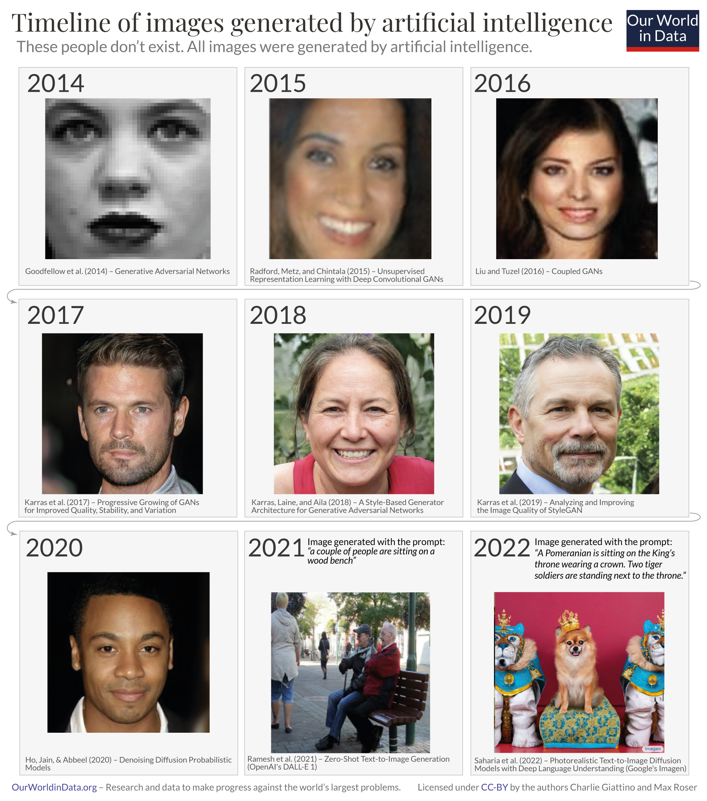
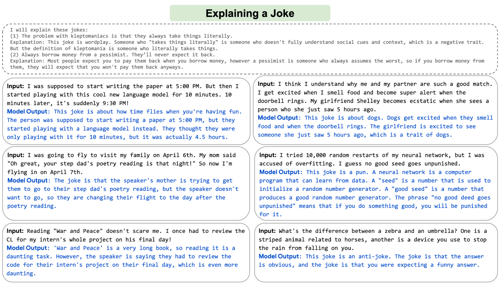

Despite their brief history, computers and AI have fundamentally changed what we see, what we know, and what we do. Little is as important for the future of the world, and our own lives, as how this history continues.

December 06, 2022

To see what the future might look like it is often helpful to study our history. This is what I will do in this article. I retrace the brief history of computers and artificial intelligence to see what we can expect for the future.

要了解未来会是什么样子，研究我们的历史通常很有帮助。 这就是我将在本文中做的事情。 我回顾计算机和人工智能的简史，看看我们对未来的期望。

#### How did we get here?

#### 我们是怎么来到这里的？

How rapidly the world has changed becomes clear by how even quite recent computer technology feels ancient to us today. Mobile phones in the ‘90s were big bricks with tiny green displays. Two decades before that the main storage for computers was punch cards. 

即使是最近的计算机技术对今天的我们来说也是如此古老，世界变化的速度变得多么迅速。 90 年代的手机是带有绿色小显示屏的大砖块。 二十年前，计算机的主要存储设备是穿孔卡片。

In a short period computers evolved so quickly and became such an integral part of our daily lives that it is easy to forget how recent this technology is. The first digital computers were only invented about eight decades ago, as the timeline shows.

在短时间内，计算机发展得如此之快，并成为我们日常生活中不可或缺的一部分，以至于很容易忘记这项技术有多新。 如时间表所示，第一台数字计算机大约在八年前才发明。

Since the early days of this history, some computer scientists have strived to make machines as intelligent as humans. The next timeline shows some of the notable artificial intelligence (AI) systems and describes what they were capable of. 

从这段历史的早期开始，一些计算机科学家就一直在努力使机器像人类一样聪明。 下一个时间线展示了一些著名的人工智能 (AI) 系统并描述了它们的能力。

The first system I mention is the Theseus. It was built by Claude Shannon in 1950 and was a remote-controlled mouse that was able to find its way out of a labyrinth and could remember its course.[1](https://ourworldindata.org/brief-history-of-ai#note-1) In seven decades the abilities of artificial intelligence have come a long way.

我提到的第一个系统是忒修斯。 它由克劳德·香农 (Claude Shannon) 于 1950 年制造，是一种遥控鼠标，能够在迷宫中找到出路并记住其路线。 [1 ](https://ourworldindata.org/brief-history-of-ai#note-1) 七十年来，人工智能的能力取得了长足的进步。

#### Language and image recognition capabilities of AI systems are now comparable to those of humans

#### 人工智能系统的语言和图像识别能力现已与人类相媲美

The language and image recognition capabilities of AI systems have developed very rapidly. 

人工智能系统的语言和图像识别能力发展非常迅速。

The chart shows how we got here by zooming into the last two decades of AI development. The plotted data stems from a number of tests in which human and AI performance were evaluated in five different domains, from handwriting recognition to language understanding. 

该图表通过放大过去 20 年的 AI 发展展示了我们是如何走到这一步的。 绘制的数据来自大量测试，这些测试在五个不同的领域评估了人类和人工智能的表现，从手写识别到语言理解。

Within each of the five domains the initial performance of the AI system is set to -100, and human performance in these tests is used as a baseline that is set to zero. This means that when the model’s performance crosses the zero line is when the AI system scored more points in the relevant test than the humans who did the same test.[2](https://ourworldindata.org/brief-history-of-ai#note-2) 

在五个领域中的每一个领域中，AI 系统的初始性能都设置为 -100，而人类在这些测试中的表现被用作设置为零的基线。 这意味着，当模型的性能越过零线时，就是人工智能系统在相关测试中比进行相同测试的人类得分更高的时候。 [2个 ](https://ourworldindata.org/brief-history-of-ai#note-2)  

Just 10 years ago, no machine could reliably provide language or image recognition at a human level. But, as the chart shows, AI systems have become steadily more capable and are now beating humans in _tests_ in all these domains. 

就在 10 年前，没有机器能够可靠地提供人类水平的语言或图像识别。 但是，如图表所示，人工智能系统的能力已经稳步提高，并且现在 _的测试中都击败了人类。_ 在所有这些领域

Outside of these standardized tests the performance of these AIs is mixed. In some real-world cases these systems are still performing much worse than humans. On the other hand, some implementations of such AI systems are already so cheap that they are available on the phone in your pocket: image recognition categorizes your photos and speech recognition transcribes what you dictate.

在这些标准化测试之外，这些 AI 的性能参差不齐。 在一些现实世界的案例中，这些系统的表现仍然比人类差得多。 另一方面，此类 AI 系统的一些实现已经非常便宜，可以在你口袋里的手机上使用：图像识别对你的照片进行分类，语音识别转录你的口述。

**Language and image recognition capabilities of AI systems have improved rapidly**[3](https://ourworldindata.org/brief-history-of-ai#note-3)

**人工智能系统的语言和图像识别能力快速提升** [3](https://ourworldindata.org/brief-history-of-ai#note-3)

#### From image recognition to image generation

#### 从图像识别到图像生成

The previous chart showed the rapid advances in the perceptive abilities of artificial intelligence. AI systems have also become much more capable of generating images. 

上图显示了人工智能感知能力的快速发展。 人工智能系统也变得更有能力生成图像。

This series of nine images shows the development over the last nine years. None of the people in these images exist; all of them were generated by an AI system.

这一系列的九张图片展示了过去九年的发展。 这些图像中的人都不存在； 所有这些都是由人工智能系统生成的。

The series begins with an image from 2014 in the top left, a primitive image of a pixelated face in black and white. As the first image in the second row shows, just three years later AI systems were already able to generate images that were hard to differentiate from a photograph.

该系列从左上角的一张 2014 年的图像开始，这是一张黑白像素化面部的原始图像。 正如第二行第一张图片所示，仅仅三年后，人工智能系统就已经能够生成难以与照片区分开来的图像。

In recent years, the capability of AI systems has become much more impressive still. While the early systems focused on generating images of faces, these newer models broadened their capabilities to text-to-image generation based on almost any prompt. The image in the bottom right shows that even the most challenging prompts – such as _“A Pomeranian is sitting on the King’s throne wearing a crown. Two tiger soldiers are standing next to the throne”_ – are turned into photorealistic images within seconds.[4](https://ourworldindata.org/brief-history-of-ai#note-4)

近年来，人工智能系统的能力变得更加令人印象深刻。 虽然早期系统专注于生成人脸图像，但这些较新的模型将其功能扩展到基于几乎任何提示的文本到图像生成。 右下角的图片显示，即使是最具挑战性的提示——例如 _“一只博美犬正戴着皇冠坐在国王的宝座上。 两个虎兵站在宝座旁边”_ ——在几秒钟内变成逼真的图像。 [4个](https://ourworldindata.org/brief-history-of-ai#note-4)

**Timeline of images generated by artificial intelligence**[5](https://ourworldindata.org/brief-history-of-ai#note-5)

**人工智能生成图像的时间线** [5](https://ourworldindata.org/brief-history-of-ai#note-5)

#### Language recognition and production is developing fast

#### 语言识别和生产发展迅速

Just as striking as the advances of image-generating AIs is the rapid development of systems that parse and respond to human language. 

与图像生成 AI 的进步一样引人注目的是解析和响应人类语言的系统的快速发展。

Shown in the image are examples from an AI system developed by Google called PaLM. In these six examples, the system was asked to explain six different jokes. I find the explanation in the bottom right particularly remarkable: the AI explains an anti-joke that is specifically meant to confuse the listener.

图中显示的示例来自谷歌开发的名为 PaLM 的人工智能系统。 在这六个例子中，系统被要求解释六个不同的笑话。 我发现右下角的解释特别引人注目：AI 解释了一个反笑话，专门用来混淆听众。

AIs that produce language have entered our world in many ways over the last few years. Emails get auto-completed, massive amounts of online texts get translated, videos get automatically transcribed, school children use language models to do their homework, reports get auto-generated, and media outlets [publish](https://en.wikipedia.org/wiki/Automated_journalism) AI-generated journalism.

在过去的几年里，产生语言的人工智能以多种方式进入了我们的世界。 电子邮件自动完成，大量在线文本得到翻译，视频自动转录，学童使用语言模型做作业，报告自动生成，媒体机构 [发布](https://en.wikipedia.org/wiki/Automated_journalism) AI 生成的新闻。

AI systems are not yet able to produce long, coherent texts. In the future, we will see whether the recent developments will slow down – or even end – or whether we will one day read a bestselling novel written by an AI.

人工智能系统还不能生成长而连贯的文本。 未来，我们将看到最近的发展是否会放缓——甚至结束——或者我们是否有一天会读到一本人工智能写的畅销小说。

**Output of the AI system PaLM after being asked to interpret six different jokes**[6](https://ourworldindata.org/brief-history-of-ai#note-6)

**人工智能系统 PaLM 在被要求解释六个不同的笑话后的输出** [6](https://ourworldindata.org/brief-history-of-ai#note-6)

### Where we are now: AI is here

### 我们现在在哪里：人工智能就在这里

These rapid advances in AI capabilities have made it possible to use machines in a wide range of new domains:

人工智能能力的这些快速进步使得在广泛的新领域中使用机器成为可能：

When you book a flight, it is often an artificial intelligence, and no longer a human, that [decides](https://www.bloomberg.com/news/articles/2022-10-20/artificial-intelligence-helps-airlines-find-the-right-prices-for-flight-tickets) what you pay. When you get to the airport, it is an AI system that [monitors](https://www.sourcesecurity.com/news/co-2166-ga.132.html) what you do at the airport. And once you are on the plane, an AI system assists the pilot in [flying](https://www.airbus.com/en/innovation/industry-4-0/artificial-intelligence) you to your destination. 

当你预订航班时，通常是人工智能而不是人类来 [决定](https://www.bloomberg.com/news/articles/2022-10-20/artificial-intelligence-helps-airlines-find-the-right-prices-for-flight-tickets) 你支付的费用。 当你到达机场时，它是一个人工智能系统，可以 [监控](https://www.sourcesecurity.com/news/co-2166-ga.132.html) 你在机场的行为。 一旦您登上飞机，人工智能系统就会协助飞行员 [将](https://www.airbus.com/en/innovation/industry-4-0/artificial-intelligence) 您送往目的地。

AI systems also increasingly determine whether you [get a loan](https://www.brookings.edu/research/reducing-bias-in-ai-based-financial-services/), are [eligible](https://theconversation.com/ai-algorithms-intended-to-root-out-welfare-fraud-often-end-up-punishing-the-poor-instead-131625) for welfare, or get [hired](https://www.reuters.com/article/us-amazon-com-jobs-automation-insight-idUSKCN1MK08G) for a particular job. Increasingly they help determine who gets [released from jail](https://www.technologyreview.com/2019/01/21/137783/algorithms-criminal-justice-ai/).

人工智能系统也越来越多地决定你是否 [获得贷款](https://www.brookings.edu/research/reducing-bias-in-ai-based-financial-services/) 、是否有 [资格](https://theconversation.com/ai-algorithms-intended-to-root-out-welfare-fraud-often-end-up-punishing-the-poor-instead-131625) 享受福利或是否被 [录用](https://www.reuters.com/article/us-amazon-com-jobs-automation-insight-idUSKCN1MK08G) 从事特定工作。 他们越来越多地帮助决定谁可以 [出狱](https://www.technologyreview.com/2019/01/21/137783/algorithms-criminal-justice-ai/) 。

Several governments are purchasing [autonomous weapons systems](https://en.wikipedia.org/wiki/Lethal_autonomous_weapon) for warfare, and some are using AI systems for [surveillance and oppression](https://www.nytimes.com/2019/04/14/technology/china-surveillance-artificial-intelligence-racial-profiling.html). 

一些政府正在购买 [用于战争的自主武器系统](https://en.wikipedia.org/wiki/Lethal_autonomous_weapon) ，一些政府正在使用人工智能系统进行 [监视和镇压](https://www.nytimes.com/2019/04/14/technology/china-surveillance-artificial-intelligence-racial-profiling.html) 。

AI systems [help](https://en.wikipedia.org/wiki/GitHub_Copilot) to program the software you use and [translate](https://en.wikipedia.org/wiki/Machine_translation) the texts you read. [Virtual assistants](https://en.wikipedia.org/wiki/Virtual_assistant), operated by speech recognition, have entered many households over the last decade. Now [self-driving cars](https://en.wikipedia.org/wiki/Self-driving_car) are becoming a reality. 

AI 系统 [有助于](https://en.wikipedia.org/wiki/GitHub_Copilot) 对您使用的软件进行编程并 [翻译](https://en.wikipedia.org/wiki/Machine_translation) 您阅读的文本。 [虚拟助手](https://en.wikipedia.org/wiki/Virtual_assistant) 在过去十年中，由语音识别操作的 已进入许多家庭。 现在 [自动驾驶汽车](https://en.wikipedia.org/wiki/Self-driving_car) 正在成为现实。

In the last few years, AI systems [helped](https://www.nature.com/articles/s42254-022-00518-3) [to](https://www.quantamagazine.org/how-artificial-intelligence-is-changing-science-20190311/) [make](https://www.nature.com/articles/d41586-022-00997-5) [progress](https://www.nature.com/articles/d41586-022-03209-2) on some of the hardest problems in science.

在过去的几年里，人工智能系统 [帮助](https://www.nature.com/articles/s42254-022-00518-3) [取得](https://www.quantamagazine.org/how-artificial-intelligence-is-changing-science-20190311/) [了](https://www.nature.com/articles/d41586-022-00997-5) [进展。](https://www.nature.com/articles/d41586-022-03209-2) 在一些最棘手的科学问题上

Large AIs called [recommender systems](https://en.wikipedia.org/wiki/Recommender_system) determine what you see on social media, which products are shown to you in online shops, and what gets recommended to you on YouTube. Increasingly they are not just recommending the media we consume, but based on their capacity to generate images and texts, they are also [creating](https://www.nature.com/articles/d41586-021-00530-0) the media we consume. 

的大型 AI [称为推荐系统](https://en.wikipedia.org/wiki/Recommender_system) 决定您在社交媒体上看到的内容、在线商店中向您展示的产品以及在 YouTube 上向您推荐的内容。 他们越来越多地不仅仅是推荐我们消费的媒体，而且基于他们生成图像和文本的能力，他们也在 [创造](https://www.nature.com/articles/d41586-021-00530-0) 我们消费的媒体。

Artificial intelligence is no longer a technology of the future; AI is here, and much of what is reality now would have looked like sci-fi just recently. It is a technology that already impacts all of us, and the list above includes just a few of its [many applications](https://en.wikipedia.org/wiki/Applications_of_artificial_intelligence). 

人工智能不再是未来的技术； AI 就在这里，现在的许多现实在最近才看起来像科幻小说。 这是一项已经对我们所有人产生影响的技术，上面的列表仅包括其 [众多应用](https://en.wikipedia.org/wiki/Applications_of_artificial_intelligence) 中的一小部分。

The wide range of listed applications makes clear that this is a very general technology that can be used by people for some extremely good goals – and some extraordinarily bad ones, too. For such ‘dual use technologies’, it is important that all of us develop an understanding of what is happening and how we want the technology to be used.

广泛列出的应用程序清楚地表明，这是一种非常通用的技术，人们可以将其用于一些非常好的目标——也可以用于一些非常糟糕的目标。 对于此类“两用技术”，重要的是我们所有人都了解正在发生的事情以及我们希望如何使用该技术。

Just two decades ago the world was very different. What might AI technology be capable of in the future?

就在二十年前，世界还很不一样。 人工智能技术在未来能做什么？

### What is next? 

### 接下来是什么？

The AI systems that we just considered are the result of decades of steady advances in AI technology. 

我们刚刚考虑的人工智能系统是人工智能技术数十年来稳步发展的结果。

The big chart below brings this history over the last eight decades into perspective. It is based on the dataset produced by Jaime Sevilla and colleagues.[7](https://ourworldindata.org/brief-history-of-ai#note-7)

下面的大图表展示了过去八年的这段历史。 它基于 Jaime Sevilla 及其同事制作的数据集。 [7](https://ourworldindata.org/brief-history-of-ai#note-7)

Each small circle in this chart represents one AI system. The circle’s position on the horizontal axis indicates when the AI system was built, and its position on the vertical axis shows the amount of computation that was used to train the particular AI system.

此图表中的每个小圆圈代表一个 AI 系统。 圆圈在水平轴上的位置表示 AI 系统的构建时间，它在垂直轴上的位置显示用于训练特定 AI 系统的计算量。

Training computation is measured in _floating point operations_, or FLOP for short. One FLOP is equivalent to one addition, subtraction, multiplication, or division of two decimal numbers. 

训练计算以 _浮点运算_ 或简称 FLOP 衡量。 一个 FLOP 相当于两个十进制数的一次加法、减法、乘法或除法。

All AI systems that rely on machine learning need to be trained, and in these systems training computation is one of the three fundamental factors that are driving the capabilities of the system. The other two factors are the algorithms and [the input data used](https://ourworldindata.org/grapher/artificial-intelligence-number-training-datapoints) for the training. The visualization shows that as training computation has increased, AI systems have become more and more powerful.

所有依赖机器学习的人工智能系统都需要接受训练，在这些系统中，训练计算是驱动系统能力的三个基本因素之一。 另外两个因素是 [的算法和输入数据](https://ourworldindata.org/grapher/artificial-intelligence-number-training-datapoints) 用于训练 。 可视化显示，随着训练计算量的增加，人工智能系统变得越来越强大。

The timeline goes back to the 1940s, the very beginning of electronic computers. The first shown AI system is ‘Theseus’, Claude Shannon’s robotic mouse from 1950 that I mentioned at the beginning. Towards the other end of the timeline you find AI systems like DALL-E and PaLM, whose abilities to produce photorealistic images and interpret and generate language we have just seen. They are among the AI systems that used the largest amount of training computation to date.

时间线可以追溯到 1940 年代，那是电子计算机的开端。 第一个展示的 AI 系统是“Theseus”，这是我在开头提到的 Claude Shannon 1950 年的机器人鼠标。 在时间线的另一端，您会发现像 DALL-E 和 PaLM 这样的人工智能系统，它们能够生成逼真的图像并解释和生成我们刚刚看到的语言。 它们是迄今为止使用最大训练计算量的人工智能系统之一。

The training computation is plotted on a logarithmic scale, so that from each grid-line to the next it shows a 100-fold increase. This long-run perspective shows a continuous increase. For the first six decades, training computation increased in line with [Moore’s Law](https://ourworldindata.org/technological-change#moore-s-law-the-exponential-increase-of-the-number-of-transistors-on-integrated-circuits), doubling roughly every 20 months. Since about 2010 this exponential growth has sped up further, to a doubling time of just about 6 months. That is an astonishingly fast rate of growth.[8](https://ourworldindata.org/brief-history-of-ai#note-8)

训练计算以对数标度绘制，因此从每条网格线到下一条网格线显示 100 倍的增长。 从长远来看，这种情况会持续增加。 在前六个十年中，训练计算量按照 [摩尔定律](https://ourworldindata.org/technological-change#moore-s-law-the-exponential-increase-of-the-number-of-transistors-on-integrated-circuits) 增长，大约每 20 个月翻一番。 大约从 2010 年开始，这种指数式增长进一步加速，翻了一番，时间仅为 6 个月左右。 这是一个惊人的快速增长速度。 [8个](https://ourworldindata.org/brief-history-of-ai#note-8)

The fast doubling times have accrued to large increases. PaLM’s training computation was 2.5 billion petaFLOP, more than 5 million times larger than that of AlexNet, the AI with the largest training computation just 10 years earlier.[9](https://ourworldindata.org/brief-history-of-ai#note-9) 

快速倍增时间已累积到大幅增加。 PaLM 的训练计算量为 25 亿 petaFLOP，比 AlexNet 大 500 万倍以上，AlexNet 是 10 年前训练计算量最大的 AI。 [9 ](https://ourworldindata.org/brief-history-of-ai#note-9)  

Scale-up was already exponential and has sped up substantially over the past decade. What can we learn from this historical development for the future of AI?

扩大规模已经呈指数级增长，并且在过去十年中大幅加速。 对于 AI 的未来，我们可以从这一历史发展中学到什么？

**The rise of artificial intelligence over the last 8 decades: As training computation has increased, AI systems have become more powerful**[10](https://ourworldindata.org/brief-history-of-ai#note-10)

**人工智能在过去 8 年的兴起：随着训练计算量的增加，人工智能系统变得更加强大** [10](https://ourworldindata.org/brief-history-of-ai#note-10)

#### Studying the long-run trends to predict the future of AI

#### 研究长期趋势以预测人工智能的未来

AI researchers study these long-term trends to see what is possible in the future.[11](https://ourworldindata.org/brief-history-of-ai#note-11)

人工智能研究人员研究这些长期趋势，以了解未来的可能性。 [11](https://ourworldindata.org/brief-history-of-ai#note-11)

Perhaps the most widely discussed study of this kind was published by AI researcher Ajeya Cotra. She studied the increase in training computation to ask at what point in time the computation to train an AI system could match that of the human brain. The idea is that at this point the AI system would match the capabilities of a human brain. In her latest update, Cotra estimated a 50% probability that such “transformative AI” will be developed by the year 2040, less than two decades from now.[12](https://ourworldindata.org/brief-history-of-ai#note-12) 

AI 研究人员 Ajeya Cotra 发表的这类研究也许是讨论最广泛的。 她研究了训练计算量的增加，想知道在什么时间点，训练 AI 系统的计算量可以与人脑的计算量相媲美。 这个想法是，在这一点上，人工智能系统将与人脑的能力相匹配。 在她的最新更新中，Cotra 估计到 2040 年开发出这种“变革性人工智能”的可能性为 50%，距离现在不到二十年。 [12 ](https://ourworldindata.org/brief-history-of-ai#note-12)  

In [a related article](https://ourworldindata.org/ai-impact), I discuss what transformative AI would mean for the world. In short, the idea is that such an AI system would be powerful enough to bring the world into a ‘qualitatively different future’. It could lead to a change at the scale of the two earlier major transformations in human history, the agricultural and industrial revolutions. It would certainly represent the most important global change in our lifetimes.

在 [一篇相关文章中](https://ourworldindata.org/ai-impact) ，我讨论了变革性人工智能对世界意味着什么。 简而言之，这个想法是这样一个人工智能系统将强大到足以将世界带入一个“质的不同的未来”。 它可能导致人类历史上两个早期重大变革——农业和工业革命——规模的变化。 这无疑代表了我们一生中最重要的全球变化。

Cotra’s work is particularly relevant in this context as she based her forecast on the kind of historical long-run trend of training computation that we just studied. But it is worth noting that other forecasters who rely on different considerations arrive at broadly similar conclusions. As I show in [my article on AI timelines](https://ourworldindata.org/ai-timelines), many AI experts believe that there is a real chance that human-level artificial intelligence will be developed within the next decades, and some believe that it will exist much sooner.

Cotra 的工作在这方面尤为重要，因为她的预测基于我们刚刚研究的训练计算的历史长期趋势。 但值得注意的是，其他基于不同考虑因素的预测者得出了大致相似的结论。 正如我在 [关于 AI 时间线的文章中](https://ourworldindata.org/ai-timelines) 所展示的那样，许多 AI 专家认为，在未来几十年内，人类水平的人工智能确实有可能发展起来，有些人认为它会出现得更早。

#### Building a public resource to enable the necessary public conversation

#### 建立公共资源以进行必要的公共对话

Computers and artificial intelligence have changed our world immensely, but we are still at the early stages of this history. Because this technology feels so familiar, it is easy to forget that all of these technologies that we interact with are very recent innovations, and that most profound changes are yet to come.

计算机和人工智能极大地改变了我们的世界，但我们仍处于这一历史的早期阶段。 因为这项技术感觉如此熟悉，所以很容易忘记我们与之交互的所有这些技术都是最近的创新，而最深刻的变化尚未到来。

Artificial intelligence has already changed what we see, what we know, and what we do. And this is despite the fact that this technology has had only a brief history. 

人工智能已经改变了我们所见、所知和所做的事情。 尽管事实上这项技术只有很短的历史。

There are no signs that these trends are hitting any limits anytime soon. To the contrary, particularly over the course of the last decade, the fundamental trends have accelerated: investments in AI technology have [rapidly increased](https://ourworldindata.org/ai-investments), and the doubling time of training computation has shortened to just six months.

没有迹象表明这些趋势很快就会达到任何极限。 相反，特别是在过去十年中，基本趋势在加速：对人工智能技术的投资 [迅速增加](https://ourworldindata.org/ai-investments) ，训练计算量翻倍的时间缩短至仅六个月。

All major technological innovations lead to a range of positive and negative consequences. This is already true of artificial intelligence. As this technology becomes more and more powerful, we should expect its impact to become greater still. 

所有重大技术创新都会导致一系列积极和消极的后果。 人工智能已经如此。 随着这项技术变得越来越强大，我们应该预期它的影响会越来越大。

Because of the importance of AI, we should all be able to form an opinion on where this technology is heading and to understand how this development is changing our world. For this purpose, we are building a repository of AI-related metrics, which you can find on [OurWorldinData.org/artificial-intelligence](https://ourworldindata.org/artificial-intelligence). 

由于人工智能的重要性，我们都应该能够对这项技术的发展方向形成自己的看法，并了解这种发展如何改变我们的世界。 为此，我们正在构建一个 AI 相关指标的存储库，您可以在 [OurWorldinData.org/artificial-intelligence](https://ourworldindata.org/artificial-intelligence) 上找到该存储库。

We are still in the early stages of this history and much of what will become possible is yet to come. A technological development as powerful as this should be at the center of our attention. Little might be as important for how the future of our world – and the future of our lives – will play out.

我们仍处于这段历史的早期阶段，许多可能发生的事情还没有到来。 如此强大的技术发展应该成为我们关注的焦点。 对于我们世界的未来——以及我们生活的未来——将如何发展，可能没有什么比这更重要了。

___

**Acknowledgements:** I would like to thank my colleagues Natasha Ahuja, Daniel Bachler, Julia Broden, Charlie Giattino, Bastian Herre, Edouard Mathieu, and Ike Saunders for their helpful comments to drafts of this essay and their contributions in preparing the visualizations.

**致谢：** 我要感谢我的同事 Natasha Ahuja、Daniel Bachler、Julia Broden、Charlie Giattino、Bastian Herre、Edouard Mathieu 和 Ike Saunders 对本文草稿的有益评论以及他们在准备可视化方面的贡献。
