The National Environmental Policy Act (NEPA) is a piece of federal environmental legislation that was passed in 1969 towards the beginning of an “[eternal September](https://en.wikipedia.org/wiki/Eternal_September#:~:text=Eternal%20September%20or%20the%20September,ability%20to%20enforce%20existing%20norms.)” of environmental laws, and is often called the “magna carta” of environmental laws because of how influential it has been in shaping environmental policy. Not only does NEPA significantly influence federal government actions, but the law has served as a template that has been widely copied, both by state governments (in the form of “[little NEPAs](https://dukespace.lib.duke.edu/dspace/bitstream/handle/10161/5891/P.%20Marchman%20Little%20NEPAs_Final_w%20endnotes.pdf?sequence=1#:~:text=The%20little%20NEPAs%20of%20Indiana,citizens%20take%20for%20granted%20today.)” such as California’s CEQA), and by other countries.

”开始之际通过 [《国家环境政策法》(NEPA) 是一项联邦环境立法，于 1969 年在环境法“永恒的九月](https://en.wikipedia.org/wiki/Eternal_September#:~:text=Eternal%20September%20or%20the%20September,ability%20to%20enforce%20existing%20norms.) ，因其影响力而常被称为环境法的“大宪章”一直在制定环境政策。 ”的形式， [NEPA 不仅对联邦政府的行为产生重大影响，而且该法律还作为一个模板被州政府（以“小 NEPA](https://dukespace.lib.duke.edu/dspace/bitstream/handle/10161/5891/P.%20Marchman%20Little%20NEPAs_Final_w%20endnotes.pdf?sequence=1#:~:text=The%20little%20NEPAs%20of%20Indiana,citizens%20take%20for%20granted%20today.) 如加利福尼亚州的 CEQA）和其他国家广泛复制。

Environmental laws over time. Not shown: another 30 years of environmental laws

NEPA is the law that requires federal agencies to produce an environmental impact statement for any actions likely to have significant effects on the environment. These statements (which can be thousands of pages long and take years to prepare, and must be completed before the project can start), along with the broader perception that the NEPA process is slow and unwieldy, has made NEPA the frequent target of criticism and reform efforts.

NEPA 是一项法律，它要求联邦机构为可能对环境产生重大影响的任何行动编制环境影响声明。 这些声明（可能长达数千页，需要数年时间准备，并且必须在项目开始之前完成），以及人们普遍认为 NEPA 过程缓慢且笨拙，使 NEPA 成为批评的频繁目标和改革努力。

Because NEPA impacts potentially every federal government action, in potentially very large ways, it’s worth understanding how NEPA works.

由于 NEPA 可能以非常大的方式影响联邦政府的每一项行动，因此值得了解 NEPA 的运作方式。

NEPA evolved in a somewhat idiosyncratic fashion - it was [originally intended](https://www.routledge.com/Taking-Stock-of-Environmental-Assessment-Law-Policy-and-Practice/Holder-McGillivray/p/book/9781844721009) as a sweeping environmental reform that would create a new policy of federal environmental stewardship:

NEPA 以一种有点特殊的方式发展——它 [最初的目的](https://www.routledge.com/Taking-Stock-of-Environmental-Assessment-Law-Policy-and-Practice/Holder-McGillivray/p/book/9781844721009) 是作为一项全面的环境改革，将制定一项新的联邦环境管理政策：

> _the statute announces ‘the continuing policy of the Federal Government’ that federal agencies should ‘use all practicable means, consistent with other essential considerations of national policy, to improve and coordinate Federal plans, functions, programs, and resources’ to achieve such **key environmental objectives as intergenerational trusteeship, provision safe and healthful surroundings, beneficial use of the environment, preservation of cultural and natural heritage, and protection of renewable resources**._
> 
> _该法令宣布“联邦政府的持续政策”，即联邦机构应“使用所有可行的手段，与国家政策的其他基本考虑相一致，改进和协调联邦计划、职能、计划和资源”，以实现这样的关键 **环境目标是代际托管、提供安全和健康的环境、有益地利用环境、保护文化和自然遗产以及保护可再生资源** 。_

But after NEPA was passed, these broad, sweeping reforms ended up amounting to little - courts found the provisions were too vague to be enforced, and they were largely ignored by federal agencies.

但在 NEPA 通过后，这些广泛而全面的改革最终收效甚微——法院发现这些规定过于模糊而无法执行，而且它们在很大程度上被联邦机构忽视了。

However, late in the process of drafting NEPA, a seemingly minor provision was added that required agencies to produce a “detailed statement” of the environmental impacts of any major federal action. This provision was a much clearer requirement that the courts enforced vigorously:

然而，在起草 NEPA 的后期，增加了一项看似微不足道的条款，要求各机构就任何重大联邦行动对环境的影响制作一份“详细说明”。 该规定是法院大力执行的更明确的要求：

> _Mandatory procedures were something courts could and would enforce, especially under the command of unambiguous statutory terms like ‘all’, ‘shall’, ‘every’, and ‘detailed statement’. The threat of judicial enforcement, in turn, prompted agencies to be attentive to procedural detail, lest important agency actions be held up by litigation and injunction. **Procedure soon overtook substance, transforming NEPA into what has become, in practice, almost purely a procedural statute.**_
> 
> _强制程序是法院可以而且将会强制执行的东西，尤其是在明确的法定条款如“全部”、“应”、“每个”和“详细说明”的命令下。 反过来，司法执法的威胁促使各机构注意程序细节，以免重要的机构行动因诉讼和禁令而受阻。 **程序很快取代了实质，将 NEPA 转变为实际上几乎纯粹是程序性法规。**_

The years immediately following the passage of NEPA resulted in a flurry of litigation as courts determined exactly what was required of the “detailed statement” NEPA mandated. To clarify what NEPA compliance required, the Council of Environmental Quality (CEQ), an executive branch organization created by NEPA and charged with overseeing its implementation, issued a series of guidelines in 1971. In 1978, these guidelines became regulation, creating the “modern” NEPA process we have today.

NEPA 通过后的几年导致了一系列诉讼，因为法院确切地确定了 NEPA 授权的“详细声明”的要求。 为阐明 NEPA 合规要求，环境质量委员会 (CEQ) 是 NEPA 创建并负责监督其实施的行政部门组织，于 1971 年发布了一系列指南。1978 年，这些指南成为法规，创造了“现代” 我们今天拥有的 NEPA 流程。

NEPA as it exists today has largely become a **procedural** requirement - NEPA doesn’t mandate a particular outcome, or that the government places a particular weight on environmental considerations \[0\]. It simply requires that the government consider the environmental impact of its actions, and that it inform the public of those considerations. NEPA doesn’t prevent negative environmental impacts, so long as those impacts have been properly documented and the agency has taken a “hard look” at them - as [one agency official described it](https://www.fs.fed.us/pnw/pubs/pnw_gtr799.pdf), “I like to say you can pave over paradise with a NEPA document.”

今天存在的 NEPA 在很大程度上已成为一项 **程序** 要求 - NEPA 不强制要求特定的结果，或者政府对环境考虑 \[0\] 给予特别重视。 它只是要求政府考虑其行动对环境的影响，并将这些考虑告知公众。 NEPA 不会阻止负面的环境影响，只要这些影响得到适当记录并且该机构对它们进行了“严格审查”——正如一位 [机构官员所描述的那样](https://www.fs.fed.us/pnw/pubs/pnw_gtr799.pdf) ，“我想说你可以用NEPA 文件。”

More specifically, NEPA requires that a “detailed statement” be produced describing any significant environmental impacts of “major” federal actions. “Major federal action” might be anything from:

更具体地说，NEPA 要求制定一份“详细说明”，描述“重大”联邦行动对环境的任何重大影响。 “重大联邦行动”可能是：

-   A new policy or procedure (such as the Forest Service changing its [land management policy](https://www.fs.usda.gov/Internet/FSE_DOCUMENTS/stelprdb5349141.pdf))
    
    新政策或程序（例如林业局改变其 [土地管理政策](https://www.fs.usda.gov/Internet/FSE_DOCUMENTS/stelprdb5349141.pdf) ）
    
-   A new project (such as the Department of Energy constructing the [Yucca Mountain nuclear waste repository](https://www.energy.gov/nepa/downloads/eis-0250-final-environmental-impact-statement))
        
    新项目（如能源部建设 [尤卡山核废料库](https://www.energy.gov/nepa/downloads/eis-0250-final-environmental-impact-statement) ）
        
-   Directing federal dollars (such as the Federal Highway Administration [funding new highway construction](https://www.federalregister.gov/documents/2021/07/01/2021-14062/notice-of-intent-to-prepare-an-environmental-impact-statement-for-a-proposed-highway-project-in))
    
    指导联邦资金（例如联邦公路管理局 [资助新公路建设](https://www.federalregister.gov/documents/2021/07/01/2021-14062/notice-of-intent-to-prepare-an-environmental-impact-statement-for-a-proposed-highway-project-in) ）
        
-   Issuing a license or permit (such as the FAA [issuing a launch license for SpaceX’s Boca Chica facility](https://www.faa.gov/space/stakeholder_engagement/spacex_starship))
    
    颁发许可证或许可证（例如美国联邦航空局 [为 SpaceX 的博卡奇卡设施颁发发射许可证](https://www.faa.gov/space/stakeholder_engagement/spacex_starship) ）
    

Or anything else that could possibly have significant environmental impacts. In practice, little effort seems to be placed on determining whether an action qualifies as “major”, and anything that might have significant environmental effects in practice must be NEPA compliant. 

或任何其他可能对环境产生重大影响的事物。 在实践中，似乎很少有人花精力来确定一项行动是否符合“重大”条件，而且任何在实践中可能产生重大环境影响的行为都必须符合 NEPA。

(There are also a small number of federal actions that are excluded from NEPA compliance at all. These include emergency actions that must be taken quickly.)

（还有少量联邦行动根本不在 NEPA 合规范围之内。这些包括必须迅速采取的紧急行动。）

Determining whether a detailed statement is required has evolved into a tiered system of NEPA analysis. (This tiered system is not in the text of NEPA itself, but is the result of case law and the 1978 CEQ regulations.)

确定是否需要详细说明已演变为 NEPA 分析的分层系统。 （这个分层系统不在 NEPA 本身的文本中，而是判例法和 1978 年 CEQ 法规的结果。）

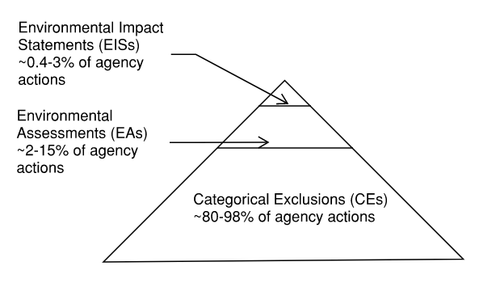

At the bottom, you have **categorical exclusions** (CEs.) These are actions that by their very nature have been determined to not have a major impact on the environment. For example, the FAA has determined that the [acquisition of snow removal equipmen](https://www.faa.gov/airports/central/environmental/catex)t can be categorically excluded, and the Bureau of Land Management [has determined](https://www.doi.gov/sites/doi.gov/files/doi-and-bureau-categorical-exclusions-dec2020.pdf) that “activities that are educational, informational, or advisory” can be categorically excluded. **The vast majority of federal agency actions will generally fall under a categorical exclusion.**

在底部，您有 **绝对排除项** (CE)。这些行为本质上已被确定不会对环境产生重大影响。 例如，FAA 已确定 [可以明确排除除雪设备的购置](https://www.faa.gov/airports/central/environmental/catex) ，而土地管理局 [已确定](https://www.doi.gov/sites/doi.gov/files/doi-and-bureau-categorical-exclusions-dec2020.pdf) 可以明确排除“教育、信息或咨询活动”。 **绝大多数联邦机构的行动通常属于绝对排除。**

Categorical exclusions require the least amount of effort to complete, in some cases just requiring a form to be completed and signed (though as we’ll see, this can vary significantly by agency.) However, an action must fall under an approved class of action to be a CE, and adding a new type of excluded action can in fact be a significant effort, involving researching of past projects, a period of public commentary for the proposed exclusion, and approval by the CEQ.

分类排除需要最少的努力来完成，在某些情况下只需要填写并签署表格（尽管我们将看到，这可能因机构而异。）但是，行动必须属于批准的类别成为 CE 的行动，并添加一种新型的排除行动实际上可能是一项重大工作，涉及对过去项目的研究、针对拟议排除的公众评论期以及 CEQ 的批准。

Categorical exclusions are also sometimes added via legislative action. The Energy Policy Act of 2005, for instance, created [several categories of categorical exclusion](https://www.fs.fed.us/emc/nepa/includes/390guidance2.pdf) for certain oil and gas actions.

有时也会通过立法行动添加绝对排除。 例如，2005 年的《能源政策法》 [创建了几个绝对排除类别。](https://www.fs.fed.us/emc/nepa/includes/390guidance2.pdf) 为某些石油和天然气行动

Originally few actions were classified as CEs, but as agencies have done more projects and gained a better sense of what projects will and won’t have major environmental impacts, more category exclusions have been added.

最初很少有行动被归类为 CE，但随着机构开展了更多的项目并且更好地了解了哪些项目将对环境产生重大影响，哪些项目不会产生重大环境影响，因此添加了更多类别排除项。

If an action can’t be categorically excluded, the next step for NEPA compliance is typically to figure out if the action will have “significant” environmental effects or not. If it’s unclear, an **environmental assessment** (EA) is performed, which is intended to be a high-level look at the proposed action to determine if the environmental impacts cross the “threshold of significance” and thus require a full environmental impact statement. If the EA finds no significant impacts, it issues a **Finding of No Significant Impact** (FONSI.) 

如果无法明确排除某项行动，则 NEPA 合规的下一步通常是确定该行动是否会对环境产生“重大”影响。 如果不清楚， **将进行环境评估** (EA)，旨在对拟议的行动进行高层次的审视，以确定环境影响是否超过“显着性阈值”，因此需要完整的环境影响声明。 如果 EA 发现没有重大影响，它会发布 **无重大影响的调查结果** (FONSI)。

EAs are generally more effort than categorical exclusions, though they also can vary significantly in the amount of effort required to create them.

EA 通常比分类排除更费力，尽管它们在创建它们所需的工作量方面也可能有很大差异。

If the EA concludes that the proposed action _will_ have significant impacts, the “detailed statement,” known as an **environmental impact statement** (EIS) is produced. An EIS describes the proposed action, the likely environmental impacts of that action, alternatives to taking the action (typically including ‘no action’), and plans for soliciting feedback from the public.

如果 EA 断定所提议的行动 _将_ 称为 **环境影响声明** 产生重大影响，则会生成 (EIS) 的“详细声明”。 EIS 描述了拟议的行动、该行动可能对环境造成的影响、采取行动的备选方案（通常包括“不采取行动”）以及征求公众反馈的计划。

EISs have become long, involved analyses that take years to complete and are often thousands of pages in length. For instance, the most current EIS available on the EPA’s database (for a [Forest Service forest restoration plan](https://cdxapps.epa.gov/cdx-enepa-II/public/action/eis/details?eisId=374441)) comes in at 1294 pages (including appendices), and took over 6 years to complete. In the late 1980s, there was a [minor government scandal](https://books.google.com/books?id=kfgrAAAAIAAJ&pg=PA3&dq=gao+ssc+eis&hl=en&newbks=1&newbks_redir=0&sa=X&ved=2ahUKEwiEjOL_scv5AhX_k2oFHTuwDeMQ6AF6BAgHEAI#v=onepage&q=gao%20ssc%20eis&f=false) when the Department of Energy spent $1.4 million printing and mailing 17,000 copies of the 8,000-page EIS for the Superconducting Supercollider (the statements weighed a combined 221 tons.)

EIS 变得很长，涉及的分析需要数年时间才能完成，而且通常长达数千页。 例如，EPA 数据库中可用的最新 EIS（ [林务局森林恢复计划](https://cdxapps.epa.gov/cdx-enepa-II/public/action/eis/details?eisId=374441) ）有 1294 页（包括附录），耗时 6 年多才完成。 在 80 年代后期， [能源部](https://books.google.com/books?id=kfgrAAAAIAAJ&pg=PA3&dq=gao+ssc+eis&hl=en&newbks=1&newbks_redir=0&sa=X&ved=2ahUKEwiEjOL_scv5AhX_k2oFHTuwDeMQ6AF6BAgHEAI#v=onepage&q=gao%20ssc%20eis&f=false) 花费 140 万美元印刷和邮寄了 17,000 份 8,000 页的超导超级对撞机 EIS 副本（报表总重 221 吨）。

](https://substackcdn.com/image/fetch/f_auto,q_auto:good,fl_progressive:steep/https%3A%2F%2Fbucketeer-e05bbc84-baa3-437e-9518-adb32be77984.s3.amazonaws.com%2Fpublic%2Fimages%2F32586a9d-4fd0-4c39-870a-4cdd90243197_592x702.png)

NEPA process flowchart

NEPA流程图

Because an EIS is so time consuming and expensive to prepare, procedures have evolved that let agencies avoid doing them. One popular method is the “**mitigated FONSI**” - if an environmental assessment determines that a federal action is likely to have significant impacts, the agency can include mitigation measures that would bring the net impact below the threshold of significance, and not trigger the EIS requirement. For instance, for the proposed construction of a [cellulosic biorefinery](https://www.rd.usda.gov/sites/default/files/BlueFireMitigatedDOEFONSI.pdf) on wetlands, the Department of Energy was able to achieve a mitigated FONSI by (among other things) purchasing “wetland credits” from a “wetland mitigation bank.” More recently, the FAA required SpaceX to undertake 75 mitigation measures as part of a mitigated FONSI for its Boca Chica launch site license (these ranged from periodic water spraying to control particulates and fugitive dust, issuing notices to personnel regarding lighting during sea turtle nesting season, and preparing a report on the historic events of the Mexican War that took place in the area.)

由于 EIS 的准备非常耗时且昂贵，因此程序已经发展到让机构避免这样做。 一种流行的方法是“ **减轻的 FONSI** ”——如果环境评估确定联邦行动可能产生重大影响，该机构可以包括将净影响降低到显着阈值以下的缓解措施，并且不会触发 EIS 要求. 例如，对于拟议的 [湿地纤维素生物精炼厂](https://www.rd.usda.gov/sites/default/files/BlueFireMitigatedDOEFONSI.pdf) 建设，能源部能够通过（除其他外）从“湿地缓解银行”购买“湿地信用”来实现缓解的 FONSI。 最近，美国联邦航空局要求 SpaceX 采取 75 项缓解措施，作为其 Boca Chica 发射场许可证的缓解 FONSI 的一部分（这些措施包括定期喷水以控制颗粒物和扬尘，在海龟筑巢季节向工作人员发出有关照明的通知，并准备一份关于发生在该地区的墨西哥战争历史事件的报告。）

One challenge with understanding NEPA is that there’s a great deal of variation from agency to agency, both in the size and scope of their NEPA efforts and how they structure their NEPA procedures.

理解 NEPA 的一个挑战是，各个机构在 NEPA 工作的规模和范围以及他们如何构建 NEPA 程序方面存在很大差异。

Different agencies, for instance, differ greatly in the number of NEPA analyses they perform. Over the past 35 years, nearly 100 federal agencies have had to produce an environmental impact statement, but just 10 agencies are responsible for 75% of EISs.

例如，不同的机构在执行的 NEPA 分析的数量上有很大差异。 在过去的 35 年里，近 100 个联邦机构不得不编制环境影响报告，但仅 10 个机构就负责 75% 的 EIS。

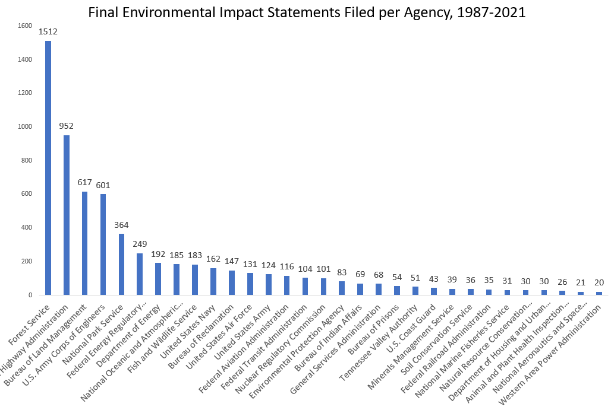

Agencies charged with management of federal lands (such as the Forest Service and the Bureau of Land Management), and responsible for building large scale infrastructure (such as the Federal Highway Administration and the Army Corps of Engineers) are responsible for an overwhelmingly large portion of NEPA efforts - those 4 agencies are responsible for more than 50% of environmental impact statements produced over the last 35 years.

负责管理联邦土地的机构（如林务局和土地管理局）和负责建设大型基础设施的机构（如联邦公路管理局和陆军工程兵团）负责绝大多数NEPA 的努力——这 4 个机构负责过去 35 年中 50% 以上的环境影响报告。

The same seems to be true for EAs (though the data here isn’t great.) In 2015 (the last year we have data), just 2 agencies (the Bureau of Land management and the Corps of Engineers) were responsible for more than 50% of environmental assessments.

EA 似乎也是如此（尽管这里的数据不是很好。）在 2015 年（我们有数据的最后一年），只有 2 个机构（土地管理局和工程兵团）负责超过50%的环境评估。

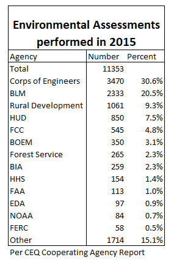

(Note that some of the agencies that produce the most EAs aren’t the ones that produce the most EISs - HUD and the Department of Rural Development notably seem to produce a lot of EAs but relatively few EISs.)

（请注意，一些产生最多 EA 的机构并不是产生最多 EIS 的机构——特别是 HUD 和农村发展部似乎产生了大量 EA，但 EIS 相对较少。）

Agencies also vary in the proportion of actions that require a higher tier of NEPA analysis. For the Department of Energy, for instance, 98% of their actions are categorical exclusions, 1.6% require an EA, and just 0.4% require an EIS \[1\].

各机构在需要更高层次的 NEPA 分析的行动比例方面也各不相同。 例如，对于能源部，他们 98% 的行动是绝对排除，1.6% 需要 EA，只有 0.4% 需要 EIS \[1\]。

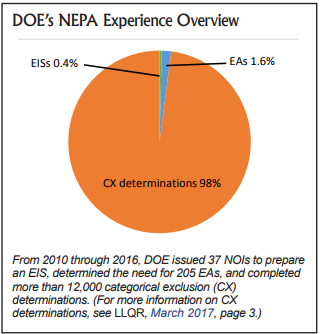

For the Forest Service, on the other hand, 15.9% and 1.9% of agency actions require an EA or an EIS, respectively (~10x and ~4x the DoE rate.)

另一方面，对于林务局，15.9% 和 1.9% 的机构行动分别需要 EA 或 EIS（分别是 DoE 比率的 10 倍和 4 倍。）

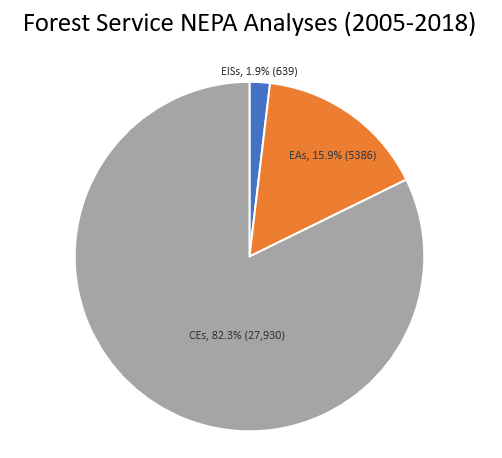

Inter-agency variation also shows up in the amount of effort required to produce a given analysis. The length of environmental impact statements, for instance, varies greatly from agency to agency:

机构间的差异还体现在进行特定分析所需的工作量上。 例如，环境影响报告的长度因机构而异：

As does the time to complete them:

完成它们的时间也是如此：

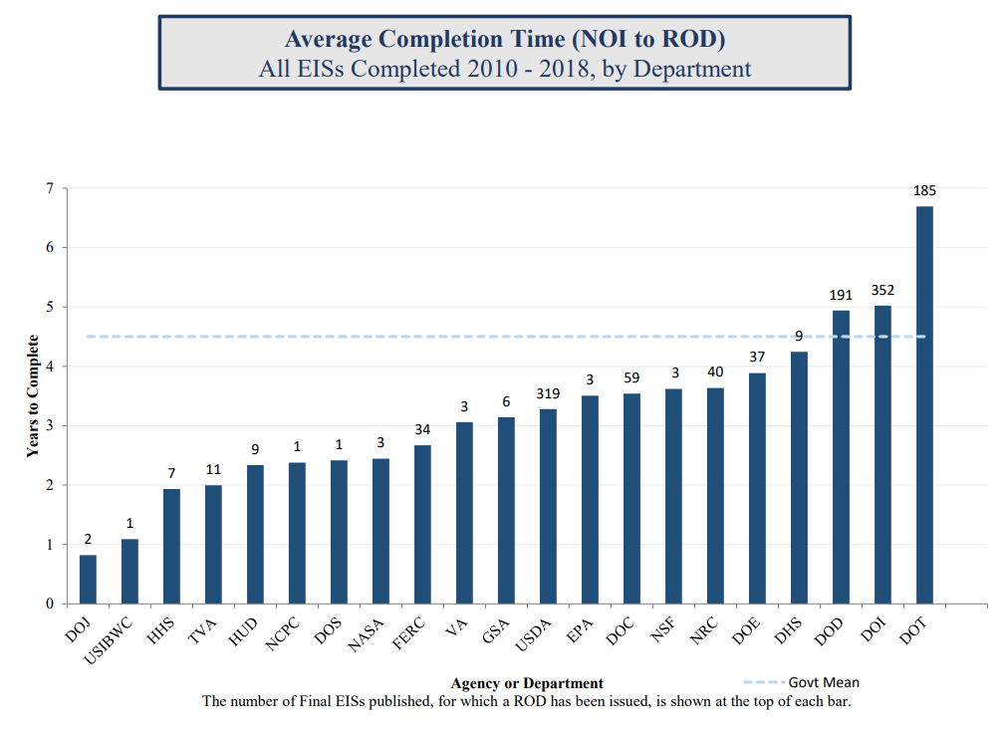

The same is true if we look at lower tiers of analysis. For environmental assessments, some agencies seem to routinely produce very short ones. Every EA I found for the Corps of Engineers, for instance, was less than 100 pages, with many fewer than 30 pages ([this USDA repor](https://books.google.com/books?hl=en&lr=&id=ooSD1iuoTooC&oi=fnd&pg=PP1&dq=related:xCtrQpXIvMMJ:scholar.google.com/&ots=haLON8XtcB&sig=akhFIajyaz2nUnWgns49olSlqGk#v=onepage&q&f=false)t suggests the Corps of Engineers has a very different NEPA process and culture than other agencies.) The FAA, on the other hand, seems to produce _enormous_ EAs. Their EA for a new [runway approach procedure](https://faabostonworkshops.com/wp-content/uploads/2022/05/Final-EA-with-Appendices.pdf) at Boston Logan is over 2100 pages including appendices, and their EA for licensing SpaceX’s Boca Chica facility is over 1200 pages.

如果我们查看较低层次的分析，情况也是如此。 对于环境评估，一些机构似乎经常制作非常简短的评估。 例如，我为工程兵团找到的每份 EA 都不到 100 页，很多不到 30 页（ [美国农业部的这份报告](https://books.google.com/books?hl=en&lr=&id=ooSD1iuoTooC&oi=fnd&pg=PP1&dq=related:xCtrQpXIvMMJ:scholar.google.com/&ots=haLON8XtcB&sig=akhFIajyaz2nUnWgns49olSlqGk#v=onepage&q&f=false) 表明，工程兵团的 NEPA 流程和文化与其他机构截然不同。）FAA ，另一方面，似乎产生了 _巨大的_ EA。 他们在波士顿洛根的新 [跑道进近程序](https://faabostonworkshops.com/wp-content/uploads/2022/05/Final-EA-with-Appendices.pdf) 的 EA超过 2100 页，包括附录，他们的 EA 许可 SpaceX 的博卡奇卡设施超过 1200 页。

Likewise, the amount of work a categorical exclusion requires seems to vary greatly between agencies. For some, such as the Department of Energy, it’s mostly just filling out the proper form, and takes just 1 or 2 days to complete. In other cases, the categorical exclusion is a more substantial undertaking. The [median time to complete](https://academic.oup.com/jof/article/118/4/403/5825558?login=true) a Forest Service categorical exclusion, for instance, was 105 days as of 2018. And for the Federal Highway Administration, [Trnka 2014](https://www.cambridge.org/core/journals/environmental-practice/article/abs/environmental-reviews-and-case-studies-streamlining-the-national-environmental-policy-act-process/785DC9661B1A823D5A66E54E93647176) notes that “The template documents for preparing FHWA CEs in some states are 20 or more pages long and routinely lead to documents of 100 or more pages.” T[his discussion](https://rosap.ntl.bts.gov/view/dot/11293) of the Florida I-10 bridge replacement notes that it took several months to approve the CE, as it had to be signed off by an extremely backlogged Coast Guard. 

同样，分类排除所需的工作量似乎因机构而异。 对于能源部等部门而言，它主要只是填写适当的表格，只需 1 或 2 天即可完成。 在其他情况下，绝对排除是一项更实质性的任务。 为 [完成林务局分类排除的中位时间](https://academic.oup.com/jof/article/118/4/403/5825558?login=true) 例如，截至 2018 年， [105 天。对于联邦公路管理局， Trnka 2014](https://www.cambridge.org/core/journals/environmental-practice/article/abs/environmental-reviews-and-case-studies-streamlining-the-national-environmental-policy-act-process/785DC9661B1A823D5A66E54E93647176) 指出“在某些州准备 FHWA CE 的模板文件有 20 页或更多页，通常会导致 100 页或更多页的文档。” 他对 [佛罗里达州 I-10 桥梁更换的讨论](https://rosap.ntl.bts.gov/view/dot/11293) 指出，批准 CE 花了几个月的时间，因为它必须由积压严重的海岸警卫队签署。

Here’s the FHWA describing the procedure that might be required to determine if a road falls under a categorical exclusion:

FHWA 描述了确定道路是否属于绝对排除项可能需要的程序：

> _Now let's look at a second project where the widening of the road requires additional right-of-way from a public park. To decrease crashes on an existing roadway, shoulders will be added. In a site visit with the State DOT, it was determined that the CE \[categorical exclusion\] is likely appropriate under the D-list in the regulation. But because of the need for right-of-way and potential impacts to public land, the local public agency (LPA) is asked to:_
> 
> _现在我们来看第二个项目，其中道路拓宽需要从公园获得额外的通行权。 为了减少现有道路上的撞车事故，将添加路肩。 在与州 DOT 的现场访问中，确定 CE \[分类排除\] 在法规的 D 列表下可能是合适的。 但由于需要通行权和对公共土地的潜在影响，当地公共机构 (LPA) 被要求：_
> 
> _• Conduct several studies related to the presence of endangered species and archeological sites_
> 
> _• 开展多项与濒危物种和考古遗址存在相关的研究_
> 
> _• Coordinate with FHWA to address resources and potential use of the public park_
> 
> _• 与 FHWA 协调解决公园的资源和潜在用途问题_
> 
> _• Follow the State DOT's public involvement procedures for formal public input_
> 
> _• 遵循国家交通部的公众参与程序以获得正式的公众意见_
> 
> _The studies confirmed that there were no significant environmental impacts._
> 
> _研究证实，没有重大的环境影响。_

Variation between agencies also exists for NEPA analysis preparation times. Dewitt 2013 noted that between 2006 and 2010, though across all agencies average EIS preparation time went up, several agencies (such as the Corps of Engineers, Forest Service, and Highway Administration) had their preparation times fall. And looking at the DoE, their average EIS preparation time was fairly constant from the mid 1990s up until ~2011:

NEPA 分析准备时间也因机构而异。 Dewitt 2013 指出，在 2006 年至 2010 年期间，尽管所有机构的平均 EIS 准备时间都增加了，但一些机构（例如工程兵团、林务局和公路管理局）的准备时间有所下降。 看看美国能源部，从 1990 年代中期到 2011 年左右，他们的平均 EIS 准备时间相当稳定：

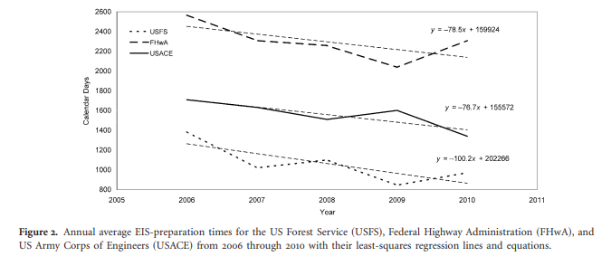

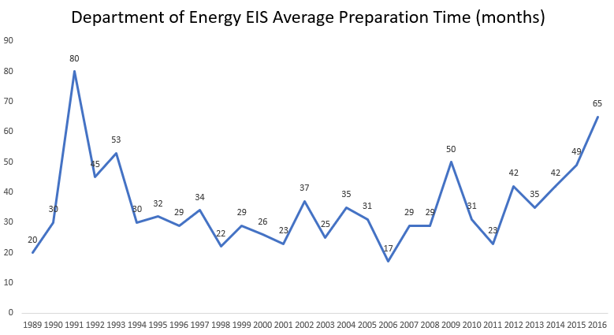

There can also be significant variation in NEPA operations within a single agency over time. The Department of Energy, for instance, was for many years an organization that [treated NEPA compliance as an afterthought](https://www.energy.gov/sites/prod/files/G-Oth-Managing_NEPA_DOE.pdf). But in 1989, a new Secretary of Energy (James Watkins) emphasized compliance with environmental laws (including NEPA), and substantially changed the organization’s NEPA procedures, and increased the number of EISs they performed:

随着时间的推移，单个机构内的 NEPA 操作也可能发生重大变化。 例如，能源部多年来一直是一个将 [NEPA 合规视为事后考虑的](https://www.energy.gov/sites/prod/files/G-Oth-Managing_NEPA_DOE.pdf) 组织。 但在 1989 年，新任能源部长 (James Watkins) 强调遵守环境法（包括 NEPA），并大幅改变了该组织的 NEPA 程序，并增加了他们执行的 EIS 的数量：

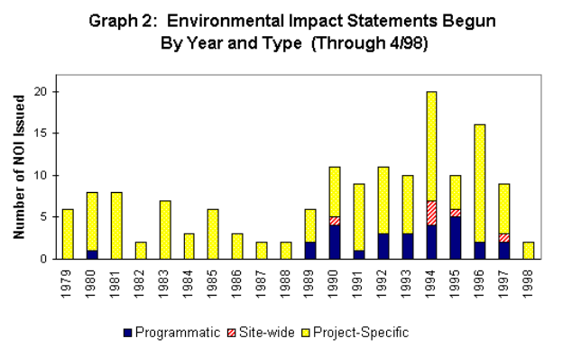

Variation might also exist within a single agency between offices. Fleischman 2020 noted that “there appears to be substantial heterogeneity within the USFS concerning how NEPA processes are handled, in terms of both level of analysis (i.e., some offices perform many EISs, others many EAs or CEs) and time spent on analysis.”

办公室之间的单个机构内也可能存在差异。 Fleischman 2020 指出，“就 NEPA 流程的处理方式而言，USFS 内部似乎存在很大的异质性，无论是在分析层面（即，一些办公室执行许多 EIS，其他办公室执行许多 EA 或 CE）和花在分析上的时间。”

Let’s look a little closer at the data around NEPA analyses.

让我们仔细看看有关 NEPA 分析的数据。

For EISs, as we’ve seen, these are long documents. As of 2018 the [average page length](https://ceq.doe.gov/docs/nepa-practice/CEQ_EIS_Length_Report_2020-6-12.pdf) of an EIS was 661 pages (including appendices.) And they take a long time to complete - as of 2018 the [average time](https://ceq.doe.gov/docs/nepa-practice/CEQ_EIS_Timeline_Report_2020-6-12.pdf) between the “Notice of Intent (NOI)” (when an agency files it’s intent to create an EIS) and the “Record of Decision (ROD)” (when it makes its official decision for how to proceed) is 4.5 years (and this likely _understates_ the true preparation time, as work often begins before the NOI is filed.)

正如我们所见，对于 EIS，这些都是长文档。 截至 2018 年， [EIS 的平均页面长度](https://ceq.doe.gov/docs/nepa-practice/CEQ_EIS_Length_Report_2020-6-12.pdf) 为 661 页（包括附录）。它们需要很长时间才能完成——截至 2018 年， [平均时间](https://ceq.doe.gov/docs/nepa-practice/CEQ_EIS_Timeline_Report_2020-6-12.pdf) “意向通知 (NOI)”（当机构提交其意向时）之间的 创建 EIS）和“决定记录 (ROD)”（当它就如何进行做出正式决定时）是 4.5 年（这可能低估 _了_ 真正的准备时间，因为工作通常在提交 NOI 之前就开始了。 )

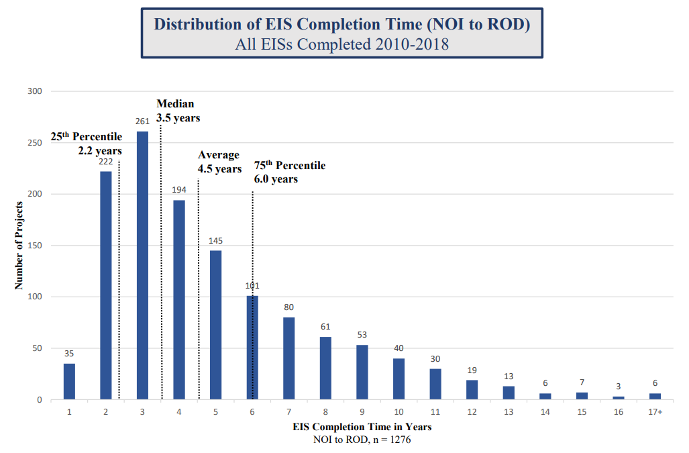

These seem to be increasing over time - the documented preparation time for EISs [rose nearly 50%](https://naep.memberclicks.net/assets/documents/2019/NEPA_Annual_Report_2018.pdf) between 2000 and 2018:

这些似乎随着时间的推移而增加——记录在案的 EIS 准备时间 [在 2000 年至 2018 年间增加了近 50%](https://naep.memberclicks.net/assets/documents/2019/NEPA_Annual_Report_2018.pdf) ：

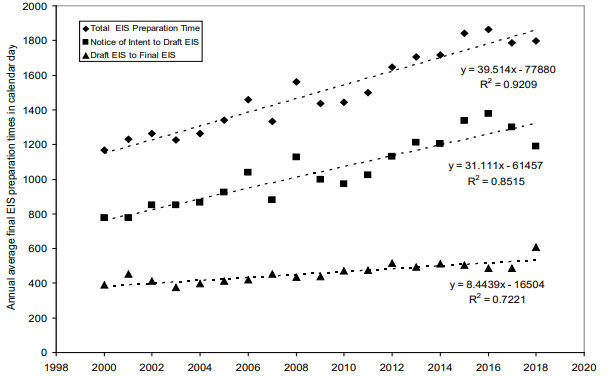

For page length trends, I couldn’t find any overall summaries, but the DoE noted in 2017 that “the average length of DoE EISs have more than doubled over the past 20 years.”

对于页面长度趋势，我找不到任何总体摘要，但 DoE 在 2017 年指出“在过去 20 年中，DoE EIS 的平均长度增加了一倍多。”

The actual number of NEPA analyses, though, seem to be decreasing. Here’s final EISs filed per year over time:

不过，NEPA 分析的实际数量似乎正在减少。 以下是每年随时间提交的最终 EIS：

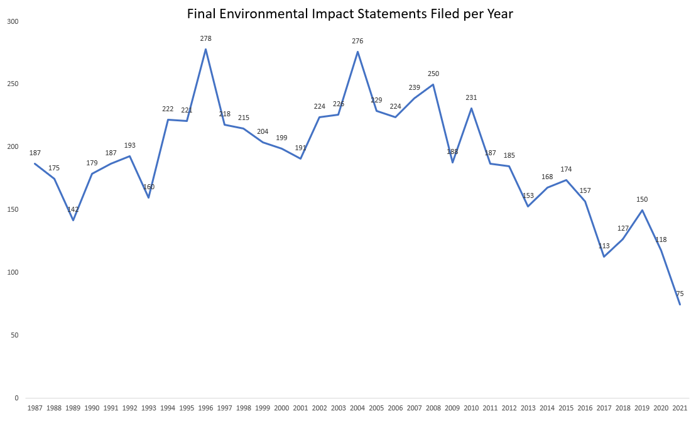

(As far as I can tell, this does not include EISs completed under [ARRA.](https://www.investopedia.com/terms/a/american-recovery-and-reinvestment-act.asp))

（据我所知，这不包括根据 [ARRA 完成的 EIS。](https://www.investopedia.com/terms/a/american-recovery-and-reinvestment-act.asp) ）

Less data is available, but it appears something similar is true for EAS, with fewer and fewer of them being produced per year (though most of these datapoints are estimates and likely have wide error bars):

可用数据较少，但 EAS 似乎也有类似的情况，每年生产的数据越来越少（尽管这些数据点中的大部分是估计值，可能有很大的误差线）：

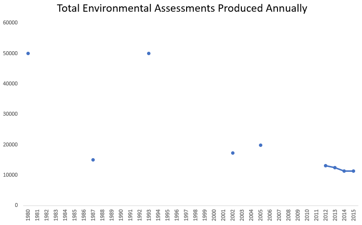

For CEs there’s even less data, but there’s some suggestive evidence. Fleischman 2020 noted that for the Forest Service the number of categorical exclusions is dropping over time:

对于 CE，数据更少，但有一些暗示性证据。 Fleischman 2020 指出，对于林务局来说，绝对排除的数量随着时间的推移而下降：

It’s not clear what the mechanism is here. Over time, we should naturally expect fewer EAs and more CEs (once a type of project is understood to have few or no significant effects, future projects similar to it can often be a CE.) But this wouldn’t explain a drop across all levels.

目前尚不清楚这里的机制是什么。 随着时间的推移，我们自然应该期望更少的 EA 和更多的 CE（一旦一种类型的项目被认为具有很少或没有显着影响，未来类似的项目通常可以成为 CE。）但这并不能解释所有项目的下降水平。

One possible explanation is a reduction in federal resources devoted to NEPA/environmental compliance. A [2003 study](https://www.tandfonline.com/doi/pdf/10.1017/S1466046603031284?needAccess) noted that NEPA staff and budgets across all agencies had been repeatedly reduced, and staff were being asked to “do more with less”, and Fleischman 2020 noted that “flat or declining annual appropriations and dramatically rising fire suppression costs” were likely part of the reason for fewer Forest Service NEPA analyses.

一种可能的解释是用于 NEPA/环境合规的联邦资源减少。 2003 年的一项 [研究](https://www.tandfonline.com/doi/pdf/10.1017/S1466046603031284?needAccess) 指出，所有机构的 NEPA 工作人员和预算一再减少，工作人员被要求“事半功倍”，Fleischman 2020 指出“年度拨款持平或下降，灭火成本急剧上升”很可能林务局 NEPA 分析较少的部分原因。

How much do these NEPA analyses cost?

这些 NEPA 分析的费用是多少？

Getting a clear answer to this is difficult, partially because there’s often no clear distinction as to what constitutes a “NEPA task”, partially because agencies in general don’t attempt to track this information, and partially because (once again) there’s significant variation from agency to agency. In general, costs track the time and effort required to perform the analysis, with CEs being cheaper than EAs, and EAs being cheaper than EISs.

得到一个明确的答案是困难的，部分原因是通常没有明确区分什么是“NEPA 任务”，部分原因是机构一般不会试图追踪这些信息，部分原因是（再一次）存在显着差异从代理到代理。 一般来说，成本跟踪执行分析所需的时间和精力，CE 比 EA 便宜，EA 比 EIS 便宜。
    
-   In 2003 the CEQ estimated that “small” EAs cost between $5000 and $20,000, “large” EAs cost between $50,000 and $200,000, and EISs typically cost between $250,000 and $2,000,000.
    
    2003 年，CEQ 估计“小型”EA 的成本在 5000 美元到 20,000 美元之间，“大型”EA 的成本在 50,000 美元到 200,000 美元之间，而 EIS 的成本通常在 250,000 美元到 2,000,000 美元之间。
        
-   A Forest Service official testified in 2007 that their CEs cost approximately $50,000 on average, EAs $200,000 on average, and EISs $1,000,000 on average.
    
    一位林务局官员在 2007 年作证说，他们的 CE 平均花费大约 50,000 美元，EA 平均花费 200,000 美元，EIS 平均花费 1,000,000 美元。

    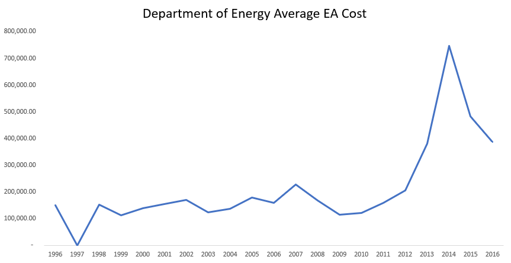
    
    
-   The DOE (which tracked its NEPA contractor costs until 2017) noted that in 2016 their average EA cost was $386,000, and their average EIS cost was $7.5 million (CE costs were described as “not significant”.) EIS cost was relatively steady over time, while EA cost had seen a large recent trend upward
    
    美国能源部（跟踪其 NEPA 承包商成本直到 2017 年）指出，2016 年他们的平均 EA 成本为 386,000 美元，他们的平均 EIS 成本为 750 万美元（CE 成本被描述为“不重要”）。EIS 成本随着时间的推移相对稳定，而 EA 成本近期呈上升趋势

    
    
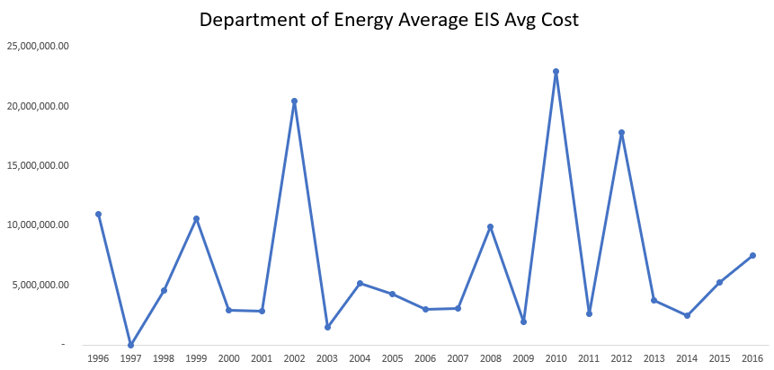

Most reports note that the cost for a NEPA analysis is typically a small fraction of the overall project cost (typically less than 1%.)

大多数报告指出，NEPA 分析的成本通常只占项目总成本的一小部分（通常低于 1%）。

Like with all things NEPA, these costs seem to be heavily right-skewed, with a small number of EAs/EISs dramatically more expensive than others. The years where the DOEs average EIS cost spiked, for instance, were years when a particularly expensive EIS (such as the one for Yucca Mountain) was completed. In general, NEPA analyses seem to form a series of overlapping right-skewed distributions, with the longest and most arduous CEs more effort than the easiest EAs, and the largest EAs more work than the simplest EISs.

与所有 NEPA 一样，这些成本似乎严重右偏，少数 EA/EIS 比其他成本高得多。 例如，DOE 平均 EIS 成本飙升的年份是完成特别昂贵的 EIS（例如 Yucca Mountain 的 EIS）的年份。 总的来说，NEPA 分析似乎形成了一系列重叠的右偏分布，最长和最艰巨的 CE 比最简单的 EA 更努力，最大的 EA 比最简单的 EIS 更努力。

Even though most federal government actions fall under a categorical exclusion, the largest and most complex projects will invariably need a higher level of NEPA analysis, so in _per-dollar terms_ the fraction of EAs and EISs is much higher. The Highway Administration, for instance, [noted in 2001](https://books.google.com/books?id=bwwrN2skHx8C&pg=PA976&dq=%22my+understanding+is+the+other+level+of+environmental+review%22&hl=en&newbks=1&newbks_redir=0&sa=X&ved=2ahUKEwja0aqu-s35AhVBLkQIHRouBCUQ6AF6BAgCEAI#v=onepage&q=%22my%20understanding%20is%20the%20other%20level%20of%20environmental%20review%22&f=false) that while 91% of projects could be classified as a categorical exclusion, this represented only 74% of project dollars.

尽管大多数联邦政府行动属于绝对排除，但最大和最复杂的项目总是需要更高水平的 NEPA 分析，因此以 _美元计算，_ EA 和 EIS 的比例要高得多。 例如，公路管理局 [在 2001 年指出](https://books.google.com/books?id=bwwrN2skHx8C&pg=PA976&dq=%22my+understanding+is+the+other+level+of+environmental+review%22&hl=en&newbks=1&newbks_redir=0&sa=X&ved=2ahUKEwja0aqu-s35AhVBLkQIHRouBCUQ6AF6BAgCEAI#v=onepage&q=%22my%20understanding%20is%20the%20other%20level%20of%20environmental%20review%22&f=false) ，虽然 91% 的项目可以归类为绝对排除项目，但这仅占项目资金的 74%。

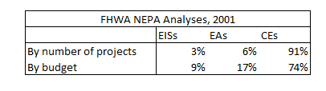

The mechanism by which NEPA compliance is enforced is via the courts - agencies can be sued under the Administrative Procedures Act for not properly complying with NEPA (using an inappropriate tier of analysis for an action, ignoring certain likely impacts, etc.) NEPA lawsuits are common - the Department of Justice [has noted](https://crsreports.congress.gov/product/pdf/IF/IF11932) that NEPA is the most litigated environmental law, and that 1 out of every 450 federal actions taken to comply with NEPA are challenged in court.

执行 NEPA 合规性的机制是通过法院 - 可以根据行政程序法起诉未正确遵守 NEPA 的机构（对行动使用不适当的分析层次，忽略某些可能的影响等）NEPA 诉讼是常见 - 司法部 [注意到](https://crsreports.congress.gov/product/pdf/IF/IF11932) NEPA 是诉讼最多的环境法，每 450 项为遵守 NEPA 采取的联邦行动中就有 1 项在法庭上受到质疑。

In practice, this creates something of a moving target for NEPA compliance. Agencies must be constantly monitoring court outcomes to determine what compliance requires (this is sometimes described as “NEPA common law”), and over time more and more potential impacts have had to be included in NEPA analyses. The National Association of Environmental Professionals helpfully publishes a relevant list of NEPA case outcomes in its annual report. 

实际上，这为 NEPA 合规性创建了一个移动目标。 各机构必须不断监测法庭结果以确定合规要求（有时称为“NEPA 普通法”），并且随着时间的推移，越来越多的潜在影响必须纳入 NEPA 分析。 全国环境专业人士协会在其年度报告中公布了一份 NEPA 案例结果的相关清单。

The frequency of NEPA litigation is partly due to the fact that, while NEPA lawsuits often target legitimate inadequacies (such as not considering the risks of an [infectious pathogen research facility being built near a major population center](https://protectnepa.org/plum-island-biolab/)), they are sometimes used as a weapon by activist groups to try to stop projects they don’t like. While lawsuits can’t stop a project permanently, the hope is that a lawsuit will result in an injunction that stops the project temporarily, and that the delay will make the project unattractive enough to cancel:

的风险 [NEPA 诉讼的频率部分是由于这样一个事实，虽然 NEPA 诉讼通常针对合法的不足（例如不考虑在主要人口中心附近建造传染性病原体研究设施](https://protectnepa.org/plum-island-biolab/) ），但它们有时被用作武器活动家团体试图阻止他们不喜欢的项目。 虽然诉讼不能永久停止一个项目，但希望诉讼会导致临时停止该项目的禁令，并且延迟将使该项目缺乏吸引力以取消：
    
-   An environmental activist opposing a missile defense project [stated that](https://books.google.com/books?id=IwCOAgAAQBAJ&pg=PA60&dq=the+hope+is+that+delay+%5Boccasioned+by+NEPA+litigation%5D+will+lead+to+cancellation...That%E2%80%99s+what+we+always+hope+for+in+these+suits&hl=en&newbks=1&newbks_redir=0&sa=X&ved=2ahUKEwi8vbaGgc75AhVjhIkEHR7nA3sQ6AF6BAgFEAI#v=onepage&q=the%20hope%20is%20that%20delay%20%5Boccasioned%20by%20NEPA%20litigation%5D%20will%20lead%20to%20cancellation...That%E2%80%99s%20what%20we%20always%20hope%20for%20in%20these%20suits&f=false) “the hope is that delay \[occasioned by NEPA litigation\] will lead to cancellation...That’s what we always hope for in these suits.”
    
    一位反对导弹防御项目的环保活动家 [表示，](https://books.google.com/books?id=IwCOAgAAQBAJ&pg=PA60&dq=the+hope+is+that+delay+%5Boccasioned+by+NEPA+litigation%5D+will+lead+to+cancellation...That%E2%80%99s+what+we+always+hope+for+in+these+suits&hl=en&newbks=1&newbks_redir=0&sa=X&ved=2ahUKEwi8vbaGgc75AhVjhIkEHR7nA3sQ6AF6BAgFEAI#v=onepage&q=the%20hope%20is%20that%20delay%20%5Boccasioned%20by%20NEPA%20litigation%5D%20will%20lead%20to%20cancellation...That%E2%80%99s%20what%20we%20always%20hope%20for%20in%20these%20suits&f=false) “希望延迟 \[由 NEPA 诉讼引起\] 将导致取消......这就是我们在这些诉讼中一直希望的。”
        
-   The executive director of the Surface Transportation Policy Project [testified that](https://books.google.com/books?id=mOCZX7TR5ygC&pg=PA289&dq=In+the+struggle+between+proponents+and+opponents+of+a%E2%80%A6project,+the+best+an+opponent+can+hope+for+is+to+delay+things+until+the+proponents+change+their+minds+or+tire+of+the+fight&hl=en&newbks=1&newbks_redir=0&sa=X&ved=2ahUKEwj_pdbMgc75AhWRpIkEHdENBmcQ6AF6BAgEEAI#v=onepage&q=In%20the%20struggle%20between%20proponents%20and%20opponents%20of%20a%E2%80%A6project%2C%20the%20best%20an%20opponent%20can%20hope%20for%20is%20to%20delay%20things%20until%20the%20proponents%20change%20their%20minds%20or%20tire%20of%20the%20fight&f=false) “In the struggle between proponents and opponents of a…project, the best an opponent can hope for is to delay things until the proponents change their minds or tire of the fight.”
    
    地面交通政策项目执行主任 [作证说：](https://books.google.com/books?id=mOCZX7TR5ygC&pg=PA289&dq=In+the+struggle+between+proponents+and+opponents+of+a%E2%80%A6project,+the+best+an+opponent+can+hope+for+is+to+delay+things+until+the+proponents+change+their+minds+or+tire+of+the+fight&hl=en&newbks=1&newbks_redir=0&sa=X&ved=2ahUKEwj_pdbMgc75AhWRpIkEHdENBmcQ6AF6BAgEEAI#v=onepage&q=In%20the%20struggle%20between%20proponents%20and%20opponents%20of%20a%E2%80%A6project%2C%20the%20best%20an%20opponent%20can%20hope%20for%20is%20to%20delay%20things%20until%20the%20proponents%20change%20their%20minds%20or%20tire%20of%20the%20fight&f=false) “在一个……项目的支持者和反对者之间的斗争中，反对者所能希望的最好结果就是拖延事情，直到支持者改变主意或厌倦了斗争。”
        
-   A “grassroots litigation training manual” produced by the Community Environmental Legal Defense Fund [stated](https://books.google.com/books?id=1hnxUvry_OoC&pg=PA76&dq=in+an+area+devoid+of+endangered+species,+impacts+to+waterways+and+floodplains+or+of+federal+funding,+NEPA+may+be+the+only+tool+that+grassroots+groups+have&hl=en&newbks=1&newbks_redir=0&sa=X&ved=2ahUKEwjx0aH7gc75AhXyjokEHeW0By0Q6AF6BAgHEAI#v=onepage&q=in%20an%20area%20devoid%20of%20endangered%20species%2C%20impacts%20to%20waterways%20and%20floodplains%20or%20of%20federal%20funding%2C%20NEPA%20may%20be%20the%20only%20tool%20that%20grassroots%20groups%20have&f=false) “in an area devoid of endangered species, impacts to waterways and floodplains or of federal funding, NEPA may be the only tool that grassroots groups have \[to fight highway projects\]”.
    
    社区环境法律辩护基金制作的“基层诉讼培训手册” [指出，](https://books.google.com/books?id=1hnxUvry_OoC&pg=PA76&dq=in+an+area+devoid+of+endangered+species,+impacts+to+waterways+and+floodplains+or+of+federal+funding,+NEPA+may+be+the+only+tool+that+grassroots+groups+have&hl=en&newbks=1&newbks_redir=0&sa=X&ved=2ahUKEwjx0aH7gc75AhXyjokEHeW0By0Q6AF6BAgHEAI#v=onepage&q=in%20an%20area%20devoid%20of%20endangered%20species%2C%20impacts%20to%20waterways%20and%20floodplains%20or%20of%20federal%20funding%2C%20NEPA%20may%20be%20the%20only%20tool%20that%20grassroots%20groups%20have&f=false) “在没有濒危物种、对水道和泛滥平原没有影响或没有联邦资金的地区，NEPA 可能是基层组织\[对抗公路项目\]的唯一工具\]”。
    

And [Forest Service officials noted](https://www.fs.fed.us/pnw/pubs/pnw_gtr799.pdf) that many groups would simply oppose or litigate any project at all (often because this helped them raise more funding.)

林 [务局官员指出](https://www.fs.fed.us/pnw/pubs/pnw_gtr799.pdf) ，许多团体会简单地反对或起诉任何项目（通常是因为这有助于他们筹集更多资金。）

While most NEPA analyses don’t get litigated (as of 2013 there were about [100 NEPA lawsuits filed per year](https://ceq.doe.gov/docs/ceq-reports/nepa-litigation-surveys-2001-2013.pdf)), in practice the threat of a lawsuit seems to push agencies towards producing “litigation-proof” NEPA documents:

虽然大多数 NEPA 分析都没有提起诉讼（截至 2013 年， [每年大约有 100 起 NEPA 诉讼](https://ceq.doe.gov/docs/ceq-reports/nepa-litigation-surveys-2001-2013.pdf) ），但在实践中，诉讼的威胁似乎促使各机构制作“诉讼证明”的 NEPA 文件：

    
-   [Mortimer 2011](https://academic.oup.com/jof/article/109/1/27/4599446), for instance, found that NEPA leaders decide on the level of analysis to do primarily based on perceptions of public controversy and litigation risk.
    
    [例如， Mortimer 2011](https://academic.oup.com/jof/article/109/1/27/4599446) 发现 NEPA 领导人主要根据对公众争议和诉讼风险的看法来决定要进行的分析级别。
        
-   One [agency testified in 2005](https://www.govinfo.gov/content/pkg/CHRG-109hhrg24682/html/CHRG-109hhrg24682.htm) to the House Committee on NEPA reform that “that litigation – or the threat of litigation – has in effect “forced” them to spend as much as necessary to create “bullet proof” documents.”
    
    一家 [2005 年，](https://www.govinfo.gov/content/pkg/CHRG-109hhrg24682/html/CHRG-109hhrg24682.htm) 机构就 NEPA 改革向众议院委员会作证说，“那场诉讼——或诉讼的威胁——实际上‘迫使’他们花费尽可能多的钱来制作‘防弹’文件。”
        
-   [A report by the Forest Service](https://www.fs.fed.us/projects/documents/Process-Predicament.pdf) notes that “Team members often believe that much of their work is ‘for the courts’ and not particularly useful for line officers who make decisions.”
    
    [林务局的一份报告](https://www.fs.fed.us/projects/documents/Process-Predicament.pdf) 指出，“团队成员通常认为他们的大部分工作都是‘为了法庭’，对做决定的一线官员来说并不是特别有用。”
        
-   [Testimony from a mining executive in 2005](https://books.google.com/books?id=P4E2AAAAIAAJ&pg=PA66&dq=%22there+are+now+very+few+issues+an+agency+is+willing+to+consider+insignificant,+due+to+concern+about+having+their+decision+appealed%22&hl=en&newbks=1&newbks_redir=0&sa=X&ved=2ahUKEwifke7shM75AhXpmIQIHUFfDq8Q6AF6BAgGEAI#v=onepage&q=%22there%20are%20now%20very%20few%20issues%20an%20agency%20is%20willing%20to%20consider%20insignificant%2C%20due%20to%20concern%20about%20having%20their%20decision%20appealed%22&f=false) noted that “there are now very few issues an agency is willing to consider insignificant, due to concern about having their decision appealed”, concerns [which have been echoed](https://books.google.com/books?id=Szakw6RcBOYC&pg=PA27&dq=+burden+of+the+process.+In+some+cases+we+conclude+to+not+develop+resources+that+would+be+available+to+us+so+that+we+can+avoid+interaction+with+the+NEPA+process&hl=en&newbks=1&newbks_redir=0&sa=X&ved=2ahUKEwiu_JzU27_5AhVemGoFHeKsAuMQ6AF6BAgEEAI#v=onepage&q=burden%20of%20the%20process.%20In%20some%20cases%20we%20conclude%20to%20not%20develop%20resources%20that%20would%20be%20available%20to%20us%20so%20that%20we%20can%20avoid%20interaction%20with%20the%20NEPA%20process&f=false) by other industry stakeholders.
    
    [一位矿业高管在 2005 年的证词中](https://books.google.com/books?id=P4E2AAAAIAAJ&pg=PA66&dq=%22there+are+now+very+few+issues+an+agency+is+willing+to+consider+insignificant,+due+to+concern+about+having+their+decision+appealed%22&hl=en&newbks=1&newbks_redir=0&sa=X&ved=2ahUKEwifke7shM75AhXpmIQIHUFfDq8Q6AF6BAgGEAI#v=onepage&q=%22there%20are%20now%20very%20few%20issues%20an%20agency%20is%20willing%20to%20consider%20insignificant%2C%20due%20to%20concern%20about%20having%20their%20decision%20appealed%22&f=false) 指出，“由于担心他们的决定会被上诉，现在很少有机构愿意将其视为无关紧要的问题”， [表达了同样的担忧。](https://books.google.com/books?id=Szakw6RcBOYC&pg=PA27&dq=+burden+of+the+process.+In+some+cases+we+conclude+to+not+develop+resources+that+would+be+available+to+us+so+that+we+can+avoid+interaction+with+the+NEPA+process&hl=en&newbks=1&newbks_redir=0&sa=X&ved=2ahUKEwiu_JzU27_5AhVemGoFHeKsAuMQ6AF6BAgEEAI#v=onepage&q=burden%20of%20the%20process.%20In%20some%20cases%20we%20conclude%20to%20not%20develop%20resources%20that%20would%20be%20available%20to%20us%20so%20that%20we%20can%20avoid%20interaction%20with%20the%20NEPA%20process&f=false) 其他行业利益相关者也
    

指出 [Stern 2014](https://www.tandfonline.com/doi/abs/10.1080/09640568.2013.849232) ：

> _Despite calls for shorter NEPA documents in the Forest Service, most IDTLs and team members felt pressure to include what they considered to be otherwise unnecessary information in their NEPA documents. Interviewees described pressure from the DM in some cases to do so. In other cases, this was attributed directly to a general fear of the public pointing out that something was missed and reopening the NEPA process._
> 
> _尽管林务局呼吁缩短 NEPA 文件的篇幅，但大多数 IDTL 和团队成员都感到有压力，需要在他们的 NEPA 文件中包含他们认为不必要的信息。 受访者描述了在某些情况下来自 DM 的压力。 在其他情况下，这直接归因于公众普遍害怕指出遗漏了什么并重新启动 NEPA 流程。_

An example of this is the threat of lawsuits incentivizing the inclusion of more and more research in environmental analyses, regardless of its merits:

这方面的一个例子是诉讼的威胁，激励越来越多的研究纳入环境分析，无论其优点如何：

> _An excellent illustration of excessive analysis due to management uncertainty is the Beschta Report. Commissioned by the Pacific Rivers Council in 1995, eight scientists drafted a paper, “Wildfire and Salvage Logging,” commonly known as the Beschta Report._
> 
> _Beschta 报告是由于管理不确定性而导致过度分析的一个很好的例子。 1995 年，八位科学家受太平洋河流委员会的委托起草了一篇论文，题为“野火和打捞伐木”，通常被称为 Beschta 报告。_
> 
> _The paper has never been published in any scientific or professional journal, nor has it ever been subject to any formal peer review. In 1995, Forest Service scientists and managers expressed strong reservations about the report, which contains many unsubstantiated statements and assumptions. Nevertheless, the courts have sometimes shown support._
> 
> _该论文从未在任何科学或专业期刊上发表过，也从未接受过任何正式的同行评审。 1995 年，林务局的科学家和管理人员对该报告表示了强烈的保留意见，该报告包含许多未经证实的陈述和假设。 然而，法院有时会表示支持。_
> 
> _Groups have challenged postfire recovery projects on the grounds that the Forest Service has failed to consider the Beschta Report. In four cases, the courts have ruled that Forest Service decisions violated NEPA because the associated records did not adequately document the agency’s consideration of the Beschta Report. In two other cases, courts have ruled in favor of the Forest Service on this issue._
> 
> _一些团体以林务局未能考虑 Beschta 报告为由对火灾后恢复项目提出质疑。 在四个案例中，法院裁定林务局的决定违反了 NEPA，因为相关记录没有充分记录该机构对 Beschta 报告的考虑。 在另外两个案件中，法院在这个问题上裁定林务局胜诉。_
> 
> _In view of the court record, forest planners might feel compelled to thoroughly document their consideration of the Beschta Report’s principles and recommendations, even though the underlying land management issues are already addressed in the record. That includes documenting why some elements of the Beschta Report are not relevant to the specific proposed project._
> 
> _鉴于法庭记录，森林规划者可能觉得有必要完整记录他们对贝施塔报告原则和建议的考虑，即使潜在的土地管理问题已经在记录中得到解决。 这包括记录为什么 Beschta 报告的某些要素与具体的拟议项目不相关。_
> 
> _The court record has inspired some groups to demand that the Forest Service consider other papers and articles supposedly relevant to proposed actions. Sometimes the proffered list of references exceeds 100 entries. To minimize the risk of adverse judicial opinions, land managers might feel constrained to fully document within the body of the NEPA document their detailed consideration of each and every paper or article._
> 
> _法庭记录激发了一些团体要求林业局考虑其他据称与拟议行动相关的文件和文章。 有时提供的参考文献列表超过 100 个条目。 为了尽量减少不利司法意见的风险，土地管理者可能会觉得有必要在 NEPA 文件的正文中完整记录他们对每篇论文或文章的详细考虑。_

This mechanism seems to be behind the length of NEPA documents. The 1978 CEQ regulations state that an EA should generally be less than 75 pages, and an EIS should generally be less than 150 pages. But the uncertainty of what’s needed to comply with NEPA, and the natural risk aversion of government agencies, pushes these documents to be longer and longer.

这种机制似乎落后于 NEPA 文件的篇幅。 1978 年的 CEQ 规定规定，EA 通常应少于 75 页，而 EIS 通常应少于 150 页。 但是，遵守 NEPA 所需条件的不确定性，以及政府机构自然的风险规避，促使这些文件变得越来越长。

In practice, figuring out what “bulletproof” entails is difficult. Stern 2014 gives an example of the Forest Service trying to figure out what sort of watershed analysis model is most likely to hold up in court:

在实践中，弄清楚什么是“防弹”是很困难的。 Stern 2014 举了一个林务局的例子，试图找出哪种分水岭分析模型最有可能在法庭上站得住脚：

> _…In one case, for example, an IDTL asked the Regional Office whether they could use a particular watershed model that had been used elsewhere. Personnel in the Regional Office instructed the team not to use the model because it would represent a departure from the traditional approach used on the specific forest and could expose the process to additional external scrutiny by setting a new precedent. The IDTL described the response from the Regional Office after the ID team submitted their preliminary report, which did not include the model._
> 
> _……在一个案例中，例如，IDTL 询问区域办事处他们是否可以使用在其他地方使用过的特定流域模型。 区域办事处的工作人员指示团队不要使用该模型，因为这将背离用于特定森林的传统方法，并可能通过树立新的先例使流程接受额外的外部审查。 IDTL 描述了 ID 小组提交初步报告后区域办事处的回应，其中不包括模型。_
> 
> _“It was like \[from the Region\], ‘Hey, you need to run some models because there was this court decision, and it was up-held because they had model information, so you got to run the model for this.’ \[laughing\] It was kind of like, ‘okay that’s a 180 from what you told us initially.’ And then after the model was run, and we sent the document out, \[the Region came back and said\], ‘Oh jeez, maybe you shouldn’t have run the model because… the court case was reversed.’ \[laughing\]”_
> 
> _“这就像 \[来自该地区\]，'嘿，你需要运行一些模型，因为有这个法院判决，并且因为他们有模型信息而被维持，所以你必须为此运行模型。' \[笑\]有点像，'好吧，这与你最初告诉我们的内容相差了 180 度。' 然后在模型运行后，我们发送了文件，\[该地区回来说\]，'哦，天哪，也许你不应该运行模型，因为......法院案件被推翻了。 \[笑\]”_

The uncertainty that the NEPA process creates - how thorough of an analysis will be required, how long it will take to perform, what sorts of mitigations will be required, what sorts of follow-up analysis will be required, will the analysis get litigated - makes it difficult to plan projects with substantial NEPA requirements. A mining executive noted that the NEPA process has resulted in the US having unusually burdensome permitting requirements by world standards:

NEPA 流程产生的不确定性——需要进行多彻底的分析、执行需要多长时间、需要什么样的缓解措施、需要什么样的后续分析、分析是否会被提起诉讼——使得规划具有大量 NEPA 要求的项目变得困难。 一位矿业高管指出，根据世界标准，NEPA 流程导致美国的许可要求异常繁琐：

> _In considering a new project the first thing I am asked is how long will it take and what will it cost to get it permitted. I can answer this question with a high degree of confidence in most jurisdictions around the world, with the exception of the United States. When I first began working with NEPA in the mid 1980s the time and cost to prepare an EIS for a mining project took about 18 months and cost about $250,000-$300,000. Today \[2005\] an EIS for a mining project may take 5-8 years and cost $7-8 million or more, before factoring in expected appeals and litigation of the ultimate decision. Thus, it is very difficult to make business decisions in the US under the current permitting environment on federal lands._
> 
> _在考虑一个新项目时，我首先被问到的是需要多长时间以及获得许可需要花费多少。 我可以在世界上大多数司法管辖区高度自信地回答这个问题，但美国除外。 当我在 1980 年代中期开始与 NEPA 合作时，为采矿项目准备 EIS 的时间和成本大约需要 18 个月，成本约为 250,000 至 300,000 美元。 今天 \[2005\] 一个采矿项目的 EIS 可能需要 5-8 年，花费 7-8 百万美元或更多，然后才能考虑最终决定的预期上诉和诉讼。 因此，在联邦土地上当前的许可环境下，很难在美国做出商业决策。_

[Reitze 2012](https://lawdigitalcommons.bc.edu/cgi/viewcontent.cgi?article=2080&context=ealr) notes that NEPA is used to increase the costs and unpredictability of fossil fuel development, in an attempt to make renewable energy more attractive by comparison. And [Glen 2022](https://www.emergingenergyinsights.com/2022/03/legal-challenges-to-renewable-energy-development-and-how-nepa-can-help/) notes that uncertainty around NEPA litigation also makes planning renewable energy projects (in this case, wind power) more difficult and risky. A transmission line executive [noted in 2009](https://www.elr.info/sites/default/files/article/2011/10/39.10581.pdf) that the uncertainty and unclear case law around considering climate change impacts had created a “nightmare” for him.

This uncertainty also makes _changing_ NEPA somewhat risky. Experts have noted, for instance, that rules to accelerate NEPA processes or impose maximum timelines might result in more of them being challenged in court (by failing to take the proper “hard look”). [One consultant for energy projects](https://www.russoonenergy.com/sites/default/files/Russo_October2020_Climate_Energy.pdf) suggested that the Trump-era NEPA changes (which have since been rolled back) were likely to _increase_ project uncertainty and delay of energy projects in the short term, as the changes would result in increased litigation.

One challenge with understanding the effects of NEPA is that it’s typically just one of many environmental laws a project must comply with. [This discussion](https://www.americanprogress.org/article/importance-nepa-review-infrastructure-projects/#:~:text=NEPA%20provides%20the%20public%20with,rights%2C%20and%20historic%20preservation%20statutes.) of a North Carolina light rail project’s NEPA process, for instance, lists 13 other federal environmental laws and executive orders the project had to comply with, and [this page](https://en.wikipedia.org/wiki/List_of_legislation_governing_the_United_States_Forest_Service) lists 20 other federal regulations other than NEPA that govern Forest Service actions. NEPA is often referred to as an “umbrella statute” - an overarching process that organizations can use to manage the entire environmental compliance process.

理解 NEPA 影响的一个挑战是，它通常只是项目必须遵守的众多环境法之一。 [例如，此](https://www.americanprogress.org/article/importance-nepa-review-infrastructure-projects/#:~:text=NEPA%20provides%20the%20public%20with,rights%2C%20and%20historic%20preservation%20statutes.) 关于北卡罗来纳州轻轨项目的 NEPA 流程的讨论列出了该项目必须遵守的其他 13 项联邦环境法律和行政命令，并且此页面列出了除 NEPA 之外的 20 项其他联邦法规，这些法规管理林务局的 [行动](https://en.wikipedia.org/wiki/List_of_legislation_governing_the_United_States_Forest_Service) 。 NEPA 通常被称为“总括法规”——组织可以用来管理整个环境合规流程的总体流程。

This makes it unclear what delays are caused by NEPA, and what are actually caused by something else under the “NEPA umbrella.” For highway projects, [Luther 2012](https://crsreports.congress.gov/product/pdf/R/R42479) notes that “this use of NEPA as an “umbrella” compliance process can blur the distinction between what is required under NEPA and what is required under separate authority” and that “despite the focus on the NEPA process, it is unclear whether or how changes to that process would result in faster highway project delivery.” [A 2014 report from the GAO](https://www.gao.gov/products/gao-14-370#:~:text=Little%20information%20exists%20on%20the,and%20other%20agencies%20GAO%20reviewed.) came to similar conclusions, noting that the time for completing CEs and EAs often depended on how many environmental regulations and processes the project needed to comply with.

这使得不清楚哪些延误是由 NEPA 造成的，哪些实际上是由“NEPA 保护伞”下的其他因素造成的。 对于高速公路项目， [Luther 2012](https://crsreports.congress.gov/product/pdf/R/R42479) 指出，“将 NEPA 用作‘保护伞’合规流程可能会模糊 NEPA 要求与单独授权要求之间的区别”，并且“尽管关注 NEPA 流程，但它目前尚不清楚该流程的改变是否或如何会导致更快的高速公路项目交付。” [GAO 2014 年的一份报告](https://www.gao.gov/products/gao-14-370#:~:text=Little%20information%20exists%20on%20the,and%20other%20agencies%20GAO%20reviewed.) 得出了类似的结论，指出完成 CE 和 EA 的时间通常取决于项目需要遵守多少环境法规和流程。

NEPA also tends to mask (and get blamed for) other sources of delay that occur during the NEPA process. If an organization de-prioritizes a project, or has insufficient funding for it, or runs into local opposition, that might show up as an extended time to complete the NEPA analysis, despite the fact that the delay was due to other factors.

NEPA 还倾向于掩盖（并因此受到指责）在 NEPA 过程中出现的其他延迟来源。 如果一个组织取消了一个项目的优先级，或者没有足够的资金，或者遇到当地的反对，这可能会显示为完成 NEPA 分析的时间延长，尽管延迟是由于其他因素造成的。

One illustration of this is how quickly NEPA analyses often get done in urgent situations where everyone is aligned, and common sources of delay aren’t present. One example of this is distributing stimulus funds following the American Recovery and Reinvestment Act (ARRA) in 2009. Over 190,000 projects, totalling $300 billion dollars worth of stimulus funds, were required to have NEPA reviews before the projects could begin. After the passage of ARRA, categorical exclusions were completed at the rate of more than 400 per day, and 670 environmental impact statements were completed over the next 7 months.

这方面的一个例证是，在紧急情况下，NEPA 分析的完成速度有多快，在这种情况下，每个人都齐心协力，并且不存在常见的延迟源。 这方面的一个例子是根据 2009 年的美国复苏和再投资法案 (ARRA) 分配刺激资金。超过 190,000 个项目，总价值 3000 亿美元的刺激资金，需要在项目开始之前进行 NEPA 审查。 ARRA通过后，类别排除以每天400多个的速度完成，并在接下来的7个月内完成了670个环境影响报告。

Another example is following a bridge collapse, where state DoTs work quickly to restore the bridge as quickly as possible Following the I35 bridge collapse in Minneapolis, for instance, the environmental review for the replacement bridge was completed in less than 2 months. [A report by the FHWA](https://rosap.ntl.bts.gov/view/dot/11293) notes that following a bridge collapse, many of the frequent causes of highway project delay are absent:

Another example is following a bridge collapse, where state DoTs work quickly to restore the bridge as quickly as possible Following the I35 bridge collapse in Minneapolis, for instance, the environmental review for the replacement bridge was completed in less than 2 months. [A report by the FHWA](https://rosap.ntl.bts.gov/view/dot/11293) notes that following a bridge collapse, many of the frequent causes of highway project delay are absent:

[

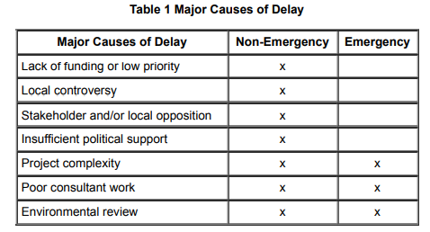

](https://substackcdn.com/image/fetch/f_auto,q_auto:good,fl_progressive:steep/https%3A%2F%2Fbucketeer-e05bbc84-baa3-437e-9518-adb32be77984.s3.amazonaws.com%2Fpublic%2Fimages%2F721ed8d1-099c-4502-9a8a-5e5739f17e0d_478x258.png)

Besides the direct costs of compliance, another potential cost of the NEPA process is the projects that don’t occur at all. The NEPA process is effectively a tax on any major government action, and like any tax, we’d expect it to result in less of what it taxes. Is there any evidence this occurs?

除了合规的直接成本外，NEPA 流程的另一个潜在成本是根本没有发生的项目。 NEPA 流程实际上是对任何重大政府行为征税，并且与任何税收一样，我们预计它会产生较少的税收。 有任何证据表明会发生这种情况吗？

Several industry executives have stated that in some cases they choose not to do projects rather than navigate the NEPA process. The previously quoted mining executive, for instance, testified that “for most projects, the time, cost, and uncertainty of obtaining approvals is simply too great in the United States, and mining investment looks elsewhere. The cumbersome NEPA process is key to this consideration.” And an [executive from Vulcan Materials](https://books.google.com/books?id=Szakw6RcBOYC&pg=PA27&dq=+burden+of+the+process.+In+some+cases+we+conclude+to+not+develop+resources+that+would+be+available+to+us+so+that+we+can+avoid+interaction+with+the+NEPA+process&hl=en&newbks=1&newbks_redir=0&sa=X&ved=2ahUKEwiu_JzU27_5AhVemGoFHeKsAuMQ6AF6BAgEEAI#v=onepage&q=burden%20of%20the%20process.%20In%20some%20cases%20we%20conclude%20to%20not%20develop%20resources%20that%20would%20be%20available%20to%20us%20so%20that%20we%20can%20avoid%20interaction%20with%20the%20NEPA%20process&f=false) noted that “in some cases we conclude that the process is so burdensome we choose to not pursue aggregate resources rather than work through the drawn out and costly NEPA process.” 

一些行业高管表示，在某些情况下，他们选择不做项目而不是通过 NEPA 流程。 例如，之前引用的矿业高管作证说，“对于大多数项目而言，获得批准的时间、成本和不确定性在美国实在是太大了，矿业投资将目光投向了其他地方。 繁琐的 NEPA 流程是这一考虑的关键。” 一位 [Vulcan Materials 的](https://books.google.com/books?id=Szakw6RcBOYC&pg=PA27&dq=+burden+of+the+process.+In+some+cases+we+conclude+to+not+develop+resources+that+would+be+available+to+us+so+that+we+can+avoid+interaction+with+the+NEPA+process&hl=en&newbks=1&newbks_redir=0&sa=X&ved=2ahUKEwiu_JzU27_5AhVemGoFHeKsAuMQ6AF6BAgEEAI#v=onepage&q=burden%20of%20the%20process.%20In%20some%20cases%20we%20conclude%20to%20not%20develop%20resources%20that%20would%20be%20available%20to%20us%20so%20that%20we%20can%20avoid%20interaction%20with%20the%20NEPA%20process&f=false) 高管指出，“在某些情况下，我们得出的结论是，这个过程非常繁琐，我们选择不追求聚合资源，而是通过冗长且昂贵的 NEPA 过程来工作。”

This also seems to occur within government agencies. Stern 2014 found that Forest Service planners alter their plans to make them less ambitious as a way to avoid NEPA lawsuits.

这似乎也发生在政府机构内部。 斯特恩 2014 年发现，林务局规划人员改变了他们的计划，以降低他们的雄心壮志，以此来避免 NEPA 诉讼。

Some evidence is indirect. For instance, a GAO study found that 33 states had avoided taking federal money for highway projects specifically so they could avoid the NEPA process. And Culhane 1990 suggests that NEPA compliance was partly to blame behind the decrease in new Corps of Engineers projects:

有些证据是间接的。 例如，GAO 的一项研究发现，有 33 个州专门避免为高速公路项目收取联邦资金，这样它们就可以避免 NEPA 程序。 Culhane 1990 表明，NEPA 合规性是新工程兵团项目减少的部分原因：

> _Seven short years of EIS commenting and public participation reduced the Corps from its position as the premier powerful agency in the federal bureaucracy to the debacle of President Carter's "hit list."8 " After the "hit list" affair, the Corps endured a severe drought, and authorized no new water projects until 1984._
> 
> _短短七年的 EIS 评论和公众参与，使军团从联邦官僚机构中首屈一指的强大机构的地位沦为卡特总统“黑名单”的崩溃。 8“在“黑名单”事件之后，军团经历了一场严峻的考验。干旱，直到 1984 年才批准新的水利项目。_

Because the NEPA process adds a large review time to the beginning of a project, this sometimes screens off projects that by their nature need to be completed quickly. A Forest Service report noted that a drawn out environmental analysis and litigation process slowed a prescribed burn project meant to reduce the risk of wildfire, and the wildfire eventually occurred:

由于 NEPA 流程会在项目开始时增加大量审查时间，因此有时会筛选出本质上需要快速完成的项目。 林务局的一份报告指出，冗长的环境分析和诉讼程序延缓了旨在降低野火风险的规定燃烧项目，野火最终发生了：

> _In December 1995, a severe winter storm left nearly 35,000 acres of windthrown trees on the Six Rivers National Forest in California. The storm’s effects created catastrophic wildland fire conditions, with the fuel loading reaching an estimated 300 to 400 tons per acre—ten times the manageable level of 30 to 40 tons per acre._ 
> 
> _1995 年 12 月，一场严重的冬季风暴在加利福尼亚州的六河国家森林中留下了近 35,000 英亩的树木被风吹倒。 风暴的影响造成了灾难性的荒地火灾，估计燃料负荷达到每英亩 300 至 400 吨——是每英亩 30 至 40 吨可控水平的十倍。_
> 
> _The forest’s management team proposed a salvage and restoration project to remove excessive fuels and conduct a series of prescribed burns to mitigate the threat to the watershed. From 1996 through the summer of 1999, the forest wrestled its way through analytical and procedural requirements, managing to treat only 1,600 acres._ 
> 
> _The forest’s management team proposed a salvage and restoration project to remove excessive fuels and conduct a series of prescribed burns to mitigate the threat to the watershed. From 1996 through the summer of 1999, the forest wrestled its way through analytical and procedural requirements, managing to treat only 1,600 acres._ 
> 
> _By September 1999, nature would no longer wait. The Megram and Fawn Fires consumed the untreated area, plus another 90,000 acres. Afterward, the forest was required to perform a new analysis of the watershed, because postfire conditions were now very different. A new round of processes began, repeating the steps taken from 1996 to 1999._ 
> 
> _By September 1999, nature would no longer wait. The Megram and Fawn Fires consumed the untreated area, plus another 90,000 acres. Afterward, the forest was required to perform a new analysis of the watershed, because postfire conditions were now very different. A new round of processes began, repeating the steps taken from 1996 to 1999._ 
> 
> _Seven years after the original blowdown, the Megram project was appealed, litigated, and ultimately enjoined by a federal district court. The plan to address the effects of the firestorm—a direct result of the windstorm—remains in limbo._
> 
> _Seven years after the original blowdown, the Megram project was appealed, litigated, and ultimately enjoined by a federal district court. The plan to address the effects of the firestorm—a direct result of the windstorm—remains in limbo._

Because it adds cost and uncertainty to any new major project, NEPA is effectively a bias towards the status quo. As one [environmental lawyer](https://www.martenlaw.com/news-and-insights/climate-change-proponents-meet-nepa-opponents-the-case-for-reforming-americas-bedrock-environmental-law) noted, “NEPA, being procedural and not substantive, is a hefty sword. It stops the projects many groups do like, along with the ones they don’t like.”

Because it adds cost and uncertainty to any new major project, NEPA is effectively a bias towards the status quo. As one [environmental lawyer](https://www.martenlaw.com/news-and-insights/climate-change-proponents-meet-nepa-opponents-the-case-for-reforming-americas-bedrock-environmental-law) noted, “NEPA, being procedural and not substantive, is a hefty sword. It stops the projects many groups do like, along with the ones they don’t like.”

Like with any process that solicits public input, NEPA also seems easily captured by small groups with strongly held opinions, and thus subject to [standard NIMBY effects](https://www.theatlantic.com/ideas/archive/2022/04/local-government-community-input-housing-public-transportation/629625/). In some cases, it seems like NEPA makes projects _unusually_ susceptible to a minority of strong opinions - for instance, [agencies have noted](https://books.google.com/books?id=USWYrvCQHfkC&printsec=frontcover&source=gbs_ge_summary_r&cad=0#v=onepage&q&f=false) that NEPA project challenges often originate from opponents “who are based out of state and not part of the communities they purport to represent.”

与任何征求公众意见的过程一样，NEPA 似乎也很容易被持有强烈意见的小团体所接受，因此受到 [标准的 NIMBY 效应的影响](https://www.theatlantic.com/ideas/archive/2022/04/local-government-community-input-housing-public-transportation/629625/) 。 在某些情况下，NEPA 似乎使项目 _异常_ 容易受到少数强烈意见的影响 - 例如， [机构已经注意到](https://books.google.com/books?id=USWYrvCQHfkC&printsec=frontcover&source=gbs_ge_summary_r&cad=0#v=onepage&q&f=false) NEPA 项目挑战通常来自反对者“他们来自州外而不是他们声称代表的社区的一部分”

It’s easy to find criticism of the NEPA process, but what are the benefits of it?

很容易找到对 NEPA 流程的批评，但它有什么好处呢？

A report from the USDA notes that “the literature points to only a few effects of NEPA upon agencies’ planning processes that are not widely debated”, which are:

美国农业部的一份报告指出，“文献仅指出 NEPA 对机构规划过程的一些影响，这些影响并未引起广泛争论”，它们是：

-   Agency staff becoming less homogenous (staff have a wider range of training and backgrounds)
    
-   Agency staff becoming less homogenous (staff have a wider range of training and backgrounds)
    
    机构工作人员变得不那么同质化（工作人员有更广泛的培训和背景）
    
-   Increased transparency of agency analysis and decision making
    
-   Increased transparency of agency analysis and decision making
    
    提高机构分析和决策的透明度
    
-   A wider range of alternatives for projects is typically considered.
    
-   A wider range of alternatives for projects is typically considered.
    
    通常会考虑范围更广的项目备选方案。
    

But the report notes that “these shifts have come with associated costs of long delays in decision making as analyses are performed and reports are produced, and of high-priced responses to litigation of the agency processes.”

但报告指出，“这些转变伴随着相关成本，即在执行分析和生成报告时决策的长期延迟，以及对机构程序诉讼的高价回应。”

Some agency officials have also admitted that following the NEPA process resulted in considering alternatives that they wouldn’t have otherwise looked at:

一些机构官员也承认，遵循 NEPA 流程导致考虑了他们不会考虑的替代方案：

> _One of our alternatives… I really don’t believe it would have been there but for the public involvement. We had a lot of people say…we just don’t want you to do any timber harvests. We just want you to thin the stuff and leave it. Nothing commercial. And you know, most of us just rolled our eyes and said, “Oh, that’s ridiculous, we can’t possibly do that.” And so, we said “OK, we’ll go through the process honestly and put up with this dumb idea.” Turned out the alternative was very feasible and was really quite reasonable and quite reasonably effective. It wasn’t as effective as some of the other alternatives, but you know, at the start we would have just completely discarded it except that we had a lot of people clamoring for it._
> 
> _我们的替代方案之一……我真的不相信如果没有公众参与，它就不会存在。 我们有很多人说……我们只是不希望您进行任何木材采伐。 我们只希望您将这些东西稀释并留下。 没有任何商业意义。 你知道，我们中的大多数人只是翻了个白眼说，“哦，这太荒谬了，我们不可能那样做。” 因此，我们说：“好吧，我们会诚实地完成整个过程，并容忍这个愚蠢的想法。” 事实证明，替代方案非常可行，而且非常合理且相当有效。 它不像其他一些替代方案那样有效，但你知道，一开始我们会完全放弃它，除非我们有很多人吵着要它。_

The Natural Resources Defense Council (NRDC), an environmental advocacy group and major NEPA champion (they’re part of the [ProtectNEPA.org](https://protectnepa.org/) coalition, for instance), describes the benefits of the NEPA process:

自然资源保护委员会 (NRDC)，一个环境倡导组织和主要的 NEPA 支持者（ [他们是ProtectNEPA.org联盟的一部分）描述了 NEPA 流程的好处：](https://protectnepa.org/) 例如，

> _At the heart of this review process is the agencies' obligation to consider alternatives to their original project designs, which motivates them to think outside the box, resulting in better projects that save money and reduce negative impacts. It also gives members of the public a voice in project design by letting them suggest alternatives, which promotes collaboration in planning and buy-in on final decisions._
> 
> _这一审查过程的核心是各机构有义务考虑其原始项目设计的替代方案，这会促使他们跳出框框思考，从而产生更好的项目，从而节省资金并减少负面影响。 它还让公众成员在项目设计中发表意见，让他们提出备选方案，从而促进规划中的协作和对最终决策的支持。_

And they list a [few examples of successful NEPA processes](https://www.nrdc.org/resources/never-eliminate-public-advice-nepa-success-stories):

他们列出了 [几个成功的 NEPA 流程的例子](https://www.nrdc.org/resources/never-eliminate-public-advice-nepa-success-stories) ：

-   _“In California, the NEPA review process exposed the devastating impacts of the Army Corps of Engineers' plan to dredge the Bolinas Lagoon, one of the most pristine tidal lagoons in the state. While the proposal aimed to prevent silting in the lagoon, environmental reviews actually found that it would increase siltation. As a result, this misguided plan was abandoned in 2001, saving taxpayers $133 million. “_
    
-   _“In California, the NEPA review process exposed the devastating impacts of the Army Corps of Engineers' plan to dredge the Bolinas Lagoon, one of the most pristine tidal lagoons in the state. While the proposal aimed to prevent silting in the lagoon, environmental reviews actually found that it would increase siltation. As a result, this misguided plan was abandoned in 2001, saving taxpayers $133 million. “_
    
    _“In California, the NEPA review process exposed the devastating impacts of the Army Corps of Engineers' plan to dredge the Bolinas Lagoon, one of the most pristine tidal lagoons in the state. While the proposal aimed to prevent silting in the lagoon, environmental reviews actually found that it would increase siltation. As a result, this misguided plan was abandoned in 2001, saving taxpayers $133 million. “_
    
-   _“The Department of Housing and Urban Development (HUD) proposed to construct the Palestine Commons Senior Living Facility project -- 69-units of elderly housing in a three-story structure in Kansas City, Missouri. HUD planned to build the facility on an old petroleum-tank site to contribute to Kansas City's redevelopment plan and support community revitalization. However, the NEPA process revealed potential soil and groundwater contamination on the site. Thanks to this law, the project plan was modified to include site remediation and thereby protect the facility's future residents.”_
    
-   _“The Department of Housing and Urban Development (HUD) proposed to construct the Palestine Commons Senior Living Facility project -- 69-units of elderly housing in a three-story structure in Kansas City, Missouri. HUD planned to build the facility on an old petroleum-tank site to contribute to Kansas City's redevelopment plan and support community revitalization. However, the NEPA process revealed potential soil and groundwater contamination on the site. Thanks to this law, the project plan was modified to include site remediation and thereby protect the facility's future residents.”_
    
    _“The Department of Housing and Urban Development (HUD) proposed to construct the Palestine Commons Senior Living Facility project -- 69-units of elderly housing in a three-story structure in Kansas City, Missouri. HUD planned to build the facility on an old petroleum-tank site to contribute to Kansas City's redevelopment plan and support community revitalization. However, the NEPA process revealed potential soil and groundwater contamination on the site. Thanks to this law, the project plan was modified to include site remediation and thereby protect the facility's future residents.”_
    
-   _“The Route 52 causeway between Ocean City and Somers Point, first built in the 1930's, faced restricted lane and speed usage as it fell into disrepair, and the lack of shoulders posed a safety hazard to motorists. New Jersey and the Federal Highway Administration sought to rebuild the route to better serve the area. Thanks to input from area residents and other federal agencies during the NEPA process, the final environmental impact statement identified an alternative that minimized the route's environmental and socioeconomic impacts. For example, the final project avoided potentially extensive dredging and damage to wetlands as well as extensive property takings and changes in land usage. New bike paths, walking trails, and boat ramps are part of the causeway and mitigation measures were taken to account for the limited dredging and wetlands loss. Construction was finished in 2012.”_
    
-   _“The Route 52 causeway between Ocean City and Somers Point, first built in the 1930's, faced restricted lane and speed usage as it fell into disrepair, and the lack of shoulders posed a safety hazard to motorists. New Jersey and the Federal Highway Administration sought to rebuild the route to better serve the area. Thanks to input from area residents and other federal agencies during the NEPA process, the final environmental impact statement identified an alternative that minimized the route's environmental and socioeconomic impacts. For example, the final project avoided potentially extensive dredging and damage to wetlands as well as extensive property takings and changes in land usage. New bike paths, walking trails, and boat ramps are part of the causeway and mitigation measures were taken to account for the limited dredging and wetlands loss. Construction was finished in 2012.”_
    
    _“大洋城和 Somers Point 之间的 52 号公路堤道始建于 1930 年代，由于年久失修而面临车道和速度使用限制，而且缺少路肩对驾车者构成安全隐患。 新泽西州和联邦公路管理局试图重建这条路线，以更好地为该地区服务。 多亏了地区居民和其他联邦机构在 NEPA 过程中的投入，最终的环境影响报告确定了一个替代方案，可以最大限度地减少该路线的环境和社会经济影响。 例如，最终项目避免了潜在的大规模疏浚和对湿地的破坏，以及大规模的财产征用和土地用途的改变。 新的自行车道、步行道和船坡道是堤道的一部分，并采取了缓解措施来解决有限的疏浚和湿地损失。 施工于 2012 年完成。”_
    

(Many more available at the link)

（更多可用链接）

NEPA is often described by proponents as “a tool to make decisions” - the CEQ regulations, for instance, state that “The NEPA process is intended to help public officials make decisions that are based on understanding of environmental consequences” and that “NEPAs purpose…is to foster excellent action.” But it’s unclear how successful it is at this. In a survey of 25 NEPA officials, only 4 described the quality of decision as mattering for whether the NEPA process was successful or not, and that “staff interviewed in this study tended to focus more upon the processes through which they could complete the procedural requirements of the act with least resistance.” A [1986 study](https://link.springer.com/content/pdf/10.1007/BF00404266.pdf) of environmental impact statements found that only 30% accurately predicted a project's impacts, with most too vague or abstract to evaluate. It also seems telling that no organizations I’m aware of _willingly_ adopt the NEPA process.

NEPA 经常被支持者描述为“做出决定的工具”——例如，CEQ 规定“NEPA 过程旨在帮助公职人员根据对环境后果的理解做出决定”和“NEPA 的目的……是培养优秀的行动。” 但目前尚不清楚它在这方面的成功程度。 在对 25 名 NEPA 官员的调查中，只有 4 名官员将决策质量描述为对 NEPA 流程是否成功至关重要，并且“本研究中受访的工作人员倾向于更多地关注他们可以完成程序要求的流程阻力最小的行为。” 对环境影响报告的一项 [1986 年](https://link.springer.com/content/pdf/10.1007/BF00404266.pdf) 研究发现，只有 30% 的人准确预测了项目的影响，其中大多数过于模糊或抽象而无法评估。 这似乎也表明，据我所知，没有任何组织 _愿意_ 采用 NEPA 流程。

Reading through examples of successful NEPA processes, it seems as if the purpose of the NEPA process as it exists is to try and _legislate good project management_ - ensure that requirements are gathered upfront, the relevant laws are considered, many possible solutions are proposed, relevant stakeholders are brought on board and have their views considered, etc. - and that many examples of NEPA “successes” (such as “ensuring compliance with all relevant laws”) are things that a competent project manager would have done anyway.

通过阅读成功的 NEPA 流程的例子，似乎 NEPA 流程的存在目的是尝试和 _立法良好的项目管理_ \- 确保预先收集需求，考虑相关法律，提出许多可能的解决方案，相关利益相关者被带入董事会并考虑他们的意见等 - 并且 NEPA“成功”的许多例子（例如“确保遵守所有相关法律”）是一个称职的项目经理无论如何都会做的事情。

Overall, it seems like NEPA has some level of success at improving average project outcomes (probably by screening off certain types of extremely poor planning), but if you think the government needs to be better at project management there are probably better ways of doing that. And of course, any success would have to be balanced against the large costs that the NEPA process incurs.

总体而言，NEPA 似乎在提高平均项目成果方面取得了一定程度的成功（可能是通过筛选出某些类型的极差规划），但如果您认为政府需要更好地进行项目管理，则可能有更好的方法来做到这一点. 当然，任何成功都必须与 NEPA 流程产生的巨大成本相平衡。

The more you look at NEPA, the more it seems like a very strange law.

你越看 NEPA，就越觉得这是一条很奇怪的法律。

Arguably, the purpose of a law is two-fold:

可以说，法律的目的有两个：

1.  **To prevent or encourage some particular thing that society thinks is good/bad**. Laws against drunk driving exist, for instance, because drunk driving is harmful and as a society we want less of it.
    
2.  **To solve coordination problems and create predictability.** Laws that enforce driving on one side of the road and not the other, for instance, exist not because one side is better than the other but because it’s useful if everyone agrees, and everyone knows what to expect from other drivers.
    

1.  **阻止或鼓励社会认为好的/坏的某些特定事物** 。 例如，存在反对酒后驾车的法律，因为酒后驾车是有害的，而且作为一个社会，我们希望减少酒后驾车。
    
2.  **解决协调问题并创造可预测性。** 例如，强制在道路一侧而不是另一侧行驶的法律之所以存在，并不是因为一侧比另一侧更好，而是因为如果每个人都同意，并且每个人都知道对其他司机的期望是什么，那么它就会有用。
    

NEPA arguably does _neither_ of these things.

NEPA 可以说 _都不做。_ 这两件事

For the first, as we’ve seen NEPA does not require environmental impacts be limited, only thoroughly documented through a specific process. (To the extent that NEPA does result in reduced environmental impacts, it seems like an indirect effect of making doing _anything_ procedurally costly.) And the thing that NEPA does create directly - additional government process - is something we want less of.

For the first, as we’ve seen NEPA does not require environmental impacts be limited, only thoroughly documented through a specific process. (To the extent that NEPA does result in reduced environmental impacts, it seems like an indirect effect of making doing _anything_ procedurally costly.) And the thing that NEPA does create directly - additional government process - is something we want less of.

For the second, NEPA doesn’t create predictability. In fact, it greatly _reduces_ predictability and _increases_ coordination cost and risk, because it’s so unclear what’s needed to meet NEPA requirements. Agencies are forced into risk-reduction strategies that at best require spending significant time and resources to defend against possible litigation, and at worst mean projects don’t happen at all.

其次，NEPA 不会创造可预测性。 事实上，它大大 _降低了_ 可预测性并 _增加了_ 协调成本和风险，因为满足 NEPA 要求所需的条件非常不清楚。 机构被迫采取风险降低策略，充其量需要花费大量时间和资源来抵御可能的诉讼，最坏的情况是项目根本不会发生。

\[0\] - This is in contrast to CEQA, which does require that environmental impacts be mitigated.

\[0\] - 这与 CEQA 形成对比，后者确实要求减轻环境影响。

\[1\] - The Department of Energy isn’t necessarily the most representative agency with respect to NEPA implementation, but much more data is available for it - between 1994 and 2017 the DoE issued a quarterly “NEPA best practices” newsletter that included, among other things, costs and completion times for EISs and EAs.

\[1\] - 在 NEPA 实施方面，能源部不一定是最具代表性的机构，但可以获得更多数据 - 1994 年至 2017 年间，美国能源部发布了季度“NEPA 最佳实践”通讯，其中包括EIS 和 EA 的其他事项、成本和完成时间。
