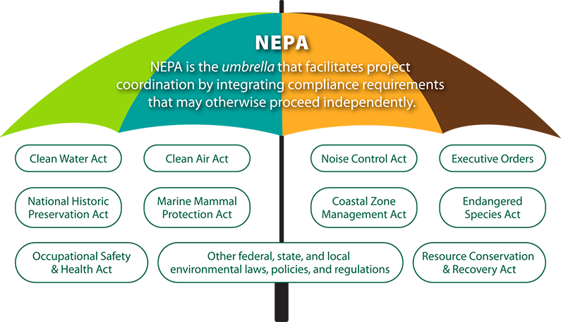

## Introduction

## 介绍

In the aftermath of the Inflation Reduction Act’s passage, congressional leaders are preparing to tackle permitting reform. Some activists have [called on](https://www.washingtonpost.com/politics/2022/09/09/permitting-bill-could-pass-over-objections-liberals-activists/) lawmakers to stay away from any reforms to the National Environmental Policy Act (NEPA) and the broader environmental review process it helms, arguing that the landmark environmental bill is key to preventing climate change.

在通货膨胀减少法案通过后，国会领导人正准备解决许可改革问题。 一些活动家 [呼吁](https://www.washingtonpost.com/politics/2022/09/09/permitting-bill-could-pass-over-objections-liberals-activists/) 立法者不要对《国家环境政策法》(NEPA) 及其主导的更广泛的环境审查程序进行任何改革，他们认为具有里程碑意义的环境法案是防止气候变化的关键。

But those activists are misguided: the NEPA process as it currently exists is slowing down the clean energy transition and is long overdue for reform. NEPA imposes massive costs on the federal government, drags clean energy projects out for years, and generates uncertainty that stops other projects from ever getting off the ground. With targeted reforms, Congress can unlock critical clean energy projects that are currently being stifled.

但这些积极分子被误导了：目前存在的 NEPA 进程正在减缓清洁能源转型，早就应该进行改革了。 NEPA 给联邦政府带来了巨大的成本，拖延了多年的清洁能源项目，并产生了阻止其他项目启动的不确定性。 通过有针对性的改革，国会可以解锁目前被扼杀的关键清洁能源项目。

## How NEPA works

## NEPA 是如何运作的

NEPA was passed in 1969 as an attempt to infuse environmental considerations in federal decision making. It requires that a “detailed statement” describing significant environmental impacts of “major” federal actions be produced before the action can begin. In practice, a major federal action can be anything from creating a new policy or procedure, to building a new project, to issuing a license or permit.

NEPA 于 1969 年通过，旨在将环境因素纳入联邦决策制定中。 它要求在行动开始之前制定一份描述“重大”联邦行动对环境的重大影响的“详细声明”。 在实践中，一项重大的联邦行动可以是任何事情，从制定新政策或程序，到建设新项目，再到颁发执照或许可证。

NEPA is an environmental protection statute, but its benefits to the environment are at best uncertain. Though it was originally intended to force government agencies to place greater weight on environmental considerations, as it exists today NEPA is a procedural statute. NEPA doesn’t require that agencies place any particular weight on environmental concerns, only that they be documented thoroughly. “Success” in terms of the law is measured by comprehensive documentation, not environmental benefits. As one agency official described it, “you can pave paradise with a NEPA document.”

NEPA 是一项环境保护法规，但它对环境的好处充其量是不确定的。 尽管它最初的目的是迫使政府机构更加重视环境因素，但 NEPA 现在已经成为一项程序性法规。 NEPA 不要求各机构特别重视环境问题，只要求对它们进行彻底记录。 法律意义上的“成功”是通过综合文件来衡量的，而不是环境效益。 正如一位机构官员所描述的那样，“你可以用 NEPA 文件铺平天堂。”

Over time, NEPA has evolved into a tiered system of analysis. At the lowest level, actions that have previously been found not to have significant environmental effects can receive a categorical exclusion (CE), meaning federal agencies don’t need to write a detailed statement regarding them. For instance, the FAA has determined that the [acquisition of snow blower equipment](https://www.faa.gov/airports/central/environmental/catex) can be categorically excluded. Categorical exclusions make up the largest fraction of NEPA analyses. 

随着时间的推移，NEPA 已经演变成一个分层分析系统。 在最低级别，以前被发现不会对环境产生重大影响的行动可以得到绝对排除 (CE)，这意味着联邦机构不需要就它们编写详细的声明。 例如，美国联邦航空局已确定 [购置吹雪机设备](https://www.faa.gov/airports/central/environmental/catex) 可以明确排除 。 类别排除占 NEPA 分析的最大部分。

If an action clearly will have major environmental effects, those effects must be described in an environmental impact statement (EIS), a detailed analysis that often takes years to complete and can reach thousands of pages in length. The construction of a new highway, for instance, typically requires an environmental impact statement. An EIS also requires that the public be notified of the potential impacts of the action, and be given a chance to respond. Because of this, NEPA is sometimes referred to as a “sunshine law” that creates greater government transparency.

如果某项行动明显会产生重大环境影响，则必须在环境影响报告 (EIS) 中描述这些影响，这是一份详细的分析，通常需要数年才能完成，并且可能长达数千页。 例如，建设一条新高速公路通常需要一份环境影响报告。 EIS 还要求将行动的潜在影响告知公众，并让公众有机会做出回应。 正因为如此，NEPA 有时被称为“阳光法”，可以提高政府的透明度。

If it’s unclear whether the action will have significant effects, an environmental assessment (EA) is performed; it’s similar to an EIS, but generally less involved. The issuing of a launch permit for [SpaceX’s Boca Chica facility](https://www.faa.gov/sites/faa.gov/files/2022-06/20220613%20SpaceX%20Starship%20Super%20Heavy%20at%20Boca%20Chica_FONSI_ROD%20Final.pdf) in Texas, for instance, required an environmental assessment. Assessments that find actions are likely to have no significant impacts issue a Finding of No Significant Impact (FONSI). If an action is close enough to the threshold, project developers may take mitigating measures to bring their net environmental impacts below the threshold of significance and avoid a full EIS — this is known as a “mitigated FONSI”.

如果不清楚该行动是否会产生重大影响，则进行环境评估 (EA)； 它类似于 EIS，但通常较少涉及。 颁发发射许可证 [为SpaceX 位于德克萨斯州的博卡奇卡设施](https://www.faa.gov/sites/faa.gov/files/2022-06/20220613%20SpaceX%20Starship%20Super%20Heavy%20at%20Boca%20Chica_FONSI_ROD%20Final.pdf) 例如， 需要进行环境评估。 发现行动可能没有重大影响的评估会发布无重大影响的调查结果 (FONSI)。 如果某项行动足够接近阈值，项目开发商可能会采取缓解措施，将其净环境影响降低到重要阈值以下，并避免完全 EIS——这被称为“缓解的 FONSI”。

NEPA is implemented on an agency-by-agency level. Each federal agency has its own NEPA procedures, its own list of categorical exclusions, and its own staff for managing the process. This decentralized system leads to a great deal of variation in how NEPA is administered. Some agencies perform few NEPA actions, some perform many. Some are able to complete an analysis comparatively quickly, while others take an exceedingly long time. The Corps of Engineers, for instance, produces environmental assessments that are [usually fewer than 100 pages](https://www.sam.usace.army.mil/Missions/Planning-Environmental/Environmental-Assessments/), while ones produced by the FAA [are often thousands of pages in length](https://faabostonworkshops.com/).

NEPA 在逐个机构层面实施。 每个联邦机构都有自己的 NEPA 程序、自己的绝对排除列表以及自己的管理流程的人员。 这种分散的系统导致 NEPA 的管理方式发生很大变化。 有些机构执行的 NEPA 行动很少，有些执行很多。 一些能够相对快速地完成分析，而另一些则需要非常长的时间。 例如，工程兵团制作的环境评估通常 [少于 100 页](https://www.sam.usace.army.mil/Missions/Planning-Environmental/Environmental-Assessments/) ，而美国联邦航空局制作的环境评估 [通常长达数千页](https://faabostonworkshops.com/) 。

The lack of centralization has also resulted in poor data on NEPA analyses. While environmental impact statements are tracked (the U.S. currently produces [around 100 final EISs per year](https://naep.memberclicks.net/assets/annual-report/NEPA_Annual_Report_2021.pdf), a figure which has been trending down over time), less is known about the number of CEs and EAs (though it’s likely in the range of 5,000 to 10,000 EAs and 35,000 to 45,000 CEs per year).

缺乏集中化还导致 NEPA 分析数据不佳。 虽然跟踪了环境影响报告（美国目前 [每年产生大约 100 个最终 EIS](https://naep.memberclicks.net/assets/annual-report/NEPA_Annual_Report_2021.pdf) ，这个数字随着时间的推移呈下降趋势），但对 CE 和 EA 的数量知之甚少（尽管可能在 5,000 到 10,000 之间） EA 和每年 35,000 到 45,000 个 CE）。

NEPA supporters [point to case studies](https://www.nrdc.org/resources/never-eliminate-public-advice-nepa-success-stories#:~:text=The%20NEPA%20process%20has%20saved,participated%20in%20important%20federal%20decisions.) where the process resulted in better outcomes. However, because NEPA often acts as an “umbrella” statute to structure the entire environmental review process, it’s not obvious which benefits are the result of NEPA and which are due to other environmental laws (such as the Clean Air Act or the National Forest Management Act), or simply the result of competent project management. A [2014 GAO report](https://www.gao.gov/products/gao-14-370#:~:text=Little%20information%20exists%20on%20the,and%20other%20agencies%20GAO%20reviewed.) noted that “little information exists on the costs and benefits of completing a NEPA analysis”, and a [2009 USDA report](https://web.archive.org/web/20170513075517/https://www.fs.fed.us/pnw/pubs/pnw_gtr799.pdf) stated that “gauging NEPA’s true impact can be challenging” and that “the literature points to only a few effects of NEPA…on planning processes that are not widely debated” (these included a broader consideration of alternatives, and greater transparency of agency analyses). A [study of environmental impact statements](https://heinonline.org/HOL/LandingPage?handle=hein.journals/envlnw46&div=40&id=&page=) for oil and gas land management plans produced by the Bureau of Land Management, for instance, found that the NEPA process resulted in a decrease in land area disturbed, but a slight increase in the number of wells drilled (though this latter effect was not statistically significant).

NEPA 的支持者 [指出了案例研究，](https://www.nrdc.org/resources/never-eliminate-public-advice-nepa-success-stories#:~:text=The%20NEPA%20process%20has%20saved,participated%20in%20important%20federal%20decisions.) 在这些案例研究中，该过程产生了更好的结果。 然而，由于 NEPA 通常作为构建整个环境审查过程的“保护伞”法规，因此不清楚哪些收益是 NEPA 的结果，哪些是其他环境法（例如清洁空气法或国家森林管理法）的结果行动），或者仅仅是称职的项目管理的结果。 一份 [2014 年的 GAO 报告](https://www.gao.gov/products/gao-14-370#:~:text=Little%20information%20exists%20on%20the,and%20other%20agencies%20GAO%20reviewed.) 指出，“关于完成 NEPA 分析的成本和收益的信息很少”， [2009 年美国农业部的一份报告](https://web.archive.org/web/20170513075517/https://www.fs.fed.us/pnw/pubs/pnw_gtr799.pdf) 指出，“衡量 NEPA 的真正影响可能具有挑战性”，并且“文献仅指出了一些影响NEPA……关于未被广泛讨论的规划流程”（其中包括对备选方案的更广泛考虑，以及机构分析的更高透明度）。 尽管 [（](https://heinonline.org/HOL/LandingPage?handle=hein.journals/envlnw46&div=40&id=&page=) 例如，土地管理局对油气土地管理计划的环境影响报告进行的一项研究发现，NEPA 过程导致受干扰的土地面积减少，但钻井数量略有增加 后者的影响在统计学上并不显着）。

On the other hand, the costs of NEPA are more apparent. The USDA report notes that the aforementioned benefits of NEPA came “with associated costs of long delays in decision making as analyses are performed and reports are produced, and of high-priced responses to litigation of the agency processes.” 

另一方面，NEPA 的成本更为明显。 美国农业部的报告指出，NEPA 的上述好处带来了“在执行分析和生成报告时决策制定长期延迟的相关成本，以及对机构流程诉讼的高价回应。”

The costs of NEPA can be broken into three categories — money, time, and uncertainty.

NEPA 的成本可以分为三类——金钱、时间和不确定性。

## Monetary cost

## 货币成本

The monetary costs of performing a NEPA analysis are often significant. Even a categorical exclusion, which documents actions that have already been determined to have no significant impacts, can be expensive. The Forest Service, for instance, [testified in 2007](https://books.google.com/books?id=Tvg2OBjfA5cC&printsec=frontcover&dq=categorical+exclusions&hl=en&newbks=1&newbks_redir=0&sa=X&ved=2ahUKEwi09LXa-L75AhUUm2oFHTjwCHgQ6AF6BAgIEAI#v=onepage&q=50%2C000&f=false) that a categorical exclusion will typically cost them $50,000 to complete (for reference, the Forest Service completes more than 1,000 categorical exclusions a year).

执行 NEPA 分析的货币成本通常很高。 即使是记录已确定不会产生重大影响的行为的绝对排除也可能代价高昂。 例如，林务局 [在 2007 年作证说](https://books.google.com/books?id=Tvg2OBjfA5cC&printsec=frontcover&dq=categorical+exclusions&hl=en&newbks=1&newbks_redir=0&sa=X&ved=2ahUKEwi09LXa-L75AhUUm2oFHTjwCHgQ6AF6BAgIEAI#v=onepage&q=50%2C000&f=false) ，完成绝对排除通常需要 50,000 美元（作为参考，林务局每年完成超过 1,000 次绝对排除）。

Higher tiers of analysis can be significantly more expensive. In the same testimony, the Forest Service noted its costs for completing an environmental assessment and an environmental impact statement were $200,000 and $1,000,000, respectively. And while the costs of CEs and EAs are somewhat capped, the cost of an EIS is unbounded in practice. As of 2016, the average cost for a DOE environmental impact statement [was $6 million](https://www.energy.gov/sites/default/files/2017/03/f34/LLQR_2017-03_0.pdf), and particularly complex EISs might cost in the tens of millions. (The DOE is one of the only agencies that has tracked and made available cost data for their NEPA analyses.)

更高层次的分析可能会更加昂贵。 在同一份证词中，林业局指出其完成环境评估和环境影响报告的成本分别为 200,000 美元和 1,000,000 美元。 虽然 CE 和 EA 的成本有些上限，但 EIS 的成本在实践中是无限的。 截至 2016 年，DOE 环境影响报告的平均成本 [为 600 万美元](https://www.energy.gov/sites/default/files/2017/03/f34/LLQR_2017-03_0.pdf) ，特别复杂的 EIS 可能花费数千万美元。 （美国能源部是为他们的 NEPA 分析跟踪并提供成本数据的仅有的机构之一。）

## Time cost

## 时间成本

More significant than the money, however, is the cost in time. Even categorical exclusions often require significant time to complete. As of 2018, a [Forest Service CE took a median of 105 days to complete](https://academic.oup.com/jof/article/118/4/403/5825558). Prior to a rule change that allowed state DOTs to make their own categorical exclusion determinations, the Federal Highway Administration (FHWA) in some cases [took a year or more to complete CEs](https://books.google.com/books?id=ydKvYBMSqN0C&pg=PA51&dq=existing+operational+right-of-way+fhwa+categorical+exclusion&hl=en&newbks=1&newbks_redir=0&sa=X&ved=2ahUKEwi5k834uOD5AhUmSzABHThPA1wQ6AF6BAgGEAI#v=onepage&q=existing%20operational%20right-of-way%20fhwa%20categorical%20exclusion&f=false). A bridge in Florida that collapsed in 2004 following Hurricane Ivan [took several months](https://rosap.ntl.bts.gov/view/dot/11293) to issue the categorical exclusion for its replacement, due to a backlogged Coast Guard. (The lack of available NEPA data means that, for most agencies, the time to complete a CE is unknown.)

然而，比金钱更重要的是时间成本。 即使是分类排除通常也需要很长时间才能完成。 截至 2018 年， [完成林务局 CE 的中位数为 105 天](https://academic.oup.com/jof/article/118/4/403/5825558) 。 在允许州 DOT 做出自己的绝对排除决定的规则更改之前，联邦公路管理局 (FHWA) 在某些情况下 [需要一年或更长时间才能完成 CE](https://books.google.com/books?id=ydKvYBMSqN0C&pg=PA51&dq=existing+operational+right-of-way+fhwa+categorical+exclusion&hl=en&newbks=1&newbks_redir=0&sa=X&ved=2ahUKEwi5k834uOD5AhUmSzABHThPA1wQ6AF6BAgGEAI#v=onepage&q=existing%20operational%20right-of-way%20fhwa%20categorical%20exclusion&f=false) 。 佛罗里达州的一座桥梁在 2004 年飓风伊万之后倒塌， [花了几个月的时间](https://rosap.ntl.bts.gov/view/dot/11293) 由于海岸警卫队积压， 才发布了更换桥梁的明确排除。 （缺乏可用的 NEPA 数据意味着，对于大多数机构而言，完成 CE 的时间是未知的。）

Higher tiers of analysis take far longer. The average EIS completion time across all agencies [is currently at 4.5 years](https://naep.memberclicks.net/assets/annual-report/NEPA_Annual_Report_2021.pdf), with some agencies taking significantly longer. The FHWA, for instance, took on average 8.6 years to complete an EIS as of 2021. These analyses must be completed before construction begins on a project.

更高层次的分析需要更长的时间。 目前，所有机构的 EIS 平均完成时间 [为 4.5 年](https://naep.memberclicks.net/assets/annual-report/NEPA_Annual_Report_2021.pdf) ，一些机构需要更长的时间。 例如，截至 2021 年，FHWA 平均需要 8.6 年时间才能完成 EIS。这些分析必须在项目开始施工之前完成。

In some cases, the time required for a NEPA analysis has prevented the project from happening at all. In 1999, for instance, [delays in the NEPA process](https://books.google.com/books?id=r9Ok9HemyM4C&pg=PA38&lpg=PA38&dq=In+December+1995,+a+severe+winter+storm+left+nearly+35,000+acres+of+windthrown+trees+on+the+Six+Rivers+National+Forest+in+California.+The+storm%E2%80%99s+effects+created+catastrophic+wildland+fire+conditions,+with+the+fuel+loading+reaching+an+estimated+300+to+400+tons+per+acre%E2%80%94ten+times+the+manageable+level+of+30+to+40+tons+per+acre.+The+forest%E2%80%99s+management+team+proposed+a+salvage+and+restoration+project+to+remove+excessive+fuels+and+conduct+a+series+of+prescribed+burns+to+mitigate+the+threat+to+the+watershed.+From+1996+through+the+summer+of+1999,+the+forest+wrestled+its+way+through+analytical+and+procedural+requirements,+managing+to+treat+only+1,600+acres.&source=bl&ots=iJPrjbiu7I&sig=ACfU3U1I3tXHThLd-teOJO-IMLzXPjLOvg&hl=en&sa=X&ved=2ahUKEwiYrNPWnIb6AhXklmoFHfORCZ0Q6AF6BAgtEAM#v=onepage&q=In%20December%201995%2C%20a%20severe%20winter%20storm%20left%20nearly%2035%2C000%20acres%20of%20windthrown%20trees%20on%20the%20Six%20Rivers%20National%20Forest%20in%20California.%20The%20storm%E2%80%99s%20effects%20created%20catastrophic%20wildland%20fire%20conditions%2C%20with%20the%20fuel%20loading%20reaching%20an%20estimated%20300%20to%20400%20tons%20per%20acre%E2%80%94ten%20times%20the%20manageable%20level%20of%2030%20to%2040%20tons%20per%20acre.%20The%20forest%E2%80%99s%20management%20team%20proposed%20a%20salvage%20and%20restoration%20project%20to%20remove%20excessive%20fuels%20and%20conduct%20a%20series%20of%20prescribed%20burns%20to%20mitigate%20the%20threat%20to%20the%20watershed.%20From%201996%20through%20the%20summer%20of%201999%2C%20the%20forest%20wrestled%20its%20way%20through%20analytical%20and%20procedural%20requirements%2C%20managing%20to%20treat%20only%201%2C600%20acres.&f=false) for the prescribed burning of the Six Rivers National Forest resulted in the wildfire that the prescribed burning was meant to prevent from occuring.

在某些情况下，NEPA 分析所需的时间导致项目根本无法进行。 例如，1999 年， [六河国家森林的规定焚烧NEPA 程序的延误](https://books.google.com/books?id=r9Ok9HemyM4C&pg=PA38&lpg=PA38&dq=In+December+1995,+a+severe+winter+storm+left+nearly+35,000+acres+of+windthrown+trees+on+the+Six+Rivers+National+Forest+in+California.+The+storm%E2%80%99s+effects+created+catastrophic+wildland+fire+conditions,+with+the+fuel+loading+reaching+an+estimated+300+to+400+tons+per+acre%E2%80%94ten+times+the+manageable+level+of+30+to+40+tons+per+acre.+The+forest%E2%80%99s+management+team+proposed+a+salvage+and+restoration+project+to+remove+excessive+fuels+and+conduct+a+series+of+prescribed+burns+to+mitigate+the+threat+to+the+watershed.+From+1996+through+the+summer+of+1999,+the+forest+wrestled+its+way+through+analytical+and+procedural+requirements,+managing+to+treat+only+1,600+acres.&source=bl&ots=iJPrjbiu7I&sig=ACfU3U1I3tXHThLd-teOJO-IMLzXPjLOvg&hl=en&sa=X&ved=2ahUKEwiYrNPWnIb6AhXklmoFHfORCZ0Q6AF6BAgtEAM#v=onepage&q=In%20December%201995%2C%20a%20severe%20winter%20storm%20left%20nearly%2035%2C000%20acres%20of%20windthrown%20trees%20on%20the%20Six%20Rivers%20National%20Forest%20in%20California.%20The%20storm%E2%80%99s%20effects%20created%20catastrophic%20wildland%20fire%20conditions%2C%20with%20the%20fuel%20loading%20reaching%20an%20estimated%20300%20to%20400%20tons%20per%20acre%E2%80%94ten%20times%20the%20manageable%20level%20of%2030%20to%2040%20tons%20per%20acre.%20The%20forest%E2%80%99s%20management%20team%20proposed%20a%20salvage%20and%20restoration%20project%20to%20remove%20excessive%20fuels%20and%20conduct%20a%20series%20of%20prescribed%20burns%20to%20mitigate%20the%20threat%20to%20the%20watershed.%20From%201996%20through%20the%20summer%20of%201999%2C%20the%20forest%20wrestled%20its%20way%20through%20analytical%20and%20procedural%20requirements%2C%20managing%20to%20treat%20only%201%2C600%20acres.&f=false) 导致了规定焚烧旨在防止发生的野火。

## Cost of uncertainty

## 不确定性成本

But the largest impact of NEPA is the uncertainty it injects into the project process. Agencies can be sued under the Administrative Procedure Act for not properly complying with NEPA, and in practice often are — the DOJ noted that NEPA is the [most litigated environmental statute](https://crsreports.congress.gov/product/pdf/IF/IF11932). While a NEPA lawsuit can’t completely stop a project, it can slow it down to the point where it’s no longer attractive to pursue, an outcome that is often specifically targeted by opposition groups — as [one activist opposing a missile defense project stated](https://books.google.com/books?id=IwCOAgAAQBAJ&pg=PA60&dq=the+hope+is+that+delay+%5Boccasioned+by+NEPA+litigation%5D+will+lead+to+cancellation...That%E2%80%99s+what+we+always+hope+for+in+these+suits&hl=en&newbks=1&newbks_redir=0&sa=X&ved=2ahUKEwi8vbaGgc75AhVjhIkEHR7nA3sQ6AF6BAgFEAI#v=onepage&q=the%20hope%20is%20that%20delay%20%5Boccasioned%20by%20NEPA%20litigation%5D%20will%20lead%20to%20cancellation...That%E2%80%99s%20what%20we%20always%20hope%20for%20in%20these%20suits&f=false), “the hope is that delay \[occasioned by NEPA litigation\] will lead to cancellation…That’s what we always hope for in these suits.”

但 NEPA 的最大影响是它给项目过程注入了不确定性。 根据《行政程序法》，可以根据行政程序法起诉机构未适当遵守 NEPA，而且在实践中经常如此——司法部指出 NEPA 是诉讼最多的 [环境法规](https://crsreports.congress.gov/product/pdf/IF/IF11932) 。 虽然 NEPA 诉讼不能完全阻止一个项目，但它可以将其放慢到不再有吸引力的程度，反对派团体通常专门针对这一结果——正如一位反对导弹防御项目的活动家所说 [，](https://books.google.com/books?id=IwCOAgAAQBAJ&pg=PA60&dq=the+hope+is+that+delay+%5Boccasioned+by+NEPA+litigation%5D+will+lead+to+cancellation...That%E2%80%99s+what+we+always+hope+for+in+these+suits&hl=en&newbks=1&newbks_redir=0&sa=X&ved=2ahUKEwi8vbaGgc75AhVjhIkEHR7nA3sQ6AF6BAgFEAI#v=onepage&q=the%20hope%20is%20that%20delay%20%5Boccasioned%20by%20NEPA%20litigation%5D%20will%20lead%20to%20cancellation...That%E2%80%99s%20what%20we%20always%20hope%20for%20in%20these%20suits&f=false) “希望 \[由 NEPA 诉讼引起的\] 延迟将导致取消……这就是我们在这些诉讼中一直希望的。”

Although [more than one in 10](https://dc.law.utah.edu/cgi/viewcontent.cgi?article=1008&context=stegner_pubs) court cases brought over NEPA receive a temporary or permanent injunction, the threat of litigation shapes project outcomes even when it never occurs. Federal agencies spend significant time and effort to make their documents “litigation proof”, and often perform analyses that serve no purpose other than as litigation defense. [A 2014 study of the Forest Service](https://www.tandfonline.com/doi/abs/10.1080/09640568.2013.849232) noted that “team members felt pressure to include what they considered to be otherwise unnecessary information in their NEPA documents.” These incentives cause NEPA analyses to stretch far beyond the “recommended” lengths. The Council on Environmental Quality’s NEPA regulations, for instance, state that most EISs should be fewer than 150 pages, but as of 2018 [the average EIS was 661 pages](https://ceq.doe.gov/docs/nepa-practice/CEQ_EIS_Length_Report_2020-6-12.pdf) (including appendices). [As one study noted](https://www.cambridge.org/core/journals/environmental-practice/article/abs/environmental-reviews-and-case-studies-streamlining-the-national-environmental-policy-act-process/785DC9661B1A823D5A66E54E93647176), “regulations governing excessive paperwork are unfortunately routinely ignored by federal agencies, their state partners, and project proponents, which unwisely seek to provide every possible answer to any conceivable question that might be asked by anyone during the review cycle.”

尽管 [有超过十分之一](https://dc.law.utah.edu/cgi/viewcontent.cgi?article=1008&context=stegner_pubs) NEPA 提起的诉讼案件中 收到了临时或永久禁令，但诉讼的威胁会影响项目的结果，即使它从未发生过。 联邦机构花费大量时间和精力使他们的文件成为“诉讼证据”，并且经常进行除了作为诉讼辩护之外没有任何目的的分析。 [林务局 2014 年的一项研究](https://www.tandfonline.com/doi/abs/10.1080/09640568.2013.849232) 指出，“团队成员感到压力，要在他们的 NEPA 文件中包含他们认为不必要的信息。” 这些激励措施导致 NEPA 分析远远超出“推荐”的长度。 例如，环境质量委员会的 NEPA 法规规定，大多数 EIS 应少于 150 页，但截至 2018 年， [EIS 的平均页数为 661 页](https://ceq.doe.gov/docs/nepa-practice/CEQ_EIS_Length_Report_2020-6-12.pdf) （包括附录）。 [正如一项研究指出的那样](https://www.cambridge.org/core/journals/environmental-practice/article/abs/environmental-reviews-and-case-studies-streamlining-the-national-environmental-policy-act-process/785DC9661B1A823D5A66E54E93647176) ，“不幸的是，管理过度文书工作的规定经常被联邦机构、他们的州合作伙伴和项目支持者忽视，他们不明智地试图为审查周期中任何人可能提出的任何可能的问题提供所有可能的答案。”

Agencies will also deliberately make their project plans less ambitious to avoid NEPA challenges, and both private and public actors will deliberately avoid projects that will trigger a NEPA review. For instance, [a GAO study](https://www.gao.gov/products/gao-09-36) found that 33 state DOTs had avoided taking federal highway funding partly to avoid the NEPA process.

各机构也会故意降低他们的项目计划的雄心，以避免 NEPA 的挑战，私人和公共行为者都会故意避免会触发 NEPA 审查的项目。 例如， [GAO 的一项研究](https://www.gao.gov/products/gao-09-36) 发现，33 个州的 DOT 避免接受联邦高速公路资金，部分原因是为了避免 NEPA 程序。

The NEPA process makes it difficult for private entities to plan and invest in infrastructure projects, because the timelines and costs are so uncertain. As one [executive from a mining company stated](https://books.google.com/books?id=2b42AAAAIAAJ&pg=PA65&dq=n+considering+a+new+project+the+first+thing+I+am+asked+is+how+long+will+it+take+and+what+will+it+cost+to+get+it+permitted.+I+can+answer+this+question+with+a+high+degree+of+confidence+in+most+jurisdictions+around+the+world,+with+the+exception+of+the+United+States.+&hl=en&newbks=1&newbks_redir=0&sa=X&ved=2ahUKEwi84b7I54f6AhW-kmoFHSokBfoQ6AF6BAgGEAI#v=onepage&q&f=false), “In considering a new project, the first thing I am asked is ‘How long will it take, and what will it cost to get it permitted?’ I can answer this question with a high degree of confidence in most jurisdictions around the world, with the exception of the United States… it is very difficult to make business decisions in the U.S. under the current permitting environment on federal lands.” Similar effects have been noted for [transmission line construction](https://www.elr.info/sites/default/files/article/2011/10/39.10581.pdf), [renewable energy projects](https://www.emergingenergyinsights.com/2022/03/legal-challenges-to-renewable-energy-development-and-how-nepa-can-help/), and [geothermal projects](https://gdr.openei.org/files/1258/Geothermal%20Permitting%20and%20NEPA%20Timeline%20Analysis%20-%20FINAL.pdf).

NEPA 流程使私人实体难以规划和投资基础设施项目，因为时间表和成本非常不确定。 正如一家 [矿业公司的一位高管所说](https://books.google.com/books?id=2b42AAAAIAAJ&pg=PA65&dq=n+considering+a+new+project+the+first+thing+I+am+asked+is+how+long+will+it+take+and+what+will+it+cost+to+get+it+permitted.+I+can+answer+this+question+with+a+high+degree+of+confidence+in+most+jurisdictions+around+the+world,+with+the+exception+of+the+United+States.+&hl=en&newbks=1&newbks_redir=0&sa=X&ved=2ahUKEwi84b7I54f6AhW-kmoFHSokBfoQ6AF6BAgGEAI#v=onepage&q&f=false) ，“在考虑一个新项目时，我首先被问到的是'需要多长时间，获得许可需要花费多少？' 我可以在世界上大多数司法管辖区高度自信地回答这个问题，但美国除外……在联邦土地上当前的许可环境下，在美国做出商业决策非常困难。” 也出现了类似的影响 [输电线路建设](https://www.elr.info/sites/default/files/article/2011/10/39.10581.pdf) 、 [可再生能源项目](https://www.emergingenergyinsights.com/2022/03/legal-challenges-to-renewable-energy-development-and-how-nepa-can-help/) 和 [地热项目](https://gdr.openei.org/files/1258/Geothermal%20Permitting%20and%20NEPA%20Timeline%20Analysis%20-%20FINAL.pdf) 。

This uncertainty also means some potential reforms to NEPA may not have their intended effects. [Caps on review times](https://www.cambridge.org/core/journals/environmental-practice/article/abs/environmental-reviews-and-case-studies-streamlining-the-national-environmental-policy-act-process/785DC9661B1A823D5A66E54E93647176), for instance, may increase the likelihood that projects get litigated, if it means agencies don’t take the “hard look” required. [BLM environmental impact statements](https://heinonline.org/HOL/LandingPage?handle=hein.journals/envlnw46&div=40&id=&page=) for land management plans that had their drafts prepared more rapidly ultimately had longer total review times, because they typically required significant revisions in response to public comments. [Some experts](https://www.russoonenergy.com/sites/default/files/Russo_October2020_Climate_Energy.pdf) think that Trump’s NEPA reforms (since rolled back) were likely to increase energy project timelines in the short term, as the uncertainty they created would have resulted in new litigation.

这种不确定性还意味着对 NEPA 的一些潜在改革可能不会产生预期效果。 [例如，审查时间上限](https://www.cambridge.org/core/journals/environmental-practice/article/abs/environmental-reviews-and-case-studies-streamlining-the-national-environmental-policy-act-process/785DC9661B1A823D5A66E54E93647176) 可能会增加项目被提起诉讼的可能性，如果这意味着机构不接受所需的“严格审查”的话。 [土地管理计划的BLM 环境影响](https://heinonline.org/HOL/LandingPage?handle=hein.journals/envlnw46&div=40&id=&page=) 报告起草速度更快，最终的总审查时间更长，因为它们通常需要根据公众意见进行重大修改。 [一些专家](https://www.russoonenergy.com/sites/default/files/Russo_October2020_Climate_Energy.pdf) 认为，特朗普的 NEPA 改革（自回滚以来）可能会在短期内增加能源项目的时间表，因为它们造成的不确定性会导致新的诉讼。

## Policy changes to facilitate clean energy infrastructure

## 促进清洁能源基础设施的政策变化

NEPA acts as a delay on both fossil fuels and clean energy projects. As stated by [one environmental lawyer](https://www.martenlaw.com/news-and-insights/climate-change-proponents-meet-nepa-opponents-the-case-for-reforming-americas-bedrock-environmental-law), “NEPA, being procedural and not substantive, is a hefty sword. It stops the projects many groups do like, along with the ones they don’t like.” NEPA reviews slow down oil and gas projects, but also [prescribed burning to prevent large wildfires](https://www.perc.org/2022/06/14/does-environmental-review-worsen-the-wildfire-crisis/?utm_source=agorapulse). They stop highway projects, but also [offshore wind projects](https://www.wbur.org/news/2019/08/09/vineyard-wind-project-delayed). Projects in the American Recovery and Reinvestment Act of 2009 were [subject](https://ceq.doe.gov/docs/ceq-reports/nov2011/CEQ_ARRA_NEPA_Report_Nov_2011.pdf) to more than 192,000 NEPA reviews, including more than 7,000 EAs and more than 800 EISs.

NEPA 对化石燃料和清洁能源项目起到了延缓作用。 所言 [正如一位环境律师](https://www.martenlaw.com/news-and-insights/climate-change-proponents-meet-nepa-opponents-the-case-for-reforming-americas-bedrock-environmental-law) ，“NEPA 是程序性而非实体性的，是一把重剑。 它停止了许多团体喜欢的项目，以及他们不喜欢的项目。” NEPA审查减缓石油和天然气项目，但也 [规定燃烧以防止大火](https://www.perc.org/2022/06/14/does-environmental-review-worsen-the-wildfire-crisis/?utm_source=agorapulse) 。 他们停止高速公路项目，也停止 [海上风电项目](https://www.wbur.org/news/2019/08/09/vineyard-wind-project-delayed) 。 2009 年美国复苏和再投资法案中的项目受到 [超过](https://ceq.doe.gov/docs/ceq-reports/nov2011/CEQ_ARRA_NEPA_Report_Nov_2011.pdf) 192,000 项 NEPA 审查，包括 7,000 多项 EA 和 800 多项 EIS。

If anything, NEPA likely stifles newer, environmentally-friendly industries more than older incumbents, which have had many years to work the process in their favor. 42% of the Department of Energy’s (DOE) active NEPA projects are [related](https://www.rstreet.org/2021/07/07/addressing-nepa-related-infrastructure-delays/) to clean energy, transmission or conservation, while only 15% are related to fossil fuels. Based on available data, offshore wind offers one of the starkest examples: The U.S. has 42 MW of [offshore wind production](https://www.energy.gov/sites/default/files/2022-08/offshore_wind_market_report_2022.pdf) that is operational, 932 MW under construction, and 18,581 MW bogged down in permitting, most of which are waiting on NEPA analyses to be completed. The climate crisis requires a rapid build-out of clean energy infrastructure but current NEPA permitting processes enforce the status quo, benefiting the fossil fuel industry.

如果有的话，NEPA 可能比老牌企业更能扼杀更新的、环保的行业，老牌企业多年来一直在为自己的利益而努力。 能源部 (DOE) 的活跃 NEPA 项目中有 42% [与清洁能源、传输或保护有关](https://www.rstreet.org/2021/07/07/addressing-nepa-related-infrastructure-delays/) ，而只有 15% 与化石燃料有关。 根据现有数据，海上风电提供了最明显的例子之一：美国有 42 兆瓦的 [海上风电生产](https://www.energy.gov/sites/default/files/2022-08/offshore_wind_market_report_2022.pdf) 正在运行，932 兆瓦正在建设中，18,581 兆瓦陷入许可，其中大部分正在等待 NEPA 分析完全的。 气候危机需要快速建设清洁能源基础设施，但当前的 NEPA 许可程序强制执行现状，有利于化石燃料行业。

As the Senate negotiates the permitting reform deal that President Biden, Majority Leader Schumer, and Speaker Pelosi agreed to in exchange for Senator Manchin’s vote on the Inflation Reduction Act, here are four ideas for how to streamline the permitting process for energy infrastructure:

在参议院谈判拜登总统、多数党领袖舒默和议长佩洛西同意以换取参议员曼钦对《降低通胀法案》的投票的许可改革协议时，这里有四个关于如何简化能源基础设施许可程序的想法：

### 1) Give clean energy the same regulatory treatment that fossil fuels already receive

### 1) 给予清洁能源与化石燃料相同的监管待遇

Experts say we will need to [at least double](https://thehill.com/opinion/congress-blog/3614165-an-all-of-the-above-approach-for-permitting-energy-infrastructure/) our electric transmission capacity to accommodate solar and wind energy production as it comes online. FERC has the authority to rapidly site and permit gas pipelines [under the Natural Gas Act of 1938](https://thehill.com/opinion/congress-blog/3614165-an-all-of-the-above-approach-for-permitting-energy-infrastructure/), but transmission lines — vital for harnessing clean energy generated from wind and solar farms — go through a cumbersome approval process at local, state, and federal levels. A review of more than 30 transmission projects initiated after the 2005 Energy Policy Act found that new transmission takes [more than 10 years](https://dataverse.harvard.edu/dataset.xhtml?persistentId=doi:10.7910/DVN/MDQ6ME) on average to complete. The same report concluded that “should current estimates remain unchanged and prove accurate, long distance interstate transmission lines will frequently take 15 years or more to site and construct, which would put the Biden goal of decarbonizing the electricity sector by 2035 out of reach.”

专家表示，我们需要 [至少](https://thehill.com/opinion/congress-blog/3614165-an-all-of-the-above-approach-for-permitting-energy-infrastructure/) 将输电能力提高一倍，才能在太阳能和风能发电上线时进行生产。 ， FERC 有权快速选址和许可天然气管道 [根据 1938 年的《天然气法》](https://thehill.com/opinion/congress-blog/3614165-an-all-of-the-above-approach-for-permitting-energy-infrastructure/) ，但输电线路——对于利用风能和太阳能发电厂产生的清洁能源至关重要——在地方、州和联邦层面要经过繁琐的审批程序。 对 2005 年能源政策法案之后启动的 30 多个传输项目的审查发现，新传输平均需要 [10 年以上](https://dataverse.harvard.edu/dataset.xhtml?persistentId=doi:10.7910/DVN/MDQ6ME) 才能完成。 同一份报告得出的结论是，“如果目前的估计保持不变并被证明是准确的，那么长距离州际输电线路通常需要 15 年或更长时间才能选址和建设，这将使拜登提出的到 2035 年使电力部门脱碳的目标无法实现。”

The oil and gas industry has been given [categorical exclusions](https://www.fs.usda.gov/emc/nepa/includes/390guidance2.pdf) for certain activities which are denied to the geothermal industry. Offshore drilling in the Gulf of Mexico [has received](https://www.biologicaldiversity.org/news/center/articles/2010/law360-06-16-2010.html) many NEPA exemptions. Meanwhile, a geothermal energy project may trigger as many as [six NEPA reviews](https://gdr.openei.org/files/1258/Geothermal%20Permitting%20and%20NEPA%20Timeline%20Analysis%20-%20FINAL.pdf), and take 10 years before the project can start.

石油和天然气行业已被 [明确排除](https://www.fs.usda.gov/emc/nepa/includes/390guidance2.pdf) 在地热行业无法开展的某些活动之外。 墨西哥湾的海上钻井 [获得了](https://www.biologicaldiversity.org/news/center/articles/2010/law360-06-16-2010.html) 许多 NEPA 豁免。 同时，一个地热能源项目可能会触发多达 [六次的NEPA审查](https://gdr.openei.org/files/1258/Geothermal%20Permitting%20and%20NEPA%20Timeline%20Analysis%20-%20FINAL.pdf) ，并且需要10年的时间才能启动该项目。

To address these issues, Congress should:

为了解决这些问题，国会应该：

-   Provide FERC with the authority to permit siting of electrical transmission and generation facilities using the same standard it uses for natural gas siting, the “public convenience and necessity” standard;
-   向 FERC 提供授权，允许使用与天然气选址相同的标准，即“公共便利和必要性”标准来选址输电和发电设施；
-   Require the Secretary of Energy to establish a categorical exclusion from NEPA review for upgrades up to a certain level in electricity generation and transmission;
-   要求能源部长在 NEPA 审查中明确排除发电和输电升级到一定水平；
-   Put geothermal exploration on an equal footing with fossil fuels by providing geothermal exploration with the same categorical exclusion from NEPA review available for exploration of oil and natural gas;
-   通过将地热勘探与石油和天然气勘探从 NEPA 审查中排除在外，使地热勘探与化石燃料处于同等地位；
-   Establish sole authority at FERC to site hydrogen gas storage facilities and pipelines and to regulate the interstate transport of hydrogen gas;
-   在 FERC 建立唯一的权力来选址氢气储存设施和管道，并监管氢气的州际运输；
-   Put hydrogen gas permitting on equal legal footing with natural gas pipeline construction by creating the same “public convenience and necessity” standard and providing FERC the authority to issue certificates
-   通过制定相同的“公共便利和必要”标准并授予 FERC 颁发证书的权力，将氢气许可与天然气管道建设置于同等法律地位
-   Establish sole authority at FERC for siting of carbon dioxide pipelines or storage facilities and for the regulation of transport of carbon dioxide
-   在 FERC 建立二氧化碳管道或储存设施选址以及二氧化碳运输监管的唯一权力
-   Put carbon dioxide pipeline or storage permitting on equal legal footing with natural gas pipeline construction by creating the same “public convenience and necessity” standard and providing FERC the authority to issue certificates
-   通过制定相同的“公共便利和必要性”标准并授予 FERC 颁发证书的权力，将二氧化碳管道或储存许可与天然气管道建设置于同等法律地位

### 2) Establish limits on judicial review in actions arising from NEPA

### 2) 限制对 NEPA 引起的诉讼的司法审查

A key pillar of permitting reform should be reducing procedural and legal uncertainty for clean energy projects to achieve our decarbonization goals. Proponents of reform often point to three possible types of time limits to reduce the uncertainty created by NEPA. First, and perhaps the most commonly proposed reform, is putting a shot clock on the length of a NEPA review. But as discussed earlier, this would at best provide only a marginal benefit and at worst be counterproductive, exposing federal agencies to additional litigation risk for producing an incomplete environmental review. Similarly, a shorter statute of limitations on filing NEPA lawsuits and stricter litigation standing requirements for who can file claims would certainly be improvements on the status quo, but by themselves are [unlikely to dramatically change](https://www.steptoe.com/a/web/6145/WashingtonLegalFoundation.pdf) outcomes as most lawsuits are already filed quickly (to avoid mootness arguments) and courts already tend to restrict NEPA challenges to comments raised during public review period on the EIS.

许可改革的一个关键支柱应该是减少清洁能源项目的程序和法律不确定性，以实现我们的脱碳目标。 改革的支持者经常指出三种可能的时限类型，以减少 NEPA 造成的不确定性。 首先，也许是最常提出的改革，是对 NEPA 审查的时长设置一个计时表。 但如前所述，这充其量只会带来边际收益，而在最坏的情况下会适得其反，使联邦机构面临额外的诉讼风险，以产生不完整的环境审查。 同样，更短的 NEPA 诉讼时效和更严格的谁可以提出索赔的诉讼地位要求肯定会改善现状，但它们本身不太可能显着改变结果，因为大多数诉讼已经很快提起（以避免 [争论](https://www.steptoe.com/a/web/6145/WashingtonLegalFoundation.pdf) ）论点）和法院已经倾向于将 NEPA 挑战限制在 EIS 的公众审查期间提出的评论。

As James W. Coleman argued in [a 2019 law review article](https://scholar.smu.edu/cgi/viewcontent.cgi?article=1037&context=law_faculty), the time limit that _would_ likely have a major impact on outcomes is restricting the ability of the courts to issue injunctions against projects that have undergone extensive environmental review under NEPA. This change would provide developers the certainty they need to invest in large-scale build outs of solar, wind, transmission and other clean energy infrastructure. Without a time limit on judicial injunctions, developers have a sword of Damocles perpetually hanging over their head, threatening the entirety of the project.

正如 James W. Coleman 在 [2019 年的一篇法律评论文章](https://scholar.smu.edu/cgi/viewcontent.cgi?article=1037&context=law_faculty) 时限 _中指出的那样，可能_ 对结果产生重大影响的 限制了法院对根据 NEPA 进行广泛环境审查的项目发布禁令的能力。 这一变化将为开发商提供投资大规模建设太阳能、风能、输电和其他清洁能源基础设施所需的确定性。 没有司法禁令的时间限制，开发商头上永远悬着一把达摩克利斯之剑，威胁着整个项目。

Congress should:

国会应该：

-   Limit the ability of the courts to issue injunctions against projects more than two years after the start date of the environmental review process; and 
-   限制法院在环境审查程序开始日期后两年以上对项目发出禁令的能力； 和
-   Limit standing in claims arising under Federal law pertaining to NEPA environmental review to parties who submitted a comment during environmental review and submitted a comment that was sufficiently detailed to provide notice of the issue on which the party seeks judicial review
-   将根据联邦法律引起的与 NEPA 环境审查有关的索赔的资格限制在环境审查期间提交评论的当事方，并且提交的评论足够详细以提供有关该当事方寻求司法审查的问题的通知

### 3) Establish a program to designate “energy security corridors” which would encourage the development of regional energy hubs

### 3) 制定计划以指定“能源安全走廊”，以鼓励区域能源中心的发展

Permitting issues for clean energy infrastructure are not just a federal problem but a state and local one as well. For example, the California Environmental Quality Act is a state-level environmental review law that [forced](https://sf.streetsblog.org/2008/11/28/sf-responds-to-bike-injunction-with-1m-1353-page-enviro-review/) the City of San Francisco to spend more than a million dollars and 2.5 years producing a 1,353 page environmental impact report to add 34 miles of bike lanes to its streets. The combination of local, state, and federal veto points over major infrastructure projects is likely the [primary cause](https://www.vox.com/22534714/rail-roads-infrastructure-costs-america) of why it costs so much to build in the United States.

清洁能源基础设施的许可问题不仅是联邦问题，也是州和地方问题。 例如，加州环境质量法案是一项州级环境审查法， [迫使](https://sf.streetsblog.org/2008/11/28/sf-responds-to-bike-injunction-with-1m-1353-page-enviro-review/) 旧金山市花费超过 100 万美元和 2.5 年的时间制作一份 1,353 页的环境影响报告，以在其街道上增加 34 英里的自行车道. 地方、州和联邦对重大基础设施项目的共同否决权可能是 [主要原因。](https://www.vox.com/22534714/rail-roads-infrastructure-costs-america) 美国建设成本如此之高的

As part of its permitting reform efforts, Congress should consider creative programs for incentivizing state and local governments to streamline their own permitting processes. One approach would be to use the incentive of federal cost-sharing on energy projects in certain regions conditional on a streamlined state and local permitting process in that area. 

作为其许可改革工作的一部分，国会应考虑激励州和地方政府简化其自身许可程序的创新计划。 一种方法是在某些地区的能源项目中使用联邦成本分摊的激励措施，条件是该地区简化的州和地方许可程序。

Congress should:

国会应该：

-   Require the President to establish a program to designate “energy security corridors” which would encourage the development of regional energy hubs
-   要求总统制定一项计划来指定“能源安全走廊”，以鼓励区域能源中心的发展
-   Establish the purpose of the program, including to encourage efficient permitting of critical energy infrastructure and the development of regional energy hubs
-   确定该计划的目的，包括鼓励对关键能源基础设施进行有效许可和区域能源中心的发展
-   Set forth the deadlines and requirements and factors to be considered when designating energy security corridors, and create a categorical exclusion from NEPA review for all activities or actions related to the development of energy infrastructure within those corridors
-   规定在指定能源安全走廊时要考虑的最后期限和要求以及因素，并将与这些走廊内能源基础设施发展相关的所有活动或行动明确排除在 NEPA 审查之外
-   Authorizes appropriation of up to $500,000,000 over ten years to carry out the program
-   授权在十年内拨款高达 500,000,000 美元以执行该计划

### 4) Collect comprehensive data on environmental reviews and other permitting issues

### 4) 收集有关环境审查和其他许可问题的综合数据

One challenge with determining the extent of the damage caused by NEPA and other environmental review laws is the lack of comprehensive data on how long reviews take and what the bottlenecks are. The federal government should require every agency to upload data on its outstanding environmental reviews to a centralized dashboard (the Department of Energy is a [positive example](https://www.energy.gov/nepa/doe-environmental-assessments) of what should be done). Better data about what’s going on can be used to guide future reform efforts (as well as catalyze public support for necessary changes).

确定 NEPA 和其他环境审查法律造成的损害程度的一个挑战是缺乏全面的数据来说明审查需要多长时间以及瓶颈是什么。 联邦政府应该要求每个机构将其出色的环境审查数据上传到一个集中的仪表板（能源部是 [一个积极例子](https://www.energy.gov/nepa/doe-environmental-assessments) 应该做的 ）。 有关正在发生的事情的更好数据可用于指导未来的改革工作（以及促进公众对必要变革的支持）。

## Conclusion

## 结论

Congress has a once-in-a-generation opportunity to restructure environmental regulation to maximize clean energy production. It should take the chance to reduce the cost, time, and uncertainty currently baked into the clean energy permitting process. With relatively minor adjustments to NEPA and the broader environmental review process, it can open the door to tremendous innovation.

国会有千载难逢的机会来重组环境监管，以最大限度地提高清洁能源的生产。 它应该借此机会减少目前纳入清洁能源许可流程的成本、时间和不确定性。 通过对 NEPA 和更广泛的环境审查流程进行相对较小的调整，它可以为巨大的创新打开大门。

_Special thanks to James W. Coleman for his feedback and help on the judicial review reforms and to Aidan Mackenzie for general research assistance. You can read draft legislative text for our policy recommendations [here.](https://progress.institute/wp-content/uploads/Permitting-Bill-Text-v6.pdf)_

_特别感谢 James W. Coleman 对司法审查改革的反馈和帮助，并感谢 Aidan Mackenzie 提供的一般研究协助。 您可以在此处阅读我们政策建议的立法文本草案 [。](https://progress.institute/wp-content/uploads/Permitting-Bill-Text-v6.pdf)_
