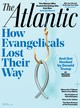

In 1952, Charles Wilson, then the president of General Motors, was nominated by Dwight Eisenhower to become secretary of defense. During his confirmation hearing, Wilson was asked whether, as secretary, he could make a decision adverse to GM’s interests. Wilson assured the chamber that he would always put the interests of citizens ahead of those of his company. He added that he could hardly imagine a situation in which the two would be in conflict: “I thought what was good for the country was good for General Motors, and vice versa.”

1952年，时任通用汽车公司总裁的查尔斯 ·威尔逊 被德怀特·艾森豪威尔提名为国防部长。 在他的任命听证会上，威尔逊被问到，作为秘书，他是否可以做出不利于通用汽车利益的决定。 威尔逊向众议院保证，他将始终将公民的利益置于公司利益之上。 他补充说，他很难想象两者会发生冲突的情况：“我认为对国家有利的事情对通用汽车也有利，反之亦然。”

To contemporary ears, this may sound like standard C-suite spin. But this sunny view of Big Business was shared by the public. One 1950 poll found that 60 percent of Americans had a favorable opinion of large businesses; more than 70 percent had a favorable view of GM. “We believe today, both inside and outside the business world, that the business enterprise, especially the large business enterprise, exists for the sake of the contribution which it makes to the welfare of society as a whole,” the management scholar Peter Drucker wrote in 1952. “There is, in fact, no disagreement, except on the lunatic fringes of the Right and on the Left.”

对于现代人来说，这听起来像是标准的 C-suite 旋转。 但这种对大企业的乐观看法得到了公众的认同。 1950 年的一项民意调查发现，60% 的美国人对大企业有好感； 超过 70% 的人对通用汽车有好感。 管理学者彼得·德鲁克写道：“我们今天相信，无论是在商界内外，商业企业，尤其是大型商业企业的存在，都是为了为整个社会的福祉做出贡献。”在 1952 年。“事实上，没有分歧，除了在右翼和左翼的疯狂边缘。”

## Explore the April 2018 Issue

## 探索 2018 年 4 月号

Check out more from this issue and find your next story to read.

查看本期的更多内容，找到您要阅读的下一个故事。

[View More](https://www.theatlantic.com/magazine/toc/2018/04/)

Today, you need not travel to the lunatic fringes to find suspicion of Big Business. A majority of Americans now view large businesses as self-serving and self-dealing. Only 21 percent of respondents to a [2017 Gallup poll](http://news.gallup.com/opinion/polling-matters/216674/business-gets-bigger-even-americans-prefer-small.aspx) said they have a “great deal” or even “quite a lot” of confidence in Big Business.

今天，您无需前往疯狂的边缘去发现对大企业的怀疑。 大多数美国人现在将大型企业视为自我服务和自我交易。 中，只有 21% 的受访者 [在2017 年的盖洛普民意调查](http://news.gallup.com/opinion/polling-matters/216674/business-gets-bigger-even-americans-prefer-small.aspx) 表示他们对大企业有“很大”甚至“相当大”的信心。

How did large firms go from being a symbol of American strength to being the object of almost universal scorn? A series of high-profile corporate scandals—Enron’s accounting chicanery, Goldman Sachs’s manipulation of derivative markets, among others—certainly hasn’t burnished the image of Big Business. Nor has the rise of the shareholder-value movement, which tolerates no mission other than producing profits, preferably in the near term. The globalization of the economy has at the same time turned American corporations into multinational enterprises with interests that do sometimes run counter to those of their home country.

大公司是如何从美国实力的象征变成几乎普遍蔑视的对象的？ 一系列备受瞩目的公司丑闻——安然的会计欺诈、高盛对衍生品市场的操纵等等——当然没有美化大企业的形象。 股东价值运动的兴起也没有，它容忍除了产生利润之外的任何使命，最好是在短期内。 经济全球化同时将美国公司转变为跨国企业，其利益有时确实与本国利益背道而驰。

Small businesses, by contrast, have remained an exemplar of American ingenuity and pluck, the rare hero championed by both sides of the yawning political divide. To Republicans, they’re the purest expression of the creative potential of the free market; to Democrats, small businesses are a bulwark against the encroachments of greedy, heartless corporations.

相比之下，小企业一直是美国人聪明才智和勇气的典范，是政治分歧双方都拥护的罕见英雄。 对于共和党人来说，它们是自由市场创造潜力的最纯粹体现； 对民主党人来说，小企业是抵御贪婪、无情的公司侵蚀的堡垒。

Meanwhile, an influential school of scholars and advocates now blames a variety of ills—from stagnant wages and lagging productivity to growing income inequality—on the domination of markets by large firms. Channeling antique figures such as Louis Brandeis and William Jennings Bryan, this school claims that “monopoly” and “concentration” are rampant and that aggressive antitrust enforcement is the only cure.

与此同时，一个有影响力的学者和倡导者流派现在将各种弊病——从停滞不前的工资和落后的生产力到日益严重的收入不平等——归咎于大公司对市场的支配。 该学派效仿路易斯·布兰戴斯和威廉·詹宁斯·布莱恩等古董人物，声称“垄断”和“集中”猖獗，积极的反垄断执法是唯一的治疗方法。

Many of the evils identified by these reformers are real and must be addressed. But the diagnosis is wrong—and the prescription is malpractice. American admiration for small business is rooted in anachronistic ideals passed down from the nation’s preindustrial founding. Our reflexive disdain for large businesses exaggerates their malfeasance while misapprehending their vital role in continued American success. The problem isn’t merely one of perception: Feeding off the popular esteem for small business, policy makers are handicapping Big Business—in the process lowering productivity, dampening innovation, and hurting U.S. global competitiveness.

这些改革者指出的许多罪恶是真实存在的，必须加以解决。 但诊断是错误的——处方是医疗事故。 美国人对小企业的钦佩植根于从该国前工业时代传承下来的不合时宜的理想。 我们对大企业的反身蔑视夸大了他们的渎职行为，同时误解了他们在美国持续成功中的重要作用。 问题不仅仅是一种看法：政策制定者以大众对小企业的尊重为生，正在阻碍大企业——在这个过程中降低生产率、抑制创新并损害美国的全球竞争力。

The new antitrust advocates tell us that monopolistic companies are threatening to use their market power to crush remaining rivals, cheat workers out of fair wages, and gouge customers. Senator Elizabeth Warren paints [a near-apocalyptic picture](https://www.warren.senate.gov/?p=press_release&id=1169): “Today, in America, competition is dying. Consolidation and concentration are on the rise in sector after sector.” Writing in _Washington Monthly_, Barry Lynn and Phillip Longman [contend](https://washingtonmonthly.com/magazine/marchapril-2010/who-broke-americas-jobs-machine-3/) that “the degree of consolidation in many industries today bears a striking resemblance to that of the late Gilded Age.”

新 的反托拉斯倡导者 告诉我们，垄断公司正威胁要利用他们的市场力量打压剩余的竞争对手，从公平的工资中骗取工人，并哄骗客户。 参议员伊丽莎白沃伦描绘了 [一幅近乎世界末日的画面](https://www.warren.senate.gov/?p=press_release&id=1169) ：“今天，在美国，竞争正在消亡。 各个行业的整合和集中度都在上升。” 在 _华盛顿月刊_ 巴里·林恩 (Barry Lynn) 和菲利普·朗曼 (Phillip Longman) [撰文称](https://washingtonmonthly.com/magazine/marchapril-2010/who-broke-americas-jobs-machine-3/) ，“当今许多行业的整合程度与镀金时代后期的整合程度惊人地相似。”

Corporate concentration has increased, albeit modestly, over the past few decades. From 1952 to 2007, the percentage of manufacturing industries in which the top four firms accounted for at least half of shipments increased, though only slightly: from 35 to 39 percent. (In about 40 percent of industries, including banking and electronic-product manufacturing, concentration rates have actually fallen.) But the majority of industries that have grown more concentrated remain highly competitive. Even in the retail sector, the top four companies in 2016—Walmart, Kroger, Costco, and Home Depot—held just 13 percent of the market combined. (Amazon, a favorite target of the new anti-monopolists, ranked seventh.)

在过去的几十年里，企业集中度有所提高，尽管幅度不大。 从 1952 年到 2007 年，前四家公司至少占出货量一半的制造业比例有所增加，但幅度很小：从 35% 增加到 39%。 （在大约 40% 的行业中，包括银行业和电子产品制造，集中度实际上已经下降。）但是大多数集中度更高的行业仍然具有很强的竞争力。 即使在零售领域，2016 年排名前四的公司——沃尔玛、克罗格、好市多和家得宝——合计也只占据了 13% 的市场份额。 （亚马逊，新反垄断者最喜欢的目标，排名第七。）

Whatever market power big companies _do_ have, they’re doing a lousy job of turning it into excess profits. According to IRS data, in 2013 corporations with receipts of less than $500,000 had higher profits than did corporations with more than $250 million in sales. The anti–Big Business crowd likes to claim that large corporations find ways of holding on to more of those profits. But the myth of Big Business as unrepentant tax cheat is not borne out by the data. Large corporations do hire top accounting firms to minimize their tax exposure, and some keep profits offshore. But even with the advantages conferred by wily accountants, the tax code favors small firms to such a degree that, in 2013, federal income tax paid, as a share of total net income, was 18.2 percent for firms with more than $250 million in sales and just 4.6 percent for firms with less than $5 million in sales. Big companies are also much more likely than small ones to be audited and to face steep penalties for malfeasance.

怎样的市场支配力 _无论大公司拥有_ ，它们在将其转化为超额利润方面做得很糟糕。 根据美国国税局的数据，2013 年收入低于 50 万美元的公司的利润高于销售额超过 2.5 亿美元的公司。 反大企业人群喜欢声称大公司找到了保留更多利润的方法。 但是，大企业顽固不化的逃税神话并没有得到数据的证实。 大公司确实聘请了顶级会计师事务所以尽量减少他们的税务风险，有些公司将利润留在海外。 但即使有狡猾的会计师赋予的优势，税法对小公司的偏爱程度如此之大，以至于在 2013 年，对于销售额超过 2.5 亿美元的公司，缴纳的联邦所得税占净收入总额的比例为 18.2%对于销售额低于 500 万美元的公司，这一比例仅为 4.6%。 大公司也比小公司更有可能接受审计，并因渎职而面临严厉处罚。

As for the treatment of workers, here too perception and reality part ways. The depredations of a few job cutters have earned Big Business a reputation for heartless streamlining, but employment at large businesses is in fact steadier than at small businesses. In 2015, small enterprises were four times more likely to lay off their workers than large ones. Workers employed by large firms also earned more—on average, 54 percent more than workers at small companies. Companies [with more than 500 employees](https://www.bls.gov/news.release/ecec.t08.htm) offer 2.5 times more paid leave and insurance benefits and 3.9 times more in retirement benefits than workers at firms with fewer than 100 employees. Large firms are also more likely to be unionized, and they employ a greater share of women and minorities than small firms do, making Big Business an unlikely enemy of progressives.

至于工人的待遇，这里也是观念和现实的分歧。 一些裁员的掠夺为大企业赢得了无情精简的名声，但实际上大企业的就业比小企业更稳定。 2015 年，小型企业裁员的可能性是大型企业的四倍。 大公司雇用的工人的收入也更高——平均比小公司的工人高 54%。 的公司 [与员工人数少于 100 人](https://www.bls.gov/news.release/ecec.t08.htm) 相比，员工人数超过 500 人的公司提供的带薪休假和保险福利多 2.5 倍，退休福利多 3.9 倍。 大公司也更有可能成立工会，而且与小公司相比，它们雇佣的女性和少数族裔比例更高，这使得大企业不太可能成为进步人士的敌人。

Big companies also create more net jobs. This will surely come as a surprise to many Americans, who have been handed down the hoary legend that small business is the engine of job creation. The origins of this misimpression began with David Birch, an MIT researcher, who in the late 1970s purported to show that, from 1969 to 1976, companies with 100 or fewer employees created more than 80 percent of all new jobs. A few economists have found similar results, but many others have criticized Birch’s methods and conclusions. The economist Catherine Armington found that, from 1976 to 1982, small firms were responsible for just 56 percent of new jobs, much closer to their share of total jobs in the U.S. Even Birch himself has acknowledged that his results rely on a series of assumptions very much open for debate. For example, he failed to account for the much higher rates at which small businesses _destroy_ jobs shortly after creating them.

大公司还创造了更多的净工作岗位。 这肯定会让许多美国人感到惊讶，他们一直流传着小企业是创造就业机会的引擎这一古老传说。 这种错误印象的起源始于麻省理工学院研究员大卫伯奇，他在 20 世纪 70 年代后期声称表明，从 1969 年到 1976 年，员工人数在 100 人或以下的公司创造了 80% 以上的新工作岗位。 一些经济学家发现了类似的结果，但其他许多人批评了伯奇的方法和结论。 经济学家凯瑟琳·阿明顿 (Catherine Armington) 发现，从 1976 年到 1982 年，小公司只创造了 56% 的新工作岗位，这与它们在美国总工作岗位中所占的比例非常接近，甚至伯奇本人也承认，他的结果非常依赖于一系列假设非常开放的辩论。 例如，他没有考虑到小企业 _就摧毁工作岗位的比率要高得多。_ 在创造工作岗位后不久

Even if small companies aren’t creating an outsize share of jobs, don’t we rely on them to power American innovation—to outfox complacent corporations with the kind of irreverent thinking that can only occur while wearing a hoodie? Despite the much-mythologized genius in the garage, the tech revolution owes far more to teams of scientists and engineers working in well-funded corporate labs than to college dropouts tinkering at home. The business professors Anne Marie Knott and Carl Vieregger [have discovered](https://www2.census.gov/ces/wp/2016/CES-WP-16-20.pdf) that large firms not only invest more in R&D than small firms, they get more innovation output per dollar invested.

即使小公司没有创造大量的就业机会，我们难道不应该依靠它们来推动美国的创新——用只有穿着连帽衫才会出现的那种不敬的想法来击败自满的公司吗？ 尽管车库里有许多神话般的天才，但技术革命更多地归功于在资金雄厚的公司实验室工作的科学家和工程师团队，而不是大学辍学生在家里修修补补。 商学教授安妮·玛丽·诺特 (Anne Marie Knott) 和卡尔·维埃格 (Carl Vieregger) [发现](https://www2.census.gov/ces/wp/2016/CES-WP-16-20.pdf) ，大公司不仅在研发方面的投资比小公司多，而且它们每投资一美元就能获得更多的创新产出。

Brilliant entrepreneurs like Steve Jobs and Bill Gates are indispensable for technological progress. But much of the information technology that they commercialized had been developed in previous generations by big firms such as IBM and Xerox. Jobs and Gates stood on the shoulders of giants—and then became giants themselves. _That’s_ the kind of small-business success story Americans should rally around. Alas, as the economists Erik Hurst and Benjamin Pugsley have found, most small businesses do not intend to grow or innovate. Most that manage to survive their fledgling years never employ more than a few workers.

技术进步离不开像史蒂夫·乔布斯和比尔·盖茨这样杰出的企业家。 但他们商业化的大部分信息技术都是由 IBM 和 Xerox 等大公司在前几代开发的。 乔布斯和盖茨站在巨人的肩膀上——然后自己也成为了巨人。 _这就是_ 美国人应该团结一致的小型企业成功故事。 唉，正如经济学家埃里克赫斯特和本杰明帕格斯利所发现的那样，大多数小企业并不打算发展或创新。 大多数设法在他们刚起步的岁月中生存下来的人从来没有雇佣过几个工人。

If the claims of the small-is-beautiful school are so at odds with the facts, how can we explain their popular appeal? The answer is that the cult of small business has been entwined in America’s self-conception since its founding.

如果 主张 “小即是美”学派的 与事实如此不符，我们如何解释他们的流行吸引力呢？ 答案是，自美国建国以来，对小企业的崇拜就一直与美国的自我概念纠缠在一起。

In his 1656 political tract, “The Commonwealth of Oceana,” the English theorist James Harrington argued that a constitutional republic could be sustained only in a society in which farmland was widely distributed among citizen farmers: “Equality of estates causeth equality of power and equality of power is the liberty not only of the commonwealth, but of every man,” he wrote. The colonists who rebelled against Britain and designed the United States were deeply influenced by this tradition of “producer republicanism”—to be truly free, they believed, a citizen must have economic independence, which at the time meant running a family farm or a small business.

英国理论家詹姆斯·哈林顿 (James Harrington) 在其 1656 年的政治宣传册《大洋洲联邦》中指出，只有在农田广泛分配给公民农民的社会中，宪政共和国才能维持：“财产平等导致权力平等和平等权力不仅是联邦的自由，也是每个人的自由，”他写道。 反抗英国、设计美国的殖民者深受这种“生产共和主义”传统的影响——他们认为，要想真正自由，公民必须拥有经济独立，这在当时意味着经营一个家庭农场或一个小农场。商业。

However dearly the Framers may have held the idea, it has long since been left behind by history. More than a century ago, most Americans became urban wage earners, not farmers or small-town shopkeepers and artisans; by World War II, just 20 percent of workers were self-employed, a figure that is down to 10 percent today. Working Americans face many challenges, but transforming them by the millions into shopkeepers and artisans is not the answer to improving their lot. In fact, today the richest regions in the United States and abroad are those in which self-employment is lowest—and the poorest are those with the most self-employed inhabitants. The reason is simple: As a rule, the smaller the firm, the lower the productivity level. Richest _and_ fairest: Economies led by large firms also tend to have less income inequality.

无论制宪者多么珍视这个想法，它早已被历史遗忘。 一个多世纪以前，大多数美国人成为城市工薪阶层，而不是农民或小镇店主和工匠； 到第二次世界大战时，只有 20% 的工人是个体经营者，而今天这一数字已降至 10%。 在职美国人面临许多挑战，但将数以百万计的他们转变为店主和工匠并不是改善他们命运的答案。 事实上，今天美国和国外最富裕的地区是个体经营率最低的地区——而最贫穷的地区是个体经营者最多的地区。 原因很简单：通常，公司越小，生产率水平越低。 最富有 _和_ 最公平：由大公司领导的经济体也往往收入不平等较少。

The anti-monopoly school identifies many genuine problems, ranging from low wages to the massive influence of money in politics. But the solution to low wages is not to break up big, productive firms that pay higher wages. Public policy should encourage start-ups that have the potential to scale up into dynamic national or global firms. Helping a robotics or biotech firm that can boost national productivity and competitiveness will benefit everyone. Why should Ashley and Justin get tax breaks and exemptions from regulations to help realize their dream of opening a brick-oven pizzeria?

反垄断学派发现了许多真正的问题，从低工资到金钱对政治的巨大影响。 但解决低工资问题的办法并不是拆分支付更高工资的大型高生产率企业。 公共政策应鼓励有潜力扩大为充满活力的国家或全球公司的初创企业。 帮助可以提高国家生产力和竞争力的机器人或生物技术公司将使每个人受益。 为什么 Ashley 和 Justin 应该获得税收减免和法规豁免来帮助他们实现开砖炉比萨店的梦想？

## Recommended Reading

## 推荐读物

As for the corruption of politics by special interests, it is a real threat to democracy, and there’s no denying that Big Business buys influence in Washington. But K Street is also lined with trade associations and pressure groups representing small businesses and professionals. Of the top 16 business-funded political-action committees in 2016, five represented small business. Why single out corporations as the sole benefactors of the current system when the National Association of Realtors, the National Beer Wholesalers Association, and the National Automobile Dealers Association are busy advancing the interests of their members?

至于特殊利益集团对政治的腐败，这是对民主的真正威胁，而且不可否认的是，大企业在华盛顿购买影响力。 但 K 街也有代表小企业和专业人士的贸易协会和压力团体。 在 2016 年由企业资助的前 16 个政治行动委员会中，有五个代表小企业。 为什么在全美房地产经纪人协会、全美啤酒批发商协会和全美汽车经销商协会忙于提升其成员的利益时，将公司列为现行制度的唯一受益者？

The small-is-beautiful consensus is wrong. But we need not replace it with an equally simpleminded orthodoxy in favor of Big Business. A dynamic economy requires the interaction of firms of all sizes. Small firms play legitimate if diminished roles today, and always will. To flourish in the 21st century, we must learn again that big can be beautiful, too.

小即是美的共识是错误的。 但我们不需要用同样头脑简单的支持大企业的正统观念来取代它。 充满活力的经济需要各种规模的公司互动。 小公司在今天扮演着合法的角色，即使角色被削弱了，也将永远如此。 要想在 21 世纪蓬勃发展，我们必须再次认识到大也可以是美丽的。

___

_This article is adapted from Robert D. Atkinson and Michael Lind’s book_ [Big Is Beautiful: Debunking the Myth of Small Business](http://www.amazon.com/exec/obidos/ISBN=026203770X/theatla05-20/)_. It appears in the April 2018 print edition with the headline “Learning to Love Big Business.”_

_本文改编自 Robert D. Atkinson 和 Michael Lind 的著作_ [Big Is Beautiful: Debunking the Myth of Small Business](http://www.amazon.com/exec/obidos/ISBN=026203770X/theatla05-20/) _。 它出现在 2018 年 4 月的印刷版中，标题为“学会热爱大企业”。_
