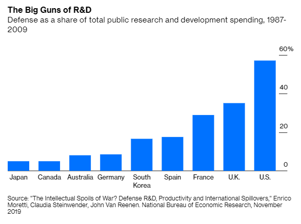

Those who pay attention to business news have probably noted an interesting and curious phenomenon over the past few months: China is smashing its internet companies. It started — or at least, most people in the U.S. started noticing it — when the government effectively [canceled the IPO of Ant Financial](https://www.bloomberg.com/news/articles/2020-12-16/ant-conducting-self-review-after-35-billion-ipo-collapses?sref=R8NfLgwS), then dismantled the company. Jack Ma, the founder of Ant and of e-commerce giant Alibaba, was summoned to a meeting with the government and then disappeared for weeks. The government then levied a multi-billion dollar antitrust fine against Alibaba (which is sometimes compared to Amazon), deleted its popular web browser from app stores, and took a bunch of other actions against it. The value of Ma’s business empire [has collapsed](https://www.forbes.com/sites/georgecalhoun/2021/06/07/the-sad-end-of-jack-ma-inc/?sh=1fcd4012123a).

关注商业新闻的人可能在过去几个月注意到了一个有趣而奇怪的现象：中国正在摧毁其互联网公司。 它开始了——或者至少，大多数美国人开始注意到了——当政府实际上 [取消了蚂蚁金服的 IPO](https://www.bloomberg.com/news/articles/2020-12-16/ant-conducting-self-review-after-35-billion-ipo-collapses?sref=R8NfLgwS) ，然后解散了这家公司。 蚂蚁金服和电子商务巨头阿里巴巴的创始人马云被传唤与政府开会，然后消失了数周。 随后，政府对阿里巴巴（有时将其与亚马逊相提并论）处以数十亿美元的反垄断罚款，从应用商店中删除了其广受欢迎的网络浏览器，并对它采取了一系列其他措施。 马云商业帝国的价值 [已经崩塌](https://www.forbes.com/sites/georgecalhoun/2021/06/07/the-sad-end-of-jack-ma-inc/?sh=1fcd4012123a) 。

But Ma was only the most prominent target. The government is also [going after other fintech companies](https://www.bloomberg.com/news/articles/2021-06-24/how-xi-and-the-ccp-turned-on-jack-ma-ant-and-china-s-fintech-companies?sref=R8NfLgwS), including those owned by Didi (China’s Uber) and Tencent (China’s biggest social media company). As Didi prepared to IPO in the U.S., Chinese regulators announced they were reviewing the company on “national security grounds”, and are now [levying various penalties](https://www.bloomberg.com/news/articles/2021-07-22/china-is-said-to-weigh-unprecedented-penalty-for-didi-after-ipo?sref=R8NfLgwS) against it. The government has also embarked on an “antitrust” push, [fining Tencent and Baidu](https://www.bloomberg.com/news/articles/2021-03-12/tencent-baidu-fined-by-antitrust-regulator-for-previous-deals?sref=R8NfLgwS) — two other top Chinese internet companies — for various past deals. Leaders of top tech companies (also including ByteDance, the company that owns TikTok) were summoned before regulators and presumably berated. Various Chinese tech companies are [now undergoing “rectification”](https://www.bloomberg.com/news/articles/2021-04-13/china-orders-34-tech-firms-to-curb-excesses-in-antitrust-review?sref=R8NfLgwS).

但马云只是最突出的目标。 政府也在 [追查其他金融科技公司](https://www.bloomberg.com/news/articles/2021-06-24/how-xi-and-the-ccp-turned-on-jack-ma-ant-and-china-s-fintech-companies?sref=R8NfLgwS) ，包括滴滴（中国的优步）和腾讯（中国最大的社交媒体公司）拥有的公司。 在滴滴准备赴美 IPO 之际，中国监管机构宣布他们正在以“国家安全为由”对该公司进行审查，并对其实施 [各种处罚](https://www.bloomberg.com/news/articles/2021-07-22/china-is-said-to-weigh-unprecedented-penalty-for-didi-after-ipo?sref=R8NfLgwS) 。 政府还着手推动“反垄断”， [对腾讯和百度](https://www.bloomberg.com/news/articles/2021-03-12/tencent-baidu-fined-by-antitrust-regulator-for-previous-deals?sref=R8NfLgwS) 这两家中国顶级互联网公司过去的各种交易处以罚款。 顶级科技公司（还包括拥有 TikTok 的公司 ByteDance）的领导人被传唤到监管机构面前，并可能受到斥责。 多家中国科技公司正在 [“整顿”](https://www.bloomberg.com/news/articles/2021-04-13/china-orders-34-tech-firms-to-curb-excesses-in-antitrust-review?sref=R8NfLgwS) 。

For those outside China’s [byzantine, opaque nexus](https://www.amazon.com/Party-Secret-China8217-Communist-Rulers/dp/0061708763) of party, government, and big business, it’s very difficult to figure out what’s going on. Just who is ordering these actions is not clear, or what the ultimate result of the crackdown will be. That makes it very hard to figure out why it’s happening. Some observers [see this as an antitrust campaign](https://promarket.org/2021/04/09/chinese-antitrust-exceptionalism-enforcement-trade-alibaba-zhang/), similar to the ones going on in the U.S. or the EU. China’s leaders famously want to prevent the emergence of alternative centers of power, but is the West so different in this regard? One of the driving motivations behind the [new antitrust movement](https://noahpinion.substack.com/p/the-economists-revolt) in the U.S. is to [curb the political power](https://www.bloomberg.com/opinion/articles/2020-12-17/big-tech-can-stay-big-if-we-get-better-antitrust-rules?sref=R8NfLgwS) of Big Tech companies specifically; if you wanted to, you might see the Chinese tech crackdown as simply a Neo-Brandeisian movement on steroids.

对于中国 [错综复杂、不透明的党、政府和大企业关系](https://www.amazon.com/Party-Secret-China8217-Communist-Rulers/dp/0061708763) 之外的人来说，很难弄清楚发生了什么。 目前尚不清楚是谁下令采取这些行动，也不清楚镇压的最终结果是什么。 这使得很难弄清楚为什么会这样。 一些观察家 [认为这是一场反垄断运动](https://promarket.org/2021/04/09/chinese-antitrust-exceptionalism-enforcement-trade-alibaba-zhang/) ，类似于美国或欧盟正在进行的运动。 众所周知，中国领导人希望阻止替代权力中心的出现，但西方在这方面有如此不同吗？ 背后的驱动力之一 [新的反垄断运动](https://noahpinion.substack.com/p/the-economists-revolt) 美国 [是专门遏制大型科技公司的政治权力](https://www.bloomberg.com/opinion/articles/2020-12-17/big-tech-can-stay-big-if-we-get-better-antitrust-rules?sref=R8NfLgwS) ； 如果你愿意，你可能会将中国的科技镇压视为简单的新布兰代斯主义运动。

But the breadth of the Chinese crackdown suggests a major difference. The U.S. has slapped down a few of its corporate giants before — Microsoft, AT&T, Standard Oil — but ultimately it didn’t crush the industries these companies were a part of. We’re unlikely to see major action against all the U.S. internet companies at once, and broad EU action will likely take the form of new rules rather than a sweeping crackdown. China’s attack on its tech companies, in contrast, seems far more comprehensive — it’s not just attacking the biggest internet _companies_, it’s attacking the entire _sector_. (Update: An important piece of evidence here is that China also appears to be reducing venture funding. If you want more competition you don't squash new entrants!) For whatever reason, China is suddenly not a fan of the industry we call “tech”.

但中国镇压的广度表明存在重大差异。 美国之前打压过一些企业巨头——微软、AT&T、标准石油——但最终并没有打垮这些公司所属的行业。 我们不太可能同时看到针对所有美国互联网公司的重大行动，欧盟的广泛行动可能会采取新规则的形式，而不是全面打击。 相比之下，中国对其科技公司的攻击似乎更为全面——它不仅攻击最大的互联网 _公司_ ，而且攻击整个 _行业_ 。 （更新：这里的一个重要证据是中国似乎也在减少风险投资。如果你想要更多的竞争，你就不会压制新进入者！）不管出于什么原因，中国突然不喜欢这个我们称之为“的行业”技术”。

This is strange because for years, it was conventional wisdom in the Western media that having a “tech” sector was crucial to innovation and growth etc. In fact, for many years [American pundits argued](https://www.nytimes.com/2014/01/22/opinion/can-china-innovate-without-dissent.html) that China’s economy would be held back by the government’s insistence on control of information, because it would make it impossible for China to build a world-class tech sector! Then China did build a world-class tech sector anyway, and now it’s willfully smashing the world-class tech sector it built. So much for U.S.-style “innovation”.

这很奇怪，因为多年来，西方媒体普遍认为拥有“科技”行业对创新和增长等至关重要。事实上，多年来美国专家认为 [中国](https://www.nytimes.com/2014/01/22/opinion/can-china-innovate-without-dissent.html) 经济会因政府的坚持而受阻对信息的控制，因为这将使中国不可能建立世界一流的科技行业！ 那时中国确实建立了一个世界级的科技行业，现在它正在故意摧毁它建立的世界级科技行业。 美国式的“创新”到此为止。

But notice that China isn’t cracking down on all of its technology companies. Huawei, for example, still seems to enjoy the government’s [full backing](https://www.scmp.com/tech/big-tech/article/3141698/huawei-wins-60-cent-china-mobiles-5g-network-show-confidence). The government is going [hell-bent-for-leather](https://www.bloomberg.com/news/articles/2021-06-17/xi-taps-top-lieutenant-to-lead-china-s-chip-battle-against-u-s?sref=R8NfLgwS) to try to create a world-class domestic semiconductor industry, throwing huge amounts of money at even the most speculative startups. And it’s still [spending heavily on A.I.](https://fortune.com/2021/07/02/china-artificial-intelligence-ai-business-ecosystems-tencent-baidu-alibaba/) It’s not technology that China is smashing — it’s the consumer-facing internet software companies that Americans tend to label “tech”.

但请注意，中国并没有打击所有的科技公司。 例如，华为似乎仍然享有政府的 [全力支持](https://www.scmp.com/tech/big-tech/article/3141698/huawei-wins-60-cent-china-mobiles-5g-network-show-confidence) 。 政府 [不遗余力地](https://www.bloomberg.com/news/articles/2021-06-17/xi-taps-top-lieutenant-to-lead-china-s-chip-battle-against-u-s?sref=R8NfLgwS) 试图打造世界级的国内半导体产业，甚至向最具投机性的初创企业投入巨额资金。 而且它仍在 [AI 上投入巨资](https://fortune.com/2021/07/02/china-artificial-intelligence-ai-business-ecosystems-tencent-baidu-alibaba/) 中国正在粉碎的不是技术——美国人倾向于将其标记为“技术”的是面向消费者的互联网软件公司。

Why do Americans equate “tech” with companies like Google, Amazon, and Facebook, anyway? One reason is that the consumer internet industry is something America is really _good_ at — unlike our electronics hardware industries, consumer software is something that hard-driving Asian competitors haven’t yet been able to beat us at. Another reason is that software companies [make a lot of profit](https://howmuch.net/articles/top-50-most-profitable-companies-in-the-us-2020) — Facebook made over $18 billion in 2020, three times Micron or Honeywell and six times Cisco. With their low overhead, network effects, troves of intellectual property, strong brand value, and differentiated products, successful software companies naturally tend to generate high margins. That’s true for smaller software companies as well as big ones. And since in America we often tend to equate profit with value, this means we think of the consumer-facing software industry as being our industrial champion, generating a huge amount of economic value for our nation.

无论如何，为什么美国人将“科技”等同于谷歌、亚马逊和 Facebook 等公司？ 一个原因是消费互联网行业是美国真正 _擅长_ 的——与我们的电子硬件行业不同，消费软件是亚洲竞争对手尚未能够击败我们的领域。 另一个原因是软件公司 [赚取了大量利润](https://howmuch.net/articles/top-50-most-profitable-companies-in-the-us-2020) ——Facebook 在 2020 年赚取了超过 180 亿美元，是美光或霍尼韦尔的三倍，是思科的六倍。 凭借低开销、网络效应、丰富的知识产权、强大的品牌价值和差异化的产品，成功的软件公司自然倾向于产生高利润。 对于小型软件公司和大型软件公司来说都是如此。 由于在美国，我们通常倾向于将利润与价值等同起来，这意味着我们将面向消费者的软件行业视为我们的行业冠军，为我们的国家创造了巨大的经济价值。

China may simply see things differently. It’s possible that the Chinese government has decided that the profits of companies like Alibaba and Tencent come more from rents than from actual value added — that they’re simply squatting on unproductive digital land, by exploiting first-mover advantage to capture strong network effects, or that the IP system is biased to favor these companies, or something like that. There are certainly those in America who believe that Facebook and Google produce little of value relative to the profit they rake in; maybe China’s leaders, for reasons that will remain forever opaque to us, have simply reached [the same conclusion](https://twitter.com/lillianmli/status/1418939820764581888?s=19).

中国可能只是以不同的方式看待事情。 中国政府可能已经决定像阿里巴巴和腾讯这样的公司的利润更多地来自租金而不是实际增加值——他们只是蹲在非生产性的数字土地上，利用先发优势来捕捉强大的网络效应，或者知识产权制度偏袒这些公司，或类似的事情。 在美国肯定有一些人认为，相对于他们赚取的利润，Facebook 和谷歌所产生的价值微乎其微； 也许中国领导人出于我们永远无法理解的原因，只是得出了 [同样的结论](https://twitter.com/lillianmli/status/1418939820764581888?s=19) 。

But in fact I suspect that there is something else going on here. If you’re interested in China and its economy, one analyst you should definitely read is GaveKal Dragonomics’ [Dan Wang](https://danwang.co/). And in [Dan’s 2019 letter](https://danwang.co/2019-letter/), I noticed the following passage:

但实际上我怀疑这里还有其他事情发生。 如果您对中国及其经济感兴趣，您绝对应该阅读的一位分析师是龙洲经讯的 [王丹](https://danwang.co/) 。 而在 [Dan 2019 年的信](https://danwang.co/2019-letter/) 中，我注意到了以下这段话：

> I find it bizarre that the world has decided that consumer internet is the highest form of technology. It’s not obvious to me that apps like WeChat, Facebook, or Snap are doing the most important work pushing forward our technologically-accelerating civilization. To me, it’s entirely plausible that Facebook and Tencent might be net-negative for technological developments. The apps they develop offer fun, productivity-dragging distractions; and the companies pull smart kids from R&D-intensive fields like materials science or semiconductor manufacturing, into ad optimization and game development.
> 
> 我觉得很奇怪，世界已经决定消费互联网是技术的最高形式。 在我看来，微信、Facebook 或 Snap 等应用程序正在做着推动我们技术加速发展的文明的最重要工作。 在我看来，Facebook 和腾讯可能对技术发展产生负面影响是完全有可能的。 他们开发的应用程序提供有趣、拖累生产力的干扰； 这些公司将材料科学或半导体制造等研发密集型领域的聪明孩子吸引到广告优化和游戏开发中。
> 
> The internet companies in San Francisco and Beijing are highly skilled at business model innovation and leveraging network effects, not necessarily R&D and the creation of new IP….I wish we would drop the notion that China is leading in technology because it has a vibrant consumer internet. A large population of people who play games, buy household goods online, and order food delivery does not make a country a technological or scientific leader…These are fine companies, but in my view, the milestones of our technological civilization ought to be found in scientific and industrial achievements instead.
> 
> 旧金山和北京的互联网公司非常擅长商业模式创新和利用网络效应，不一定是研发和创造新 IP……我希望我们不要再认为中国在技术上处于领先地位，因为它拥有充满活力的消费者互联网。 大量玩游戏、在线购买家居用品和订购外卖的人并不能使一个国家成为技术或科学领导者……这些都是优秀的公司，但在我看来，我们技术文明的里程碑应该在取而代之的是科学和工业成就。

Dan’s job is to keep his ear to the ground, figure out what the movers and shakers in China think, and relay those thoughts to us. So when he started talking about the idea that consumer internet tech isn’t real “tech”, I immediately wondered if China’s leaders were thinking along the same lines. And then in his [2020 letter](https://danwang.co/2020-letter/), Dan wrote:

Dan’s job is to keep his ear to the ground, figure out what the movers and shakers in China think, and relay those thoughts to us. So when he started talking about the idea that consumer internet tech isn’t real “tech”, I immediately wondered if China’s leaders were thinking along the same lines. And then in his [2020 letter](https://danwang.co/2020-letter/), Dan wrote:

> It’s become apparent in the last few months that the Chinese leadership has moved towards the view that hard tech is more valuable than products that take us more deeply into the digital world. Xi declared this year that while digitization is important, “we must recognize the fundamental importance of the real economy… and never deindustrialize.” This expression preceded the passage of securities and antitrust regulations, thus also pummeling finance, which along with tech make up the most glamorous sectors today.
> 
> It’s become apparent in the last few months that the Chinese leadership has moved towards the view that hard tech is more valuable than products that take us more deeply into the digital world. Xi declared this year that while digitization is important, “we must recognize the fundamental importance of the real economy… and never deindustrialize.” This expression preceded the passage of securities and antitrust regulations, thus also pummeling finance, which along with tech make up the most glamorous sectors today.

In other words, the crackdown on China’s internet industry seems to be part of the country’s [emerging national industrial policy](https://dusselpeters.com/CECHIMEX/Naughton2021_Industrial_Policy_in_China_CECHIMEX.pdf). Instead of simply letting local governments throw resources at whatever they think will produce rapid growth (the strategy in the 90s and early 00s), China’s top leaders are now trying to direct the country’s industrial mix toward what they think will serve the nation as a whole.

In other words, the crackdown on China’s internet industry seems to be part of the country’s [emerging national industrial policy](https://dusselpeters.com/CECHIMEX/Naughton2021_Industrial_Policy_in_China_CECHIMEX.pdf). Instead of simply letting local governments throw resources at whatever they think will produce rapid growth (the strategy in the 90s and early 00s), China’s top leaders are now trying to direct the country’s industrial mix toward what they think will serve the nation as a whole.

And what do they think will serve the nation as a whole? My guess is: _Power_. Geopolitical and military power for the People’s Republic of China, relative to its rival nations.

And what do they think will serve the nation as a whole? My guess is: _Power_. Geopolitical and military power for the People’s Republic of China, relative to its rival nations.

If you’re going to fight a cold war or a hot war against the U.S. or Japan or India or whoever, you need a bunch of military hardware. That means you need materials, engines, fuel, engineering and design, and so on. You also need chips to run that hardware, because military tech is increasingly software-driven. And of course you need firmware as well. You’ll also need surveillance capability, for keeping an eye on your opponents, for any attempts you make to destabilize them, and for maintaining social control in case they try to destabilize you.

如果你要与美国、日本、印度或任何其他国家打冷战或热战，你需要大量的军事装备。 这意味着您需要材料、发动机、燃料、工程和设计等等。 您还需要芯片来运行该硬件，因为军事技术越来越受软件驱动。 当然你也需要固件。 你还需要监视能力，以监视你的对手，防止你试图破坏他们的稳定，并在他们试图破坏你的稳定时保持社会控制。

It’s easy for Americans to forget this now, but there was a time when “ability to win wars” was [the driving goal of technological innovation](https://www.jump-startingamerica.com/). The [NDRC](https://en.wikipedia.org/wiki/National_Defense_Research_Committee) and the [OSRD](https://en.wikipedia.org/wiki/Office_of_Scientific_Research_and_Development) were the driving force behind government sponsorship of research and technology in World War 2, and the NSF and DARPA grew out of this tradition. Defense spending has traditionally been [a huge component](https://www.bloomberg.com/opinion/articles/2019-12-04/military-spending-on-r-d-is-a-boon-for-the-private-sector?sref=R8NfLgwS) of government research-spending in the U.S., and many of America’s most successful private-sector tech industries are in some way spinoffs of those defense-related efforts.

现在美国人很容易忘记这一点，但曾经有一段时间，“赢得战争的能力”是 [技术创新的驱动目标](https://www.jump-startingamerica.com/) 。 NDRC [。](https://en.wikipedia.org/wiki/National_Defense_Research_Committee) 和 [OSRD](https://en.wikipedia.org/wiki/Office_of_Scientific_Research_and_Development) 是第二次世界大战中政府资助研究和技术的推动力，NSF 和 DARPA 就是从这一传统中发展而来的 传统上，国防支出一直是 [。](https://www.bloomberg.com/opinion/articles/2019-12-04/military-spending-on-r-d-is-a-boon-for-the-private-sector?sref=R8NfLgwS) 美国政府研究支出的重要组成部分，美国许多最成功的私营部门科技产业在某种程度上都是这些与国防相关的努力的衍生产品

After the Cold War, our priorities shifted from survival to enjoyment. Technologies like Facebook and Amazon.com, which are fundamentally about leisure and consumption, went from being fun and profitable spinoffs of defense efforts to the center of what Americans thought of as “tech”.

冷战结束后，我们的首要任务从生存转向享受。 像 Facebook 和 Amazon.com 这样从根本上与休闲和消费有关的技术，从国防努力的有趣和有利可图的衍生产品变成了美国人所认为的“技术”的中心。

But China never really shifted out of survival mode. Yes, China’s leaders embraced economic growth, but that growth has always been toward the telos of comprehensive national power. China’s young people may be increasingly ready to [cash out and have some fun](https://www.bloomberg.com/opinion/articles/2021-06-19/china-s-leaders-won-t-take-a-growing-movement-of-young-slackers-lying-down?sref=R8NfLgwS), but the leadership is just not there yet. They’ve got bigger fish to fry — they have to avenge the Century of Humiliation and claim China’s rightful place in the sun and blah blah.

但中国从未真正走出生存模式。 是的，中国领导人拥抱经济增长，但这种增长始终以综合国力为目标。 中国的年轻人可能越来越愿意 [兑现并享受一些乐趣](https://www.bloomberg.com/opinion/articles/2021-06-19/china-s-leaders-won-t-take-a-growing-movement-of-young-slackers-lying-down?sref=R8NfLgwS) ，但领导力还没有到位。 他们有更大的鱼要炸——他们必须为百年耻辱报仇，并要求中国在阳光下的合法地位等等。

And so when China’s leaders look at what kind of technologies they want the country’s engineers and entrepreneurs to be spending their effort on, they probably don’t want them spending that effort on stuff that’s just for fun and convenience. They probably took a look at their consumer internet sector and decided that the link between that sector and geopolitical power had simply become too tenuous to keep throwing capital and high-skilled labor at it. And so, in classic CCP fashion, it was time to smash.

因此，当中国领导人考虑他们希望该国的工程师和企业家将精力花在什么样的技术上时，他们可能不希望他们将精力花在仅仅是为了好玩和方便的事情上。 他们可能审视了自己的消费互联网部门，并认为该部门与地缘政治力量之间的联系已经变得过于脆弱，无法继续向其投入资本和高技能劳动力。 因此，按照中共的经典方式，是时候粉碎了。

**Updates**:

**更新** ：

1.  My theory also helps explain why China would suddenly [smash its for-profit education sector](https://www.bloomberg.com/news/articles/2021-07-24/china-bans-school-curriculum-tutoring-firms-from-going-public), though I’m sure there are other reasons too.
    
2.  Another factor some have suggested (see the comment section) is that the consumer internet companies that China is penalizing have large degrees of foreign ownership. So it could also partially be about denying foreigners a toehold in Chinese tech.
    
3.  As always, there are people with different interpretations of events presented here. [Here is one such contrary view](https://twitter.com/ruima/status/1419489600783798273), arguing that China’s actions against tech companies are done mainly with the interests of consumers in mind. Here is [another, better-argued version of that view](https://lillianli.substack.com/p/let-the-bullets-fly-for-a-while). I am not particularly persuaded by this; I think any assessment of China’s government’s objectives that doesn’t recognize the central importance of comprehensive national power is probably being a bit too diplomatic. Yes, China wants to be a “[manufacturing superpower](https://twitter.com/ruima/status/1420060835313971200)”, but it has reasons for doing so that go far beyond providing people with good manufacturing jobs.
    
4.  Meanwhile, shares of China’s semiconductor champion, SMIC, are surging, as my theory would predict:
    
    The immediate impetus for the surge was apparently a rumor of a big order from Huawei, a company that some believe is deeply intertwined with the Chinese military.
    
5.  Meanwhile, at least a few more knowledgeable observers than myself seem to be thinking along the same lines as I did:
    
    And here, in Chinese, is another example, which is apparently [from the chief economist](https://twitter.com/TheYisiLiu/status/1419944661112680450) at a a Chinese securities firm :
    
    A lot of people are telling the same story here.
    
6.  The Chinese government [has called video games “spiritual opium”](https://www.nytimes.com/2021/08/03/technology/china-video-game-tencent.html), sending video game stocks plunging. Chalk up another win for my theory.
    
7.  Pony Ma, the boss of Tencent, who has utterly sucked up to the Chinese leadership, [has lost even more money](https://www.bloomberg.com/news/articles/2021-08-04/tencent-boss-loses-14-billion-in-crackdown-more-than-jack-ma?utm_campaign=socialflow-organic&utm_content=nextchina&utm_medium=social&utm_source=twitter&sref=R8NfLgwS) than the obstreperous Jack Ma in the recent crackdown. This suggests that it’s about the kind of tech the leadership wants, not just about eliminating upstarts who challenge party wisdom.
    
8.  Here’s [a Greg Ip column on the types of tech](https://www.wsj.com/articles/china-wants-manufacturingnot-the-internetto-lead-the-economy-11628078155?mod=hp_featst_pos4) that China’s leadership is still showering with money and support. Very manufacturing-focused, of course.
    
9.  [A new statement](https://www.bloomberg.com/news/articles/2021-08-11/china-signals-regulatory-crackdown-will-deepen-in-long-push?sref=R8NfLgwS) from China’s State Council seems to generally fit with my theory, though as usual these things are too vague to really confirm much.
    
10.  You know what other industry probably isn’t that important for national power? [Real estate](https://www.bloomberg.com/news/articles/2021-08-16/china-squeezes-1-3-trillion-revenue-earner-to-cool-home-prices?utm_content=nextchina&utm_campaign=socialflow-organic&utm_medium=social&utm_source=twitter&sref=R8NfLgwS).
    
11.  [I wrote a follow-up post](https://noahpinion.substack.com/p/what-kind-of-economy-leads-to-national) about what kind of industries might be more and less important for comprehensive national power.
    
12.  A few weeks later, we now have [official confirmation of China’s motives](https://asiatimes.com/2021/08/china-on-the-cusp-of-a-profound-transformation/?s=09):
    
    > An ideological split between Chinese President Xi Jinping and the country’s business and cultural elite has come to the fore after a hardline [commentary](http://politics.people.com.cn/BIG5/n1/2021/0829/c1001-32211523.html) by a known Maoist supporter received official blessing in state media.
    > 
    > The widely distributed commentary, laden with Cold War jargon, calls for a “profound transformation” to make China strong enough to fight against the United States, a process some have dubbed Cultural Revolution 2.0.
    

1.  我的理论也有助于解释为什么中国会突然 [粉碎其营利性教育部门](https://www.bloomberg.com/news/articles/2021-07-24/china-bans-school-curriculum-tutoring-firms-from-going-public) ，尽管我相信还有其他原因。
    
2.  一些人提出的另一个因素（见评论部分）是中国正在处罚的消费互联网公司拥有大量外资所有权。 因此，这在一定程度上也可能是为了阻止外国人在中国科技领域立足。
    
3.  一如既往，人们对这里呈现的事件有不同的解释。 [这是一种相反的观点](https://twitter.com/ruima/status/1419489600783798273) ，认为中国对科技公司采取的行动主要是为了消费者的利益。 这是 [该观点的另一个更有争议的版本](https://lillianli.substack.com/p/let-the-bullets-fly-for-a-while) 。 我对此并不特别信服。 我认为任何不承认综合国力核心重要性的对中国政府目标的评估都可能有点过于外交。 是的，中国想成为“ [制造业超级大国](https://twitter.com/ruima/status/1420060835313971200) ”，但它这样做的理由远远不止为人们提供良好的制造业工作岗位。
    
4.  与此同时，正如我的理论所预测的那样，中国半导体冠军中芯国际的股价正在飙升：
    
    激增的直接推动力显然是来自华为的大订单传言，一些人认为这家公司与中国军方关系密切。
    
5.  与此同时，至少有一些比我更有见识的观察者似乎和我有同样的想法：
    
    在这里，用中文是另一个例子，显然是 [来自一家中国证券公司的首席经济学家](https://twitter.com/TheYisiLiu/status/1419944661112680450) ：
    
    很多人在这里讲述着同样的故事。
    
6.  中国政府 [称视频游戏为“精神鸦片”](https://www.nytimes.com/2021/08/03/technology/china-video-game-tencent.html) ，导致视频游戏股暴跌。 为我的理论再创佳绩。
    
7.  对中国领导层唯唯诺诺的腾讯老板马化腾， [在最近的打压行动中损失的钱](https://www.bloomberg.com/news/articles/2021-08-04/tencent-boss-loses-14-billion-in-crackdown-more-than-jack-ma?utm_campaign=socialflow-organic&utm_content=nextchina&utm_medium=social&utm_source=twitter&sref=R8NfLgwS) 比顽固的马云还多。 这表明，这与领导层想要的技术有关，而不仅仅是消除挑战政党智慧的新贵。
    
8.  Here’s [a Greg Ip column on the types of tech](https://www.wsj.com/articles/china-wants-manufacturingnot-the-internetto-lead-the-economy-11628078155?mod=hp_featst_pos4) that China’s leadership is still showering with money and support. Very manufacturing-focused, of course.
    
9.  [A new statement](https://www.bloomberg.com/news/articles/2021-08-11/china-signals-regulatory-crackdown-will-deepen-in-long-push?sref=R8NfLgwS) from China’s State Council seems to generally fit with my theory, though as usual these things are too vague to really confirm much.
    
10.  You know what other industry probably isn’t that important for national power? [Real estate](https://www.bloomberg.com/news/articles/2021-08-16/china-squeezes-1-3-trillion-revenue-earner-to-cool-home-prices?utm_content=nextchina&utm_campaign=socialflow-organic&utm_medium=social&utm_source=twitter&sref=R8NfLgwS).
    
11.  [我后续写了一篇。](https://noahpinion.substack.com/p/what-kind-of-economy-leads-to-national) 哪些行业对综合国力的影响可能更大，哪些行业更不重要，
    
12.  几周后，我们现在 [正式确认了中国的动机](https://asiatimes.com/2021/08/china-on-the-cusp-of-a-profound-transformation/?s=09) ：
    
    > 获得官方媒体的官方支持后，中国国家主席习近平与该国商界和文化精英之间的意识形态分歧已经凸显。 [强硬评论](http://politics.people.com.cn/BIG5/n1/2021/0829/c1001-32211523.html) 在一位著名的毛派支持者的
    > 
    > 广为流传的评论充斥着冷战术语，呼吁进行“深刻变革”，使中国强大到足以对抗美国，这一过程被一些人称为“文化大革命 2.0”。
    

[Share](https://noahpinion.substack.com/p/why-is-china-smashing-its-tech-industry?utm_source=substack&utm_medium=email&utm_content=share&action=share)

[分享](https://noahpinion.substack.com/p/why-is-china-smashing-its-tech-industry?utm_source=substack&utm_medium=email&utm_content=share&action=share)
