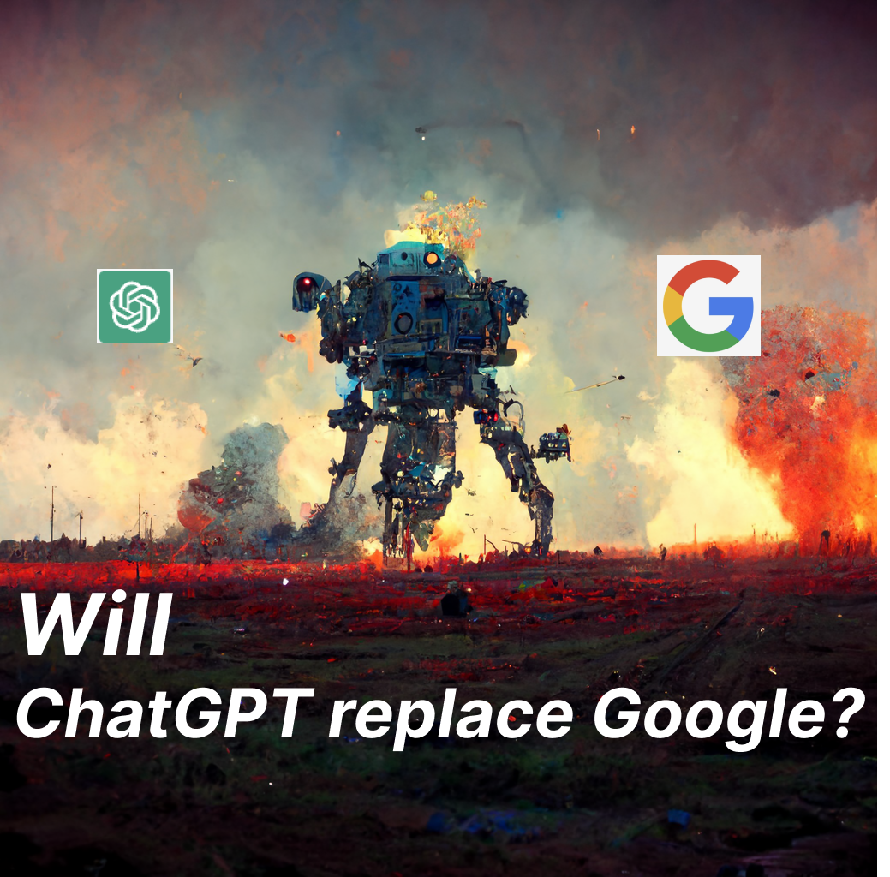

### ChatGPT has entered the chat, and people are losing their minds 🤯

### ChatGPT 已经进入聊天，人都疯了🤯

ChatGPT exploded onto the internet this week. People are impressed, surprised, and making wild predictions.

The wildest prediction I have seen is ‘ChatGPT is better than, and will replace Google!’

ChatGPT 本周在互联网上爆炸式增长。 人们印象深刻，感到惊讶，并做出疯狂的预测。

我见过的最疯狂的预测是“ChatGPT 比 Google 更好，并将取代 Google！”

Let’s dive into ChatGPT. Let’s figure out:

让我们深入了解 ChatGPT。 让我们弄清楚：

1.  What is ChatGPT?
    
    1.  How was ChatGPT created?
        
    2.  What is ChatGPT good at?
        
    3.  What are ChatGPTs limitations?
        
    4.  Does ChatGPT have an API?
        
2.  Will ChatGPT replace Google?
    
    1.  In what areas is ChatGPT better than Google?
        
    2.  In what areas is ChatGPT worse than Google?
        

1.  什么是聊天 GPT？
    
    1.  ChatGPT 是如何创建的？
        
    2.  ChatGPT 擅长什么？
        
    3.  ChatGPT 的限制是什么？
        
    4.  ChatGPT 有 API 吗？
        
2.  ChatGPT 会取代谷歌吗？
    
    1.  ChatGPT 在哪些方面优于 Google？
        
    2.  ChatGPT 在哪些方面比谷歌差？
        

ChatGPT is a large language model.

ChatGPT 是一个大型语言模型。

It is trained to interact in a conversational way. You can ask ChatGPT for something, and it will respond in a chat interface. ChatGPT can answer followup questions, and if you challenge incorrect premises it will admit it might be wrong and try to correct the mistakes. ChatGPT tries to reject inappropriate requests (asking for how to bully someone for example).

它被训练以对话的方式进行交互。 你可以向 ChatGPT 询问一些事情，它会在聊天界面中做出回应。 ChatGPT 可以回答后续问题，如果您质疑不正确的前提，它会承认它可能是错误的并尝试纠正错误。 ChatGPT 会尝试拒绝不当请求（例如询问如何欺负某人）。

_Sidenote_ - if words like **model**, and **training** don’t make sense to you yet, read last weeks post:

_旁注_ ——如果像 **model** 和 **training** 这样的词对你来说还没有意义，请阅读上周的帖子：

ChatGPT is a fine-tuned from a model in the GPT-3.5 series.

ChatGPT 是 GPT-3.5 系列模型的微调。

It uses a 3 step, supervised learning method.

它使用 3 步监督学习方法。

**First**, a prompt is answered by a human showing what a good response would be.

**首先** ，一个提示由一个人来回答，表明什么是好的回应。

**Second** multiple responses were generated and a human would rank the responses from best to worst.

**第二个多重响应，然后人类会将响应从最佳到最差进行排序。** 生成

**Third** the model would generate a response, then using a [PPO (OpenAIs new technique read about it here)](https://openai.com/blog/openai-baselines-ppo/) reward model, the reward model would give the chat model a score on how good it did. Robots training robots!

**第三，** 该模型会生成一个响应，然后使用 [PPO（OpenAI 的新技术，在这里阅读）](https://openai.com/blog/openai-baselines-ppo/) 奖励模型，奖励模型会给聊天模型打分，说明它的表现如何。 机器人训练机器人！

Source - https://openai.com/blog/chatgpt/

So why is everyone raving about ChatGPT?

那么为什么每个人都对 ChatGPT 赞不绝口呢？

Because it is surprising people with how well it does certain tasks.

因为它在某些任务上的表现令人惊讶。

ChatGPT can [write decent college essays](https://twitter.com/mucha_carlos/status/1598428598100172800), [explain algorithms as movie character](https://twitter.com/goodside/status/1598129631609380864), [write biblical verses for funny topics](https://twitter.com/tqbf/status/1598513757805858820), and [write limericks about Gatorade](https://twitter.com/JoshDance/status/1598756858126569472).

ChatGPT 可以 [写出像样的大学论文](https://twitter.com/mucha_carlos/status/1598428598100172800) ， [可以像电影角色一样解释算法](https://twitter.com/goodside/status/1598129631609380864) ， [可以为有趣的话题写出圣经经文](https://twitter.com/tqbf/status/1598513757805858820) ，还 [可以写出关于佳得乐的打油诗](https://twitter.com/JoshDance/status/1598756858126569472) 。

It is important to note that ChatGPT didn’t appear out of thin air. It builds on GPT3s strengths.

值得注意的是，ChatGPT 并非凭空出现。 它建立在 GPT3 的优势之上。

For GPT3’s answers were already well formed, succinct and coherent, and ChatGPT is the same.

因为 GPT3 的答案已经条理分明，简洁明了，ChatGPT 也是如此。

There are 3 reasons ChatGPT impresses people more than GPT3.

ChatGPT 比 GPT3 更能给人留下深刻印象的原因有 3 个。

1.  Answers are more conversational and more comprehensive.
    
2.  Chat interface is easier to use than the GPT3 Playground
    
3.  ChatGPT seems to do a better job with follow up questions.
    

1.  答案更具对话性和更全面性。
    
2.  聊天界面比 GPT3 游乐场更易于使用
    
3.  ChatGPT 似乎在后续问题方面做得更好。
    

Let’s look at examples of each.

让我们看一下每个例子。

Both models got the answer correct. But ChatGPT automatically expands on it which makes it feel better, smarter, more rich.

两个模型都得到了正确的答案。 但 ChatGPT 会自动扩展它，让它感觉更好、更智能、更丰富。

When you first hit the GPT3 Playground, it is not immediately clear what you should do.

当您第一次访问 GPT3 Playground 时，您并不清楚应该做什么。

The chat interface however, is one that nearly anyone who has used a computer is familiar with.

然而，聊天界面几乎是任何使用过计算机的人都熟悉的界面。

Both can produce similar results, but which feels easier to use?

两者都可以产生相似的结果，但哪个更容易使用？

The combination of improved answers, and simpler interface makes for a very impressive product.

改进的答案和更简单的界面相结合，造就了一个非常令人印象深刻的产品。

### 3\. ChatGPT seems to do a better job with follow up questions

### 3\. ChatGPT 似乎在跟进问题上做得更好

One interesting thing I discovered during testing is both GPT3 and ChatGPT can handle follow up questions.

我在测试期间发现的一件有趣的事情是 GPT3 和 ChatGPT 都可以处理后续问题。

OpenAI touts the ability to answer answer followup questions as a feature of ChatGPT, but GPT3 could already do that.

In this example, I asked both GPT3 and ChatGPT a question about the same programming concept, and they both answered well, and referenced a table. Asking a follow up question to them both about that table specifically, both answered the question correctly.

OpenAI 宣称能够回答后续问题作为 ChatGPT 的一项功能，但 GPT3 已经可以做到这一点。

在这个例子中，我问了 GPT3 和 ChatGPT 一个关于相同编程概念的问题，他们都回答得很好，并引用了一个表格。 具体向他们询问有关该表的后续问题，他们都正确回答了问题。

So while it seems like ChatGPT is better at answering follow up questions, I wonder if the chat interface just makes it easier to reference instead of a wall of text.

因此，虽然 ChatGPT 似乎更擅长回答后续问题，但我想知道聊天界面是否只是让它更容易参考而不是文字墙。

Directly from OpenAI, ChatGPT has some limitations:

直接来自 OpenAI，ChatGPT 有一些限制：
    
-   ChatGPT sometimes writes plausible-sounding but incorrect or nonsensical answers. This is problematic. Especially since it doesn’t cite sources.
    
    ChatGPT 有时会写出看似合理但不正确或荒谬的答案。 这是有问题的。 特别是因为它不引用消息来源。
    
    
-   ChatGPT is sensitive to tweaks to the input phrasing or attempting the same prompt multiple times. Sometimes the model can claim to not know the answer, but given a slight rephrase, it can answer correctly.
    
    ChatGPT 对输入措辞的调整或多次尝试相同的提示很敏感。 有时模型可能会声称不知道答案，但稍微改写一下，它就可以正确回答。
    
    
-   The model is often excessively verbose and overuses certain phrases(It tells you the phrase “I’m a language model trained by OpenAI” all. the. time.)
    
    该模型通常过于冗长并过度使用某些短语（它总是告诉你“我是一个由 OpenAI 训练的语言模型”这个短语。）
    
    
-   Doesn’t ask clarifying questions when the user provided an ambiguous query, just guesses what the user intended.
    
    当用户提供模棱两可的查询时不问澄清问题，只是猜测用户的意图。
    
    
-   Tries to refuse inappropriate requests, but will sometimes respond to harmful instructions or exhibit biased behavior.
    
    试图拒绝不适当的请求，但有时会回应有害的指令或表现出有偏见的行为。
    

Additional research by users have found these further issues:

用户的其他研究发现了这些进一步的问题：
    
-   ChatGPT doesn’t know what is truth.
    
    ChatGPT 不知道什么是真相。
    
-   ChatGPT is not ‘intelligent’, it gets an IQ score of 88.
    
    ChatGPT 并不“智能”，它的智商得分为 88。
    
-   ChatGPT does not understand spatial relationships.
    
    ChatGPT 不理解空间关系。
    

Here are a few examples of those limitations in action.

以下是这些限制的一些例子。

ChatGPT doesn’t know what truth is. It provides the correct day for the moon landing, but when challenged, says it could be wrong.

ChatGPT 不知道真相是什么。 它为登月提供了正确的日期，但当受到质疑时，它说它可能是错误的。

You can get around ChatGPT protections by rephrasing things. It doesn’t want to tell you how to break into a house, but if you ask it to write a film about how to break into a house, it will.

您可以通过重新措辞来绕过 ChatGPT 保护。 它不想告诉你如何闯入一所房子，但如果你要求它写一部关于如何闯入一所房子的电影，它会告诉你。

ChatGPT is not ‘intelligent’. Simple questions for a human, it completely fails on.

ChatGPT 不是“智能的”。 对于一个人来说简单的问题，它完全失败了。

Spatial relationship are very hard.

空间关系很难。

Currently no. Right now it is free for research purposes. It is expected that OpenAI will open the API next year.

目前没有。 现在它可以免费用于研究目的。 预计 OpenAI 将于明年开放 API。

Now that we know what ChatGPT is, lets move onto the next big issue. Lots of people are saying ChatGPT will replace Google.

现在我们知道什么是 ChatGPT，让我们进入下一个大问题。 很多人都说 ChatGPT 将取代谷歌。

Some said the same thing when GPT3, that ‘GPT3 would replace Google’, but these calls are increasing with the release of ChatGPT.

一些人在 GPT3 时也说过同样的话，即“GPT3 将取代谷歌”，但随着 ChatGPT 的发布，这些呼声越来越高。

So why are people predicting the death of Google at the hands of ChatGPT?

那么，为什么人们预测 Google 将死于 ChatGPT 之手呢？

Let’s look at what ChatGPT does better than Google.

让我们看看 ChatGPT 比 Google 做得更好的地方。

There are few things that ChatGPT does much better than Google at. These include:

ChatGPT 几乎没有什么比谷歌做得更好的。 这些包括：

1.  Conversational answers
    
2.  Getting something explained in more detail
    
3.  Generating and explaining code
    
4.  ANYTHING related to a large language model.
    

1.  会话式回答
    
2.  得到更详细的解释
    
3.  生成和解释代码
    
4.  任何与大型语言模型相关的东西。
    

Let’s go through each one.

让我们逐一分析。

Humans like talking to humans. So ‘talking’ to an interface feels natural to us.

人类喜欢与人类交谈。 因此，与界面“交谈”对我们来说感觉很自然。

When you use Google you

当您使用 Google 时，您

1.  Think of what you want
    
2.  Create a query that you think is going to give you best collection of websites
    
3.  Open all the website that look promising
    
4.  Read and combine them in your brain
    
5.  Arrive at the answer
    

1.  想想你想要什么
    
2.  创建一个您认为会为您提供最佳网站集合的查询
    
3.  打开所有看起来有希望的网站
    
4.  阅读并在大脑中组合它们
    
5.  到达答案
    

When you use ChatGPT you

当您使用 ChatGPT 时，您

1.  Think of what you want
    
2.  Type out the question to ChatGPT
    
3.  Read the result and arrive at the answer
    

1.  想想你想要什么
    
2.  向 ChatGPT 输入问题
    
3.  阅读结果并得出答案
    

Conversational interfaces are much easier.

对话界面要容易得多。

However the sharp eyed reader will realize that conversational interfaces have HUGE issues.

然而，眼尖的读者会意识到对话界面存在巨大问题。

We will talk about those further down the page.

我们将在页面下方进一步讨论这些内容。

If you want more detail after a Google search, you just search Google again with different terms or open more websites. Google doesn’t ‘remember and use’ what you searched for last time super effectively.

如果您想在 Google 搜索后获得更多详细信息，只需使用不同的术语再次搜索 Google 或打开更多网站。 Google 不会非常有效地“记住并使用”您上次搜索的内容。

ChatGPT on the other hand, does ‘remember and use’ what it said so asking it a follow up question can feel more natural than changing your search and reading more.

另一方面，ChatGPT 确实“记住并使用”它所说的内容，因此向它提出后续问题比更改搜索和阅读更多内容感觉更自然。

ChatGPT is REALLY GOOD at talking about and explaining code. Here are some examples.

ChatGPT 非常擅长谈论和解释代码。 这里有些例子。

[@packyM](https://twitter.com/packym/status/1598405769669771264)

So why is ChatGPT so good at code?

那么为什么ChatGPT这么擅长代码呢？

1.  Code has its own source of truth. If it runs and does what you want, it works.
    
2.  There is no 1 right answer with code.
    
3.  Code isn’t ‘current’. With the exception of new libraries, styles and updates, good Javascript today is the same as good Javascript 3 years ago.
    

1.  代码有它自己的真实来源。 如果它运行并执行您想要的操作，它就可以工作。
    
2.  代码没有 1 个正确答案。
    
3.  代码不是“当前”的。 除了新库、样式和更新之外，今天优秀的 Javascript 与 3 年前的优秀 Javascript 是一样的。
    

These and other truths make it so ChatGPT is very good at giving you mostly usable code, and explaining follow up questions.

这些和其他事实使得 ChatGPT 非常擅长为您提供大部分可用的代码，并解释后续问题。

Lets be clear. Google and ChatGPT are two very different tools.

让我们说清楚。 Google 和 ChatGPT 是两种截然不同的工具。

Google is a search engine.

谷歌是一个搜索引擎。

Search engines are designed to help users find information on the internet. They do this by indexing and organize the vast amount of information available on the web, and then providing users with relevant and accurate search results in response to their queries. Search engines are good at a number of things, including:

搜索引擎旨在帮助用户在 Internet 上查找信息。 他们通过索引和组织网络上可用的大量信息，然后为用户提供相关且准确的搜索结果来响应他们的查询来做到这一点。 搜索引擎擅长很多事情，包括：
    
-   Crawling and indexing the web: Search engines use specialized software called "crawlers" or "spiders" to discover and index new web pages and update existing ones. This allows them to provide users with up-to-date information when they search for something online.
    
    对网络进行爬网和索引：搜索引擎使用称为“爬虫”或“蜘蛛”的专门软件来发现和索引新网页并更新现有网页。 这使他们能够在用户在线搜索内容时为用户提供最新信息。
    
    
-   Ranking search results: Search engines use complex algorithms to determine the relevance and quality of web pages, and then rank them in order of importance. This helps users find the most relevant and useful information for their query.
    
    对搜索结果进行排名：搜索引擎使用复杂的算法来确定网页的相关性和质量，然后按重要性对它们进行排序。 这有助于用户为他们的查询找到最相关和最有用的信息。
    
    
-   Personalization: Many search engines use user data and preferences to personalize search results and provide users with more relevant and useful information. For example, if you often search for information about a particular topic, a search engine may show you more results related to that topic in the future.
    
    个性化：许多搜索引擎使用用户数据和偏好来个性化搜索结果并为用户提供更多相关和有用的信息。 例如，如果您经常搜索有关特定主题的信息，搜索引擎将来可能会向您显示更多与该主题相关的结果。
    

ChatGPT is a Large Language Model.

ChatGPT 是一种大型语言模型。

Large language models are an AI system trained on a large amount of text data, such as books, articles, and other written documents. This allows large language models to generate human-like text based on input. Some of the things that large language models are good at include:

大型语言模型是在大量文本数据（例如书籍、文章和其他书面文档）上训练的 AI 系统。 这允许大型语言模型根据输入生成类似人类的文本。 大型语言模型擅长的一些事情包括：

    
-   Generating coherent and realistic text: Large language models are able to generate text that is coherent and sounds similar to the way that humans write.
    
    生成连贯且逼真的文本：大型语言模型能够生成连贯且听起来与人类书写方式相似的文本。
    
    
-   Understanding and using context: Large language models are able to understand or mimic the context of the text they are generating, which allows them to generate text that is relevant and appropriate for a given situation. For example, if a large language model is asked to generate text about a specific topic, it will be able to use information from the context to generate text that is relevant to that topic because others put the same info together so it mimics it.
    
    理解和使用上下文：大型语言模型能够理解或模仿它们正在生成的文本的上下文，这使它们能够生成与给定情况相关且合适的文本。 例如，如果一个大型语言模型被要求生成关于特定主题的文本，它将能够使用上下文中的信息来生成与该主题相关的文本，因为其他人将相同的信息放在一起所以它会模仿它。
    
    
-   Responding to prompts: Large language models are able to generate text in response to a prompt, such as a question or a sentence starter. This allows them to produce text that is relevant and appropriate to the prompt, and that continues the story or conversation in a natural way.
    
    响应提示：大型语言模型能够生成文本以响应提示，例如问题或句子开头。 这使他们能够生成与提示相关且适当的文本，并以自然的方式继续故事或对话。
    
    
-   Learning from data: Large language models are trained on a large amount of text data, which allows them to learn from the patterns and structures in that data. This allows them to generate text that is similar to the text they were trained on, and to adapt to new input and generate text that is appropriate for a given situation.
    
    从数据中学习：大型语言模型在大量文本数据上进行训练，这使它们能够从该数据中的模式和结构中学习。 这使他们能够生成与他们接受训练的文本相似的文本，并适应新的输入并生成适合给定情况的文本。
    

It bears repeating, a search engine is not the same as large language model.

If a search engine is drill, a large language model is a saw. Which is better? Depends on what task you want to accomplish.

值得重申的是，搜索引擎与大型语言模型不同。

如果搜索引擎是钻头，那么大型语言模型就是锯子。 哪个更好？ 取决于你想完成什么任务。

If you want to make a poem, an essay, or summarize text, you want the large language model, and it is way better than a search engine for those activities.

如果你想写一首诗、一篇文章或总结文本，你需要大型语言模型，对于这些活动，它比搜索引擎要好得多。

So ChatGPT is blowing peoples minds and is much better than Google at a bunch of things.

所以 ChatGPT 让人们大吃一惊，并且在很多方面都比谷歌好得多。

### Will ChatGPT replace Google?

### ChatGPT 会取代谷歌吗？

### Short answer: Nope. Not even close.

### 简短回答：不。 差远了。

ChatGPT can’t do most of what Google does, and Google can’t do most of what ChatGPT does.

ChatGPT 不能做 Google 能做的大部分事情，Google 也不能做 ChatGPT 能做的大部分事情。

For the small section of activities where the tasks overlap, you can argue for ChatGPT or Google. For example, if you are trying to learn facts or a concept you could use a search engine or a large language model.

对于任务重叠的一小部分活动，你可以争论 ChatGPT 或谷歌。 例如，如果您正在尝试学习事实或概念，您可以使用搜索引擎或大型语言模型。

But just like you wouldn’t want to use a drill for cutting a board, you don’t want to use a large language model for search engine tasks.

**A search engine is for finding things**. **A large language model is for creating text.**

但是就像您不想使用钻头来切割木板一样，您也不想使用大型语言模型来完成搜索引擎任务。

**搜索引擎是用来找东西的** 。 **大型语言模型用于创建文本。**

For example the most common Google searches are all things people want to find something, **not** people trying to learn something or talk about something.

例如，最常见的谷歌搜索都是人们想要找到的东西，而 **不是** 人们试图学习或谈论某事的东西。

Source - https://www.semrush.com/blog/most-searched-keywords-google/

Google is a map of the internet. ChatGPT is a large language model that can ‘talk’ about and ‘explain’ concepts it has learned about.

谷歌是互联网地图。 ChatGPT 是一种大型语言模型，可以“谈论”和“解释”它学到的概念。

Map ≠ Chat

地图≠聊天

Here is a non comprehensive list of search types that Google does well, that ChatGPT can’t do at all (yet 😁)

这是 Google 做得很好的搜索类型的不全面列表，而 ChatGPT 根本做不到（还 😁）

    
-   Sports
    
    运动的
        
-   Weather
    
    天气
        
-   Current Events
    
    现在发生的事
        
-   Location specific knowledge
    
    位置特定知识
    
    
-   Future events
    
    未来事件
        
-   Images
    
    图片
    
-   Video
    
-   Video
    
    视频
    

Here are examples of the above limitations in action:

以下是上述行动限制的示例：

Sports. Since language models require training, they don’t have up to date knowledge. Google does. Most sports queries are about current events.

运动的。 由于语言模型需要训练，它们没有最新的知识。 谷歌有。 大多数体育查询都是关于时事的。

People. Search engines can be used to find people. ChatGPT knows about famous people but it isn’t good at specifically connecting you to people.

人们。 搜索引擎可以用来找人。 ChatGPT 了解名人，但不擅长将您与人联系起来。

For example ask ChatGPT who is the mayor of a small town, and it will give you the ‘can’t do it’ answer.

Ask it who is Mayor of a large town and it is just wrong.

例如，问 ChatGPT 谁是一个小镇的市长，它会给你“做不到”的答案。

问它谁是一个大城镇的市长，它是错误的。

Future events.

未来的事件。

Weather. By definition a current or future event, ChatGPT can’t do it.

天气。 根据定义当前或未来的事件，ChatGPT 做不到。

Future Events. You can’t ask it ‘how many days until next holiday’ etc. Makes sense why a large language model with the cut off date of 2021, wouldn’t know about a future event.

未来事件。 你不能问它“距离下一个假期还有多少天”等等。这就是为什么截止日期为 2021 年的大型语言模型不知道未来事件的原因。

ChatGPT is an exciting development. It can do fun and useful tasks with text.

ChatGPT 是一个令人兴奋的发展。 它可以用文本完成有趣和有用的任务。

Google is a search engine and can do lots of useful things a large language model can’t.

Google 是一个搜索引擎，可以做很多大型语言模型做不到的有用事情。

ChatGPT is not going to replace Google, **except** in tasks where you could chose to use a search engine or a large language model.

ChatGPT 不会取代谷歌， **除非** 在你可以选择使用搜索引擎或大型语言模型的任务中。

I think a more interesting question is will ChatGPT replace other tools.

我认为一个更有趣的问题是 ChatGPT 会取代其他工具。

When dealing with code for example, you can use Google, ChatGPT, StackOverFlow, online courses, books etc. In that stack of tools, ChatGPT seems like the current winner.

例如，在处理代码时，您可以使用 Google、ChatGPT、StackOverFlow、在线课程、书籍等。在这些工具中，ChatGPT 似乎是当前的赢家。

_(Three and only three)_

_（三个，只有三个）_

1 - [Prompt Tool - PromptHero has a collection of some of the best MidJourney prompt ideas](https://prompthero.com/midjourney-prompts?version=4)

1 - [提示工具 - PromptHero 收集了一些最好的 MidJourney 提示创意](https://prompthero.com/midjourney-prompts?version=4)

2 - Arvind made a physical typewriter that can write stories on paper using AI.

2 - Arvind 制作了一台物理打字机，可以使用 AI 在纸上写故事。

3 - [AI Wingman Tool Prototype. Send better texts on dating apps.](https://twitter.com/PellegrinPierre/status/1595112413736890368)

3 - [人工智能僚机工具原型。 在约会应用程序上发送更好的短信。](https://twitter.com/PellegrinPierre/status/1595112413736890368)
