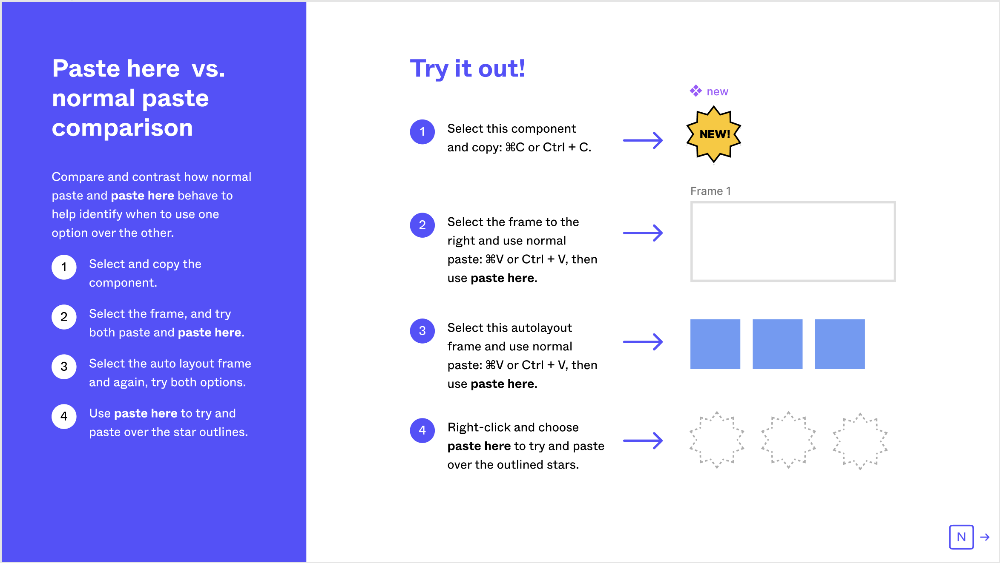
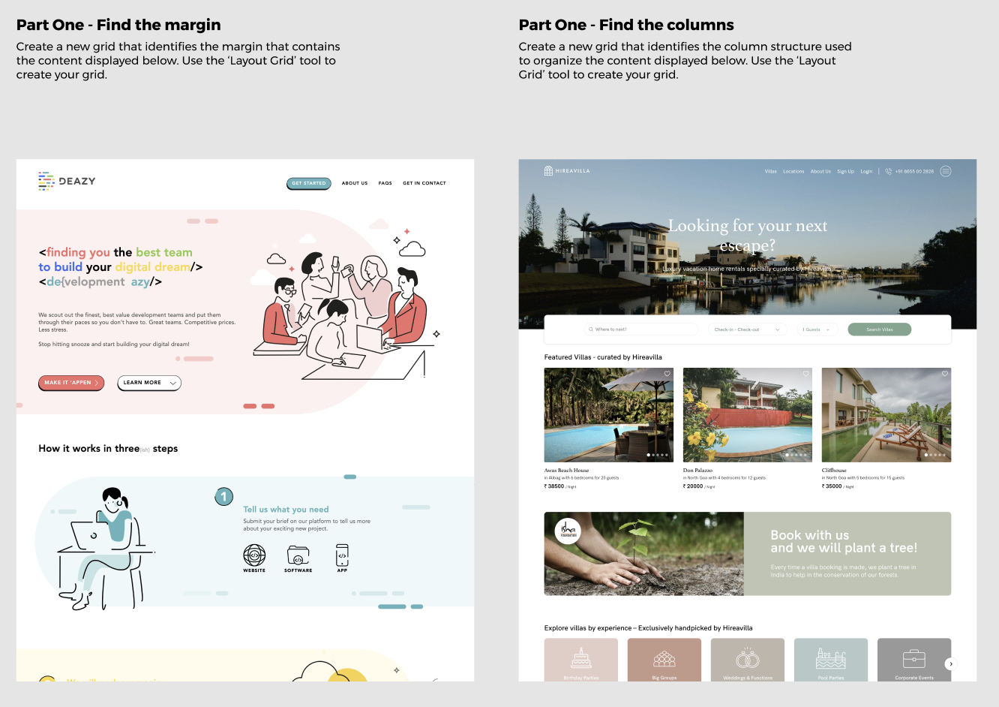
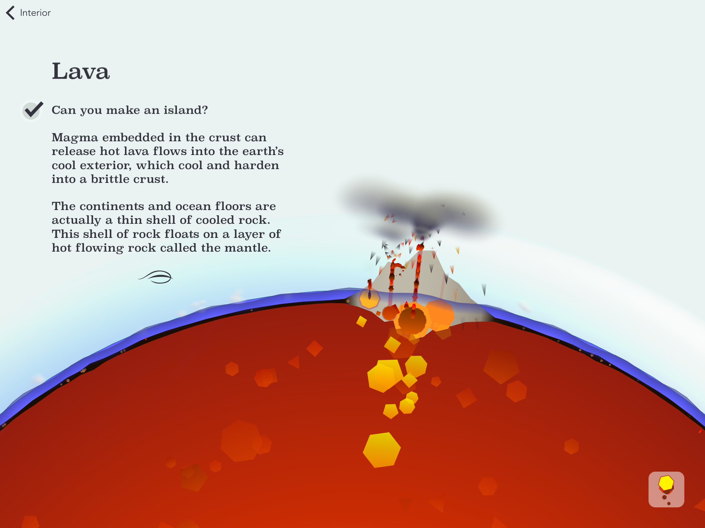

_Part of “Letters from the Lab”, a series of informal essays on my research written for [patrons](https://patreon.com/quantumcountry). Originally published October 2021; made publicly available January 2022_.

这是《实验室来信》的一部分，是为赞助人写的一系列关于我的研究的非正式文章。最初出版于2021年10月；2022年1月公开发行。

It’s board game night in a post-COVID world. You and a few friends gather around a table to try out a new game. The thing is: there are a lot of these little cardboard tokens and playing cards and—I’m not even sure… totems?

这是一个后COVID世界的棋盘游戏之夜。你和几个朋友围坐在一张桌子旁试玩一款新游戏。问题是：有很多这样的小纸板代币和扑克牌-我甚至不确定…图腾？

You pick up the instructions and begin to read aloud to the group, but after a few minutes, everyone becomes restless. So you figure you’ll just start and figure it out as you go. Now the first turn is taking forever because you’re returning to the instructions every ten seconds, but you keep losing your place and needing to reacquire it each time; and after the second turn’s over, you realize you need to unwind the first turn because you made an invalid move which will screw up the game; and you’re constantly straining to remember what you’re “supposed to do”; and it’s hard to emotionally commit to the game when you know you’ll only be able to play a few moments before returning to the manual.

你拿起说明书，开始向大家大声朗读，但几分钟后，每个人都变得焦躁不安。所以你会想，你只需要开始，并在你走的时候弄清楚。现在第一个回合是永远的，因为你每隔十秒就会回到指令，但你一直失去你的位置，每次都需要重新获得它；第二个回合结束后，你意识到你需要放松第一个回合，因为你做了一个无效的移动，这会搞砸游戏；你一直在努力记住你应该做什么；当你知道你只能在回到手册之前打几分钟的时候，很难在情感上投入到游戏中。

Maybe let’s just watch a movie instead?  
不如我们就看场电影吧？  

I’ve written plenty here and [elsewhere](https://andymatuschak.org/books/) about one problem with books: that we tend to rapidly forget all but the gist. So here’s another problem with books, and specifically with books meant to help you learn a skill: the medium makes it difficult to collapse the distance between prose and action. Books rarely involve _doing_ what they’re about. Most books, even books intended for skill-building, are only _about_ what they’re about. Reading about the board game, not playing the board game. Reading about counterpoint, not composing counterpoint.

我在这里和其他地方都写了很多关于书籍的一个问题：我们往往很快就会忘记所有东西，除了大意。所以，这是书籍的另一个问题，尤其是那些旨在帮助你学习一项技能的书籍：媒介让你很难打破散文和行动之间的距离。书籍很少涉及做它们想做的事情。大多数书籍，甚至是旨在培养技能的书籍，都只是关于它们的内容。阅读有关棋盘游戏的内容，而不是玩棋盘游戏。阅读关于对位的内容，而不是撰写对位。

So what? I’ll elide formal learning science here in favor of an appeal to experience.

那又怎么样？我将在这里省略正规的学习科学，以支持对经验的呼吁。

If you ask people about the highest-growth periods of their life, you’ll notice that the most enabling environments tend to involve _doing_. A summer spent preparing intensely with your team for an upcoming competition; a startup which failed but taught many valuable lessons; a challenge accepted to write a new song every day for a month; a multiweek meditation retreat; an overwhelming apprenticeship; etc. Books are sometimes a source of knowledge in these stories, but they’re often secondary to a great mentor, teammates, contextual motives, etc—and crucially, to _doing_.

如果你问人们他们一生中的最高成长期，你会注意到最有利的环境往往包括做。一个夏天和你的团队一起为即将到来的比赛紧张地准备；一家初创公司失败了，但教会了很多宝贵的课程；接受了一个月每天写一首新歌的挑战；数周的冥想静修；铺天盖地的学徒生涯等等。书籍有时是这些故事中知识的来源，但它们往往是伟大的导师、队友、背景动机等次要的--关键是要去做。

The analogue here for our board game problem is familiar: consider playing a board game for the first time, but with someone who’s played before. This is a completely different experience from the “cold start” I illustrated earlier. In this situation, the experienced player might give you a brief introduction—nothing which would strain your memory—and then you’d simply begin playing. They’d handle setting up the board, either by themselves or by telling others to shuffle these cards, distributed those tokens, etc. They might narrate: “I’ll go first, to demonstrate. So I start by drawing two cards, then I can choose to either move here or play this card. I’ll move here, which will block John from moving into this open area. Now you’re up. Your goal is to XYZ, and you might start by moving this way. Now if you drew an action card, you can play that immediately if you want; otherwise, read what it says on the card…” As events occur throughout the game, they might continue, narrating what you need to know, just-in-time, explaining the options you might consider, offering feedback. So long as your experienced friend is graceful enough to avoid veering into overbearing Clippy territory, this is a much more pleasurable—and effective—way to learn to play the game.

对于我们的棋盘游戏问题，这里的类比是熟悉的：考虑第一次玩棋盘游戏，但要和以前玩过的人一起玩。这与我之前演示的“冷启动”是完全不同的体验。在这种情况下，经验丰富的玩家可能会给你一个简短的介绍--不会让你的记忆力变得紧张--然后你就会简单地开始玩。他们会自己设置棋盘，或者让其他人洗牌、分发代币等等。他们可能会说：“我先来演示一下。”所以我从抽两张牌开始，然后我可以选择搬到这里或打这张牌。我会搬到这里，这会阻止约翰搬进这片开阔的区域。现在轮到你了。你的目标是XYZ，你可以从这条路开始。现在，如果你画了一张动作卡，如果你想要的话，你可以立即玩它；否则，阅读卡片…上的内容。随着事件在整个游戏中发生，它们可能会继续，讲述你需要知道的，及时地，解释你可能考虑的选项，提供反馈。只要你有经验的朋友足够优雅，避免陷入专横的急速领域，这是一个更令人愉快-也更有效的-学习玩这个游戏的方式。

This might be a consistently great way to pick up a board game, but skill-building books have many practical advantages. Consider information density. If you want to learn to program a quantum computer, there’s a huge amount of material you need to absorb before you can “play” much yourself. This might involve tens of hours of explanation from your experienced companion, which would quickly become burdensome for most people. Explanatory prose might lack personalization and interpersonal connection, but it can be more carefully honed; it does not tire and is ready whenever you are; it can embed figures and abstract notation; it can be consumed non-linearly; it can be read more quickly than speech can be heard; and so on. Perhaps most importantly, it’s a mass medium. The deepest experts and sharpest communicators in the world can craft a book on this topic, and millions of people can hold it in their hands for effectively zero marginal cost.

这可能是学习棋盘游戏的一种一贯的好方法，但技能培养书籍有许多实用的优势。考虑一下信息密度。如果你想学习对量子计算机进行编程，你需要吸收大量的材料，然后才能自己“玩”很多东西。这可能需要你的有经验的同伴花上几十个小时来解释，这很快就会成为大多数人的负担。解释性散文可能缺乏个性化和人际联系，但它可以更仔细地磨练；它不会疲倦，随时都可以准备好；它可以嵌入图形和抽象符号；它可以被非线性地消费；它可以被阅读的速度快于语音被听到的速度；等等。也许最重要的是，它是一种大众媒介。世界上最有深度的专家和最敏锐的沟通者可以就这一主题撰写一本书，数百万人可以以几乎为零的边际成本将其握在手中。

So: how might we create a mass medium which possesses the book’s advantages, but which is _situated in doing?_ How might we create an explanatory mass medium which feels more like playing a board game with an experienced friend than playing a board game while juggling its instruction manual?

那么：我们如何才能创造出一种既拥有这本书的优势，又处于实践之中的大众媒介呢？我们如何才能创造一种说明性的大众媒体，让人感觉更像是和经验丰富的朋友一起玩棋盘游戏，而不是一边玩棋盘游戏一边摆弄说明书？

## The role of the dynamic medium  
动态媒介的作用  

One reason it’s hard to create books which are situated in doing: the book is static, fixed. You, the reader, must ferry its words to an environment where you can “do”. And even then, there’s little opportunity for interplay between the doing and the words on the page. Authors can advise how to reflect on an exercise and generate your own feedback, but these are scripts you must execute in your own mind. Video doesn’t appreciably change this situation. But the promise of computers, and the dynamic mediums they enable, is representations which _behave and respond._This framing comes from Bret Victor’s “[Stop Drawing Dead Fish](https://vimeo.com/64895205)”. Here, immutable figures (whether printed or animated) are “dead fish.”

很难创作处于实践中的书的一个原因是：书是静态的、固定的。你作为读者，必须把它的文字摆渡到一个你能做到的环境中。即使这样，也几乎没有机会在做的事情和页面上的文字之间产生相互作用。作者可以建议如何反思练习并产生你自己的反馈，但这些脚本必须在你自己的脑海中执行。视频并没有明显改变这一状况。但计算机的承诺，以及它们所带来的动态媒介，是行为和反应的表现。这一框架来自布莱特·维克托的《停止画死鱼》。在这里，不变的图形(无论是印刷的还是动画的)都是“死鱼”。

People often propose we leverage this property to integrate _simulated environments for doing_. Maybe the biology textbook can embed a little simulated petri dish, which you can use to “do” certain kinds of cell biology, reducing the distance between text and action.

人们经常建议我们利用这一特性来集成模拟环境来进行操作。也许生物课本可以嵌入一个小小的模拟培养皿，你可以用它来做某些类型的细胞生物学，缩短文本和动作之间的距离。

But at least where it’s possible, I’m much more excited about what happens when a computational environment _becomes_ the authentic—not simulated, not “educational”—environment for doing. A non-linear video editing interface isn’t a “toy” way to edit a film; they’re how professional filmmakers actually edit films. Mathematica isn’t a “toy” way to manipulate symbolic expressions; it’s how certain kinds of mathematical work are authentically best done. And so a dynamic “book” about video editing need not involve a “toy” environment for doing, a simulated petri dish. Rather, it can situate itself in the same sort of environment used to edit the best films on Earth.

但至少在可能的情况下，我更兴奋的是，当计算环境成为真正的--不是模拟的，不是“教育”的--做事情的环境时会发生什么。非线性视频编辑界面不是编辑电影的“玩具”方式；它们是专业电影制作人实际编辑电影的方式。数学不是操纵符号表达式的“玩具”方式；它是某些类型的数学工作真正最好地完成的方式。因此，一本关于视频编辑的动态“书”不需要一个“玩具”环境来做，也不需要一个模拟的培养皿。相反，它可以将自己置于与编辑地球上最好的电影相同的环境中。

But what does it mean for an explanatory medium to “situate itself” in an authentic environment like this? How might the explanatory content interact with the contents of the environment?

但是，对于一个解释性媒介来说，在这样一个真实的环境中“定位”意味着什么呢？说明性内容如何与环境内容相互作用？

In the last decade, authors and programmers have created dozens of interactive articles which might inform our answer (see [Communicating with Interactive Articles](https://distill.pub/2020/communicating-with-interactive-articles/) for a good overview). I find the work in this space very inspiring, personally speaking. But I don’t know of any which quite matches the aspirations we’ve discussed so far. These articles may be interactive—may involve some doing—but the doing is situated in little purpose-built sandboxes, not the actual environments you would use to deploy the skill being built. They’re integrated with simulated petri dishes, not an actual lab bench.

在过去的十年中，作者和程序员已经创建了数十篇交互式文章，这些文章可能会为我们的答案提供帮助(请参阅与交互式文章进行交流以获得良好的概述)。就我个人而言，我发现这个领域的工作非常鼓舞人心。但我不知道有哪一家能完全符合我们到目前为止讨论过的抱负。这些文章可能是交互的--可能涉及一些操作--但是操作位于专门构建的小沙箱中，而不是您用来部署正在构建的技能的实际环境中。它们是与模拟培养皿集成在一起的，而不是真正的实验室长椅。

An [article on a topic in programming](http://tomasp.net/coeffects/), for example, might be structured as a long text interspersed with small interactive code editors you can use to explore a concept. This is certainly an improvement on the typical paper! But relative to our aspirations, “doing” is very much the secondary activity here. These editors don’t much resemble an actual programming environment; you’d have to jump through hoops to take anything you’d done and apply it to a real program. This is a bit like reading a board game instruction manual with interactive pictures depicting simplified parts of the board game. Or, somewhat more unfairly: it’s a bit like an elaborate pop-up book. You’re still not really doing the thing.

例如，一篇关于编程主题的文章可能被构造为一个长文本，其中夹杂着可用于探索概念的小型交互式代码编辑器。这当然是对典型论文的一种改进！但与我们的抱负相比，“做”在这里是非常次要的活动。这些编辑器不太类似于实际的编程环境；您必须跳跃才能将您所做的任何事情应用到真正的程序中。这有点像阅读带有交互图片的棋类游戏说明手册，这些图片描述了棋类游戏的简化部分。或者，更不公平的是：它有点像一本精心制作的弹出式书籍。你还是没有真正去做那件事。

If these interactive articles are often structured as wide seas of prose which contain islands of interactivity, one path to integrating authentic environments might be to invert this structure. How might we create “articles” which are primarily interactive environments, but with embedded islands of prose? Taking programming as an exampleWhat about computational notebooks like Mathematica and Jupyter? I don’t think these qualify; I don’t know of any strong examples which are “doing-centric”, where the code listings interspersed throughout the text are really about _doing_ the topic in question. As Pavel Panchekha pointed out to me about his [Web Browser Engineering](https://browser.engineering/) book: this format seems focused on helping readers understand the code the author has written; it’s not so well suited to supporting the reader as they write the code themselves.: rather than a textual document with embedded source listings, could we move the whole experience into your IDE of choice, while somehow still presenting the explanatory text? Could we move the YouTube lesson on 3D modeling with Blender _into_ Blender?

如果这些互动文章经常被构建成包含互动孤岛的广阔的散文海洋，那么整合真实环境的一条途径可能是颠倒这种结构。我们如何才能创造出主要是互动环境，但嵌入了散文孤岛的“文章”呢？以编程为例，像数学和木星这样的计算笔记本呢？我不认为这些符合条件；我不知道有什么强有力的例子是“以做为中心”的，其中散布在整个文本中的代码清单实际上是关于做有问题的主题的。正如Pavel Panchekha在他的Web Browser Engineering一书中向我指出的那样：这种格式似乎专注于帮助读者理解作者编写的代码；它不太适合支持读者，因为他们自己编写代码。注意：我们可以将整个体验转移到您选择的IDE中，同时以某种方式仍然呈现说明性文本，而不是嵌入源代码清单的文本文档吗？我们能不能把YouTube上关于使用Blender进行3D建模的课程移到Blender中？

Video games excel at this. Sometimes tutorials appear in non-interactive cutscenes, sharply delimited from ordinary play, but better examples (e.g. [Portal](https://store.steampowered.com/app/400/Portal/)) present instruction and narrative as a seamless element of the interactive environment, never “stealing” the camera or the controls away from the player. The result is rich immersion in the game environment—a stark contrast with board game instruction manuals.Of course, some of the very best examples (including Braid and The Witness) use no overt explanation at all. This is an extremely powerful approach I’ll have to discuss at another time.

电子游戏在这一点上表现出色。有时教程出现在非交互的动画场景中，与普通游戏明显区分开来，但更好的例子(如门户网站)将指导和叙事作为交互环境的无缝元素来呈现，永远不会从玩家手中偷走相机或控制。其结果是丰富的沉浸在游戏环境中-与棋盘游戏说明手册形成鲜明对比。当然，一些最好的例子(包括Braid和The Witness)根本没有公开的解释。这是一个非常强大的方法，我将不得不在另一个时间讨论。

Video games also improve upon another problem of interactive articles: the challenge of separating prose and dynamic representation. These articles close the distance between text and interactive elements, for instance by linking a number in the prose to a parameter you can directly manipulate in a figure. But in most cases, they’re still physically separated, not visually integrated. The reader’s eye bounces back and forth between the text and the interactive elements, churning working memory to attach referents to objects. This isn’t just a problem for dynamic elements. Static figures in traditional texts have the same problems. But the solutions described in [Edward Tufte’s books](https://www.edwardtufte.com/tufte/books_vdqi) are rarely applied in the dynamic domain, perhaps because the authoring tools are more complex and isolated. Almost everyone, almost always, is still “separating by mode of production”.

电子游戏还改进了互动文章的另一个问题：将散文和动态表现分开的挑战。这些文章拉近了文本和交互元素之间的距离，例如，通过将散文中的数字链接到可以在图形中直接操作的参数。但在大多数情况下，它们在物理上仍然是分开的，而不是视觉上的融合。读者的眼睛在文本和互动元素之间来回跳跃，搅动工作记忆，将参照物与物体联系起来。这不仅仅是动态元素的问题。传统文本中的静态人物也存在同样的问题。但Edward Tufte的书中描述的解决方案很少应用于动态领域，可能是因为创作工具更加复杂和孤立。几乎所有人，几乎总是，仍在“按生产方式分离”。

Video games take advantage of audio to layer instruction onto what the player’s seeing, but even when using only text, they can position that text right next to the relevant part of the action. This arrangement allows games to avoid disruptive ping-ponging between instruction and interaction, as we experience with board game manuals. And because the narrative communication is integrated into a dynamic environment, it can behave and respond just like the rest of the environment’s elements. In good games, the authored narrative feels like a continuous response to players’ actions. This collapses the sense of distance one feels when reading a text separated from the “doing” it’s about.

视频游戏利用音频将指令分层到玩家所看到的内容上，但即使在仅使用文本的情况下，它们也可以将文本放置在动作的相关部分旁边。这种安排使游戏避免了指令和互动之间的干扰，就像我们在棋盘游戏手册中所经历的那样。由于叙事交流被整合到一个动态的环境中，它可以像环境中的其他元素一样表现和反应。在好的游戏中，创作的叙事感觉就像是对玩家行为的持续回应。这打破了人们在阅读一篇文章时感觉到的距离感，而这篇文章与它所要做的事情是分开的。

## Enter the Figma document  
输入图形文档  

Oddly enough, the proximal cause of this letter was an extremely unusual [Figma](https://www.figma.com/) document.

奇怪的是，这封信的直接原因是一份极不寻常的菲格玛文件。

(If you’re not familiar: Figma is, roughly, a collaborative tool for designing the visual representations of software interfaces.)

(如果您不熟悉：粗略地说，Figma是一个用于设计软件界面的可视化表示的协作工具。)

I’ve been assembling notes on this article’s topic over the past two years. At some point, I’d like to build some prototypes around these ideas and publish a much deeper treatment. I don’t feel I’ve gathered strong enough ideas for that yet. But you’re reading this now because a Figma document demanded that I write a preliminary “IOU” of sorts.

在过去的两年里，我一直在收集关于本文主题的笔记。在某种程度上，我想围绕这些想法建立一些原型，并发表更深入的治疗方法。我觉得我还没有收集到足够强大的想法来实现这一点。但你现在读这篇文章，是因为一份Figma文档要求我写一份初步的“借条”。

Figma changed the way copy and paste works in their interface. They made [a document](https://www.figma.com/community/file/1019677205098431673) to explain the change to their users. I know this sounds awfully mundane. Stay with me. I encourage you to [take a look yourself](https://www.figma.com/community/file/1019677205098431673) before continuing: click the “Duplicate” button to get started, then zoom in on the upper-left frame. You can explore the document with a free account from your web browser.

Figma改变了他们界面中复制和粘贴的方式。他们制作了一份文件，向用户解释了这一变化。我知道这听起来非常平凡。和我呆在一起。我鼓励你在继续之前先看一看：点击“复制”按钮开始，然后放大左上角的框架。您可以在Web浏览器中使用免费帐户浏览该文档。

The document initially reads like a hypertext slide deck. It shows visually how the new clipboard functions behave. It’s cute that it’s a document about using Figma, both created and consumed in Figma, but that’s not so special. Interleaved with explanatory preamble, the document turns control over to you:

该文档最初读起来就像一张超文本幻灯片。它直观地显示了新的剪贴板函数的行为方式。这是一个关于使用Figma的文档，在Figma中创建和使用，这很可爱，但这并不是很特别。在解释性序言的交错部分，该文件将控制权移交给您：

This is where we break down the wall between authored material and authentic “doing.” You’re invited to manipulate the objects which the author has created. The objects aren’t special; they’re the same “kind” of objects which you could create yourself elsewhere. You can copy and paste them into a new document. And when you manipulate these objects, you use the same tools the author used to create the document. More importantly: you use the same tools which you yourself would use to do authentic work in this space.

这就是我们打破创作材料和真正的“做”之间的隔阂的地方。您将被邀请操作作者创建的对象。这些物体并不特别；它们是你可以在其他地方自己创造的同一类物体。您可以将它们复制并粘贴到新文档中。当您操作这些对象时，您使用的工具与作者用来创建文档的工具相同。更重要的是：你使用的工具和你自己在这个领域做真实工作时使用的工具是一样的。

This could have been a blog post, with little interactive “demo” areas interspersed between paragraphs. But instead, you’re interacting with this document in the full-blown Figma environment. In the design world, this is a lab bench, not a simulated petri dish. Other than the scaffolding text, there’s no distance between the “doing” here and the “doing” in your own creative work. Reading this document, I found myself curious how the paste behavior would work if the groups were structured differently, so I simply used the tools I already understood to set that up, and answered the question for myself. Then later that day, I found myself—without even really thinking about it—using one of the new paste behaviors in a layout I was designing.

这可能是一篇博客文章，段落之间几乎没有互动的“演示”区域。但是，您是在成熟的Figma环境中与本文档交互的。在设计界，这是一张实验台，而不是模拟的培养皿。除了脚手架文本，这里的“做”和你自己的创造性工作中的“做”没有距离。阅读这篇文档时，我发现自己很好奇，如果组的结构不同，粘贴行为将如何工作，所以我只是使用我已经理解的工具来设置它，并自己回答了这个问题。然后那天晚些时候，我发现自己--甚至没有真正考虑过--在我正在设计的布局中使用了一个新的粘贴行为。

It’s important to recognize that there’s a lot of text in this document. That’s part of what makes it so interesting. “Worksheets” aren’t so unusual—there are lots of Figma documents [like this](https://www.figma.com/community/file/792958512200684153) which give you an exercise and some context to play in.

重要的是要认识到，本文档中有很多文本。这就是它之所以如此有趣的部分原因。“工作表”并不少见--有很多像这样的Figma文档，给你一个练习和一些背景。

By comparison, the copy/paste Figma document is unusual because it’s roughly a thousand words long. There’s a lot of explanatory material here, and there could be even more. The possibility of expansive, in-depth documents opens the door to [canonical works](https://numinous.productions/ttft/#serious-work) in the medium. Separately, the interaction between the authored material and the activities is much finer-grained in the copy/paste document. This creates shorter, more precise feedback loops, closer to the experience of a video game tutorial or to playing a board game with an experienced friend.

相比之下，复制/粘贴Figma文档是不寻常的，因为它大约有1000字长。这里有很多解释材料，可能还会有更多。广泛而深入的文档的可能性为媒介中的经典作品打开了大门。另外，在复制/粘贴文档中，编写的材料和活动之间的交互要细粒度得多。这会创建更短、更精确的反馈循环，更接近视频游戏教程的体验或与经验丰富的朋友一起玩棋盘游戏。

This is a Figma document about using Figma. That’s useful, insofar as an elaborate instruction manual can be. But it’s not a stretch to imagine a much more significant variation: a “textbook” about interface design, written in FigmaSuch a primer would be particularly valuable since, oddly, [there is no “standard text” for user interface design](https://twitter.com/andy_matuschak/status/1440847231301550085).. In this primer, you wouldn’t just be reading about how to design. You’d actually be _doing_ design, embedded within the environment you’d use as a professional. Because there would be no artificial boundaries between explanation and action, I believe such a book could come much closer to the feeling one gets playing a well-designed video game tutorial.

这是一份关于使用Figma的Figma文档。这是有用的，就像一本详细的说明手册可以做到的那样。但是，想象一种更重要的变化并不牵强：一本用图写成的关于界面设计的“教科书”将特别有价值，因为奇怪的是，没有关于用户界面设计的“标准文本”。在这本入门读物中，你不仅仅是在阅读如何设计。你实际上是在做设计，嵌入到你作为专业人士使用的环境中。因为在解释和行动之间不会有人为的界限，我相信这样一本书可以更接近人们玩一本精心设计的视频游戏教程的感觉。

## Elaborations on the Figma document concept  
关于图文件概念的阐述  

Of course, the Figma “meta-document” medium can itself be pushed much further.

当然，Figma“元文档”媒介本身也可以更进一步。

The explanatory text in the copy/paste document does not behave and respond. It’s not really a dynamic medium for authors. The fine-grained exchange between explanation and action makes it easier to help readers generate their own feedback, but the medium could go further by reacting to the reader’s actions. [Earth, a Primer](https://www.earthprimer.com/) demonstrates one simple approach, “checking off” suggestions as readers complete them:

复制/粘贴文档中的说明性文本没有行为和响应。对于作者来说，这并不是一个真正有活力的媒介。解释和行动之间的细粒度交流使帮助读者产生自己的反馈变得更容易，但媒介可以通过对读者的行动做出反应来走得更远。《地球，入门读本》展示了一种简单的方法，即在读者完成建议时，对其进行检查：

We can also imagine topic-specific computational elements. A chapter on color theory could use linked representations to visualize secondary and complementary colors in response to your choice of “main” colors. A chapter on grid systems could help you visualize how different choices of type hierarchy ratios influence the baseline rhythms in your design. A chapter on accessibility might embed contrast ratio meters into your design canvas. Scaffolding elements can fade according to your comfort level with the material. And so on.

我们还可以想象特定于主题的计算元素。关于颜色理论的一章可以使用链接表示法来可视化次要颜色和补色，以响应您对“主”颜色的选择。关于网格系统的一章可以帮助您直观地了解不同类型层次比率的选择如何影响设计中的基线节奏。关于可访问性的章节可能会在设计画布中嵌入对比度测量仪。脚手架元素可以根据您对材料的舒适度而褪色。诸若此类。

Another interesting direction—and one which fits well with Figma’s multiplayer primitives—would be to integrate opportunities for collaborative learning into the text. [A standard “move” in collaborative learning is](https://blog.desmos.com/articles/orchestrate-more-productive-mathematics/): introduce a problem which can be solved with several different approaches; juxtapose several contrasting students’ solutions and help students learn from each others’ ideas. A Figma design “textbook” could incorporate both solo and “shared” artboards, and potentially asynchronous orchestration features, to help students exchange ideas. The approach could even involve a facilitator and include [tools like Desmos’s](https://blog.desmos.com/articles/orchestrate-more-productive-mathematics/) to separately support their work.

另一个有趣的方向是将协作学习的机会整合到文本中，这一方向非常适合菲格玛的多人游戏原语。协作学习的一个标准“动作”是：引入一个可以用几种不同方法解决的问题；并列几个不同学生的解决方案，帮助学生相互学习。Figma设计的“教科书”可以同时包含单独的和“共享的”画板，以及潜在的异步编排功能，以帮助学生交流想法。这种方法甚至可能涉及一名促进者，并包括Desmos等工具来单独支持他们的工作。

More broadly, the interactive explanatory medium I’m suggesting wouldn’t be limited to “educational” scenarios. They could also be quite useful in the course of working on some meaningful project. For instance, if we’re working on a design for a new operating system, and I invent some new control, I might present it to the team by creating not just a static Figma document, but a document which, through “doing,” helps you see how to use it in a design of your own. Such documents would also be useful as just-in-time professional reference: for example, something like this would come in handy if I’m designing for expanded-color-gamut displays for the first time. “Portals” in these documents might allow you to bring your own design projects “into” the explanatory document, so that you can understand the concept in the context of some real work you’re doing.

更广泛地说，我所建议的交互式解释媒介不会局限于“教育”场景。在一些有意义的项目的工作过程中，它们也可能非常有用。例如，如果我们正在为一个新的操作系统设计，而我发明了一些新的控件，我可能会通过创建一个静态的Figma文档而不仅仅是创建一个文档来向团队展示它，通过“做”，帮助您了解如何在您自己的设计中使用它。这类文档作为即时专业参考也很有用：例如，如果我第一次为扩展色域显示器进行设计，这样的文档会派上用场。这些文档中的“门户”可能允许您将自己的设计项目“带到”说明性文档中，这样您就可以在您正在做的一些实际工作的上下文中理解概念。

## Extensions to other environments  
对其他环境的扩展  

Figma is certainly not the only environment which could support a format like this. Where else could we instantiate something similar? What qualities must a system have to enable this kind of document? I can outline at least a few.

Figma当然不是唯一支持这种格式的环境。我们还可以在哪里实例化类似的东西？一个系统必须具备哪些品质才能支持这种文档？我至少可以勾勒出几个。

Documents must offer some way for authors to communicate explanatory content, potentially at length. Figma has text elements; programming environments have comments. In other environments—like an audio production tool—we may have to add such affordances to the document model. Or maybe the explanatory content can be delivered through audio (or video) channels, though it would be important to ensure that readers could manipulate objects in the document without disrupting playback of the author’s material.

文档必须为作者提供某种方式来交流说明性内容，可能是详细的。Figma有文本元素；编程环境有注释。在其他环境中--比如音频制作工具--我们可能不得不在文档模型中添加这样的要求。或者说明性内容可以通过音频(或视频)通道传递，尽管确保读者可以在不中断作者材料回放的情况下操作文档中的对象是很重要的。

Authors must be able to establish relationships between passages of their content and corresponding elements in the reader’s interactive environment. In Figma, we can position text immediately above each element you’re meant to manipulate. In [Finale](https://www.finalemusic.com/) (a music composition environment), text can be interleaved between musical staves or positioned above specific phrases. In a [Roam](https://roamresearch.com/)\-based medium, the outliner’s hierarchy can be used to relate author text and reader text.

作者必须能够在其内容的段落与读者交互环境中的相应元素之间建立关系。在Figma中，我们可以将文本放置在您要操作的每个元素的正上方。在尾声(一种音乐创作环境)中，文本可以在乐章之间交错或放置在特定短语的上方。在基于漫游的媒体中，大纲视图的层次可用于关联作者文本和读者文本。

Authors need ways to linearize and structure their explanation; readers need affordances for “navigation.” In Figma, artboards are arranged in a sequence which can be easily navigated by scrolling or through keyboard shortcuts. Hyperlinks and a “table of contents” artboard support navigation. And the hierarchical list of layers offers a persistent table of contents of sorts. In a programming environment, a sequence of tabs might approximate Figma’s artboards. Or perhaps, as in [Natto’s](https://natto.dev/) tutorial, we can improve on these with special affordances.

作者需要线性化和结构化的解释；读者需要负担得起的“导航”。在图中，画板按顺序排列，可以通过滚动或键盘快捷键轻松导航。超链接和“目录”画板支持导航。层的分层列表提供了一种持久的分类目录。在编程环境中，一系列选项卡可能类似于Figma的画板。或者，就像纳豆的教程中那样，我们可以用特殊的负担来改进这些。

In what other environments might we easily imagine creating such documents?

在哪些其他环境中，我们可以很容易地想象创建这样的文档？

-   A Hypercard document about writing good choose-your-own-adventure games (surely people have already used Hypercard in this way?)
    
    一份关于编写优秀的选择自己的冒险游戏的HyperCard文档(人们肯定已经以这种方式使用过HyperCard了吧？)
    
-   A primer on game development presented as an Unreal Engine document.  
    游戏开发入门读物，以虚幻引擎文档的形式呈现。  
    
-   A workshop on harmonic analysis presented as an extremely elaborate Finale score.
    
    一场关于和声分析的工作坊以极其精致的压轴乐谱呈现。
    
-   A hands-on adaptation of [How to Take Smart Notes](https://takesmartnotes.com/) as a Roam graph.  
    如何将智能笔记作为漫游图的动手改编。  
    

Here, I’ve limited myself to documents one could create in environments as they exist today. But rather than constraining ourselves to existing affordances, perhaps we’ll one day design systems like Figma so that they better support documents of this kind.

在这里，我将自己局限于人们可以在当今存在的环境中创建的文档。但是，与其局限于现有的负担能力，也许有一天我们会设计像Figma这样的系统，以便它们更好地支持这类文档。

___

Thanks to Molly Mielke for discussion on the background of these Figma documents. Thanks also to Michael Nielsen and Jonathan Blow for past discussions which have helped shape these ideas.

感谢莫莉·米尔克就这些菲格玛文件的背景进行讨论。还要感谢迈克尔·尼尔森和乔纳森·布罗过去的讨论，他们帮助形成了这些想法。

My work is made possible by a crowd-funded research-grant from my [Patreon community](https://www.patreon.com/quantumcountry). If you find my work interesting, you can [become a member](https://patreon.com/quantumcountry) to help make more of it happen, and to get more essays like this one.

我的工作是由我的Patreon社区提供的一笔大众资助的研究经费使之成为可能的。如果你对我的工作感兴趣，你可以成为我的成员，帮助我实现更多的工作，并获得更多像这样的文章。

Special thanks to my sponsor-level patrons as of January 2022: [Adam Marblestone](http://www.adammarblestone.org/), [Adam Wiggins](https://twitter.com/hirodusk), [Andrew Sutherland](https://asuth.com/), [Ben Springwater](https://twitter.com/benspringwater), [Bert Muthalaly](http://somethingdoneright.net/), Boris Verbitsky, [Calvin French-Owen](http://calv.info/), [Dan Romero](https://danromero.org/), [Dwight Crow](https://www.linkedin.com/in/dwight-crow-73122621), [Eugene Soltes](http://www.hbs.edu/esoltes), [fnnch](https://fnnch.com/), [James Hill-Khurana](https://jameshk.com/), [Jesse Andrews](https://m4ke.org/), [Kevin Lynagh](https://kevinlynagh.com/), [Lambda AI Hardware](https://lambdalabs.com/), [Ludwig Petersson](https://twitter.com/ludwig), [Matt Knox](http://mattknox.com/), [Mickey McManus](http://www.t-1ventures.com/), [Mintter](http://mintter.com/), [Patrick Collison](https://patrickcollison.com/), Paul Sutter, [Peter Hartree](https://peterhartree.co.uk/), [Russel Simmons](https://github.com/rsimmons/), [Sana Labs](https://www.sanalabs.com/), [Tim O’Reilly](https://www.oreilly.com/tim/), Todor Markov, Tom Berry, [Tooz Wu](https://twitter.com/toozwu), [William Laitinen](https://www.exigeinternational.com/), [Yaniv Tal](https://twitter.com/yanivgraph).

特别感谢我截至2022年1月的赞助商级别的赞助商：亚当·马布尔斯通、亚当·威金斯、安德鲁·萨瑟兰、本·斯普林沃特、伯特·穆塔利、鲍里斯·韦比茨基、卡尔文·弗伦奇-欧文、丹·罗梅罗、德怀特·克罗、尤金·索尔特斯、芬奇、詹姆斯·希尔-库拉纳、杰西·安德鲁斯、凯文·莱纳、兰布达AI Hardware、路德维希·彼得森、马特·诺克斯、米奇·麦克马纳斯、明特、帕特里克·科里森、保罗·萨特、彼得·哈特里、拉塞尔·西蒙斯、萨纳实验室、蒂姆·奥莱利、托多尔·马尔科夫、汤姆·贝里、托兹·吴、威廉·莱丁顿、亚尼夫·塔尔。

Next unlocked “Letter from the Lab”: [Armories for tool-maker/tool-user collaborations](https://www.patreon.com/posts/armories-for-52549432)

下一封解锁的《实验室来信》：工具制造商/工具用户协作的武器库
