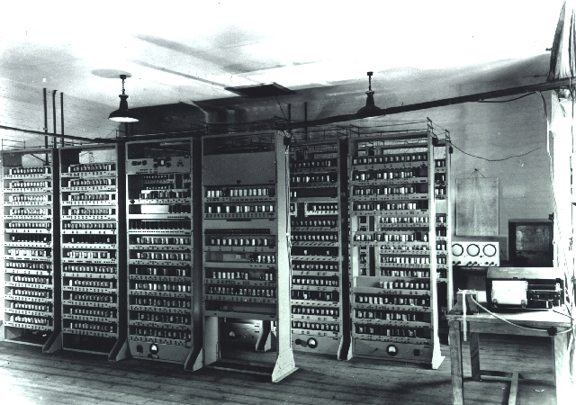
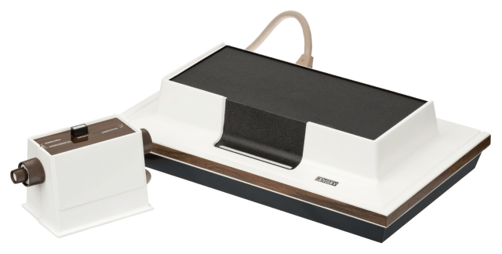
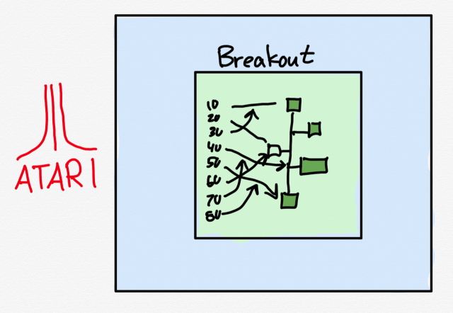
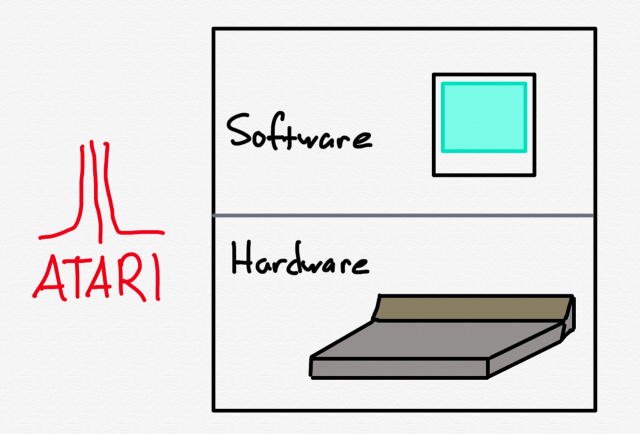
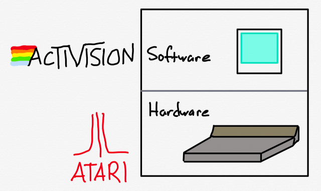
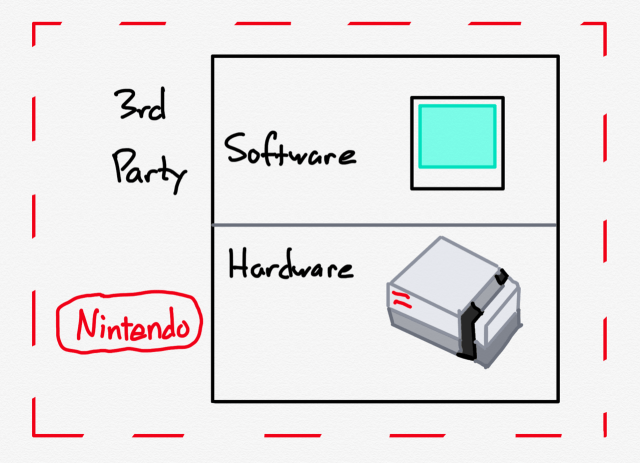
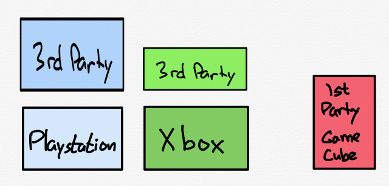
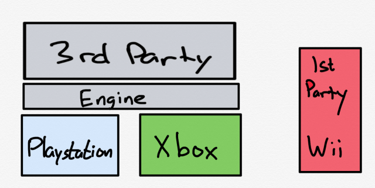
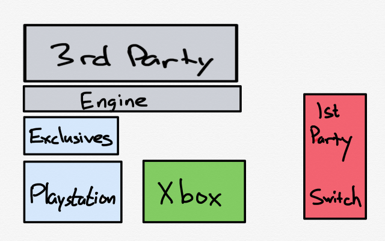
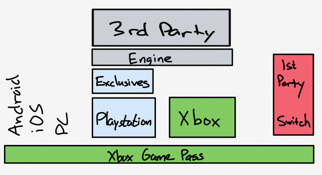

The first video game was a 1952 research product called OXO — tic-tac-toe played on a computer the size of a large room:

第一个视频游戏是 1952 年的研究产品，称为 OXO——在一个大房间那么大的电脑上玩井字游戏：

Copyright Computer Laboratory, University of Cambridge, [CC BY 2.0](https://creativecommons.org/licenses/by/2.0/deed.en)

Fifteen years later Ralph Baer produced “The Brown Box”; Magnavox licensed Baer’s device and released it as the Odyssey five years later — it was the first home video game console:

十五年后，Ralph Baer 制作了“The Brown Box”； Magnavox 获得了 Baer 的设备许可，并在五年后将其作为 Odyssey 发布——这是第一款家用视频游戏机：

The Odyssey made Magnavox a lot of money, but not through direct sales: the company sued Atari for ripping off one of the Odyssey’s games to make “Pong”, the company’s first arcade game and, in 1975, first home video game, eventually reaping over $100 million in royalties and damages. In other words, arguments about IP and control have been part of the industry from the beginning.

Odyssey 为 Magnavox 赚了很多钱，但不是通过直接销售：该公司起诉 Atari 盗用 Odyssey 的一款游戏来制作“Pong”，这是该公司的第一款街机游戏，也是 1975 年的第一款家庭视频游戏，最终收获超过 1 亿美元的特许权使用费和损害赔偿金。 换句话说，关于知识产权和控制权的争论从一开始就是这个行业的一部分。

In 1977 Atari released the 2600, the first console I ever owned:

1977 年 Atari 发布了 2600，这是我拥有的第一台游戏机：

All of the games for the Atari were made by Atari, because of course they were; IBM had unbundled mainframe software and hardware in 1969 in [an (unsuccessful) attempt to head off an antitrust case](https://stratechery.com/2019/facebooks-ftc-fine-apple-and-microsofts-mistake-ibms-unbundling/), but video games barely existed as a category in 1977. Indeed, it was only four years earlier when Steve Wozniak had partnered with Steve Jobs to design a circuit board for Atari’s _Breakout_ arcade game; this story is most well-known for the fact that Jobs lied to Wozniak about the size of the bonus he earned, but the pertinent bit for this Article is that video game development was at this point intrinsically tied to hardware.

Atari 的所有游戏都是由 Atari 制作的，因为它们当然是； IBM 在 1969 年将大型机软件和硬件分拆 [（未成功）试图阻止反托拉斯案件](https://stratechery.com/2019/facebooks-ftc-fine-apple-and-microsofts-mistake-ibms-unbundling/) ，但视频游戏在 1977 年几乎不作为一个类别存在。事实上，就在四年前史蒂夫沃兹尼亚克与史蒂夫乔布斯合作 街机游戏设计电路板 _为 Atari 的Breakout_ ； 这个故事最广为人知的事实是乔布斯向沃兹尼亚克谎报了他获得的奖金数额，但本文的相关内容是视频游戏开发在这一点上与硬件有着内在的联系。

That, though, was why the 2600 was so unique: games were not tied to hardware but rather self-contained in cartridges, meaning players would use the same system to play a whole bunch of different games:

不过，这就是 2600 如此独特的原因：游戏不依赖于硬件，而是独立于卡带中，这意味着玩家可以使用相同的系统来玩一大堆不同的游戏：

The implications of this separation did not resonate within Atari, which had been sold by founder Nolan Bushnell to Warner Communications in 1976, in an effort to get the 2600 out the door. [Game Informer explains what happened](https://www.gameinformer.com/b/features/archive/2013/02/26/activisionaries-how-four-programmers-changed-the-game-industry-forever.aspx):

这种分离的影响并没有在雅达利内部引起共鸣，雅达利创始人诺兰·布什内尔 (Nolan Bushnell) 于 1976 年将雅达利出售给华纳通信公司，目的是推出 2600。 [Game Informer 解释了发生的事情](https://www.gameinformer.com/b/features/archive/2013/02/26/activisionaries-how-four-programmers-changed-the-game-industry-forever.aspx) ：

> In early 1979, Atari’s marketing department issued a memo to its programing staff that listed all the games Atari had sold the previous year. The list detailed the percentage of sales each game had contributed to the company’s overall profits. The purpose of the memo was to show the design team what kinds of games were selling and to inspire them to create more titles of a similar breed…David Crane, Larry Kaplan, Alan Miller, and Bob Whitehead were four of Atari’s superstar programmers. Collectively, the group had been responsible for producing many of Atari’s most critical hits…
> 
> 1979 年初，Atari 的营销部门向其编程人员发出了一份备忘录，其中列出了 Atari 上一年销售的所有游戏。 该列表详细说明了每款游戏的销售额占公司整体利润的百分比。 这份备忘录的目的是向设计团队展示哪些类型的游戏正在销售，并激励他们创造更多类似的游戏……David Crane、Larry Kaplan、Alan Miller 和 Bob Whitehead 是 Atari 的四位超级明星程序员。 总的来说，该团队负责制作雅达利的许多最重要的热门歌曲……
> 
> “I remember looking at that memo with those other guys,” recalls Crane, “and we realized that we had been responsible for 60 percent of Atari’s sales in the previous year – the four of us. There were 35 people in the department, but the four of us were responsible for 60 percent of the sales. Then we found another announcement that \[Atari\] had done $100 million in cartridge sales the previous year, so that 60 percent translated into $60 million.”
> 
> “我记得和其他人一起看过那份备忘录，”Crane 回忆道，“我们意识到我们四个人在过去一年中贡献了 Atari 60% 的销售额。 这个部门有 35 个人，但我们四个人负责 60% 的销售额。 然后我们发现另一份公告称 \[Atari\] 前一年的盒式磁带销售额为 1 亿美元，因此 60% 转化为 6000 万美元。”
> 
> These four men may have produced $60 million in profit, but they were only making about $22,000 a year. To them, the numbers seemed astronomically disproportionate. Part of the problem was that when the video game industry was founded, it had molded itself after the toy industry, where a designer was paid a fixed salary and everything that designer produced was wholly owned by the company. Crane, Kaplan, Miller, and Whitehead thought the video game industry should function more like the book, music, or film industries, where the creative talent behind a project got a larger share of the profits based on its success.
> 
> 这四个人可能创造了 6000 万美元的利润，但他们每年只赚大约 22,000 美元。 对他们来说，这些数字似乎在天文数字上不成比例。 部分问题在于，当视频游戏行业成立时，它模仿了玩具行业，在玩具行业中，设计师获得固定薪水，设计师生产的所有产品都归公司所有。 Crane、Kaplan、Miller 和 Whitehead 认为视频游戏行业的运作方式应该更像书籍、音乐或电影行业，在这些行业中，项目背后的创意人才基于其成功获得更大份额的利润。
> 
> The four walked into the office of Atari CEO Ray Kassar and laid out their argument for programmer royalties. Atari was making a lot of money, but those without a corner office weren’t getting to share the wealth. Kassar – who had been installed as Atari’s CEO by parent company Warner Communications – felt obligated to keep production costs as low as possible. Warner was a massive corporation and everyone helped contribute to the company’s success. “He told us, ‘You’re no more important to those projects than the person on the assembly line who put them together. Without them, your games wouldn’t have sold anything,’” Crane remembers. “He was trying to create this corporate line that it was all of us working together that make games happen. But these were creative works, these were authorships, and he didn’t get it.”
> 
> 四人走进了 Atari CEO Ray Kassar 的办公室，摆出了他们对程序员版税的争论。 Atari 赚了很多钱，但那些没有角落办公室的人无法分享财富。 Kassar——曾被母公司Warner Communications 任命为Atari 的首席执行官——感到有义务将生产成本保持在尽可能低的水平。 华纳是一家庞大的公司，每个人都为公司的成功做出了贡献。 “他告诉我们，‘对于这些项目，你并不比装配线上组装这些项目的人更重要。 没有他们，你的游戏就不会卖出任何东西，'”Crane 回忆道。 “他试图创建一条公司路线，即我们所有人共同努力才能让游戏成为现实。 但这些是创造性的作品，这些是作者身份，他没有得到。”
> 
> “Kassar called us towel designers,” Kaplan told InfoWorld magazine back in 1983, “He said, ‘I’ve dealt with your kind before. You’re a dime a dozen. You’re not unique. Anybody can do a cartridge.’”
> 
> “Kassar 称我们为毛巾设计师，”Kaplan 在 1983 年告诉 InfoWorld 杂志，“他说，‘我以前和你们打过交道。 你一毛钱一打。 你不是独一无二的。 任何人都可以制作墨盒。'”

That “anyone” included the so-called “Gang of Four”, who decided to leave Atari and form the first 3rd-party video game company; they called it Activision.

那个“任何人”包括所谓的“四人帮”，他们决定离开 Atari 并成立第一家 3rd-party 视频游戏公司； 他们称之为动视。

### 3rd-Party Software

### 第三方软件

Activision represented the first major restructuring of the video game value chain; Steve Wozniak’s _Breakout_ was fully integrated in terms of hardware and software:

Activision 代表了视频游戏价值链的第一次重大重组； Steve Wozniak 的 _Breakout_ 在硬件和软件方面完全集成：

The Atari 2600 with its cartridge-based system modularized hardware and software:

Atari 2600 及其基于墨盒的系统模块化硬件和软件：

Activision took that modularization to its logical (and yet, at the time, unprecedented) extension, by being a different company than the one that made the hardware:

Activision 通过成为与制造硬件的公司不同的公司，将模块化扩展到其逻辑上（但在当时是前所未有的）：

Activision, which had struggled to raise money given the fact it was targeting a market that didn’t yet exist, and which faced immediate lawsuits from Atari, was a tremendous success; now venture capital was eager to fund the market, leading to a host of 3rd-party developers, few of whom had the expertise or skill of Activision. The result was a flood of poor quality games that soured consumers on the entire market, leading to the legendary video game crash of 1983: industry revenue plummeted from $3.2 billion in 1983 to a mere $100 million in 1985. Activision survived, but only by pivoting to making games for the nascent personal computing market.

Activision 一直在努力筹集资金，因为它瞄准的是一个尚不存在的市场，并且立即面临 Atari 的诉讼，但取得了巨大的成功； 现在风险资本急于为市场提供资金，导致出现了大量的第 3 方开发人员，其中很少有人拥有 Activision 的专业知识或技能。 其结果是质量低劣的游戏如潮水般涌入，令整个市场的消费者感到厌恶，导致了 1983 年传奇的视频游戏崩溃：行业收入从 1983 年的 32 亿美元暴跌至 1985 年的区区 1 亿美元。Activision 得以幸存，但只是通过转型为新兴的个人电脑市场制作游戏。

The personal computer market was modular from the start, and not just in terms of software. Compaq’s success in reverse-engineering the IBM PC’s BIOS created a market for PC-compatible computers, all of which ran the increasingly ubiquitous Microsoft operating system (first DOS, then Windows). This meant that developers like Activision could target Windows and benefit from competition in the underlying hardware.

个人电脑市场从一开始就是模块化的，而且不仅仅是在软件方面。 Compaq 在对 IBM PC 的 BIOS 进行逆向工程方面的成功为 PC 兼容计算机创造了市场，所有这些计算机都运行越来越普遍的 Microsoft 操作系统（首先是 DOS，然后是 Windows）。 这意味着像 Activision 这样的开发商可以瞄准 Windows 并从底层硬件的竞争中获益。

Moreover, there were so many more use cases for the personal computer, along with a burgeoning market in consumer-focused magazines that reviewed software, that the market was more insulated from the anarchy that all but destroyed the home console market.

此外，个人电脑有更多的用例，以及以消费者为中心的软件评论杂志的新兴市场，市场更加不受几乎摧毁家用游戏机市场的无政府状态的影响。

That market saw a rebirth with Nintendo’s Famicom system, christened the “Nintendo Entertainment System” for the U.S. market (Nintendo didn’t want to call it a console to avoid any association with the 1983 crash, which devastated not just video game makers but also retailers). Nintendo created its own games like Super Mario Bros. and Zelda, but also implemented exacting standards for 3rd-party developers, requiring them to pass a battery of tests and pay a 30% licensing fee for a maximum of five games a year; only then could they receive a dedicated chip for their cartridge that allowed it to work in the NES.

该市场见证了任天堂 Famicom 系统的重生，为美国市场命名为“Nintendo Entertainment System”（任天堂不想将其称为游戏机以避免与 1983 年的崩盘有任何关联，那场崩盘不仅摧毁了视频游戏制造商，也摧毁了零售商）。 任天堂开发了自己的游戏，如《超级马里奥兄弟》和《塞尔达传说》，但也对第 3 方开发者实施了严格的标准，要求他们通过一系列测试，并为每年最多 5 款游戏支付 30% 的许可费； 只有这样，他们才能为他们的墨盒获得专用芯片，使其能够在 NES 中工作。

Nintendo’s firm control of the third-party developer market may look familiar: it was an early precedent for the App Store battles of the last decade. Many of the same principles were in play:

任天堂对第三方开发者市场的牢牢控制看起来似曾相识：这是过去十年 App Store 大战的早期先例。 许多相同的原则在起作用：

-   Nintendo had a legitimate interest in ensuring quality, not simply for its own sake but also on behalf of the industry as a whole; similarly, the App Store, following as it did years of malware and viruses in the PC space, restored customer confidence in downloading third-party software.
-   任天堂在确保质量方面拥有合法利益，不仅是为了自己，也是为了整个行业。 同样，App Store 在经历了 PC 领域多年的恶意软件和病毒之后，恢复了客户下载第三方软件的信心。
-   It was Nintendo that created the 30% share for the platform owner that all future console owners would implement, and which Apple would set as the standard for the App Store.
-   任天堂为平台所有者创造了 30% 的份额，所有未来的控制台所有者都将实施，Apple 将其设定为 App Store 的标准。
-   While Apple’s App Store lockdown is rooted in software, Nintendo had the same problem that Atari had in terms of the physical separation of hardware and software; this was overcome by the aforementioned lockout chips, along with branding the Nintendo “Seal of Quality” in an attempt to fight counterfeit lockout chips.
-   虽然苹果的 App Store 锁定植根于软件，但任天堂在硬件和软件的物理分离方面遇到了与 Atari 相同的问题； 前面提到的锁定芯片以及为任天堂打上“质量印章”品牌以打击假冒锁定芯片克服了这一点。

Nintendo’s strategy worked, but it came with long-term costs: developers, particularly in North America, hated the company’s restrictions, and were eager to support a challenger; said challenger arrived in the form of the Sega Genesis, which launched in the U.S. in 1989. Sega initially followed Nintendo’s model of tight control, but Electronic Arts reverse-engineered Sega’s system, and threatened to create their own rival licensing program for the Genesis if Sega didn’t dramatically loosen their controls and lower their royalties; Sega acquiesced and went on to fight the Super Nintendo, which arrived in the U.S. in 1991, to a draw, thanks in part to a larger library of third-party games.

任天堂的战略奏效了，但它带来了长期成本：开发商，尤其是北美的开发商，讨厌公司的限制，并渴望支持挑战者； 所说的挑战者是 1989 年在美国推出的 Sega Genesis。Sega 最初遵循任天堂的严格控制模式，但 Electronic Arts 对 Sega 的系统进行了逆向工程，并威胁要为 Genesis 创建自己的竞争许可计划，如果世嘉并没有大幅放松控制并降低版税； 世嘉默许并继续与 1991 年登陆美国的超级任天堂打成平局，这在一定程度上要归功于更大的第三方游戏库。

### Sony’s Emergence

### 索尼的崛起

The company that truly took the opposite approach to Nintendo was Sony; after being spurned by Nintendo in humiliating fashion — Sony announced the Play Station CD-ROM add-on at CES in 1991, only for Nintendo to abandon the project the next day — the electronics giant set out to create their own console which would focus on 3D-graphics and package games on CD-ROMs instead of cartridges. The problem was that Sony wasn’t a game developer, so it started out completely dependent on 3rd-party developers.

真正与任天堂采取相反做法的公司是索尼。 在被任天堂以羞辱性的方式拒绝之后——索尼于 1991 年在 CES 上宣布了 Play Station CD-ROM 附加组件，结果任天堂第二天就放弃了这个项目——这家电子巨头开始创建自己的游戏机，专注于CD-ROM 而非卡带上的 3D 图形和打包游戏。 问题是索尼不是游戏开发商，所以它一开始完全依赖第 3 方开发商。

One of the first ways that Sony addressed this was by building an early partnership with Namco, Sega’s biggest rival in terms of arcade games. Coin-operated arcade games were still a major market in the 1990s, with more revenue than the home market for the first half of the decade. Arcade games had superior graphics and control systems, and were where new games launched first; the eventual console port was always an imitation of the original. The problem, however, is that it was becoming increasingly expensive to build new arcade hardware, so Sony proposed a partnership: Namco could use modified PlayStation hardware as the basis of its System 11 arcade hardware, which would make it easy to port its games to PlayStation. Namco, which also rebuilt its more powerful Ridge Racer arcade game for the PlayStation, took Sony’s offer: Ridge Racer launched with the Playstation, and Tekken was a massive hit given its near perfect fidelity to the arcade version.

索尼解决这个问题的首要方法之一是与世嘉在街机游戏方面最大的竞争对手南梦宫建立早期合作伙伴关系。 投币式街机游戏在 1990 年代仍然是一个主要市场，在 20 世纪的前五年收入超过国内市场。 街机游戏具有卓越的图形和控制系统，并且是新游戏最先推出的地方； 最终的控制台端口始终是对原始端口的模仿。 然而，问题在于构建新街机硬件的成本越来越高，因此索尼提出了一种合作伙伴关系：Namco 可以使用修改后的 PlayStation 硬件作为其 System 11 街机硬件的基础，这样可以很容易地将其游戏移植到游戏机。 Namco 也为 PlayStation 重建了更强大的 Ridge Racer 街机游戏，接受了 Sony 的提议：Ridge Racer 与 Playstation 一起推出，而 Tekken 由于其对街机版本近乎完美的保真度而大受欢迎。

Sony was much better for 3rd-party developers in other ways, as well: while the company maintained a licensing program, its royalty rates were significantly lower than Nintendo’s, and the cost of manufacturing CD-ROMs was much lower than manufacturing cartridges; this was a double whammy for the Nintendo 64 because while cartridges were faster and offered the possibility of co-processor add-ons, what developers really wanted was the dramatically increased amount of storage CD-ROMs afforded. The Playstation was also the first console to enable development on the PC in a language (C) that was well-known to existing developers. In the end, despite the fact that the Nintendo 64 had more capable hardware than the PlayStation, it was the PlayStation that won the generation thanks to a dramatically larger game library, the vast majority of which were third-party games.

索尼在其他方面也对第 3 方开发人员有利得多：虽然该公司维持许可计划，但其专利费率明显低于任天堂，而且制造 CD-ROM 的成本远低于制造盒带的成本； 这对 Nintendo 64 来说是双重打击，因为虽然盒式磁带速度更快并且提供了协处理器附加组件的可能性，但开发人员真正想要的是显着增加的存储 CD-ROM 数量。 Playstation 也是第一个使用现有开发人员熟知的语言 (C) 在 PC 上进行开发的游戏机。 最后，尽管 Nintendo 64 拥有比 PlayStation 更强大的硬件，但 PlayStation 凭借更大的游戏库赢得了这一代人的胜利，其中绝大多数是第三方游戏。

Sony extended that advantage with the PlayStation 2, which was backwards compatible with the PlayStation, meaning it had a massive library of 3rd-party games immediately; the newly-launched Xbox, which was basically a PC, and thus easy to develop for, made a decent showing, while Nintendo struggled with the Gamecube, which had both a non-standard controller and non-standard microdisks that once again limited the amount of content relative to the DVDs used for PlayStation 2 and Xbox (and it couldn’t function as a DVD player, either).

索尼通过 PlayStation 2 扩展了这一优势，它向后兼容 PlayStation，这意味着它立即拥有大量的第 3 方游戏库； 新推出的 Xbox 基本上是一台 PC，因此易于开发，表现不错，而任天堂则在 Gamecube 上苦苦挣扎，它既有非标准控制器，也有非标准微磁盘，再次限制了数量与用于 PlayStation 2 和 Xbox 的 DVD 相关的内容（它也不能用作 DVD 播放器）。

This period for video games was the high point in terms of console competition for 3rd-party developers for two reasons:

这个视频游戏时期是第 3 方开发者主机竞争的高潮，原因有二：

-   First, there were still meaningful choices to be made in terms of hardware and the overall development environment, as epitomized by Sony’s use of CD-ROMs instead of cartridges.
-   首先，在硬件和整体开发环境方面仍需做出有意义的选择，索尼使用 CD-ROM 而非盒式磁带就是一个缩影。
-   Second, developers were still constrained by the cost of developing for distinct architectures, which meant it was important to make the right choice (which dramatically increased the return of developing for the same platform as everyone else).
-   其次，开发人员仍然受到针对不同架构的开发成本的限制，这意味着做出正确的选择很重要（这极大地增加了与其他人一样针对同一平台进行开发的回报）。

It was the Sony-Namco partnership, though, that was a harbinger of the future: it behooved console makers to have similar hardware and software stacks to their competitors, so that developers would target them; developers, meanwhile, were devoting an increasing share of their budget to developing assets, particularly when the PS3/Xbox 360 generation targeted high definition, which increased their motivation to be on multiple platforms to better leverage their investments. It was Sony that missed this shift: the PS3 had a complicated Cell processor that was hard to develop for, and a high price thanks to its inclusion of a Blu-Ray player; the Xbox 360 had launched earlier with a simpler architecture, and most developers built for the Xbox first and Playstation 3 second (even if they launched at the same time).

不过，正是索尼与南梦宫的合作伙伴关系预示着未来：游戏机制造商理应拥有与其竞争对手相似的硬件和软件堆栈，以便开发人员瞄准它们； 与此同时，开发人员将越来越多的预算用于开发资产，尤其是当 PS3/Xbox 360 一代以高清为目标时，这增加了他们在多个平台上更好地利用其投资的动力。 索尼错过了这一转变：PS3 有一个复杂的 Cell 处理器，很难开发，而且由于包含蓝光播放器而价格很高； Xbox 360 发布时间更早，架构更简单，大多数开发人员首先为 Xbox 构建，然后为 Playstation 3 构建（即使它们同时发布）。

The real shift, though, was the emergence of game engines as the dominant mode of development: instead of building a game for a specific console, it made much more sense to build a game for a specific engine which abstracted away the underlying hardware. Sometimes these game engines were internally developed — Activision launched its Call of Duty franchise in this time period (after emerging from bankruptcy under new CEO Bobby Kotick) — and sometimes they were licensed (i.e. Epic’s Unreal Engine). The impact, though, was in some respects similar to cartridges on the Atari 2600:

然而，真正的转变是游戏引擎的出现成为主导的开发模式：与其为特定的控制台构建游戏，不如为抽象出底层硬件的特定引擎构建游戏更有意义。 有时，这些游戏引擎是内部开发的——Activision 在此期间推出了《使命召唤》特许经营权（在新任 CEO Bobby Kotick 的领导下摆脱破产后）——有时它们是获得许可的（即 Epic 的虚幻引擎）。 不过，这种影响在某些方面类似于 Atari 2600 上的墨盒：

In this new world it was the consoles themselves that became modularized: consumers picked out their favorite and 3rd-party developers delivered their games on both.

在这个新世界中，控制台本身变得模块化：消费者挑选出他们最喜欢的游戏，而第 3 方开发人员则在两者上交付他们的游戏。

Nintendo, meanwhile, dominated the generation with the Nintendo Wii. What was interesting, though, is that 3rd-party support for the Wii was still lacking, in part because of the underpowered hardware (in contrast to previous generations): the Wii sold well because of its unique control method — which most people used to play Wii Sports — and Nintendo’s first-party titles. It was, in many respects, Nintendo’s most vertically-integrated console yet, and was incredibly successful.

与此同时，任天堂凭借任天堂 Wii 统治了这一代。 不过，有趣的是，仍然缺乏对 Wii 的第 3 方支持，部分原因是硬件动力不足（与前几代相比）：Wii 之所以畅销，是因为其独特的控制方法——大多数人习惯于使用这种方法玩 Wii Sports — 和任天堂的第一方游戏。 在许多方面，它是任天堂迄今为止垂直整合程度最高的游戏机，并且取得了令人难以置信的成功。

### Sony Exclusives

### 索尼独家

Sony’s pivot after the (relatively) disappointing PlayStation 3 was brilliant: if the economic imperative for 3rd-party developers was to be on both Xbox and PlayStation (and the PC), and if game engines made that easy to implement, then there was no longer any differentiation to be had in catering to 3rd-party developers.

索尼在（相对）令人失望的 PlayStation 3 之后的转变非常出色：如果 3rd 方开发者的经济需要同时出现在 Xbox 和 PlayStation（以及 PC）上，并且如果游戏引擎使它易于实现，那么就没有在迎合第 3 方开发人员方面不再有任何差异化。

Instead Sony beefed up its internal game development studios and bought up several external ones, with the goal of creating PlayStation 4 exclusives. Now some portion of new games would not be available on Xbox not because it had crappy cartridges or underpowered graphics, but because Sony could decide to limit its profit on individual titles for the sake of the broader PlayStation 4 ecosystem. After all, there would still be a lot of 3rd-party developers; if Sony had more consoles than Microsoft because of its exclusives, then it would harvest more of those 3rd-party royalty fees.

相反，索尼加强了其内部游戏开发工作室并收购了几个外部游戏开发工作室，目标是打造 PlayStation 4 独家游戏。 现在，部分新游戏无法在 Xbox 上使用，不是因为它的卡带质量差或图像处理能力不足，而是因为为了更广泛的 PlayStation 4 生态系统，索尼可能决定限制其在个别游戏上的利润。 毕竟，仍然会有很多 3rd 方开发人员； 如果索尼因为独占而拥有比微软更多的游戏机，那么它会从这些第 3 方专利费中收获更多。

Those fees, by the way, started to head back up, particularly for digital-only versions, which returned to that 30% cut that Nintendo had pioneered many years prior; this is the downside of depending on universal abstractions like game engines while bearing high development costs: you have no choice but to be on every platform no matter how much it costs.

顺便说一句，这些费用开始回升，特别是对于纯数字版本，它又回到了任天堂多年前率先实行的 30% 的削减； 这就是依赖游戏引擎等通用抽象并承担高昂开发成本的缺点：你别无选择，只能在每个平台上使用，无论成本多少。

Sony bet correctly: the PS4 dominated its generation, helped along by Microsoft making a bad bet of its own by packing in the Kinect with the Xbox One. It was a repeat of Sony’s mistake with the PS3, in that it was a misguided attempt to differentiate in hardware when the fundamental value chain had long since dictated that the console was increasingly a commodity. Content is what mattered — at least as long as the current business model persisted.

索尼赌对了：PS4 主导了这一代产品，微软也做出了一个糟糕的赌注，将 Kinect 与 Xbox One 捆绑在一起。 这是索尼在 PS3 上重蹈覆辙，因为当基本价值链早已规定游戏机越来越成为一种商品时，这是一种在硬件上进行差异化的错误尝试。 内容才是最重要的——至少只要当前的商业模式持续存在。

Nintendo, meanwhile, continued to march to its own vertically-integrated drum: after the disastrous Wii U the company quickly pivoted to the Nintendo Switch, which continues to leverage its truly unique portable form factor and Nintendo’s first-party games to huge sales. Third party support, though, remains extremely tepid; it’s just too underpowered, and the sort of person that cares about third-party titles like Madden or Call of Duty has long since bought a PlayStation or Xbox.

与此同时，任天堂继续推进自己的垂直整合鼓：在灾难性的 Wii U 之后，该公司迅速转向任天堂 Switch，继续利用其真正独特的便携式外形和任天堂的第一方游戏来实现巨大的销售。 但是，第三方支持仍然非常不温不火。 它的动力太弱了，那种关心第三方游戏的人，比如麦登 (Madden) 或使命召唤 (Call of Duty)，早就买了 PlayStation 或 Xbox。

### The FTC vs. Microsoft

### FTC 与微软

Forty years of context may seem like overkill when it comes to examining [the FTC’s attempt to block Microsoft’s acquisition of Activision](https://www.ftc.gov/news-events/news/press-releases/2022/12/ftc-seeks-block-microsoft-corps-acquisition-activision-blizzard-inc), but I think it is essential for multiple reasons.

时，四十年的背景似乎有点过分 [在审查FTC 阻止微软收购 Activision 的企图](https://www.ftc.gov/news-events/news/press-releases/2022/12/ftc-seeks-block-microsoft-corps-acquisition-activision-blizzard-inc) ，但我认为出于多种原因，这是必不可少的。

First, the video game market has proven to be extremely dynamic, particularly in terms of 3rd-party developers:

首先，事实证明视频游戏市场非常活跃，尤其是在第 3 方开发人员方面：

-   Atari was vertically integrated
-   Atari 是垂直整合的
-   Nintendo grew the market with strict control of 3rd-party developers
-   任天堂通过严格控制第 3 方开发者来扩大市场
-   Sony took over the market by catering to 3rd-party developers and differentiating on hardware
-   索尼通过迎合第 3 方开发人员和硬件差异化占领了市场
-   Xbox’s best generation leaned into increased commodification and ease-of-development
-   Xbox 最好的一代倾向于增加商品化和易于开发
-   Sony retook the lead by leaning back into vertical integration
-   索尼重回垂直整合，重新占据领先地位

That is quite the round trip, and it’s worth pointing out that attempting to freeze the market in its current iteration at any point over the last forty years would have foreclosed future changes.

这是一个相当大的往返，值得指出的是，试图在过去四十年的任何时候冻结当前迭代的市场都会阻止未来的变化。

At the same time, Sony’s vertical integration seems more sustainable than Atari’s. First, Sony owns the developers who make the most compelling exclusives for its consoles; they can’t simply up-and-leave like the Gang of Four. Second, the costs of developing modern games has grown so high that any 3rd-party developer has no choice but to develop for all relevant consoles. That means that there will never be a competitor who wins by offering 3rd-party developers a better deal; the only way to fight back is to have developers of your own, or a completely different business model.

与此同时，索尼的垂直整合似乎比 Atari 的更具可持续性。 首先，索尼拥有为其游戏机制作最引人注目的独家游戏的开发者； 他们不能像四人帮那样简单地离开。 其次，现代游戏的开发成本如此之高，以至于任何第 3 方开发者都别无选择，只能为所有相关游戏机开发。 这意味着永远不会有竞争对手通过为 3rd 方开发人员提供更好的交易而获胜； 反击的唯一方法是拥有自己的开发人员或完全不同的商业模式。

The first fear raised by the FTC is that Microsoft, by virtue of acquiring Activision, is looking to fight its own exclusive war, and at first blush it’s a reasonable concern. After all, Activision has some of the most popular 3rd-party games, particularly the aforementioned Call of Duty franchise. The problem with this reasoning, though, is that the price Microsoft paid for Activision was a multiple of Activision’s current revenues, which include billions of dollars for games sold on Playstation. To suddenly cut Call of Duty (or Activision’s other multi-platform titles) off from Playstation would be massively value destructive; no wonder Microsoft said it was happy to sign a 10-year deal with Sony to keep Call of Duty on PlayStation.

FTC 提出的第一个担忧是，微软通过收购 Activision，正在寻求打一场自己的排他性战争，乍一看，这是一个合理的担忧。 毕竟，Activision 拥有一些最受欢迎的第 3 方游戏，尤其是前面提到的《使命召唤》系列。 然而，这种推理的问题在于，微软为 Activision 支付的价格是 Activision 当前收入的数倍，其中包括在 Playstation 上销售的数十亿美元游戏。 突然从 Playstation 中删除使命召唤（或 Activision 的其他多平台游戏）将具有巨大的价值破坏性； 难怪微软表示很高兴与索尼签署一份为期 10 年的协议，以在 PlayStation 上保留《使命召唤》。

Just for clarity’s sake, the distinction here from Sony’s strategy is the fact that Microsoft is acquiring these assets. It’s one thing to develop a game for your own platform — you’re building the value yourself, and choosing to harvest it with an ecosystem strategy as opposed to maximizing that games’ profit. An acquirer, though, has to pay for the business model that already exists.

为清楚起见，此处与索尼战略的区别在于微软正在收购这些资产。 为自己的平台开发游戏是一回事——您是在自己创造价值，并选择通过生态系统战略收获它，而不是最大化游戏的利润。 然而，收购方必须为已经存在的商业模式付费。

At the same time, though, it’s no surprise that Microsoft has taken in-development assets from its other acquisition like ZeniMax and made them exclusives; that is the Sony strategy, and Microsoft was very clear when it acquired ZeniMax that it would keep cross-platform games cross-platform but may pursue a different strategy for new intellectual property. CEO of Microsoft Gaming Phil Spencer [told Bloomberg at the time](https://www.bloomberg.com/news/articles/2020-09-21/microsoft-to-buy-bethesda-studios-for-7-5-billion-to-boost-xbox):

不过，与此同时，微软从其他收购项目（如 ZeniMax）中获取开发中的资产并使其独占也就不足为奇了； 这就是索尼的战略，而微软在收购 ZeniMax 时非常清楚，它将保持跨平台游戏的跨平台性，但可能会针对新的知识产权采取不同的战略。 微软游戏首席执行官 Phil Spencer [当时告诉彭博社](https://www.bloomberg.com/news/articles/2020-09-21/microsoft-to-buy-bethesda-studios-for-7-5-billion-to-boost-xbox) ：

> In terms of other platforms, we’ll make a decision on a case-by-case basis.
> 
> 至于其他平台，我们会根据具体情况做出决定。

Given this, it’s positively bizarre that the FTC also claims that Microsoft lied to the E.U. with regards to its promises surrounding the ZeniMax acquisition: the company was very clear that existing cross-platform games would stay cross-platform, and made no promises about future IP. Indeed, the FTC’s claims were so off-base that the European Commission felt the need to clarify that Microsoft didn’t mislead the E.U.; from [Mlex](https://content.mlex.com/#/content/1434203):

鉴于此，联邦贸易委员会还声称微软就其围绕 ZeniMax 收购的承诺向欧盟撒谎，这实在是太奇怪了：该公司非常清楚现有的跨平台游戏将保持跨平台，并且没有对未来做出任何承诺知识产权。 事实上，联邦贸易委员会的说法离谱，以至于欧盟委员会觉得有必要澄清微软没有误导欧盟； 来自 [Mlex](https://content.mlex.com/#/content/1434203) ：

> Microsoft didn’t make any “commitments” to EU regulators not to release Xbox-exclusive content following its takeover of ZeniMax Media, the European Commission has said. US enforcers yesterday suggested that the US tech giant had misled the regulator in 2021 and cited that as a reason to challenge its proposed acquisition of Activision Blizzard. “The commission cleared the Microsoft/ZeniMax transaction unconditionally as it concluded that the transaction would not raise competition concerns,” the EU watchdog said in an emailed statement.
> 
> 欧盟委员会表示，在收购 ZeniMax Media 后，微软并未向欧盟监管机构做出任何不发布 Xbox 独占内容的“承诺”。 美国执法人员昨天表示，这家美国科技巨头在 2021 年误导了监管机构，并以此为理由挑战其收购动视暴雪的提议。 “委员会无条件批准了微软/ZeniMax 交易，因为它得出的结论是该交易不会引起竞争担忧，”欧盟监管机构在一份电子邮件声明中表示。
> 
> The absence of competition concerns “did not rely on any statements made by Microsoft about the future distribution strategy concerning ZeniMax’s games,” said the commission, which itself has opened an in-depth probe into the Activision Blizzard deal and appears keen to clarify what happened in the previous acquisition. The EU agency found that even if Microsoft were to restrict access to ZeniMax titles, it wouldn’t have a significant impact on competition because rivals wouldn’t be denied access to an “essential input,” and other consoles would still have a “large array” of attractive content.
> 
> 该委员会表示，没有竞争担忧“并不依赖于微软就 ZeniMax 游戏的未来分销策略发表的任何声明”，该委员会本身已经对动视暴雪的交易展开了深入调查，并且似乎很想澄清发生了什么在之前的收购中。 欧盟机构发现，即使微软限制对 ZeniMax 游戏的访问，也不会对竞争产生重大影响，因为竞争对手不会被拒绝访问“基本输入”，而其他游戏机仍然有“大量阵列”的有吸引力的内容。

The FTC’s concerns about future IP being exclusive ring a bit hypocritical given the fact that Sony has been pursuing the exact same strategy — including multiple acquisitions — without any sort of regulatory interference; more than that, though, to effectively make up a crime is disquieting. To be fair, those Sony acquisitions were a lot smaller than Activision, but this goes back to the first point: the entire reason Activision is expensive is because of its already-in-market titles, which Microsoft has every economic incentive to keep cross-platform (and which it is willing to commit to contractually).

FTC 对未来 IP 独占的担忧有点虚伪，因为索尼一直在追求完全相同的战略——包括多次收购——而没有任何形式的监管干预； 然而，更重要的是，有效地编造犯罪令人不安。 公平地说，索尼的收购规模远小于动视，但这又回到了第一点：动视昂贵的全部原因是它已经上市的游戏，微软有充分的经济动机来保持交叉平台（并且它愿意通过合同承诺）。

### Whither Competition

### 竞争何去何从

It’s the final FTC concern, though, that I think is dangerous. From [the complaint](https://www.ftc.gov/system/files/ftc_gov/pdf/D09412MicrosoftActivisionAdministrativeComplaintPublicVersionFinal.pdf):

不过，我认为这是 FTC 的最后一个担忧，这很危险。 来自 [投诉](https://www.ftc.gov/system/files/ftc_gov/pdf/D09412MicrosoftActivisionAdministrativeComplaintPublicVersionFinal.pdf) ：

> These effects are likely to be felt throughout the video gaming industry. The Proposed Acquisition is reasonably likely to substantially lessen competition and/or tend to create a monopoly in both well-developed and new, burgeoning markets, including highperformance consoles, multi-game content library subscription services, and cloud gaming subscription services…
> 
> 整个视频游戏行业都可能感受到这些影响。 拟议收购很可能会大幅减少竞争和/或倾向于在发达市场和新兴市场形成垄断，包括高性能游戏机、多游戏内容库订阅服务和云游戏订阅服务……
> 
> Multi-Game Content Library Subscription Services comprise a Relevant Market. The anticompetitive effects of the Proposed Acquisition also are reasonably likely to occur in any relevant antitrust market that contains Multi-Game Content Library Subscription Services, including a combined Multi-Game Content Library and Cloud Gaming Subscription Services market.
> 
> 多游戏内容库订阅服务构成一个相关市场。 拟议收购的反竞争影响也很可能发生在任何包含多游戏内容库订阅服务的相关反垄断市场，包括综合多游戏内容库和云游戏订阅服务市场。
> 
> Cloud Gaming Subscription Services are a Relevant Market. The anticompetitive effects of the Proposed Acquisition alleged in this complaint are also likely to occur in any relevant antitrust market that contains Cloud Gaming Subscription Services, including a combined Multi-Game Content Library and Cloud Gaming Subscription Services market.
> 
> 云游戏订阅服务是一个相关市场。 本投诉中指控的拟议收购的反竞争影响也可能发生在任何包含云游戏订阅服务的相关反垄断市场，包括多游戏内容库和云游戏订阅服务市场。

“Multi-Game Content Library Subscription Services” and “Cloud Gaming Subscription Services” are, indeed, the reason why Microsoft wants to do this deal. [I explained the rationale when Microsoft acquired ZeniMax](https://stratechery.com/2020/microsoft-and-zenimax-microsoft-ignite-microsoft-and-covid/):

“多游戏内容库订阅服务”和“云游戏订阅服务”确实是微软想要做这笔交易的原因。 [我解释了微软收购 ZeniMax 的原因](https://stratechery.com/2020/microsoft-and-zenimax-microsoft-ignite-microsoft-and-covid/) ：

> A huge amount of discussion around this acquisition was focused on Microsoft needing its own stable of exclusives in order to compete with Sony, but it’s important to note that making all of ZeniMax’s games exclusives would be hugely value destructive, at least in the short-to-medium term. Microsoft is paying $7.5 billion for a company that currently makes money selling games on PC, Xbox, and PS5, and simply cutting off one of those platforms — particularly when said platform is willing to pay extra for mere timed exclusives, not all-out exclusives — is to effectively throw a meaningful chunk of that value away. That certainly doesn’t fit with Nadella’s statement that “each layer has to stand on its own for what it brings”…
> 
> 围绕这次收购的大量讨论都集中在微软需要自己稳定的独家游戏以与索尼竞争，但重要的是要注意，让 ZeniMax 的所有游戏成为独家游戏将具有巨大的价值破坏性，至少在短期内是这样。 - 中期。 微软斥资 75 亿美元收购一家目前通过在 PC、Xbox 和 PS5 上销售游戏赚钱的公司，并简单地切断其中一个平台——特别是当该平台愿意为仅限时独占而非全面独占支付额外费用时- 是有效地丢弃该价值中有意义的一部分。 这当然不符合纳德拉的说法，即“每一层都必须独立于它带来的东西”......
> 
> Microsoft isn’t necessarily buying ZeniMax to make its games exclusive, but rather to apply a new business model to them — specifically, the Xbox Game Pass subscription. This means that Microsoft could, if it chose, have its cake and eat it too: sell ZeniMax games at their usual $60~$70 price on PC, PS5, Xbox, etc., while also making them available from day one to Xbox Game Pass subscribers. It won’t take long for gamers to quickly do the math: $180/year — i.e. three games bought individually — gets you access to all of the games, and not just on one platform, but on all of them, from PC to console to phone.
> 
> 微软购买 ZeniMax 不一定是为了使其游戏独占，而是为了应用一种新的商业模式——具体来说，就是 Xbox Game Pass 订阅。 这意味着，如果微软愿意，它也可以吃蛋糕和吃它：在 PC、PS5、Xbox 等平台上以通常 60 至 70 美元的价格销售 ZeniMax 游戏，同时从第一天起就可以使用 Xbox Game Pass订户。 游戏玩家很快就能算出：每年 180 美元——即单独购买三款游戏——让你可以访问所有游戏，不仅在一个平台上，而且在所有平台上，从 PC 到游戏机打电话。
> 
> Sure, some gamers will insist on doing things the old way, and that’s fine: Microsoft can make the same money ZeniMax would have as an independent company. Everyone else can buy into Microsoft’s model, taking advantage of the sort of win-win-win economics that characterize successful bundles. And, if they have a PS5 and thus can’t get access to Xbox Game Pass on their TVs, an Xbox is only an extra $10/month away.
> 
> 当然，一些游戏玩家会坚持以旧方式做事，这很好：微软可以赚到与 ZeniMax 作为一家独立公司一样的钱。 其他所有人都可以购买微软的模式，利用成功捆绑销售所特有的双赢经济模式。 而且，如果他们有 PS5，因此无法在他们的电视上访问 Xbox Game Pass，那么 Xbox 每月只需额外支付 10 美元。

Microsoft is willing to cannibalize itself to build a new business model for video games, and it’s a business model that is pretty darn attractive for consumers. It’s also a business model that Activision wouldn’t pursue on its own, because it has its own profits to protect. Most importantly, though, it’s a business model that is anathema to Sony: making titles broadly available to consumers on a subscription basis is [the exact opposite of the company’s exclusive strategy](https://stratechery.com/2020/ps5-and-xbox-sonys-console-microsofts-service/), which is all about locking consumers into Sony’s platform.

微软愿意自相残杀，为视频游戏建立一种新的商业模式，这种商业模式对消费者来说非常有吸引力。 这也是 Activision 不会自行追求的商业模式，因为它有自己的利润需要保护。 不过，最重要的是，这是一种令索尼深恶痛绝的商业模式：在订阅的基础上向消费者广泛提供游戏内容与 [该公司的独家战略完全相反](https://stratechery.com/2020/ps5-and-xbox-sonys-console-microsofts-service/) ，后者旨在将消费者锁定在索尼的平台上。

Here’s the thing: isn’t this a textbook example of competition? The FTC is seeking to preserve a model of competition that was last relevant in the PS2/Xbox generation, but that plane of competition has long since disappeared. The console market as it is today is one that is increasingly boring for consumers, precisely because Sony has won. What is compelling about Microsoft’s approach is that they are making a bet that offering consumers a better deal is the best way to break up Sony’s dominance, and this is somehow a bad thing?

事情是这样的：这不是竞争的教科书例子吗？ FTC 正在寻求保留一种在 PS2/Xbox 一代中最后相关的竞争模式，但这种竞争模式早已消失。 今天的游戏机市场对消费者来说越来越无聊，正是因为索尼赢了。 微软的做法令人信服的地方在于，他们正在打赌，为消费者提供更好的交易是打破索尼统治地位的最佳方式，而这在某种程度上是一件坏事吗？

What makes this determination to outlaw future business models particularly frustrating is that the real threat to gaming today is the dominance of storefronts that exact their own tax while contributing nothing to the development of the industry. The App Store and Google Play leverage software to extract 30% from mobile games just because they can — and sure, go ahead and make the same case about Microsoft and Sony. If the FTC can’t be bothered to check the blatant self-favoring inherent in these models, at the minimum it seems reasonable to give a chance to a new kind of model that could actual push consumers to explore alternative ways to game on their devices.

让这种取缔未来商业模式的决定特别令人沮丧的是，当今游戏的真正威胁是店面的主导地位，这些店面征收自己的税款，而对行业的发展毫无贡献。 App Store 和 Google Play 利用软件从手机游戏中提取 30% 的利润，只是因为它们可以——当然，继续对微软和索尼做同样的事情。 如果联邦贸易委员会懒得去检查这些模型中固有的公然自利行为，那么至少给一种新的模型机会似乎是合理的，这种模型实际上可以推动消费者探索在他们的设备上玩游戏的替代方式.

For the record, I do believe this acquisition demands careful overview, and it’s completely appropriate to insist that Microsoft continue to deliver Activision titles to other platforms, even if it wouldn’t make economic sense to do anything but. It’s increasingly difficult, though, to grasp any sort of coherent theory to the FTC’s antitrust decisions beyond ‘big tech bad’. There are real antitrust issues in the industry, but that requires actually understanding the industry to tease them out; that sort of understanding applied to this case would highlight Sony’s actual dominance and that having multiple compelling platforms with different business models is the essence of competition.

郑重声明，我确实认为这次收购需要仔细审视，坚持微软继续向其他平台提供 Activision 游戏是完全合适的，即使除此之外做任何事情都没有经济意义。 然而，除了“大型科技坏事”之外，越来越难以掌握 FTC 反垄断决定的任何连贯理论。 这个行业确实存在反垄断问题，但这需要真正了解这个行业才能梳理出来； 应用于此案例的这种理解将突出索尼的实际主导地位，并且拥有多个具有不同商业模式的引人注目的平台是竞争的本质。
