Some of the best PMs I know make their decisions based on first principles. A first principle is a _“basic, foundational proposition or assumption that cannot be deduced from any other proposition or assumption.”._

我认识的一些最好的项目经理是根据基本原则做出决定的。第一个原则是“一个基本的、基础性的命题或假设，它不能从任何其他命题或假设中推导出来。”

An example of one that we use for our developer platform team are that _“all platform features should be like Lego blocks”_, meaning that developers should be able to use any combination of features when building an app. Features should be interoperable, just like Legos.

我们在开发平台团队中使用的一个例子是“所有平台功能都应该像乐高积木一样”，这意味着开发人员在构建应用程序时应该能够使用任何功能组合。功能应该是可互操作的，就像乐高一样。

First principle thinking helps PMs because as companies scale, communicating the rationale behind historical, current, and future decisions can be simplified in a way that their team and stakeholders can rally around. This enables people around the PM to move quickly in the same direction, decouple, and make smart trade offs without their presence.

第一原则思维有助于项目经理，因为随着公司规模的扩大，沟通历史、当前和未来决策背后的理由可以简化，他们的团队和利益相关者可以团结在一起。这使首相周围的人能够在没有他们在场的情况下快速朝着同一方向行动，脱钩，并做出明智的权衡。

**What about first principles for the craft of Product Management?**  
产品管理手艺的基本原则如何？  

If first principles can help a PM align their team around what’s most important in a product, I believe they can also serve PMs in thinking about the _craft_ of product management itself.

如果第一原则可以帮助PM将他们的团队团结在产品中最重要的东西上，我相信他们也可以服务于PM思考产品管理本身的工艺。

That’s what this post is about: w_hat are the foundational propositions and assumptions of product management that cannot be deduced?_

这就是这篇文章的主题：产品管理的基本命题和假设是什么不能推论的？

## Left Side, Right Side  
左侧，右侧  

The first principles of Product Management can be reduced to:  
产品管理的首要原则可以归结为：  

**A. Maximize impact to the mission:** develop a product strategy that maximizes the impact to an organization’s mission given a set of inputs.

最大化对使命的影响：制定一种产品策略，在给定一组输入的情况下，最大化对组织使命的影响。

**B. Accomplish everything through others:** PMs do not directly build or operate the product, instead they enable those around them to do it better.

B.通过他人完成所有事情：PMS并不直接构建或运营产品，而是让他们周围的人做得更好。

These two principles represent the left and right sides of your brain. The left is defined by logic, research, and rigour. The right is defined by creativity, intuition, and empathy.

这两个原则代表了你大脑的左右两边。左派的定义是逻辑、研究和严谨。权利是由创造力、直觉和同理心定义的。

Great product managers fuse these two principles into all their decisions and everything they do should derive from them.

伟大的产品经理将这两个原则融合到他们的所有决策中，他们所做的一切都应该源于这两个原则。

In retrospect, most of my previous posts are simply derivatives of these two principles. [Making Good Decisions as a PM](https://blackboxofpm.com/making-good-decisions-as-a-product-manager-c66ddacc9e2b) is about principle A, [Ruthless Prioritization](https://blackboxofpm.com/ruthless-prioritization-e4256e3520a9) and [Applying Leverage as a PM](https://blackboxofpm.com/applying-leverage-as-a-product-manager-ffad4a99db24) were about principle B. [MVPM](https://blackboxofpm.com/mvpm-minimum-viable-product-manager-e1aeb8dd421) is a bit of both. I wish I had written this first, but frankly I needed to learn it. Let’s dig in.

回想起来，我之前的大多数帖子都是这两个原则的简单衍生品。作为一名项目经理，做出好的决策是关于原则A的，无情的优先级排序和作为项目经理运用杠杆是关于原则B的。我希望这是我先写的，但坦率地说，我需要学习它。我们来挖坑吧。

## Principle A: Maximize impact to the mission  
原则A：最大限度地提高对特派团的影响  

The focus of all employees in a company should be to fulfill the company’s mission, whether that mission is to earn billions, create social good, or both.

公司所有员工的重点应该是履行公司的使命，无论这个使命是赚取数十亿美元，还是创造社会公益，还是两者兼而有之。

To this end, the vast majority of people in a company are directly working towards providing a product/service to customers: they are building the product (engineers and designers), taking it to market (marketing and sales), or helping existing customers (support).

为此，公司中的绝大多数人都直接致力于向客户提供产品/服务：他们正在制造产品(工程师和设计师)，将产品推向市场(营销和销售)，或帮助现有客户(支持)。

Product management does nothing to directly build or operate the product for customers. Instead, its core responsibility is to look ahead and inform the builders/operators of the product what the right path is to achieve the goal. _That path is also called the product strategy, and the best ones are those that maximize impact to the mission._

产品管理不会直接为客户构建或运营产品。相反，它的核心责任是向前看，并告知产品的建造者/操作员实现目标的正确路径是什么。这条道路也被称为产品战略，最好的战略是那些对任务产生最大影响的战略。

Defining the product strategy is a massive responsibility… how does a PM do it? By looking at three inputs:

定义产品策略是一项巨大的责任…首相是如何做到这一点的？通过查看三个输入：

1.  What the goal is  
    目标是什么？  
    
2.  What the environment around them is signalling  
    他们周围的环境正在发出什么信号  
    
3.  What people, money, and time constraints exist  
    存在哪些人员、资金和时间限制  
    

PMs use these inputs to form an opinion on the right path that will lead to fulfillment of the mission.

PMS使用这些输入来形成对正确道路的意见，这将导致完成任务。

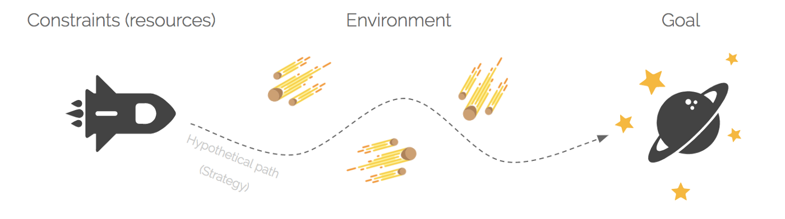

## **1\. What the goal is**  
1.目标是什么  

Everything starts with the goal. If you don’t know where you’re supposed to go, you shouldn’t even move because you’re just as likely to end up further away.

一切都是从目标开始的。如果你不知道你应该去哪里，你甚至不应该搬家，因为你最终很可能会去更远的地方。

One of the biggest issues I see with PMs is that they don’t take the time to really understand the goal. They may be able to recite the mission statement, but do they understand its foundations? I’m talking about the customer assumptions that led to it, the moral/ethical/design boundaries the company intends to stay within to achieve it, and the vision of the world’s future that it is supposed to live in.

我看到的PM最大的问题之一是，他们没有花时间真正理解目标。他们也许能够背诵使命宣言，但他们理解它的基础吗？我指的是导致这一点的客户假设，公司为实现这一目标而打算遵守的道德/伦理/设计界限，以及它应该生活在的世界未来的愿景。

Great product managers incessantly ask hard questions to leadership to understand the nuances — _the_ _first principles_ — that went into defining the mission they follow. The deeper one can understand it, the more precise their path to the goal will be.

伟大的产品经理不断地向领导层提出尖锐的问题，以了解定义他们所遵循的使命的细微差别--第一原则。一个人理解得越深，他通往目标的道路就越准确。

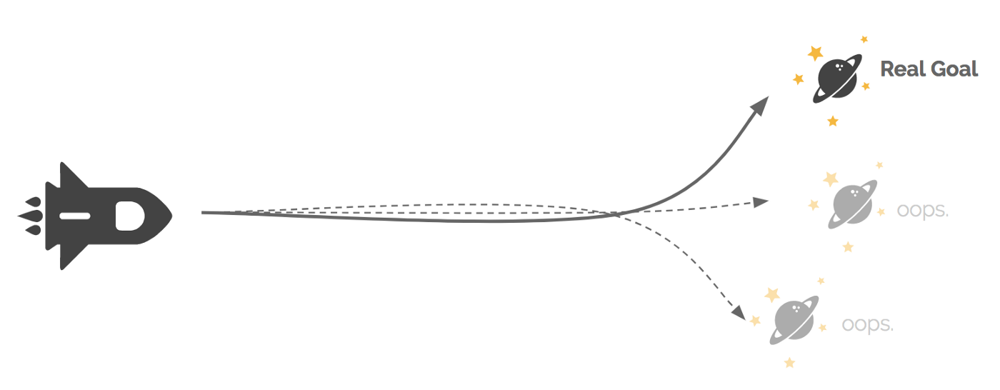

PMs also need to know how other teams are also contributing to the effort. Especially in large companies, aligning across all teams ensures that collisions are avoided and — far better — find opportunities for teams to combine efforts and accelerate progress.

PMS还需要知道其他团队是如何为这项工作做出贡献的。特别是在大公司中，所有团队的协调可以确保避免冲突，并-更好的是-为团队找到联合努力和加快进度的机会。

_Only_ once a PM is sure they know their company’s goal, and the goals of other teams around them, are they ready to effectively setup their own team’s goals, which must ladder up clearly to the broader mission.

只有当一位首相确定他们知道自己公司的目标以及周围其他团队的目标时，他们才会准备好有效地设定自己团队的目标，这些目标必须清晰地与更广泛的使命联系在一起。

**2\. What the environment is signalling**  
2.环境发出的信号是什么  

Most plans start out as a straight line to the goal, but the path never ends up as one. It’s impossible to see all the obstacles ahead, and sometimes the goal is so far away you can’t always tell if you’ve drifted off course. To hedge against this, PMs have to listen to their environment to detect, anticipate and course correct the path.

大多数计划开始时都是一条通往目标的直线，但这条道路永远不会以一条直线结束。不可能看到前面所有的障碍，有时目标太远了，你不能总是知道你是否偏离了路线。为了避免这一点，PM必须倾听他们的环境来检测、预测和纠正路径。

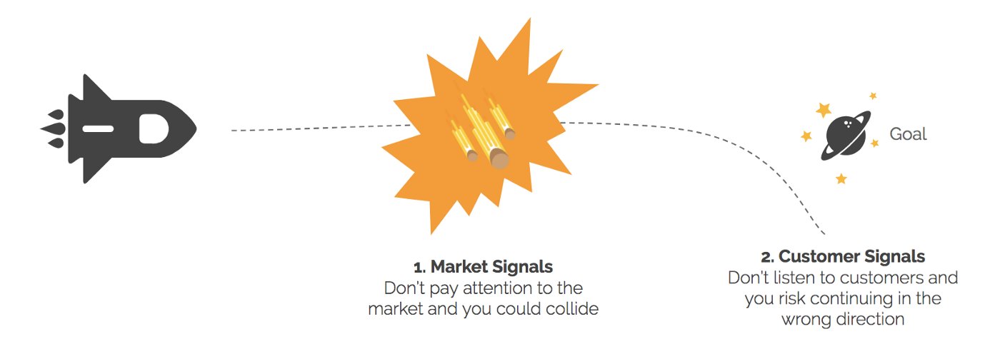

There are two main classes of environment signals you want to seek:  
您要查找的环境信号主要有两类：  

_Customer signals_  
客户信号  
are the qualitative and quantitative data sets you accumulate on how customers are using the product. This data is the “ping” from the goal, and when you hear that ping get stronger, you know you aren’t veering too far off course.

是您积累的有关客户如何使用产品的定性和定量数据集。这个数据是来自球门的“ping”，当你听到ping变得更强时，你知道你没有偏离太远的路线。

_Market signals_ are the “asteroid warnings” that represent shifts in the world that will affect your path. They are the changes in the competitive, political, and socioeconomic landscapes that affect your company and customers.

市场信号是“小行星警告”，它代表着世界的变化，将影响你的道路。它们是影响您的公司和客户的竞争、政治和社会经济格局的变化。

Constantly listening to the world outside your company walls is a critical input to great product management. And what you hear from customers is the ultimate validation of your achievement of the goal.

不断倾听公司墙外的世界是伟大的产品管理的重要投入。而你从客户那里听到的是对你实现目标的最终验证。

## **3\. What people, money, and time constraints exist**  
3.存在哪些人员、资金和时间限制  

How far a rocket ship can go is constrained by the fuel it holds, the quality of its crew, and its time-constrained ability to leverage [gravitational boosts](https://en.wikipedia.org/wiki/Gravity_assist) using from other celestial bodies like Jupiter. Similarly, product teams are constrained by the _money, people, and time_ they have to launch a product. On any given mission, a product team will be constrained by all three of these.

一艘火箭船能走多远，受到它所持有的燃料、船员的质量，以及它利用木星等其他天体提供的引力助推的时间有限的能力的限制。同样，产品团队也受到推出产品所需的资金、人员和时间的限制。在任何给定的任务中，产品团队都会受到这三个因素的制约。

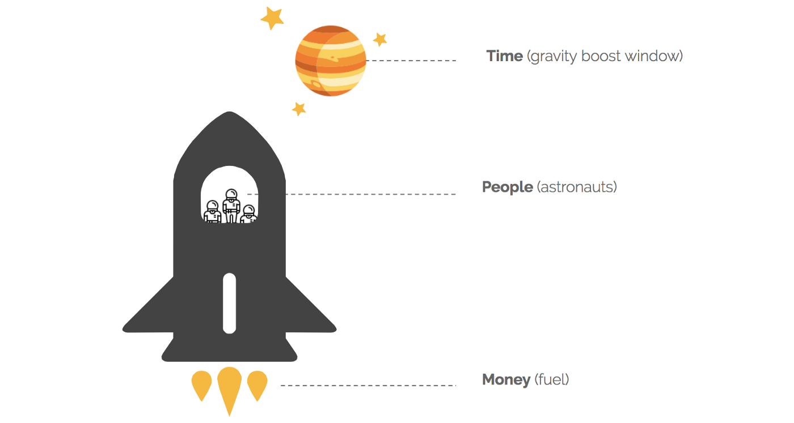

**_People_** on a product team often represent the biggest constraint. Too often, that constraint is only thought of as the number of people working on a product (which it can be), but vastly more important are actual skill and experience levels of the people on the team.

产品团队中的人往往是最大的制约因素。通常情况下，这种限制仅仅被认为是一个产品的工作人数(这是可以的)，但更重要的是团队成员的实际技能和经验水平。

Just like you wouldn’t put the rookie class of NASA on its first mission to Mars, there are product scopes that are beyond the ability of some teams. This isn’t their fault, and says nothing of their eventual abilities, but it is something that PMs critically need to understand when figuring out the path forward. To be clear, this applies to the PMs themselves, as well_._ They need the self awareness to know when they’re biting off more than they can chew. We’ll cover much more on _people_ later in this post.

就像你不会让NASA的菜鸟级别的人执行第一次火星任务一样，有些产品范围超出了一些团队的能力范围。这不是他们的错，也没有说明他们最终的能力，但这是PM在找出前进道路时关键需要了解的事情。需要明确的是，这也适用于PM本身。他们需要有自我意识，知道什么时候他们咬得太多，超出了他们的承受能力。我们将在这篇文章的后面介绍更多关于人的信息。

**_Money_** is a constraint that relates to the ability of a team to hire the right people (salaries), enable them to work (overhead like office space), operate the product (servers and support), and distribute it (marketing).

金钱是一种约束，关系到团队是否有能力雇佣合适的人(工资)，使他们能够工作(像办公空间一样的管理费用)，运营产品(服务器和支持)，并分发产品(营销)。

It would be silly to spend all of your money on salaries to hire the best team, but then not have an office for them to work in, or not have a single dollar to pay for marketing and thus very few customers will find the product.

把所有的钱都花在工资上，聘请最好的团队，但却没有办公室供他们工作，或者没有一分钱用于营销，这样就很少有客户会找到产品，这是愚蠢的。

Most companies have abstracted away the overhead, operating, and marketing cost complexities from PMs (so that they can focus on product and distribution), but it’s important that PMs understand that capital isn’t limitless. In lieu of these luxuries, PMs need to consider all the money impacts when building their strategy.

大多数公司都从项目经理那里抽象出了管理费用、运营和营销成本的复杂性(这样他们就可以专注于产品和分销)，但重要的是，项目经理要明白资本并不是无限的。在制定战略时，PM需要考虑所有的金钱影响，而不是这些奢侈品。

**_Time_** is the ultimate constraint because unlike the other two, once it’s exhausted you cannot get more of it. Time represents reality. It’s the reality that products that haven’t shipped have yet to produce any value. It’s the reality that competitors are taking market share everyday. It’s the reality that your company will run out of money next month.

时间是最终的限制，因为与其他两个不同的是，一旦耗尽，你就无法获得更多的时间。时间代表着现实。现实是，还没有发货的产品还没有产生任何价值。竞争对手每天都在抢占市场份额，这是一个现实。事实是，你的公司下个月将耗尽资金。

PMs must manage time. They must ensure that that they don’t miss big windows of opportunity, [make the right tradeoffs](https://blackboxofpm.com/the-time-value-of-shipping-6deaf8d7d565), and [utilize time](https://blackboxofpm.com/deadlines-d6925e5c694f) as a healthy way to foster execution on their team.

经前综合征必须管理时间。他们必须确保他们不会错过大的机会窗口，做出正确的权衡，并利用时间作为促进团队执行力的健康方式。

## The right path (product strategy) is at the intersection of the inputs

正确的路径(产品战略)位于输入的交叉点

When PMs know the goal, understand the environment, and respect the constraints, they have the necessary inputs to build a great product strategy, which sits somewhere in the intersection of those inputs.

当PM知道目标、了解环境并尊重约束时，他们就有了必要的投入来构建伟大的产品战略，而这一战略位于这些投入的交叉点上。

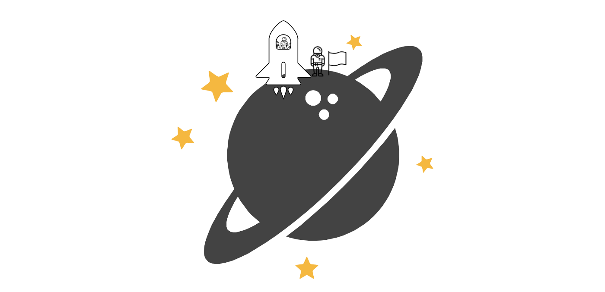

My reductionist analogy may imply this is easy, but let me be clear that forming a good strategy is very, very difficult. In fact, despite being confident enough to write this post, I am not confident that I can always find the right strategy in practice. It’s just fucking complex.

我的简化论类比可能暗示这很容易，但我要澄清的是，形成一个好的战略是非常非常困难的。事实上，尽管我有足够的信心写这篇文章，但我并不相信我能在实践中总是找到正确的策略。这太他妈复杂了。

The other dimension that I hope comes through from this section is that PMs need incredible _breadth_ to effectively synthesize these inputs into strategy. Knowing [enough](https://blackboxofpm.com/mvpm-minimum-viable-product-manager-e1aeb8dd421?source=collection_detail----797f3dde3f2b-----6----------------) about engineering, UX, data, finance, organizational design, operations, research, marketing, etc. makes your ability to synthesize these inputs more effective, and thus your strategy will have a higher likelihood of being successful.

我希望从这一部分得到的另一个维度是，项目经理需要令人难以置信的广度，才能有效地将这些投入综合成战略。对工程、用户体验、数据、金融、组织设计、运营、研究、营销等方面有足够的了解会让你更有效地综合这些投入，因此你的战略成功的可能性会更大。

I feel many PMs get intimidated by this reality and react by specializing in a domain and/or outsourcing the thinking from a domain to another team (e.g. “marketing will figure out how to distribute it”). I really think this type of thinking is counterproductive, and will limit your potential. As scary as it sounds, it _is_ important that you try to learn everything_._ Temper the fear that comes with this with the acknowledgement that, at the same time, it is impossible to know it all.

我觉得许多PM被这个现实吓倒了，他们的反应是专门研究一个领域，和/或将一个领域的想法外包给另一个团队(例如“市场营销会想出如何分发它”)。我真的认为这种想法会适得其反，会限制你的潜力。尽管听起来很可怕，但重要的是你要努力学习每一件事。要缓和随之而来的恐惧，承认同时不可能知道所有的事情。

## Principle **B:** Accomplish everything through others  
原则B：通过他人完成所有事情  

In the rocket ship analogy, who did you think the PM was? Were they the person who planted the flag on planet Goal, or were they one of the astronauts on the ship?

在火箭飞船的类比中，你认为首相是谁？他们是在星球目标上插上旗帜的人，还是飞船上的宇航员之一？

The answer is neither. The PM was actually Mission Control back on Earth. Their job was to support the astronauts who were actually risking their lives for the mission (okay building product isn’t _that_ serious, but you get the point). As a PM, you cannot — absolutely cannot — forget that you accomplish everything through others.

答案是两者都不是。首相实际上是地球上的任务控制中心。他们的工作是支持那些实际上冒着生命危险执行任务的宇航员(好的，建筑产品并不是那么严重，但你明白这一点)。作为一名首相，你不能--绝对不能--忘记你通过他人完成了一切。

**Sorry. You’re not even on the spaceship 🚀.**  
抱歉的。你甚至都不在🚀号飞船上。  

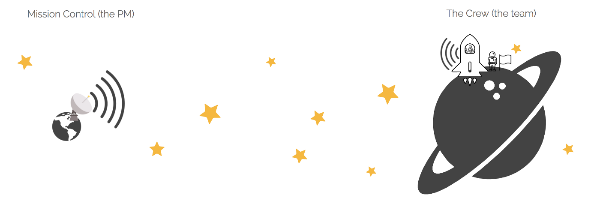

_Wait, why do so many PM articles promote that PMs should be “jacks of all trades, and do whatever it takes, including coding, marketing, and designing”?_

等等，为什么这么多PM文章都在宣传PM应该“无所不能，无所不能，包括编码、营销和设计”？

A “doing whatever it takes” mentality doesn’t make you a good product manager, it makes you a good _employee._ When a PM is coding, writing support documents, or designing the product, they’re (presumably) doing so because it’s blocking the critical path to shipping. They’re acting out their values as an employee of the company, not as a PM.

“不惜一切代价”的心态不会让你成为一名优秀的产品经理，而会让你成为一名优秀的员工。当项目经理在编写代码、编写支持文档或设计产品时，他们(可能)这样做是因为这阻碍了运输的关键路径。他们是作为公司的员工，而不是作为一名总理来践行自己的价值观

Everyone — not just PMs - should aspire to have this mentality. If an engineer happens to also be good at marketing and that’s what’s blocking the team, they should jump in and help. But that doesn’t make them a better _engineer._ The reason PMs often find themselves building-a-bunch-of-stuff is because, as the only member of a team who’s not supposed to build, it’s rational that they should be the first to volunteer when things fall behind, but that’s very different than saying it’s part of their job as a PM.

每个人--不仅仅是PM--都应该渴望拥有这种心态。如果一名工程师碰巧也擅长市场营销，而这正是阻碍团队的原因，他们应该参与进来并提供帮助。但这并不能让他们成为更好的工程师。PM经常发现自己在构建一大堆东西，是因为作为团队中唯一不应该构建的成员，他们应该在事情落后的时候第一个做志愿者，这是合理的，但这与说这是他们作为PM的工作的一部分截然不同

Accomplishing everything through others is an irreducible first principle of product management, so to explore it deeper, we’re going to completely change the analogy.

通过他人完成所有事情是产品管理的一个不可减少的首要原则，所以为了更深入地探讨它，我们将完全改变这个类比。

## Product Managers are like coaches of a sports team  
产品经理就像运动队的教练  

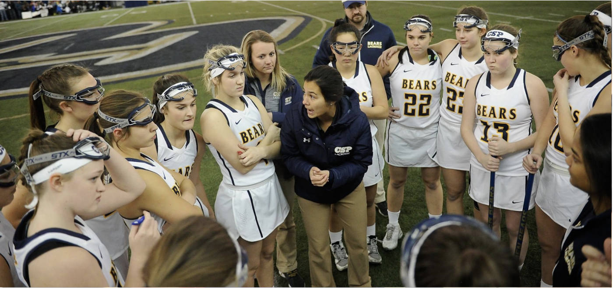

There is no better analogy for how a PM should think of their role than the coach of a team sport like basketball, volleyball, football, etc. Here’s why the parallels are so strong…

对于首相应该如何看待自己的角色，没有什么比篮球、排球、足球等团队运动的教练更好的类比了。这就是为什么…如此相似

## **Coaches don’t play**  
教练不打球  

A coach doesn’t play. They are hired to support a team, and do so by helping them increase their individual and collective potentials. They are measured - by the team and owners alike - by winning. Generally, if a team doesn’t win, the coach is fired, not the players.

教练是不打球的。他们被雇佣来支持一个团队，并通过帮助他们提高个人和集体的潜力来做到这一点。他们是用胜利来衡量的--无论是球队还是老板都是如此。一般来说，如果一支球队没有获胜，教练就会被解雇，而不是球员。

A PM doesn’t build, market, or support anything. We are hired to support a team in achieving our company’s goals. We do this by enabling the team to maximize their individual and collective potentials by aligning everyone on a product strategy (principle A) and fostering a healthy team dynamic. Generally, if the team doesn’t build something great, the product manager should be fired, not the team.

首相不会建立、推销或支持任何东西。我们受雇支持一个团队实现我们公司的目标。我们做到了这一点，使团队能够最大限度地发挥个人和集体的潜力，使每个人都与产品战略保持一致(原则A)，并培养健康的团队活力。一般来说，如果团队不能做出一些伟大的事情，产品经理应该被解雇，而不是团队。

## **A coach’s style is dependent on the relative skill of the coach and the players**

教练的风格取决于教练和球员的相对技术

When I first wrote that PMs are like sports coaches, what did you visualize?

当我第一次写PM就像体育教练时，你是怎么想的？

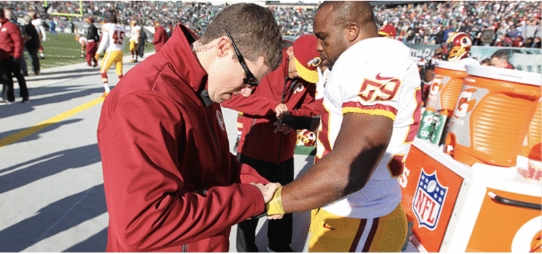

Not all coaching relationships are equal  
并非所有的教练关系都是平等的  

Do you see the coach as a parent and the team as kids? Or are the players like Lebron, telling the coach what to do? How about the wrist wrapping assistant coaches?

你认为教练是家长，球队是孩子吗？或者是像勒布朗一样的球员，告诉教练该怎么做？手腕包扎助理教练怎么样？

For example, if you’re a PM straight out of college and you join a product team of seasoned engineers, why in the world would you play a leadership role? You shouldn’t — you don’t have the experience to back it up. But that doesn’t mean you can’t be useful.

例如，如果你是一名刚从大学毕业的PM，你加入了一个由经验丰富的工程师组成的产品团队，你为什么要扮演领导角色？你不应该--你没有经验来支持这一点。但这并不意味着你不能发挥作用。

_PMs need strong self awareness to recognize when to lead, partner, or support their team._

PMS需要强烈的自我意识来认识到何时领导、合作或支持他们的团队。

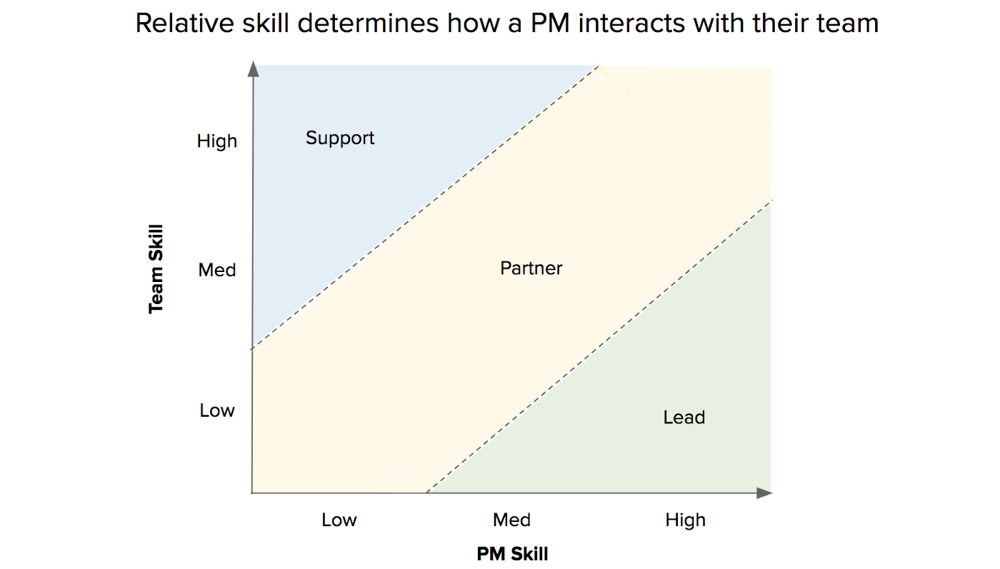

In the framework above, “skill” is shorthand for the sum of the abilities, experience, accomplishments, and work ethic of the people. Here’s how I’ve applied it in my career:

在上面的框架中，“技能”是人们的能力、经验、成就和职业道德的总和。以下是我如何在我的职业生涯中应用它：

When I’m the PM on a team of fresh grads, I will take a very direct leadership approach. I will prescribe the frameworks, goals, and even how to organize the execution of the project. This makes sense, I’ve shipped projects and they haven’t.

当我成为应届毕业生团队的首相时，我会采取非常直接的领导方式。我将规定框架、目标，甚至如何组织项目的执行。这是有道理的，我已经发送了项目，但他们没有。

When I’m working with a team of equal skill to myself, I will default to collaboration on all key decisions, and aspire to get buy in from everybody on the strategy and execution. To be clear, a PM should aspire to collaborate in all cases, but this relative-skill dynamic warrants it the most.

当我与一支技能与我相当的团队一起工作时，我会默认在所有关键决策上进行协作，并渴望在战略和执行方面得到每个人的支持。需要明确的是，首相应该渴望在所有情况下进行合作，但这种相对技能的动态最能证明这一点。

Finally, when I’m working with a team that’s more experienced and accomplished than myself, I will revert to an assistant coach or trainer mindset. I will ask, how can I be helpful? What can I take off your plate that’s low leverage? I’ll play a pure support role. For example, I will start by asking the experienced team about their vision, and then follow it up with lots of questions to get down to _their_ first principles and strategy. Then, I’ll synthesize all this information into a document and align with them to ensure it represents their vision. At that point, I’m just as free to align the company with this strategy as if I had developed it myself. I can still do my job.

最后，当我和一支比我更有经验、更有成就的团队一起工作时，我会回归到助理教练或教练的心态。我会问，我能帮上什么忙吗？我能从你的盘子里取下什么是低杠杆？我将扮演一个纯粹的配角。例如，我将从询问经验丰富的团队关于他们的愿景开始，然后通过许多问题来深入了解他们的首要原则和战略。然后，我将把所有这些信息合成到一个文档中，并与它们保持一致，以确保它代表了他们的愿景。在这一点上，我可以自由地使公司与这个战略保持一致，就像我自己制定了这个战略一样。我还能做好我的工作。

Note that in all cases, the PM is still responsible for the development of the product strategy, but how they get there can be very different.

请注意，在所有情况下，项目经理仍然负责产品战略的开发，但他们如何实现这一目标可能会有很大不同。

_Without a doubt, not understanding this dynamic of relative skill between the team and the PM, is the number one reason that PMs fail. They misread the situation, fall into the trap of thinking PM equals mini-CEO by default, and immediately lose trust with their team, which takes ten times as long to win back._

毫无疑问，不理解团队和项目经理之间的相对技能动态，是PM失败的首要原因。他们误读了形势，陷入了以为PM就是迷你CEO的陷阱，立即失去了对他们团队的信任，这需要十倍的时间才能赢回。

## **When the team wins, the players are celebrated, not the coach**  
当球队获胜时，庆祝的是球员，而不是教练  

People rarely talk about the coach when a team wins. The same should be true for product teams. If your team does incredible work, they deserve the spotlight — don’t steal it.

当一支球队获胜时，人们很少谈论教练。同样的道理也适用于产品团队。如果你的团队做了令人难以置信的工作，他们理应成为聚光灯下的焦点--不要偷走它。

## **Coaches need to know what every player does to be effective**  
教练需要知道每个球员做了什么才能有效地发挥作用  

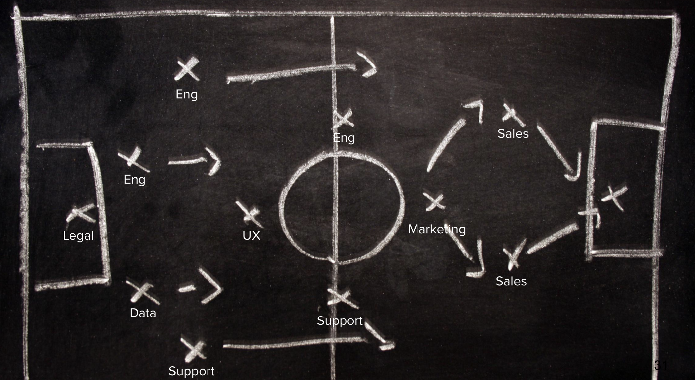

No one can coach a team if they don’t even know how the game is played. You need to have empathy and respect for all the work individuals on your team undertake.

如果他们甚至不知道比赛是如何进行的，就没有人能执教一支球队。你需要对团队中个人承担的所有工作抱有同情心和尊重。

This is more useful than simply having a deeper understanding about what’s easy versus hard to build. It’s also about understanding what is _fun and intellectually stimulating_ work vs. mundane and repetitive work. No team is inspired doing the same type of work they’ve done before. That’s when work becomes about a paycheque, and subsequently when the work itself is less creative and inspired.

这比简单地更深入地了解什么是容易构建的，什么是难构建的更有用。这也是关于理解什么是有趣的和智力刺激的工作，而不是平凡和重复的工作。没有一个团队会受到启发，去做他们以前做过的相同类型的工作。那时，工作就变成了一张薪水支票，随后工作本身就变得不那么有创造力和灵感了。

For a PM, respecting this encourages you to create the project conditions that enable people on the team to grow _and_ accomplish the mission for the company. When you create these conditions, the outcome is deep ownership and emotional investment from everyone.

对于一名项目经理来说，尊重这一点会鼓励你创造项目条件，让团队中的人能够成长并完成公司的使命。当你创造这些条件时，结果是每个人都拥有深度所有权和情绪化投资。

## When a captain emerges, coaches step back and let them lead  
当队长出现时，教练们会后退一步，让他们带队  

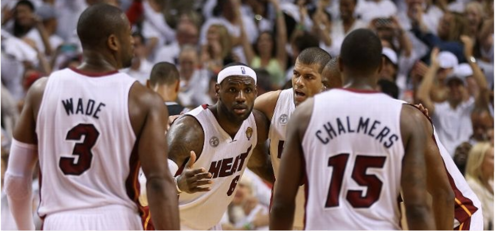

It’s clear that Lebron James is the captain. His team listens to him… maybe not Wade :)

很明显，勒布朗·詹姆斯是队长。他的团队听他的…也许不是韦德：)

As a team member, it’s one thing to hear about how you’re not executing from your coach, it’s another thing entirely to hear it from someone putting in the same work as you. As a coach, when a player on your team emerges as a leader; someone who holds the rest accountable and challenges them to be better, you have the foundations for the highest performing type of team.

作为一个团队成员，从教练那里听到你没有执行任务是一回事，从一个和你做同样工作的人那里听到完全是另一回事。作为一名教练，当你所在球队的一名球员脱颖而出，成为一名领导者；一个让其他人负责并挑战他们变得更好的人，你就具备了成为表现最好的球队的基础。

In product teams, this person is typically an engineering or UX lead. When this happens, count your blessings and then work to further elevate their influence on the team. Make them a coach, too, and your co-founder.

在产品团队中，这个人通常是工程或用户体验主管。当这种情况发生时，计算你的福气，然后努力进一步提升他们对球队的影响力。让他们也成为一名教练，也让他们成为你的联合创始人。

Typically, in this dynamic PMs will continue to lead strategy, while the captain drives execution, however PMs should also be open to “giving up” strategy as well, if it keeps the captain engaged and makes them feel true ownership. This is where you need to suppress your ego. It is so rare to find people who want to be leaders, so if the captain emerges, do whatever you can to capitalize on it (but hold them accountable, too).

通常，在这种动态的PM将继续领导战略，而船长驱动执行，然而PM也应该开放的“放弃”战略，如果它保持队长参与，并使他们感觉真正的所有权。这就是你需要压抑自我的地方。很少能找到想要成为领导者的人，所以如果船长出现了，尽你所能利用这一点(但也要让他们负起责任)。

## **Coaches ensure the team is training and in a peak state of performance**

教练确保球队在训练中并处于最佳状态

Coaches don’t spend all their time looking at video replays and strategizing with the team, they’re also ensuring the team practices regularly so they can perform at their peak.

教练不会把所有的时间都花在观看视频回放和与球队一起制定战略上，他们还确保球队定期练习，这样他们就可以在巅峰状态下发挥。

The parallel for product teams are product development processes. Whether you’re hardcore agile/scrum, “process-less” (note: a process exists whether you choose to acknowledge it or not), or something in between — the coach is responsible for ensuring the team commits to a process that enables them to do their best work. Note that the optimal process will be different for each team and coach dynamic.

与产品团队类似的是产品开发流程。无论你是核心的敏捷/Scrum，“无过程”(注意：无论你是否承认它都存在一个过程)，还是介于两者之间--教练负责确保团队致力于一个过程，使他们能够做最好的工作。请注意，对于每支球队和教练来说，最佳流程将是不同的。

## **Coaches nurture the energy levels and mental state of the team**  
教练培养球队的能量水平和精神状态  

This is an uncomfortable ownership concept for many PMs, but whenever I see a team that doesn’t seem excited about the work or looks burnt out, I’ll put pressure on the PM to foster a healthier dynamic.

对于许多PM来说，这是一个令人不舒服的所有权概念，但每当我看到一个团队似乎对工作不感兴趣或看起来疲惫不堪时，我就会向PM施压，要求他培养更健康的动力。

This is difficult of course, because people are complicated. We are all motivated to do our best work by different things: some of us need encouragement, some need to be challenged, some need a friend, and some need all three at different times. PMs need to find a way to understand _what makes individuals on their team tick_ — the first principles of _their_ being — and then build meaning and purpose from work on top of those principles.

这当然很难，因为人是复杂的。我们都有不同的动力去做最好的工作：有些人需要鼓励，有些人需要挑战，有些人需要朋友，还有的人在不同的时候需要这三样东西。PMS需要找到一种方法来理解是什么让他们团队中的个人运转起来--他们存在的首要原则--然后在这些原则的基础上从工作中建立意义和目标。

This concept can come off as self aggrandizing (_get out of my head PM!!!_), but it is the right one for a coach and PM to have. Creating an energized and committed team is fundamental to success, and achieving it repeatably is the pinnacle of good PM’ing and leadership in general.

这个概念可能是自吹自擂(从我的脑海中滚出去！)，但这是教练和首相应该拥有的。打造一支精力充沛、尽职尽责的团队是成功的基础，而重复实现这一目标是优秀的PM和领导力的顶峰。

## The thing about first principles is that nothing else matters in the long run

第一原则的问题是，从长远来看，其他任何事情都不重要。

Exploring the first principles of Product Management reveal that it demands equal effort from the left and right brains. It’s equal parts art and science. It’s equal parts hyper-rational and hyper-emotional.

探索产品管理的首要原则表明，它需要左脑和右脑付出同等的努力。它等同于艺术和科学。它等同于超理性和超情绪化。

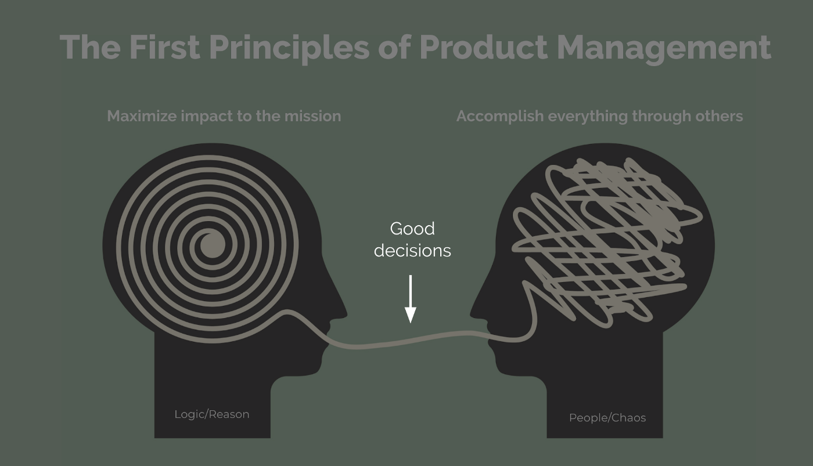

It’s the polarity of these two ways of thinking that make the craft of product management complex, exciting, and frustrating all at once.

正是这两种思维方式的两极，使得产品管理这门手艺既复杂，又令人兴奋，同时又令人沮丧。

Success for PMs means respecting both of these principles equally. Create a product strategy that maximizes impact to the mission, and have a coach’s mentality to accomplish that mission though the people around you.

对于PM来说，成功意味着平等地尊重这两个原则。制定一种最大限度地影响任务的产品战略，并以教练的心态通过你周围的人完成这一任务。
