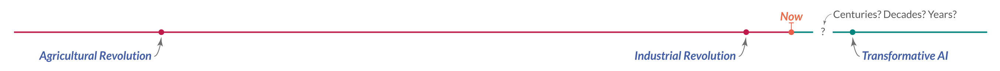

How AI gets built is currently decided by a small group of technologists. As this technology is transforming our lives, it should be in all of our interest to become informed and engaged.

December 15, 2022

Why should you care about the development of artificial intelligence?

为什么要关心人工智能的发展？

Think about what the alternative would look like. If you and the wider public do not get informed and engaged, then we leave it to a few entrepreneurs and engineers to decide how this technology will transform our world.

想想替代方案会是什么样子。 如果您和广大公众不了解情况和参与，那么我们将由一些企业家和工程师来决定这项技术将如何改变我们的世界。

That is the status quo. This small number of people at a few tech firms directly working on artificial intelligence (AI) do understand how extraordinarily powerful this technology is [becoming](https://ourworldindata.org/brief-history-of-AI). If the rest of society does not become engaged, then it will be this small elite who decides how this technology will change our lives.

这就是现状。 少数直接从事人工智能 (AI) 工作的科技公司中的一小部分人确实了解这项技术正在 [变得](https://ourworldindata.org/brief-history-of-AI) 多么强大。 如果社会其他人不参与，那么决定这项技术将如何改变我们生活的将是这一小部分精英。

To change this status quo, I want to answer three questions in this article: Why is it hard to take the prospect of a world transformed by AI seriously? How can we imagine such a world? And what is at stake as this technology becomes more powerful?

为了改变这种现状，我想在这篇文章中回答三个问题：为什么很难认真对待人工智能改变世界的前景？ 我们如何想象这样一个世界？ 随着这项技术变得更加强大，什么会受到威胁？

#### Why is it hard to take the prospect of a world transformed by artificial intelligence seriously?

#### 为什么很难认真对待人工智能改变世界的前景？

In some way, it should be obvious how technology can fundamentally transform the world. We just have to look at how much the world has already changed. If you could invite a family of hunter-gatherers from 20,000 years ago on your next flight, they would be pretty surprised. Technology has changed our world already, so we should expect that it can happen again.

在某种程度上，技术如何从根本上改变世界应该是显而易见的。 我们只需要看看世界已经改变了多少。 如果你能在下一次飞行中邀请 20,000 年前的一个狩猎采集者家庭，他们会非常惊讶。 技术已经改变了我们的世界，所以我们应该期待它再次发生。

But while we have seen the world transform before, we have seen these transformations play out over the course of generations. What is different now is how very rapid these technological changes have become. In the past, the technologies that our ancestors used in their childhood were still central to their lives in their old age. This has not been the case anymore for recent generations. Instead, it has [become common](https://ourworldindata.org/technology-long-run) that technologies unimaginable in one’s youth become ordinary in later life.

但是，虽然我们以前看到过世界的变化，但我们已经看到这些变化在几代人的过程中发生。 现在不同的是这些技术变化变得多么迅速。 过去，我们的祖先在童年时使用的技术在他们晚年时仍然是他们生活的核心。 对于最近几代人来说，情况已不再如此。 相反， [变得司空见惯。](https://ourworldindata.org/technology-long-run) 年轻时难以想象的技术在以后的生活中

This is the first reason we might not take the prospect seriously: it is easy to underestimate the speed at which technology can change the world.

这是我们可能不认真对待前景的第一个原因：人们很容易低估技术改变世界的速度。

The second reason why it is difficult to take the possibility of transformative AI – potentially even AI as intelligent as humans – seriously is that it is an idea that we first heard in the cinema. It is not surprising that for many of us, the first reaction to a scenario in which machines have human-like capabilities is the same as if you had asked us to take seriously a future in which vampires, werewolves, or zombies roam the planet.[1](https://ourworldindata.org/ai-impact#note-1)

很难认真对待变革性人工智能（甚至可能与人类一样聪明的人工智能）的可能性的第二个原因是，这是我们第一次在电影院听到的想法。 毫不奇怪，对于我们中的许多人来说，对机器具有类似人类能力的场景的第一反应就像你要求我们认真对待吸血鬼、狼人或僵尸在地球上游荡的未来一样。 [1个](https://ourworldindata.org/ai-impact#note-1)

But, it is plausible that it is both the stuff of sci-fi fantasy _and_ the central invention that could arrive in our, or our children’s, lifetimes. 

但是，它既是科幻幻想的东西，也是 _这似乎是合理的。_ 可能出现在我们或我们孩子一生中的核心发明，

The third reason why it is difficult to take this prospect seriously is by failing to see that powerful AI could lead to very large changes. This is also understandable. It is difficult to form an idea of a future that is very different from our own time. There are two concepts that I find helpful in imagining a very different future with artificial intelligence. Let’s look at both of them.

很难认真对待这一前景的第三个原因是没有看到强大的人工智能可能导致非常大的变化。 这也是可以理解的。 很难形成一个与我们自己的时代截然不同的未来。 我发现有两个概念有助于想象一个非常不同的人工智能未来。 让我们看看他们两个。

#### How to develop an idea of what the future of artificial intelligence might look like?

#### 如何形成对人工智能未来可能是什么样子的想法？

When thinking about the future of artificial intelligence, I find it helpful to consider two different concepts in particular: human-level AI, and transformative AI.[2](https://ourworldindata.org/ai-impact#note-2) The first concept highlights the AI’s capabilities and anchors them to a familiar benchmark, while transformative AI emphasizes the impact that this technology would have on the world.

在思考人工智能的未来时，我发现特别考虑两个不同的概念很有帮助：人类水平的人工智能和变革性人工智能。 [2 ](https://ourworldindata.org/ai-impact#note-2) 第一个概念强调了 AI 的能力并将其锚定在一个熟悉的基准上，而变革性 AI 则强调了这项技术将对世界产生的影响。

From where we are today, much of this may sound like science fiction. It is therefore worth keeping in mind that the majority of surveyed AI experts [believe](https://ourworldindata.org/ai-timelines) there is a real chance that human-level artificial intelligence will be developed within the next decades, and some believe that it will exist much sooner.

从我们今天所处的位置来看，其中大部分听起来像是科幻小说。 因此，值得记住的是，大多数接受调查的人工智能专家 [认为](https://ourworldindata.org/ai-timelines) ，在未来几十年内开发出人类水平的人工智能是真正有可能的，有些人认为它会更早出现。

##### The advantages and disadvantages of comparing machine and human intelligence

##### 比较机器和人类智能的优缺点

One way to think about human-level artificial intelligence is to contrast it with the current state of AI technology. While today’s AI systems often have capabilities similar to a particular, limited part of the human mind, a human-level AI would be a machine that is capable of carrying out the same _range_ of intellectual tasks that we humans are capable of.[3](https://ourworldindata.org/ai-impact#note-3) It is a machine that would be “able to learn to do anything that a human can do,” as Norvig and Russell put it in their textbook on AI.[4](https://ourworldindata.org/ai-impact#note-4)

思考人类水平人工智能的一种方法是将其与人工智能技术的当前状态进行对比。 虽然今天的人工智能系统通常具有类似于人类思维的特定、有限部分的能力，但人类级别的人工智能将是一种能够执行与 _范围_ 我们人类能力相同的智力任务 [的机器。 3 ](https://ourworldindata.org/ai-impact#note-3) 正如 Norvig 和 Russell 在他们的 AI 教科书中所说的那样，它是一种“能够学会做人类能做的任何事情”的机器。 [4个](https://ourworldindata.org/ai-impact#note-4)

Taken together, the range of abilities that characterize intelligence gives humans the ability to solve problems and achieve a wide variety of goals. A human-level AI would therefore be a system that could solve all those problems that we humans can solve, and do the tasks that humans do today. Such a machine, or collective of machines, would be able to do the work of a translator, an accountant, an illustrator, a teacher, a therapist, a truck driver, or the work of a trader on the world’s financial markets. Like us, it would also be able to do research and science, and to develop new technologies based on that.

总而言之，表征智力的能力范围赋予人类解决问题和实现各种目标的能力。 因此，人类级别的人工智能将是一个系统，可以解决我们人类可以解决的所有这些问题，并完成人类今天所做的任务。 这样的机器或机器集合将能够完成翻译、会计师、插图画家、教师、治疗师、卡车司机的工作，或世界金融市场上交易员的工作。 像我们一样，它也能够进行研究和科学研究，并在此基础上开发新技术。

The concept of human-level AI has some clear advantages. Using the familiarity of our own intelligence as a reference provides us with some clear guidance on how to imagine the capabilities of this technology. 

人类级人工智能的概念有一些明显的优势。 以我们对自己的智能的熟悉程度作为参考，为我们提供了一些关于如何想象这项技术能力的明确指导。

However, it also has clear disadvantages. Anchoring the imagination of future AI systems to the familiar reality of human intelligence carries the risk that it obscures the very real differences between them. 

然而，它也有明显的缺点。 将未来人工智能系统的想象力锚定在熟悉的人类智能现实中，可能会掩盖它们之间非常真实的差异。

Some of these differences are obvious. For example, AI systems will have the immense memory of computer systems, against which our own capacity to store information pales. Another obvious difference is the speed at which a machine can absorb and process information. But information storage and processing speed are not the only differences. The domains in which machines already outperform humans is steadily increasing: in chess, after matching the level of the best human players in the late 90s, AI systems [reached](https://ourworldindata.org/grapher/computer-chess-ability) superhuman levels more than a decade ago. In other games like Go or complex strategy games, this has happened more recently.[5](https://ourworldindata.org/ai-impact#note-5)

其中一些差异是显而易见的。 例如，人工智能系统将拥有计算机系统的巨大内存，而我们自身存储信息的能力则相形见绌。 另一个明显的区别是机器吸收和处理信息的速度。 但信息存储和处理速度并不是唯一的区别。 机器已经超越人类的领域正在稳步增加：在国际象棋中，人工智能系统在 20 世纪 90 年代末达到了最佳人类棋手的水平后，在 [达到了](https://ourworldindata.org/grapher/computer-chess-ability) 十多年前 超人的水平。 在围棋或复杂策略游戏等其他游戏中，这种情况最近才出现。 [5个](https://ourworldindata.org/ai-impact#note-5)

These differences mean that an AI that is at least as good as humans in every domain would overall be much more powerful than the human mind. Even the first “human-level AI” would therefore be quite superhuman in many ways.[6](https://ourworldindata.org/ai-impact#note-6)

这些差异意味着，至少在每个领域都与人类一样优秀的人工智能总体上会比人类思维强大得多。 因此，即使是第一个“人类级别的人工智能”在很多方面也都相当超人。 [6个](https://ourworldindata.org/ai-impact#note-6)

Human intelligence is also a bad metaphor for machine intelligence in other ways. The way we think is often very different from machines, and as a consequence the output of thinking machines can be very alien to us.

人类智能在其他方面也是机器智能的糟糕比喻。 我们的思维方式通常与机器截然不同，因此思维机器的输出对我们来说可能非常陌生。

Most perplexing and most concerning are the strange and unexpected ways in which machine intelligence can fail. The AI-generated image of the horse below provides an example: on the one hand, AIs can do what no human can do – produce an image of anything, in any style (here photorealistic), in mere seconds – but on the other hand it can fail in ways that no human would fail.[7](https://ourworldindata.org/ai-impact#note-7) No human would make the mistake of drawing a horse with five legs.[8](https://ourworldindata.org/ai-impact#note-8)

最令人困惑和最担忧的是机器智能可能会以奇怪和意想不到的方式失败。 下面的 AI 生成的马图像提供了一个示例：一方面，AI 可以做人类无法做到的事情——在几秒钟内以任何风格（这里是照片级真实感）生成任何事物的图像——但另一方面它可能会以任何人都不会失败的方式失败。 [7 ](https://ourworldindata.org/ai-impact#note-7) 没有人会犯画五条腿的马的错误。 [8个](https://ourworldindata.org/ai-impact#note-8)

Imagining a powerful future AI as just another human would therefore likely be a mistake. The differences might be so large that it will be a misnomer to call such systems “human-level.”

因此，将强大的未来人工智能想象成另一个人可能是错误的。 差异可能如此之大，以至于将此类系统称为“人类水平”是用词不当的。

**AI-generated image of a horse**[9](https://ourworldindata.org/ai-impact#note-9)

**AI 生成的马图像** [9](https://ourworldindata.org/ai-impact#note-9)

##### Transformative artificial intelligence is defined by the impact this technology would have on the world

##### 变革性人工智能的定义是这项技术对世界的影响

In contrast, the concept of transformative AI is not based on a comparison with human intelligence. This has the advantage of sidestepping the problems that the comparisons with our own mind bring. But it has the disadvantage that it is harder to imagine what such a system would look like and be capable of. It requires more from us. It requires us to imagine a world with intelligent actors that are potentially very different from ourselves.

相比之下，变革性人工智能的概念并不是基于与人类智能的比较。 这样做的好处是避免了与我们自己的头脑进行比较所带来的问题。 但它的缺点是很难想象这样一个系统的外观和功能。 它对我们的要求更高。 它要求我们想象一个拥有可能与我们自己截然不同的智能演员的世界。

Transformative AI is not defined by any specific capabilities, but by the real-world impact that the AI would have. To qualify as transformative, researchers think of it as AI that is “powerful enough to bring us into a new, qualitatively different future.”[10](https://ourworldindata.org/ai-impact#note-10) 

变革性人工智能不是由任何特定的能力来定义的，而是由人工智能对现实世界的影响来定义的。 为了符合变革性，研究人员将其视为“强大到足以将我们带入一个全新的、质的不同的未来”的人工智能。 [10 ](https://ourworldindata.org/ai-impact#note-10)  

In humanity’s history, there have been two cases of such major transformations, the agricultural and the industrial revolutions.

在人类历史上，发生过两次如此重大的变革，一次是农业革命，一次是工业革命。

Transformative AI becoming a reality would be an event on that scale. Like the arrival of agriculture 10,000 years ago, or the transition from hand- to machine-manufacturing, it would be an event that would change the world for billions of people around the globe and for the entire trajectory of [humanity’s future](https://ourworldindata.org/longtermism).

变革性人工智能成为现实将是一个如此规模的事件。 就像 10,000 年前农业的到来，或者从手工制造向机器制造的转变一样，这将是一个改变世界的事件，改变全球数十亿人的世界，也改变 [人类未来](https://ourworldindata.org/longtermism) 的整个轨迹。

Technologies that fundamentally change how a wide range of goods or services are produced are called ‘general-purpose technologies’. The two previous transformative events were caused by the discovery of two particularly significant general-purpose technologies: the change in food production as humanity transitioned from hunting and gathering to farming, and the rise of machine manufacturing in the industrial revolution. Based on the evidence and arguments presented in [this series](https://ourworldindata.org/artificial-intelligence#research-writing) on AI development, I believe it is plausible that powerful AI could represent the introduction of a similarly significant general-purpose technology.

从根本上改变各种商品或服务生产方式的技术被称为“通用技术”。 前两次变革性事件是由两项特别重要的通用技术的发现引起的：人类从狩猎和采集向农业过渡时粮食生产的变化，以及工业革命中机器制造的兴起。 中关于 AI 开发的证据和论点 [根据本系列](https://ourworldindata.org/artificial-intelligence#research-writing) ，我认为强大的 AI 可能代表类似重要的通用技术的引入是合理的。

**Timeline of the three transformative events in world history**

**世界历史上三大变革性事件的时间表**

##### A future of human-level or transformative AI?

##### 人类水平或变革性人工智能的未来？

The two concepts are closely related, but they are not the same. The creation of a human-level AI would certainly have a transformative impact on our world. If the work of most humans could be carried out by an AI, the lives of millions of people would change.[11](https://ourworldindata.org/ai-impact#note-11)

这两个概念密切相关，但并不相同。 人类水平的人工智能的创造肯定会对我们的世界产生变革性的影响。 如果大多数人的工作可以由人工智能来完成，那么数百万人的生活将会改变。 [11](https://ourworldindata.org/ai-impact#note-11)

The opposite, however, is not true: we might see transformative AI without developing human-level AI. Since the human mind is in many ways a poor metaphor for the intelligence of machines, we might plausibly develop transformative AI before we develop human-level AI. Depending on how this goes, this might mean that we will never see any machine intelligence for which human intelligence is a helpful comparison.

然而，反之则不然：我们可能会在没有开发出人类水平的人工智能的情况下看到变革性的人工智能。 由于人脑在很多方面都不能很好地比喻机器的智能，因此我们可能会在开发人类级别的人工智能之前开发出具有变革性的人工智能。 根据情况的不同，这可能意味着我们永远不会看到任何可以与人类智能进行比较的机器智能。

When and if AI systems might reach either of these levels is of course difficult to predict. In my [companion article](https://ourworldindata.org/ai-timelines) on this question, I give an overview of what researchers in this field currently believe. Many AI experts believe there is a real chance that such systems will be developed within the next decades, and some believe that they will exist much sooner.

人工智能系统何时以及是否会达到这两个水平中的任何一个水平当然很难预测。 在我 [关于这个问题的配套文章](https://ourworldindata.org/ai-timelines) 中，我概述了该领域的研究人员目前的看法。 许多 AI 专家认为，在未来几十年内开发此类系统的可能性确实存在，有些人认为它们会更快存在。

#### What is at stake as artificial intelligence becomes more powerful?

#### 随着人工智能变得越来越强大，有什么利害关系？

All major technological innovations lead to a range of positive and negative consequences. For AI, the spectrum of possible outcomes – from the most negative to the most positive – is extraordinarily wide. 

所有重大技术创新都会导致一系列积极和消极的后果。 对于人工智能来说，可能的结果范围——从最消极的到最积极的——非常广泛。

That the use of AI technology can cause harm is clear, because it is already happening. 

人工智能技术的使用会造成伤害是显而易见的，因为它已经在发生。

AI systems can cause harm when people use them maliciously. For example, when they are used in politically-motivated disinformation campaigns or to enable mass surveillance.[12](https://ourworldindata.org/ai-impact#note-12)

当人们恶意使用人工智能系统时，它们可能会造成伤害。 例如，当它们被用于出于政治动机的虚假宣传活动或进行大规模监视时。 [12](https://ourworldindata.org/ai-impact#note-12)

But AI systems can also cause unintended harm, when they act differently than intended or fail. For example, in the Netherlands the authorities used an AI system which falsely claimed that an estimated 26,000 parents made fraudulent claims for child care benefits. The false allegations led to hardship for many poor families, and also resulted in the resignation of the Dutch government in 2021.[13](https://ourworldindata.org/ai-impact#note-13)

但是，当人工智能系统的行为与预期不同或发生故障时，它们也会造成意想不到的伤害。 例如，在荷兰，当局使用了一个人工智能系统，该系统错误地声称估计有 26,000 名父母欺诈性地申请了托儿福利。 虚假指控导致许多贫困家庭陷入困境，也导致荷兰政府于 2021 年辞职。 [13](https://ourworldindata.org/ai-impact#note-13)

As AI becomes more powerful, the possible negative impacts could become much larger. Many of these risks have rightfully received public attention: more powerful AI could lead to mass labor displacement, or extreme concentrations of power and wealth. In the hands of autocrats, it could empower totalitarianism through its suitability for mass surveillance and control. 

随着人工智能变得越来越强大，可能的负面影响可能会变得更大。 其中许多风险理所当然地受到了公众的关注：更强大的人工智能可能导致大规模劳动力流失，或权力和财富的极端集中。 在独裁者手中，它可以通过适用于大规模监视和控制来赋予极权主义权力。

The so-called _alignment problem_ of AI is another extreme risk. This is the concern that _nobody_ would be able to control a powerful AI system, even if the AI takes actions that harm us humans, or humanity as a whole. This risk is unfortunately receiving little attention from the wider public, but it is seen as an extremely large risk by many leading AI researchers.[14](https://ourworldindata.org/ai-impact#note-14)

人工智能的所谓 _对齐问题_ 是另一个极端风险。 这是一个令人担忧的问题，即 _没有人_ 能够控制一个强大的人工智能系统，即使人工智能采取了伤害我们人类或整个人类的行动。 不幸的是，这种风险很少受到广大公众的关注，但许多领先的 AI 研究人员将其视为极大的风险。 [14](https://ourworldindata.org/ai-impact#note-14)

How could an AI possibly escape human control and end up harming humans?

人工智能怎么可能逃脱人类的控制并最终伤害人类？

The risk is not that an AI becomes self-aware, develops bad intentions, and “chooses” to do this. The risk is that we try to instruct the AI to pursue some specific goal – even a very worthwhile one – and in the pursuit of that goal it ends up harming humans. It is about unintended consequences. The AI does what we told it to do, but not what we wanted it to do.

风险不在于 AI 变得有自我意识、产生不良意图并“选择”这样做。 风险在于我们试图指示人工智能去追求一些特定的目标——即使是一个非常有价值的目标——而在追求那个目标的过程中它最终会伤害人类。 这是关于意想不到的后果。 AI 只做我们告诉它做的事，而不是我们想让它做的事。

Can’t we just tell the AI to not do those things? It is definitely possible to build an AI that avoids any particular problem we foresee, but it is hard to foresee _all_ the possible harmful unintended consequences. The alignment problem arises because of “the impossibility of defining true human purposes correctly and completely,” as AI researcher Stuart Russell puts it.[15](https://ourworldindata.org/ai-impact#note-15)

我们不能告诉人工智能不要做那些事情吗？ 绝对有可能构建一个 AI 来避免我们预见的任何特定问题，但很难预见 _所有_ 可能的有害意外后果。 正如 AI 研究人员斯图尔特罗素所说，对齐问题的出现是因为“不可能正确和完整地定义真正的人类目的”。 [15](https://ourworldindata.org/ai-impact#note-15)

Can’t we then just switch off the AI? This might also not be possible. That is because a powerful AI would know two things: it faces a risk that humans could turn it off, and it can’t achieve its goals once it has been turned off. As a consequence, the AI will pursue a very fundamental goal of ensuring that it won’t be switched off. This is why, once we realize that an extremely intelligent AI is causing unintended harm in the pursuit of some specific goal, it might not be possible to turn it off or change what the system does.[16](https://ourworldindata.org/ai-impact#note-16)

难道我们不能关掉AI吗？ 这也可能是不可能的。 这是因为一个强大的人工智能会知道两件事：它面临着人类可能将其关闭的风险，以及一旦它被关闭就无法实现其目标。 因此，人工智能将追求一个非常基本的目标，即确保它不会被关闭。 这就是为什么一旦我们意识到一个极其智能的人工智能在追求某些特定目标的过程中造成了意想不到的伤害，就可能无法将其关闭或改变系统的行为。 [16](https://ourworldindata.org/ai-impact#note-16)

This risk – that humanity might not be able to stay in control once AI becomes very powerful, and that this might lead to an extreme catastrophe – has been recognized right from the early days of AI research more than 70 years ago.[17](https://ourworldindata.org/ai-impact#note-17) The very rapid development of AI in recent years has made a solution to this problem much more urgent.

这种风险——一旦 AI 变得非常强大，人类可能无法保持控制，这可能导致极端灾难——从 70 多年前的 AI 研究早期就已经认识到了。 [17 ](https://ourworldindata.org/ai-impact#note-17) 近年来人工智能的飞速发展使得解决这个问题变得更加紧迫。

I have tried to summarize some of the risks of AI, but a short article is not enough space to address all possible questions. Especially on the very worst risks of AI systems, and what we can do now to reduce them, I recommend reading the book [The Alignment Problem](https://brianchristian.org/the-alignment-problem/) by Brian Christian and Benjamin Hilton’s article [‘Preventing an AI-related catastrophe’](https://80000hours.org/problem-profiles/artificial-intelligence).

我试图总结 AI 的一些风险，但一篇简短的文章不足以解决所有可能的问题。 特别是关于 AI 系统最严重的风险，以及我们现在可以做些什么来降低它们，我建议阅读 [Brian Christian的《对齐问题](https://brianchristian.org/the-alignment-problem/) 》一书和 Benjamin Hilton 的文章 [“预防与 AI 相关的灾难”](https://80000hours.org/problem-profiles/artificial-intelligence) 。

If we manage to avoid these risks, transformative AI could also lead to very positive consequences. Advances in science and technology were crucial to [the many positive developments](https://ourworldindata.org/a-history-of-global-living-conditions-in-5-charts) in humanity’s history. If artificial ingenuity can augment our own, it could help us make progress on the many large problems we face: from cleaner energy, to the replacement of unpleasant work, to much better healthcare.

如果我们设法避免这些风险，变革性人工智能也可能带来非常积极的后果。 科学技术的进步对于 [的许多积极发展](https://ourworldindata.org/a-history-of-global-living-conditions-in-5-charts) 人类历史上 至关重要。 如果人工智能可以增强我们的创造力，它可以帮助我们在面临的许多重大问题上取得进展：从更清洁的能源到替代不愉快的工作，再到更好的医疗保健。

This extremely large contrast between the possible positives and negatives makes clear that the stakes are unusually high with this technology. Reducing the negative risks and solving the alignment problem could mean the difference between a healthy, flourishing, and wealthy future for humanity – and the destruction of the same. 

可能的正面和负面之间的这种巨大反差清楚地表明，这项技术的风险异常高。 减少负面风险和解决对齐问题可能意味着人类健康、繁荣和富裕的未来与毁灭之间的区别。

#### How can we make sure that the development of AI goes well?

#### 如何确保人工智能的发展顺利进行？

Making sure that the development of artificial intelligence goes well is not just one of the most crucial questions of our time, but likely one of the most crucial questions in human history. This needs public resources – public funding, public attention, and public engagement.

确保人工智能的发展顺利进行不仅是我们这个时代最关键的问题之一，而且很可能是人类历史上最关键的问题之一。 这需要公共资源——公共资金、公众关注和公众参与。

Currently, almost all resources that are dedicated to AI aim to speed up the development of this technology. Efforts that aim to increase the safety of AI systems, on the other hand, do not receive the resources they need. Researcher Toby Ord estimated that in 2020 between $10 to $50 million was spent on work to address the alignment problem.[18](https://ourworldindata.org/ai-impact#note-18) Corporate AI investment in the same year was more than 2000-times larger, it [summed up](https://ourworldindata.org/grapher/corporate-investment-in-artificial-intelligence-total?country=~OWID_WRL) to $125 billion. 

目前，几乎所有专门用于人工智能的资源都旨在加速这项技术的发展。 另一方面，旨在提高人工智能系统安全性的努力并未获得所需的资源。 研究员 Toby Ord 估计，2020 年将花费 10 到 5000 万美元用于解决对齐问题。 [18 ](https://ourworldindata.org/ai-impact#note-18) 同年的企业 AI 投资是 2000 多倍， [总计达](https://ourworldindata.org/grapher/corporate-investment-in-artificial-intelligence-total?country=~OWID_WRL) 1250 亿美元。

This is not only the case for the AI alignment problem. The work on the entire range of negative social consequences from AI is under-resourced compared to the large investments to increase the power and use of AI systems.

这不仅是 AI 对齐问题的情况。 与增加 AI 系统的能力和使用的大量投资相比，针对 AI 的整个负面社会后果的工作资源不足。

It is frustrating and concerning for society as a whole that AI safety work is extremely neglected and that little public funding is dedicated to this crucial field of research. On the other hand, for each _individual_ person this neglect means that they have a good chance to actually make a positive difference, if they dedicate themselves to this problem now. And while the field of AI safety is small, it does provide [good resources](https://80000hours.org/problem-profiles/artificial-intelligence/#what-can-you-do-concretely-to-help) on what you can do concretely if you want to work on this problem.

人工智能安全工作被极度忽视，而且很少有公共资金用于这一关键研究领域，这让整个社会感到沮丧和担忧。 另一方面，对于每个 _人_ 来说，这种忽视意味着他们有很好的机会真正产生积极的影响，如果他们现在致力于解决这个问题。 虽然 AI 安全领域很小，但它确实提供 [了很好的资源](https://80000hours.org/problem-profiles/artificial-intelligence/#what-can-you-do-concretely-to-help) ，说明如果你想解决这个问题，你可以具体做什么。

I hope that more people dedicate their individual careers to this cause, but it needs more than individual efforts. A technology that is transforming our society needs to be a central interest of all of us. As a society we have to think more about the societal impact of AI, become knowledgeable about the technology, and understand what is at stake. 

我希望有更多的人把个人的事业奉献给这个事业，但这需要的不仅仅是个人的努力。 一项正在改变我们社会的技术需要成为我们所有人的核心利益。 作为一个社会，我们必须更多地思考 AI 的社会影响，了解这项技术，并了解其中的利害关系。

When our children look back at today, I imagine that they will find it difficult to understand how little attention and resources we dedicated to the development of safe AI. I hope that this changes in the coming years, and that we begin to dedicate more resources to making sure that powerful AI gets developed in a way that benefits us and the next generations.

当我们的孩子今天回顾时，我想他们会很难理解我们投入到安全人工智能开发上的注意力和资源有多么少。 我希望这种情况在未来几年有所改变，我们开始投入更多资源来确保强大的 AI 以有利于我们和下一代的方式发展。

If we fail to develop this broad-based understanding, then it will remain the small elite that finances and builds this technology that will determine how one of the – or plausibly _the_ – most powerful technology in human history will transform our world.

如果我们不能发展这种基础广泛的理解，那么资助和建设这项技术的少数精英将继续决定人类历史上最强大的技术之一——或者可能 _是_ 最强大的技术——将如何改变我们的世界。

___

With our work at Our World in Data we want to do our small part to enable a better informed public conversation on AI and the future we want to live in. You can find these resources on [OurWorldinData.org/artificial-intelligence](https://ourworldindata.org/artificial-intelligence)

通过我们在数据世界的工作，我们希望尽自己的一份力量，就人工智能和我们希望生活的未来进行更明智的公众对话。您可以在 [OurWorldinData.org/artificial-intelligence上找到这些资源](https://ourworldindata.org/artificial-intelligence)

**Acknowledgements:** I would like to thank my colleagues Daniel Bachler, Charlie Giattino, and Edouard Mathieu for their helpful comments to drafts of this essay.

**致谢：** 我要感谢我的同事 Daniel Bachler、Charlie Giattino 和 Edouard Mathieu 对本文草稿提出的有益评论。
