In the age of artificial intelligence the ability to generate realistic images from text prompts is no longer a distant futuristic concept—it’s a present-day reality. So, is it time for designers to delegate some (or all) of their work to AI? In this article, we’ll pit human illustrators against AI artists and try to judge if we’ve already passed the point of no return. We’ll provide the same prompts and guidelines to both human and AI and compare the resulting illustrations side by side.

在人工智能时代，根据文本提示生成逼真的图像的能力不再是遥远的未来概念，而是当今的现实。 那么，设计师是时候将部分（或全部）工作委托给 AI 了吗？ 在这篇文章中，我们将让人类插画师与 AI 艺术家进行对比，并尝试判断我们是否已经过了不归路。 我们将为人类和 AI 提供相同的提示和指南，并并排比较生成的插图。

In the world of digital illustration, quickly and accurately generating complex 3D images has always been a challenge. But with the newest versions of text-to-image AI models such as Midjourney, DALL-E, and Stable Diffusion, this process can become significantly easier and more efficient.

在数字插图的世界中，快速准确地生成复杂的 3D 图像一直是一项挑战。 但有了最新版本的文本到图像 AI 模型，例如 Midjourney、DALL-E 和 Stable Diffusion，这个过程可以变得更加容易和高效。

Let’s briefly overview each of these models.

让我们简要概述一下这些模型中的每一个。

## Popular text-to-image AI models

## 流行的文本到图像 AI 模型

[DALL-E](https://openai.com/dall-e-2/) is a second-generation product developed by the nonprofit OpenAI (backed by Elon Musk, amongst others). It’s trained on millions of stock images and, in my view, is superior to the others for creating photorealistic results.

[DALL-E](https://openai.com/dall-e-2/) 是非营利组织 OpenAI 开发的第二代产品（得到 Elon Musk 等人的支持）。 它在数百万张图片上进行了训练，在我看来，它在创建逼真的效果方面优于其他图片。

[Stable Diffusion](https://stablediffusionweb.com/), introduced in August 2022, is an open-source project, that allows users to download and run its software locally. Of the AI image generators mentioned, Stable Diffusion has had the greatest market impact, allowing creators to retrain a model for a particular task and sell it as a service.

[Stable Diffusion](https://stablediffusionweb.com/) 于 2022 年 8 月推出，是一个开源项目，允许用户在本地下载和运行其软件。 在提到的 AI 图像生成器中，Stable Diffusion 的市场影响最大，它允许创作者为特定任务重新训练模型并将其作为服务出售。

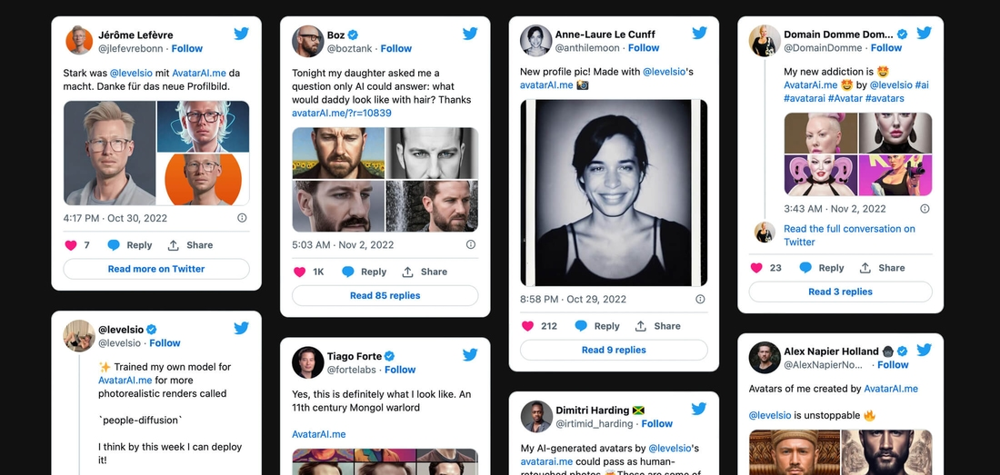

[Avatarai.me](https://avatarai.me/) allows you to quickly generate nice profile pics with Stable Diffusion

[Avatarai.me](https://avatarai.me/) 允许您使用 Stable Diffusion 快速生成漂亮的个人资料照片

[Midjourney](https://www.midjourney.com/) is a startup founded by David Holz that focuses on the art community. From my point of view, it offers the wildest creative options of these models. Further, with its alpha iteration of version 4 (released in November 2022) it began to produce astonishingly high-quality results—almost indistinguishable from that of a real person.

[Midjourney](https://www.midjourney.com/) 是一家由 David Holz 创立的专注于艺术社区的初创公司。 在我看来，它提供了这些模型中最疯狂的创意选择。 此外，随着版本 4 的 alpha 迭代（2022 年 11 月发布），它开始产生惊人的高质量结果——几乎与真人的结果没有区别。

> The technology is there, it’s accessible, and the results are remarkable. As a designer, it’s worth addressing the elephant in the room: is it time to finally delegate part of my work to AI?
> 
> 技术就在那里，它是可访问的，而且结果是显着的。 作为一名设计师，值得向房间里的大象讲话：是时候最终将我的部分工作委托给 AI 了吗？

## Introducing our experiment

## 介绍我们的实验

For this challenge, we’ll use Midjourney. I instantly had a task in mind that would lend itself well to the human-AI comparison: almost every week, our blog (which you’re reading right now) publishes articles, each of which demands a unique, thematically appropriate illustration. These are created by own our designers or one of several freelance illustrators. (All of these designers, crucially, are humans.)

对于这个挑战，我们将使用 Midjourney。 我立即想到了一项非常适合人类与 AI 比较的任务：几乎每周，我们的博客（您正在阅读）都会发布文章，每篇文章都需要一个独特的、主题合适的插图。 这些是由我们自己的设计师或几位自由插画师之一创作的。 （至关重要的是，所有这些设计师都是人。）

My responsibilities include art direction: proposing concepts, correcting compositions if needed, and ensuring the technical parameters are met. a number of illustrators have been working with us for quite some time, so, in general, the art direction is minimal. However, this process still takes 1–2 weeks on average. During this time, we have to passively wait for sketches and renders.

我的职责包括艺术指导：提出概念、根据需要更正构图，并确保满足技术参数。 许多插画家已经与我们合作了很长一段时间，因此，总的来说，艺术指导是最小的。 然而，这个过程平均仍需要 1-2 周的时间。 在这段时间里，我们只能被动地等待草图和渲染图。

These illustrations also have a certain style: we try to ensure that 90% of the covers are made in a 3D isometric view, have a fairly “plastic” and vivid look, and a solid background. The typical illustration size is 1200×1000 pixels. Let’s take these constants as our technical parameters for our experiment.

这些插图也有一定的风格：我们尽量确保 90% 的封面是在 3D 等距视图中制作的，具有相当“塑料”和生动的外观，以及纯色的背景。 典型的插图尺寸为 1200×1000 像素。 让我们将这些常数作为我们实验的技术参数。

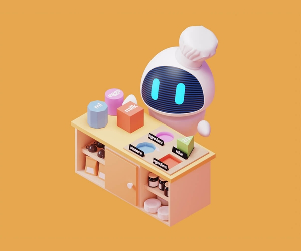

A classic illustration for the Evil Martians blog

Evil Martians 博客的经典插图

> As for the concepts: we’ll use three illustrations already created for our blog. Specifically, we’ll copy the original request we sent to our human illustrators and try using it as a prompt for Midjourney.
> 
> 至于概念：我们将使用已经为我们的博客创建的三个插图。 具体来说，我们将复制发送给人类插画师的原始请求，并尝试将其用作 Midjourney 的提示。

## Metrics

## 指标

In order to make some kind of ultimate judgement, we’ll have to set some parameters we use to properly evaluate the result. To that end, I came up with the following list:

为了做出某种最终判断，我们必须设置一些参数来正确评估结果。 为此，我想出了以下列表：

-   Active time spent on the art direction for illustrator vs. neural network: concept refinements and composition adjustments for the artist, prompt tweaks for Midjourney.
-   插画师与神经网络在艺术指导上花费的积极时间：艺术家的概念改进和构图调整，Midjourney 的及时调整。
-   Overall creation time, from request to final result.
-   从请求到最终结果的总体创建时间。
-   A comparison of approximate financial costs.
-   近似财务成本的比较。
-   Which cover pic ultimately looks more appealing?
-   哪张封面照片最终看起来更吸引人？

## Task №1: a cat and a ball

## 任务№1：一只猫和一个球

#### Human artist

#### 人类艺术家

The request we sent to the illustrator:  
_“We’re writing an article about migrating from CircleCI to GitHub Actions. Their logos are a circle and a cat (see attachments). So this is the idea—the cat is playing with a frisbee, ball, or other round object. Can you design the cutest kitty in the world? You can even make it a little Martian if you want.”_

我们向插画师提出的要求：  
_“我们正在写一篇关于从 CircleCI 迁移到 GitHub Actions 的文章。 他们的标志是一个圆圈和一只猫（见附件）。 这就是想法——猫正在玩飞盘、球或其他圆形物体。 你能设计出世界上最可爱的小猫吗？ 如果你愿意，你甚至可以让它有点像火星人。”_

After 4 days, the artist sent fairly detailed renders, designed in a beautiful “toy” style and meeting all the technical parameters:

4 天后，艺术家发送了相当详细的渲染图，以漂亮的“玩具”风格设计并满足所有技术参数：

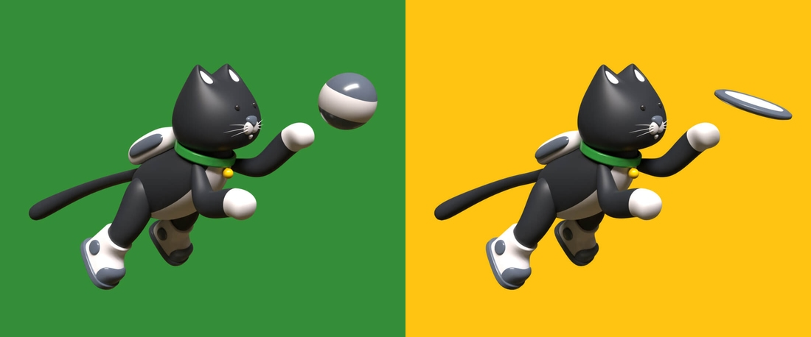

We took the green version with the ball. The only request was to slightly change the tail’s shape and the size of the cat’s muzzle. The result came back the next day; everyone loved it. In all, the process took 6 days, with a half hour—maximum—of active art direction.

我们拿了带球的绿色版。 唯一的要求是稍微改变尾巴的形状和猫口吻的大小。 结果第二天就出来了； 每个人都喜欢它。 整个过程总共耗时 6 天，其中有半小时（最多）是活跃的艺术指导。

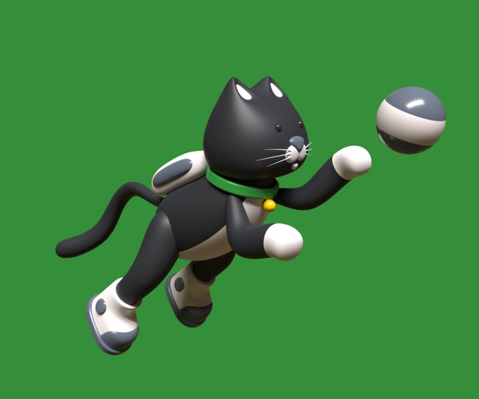

#### AI artist

#### 你是个艺术家

With Midjourney, everything starts with a prompt you send to a dedicated Discord chat:  
/imagine: `pixar style 3d image of the cat in a spacesuit playing with a ball on solid green background --ar 3:2 --v 4`

使用 Midjourney，一切都从您发送到专用 Discord 聊天的提示开始：  
/想象： `pixar style 3d image of the cat in a spacesuit playing with a ball on solid green background --ar 3:2 --v 4`

The last two commands are settings: `ar` is aspect ratio, and `v 4` will use the newest version of Midjourney for highest quality results. `pixar style 3d` indicates the style I’d like to refer to.

最后两个命令是设置： `ar`是纵横比，并且 `v 4`将使用最新版本的 Midjourney 以获得最高质量的结果。 `pixar style 3d`表示我想参考的样式。

Here’s the result, which I got back immediately:

这是我立即返回的结果：

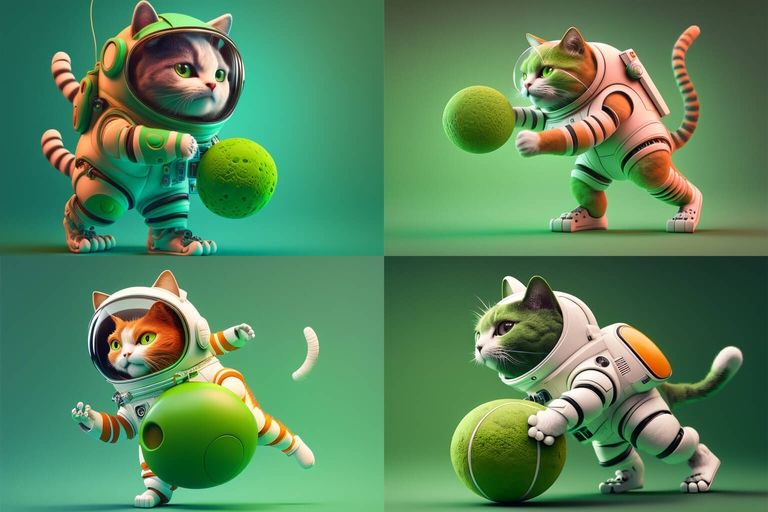

OK, this looks amusing, but our classic “plastic” style is missing. Let’s add the word “plastic” into the prompt: `pixar style 3d of a toy plastic cat in a spacesuit playing with a ball on solid green background --ar 3:2 --v 4`

好吧，这看起来很有趣，但是我们经典的“塑料”风格不见了。 让我们在提示中添加“塑料”一词： `pixar style 3d of a toy plastic cat in a spacesuit playing with a ball on solid green background --ar 3:2 --v 4`

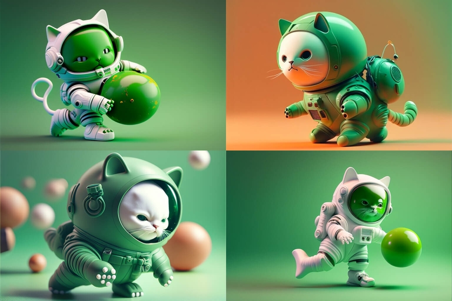

Now it’s definitely plastic looking, but it looks kinda scary—and some body parts are missing.

现在它看起来绝对是塑料的，但看起来有点吓人——而且一些身体部位不见了。

Let’s repeat the prompt, but try to make the cat black and more reminiscent of the GitHub mascot: `pixar style 3d of a black toy plastic cat in a spacesuit playing with a ball on solid green background --ar 3:2 --v 4`

让我们重复提示，但尝试让猫变黑，更让人联想到 GitHub 吉祥物： `pixar style 3d of a black toy plastic cat in a spacesuit playing with a ball on solid green background --ar 3:2 --v 4`

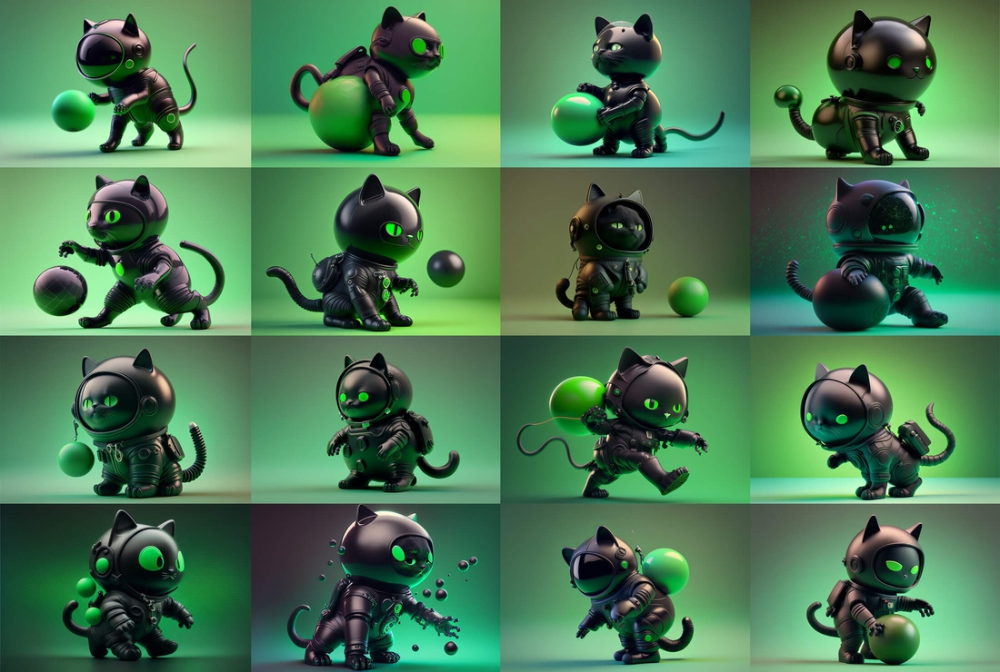

I repeated the prompt several times, but it seems to me that the composition always lacked dynamics. Let’s try to add some words indicating motion: `plastic toy cat in a spacesuit jumping and playing with a ball, black on solid green background, Pixar style isometric 3d render --ar 3:2 --v 4`

我重复了几次提示，但在我看来，构图总是缺乏动力。 让我们尝试添加一些表示运动的词： `plastic toy cat in a spacesuit jumping and playing with a ball, black on solid green background, Pixar style isometric 3d render --ar 3:2 --v 4`

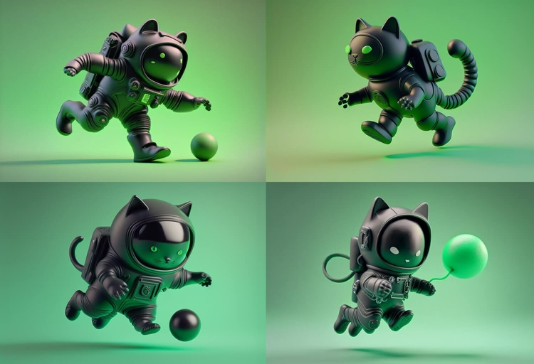

Now we’re talking! The composition looks interesting and quite dynamic. The word “jumping” immediately added the missing momentum. The only thing left is to generate some variations:

现在我们在说话！ 该构图看起来很有趣并且很有活力。 “跳跃”二字，顿时补上了缺失的气势。 唯一剩下的就是生成一些变体：

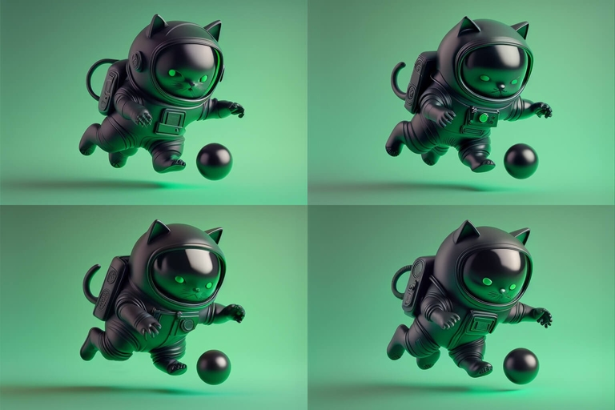

And we’ll upscale the one I like:

我们将升级我喜欢的那个：

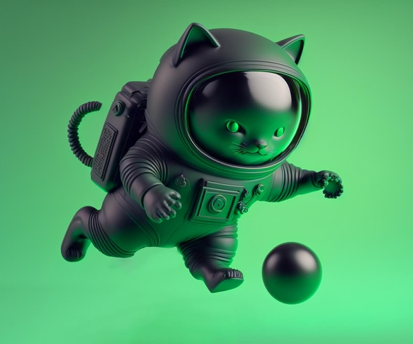

Midjourney is not very good dealing with the kind of uniform backgrounds our blog requires, so I’ll use one more AI tool named [Remove.bg](https://www.remove.bg/) to finalize the image. And here we are! It took me about an hour and half of active time to end up here.

Midjourney 不太适合处理我们博客需要的那种统一背景，所以我将使用另一个名为 [Remove.bg](https://www.remove.bg/) 的 AI 工具来完成图像。 我们到了！ 我花了大约一个半小时的活动时间才到这里结束。

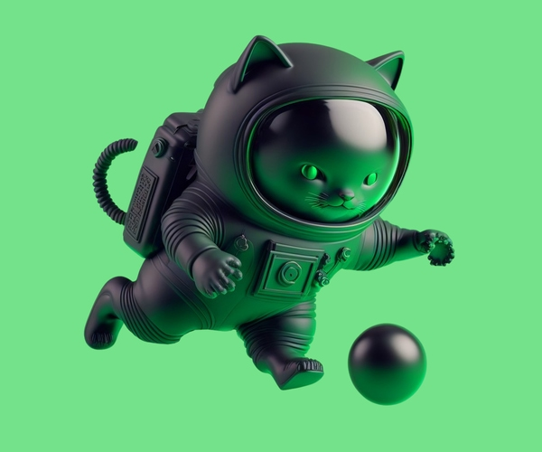

## Task №2: a Martian spaceship

## 任务 2：火星飞船

#### Human artist

#### 人类艺术家

As with the previous image, we suggested an idea, but this time it was more vague:  
_“Hi! We’ll have a big event soon: our new website release. Along with the release, we want to publish an article about our inspirations and how we created its design. For the illustration, we’d like: a white background, possibly with color spots in the center, and a white object on it, or an iridescent object on pure white. For the concept: something about the new Martian starship, bright and shiny.”_

与上一张图片一样，我们提出了一个想法，但这次更加模糊：  
_“你好！ 我们很快就会有一件大事：我们的新网站发布。 随着发布，我们想发表一篇关于我们的灵感和我们如何创建它的设计的文章。 对于插图，我们想要：一个白色背景，中间可能有色点，上面有一个白色物体，或者纯白色上有一个彩虹色物体。 对于这个概念：关于新火星星际飞船的东西，明亮而闪亮。”_

After 8 days (there was no rush with this article), the illustrator sent sketches of various spaceships in a futuristic style and one version “from inside the spaceship.”

8 天后（这篇文章并不着急），插画家发送了各种未来主义风格的宇宙飞船草图和一个“来自宇宙飞船内部”的版本。

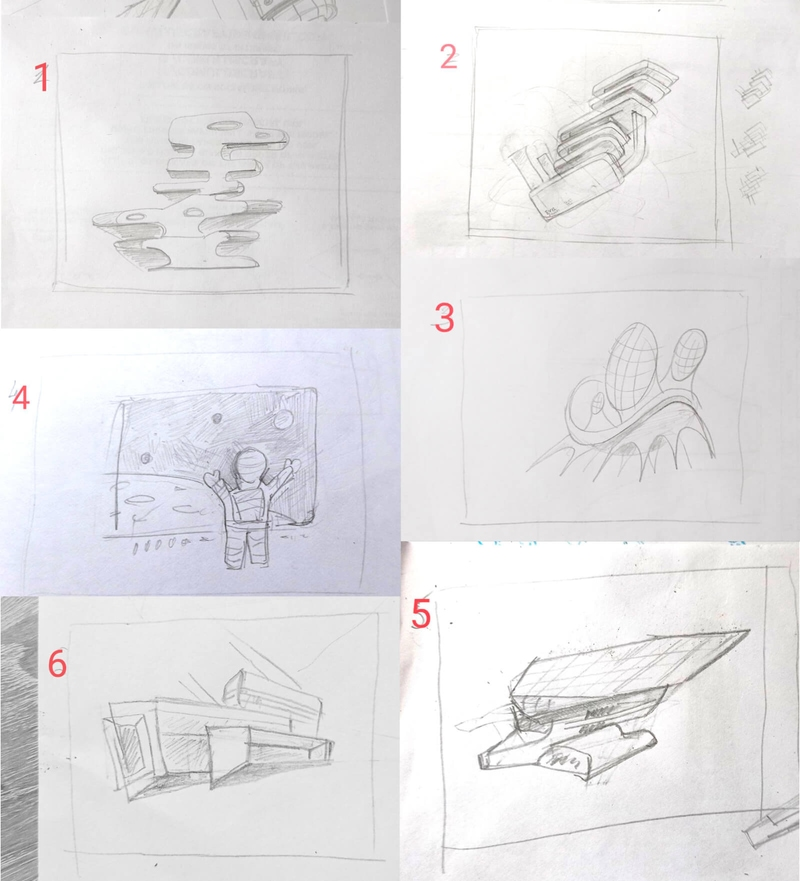

We choose options 2 and 5 for further fine-tuning. After another 5 days, the illustrator sends well detailed renders:

我们选择选项 2 和 5 进行进一步微调。 又过了 5 天，插画师发送了非常详细的渲染图：

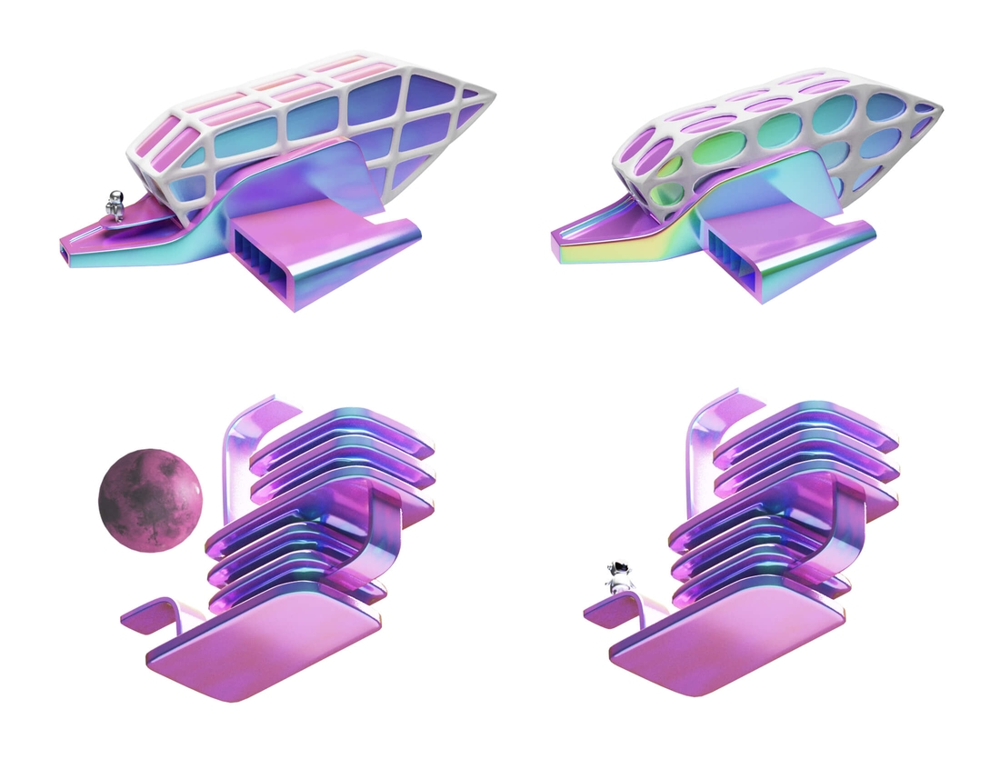

After choosing the spaceship and experimenting with planet shape, we ended up with the final result. It took 2 weeks, but only about an hour of active art direction time.

选择飞船并试验行星形状后，我们得出了最终结果。 花了 2 周时间，但只有大约一个小时的活跃艺术指导时间。

#### AI artist

#### 你是个艺术家

/imagine: `pixar style 3d composition of the martian spaceship and tiny astronaut pearlescent on white background --ar 3:2 --v 4`

/想象： `pixar style 3d composition of the martian spaceship and tiny astronaut pearlescent on white background --ar 3:2 --v 4`

This time I was immediately impressed with the first result! I like how the spaceship recalls a “Finding Nemo” character, and I think this illustrates the idea of a new Martian starship quite nicely. That said, it’s not white or pearlescent, but I still like it.

这次我立即对第一个结果印象深刻！ 我喜欢宇宙飞船如何让人想起“海底总动员”角色，我认为这很好地说明了新火星飞船的想法。 也就是说，它不是白色或珠光，但我仍然喜欢它。

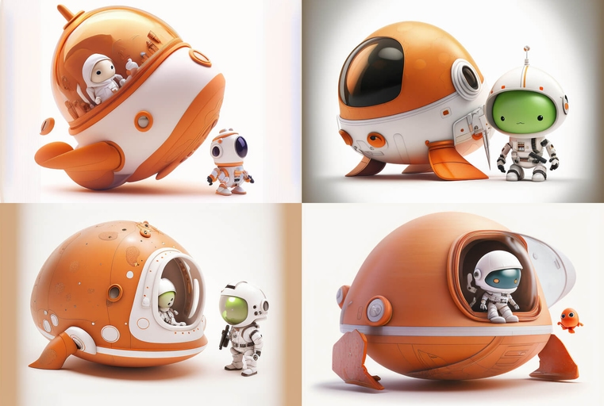

Let’s upscale the most promising one:

让我们升级最有前途的一个：

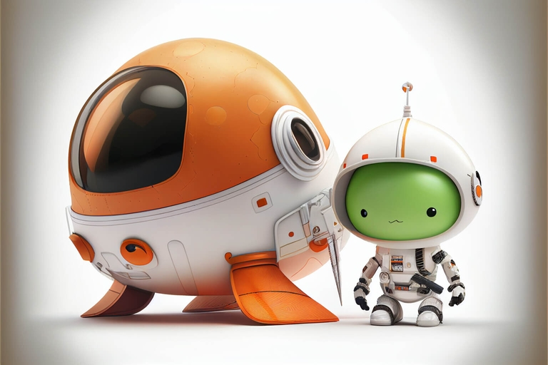

`Light upscale redo` option can help to get rid of unnecessary datalization:

`Light upscale redo`选项可以帮助摆脱不必要的数据化：

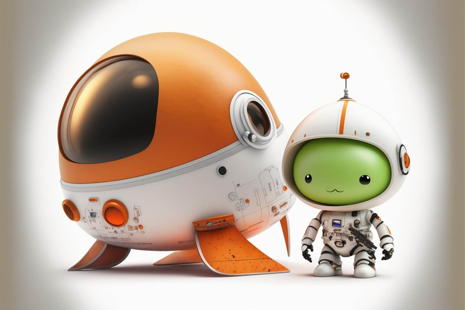

After applying [Remove.bg](https://www.remove.bg/) the image looks ready to be published. The entire process took me 20 minutes of active time. That was fast!

应用 [Remove.bg](https://www.remove.bg/) 后，图像看起来可以发布了。 整个过程占用了我 20 分钟的活动时间。 那太快了！

## Task №3: a scale of balance

## 任务 3：天平

#### Human artist

#### 人类艺术家

_“We need an illustration for a new article. It’s about a project we had that helps eBay sellers trade on large European marketplaces and earn more profits. I have a couple of ideas so far. The first one is about two cylinder hats, one smaller, one bigger. The rabbit jumps into the bigger and richer one. The second is about a scale or balance, with a few goods (parcels, gifts) on one side and many of them on the other.”_

_“我们需要一篇新文章的插图。 这是关于我们的一个项目，该项目帮助 eBay 卖家在大型欧洲市场上进行交易并赚取更多利润。 到目前为止，我有几个想法。 第一个是大约两个圆柱形帽子，一个小，一个大。 兔子跳进了更大更丰富的那个。 第二个是关于秤或天平，一侧有一些货物（包裹、礼物），另一侧有很多。”_

Our artist liked the second idea, and in 6 days we got back first sketches. It took 3 more days to create the render:

我们的美术师喜欢第二个想法，6 天后我们就拿到了第一张草图。 创建渲染又花了 3 天时间：

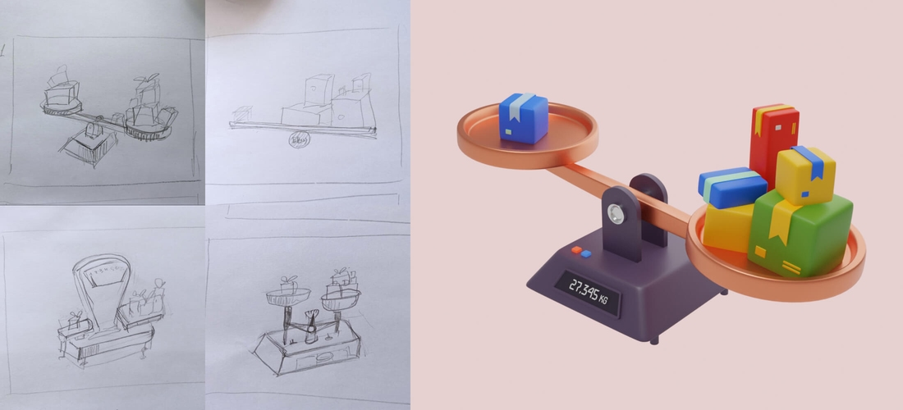

We only asked to change the background color to the one associated with the brand. It was ready on the next day. This took 10 days in total, with half an hour of active art direction time.

我们只要求将背景颜色更改为与品牌相关的颜色。 第二天就准备好了。 这总共花了 10 天，其中有半小时的活跃艺术指导时间。

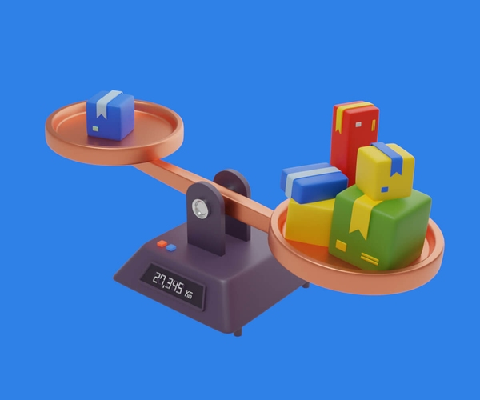

#### AI artist

#### 你是个艺术家

/imagine: `plastic toy balance scales with one parcel on one side and multiple parcels on the other, in greens, yellows and red, solid blue background, Pixar style isometric 3d render --ar 3:2 --v 4`

/想象： `plastic toy balance scales with one parcel on one side and multiple parcels on the other, in greens, yellows and red, solid blue background, Pixar style isometric 3d render --ar 3:2 --v 4`

This prompt sounds like it would be pretty easy, doesn’t it? But oddly enough, for the AI, it wasn’t. I kept repeating the prompt over and over again changing the types of things on the scales, but kept getting surreal configurations:

这个提示听起来很简单，不是吗？ 但奇怪的是，对于 AI 来说，事实并非如此。 我一遍又一遍地重复提示，改变秤上的东西的类型，但不断得到超现实的配置：

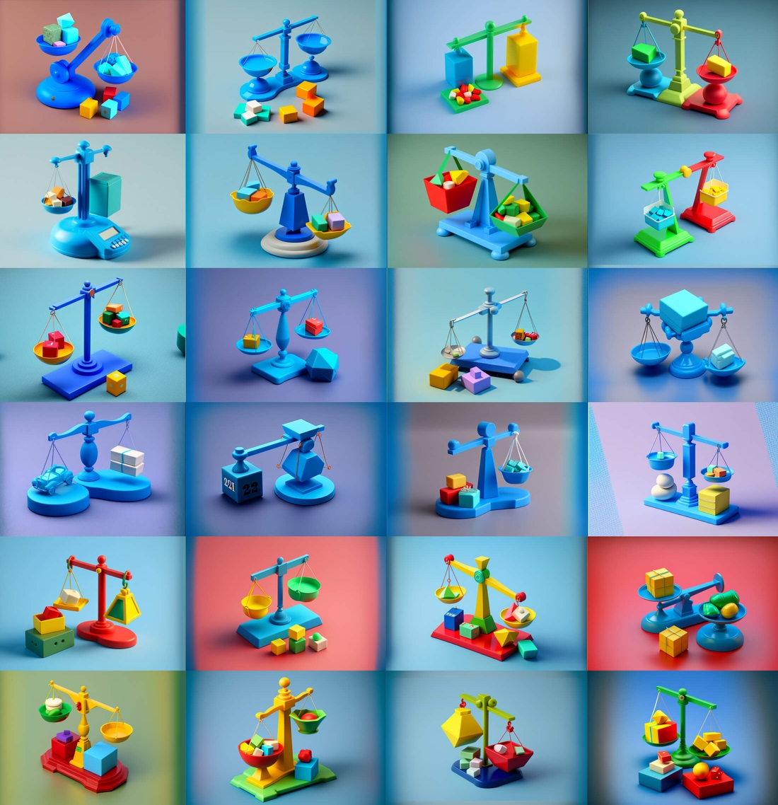

For some reason, the AI only started getting realistic scales when I specified that the plastic toy should be silver. Apparently, in the AI’s mind (…?) this configuration somehow made sense. The combination of scales and gifts, unfortunately, still did not:

出于某种原因，当我指定塑料玩具应该是银色时，AI 才开始获得逼真的比例。 显然，在 AI 的脑海中（……？）这种配置在某种程度上是有道理的。 遗憾的是，秤和礼物的组合仍然没有：

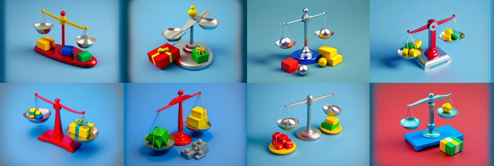

After two and a half hours of back and forth with the AI, I was completely exhausted and decided to just upscale the most promising result. This time, the background was already uniform, so no background removal needed.

在与 AI 来回交流了两个半小时后，我已经筋疲力尽，决定只升级最有希望的结果。 这一次，背景已经均匀了，所以不需要去除背景。

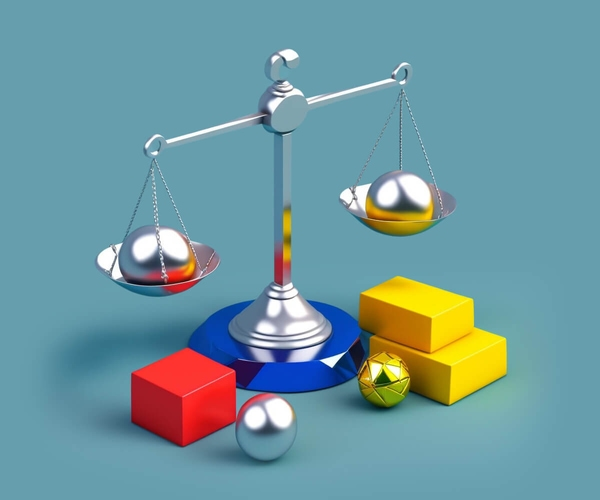

The “render” quality is decent, but the whole idea is missing

“渲染”质量不错，但缺少整体理念

## Summing up the problems

## 问题总结

After conducting this experiment, I found that the more complex and well-planned the concept, the less effective the AI was at creating the desired illustration. While it performed well with a simple subject, like a cat, with more intricate and detailed illustrations, we ended up with some Kafka-esque outcome.

进行这个实验后，我发现概念越复杂、计划越周密，人工智能在创建所需插图方面的效率就越低。 虽然它在一个简单的主题（如猫）和更复杂、更详细的插图上表现良好，但我们最终得到了一些卡夫卡式的结果。

With Midjourney, you can’t just “make the ball bigger” or “make the character smile”—you have to change the entire image. Solving this problem by making collages out of multiple results is an option, but where is the line between drawing the illustration yourself and manually correcting the AI’s work?

使用 Midjourney，您不能只是“让球变大”或“让角色微笑”——您必须改变整个图像。 通过将多个结果拼贴在一起来解决这个问题是一种选择，但是自己绘制插图和手动纠正 AI 的工作之间的界限在哪里？

> AI is not a magic box that immediately gives you the “perfect” image you’re after. Instead, good images come about as the result of a long dialogue between a human and AI. The human must also have a good understanding of art style and a bit of creative vision.
> 
> AI 不是一个能立即为您提供您所追求的“完美”图像的魔盒。 相反，好的图像是人与人工智能之间长时间对话的结果。 人类还必须对艺术风格有很好的理解和一点创造性的眼光。

Another issue is that there is still no good solution for animation (at least none that I am aware of). If you want a smoothly animated cover for an article [like this one](https://evilmartians.com/chronicles/down-the-caching-hole-adventures-in-http-caching-and-faraday-land), only a human artist will suffice.

另一个问题是仍然没有很好的动画解决方案（至少我知道没有）。 文章那样流畅的动画封面 [如果你想要像这篇](https://evilmartians.com/chronicles/down-the-caching-hole-adventures-in-http-caching-and-faraday-land) ，只有人类艺术家就足够了。

## The score

## 分数

Let’s weigh the pros and cons to make our final decision and calculate the costs. Which of the following pictures do you prefer?

让我们权衡利弊做出最终决定并计算成本。 以下图片你更喜欢哪一张？

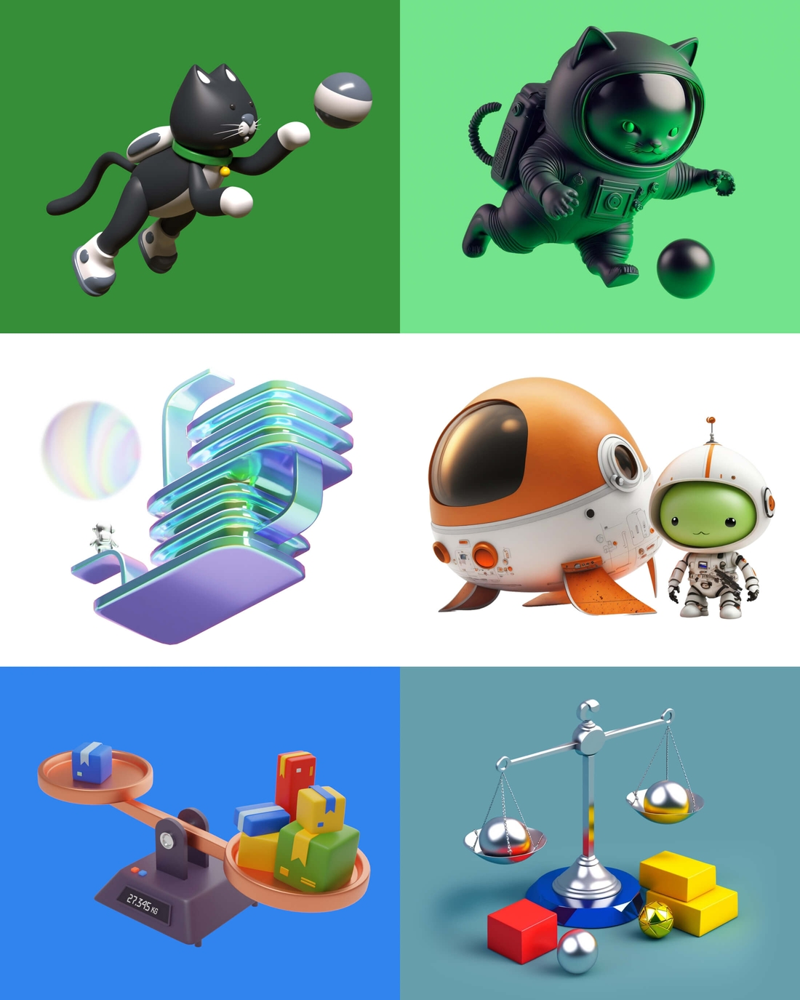

The cover illustrations for our blog posts created by human designers are on the left, and those generated with Midjourney on the right

左侧是人类设计师为我们的博客文章创作的封面插图，右侧是使用 Midjourney 生成的封面插图

#### Time requirements

#### 时间要求

Designing illustrations with Midjourney took between 20 minutes and 2.5 hours of active art direction time per illustration. It’s possible to achieve a decent result quickly—but it’s also possible that the result could be even better given more time.

使用 Midjourney 设计插图每幅插图需要 20 分钟到 2.5 小时的活跃艺术指导时间。 快速取得不错的结果是可能的——但也有可能在给予更多时间的情况下取得更好的结果。

Working with human artists took anywhere from 6 days to 2 weeks, but only required about 0.5–1 hour of active art direction time per illustration.

与人类艺术家合作需要 6 天到 2 周的时间，但每幅插图只需要大约 0.5-1 小时的活跃艺术指导时间。

It’s a classic trade-off: you can either trust everything to a skilled artist or carefully oversee every step of the AI’s process. Personally, I would choose the first option.

这是一个经典的权衡：你可以将一切都托付给熟练的艺术家，或者仔细监督 AI 过程的每一步。 就个人而言，我会选择第一个选项。

#### Financial costs

#### 财务成本

In terms of financial costs, the AI predictably comes out ahead. A standard individual membership for a month only runs $30, and the resulting images can be used [however you’d like](https://midjourney.gitbook.io/docs/terms-of-service). (However, if you’re using the images as an employee of a company that makes more than $1 million per year in revenue, you’ll need to purchase a “Corporate” plan for $600 per year.)

在财务成本方面，人工智能可以预见地领先。 一个月的标准个人会员资格只需 30 美元，生成的图像可以随心所欲地 [使用](https://midjourney.gitbook.io/docs/terms-of-service) 。 （但是，如果您作为年收入超过 100 万美元的公司的员工使用图像，则需要购买每年 600 美元的“公司”计划。）

We spend about $600 per month on illustrations by human artists. The economic difference is obvious.

我们每月在人类艺术家的插图上花费大约 600 美元。 经济上的差距是显而易见的。

#### Who comes out on top?

#### 谁名列前茅？

As a result of the experiment, we found that **both** human and AI artists excelled at certain tasks. Thus, we’re considering using Midjourney in the following scenarios:

作为实验的结果，我们发现 **。** 人类和人工智能艺术家在某些任务上都表现出色 因此，我们正在考虑在以下场景中使用 Midjourney：

-   When a Martian designer a.k.a. a “prompt engineer” has some free time to actively generate images.
-   当火星设计师又名“及时工程师”有空闲时间主动生成图像时。
-   When the idea for an illustration is simple and doesn’t involve multiple objects with complex interactions between them.
-   当插图的想法很简单并且不涉及多个对象以及它们之间复杂的交互时。
-   When we need an illustration quickly and can’t wait for real 3D renders to be approved and ready.
-   当我们需要快速绘制插图并且迫不及待地等待真正的 3D 渲染获得批准并准备就绪时。

🤖 Finally, a disclaimer: **this article** was partially written by AI, and the cover image was generated by AI as well.

🤖 最后声明一下： **本文** 部分由AI撰写，封面由AI生成。

AI is still no substitute for Evil Martian expertise! We’re here to help. Do you have a web or mobile application that requires expert problem solving with product design, frontend, backend, or software reliability? Looking to get your project off the ground? [Reach out to us](https://evilmartians.com/chronicles/midjourney-vs-human-illustrators-has-ai-already-won#contact-us)!

AI 仍然无法替代 Evil Martian 的专业知识！ 我们是来帮忙的。 您的 Web 或移动应用程序是否需要专家解决产品设计、前端、后端或软件可靠性方面的问题？ 想让您的项目落地？ [联系我们](https://evilmartians.com/chronicles/midjourney-vs-human-illustrators-has-ai-already-won#contact-us) ！
