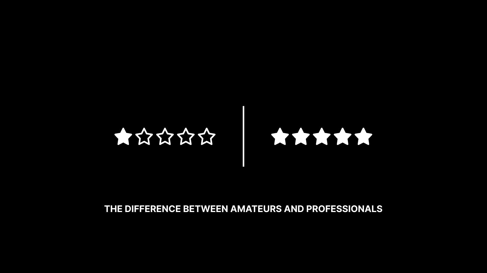

Visualizations Credit: [Drex\_JPG](https://twitter.com/drex_jpg)

When I was a kid, my dream was to be a professional athlete.

当我还是个孩子的时候，我的梦想是成为一名职业运动员。

This is a fairly common dream among children— there’s something about the glory that is bestowed upon the victorious warrior that is quite romantic.

这是孩子们相当普遍的梦想——胜利的战士所获得的荣耀有些浪漫。

By age 17, this actually seemed like a real possibility for me. I was being recruited to play baseball by some big-name schools and had even had a few professional scouts come to my games. My childish dream started to feel within reach.

到 17 岁时，这对我来说似乎真的有可能。 我被一些知名学校招募打棒球，甚至有几个职业球探来看我的比赛。 我的幼稚梦想开始变得触手可及。

Life, as it turns out, had different plans for me.

事实证明，生活对我有不同的计划。

Nearing the end of a college career, an arm injury—and probably a deficiency of talent!—brought my professional aspirations to a halt.

在大学生涯接近尾声时，一次手臂受伤——可能是天赋不足！——让我的职业抱负戛然而止。

After entering the “real world” and observing from afar those among my friends who had achieved those childhood dreams, and those who had achieved remarkable success in other endeavors, I realized there had been a fundamental, foundational flaw in my thinking.

进入“现实世界”，远远地观察了我的朋友中那些实现了童年梦想的人，以及那些在其他方面取得了非凡成就的人，我意识到我的想法存在根本性的、根本性的缺陷。

I had viewed “turning pro“ as a point in time—a moment when you flipped a switch and become a professional.

我曾将“转为专业人士”视为一个时间点——一个你按下开关并成为专业人士的时刻。

What I came to understand was that being a professional was not about the title—but rather, about the processes, habits, mindsets, and systems. In other words, a professional is not a professional because of an arbitrary title or designation, but because of how they operate and think.

我开始明白，成为专业人士不在于头衔，而在于过程、习惯、心态和系统。 换句话说，专业人士不是因为随意的头衔或名称而成为专业人士，而是因为他们如何运作和思考。

The truth is that we can all level up from our amateur ways and adopt the mindsets and habits of the professional. In doing so, we will accelerate our trajectory, create more luck, and unlock new opportunities.

事实是，我们都可以从业余的方式中升级，并采用专业的思维方式和习惯。 这样做，我们将加快我们的轨迹，创造更多的运气，并释放新的机会。

Here are 11 differences between amateurs and professionals that you need to understand if you want to start leveling up.

如果您想开始升级，您需要了解业余爱好者和专业人士之间的 11 个区别。

## Amateurs let the day come to them, Professionals have a routine

## 业余爱好者顺其自然，专业人士有规律可循

The greatest performers in any craft share one trait in common: They have a routine—and they stick to it with intense discipline.

任何一门手艺中最出色的表演者都有一个共同特征：他们有一套常规——而且他们会严格遵守纪律。

Most of what we call greatness is simply the result of tiny daily actions done well—over and over and over again.

大多数我们称之为伟大的东西只是日常微小行动的结果——一遍又一遍。

Professionals establish a routine and use it to own each day. They eliminate questions and surprises by controlling the narrative.

专业人士建立了一个例程，并用它来掌控每一天。 他们通过控制叙述来消除问题和惊喜。

Professionals also realize that a routine is useless if the environment is unsuited to following it. Professionals create their environment, they don't just exist in it.

专业人士还意识到，如果环境不适合遵循惯例，那么惯例就毫无用处。 专业人士创造他们的环境，他们不只是存在于其中。

They dictate the terms.

他们规定条款。

## Amateurs love the prize, Professionals love the process

## 业余爱好者喜欢奖品，专业人士喜欢过程

You’ll never make it if the view at the summit is the only thing motivating you to keep climbing.

如果顶峰的景色是您继续攀登的唯一动力，那么您将永远无法成功。

The hunt has to be just as exciting as the meal at the end.

狩猎必须和最后的用餐一样令人兴奋。

It may sound cliche, but professionals truly fall in love with the process.

这可能听起来陈词滥调，但专业人士真正爱上了这个过程。

## Amateurs make it look effortful, Professionals make it look effortless

## 业余爱好者让它看起来很费力，专业人士让它看起来毫不费力

The Paradox of Effort: You have to put in more effort to make something appear effortless.

努力的悖论：你必须付出更多的努力才能让事情看起来毫不费力。

Professionals recognize that effortless, elegant performances are simply the result of a large volume of gritty, effortful practice.

专业人士认识到，轻松、优雅的表演只是大量坚韧、努力练习的结果。

Small things become big things.

小事变成大事。

## Amateurs blame others, Professionals are accountable

## 外行责备他人，专业人士负责

In the wake of a failure, there are two types of responses:

失败后，有两种类型的响应：

1.  The Amateur looks outward—bad luck, unfair circumstances, a cheating opponent.
2.  The Professional looks inward—lack of preparation, gaps in routine, uneven intensity.

1.  业余选手向外看——运气不好、环境不公平、对手作弊。
2.  专业人士向内看——准备不足、常规有差距、强度不均匀。

Type 1s stagnate and wither away. Type 2s grow.

类型 1 停滞不前并逐渐消亡。 2型成长。

Amateurs attribute success to skill and failure to luck. Professionals recognize the role of skill and luck in every outcome. They focus on the controllable factors. They create an environment where luck is more likely to strike.

业余爱好者将成功归因于技巧，将失败归因于运气。 专业人士认识到技能和运气在每个结果中的作用。 他们专注于可控因素。 他们创造了一个更有可能发生运气的环境。

Accountability breeds progress.

问责孕育进步。

## Amateurs are flashy, Professionals are relentless

## 业余爱好者浮华，专业人士无情

Many people are able to produce bursts of energy—few are able to produce consistent, steady flows, day in, day out.

许多人能够产生能量的爆发——很少有人能够日复一日地产生持续、稳定的能量流。

The former is flashy, but the latter is relentless.

前者浮华，后者无情。

Professionals take pride in punching the clock—in showing up—every single day.

专业人士以每天都按时上班为荣。

Never bet against the person who just keeps showing up.

永远不要与不断出现的人打赌。

## Amateurs enter with 100 mediocre moves, Professionals enter with 1 perfect move

## 业余爱好者以 100 个平庸的动作入场，专业人士以 1 个完美的动作入场

"I fear not the man who has practiced 10,000 kicks once, but I fear the man who has practiced one kick 10,000 times." - Bruce Lee

“我不怕练过一万次踢腿的人，我怕练过一万次踢腿的人。” - 李小龙

Professionals identify their unique edge—they play \*their\* game.

专业人士确定他们的独特优势——他们玩\*他们的\*游戏。

The Professional is:

专业是：

1.  Self-aware to determine their unique edge.
2.  Strategic to set the table to favor that edge.
3.  Ruthless to exploit that edge on the table they set.

1.  自我意识确定自己的独特优势。
2.  战略性地设置表格以支持该优势。
3.  无情地利用他们设置的桌子上的优势。

They worry less about fixing their weaknesses and more about pressing their strengths.

他们不太担心修复自己的弱点，而更担心发挥自己的优势。

## Amateurs fear failure, Professionals embrace it

## 业余爱好者害怕失败，专业人士欣然接受

The Paradox of Failure: The more you fail, the more you ultimately succeed.

失败的悖论：失败的次数越多，最终成功的次数就越多。

Shots on goal are necessary if you want to score. You'll miss 100% of the shots you don't take!

如果你想得分，射门是必要的。 您将错过 100% 未拍摄的照片！

Our greatest moments of growth often stem directly from our greatest failures.

我们最伟大的成长时刻往往直接源于我们最大的失败。

Professionals don't accept failure as inevitable, but they certainly don't fear it either.

专业人士不认为失败是不可避免的，但他们当然也不害怕失败。

Remember: You will fail. Embrace it. Fail smart and fast.

记住：你会失败的。 接受它。 聪明而快速地失败。

## Amateurs fear being wrong, Professionals enjoy it

## 业余爱好者害怕犯错，专业人士乐在其中

When faced with their own incompetence:

当面对自己的无能时：

-   The Amateur flails wildly in an attempt to distract from the obvious gap.
-   业余爱好者疯狂地挥动连枷，试图从明显的差距中转移注意力。
-   The Professional enlists support to cover the incompetence and repositions the board to avoid its exposure.
-   专业人士争取支持以掩盖无能，并重新定位董事会以避免其曝光。

Professionals have retrained their minds to embrace new information that forces a change in viewpoint and a strategic improvement.

专业人士已经重新训练他们的思想以接受迫使观点改变和战略改进的新信息。

They view each "software update" as an improvement upon the old.

他们将每个“软件更新”视为对旧软件的改进。

Remember: Open mindsets rule the world.

记住：开放的心态统治世界。

## Amateurs are impatient, Professionals are patient

## 业余爱好者没有耐心，专业人士有耐心

Amateurs are: Patient with actions and impatient with results.

业余爱好者是：对行动有耐心，对结果不耐烦。

Professionals are: Impatient with actions and patient with results.

专业人士是：对行动没有耐心，对结果有耐心。

Professionals are able to delay gratification—their low time preference allows them to play long-term games more effectively—but they simultaneously embrace that long-term games are won through tiny daily actions.

专业人士能够延迟满足——他们的低时间偏好使他们能够更有效地玩长期游戏——但他们同时接受长期游戏是通过微小的日常行动赢得的。

## Amateurs hope for good breaks, Professionals create them

## 业余爱好者希望有好的休息时间，专业人士创造它们

Amateurs enter the arena with their fingers crossed.

业余爱好者双手合十进入竞技场。

Professionals enter the arena with a plan. They realize that some of what we call luck is the macro result of thousands of micro actions.

专业人士带着计划进场。 他们意识到，我们所说的某些运气是数以千计的微观行动的宏观结果。

Professionals create more luck.

专业创造更多运气。

## Amateurs press, Professionals wait

## 业余新闻，专业人士等待

When pressure and stress levels elevate:

当压力和压力水平升高时：

-   The Amateur is uncomfortable—they press in an effort to fast-forward to the finish.
-   业余选手很不舒服——他们努力快进到终点。
-   The Professional is comfortable—they observe their opponent and wait for the opportune moment to strike.
-   专业人士很自在——他们观察对手并等待适当的出击时机。

The Amateur always leaps into motion, believing that forward motion is progress.

业余爱好者总是跃跃欲试，相信向前运动就是进步。

The Professional moves slowly—pauses, thinks, and acts.

专业人士行动缓慢——停顿、思考和行动。

The Paradox of Speed: Slow down to speed up. Slow is smooth and smooth is fast.

速度悖论：减速以加速。 慢即顺，顺即快。

## Conclusion

## 结论

The truth is that we can all "go pro" in whatever we are doing—it simply requires us to adopt the ways of the professional.

事实上，无论我们在做什么，我们都可以“走向专业”——这只需要我们采用专业的方式。

Internalize these 11 differences between amateurs and professionals to get started on your journey.

内化业余爱好者和专业人士之间的这 11 个差异，开始您的旅程。

I'd love to hear from you:

我很想听听你的意见：

-   What other differences between amateurs and professionals have you observed?
-   您观察到业余爱好者和专业人士之间还有哪些其他区别？
-   When was the moment you knew that you had become a professional in your craft?
-   您是什么时候知道自己已经成为专业人士的？

Tweet at me @SahilBloom and I'll do my best to get back to everyone!

发推给我@SahilBloom，我会尽力回复大家！

_As always, until next time...stay curious, friends!_

_一如既往，直到下一次......保持好奇，朋友们！_

_If you enjoyed today's newsletter, please share it with your friends and family!_

_如果您喜欢今天的时事通讯，请与您的朋友和家人分享！_

