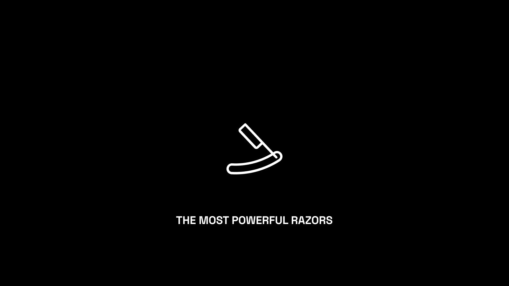
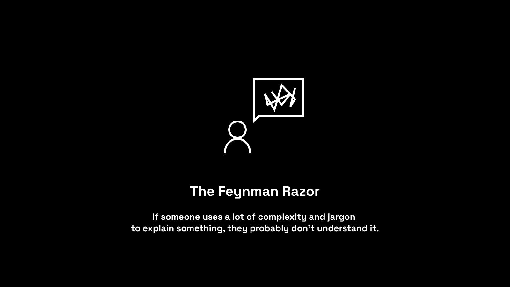
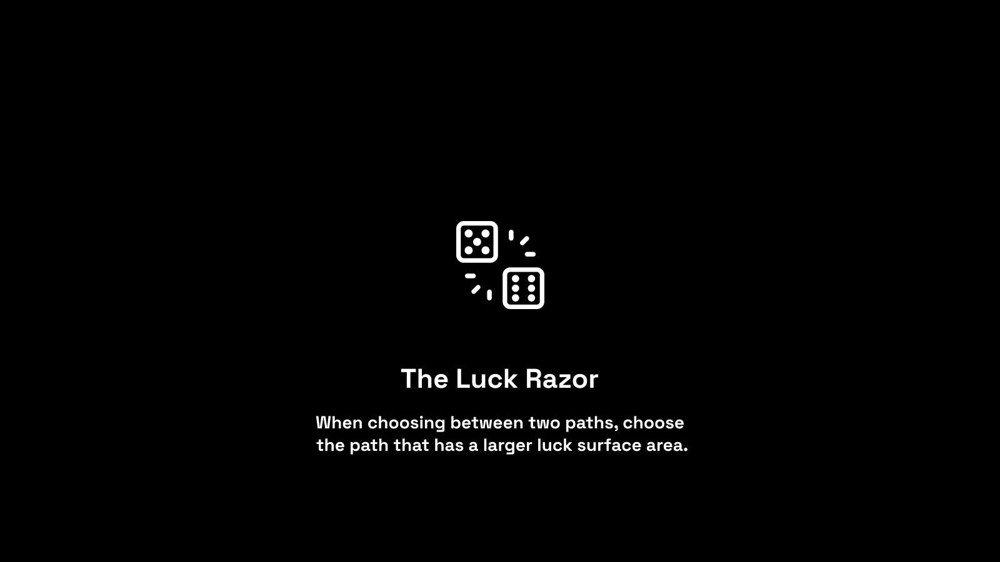
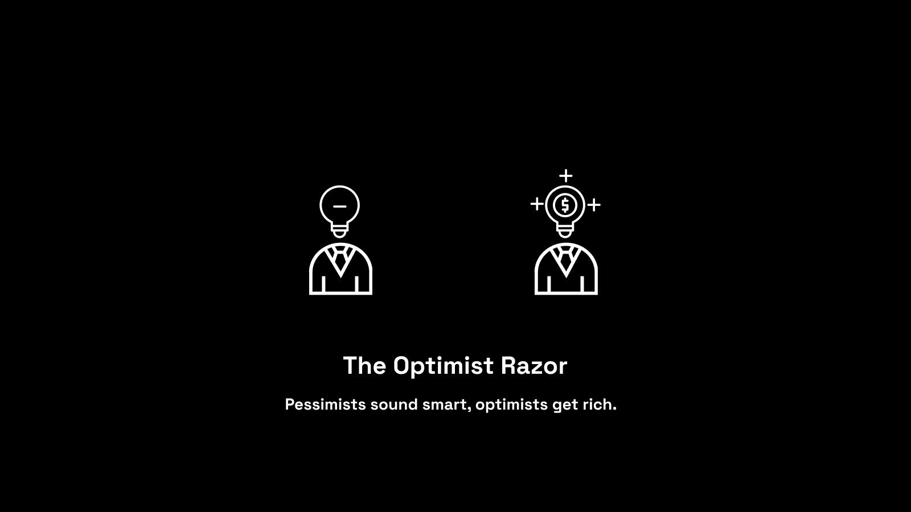
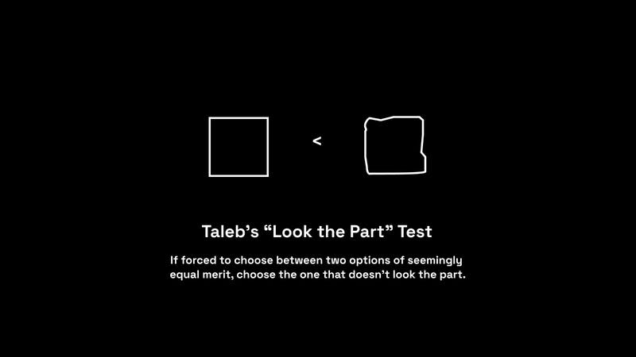
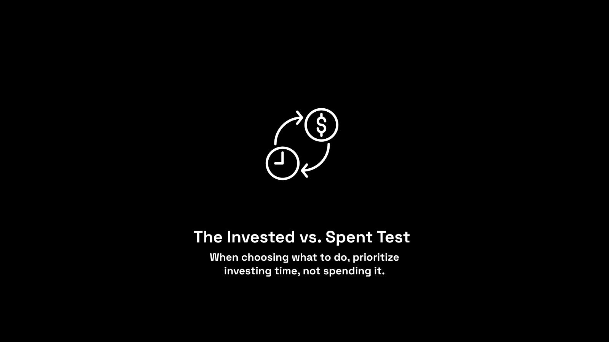
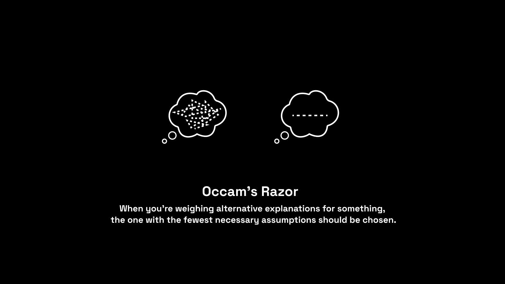
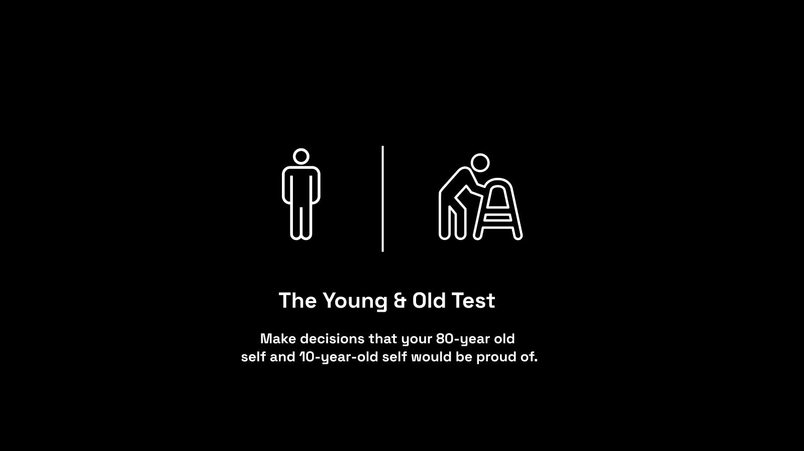
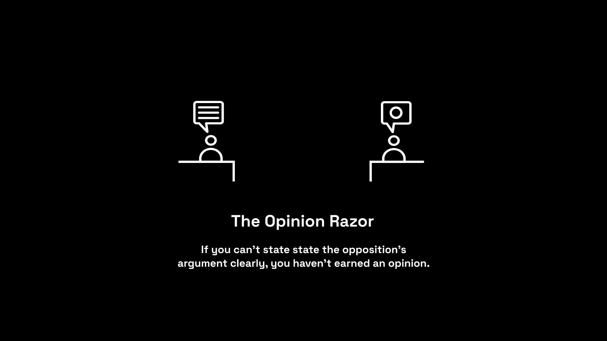
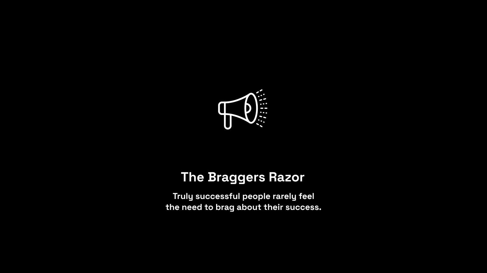

All Visualizations Credit: [@drex\_jpg](https://twitter.com/drex_jpg)

A “razor” is a rule of thumb that simplifies decision making.

“剃刀”是一种简化决策的经验法则。

The origin of the term comes from philosophy, where any principle that allowed one to quickly remove unlikely explanations or avoid unnecessary steps became referred to as a philosophical razor. A razor literally allowed its user to "shave off" explanations or actions.

该术语的起源来自哲学，任何允许人们快速删除不太可能的解释或避免不必要的步骤的原则都被称为哲学剃刀。 剃刀从字面上允许其用户“剃掉”解释或动作。

Humans are wired to take shortcuts in our decision-making—to be more efficient and effective in the wild. These shortcuts can lead us astray—as we see with the study of cognitive biases, many of which stem from subconscious, automatic errors made in the interest of speed.

人类天生喜欢在决策中走捷径——以便在野外变得更有效率和效力。 这些捷径可能会让我们误入歧途——正如我们在认知偏差研究中所见，其中许多源于为了追求速度而犯下的潜意识、自动错误。

But when used appropriately—i.e. with an understanding of their limitations and blindspots—shortcuts can be extremely valuable.

但如果使用得当——即了解它们的局限性和盲点——捷径可能会非常有价值。

In today's piece, I'd like to share a long list of useful decision-making razors. My hope is that you come away with a few that you can immediately implement in your life in order to make better decisions, faster than ever before.

在今天的文章中，我想分享一长串有用的决策剃刀。 我希望你能从中得到一些可以立即在你的生活中实施的方法，以便比以往更快地做出更好的决定。

Without further ado, here are the most powerful razors I’ve found...

事不宜迟，这里是我发现的最强大的剃须刀......

## The Feynman Razor

## 费曼剃刀

Complexity and jargon are used to mask a lack of deep understanding.

复杂性和行话被用来掩盖缺乏深刻的理解。

If you can’t explain it to a 5-year-old, you don’t really understand it.

如果你不能向一个 5 岁的孩子解释，你就不会真正理解它。

If someone uses a lot of complexity and jargon to explain something, they probably don’t understand it.

如果有人使用大量的复杂性和行话来解释某事，他们很可能不理解。

## The Luck Razor

## 幸运剃刀

When choosing between two paths, choose the path that has a larger luck surface area.

在两条路径之间进行选择时，选择运气表面积较大的路径。

Much of what we call "luck" is actually the macro result of 1,000s of micro actions. Your daily habits put you in a position where “luck” is more likely to strike.

许多我们所说的“运气”实际上是 1,000 多个微观行为的宏观结果。 您的日常习惯使您处于“运气”更有可能降临的位置。

It’s hard to get lucky watching TV at home—it’s easy to get lucky when you’re engaging and learning, physically or digitally.

在家看电视很难幸运——当你参与和学习时，无论是身体上还是数字上，都很容易幸运。

Spend more time on things that increase your luck surface area.

花更多的时间在可以增加运气表面积的事情上。

## The Arena Razor

## 竞技场剃刀

When faced with two paths, choose the path that puts you in the arena.

当面对两条路时，选择让你进入竞技场的路。

It's easy to throw rocks from the sidelines. It's scary and lonely in the arena—but it's where growth happens.

从场边扔石头很容易。 竞技场上既可怕又孤独——但这是成长发生的地方。

Once you're in the arena, never take advice from people on the sidelines.

一旦进入竞技场，就永远不要听取场外人的建议。

_Sahil Note: This point on advice is a very important one. Most advice sucks. You have to build "advice filters" that help you take the signal and skip the noise. One such filter is to never take advice from someone who isn't in the arena. Their map is entirely formed from the outside looking in and is unlikely to provide value for someone in the game._

_Sahil 注：关于建议的这一点非常重要。 大多数建议都很糟糕。 你必须构建“建议过滤器”来帮助你获取信号并跳过噪音。 一个这样的过滤器是永远不要听取不在舞台上的人的建议。 他们的地图完全是从外部向内看形成的，不太可能为游戏中的某人提供价值。_

## The Optimist Razor

## 乐观剃刀

When choosing who to spend time with, prioritize spending more time with optimists.

在选择与谁共度时光时，优先考虑与乐观主义者共度更多时光。

Pessimists see closed doors. Optimists see open doors—and probably kick down the closed doors along the way.

悲观者看到紧闭的大门。 乐观主义者看到敞开的门——并可能一路推倒关闭的门。

Remember: Pessimists sound smart, optimists get rich.

请记住：悲观者听起来很聪明，乐观者致富。

## Taleb’s “Look the Part” Test

## 塔勒布的“看零件”测试

Nassim Nicholas Taleb famously proposed this rule of thumb in his best selling book, Skin in the Game.

纳西姆·尼古拉斯·塔勒布 (Nassim Nicholas Taleb) 在他的畅销书《Skin in the Game》中著名地提出了这一经验法则。

He talks about choosing between two surgeons of equal qualification and experience. One looks highly-refined and one looks like a butcher. Quoting from the book: "Simply the one who _doesn’t_ look the part, conditional of having made a (sort of) successful career in his profession, had to have much to overcome in terms of perception."

他谈到在两位具有同等资格和经验的外科医生之间做出选择。 一个看起来很精致，一个看起来像屠夫。 引用书中的话：“只是看起来不像角色的人 _，_ 以在他的职业中取得（某种）成功的职业为条件，在感知方面必须克服很多困难。”

Generalizing the rule, if forced to choose between two options of seemingly equal merit, choose the one that doesn’t look the part.

概括规则，如果被迫在两个看似同等优点的选项之间做出选择，请选择看起来不相称的选项。

The one who doesn’t look the part has had to overcome much more to achieve its status than the one who fit in perfectly.

与完美契合的人相比，看起来不合群的人必须克服更多的困难才能获得其地位。

## The Gratitude Razor

## 感恩剃刀

When in doubt, choose to show MORE gratitude to the people who have mentored or supported you.

如有疑问，请选择对指导或支持您的人表示更多感谢。

Say thank you more. Tell someone you appreciate them. Not just on special occasions—every single day.

多说声谢谢。 告诉别人你欣赏他们。 不仅仅是在特殊场合——每一天。

Lean into gratitude daily and your life will improve.

每天感恩，你的生活就会改善。

## The Invested vs. Spent Test

## 投资与花费测试

Time is either \*invested\* or \*spent\*.

时间要么是\*投资\*，要么是\*花费\*。

Invested time—actions that compound:

投入时间——复合的行动：

-   Reading
-   阅读
-   Physical activity
-   体力活动
-   Mindfulness
-   正念
-   Relationship building
-   建立关系

Spent time—actions that don’t.

花时间——不花时间的行动。

When choosing what to do, prioritize investing time, not spending it.

在选择做什么时，优先考虑投资时间，而不是花费时间。

## The Rooms Razor

## 房间剃刀

If you have a choice between entering two rooms, choose the room where you're more likely to be the dumbest one in the room.

如果您可以在进入两个房间之间做出选择，请选择您更有可能成为房间中最笨的那个房间。

Once you're in the room, talk less and listen more.

进入房间后，少说多听。

Bad for your ego—great for your growth.

对你的自我不利——对你的成长有益。

## The New Project Razor

## 新项目剃刀

When deciding whether to take on a new project, follow a simple two-step approach:

在决定是否接受新项目时，请遵循简单的两步法：

1.  Is this a "hell yes!" opportunity? If not, say no. If yes, proceed to Step 2.
2.  Imagine that this is going to take 2x as long and be 1/2 as profitable as you expect. Do you still want to do it? If no, say no. If yes, take on the project.

1.  这是“地狱是的！” 机会？ 如果没有，请说不。 如果是，请继续执行步骤 2。
2.  想象一下，这将花费 2 倍的时间，而利润是您预期的 1/2。 你还想做吗？ 如果没有，就说不。 如果是，请接受该项目。

Using this approach will force you to say no much more often—you'll only say yes to projects you are extremely excited about, which are ultimately those that drive asymmetric rewards in your life.

使用这种方法会迫使你更频繁地说不——你只会对你非常兴奋的项目说“是”，这些项目最终会在你的生活中带来不对称的回报。

## The Uphill Decision Razor

## 艰难的决定剃刀

When faced with two options, choose the one that’s more difficult in the short-term.

面对两种选择时，选择短期内难度较大的一种。

There are two paths:

有两条路径：

-   Easy now—hard later.
-   现在容易——以后很难。
-   Hard now—easy later.
-   现在难——以后容易。

Naval Ravikant calls this making "uphill decisions”—overriding your pain avoidance instinct and choosing the path that looks more arduous.

Naval Ravikant 将此称为“艰难的决定”——压倒你避免痛苦的本能，选择看起来更艰难的道路。

It's worth it—short-term pain typically creates compounding long-term gain.

这是值得的——短期的痛苦通常会带来复合的长期收益。

## Occam's Razor

## 奥卡姆剃刀

When you're weighing alternative explanations for something, the one with the fewest necessary assumptions should be chosen.

当你权衡某事的替代解释时，应该选择必要假设最少的解释。

Put simply, the simplest explanation is often the best one.

简而言之，最简单的解释往往是最好的解释。

Simple Assumptions > Complex Assumptions. If you have to believe a complex, intertwined series of assumptions in order to reach one specific conclusion, always ask whether there is a simple alternative assumption that fits.

简单假设 > 复杂假设。 如果您必须相信一系列复杂、相互交织的假设才能得出一个特定的结论，请始终询问是否有一个简单的替代假设适合。

Simple is beautiful.

简单即美。

_Sahil Note: Most elaborate conspiracy theories collapse under the scrutiny of Occam's Razor. That doesn't necessarily mean they are all incorrect (it's just a rule of thumb!), but it does mean you should be wary of believing them._

_Sahil 注：在奥卡姆剃刀的审查下，大多数精心设计的阴谋论都会土崩瓦解。 这并不一定意味着它们都是不正确的（这只是一个经验法则！），但这确实意味着您应该警惕相信它们。_

## Listen Mode

## 聆听模式

If you encounter someone with opinions or perspectives very different from your own, listen twice as much as you speak.

如果您遇到与您意见或观点截然不同的人，请多听多说。

Our natural tendency when we hear a view we disagree with is to respond and refute it.

当我们听到不同意的观点时，我们的自然倾向是回应和反驳它。

Instead, always default to Listen Mode. You'll learn way more that way.

相反，始终默认为收听模式。 这样你会学到更多。

_Sahil Note: The quality of our general discourse would improve dramatically if more people followed this rule. My operating assumption is that an improved discourse would cause societal progress to accelerate._

_Sahil 注：如果有更多人遵循这条规则，我们的一般话语质量将会显着提高。 我的操作假设是，改进的话语会导致社会进步加速。_

## The Lion Razor

## 狮子剃刀

If you have the choice, always choose to sprint and then rest.

如果你有选择，总是选择冲刺然后休息。

Most people are not wired to work 9-5—long periods of steady, monotonous work. It's a remnant of the Industrial Age.

大多数人不适合朝九晚五的工作——长时间稳定、单调的工作。 这是工业时代的遗迹。

Parkinson’s Law states that work expands to fill the time available for its completion. When you establish fixed hours to do your work, you find unproductive ways to fill it—you work longer, but get less done.

帕金森定律指出，工作会扩展以填补完成它的可用时间。 当你设定固定的工作时间后，你会发现没有效率的方式来填补它——你工作的时间更长，但完成的却更少。

If your goal is to do inspired, creative work, you have to work like a lion: Sprint when inspired. Rest. Repeat.

如果你的目标是做有灵感的、有创意的工作，你就必须像狮子一样工作：受到启发时冲刺。 休息。 重复。

## The Smart Friends Razor

## 聪明的朋友剃刀

If your smartest friends are all interested in something, it’s worth paying attention to.

如果你最聪明的朋友都对某件事感兴趣，那就值得关注。

If that something seems crazy, it's worth paying a lot of attention to.

如果那件事看起来很疯狂，那值得多加注意。

The passions and weekend projects of the smartest people in your circles are a looking glass into the future.

您圈子中最聪明的人的热情和周末项目是未来的一面镜子。

_Sahil Note: I have a general rule that I invest a small amount of money in something after three smart friends talk about it (independently). This gives me some skin in the game to dive in and learn more. Sometimes I double down, sometimes not. The small bet is often enough, because these bets tend to be "early" and thus have asymmetric reward profiles._

_Sahil 注：我有一个一般规则，即在三个聪明的朋友（独立）谈论某件事后，我会投资少量资金。 这让我在游戏中有了一些皮肤，可以深入了解更多信息。 有时我会加倍努力，有时不会。 小赌注通常就足够了，因为这些赌注往往是“早”的，因此具有不对称的奖励概况。_

## The Young & Old Test

## 老少皆宜的测试

Make decisions that your 80-year old self and 10-year-old self would be proud of.

做出让 80 岁的自己和 10 岁的自己感到自豪的决定。

Your 80-year-old self cares about the long-term compounding of the decisions of today.

您 80 岁的自己关心今天的决定的长期复合。

Your 10-year-old self reminds you to stay foolish and have some fun along the way.

10 岁的自己会提醒您保持愚蠢，并在此过程中找点乐子。

When you make decisions with both of them in mind, you have a recipe for a productive, joy-filled life.

当您在做决定时同时考虑到这两个方面，您就有了一个富有成效、充满快乐的生活的秘诀。

## The Duck Test

## 鸭子测试

If it looks like a duck, swims like a duck, and quacks like a duck, it’s probably a duck.

如果它长得像鸭子，游起来像鸭子，叫声也像鸭子，那么它很可能就是鸭子。

You can determine a lot about a person by observing their habitual actions and characteristics.

通过观察他们的习惯行为和特征，您可以确定很多关于一个人的信息。

When someone tells you who they are, believe them the first time.

当有人告诉您他们是谁时，请第一时间相信他们。

_Sahil Note: The Duck Test collides head-on into Fundamental Attribution Error, a damning cognitive bias that says that we tend to hold others accountable while cutting ourselves a break. We're very quick to attribute someone else's actions to their character (not to their situation or context), which can be a bad thing in personal or professional contexts. Remember that the key word in the Duck Test is "habitual"—do not pass judgement on the basis of one action or characteristic, wait for it to appear consistently._

_Sahil 注：鸭子测试与基本归因错误正面冲突，这是一种严重的认知偏见，表明我们倾向于让他人承担责任，同时让自己休息一下。 我们很快将他人的行为归因于他们的性格（而不是他们的处境或背景），这在个人或专业背景下可能是一件坏事。 请记住，Duck Test 中的关键词是“习惯性”——不要根据某个行为或特征做出判断，等待它始终如一地出现。_

## Hanlon's Razor

## 汉隆剃刀

Never attribute to malice that which can be adequately explained by stupidity.

永远不要把可以用愚蠢来充分解释的事情归咎于恶意。

In assessing someone's actions, we shouldn't assume negative intent if there's a viable alternative explanation—different beliefs, lack of intelligence, incompetence, or ignorance.

在评估某人的行为时，如果有其他可行的解释——不同的信仰、缺乏智慧、无能或无知，我们不应该假定消极意图。

Applies to politics, relationships, and general Twitter discourse...

适用于政治、人际关系和一般 Twitter 话语......

## Hitchens’ Razor & Newton’s Flaming Laser Sword

## 希钦斯剃刀和牛顿的火焰激光剑

Anything asserted without evidence can be dismissed without evidence.

任何没有证据的断言都可以在没有证据的情况下被驳回。

If something cannot be settled by reasonable experiment or observation, it's not worth debating.

如果某件事不能通过合理的实验或观察来解决，那就不值得争论。

These will save you from wasting a lot of time on pointless arguments (especially on Twitter)!

这些将使您免于在毫无意义的争论上浪费大量时间（尤其是在 Twitter 上）！

## The Opinion Razor

## 意见剃刀

"I never allow myself to have an opinion on anything that I don’t know the other side’s argument better than they do." - Charlie Munger

“我从不允许自己对任何我不比他们更了解对方论点的事情发表意见。” - 查理芒格

Opinions are earned—not owed.

意见是赢得的——不是欠的。

If you can't state the opposition's argument clearly, you haven't earned an opinion.

如果你不能清楚地陈述反对派的论点，你就没有赢得意见。

_Sahil Note: There's a natural human tendency to feel the need to have an opinion on absolutely everything. When asked about a topic you don't understand deeply, take pride in having no opinion. If it's important, do the work to earn one._

_Sahil 注：人类有一种天生的倾向，觉得有必要对任何事情发表意见。 当被问到一个你不太了解的话题时，以没有意见为荣。 如果这很重要，那就努力去赚取一份。_

## The Writing Knife Block

## 书写刀块

If you're struggling to understand something, try writing it out.

如果你很难理解某件事，试着把它写下来。

When you write, you expose the gaps that exist in your logic and thinking. Study to fill the gaps.

当你写作时，你暴露了你的逻辑和思维中存在的差距。 学习以填补空白。

Writing is the ultimate tool to sharpen thinking—use it as a "knife block" for life.

写作是磨砺思维的终极工具——把它当作生活的“刀座”。

_Sahil Note: One closely-related razor is the Drawing Knife Block, which says that if you're struggling to understand something, try drawing it out. Walt Disney was famous for visualizing problems in simple sketches. If you're a visual thinker and learner, this may work better than writing for you._

_Sahil Note: 一款与剃刀密切相关的剃刀是绘图刀块，它说如果你正在努力理解某事，请尝试将其画出来。 沃尔特迪斯尼以用简单的草图形象化问题而闻名。 如果你是一个视觉思考者和学习者，这可能比为你写作更好。_

## The Braggers Razor

## 吹牛刀

Truly successful people rarely feel the need to brag about their success.

真正成功的人很少觉得有必要吹嘘自己的成功。

If someone regularly brags about their income, wealth, or success, it's fair to assume the reality is likely a small fraction of what they claim.

如果有人经常吹嘘他们的收入、财富或成功，那么可以公平地假设现实可能只是他们声称的一小部分。

If they consistently name drop important people with no relevant context, it's fair to assume that fraction is even smaller than you originally thought.

如果他们总是在没有相关背景的情况下说出重要人物的名字，那么可以公平地假设这个比例比你原先想象的还要小。

_Sahil Note: The mirror image of this one is that if someone regularly underplays their wealth or success, it's fair to assume the reality is likely a multiple of what they claim._

_Sahil Note：这一个的镜像是，如果有人经常低估他们的财富或成功，那么可以公平地假设现实可能是他们声称的数倍。_

## The Reading Razor

## 阅读剃刀

When deciding what to read, just read whatever grabs you. When it stops grabbing you, put it down.

在决定阅读什么时，只要阅读吸引您的内容即可。 当它不再抓住你时，放下它。

Avoid the trap of only reading “impressive" sounding books that bore you to death.

避免陷入只读“令人印象深刻”、听起来无聊到要死的书的陷阱。

Never establish reading vanity metrics as goals.

永远不要将阅读虚荣心指标作为目标。

## The Stress-Reward Test

## 压力奖赏测试

Too many people take on stress that has no upside.

太多人承受没有好处的压力。

If something is going to be stressful, consider whether the reward is sufficiently outsized to justify the stress.

如果某件事会带来压力，请考虑奖励是否足够大以证明压力是合理的。

If it isn't, don't take it on.

如果不是，请不要接受它。

Those are 24 razors to help you cut through the noise and make faster, better decisions.

这些是 24 把剃刀，可帮助您消除噪音并做出更快、更好的决定。

I'd love to hear from you:

我很想听听你的意见：

-   What are your favorites from the list?
-   列表中您最喜欢的是什么？
-   How have you used these razors in your life?
-   您在生活中如何使用这些剃须刀？
-   What are some razors you would add to the list?
-   您会添加哪些剃须刀？

Tweet the link to this article and tag me (@SahilBloom) and I'll be sure to reply. If you're not on Twitter, reply to this email and I'll do my best to get back to everyone.

在推特上发布这篇文章的链接并标记我 (@SahilBloom)，我一定会回复。 如果您不在 Twitter 上，请回复此电子邮件，我会尽力回复大家。

If you enjoyed the piece, please share it with your friends and family!

如果您喜欢这篇文章，请与您的朋友和家人分享！

And until next time...stay curious, friends!

直到下一次......保持好奇，朋友们！

