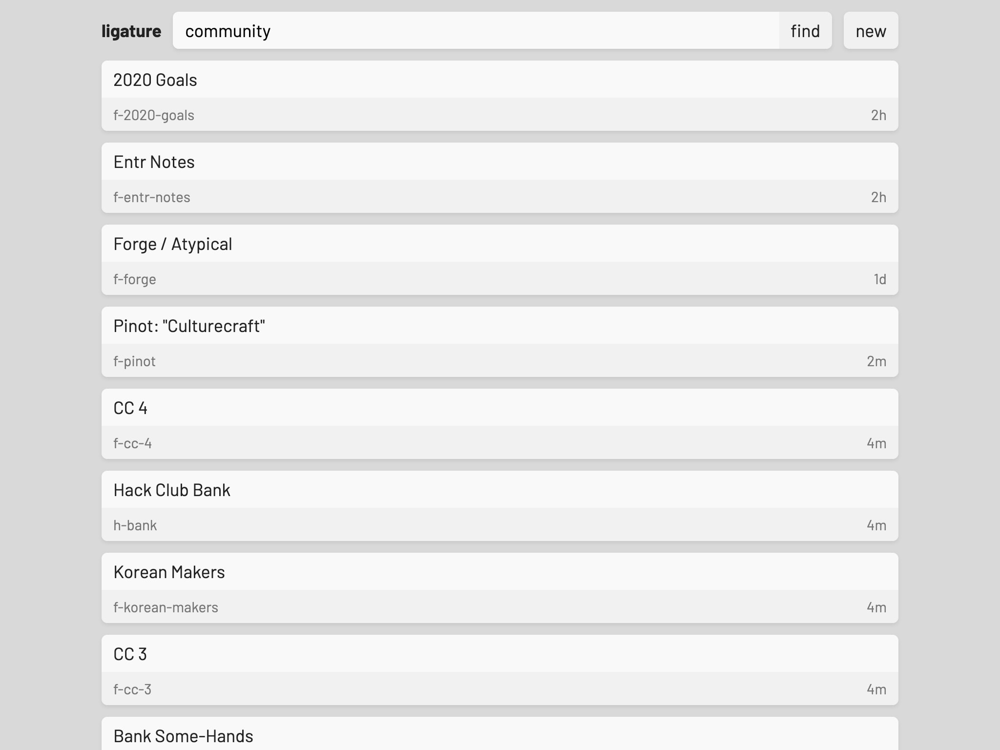
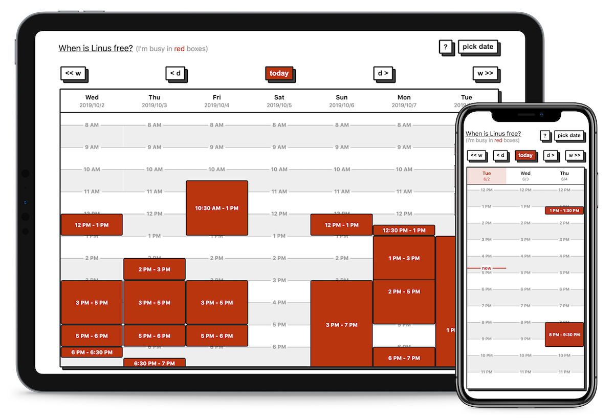
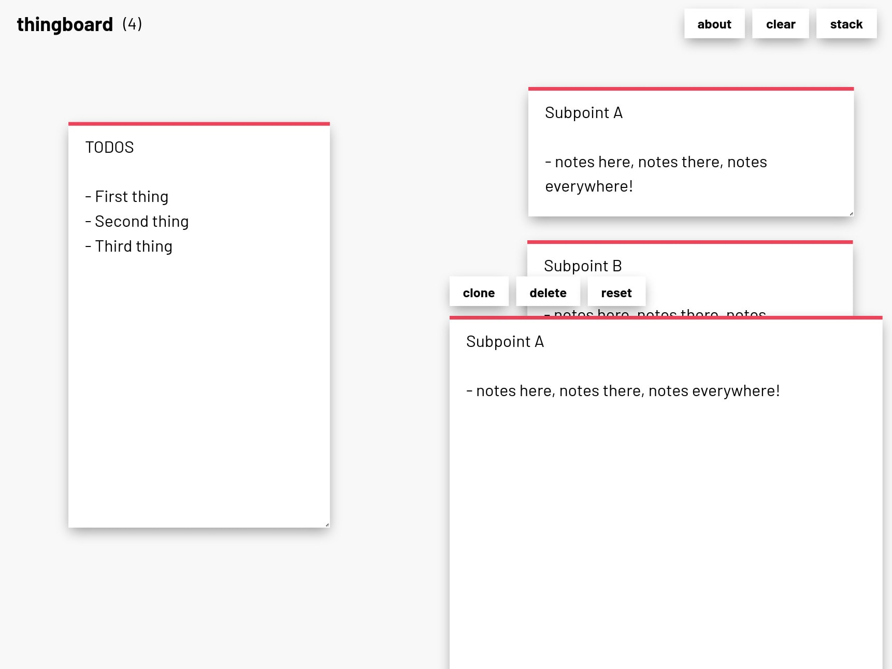
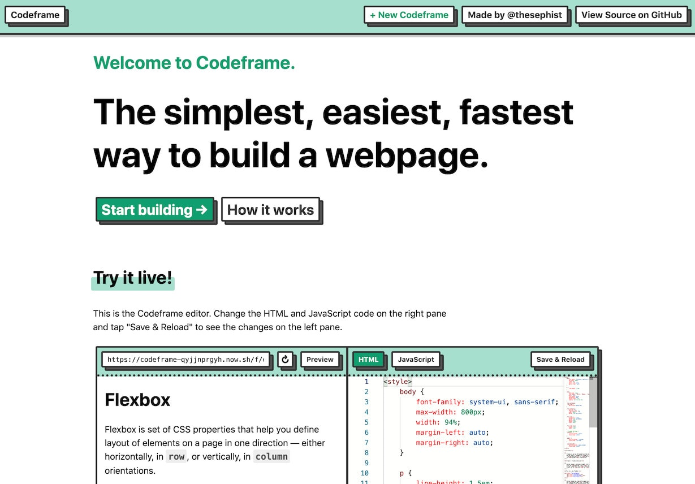
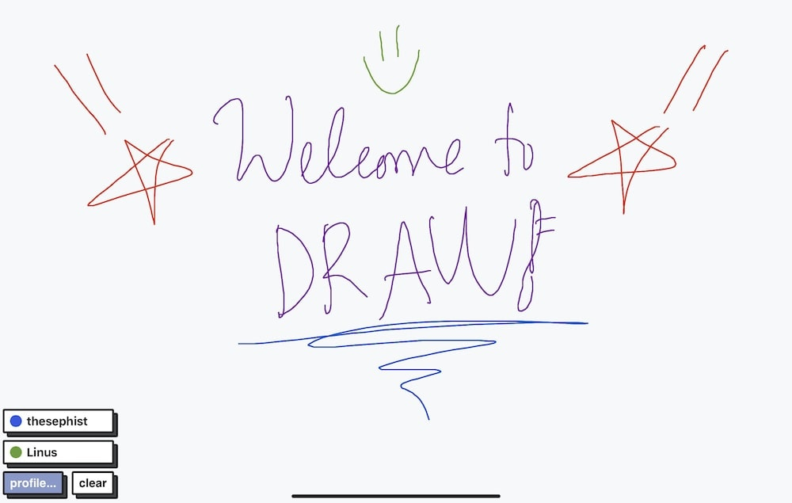

_This March, I spent a couple of days traveling through western Iceland._

_今年3月，我花了几天时间在冰岛西部旅行。_

While I was there, I thought a lot about tools – mechanical tools, software tools, tools that last, and tools that are fragile. The somber snow-covered scenery made me think about how quickly most of the tools we use today get outdated or replaced, and I thought about the kinds of tools that I’ve been building for myself for the last few years to help organize my life.

当我在那里的时候，我想了很多关于工具的事情--机械工具、软件工具、经久耐用的工具和脆弱的工具。阴郁的白雪覆盖的景色让我想到，我们今天使用的大多数工具很快就会过时或被取代，我想到了过去几年我一直在为自己打造的各种工具，以帮助我组织我的生活。

I took a walk around _Smábátahöfnin í Keflavík_ (a small marina nearby) that night, unraveled myself into my hotel room, and started writing this post.

那天晚上，我在SmábátahöfniníKeflvík(附近的一个小码头)走了一圈，走进酒店房间，开始写这篇帖子。

I want to share why I build my own tools and how I think we should think about building tools for life. It’s long, so here’s a roadmap. Feel free to jump around.

我想和大家分享一下我为什么要构建自己的工具，以及我认为我们应该如何思考如何为生活构建工具。它很长，所以这里有一个路线图。你可以随意跳来跳去。

1.  [My tools, today  
    我的工具，今天](https://thesephist.com/posts/tools/#my-tools-today)
2.  [Workflows > tools  
    工作流>工具](https://thesephist.com/posts/tools/#workflows--tools)
    1.  [Tasks and notes, a false dichotomy  
        任务和笔记，错误的二分法](https://thesephist.com/posts/tools/#tasks-and-notes-a-false-dichotomy)
    2.  [Tools that grow with your workflows  
        与您的工作流一起增长的工具](https://thesephist.com/posts/tools/#tools-that-grow-with-your-workflows)
3.  [Own your load-bearing tools of life  
    拥有你的生活负重工具](https://thesephist.com/posts/tools/#own-your-load-bearing-tools-of-life)
4.  [Cost and other smaller benefits  
    成本和其他较小的收益](https://thesephist.com/posts/tools/#cost-and-other-smaller-benefits)
5.  [Your tools are an extension of you  
    你的工具是你的延伸](https://thesephist.com/posts/tools/#your-tools-are-an-extension-of-you)
6.  [Appendix: the technical nitty-gritty  
    附录：技术细节-粗略](https://thesephist.com/posts/tools/#appendix-the-technical-nitty-gritty)

___

For the last few years, I’ve been on a journey to replace all of the essential digital tools I use for organizing my life with tools I develop, maintain, and deploy myself.

在过去的几年里，我一直在用我自己开发、维护和部署的工具来取代我用来组织生活的所有必要的数字工具。

What started with a single-page notes app I made in high school has grown into a constellation of home-grown productivity tools I now rely on for my day-to-day work and learning. Here’s a sample.

我从高中时开发的一个单页笔记应用程序开始，现在已经成长为一系列自主开发的生产力工具，现在我的日常工作和学习都依靠它。这是一个样品。

**[Ligature](https://github.com/thesephist/polyx#ligature)**, for long-term notes and tasks, goals, brainstorming, project planning, and other important writing.

结扎，用于长期笔记和任务、目标、头脑风暴、项目计划和其他重要写作。

 **[Pico](https://github.com/thesephist/pico)**, for more ephemeral notes and tasks that change on a daily basis. I split up my notes into two apps (Ligature and Pico) because it works better for my workflow. (More on this later.)

Pico，用于更多短暂的笔记和每天都会变化的任务。我把笔记分成了两个应用程序(Ligature和Pico)，因为它更适合我的工作流程。(稍后将详细介绍这一点。)

 **[Mira](https://github.com/thesephist/mira)** for keeping track of people I know, why they’re interesting, and what we’ve talked about.

米拉感谢我跟踪我认识的人，为什么他们很有趣，以及我们谈论了什么。

 **[Lovecroft](https://github.com/thesephist/lovecroft)** for managing and sending emails to my [mailing lists](https://thesephist.com/#newsletter).  
Lovecroft用于管理和发送电子邮件到我的邮件列表。  

 **[Noct](https://github.com/thesephist/polyx#noct)** for backing up and syncing all my files across computers and the cloud. Noct doesn’t have a graphical UI, just a command-line tool.

NCT用于备份和同步我在电脑和云中的所有文件。NCT没有图形用户界面，只有一个命令行工具。

**[Frieden](https://thesephist.com/posts/frieden/)** as a public availability calendar, showing when I’m free or busy.

Frieden作为公共可用日历，显示我的空闲或忙碌时间。

 **[Thingboard](https://github.com/thesephist/thingboard)** for more free-form Post-its-on-the-wall style brainstorming.

Thingboard用于更自由形式的墙上贴纸风格的集思广益。

 **[Codeframe](https://codeframe.co/)** for spinning off simple JavaScript experiments like [the word plotter](https://thesephist.com/posts/word-experiments/#word-plotter).

用于衍生简单的JavaScript实验的CodeFrame，如Word绘图仪。

 **[draw](https://github.com/thesephist/draw)**, a collaborative whiteboard, best used with my iPad Pro and Apple Pencil.

DRAW是一款协作白板，最好与我的iPad Pro和苹果铅笔配合使用。

Taken together, these apps do almost everything I need to do on my computer to keep myself organized. I don’t use any third-party notes, task management, or contacts apps, though I used to be a big fan of Simplenote and Todoist. I’ve used Notion, Dropbox Paper, Google Docs, and Airtable, but only for working in teams that centralized on them. These days, besides email and calendar, I live within a system of my own tools, and it works well for me.

总而言之，这些应用程序几乎可以做我在电脑上需要做的一切事情，以保持我的条理性。我不使用任何第三方笔记、任务管理或联系人应用程序，尽管我曾经是Simplenote和Todoist的铁杆粉丝。我用过Conept、Dropbox Paper、Google Docs和Airtable，但只在专注于它们的团队中工作。这些天来，除了电子邮件和日历，我还生活在我自己的工具系统中，它对我来说很好用。

I don’t want to imply that my tools are objectively better than the professional tools on the market like Notion and Dropbox. Those latter services have more features, and might even be more reliable today. But I think my tools fit me better for a different reason.

我不想暗示我的工具客观上比市场上的专业工具更好，比如概念和Dropbox。后一种服务有更多的功能，今天甚至可能更可靠。但我认为我的工具更适合我，因为另一个原因。

Each person’s mind works a little differently, and each person remembers and processes information a little differently. I think we all work at our best when we work with tools that fit how our minds work.

每个人的大脑运作略有不同，每个人记忆和处理信息的方式也略有不同。我认为，当我们使用与我们的思维方式相适应的工具时，我们都会以最佳状态工作。

The Eureka moment that some of us feel when we finally find a notes app or todo system that fits our brains – that epiphany happens when the tools we use mirror the way our minds work, and how we want to move information through our lives. Good tools fit perfectly around our workflows, bad tools don’t.

当我们最终找到一款适合我们大脑的笔记应用程序或待办事项系统时，我们中的一些人会感觉到灵光一现--当我们使用的工具反映了我们大脑的工作方式，以及我们想要如何在生活中传递信息时，这种顿悟就会发生。好的工具完全符合我们的工作流程，而不好的工具则不然。

When we resort to having other people build tools for us, the tools they build might never quite perfectly fit our workflows, because they’re not built for our individual minds. When other people build tools for us to use, they either design tools after their own workflows and mental models, or worse, they design it for a mass market of millions of people who all sort-of-but-not-really work and think in similar ways. The result is that mass-market productivity tools don’t fit the way our individual minds are predisposed to work. Instead, to use these tools, we need to bend our workflows to fit around the tools.

当我们求助于让其他人为我们构建工具时，他们构建的工具可能永远不会完全适合我们的工作流程，因为它们不是为我们个人的想法而构建的。当其他人开发供我们使用的工具时，他们要么按照自己的工作流程和心理模型设计工具，要么更糟糕的是，他们为数百万人的大众市场设计工具，这些人都以类似的方式工作和思考。其结果是，大众市场的生产力工具不适合我们个人思维倾向于工作的方式。相反，要使用这些工具，我们需要调整我们的工作流以适应这些工具。

My biggest benefit from writing my own tool set is that **I can build the tools that exactly conform to my workflows, rather than constructing my workflows around the tools available to me.** This means the tools can truly be an extension of the way my brain thinks and organizes information about the world around me. My tools aren’t perfect yet, but as they grow and evolve, they’ll only become better reflections of my personal mental models.

编写我自己的工具集的最大好处是我可以构建完全符合我的工作流的工具，而不是围绕我可用的工具构建我的工作流。这意味着这些工具可以真正成为我大脑思考和组织关于我周围世界的信息的方式的延伸。我的工具还不完美，但随着它们的成长和发展，它们只会更好地反映我的个人心理模型。

For example, one place where my mind works differently than the tools on the market is the task/notes distinction.

例如，我的思维与市场上的工具有一个不同之处，那就是任务/笔记的区别。

### Tasks and notes, a false dichotomy  
任务和笔记，错误的二分法  

My workflow used to differentiate between tasks and notes. Tasks were action items that I could reference, take action on, and complete, and then erase from my list. Notes were things that were indefinitely relevant. I would take notes and then come back to reference them many times. A note by itself isn’t actionable.

我的工作流程过去常常区分任务和笔记。任务是我可以参考的行动项目，我可以采取行动，完成任务，然后从我的清单中删除。笔记是无限期相关的东西。我会做笔记，然后回来参考它们很多次。纸条本身并不具有可诉性。

But once I started building my own tools, I realized this distinction isn’t really the way my brain worked. For me, a huge grey area exists between actionable, completable tasks and purely encyclopedic notes. Here are some things that fall in the grey area for me, pulled from my real, actual notes I took this week.

但当我开始构建自己的工具时，我意识到这种区别并不是我的大脑工作的方式。对我来说，在可操作、可完成的任务和纯粹的百科全书笔记之间存在巨大的灰色地带。以下是我从本周做的真实笔记中摘录的一些属于灰色地带的东西。

1.  I recently learned some really useful tips about how to grow leaders within a community from the book _[Get Together](https://gettogetherbook.com/)_. I definitely want to act on these learnings at some point in the communities I lead, but I don’t want them cluttering up my todo list because they’re not things I can just complete and check off quickly. I also want to remember these tips forever, even after the first time I act on them.
    
    最近，我从《团结起来》一书中学到了一些关于如何在社区中培养领导者的非常有用的建议。我当然想在我所领导的社区的某个时候采取行动，但我不想让它们弄乱我的待办事项清单，因为它们不是我可以很快完成和检查的事情。我也想永远记住这些小贴士，即使是在我第一次照做之后。
    
2.  I’ve been brainstorming an idea for a side project related to [symbolic mathematics](https://en.wikipedia.org/wiki/Computer_algebra). I’ve been writing down my inspirations related to this project. I don’t want to tuck it away in my notes, because this is something I want to build soon, but I also don’t want to shove paragraphs of notes into a todo list item.
    
    我一直在集思广益，想出一个与符号数学相关的辅助项目的想法。我一直在写下我对这个项目的灵感。我不想把它藏在我的笔记里，因为这是我想很快建立的东西，但我也不想把一段段笔记塞进待办事项列表项目中。
    
3.  I keep a running list of ideas I have for future blog posts, but I don’t really have a “write the next blog post” task item under which I’d normally put these ideas, because I don’t write on schedule – I just write when I can. Where should these ideas go? They’re sort-of notes and sort-of tasks.
    
    我经常列出我对未来博客文章的想法，但我并没有一个“写下下一篇博客文章”的任务项，我通常会把这些想法放在下面，因为我不会按计划写作--我只是在我能写的时候写。这些想法应该走向何方？它们是一种笔记和一种任务。
    

You might think that these are either very clearly todo items or very clearly notes, and that’s ok. But I certainly felt differently, and I realized I was only separating things into these two buckets because my tools forced me to. Before I wrote my own tools, I had a todo app (Todoist) and I had a notes app (Simplenote), and there was nothing in between.

你可能会认为这些要么是非常清楚的待办事项，要么是非常清楚的笔记，这没什么。但我的感觉肯定不同，我意识到我之所以把东西分成这两个桶，是因为我的工具迫使我这样做。在我编写自己的工具之前，我有一个Todoist应用程序(Todoist)和一个笔记应用程序(Simplenote)，两者之间没有任何东西。

Eventually, I discovered a better mental model for my working style: I ask myself _how immediately_ I need to take action on something.

最终，我发现了一个更适合我的工作风格的心理模型：我问自己，我有多迫切需要对某事采取行动。

The way that I see it, everything I learn and jot down is something for me to act on at some point in my life. If I read something that I never thought would influence the way I lived, it wouldn’t have value to me, and I simply wouldn’t write it down. Armed with this insight, these days, I have two different notes apps, and I don’t use a todo list app. These two apps are Ligature and Pico, mentioned above.

在我看来，我学到和记下的每一件事都是我在生活中的某个时候要采取行动的。如果我读了一些我从未想过会影响我生活方式的东西，它对我来说就没有价值了，我也不会把它写下来。有了这种洞察力，这些天，我有两个不同的笔记应用程序，我不使用待办事项列表应用程序。上面提到的这两款应用程序分别是Ligature和Pico。

One is for notes that are changing often. Day-to-day tasks, things to remember for the next week, even long notes and links related to what I’m working on _now_. The other app is for notes that grow over time, like notes I take while reading books or watching talks, my annual goals, financial planning, reading list, and project outlines. **My two notes apps mirror the way my brain works best – one is my short-term, working memory, the other is my long-term memory.**

一种是针对经常变化的音符。日常任务，下周要记住的事情，甚至是与我现在正在做的工作相关的长笔记和链接。另一款应用是用来记录随着时间推移而增长的笔记，比如我在读书或看演讲时做的笔记，我的年度目标、财务规划、阅读清单和项目大纲。我的两个笔记应用程序反映了我大脑最好的工作方式--一个是我的短期工作记忆，另一个是我的长期记忆。

I’ve had this system for a few months now, and haven’t felt any need for something better. It doesn’t have the crazy features of some notes services on the market today, but it just works the way my brain does.

我使用这个系统已经有几个月了，没有感觉到有任何更好的东西需要。它没有今天市场上一些笔记服务的疯狂功能，但它的工作方式就像我的大脑一样。

But what if I need something different later on in life?  
但如果我在以后的生活中需要一些不同的东西呢？  

### Tools that grow with your workflows  
与您的工作流一起增长的工具  

The other benefit of building homebrew tools is that **tools you build yourself can grow and change as your workflow changes over time**. So if my needs do change over time, my tools can grow to accommodate exactly what I need.

构建自制工具的另一个好处是，您自己构建的工具可以随着工作流程的变化而增长和更改。因此，如果我的需求确实随着时间的推移而发生变化，我的工具可以增长以满足我的需求。

When I first started keeping more organized notes on the interesting people I met, I started with a document in my notes app. Over time, I noticed that these notes followed a pattern: I wrote down their name and primary contact info, how I first met them, what school they went to, and what we talked about the last time we spoke.

当我第一次开始对我遇到的有趣的人做更有条理的笔记时，我开始在我的笔记应用程序中使用一个文档。随着时间的推移，我注意到这些笔记遵循着一个模式：我写下了他们的名字和主要联系方式，我第一次见到他们的方式，他们上的学校，以及我们最后一次交谈的内容。

So when I built Mira, my own people-manager app, I designed it around that exact workflow I had developed. When I later realized I was also recording people’s Twitter usernames in the description field, I just added a Twitter username field to each contact.

因此，当我开发自己的人事管理应用程序Mira时，我按照自己开发的工作流程进行了设计。当我后来意识到我也在Description字段中记录了人们的Twitter用户名时，我只是为每个联系人添加了一个Twitter用户名字段。

This is typical of the way I _discover_ my workflows. **I start with a minimal, bare-bones solution, and try to pick up on patterns and tricks I create for myself. And then I encode those patterns and tricks into the tools over time.**

这是我发现工作流程的典型方式。我从一个最简单的解决方案开始，并尝试学习我为自己创建的模式和技巧。然后随着时间的推移，我会将这些模式和技巧编码到工具中。

This way, my tools can grow organically as my workflows evolve. Neither of them gets in the way of each other most of the time, and I think that was hard to appreciate before I started relying wholly on my own tools.

这样，我的工具可以随着我的工作流程的发展而有机地增长。在大多数情况下，它们都不会妨碍彼此，我认为在我开始完全依赖自己的工具之前，很难理解这一点。

My productivity tools, especially my notes and contacts, are the load-bearing tools of my life. If they break or disappear, it’ll take a long time and a lot of effort for me to rebuild those same workflows and tools, so it’s important that they’re reliable, and that I can depend on them working for me for a long time (measured in years and decades, not quarters).

我的生产力工具，特别是我的笔记和联系人，是我生活中的负重工具。如果它们中断或消失，我将需要很长时间和大量努力才能重建相同的工作流程和工具，因此，重要的是它们是可靠的，我可以依赖它们为我工作很长一段时间(以几年或几十年衡量，而不是按季度计算)。

I’ve written at length about [the importance of ownership](https://thesephist.com/posts/ownership/) before. I want to own the pieces of my life that are most critical, and I want agency over how these tools change over time.

关于所有权的重要性，我以前写过很长的文章。我想要拥有我生活中最关键的部分，我想要代理这些工具如何随着时间的推移而变化。

I want these notes and ideas and workflows to stick with me as I grow as a person through the next decades. If I had to bet, I would not put much money on companies like Notion and Airtable serving the same customers and use cases in five years’ time. Perhaps they will, perhaps they won’t – but with my own tools, I have some extra guarantee that I won’t have to migrate away on short notice.

我希望这些笔记、想法和工作流程在我作为一个人在接下来的几十年里成长的过程中一直伴随着我。如果必须押注，我不会在五年后为同样的客户和用例提供服务的公司，如IDEA和Airtable上投入太多资金。也许他们会，也许他们不会--但有了我自己的工具，我有了一些额外的保证，我不会在短时间内搬走。

## Cost and other smaller benefits  
成本和其他较小的收益  

Besides these more ideological reasons for me to build my own tools, I also enjoy some incidental benefits of creating and hosting my own software. Among them are

除了这些让我构建自己的工具的更多的意识形态原因之外，我还享受着创建和托管我自己的软件的一些附带好处。其中包括

**Satisfaction**. Honestly, it just gives me a nice feeling to know that the information most important to me – my journals, notes, reading logs – are stored and managed through code that I wrote, and interfaces I built. It just gives me a nice warm feeling inside, and that counts for something.

满足感。老实说，知道对我来说最重要的信息--我的日记、笔记、阅读日志--是通过我编写的代码和我构建的界面存储和管理的，这让我有一种很好的感觉。它只是给我一种很好的温暖的感觉，这是有价值的。

**Cost**. I spend a total of $6/month for a single small DigitalOcean server in hosting all of my personal tools, and if DO happens to raise their price, there are many competitive Linux server providers out there. Compared to the cost of paying for software on the market, I like the guarantee of a low price, and the ability to migrate away with no changes to my workflow if prices do change.

成本。我每月总共花6美元购买一台小型DigitalOcean服务器来托管我所有的个人工具，如果Do碰巧提高了价格，那里有许多有竞争力的Linux服务器提供商。与市场上购买软件的成本相比，我喜欢低价的保证，以及如果价格发生变化，我的工作流程不会改变就可以迁移的能力。

**Speed**. My tools don’t have any code or graphics for onboarding, tracking, analytics, upselling, or features I don’t need. My apps have just the code I need for the tool to do the things I need it to do, and that makes all of my tools fast. Even on slower connections, I can get work done no problem. (Have you tried loading Notion on a 3G connection?)

速度。我的工具没有任何代码或图形用于入职、跟踪、分析、追加销售或我不需要的功能。我的应用程序有我需要的代码，让工具完成我需要它做的事情，这让我的所有工具都变得更快。即使在速度较慢的连接上，我也可以毫无问题地完成工作。(你有没有试过在3G连接上加载概念？)

I think it’s easy to underestimate the extent to which our tools can constrain our thinking, if the way they work goes against the way _we_ work. Conversely, great tools that parallel our minds can multiply our creativity and productivity, by removing the invisible friction of translating between our mental models and the models around which the tools are built.

我认为，如果工具的工作方式与我们的工作方式背道而驰，那么我们很容易低估工具对我们思维的制约程度。相反，与我们的思维平行的伟大工具可以通过消除我们的心理模型和工具所围绕的模型之间的无形摩擦，来成倍提高我们的创造力和生产力。

I’m an extreme case. I don’t think everyone needs to go out and build their own productivity tools from the ground-up. But I _do_ think that it’s important to think of the tools you use to organize your life as extensions of your mind and yourself, rather than trivial utilities to fill the gaps in your life.

我是个极端的例子。我不认为每个人都需要走出去，从头开始构建自己的生产力工具。但我确实认为，重要的是将你用来组织生活的工具视为你思想和你自己的延伸，而不是用来填补你生活中空白的琐碎工具。

**Search for tools that view the world and your work the way your mind does, and prefer tools that can grow with you over time, the way that works best for you.**

**寻找能以你的思维方式看待世界和你的工作的工具，更喜欢那些能随着时间的推移而成长的工具，也就是最适合你的方式。**

I think it’s in this kind of a harmonious symbiosis between our tools and our minds that we can do great work and imagine our best futures.

我认为正是在我们的工具和我们的思想之间的这种和谐共生中，我们才能做出伟大的工作，并想象我们最好的未来。

___

## Appendix: the technical nitty-gritty  
附录：技术细节-粗略  

While writing this post, I also asked [Twitter](https://twitter.com/thesephist/status/1290265986105409537) for any questions related to my personal software suite. Many of them were technical, so I couldn’t address them in the post. Instead, I’ll respond to them here.

在写这篇文章的同时，我还向Twitter询问了与我的个人软件套件有关的任何问题。其中许多都是技术性的，所以我不能在帖子中提到他们。相反，我会在这里回应他们。

> What’s your tech stack? What tools/frameworks are you using?  
> 你的技术水平是多少？您正在使用哪些工具/框架？  

I host most of my tools on an Ubuntu server on DigitalOcean, and a small minority (static sites) on Vercel and Surge.sh. I used to write backend services in Node.js but have preferred Go recently because it offers a better operations / deployment experience. Some of my apps, like Ligature and Noct, are written in [Ink](https://github.com/thesephist/ink), which is a language I wrote myself and has a runtime also written in Go.

我的大部分工具都在DigitalOcean上的Ubuntu服务器上，还有一小部分(静态站点)在Vercel和Surge.sh上。我曾经用Node.js编写后端服务，但最近更喜欢Go，因为它提供了更好的操作/部署体验。我的一些应用程序，比如Ligature和Nct，都是用Ink编写的，Ink是我自己编写的一种语言，它的运行时也是用Go编写的。

On the frontend, my tools use a web framework I wrote called [Torus](https://github.com/thesephist/torus). For building UI, I frequently reach for [blocks.css](https://thesephist.github.io/blocks.css/) or [paper.css](https://thesephist.github.io/paper.css/), CSS libraries I also built myself.

在前端，我的工具使用了我编写的名为Torus的Web框架。为了构建用户界面，我经常使用自己构建的BLOCS.css或Pap.css，这是我自己构建的CSS库。

All web apps are fronted by an Nginx reverse proxy with domains configured on Google Domains and Cloudflare. I depend on my own file sync service for backup and redundancy.

所有的网络应用程序都有一个Nginx反向代理，在Google域名和Cloudflare上配置域名。我依靠自己的文件同步服务进行备份和冗余。

> Is there any service for which you don’t expect to be able to build an alternative?
> 
> 有没有您不希望为其构建替代方案的服务？

Email, calendar, and collaborative tools like Google Drive and Figma. A web browser also probably falls in this category, but I have a pipe dream of building a browser from scratch at some point in my life.

电子邮件、日历和协作工具，如Google Drive和Figma。网络浏览器可能也属于这一类，但我有一个白日梦，希望在我生命中的某个时候从头开始打造一款浏览器。

> How long do you expect these tools to work? Years? Decades?  
> 你预计这些工具能工作多久？几年？几十年？  

Longevity is constantly on my radar as I design these tools, and I want them to last. I don’t use experimental technologies for most of my important tools, and some of them are built on a completely custom stack – everything from the programming language-up is custom written with [Ink](https://github.com/thesephist/ink) and [Torus](https://github.com/thesephist/torus). A bit overkill, but it does guarantee I can easily maintain the software for at least a decade, if not more.

当我设计这些工具时，长寿一直在我的雷达上，我希望它们能持续下去。我的大多数重要工具都不使用实验技术，其中一些完全构建在一个完全定制的堆栈上--从编程语言到UP都是用Ink和Torus定制编写的。有点过头了，但它确实保证了我可以轻松地维护软件至少十年，如果不是更长的话。

My only hard dependencies are Linux, Node.js, the Go language toolchain, and a web browser.

我唯一的硬依赖是Linux、Node.js、Go语言工具链和Web浏览器。

> Where do you store your data? Are you using a third-party database?  
> 您将数据存储在哪里？您是否在使用第三方数据库？  

Most of my tools are web apps, and store their data on a SQLite database or in plain text files on the server. But the server’s file storage is synchronized with my other computers (laptops, desktops, and so on) through my file syncing tool called Noct (Dropbox alternative), so I have those files available everywhere.

我的大多数工具都是Web应用程序，并将它们的数据存储在SQLite数据库或服务器上的纯文本文件中。但服务器的文件存储是通过我的名为noct(Dropbox Alternative)的文件同步工具与我的其他电脑(笔记本电脑、台式机等)同步的，所以我在任何地方都可以使用这些文件。

> How do you handle authentication and security?  
> 您如何处理身份验证和安全性？  

Since I’m the only user of these tools, most of my tools are gated behind [HTTP basic auth](https://developer.mozilla.org/en-US/docs/Web/HTTP/Authentication) and TLS. Some tools have additional security layers.

因为我是这些工具的唯一用户，所以我的大多数工具都是在HTTP Basic身份验证和TLS之后使用的。有些工具有额外的安全层。

> How many hours of work have you put into it?  
> 你在这上面工作了多少个小时？  

I don’t know, and I don’t really have any way of knowing. If I _had_ to guess, probably at least 1700 hours in total, across 5-6 years. But a lot of that work is redundant, since I’ve re-written some of my tools over time.

我不知道，我真的没办法知道。如果要我猜的话，可能总共至少有1700个小时，时间跨度为5-6年。但很多工作都是多余的，因为随着时间的推移，我已经重写了一些工具。

___

← [_A cellular theory of communities_](https://thesephist.com/posts/cellular-communities/)  
←--群落的细胞理论  

[_It's the programming environment, not the programming language_](https://thesephist.com/posts/programming-environment/) →  
它是编程环境，而不是编程语言→  

I share new posts on my [newsletter.](https://thesephist.com/#newsletter) If you liked this one, you should consider joining the list.

我在我的时事通讯上分享新帖子。如果你喜欢这个，你应该考虑加入这个名单。

Have a comment or response? You can [email me.](https://thesephist.com/#get-in-touch)  
有什么评论或回应吗？你可以给我发邮件。
