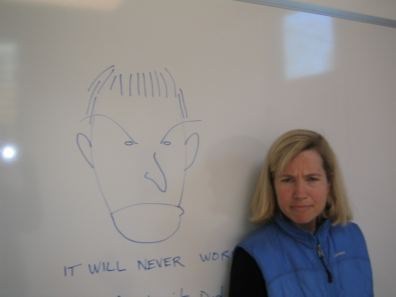
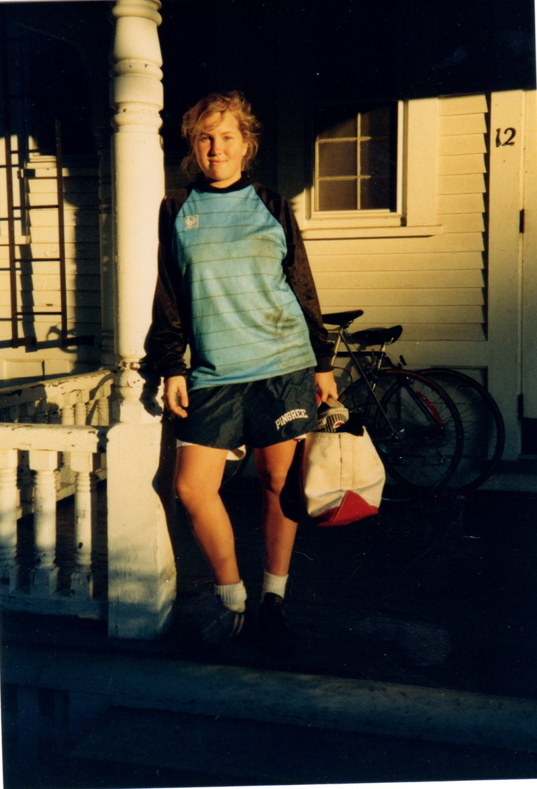
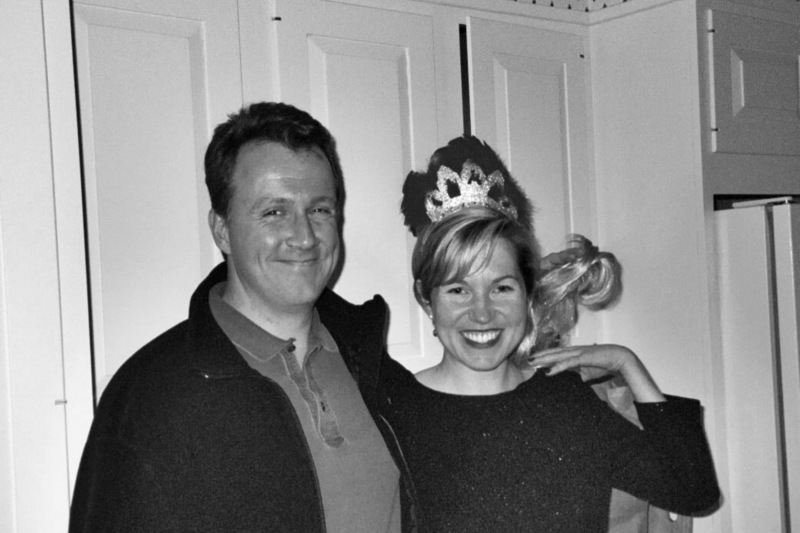
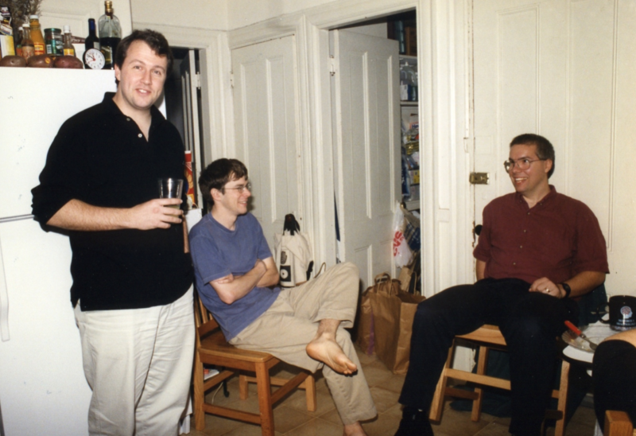
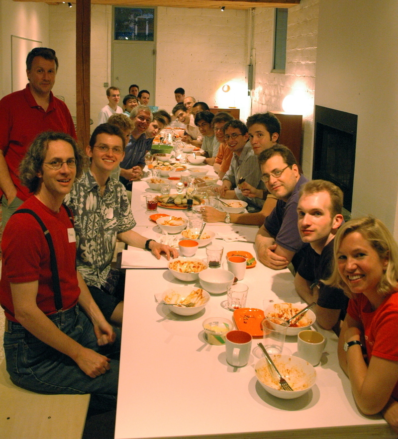
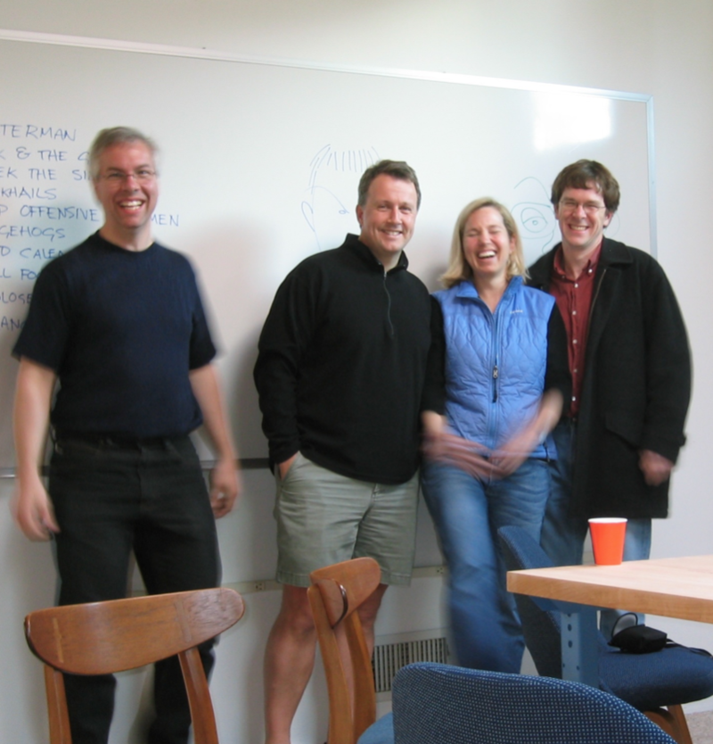
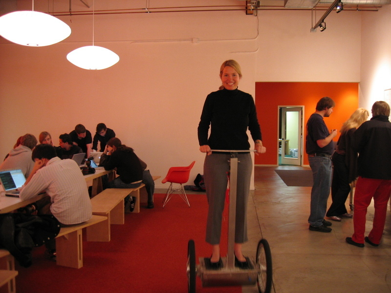

 

In 2005, I cofounded Y Combinator, the first "accelerator." Today there are hundreds of them all over the world, but in 2005 what we were doing was so unusual that most people in Silicon Valley regarded us as irrelevant.

2005 年，我与人共同创立了 Y Combinator，这是第一个“加速器”。 今天全世界有数百个这样的公司，但在 2005 年，我们所做的事情是如此不同寻常，以至于硅谷的大多数人都认为我们无关紧要。

Y Combinator began the same way as most other startups: with a hypothesis about something we thought people wanted. It turned out they did want it, and we grew and grew. Now we've funded 1867 startups with a total value of over $100 billion.

Y Combinator 的起步方式与大多数其他初创公司相同：假设我们认为人们想要的东西。 事实证明他们确实想要它，而且我们不断成长。 现在我们已经资助了 1867 家初创公司，总价值超过 1000 亿美元。

So having myself been through the type of startup journey that many of you are hoping to, I wanted to tell you my own story.

因此，在我经历了你们许多人希望的那种创业旅程之后，我想告诉你们我自己的故事。

If you only know about me through the media, you might get the impression that my contribution to Y Combinator is that I’m Paul Graham’s wife. And while I love being his wife, there's a bit more to the story than that.

如果你只是通过媒体了解我，你可能会觉得我对 Y Combinator 的贡献是我是 Paul Graham 的妻子。 虽然我喜欢做他的妻子，但故事远不止于此。

I was born in Minneapolis in 1971. Later that year, my mother left home, leaving my father alone with a small baby. So he took me back to Boston, where my grandmother lived.  I lived with her during the week while my dad worked, and with my dad on weekends.

我 1971 年出生在明尼阿波利斯。那年晚些时候，母亲离家出走，留下父亲独自带着一个小婴儿。 所以他带我回到波士顿，我祖母住的地方。 我爸爸工作的那一周我和她住在一起，周末和我爸爸住在一起。

 

My grandmother was the most important female role model in my life. She was a very independent person. The term anyone who knew her would use to describe her was "free-spirited." For example, in the wintertime, after putting me to bed, she'd go out and work till late at night on giant ice sculptures she built in the front yard.

我的祖母是我生命中最重要的女性榜样。 她是一个非常独立的人。 认识她的人都会用“自由奔放”来形容她。 例如，在冬天，在哄我睡觉后，她会出去在前院建造的巨型冰雕上工作到深夜。

 
She did what she wanted, and she didn't care if people thought she was unconventional.

她做自己想做的事，不在乎别人是否认为她标新立异。

Despite growing up without a mother, my childhood was pretty happy. My dad made a lot of sacrifices so I could get a great education, and he constantly encouraged me.

尽管在没有母亲的情况下长大，但我的童年还是很快乐的。 为了我能接受良好的教育，我父亲做出了很多牺牲，他不断地鼓励我。

I played soccer when I was younger, and when I was in 9th grade we played an away game against a school called Phillips Academy, in Andover, MA.  The place seemed so unbelievably fabulous that I decided on the spot that I was going to go to school there.

我小时候踢过足球，当我九年级时，我们在客场对阵马萨诸塞州安多弗的一所名为菲利普斯学院的学校。 这个地方看起来太棒了，以至于我当场就决定去那里上学。

Little did I know that this decision would have bittersweet consequences. In my old school I'd been a big fish in a small pond. I was a straight A student and good at sports.  But when I got to Andover in the fall of 1986, it seemed like everyone was a straight A student and good at sports. I got really discouraged and basically gave up.

我几乎不知道这个决定会带来苦乐参半的后果。 在我以前的学校里，我是小池塘里的一条大鱼。 我是一名全优学生，擅长运动。 但是当我在 1986 年秋天来到安多弗时，似乎每个人都是全优生并且擅长运动。 我真的很沮丧，基本上放弃了。

I defaulted to being a mediocre student, and did nothing impressive or noteworthy for the next decade. They were like my own personal Dark Ages.

我默认是一个平庸的学生，在接下来的十年里没有做任何令人印象深刻或值得注意的事情。 它们就像我自己的黑暗时代。

It’s a bit embarrassing to reflect on, but I think it’s important to mention, because when journalists and biographers write about successful founders, they often focus on early predictors of success in their formative years. In my case there certainly weren't a lot of the conventional kind. No one would have voted me "most likely to succeed."

回想起来有点尴尬，但我认为值得一提，因为当记者和传记作者撰写有关成功创始人的文章时，他们通常会关注他们成长时期成功的早期预测因素。 就我而言，当然没有很多传统的类型。 没有人会投票给我“最有可能成功”。

But while I had no "achievements," I did have three defining characteristics when I was younger that were critical in making Y Combinator work.

但是，虽然我没有“成就”，但我年轻时确实拥有三个决定性特征，这对 Y Combinator 的成功至关重要。

The first was the quality that caused my YC cofounders to nickname me "The Social Radar." I was one of those kids that you just couldn’t get anything past. If something seemed off or out of character, I noticed and made inquiries. I was always trying to figure things out based on subtle social cues.

首先是让我的 YC 联合创始人给我起了个绰号“社交雷达”的品质。 我是那些你无法接受任何过去的孩子之一。 如果有什么事情看起来不对劲或不合时宜，我会注意到并进行询问。 我总是试图根据微妙的社交线索来解决问题。

The second was that I never liked being at the mercy of anyone else. I hated anyone telling me what to do or not do: parents, teachers, bosses, people I was forced to collaborate with but disagreed with—anyone.

第二，我从不喜欢任人摆布。 我讨厌任何人告诉我该做什么或不该做什么：父母、老师、老板、我被迫与之合作但不同意的人——任何人。

And the third distinctive thing about me is that I've always pretty much been a "straight shooter." My grandmother and my father were both like that.

关于我的第三个与众不同之处是，我几乎一直是一个“直率的射手”。 我的祖母和我的父亲都是这样的人。

But I’ll come back to these in a minute.

但我会在一分钟内回到这些。

The day after I graduated from college, my beloved grandmother died of cancer. It was a really sad and lonely time in my life. And now I was supposed to find a job, with a degree in English and absolutely no clue what I wanted to do. 

大学毕业后的第二天，我敬爱的祖母就因癌症去世了。 那是我生命中一段非常悲伤和孤独的时光。 现在我应该找到一份工作，获得英语学位，但完全不知道我想做什么。

I wound up getting a job at Fidelity Investments in their customer service group, answering calls from 3:30 til midnight each day. Basically talking to retail investors about why their Magellan account went down that day. Ugh. I didn’t love the job but I did love having a job. Working hard and getting paid for it and not having homework hanging over my head. It was great. After Fidelity I worked in investor relations in NYC, then at _Food & Wine_ magazine and at an automotive consulting firm. I even briefly worked for a wedding planner.

我最终在 Fidelity Investments 的客户服务部门找到了一份工作，每天从 3:30 到午夜接听电话。 基本上是与散户投资者谈论他们的 Magellan 账户为何在那天下跌。 啊。 我不喜欢这份工作，但我确实喜欢有一份工作。 努力工作并为此获得报酬，而且没有功课悬在我头上。 太好了。 在 Fidelity 之后，我在纽约市从事投资者关系工作，然后在 _Food & Wine_ 杂志和一家汽车咨询公司工作。 我什至曾短暂地为一名婚礼策划师工作过。

In 2003, I was working in the marketing department at an investment bank in Boston when I first met Paul Graham, at a party at his house one night.

2003 年，当我在波士顿一家投资银行的营销部门工作时，我第一次见到了保罗格雷厄姆，一天晚上在他家的一个聚会上。

We started dating and I felt like I’d finally met Mr. Right. Despite having quite different backgrounds, we were remarkably similar.  If I thought I never wanted to be at the mercy of someone else, Paul was that dialed up to 11.

我们开始约会，我觉得我终于遇到了真命天子。 尽管背景完全不同，但我们非常相似。 如果我认为我永远不想受别人的摆布，那么保罗就是那个拨通了 11 的人。

He’d moved back to Cambridge after selling his startup, Viaweb, to Yahoo and was at the time writing essays, working on programming languages, publishing a book, and curing his debilitating fear of flying by learning to hang glide.

在将自己的初创公司 Viaweb 卖给雅虎后，他搬回了剑桥，当时他正在写论文、研究编程语言、出版一本书，并通过学习悬挂滑翔来治愈他对飞行的虚弱恐惧。

Paul is the best problem solver I've ever met. He’s also a genius at expanding ideas and making radical improvements to things. One of his defining characteristics is telling people "You know what you should do..."

保罗是我见过的最好的问题解决者。 他还是扩展想法和彻底改进事物的天才。 他的一个决定性特征是告诉人们“你知道你应该做什么......”

Paul and his circle of friends exposed me to this new world of startups. It felt much more exciting than the later stage of publicly-traded tech companies that I was involved with at the investment bank. I read the book _Startup_ by Jerry Kaplan, about his pen computing company called GO, and I was immediately hooked. It was like some light shining down from the heavens.

保罗和他的朋友圈让我了解了这个创业公司的新世界。 感觉比我在投行参与的上市科技公司的后期要精彩多了。 我读了 _杰瑞·卡普兰 (Jerry Kaplan) 的《创业_ 》一书，其中介绍了他的名为 GO 的笔式计算公司，我立刻就被吸引住了。 就好像有一道光从天而降。

I wanted to hear more stories about the early days of startups, so I started working on a book of interviews with startup founders. The book was called _[Founders at Work](https://www.amazon.com/Founders-Work-Stories-Startups-Early/dp/1430210788)_, and was published in 2007.

我想听到更多关于初创公司早期的故事，所以我开始写一本关于初创公司创始人访谈的书。 这本书名为《 _[工作中的创始人》](https://www.amazon.com/Founders-Work-Stories-Startups-Early/dp/1430210788)_ ，于 2007 年出版。

At the same time I was becoming more interested in startups, I was becoming less interested in my job. The Bubble had burst a few years back and the investment bank was making drastic cutbacks. Working there had become boring and unpleasant.

与此同时，我对创业公司越来越感兴趣，对自己的工作越来越不感兴趣。 几年前泡沫破灭了，投资银行正在大幅削减开支。 在那里工作变得无聊和不愉快。

So I applied for a job doing marketing at a venture capital firm, where I felt I might be one step closer to the more exciting world of startups. While I was interviewing with the VC firm, Paul would “you-know-what-you-should-do” me each night at dinner, telling me how I  should change the VC business once I got into it.  We’d talk for hours about how broken early-stage startup funding was, and most importantly, how more people would start startups if it could be made easier for them.

所以我申请了一份在一家风险投资公司做营销的工作，我觉得在那里我可能离更令人兴奋的创业世界更近了一步。 当我在风投公司面试时，保罗每天晚上吃晚饭时都会对我说“你知道你应该做什么”，告诉我进入风投行业后应该如何改变。 我们会讨论几个小时的早期创业资金是多么糟糕，最重要的是，如果可以让创业变得更容易，会有多少人开始创业。

As the VC firm took longer and longer to decide to hire me, the ideas grew more and more compelling until one night Paul said, "Let's just start our own." The next day we convinced Paul's cofounders from Viaweb, Robert and Trevor, to join us part-time. The initial plan was that they would pick and advise the startups and I’d do everything else.

随着风险投资公司决定雇用我的时间越来越长，这些想法变得越来越有说服力，直到有一天晚上保罗说，“让我们开始我们自己的吧。” 第二天，我们说服了 Paul 在 Viaweb 的联合创始人 Robert 和 Trevor 兼职加入我们。 最初的计划是他们会挑选初创公司并为其提供建议，而我会做其他所有事情。

Instead of giving large amounts of money to small numbers of established startups, like traditional VCs did, we'd give small amounts of money to large numbers of earlier stage startups, and then give them a lot of help.

我们不会像传统的 VC 那样向少数成熟的初创公司提供大量资金，而是向大量处于早期阶段的初创公司提供少量资金，然后为他们提供大量帮助。

Our initial target audience was programmers, who we felt could handle the technical aspects of a startup but were clueless about everything else, just like Paul, Robert and Trevor had been.

我们最初的目标受众是程序员，我们认为他们可以处理初创公司的技术方面，但对其他一切一无所知，就像保罗、罗伯特和特雷弗一样。

We also had more faith in young founders than most investors did back then.  This was back in the days when Google’s VCs had insisted the founders hire an outside CEO as a condition of their series A round.

与当时的大多数投资者相比，我们对年轻的创始人也更有信心。 这是在谷歌的风险投资公司坚持创始人聘请外部 CEO 作为 A 轮融资的条件的时候。

None of us had any experience at angel investing, and that's where the idea of funding startups in batches came from. We decided to fund a bunch of startups at once, during the summer, so that we could learn how to be investors.  In March 2005 we launched Y Combinator’s website, inviting people to apply for what we called "The Summer Founders Program."

我们都没有任何天使投资经验，这就是分批资助初创公司的想法的来源。 我们决定在夏季一次性资助一批初创公司，这样我们就可以学习如何成为投资者。 2005 年 3 月，我们推出了 Y Combinator 的网站，邀请人们申请我们所谓的“夏季创始人计划”。

We funded 8 startups that summer and recognized almost immediately the power of investing in batches. It was so much better for the founders. They had colleagues to help them during what had previously been a very lonely process. But it was also a much more efficient way for us to help the startups, because we could do things for them all at once. Every Tuesday Paul cooked dinner for all the founders, and at each dinner we brought in a speaker to teach them about startups.

那年夏天，我们资助了 8 家初创公司，并几乎立即认识到分批投资的力量。 这对创始人来说要好得多。 在以前非常孤独的过程中，他们有同事帮助他们。 但这也是我们帮助初创公司的一种更有效的方式，因为我们可以同时为他们做所有事情。 每个星期二保罗都会为所有的创始人做晚餐，每次晚餐我们都会请一位演讲者来教他们创业。

Paul talked to all the startups about what they were building, and I helped them all get incorporated as C corporations.  This was a big deal in those days, because back then to become a C corp you had to pay a lawyer $15,000 to do it for you.

保罗与所有初创公司讨论了他们正在建设的东西，我帮助他们全部注册为 C 类公司。 这在当时是一件大事，因为那时候要成为 C 类公司，你必须花 15,000 美元请律师为你做这件事。

The first summer, we gave the startups $6k per founder, which was based on the stipend that MIT gave grad students during the summer. At the end of the summer, we hosted the first Demo Day, for an audience of about 15 investors.  Reddit was in that first batch, and the founders of Twitch, though they were working on another idea, and Sam Altman’s geolocation startup.

第一个夏天，我们根据麻省理工学院在暑假期间给研究生的津贴，给初创公司每位创始人 6000 美元。 夏末，我们为约 15 名投资者举办了首个演示日。 Reddit 在第一批，还有 Twitch 的创始人，尽管他们正在研究另一个想法，还有 Sam Altman 的地理定位初创公司。

Though we'd only tried funding a batch of startups as a way to learn how to be investors, we realized within a couple weeks that we were onto something promising. So we decided to do all our investing in batches. And we also decided that we'd fund the next batch in Silicon Valley.  We knew that a lot of people would copy us, and we didn't want someone else to be "the Y Combinator of Silicon Valley." We wanted to be that ourselves.

虽然我们只是尝试资助一批初创公司作为学习如何成为投资者的一种方式，但我们在几周内意识到我们正在做一些有前途的事情。 所以我们决定分批进行所有投资。 我们还决定资助硅谷的下一批。 我们知道很多人会模仿我们，我们不希望其他人成为“硅谷的 Y Combinator”。 我们想成为我们自己。

Despite the fact that we’ve grown significantly and have expanded in many ways, YC’s core program is remarkably similar to what it was 13 years ago.

尽管我们已经显着成长并在许多方面进行了扩展，但 YC 的核心项目与 13 年前非常相似。

The question I always used to get from people over the years was, "So, what's your role at YC?" It used to really bug me because no one ever asked Paul, Robert, or Trevor that question.  But now I think it’s kind of an interesting question to think about.  What was my role as the only non-technical founder of Y Combinator?

多年来我经常从人们那里得到的问题是，“那么，你在 YC 的角色是什么？” 这曾经真的让我很烦恼，因为从来没有人问过 Paul、Robert 或 Trevor 这个问题。 但现在我认为这是一个值得思考的有趣问题。 作为 Y Combinator 唯一的非技术创始人，我的角色是什么？

At the beginning there were tons of errands, like with any startup, that just had to get done and there was no one else to do them. Paul and I divided up responsibilities perfectly, which I think is critical when you start a startup with your partner or spouse. He made our website and the application form, and I got other stuff set up for that first summer: I worked with the lawyers to set up Y Combinator the entity and to create all kinds of template legal paperwork for our standard investments and everything founders would need to set up their company and assign stock properly (which is a lot if you’ve ever done it!).  

一开始有很多差事，就像任何初创公司一样，必须完成，没有其他人可以做。 Paul 和我完美地分担了责任，我认为这在你与伴侣或配偶一起创业时至关重要。 他制作了我们的网站和申请表，我为第一个夏天准备了其他东西：我和律师一起建立了 Y Combinator 这个实体，并为我们的标准投资和创始人会做的一切创建了各种模板法律文件需要建立他们的公司并正确分配库存（如果您曾经做过，这会很多！）。

I also had to learn quickly about how to advise them on filling everything out, so they wouldn’t have to pay any legal fees. I had to set up Paul’s small office building in Cambridge to be our weekly dinner gathering space for 25 people. I set up our bank account and contacted people to speak each week at our dinners. I bought the groceries that Paul cooked for the dinners. I even delivered air conditioners that I’d bought at Home Depot to the founders. I was the only one of us organized enough to make all that stuff happen.

我还必须快速学习如何建议他们填写所有内容，这样他们就不必支付任何法律费用。 我不得不在剑桥设立保罗的小办公楼，作为我们每周 25 人的晚餐聚会场所。 我开设了我们的银行账户，并联系人们每周在我们的晚宴上发言。 我买了保罗为晚餐做的杂货。 我什至把我在 Home Depot 买的空调送给了创始人。 我是我们当中唯一一个有组织的人，足以让所有这些事情发生。

When it came to investing, I had something that my cofounders didn’t have: I was the Social Radar. I couldn’t judge our applicants’ technical ability, or even most of the ideas. My cofounders were experts at those things.  I looked at qualities of the applicants my cofounders couldn't see.  Did they seem earnest? Were they determined? Were they flexible-minded?  And most importantly, what was the relationship between the cofounders like? While my partners discussed the idea with the applicants, I usually sat observing silently. Afterward, they would turn to me and ask, "Should we fund them?"

在投资方面，我拥有我的联合创始人所没有的东西：我是社交雷达。 我无法判断我们申请人的技术能力，甚至大部分想法。 我的联合创始人是这些方面的专家。 我研究了我的联合创始人看不到的申请者的品质。 他们看起来很认真吗？ 他们下定决心了吗？ 他们头脑灵活吗？ 最重要的是，联合创始人之间的关系如何？ 当我的合作伙伴与申请人讨论这个想法时，我通常会静静地坐着观察。 之后，他们会转向我问，“我们应该资助他们吗？”

From the beginning I was careful about only funding earnest people. Back then, I never envisioned the people we funded growing into a community of thousands of YC alumni, but I always tried to create an asshole-free culture. If I could tell someone was a conceited asshole, we didn’t fund them. I’m sure we’ve since funded some conceited assholes, but early on I was pretty rigid about this. And I think it’s the basis of the culture of our alumni community.

从一开始我就小心翼翼地只资助认真的人。 那时，我从没想过我们资助的人会成长为一个拥有数千名 YC 校友的社区，但我一直试图创造一种没有混蛋的文化。 如果我能看出某人是个自负的混蛋，我们就不会资助他们。 我敢肯定我们已经资助了一些自负的混蛋，但在早期我对此非常严格。 我认为这是我们校友社区文化的基础。

So far this stuff might sound a bit different than you’d expect in a successful investor. But when you get to an extreme in something, things get qualitatively different. Y Combinator was a new extreme in the venture funding business, so what made someone a good investor was different. VCs relied on growth figures and estimates of market sizes, but those didn't exist at the stage we were investing. What YC needed was deeply technical people to understand the potential of an idea, and someone like me to understand the founders' characters and the relationship between them.  And to do that well you needed abilities no one had previously considered important in an investor.

到目前为止，这些内容听起来可能与您对成功投资者的期望有所不同。 但是当你在某件事上走极端时，事情就会发生质的变化。 Y Combinator 是风险投资行业的一个新极端，因此使一个人成为优秀投资者的因素是不同的。 风险投资公司依赖于增长数据和对市场规模的估计，但在我们投资的阶段这些并不存在。 YC 需要的是深入了解想法潜力的技术人员，以及像我这样的人来了解创始人的性格以及他们之间的关系。 而要做到这一点，你需要以前没有人认为投资者重要的能力。

It was doubly hard because some of the applicants were so young. We had to judge the founders not by what they were, but what they could turn into. Imagine Mark Zuckerberg back in his dorm room in 2004, with a website that let college students see what other students at their school were doing. Not super impressive-seeming to traditional investors.

这很难，因为一些申请者太年轻了。 我们必须评判创始人，而不是看他们是什么人，而是看他们能变成什么样子。 想象一下 2004 年马克·扎克伯格回到他的宿舍时，他有一个网站可以让大学生看到他们学校的其他学生在做什么。 对传统投资者而言，这并不令人印象深刻。

Another secret weapon of mine that was strangely well-suited to Y Combinator was that I was a very experienced event planner.  Events are a critical part of what YC does. When you fund startups in batches, everything’s an event. Interviews are an event, each dinner is an event, Demo Day is an event.  As the alumni network grew we started doing events for alumni too, and from the very first year we did big events like Startup School.  I’d been doing events for years in my marketing jobs, so I could run all these practically with one hand behind my back.

我的另一个非常适合 Y Combinator 的秘密武器是我是一个非常有经验的活动策划者。 活动是 YC 工作的重要组成部分。 当你分批资助初创公司时，一切都是大事。 面试是一个事件，每次晚宴都是一个事件，演示日也是一个事件。 随着校友网络的发展，我们也开始为校友举办活动，从第一年开始，我们就举办了像 Startup School 这样的大型活动。 我在营销工作中从事活动多年，所以我几乎可以用一只手在背后进行所有这些活动。

Probably the thing that was most different about YC as an investment firm was that it felt like a family.  And I was its mom; I was soft and sensitive at a time when investors tended to be hardened and aggressive (and I’ll throw in ruthless too for a few of them). I cared about how the founders were feeling, if they were overwhelmed, if they were eating properly. I’d counsel them on relationships that were under strain due to the pressure of the startup. I’d listen at length and help them with their cofounder disputes and breakups.

作为一家投资公司，YC 最大的不同之处可能在于它感觉就像一个大家庭。 我是它的妈妈； 在投资者往往变得强硬和咄咄逼人的时候，我是软弱和敏感的（我也会对他们中的一些人毫不留情地投入）。 我关心创始人的感受，他们是否不知所措，饮食是否正常。 我会就因创业压力而紧张的关系向他们提供建议。 我会仔细聆听并帮助他们解决联合创始人之间的纠纷和分手。

Starting a startup is emotionally draining for founders, especially in the beginning.  Sometimes they just needed someone to listen. Luckily, my entire college career had trained me to be a good listener to people’s social problems.

对于创始人来说，创办一家初创公司会耗尽他们的精力，尤其是在刚开始的时候。 有时他们只是需要有人倾听。 幸运的是，我的整个大学生涯都把我训练成善于倾听人们的社会问题。

And I tried to always be a straight shooter with my advice. In fact, we all were. Paul is the straightest shooter I know, which is why his advice is so valuable. He doesn’t bury it in euphemisms.  Or worse, withhold the truth in order to preserve people's feelings. And as tough as they might have found his advice at the time, founders always wind up thanking him for his candor.

我一直努力按照我的建议做一个直率的射手。 事实上，我们都是。 保罗是我所知道的最直接的射手，这就是为什么他的建议如此有价值。 他没有用委婉的说法来掩饰它。 或者更糟的是，隐瞒真相以维护人们的感情。 尽管他们当时可能觉得他的建议很艰难，但创始人最终总是感谢他的坦率。

One other thing Paul and I had in common was that we weren't driven by money. We were interested in startups and we wanted to help people start more of them. This was the basis for everything we did at YC. It was what allowed us to do something as weird as YC in the first place.

保罗和我的另一共同点是我们不受金钱驱使。 我们对初创公司很感兴趣，我们想帮助人们创办更多的初创公司。 这是我们在 YC 所做的一切的基础。 这让我们一开始就可以做一些像 YC 这样奇怪的事情。

Because YC didn't have any LPs early on, we weren’t even constrained by a vague fiduciary responsibility to anyone. This allowed us to take more risks with which startups we chose to fund and also allowed us to be benevolent to failing startups.

因为 YC 早期没有任何有限合伙人，我们甚至没有受到对任何人的模糊信托责任的约束。 这使我们能够在选择资助的初创公司中承担更多风险，也使我们能够对失败的初创公司仁慈。

That often brought us into conflict with other investors who had different priorities.  Early on, we funded a husband and wife team who had a baby. They worked hard on the startup but it was clearly failing. One of their investors tried to get them acquihired by a big company in the Valley, who ultimately passed.

这常常使我们与其他有不同优先事项的投资者发生冲突。 早期，我们资助了一个有孩子的夫妻团队。 他们为初创公司努力工作，但显然失败了。 他们的一位投资者试图让他们被硅谷的一家大公司收购，但最终通过了。

Paul talked to the founders and learned they just wanted the security of jobs, so they could take a break from the constant stress of a startup. So he talked to the big company and got one of them hired there.  The founders were delighted. The investor, on the other hand, was livid. He ripped into Paul harder than almost anyone I’ve ever witnessed (well, before Twitter) saying that Paul had blown any chance of an acquihire. I still don't get why investors squeeze founders even over small outcomes like this. 

保罗与创始人交谈，了解到他们只是想要工作的安全感，这样他们就可以从创业公司的持续压力中解脱出来。 所以他和大公司谈了谈，并在那里雇用了其中一个人。 创始人很高兴。 另一方面，投资者很生气。 他比我见过的几乎任何人（好吧，在 Twitter 之前）都更严厉地抨击 Paul，说 Paul 已经失去了任何被收购的机会。 我仍然不明白为什么投资者会为了这样的小成果而压榨创始人。

I also never cared much about fame. Or my personal "brand". I just wanted Y Combinator to succeed.

我也从不在乎名气。 或者我个人的“品牌”。 我只是想让 Y Combinator 成功。

One thing we've learned from Y Combinator is that the most successful startups tend to grow organically out of the founders' lives. This was true in my case too. I was almost uncannily well suited for the kind of work it took to make YC successful. But the things that made me well-suited for it were so far from the qualities most people associate with startup founders. I'll list them so you can see for yourself. I was the social radar, a good event planner, maternal, empathetic, a straight shooter, and not driven by money or fame.  Think how far that is from the profile of the typical startup founder you read about in the press. Maternal? Since when was that an important quality in a startup founder? Let alone the founder of an investment firm. And yet it was critical to making YC what it is.

我们从 Y Combinator 学到的一件事是，最成功的初创公司往往是从创始人的生活中有机地成长起来的。 我的情况也是如此。 我几乎非常适合让 YC 成功的那种工作。 但是让我非常适合它的东西与大多数人与创业公司创始人相关的品质相去甚远。 我将列出它们，以便您自己查看。 我是社交雷达、优秀的活动策划者、母性、善解人意、直率的射手，不受金钱或名利的驱使。 想一想这与您在媒体上读到的典型创业公司创始人的形象相去甚远。 母性？ 从什么时候开始，这是创业公司创始人的重要品质？ 更何况是一家投资公司的创始人。 然而，让 YC 成为现在的样子至关重要。

That's why I wanted to tell you my story. It's not true that every person can start every startup. But a lot more people have what it takes to start some startup than realize it. A lot of people, perhaps all people, have some distinctive combination of abilities and interests. And a lot of those combinations match some startup idea.

这就是为什么我想告诉你我的故事。 并非每个人都可以开始每一次创业。 但是，拥有创业所需条件的人比意识到的要多得多。 很多人，也许是所有人，都有一些独特的能力和兴趣组合。 很多这些组合都符合一些创业想法。

So if you want to start a startup, I recommend you try asking yourself what's distinctive about you. What unique combination of abilities and interests do you have?  And don't edit your answers, because as my example shows, the most unlikely ingredients could be the key to the recipe.

所以如果你想创业，我建议你试着问问自己，你有什么与众不同之处。 你有什么独特的能力和兴趣组合？ 并且不要编辑您的答案，因为正如我的示例所示，最不可能的成分可能是食谱的关键。

In fact, it may even be that the strangest combinations of qualities are the most valuable.  I had a weird combination of qualities, but they matched YC because it was such a weird company. And the most successful startups do tend to be weird. They're usually such outliers that the idea sounds preposterous at first. To everyone except the founders, because the company has grown out of their experiences.

事实上，最奇怪的品质组合甚至可能是最有价值的。 我有一种奇怪的品质组合，但它们与 YC 相匹配，因为它是一家如此奇怪的公司。 最成功的创业公司往往很古怪。 他们通常是异常值，这个想法一开始听起来很荒谬。 除了创始人之外的所有人，因为公司是在他们的经历中成长起来的。

So what can you learn from my story? Here are 9 things:

那么你能从我的故事中学到什么？ 这里有9件事：

1) **There is no one mold for a successful founder**.  Just because you might only see a certain type in the news, that doesn’t mean you need to turn yourself into that.

1) **成功的创始人没有单一的模式** 。 仅仅因为您可能只在新闻中看到某种类型，并不意味着您需要将自己变成那种类型。

2) **Do what you’re genuinely interested in and try to play to your natural strengths**. A startup is so much work that you'll give up if you're not genuinely interested in it.

2) **做你真正感兴趣的事，努力发挥你的天赋优势** 。 一家初创公司需要大量工作，如果您对它不是真正感兴趣，您就会放弃。

3) **Don’t pay attention to the mainstream’s opinion of what you're doing—whether it’s your skills, your idea or whatever**.  Unless they’re your users, their opinion does not matter. (Pay a lot of attention to your users' opinions though!)

3) **不要在意主流对你所做事情的看法——无论是你的技能、你的想法还是其他什么** 。 除非他们是您的用户，否则他们的意见并不重要。 （尽管要多多注意用户的意见！）

4) **Find a cofounder with complementary skills, but the same** **moral compass as you**. Paul and I had the perfect combination of skills to start something like YC. We agreed on all the big questions, and we each deferred to the other's expertise on the small ones.

4) **找一个技能互补，但** **道德指南针和你** 一样的联合创始人。 Paul 和我拥有完美的技能组合来创办像 YC 这样的公司。 我们在所有大问题上都达成了一致，在小问题上我们都尊重对方的专业知识。

5) **Focus on making something people want**. Everything follows from that. In 2005, people needed a way to get a small amount of funding easily.

5) **专注于制作人们想要的东西** 。 一切都由此而来。 2005 年，人们需要一种方法来轻松获得少量资金。

6) **Don’t let rejection distract you or hold you back**. You’ll get rejected in so many different ways, but you must keep moving forward.

6) **不要让拒绝分散你的注意力或让你退缩** 。 你会以很多不同的方式被拒绝，但你必须继续前进。

7) **Start small so you can be nimble and open to change**. We never could have pulled off moving our operations to Silicon Valley in a matter of months if we'd hired a bunch of people in Cambridge.  To this day, YC has a tradition of trying things on a small scale before expanding them.

7) **从小事做起，这样你就可以变得灵活并乐于改变** 。 如果我们在剑桥雇佣了一群人，我们永远不可能在几个月内将我们的业务转移到硅谷。 直到今天，YC 都有在扩大规模之前先小范围尝试的传统。

8) **It’s ok not to have gone to an elite college**. I grew up thinking that that was the be-all and end-all. You’ve been trained to believe that you’ll be judged by your credentials. But in a startup it's the users who judge you, and they care about your product, not your credentials.

8) **没上过精英大学也没关系** 。 我从小就认为这就是一切。 你受过训练，相信别人会根据你的资历来评判你。 但在初创公司中，评判你的是用户，他们关心的是你的产品，而不是你的资历。

9) **Be intrepid**. There's room for lots of different kinds of people to be startup founders, but you do need a certain amount of boldness—to work on ideas that most people would consider stupid, and to keep going when you're ridiculed or ignored.

9） **要勇敢** 。 许多不同类型的人都有成为创业公司创始人的空间，但你确实需要一定的勇气——去研究大多数人认为愚蠢的想法，并在你被嘲笑或被忽视时继续前进。

You are a jigsaw puzzle piece of a certain shape. You could change your shape to fit an existing hole in the world. That was the traditional plan. But there's another way that can often be better for you and for the world: to grow a new puzzle around you.  That's what I did, and I was a pretty weird-shaped piece. So if I can do it, there’s more hope for you than you probably realize.

你是一块特定形状的拼图。 你可以改变你的形状以适应世界上现有的洞。 那是传统的计划。 但还有另一种通常对你和世界都更好的方法：在你周围形成一个新的谜题。 这就是我所做的，我是一个非常奇怪的形状。 因此，如果我能做到，那么您的希望可能比您意识到的要多。
