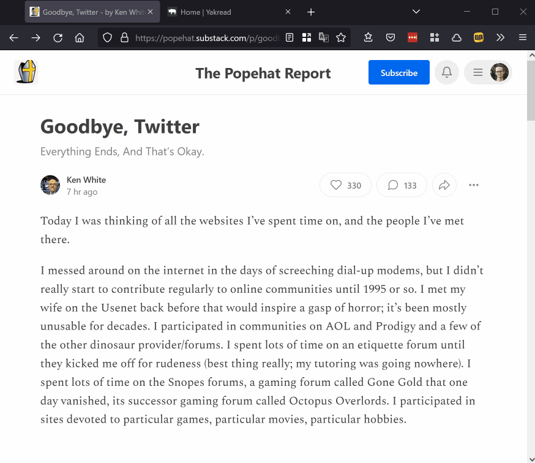
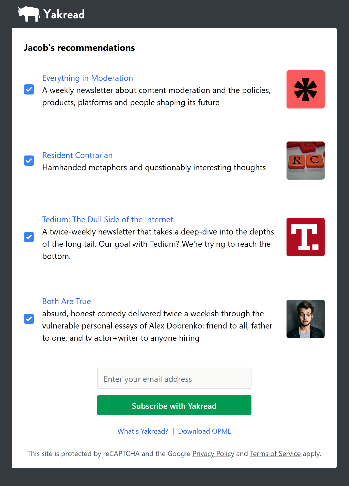
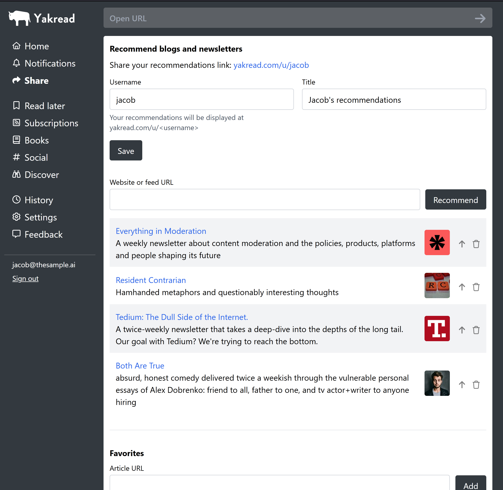

On a [couple](https://tfos.co/p/tfos/) of [occasions](https://tfos.co/p/introducing-yakread/) I have described my Grand Vision For How Social Media Ought To Be, which is roughly that there should be a bunch of different:

有 [几次](https://tfos.co/p/tfos/) 我描述了 [我对社交媒体应该如何发展的宏伟愿景，](https://tfos.co/p/introducing-yakread/) 大致是应该有很多不同的：

-   publishing services, like Substack and Ghost
-   发布服务，例如 Substack 和 Ghost
-   reading apps, like Gmail and [Matter](https://hq.getmatter.com/)
-   阅读应用程序，例如 Gmail 和 [Matter](https://hq.getmatter.com/)
-   community platforms, like Slack and Discord
-   社区平台，例如 Slack 和 Discord

and we should look for ways to make these reading, publishing, and community services all play nicely together. I'm calling this model "the unbundled web," and I think RSS should be the primary method of interop. (The term "decentralized" has already been co-opted by all those bitcoin people, so I'm using "unbundled" as a synonym with less baggage.)

我们应该想方设法让这些阅读、出版和社区服务能够很好地协同工作。 我将此模型称为“未捆绑的网络”，并且我认为 RSS 应该是互操作的主要方法。 （“去中心化”这个词已经被所有那些比特币人所采用，所以我使用“非捆绑”作为更少负担的同义词。）

That's a pretty high-level view of things. Over the past several months I've spent a lot of time trying to figure out what it looks like if you zoom in to the next level. If I had the ears of a bunch of people working on publishing, reading, and community apps, what features would I ask them to implement? What features should I implement in [Yakread](https://yakread.com/), my own reading app?

这是对事物的相当高层次的看法。 在过去的几个月里，我花了很多时间试图弄清楚如果你放大到下一个级别会是什么样子。 如果我听取了一群从事出版、阅读和社区应用程序工作的人的意见，我会要求他们实现哪些功能？ 中实现哪些功能？ [Yakread](https://yakread.com/) 我应该在自己的阅读应用程序

It's important to stick to the essentials. The less stuff there is that needs to be built, the higher the chance that it will actually be built. With that in mind, here's what I currently think the essentials are, subject to change:

坚持要点很重要。 需要建造的东西越少，实际建造的可能性就越高。 考虑到这一点，以下是我目前认为的要点，可能会发生变化：

**1\. Community apps should provide the option of publishing an RSS feed of all new posts.**

**1\. 社区应用程序应提供发布所有新帖子的 RSS 提要的选项。**

Your reading app should be able to subscribe to new posts from all the communities you're in. You shouldn't have to check a bunch of different apps all the time. If there's a single place where people can go for new posts from all their communities, they'll be more likely to engage in lots of different communities instead of settling on a few.

您的阅读应用程序应该能够订阅您所在的所有社区的新帖子。您不必一直检查一堆不同的应用程序。 如果人们可以在一个地方从他们所有的社区寻找新帖子，他们将更有可能参与许多不同的社区，而不是停留在几个社区。

Discourse is the only community app I'm aware of that publishes a feed. For example: [https://meta.discourse.org/posts.rss](https://meta.discourse.org/posts.rss). More apps should do this. It doesn't need to be mandatory—lots of communities want to be private. But I'd love it if I could tick a box in the settings page for my Discord server and have it start publishing a feed, with appropriate UX so that community members understand that my server is public. For private servers, maybe have password-protected feeds so that members can subscribe with their reading apps after signing in to the community.

Discourse 是我所知道的唯一发布提要的社区应用程序。 例如： [https](https://meta.discourse.org/posts.rss) ://meta.discourse.org/posts.rss 。 更多的应用程序应该这样做。 它不需要是强制性的——许多社区都希望是私有的。 但是，如果我可以在我的 Discord 服务器的设置页面中勾选一个框并让它开始发布提要，并使用适当的用户体验，以便社区成员了解我的服务器是公开的，我会很高兴。 对于私人服务器，可能有受密码保护的提要，以便成员在登录社区后可以使用他们的阅读应用程序进行订阅。

**2\. Publishing apps should compile a "social feed" with your posts from communities you're in.**

**2\. 发布应用程序应该用你所在社区的帖子编译一个“社交提要”。**

If a bunch of discussion apps started doing #1, then you could add all those feeds to your publishing app and tell it your username(s). The publishing app could pick out all the posts you wrote and turn it into another RSS feed. Then instead of telling people to follow you on Twitter, you can tell them to subscribe to your social feed.

Any publishing apps that wanted to be proactive about this can get started today with a few different community apps, even if it takes some custom code. It would be sweet to have a page + RSS feed on my website that contained all my comments from Hacker News, Reddit, Mastodon, Twitter\*, and of course Discourse.

如果一堆讨论应用程序开始做#1，那么您可以将所有这些提要添加到您的发布应用程序并告诉它您的用户名。 发布应用程序可以挑选出你写的所有帖子并将其转换为另一个 RSS 提要。 然后，您可以告诉他们订阅您的社交动态，而不是告诉人们在 Twitter 上关注您。

任何想要对此积极主动的发布应用程序都可以从今天开始使用一些不同的社区应用程序，即使它需要一些自定义代码。 如果我的网站上有一个页面 + RSS 提要，其中包含我来自 Hacker News、Reddit、Mastodon、Twitter\*，当然还有 Discourse 的所有评论，那就太好了。

\*Actually I decided to stop using Twitter today, so I wouldn't use a Twitter integration myself, but others might appreciate it.

\*实际上我今天决定停止使用 Twitter，所以我自己不会使用 Twitter 集成，但其他人可能会喜欢它。

**3\. Reading apps should provide a good experience for social feeds.**

**3.阅读应用应该为社交提要提供良好的体验。**

If my reading app includes subscriptions to Joe Schmoe's social feed, a Discourse feed, and a "regular" once-a-week newsletter feed, I don't want the high-frequency social feeds to drown out everything else. A very simple thing reading apps could do is automatically separate feeds by frequency. If a feed produces more than, say, one post per day on average, consider it to be a social feed. Group all the social feeds together in one timeline, and group all the less-frequent "normal" feeds in another timeline.

如果我的阅读应用程序包括对 Joe Schmoe 的社交提要、Discourse 提要和“常规”每周一次的时事通讯提要的订阅，我不希望高频社交提要淹没其他一切。 阅读应用程序可以做的一件非常简单的事情就是按频率自动分离提要。 如果一个提要平均每天产生超过一个帖子，则将其视为社交提要。 将所有社交提要分组到一个时间线中，并将所有频率较低的“正常”提要分组到另一时间线中。

That implementation is just a suggestion. Reading apps are free to experiment with different ways of attacking the problem (that's the whole point of the unbundled web!); the import thing is just that the reader experience shouldn't break down if you subscribe to a bunch of social feeds.

该实施只是一个建议。 阅读应用程序可以自由地尝试不同的方法来解决问题（这就是非捆绑网络的全部意义所在！）； 重要的是，如果您订阅了一堆社交提要，读者体验不应该崩溃。

At a minimum, reading apps shouldn't assume that all posts have titles ([h/t Dave Winer](https://github.com/scripting/titlelessFeedsHowto)).

至少，阅读应用程序不应该假设所有帖子都有标题（ [h/t Dave Winer](https://github.com/scripting/titlelessFeedsHowto) ）。

**4\. Reading apps should make it really easy to subscribe to RSS feeds.**

**4\. 阅读应用程序应该让订阅 RSS 提要变得非常容易。**

With all this RSS stuff, the elephant in the room must be addressed: most people don't even know what RSS feeds are, let alone how to subscribe to one. Even people who are familiar with RSS aren't necessarily in the habit of using a feed reader. We've _got_ to make this as frictionless as possible, with a good onboarding experience for first-time RSS users.

有了所有这些 RSS 内容，必须解决房间里的大象问题：大多数人甚至不知道什么是 RSS 提要，更不用说如何订阅了。 即使熟悉 RSS 的人也不一定有使用提要阅读器的习惯。 我们必须 _让它_ 尽可能顺畅，为初次使用 RSS 的用户提供良好的入门体验。

My main idea here is that every reading app should let you create shareable links where people can subscribe to an RSS feed and sign up for the reading app at the same time. If I want to invite people to join my community or subscribe to my social feed, I give them one of these shareable links.

我在这里的主要想法是，每个阅读应用程序都应该允许您创建可共享的链接，人们可以在其中订阅 RSS 提要并同时注册阅读应用程序。 如果我想邀请人们加入我的社区或订阅我的社交信息流，我会为他们提供这些可共享链接之一。

For example, give this here link a click: [https://feedrabbit.com/?url=https://meta.discourse.org/posts.rss](https://feedrabbit.com/?url=https://meta.discourse.org/posts.rss). You'll be taken to Feedrabbit, an RSS-to-email service. The RSS field has been prefilled with the feed from a Discourse server. Someone who doesn't know what RSS is could still follow that link, sign up with their email address, and start getting posts in their inbox.

例如，点击此处链接： [https](https://feedrabbit.com/?url=https://meta.discourse.org/posts.rss) ://feedrabbit.com/?url=https://meta.discourse.org/posts.rss 。 您将被带到 Feedrabbit，一种 RSS 到电子邮件的服务。 RSS 字段已预先填充来自 Discourse 服务器的提要。 不知道 RSS 是什么的人仍然可以点击该链接，使用他们的电子邮件地址注册，然后开始在他们的收件箱中接收帖子。

All reading apps should have a similar feature. Not all apps would deliver the posts directly via email like Feedrabbit, but they can send daily digest emails to help new users develop a habit of checking their feed reader.

所有阅读应用程序都应该具有类似的功能。 并非所有应用程序都会像 Feedrabbit 那样直接通过电子邮件发送帖子，但它们可以发送每日摘要电子邮件，以帮助新用户养成查看提要阅读器的习惯。

Another suggestion: provide browser extensions and iOS/Android sharing menu items so that it's easy to open an web page in the reading app. If there's one or more RSS feeds detected, throw in a subscribe button with checkboxes for each feed. The "shareable subscribe links" should include a link to the original RSS feed in the page metadata. Then if I click on the subscribe link but want to subscribe with a different RSS reader, I can do so easily.

另一个建议：提供浏览器扩展和iOS/Android共享菜单项，方便阅读应用打开网页。 如果检测到一个或多个 RSS 提要，则为每个提要添加一个带有复选框的订阅按钮。 “可共享订阅链接”应该在页面元数据中包含指向原始 RSS 提要的链接。 然后，如果我单击订阅链接但想使用不同的 RSS 阅读器订阅，我可以很容易地做到这一点。

Again, the goal here is that users should never need to know what RSS is: just "I can use this reading app to subscribe to stuff easily."

同样，这里的目标是用户永远不需要知道 RSS 是什么：只是“我可以使用这个阅读应用程序轻松订阅内容”。

[Subscribe to this newsletter](https://tfos.co/subscribe/).

[订阅此时事通讯](https://tfos.co/subscribe/) 。

___

### Stuff I'm building

### 我正在建造的东西

Recently I've been adding some of the things I discussed above in #4 to [Yakread](https://yakread.com/). You can open web pages in Yakread by pasting a URL into the text field or by using the handy-dandy bookmarklet:

最近我一直在将我在上面#4 中讨论的一些内容添加到 [Yakread](https://yakread.com/) 中。 您可以通过将 URL 粘贴到文本字段或使用方便的小书签在 Yakread 中打开网页：

Currently it only lets you subscribe to one feed. If the page has multiple feeds, the non-first feeds will be ignored. I will fix this... eventually. I also would love to provide browser extensions and mobile apps (just for adding items to the share menu), but I'm prioritizing other things right now. I might be interested in hiring a freelancer to do these for me at some point.

目前它只允许您订阅一个提要。 如果页面有多个提要，则将忽略非第一个提要。 我会解决这个...最终。 我也很乐意提供浏览器扩展和移动应用程序（只是为了将项目添加到共享菜单），但我现在正在优先考虑其他事情。 我可能有兴趣聘请一名自由职业者在某个时候为我做这些。

Besides that, I'm in the middle of implementing a "subscribe with Yakread" page, also discussed above in #4:

除此之外，我正在实现一个“用 Yakread 订阅”页面，这也在上面的#4 中讨论过：

You'll be able to make your own recommendations page from within Yakread:

您将能够在 Yakread 中创建自己的推荐页面：

Under the hood, this page actually works with OPML files. If you want you can manually create an OPML file containing some blogs/newsletters you want to recommend, and then you can share a link that looks like `https://yakread.com/subscribe?opml=https://...`. When people visit the link, Yakread will display a nice page like the one in the screenshot above. If they put in their email address, they'll sign up for Yakread, and the feeds will be added to their Yakread subscriptions. If you want to subscribe with a different reading app, the "Download OPML" button includes only the feeds that are checked.

在幕后，这个页面实际上与 OPML 文件一起工作。 如果你愿意，你可以手动创建一个 OPML 文件，其中包含一些你想要推荐的博客/时事通讯，然后你可以共享一个看起来像 `https://yakread.com/subscribe?opml=https://...`. 当人们访问该链接时，Yakread 将显示一个漂亮的页面，如上面的屏幕截图所示。 如果他们输入他们的电子邮件地址，他们就会注册 Yakread，并且这些提要将添加到他们的 Yakread 订阅中。 如果您想订阅不同的阅读应用程序，“下载 OPML”按钮仅包含选中的提要。

The UI is all there, but the subscribe button doesn't do anything yet. I'm excited to get this released soon—I've had it planned for a [couple months](https://tfos.co/p/cross-platform-recommendations/), and I think it'll be an important part of my growth strategy for Yakread.

用户界面就在那里，但订阅按钮还没有做任何事情。 我很高兴能尽快发布它——我已经计划了 [几个月](https://tfos.co/p/cross-platform-recommendations/) ，我认为它将成为我对 Yakread 的增长战略的重要组成部分。

### Recommendations

### 建议

-   [New industries come from crazy people](https://www.palladiummag.com/2021/02/02/new-industries-come-from-crazy-people/) (Palladium, 2021)
-   [新产业来自疯狂的人](https://www.palladiummag.com/2021/02/02/new-industries-come-from-crazy-people/) （Palladium，2021）
-   [Garbage Day's business metrics and such for 2022](https://www.garbageday.email/p/the-big-2022-garbage-report). Apparently Twitter traffic doesn't convert well. I'd like to know how it compares to Substack recommendation traffic.
-   [垃圾日 2022 年的业务指标等](https://www.garbageday.email/p/the-big-2022-garbage-report) 。 显然，Twitter 流量的转化率并不高。 我想知道它与 Substack 推荐流量相比如何。
-   [Reflections from someone who worked on Chrome](https://neugierig.org/software/blog/2022/12/chrome.html) (neugierig.org).
-   [来自 Chrome](https://neugierig.org/software/blog/2022/12/chrome.html) (neugierig.org) 工作人员的感想。
-   [What if Covid reinfections wear down our immunity?](https://thetyee.ca/Analysis/2022/11/07/COVID-Reinfections-And-Immunity/) (The Tyee). Glad I'm an introvert!
-   [如果 Covid 再感染会削弱我们的免疫力怎么办？](https://thetyee.ca/Analysis/2022/11/07/COVID-Reinfections-And-Immunity/) （泰伊）。 很高兴我是一个内向的人！

Technical:

技术的：

-   [Interview with Simon Peyton Jones, creator of Haskell](https://haskell.foundation/podcast/11/) (The Haskell Foundation).
-   [采访 Simon Peyton Jones，Haskell](https://haskell.foundation/podcast/11/) （Haskell 基金会）的创造者。
-   [Remote development is getting some improvements on VS code](https://code.visualstudio.com/blogs/2022/12/07/remote-even-better) (VS code blog).
-   [远程开发正在对 VS 代码](https://code.visualstudio.com/blogs/2022/12/07/remote-even-better) （VS 代码博客）进行一些改进。
