## Tools and workflows for managing your zettelkasten, projects, reading lists, notes, and inspiration during your PhD.

用于管理您的zettelkasten、项目、阅读清单、笔记和博士期间灵感的工具和工作流程。

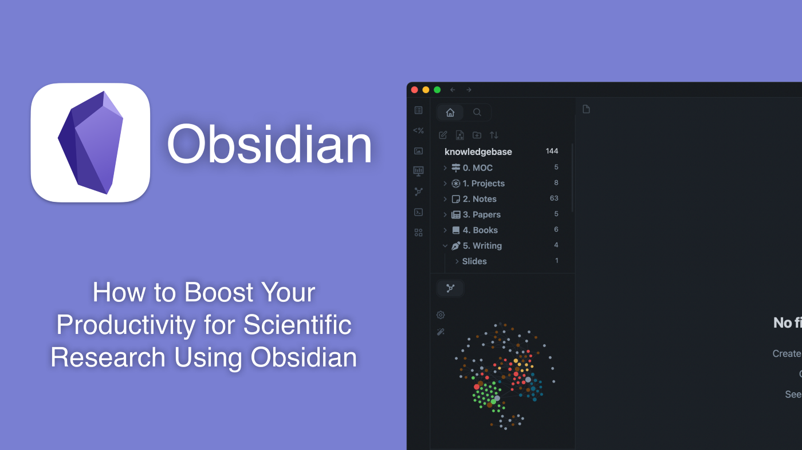

_This article was named winner of the Student-Pick Obsidian Contest 2022

这篇文章被命名为2022年学生评选比赛的获胜者

_

Knowledge is the most powerful tool you have as a researcher. Knowledge, however, is worthless if it cannot be accessed quickly and effectively. The key is in a consistent and easy-to-use method of archiving information so that taking notes becomes an effortless and pleasing experience.

作为一个研究人员，知识是你拥有的最强大的工具。然而，如果不能快速有效地获取知识，知识就一文不值。关键在于一种一致且易于使用的信息归档方法，以便记录笔记成为一种轻松愉快的体验。

Here, I show how I use [**Obsidian**](https://obsidian.md/) ([https://obsidian.md)](https://obsidian.md/) as a **PhD** student in **Artificial Intelligence** and the workflows I’ve found to manage my knowledge.

在这里，我展示了我作为人工智能博士生如何使用黑玉(https://obsidian.md))，以及我发现的管理我的知识的工作流。

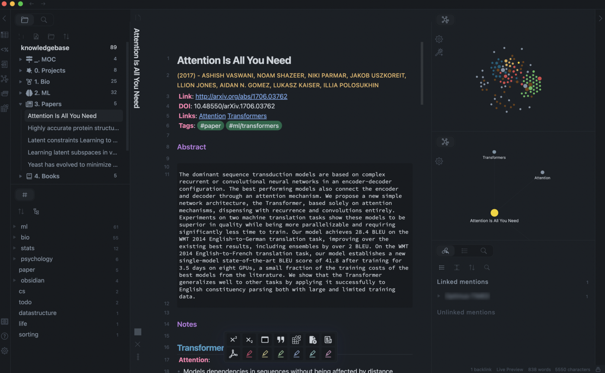

My interface in Obsidian. Theme is customized from [https://github.com/colineckert/obsidian-things](https://github.com/colineckert/obsidian-things). Icons from [https://github.com/FlorianWoelki/obsidian-icon-folder](https://github.com/FlorianWoelki/obsidian-icon-folder)

我在黑玉岩的界面。主题是从https://github.com/colineckert/obsidian-things.定制的来自https://github.com/FlorianWoelki/obsidian-icon-folder的图标

The article is divided into three parts:  
全文共分三个部分：  

1.  **Philosophy**:  哲学：  
    The basics of a Knowledge management system such as what is a note, how to organize notes, tags, folders, and links.
    
    知识管理系统的基础知识，例如什么是笔记、如何组织笔记、标签、文件夹和链接。
    
      
    This section is meant to be **tool-agnostic**, meaning that you should be able to implement most of these tips with any note-taking app.
    
    这一部分的目的是与工具无关，这意味着你应该能够在任何笔记应用程序中实施这些技巧中的大多数。
    
2.  **Tools**: 工具：  
    How to set up and use **Obsidian**, how to manage notes, reading lists, and useful plugins.
    
    如何设置和使用黑玉，如何管理笔记，阅读清单，以及有用的插件。
    
      
    This section shows how to use Obsidian, my tool of choice, to manage scientific knowledge effectively.
    
    这一部分展示了如何使用我所选择的工具--黑玉来有效地管理科学知识。
    
3.  **Workflows**: 工作流程：  
    How to link Zotero and take notes from papers, maintain notes of multiple projects, set up SQL-like queries to generate Maps of Content (MOCs) automatically with Dataview, encrypt your valut, and more.
    
    如何链接Zotero和从纸上做笔记，维护多个项目的笔记，设置类似SQL的查询来使用Dataview自动生成内容地图(Maps of Content，MOCs)，加密您的价值，等等。
    
      
    This section focuses on giving a detailed description of how to use Obsidian to **solve common problems in the scientific world** and manage/maintain your knowledge effectively.
    
    本部分重点详细介绍如何使用黑铁矿解决科学界的常见问题，并有效地管理/维护您的知识。
    

This collection of tips is my current solution to problems I’ve encountered throughout my PhD and is by no means perfect/complete. If you have any additional tips or feedback, feel free to comment or contact me. I’ll try to keep this article up-to-date.

这组小贴士是我目前对博士期间遇到的问题的解决方案，绝不是完美/完整的。如果您有任何其他提示或反馈，请随时发表意见或与我联系。我会尽量使这篇文章保持最新。

Throughout the article I will use the word **_library_** to mean your entire digital knowledge (library), which is used interchangeably with “Obsidian Vault” or “Zettelkasten”.

在整篇文章中，我将使用图书馆这个词来表示你的整个数字知识(图书馆)，它可以与“黑岩金库”或“齐特尔卡斯滕”互换使用。

At the end of the article, you will find other useful resources which you may be interested in using.

在本文的末尾，您将发现您可能有兴趣使用的其他有用资源。

## 1\. Philosophy: _How to take and organize notes effectively_  
1.哲学：如何有效地做笔记和组织笔记  

> “If you wish to make an apple pie from scratch, you must first invent the universe”
> 
> 如果你想从零开始做一个苹果派，你必须首先发明宇宙
> 
> — Carl Sagan  
> \--卡尔·萨根  

Before we dive into Obsidian, it’d be good to first lay out the foundations of a Personal Knowledge Management System and Zettelkasten. If you are already familiar with these terms you can skip to Section 2.

在我们深入了解黑玉岩之前，最好先铺设个人知识管理系统和Zettelkasten的基础。如果您已经熟悉这些术语，可以跳到第2节。

The inspiration for this section and a lot of the work on Zettelkasten is from **Niklas Luhmann**, an outstandingly productive sociologist who wrote **400 papers and 70 books**. Zettelkasten means (literally) “slip box” (or library in this article). In his case, his Zettlekasten had around 90000 physical notes, which have been digitized and can be found [here](https://niklas-luhmann-archiv.de/bestand/zettelkasten/zettel/ZK_1_NB_1_1_V).

这一部分和许多关于Zettelkasten的工作的灵感来自尼克拉斯·卢曼，他是一位卓有成效的社会学家，写了400篇论文和70本书。Zettelkasten的字面意思是“纸盒”(或本文中的图书馆)。在他的案例中，他的Zettlekasten有大约90000个实物笔记，这些笔记已经数字化，可以在这里找到。

Nowadays, there are loads of tools available to make this process easier and more intuitive. Obsidian, specifically has a good introduction section on their website: [https://publish.obsidian.md/hub/](https://publish.obsidian.md/hub/)

如今，有很多工具可以让这一过程变得更容易、更直观。在他们的网站上有一个很好的介绍部分：https://publish.obsidian.md/hub/

## Notes 备注

We will start by considering “**What is a note?**”. Although it seems like a trivial question, the answer to this may vary depending on the topic or your style of notes. The idea, however, is that a note is as “atomic” (ie. self-contained) as possible. You should be reading the note and understand the idea immediately.

我们将从思考“什么是音符？”开始。尽管这似乎是一个微不足道的问题，但答案可能会因主题或笔记风格的不同而有所不同。然而，这个想法是，一张纸条是一样的“原子”(即。自给自足)。你应该阅读这张纸条，并立即理解其中的意思。

The resolution of your notes depends on how much detail you have for that note. For example, a note about “**Deep Learning”** could be just a general description of what Neural Networks are, and maybe a few notes on the different types of architectures (eg. Recurrent Neural Networks, Convolutional Neural Networks etc..).

笔记的分辨率取决于您对该笔记的详细程度。例如，关于“深度学习”的注释可能只是对神经网络是什么的一般描述，也可能是关于不同类型的体系结构的一些注释(例如。递归神经网络、卷积神经网络等)。

A good rule of thumb to have is to limit length and detail. If you require more detail, in a specific section of this note, it would make sense to break it up into several smaller notes. So, from our original note “Deep Learning” we now have three notes:

一个好的经验法则是限制长度和细节。如果你需要更多的细节，在本笔记的特定部分，将其分成几个较小的笔记是有意义的。所以，从我们最初的笔记《深度学习》开始，我们现在有三个笔记：

-   Deep Learning  
    深度学习  
    
-   Recurrent Neural Networks  
    递归神经网络  
    
-   Convolutional Neural Networks  
    卷积神经网络  
    

You can repeat this step however many times is necessary until you have the granularity you require. You might be tempted to place these notes into a folder called “Neural Networks”, as all the notes are about similar topics. However, there’s a slightly better strategy:

无论需要多少次，您都可以重复此步骤，直到获得所需的粒度。你可能会想把这些笔记放到一个叫“神经网络”的文件夹中，因为所有笔记都是关于相似的主题。然而，还有一个略好一点的策略：

## #Tags and \[\[Links\]\] over /Folders/  
#标签和/Folders/上的\[\[Links\]\]  

The main problem with using folders is that they are not versatile and they assume that all the notes contained in the folder belong _uniquely_ to a specific category. This makes it harder for you to form connections between different topics.

使用文件夹的主要问题是它们不是通用的，它们假设文件夹中包含的所有笔记都属于特定的类别。这让你更难在不同的主题之间建立联系。

For example, Deep Learning has been used for Protein Structure prediction (AlphaFold) and image classification (ImageNet). Now, if you had a folder structure like this:

例如，深度学习已被用于蛋白质结构预测(AlphaFold)和图像分类(ImageNet)。现在，如果您有这样的文件夹结构：

```
- /Proteins/   - Protein Folding- /Deep Learning/   - Convolutional Neural Networks
```

Your notes about Protein Folding and Convolutional Neural Networks will be independent and when you are in the “**Protein**” folder, you won’t be able to find notes about Neural Networks.

您关于蛋白质折叠和卷积神经网络的笔记将是独立的，当您在“蛋白质”文件夹中时，您将无法找到有关神经网络的笔记。

There are several ways to solve this problem. The most common one is to **use tags rather than folders**. This way, one note can be grouped with more than just one topic. Tags can also be nested (ie. have subtags) in Obsidian.

有几种方法可以解决这个问题。最常见的一种是使用标签而不是文件夹。这样，一个音符可以与多个主题组合在一起。标记也可以嵌套(即有子标签)。

Also, you can link two notes together with links. Obsidian and some other note-taking apps let you connect one note to another, so that you can then jump to that note and build your “**Knowledge Graph**” as shown below:

此外，您还可以使用链接将两个备注链接在一起。黑玉岩和其他一些笔记应用程序可以让你将一个笔记连接到另一个笔记，这样你就可以跳到那个笔记，构建你的“知识图谱”，如下所示：

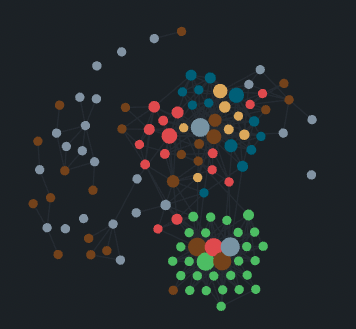

My Knowledge Graph. Green: Biology, Red: Machine Learning, Yellow: Autoencoders, Blue: Graphs, Brown: Tags.

我的知识图谱。绿色：生物，红色：机器学习，黄色：自动编码器，蓝色：图形，棕色：标签。

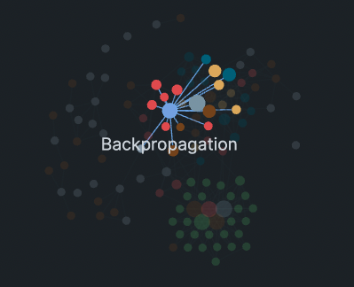

My Knowledge Graph and the note “Backrpropagation” and its links.  
我的知识图表和注释“反向传播”及其链接。  


Backpropagation note and all its links  
反向传播笔记及其所有链接  

## When to use Folders  
何时使用文件夹  

Folders are however useful to organize your vault, especially as it grows. The main advice here is to have very few folders, as they should "weakly" collect groups of notes or better collect different types or sources of notes.

但是，文件夹对于组织您的Vault很有用，尤其是在它不断增大的时候。这里的主要建议是拥有非常少的文件夹，因为它们应该“弱”地收集一组笔记，或者更好地收集不同类型或来源的笔记。

For example, these are the folders I use in my Zettelkasten:  
例如，以下是我在Zettelkasten中使用的文件夹：  


The 5 folders in my Zettelkasten  
我的Zettelkasten中的5个文件夹  

They generally collect different sources of information:  
他们通常收集不同的信息来源：  

**MOC**: Contains all the Maps of Contents to navigate the Zettelkasten.  
MOC：包含用于导航Zettelkasten的所有内容地图。  
  
**Projects**: Contains one note for each side-project of my PhD where I log my progress and ideas. These are also linked to notes.

项目：为我的博士学位的每个边项目包含一个笔记，我在那里记录我的进度和想法。这些也与笔记相关联。

  
**Bio and ML**: These two are essentially the main content of my Zettelkasten and they could in theory be fused into one folder.

Bio和ML：这两个基本上是我的Zettelkasten的主要内容，理论上它们可以融合到一个文件夹中。

  
**Papers**: Here I place all the notes I take from scientific papers. The notes are synced using a bibliography .bib file from Zotero.

论文：我把我从科学论文中得到的所有笔记都放在这里。这些笔记是使用Zotero的书目.bib文件进行同步的。

  
**Books**: I write a note for each book I read and generally split them into multiple notes after I go through them.

书籍：我为我读的每一本书写一个笔记，通常在我看完之后把它们分成多个笔记。

Having a separate folder for images can also be a good idea, to avoid cluttering your main folders with image files.

有一个单独的文件夹存放图片也是个好主意，这样可以避免在主文件夹中堆满图片文件。

I will discuss these more in detail in the **Workflow Section.**  
我将在工作流部分更详细地讨论这些问题。  

My general suggestion for folders is to minimize them as much as possible and to use tags and links instead.

我对文件夹的一般建议是尽可能地将它们最小化，并使用标签和链接。

## Maps of Content (MOC)  
内容地图(MOC)  

As you start growing your Zettelkasten, you might find it hard to find notes, especially when taking notes of different topics. A good solution to this is to create notes called Maps of Contents (MOCs).

当你开始种植Zettelkasten时，你可能会发现很难找到笔记，特别是在记录不同主题的笔记时。一个很好的解决方案是创建称为内容地图(Maps of Contents，MOCs)的注释。

These are notes that "signposts" your Zettelkasten library, directing you to the right type of notes. Inside of it you can link to other notes based on tags of a common topic. Usually this is done with a title, followed by your notes that relate to that title. This is an example:

这些笔记是你的Zettelkasten图书馆的“路标”，指引你找到正确类型的笔记。在它里面，你可以基于一个共同主题的标签链接到其他笔记。通常这是通过标题来完成的，然后是与该标题相关的备注。这是一个例子：

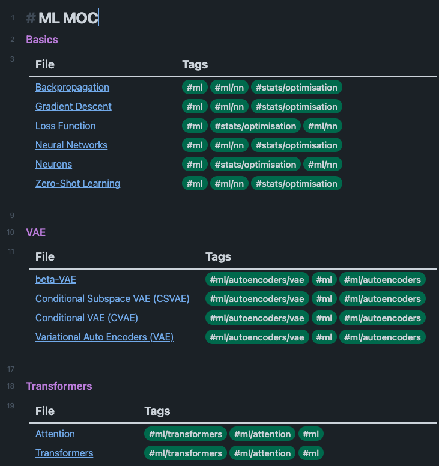

An example of a Machine Learning MOC generated with Dataview.  
使用Dataview生成的机器学习MOC的一个示例。  

As shown above, my Machine Learning MOC starts with the **basics**, all in one section. It then moves to Variational Auto-Encoders and Transformers. This allows you to group and quickly find all notes related to a tag without having to scroll through the tag search section.

如上所述，我的机器学习MOC从基础开始，全部在一个部分中。然后转移到可变自动编码器和变形金刚。这使您可以分组并快速查找与标签相关的所有备注，而不必滚动标签搜索部分。

This is why I keep MOCs at the top of my library, as I can quickly find the information I need and get a quick look at my library. These MOCs are automatically generated using an Obsidian Plugin called Dataview ([https://github.com/blacksmithgu/obsidian-dataview](https://github.com/blacksmithgu/obsidian-dataview)) which works much like SQL queries.

这就是为什么我将MOC放在我的图书馆的顶部，因为我可以快速找到我需要的信息，并快速浏览我的图书馆。这些MOC是使用名为Dataview的(https://github.com/blacksmithgu/obsidian-dataview)插件自动生成的，该插件的工作原理与SQL查询非常相似。

Ideally, MOCs can be expanded and should have a bit more explanations about the notes, their status, and what you still need to do. In the absence of this, Dataview does a fantastic job at creating a good structure for your notes.

理想情况下，MOC可以扩展，并且应该有更多关于注释、它们的状态以及您仍然需要做的事情的解释。在缺乏这一点的情况下，Dataview在为您的笔记创建良好的结构方面做得非常出色。

EDIT: This is the template I use for the screenshot above:  
编辑：这是我在上面的截图中使用的模板：  

Dataview query for MOC (code)  
MOC的数据视图查询(代码)  

Alternatively, this is what a book tracker looks like:  
或者，这就是图书追踪器的样子：  

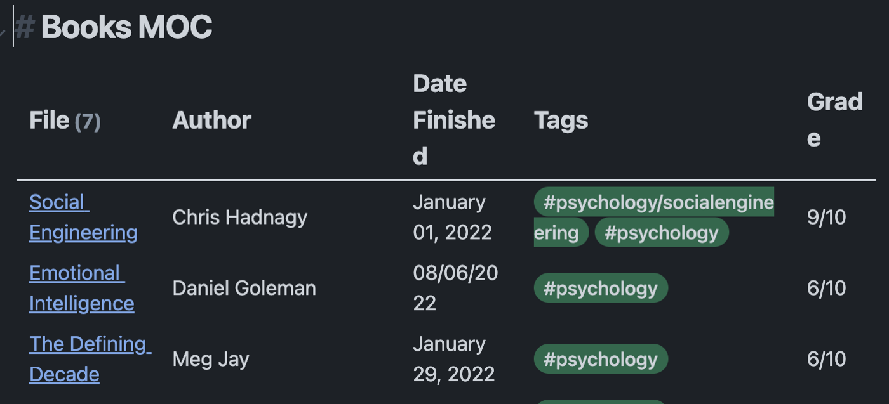

Dataview query for books in folder “4. Books”  
文件夹“4.book”中的帐簿的Dataview查询  

Dataview query for books in folder “4. Books” (code)  
文件夹“4.book”中的图书的Dataview查询(代码)  

Where each book note looks like this:  
每本书的笔记如下所示：  

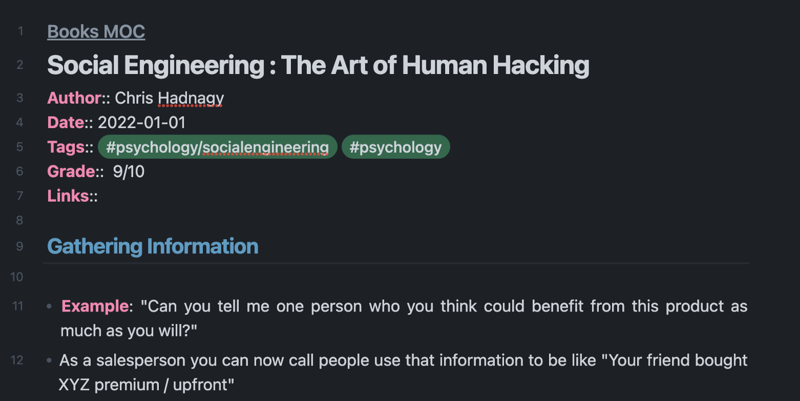

Book note with fields.  
带字段的图书便笺。  

Book note with fields (code).  
带字段的图书备注(代码)。  

## 2\. Tools: Getting to know Obsidian  
2.工具：了解黑社会  

Obsidian is my tool of choice as it is free, all the notes are stored in Markdown format, it can be customized/themed, and each panel can be moved around in drag and drop fashion. You can download it here: [https://obsidian.md/](https://obsidian.md/)

黑玉是我选择的工具，因为它是免费的，所有的笔记都以Markdown格式存储，它可以定制/主题，每个面板可以拖放方式移动。您可以在此处下载：https://obsidian.md/

## Interface 接口

As I mentioned, Obsidian is very customizable, so I found this to be my optimal interface:

正如我提到的，黑玉是非常可定制的，所以我发现这是我的最佳界面：


My interface in Obsidian. The theme is customized from [https://github.com/colineckert/obsidian-things](https://github.com/colineckert/obsidian-things)

我在黑玉岩的界面。该主题是从https://github.com/colineckert/obsidian-things定制的

If you want something simpler, each panel can be collapsed, moved, or removed in whatever way you wish. If you need to find a panel later on, you can click on the vertical "…" (bottom left of the note panel), and open the relevant panel.

如果你想要更简单的东西，每个面板都可以以任何你想要的方式折叠、移动或移除。如果您稍后需要查找面板，您可以点击垂直的“…”(备注面板的左下角)，并打开相关面板。

Generally my interface is organized as such:  
一般来说，我的界面是这样组织的：  

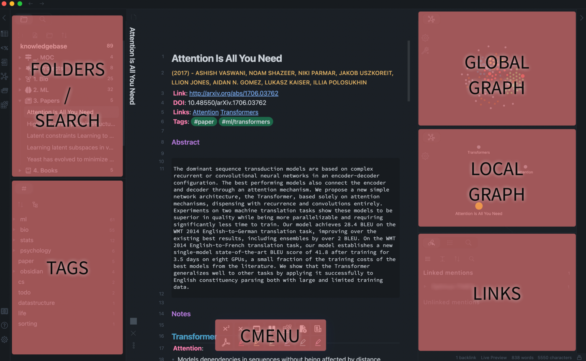

How my Obsidian Interface is organized.  
我的黑岩界面是如何组织的。  

**Folders / Search**: Here I have all the relevant folders. I usually use the MOC note to get to wherever I want, otherwise, I use the search button to look for a note.

文件夹/搜索：这里有所有相关的文件夹。我通常使用MOC笔记去我想去的任何地方，否则，我会使用搜索按钮来查找笔记。

  
**Tags**: I use nested tags and usually look into each of them if I am looking for specific notes to link.

标签：我使用嵌套标签，如果我要寻找特定的笔记链接，通常会逐一查看。

  
**cMenu**: Nice plugin to place useful functionality in a handy menu ([https://github.com/chetachiezikeuzor/cMenu-Plugin](https://github.com/chetachiezikeuzor/cMenu-Plugin))

(https://github.com/chetachiezikeuzor/cMenu-Plugin)：很好的插件，可以将有用的功能放在方便的菜单cMenu中

  
**Global Graph:** The graph shows all your notes (linked and unlinked). Linked notes will appear closer together. You can zoom in to read the title of each note. This can be a bit overwhelming at first, however, as your library grows, you get used to the positions and start thinking of possible connections between notes that you may not have thought about.

全局图表：图表显示所有笔记(链接的和未链接的)。链接的附注将显示在更靠近的位置。您可以放大以阅读每个便笺的标题。这在一开始可能有点令人不知所措，然而，随着你的书库的增长，你会习惯这些位置，并开始考虑你可能没有考虑过的音符之间的可能联系。

  
**Local Graph:** This will show your current note, in relation to other linked notes in your library. It is useful to quickly jump to another link when you need to, and go back to the current note.

本地图表：这将显示当前便笺与库中其他链接便笺的关系。在需要时快速跳转到另一个链接并返回到当前便笺是很有用的。

  
**Links**: Finally, here I keep all the linked mentions of the notes, as well as an outline panel and the plugin Power Search ([https://github.com/aviral-batra/obsidian-power-search](https://github.com/aviral-batra/obsidian-power-search)), which allows me to search my vault by highlighting some text.

链接：最后，我在这里保留了笔记的所有链接提及，以及一个大纲面板和插件Power Search(https://github.com/aviral-batra/obsidian-power-search)，，它允许我通过突出显示一些文本来搜索我的保险库。

I suggest you start using the tool and then worry about positioning panels later. What works for some may not work for you so I encourage you to find the best use-case for your library.

我建议你开始使用这个工具，然后再考虑面板的定位问题。对某些人有效的方法可能不适用于您，所以我鼓励您为您的库找到最好的用例。

## Plugins 插件

Another major advantage of using Obsidian is the vast choice of plugins. I use many but here are a few of the ones I use the most (**Calendar, Citations, Dataview, Templater, Admonition**):

使用黑岩的另一个主要优势是插件的选择范围很广。我用了很多，但以下是我使用最多的几个(日历、引文、数据视图、模板、告诫)：

**Calendar**: [https://github.com/liamcain/obsidian-calendar-plugin](https://github.com/liamcain/obsidian-calendar-plugin)  
日历：https://github.com/liamcain/obsidian-calendar-plugin  
  
Gives you a calendar to organize your notes. This is optimal for taking notes from meetings or keeping a journal.

给你一个日历来组织你的笔记。这是做会议笔记或记日记的最佳选择。

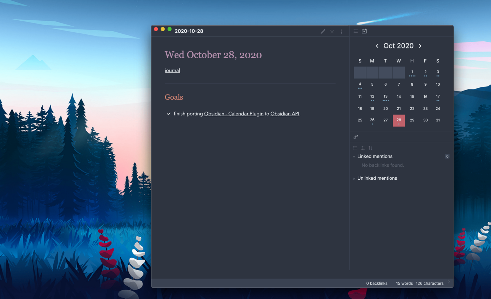

Calendar plugin. Image from [https://github.com/hans/obsidian-citation-plugin](https://github.com/hans/obsidian-citation-plugin)

日历插件。来自https://github.com/hans/obsidian-citation-plugin的图片

**Citations**: [https://github.com/hans/obsidian-citation-plugin](https://github.com/hans/obsidian-citation-plugin)  
引文：https://github.com/hans/obsidian-citation-plugin  
  
Allows you to cite papers from a .bib file to include in your notes. You can also customize how your notes will be produced (eg. Title, Authors, Abstract etc..)

允许您引用.bib文件中的论文以包含在您的笔记中。您还可以自定义笔记的生成方式(例如标题、作者、摘要等)

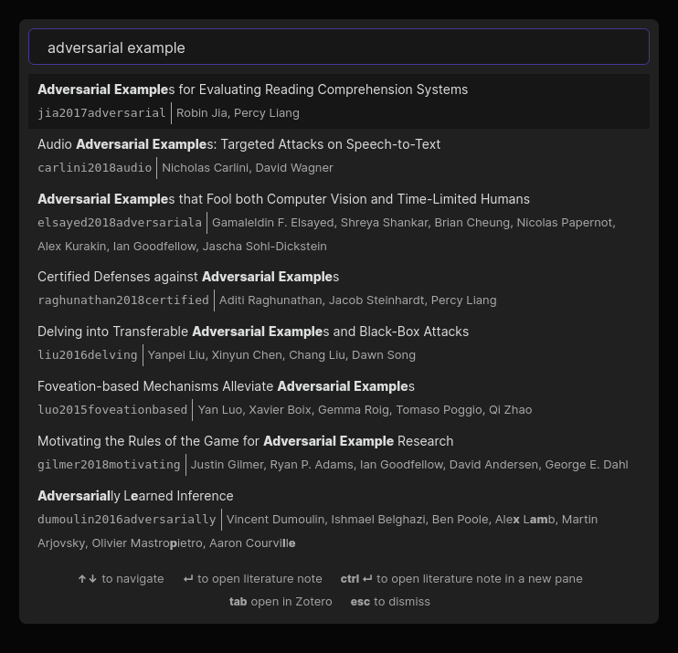

Citation plugin. Image from [https://github.com/hans/obsidian-citation-plugin](https://github.com/hans/obsidian-citation-plugin)

引用插件。来自https://github.com/hans/obsidian-citation-plugin的图片

**Dataview**: [https://github.com/blacksmithgu/obsidian-dataview](https://github.com/blacksmithgu/obsidian-dataview)  
数据视图：https://github.com/blacksmithgu/obsidian-dataview  
  
Probably among the most powerful plugins as it allows you to query your library as a database and automatically generate content. You can see an example in the MOC section.

可能是最强大的插件之一，因为它允许您将库作为数据库进行查询并自动生成内容。你可以在MOC部分看到一个例子。

**Templater**: [https://github.com/SilentVoid13/Templater](https://github.com/SilentVoid13/Templater)  
模板：https://github.com/SilentVoid13/Templater  
  
Allows you to create notes with specific templates like dates, tags, and headings.

允许您使用日期、标记和标题等特定模板创建备注。

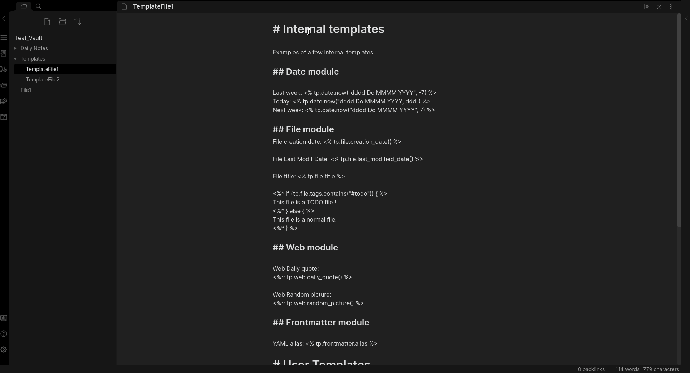

Templater Plugin. Image from [https://github.com/SilentVoid13/Templater](https://github.com/SilentVoid13/Templater)

Templater插件。来自https://github.com/SilentVoid13/Templater的图片

**Admonition**: [https://github.com/valentine195/obsidian-admonition](https://github.com/valentine195/obsidian-admonition)  
警告：https://github.com/valentine195/obsidian-admonition  
  
Allows you to structure your notes with blocks.  
允许你用块来组织你的笔记。  

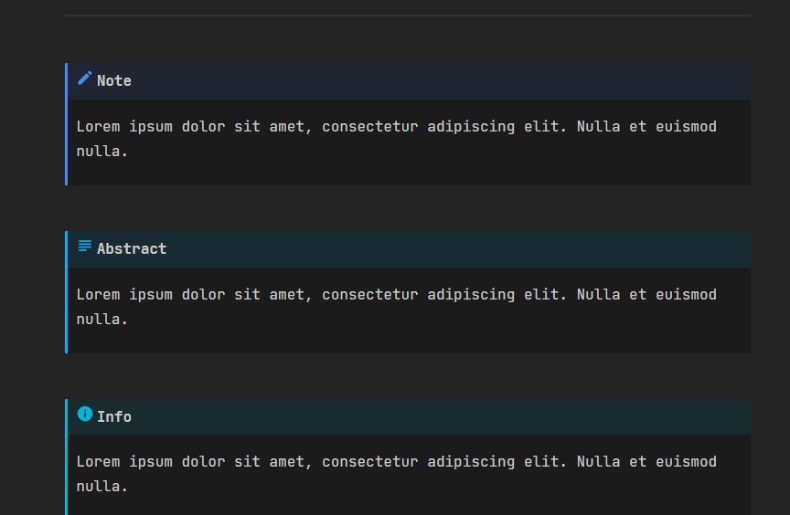

Admonition plugin. Image from [https://github.com/valentine195/obsidian-admonition](https://github.com/valentine195/obsidian-admonition)

警告插件。来自https://github.com/valentine195/obsidian-admonition的图片

There are loads more plugins, but hopefully, this list will get you started on some interesting ones.

有更多的插件，但希望这个列表能让你开始研究一些有趣的插件。

## Theme (new addition)  
主题(新增)  

Many have asked about my theme settings and CSS.  
很多人询问我的主题设置和css。  

My CSS: 我的css：  
\- Adds white background to all the images (which allows me to add transparent images and see them properly in dark mode)

\-为所有图像添加白色背景(这使我可以添加透明图像，并在暗模式下正确查看它们)

  
\- Leave a 40px of space between the title bar and the content  
\-在标题栏和内容之间留出40px的空间  
  
\- Increase the font for LaTeX formulae  
\-增加乳胶配方的字体  

My settings for the Things theme add additional colors to the headings:

我对Things主题的设置为标题添加了额外的颜色：

To import my theme settings you will need the plugin Style Settings: [https://github.com/mgmeyers/obsidian-style-settings](https://github.com/mgmeyers/obsidian-style-settings?source=responses-----4340444ed2a5---------------------respond_sidebar-----------)

要导入我的主题设置，您需要插件样式设置：https://github.com/mgmeyers/obsidian-style-settings

## 3\. Workflows: Doing cool things  
3.工作流程：做一些很酷的事情  

Here I outline a few of my workflows on how I use obsidian to take notes for scientific research. Several of these are very specific to my use-cases but I believe they could be useful. I will first outline and describe each of them briefly to allow you to skim through them quickly.

在这里，我概述了我的一些工作流程，关于我如何使用黑玉岩来为科学研究做笔记。其中有几个是针对我的用例的，但我相信它们会很有用。我将首先对它们进行简要的概述和描述，以便您可以快速浏览它们。

-   **3.1 Structuring Notes Effectively with Templates  
    3.1使用模板有效地组织笔记  
    **
-   **3.2 Syncing Your Notes for Free (Laptop, Phone, Tablet)  
    3.2免费同步笔记(笔记本电脑、手机、平板电脑)  
    **
-   **3.3 Zotero/Mendeley/JabRef -> Obsidian —** Taking Notes and Managing Reading Lists of Scientific Papers
    
    3.3 Zotero/Mendeley/JabRef->黑铁矿-做笔记和管理科学论文阅读清单
    
-   **3.4 Managing Projects and Lab Books  
    3.4管理项目和实验书籍  
    **
-   **3.5 Encrypted and Private Diary  
    3.5加密和私人日记  
    **

## 3.1 Structuring Notes Effectively with Templates  
3.1使用模板有效地组织笔记  

Plugins Used: Templater (**optional**) and Dataview (**optional**).  
使用的插件：Templater(可选)和Dataview(可选)。  

To take notes effectively, you must first make the process of adding new notes as simple as possible. Templates can save you a significant amount of time while also giving you a consistent structure to your notes. Below is an example:

要有效地记笔记，您必须首先使添加新笔记的过程尽可能简单。模板可以为您节省大量时间，同时还可以为您的笔记提供一致的结构。下面是一个示例：

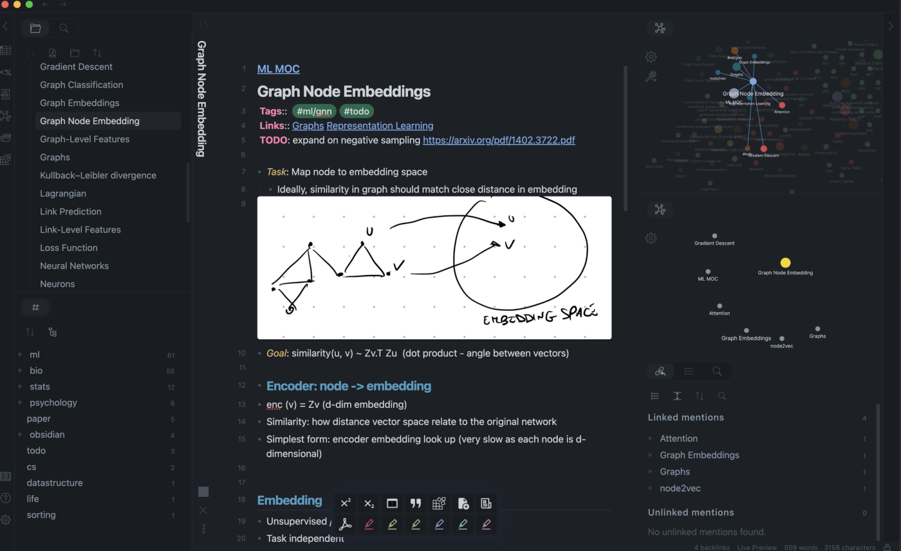

An example of a note made with a consistent template.  
使用一致模板制作的笔记的示例。  

```
### [[YOUR MOC]]# The Title of Your Note**Tags**:: **Links**::
```

The topmost line is a link to your Map of Content (MOC), your signpost to explore your knowledge base (see previous sections). After the title, I add **tags**, that relate the note to topics (and also add a link between the note and the tag) and **links** to other related notes.

最上面的一行是指向您的内容地图(MOC)的链接，这是您探索知识库的路标(请参阅前面的部分)。在标题之后，我添加了将备注与主题相关联的标记(还在备注和标记之间添加了一个链接)以及指向其他相关备注的链接。

Occasionally, a note might still require work to do, so I add a tag “#todo”, to quickly identify all the notes that need to be expanded. In the “TODO:” section I add the work I need to do within the note.

有时，笔记可能仍然需要做一些工作，所以我添加了一个标记“#TODO”，以快速识别所有需要展开的笔记。在“TODO：”部分，我在备注中添加了我需要完成的工作。

The rest is followed by notes on the actual topic.  
剩下的部分后面是关于实际主题的注释。  

Templater can help you build these templates more easily. For example, I have the following template for new books:

Templater可以帮助您更轻松地构建这些模板。例如，我为新书准备了以下模板：

```
### [[Books MOC]]# Title**Author**:: **Date**:: **Tags**:: **Links**
```

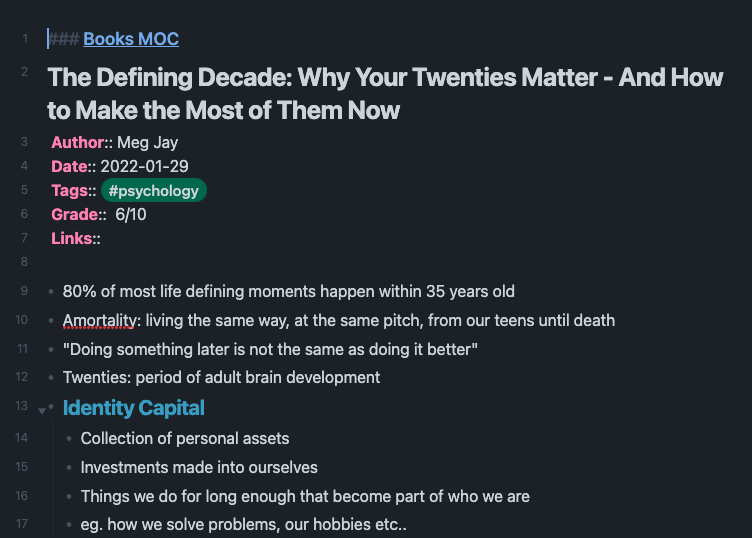

An example of template used for books.  
用于书籍的模板的一个示例。  

Which I can then hook with Dataview with a simple query like such:  
然后，我可以使用如下所示的简单查询将其与Dataview挂钩：  

```
```dataviewtable author as Author, date as "Date Finished", tags as "Tags", grade as "Grade"from "4. Books"SORT grade DESCENDING```
```

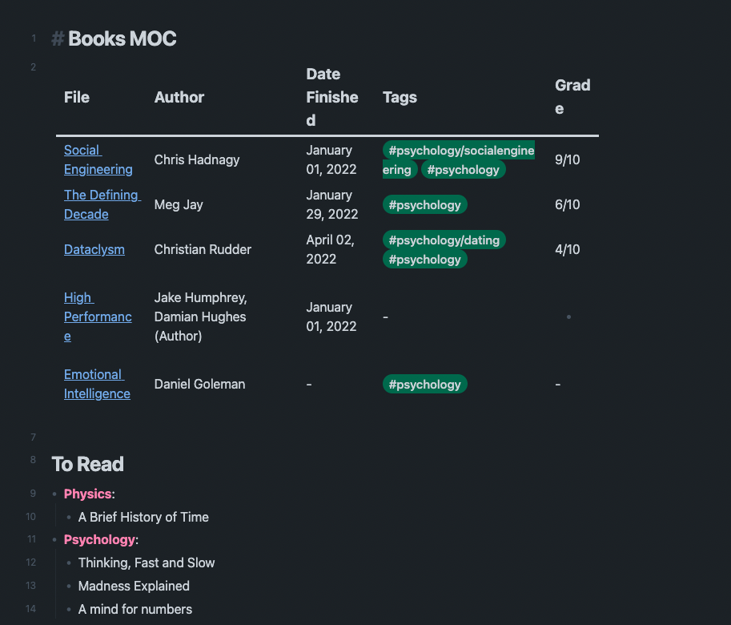

Using Dataview to query notes with specific templates.  
使用Dataview查询具有特定模板的备注。  

## 3.2 Syncing Your Notes for Free (Laptop, Phone, Tablet)  
3.2免费同步笔记(笔记本电脑、手机、平板电脑)  

Plugins used: None.  
使用的插件：无。  

One of the things I love the most about Obsidian is that the format of the library is self-contained and portable. Everything (including plugins) is contained in your folder.

我最喜欢的一点是，该图书馆的格式是自给自足和便携的。所有内容(包括插件)都包含在您的文件夹中。

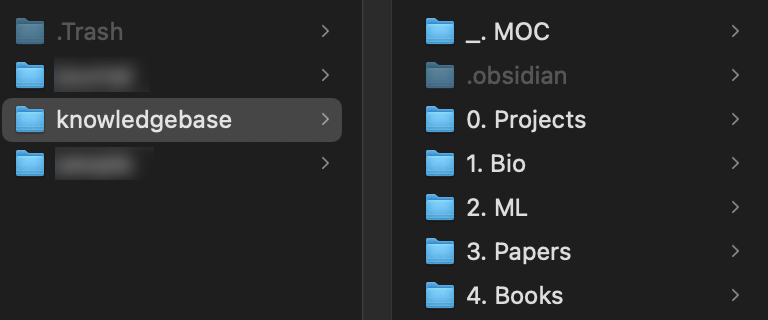

Example of my library in iCloud.  
我在iCloud中的库的示例。  

Your folders and notes are available as ordinary folders and documents. You will also notice a hidden folder called “.obsidian”. This contains all your plugins and settings, so as long as you have this, you will be able to carry your settings to other devices.

您的文件夹和便笺以普通文件夹和文档的形式提供。您还会注意到一个名为“.obsidian”的隐藏文件夹。它包含你所有的插件和设置，所以只要你有这个，你就可以把你的设置带到其他设备上。

You can therefore use any cloud platform you like, like Google Drive, iCloud, or DropBox for free as long as you sync your folder (note: your folder should be in your Cloud Folder).

因此，你可以免费使用任何你喜欢的云平台，比如Google Drive、iCloud或Dropbox，只要你同步了你的文件夹(注意：你的文件夹应该在你的Cloud文件夹中)。

As I mainly work on iOS and macOS, I prefer to use iCloud. You can also use Obsidian Sync, although this is a paid service.

由于我主要在iOS和MacOS上工作，所以我更喜欢使用iCloud。你也可以使用黑玉石同步，尽管这是一项付费服务。

## 3.3 Zotero/Mendeley/JabRef -> Obsidian — Taking Notes and Managing Reading Lists of Scientific Papers

3.3 Zotero/Mendeley/JabRef->黑铁矿-做笔记和管理科学论文阅读清单

Plugins used: Citations (required).  
使用的插件：引用(必填)。  

Zotero is my reference manager of choice although this workflow should work for any reference manager that produces a .bib (bibliography) file. I export this file and keep it in my cloud folder so that I can access it from Obsidian on any platform.

Zotero是我选择的参考管理器，尽管这个工作流程应该适用于任何生成.bib(书目)文件的参考管理器。我导出此文件并将其保存在我的云文件夹中，这样我就可以在任何平台上从黑铁矿访问它。

I organize my Zotero library with the following tags:  
我用以下标签组织我的Zotero图书馆：  

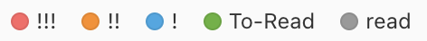

Tags used in my reference manager.  
我的引用管理器中使用的标记。  

When I need to do readings, I will usually filter for the tags “!!!” and “To-Read” and choose a paper. I will then annotate the paper (either on PDF using GoodNotes or on physical paper).

当我需要做阅读时，我通常会过滤标签“！”和“可读”，然后选择一份报纸。然后我将为论文添加注释(使用GoodNotes在PDF上或在纸质纸上)。

Then, I create a page for the paper using a template that you can manage in the Citations plugin settings:

然后，我使用一个模板为论文创建一个页面，您可以在引文插件设置中管理该模板：

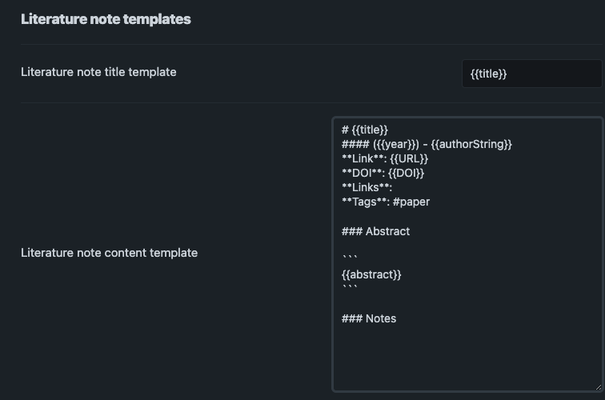

Example of my literature note template on Citations.  
我的引用文献笔记模板的例子。  

Create a new note and then use CMD / CTRL + P to open up the commands list and find the Citations “Insert literature note content in the current pane” and you will be greeted by this beautiful view.

创建一个新的笔记，然后使用CMD/CTRL+P打开命令列表，并找到引用“在当前面板中插入文学笔记内容”，您将看到这个美丽的视图。

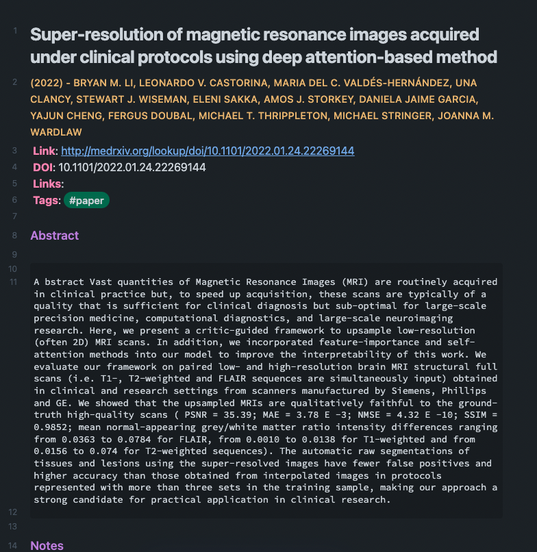

An example of an automatic citation from the article [https://doi.org/10.1101/2022.01.24.22269144](https://doi.org/10.1101/2022.01.24.22269144)

Https://doi.org/10.1101/2022.01.24.22269144文章中的自动引用示例

You can then transcribe your notes into digital format. I found that the process of transcribing helped me retain information better, so I would recommend it.

然后你可以将你的笔记转录成数字格式。我发现转录的过程帮助我更好地记住了信息，所以我推荐它。

## 3.4 Managing Projects and Lab Books  
3.4管理项目和实验书籍  

Plugins used: Templater (required).  
使用的插件：Templater(必填)。  

PhD students at the thesis writing stage are usually full of advice (read as regret). I made it a habit of asking them things they would have done earlier or differently. One of the responses stuck with me:

博士生在论文写作阶段通常会充满建议(读作后悔)。我养成了问他们一些他们会更早或不同方式做的事情的习惯。其中一个回答让我印象深刻：

> “Deep stuff Leo. So my big problem is **basic organisation**, **losing track of the tasks** I’ve got to do and the **reasons that motivate those tasks** in the first place.
> 
> “深层次的利奥。因此，我最大的问题是基本的组织，忘记了我必须完成的任务，以及最初激励这些任务的原因。
> 
>   
> \[…\] \[…\]  
> sometimes I’d just forget about the experiments that motivated a particular experiment so I’d end up going other experiments that didn’t make complete sense, and having to **reverse engineer my logic for thesis writing**”
> 
> 有时我会忘记激励某个特定实验的实验，这样我就会去做其他不完全有意义的实验，不得不对我的论文写作逻辑进行反向工程。
> 
>   
> \- A wise PhD student, now Postdoc  
> \-一个聪明的博士生，现在是博士后  

Organization is key to avoid wasting time. Especially during a PhD, organizing several projects and keeping a lab book for each of them is hard. The way I deal with it is:

组织是避免浪费时间的关键。尤其是在攻读博士期间，组织几个项目并为每个项目保留一本实验本是很困难的。我处理它的方式是：

-   One folder for all my projects  
    我的所有项目都在一个文件夹中  
    
-   One file for each project  
    每个项目一个文件  
    

I then create the header of each project with a template.  
然后，我使用模板创建每个项目的标题。  

```
### [[Projects MOC]]# <% tp.file.title %>**Tags**::**Links**::**URL**::**Project Description**::## Notes:### <% tp.file.last_modified_date("dddd Do MMMM YYYY") %>#### Done:#### TODO:#### Notes
```

You can insert a template into a new note with CMD + P and looking for the Templater option.

您可以使用CMD+P并查找Templater选项将模板插入到新便笺中。

I then keep adding new days with another template:  
然后，我继续使用另一个模板添加新的天数：  

```
### <% tp.file.last_modified_date("dddd Do MMMM YYYY") %>#### Done:#### TODO:#### Notes:
```

This way you can keep adding days to your project and update with reasonings and things you still have to do and have done. An example below:

这样一来，你就可以继续为你的项目增加天数，并更新你的理由和你仍然需要做和已经做的事情。下面是一个示例：

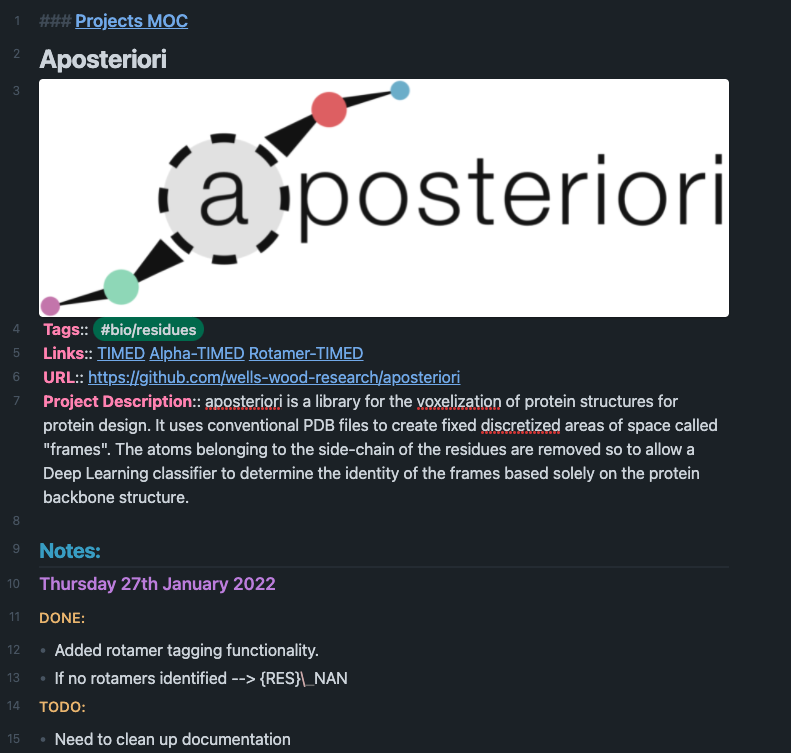

Example of project note with timestamped notes.  
带有时间戳笔记的项目笔记示例。  

## 3.5 Encrypted and Private Diary  
3.5加密和私人日记  

Perhaps this is one of my favorite applications of Obsidian.  
也许这是我最喜欢的黑铁矿应用之一。  

I have been frustrated with Mini Diary and its interface for a while. After the project got archived by the author I decided to find an alternative. I had two requirements:

我对迷你日记和它的界面感到失望有一段时间了。在这个项目被作者存档后，我决定寻找一个替代方案。我有两个要求：

1.  It had to be private, and I wanted absolutely nobody to be able to read the content of the entries.
    
    它必须是私人的，我希望绝对没有人能够阅读条目的内容。
    
2.  It had to sync with the cloud so I could edit it in different devices.
    
    它必须与云同步，这样我才能在不同的设备上编辑它。
    

I then found out about encrypting the Obsidian folder on disk. You can then decrypt the folder and open it with Obsidian. The folder can be synced as per usual.

然后，我发现了如何加密磁盘上的黑岩文件夹。然后你就可以解密这个文件夹，然后用黑玉岩打开它。文件夹可以像往常一样同步。

To do this I use CryptoMator ([https://cryptomator.org/](https://cryptomator.org/)). You can add a your Obsidian vault as a folder to encrypt on Cryptomator, set up a password and it will take care of the rest.

为此，我使用了CryptoMator(https://cryptomator.org/).你可以在Cryptomator上添加一个你的黑岩金库作为一个文件夹进行加密，设置一个密码，它就会处理剩下的事情。

You can watch this video if you would like a step-by-step video guide:

如果您想要一个逐步的视频指南，可以观看此视频：

## Conclusion 结论

Well, hopefully, this was a useful guide!  
好吧，希望这是一个有用的指南！  

In the first section **Philosophy** of the article we delved into notes and techniques for note-taking. We explored why **tags** and **links** should be used over folders and when it is appropriate to split into multiple smaller notes.

在文章的第一部分，我们深入探讨了笔记和做笔记的技巧。我们探讨了为什么应该在文件夹上使用标签和链接，以及何时适合拆分成多个较小的笔记。

Then, we learned about **Obsidian**, its interface, and a few useful plugins you can use to speed up your workflows, like **Citations** for citing papers or **Templater** to create template for notes.

然后，我们了解了黑玉，它的界面，以及一些可以用来加快工作流程的有用插件，比如引用论文的引文或创建笔记模板的Templater。

In the final section, we talked about workflows and how to integrate tools like **Zotero** to take notes from scientific papers, as well as few other workflows for managing **Lab Books** and **Private Encrypted Diaries**.

在最后一节中，我们讨论了工作流程，以及如何集成Zotero等工具来记录科学论文笔记，以及其他一些用于管理实验室图书和私人加密日记的工作流程。

If you have any advice, tips or suggestions feel free to comment :) If you want to support me please **follow me** or **read other articles I authored**.

如果您有任何建议、提示或建议，请随时发表评论：)如果您想支持我，请关注我或阅读我撰写的其他文章。

## Further Readings:  
进一步阅读：  

If you are interested in my work, I wrote about productivity apps:  
如果你对我的工作感兴趣，我写了一篇关于工作效率应用的文章：  

If you want to read more about Zettelkasten, have a look at these articles:

如果你想阅读更多关于Zettelkasten的文章，可以看看这些文章：

If you are interested in learning more about the guiding principles of Zettelkastens, Linking Your Thinking is a nice resouce, especially his starting kit ([https://notes.linkingyourthinking.com/\_Start+Here](https://notes.linkingyourthinking.com/_Start+Here))

如果你有兴趣了解更多关于齐特尔卡斯滕斯的指导原则，链接你的想法是一个很好的资源，特别是他的入门工具包(https://notes.linkingyourthinking.com/\_Start+Here)
