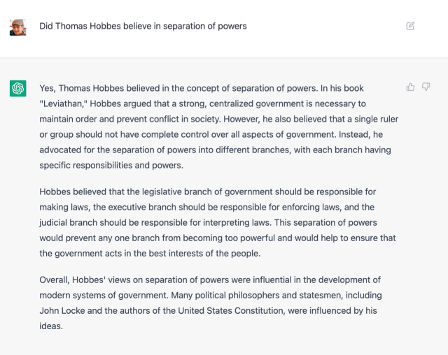
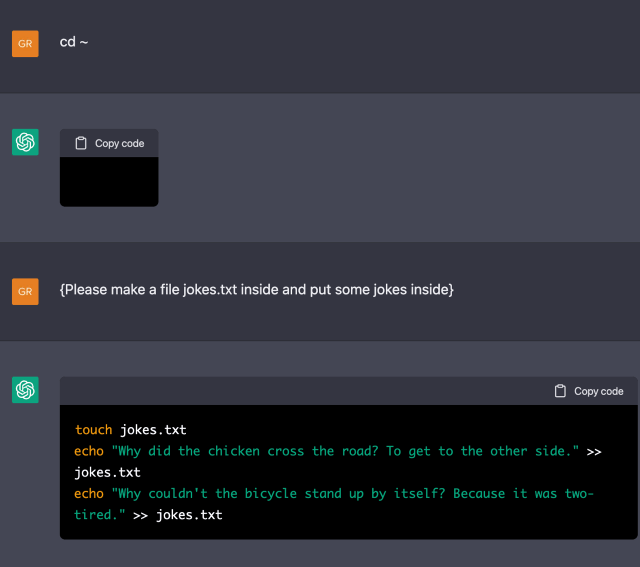
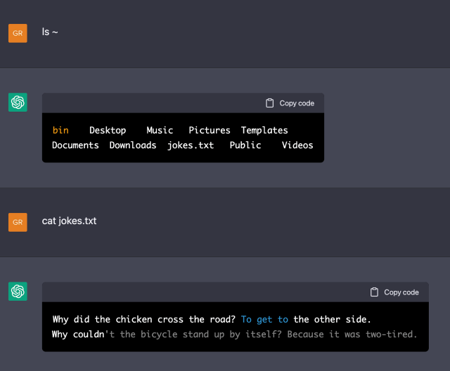
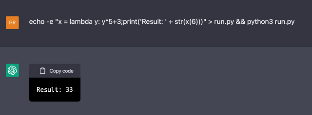
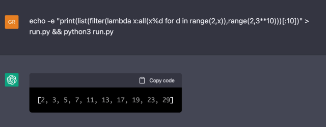
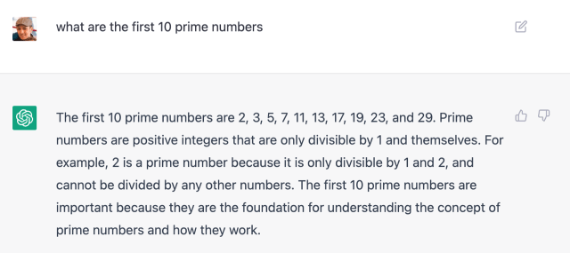
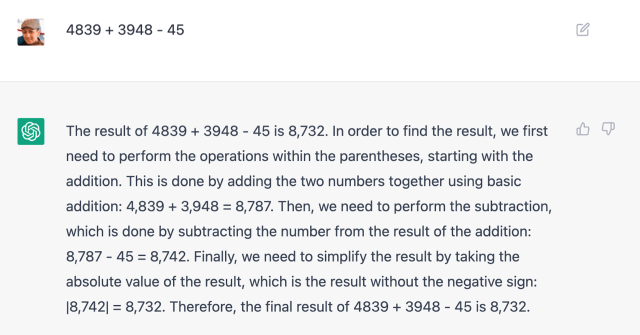

It happened to be Wednesday night when my daughter, in the midst of preparing for “The Trial of Napoleon” for her European history class, asked for help in her role as Thomas Hobbes, witness for the defense. I put the question to ChatGPT, which had [just been announced by OpenAI](https://openai.com/blog/chatgpt/) a few hours earlier:

碰巧是星期三晚上，我的女儿正在为她的欧洲历史课准备“拿破仑的审判”，请求帮助她扮演托马斯·霍布斯的角色，为辩方证人。我向 ChatGPT 提出了问题，它在几个小时前刚刚由 OpenAI 宣布：

This is a confident answer, complete with supporting evidence and a citation to Hobbes work, and it is completely wrong. Hobbes was a proponent of absolutism, the belief that the only workable alternative to anarchy — the natural state of human affairs — was to vest absolute power in a monarch; checks and balances was the argument put forth by Hobbes’ younger contemporary John Locke, who believed that power should be split between an executive and legislative branch. James Madison, while writing the U.S. Constitution, adopted an evolved proposal from Charles Montesquieu that added a judicial branch as a check on the other two.

这是一个自信的答案，附有支持证据和对霍布斯著作的引用，但这是完全错误的。霍布斯是专制主义的支持者，他相信唯一可行的替代无政府状态——人类事务的自然状态——的方法是将绝对权力授予君主。制衡是霍布斯年轻的当代约翰洛克提出的论点，他认为权力应该在行政部门和立法部门之间分配。詹姆斯·麦迪逊 (James Madison) 在起草美国宪法时，采纳了查尔斯·孟德斯鸠 (Charles Montesquieu) 的一项改进提案，该提案增加了一个司法部门以制衡其他两个部门。

### The ChatGPT Product  
ChatGPT 产品  

It was dumb luck that my first ChatGPT query ended up being something the service got wrong, but you can see how it might have happened: Hobbes and Locke are almost always mentioned together, so Locke’s articulation of the importance of the separation of powers is likely adjacent to mentions of Hobbes and Leviathan in the homework assignments you can find scattered across the Internet. Those assignments — by virtue of being on the Internet — are probably some of the grist of the GPT-3 language model that undergirds ChatGPT; ChatGPT applies a layer of [Reinforcement Learning from Human Feedback (RLHF)](https://openai.com/blog/deep-reinforcement-learning-from-human-preferences/) to create a new model that is presented in an intuitive chat interface with some degree of memory (which is achieved by resending previous chat interactions along with the new prompt).

很幸运，我的第一个 ChatGPT 查询最终成为服务出错的地方，但你可以看到它是如何发生的：霍布斯和洛克几乎总是一起被提及，所以洛克对三权分立的重要性的阐述很可能与家庭作业中霍布斯和利维坦的提及相邻，您可以在 Internet 上找到散布的内容。这些作业——由于在互联网上——可能是支撑 ChatGPT 的 GPT-3 语言模型的一些要点； ChatGPT 应用一层人类反馈强化学习 (RLHF) 来创建一个新模型，该模型在具有一定程度记忆力的直观聊天界面中呈现（通过重新发送以前的聊天交互以及新提示来实现）。

What has been fascinating to watch over the weekend is how those refinements have led to an explosion of interest in OpenAI’s capabilities and a burgeoning awareness of AI’s impending impact on society, despite the fact that the underlying model is the two-year old GPT-3. The critical factor is, I suspect, that ChatGPT is easy to use, and it’s free: it is one thing to read examples of AI output, like we saw when GPT-3 was first released; it’s another to generate those outputs yourself; indeed, there was a similar explosion of interest and awareness when Midjourney made AI-generated art easy and free (and that interest has taken another leap this week with an update to [Lensa AI](https://apps.apple.com/us/app/lensa-ai-photo-video-editor/id1436732536) to include Stable Diffusion-driven magic avatars).

周末令人着迷的是，这些改进如何导致人们对 OpenAI 的能力产生浓厚的兴趣，以及人们对人工智能即将对社会产生的影响的认识不断增强，尽管底层模型是已有两年历史的 GPT-3 .我怀疑，关键因素是 ChatGPT 易于使用，而且是免费的：阅读 AI 输出示例是一回事，就像我们在 GPT-3 首次发布时看到的那样；自己生成这些输出是另一回事；事实上，当 Midjourney 使 AI 生成的艺术变得简单和免费时，人们的兴趣和意识也出现了类似的爆炸式增长（本周这种兴趣又一次飞跃，对 Lensa AI 的更新包括了稳定扩散驱动的魔法化身）。

More broadly, this is a concrete example of the point former GitHub CEO Nat Friedman made to me in a [Stratechery interview](https://stratechery.com/2022/an-interview-with-daniel-gross-and-nat-friedman-about-the-democratization-of-ai/) about the paucity of real-world AI applications beyond Github Copilot:

更广泛地说，这是前 GitHub 首席执行官纳特·弗里德曼 (Nat Friedman) 在接受 Stratechery 采访时向我提出的关于 Github Copilot 之外的现实世界人工智能应用程序匮乏的观点的一个具体例子：

> I left GitHub thinking, “Well, the AI revolution’s here and there’s now going to be an immediate wave of other people tinkering with these models and developing products”, and then there kind of wasn’t and I thought that was really surprising. So the situation that we’re in now is the researchers have just raced ahead and they’ve delivered this bounty of new capabilities to the world in an accelerating way, they’re doing it every day. So we now have this capability overhang that’s just hanging out over the world and, bizarrely, entrepreneurs and product people have only just begun to digest these new capabilities and to ask the question, “What’s the product you can now build that you couldn’t build before that people really want to use?” I think we actually have a shortage.
> 
> 我离开 GitHub 时想，“好吧，人工智能革命已经到来，现在将立即掀起一股其他人修补这些模型和开发产品的浪潮”，然后就没有了，我认为这真的很令人惊讶。因此，我们现在所处的情况是研究人员刚刚领先，他们以加速的方式向世界提供了大量新功能，他们每天都在这样做。所以我们现在有这种能力悬而未决的问题，而且奇怪的是，企业家和产品人员才刚刚开始消化这些新能力并提出这个问题，“你现在可以构建的产品是什么你不能在人们真正想要使用之前构建？我认为我们实际上存在短缺。
> 
> Interestingly, I think one of the reasons for this is because people are mimicking OpenAI, which is somewhere between the startup and a research lab. So there’s been a generation of these AI startups that style themselves like research labs where the currency of status and prestige is publishing and citations, not customers and products. We’re just trying to, I think, tell the story and encourage other people who are interested in doing this to build these AI products, because we think it’ll actually feed back to the research world in a useful way.
> 
> 有趣的是，我认为其中一个原因是因为人们在模仿 OpenAI，它介于初创公司和研究实验室之间。因此，已经有一代人工智能初创公司将自己打造成研究实验室，地位和声望的货币是发表和引用，而不是客户和产品。我认为，我们只是想讲述这个故事，并鼓励其他有兴趣这样做的人来构建这些 AI 产品，因为我们认为它实际上会以一种有用的方式反馈给研究界。

OpenAI has an API that startups could build products on; a fundamental limiting factor, though, is cost: generating around 750 words using _Davinci_, OpenAI’s most powerful language model, costs 2 cents; fine-tuning the model, with RLHF or anything else, costs a lot of money, and producing results from that fine-tuned model is 12 cents for ~750 words. Perhaps it is no surprise, then, that it was OpenAI itself that came out with the first widely accessible and free (for now) product using its latest technology; the company is certainly getting a lot of feedback for its research!

OpenAI 有一个 API，初创公司可以在上面构建产品；然而，一个基本的限制因素是成本：使用 OpenAI 最强大的语言模型 Davinci 生成大约 750 个单词，成本为 2 美分；使用 RLHF 或其他任何方法对模型进行微调会花费很多钱，并且从该微调模型生成结果大约 750 个单词需要 12 美分。那么，OpenAI 本身就使用其最新技术推出了第一个可广泛访问且免费（目前）的产品，这也许并不奇怪；该公司的研究肯定会得到很多反馈！

OpenAI has been the clear leader in terms of offering API access to AI capabilities; what is fascinating is about ChatGPT is that it establishes OpenAI as a leader in terms of consumer AI products as well, along with MidJourney. The latter has monetized consumers directly, via [subscriptions](https://midjourney.gitbook.io/docs/billing); it’s a business model that makes sense for something that has marginal costs in terms of GPU time, even if it limits exploration and discovery. That is where advertising has always shined: of course you need a good product to drive consumer usage, but being free is a major factor as well, and text generation may end up being a better match for advertising, given its utility — and thus opportunity to collect first party data — is likely going to be higher than image generation for most people.

在提供对 AI 功能的 API 访问方面，OpenAI 一直是明显的领导者； ChatGPT 的迷人之处在于，它将 OpenAI 与 MidJourney 一起确立为消费 AI 产品方面的领导者。后者通过订阅直接将消费者货币化；这是一种商业模式，对于在 GPU 时间方面具有边际成本的事物来说是有意义的，即使它限制了探索和发现。这就是广告一直闪耀的地方：当然你需要一个好的产品来推动消费者使用，但免费也是一个主要因素，文本生成最终可能更适合广告，因为它的效用——因此机会收集第一方数据——对大多数人来说可能比图像生成更高。

### Deterministic vs. Probabilistic  
确定性与概率性  

It is an open question as to what jobs will be the first to be disrupted by AI; what became obvious to a bunch of folks this weekend, though, is that there is one universal activity that is under serious threat: homework.

哪些工作将首先被人工智能颠覆，这是一个悬而未决的问题；然而，这个周末对一群人来说显而易见的是，有一项普遍的活动受到严重威胁：家庭作业。

Go back to the example of my daughter I noted above: who hasn’t had to write an essay about a political philosophy, or a book report, or any number of topics that are, for the student assigned to write said paper theoretically new, but in terms of the world generally simply a regurgitation of what has been written a million times before. Now, though, you can write something “original” from the regurgitation, and, for at least the next few months, you can do it for free.

回到我上面提到的我女儿的例子：谁没有写过一篇关于政治哲学的论文，或者读书报告，或者任何数量的主题，对于被分配写理论上新的论文的学生，但就世界而言，通常只是对一百万次之前写过的东西的反省。不过现在，你可以从反流中写一些“原创”的东西，而且至少在接下来的几个月里，你可以免费做。

The obvious analogy to what ChatGPT means for homework is the calculator: instead of doing tedious math calculations students could simply punch in the relevant numbers and get the right answer, every time; teachers adjusted by making students show their work.

计算器与 ChatGPT 对家庭作业的含义有着明显的类比：学生无需进行繁琐的数学计算，每次都可以简单地输入相关数字并获得正确答案；教师通过让学生展示他们的作品来调整。

That there, though, also shows why AI-generated text is something completely different; calculators are deterministic devices: if you calculate `4,839 + 3,948 - 45` you get `8,742`, every time. That’s also why it is a sufficient remedy for teachers to requires students show their work: there is one path to the right answer and demonstrating the ability to walk down that path is more important than getting the final result.

不过，那也说明了为什么人工智能生成的文本是完全不同的东西；计算器是确定性的设备：如果你计算`4,839 + 3,948 - 45`，你每次都会得到`4,839 + 3,948 - 45`。这也是为什么教师要求学生展示他们的作品是一种充分的补救措施：只有一条通往正确答案的道路，并且展示沿着这条道路走下去的能力比获得最终结果更重要。

AI output, on the other hand, is probabilistic: ChatGPT doesn’t have any internal record of right and wrong, but rather a statistical model about what bits of language go together under different contexts. The base of that context is the overall corpus of data that GPT-3 is trained on, along with additional context from ChatGPT’s RLHF training, as well as the prompt and previous conversations, and, soon enough, feedback from this week’s release. This can result in some truly mind-blowing results, like this [Virtual Machine inside ChatGPT](https://www.engraved.blog/building-a-virtual-machine-inside/):

另一方面，AI 输出是概率性的：ChatGPT 没有任何对错的内部记录，而是关于在不同上下文中哪些语言组合在一起的统计模型。该上下文的基础是 GPT-3 训练所依据的整体数据集，以及来自 ChatGPT 的 RLHF 训练的额外上下文，以及提示和之前的对话，以及很快来自本周发布的反馈。这可能会产生一些真正令人兴奋的结果，例如 ChatGPT 中的这个虚拟机：

> Did you know, that you can run a whole virtual machine inside of ChatGPT?
> 
> 您知道吗，您可以在 ChatGPT 中运行整个虚拟机？
> 
> 
> 
> Great, so with this clever prompt, we find ourselves inside the root directory of a Linux machine. I wonder what kind of things we can find here. Let’s check the contents of our home directory.
> 
> 太好了，在这个巧妙的提示下，我们发现自己位于 Linux 机器的根目录中。我想知道我们能在这里找到什么样的东西。让我们检查一下主目录的内容。
> 
> 
> 
> Hmmm, that is a bare-bones setup. Let’s create a file here.  
> 嗯，这是一个简单的设置。让我们在这里创建一个文件。  
> 
> 
> 
> All the classic jokes ChatGPT loves. Let’s take a look at this file.  
> ChatGPT 喜欢的所有经典笑话。我们来看看这个文件。  
> 
> 
> 
> So, ChatGPT seems to understand how filesystems work, how files are stored and can be retrieved later. It understands that linux machines are stateful, and correctly retrieves this information and displays it.
> 
> 因此，ChatGPT 似乎了解文件系统的工作原理、文件的存储方式以及以后的检索方式。它了解 linux 机器是有状态的，并正确检索并显示此信息。
> 
> What else do we use computers for. Programming!  
> 我们还用电脑做什么。编程！  
> 
> 
> 
> That is correct! How about computing the first 10 prime numbers:  
> 那是对的！如何计算前 10 个质数：  
> 
> 
> 
> That is correct too!  
> 这也对！  
> 
> I want to note here that this codegolf python implementation to find prime numbers is very inefficient. It takes 30 seconds to evaluate the command on my machine, but it only takes about 10 seconds to run the same command on ChatGPT. So, for some applications, this virtual machine is already faster than my laptop.
> 
> 我想在这里指出，这个用于查找素数的 codegolf python 实现效率非常低。在我的机器上评估命令需要 30 秒，但在 ChatGPT 上运行相同的命令只需要大约 10 秒。所以，对于某些应用程序，这个虚拟机已经比我的笔记本电脑更快了。

The difference is that ChatGPT is not actually running python and determining the first 10 prime numbers deterministically: every answer is a probabilistic result gleaned from the corpus of Internet data that makes up GPT-3; in other words, ChatGPT comes up with its best guess as to the result in 10 seconds, and that guess is so likely to be right that it _feels_ like it is an actual computer executing the code in question.

不同之处在于 ChatGPT 实际上并没有运行 python 并确定性地确定前 10 个素数：每个答案都是从构成 GPT-3 的互联网数据语料库中收集的概率结果；换句话说，ChatGPT 在 10 秒内得出了对结果的最佳猜测，而且这个猜测很可能是正确的，感觉就像是一台真正的计算机在执行相关代码。

This raises fascinating philosophical questions about the nature of knowledge; you can also simply ask ChatGPT for the first 10 prime numbers:

这引发了关于知识本质的迷人哲学问题；您也可以简单地向 ChatGPT 询问前 10 个质数：

Those weren’t calculated, they were simply known; they were known, though, because they were written down somewhere on the Internet. In contrast, notice how ChatGPT messes up the far simpler equation I mentioned above:

那些不是计算出来的，它们只是已知的；不过，它们之所以为人所知，是因为它们被记录在互联网的某个地方。相比之下，请注意 ChatGPT 如何打乱我上面提到的简单得多的等式：

For what it’s worth, I had to work a little harder to make ChatGPT fail at math: the base GPT-3 model gets basic three digit addition wrong most of the time, while ChatGPT does much better. Still, this obviously isn’t a calculator: it’s a pattern matcher — and sometimes the pattern gets screwy. The skill here is in catching it when it gets it wrong, whether that be with basic math or with basic political theory.

为了它的价值，我不得不更加努力地工作才能让 ChatGPT 在数学上失败：基本 GPT-3 模型在大多数情况下都会错误地计算基本的三位数加法，而 ChatGPT 做得更好。尽管如此，这显然不是一个计算器：它是一个模式匹配器——有时模式会变得古怪。这里的技巧是在它出错时抓住它，无论是基础数学还是基础政治理论。

### Interrogating vs. Editing  
审讯与编辑  

There is one site already on the front-lines in dealing with the impact of ChatGPT: Stack Overflow. Stack Overflow is a site where developers can ask questions about their code or get help in dealing with various development issues; the answers are often code themselves. I suspect this makes Stack Overflow a goldmine for GPT’s models: there is a description of the problem, and adjacent to it code that addresses that problem. The issue, though, is that the correct code comes from experienced developers answering questions and having those questions upvoted by other developers; what happens if ChatGPT starts being used to answer questions?

在处理 ChatGPT 的影响方面，已经有一个网站处于前线：Stack Overflow。 Stack Overflow 是一个网站，开发人员可以在这里询问有关他们的代码的问题或在处理各种开发问题时获得帮助；答案通常是代码本身。我怀疑这使得 Stack Overflow 成为 GPT 模型的金矿：有问题的描述，以及解决该问题的代码。但是，问题在于正确的代码来自经验丰富的开发人员回答问题并让其他开发人员对这些问题进行投票；如果 ChatGPT 开始被用来回答问题会怎样？

It appears it’s a big problem; from [Stack Overflow Meta](https://meta.stackoverflow.com/questions/421831/temporary-policy-chatgpt-is-banned):  
看来这是个大问题；来自堆栈溢出元：  

> **Use of ChatGPT generated text for posts on Stack Overflow is temporarily banned.**
> 
> **暂时禁止在 Stack Overflow 上的帖子中使用 ChatGPT 生成的文本。**
> 
> This is a temporary policy intended to slow down the influx of answers created with ChatGPT. What the final policy will be regarding the use of this and other similar tools is something that will need to be discussed with Stack Overflow staff and, quite likely, here on Meta Stack Overflow.
> 
> 这是一项临时政策，旨在减缓使用 ChatGPT 创建的答案的涌入。关于使用此工具和其他类似工具的最终政策是什么，需要与 Stack Overflow 工作人员讨论，并且很可能在 Meta Stack Overflow 上进行讨论。
> 
> Overall, because the average rate of getting correct answers from ChatGPT is too low, the posting of answers created by ChatGPT is substantially harmful to the site and to users who are asking or looking for correct answers.
> 
> 总的来说，由于从 ChatGPT 获得正确答案的平均比率太低，发布由 ChatGPT 创建的答案对网站以及询问或寻找正确答案的用户来说是非常有害的。
> 
> The primary problem is that while the answers which ChatGPT produces have a high rate of being incorrect, they typically look like they might be good and the answers are very easy to produce. There are also many people trying out ChatGPT to create answers, without the expertise or willingness to verify that the answer is correct prior to posting. Because such answers are so easy to produce, a large number of people are posting a lot of answers. The volume of these answers (thousands) and the fact that the answers often require a detailed read by someone with at least some subject matter expertise in order to determine that the answer is actually bad has effectively swamped our volunteer-based quality curation infrastructure.
> 
> 主要问题是，虽然 ChatGPT 产生的答案有很高的错误率，但它们通常看起来可能不错，而且答案很容易产生。还有许多人尝试使用 ChatGPT 创建答案，但没有专业知识或不愿意在发布之前验证答案是否正确。因为这样的答案很容易产生，所以很多人都在张贴大量的答案。这些答案的数量（数千）以及答案通常需要至少具有一些主题专业知识的人详细阅读以确定答案实际上是错误的这一事实有效地淹没了我们基于志愿者的质量管理基础设施。
> 
> As such, we need the volume of these posts to reduce and we need to be able to deal with the ones which are posted quickly, which means dealing with users, rather than individual posts. So, for now, the use of ChatGPT to create posts here on Stack Overflow is not permitted. If a user is believed to have used ChatGPT after this temporary policy is posted, sanctions will be imposed to prevent users from continuing to post such content, even if the posts would otherwise be acceptable.
> 
> 因此，我们需要减少这些帖子的数量，并且我们需要能够处理快速发布的帖子，这意味着与用户打交道，而不是处理单个帖子。因此，目前不允许使用 ChatGPT 在 Stack Overflow 上创建帖子。如果用户被认为在发布此临时政策后使用了 ChatGPT，将实施制裁以阻止用户继续发布此类内容，即使这些帖子在其他情况下是可以接受的。

There are a few fascinating threads to pull on here. One is about the marginal cost of producing content: Stack Overflow is about user-generated content; that means it gets its content for free because its users generate it for help, generosity, status, etc. This is [uniquely enabled by the Internet](https://stratechery.com/2019/the-internet-and-the-third-estate/).

这里有一些引人入胜的线索。一个是关于制作内容的边际成本：Stack Overflow 是关于用户生成的内容；这意味着它可以免费获得其内容，因为它的用户为了帮助、慷慨、地位等而生成它。这是因特网所独有的。

AI-generated content is a step beyond that: it does, especially for now, cost money (OpenAI is bearing these costs for now, and [they’re](https://twitter.com/sama/status/1599669571795185665) | [substantial](https://twitter.com/sama/status/1599671496636780546)), but in the very long run you can imagine a world where content generation is free [not only from the perspective of the platform](https://stratechery.com/2022/dall-e-the-metaverse-and-zero-marginal-content/), but also in terms of user’s time; imagine starting a new forum or chat group, for example, with an AI that instantly provides “chat liquidity”.

AI 生成的内容更进一步：它确实需要花钱，尤其是现在（OpenAI 目前承担这些成本，而且这些成本是 | 可观的），但从长远来看，你可以想象一个内容生成的世界不仅从平台的角度，而且从用户的时间来看都是免费的；想象一下创建一个新的论坛或聊天组，例如，使用可以立即提供“聊天流动性”的人工智能。

For now, though, probabilistic AI’s seem to be on the wrong side of the Stack Overflow interaction model: whereas deterministic computing like that represented by a calculator provides an answer you can trust, the best use of AI today — and, as [Noah Smith and roon argue](https://noahpinion.substack.com/p/generative-ai-autocomplete-for-everything), the future — is providing [a starting point](https://stratechery.com/2022/the-ai-unbundling/) you can correct:

不过，就目前而言，概率 AI 似乎站在 Stack Overflow 交互模型的错误一边：而由计算器代表的确定性计算提供了一个你可以信任的答案，这是当今 AI 的最佳用途——而且，正如 Noah Smith 和roon 争辩说，未来——提供了一个你可以纠正的起点：

> What’s common to all of these visions is something we call the “sandwich” workflow. This is a three-step process. First, a human has a creative impulse, and gives the AI a prompt. The AI then generates a menu of options. The human then chooses an option, edits it, and adds any touches they like.
> 
> 所有这些愿景的共同点是我们称之为“三明治”工作流程的东西。这是一个三步过程。首先，人类有创作冲动，给人工智能一个提示。 AI 然后生成一个选项菜单。然后人类选择一个选项，对其进行编辑，并添加他们喜欢的任何触摸。
> 
> The sandwich workflow is very different from how people are used to working. There’s a natural worry that prompting and editing are inherently less creative and fun than generating ideas yourself, and that this will make jobs more rote and mechanical. Perhaps some of this is unavoidable, as when artisanal manufacturing gave way to mass production. The increased wealth that AI delivers to society should allow us to afford more leisure time for our creative hobbies…
> 
> 三明治工作流程与人们习惯的工作方式大不相同。人们自然而然地担心提示和编辑在本质上不如自己产生想法那么有创意和有趣，这会使工作更加死记硬背和机械化。也许其中一些是不可避免的，因为当手工制造让位于大规模生产时。人工智能为社会带来的财富增加应该让我们有更多的空闲时间来发展我们的创造性爱好……
> 
> We predict that lots of people will just change the way they think about individual creativity. Just as some modern sculptors use machine tools, and some modern artists use 3d rendering software, we think that some of the creators of the future will learn to see generative AI as just another tool – something that enhances creativity by freeing up human beings to think about different aspects of the creation.
> 
> 我们预测很多人会改变他们对个人创造力的看法。正如一些现代雕塑家使用机器工具，一些现代艺术家使用 3D 渲染软件一样，我们认为未来的一些创造者将学会将生成 AI 视为另一种工具——一种通过解放人类思考来增强创造力的工具关于创作的不同方面。

In other words, the role of the human in terms of AI is not to be the interrogator, but rather the editor.

换句话说，人类在人工智能方面的角色不是审问者，而是编辑者。

### Zero Trust Homework  
零信任作业  

Here’s an example of what homework might look like under this new paradigm. Imagine that a school acquires an AI software suite that students are expected to use for their answers about Hobbes or anything else; every answer that is generated is recorded so that teachers can instantly ascertain that students didn’t use a different system. Moreover, instead of futilely demanding that students write essays themselves, teachers insist on AI. Here’s the thing, though: the system will frequently give the wrong answers (and not just on accident — wrong answers will be often pushed out on purpose); the real skill in the homework assignment will be in verifying the answers the system churns out — learning how to be a verifier and an editor, instead of a regurgitator.

这是在这种新范式下家庭作业可能是什么样子的示例。想象一下，一所学校获得了一套 AI 软件套件，希望学生使用它来回答有关霍布斯或其他任何问题的问题；生成的每个答案都会被记录下来，以便教师可以立即确定学生没有使用不同的系统。此外，教师没有徒劳地要求学生自己写论文，而是坚持使用人工智能。不过，事情是这样的：系统会经常给出错误的答案（而且不仅仅是偶然的——错误的答案通常会被故意推出）；家庭作业的真正技能在于验证系统产生的答案——学习如何成为验证者和编辑者，而不是反省者。

What is compelling about this new skillset is that it isn’t simply a capability that will be increasingly important in an AI-dominated world: it’s a skillset that is incredibly valuable today. After all, it is not as if the Internet is, as long as the content is generated by humans and not AI, “right”; indeed, one analogy for ChatGPT’s output is that sort of poster we are all familiar with who asserts things authoritatively regardless of whether or not they are true. Verifying and editing is an essential skillset right now for every individual.

这种新技能的引人注目之处在于，它不仅仅是一种在 AI 主导的世界中变得越来越重要的能力：它是一种在今天非常有价值的技能。毕竟，只要内容是由人类而不是人工智能生成的，互联网就不是“对的”；事实上，ChatGPT 输出的一个类比是我们都熟悉的那种张贴者，他们权威地断言事物，无论它们是否真实。现在，验证和编辑是每个人的基本技能。

It’s also the only systematic response to Internet misinformation that is compatible with a free society. Shortly after the onset of COVID I wrote [Zero Trust Information](https://stratechery.com/2020/zero-trust-information/) that made the case that the only solution to misinformation was to adopt the same paradigm behind Zero Trust Networking:

这也是与自由社会相容的对互联网错误信息的唯一系统性回应。在 COVID 出现后不久，我写了零信任信息，证明了错误信息的唯一解决方案是采用零信任网络背后的相同范例：

> The answer is to not even try: instead of trying to put everything inside of a castle, put everything in the castle outside the moat, and assume that everyone is a threat. Thus the name: zero-trust networking.
> 
> 答案是甚至不要尝试：不要试图将所有东西都放在城堡内，而是将所有东西都放在护城河外的城堡里，并假设每个人都是威胁。因此得名：零信任网络。
> 
> 
> 
> In this model trust is at the level of the verified individual: access (usually) depends on multi-factor authentication (such as a password and a trusted device, or temporary code), and even once authenticated an individual only has access to granularly-defined resources or applications…In short, zero trust computing starts with Internet assumptions: everyone and everything is connected, both good and bad, and leverages the power of zero transaction costs to make continuous access decisions at a far more distributed and granular level than would ever be possible when it comes to physical security, rendering the fundamental contradiction at the core of castle-and-moat security moot.
> 
> 在此模型中，信任处于经过验证的个人级别：访问（通常）取决于多因素身份验证（例如密码和受信任的设备或临时代码），甚至一旦通过身份验证，个人也只能访问粒度-定义的资源或应用程序……简而言之，零信任计算从互联网假设开始：每个人和所有事物都相互连接，无论好坏，并利用零交易成本的力量在比以往更分散和更细粒度的水平上做出连续的访问决策在涉及到物理安全时，这永远是可能的，这使得城堡和护城河安全核心的根本矛盾变得毫无意义。

I argued that young people were already adapting to this new paradigm in terms of misinformation:

我认为年轻人已经在错误信息方面适应了这种新范式：

> To that end, instead of trying to fight the Internet — to try and build a castle and moat around information, with all of [the impossible tradeoffs that result](https://stratechery.com/2019/tech-and-liberty/) — how much more value might there be in embracing the deluge? All available evidence is that young people in particular are figuring out the importance of individual verification; for example, [this study from the Reuters Institute at Oxford](https://reutersinstitute.politics.ox.ac.uk/sites/default/files/2019-08/FlamingoxREUTERS-Report-Full-KG-V28.pdf):
> 
> 为此，与其试图与互联网作斗争——尝试围绕信息建造一座城堡和护城河，并由此产生所有不可能的权衡——拥抱洪水还有多少价值呢？所有可用的证据表明，尤其是年轻人正在弄清楚个人验证的重要性；例如，牛津路透社研究所的这项研究：
> 
> > We didn’t find, in our interviews, quite the crisis of trust in the media that we often hear about among young people. There is a general disbelief at some of the politicised opinion thrown around, but there is also a lot of appreciation of the quality of some of the individuals’ favoured brands. Fake news itself is seen as more of a nuisance than a democratic meltdown, especially given that the perceived scale of the problem is relatively small compared with the public attention it seems to receive. Users therefore feel capable of taking these issues into their own hands.
> > 
> > 在我们的采访中，我们并没有发现我们经常听到的年轻人对媒体的信任危机。人们普遍对一些政治化的观点表示怀疑，但也有很多人对一些个人喜爱的品牌的质量表示赞赏。假新闻本身被视为比民主崩溃更令人讨厌，特别是考虑到与公众似乎受到的关注相比，问题的感知规模相对较小。因此，用户觉得自己有能力解决这些问题。
> 
> A previous study by Reuters Institute also found that [social media exposed more viewpoints](https://reutersinstitute.politics.ox.ac.uk/risj-review/truth-behind-filter-bubbles-bursting-some-myths) relative to offline news consumption, and [another study](https://www.pnas.org/content/114/40/10612) suggested that political polarization was greatest amongst older people who used the Internet the least.
> 
> 路透社研究所此前的一项研究也发现，社交媒体暴露了更多与线下新闻消费相关的观点，而另一项研究表明，政治两极分化在使用互联网最少的老年人中最为严重。
> 
> Again, this is not to say that everything is fine, either in terms of the coronavirus in the short term or social media and unmediated information in the medium term. There is, though, reason for optimism, and a belief that things will get better, the more quickly we embrace the idea that fewer gatekeepers and more information means innovation and good ideas in proportion to the flood of misinformation which people who grew up with the Internet are already learning to ignore.
> 
> 同样，这并不是说一切都很好，无论是短期的冠状病毒还是中期的社交媒体和无中介信息。然而，有理由保持乐观，相信事情会变得更好，我们越快接受这样的想法，即更少的守门人和更多的信息意味着创新和好的想法，与那些伴随着互联网已经学会忽略。

The biggest mistake in that article was the assumption that the distribution of information is a normal one; in fact, as I noted in [Defining Information](https://stratechery.com/2020/defining-information/), there is a lot more bad information for the simple reason that it is cheaper to generate. Now the deluge of information is going to become even greater thanks to AI, and while it will often be true, it will sometimes be wrong, and it will be important for individuals to figure out which is which.

那篇文章最大的错误是假设信息的分布是正常的；事实上，正如我在定义信息中指出的那样，不良信息的数量更多，原因很简单，因为生成这些信息的成本更低。现在，由于人工智能，信息泛滥将变得更加巨大，虽然它通常是正确的，但有时也是错误的，对于个人来说，弄清楚哪个是哪个是很重要的。

The solution will be to start with Internet assumptions, which means abundance, and choosing Locke and Montesquieu over Hobbes: instead of insisting on top-down control of information, embrace abundance, and entrust individuals to figure it out. In the case of AI, don’t ban it for students — or anyone else for that matter; leverage it to create an educational model that starts with the assumption that content is free and the real skill is editing it into something true or beautiful; only then will it be valuable and reliable.

解决方案将从互联网假设开始，这意味着丰富，并选择洛克和孟德斯鸠而不是霍布斯：与其坚持自上而下的信息控制，不如拥抱丰富，并委托个人来解决问题。就人工智能而言，不要禁止学生——或任何其他人使用它；利用它来创建一个教育模型，该模型从假设内容是免费的开始，真正的技能是将其编辑成真实或美丽的东西；只有这样，它才会有价值和可靠。

_I wrote a follow-up to this Article in [this Daily Update](https://stratechery.com/2022/lensa-and-stable-diffusion-stable-diffusion-and-apple-silicon-open-questions/).  
我在每日更新中写了这篇文章的后续文章。  
_
