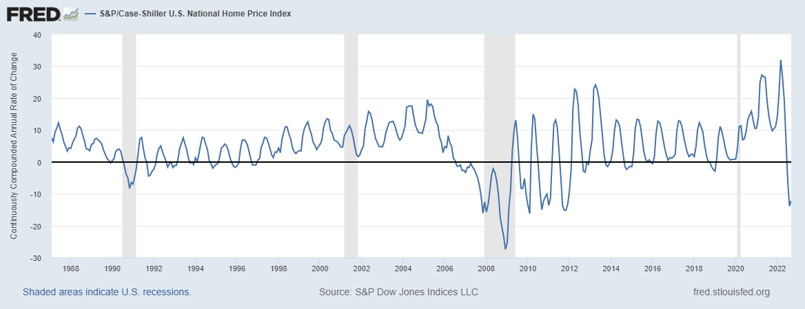
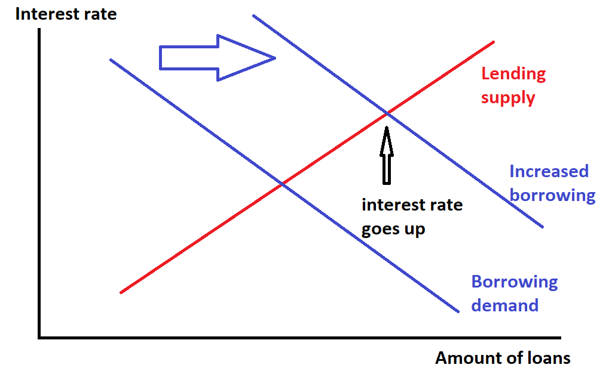

_Note: I’ll be traveling from the 24th through the 28th, so expect posting to be a bit lighter during those days._

_注意：我将从 24 日到 28 日旅行，所以预计那几天发布的内容会少一些。_

Back in the early days of my first blog, I used to encounter a British guy who went by the pseudonym of “Unlearning Economics”, who is now [a YouTube pundit](https://www.youtube.com/channel/UC4V_jMdRbbTrmBVJB6FDzgw). His criticisms of econ were very standard, well-worn British socialist stuff (if you follow British econ debates, which I do not recommend, you’ll know exactly what I’m talking about). But his moniker stuck with me, because in the 2010s it felt like we were all unlearning economics, or at least the part of economics than deals with recessions. The housing crash, the financial crisis, and the Great Recession that followed seemed to turn much of the conventional macro wisdom on its head.

早在我的第一个博客的早期，我曾经遇到一个化名“Unlearning Economics”的英国人，他现在是 YouTube 专家。他对经济学的批评是非常标准的、老生常谈的英国社会主义东西（如果你关注英国经济学辩论，我不推荐这样做，你就会明白我在说什么）。但他的绰号让我印象深刻，因为在 2010 年代，感觉我们都没有学习经济学，或者至少是经济学的一部分而不是应对经济衰退。房地产崩盘、金融危机和随之而来的大衰退似乎颠覆了很多传统的宏观智慧。

Macro models before 2008 typically _didn’t even include a financial sector_, much less allow for the possibility that a financial crash could take down an economy (Ben Bernanke’s models were one of the very few exceptions, which is why he won the Nobel prize this year). The shape of the crisis also surprised many economists, [who had expected](https://delong.typepad.com/sdj/2005/09/the_coming_doll.html) that chronic U.S. trade deficits and budget deficits would lead to a fall in the dollar and a rise in U.S. borrowing costs; instead, when the crisis happened, money flowed into the U.S., interest rates fell, and the dollar strengthened. A number of macroeconomists also thought that quantitative easing and the zero interest rate policy (QE and ZIRP) that the Fed used to fight the crisis would cause inflation; instead, the U.S. persistently under-shot its 2% target in the decade following 2008.

2008 年之前的宏观模型通常甚至不包括金融部门，更不用说考虑金融崩溃可能摧毁经济的可能性（本·伯南克的模型是极少数例外之一，这就是他今年获得诺贝尔奖的原因）年）。危机的形式也让许多经济学家感到意外，他们曾预计美国长期的贸易逆差和预算赤字将导致美元贬值和美国借贷成本上升；相反，当危机发生时，资金流入美国，利率下降，美元走强。一些宏观经济学家还认为，美联储用于应对危机的量化宽松政策和零利率政策（QE 和 ZIRP）会导致通货膨胀；相反，美国在 2008 年之后的十年里一直低于其 2% 的目标。

This was clearly quite a lot of egg on the face of the academic macroeconomics establishment and [the consensus it had settled on in the mid-2000s](https://www.nber.org/papers/w14259). For a decade, while academics tried to quickly [shoehorn finance into their models](http://noahpinionblog.blogspot.com/2014/03/how-macro-answered-its-critics.html) and began to experiment with [unorthodox ideas](https://www.bloomberg.com/opinion/articles/2018-05-01/economics-grapples-what-causes-recessions), the econ commentariat and much of the finance industry started looking to alternative ideas — to Post-Keynesians, sectoral balances thinking, and even occasionally to [goofy stuff like MMT](https://noahpinion.substack.com/p/the-nyt-article-on-mmt-is-really). It was a time of ferment and uncertainty.

这显然是学术宏观经济学机构和它在 2000 年代中期达成的共识面前的一大堆彩蛋。十年来，当学术界试图迅速将金融硬塞进他们的模型并开始试验非正统的想法时，经济学评论家和金融业的大部分人开始寻找替代想法——后凯恩斯主义、部门平衡思想，甚至偶尔像 MMT 这样愚蠢的东西。那是一个充满动荡和不确定的时期。

But then came the 2020s, and the aftermath of the Covid shock, and things changed yet again. The commentariat has been a bit slow to notice it, but the events of the past two years have again caused us to question our assumptions about how the macroeconomy works. Except this time, it’s the heterodox “lessons” of the 2010s that are being called into question — what’s happening now looks a lot more like what orthodox macroeconomics would have predicted before 2008. That does mean the Great Recession should teach us nothing, but it’s helping to clarify what we should and shouldn’t have learned.

但随后到了 2020 年代，以及 Covid 冲击的余波，事情又发生了变化。评论界注意到它的速度有点慢，但过去两年的事件再次让我们质疑我们对宏观经济如何运作的假设。除了这一次，受到质疑的是 2010 年代的非正统“教训”——现在发生的事情看起来更像是正统宏观经济学在 2008 年之前的预测。这确实意味着大衰退不应该教给我们任何东西，但它帮助澄清我们应该和不应该学到的东西。

Here are three examples.  
这是三个例子。  

The biggest lesson of 2008 was that finance matters — a lot. It was obvious that the financial crisis led directly to the Great Recession. It _should_ have been obvious before 2008 that this could happen, given the experiences of the Great Depression, Japan in 1989, and Sweden in 1990. But after 2008, you basically couldn’t find a macroeconomist willing to argue that goings-on in asset markets and the banking system don’t affect the real economy. The idea that [economic recoveries are slower after financial crises](https://www.gsb.stanford.edu/insights/why-was-last-recovery-slower-usual-actually-it-wasnt) became a universally accepted truism.

2008 年最大的教训是金融很重要——非常重要。很明显，金融危机直接导致了大衰退。鉴于大萧条、1989 年的日本和 1990 年的瑞典的经历，在 2008 年之前这应该是显而易见的。但在 2008 年之后，你基本上找不到愿意争论资产市场变化的宏观经济学家市场和银行系统不会影响实体经济。金融危机后经济复苏较慢的想法已成为普遍接受的老生常谈。

But that leaves the all-important question of how finance affects the real economy. There were _two_ big financial events in 2007-8, not just one — a crash in housing prices, and a banking crisis that began with the failure of Bear Stearns and Lehman Brothers. They happened at the same time, so it was hard to separate the effect of one from the effect of the other. Which was the true “financial crisis” here?

但这留下了金融如何影响实体经济这一最重要的问题。 2007-8 年发生了两起重大金融事件，而不仅仅是一个——房价暴跌，以及始于贝尔斯登和雷曼兄弟倒闭的银行业危机。它们同时发生，所以很难将其中一个的影响与另一个的影响区分开来。哪一次才是真正的“金融危机”？

There are some people — [for example, Dean Baker](https://equitablegrowth.org/housing-bubble-lesser-depression-either-sharp-dean-baker-hopelessly-confused/) — who believe that the housing bust, not the banking crisis that followed, was the main cause of the Great Recession. Because the rotation away from housing construction was far too small to cause anything like the Great Recession, the main channel would have had to have been the “wealth effect” — people feeling poorer because their houses were worth less, and consuming less because they felt poorer.

有些人——例如迪恩·贝克——认为房地产泡沫破灭，而不是随之而来的银行业危机，才是大萧条的主要原因。由于从住房建设中转移出去的幅度太小，不足以引发大萧条之类的事情，所以主要渠道应该是“财富效应”——人们因为房子不值钱而感觉更穷，因为他们觉得消费更少更穷。

This argument relies crucially on the notion that housing works differently than stocks. We know that stocks crashed in 2000 without a major recession, and we know that stocks (and crypto!) recently crashed without yet causing a recession, so housing would have to just be different. But maybe it is! [Case, Quigley, and Shiller (2005)](http://www.econ.yale.edu/~shiller/pubs/p1181.pdf) found that drops in stock wealth are much _less_ correlated with reduced consumption than drops in housing wealth. That could be because stocks are mostly owned by rich people, while housing forms the backbone of middle-class wealth, and the middle class is much more likely to cut back on consumption when their wealth falls.

这一论点主要依赖于住房与股票的运作方式不同的概念。我们知道 2000 年股市崩盘，但没有出现严重衰退，我们也知道股市（和加密货币！）最近崩盘，但还没有导致经济衰退，所以住房市场肯定会有所不同。但也许是！ Case、Quigley 和 Shiller（2005 年）发现，与住房财富下降相比，股票财富下降与消费减少的相关性要小得多。这可能是因为股票主要由富人拥有，而住房是中产阶级财富的支柱，而中产阶级在财富下降时更有可能减少消费。

But what’s interesting is that right now, the Fed is raising rates and bringing housing prices down, and we’re nowhere near a recession yet. The fall in house prices in September 2022 was almost as steep as the fall in house prices in the months right before the Great Recession officially began in late 2007:

但有趣的是，美联储目前正在加息并压低房价，而我们离经济衰退还差得很远。 2022 年 9 月的房价跌幅几乎与 2007 年底大衰退正式开始前几个月的房价跌幅一样大：

The data isn’t in yet, but the drop certainly continued in October, November, and December. And although many are predicting a recession in 2023, there’s still no sign of one yet.

数据尚未公布，但下降肯定在 10 月、11 月和 12 月继续。尽管许多人预测 2023 年会出现衰退，但目前还没有任何迹象。

The most plausible explanation for this is that banking crises, not just housing bubbles, are of critical importance when it comes to the connection between finance and the real economy. This is the conclusion that many in the commentariat and private industry [are now reaching](https://www.bloomberg.com/news/articles/2022-12-08/us-federal-reserve-s-inflation-fight-spurs-crypto-tech-housing-market-drops?sref=R8NfLgwS):

对此最合理的解释是，当涉及到金融与实体经济之间的联系时，银行业危机，而不仅仅是房地产泡沫，具有至关重要的意义。这是许多评论家和私营行业现在得出的结论：

> Banks are…awash in deposits, courtesy of the excess savings that Americans built up…during the pandemic…
> 
> 银行……充斥着存款，这要归功于美国人在大流行期间……积累的过剩储蓄……
> 
> “This housing downturn is different from the 2008 crash,” Bloomberg chief US economist Anna Wong and colleague Eliza Winger said in a [note](https://www.bloomberg.com/news/terminal/RMIP86DWLU6B). Mortgage credit quality is higher than it was then, they wrote…\[T\]he mortgage market still has an effective backstop in the form of the nationalized financiers Fannie Mae and Freddie Mac. 
> 
> “这次楼市低迷与 2008 年的崩盘不同，”彭博社首席美国经济学家 Anna Wong 及其同事 Eliza Winger 在一份报告中表示。他们写道，抵押贷款信贷质量比当时更高……\[T\]抵押贷款市场仍然以国有化金融机构房利美和房地美的形式提供有效的支持。
> 
> “Maybe we shouldn’t be surprised that housing isn’t more disruptive to the financial system — because we federalized it,” said former Fed official Vincent Reinhart\[.\]
> 
> 前美联储官员 Vincent Reinhart 表示：“也许我们不应该对住房对金融体系的破坏性没有更大感到惊讶——因为我们将其联邦化了。”

It’s possible that the reason housing bubbles tend to be more damaging than stock bubbles isn’t mainly because of the wealth effect — it’s because housing bubbles tend to involve a lot more _debt_. Most people take out mortgages to buy houses, and those mortgages often get held on banks’ balance sheets in one form or another, and banks use it as collateral to issue yet more debt. So when even a few people don’t pay back their mortgages, the banking system tends to go under. [Jorda, Schularick, and Taylor (2015) have a paper](http://conference.nber.org/confer/2015/EASE15/Jorda_Schularick_Taylor.pdf) in which they find that bubbles and debt are a uniquely dangerous combination, because together they tend to crash the banking system:

房地产泡沫往往比股票泡沫更具破坏性的原因可能主要不是因为财富效应——而是因为房地产泡沫往往涉及更多的债务。大多数人通过抵押贷款买房，这些抵押贷款通常以一种或另一种形式存在于银行的资产负债表上，银行用它作为抵押品来发行更多的债务。因此，即使有少数人不偿还抵押贷款，银行系统也会崩溃。 Jorda、Schularick 和 Taylor（2015 年）发表了一篇论文，他们在论文中发现泡沫和债务是一种独特的危险组合，因为它们加在一起往往会使银行系统崩溃：

> History shows that not all bubbles are alike. Some have enormous costs for the economy, while others blow over. We demonstrate that what makes some bubbles more dangerous than others is credit. When fueled by credit booms asset price bubbles increase financial crisis risks; upon collapse they tend to be followed by deeper recessions and slower recoveries. Credit-financed house price bubbles have emerged as a particularly dangerous phenomenon.
> 
> 历史表明，并非所有的泡沫都是一样的。有些给经济带来了巨大的成本，而另一些则失败了。我们证明，使某些泡沫比其他泡沫更危险的是信用。在信贷繁荣的推动下，资产价格泡沫会增加金融危机的风险；崩溃之后往往会出现更严重的衰退和更慢的复苏。信贷融资的房价泡沫已成为一种特别危险的现象。

In other words, the 2010s taught us to be very afraid of bubbles, but now it seems like maybe the main thing we need to be afraid of, when it comes to those very severe recessions and slow recoveries, is a banking collapse. That doesn’t mean bubbles aren’t dangerous, but it suggests that we need to be especially concerned about excessive leverage and fragility in the finance industry itself.

换句话说，2010 年代教会我们要非常害怕泡沫，但现在看来，当涉及到那些非常严重的衰退和缓慢的复苏时，我们需要担心的主要事情可能是银行业倒闭。这并不意味着泡沫不危险，但它表明我们需要特别关注金融业本身的过度杠杆和脆弱性。

One notable thing about the recovery from the Great Recession is that having governments borrow a lot of money turned out to be a good thing; countries that engaged in austerity generally [fared poorly](https://www.theguardian.com/business/ng-interactive/2015/apr/29/the-austerity-delusion) relative to countries that turned on the spending taps. The effectiveness of fiscal stimulus, especially in a deep recession when interest rates hit the zero lower bound, was one of the enduring and important lessons of the 2010s.

从大衰退中复苏的一个值得注意的事情是，让政府借入大量资金被证明是一件好事；与打开支出水龙头的国家相比，实行紧缩政策的国家通常表现不佳。财政刺激的有效性，尤其是在利率触及零下限的深度衰退中，是 2010 年代持久而重要的教训之一。

Some people worried that all that borrowing would cause interest rates to soar, but it didn’t. This caused a lot of macro critics — especially Post-Keynesians, British socialists, MMT people, etc. — to [declare that the “loanable funds” model of government finance is dead](https://larspsyll.wordpress.com/2014/09/21/the-loanable-funds-fallacy/).

有些人担心所有借贷会导致利率飙升，但事实并非如此。这引起了很多宏观批评者——尤其是后凯恩斯主义者、英国社会主义者、MMT 人士等——宣称政府财政的“可贷资金”模式已经死了。

Let’s take a fun little detour and learn what that means! The loanable funds model is a little toy model that we teach in introductory macroeconomics classes, to help undergrads understand how borrowing affects interest rates. Basically the idea is that a loan is a commodity, like apples or haircuts, and so it has a supply curve and a demand curve like any other commodity. The price of loans is just the interest rate, so the supply-and-demand graph looks like this:

让我们绕个有趣的小弯路，了解这意味着什么！可贷资金模型是我们在入门宏观经济学课程中教授的一个小玩具模型，用于帮助本科生了解借贷如何影响利率。基本上这个想法是，贷款是一种商品，就像苹果或理发一样，因此它像任何其他商品一样具有供给曲线和需求曲线。贷款的价格就是利率，所以供求图是这样的：

As you can see, in this little toy model, when borrowers borrow more it raises the interest rate. That makes sense — if I came to you and wanted to borrow $1, you might not charge me interest, but if I came to you and wanted to borrow $1000, you might be worried I wouldn’t pay you back, and so you would probably demand some interest as compensation for that risk, and for your loss of liquidity (i.e. the fact that you have to go without that $1000 for a while).

如您所见，在这个小玩具模型中，当借款人借入更多资金时，利率就会提高。这是有道理的——如果我来找你想借 1 美元，你可能不会收我利息，但如果我来找你想借 1000 美元，你可能会担心我不会还你，所以你会可能需要一些利息来补偿该风险和您的流动性损失（即您必须暂时没有那 1000 美元的事实）。

Now, the real world doesn’t quite work like this. There are a whole bunch of different types of loans out there — government bonds, corporate bonds, bank loans, mortgages, etc. Each one has its own interest rate, and its own supply and demand curves. The loanable funds model assumes that these loans are all, in some sense, _substitutes_, like pencils and pens. In other words, it assumes that government borrowing is competing directly with corporate borrowing, mortgage borrowing, etc. If that’s true, then more government borrowing will raise the interest rate, not just for government bonds, but for companies, homebuyers, etc. — just like when people go buy up all the pens in the store, it’ll make pencils go up in price too.

现在，现实世界并不是这样运作的。有一大堆不同类型的贷款——政府债券、公司债券、银行贷款、抵押贷款等。每一种都有自己的利率和供求曲线。可贷资金模型假设这些贷款在某种意义上都是替代品，例如铅笔和钢笔。换句话说，它假设政府借款与企业借款、抵押贷款等直接竞争。如果这是真的，那么更多的政府借款将提高利率，不仅是政府债券，还有公司、购房者等。就像当人们把商店里所有的钢笔都买光时，铅笔的价格也会上涨。

That’s not always a good assumption. If government borrows money to spend on fiscal stimulus, and this increases demand for companies’ products, it could actually make people want to lend _more_ to those companies, because their economic prospects are now better. Sometimes, instead of the government “crowding out” private borrowers, it crowds them _in_.

这并不总是一个好的假设。如果政府借钱用于财政刺激，这会增加对公司产品的需求，实际上可能会让人们想要向这些公司提供更多贷款，因为它们的经济前景现在更好了。有时，政府不是“排挤”私人借款人，而是将他们挤进来。

So the loanable funds model isn’t always useful — at least, not if we’re trying to analyze the effect of one type of borrowing on the overall interest rate environment. But some people take this a step further and assert that government borrowing doesn’t affect interest rates at all, or even _lowers_ rates. For example, in 2019 Stephanie Kelton (the MMT guru) [wrote the following in Bloomberg](https://www.bloomberg.com/opinion/articles/2019-03-01/paul-krugman-s-four-questions-about-mmt?sref=R8NfLgwS):

因此，可贷资金模型并不总是有用——至少，如果我们试图分析一种类型的借贷对整体利率环境的影响，则不会。但有些人更进一步，断言政府借款根本不会影响利率，甚至不会降低利率。例如，2019 年 Stephanie Kelton（MMT 大师）在彭博社写道：

> Does expansionary fiscal policy reduce interest rates? Answer: Yes. Pumping money into the economy _increases_ bank reserves and _reduces_ banks' bids for federal funds. Any banker will tell you this.
> 
> 扩张性财政政策会降低利率吗？答：是的。向经济注入资金会增加银行准备金并降低银行对联邦资金的出价。任何银行家都会告诉你这一点。

Well, I’m not sure if most bankers would agree with this, and I doubt many would be willing to fully embrace MMT. But the experience of Europe and the U.S. in the 2010s, and of Japan in the 1990s, certainly seemed to reduce the general worry among the econ commentariat and the finance industry that government borrowing would lead to high interest rates. After all, these rich countries borrowed and borrowed and borrowed, and their rates just went down and down. The legendary “bond vigilantes” that were supposed to swoop in and raise rates to punish excessive borrowing never showed their faces.

好吧，我不确定大多数银行家是否会同意这一点，而且我怀疑许多人是否愿意完全接受现代货币理论。但欧洲和美国在 2010 年代以及日本在 1990 年代的经历似乎确实减轻了经济评论家和金融业对政府借贷将导致高利率的普遍担忧。毕竟，这些富裕国家借了又借又借，而他们的利率却越来越低。传说中的“债券义警”本应挺身而出并提高利率以惩罚过度借贷，但从未露面。

Then came the 2020s. Earlier this year, British Prime Minister Liz Truss released a package of tax cuts (which, I should note, the MMT people [generally support](https://www.bloomberg.com/opinion/articles/2019-02-01/rich-must-embrace-deficits-to-escape-taxes?sref=R8NfLgwS)), with [disastrous effects](https://noahpinion.substack.com/p/why-the-uk-is-having-an-economic). The interest rates on UK government bonds (called “gilts”) soared:

然后是2020年代。今年早些时候，英国首相 Liz Truss 发布了一系列减税措施（我应该指出，MMT 的人普遍支持），带来了灾难性的后果。英国政府债券（称为“金边债券”）的利率飙升：

Keep in mind that these are long-term interest rates, so this wasn’t the doing of the central bank.

请记住，这些是长期利率，所以这不是中央银行的作为。

Why did this happen, when all that government borrowing in the 2010s never had this sort of effect? There are two likely answers here. First, the financial crisis put pressure on banks and other financial companies, forcing them to put their money in very safe and liquid assets — i.e., government bonds. Second, international investors also felt this need, and so they poured money into the safest places around — i.e., the U.S. and the EU, which hold the world’s [reserve currencies](https://en.wikipedia.org/wiki/Reserve_currency).

为什么会发生这种情况，而 2010 年代的所有政府借贷从未产生过这种影响？这里有两个可能的答案。首先，金融危机给银行和其他金融公司带来压力，迫使它们将资金投入非常安全和流动性强的资产——即政府债券。其次，国际投资者也感受到了这种需求，因此他们将资金投入到周围最安全的地方——即持有世界储备货币的美国和欧盟。

Neither of those things were in effect for the UK in 2022. The pound isn’t a major reserve currency, and there isn’t a flight to safety or liquidity in effect right now because there isn’t a major recession in effect right now. So when the UK government declared its intention to borrow too much, people became less willing to lend it money, and rates went up.

这些事情在 2022 年对英国都没有影响。英镑不是主要的储备货币，目前没有避险或流动性有效，因为目前没有严重的经济衰退.因此，当英国政府宣布打算过度借贷时，人们借钱的意愿就会降低，利率就会上升。

Of course, an MMTer might respond that interest rates only went up because the Bank of England allowed it — after all, it could have bought gilts to keep rates down. But this takes us to the final 2010s macro lesson that we need to unlearn — the idea that expansionary monetary policy doesn’t cause high inflation.

当然，MMTer 可能会回应说，利率上升只是因为英格兰银行允许——毕竟，它本可以购买英国国债来压低利率。但这将我们带到了 2010 年代我们需要忘掉的最后一个宏观教训——扩张性货币政策不会导致高通胀的观点。

Another big lesson many people took away from the 2010s was not to be very worried that easy monetary policy would lead to inflation. In 2008-13, the Fed lowered rates to zero, promised to keep them at zero, and engaged in a then-unprecedented amount of quantitative easing (i.e. having the Fed buy various long-term government bonds and private-sector bonds with money that was essentially “printed”). A lot of orthodox thinkers were quite worried about this, and wrote [an open letter to then-Fed Chair Ben Bernanke in 2010](https://www.wsj.com/articles/BL-REB-12460) warning about inflation. It never happened.

许多人从 2010 年代吸取的另一个重要教训是不要太担心宽松的货币政策会导致通货膨胀。在 2008-13 年，美联储将利率降至零，并承诺将其维持在零，并实施了当时规模空前的量化宽松政策（即让美联储用可承受的资金购买各种长期政府债券和私营部门债券）本质上是“印刷”）。许多正统思想家对此颇为担忧，并于2010年写了一封致时任美联储主席伯南克的公开信警告通货膨胀。它从未发生过。

To some, this failure of inflation to materialize meant that inflation simply wasn’t as big of a danger as we had been led to believe — that the price level mostly responds to fiscal policy rather than monetary policy, or to underlying factors like population aging, or even to special circumstances like political instability. I can’t really point you to people who strongly insisted that inflation had been banished forever, but its sudden, fierce return definitely seemed to catch everyone off guard — including the Fed, which waited about a year after the return of inflation to start hiking rates.

对一些人来说，通货膨胀未能实现意味着通货膨胀根本没有我们被引导相信的那么大的危险——价格水平主要对财政政策而不是货币政策或人口老龄化等潜在因素做出反应，甚至是政治不稳定等特殊情况。我真的不能向你指出那些强烈坚持通货膨胀已被永远消除的人，但它的突然、猛烈回归显然让所有人措手不及——包括美联储，它在通货膨胀回归大约一年后才开始加息费率。

During Covid and its immediate aftermath, the Fed again engaged in enormous amounts of unconventional monetary easing, [expanding its toolkit](https://www.brookings.edu/research/fed-response-to-covid19/) even compared to what it had employed after the financial crisis. Many predicted, based on the experience of the 2010s, that this would no more result in runaway inflation than it had under Bernanke. This time, though, inflation did rise — a lot. People [have argued](https://www.frbsf.org/economic-research/publications/economic-letter/2022/march/why-is-us-inflation-higher-than-in-other-countries/) back and forth [about how much](https://www.frbsf.org/economic-research/publications/economic-letter/2021/october/is-american-rescue-plan-taking-us-back-to-1960s/) demand shocks and supply shocks [were responsible](https://www.chicagofed.org/publications/chicago-fed-letter/2021/453) for the inflation, but the general consensus answer seems to be that both contributed. High demand was probably due to some combination of fiscal and monetary policy. But the fact that inflation only seems to be coming down [after a series of interest rate hikes](https://noahpinion.substack.com/p/the-conquest-of-the-post-pandemic) — long after fiscal stimulus mostly dried up — suggests that monetary policy did play a role.

在 Covid 及其直接后果期间，美联储再次实施了大量非常规货币宽松政策，扩大了其工具包，甚至与金融危机后所采用的相比。许多人根据 2010 年代的经验预测，与伯南克领导下的情况相比，这不会导致失控的通胀。不过这一次，通胀确实上升了——上升了很多。人们一直在争论需求冲击和供应冲击在多大程度上导致了通胀，但普遍的共识答案似乎是两者都有贡献。高需求可能是由于财政和货币政策的某种结合。但事实上，通胀似乎只是在一系列加息之后才开始下降——在财政刺激措施基本枯竭很久之后——表明货币政策确实发挥了作用。

An even starker example is provided by Turkey, which has clung to the bizarre (and [MMT-endorsed](https://twitter.com/Noahpinion/status/1575301594681290753)) idea that low interest rates are deflationary — an idea that a few macroeconomists [began to seriously entertain](https://www.stlouisfed.org/publications/regional-economist/july-2016/neo-fisherism-a-radical-idea-or-the-most-obvious-solution-to-the-low-inflation-problem) back during the 2010s — but which is now [experiencing soaring inflation](https://www.euronews.com/2022/11/09/everything-is-overheating-why-is-turkeys-economy-in-such-a-mess) instead. Oops!

土耳其提供了一个更明显的例子，它一直坚持低利率会导致通货紧缩的奇怪（和 MMT 认可的）想法——早在 2010 年代，一些宏观经济学家就开始认真考虑这个想法——但现在它正在飙升通货膨胀代替。哎呀！

This all looks like a win for New Keynesian theory, which posits that monetary policy is the main source of changes in aggregate demand (at least, away from the zero lower bound). The simple explanation for why easy money didn’t raise inflation in the 2010s is that aggregate demand was simply depressed; QE wasn’t enough to cancel out the huge hole the financial crisis had left, even with an assist from fiscal stimulus. In 2021-22, aggregate demand bounced back very strongly from the Covid shock — with unemployment low and growth high, adding more demand via easy monetary policy was adding fuel to the fire. Note: [I interviewed Paul Krugman for Bloomberg](https://www.bloomberg.com/opinion/articles/2020-05-27/paul-krugman-is-pretty-upbeat-about-coronavirus-economic-recovery?sref=R8NfLgwS) in May 2020, when many still thought Covid would lead to another long depression, and our most famous Keynesian got it exactly right:

这一切看起来像是新凯恩斯主义理论的胜利，该理论认为货币政策是总需求变化的主要来源（至少，远离零下限）。宽松货币政策在 2010 年代没有推高通胀的简单解释是总需求低迷；即使在财政刺激的帮助下，量化宽松也不足以消除金融危机留下的巨大漏洞。在 2021-22 年，总需求从 Covid 的冲击中强劲反弹——失业率低而增长高，通过宽松的货币政策增加更多需求是火上浇油。注：我在 2020 年 5 月为彭博社采访了保罗克鲁格曼，当时许多人仍然认为 Covid 会导致另一场长期萧条，而我们最著名的凯恩斯主义者完全正确：

> My take is that the Covid slump is more like 1979-82 than 2007-09: it wasn’t caused by imbalances that will take years to correct. So that would suggest fast recovery once the virus is contained…\[R\]ight now I don’t see the case for a multiyear depression. People expecting this slump to look like the last one seem to me to be fighting the last war.
> 
> 我的看法是，Covid 的衰退更像是 1979-82 年而不是 2007-09 年：它不是由需要数年时间才能纠正的失衡造成的。因此，一旦病毒被遏制，这就意味着快速恢复……\[R\]现在我不认为会出现多年萧条。人们期望这次衰退看起来像最后一次衰退，在我看来，这是在打最后一场战争。

Interestingly, 2020-22 could also be seen as a win for “old monetarism”, the Milton Friedman school of thought that says that “[high-powered money](https://www.econlib.org/library/Columns/y2006/Friedmantranscript.html)” — currency plus bank reserves — is the culprit when it comes to inflation. All the QE of the 2010s barely raised the M2 money supply at all, but M2 absolutely exploded in 2020 and 2021:

有趣的是，2020-22 年也可以被视为“旧货币主义”的胜利，米尔顿弗里德曼学派认为“高能货币”——货币加上银行储备——是通货膨胀的罪魁祸首。 2010 年代的所有 QE 几乎没有提高 M2 货币供应量，但 M2 在 2020 年和 2021 年绝对爆发：

Friedman would probably have looked at this graph and predicted that we’d get inflation in the early 2020s but not in the 2010s. And he’d have been right.

弗里德曼可能会查看此图并预测我们会在 2020 年代初期出现通货膨胀，但不会在 2010 年代出现。他是对的。

So to sum up, the early 2020s have basically taught us to worry about asset bubbles a bit less than we did in the 2010s, and to worry about excessive government stimulus a bit more. But that doesn’t mean that everything we learned in the 2010s was bunk. Private banking systems really are fragile without the government to stabilize them. Aggregate demand definitely does matter, and the government really can affect it, with both fiscal and monetary policy. Basic Keynesian macroeconomic intuition still looks pretty good in the 2020s, just as it did in the 2010s and before. Of course that intuition is [very far from settled science](https://noahpinion.substack.com/p/macroeconomics-is-still-in-its-infancy), but it’s still the best thing we’ve got.

综上所述，2020 年代初基本上教会了我们比 2010 年代少一点担心资产泡沫，多一点担心政府过度刺激。但这并不意味着我们在 2010 年代学到的一切都是胡说八道。如果没有政府的稳定，私人银行系统确实很脆弱。总需求确实很重要，政府确实可以通过财政和货币政策来影响它。基本的凯恩斯主义宏观经济直觉在 2020 年代看起来仍然不错，就像在 2010 年代及之前一样。当然，直觉离成熟的科学还很远，但它仍然是我们所拥有的最好的东西。
