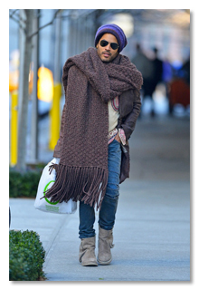
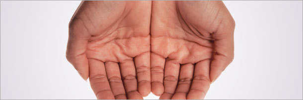

**2022, motherfuckers. Yeah! LET'S DO THIS.**

**2022，混蛋。 是的！ 我们开工吧。**

"Do what?" you ask. I DON'T KNOW. **LET'S FIGURE THAT OUT TOGETHER, MOTHERFUCKERS.**

“做什么？” 你问。 我不知道。 **让我们一起来解决这个问题，混蛋。**

Feel free to stop reading this if your career is going great, you're thrilled with your life, and you're happy with your relationships. Enjoy the rest of your day, friend, this article is not for you. You're doing a great job, we're all proud of you. So you don't feel like you wasted your click, here's a picture of Lenny Kravitz wearing a gigantic scarf.

如果您的事业进展顺利，您对自己的生活感到兴奋，并且对自己的人际关系感到满意，请随时停止阅读本文。 享受剩下的一天吧，朋友，这篇文章不适合你。 你做得很好，我们都为你感到骄傲。 所以你不会觉得自己浪费了点击，这是 Lenny Kravitz 戴着一条巨大围巾的照片。

Via [Upscalehype.com](http://www.upscalehype.com/2012/11/lenny-kravitvz-wearing-rick-owens-desert-engineer-cargo-boots/)

For the rest of you, I want you to try something: Name five impressive things about yourself. Write them down or just shout them out loud to the room. But here's the catch -- you're not allowed to list anything you _are_ (i.e., I'm a nice guy, I'm honest), but instead can only list things that you _do_ (i.e., I just won a national chess tournament, I make the best chili in Massachusetts). If you found that difficult, well, this is for you, and you are going to fucking hate hearing it. My only defense is that this is what I wish somebody had said to me around 1995 or so.

对于你们其他人，我希望你们尝试一些事情：说出关于你自己的五件令人印象深刻的事情。 把它们写下来，或者对着房间大声喊出来。 但这里有一个问题——你不能列出你 _是_ 什么（即，我是一个好人，我是诚实的），而只能列出你 _所做_ 的事情（即，我刚刚赢得了全国象棋锦标赛，我制作了马萨诸塞州最好的辣椒）。 如果你觉得这很难，好吧，这是给你的，你会他妈的讨厌听到它。 我唯一的辩护是，这就是我希望有人在 1995 年左右对我说的话。

_Note: I originally posted this in December of 2012, and to date it has drawn more than 25 million page views. So, uh, it struck a nerve. I regularly update it as times change._

_注意：我最初发布于 2012 年 12 月，迄今为止它已经吸引了超过 2500 万的页面浏览量。 所以，呃，它触动了神经。 随着时间的变化，我会定期更新它。_

## 6 The World Only Cares About What It Can Get from You

## 6 世界只关心它能从你那里得到什么

Getty

Let's say that the person you love the most has just been shot. He or she is lying in the street, bleeding and screaming. A guy rushes up and says, "Step aside." He looks over your loved one's bullet wound and pulls out a pocket knife -- he's going to operate right there in the street.

假设您最爱的人刚被枪杀。 他或她躺在街上，流着血，尖叫着。 一个人冲上去说：“让开。” 他检查了您所爱之人的枪伤，并拿出了一把小折刀——他要在街上动手术。

Continue Reading Below

You ask, "Are you a doctor?"

你问：“你是医生吗？”

The guy says, "No."

那家伙说，“没有。”

You say, "But you know what you're doing, right? You're an old Army medic, or ..."

你说，“但你知道你在做什么，对吧？你是一名老军医，或者……”

At this point the guy becomes annoyed. He tells you that he is a nice guy, he is honest, he is always on time. He tells you that he is a great son to his mother and has a rich life full of fulfilling hobbies, and he boasts that he never uses foul language.

这时候男人就生气了。 他告诉你他是一个好人，他很诚实，他总是准时。 他告诉你他是他母亲的好儿子，生活丰富多彩，爱好也很充实，他还吹嘘自己从不说脏话。

Confused, you say, "How does any of that fucking matter when my is lying here bleeding! I need somebody who knows how to operate on bullet wounds! Can you do that or not?!?"

困惑，你说，“当我躺在这里流血时，那些他妈的有什么关系！我需要一个知道如何对枪伤进行手术的人！你能不能做？！？”

Now the man becomes agitated -- why are you being shallow and selfish? Do you not care about any of his other good qualities? Didn't you just hear him say that he always remembers his girlfriend's birthday? In light of all of the good things he does, does it really matter _if he knows how to perform surgery_?

现在这个人变得焦躁——你为什么要浅薄和自私？ 你不在乎他的其他优点吗？ 你刚才不是听他说他永远记得他女朋友的生日吗？ 鉴于他所做的所有好事，他 _是否知道如何进行手术_ 真的很重要吗？

In that panicked moment, you will take your bloody hands and shake him by the shoulders, screaming, "_Yes, I'm saying that none of that other shit matters_, because in this specific situation, I just need somebody who _can stop the bleeding_, you crazy fucking asshole."

在那惊慌失措的时刻，你会用你沾满鲜血的手抓住他的肩膀，尖叫着，“ _是的，我是说其他那些狗屎都不重要_ ，因为在这种特殊情况下，我只需要一个 _可以止血的_ 人，你这个疯狂的混蛋。”

So here is my terrible truth about the adult world: _You are in that very situation every single day_. Only you are the confused guy with the pocket knife. All of society is the bleeding gunshot victim.

所以这是我关于成人世界的可怕事实： _你每天都处于那种境地_ 。 只有你是那个拿着小刀的糊涂家伙。 全社会都是流血的枪击受害者。

If you want to know why society seems to shun you, or why you seem to get no respect, it's because society is full of people _who need things_. They need houses built, they need food to eat, they need entertainment, they need fulfilling sexual relationships. You arrived at the scene of that emergency, holding your pocket knife, by virtue of your birth -- the moment you came into the world, you became part of a system designed purely to see to people's needs.

如果你想知道为什么社会似乎避开你，或者为什么你似乎得不到尊重，那是因为社会充满了 _需要东西_ 的人。 他们需要建造房屋，需要食物，需要娱乐，需要充实的性关系。 你到达那个紧急情况现场，拿着你的小刀，由于你的出生——从你来到这个世界的那一刻起，你就成为了一个纯粹为了满足人们需求而设计的系统的一部分。

Either you will go about the task of seeing to those needs by learning a unique set of skills, _or the world will reject you_, no matter how inoffensive and courteous you are. You will be poor, you will be alone, you will be left out in the cold. Does that seem mean, or crass, or materialistic? What about love and kindness -- don't those things matter? Of course. As long as they result in you doing things for people that they can't get elsewhere. For you see ...

要么你将通过学习一套独特的技能来完成满足这些需求的任务， _要么世界将拒绝你_ ，无论你多么无礼和礼貌。 你会很穷，你会孤独，你会被冷落。 这看起来是刻薄、粗俗或唯物主义吗？ 爱和仁慈呢——难道这些都不重要吗？ 当然。 只要它们导致您为人们做他们无法在其他地方做的事情。 你看...

Continue Reading Below

Advertisement

**Related:**[**7 Reasons The World Is Full Of Hate Groups And Cults**](http://www.cracked.com/blog/7-reasons-world-full-hate-groups-cults/?utm_campaign=cracked_referral_related&utm_source=website&utm_medium=article&utm_partner=cracked)

**相关：** [**世界上充满仇恨团体和邪教的 7 个原因**](http://www.cracked.com/blog/7-reasons-world-full-hate-groups-cults/?utm_campaign=cracked_referral_related&utm_source=website&utm_medium=article&utm_partner=cracked)

## 5 The Hippies Were Wrong

## 5 嬉皮士错了

Here is the greatest scene in the history of movies (WARNING: EXTREME NSFW LANGUAGE):

这是电影史上最伟大的场景（警告：极端的 NSFW 语言）：

<iframe data-nosnippet="true" data-src="https://www.youtube.com/embed/elrnAl6ygeM" frameborder="0" allow="accelerometer; autoplay; encrypted-media; gyroscope; picture-in-picture" allowfullscreen="" src="https://www.youtube.com/embed/elrnAl6ygeM" data-loaded="true"></iframe>

For those of you who can't watch videos, it's the famous speech Alec Baldwin gives in the cinematic masterpiece _Glengarry Glenn Ross_. Baldwin's character -- whom you assume is the villain -- addresses a room full of dudes and tears them a new asshole, telling them that they're all about to be fired unless they "close" the sales they've been assigned:

对于那些无法观看视频的人，这是亚历克鲍德温在电影杰作 _Glengarry Glenn Ross_ 中发表的著名演讲。 鲍德温的角色——你认为他是恶棍——对一屋子的家伙讲话，把他们撕成一个新混蛋，告诉他们除非他们“关闭”分配给他们的销售，否则他们都将被解雇：

Continue Reading Below

Advertisement

_"Nice guy? I don't give a shit. Good father? Fuck you! Go home and play with your kids. If you want to work here, **close**."_

_“好人？我不在乎，好父亲？去你的！回家带孩子玩，想在这里工作，就 **关门** 。”_

It's brutal, rude, and borderline sociopathic, and also _it is an honest and accurate expression of what the world is going to expect from you_. The difference is that, in the real world, people consider it so wrong to talk to you that way that they've decided it's better to simply let you keep failing.

这是残忍、粗鲁和近乎反社会的，同时也是 _对世界对你的期望的诚实和准确的表达_ 。 不同之处在于，在现实世界中，人们认为以这种方式与您交谈是错误的，以至于他们认为最好让您继续失败。

That scene changed my life. I'd program my alarm clock to play it for me every morning if I knew how. Alec Baldwin was nominated for an Oscar for that movie_and that's the only scene he's in_. [As smarter people have pointed out](http://thelastpsychiatrist.com/2012/11/hipsters_on_food_stamps.html), the genius of that speech is that half of the people who watch it think that the point of the scene is "Wow, what must it be like to have such an asshole boss?" and the other half think, "Fuck yes, let's go out and sell some goddamned real estate!"

那一幕改变了我的一生。 如果我知道的话，我会设置我的闹钟每天早上为我播放。 亚历克·鲍德温 (Alec Baldwin) 因那部电影获得奥斯卡提名， _而那是他唯一出现的场景_ 。 [正如更聪明的人所指出](http://thelastpsychiatrist.com/2012/11/hipsters_on_food_stamps.html) 的那样，该演讲的绝妙之处在于，观看它的人中有一半认为现场的重点是“哇，有这样一个混蛋老板会是什么样子？” 而另一半则认为，“去他妈的是的，我们出去卖掉一些该死的房地产吧！”

Or, as [the Last Psychiatrist blog put it](http://thelastpsychiatrist.com/2012/11/hipsters_on_food_stamps.html):

或者，正如 [Last Psychiatrist 博客所说](http://thelastpsychiatrist.com/2012/11/hipsters_on_food_stamps.html) ：

_"If you were in that room, some of you would understand this as a work, but feed off the energy of the message anyway, welcome the coach's cursing at you, 'this guy is awesome!'; while some of you would take it personally, this guy is a jerk, you have no right to talk to me like that, or -- the standard maneuver when narcissism is confronted with a greater power -- quietly seethe and fantasize about finding information that will out him as a hypocrite. So satisfying."_

_“如果你在那个房间里，你们中的一些人会把这理解为一项工作，但无论如何都要从信息的能量中汲取能量，欢迎教练对你的诅咒，‘这家伙太棒了！’；而你们中的一些人会接受它就个人而言，这家伙是个混蛋，你无权这样跟我说话，或者——当自恋者面对更强大的力量时的标准策略——静静地沸腾并幻想找到可以证明他是伪君子的信息。太满足了。”_

That excerpt is from an insightful critique of "hipsters" and why they seem to have so much trouble getting jobs (that doesn't begin to do it justice, [go read the whole thing](http://thelastpsychiatrist.com/2012/11/hipsters_on_food_stamps.html)), and the point is that the difference in those two attitudes -- bitter vs. motivated -- largely determines whether or not you'll succeed in the world. For instance, some people want to respond to that speech with Tyler Durden's line from_Fight Club_: "You are not your job."

这段摘录来自对“赶时髦的人”的有见地的批评，以及为什么他们在找工作时遇到如此多的困难（这并不能说明问题， [去读整篇文章](http://thelastpsychiatrist.com/2012/11/hipsters_on_food_stamps.html) ），重点是这两者的区别态度——苦涩还是积极——在很大程度上决定了你能否在这个世界上取得成功。 例如，有些人想用 _《搏击俱乐部_ 》中泰勒·德登 (Tyler Durden) 的台词来回应那次演讲：“你不是你的工作。”

But, well, actually, you totally are. Granted, your "job" and your means of employment might not be the same thing, but in both cases, you are nothing more than the sum total of your useful skills. For instance, being a good mother is a job that requires a skill. It's something a person can do that is useful to other members of society. But make no mistake: Your "job" -- the useful thing you do for other people -- _is all you are_.

但是，嗯，实际上，你完全是。 诚然，你的“工作”和你的就业方式可能不是一回事，但在这两种情况下，你只不过是你有用技能的总和。 例如，做一个好妈妈是一项需要技巧的工作。 这是一个人可以做的对社会其他成员有用的事情。 但请不要搞错：你的“工作”——你为他人所做的有用的事情—— _就是你的全部_ 。

Continue Reading Below

Advertisement

There is a reason why surgeons get more respect than comedy writers. There is a reason mechanics get more respect than unemployed hipsters. There is a reason your job will become your label if your death makes the news ("NFL Linebacker Dies in Murder/Suicide"). Tyler said, "You are not your job," but he also founded and ran a successful soap company and became the head of an international social and political movement. He was _totally_ his job.

外科医生比喜剧作家更受尊重是有原因的。 机械师比失业的赶时髦的人更受尊重是有原因的。 如果你的死成为新闻（“NFL 线卫死于谋杀/自杀”），你的工作将成为你的标签是有原因的。 泰勒说，“你不是你的工作，”但他还创立并经营了一家成功的肥皂公司，并成为国际社会和政治运动的负责人。 他 _完全_ 是他的工作。

Or think of it this way: Remember when Chick-fil-A came out against gay marriage? And how despite the protests, the company continues to sell millions of sandwiches every day? It's not because the country agrees with them; it's because they do their job of making delicious sandwiches well. And that's all that matters. You don't have to like it. I don't like it when it rains on my birthday. It rains anyway. Clouds form and precipitation happens. People have needs and thus assign value to the people who meet them. These are simple mechanisms of the universe and they do not respond to our wishes.

或者这样想：还记得 Chick-fil-A 反对同性婚姻的时候吗？ 尽管有抗议，该公司如何继续每天销售数百万个三明治？ 这不是因为国家同意他们；而是因为他们同意。 这是因为他们做好了制作美味三明治的工作。 这就是最重要的。 你不必喜欢它。 我不喜欢我生日那天下雨。 反正下雨了。 云形成，降水发生。 人们有需求，因此会为满足需求的人赋予价值。 这些是宇宙的简单机制，它们不会响应我们的愿望。

If you protest that you're not a shallow capitalist materialist and that you disagree that money is everything, I can only say: Who said anything about money? You're missing the larger point.

如果你抗议说你不是一个浅薄的资本主义唯物主义者，你不同意金钱就是一切，我只能说：谁说过金钱？ 你错过了更重要的一点。

**Related:**[**How Mediocrity Can Quietly Destroy Us All**](http://www.cracked.com/blog/how-mediocrity-can-quietly-destroy-us-all/?utm_campaign=cracked_referral_related&utm_source=website&utm_medium=article&utm_partner=cracked)

**相关：** [**平庸如何悄悄摧毁我们所有人**](http://www.cracked.com/blog/how-mediocrity-can-quietly-destroy-us-all/?utm_campaign=cracked_referral_related&utm_source=website&utm_medium=article&utm_partner=cracked)

## 4 What You Produce Does Not Have to Make Money, But It Does Have to Benefit People

## 4 你生产的东西不一定要赚钱，但一定要造福于人

Let's try a non-money example so you don't get hung up on that. The demographic that Cracked writes for is heavy on 20-something males. So on our message boards and in my many inboxes I read several dozen stories a year from miserable, lonely guys who insist that women won't come near them despite the fact that they are just the nicest guys in the world (these days, they've adopted the name, "Incels"). I can explain what is wrong with this mindset, but it would probably be better if I let Alec Baldwin explain it:

让我们尝试一个非金钱的例子，这样你就不会挂断电话了。 Cracked 所针对的人群以 20 多岁的男性为主。 因此，在我们的留言板和我的许多收件箱中，我每年都会读到几十个悲惨、孤独的男人的故事，他们坚持认为女人不会靠近他们，尽管事实上他们只是世界上最好的男人（如今，他们采用了名称“Incels”）。 我可以解释这种心态有什么问题，但如果我让亚历克·鲍德温 (Alec Baldwin) 解释它可能会更好：

<iframe data-nosnippet="true" data-src="https://www.youtube.com/embed/elrnAl6ygeM" frameborder="0" allow="accelerometer; autoplay; encrypted-media; gyroscope; picture-in-picture" allowfullscreen="" src="https://www.youtube.com/embed/elrnAl6ygeM" data-loaded="true"></iframe>

Continue Reading Below

Advertisement

In this case, Baldwin is playing the part of the attractive women in your life. They won't put it as bluntly as he does -- society has trained us not to be this honest with people -- but the equation is the same. "Nice guy? Who gives a shit? If you want to work here, _close_."

在这种情况下，鲍德温扮演的是您生活中迷人女性的角色。 他们不会像他那样直言不讳——社会训练我们不要对人如此诚实——但方程式是一样的。 “好人？谁在乎？如果你想在这里工作， _关闭_ 。”

So, what do you bring to the table? Because the girl in the bookstore that you've been daydreaming about moisturizes her face for an hour every night and feels guilty when she eats anything other than salad for lunch. She's going to be a surgeon in 10 years. What do you do?

那么，你带来了什么？ 因为你梦寐以求的书店里的那个女孩每晚都会给她的脸涂上一个小时的润肤霜，而且当她午餐吃沙拉以外的任何东西时都会感到内疚。 10 年后她将成为一名外科医生。 你做什么工作？

"What, so you're saying that I can't get girls like that unless I have a nice job and make lots of money?"

“什么，所以你的意思是除非我有一份好工作赚很多钱，否则我无法得到这样的女孩？”

_No_, your brain jumps to that conclusion so you have an excuse to write off everyone who rejects you by assuming they're just being shallow and selfish. I'm asking _what do you offer_? Are you smart? Funny? Interesting? Talented? Ambitious? Creative? OK, now _what do you do_ to demonstrate those attributes to the world? Don't say that you're a nice guy -- that's the bare minimum. Pretty girls have guys being nice to them 36 times a day. The patient is bleeding in the street. _Do you know how to operate or not_?

_不_ ，你的大脑会跳到那个结论，所以你有借口通过假设他们只是肤浅和自私来注销所有拒绝你的人。 我问 _你提供_ 什么？ 你聪明吗？ 有趣的？ 有趣的？ 才华横溢？ 雄心勃勃？ 有创造力的？ 好的，现在 _你要做什么_ 来向世界展示这些属性？ 不要说你是个好人——这是最起码的。 漂亮女孩每天有 36 次对她们好的男人。 病人在街上流血。 _你知道怎么操作_ 吗？

"Well, I'm not sexist or racist or greedy or shallow or abusive! Not like those other douchebags!"

“好吧，我不是性别歧视者、种族主义者、贪婪者、肤浅者或辱骂者！不像其他那些混蛋！”

I'm sorry, I know that this is hard to hear, but if all you can do is list a bunch of faults you don't have, then back the fuck away from the patient. There's a witty, handsome guy with a promising career ready to step in and operate.

对不起，我知道这很难听，但如果你能做的就是列出一堆你没有的错误，那就他妈的远离病人。 有一个机智帅哥，事业有成，准备插手经营。

Does that break your heart? OK, so now what? Are you going to mope about it, or are you going to learn how to do surgery? It's up to you, but don't complain about how girls fall for jerks; they fall for those jerks because those jerks _have other things they can offer_. "But I'm a great listener!" Are you? Because you're willing to sit quietly in exchange for the chance to be in the proximity of a pretty girl (and spend every second imagining how soft her skin must be)? Well, guess what, there's another guy in her life who also knows how to do that, and he can play the guitar. Saying that you're a nice guy is like a restaurant whose only selling point is that the food doesn't make you sick. You're like a new movie whose title is _This Movie Is in English_, and its tagline is "The actors are clearly visible."

这会让你心碎吗？ 好的，那现在呢？ 你是要为此闷闷不乐，还是要学习如何做手术？ 这取决于你，但不要抱怨女孩如何爱上混蛋； 他们爱上那些混蛋，因为这些混蛋 _有他们可以提供的其他东西_ 。 “但我是一个很好的倾听者！” 你是？ 因为你愿意安静地坐着以换取靠近漂亮女孩的机会（并且每一秒都在想象她的皮肤有多柔软）？ 好吧，你猜怎么着，她生命中的另一个人也知道该怎么做，而且他会弹吉他。 说你是个好人就像一家餐馆，它唯一的卖点就是食物不会让你生病。 你就像一部新电影，标题是 _This Movie Is in English_ ，标语是“演员清晰可见”。

Continue Reading Below

Advertisement

I think this is why you can be a "nice guy" and still feel terrible about yourself. Specifically ...

我认为这就是为什么你可以成为一个“好人”，但仍然对自己感到糟糕。 具体来说 ...

**Related:**[**9 Common Pieces Of Life Advice That Are Bad And Stupid**](http://www.cracked.com/blog/9-common-pieces-life-advice-that-are-bad-stupid/?utm_campaign=cracked_referral_related&utm_source=website&utm_medium=article&utm_partner=cracked)

**相关：** [**9 条常见的生活建议是糟糕和愚蠢的**](http://www.cracked.com/blog/9-common-pieces-life-advice-that-are-bad-stupid/?utm_campaign=cracked_referral_related&utm_source=website&utm_medium=article&utm_partner=cracked)

## 3 You Hate Yourself Because You Don't Do Anything

## 3 你讨厌自己，因为你什么都不做

"So, what, you're saying that I should pick up a book on how to get girls?"  
 

“所以，什么，你是说我应该拿起一本关于如何追女孩子的书？”  
 

Only if step one in the book is "Start making yourself into the type of person girls want to be around."

前提是书中的第一步是“开始让自己成为女孩们想要的那种人”。

Because that's the step that gets skipped -- it's always "How can I get a job?" and not "How can I become the type of person employers want?" It's "How can I get pretty girls to like me?" instead of "How can I become the type of person that pretty girls like?" See, because that second one could very well require giving up many of your favorite hobbies and paying more attention to your appearance, and God knows what else. You might even have to change_your personality_.

因为那是被跳过的步骤——它总是“我怎样才能找到工作？” 而不是“我怎样才能成为雇主想要的那种人？” 这是“我怎样才能让漂亮女孩喜欢我？” 而不是“我怎样才能成为漂亮女孩喜欢的那种人？” 看，因为第二个很可能需要放弃许多你最喜欢的爱好并更加注意你的外表，上帝知道还有什么。 你甚至可能不得不改变 _你的个性_ 。

"But why can't I find someone who just likes me for me?" you ask. The answer is _because humans need things_. The victim is bleeding, and all you can do is look down and complain that there aren't more gunshot wounds that just fix themselves?

“可是为什么我就不能为我找到一个只喜欢我的人呢？” 你问。 答案是 _因为人类需要东西_ 。 受害者正在流血，你只能低头抱怨没有更多的枪伤可以自行修复？

Here's another video (NSFW):

这是另一个视频（NSFW）：

<iframe data-nosnippet="true" data-src="https://www.youtube.com/embed/mSnRq6iyHKg" frameborder="0" allow="accelerometer; autoplay; encrypted-media; gyroscope; picture-in-picture" allowfullscreen="" src="https://www.youtube.com/embed/mSnRq6iyHKg" data-loaded="true"></iframe>

Continue Reading Below

Advertisement

Everyone who watched that video instantly became a little happier, although not all for the same reasons. Can you do that for people? Why not? What's stopping you from strapping on your proverbial thong and cape and taking to your proverbial stage and flapping your proverbial penis at people? That guy knows the secret to winning at human life: that doing ... whatever you call that ... was better than not doing it.

观看该视频的每个人都立即变得更加快乐，尽管并非所有人出于相同的原因。 你能为人们做到这一点吗？ 为什么不？ 是什么阻止你穿上众所周知的丁字裤和斗篷，走上众所周知的舞台，向人们挥舞你那众所周知的阴茎？ 那家伙知道赢得人生的秘诀：做……不管你怎么称呼……总比不做要好。

"But I'm not good at anything!" Well, I have good news -- throw enough hours of repetition at it and you can get sort of good at anything. I was the world's shittiest writer when I was an infant. I was only slightly better at 25. But while I was failing miserably at my career, I wrote in my spare time for eight straight years, an article a week, before I ever made real money off it. It took 13 years for me to get good enough [to make the _New York Times_ best-seller list](http://www.amazon.com/dp/1250036658/ref=cm_sw_su_dp). It took me probably 20,000 hours of practice to sand the edges off my sucking.

“可是我什么都不擅长！” 好吧，我有一个好消息——投入足够多的时间来重复它，你可以在任何事情上都做得很好。 当我还是个婴儿的时候，我是世界上最糟糕的作家。 我在 25 岁时只稍微好一点。但是当我在我的职业生涯中惨遭失败时，我连续八年在业余时间写作，每周写一篇文章，然后才真正赚到钱。 我花了 13 年的时间才变得足够好， [登上 _纽约时报_ 的畅销书排行榜](http://www.amazon.com/dp/1250036658/ref=cm_sw_su_dp) 。 我大概花了 20,000 小时的练习来打磨我吮吸的边缘。

Don't like the prospect of pouring all of that time into a skill? Well, I have good news and bad news. The good news is that the sheer act of practicing will help you come out of your shell -- I got through years of tedious office work because I knew that I was learning a unique skill on the side. People quit because it takes too long to see results, because they can't figure out that _the process is the result_.

不喜欢把所有时间都花在一项技能上的前景吗？ 好吧，我有好消息和坏消息。 好消息是，纯粹的练习会帮助你脱颖而出——我熬过了多年繁琐的办公室工作，因为我知道我正在学习一项独特的技能。 人们退出是因为看到结果的时间太长，因为他们想不通 _过程就是结果_ 。

The bad news is that _you have no other choice_. If you want to work here, _close_.

坏消息是 _您别无选择_ 。 如果你想在这里工作，请 _关闭_ 。

Because in my non-expert opinion, you don't hate yourself because you have low self-esteem, or because other people were mean to you. You hate yourself because _you don't do anything_. Not even you can just "love you for you" -- that's why you're miserable and sending me private messages asking me what I think you should do with your life. Do the math: How much of your time is spent consuming things other people made (TV, music, video games, websites) versus making your own? Only one of those adds to your value as a human being.

因为在我的非专家意见中，你不会因为自卑或其他人对你刻薄而讨厌自己。 你讨厌自己，因为 _你什么都不做_ 。 甚至你也不能只是“为了你而爱你”——这就是为什么你很痛苦并给我发私信问我我认为你应该如何对待你的生活。 算一算：你有多少时间花在消费别人制作的东西（电视、音乐、视频游戏、网站）上，而不是自己制作？ 其中只有一个增加了你作为一个人的价值。

Continue Reading Below

Advertisement

"But the whole system is corrupt and on the verge of collapse, what difference does any of this make?" Friend, if the system falls apart, take everything I've said above and multiply it times a thousand. The person without skill and drive will not be given food. The new masters may fly the banner of equality, but you'll slowly notice that the talented and charismatic are still getting the best stuff. That won't change in your lifetime, or in the lifetimes of your great-grandchildren.

“但整个系统已经腐败，处于崩溃的边缘，这有什么区别呢？” 朋友，如果系统崩溃了，把我上面所说的一切都乘以一千。 没有技术和动力的人将不会得到食物。 新主人可能打着平等的旗帜，但你会慢慢发现，有才华和魅力的人仍然得到最好的东西。 这不会改变你的一生，也不会改变你曾孙的一生。

**Related:**[**5 Harsh Truths That Will Make You Less Of A Jerk**](http://www.cracked.com/blog/5-reasons-people-keep-disappointing-you/?utm_campaign=cracked_referral_related&utm_source=website&utm_medium=article&utm_partner=cracked)

**相关：** [**5 个严酷的事实会让你不再是个混蛋**](http://www.cracked.com/blog/5-reasons-people-keep-disappointing-you/?utm_campaign=cracked_referral_related&utm_source=website&utm_medium=article&utm_partner=cracked)

## 2 What You Are Inside Only Matters Because of What It Makes You Do

## 2 你内心的想法之所以重要，是因为它让你做什么

 

"But it's what's on the inside that matters! My mom said so!"

“但重要的是里面的东西！我妈妈是这么说的！”

Being in the business I'm in, I know dozens of aspiring writers. They think of themselves as writers, they introduce themselves as writers at parties, they know that deep inside, they have the heart of a writer. The only thing they're missing is that minor final step, where they_actually fucking write things_.

在我从事的行业中，我认识许多有抱负的作家。 他们认为自己是作家，他们在聚会上自我介绍为作家，他们知道内心深处，他们有一颗作家的心。 他们唯一缺少的是最后一步，他们 _真的他妈的写东西_ 。

But really, does that matter? Is "writing things" all that important when deciding who is and who is not truly a "writer"?

但真的，这重要吗？ 在决定谁是真正的“作家”和谁不是真正的“作家”时，“写东西”真的那么重要吗？

For the love of God, _yes_.

看在上帝的份上， _是_ 的。

See, there's a common defense to everything I've said so far, and to every critical voice in your life. It's the thing your ego is saying to you in order to prevent you from having to do the hard work of improving: "I know I'm a good person on the inside." It may also be phrased as "I know who I am" or "I just have to be me."

看，对于我到目前为止所说的一切，以及你生活中的每一个批评声音，都有一种共同的辩护。 这是你的自我对你说的话，以防止你不得不做改进的艰苦工作：“我知道我内心是一个好人。” 它也可以表述为“我知道我是谁”或“我只需要做我自己”。

Don't get me wrong; who you are inside is _everything_ -- the guy who built a house for his family from scratch did it because of who he was inside. Every bad thing you've ever done has started with a bad impulse, some thought ricocheting around inside your skull until you had to act on it. And every good thing you've done is the same -- "who you are inside" is the metaphorical dirt from which your fruit grows. But here's what everyone needs to know, and what many of you can't accept:

不要误会我的意思； 你在里面就是 _一切_ ——那个为他的家人白手起家盖房子的人是因为他在里面。 你做过的每一件坏事都是从坏的冲动开始的，一些想法在你的头骨里四处乱跳，直到你不得不付诸行动。 你所做的每一件好事都是一样的——“你在里面是谁”是比喻你的果实生长的泥土。 但这是每个人都需要知道的，也是你们中的许多人不能接受的：

Continue Reading Below

Advertisement

_"You" are nothing but the fruit._

_“你”不过是水果。_

Nobody cares about your dirt. "Who you are inside" is meaningless aside from _what it produces for other people_.

没有人在乎你的污垢。 “你在里面是谁”除了 _为其他人创造的东西_ 之外是没有意义的。

Inside, you have great compassion for poor people. Great. Does that result in you doing anything about it? Do you hear about some terrible tragedy in your community and say, "Oh, those poor children. Let them know that they are in my thoughts"? Because _fuck you_ if so -- find out what they need and help provide it. A hundred million people send thoughts and prayers after every mass shooting. What did the collective power of those good thoughts provide? Jack fucking shit. Children die every day because millions of us tell ourselves that caring is just as good as doing. It's an internal mechanism controlled by the lazy part of your brain to keep you from actually doing work.

在内心深处，你对穷人有着极大的同情心。 伟大的。 这会导致您对此采取任何措施吗？ 您是否听说社区发生了一些可怕的悲剧并说：“哦，那些可怜的孩子。让他们知道他们在我的脑海中”？ 因为 _如果是这样，操你妈_ 的 - 找出他们需要什么并帮助提供它。 每次大规模枪击事件后，都会有一亿人表达思念和祈祷。 这些好想法的集体力量提供了什么？ 杰克他妈的狗屎。 每天都有儿童死去，因为我们中的数百万人告诉自己，关爱和做事一样好。 这是一种内部机制，由大脑的懒惰部分控制，使您无法实际工作。

How many of you are walking around right now saying, "She/he would love me if she/he only knew what an interesting person I am!" Really? How do all of your interesting thoughts and ideas manifest themselves in the world? What do they cause you to _do_? If your dream girl or guy had a hidden camera that followed you around for a month, would they be impressed with what they saw? Remember, they can't read your mind -- they can only observe. Would they want to be a part of that life?

你们中有多少人现在四处走动说：“如果她/他知道我是一个多么有趣的人，她/他会爱我的！” 真的吗？ 你所有有趣的想法和想法是如何在这个世界上表现出来的？ 他们让你 _做_ 什么？ 如果你的梦中情人有一个隐藏的摄像头跟踪你一个月，他们会对他们所看到的印象深刻吗？ 请记住，他们无法读懂您的想法——他们只能观察。 他们想成为那种生活的一部分吗？

Because all I'm asking you to do is apply the same standard to yourself that you apply to everyone else. Don't you have that annoying Christian friend whose only offer to help anyone ever is to "pray for them"? Doesn't it drive you nuts? I'm not even commenting on whether or not prayer works; it doesn't change the fact that they chose the one type of help that doesn't require them to get off the sofa. They abstain from every vice, they think clean thoughts, their internal dirt is as pure as can be, but what fruit grows from it? And they should know this better than anybody -- I stole the fruit metaphor from the Bible. Jesus said something to the effect of "a tree is judged by its fruit" [over](http://www.biblegateway.com/passage/?search=Luke+6%3A43&version=ESV) and [over](http://www.biblegateway.com/passage/?search=Matthew+7%3A15-20&version=ESV) and [over](http://www.biblegateway.com/passage/?search=John+15%3A2&version=ESV). Granted, Jesus never said, "If you want to work here, _close_." No, he said, " [Every tree that does not bear good fruit is cut down and thrown into the fire](http://www.biblegateway.com/passage/?search=Matthew+7&version=ESV)."

因为我要你做的就是对你自己应用你对其他人应用的相同标准。 难道你没有那个烦人的基督徒朋友，他唯一愿意帮助任何人的就是“为他们祈祷”吗？ 它不会让你发疯吗？ 我什至没有评论祈祷是否有效； 这并没有改变他们选择了一种不需要他们离开沙发的帮助的事实。 他们戒除一切罪恶，他们认为干净的思想，他们的内心污垢是尽可能纯净的，但是从中长出什么果实呢？ 他们应该比任何人都更清楚这一点——我从圣经中偷走了水果的比喻。 说过“看果子判断树” [耶稣一遍](http://www.biblegateway.com/passage/?search=Luke+6%3A43&version=ESV) 又一 [遍地](http://www.biblegateway.com/passage/?search=Matthew+7%3A15-20&version=ESV) 的 [。](http://www.biblegateway.com/passage/?search=John+15%3A2&version=ESV) 话 诚然，耶稣从未说过：“如果你想在这里工作，就 _关门_ 吧。” 不，他说，“ [每棵不结好果子的树都被砍倒并扔进火里](http://www.biblegateway.com/passage/?search=Matthew+7&version=ESV) 。”

Continue Reading Below

Advertisement

The people didn't react well to being told that, just as the salesmen didn't react well to Alec Baldwin telling them that they needed to grow some balls or resign themselves to shining his shoes. Which brings us to the final point ...

人们对被告知这一点反应不佳，就像销售人员对亚历克鲍德温告诉他们需要长出一些球或听天由命去擦他的鞋子反应不佳一样。 这把我们带到了最后一点......

**Related:** [**6 Things That Are Secretly Turning You Into A Bad Person**](http://www.cracked.com/article_18794_6-things-that-are-secretly-turning-you-into-bad-person.html?utm_campaign=cracked_referral_related&utm_source=website&utm_medium=article&utm_partner=cracked)

**相关：** [**6 件秘密地把你变成坏人的事情**](http://www.cracked.com/article_18794_6-things-that-are-secretly-turning-you-into-bad-person.html?utm_campaign=cracked_referral_related&utm_source=website&utm_medium=article&utm_partner=cracked)

## 1 Everything Inside You Will Fight Improvement

## 1 你内心的一切都将与改善作斗争

The human mind is a miracle, and you will never see it spring more beautifully into action than when it is fighting against evidence that it needs to change. Your psyche is equipped with layer after layer of defense mechanisms designed to shoot down anything that might keep things from staying exactly where they are -- ask any addict.So even now, some of you reading this are feeling your brain bombard you with knee-jerk reasons to reject it. From experience, I can say that these seem to come in the form of ...

人类的思想是一个奇迹，当它与需要改变的证据作斗争时，你再也不会看到它以更美妙的方式付诸行动了。 你的心灵配备了一层又一层的防御机制，旨在击落任何可能阻止事物保持原样的东西——问任何一个瘾君子。所以即使是现在，你们中的一些人读到这篇文章时仍然感觉你的大脑用膝盖轰炸你-混蛋拒绝它的理由。 根据经验，我可以说这些似乎以……的形式出现。

**\*Intentionally Interpreting Any Criticism as an Insult**

**\*故意将任何批评解释为侮辱**

"Who is he to call me lazy and worthless! A good person would never talk to me like this! He wrote this whole thing just to feel superior to me and to make me feel bad about my life! I'm going to think up my own insult to even the score!"

“他凭什么说我懒惰没价值！好人是不会这样跟我说话的！他写下这整篇文章就是为了高人一等，让我觉得自己的人生很糟糕！我要好好想想了！”我自己对分数的侮辱！”

**\*Focusing on the Messenger to Avoid Hearing the Message**

**\*专注于信使以避免听到消息**

"Who is THIS guy to tell ME how to live? Oh, like he's so high and mighty! It's just some dumb writer on the Internet! I'm going to go dig up something on him that reassures me that he's stupid, and that everything he's saying is stupid! This guy is so pretentious, it makes me puke!"

“这个告诉我如何生活的人是谁？哦，好像他那么高高在上！这只是互联网上的一些愚蠢的作家！我要去挖掘一些关于他的东西，让我确信他是愚蠢的，而且那个说什么都是傻话！这家伙太装逼了，恶心死我了！”

Continue Reading Below

Advertisement

**\*Focusing on the Tone to Avoid Hearing the Content**

**\*专注于语气以避免听到内容**

"I'm going to dig through here until I find a joke that is offensive when taken out of context, and then talk and think only about that! I've heard that a single offensive _word_ can render an entire _book_ invisible!"

“我要在这里挖掘，直到我找到一个断章取义的冒犯性笑话，然后谈论并只考虑那个！我听说一个冒犯性的 _词_ 可以让整 _本书_ 都看不见！”

**\*Revising Your Own History**

**\*修改你自己的历史**

"Things aren't so bad! I know that I was threatening suicide last month, but I'm feeling better now! It's entirely possible that if I just keep doing exactly what I'm doing, eventually things will work out! I'll get my big break, and if I keep doing favors for that pretty girl, eventually she'll come around!"

“事情并没有那么糟糕！我知道上个月我曾威胁要自杀，但我现在感觉好多了！完全有可能，如果我继续做我正在做的事情，最终事情会成功的！我”我会得到很大的突破，如果我继续为那个漂亮女孩做事，她最终会回心转意的！”

**\*Pretending That Any Self-Improvement Would Somehow Be Selling Out Your True Self**

**\*假装任何自我提升都会以某种方式出卖你的真实自我**

"Oh, so I guess I'm supposed to get rid of all of my manga and instead go to the gym for six hours a day and get a spray tan? Because THAT IS THE ONLY OTHER OPTION."

“哦，所以我想我应该摆脱我所有的漫画，而是每天去健身房六个小时并喷晒黑？因为这是唯一的其他选择。”

**\*Delaying any self-improvement until the entire world changes to accommodate you**

**\*延迟任何自我提升，直到整个世界都改变以适应你**

"If I work hard, I'll just be perpetuating a corrupt system! Granted, the system has no reason to listen to me as long as I'm not contributing anything, thus ensuring that I'll never be in a position to help change it, but still!"

“如果我努力工作，我只会让腐败的系统永久化！当然，只要我不做任何贡献，系统就没有理由听我的，从而确保我永远无法提供帮助改变它，但仍然！”

And so on. Remember, misery _is comfortable_. It's why so many people prefer it. Happiness takes effort. Also, courage -- it's incredibly comforting to know that as long as you don't create anything in your life, then nobody can attack the thing you created. It's so much easier to just sit back and criticize other people's creations. This movie is stupid. That couple's kids are brats. That other couple's relationship is a mess. That rich guy is shallow. This restaurant sucks. This Internet writer is an asshole. I'd better leave a mean comment demanding that the website fire him. See, I created something.

等等。 记住，痛苦 _是舒服的_ 。 这就是为什么这么多人喜欢它的原因。 幸福需要努力。 还有，勇气——知道只要你不在生活中创造任何东西，就没有人可以攻击你创造的东西，这让人感到非常欣慰。 坐下来批评别人的创作要容易得多。 这部电影很愚蠢。 那对夫妇的孩子是小子。 另一对夫妻的关系一团糟。 那个有钱人很肤浅。 这家餐厅糟透了。 这位网络作家是个混蛋。 我最好留下一个刻薄的评论，要求该网站解雇他。 看，我创造了一些东西。

Oh, wait, did I forget to mention that part? Yeah, whatever you try to build or create -- be it a poem, or a new skill, or a new relationship -- you will find yourself immediately surrounded by non-creators who trash it. Maybe not to your face, but they'll do it. Your drunk friends do not want you to get sober. Your fat friends do not want you to start a fitness regimen. Your jobless friends do not want to see you embark on a career.

哦，等等，我是不是忘记提到那部分了？ 是的，无论你试图建立或创造什么——无论是一首诗、一项新技能，还是一段新关系——你都会发现自己立即被非创造者所包围，他们将其丢弃。 也许不是当着你的面，但他们会这样做。 你醉酒的朋友不想让你清醒。 你的胖朋友不希望你开始健身计划。 你失业的朋友不想看到你开始职业生涯。

Continue Reading Below

Advertisement

Just remember, they're only expressing their own fear, since trashing other people's work is another excuse to do nothing. "Why should I create anything when the things other people create suck? I would totally have written a novel by now, but I'm going to wait for something good, I don't want to write the next _Twilight_!" As long as they never produce anything, their work will forever be perfect and beyond reproach. Or if they do produce something, they'll make sure they do it with detached irony. They'll make it intentionally bad to make it clear to everyone else that this isn't their _real_ effort. Their real effort would have been _amazing_. Not like the shit you made.

请记住，他们只是在表达他们自己的恐惧，因为破坏别人的工作是无所事事的另一个借口。 “当别人创造的东西糟透了时，我为什么要创造任何东西？我现在完全可以写一部小说，但我要等待好东西，我不想写下一个 _暮光之城_ ！” 只要他们不生产任何东西，他们的工作就永远是完美无瑕的。 或者，如果他们确实制作了一些东西，他们会确保他们用超然的讽刺来做。 他们会故意让其他人清楚地知道这不是他们 _真正的_ 努力。 他们真正的努力将是 _惊人的_ 。 不像你做的狗屎。

Don't be that person. If you are that person, don't be that person anymore. This is what's making people hate you. This is what's making you hate yourself.

不要成为那个人。 如果你是那个人，就不要再是那个人了。 这就是人们讨厌你的原因。 这就是让你讨厌自己的原因。

So how about this: one year from now, that's our deadline. While other people are telling you "Let's make a New Year's resolution to lose 15 pounds this year!" I'm going to say let's pledge to do fucking anything -- add any skill, any improvement to your human tool set, and get good enough at it to impress people. Don't ask me what -- hell, pick something at random if you don't know. Take a class in karate, or ballroom dancing, or pottery. Learn to bake. Build a birdhouse. Learn massage. Learn a programming language. Film a porno. Adopt a superhero persona and fight crime. Start a YouTube vlog. [Write for Cracked](http://www.cracked.com/write-for-cracked/).  
 

那么这个怎么样：一年后，那是我们的最后期限。 当其他人告诉您“让我们立下今年减掉 15 磅的新年决心吧！” 我要说的是，让我们发誓做他妈的任何事情——增加任何技能，对你的人类工具集进行任何改进，并在这方面做得足够好以给人们留下深刻印象。 别问我什么——见鬼，如果你不知道就随便挑一些。 参加空手道、国标舞或陶艺课程。 学习烘焙。 建一个鸟舍。 学按摩。 学习一门编程语言。 拍摄色情片。 采用超级英雄角色并打击犯罪。 开始 YouTube 视频博客。 [为破解而写](http://www.cracked.com/write-for-cracked/) 。  
 

But the key is, I don't want you to focus on something great that you're going to make happen to you ("I'm going to find a girlfriend, I'm going to make lots of money ..."). I want you to purely focus on giving yourself a skill that would make you ever so slightly more interesting and valuable _to other people._"I don't have the money to take a cooking class." Then fucking Google "how to cook." Damn it, you have to kill those excuses. Or _they will kill you_.

但关键是，我不希望你把注意力集中在你将要发生在你身上的伟大事情上（“我要找个女朋友，我要赚很多钱……” ). 我希望你完全专注于培养自己的技能，让你 _对其他人变得更有趣、更有价值。_ “我没钱去上烹饪课。” 然后他妈的谷歌“如何做饭”。 该死的，你必须杀死那些借口。 否则 _他们会杀了你_ 。

Continue Reading Below

Advertisement

You have nothing to lose, and the world needs you, now more than ever. Here's a video of a corgi rolling down some stairs.

你没有什么可失去的，世界比以往任何时候都更需要你。 这是一段柯基犬从楼梯上滚下来的视频。

<iframe data-nosnippet="true" data-src="https://www.youtube.com/embed/-mmfGIuib6g" frameborder="0" allow="accelerometer; autoplay; encrypted-media; gyroscope; picture-in-picture" allowfullscreen="" src="https://www.youtube.com/embed/-mmfGIuib6g" data-loaded="true"></iframe>

_Jason "David Wong" Pargin is the Executive Editor at Cracked._ [_Follow him on Twitter_](https://twitter.com/JohnDiesattheEn) _or_ [_on Facebook_](https://www.facebook.com/David-Wong-182563975162852/) _or_ [_YouTube_](https://www.youtube.com/user/johndiesattheend/videos) _or_ [_Instagram_](https://www.instagram.com/jasondavidwongpargin/)_._

_Jason “David Wong” Pargin 是 Cracked 的执行编辑。_ [_在 Twitter_](https://twitter.com/JohnDiesattheEn) _或_ [_Facebook_](https://www.facebook.com/David-Wong-182563975162852/) _或_ [_YouTube_](https://www.youtube.com/user/johndiesattheend/videos) _或_ [_Instagram_](https://www.instagram.com/jasondavidwongpargin/) _上关注他。_

_**Support your favorite Cracked writers with a visit to our**_ [_**Contribution Page**_](https://secure.cracked.com/contribute/?utm_campaign=cracked_referral_bottom&utm_source=website&utm_medium=article&utm_partner=cracked)_**. Please and thank you.**_

_**访问我们的**_ [_**投稿页面**_](https://secure.cracked.com/contribute/?utm_campaign=cracked_referral_bottom&utm_source=website&utm_medium=article&utm_partner=cracked) _**，支持您最喜爱的 Cracked 作者。 谢谢，麻烦您了。**_

_**For more, check out**_ [_**5 Things The Worst People In The World Love Doing In Public**_](https://www.youtube.com/watch?v=fhIJYzbJDYc&t=14s)_**:**_

_**有关更多信息，请查看**_ [_**世界上最糟糕的人喜欢在公共场合做的 5 件事**_](https://www.youtube.com/watch?v=fhIJYzbJDYc&t=14s) _**：**_

<iframe data-nosnippet="true" data-src="https://www.youtube.com/embed/fhIJYzbJDYc" frameborder="0" allow="accelerometer; autoplay; encrypted-media; gyroscope; picture-in-picture" allowfullscreen="" src="https://www.youtube.com/embed/fhIJYzbJDYc" data-loaded="true"></iframe>

_**The first-ever Cracked Podcast LIVE TOUR is coming to a city near (some of) you this spring! Tickets on sale now for**_ [_**Chicago IL (April 11th)**_](http://bit.ly/crackedchicago) _**and**_ [_**St. Paul MN (April 12th)**_](http://bit.ly/crackedstpaul)_**.**_

_**有史以来第一次 Cracked Podcast LIVE TOUR 将于今年春天来到您附近的城市！ 日）的门票现已发售**_ [_**伊利诺伊州芝加哥（4 月 11 日）**_](http://bit.ly/crackedchicago) _**和**_ [_**明尼苏达州圣保罗（4 月 12**_](http://bit.ly/crackedstpaul) _**。**_

Follow us on [Facebook](https://www.facebook.com/cracked?utm_campaign=cracked_referral_bottom&utm_source=website&utm_medium=article&utm_partner=cracked). Because we're all in this together.

关注我们 [在Facebook 上](https://www.facebook.com/cracked?utm_campaign=cracked_referral_bottom&utm_source=website&utm_medium=article&utm_partner=cracked) 。 因为我们都在一起。

## Recommended For Your Pleasure

## 为您推荐
