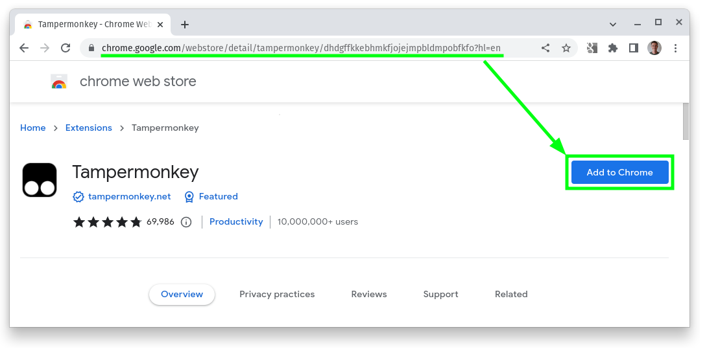
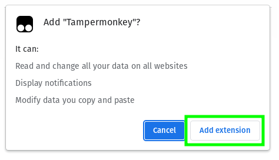
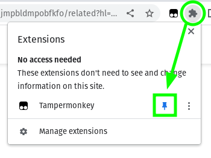
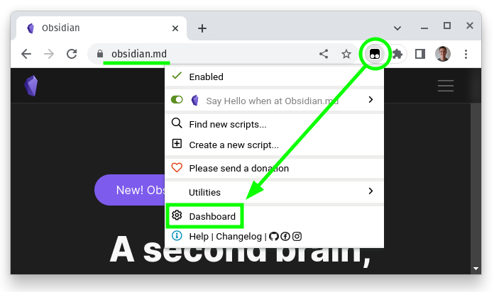
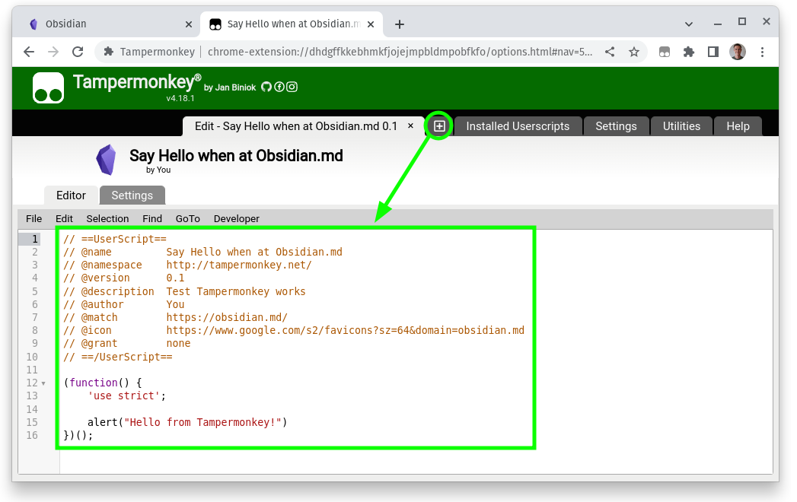
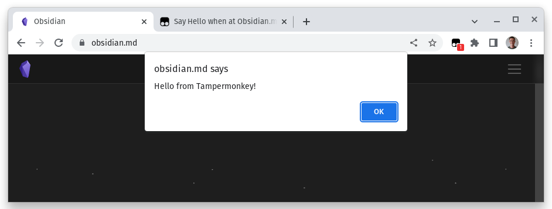
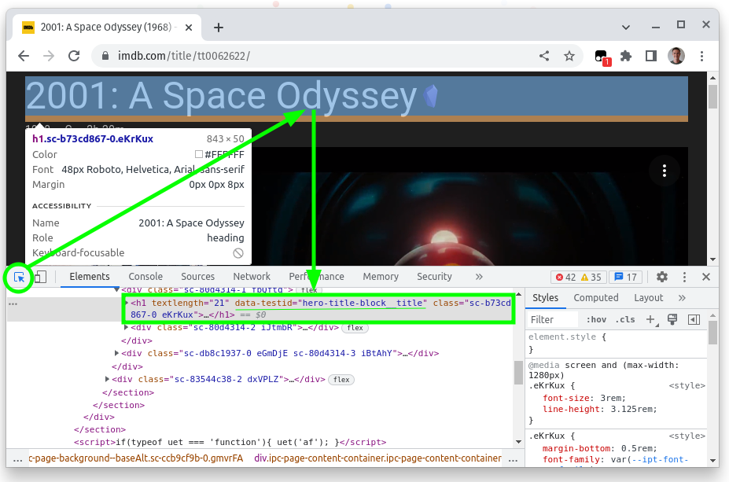
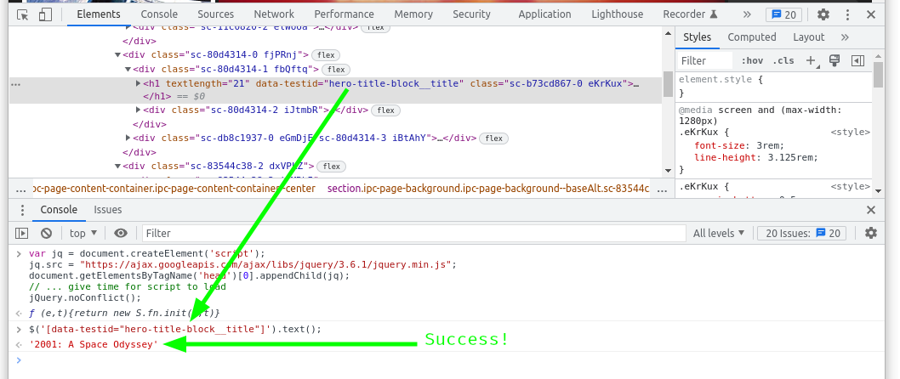
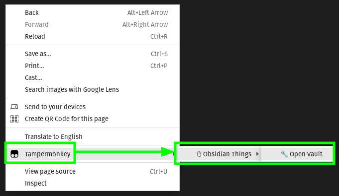

## Obsidian：创建您自己的 Web Clipper

This article shares how to create your own Obsidian web clipper. It will allow you to send web content of your choosing to your Obsidian vault. Your clipper can be generic and work across all pages (e.g. send selected text to Obsidian), or it can be specialized and pull specific text from a specific page (e.g. actor names from IMDb).

本文分享了如何创建您自己的 Obsidian 网络剪裁器。 它将允许您将您选择的 Web 内容发送到您的黑曜石保险库。 您的剪辑器可以是通用的，可以跨所有页面工作（例如，将选定的文本发送到 Obsidian），也可以是专门的，可以从特定页面提取特定文本（例如，来自 IMDb 的演员姓名）。

This article is written so that anyone can follow along without getting lost. To that end, there are screenshots and detailed but easy-to-follow instructions.

写这篇文章是为了让任何人都可以跟进而不会迷路。 为此，有屏幕截图和详细但易于遵循的说明。

Armed with this knowledge you’ll be able to capture content from the internet and send it to your vault in a layout of your preference!

掌握了这些知识后，您就可以从 Internet 上捕获内容，并以您喜欢的布局将其发送到您的保管库！

## Sneak peek

## 抢先看

Below are GIFs that show what we will create later in the article…

下面是 GIF，展示了我们将在本文后面创建的内容……

## How Does it Work?

## 它是如何工作的？

The technique is a combination of the [Obsidian URI protocol](https://help.obsidian.md/Advanced+topics/Using+obsidian+URI) and [UserScripts](https://openuserjs.org/about/Userscript-Beginners-HOWTO).

该技术是 [Obsidian URI 协议](https://help.obsidian.md/Advanced+topics/Using+obsidian+URI) 和 [UserScripts](https://openuserjs.org/about/Userscript-Beginners-HOWTO) 的组合。

**Obsidian URI Protocol**

**黑曜石 URI 协议**

The Obsidian URI protocol looks similar to a website address, however it instructs the browser to work with Obsidian. For example, the URI below will open Obsidian…

Obsidian URI 协议看起来类似于网站地址，但它指示浏览器使用 Obsidian。 例如，下面的 URI 将打开黑曜石……

```
obsidian:
```

Try typing it in your address bar and press enter. Obsidian should open! (This capability was demonstrated in a [previous article](https://medium.com/@gareth.stretton/obsidian-control-from-chrome-1ba27c5ef84b).)

尝试在您的地址栏中输入它，然后按回车键。 黑曜石应该打开！ 中进行了演示 [（此功能已在之前的文章](https://medium.com/@gareth.stretton/obsidian-control-from-chrome-1ba27c5ef84b) 。）

The protocol can be used to:

该协议可用于：

-   open your vault, or
-   打开你的保险库，或
-   perform a vault search, or
-   执行保险库搜索，或
-   to create, overwrite, or append content to a note.
-   创建、覆盖或附加内容到笔记。

**UserScripts**

**用户脚本**

UserScripts allow you to make changes to pages that you visit. These changes are only visible to you. You can change the behavior by adding JavaScript, changing the style by adding CSS, or change the content by adding HTML.

用户脚本允许您对访问的页面进行更改。 这些更改仅对您可见。 您可以通过添加 JavaScript 来更改行为，通过添加 CSS 来更改样式，或者通过添加 HTML 来更改内容。

Most popular websites have custom UserScripts to improve the experience of visitors. For example, there is a UserScript to click ‘skip’ immediately on YouTube ads.

大多数流行的网站都有自定义用户脚本来改善访问者的体验。 例如，有一个用户脚本可以立即点击 YouTube 广告上的“跳过”。

> WARNING!  
> UserScripts are written by people. Some people are evil and they write code that does naughty things. Before running a UserScript make sure you understand what it does! Otherwise, an evil person may do naughty things to you.
> 
> 在 阿宁！  
> 用户脚本是由人编写的。 有些人是邪恶的，他们编写的代码会做一些顽皮的事情。 在运行 UserScript 之前，请确保您了解它的作用！ 否则，邪恶的人可能会对你做出顽皮的事情。

Here are a few websites where you can find UserScripts…

这里有几个网站，您可以在其中找到用户脚本……

-   [https://userscripts-mirror.org/](https://userscripts-mirror.org/)
-   [https://userscripts-mirror.org/](https://userscripts-mirror.org/)
-   [https://greasyfork.org/](https://greasyfork.org/)
-   [https://greasyfork.org/](https://greasyfork.org/)

**JQuery**

**查询**

JQuery is also utilized as it makes identifying, extracting, and modifying components of a web page very easy. It’s a JavaScript library that will help us out.

还使用了 JQuery，因为它使识别、提取和修改网页的组件变得非常容易。 这是一个可以帮助我们的 JavaScript 库。

## Making a Clipper

## 制作快船

Now that we have a basic understanding, we can get started. We will…

现在我们有了基本的了解，我们可以开始了。 我们会…

-   Install an extension that allows us to manage UserScripts.
-   安装允许我们管理用户脚本的扩展。
-   Test that it works by running a simple example.
-   通过运行一个简单的示例来测试它是否有效。
-   Build a generic clipper to send selected text to Obsidian.
-   构建一个通用剪裁器以将选定的文本发送到 Obsidian。
-   Make a site-specific clipper that can extract key details from a page.
-   制作一个站点特定的剪辑器，可以从页面中提取关键细节。
-   Explore different ways to activate the clipper.
-   探索激活剪刀的不同方法。
-   And finally explore how to overcome a few pitfalls.
-   最后探索如何克服一些陷阱。

Let’s go…

我们走吧…

**Install a UserScript extension to your browser**

**在浏览器中安装 UserScript 扩展**

The very first step is to install an extension to your browser that will let you manage UserScripts. I manage my UserScripts with [Tampermonkey](https://www.tampermonkey.net/). It is a free extension that works with Chrome, Firefox, and Edge. I would encourage you to support the developer who made it as this is an excellent tool! (Thanks Jan Biniok). If you use a different browser, [this website](https://openuserjs.org/about/Userscript-Beginners-HOWTO) lists other extensions you can use.

第一步是在您的浏览器上安装一个扩展程序，让您可以管理 UserScripts。 管理我的 UserScripts [我使用Tampermonkey](https://www.tampermonkey.net/) 。 它是适用于 Chrome、Firefox 和 Edge 的免费扩展程序。 我鼓励您支持制作它的开发人员，因为这是一个出色的工具！ （感谢 Jan Biniok）。 如果您使用不同的浏览器， [该网站](https://openuserjs.org/about/Userscript-Beginners-HOWTO) 列出了您可以使用的其他扩展程序。

Here is a direct link to the [Chrome extension for Tampermonkey](https://chrome.google.com/webstore/detail/tampermonkey/dhdgffkkebhmkfjojejmpbldmpobfkfo?hl=en). The steps below show how to install it.

的 Chrome 扩展程序的直接链接 [这是Tampermonkey](https://chrome.google.com/webstore/detail/tampermonkey/dhdgffkkebhmkfjojejmpbldmpobfkfo?hl=en) 。 下面的步骤显示了如何安装它。



Add to Chrome



Confirm adding extension



Pin for ease of access

**Test it works**

**测试它是否有效**

Let’s test that TamperMonkey works by creating a UserScript that will run when we visit Obsidian.md. Head on over to [https://www.obsidian.md](https://www.obsidian.md/) and open the Tampermonkey Dashboard.

让我们通过创建将在我们访问 Obsidian.md 时运行的 UserScript 来测试 TamperMonkey 是否正常工作。 前往 [https://www.obsidian.md](https://www.obsidian.md/) 并打开 Tampermonkey 仪表板。



Visit Obsidian.md and open the Tampermonkey Dashboard

Next create a new script and paste the code below…

接下来创建一个新脚本并粘贴下面的代码......



Create new script and paste code

```
(function() {    'use strict';    alert("Hello from Tampermonkey!")})();
```

What does it do? Since you were already at the Obsidian.md website it used the web address for the `@match` configuration. This instructs Tampermonkey to only run on that website. You can ignore most of the other `@` configuration but for your own documentation you’ll typically want to put in a meaningful `@name` and `@description`. The code `alert("Hello from Tampermonkey!")` will display a popup dialog box when the script is run. This will happen each time you visit Obsidian.md.

它有什么作用？ 由于您已经在 Obsidian.md 网站上，它使用的网址是 `@match`配置。 这指示 Tampermonkey 仅在该网站上运行。 你可以忽略其他大部分 `@`配置，但对于您自己的文档，您通常希望放入一个有意义的 `@name`和 `@description`. 代码 `alert("Hello from Tampermonkey!")`运行脚本时将显示一个弹出对话框。 每次访问 Obsidian.md 时都会发生这种情况。

Try it out, revisit [https://www.obsidian.md](https://www.obsidian.md/). You should see the popup.

尝试一下，重新访问 [https://www.obsidian.md](https://www.obsidian.md/) 。 你应该看到弹出窗口。



Success: Tampermonkey works!

If you got an alert, then Tampermonkey is working. If it isn’t working, try recreating the script — there may be a typo somewhere.

如果您收到警报，则表明 Tampermonkey 正在运行。 如果它不起作用，请尝试重新创建脚本 - 某处可能有错字。

One thing to note in the image above is the red square with white text. This just says how many scripts were run. Nothing to worry about.

上图中需要注意的一件事是带有白色文本的红色方块。 这只是说明运行了多少脚本。 没什么好担心的。

## **Generic Clipper: Send Selected Text to Your Vault**

## **Generic Clipper：将选定的文本发送到您的保险库**

The clipper script below will send selected text from (almost) any website and save it as a new file in your vault. (Be sure to change `my_vault` to the name of your vault!) If the file already exists, it will append the content to the end.

下面的剪辑脚本将从（几乎）任何网站发送选定的文本，并将其作为新文件保存在您的保险库中。 （一定要改 `my_vault`到您的保管库的名称！）如果该文件已经存在，它将把内容附加到末尾。

The script is activated when you press `CMD + I`on Mac, or `CTRL + I` on Linux or Windows. The filename will be a combination of the website domain and the title of the page (e.g. “medium.com - Digitial Felinology: A Beginner’s Guide”). Some characters can not be included in a file name, so those are removed.

当您按下时脚本被激活 `CMD + I`在 Mac 上，或 `CTRL + I`在 Linux 或 Windows 上。 文件名将是网站域和页面标题的组合（例如“medium.com - 数字猫学：初学者指南”）。 一些字符不能包含在文件名中，因此这些字符被删除。

```
function shortcutPressed(e) {    let operatingSystem = navigator.userAgent.search("MacOS") !== -1 ? "mac" : "pc"    let activationKey = 'KeyI'    if (operatingSystem === "mac") {                return e.code === activationKey && e.metaKey && !e.altKey && !e.shiftKey && !e.ctrlKey;    } else {                return e.code === activationKey && e.ctrlKey && !e.altKey && !e.shiftKey && !e.metaKey;    }}function createFilename() {    let domainName = location.href.split("://")[1].split("/")[0]    let pageTitle = document.title    let filename = domainName + " - " + pageTitle    let cleanName = filename.replace(/[\(\)\[\]\\/?%*:'|"<>!]/g, '-');    return cleanName}document.addEventListener('keydown', e => {    if (shortcutPressed(e)) {        let vault = "my_vault"        let filename = createFilename()        let encodedNewLine = "%0A"        let selectedText = encodedNewLine + document.getSelection().toString()        let uri = `obsidian://new?vault=${vault}&name=${filename}&content=${selectedText}&append=true`        location.href = uri    }})
```

The animated GIF below demonstrates using the clipper on a Wikipedia article.

下面的动画 GIF 演示了如何在维基百科文章中使用裁剪器。


Organizing Cat Research with the Custom Clipper

In the next section, we will make a custom clipper that will pull specific text from a specific page and save it to a new file. We’ll use JQuery to make it easier to locate the text to extract. I’ll also include some re-usable code for working with the wider Obsidian URI protocol.

在下一节中，我们将制作一个自定义剪辑器，它将从特定页面中提取特定文本并将其保存到新文件中。 我们将使用 JQuery 来更轻松地定位要提取的文本。 我还将包括一些可重复使用的代码，用于处理更广泛的 Obsidian URI 协议。

## **Specific Clipper: Capturing Key Information from a Specific Site**

## **特定 Clipper：从特定站点捕获关键信息**

The code below will add an Obsidian logo to the page. When this logo is clicked then it will save the title, year, guidance, duration, and description to a new note under the “Movie” folder in your vault.

下面的代码将向页面添加一个 Obsidian 徽标。 单击此徽标后，它会将标题、年份、指南、持续时间和描述保存到您保险库中“电影”文件夹下的新注释中。

```
function visitObsidianURI(action, options) {    let uri = createObsidianURI(action, options)    location.href = uri.toString()}function createObsidianURI(action, options) {    let uri = `obsidian://${action}`    let firstProperty = true    for (const property in options) {        if (typeof options[property] === "undefined") {            continue        }        let delimiter = (firstProperty ? "?" : "&")        firstProperty = false        let propertyValue = encodeURIComponent(options[property])        uri += `${delimiter}${property}=${propertyValue}`    }    return uri;}let obsidianOpen = (options) => visitObsidianURI("open", options)let openVault = (vault) => obsidianOpen({vault})let openFile = (vault, file) => obsidianOpen({vault, file})let openPath = (path) => obsidianOpen({path})let obsidianSearch = (options) => visitObsidianURI("search", options)let search = (vault, query) => obsidianSearch({vault, query})let obsidianNew = (options) => visitObsidianURI("new", options)let createNote = (vault, name, content, silent = true) => obsidianNew({vault, name, content, silent: (silent ? silent : undefined)})let overwriteNote = (vault, name, content, silent = true) => obsidianNew({vault, name, content, overwrite: true, silent: (silent ? silent : undefined)})let appendNote = (vault, name, content, silent = true, onNewLine = true) => {    content = onNewLine ? "\n" + content : content    obsidianNew({vault, name, content, append: true, silent: (silent ? silent : undefined)})}function createFilename() {    let domainName = location.href.split("://")[1].split("/")[0]    let pageTitle = document.title    let filename = domainName + " - " + pageTitle    let cleanName = filename.replace(/[\(\)\[\]\\/?%*:'|"<>!]/g, '-');    return cleanName}(function() {    'use strict';    const vault = "my_vault"    const obsidianIcon = "https://www.google.com/s2/favicons?sz=64&amp;domain=obsidian.md"    let heroTitle = '[data-testid="hero-title-block__title"]';    let title =   $(heroTitle).text();    let baseSelector = heroTitle + ' + div > ul > li'    let year = $(baseSelector + ' > span:eq(0)').text()    let guidance = $(baseSelector + ' > span:eq(1)').text()    let duration = $(baseSelector + ':eq(2)').text()    let description = $('[data-testid="plot"]').text();    let content = `---tags: [ "movie" ]---# ${title}Year: ${year}Guidance: ${guidance}Duration: ${duration}${description}`    let filename = "Movies/" + createFilename()    let obsidianLink = createObsidianURI("new", {vault, file: filename, content})    let newElement = `<a href="${obsidianLink}"></a>`    $('[data-testid="hero-title-block__title"]').append(newElement)})();
```

The GIF below shows our custom clipper in action.

下面的 GIF 显示了我们的自定义裁剪器的运行情况。


(The above IMDb page is: [https://www.imdb.com/title/tt0062622](https://www.imdb.com/title/tt0062622))

（以上IMDb页面为： [https](https://www.imdb.com/title/tt0062622) ://www.imdb.com/title/tt0062622 ）

**JQuery “Selectors”**

**JQuery“选择器”**

In the above code we identify elements of the page using ‘selectors’. For example “`[data-testid="here-title-block__title]'`”. We can then get the text inside this element by calling the `.text()` function.

在上面的代码中，我们使用“选择器”识别页面元素。 例如 ” `[data-testid="here-title-block__title]'`”。 然后我们可以通过调用 `.text()`功能。

A selector describes a part of the webpage. JQuery attempts to find that element using the description. It can be a sequence of elements, e.g. 3 paragraphs in a row. It can describe a single element, e.g. a paragraph with the ID of title.

选择器描述网页的一部分。 JQuery 尝试使用描述来查找该元素。 它可以是一系列元素，例如一行中的 3 个段落。 它可以描述单个元素，例如带有标题 ID 的段落。

See [JQuery’s documentation](https://api.jquery.com/) for good examples. Also, [w3school’s JQuery documentation](https://www.w3schools.com/jquery/jquery_ref_selectors.asp) is very easy to follow.

请参阅 [JQuery 的文档](https://api.jquery.com/) 以获取很好的示例。 此外， [w3school 的 JQuery 文档](https://www.w3schools.com/jquery/jquery_ref_selectors.asp) 非常容易理解。

Some websites make it easy to pin-point the element you want (e.g. they give it a unique id). Other sites force you to be creative, for example, you may need to describe the relative path from a known location. It takes practice to master JQuery. I’d recommend skimming the documentation so you know what’s possible. Keep some notes on what worked for you too.

一些网站可以很容易地确定您想要的元素（例如，他们给它一个唯一的 ID）。 其他站点迫使您发挥创造力，例如，您可能需要描述从已知位置开始的相对路径。 掌握 JQuery 需要练习。 我建议浏览一下文档，这样你就知道什么是可能的。 记下对你也有用的东西。

**How to Write Selectors**

**如何编写选择器**

Luckily it is not too difficult to write a selector. In fact, you can ask Chrome to show you the element by clicking on it. If you’re lucky, it will have an ID. And your code will be as simple as `let title = $(“#title”).text()`. If you’re not lucky, you’ll need to test out a few until you make one that works.

幸运的是，编写一个选择器并不太难。 事实上，您可以通过单击让 Chrome 浏览器向您显示该元素。 如果幸运的话，它会有一个 ID。 你的代码将很简单 `let title = $(“#title”).text()`. 如果你运气不好，你需要测试一些，直到你做出一个有效的。

The process to create selectors is:

创建选择器的过程是：

1\. Open the Chrome console …  
(Press `F12`, or `CMD + SHIFT + I` on Mac, or `CTRL + SHIFT + I` on Windows)

1\. 打开 Chrome 控制台……  
（按 `F12`， 要么 `CMD + SHIFT + I`在 Mac 上，或 `CTRL + SHIFT + I`在 Windows 上）

2\. Ask Chrome to show the element of interest in the ‘elements’ tab …  
Click on the icon that looks like a ‘mouse cursor pointing at a box’, then click on the text you want to extract. The HTML element will be highlighted in the ‘elements’ tab.

2\. 要求 Chrome 在“元素”选项卡中显示感兴趣的元素……  
单击看起来像“鼠标光标指向一个框”的图标，然后单击要提取的文本。 HTML 元素将在“元素”选项卡中突出显示。



3\. Ask Chrome to load JQuery …  
Open the ‘console’ tab, copy-and-paste this code and press enter.

3\. 让 Chrome 加载 JQuery …  
打开“控制台”选项卡，复制并粘贴此代码，然后按回车键。

```
var jq = document.createElement('script');jq.src = "https://ajax.googleapis.com/ajax/libs/jquery/3.6.1/jquery.min.js";document.getElementsByTagName('head')[0].appendChild(jq);jQuery.noConflict();
```

4\. Prototype your selectors in the Chrome console.

4\. 在 Chrome 控制台中制作您的选择器原型。

```
$('[data-testid="hero-title-block__title"]').text()
```



When you have a selector that works, add it to your Tampermonkey script. It’s good practice to add one at a time, that way if your script breaks you can identify what change was responsible. Programming is finky. Good luck!

当您有一个可用的选择器时，将其添加到您的 Tampermonkey 脚本中。 一次添加一个是很好的做法，这样如果您的脚本中断，您可以确定是什么变化造成的。 编程很时髦。 祝你好运！

## Other ways to Activate a UserScript

## 激活用户脚本的其他方法

We’ve looked at activating a script by pressing a shortcut (i.e. `CMD + I`). We’ve also triggered a script by adding the Obsidian logo and clicking on it. Another way is to add a context menu item that will appear when you right click on the page. Let’s look at how to add this…

我们研究了通过按快捷方式（即 `CMD + I`). 我们还通过添加黑曜石徽标并单击它来触发脚本。 另一种方法是添加一个右键单击页面时将出现的上下文菜单项。 让我们看看如何添加这个……

The new `@` configuration will allow you to create a context menu and run your script when the context menu is opened.

新的 `@`配置将允许您创建上下文菜单并在打开上下文菜单时运行脚本。

```

```

The code below demonstrates adding a new context menu item.

下面的代码演示了添加一个新的上下文菜单项。

```
function demoOpenVault() {  location.href = 'obsidian://open'}GM_registerMenuCommand("Open Vault", demoOpenVault, "o");
```

Here’s what is looks like:

这是它的样子：



## Pitfalls to Avoid

## 要避免的陷阱

We’ve covered a lot, but I want to leave you with two final tips….

我们已经介绍了很多，但我想给您留下两个最后的提示……。

1.  Your browser may ask you to confirm before opening Obsidian. This confirmation check can be disabled. The steps are described in a [previous post](https://medium.com/@gareth.stretton/obsidian-control-from-chrome-1ba27c5ef84b) (see section: ‘Always allow Chrome to open Obsidian’)
2.  Some web pages use iframes. This makes identifying the selected text harder. Below is some code that will help you identify selected text from within an iframe…

1.  在打开黑曜石之前，您的浏览器可能会要求您确认。 可以禁用此确认检查。 这些步骤在 [之前的帖子](https://medium.com/@gareth.stretton/obsidian-control-from-chrome-1ba27c5ef84b) 中有所描述（请参阅部分：“始终允许 Chrome 打开 Obsidian”）
2.  一些网页使用 iframe。 这使得识别所选文本变得更加困难。 下面是一些代码，可以帮助您从 iframe 中识别选定的文本……

```
let text = ""let iframe = document.getElementById("IFRAME_SELECTOR")let idoc = iframe.contentDocument || iframe.contentWindow.documentif (idoc.getSelection) {  text = idoc.getSelection().toString()}return text
```

## Wrapping up

## 包起来

Do you have an idea for a custom-clipper that would be useful within your industry? For example, academia, case-law research, etc. Email me at [gareth.stretton@gmail.com](mailto:gareth.stretton@gmail.com) with a link to the website, the text to retrieve, and a screenshot. I’ll consider making it for you (for free) and publish it for others to benefit from.

I believe that I’m the first to combine UserScripts with Obsidian URI Protocol to make a web clipper! It’s exciting to help the Obsidian community gain a useful capability.
