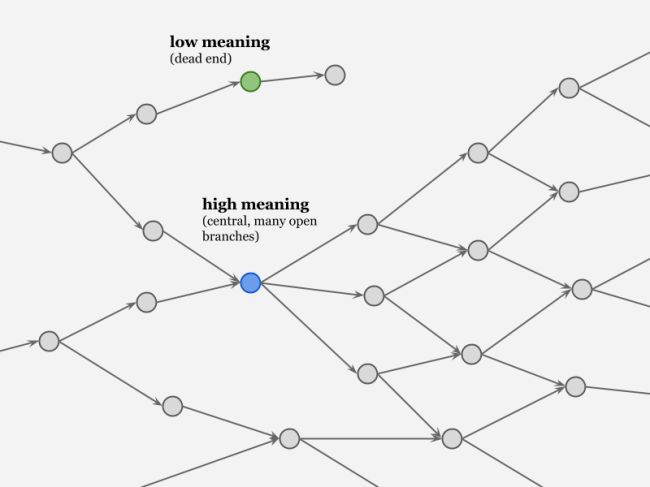
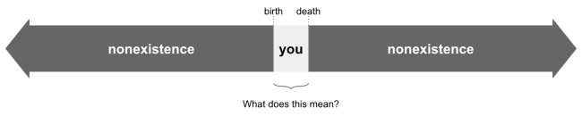
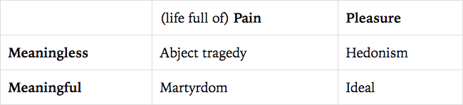
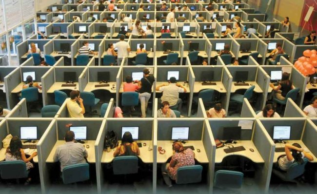

I've never been plagued by the big existential questions. You know, like _What's my purpose?_ or _What does it all mean?_

我从来没有被重大的存在主义问题所困扰。你知道，就像我的目的是什么？或者这一切意味着什么？

Growing up I was a very science-minded kid — still am — and from an early age I learned to accept the basic meaninglessness of the universe. Science taught me that it's all just atoms and the void, so there can't be any deeper point or purpose to the whole thing; the kind of meaning most people yearn for — Ultimate Meaning — simply doesn't exist.

在成长过程中，我是一个非常有科学头脑的孩子——现在仍然是——从小我就学会了接受宇宙基本的无意义性。科学告诉我，这一切都只是原子和虚空，所以整个事情不可能有任何更深层次的意义或目的；大多数人渴望的那种意义——终极意义——根本不存在。

Nor was I satisfied with the obligatory secular follow-up, that you have to "make your own meaning." I knew what that was: a consolation prize. And since I wasn't a sore loser, I decided I didn't need meaning of either variety, Ultimate or man-made.

我也不满意强制性的世俗后续行动，你必须“表达自己的意思”。我知道那是什么：安慰奖。而且因为我不是一个失败者，我决定我不需要多样性的意义，终极或人造。

In lieu of meaning, I mostly adopted the attitude of Alan Watts. Existence, he says, is fundamentally _playful_. It's less like a journey, and more like a piece of music or a dance. And the point of dancing isn't to arrive at a particular spot on the floor; the point of dancing is simply to dance. Vonnegut expresses a similar sentiment when he says, "We are here on Earth to fart around."

代替意义，我主要采用了艾伦瓦茨的态度。他说，存在从根本上说是好玩的。这不像是一段旅程，而更像是一段音乐或舞蹈。跳舞的目的不是到达地板上的特定位置；而是到达地板上的特定位置。跳舞的目的只是为了跳舞。冯内古特表达了类似的观点，他说：“我们在地球上是为了放屁。”

This may be nihilism, but at least it's good-humored.  
这或许是虚无主义，但至少是善意的。  

Now, to be honest, I'm not sure whether I'm a full-bodied practitioner of Watts's or Vonnegut's brand of nihilism. Deep down, maybe I still yearn for more than dancing and farting. But by accepting nihilism, at least as an intellectual plausibility, I've mostly kept the specter of meaning from haunting me late at night. \[1\]

现在，老实说，我不确定我是否是瓦茨或冯内古特虚无主义品牌的全面实践者。在内心深处，也许我仍然渴望跳舞和放屁。但是通过接受虚无主义，至少作为一种理智上的合理性，我基本上没有让意义的幽灵在深夜困扰我。 \[1\]

Now, if this were the final word on the subject, I'd be perfectly content. Unfortunately, some of my favorite writers of recent years — Sarah Perry and David Chapman, in particular — can't seem to shut up about meaning. Together they've written [two](https://www.amazon.com/Every-Cradle-Grave-Rethinking-Suicide/dp/0989697290) [books](http://meaningness.com/) about it, and more blog posts than I care to link to. Even Venkat Rao has [dipped](http://www.ribbonfarm.com/2015/12/01/can-you-hear-me-now/) his [toes](http://www.ribbonfarm.com/2016/04/28/immortality-begins-at-forty/) in the pool. So I'm forced to accept that either I have bad taste in who I've been reading, or there's more to meaning than I've historically given it credit for.

现在，如果这是关于这个主题的最后一句话，我会非常满意。不幸的是，近年来我最喜欢的一些作家——尤其是莎拉佩里和大卫查普曼——似乎无法对意义闭嘴。他们一起写了两本关于它的书，以及比我想链接到的更多的博客文章。甚至 Venkat Rao 也曾将脚趾浸入游泳池。所以我不得不承认，要么我对我读过的人有不好的品味，要么意义比我过去认为的要多。

The way these writers talk about meaning intrigues me. They speak of it as something that can be "experienced," "invested," "manufactured," or "destroyed." I've long struggled to make heads or tails of such metaphors — and yet these are solid, STEM-y thinkers, people I trust not to take me too far off the rails.

这些作家谈论意义的方式让我很感兴趣。他们把它说成是可以“体验”、“投资”、“制造”或“摧毁”的东西。长期以来，我一直在努力想出这些隐喻的正面或反面——但这些都是可靠的 STEM-y 思想家，我相信他们不会让我偏离轨道太远。

What follows is my attempt at figuring out what people mean when they talk about meaning. In particular, I want to rehabilitate the word — to cleanse it of wishy-washy spiritual associations, give it the respectable trappings of materialism, and socialize it back into my worldview. This is a personal project, but I hope some of my readers will find value in it for themselves.

接下来是我试图弄清楚人们在谈论意义时的意思。特别是，我想恢复这个词——清除它虚无缥缈的精神联想，赋予它可敬的唯物主义外衣，并将其社会化回到我的世界观中。这是一个个人项目，但我希望我的一些读者能从中找到对自己有价值的东西。

As always, there are caveats. I have a degree in philosophy, but haven't read any of the classic literature on this subject, so I'm almost certainly reinventing the wheel. And although I lean heavily on what I've gleaned from Sarah, David, and Venkat, I'm not sure any of them would endorse what I've written here. You might want to think of it as my own funky synthesis — and if it comes up short, that's entirely my fault.

与往常一样，有一些警告。我有哲学学位，但没有读过任何关于这个主题的经典文献，所以我几乎可以肯定是在重新发明轮子。尽管我非常依赖我从 Sarah、David 和 Venkat 那里收集到的东西，但我不确定他们中的任何人会认可我在这里写的东西。你可能想把它看作是我自己的时髦综合——如果它不够好，那完全是我的错。

Now, onward.  
现在，向前。  

### Meaning for materialists  
对唯物主义者的意义  

How to begin?  
如何开始？  

Supposing there's no ultimate, objective, metaphysical thing called meaning, we might instead approach it as a certain _feeling_ or _perception_ that people have toward the objects, events, and experiences in their lives, or toward their lives as a whole.

假设没有终极的、客观的、形而上学的东西叫做意义，我们可能会把它看作是人们对生活中的物体、事件和经历，或者对整个生活的某种感觉或感知。

We're all of us, nihilists included, familiar with this feeling. We all know that a wedding, for example, feels more meaningful than a random Wednesday at the office. Or that a letter from an old friend holds more meaning than an electric toothbrush (even though the latter is more useful). We feel meaning when standing in front of a national monument, but not when waiting in line at a grocery store. Music, for reasons I'm [only maybe beginning to make sense of](https://meltingasphalt.com/the-more-the-merrier/), almost always feels meaningful, and probably more so to the average teenager than to the average 50-year-old. (Actually, I suspect teenagers perceive more meaning in almost everything.)

我们所有人，包括虚无主义者，都熟悉这种感觉。我们都知道，例如，一场婚礼比在办公室随意度过一个星期三更有意义。或者老朋友的一封信比电动牙刷更有意义（尽管后者更有用）。站在国家纪念碑前我们会感到有意义，但在杂货店排队时却不会。音乐，出于我可能才刚刚开始理解的原因，几乎总是感觉有意义，而且对普通青少年来说可能比对普通 50 岁的人更有意义。 （实际上，我怀疑青少年在几乎所有事物中都能感知到更多意义。）

So: meaning isn't a substance, but rather a feeling. In this way, it's a lot like beauty. Both are more-or-less subjective experiences that we perceive in response to external cues. \[2\] In both cases, people generally agree about which kinds of things elicit the feeling, while at the same time leaving plenty of room for individual and cross-cultural variation. Both meaning and beauty are experiences we seem to crave, and the fact that all humans have these cravings suggests that they're adaptive. And just as we can appreciate beauty without getting too philosophical about it, so too can we appreciate meaning without requiring it to rest on some ultimate, metaphysical foundation.

所以：意义不是一种物质，而是一种感觉。这样一来，就很像美人了。两者或多或少都是我们对外部线索做出反应而感知到的主观体验。 \[2\] 在这两种情况下，人们通常都同意哪些事物会引发这种感觉，同时为个人和跨文化差异留有足够的空间。意义和美都是我们似乎渴望的体验，而所有人都有这些渴望的事实表明他们具有适应性。正如我们可以欣赏美而不用太过哲学化一样，我们也可以欣赏意义而不要求它建立在某种终极的、形而上学的基础上。

One especially important feature of meaning is that it's highly contextual. _My_ wedding is meaningful to _me_, but not so much to you. An inside joke can be meaningful to one community but completely irrelevant to another. Similarly, events in a dream often feel intensely meaningful, but typically lose most of their meaning when we wake up to real life.

意义的一个特别重要的特征是它具有高度的语境性。我的婚礼对我来说很有意义，但对你来说意义不大。内部笑话可能对一个社区有意义，但对另一个社区则完全无关。同样，梦中的事件常常让人感觉非常有意义，但当我们醒来看到现实生活时，它们通常会失去大部分意义。

In the context of a play, Chekhov's gun is meaningful if and only if it's fired in the final act. If the gun is never fired (or is otherwise irrelevant to the plot), then it's meaningless — not a prop, but mere set dressing. And just as we find narratives unsatisfying when the elements in them don't pay off later, so too do we appreciate when things pay off meaningfully in our lives and the other contexts we care about. Otherwise it's just one damn thing after another.

在戏剧的背景下，当且仅当它在最后一幕中开火时，契诃夫的枪才有意义。如果枪从未开火（或者与情节无关），那么它就毫无意义——不是道具，而只是布景。正如当故事中的元素后来没有得到回报时我们会感到不满意一样，当事情在我们的生活和我们关心的其他环境中有意义地得到回报时，我们也会感激。否则，这只是一件又一件该死的事情。

The meaning of a given thing can also change over time, as David Chapman points out in the [case of an extramarital affair](http://meaningness.com/nebulosity-of-meaningness). As the affair is taking place, it feels laden with meaning. But years later, long after the two lovers have parted ways, most of the meaning seems to have dissipated. Presumably, if they'd left their spouses and re-married each other, the affair would have retained much of its meaning.

正如大卫·查普曼 (David Chapman) 在婚外情案例中指出的那样，给定事物的含义也会随着时间而改变。随着这件事的发生，它感觉充满了意义。但多年后，在两个恋人分道扬镳很久之后，那份意味似乎也消散了大半。据推测，如果他们离开他们的配偶并重新结婚，这件事将保留其大部分意义。

\* \* \* \*  
\* \* \* \*  

Alright, time to shift gears.  
好吧，是时候换档了。  

So far I've been waving my hands in the general direction of meaning, without trying to put too fine a point on it. Now I'd like to venture a more explicit hypothesis about what, exactly, underlies our perceptions of meaning. Please forgive the mathy tone here:

到目前为止，我一直在朝着意义的大体方向挥手致意，并没有试图在其上提出过于精细的观点。现在，我想冒险提出一个更明确的假设，即我们对意义的感知究竟是什么。请原谅这里的数学语气：

> A thing X will be _perceived as meaningful_ in context C to the extent that it's _connected to other meaningful things_ in C.
> 
> 事物 X 在上下文 C 中将被视为有意义，因为它与 C 中其他有意义的事物相关联。

Let's take a moment to reflect on this statement and draw a few corollaries.

让我们花点时间思考一下这个陈述并得出一些推论。

**First**, what kind of connections are we talking about? Typically they will be causal: X _influences_ Y. Sometimes they will be epistemic: X _justifies_ or _explains_ Y. But they might also be narrative connections or even [mere coincidences](http://www.ribbonfarm.com/2015/06/04/puzzle-theory/). Regardless, the more densely or strongly connected something is to the rest of the meaning "soup," the more meaningful it will be perceived to be.

首先，我们在谈论什么样的联系？通常它们是因果关系：X 影响 Y。有时它们是认知的：X 证明或解释 Y。但它们也可能是叙事联系，甚至仅仅是巧合。无论如何，某物与“汤”的其余部分的联系越紧密或越紧密，它就会被认为越有意义。

Sarah gives a helpful metaphor: [meaning is pointing](http://www.ribbonfarm.com/2015/10/01/meaning-and-pointing/). So the more arrows issuing out from something, the greater its meaning \[3\]:

Sarah 给出了一个有用的比喻：意义就是指向。所以从某物射出的箭越多，它的意义就越大\[3\]：

We can also gauge meaning by asking the counterfactual question: "How much of an effect would _removing X from C_ have on the other meaningful things in C?" The greater the effect, the more the meaning.

我们还可以通过提出反事实问题来衡量意义：“从 C 中删除 X 对 C 中其他有意义的事物有多大影响？”效果越大，意义就越大。

By these measures — connectedness, pointing intensity, effects of removal — the Constitution is far and away the most meaningful document in the United States. The structure of our government (and many other institutions) owes more to the Constitution than to any other document. If the Constitution never existed, or if it was changed even slightly, the U.S. would be a very different place for all its inhabitants. Similar logic tells us that, in the context of a growing startup, early hires are more meaningful than later hires, largely because they have more influence on how the company develops. Even at the later stages, however, hiring and firing are more meaningful activities than stocking the kitchen or painting the bikeshed.

通过这些措施——连接性、指向强度、移除效果——宪法无疑是美国最有意义的文件。我们政府（以及许多其他机构）的结构更多地归功于宪法而不是任何其他文件。如果宪法从未存在过，或者哪怕只是稍作修改，美国对于所有居民来说都会是一个截然不同的地方。类似的逻辑告诉我们，在成长型创业公司的背景下，早期招聘比后期招聘更有意义，很大程度上是因为他们对公司发展的影响更大。然而，即使在后期阶段，雇用和解雇也比在厨房备货或粉刷自行车棚更有意义。

**Second**, note the recursion: the meaning of a thing is defined by its connections to _other meaningful things_. This may seem circular or question-begging, but I think that's precisely the point. Few things are meaningful all by themselves; most derive their meaning from the things they point to. Of course, the buck has to stop somewhere, at some source of inherent or axiomatic meaning. In a religious context, for example, God is the ultimate arbiter of what is or isn't meaningful. Meanwhile, in secular contexts, most people seem happy to accept the premise that human life is inherently meaningful (or something along those lines). Those who insist on pressing further — e.g., by asking _why_ human life is meaningful — must then gaze into the dark abyss.

其次，注意递归：事物的意义是由它与其他有意义事物的联系来定义的。这似乎是循环往复或回避问题，但我认为这正是重点。很少有事情本身是有意义的；大多数从他们指向的事物中获得他们的意义。当然，责任必须停在某个地方，停在某个内在或公理意义的来源。例如，在宗教背景下，上帝是有意义或无意义的最终仲裁者。同时，在世俗背景下，大多数人似乎乐于接受这样的前提，即人类的生命本质上是有意义的（或类似的东西）。那些坚持要求更进一步的人——例如，通过询问为什么人类的生命是有意义的——必须凝视黑暗的深渊。

**Third**, note that meaning, if defined in terms of connections, isn't entirely a matter of subjective experience. It has some objective qualities, some entanglements with reality. And as such, people can actually be _wrong_ about their feelings of meaning. You might think your job is meaningful, but if a friend disagrees, he probably has an objective basis for doing so. He might tell you, "Actually, your job has no real effect on the outcomes you actually care about." This would be a disagreement about facts, not axiomatic values or subjective feelings.

第三，请注意，如果根据联系来定义意义，则并不完全是主观体验的问题。它有一些客观的品质，一些与现实的纠缠。因此，人们对意义的感受实际上可能是错误的。你可能认为你的工作很有意义，但如果朋友不同意，他可能有这样做的客观依据。他可能会告诉你，“实际上，你的工作对你真正关心的结果没有真正的影响。”这将是对事实的分歧，而不是公理价值或主观感受。

**Finally**, if meaning is about connectedness, and especially causal influence, we can see why it's adaptive to pursue meaning. Perceptions of meaning allow us to answer a question we're always asking ourselves, "Why am I bothering to do this?" If an activity feels meaningful, it merits our continued attention and investment. Whereas if it feels meaningless, an appropriate response is to stop doing it — to give up and search for a more meaningful path. To seek meaning, then, helps us avoid dead-ends and retain control over our lives. Just as boredom and ennui are emotions that prompt us to make better use of our time or to look for other opportunities, our perceptions of meaning (or lack thereof) prompt us to think about the deepest, longest-term impact of our actions, and to steer toward better outcomes.

最后，如果意义是关于联系，尤其是因果影响，我们就能明白为什么追求意义是适应性的。对意义的感知使我们能够回答一个我们一直在问自己的问题，“我为什么要费心去做这个？”如果一项活动让人觉得有意义，它就值得我们持续关注和投资。然而，如果感觉毫无意义，适当的反应是停止这样做——放弃并寻找更有意义的道路。那么，寻求意义可以帮助我们避免死胡同，并保持对生活的控制。正如无聊和厌倦是促使我们更好地利用时间或寻找其他机会的情绪一样，我们对意义（或缺乏意义）的看法促使我们思考我们行为的最深远的影响，以及转向更好的结果。

It's important to remember, though, that we can get duped into perceiving meaning where it doesn't actually exist. As in many other areas of life, we can't always pursue the outcomes we want directly. Instead we evolved to pursue a set of _cues_ that give us the subjective sense of meaning. These cues typically correlate with real meaning, but have the potential to lead us astray, and [in clever hands](http://content.psychopathcode.com/chapter2.html) can even be used to exploit us. A charismatic CEO, for example, waxing grand and eloquent about the company's mission, can create a strong sense of meaning in his employees — but all too often it's illusory, the reality less "world-changing" than the rhetoric.

不过，重要的是要记住，我们可能会受骗而感知实际上并不存在的意义。与生活的许多其他领域一样，我们不能总是直接追求我们想要的结果。相反，我们进化为追求一组给我们主观意义感的线索。这些线索通常与真实意义相关，但有可能使我们误入歧途，而且在聪明人手中甚至可以用来剥削我们。例如，一位富有魅力的 CEO，对公司的使命夸大其辞，可以在他的员工中创造一种强烈的意义感——但往往是虚幻的，现实不如花言巧语“改变世界”。

### _Memento mori  
死亡纪念品  
_

As we all know, the prospect of death throws meaning into high relief. It forces us to consider a broader context in which "we" no longer exist. All those things that were meaningful in the context of our lives will retain little or no meaning once we're gone.

众所周知，死亡的前景使意义变得高高在上。它迫使我们考虑一个更广泛的背景，在这个背景下，“我们”不再存在。一旦我们离开，所有那些在我们生活中有意义的事情将保留很少或没有意义。

So then, what _does_ matter, as they say, "in the grand scheme of things"?

那么，正如他们所说，“在事物的宏伟计划中”重要的是什么？

It might be helpful to think in extremes. The _least meaningful life_, for example, is the causal dead-end — a person so inessential and irrelevant that the world doesn't so much as bat an eyelash when they die. A hermit who spends his whole life alone in the woods, perhaps. Or someone who toils in utter obscurity, leaving no children and no other mark on the world.

极端思考可能会有所帮助。例如，最没有意义的生活是因果关系的死胡同——一个如此无关紧要和无关紧要的人，以至于当他们死去时，世界甚至连睫毛都不眨一下。也许是一个在树林里独自度过一生的隐士。或者是默默无闻地辛勤劳作，没有孩子，也没有在世界上留下任何其他印记的人。

On the other hand, the _most meaningful life_ is the one on which _everything_ depends: the fate of humanity, Good triumphing over Evil, etc. We love hearing stories about characters who experience these epic heights of meaning: Harry Potter, Ender Wiggin, Frodo Baggins. Or consider Jesus's life and his death on the cross, which arguably hits harder on the human "meaning bone" than any other narrative ever constructed. First of all, he saved everyone. Where once there was certain damnation, Jesus gave us a chance at an eternal life in Heaven. Second, his coming was long-prophesied, implying a relevance not just to the future but also the distant past. Finally, he suffered excruciating pain \[4\] in his dying act, highlighting the difference between a meaningful life and a pleasurable one. (More on this in a moment.)

另一方面，最有意义的生活是万物赖以生存的生活：人类的命运、正义战胜邪恶等等。我们喜欢听有关人物经历这些史诗般意义高度的故事：哈利·波特、安德·威金、佛罗多巴金斯。或者想想耶稣的一生和他在十字架上的死，这可以说比任何其他叙事都更能打击人类的“意义之骨”。首先，他救了所有人。曾经有某种诅咒的地方，耶稣给了我们在天堂永生的机会。其次，他的到来早已被预言，暗示着不仅与未来有关，也与遥远的过去有关。最后，他在临死前遭受了极度痛苦 \[4\]，这凸显了有意义的生活与愉快的生活之间的区别。 （稍后会详细介绍。）

Now we can't all be Jesus or Harry Potter, of course. But if meaning is pointing, then the meaning of one's life must reside in the arrows that point outward from it, influencing the external world. That's why we so often talk about meaningful activities in generic terms like "connecting with others," "paying it forward," "having an impact," "leaving a legacy," or participating in something "bigger than oneself."

当然，现在我们不可能都是耶稣或哈利波特。但如果意义是指向，那么一个人生命的意义就必须存在于它指向外的箭头中，影响着外部世界。这就是为什么我们经常用通用术语来谈论有意义的活动，例如“与他人联系”、“向前发展”、“产生影响”、“留下遗产”或参与“比自己更重要”的事情。

None of this is to say that Alan Watts or Kurt Vonnegut are wrong, or that we _must_ do something meaningful with our lives. But to the extent that our brains were built to seek meaning, we won't be able to quench our thirst by dancing around or making fart apps. So we're left with a choice: either we _strive_ to make a meaningful difference in the world, or else learn to face the void without flinching, and to find peace in simple _being_. \[5\]

这并不是说 Alan Watts 或 Kurt Vonnegut 是错误的，或者我们必须对我们的生活做一些有意义的事情。但就我们的大脑生来就是为了寻找意义而言，我们将无法通过跳舞或制作放屁应用程序来解渴。因此，我们面临一个选择：要么努力为世界带来有意义的改变，要么学会毫不退缩地面对空虚，在简单的存在中寻找平静。 \[5\]

### The experience machine  
体验机  

One of the best ways to look at meaning is to contrast it with _pleasure_. Consider this dramatically oversimplified formula:

看待意义的最好方法之一就是将它与快乐进行对比。考虑这个大大简化的公式：

> Life satisfaction = pleasure + meaning  
> 生活满意度=快乐+意义  

"Pleasure" here is what hedonists traditionally try to maximize. It includes health, comfort, and all manner of enjoyable sensory, aesthetic, and cognitive experiences, along with the absence of pain, misery, and suffering. Even beauty, for the hedonist, gets rolled up into the pleasure term.

这里的“快乐”是享乐主义者传统上试图最大化的东西。它包括健康、舒适和各种令人愉快的感官、审美和认知体验，以及没有痛苦、苦难和苦难。对于享乐主义者来说，即使是美，也被卷入了享乐一词。

Now we could imagine defining "pleasure" in such a way as to include "meaning." After all, it _feels good_ to experience meaning in one's life. So why break meaning out into its own separate term?

现在我们可以想象以包含“意义”的方式定义“快乐”。毕竟，在一个人的生活中体验意义感觉很好。那么为什么要将意义分解成自己单独的术语呢？

One reason is to highlight how people are often forced to choose between meaning and pleasure; the two experiences seem to [trade off](http://theviewfromhell.blogspot.com/2011/03/empirical-nature-of-meaning.html) against each other in interesting ways. Having children, for example, seems to reduce one's pleasure, at least in the short run, while contributing greatly to one's sense of meaning. (More [here](http://scottbarrykaufman.com/wp-content/uploads/2015/01/Baumeister-et-al.-2013.pdf).) In the extreme case, martyrs are willing to endure torture and die for the sake of something larger than themselves. And sure, a martyr is a tragic figure — but vastly more tragic is he who suffers and dies for no purpose whatsoever:

原因之一是强调人们常常被迫在意义和快乐之间做出选择；这两种经历似乎以有趣的方式相互取舍。例如，生孩子似乎会减少一个人的快乐，至少在短期内是这样，但对一个人的意义感有很大贡献。 （更多在这里。）在极端情况下，烈士愿意为了比自己更大的东西而忍受折磨和死亡。当然，烈士是一个悲剧人物——但更悲惨的是那些毫无目的地受苦和死去的人：

But the bigger reason to separate meaning from pleasure is that pleasure is a strictly subjective experience. You can close your eyes and bliss out as hard as you like, and the pleasure you experience will be no less valid because it's "just in your mind." Meaning, on the other hand, is entangled with external reality, making it possible to be _wrong_ about it. And thus the pursuit of _true_ meaning requires an outward orientation to the world.

但将意义与快乐分开的更大原因是快乐是一种严格的主观体验。你可以随心所欲地闭上眼睛享受极乐，你所体验到的快乐也同样有效，因为它“就在你的脑海中”。另一方面，意义与外部现实纠缠在一起，因此有可能出错。因此，追求真正的意义需要外向的世界。

To drive this point home, consider the "experience machine," a thought experiment [originally dreamt up](https://en.wikipedia.org/wiki/Experience_machine) by philosopher Robert Nozick. (Sarah discusses this at length in her book, [_Every Cradle is a Grave_](https://www.amazon.com/Every-Cradle-Grave-Rethinking-Suicide/dp/0989697290).) The experience machine is a virtual reality life-simulator designed to make you feel happy and fulfilled. A neuroscientist puts you in a tank, hooks your brain up to some electrodes, and starts feeding you wonderful experiences. There are obvious parallels here to the Matrix (although Nozick proposed it some 25 years before the movie). Perhaps the biggest difference, though, apart from the happiness factor, is that the experience machine is designed for a single occupant. It's just you in there, all by yourself. Everyone you interact with "inside" the machine — your friends, family, etc. — will all be simulated.

为了阐明这一点，请考虑“体验机器”，这是一个最初由哲学家罗伯特·诺齐克 (Robert Nozick) 提出的思想实验。 （Sarah 在她的书 Every Cradle is a Grave 中详细讨论了这一点。）体验机是一种虚拟现实生活模拟器，旨在让您感到快乐和满足。一位神经科学家将您放入水箱中，将您的大脑连接到一些电极上，然后开始为您提供美妙的体验。这里与《黑客帝国》有明显的相似之处（尽管诺齐克在电影上映前大约 25 年提出了它）。不过，除了幸福因素之外，最大的区别可能是体验机是为单人设计的。里面只有你一个人。你在机器“内部”与之互动的每个人——你的朋友、家人等——都将被模拟。

Now, suppose you're given a choice between (A) continuing life as normal, or (B) plugging yourself into the experience machine. Your choice is completely binding. If you choose the machine, you'll live out the rest of your days in virtual reality rather than base-level reality. It'll be like a perfect dream that you never wake up from.

现在，假设您可以在 (A) 继续正常生活，或 (B) 将自己插入体验机器之间做出选择。您的选择具有完全的约束力。如果你选择这台机器，你将在虚拟现实中度过余生，而不是在基础水平的现实中。这就像一个完美的梦，你永远不会从中醒来。

When confronted with this choice, some people say they'd gladly choose the machine. Many others, however, are put off by the prospect of living in a simulated reality, no matter how utopian. Why?

面对这种选择，一些人表示他们很乐意选择机器。然而，许多其他人对生活在模拟现实中的前景感到厌烦，无论多么乌托邦。为什么？

One reason is that a life in the machine has _no meaning_, at least from the perspective of someone standing outside it. To choose the tank would be to render your real life a causal dead-end; you'd become as irrelevant as a brain-dead patient on life support. So if you actually care about things in the real world — the lives of your children or other family members, for example — you can't in good conscience abandon them for the machine.

一个原因是机器中的生命没有意义，至少从站在机器外面的人的角度来看是这样。选择坦克会让你的现实生活陷入死胡同；你会变得像一个靠生命支持的脑死亡病人一样无关紧要。因此，如果你真的关心现实世界中的事情——例如，你的孩子或其他家庭成员的生活——你就不能凭良心将它们抛弃给机器。

Of course, what you'd experience in the machine might make you _feel_ as meaningful as Jesus or Harry Potter. But at the moment you're presented with the choice, your eyes are wide open, and you know the machine is an illusion. And many people would sooner suffer in reality than live a lie, however beautiful it may be. This is why meaning can't be modeled as simply another piece of the "pleasure" package.

当然，你在机器上的经历可能会让你觉得像耶稣或哈利波特一样有意义。但在你面临选择的那一刻，你的眼睛睁得大大的，你知道机器是一种幻觉。许多人宁愿在现实中受苦，也不愿生活在谎言中，无论谎言多么美丽。这就是为什么意义不能被简单地建模为“快乐”包的另一部分。

### Meaning creation and destruction  
意义的创造与毁灭  

Now that we have a tentative grasp on meaning, we can start to reason about different forces in the world and how they act on it. Specifically, some forces create or enhance meaning, while others seem to erode or destroy it.

现在我们对意义有了初步的了解，我们可以开始推理世界上不同的力量以及它们如何作用于它。具体来说，一些力量创造或增强意义，而另一些力量似乎侵蚀或摧毁它。

**Children**. This is an easy one: children create meaning for their parents because (in most cases) they outlive their parents and become part of their legacy.

孩子们。这很简单：孩子为他们的父母创造意义，因为（在大多数情况下）他们比父母长寿并成为他们遗产的一部分。

**Helping others**. Another easy one. Every action you take to benefit someone else is an arrow pointing outside yourself and influencing the external world. And because other lives are "inherently" meaningful, you get full meaning-points for helping them.

帮助他人。另一个简单的。你为造福他人而采取的每一个行动都是指向你自己之外并影响外部世界的箭头。而且因为其他人的生活“天生”有意义，所以您会因帮助他们而获得完整的意义点。

**Community**. Consider the difference between a solitary hermit and someone living in a dense, tight-knit community. The hermit has little influence on anything outside himself, while community members abound in connections and relationships — arrows pointing at other meaningful things. All else being equal, then, community creates meaning.

社区。想一想孤独的隐士和生活在密集、紧密的社区中的人之间的区别。隐士对他以外的任何事物几乎没有影响，而社区成员之间的联系和关系比比皆是——箭头指向其他有意义的事情。那么，在所有其他条件相同的情况下，社区创造意义。

**Fame**. This one's a bit trickier. It's tempting to say that fame is "empty" or "hollow," and that therefore it doesn't contribute to meaning. Which I suppose is true if we're talking about fame by itself, or fame for its own sake. But I think it's more accurate to say that fame _enhances_ meaning, perhaps by acting as a scaling factor. The more people who watch and listen to you, the greater your influence; every impression is another arrow pointing outward from your life. Now, if your work is meaningless to start with, then multiplying it by fame won't get you any extra meaning. But if your work _does_ influence the world in a meaningful way, then you'll want it to reach as many people as possible. And even if you'll never meet your audience, still you might feel the call to perform, e.g., by publishing anonymously or posthumously.

名声。这个有点棘手。人们很容易说名声是“空洞的”或“空洞的”，因此它没有任何意义。如果我们谈论的是名声本身，或者是为了名气本身，我想这是真的。但我认为更准确的说法是名声增强了意义，也许是通过作为一个比例因子。看你听你说话的人越多，你的影响力就越大；每一个印象都是从你的生活中向外指向的另一个箭头。现在，如果你的工作一开始是毫无意义的，那么再乘以名声也不会给你带来任何额外的意义。但是，如果您的工作确实以有意义的方式影响了世界，那么您会希望它能影响到尽可能多的人。即使你永远不会见到你的观众，你仍然可能会感受到表演的召唤，例如，通过匿名或死后发表。

**Network centrality**. Joining a community and seeking fame are just two examples of a more general way to maximize meaning: pursuing _network centrality_. Patrick O'Shaughnessy gives us a [dramatic illustration](http://investorfieldguide.com/are-you-a-paul-revere-or-william-dawes/): Why do Americans remember Paul Revere for his famous ride, but not William Dawes for taking a similar ride the very same night? Because Revere _already knew people_ in each of the towns he visited, so when he galloped in with the big news, he only had to tell one person, who then told everyone else in the town. Dawes, meanwhile, just knocked on strangers' doors. Thus Revere's influence spread much farther and wider, and so his ride (and his life) ended up being more meaningful.

网络中心性。加入社区和寻求名望只是最大化意义的更一般方式的两个例子：追求网络中心。 Patrick O'Shaughnessy 给了我们一个戏剧性的例子：为什么美国人记得 Paul Revere 的著名骑行，而不记得 William Dawes 在同一天晚上进行了类似的骑行？因为里维尔已经认识了他所访问的每个城镇的人，所以当他带着重大消息飞奔而来时，他只需要告诉一个人，然后这个人就会告诉镇上的其他人。与此同时，道斯刚刚敲响了陌生人的门。因此，Revere 的影响传播得越来越远，他的旅程（和他的生活）最终变得更有意义。

**Ancestors**. Your ancestors — parents, grandparents, and beyond — are meaningful to you in at least two different ways. First, they represent meaning that was _spent_ on you (or, [as Venkat says](http://www.ribbonfarm.com/2016/04/28/immortality-begins-at-forty/), _invested_ in you); they gave up optionality and made other sacrifices in order to produce you. This creates a kind of debt, but one that mostly has to be paid forward. Second, ancestors bring people together in community. Without your parents' influence, for example, you wouldn't have a relationship with your siblings. Or picture a large extended family gathered around a set of grandparents, the matriarch and patriarch who engendered, both literally and figuratively, such a tight-knit community. Even dead ancestors, especially if they were forceful in life, can create a [Schelling point for coordination](https://twitter.com/KevinSimler/status/626505217589276673) among their living descendants. This is one reason they're worshipped in many cultures.

祖先。你的祖先——父母、祖父母等等——至少以两种不同的方式对你有意义。首先，它们代表了花在你身上的意义（或者，正如 Venkat 所说，投资于你）；他们放弃了选择权并做出了其他牺牲来生产您。这产生了一种债务，但大部分必须提前偿还。其次，祖先将人们聚集在社区中。例如，如果没有父母的影响，你就不会与兄弟姐妹建立关系。或者想象一个大家庭聚集在一群祖父母周围，女族长和族长从字面上和比喻上都产生了这样一个紧密联系的社区。即使是死去的祖先，特别是如果他们生前很强大，也可以为他们在世的后代之间的协调创造一个谢林点。这是他们在许多文化中受到崇拜的原因之一。

**Religion**. All religions create copious amounts of meaning for their adherents. One way is, again, by fostering community: providing a space and an excuse for congregation, prescribing rituals that get people in sync, and otherwise working to promote [network effects](https://meltingasphalt.com/the-more-the-merrier/). Many religions also advance narratives that give their members a privileged role in the world — God's "chosen people," soldiers in a cosmic battle, etc. These stories may be nonsense, of course, but for true believers, the _perception_ of meaning is real enough, and to lose it or give it up can be extremely difficult. I imagine it's pretty gut-wrenching to trade heaven for oblivion: to recognize that the dead are simply gone, forever, and that we too are destined to die and be forgotten. Is it any wonder why people cling to religion as a source of meaning?

宗教。所有宗教都为其信徒创造了丰富的意义。同样，一种方法是培养社区：为聚会提供空间和借口，规定让人们保持同步的仪式，以及努力促进网络效应。许多宗教也推进叙事，赋予其成员在世界上的特权角色——上帝的“选民”、宇宙战争中的士兵等。当然，这些故事可能是胡说八道，但对于真正的信徒来说，意义的感知是真实的足够了，失去它或放弃它可能会非常困难。我想用天堂换取遗忘是相当痛苦的：认识到死者已经永远消失了，我们也注定要死去并被遗忘。难怪人们坚持宗教作为意义的来源吗？

**Progress vs. decay**. Imagine getting in at the early stages of a venture that promises to be big and important — like a startup company, Genghis Khan's early army, or ISIS [in the eyes of its recruits](http://www.theatlantic.com/magazine/archive/2015/03/what-isis-really-wants/384980/). Expansive open branches, increasing possibilities: it's a heady dose of meaning, right? Economic progress works the same way, although the growth rate is usually small enough that it dilutes the meaning to a less intoxicating dose.

进步与衰退。想象一下，在一个有望成为大公司和重要企业的早期阶段就进入——就像一家初创公司、成吉思汗的早期军队，或者新兵眼中的 ISIS。广阔的开放分支，增加的可能性：这是一种令人兴奋的意义，对吧？经济进步以同样的方式运作，尽管增长率通常小到足以将意义稀释到不那么令人陶醉的剂量。

Now imagine being involved in a venture that's rapidly falling apart, like a business on its third round of layoffs, crumbling toward bankruptcy. "Why am I bothering here?" we might ask ourselves. "What's the point?" That's the sickening dread of meaninglessness, helping us steer away from dead-ends (we hope). And again, a shrinking economy produces the same effect, although it plays out more slowly and feels more like a gradual erosion of meaning.

现在想象一下，参与一家正在迅速分崩离析的企业，就像一家正在进行第三轮裁员、濒临破产的企业。 “我为什么在这里打扰？”我们可能会问自己。 “重点是什么？”这就是对无意义的令人作呕的恐惧，帮助我们远离死胡同（我们希望）。同样，经济萎缩也会产生同样的效果，尽管它的效果会更慢，而且感觉更像是一种意义的逐渐侵蚀。

My heart goes out to everyone [stuck in a doomed part of the economy](https://morecrows.wordpress.com/2016/05/10/unnecessariat/). In material terms — i.e., their access to sensory pleasures and creature comforts — their lives rival those of ancient royalty. But cheap goods and indoor plumbing can't make up for the sinking sense that their prospects are dwindling, their communities evaporating, and that their actions and lives are losing meaning day by day.

我为陷入经济注定失败的部分的每个人感到难过。在物质方面——即他们获得感官愉悦和物质享受的机会——他们的生活可以与古代皇室相媲美。但廉价商品和室内管道无法弥补他们的前途日渐黯淡、社区日渐消失、他们的行为和生活日益失去意义的沉闷感。

**Space colonization**. Perhaps this is a subset of "progress," but it's important enough to deserve its own paragraph. The prospect that humans might someday spread out through the galaxy (and beyond?) creates meaning on an epic scale. It implies that our species isn't doomed to extinction within a single lonely gravity well. There's hope for us yet. And if our future is indeed in the stars, then what we do today, here on earth, will have cosmic consequences. When nerds [wax romantic about spaceflight](http://symftr.tumblr.com/post/5987695109/nasas-successful-quantifying-of-comedy-timing-by), or [about science in general](https://meltingasphalt.com/the-spirituality-of-science/), they're celebrating meaning in their own special way.

太空殖民。也许这是“进步”的一个子集，但它非常重要，值得单独写一段。人类有朝一日可能会遍布整个银河系（甚至更远？）的前景创造了史诗般的意义。这意味着我们的物种并非注定要在一个孤独的重力井中灭绝。我们还有希望。如果我们的未来确实存在于星空之中，那么我们今天在地球上所做的一切都会对宇宙产生影响。当书呆子们对太空飞行或一般科学充满浪漫色彩时，他们是在以自己特殊的方式庆祝意义。

**Meaningful careers vs. bullshit jobs**. For many of us, a career is a significant source of meaning. Through 80,000 hours of work, we're able to have a non-negligible impact on the world. We might build something of lasting value, help a lot of people, or make a name for ourselves in the history books or textbooks. There's a reason people often put their professions [on their tombstones](http://35.161.88.15/ethology-and-personal-identity).

有意义的职业与胡说八道的工作。对于我们许多人来说，职业是意义的重要来源。通过 80,000 小时的工作，我们能够对世界产生不可忽视的影响。我们可能会建立具有持久价值的东西，帮助很多人，或者在历史书籍或教科书中为自己取名。人们经常把自己的职业写在墓碑上是有原因的。

Not all jobs are equally fulfilling, however. If your work is low-impact and routinized — i.e., if you're easy to replace — it's only natural to wonder, "What difference would it make if I quit?" In other words, you'll feel a dearth of meaning.

然而，并非所有工作都同样令人满意。如果你的工作影响不大且常规化——也就是说，如果你很容易被替换——很自然地会想，“如果我辞职会有什么不同？”换句话说，你会感到缺乏意义。

Karl Marx called it [alienation](https://en.wikipedia.org/wiki/Marx%27s_theory_of_alienation), the way the industrial era disconnects its workers from reliable sources of meaning. This happens especially but not exclusively in factories, where workers are disconnected from the final product, from other workers, and from consumers. Even in a white-collar setting, a corporation runs better when its employees are fungible, and thus it's incentivized to push toward becoming a bureaucracy. This contributes to economic efficiency (yay!) and shareholder profit (yay?), but it slowly sucks meaning out of the workplace.

卡尔·马克思称之为异化，即工业时代使工人与可靠的意义来源脱节的方式。这种情况尤其发生在但不限于工厂，那里的工人与最终产品、其他工人和消费者脱节。即使在白领环境中，当员工可替代时，公司也会运行得更好，因此它有动力推动成为官僚机构。这有助于提高经济效率（耶！）和股东利润（耶？），但它慢慢地从工作场所吸取了意义。

Now factory jobs may be unpleasant, but at least they're fundamentally worthwhile: _someone_ has to work the assembly lines, or the products won't get made. But David Graeber goes further and says many modern jobs are actually [bullshit](http://strikemag.org/bullshit-jobs/):

现在工厂的工作可能令人不愉快，但至少它们从根本上是值得的：必须有人在装配线上工作，否则产品将无法生产。但 David Graeber 更进一步说，许多现代工作实际上是胡说八道：

> Huge swathes of people, in Europe and North America in particular, spend their entire working lives performing tasks they secretly believe do not really need to be performed. The moral and spiritual damage that comes from this situation is profound. It is a scar across our collective soul.
> 
> 大量的人，尤其是在欧洲和北美，将他们的整个工作生涯都花在执行他们暗中认为并不真正需要执行的任务上。这种情况造成的道德和精神损害是深远的。这是我们集体灵魂上的伤疤。

I'm not sure I agree with everything Graeber says in his essay. But certainly a lot of jobs, firms, and even entire industries are zero-sum in nature (or worse: exploitative), and I can only imagine how demoralizing it would be to sink so much personal effort into them. Of course, workers can always choose to give up some pay for a more meaningful workplace, and many of them do. But our consumerist culture doesn't make that tradeoff easy for people, perhaps to our collective detriment.

我不确定我是否同意 Graeber 在他的文章中所说的一切。但可以肯定的是，很多工作、公司，甚至整个行业在本质上都是零和博弈（或者更糟：剥削性），我只能想象将如此多的个人努力投入其中会多么令人沮丧。当然，工人总是可以选择放弃一些工资以获得更有意义的工作场所，而且他们中的许多人都这样做了。但我们的消费主义文化并没有让人们轻松地做出这种权衡，这或许对我们的集体不利。

### Science 科学

Let's end where we began, shall we? — by asking what _science_ has to tell us about the meaning of human life, our significance in the context of the entire universe.

让我们在开始的地方结束，好吗？ - 通过询问科学必须告诉我们关于人类生命的意义，我们在整个宇宙背景下的意义。

(I don't mean to imply that science has better or more important things to say about meaning than any other discipline. I just happen to be fond of science, so please, humor me.)

（我并不是要暗示科学比任何其他学科都有更好或更重要的意义。我只是碰巧喜欢科学，所以请幽默我。）

As we all know, science tends to undermine traditional sources of meaning. It rejects the notion of a soul that carries on after death. It subverts mythological plot arcs that provide a special role or purpose for our species. It tells us that we were descended not from gods, but from apes (and ultimately from bacteria!), and that we arose simply because we're good replicators; we are, as it's often said, "pond scum" on the surface of an obscure rock. As if that weren't enough, science regrets to inform us that the inevitable fate of the universe is entropic heat death — that we and all our creations will eventually dissipate, like ashes scattering in the wind.

众所周知，科学倾向于破坏传统的意义来源。它拒绝死后灵魂继续存在的概念。它颠覆了为我们的物种提供特殊角色或目的的神话情节弧线。它告诉我们，我们不是神的后裔，而是猿类的后裔（最终是细菌的后裔！），我们的出现仅仅是因为我们是优秀的复制者；正如人们常说的那样，我们是不起眼岩石表面的“池塘浮渣”。似乎这还不够，科学遗憾地告诉我们，宇宙不可避免的命运是熵热寂——我们和我们所有的创造物最终都会消散，就像风中散落的灰烬。

This is none too promising. But what science taketh away, it can also giveth back — kind of.

这不太有希望。但是科学带走的东西，它也可以回馈——某种程度上。

Yes, science tells us that we're rounding error in terms of size and energy consumption. But in terms of complexity, we're _huge_. As far as we know, we and our societies take the prize for being the [most complex structures](https://en.wikipedia.org/wiki/Big_History#Complexity.2C_energy.2C_thresholds) the universe has yet evolved. And thanks to our ingenuity, there are more things deserving of study on the surface of one planet (Earth) than in the entire rest of the known universe.

是的，科学告诉我们，我们在尺寸和能耗方面存在舍入误差。但就复杂性而言，我们是巨大的。据我们所知，我们和我们的社会因成为宇宙迄今演化出的最复杂结构而获奖。多亏了我们的聪明才智，一颗行星（地球）表面值得研究的东西比已知宇宙的整个其他地方都要多。

I don't mean to boast, but we're kind of the life of the party here.  
我并不是要吹嘘，但我们有点像这里的派对生活。  

And though we're small and powerless _now_, there's cause for optimism. We may yet colonize Mars, build a Dyson sphere, or spread our wings and populate the galaxy. And if we do, it'll be because we're the only creatures (again, as far as we know) with the ability to [accumulate knowledge in a scalable way](https://www.amazon.com/Beginning-Infinity-Explanations-Transform-World/dp/0143121359). We've trained this learning engine — our minds augmented by culture — on everything we can get our hands on: dirt, rocks, flowers, squirrels. Using telescopes, we've trained it on the night sky, and using microscopes, we've trained it on the tiniest bits we're made of. We've even been able to learn things about the distant past and make guesses about the distant future. All our progress, from medical to moral, we owe to this art. And we're currently using it to learn how our own minds work, so that we might build faster, more powerful, and more sensitive minds to extend the reach of our thought.

尽管我们现在小而无能为力，但仍有乐观的理由。我们可能还需要殖民火星，建造戴森球，或者张开翅膀，在银河系中繁衍生息。如果我们这样做了，那将是因为我们是唯一能够以可扩展的方式积累知识的生物（同样，据我们所知）。我们训练了这个学习引擎——我们的思维因文化而增强——在我们能接触到的一切事物上：泥土、岩石、鲜花、松鼠。使用望远镜，我们在夜空中对它进行了训练，并使用显微镜，我们在我们构成的最微小的部分上对其进行了训练。我们甚至能够了解遥远的过去并猜测遥远的未来。我们所有的进步，从医学到道德，都归功于这门艺术。我们目前正在使用它来了解我们自己的思维是如何工作的，这样我们就可以建立更快、更强大、更敏感的思维来扩展我们思想的范围。

Alan Watts gives it some poetic oomph, as always:  
Alan Watts 一如既往地赋予它一些诗意的魅力：  

> Through our eyes, the universe is perceiving itself. Through our ears, the universe is listening to its harmonies. We are the witnesses through which the universe becomes conscious of its glory, of its magnificence.
> 
> 通过我们的眼睛，宇宙在感知自己。通过我们的耳朵，宇宙正在倾听它的和谐。我们是宇宙的见证者，通过它，宇宙开始意识到它的荣耀，它的壮丽。

So there _is_ a distinguished place for us in the cosmos. I'm not sure it's worth much in terms of ultimate purpose. But it sure beats the old "pond scum" story, at least in one nihilist's opinion.

所以我们在宇宙中有一个显着的位置。就最终目的而言，我不确定它是否值得。但它肯定胜过古老的“池塘浮渣”故事，至少在一位虚无主义者看来是这样。

\_\_\_\_\_ \_\_\_\_\_

Thanks to Jesse Tandler for a good conversation along these lines.  
感谢 Jesse Tandler 在这些方面进行了精彩的对话。  

**Endnotes 尾注**

\[1\] _specter of meaning_. Then again, I'm only in my 30s. I have a feeling the specter will return with a vengeance in later decades.

\[1\] 幽灵的意思。再说一次，我才30多岁。我有一种感觉，这个幽灵会在未来几十年内卷土重来。

\[2\] _subjective experience_. Random speculation: meaning is perceived largely by the right hemisphere of the brain.

\[2\] 主观经验。随机推测：意义主要由大脑的右半球感知。

\[3\] _arrows_. One can imagine using [graph theory](https://en.wikipedia.org/wiki/Graph_theory) to define meaning in a rigorous way. Anyone care to take a stab?

\[3\]箭头。可以想象使用图论以一种严格的方式定义意义。有人愿意试一试吗？

\[4\] _excruciating_. Note from the Etymology Fairy: _ex-_ + _crux_, from the cross.

\[4\] 极度痛苦。词源仙子注释：ex-+crux，来自cross。

\[5\] _striving vs. being_. Other options include palliation (drugs, TV, video games) and self-deception — both very popular.

\[5\] 努力与存在。其他选择包括姑息治疗（药物、电视、电子游戏）和自欺欺人——两者都很受欢迎。

Originally published July 11, 2016.
