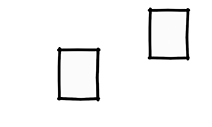
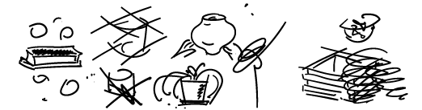
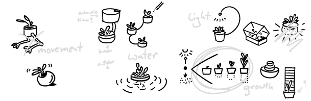
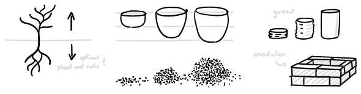
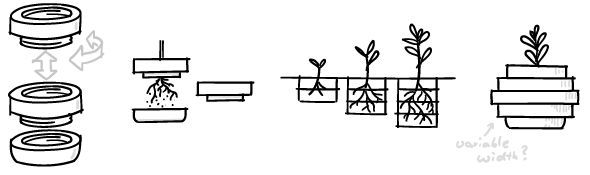
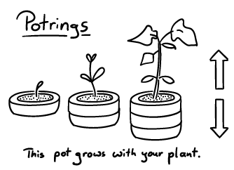

1\. December 20226164 Views

Great ideas are hard to find. Drawing makes it a lot easier. And fun. How?

伟大的想法很难找到。绘图使它变得容易得多。和乐趣。如何？

In a [creative process](https://ralphammer.com/the-creative-switch/) drawing can play **four different roles**.  
在创作过程中，绘画可以扮演四种不同的角色。  

Let’s say, we want to come up with **ideas for a new flower pot**.  
比方说，我们想想出一个新花盆的点子。  

## **1\. Study: Fill your mind  
1\. 学习：填满你的思想  
**

To **prepare** for our ideation we first draw what we want to think about. These **study drawings** are realistic images. They force us to **observe** our subject closely and absorb as much knowledge as possible.

为了准备我们的构思，我们首先画出我们想要思考的东西。这些研究图纸是逼真的图像。它们迫使我们密切观察我们的主题并吸收尽可能多的知识。

We clarify, pay attention to details, and make the invisible visible.  
我们澄清，关注细节，让看不见的东西看得见。  

Illustrations [make abstract thoughts accessible](https://ralphammer.com/a-lightbulb-is-not-an-idea/) to our **emotional and bodily thinking**—to our **intuition**.

插图使我们的情感和身体思维——我们的直觉——可以理解抽象思想。

So when we do text research, we add illustrations to make the new knowledge more **concrete** and **real**. Speaking of bodily **experience**: Don’t just look! If we want to learn about flower pots it helps to get our hands dirty and do some gardening. Hell, we might even try pottery! And of course we make sketches of everything we learn along the way.

所以我们在做文本研究的时候，会加入插图，让新知识更加具体和真实。说到身体体验：不要只看！如果我们想了解花盆，那么动手做一些园艺工作会很有帮助。见鬼，我们甚至可以试试陶器！当然，我们会为一路上学到的一切画草图。

The aim of the study phase is to understand **what is there** and **what is going on**. Since we can’t draw everything we are forced to make a choice. This helps us **clarify our interests** and what we actually want. 

研究阶段的目的是了解那里有什么以及正在发生什么。由于我们无法绘制所有内容，因此我们不得不做出选择。这有助于我们弄清楚我们的兴趣和我们真正想要的是什么。

In our case, that means: what kind of flower pot we want to design.  
在我们的例子中，这意味着：我们想要设计什么样的花盆。  

## 2\. Explore: Let it happen  
2.探索：让它发生  

After we have taken in as much information as possible, we now want to go “crazy” and **draw** as **many** **ideas** as possible. 

在我们获取了尽可能多的信息之后，我们现在想要“疯狂”并尽可能多地提出想法。

But what if our mind goes blank and we don’t have any?   
但是，如果我们的头脑一片空白，什么也没有呢？  

Then we still need to draw.   
然后我们还需要绘制。  

Ok, but what?  
好的，但是什么？  

Anything! Just put that pen on the paper and **keep it moving**. Scribble, make random marks and shapes. This will kickstart our visual thinking process.

任何事物！只需将那支笔放在纸上并保持移动即可。涂鸦，制作随机标记和形状。这将启动我们的视觉思维过程。

And what are we thinking about? New plant pots of course! We draw everything that comes to mind. Everything! Those drawings just keep pouring **from our mind through our hands on that sheet of paper**. We have created a **loop** where our imaginations turn into drawings and those drawings initiate new imaginations.

我们在想什么？当然是新花盆！我们画出想到的一切。一切！那些图画不断地从我们的脑海中涌出，通过我们的手在那张纸上。我们创造了一个循环，在这个循环中我们的想象力变成了图画，而这些图画又引发了新的想象。

But these imaginations are fickle, they keep changing and might even disappear forever—if we don’t **catch them with our pen**. So we have to move **fast**! This is where all our hard work on those [drawing exercises](https://ralphammer.com/a-quick-beginners-guide-to-drawing/) pays off. The better trained our hands and eyes are, the more **spontaneous** is the flow of ideas.

但这些想象是善变的，它们不断变化，甚至可能永远消失——如果我们不用笔去捕捉它们的话。所以我们必须快速行动！这是我们在这些绘画练习上的所有努力得到回报的地方。我们的手和眼睛训练得越好，思想的流动就越自然。

And there is no need to worry about whether our drawings are ugly or unintelligible. At this point they are only here for us. We use drawing to have a **productive private monologue**, to think out loud on paper. The **exploration** phase is all about **spontaneous** drawings to **get going**, **stimulate** our imagination, and **fixate** all those ideas **rapidly**. It is not a beauty contest.

而且再也不用担心我们画的画的难看、看不懂了。在这一点上，他们只是为我们而来。我们使用绘画进行富有成效的私人独白，在纸上大声思考。探索阶段是关于自发画画开始，激发我们的想象力，并迅速固定所有这些想法。这不是选美比赛。

## 3\. Develop: See how it works  
3\. 开发：看看它是如何工作的  

Once we get into “sober mode” it is time to figure out which idea might actually work. So we **arrange** our ideas spatially, **group them** into similar ideas, and maybe add some **annotations**.

一旦我们进入“清醒模式”，就该弄清楚哪个想法可能真正起作用了。所以我们在空间上排列我们的想法，将它们归为相似的想法，并可能添加一些注释。

Then we make a selection and **clarify** what we are after. I decided to go for a plant pot that somehow supports the growth of the plant. These drawings are **cleaner** than our initial sketches.

然后我们进行选择并明确我们所追求的是什么。我决定买一个能以某种方式支持植物生长的花盆。这些图纸比我们最初的草图更清晰。

They are also more precise, especially since we want to explore the **feasibility** of our ideas.

它们也更精确，特别是因为我们想探索我们想法的可行性。

## 4\. Show: Share what matters  
4\. 展示：分享重要的事情  

To share our ideas with others we must **focus on the essential**.  
要与他人分享我们的想法，我们必须专注于本质。  

The look and level of detail depend on the context. Our sketch here is made for an informal critique among designers. In a final product presentation we would use a series of images to lead the audience from the initial problem to the solution.

外观和详细程度取决于上下文。我们这里的草图是为设计师之间的非正式评论而制作的。在最终产品演示中，我们将使用一系列图像引导观众从最初的问题到解决方案。

When ideas are still in their infancy—for example here I am not 100% sure we should go with the pot rings and want to discuss the idea with fellow designers—I recommend a very simple format: 

当想法还处于起步阶段时——例如在这里，我不是 100% 确定我们应该使用锅环并想与其他设计师讨论这个想法——我推荐一种非常简单的格式：

-   one headline  
    一个标题  
    
-   one image 一张图片
-   one written sentence  
    一个书面句子  
    

When we show an idea—as opposed to a final product—we usually want to **make room for debate**. The less we show, the more people can think and say. The drawing should be **clear** but **not too elaborated**. The text is kept **simple** and **short**. Too much information might suffocate precious feedback from others.

当我们展示一个想法——而不是最终产品——我们通常想要为辩论腾出空间。我们展示的越少，人们可以思考和说的越多。绘图应该清晰，但不要太复杂。文本保持简单和简短。太多的信息可能会扼杀来自他人的宝贵反馈。

## Drawing ideas as an extension of our mind  
将想法作为我们思维的延伸  

**Study** drawings are **rich with details** to make us familiar with our subject. In the **exploration** phase we fixate fleeting imaginations on paper. These sketches are **rough**, **spontaneous**, and above all: **fast**!

研究图纸包含丰富的细节，使我们熟悉我们的主题。在探索阶段，我们将稍纵即逝的想象凝固在纸上。这些草图是粗略的、自发的，最重要的是：快！

To make sense of these sketches we **clarify** our ideas using **elaborate clean** drawings. When we **show** an idea to other people we keep it **short** and **simple**, to make room for debate.

为了理解这些草图，我们使用精心制作的干净绘图来阐明我们的想法。当我们向其他人展示一个想法时，我们会保持简短，以便为辩论腾出空间。

Drawing ideas with pen and paper can build a bridge between our imagination and the reality we want to create. So get started with [these little drawing exercises](https://ralphammer.com/a-quick-beginners-guide-to-drawing/)!

用笔和纸画出想法可以在我们的想象力和我们想要创造的现实之间架起一座桥梁。所以开始做这些小绘画练习吧！

### Before you go  
你走之前  

If you enjoyed this article, then **subscribe to my mailing list** to receive more animated stories!

如果您喜欢这篇文章，请订阅我的邮件列表以接收更多动画故事！
