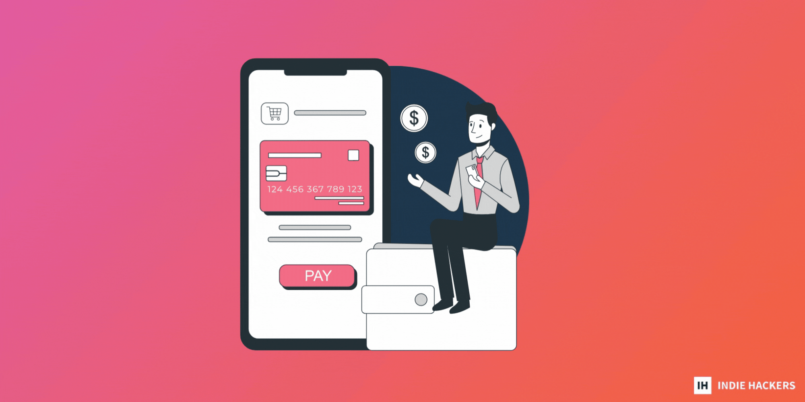

## 💰 Pricing Your Product in 2023

## 💰 在 2023 年为您的产品定价

_by [James Fleischmann](https://www.indiehackers.com/IndieJames)_

_詹姆斯·弗莱施曼( [James Fleischmann)](https://www.indiehackers.com/IndieJames)_

Pricing is a really difficult thing to nail. Entire books have been written about pricing, but from what I’ve seen, very little of what is written actually applies to indie hackers.

定价是一件很难确定的事情。 整本书都是关于定价的，但据我所见，所写的内容很少适用于独立黑客。

Here's what you need to know about pricing!

这是您需要了解的有关定价的信息！

### Pricing strategies

### 定价策略

There are a ton of pricing strategies out there, but only a few really apply to indie hackers. Let's get right to the ones that count:

有大量的定价策略，但只有少数真正适用于独立黑客。 让我们开始讨论那些重要的：

_1\. Competitor-based pricing:_

_1\. 基于竞争对手的定价：_

Take a look at your competitors to understand how their product compares to yours, then price yours lower or higher accordingly.

看看你的竞争对手，了解他们的产品与你的产品相比如何，然后相应地降低或提高你的价格。

When comparing products, it’s easy to get caught up in features. But think about quality, customer service, and brand recognition, too.

比较产品时，很容易陷入功能之中。 但也要考虑质量、客户服务和品牌知名度。

The beautiful part of this strategy is that the more established your competitor is, the more they’ve tested and honed their pricing. That means that you can let them do a lot of the heavy lifting for you! It’s easy, low-risk, and is a darn good starting point.

这个策略的美妙之处在于，你的竞争对手越成熟，他们就越多地测试和磨练他们的定价。 这意味着您可以让他们为您做很多繁重的工作！ 这很容易，风险低，是一个非常好的起点。

The biggest problem with this method is that, if you’re niching down hard, your audience may not have the same willingness to pay as your competitor's audience, so keep that in mind.

这种方法的最大问题是，如果你努力寻找细分市场，你的受众可能不会像竞争对手的受众那样愿意付费，所以请记住这一点。

_2\. Value-based pricing:_

_2\. 基于价值的定价：_

This is the golden child of SaaS pricing strategies. Consider the value you’re providing, and talk to customers about it to determine a price that they’re willing to pay.

这是 SaaS 定价策略的金子。 考虑您提供的价值，并与客户讨论它以确定他们愿意支付的价格。

This also helps you create a great product with awesome customer service (as if you didn’t already have enough incentive!). And, it allows you to charge higher prices right off the bat, since you have the data to back up that decision.

这也可以帮助您创建具有出色客户服务的出色产品（就好像您还没有足够的动力一样！）。 而且，它允许您立即收取更高的价格，因为您有数据来支持该决定。

While this sounds great on paper, it’s not an easy strategy to adopt. You need to really know your customers and what they’re willing to pay. That requires a lot of research, including interviewing potential customers. If you happen to be building something that scratches your own itch, you’ve got a leg up here.

虽然这在理论上听起来不错，但采用起来并不容易。 您需要真正了解您的客户以及他们愿意支付的费用。 这需要进行大量研究，包括采访潜在客户。 如果您碰巧正在构建一些能够满足您的需求的东西，那么您在这里有优势。

_3\. Others:_

_三、其他：_

I’ve researched other strategies, and they just don’t apply to indie hackers.

我研究过其他策略，但它们不适用于独立黑客。

There is one more thing to take into consideration. I’m a big believer in going with your gut, and I don’t see any reason why that wouldn’t be a good starting point for pricing. The important thing to remember is that, after you launch, prices can (and should) be adjusted.

还有一件事需要考虑。 我坚信要随心所欲，而且我看不出有任何理由认为这不是一个好的定价起点。 需要记住的重要一点是，在您推出后，价格可以（也应该）进行调整。

### Pricing models

### 定价模型

In addition to pricing strategies, there are four pricing models that will likely apply to indie hackers:

除了定价策略之外，还有四种可能适用于独立黑客的定价模型：

1\\. Tiered pricing: This will be what most indie hackers go with. Under this pricing model, you offer multiple tiers of your product. It allows you to access different user segments, increase revenue, and anchor the price point, making it more likely that customers will opt for their preferred tier. There aren’t really any downsides. Note: I would probably include freemium pricing in this model.

1\\。 分层定价：这将是大多数独立黑客的做法。 在这种定价模式下，您可以提供多层产品。 它允许您访问不同的用户群、增加收入并锚定价格点，从而使客户更有可能选择他们喜欢的层级。 真的没有任何缺点。 注意：我可能会在此模型中包括免费增值定价。

2\\. Per-seat pricing: This is another popular one, though it is used almost exclusively for B2B products. Under this model, you charge per user on a plan. It’s great because your revenue is predictable, and it scales. On the flip side, it can cause churn. According to Patrick Campbell, you should only go this route if each user has access to different things. If user A can log into user B’s account and everything is the same, this is not the right model.

2\\. 按座位定价：这是另一种流行的定价方式，尽管它几乎专门用于 B2B 产品。 在此模型下，您按计划向每位用户收费。 这很棒，因为您的收入是可预测的，并且可以扩展。 另一方面，它可能会导致客户流失。 根据 Patrick Campbell 的说法，只有当每个用户都可以访问不同的东西时，你才应该走这条路。 如果用户 A 可以登录到用户 B 的帐户并且一切都一样，则这不是正确的模型。

3\\. Flat-rate pricing: This means one price only, and one set of features. It’s the simplest way (both for you and the customer), but it ignores certain customer segments, thus leaving money on the table.

3\\. 固定费率定价：这意味着只有一个价格和一组功能。 这是最简单的方法（对您和客户而言），但它忽略了某些客户群，从而让钱悬而未决。

4\\. Usage-based pricing: Think “pay-as-you-go." It makes a lot of sense if the value you’re providing is based on transactions, gigabytes, etc. It’s nice because the price scales with usage, which increases revenue while reducing churn. On the flip side, it’s hard to predict revenue.

4\\。 基于使用的定价：想想“现收现付”。如果你提供的价值是基于交易、千兆字节等，这很有意义。这很好，因为价格随使用而变化，从而增加收入同时减少客户流失。另一方面，很难预测收入。

### How to price your product

### 如何为你的产品定价

First off, decide whether you’re opting for a one-time payment or a subscription model. Second, decide which pricing model makes the most sense for you. Let’s be honest, the vast majority of us are going to go with tiered pricing, since it’s tried and true.

首先，决定您是选择一次性付款还是订阅模式。 其次，确定哪种定价模式最适合您。 老实说，我们中的绝大多数人都会采用分层定价，因为它已经过尝试并且是真实的。

Third, decide on your pricing strategy and use it to decide your price. Here’s my unpopular opinion: Don’t use value-based pricing. Not in full, at least. Yes, it’s the best way to go for most software products, but indie hackers are a different breed. Most of us have few resources to throw at pricing, so a mix between two strategies might be a better option.

第三，决定你的定价策略并用它来决定你的价格。 这是我不受欢迎的观点：不要使用基于价值的定价。 至少不完整。 是的，这是大多数软件产品的最佳途径，但独立黑客是另一类。 我们大多数人都没有多少资源可以用于定价，因此混合使用两种策略可能是更好的选择。

### Value-based pricing steps

### 基于价值的定价步骤

1.  Identify your _quantifiable_ customer personas: Here’s a [template](https://docs.google.com/spreadsheets/d/1QZ8sNT7aP3TWHDsrK8k1vN_HDohxQUQaPok1BfVh0Uo/edit#gid=0) for this from ProfitWell. If you don’t have the required data, just make your best guesses.
2.  Find your value metric: What exactly are you charging for?
3.  Survey people within those personas: What price would feel too high, too low, etc.? Is your value metric correct?
4.  Build tiers based on what you’ve found.
5.  Apply it and see how it does: Adjust as necessary.

1.  确定 _可量化_ 的客户角色：这是 ProfitWell 提供的 [模板](https://docs.google.com/spreadsheets/d/1QZ8sNT7aP3TWHDsrK8k1vN_HDohxQUQaPok1BfVh0Uo/edit#gid=0) 。 如果您没有所需的数据，请做出您最好的猜测。
2.  找到你的价值指标：你究竟是为了什么收费？
3.  调查这些角色中的人：什么价格会感觉太高、太低等？ 您的价值指标是否正确？
4.  根据您发现的内容构建层级。
5.  应用它，看看效果如何：根据需要进行调整。

### Competitor-based pricing steps

### 基于竞争对手的定价步骤

1.  Identify competitors that are similar to you.
2.  Analyze their product, price, and position.
3.  Compare their product and position (i.e. cheap vs. luxury) to yours.
4.  Either go above, below, or equal to your closest competitor. Or, calculate the average price of your competitors for a benchmark, then go above, below, or equal to that.
5.  Apply it and see how it does. Adjust as necessary.

1.  确定与您相似的竞争对手。
2.  分析他们的产品、价格和定位。
3.  将他们的产品和定位（即廉价与奢侈品）与您的进行比较。
4.  要么高于、低于或等于您最接近的竞争对手。 或者，计算竞争对手的平均价格作为基准，然后高于、低于或等于该基准。
5.  应用它，看看它是如何工作的。 根据需要进行调整。

### The best of both worlds

### 两全其美的

Here’s my suggestion. It’s less scientific than value-based pricing, but it’s quicker:

这是我的建议。 它不如基于价值的定价科学，但速度更快：

1.  Identify your target market.
2.  Identify your value metric.
3.  Identify competitors who have a similar target market and value metric to you. Note: If you have a different target market than your competitor, make an educated guess as to whether they’re willing to pay more or less.
4.  Compare their product and position to yours.
5.  Either go above, below, or equal to your closest competitor. Or, calculate an average price of your competitors for a benchmark, and go above, below, or equal to that.
6.  Confirm that you’re happy with that based on your perceived value of your product (don’t bother doing all that fancy persona work).
7.  Brand yourself accordingly.
8.  Publish the price and see how it does.
9.  Adjust as necessary.

1.  确定您的目标市场。
2.  确定您的价值指标。
3.  确定与您具有相似目标市场和价值指标的竞争对手。 注意：如果您的目标市场与您的竞争对手不同，请对他们是否愿意支付更多或更少的费用做出有根据的猜测。
4.  将他们的产品和定位与您的进行比较。
5.  要么高于、低于或等于您最接近的竞争对手。 或者，计算竞争对手的平均价格作为基准，然后高于、低于或等于该基准。
6.  根据您对产品的感知价值确认您对此感到满意（不要费心做所有那些花哨的角色工作）。
7.  相应地给自己打上烙印。
8.  公布价格，看看效果如何。
9.  根据需要进行调整。

### Other things to consider

### 其他需要考虑的事情

Here are a few other things to consider while you go through the pricing process:

在您进行定价过程时，还需要考虑以下几点：

-   How soon do you need to cover costs? Will you be able to do that in time? You’ll need to make projections about revenue for this.
-   您需要多久支付费用？ 你能及时做到吗？ 您需要为此做出收入预测。
-   Customers’ willingness to pay.
-   客户的支付意愿。
-   Demand.
-   要求。
-   Price elasticity: Are customers very conscious of price, or will a change in price have very little effect?
-   价格弹性：客户对价格非常在意，还是价格变化影响很小？
-   What would _you_ actually pay?
-   实际上会 _你_ 付出什么？
-   LTV:CAC ratio: While most of your costs don’t really increase much per customer for software products, marketing costs do tend to increase. Most SaaS companies aim for a ratio of four or more.
-   LTV：CAC 比率：虽然软件产品的每个客户的大部分成本并没有真正增加太多，但营销成本确实会增加。 大多数 SaaS 公司的目标是比率为 4 或更多。

### Pricing best practices

### 定价最佳实践

Here are some suggestions that I picked up while researching pricing:

以下是我在研究定价时得到的一些建议：

-   Determine pricing early on: Talk to your early customers about pricing.
-   尽早确定定价：与您的早期客户讨论定价。
-   Charge more, but remember that it’s better to start a little too cheap than to start too expensive. Starting out too expensive will impact your product’s validation process. In the beginning, it’s generally more important to have users than it is to have profit.
-   收取更多费用，但请记住，开始时便宜一点比起价太贵要好。 起步太贵会影响产品的验证过程。 一开始，拥有用户通常比获得利润更重要。
-   Keep your pricing simple.
-   保持定价简单。
-   Never stop pricing: Markets change and the economy fluctuates. Many founders recommend reassessing every quarter.
-   永远不要停止定价：市场在变化，经济在波动。 许多创始人建议每个季度重新评估一次。
-   Make sure you nail your value proposition.
-   确保你确定了你的价值主张。
-   Anchor potential customers by showing a few options.
-   通过展示几个选项来锁定潜在客户。
-   Freemium is great sometimes, but it shouldn’t be taken for granted. Make sure it’s right for you.
-   免费增值有时很棒，但不应将其视为理所当然。 确保它适合您。
-   Localize the currency symbol.
-   本地化货币符号。
-   Account for [purchasing power parity](https://www.indiehackers.com/post/tip-increase-sales-by-accounting-for-purchasing-power-parity-in-your-pricing-54bd9a1ba8) in your pricing.
-   考虑 [购买力平价。](https://www.indiehackers.com/post/tip-increase-sales-by-accounting-for-purchasing-power-parity-in-your-pricing-54bd9a1ba8) 在您的定价中
-   Consider offering a free trial, even if you have a free tier.
-   考虑提供免费试用，即使您有免费套餐。
-   End your price with a nine if your product is cheap. End it with a zero if it’s luxury.
-   如果您的产品便宜，请以九结尾。 如果它是奢侈品，则以零结尾。
-   If you’re discounting your annual plan, use a dollar or month discount, not a percentage discount. But be cautious with this; some studies show that annual discounts result in lower revenue.
-   如果您要为年度计划打折，请使用美元或月度折扣，而不是百分比折扣。 但要小心这一点； 一些研究表明，年度折扣会导致收入减少。
-   If you have an enterprise tier, it should have custom pricing so you can charge according to their requirements.
-   如果你有企业级，它应该有自定义定价，这样你就可以根据他们的要求收费。

While A/B testing is usually a good practice, most will say it’s a no-go for pricing. It’s inherently unfair to some of your potential customers, and you need a lot of sales for the test to be statistically significant, anyway.

虽然 A/B 测试通常是一种很好的做法，但大多数人会说这不适合定价。 这对你的一些潜在客户来说本质上是不公平的，而且你需要大量的销售才能使测试具有统计意义，无论如何。

Instead, just start at a price and increase it every now and then. Every increase is a test, and you can revert if necessary. And, of course, grandfather your old users in at their original price.

相反，只是从一个价格开始，然后不时地增加它。 每次增加都是一次测试，如有必要，您可以恢复。 当然，您的老用户将以原价购买。

Don’t overthink it. You’re likely going to be wrong about pricing, anyway. Name a price, launch, then tweak accordingly!

不要想太多。 无论如何，您在定价方面很可能是错误的。 命名价格，启动，然后相应地调整！

_What are your top tips for pricing? Share your experience below!_

_您的定价秘诀是什么？ 在下面分享您的经验！_

_[Discuss](https://www.indiehackers.com/post/how-to-price-your-product-indie-hackers-shouldnt-follow-the-usual-advice-0b994f58f6) this story._

_[讨论](https://www.indiehackers.com/post/how-to-price-your-product-indie-hackers-shouldnt-follow-the-usual-advice-0b994f58f6) 这个故事。_
