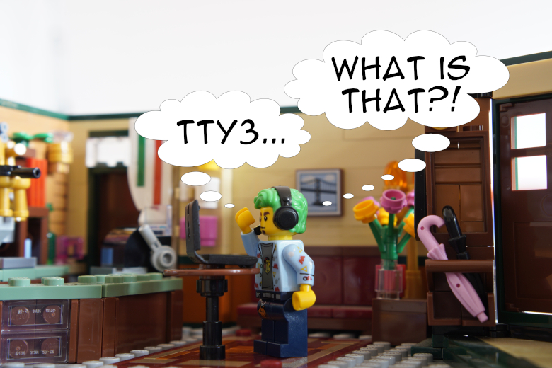
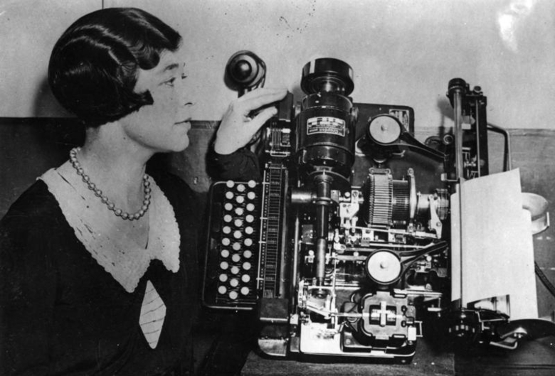
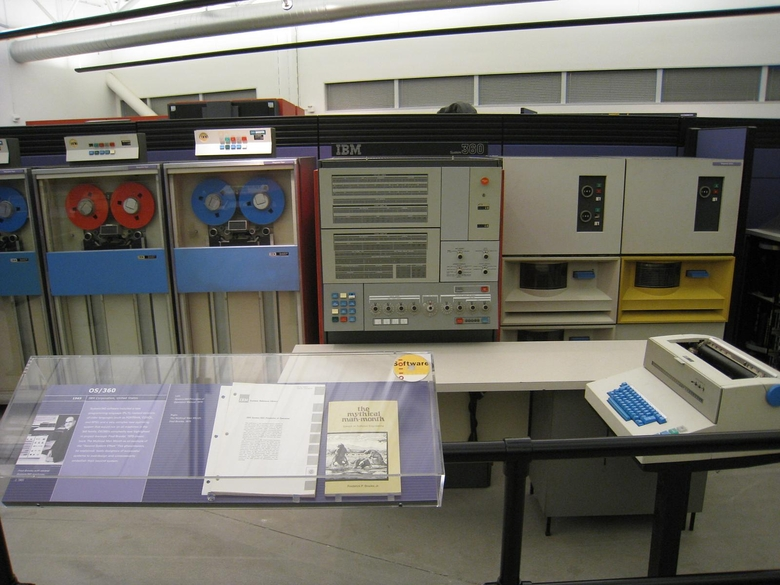
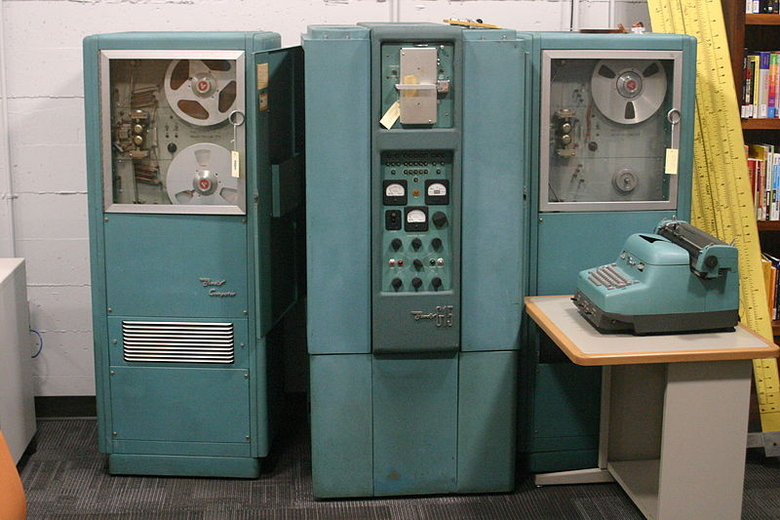
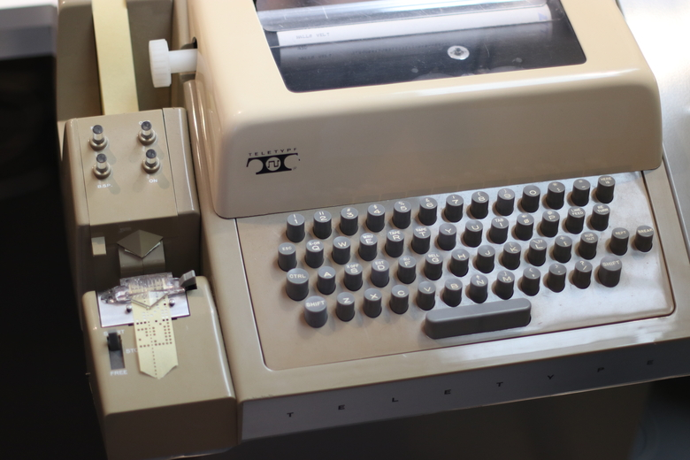
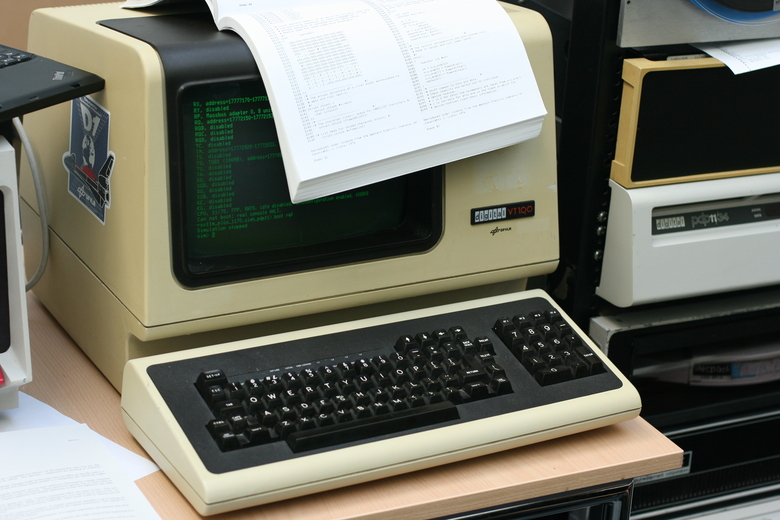

This is a boring morning for every employee of MegaCorpMoneyMaker, the famous E-commerce. You are no exception: only dragging yourself out of your bed to crawl to your office required some superhuman efforts.

对于大名鼎鼎的电商MegaCorpMoneyMaker的每一位员工来说，这是一个无聊的早晨。你也不例外：只是把自己从床上拖起来爬到你的办公室需要一些超人的努力。

Dave, your colleague developer, loudly explain to an intern what she should do to connect to one of the company’s Kubernetes cluster. “So, now, you need to open your virtual shell for your terminal to request information from your console using Bash. Does it make sense?”.

你的同事开发人员 Dave 大声向实习生解释她应该如何连接到公司的 Kubernetes 集群之一。 “所以，现在，您需要为您的终端打开虚拟 shell，以使用 Bash 从您的控制台请求信息。是否有意义？”。

Mesmerized by the nonsensical discourse of your colleague, you begin to wonder what’s the deep purpose of your life. Suddenly, this question found a clear answer: you see Davina, another of your colleague, stand up, take a Banjo from nowhere, and begin to sing a poem, like a troubadour lightening the ignorance of some middle-age peasants.

被你同事的荒谬话语迷住了，你开始怀疑你生命的深层目的是什么。突然间，这个问题有了明确的答案：你看到你的另一位同事达维娜站起来，不知从哪儿拿了一把班卓琴，开始唱一首诗，像一个游吟诗人，点亮了一些中年农民的懵懂。

> Once upon a time, as far as I can tell, There was the console, the terminal, and the shell. Let me tell you the story of these divine tools, For you to stop looking like ignorant fools.
> 
> 曾几何时，据我所知，有控制台、终端和 shell。让我告诉你这些神器的故事，让你不再像无知的傻瓜。

Everybody gathers around Davina to hear her story. Her music sounds ancient and magical, and they soon have the feeling to slide in an ancient time…

每个人都聚集在戴维娜身边听她的故事。她的音乐听起来古老而神奇，他们很快就有了一种穿越到古代的感觉……

Why does Davina want her colleagues to know more about the virtual consoles, the terminal, and the shell?

为什么 Davina 希望她的同事更多地了解虚拟控制台、终端和 shell？

I don’t know any developer who doesn’t use a terminal, a shell, and some CLIs. I definitely use them all the time. They are the central building bricks of my [Mouseless Development Environment](https://thevaluable.dev/mouseless-development-environment/).

我不知道有哪个开发人员不使用终端、shell 和一些 CLI。我肯定一直在使用它们。它们是我的无鼠标开发环境的核心构建块。

So, since it’s so useful, let’s look a bit deeper what’s this shell, console, and terminal. More precisely, we’ll see, in this article:

所以，既然它是如此有用，让我们更深入地了解一下这个 shell、控制台和终端是什么。更准确地说，我们将在本文中看到：

-   The legacy of physical teletypes in Unix-based systems.  
    基于 Unix 的系统中物理电传打字机的遗留问题。  
    
-   What are virtual consoles (TTY).  
    什么是虚拟控制台 (TTY)。  
    
-   What are pseudoterminals.  
    什么是伪终端。  
    
-   What’s the shell. 外壳是什么。
-   How to customize a terminal.  
    如何自定义终端。  
    

This article is the result of a reader asking me to write about the terminal. Don’t hesitate to subscribe to the [newsletter](https://thevaluable.dev/page/newsletter/) to ask me what you’d like to read in The Valuable Dev!

这篇文章是一位读者让我写终端的结果。不要犹豫，订阅时事通讯，问我您想在 The Valuable Dev 中阅读什么！

In this article, I’ll mostly speak about terminals in the context of a Linux-based system; that said, they can also be applied to Unix-based systems at large (including macOS).

在本文中，我将主要讨论基于 Linux 的系统环境中的终端；也就是说，它们也可以应用于整个基于 Unix 的系统（包括 macOS）。

Strap on in the time machine, this will be a wild ride. The terminal carry a lot of baggage from devices of forgotten eras, so let’s come back in time!

穿上时光机，这将是一次疯狂的旅程。航站楼承载着许多来自被遗忘时代设备的包袱，让我们及时回来吧！

## From the Telegraph to the Video Terminal  
从电报到视频终端  

Internet wasn’t only the result of some military project in the 70s. As far as history can remember, humanity was always compelled to send long distance messages. Many different cultures tried different ways to do so: smoke, pigeons, or even [drum beats](https://en.wikipedia.org/wiki/Drums_in_communication).

互联网不仅仅是 70 年代某些军事项目的结果。就历史记忆而言，人类总是被迫发送长途信息。许多不同的文化尝试了不同的方式来做到这一点：烟雾、鸽子，甚至鼓声。

One of the biggest accomplishment in this quest was the invention of the telegraph. That’s our first stop to understand why the Unix terminal is an intertwined set of different ideas glued together.

这一探索中最大的成就之一是电报的发明。这是我们理解为什么 Unix 终端是一组交织在一起的不同想法的第一站。

### The Telegraph

The history of the telegraph goes back from the 17th and 18th century. At that time, there were already some ways to send telegraphs on long distances! The technology jumped forward in the 18th century: during the french revolution, there was suddenly an urgent need for the telegraph; after all, the French monarchy (and the king’s head) was on the line. That’s why the telegraph expanded quickly in France first, and then in Europe.

电报的历史可以追溯到 17 和 18 世纪。那时，已经有了一些远距离发送电报的方法！这项技术在 18 世纪突飞猛进：在法国大革命期间，突然对电报产生了迫切的需求；毕竟，法国君主制（和国王的脑袋）正处于危险之中。这就是为什么电报首先在法国迅速发展，然后在欧洲迅速发展的原因。

To send a telegraph, you needed two persons on each side of the line (emission and reception): the operators. At the time, it was not possible to send messages in plain text, so the operators had to encode them; for example in the famous Morse system, but not only.

要发送电报，您需要在线路的每一侧（发射和接收）各配备两个人：接线员。当时，无法以纯文本形式发送消息，因此运营商必须对其进行编码；例如在著名的莫尔斯系统中，但不仅如此。

Let’s say that you’re a respectable citizen from Berlin in the 19th century, and you want to send a telegraph to your best friend in Paris. You would need to go to the telegraph office in Berlin, and give your message (in plain text) to the operator there. He would encode it, and send it to Paris. There, a second operator would decode your message, write it somewhere, and give it to Dave, your best friend.

假设您是 19 世纪柏林的一位受人尊敬的公民，您想给巴黎最好的朋友发一封电报。您需要前往柏林的电报局，将您的信息（以纯文本形式）提供给那里的接线员。他会对其进行编码，然后将其发送到巴黎。在那里，第二个操作员会解码您的消息，将其写入某个地方，然后将其交给您最好的朋友戴夫。

There were many types of telegraph invented throughout the 18th and 19th century. The most famous was the electric telegraph, but there were many other variants too; it eventually led to the invention of the telephone.

整个 18 和 19 世纪发明了多种类型的电报。最著名的是电报，但还有许多其他变体；它最终导致了电话的发明。

For example, there were also the optical telegram, the helograph telegram, even wireless telegraphy was a thing.

例如，还有光学电报、直射电报，甚至无线电报也是一回事。

### The Teleprinter, Teletype, or TTY  
电传打字机、电传打字机或 TTY  

Throughout the decades, the traffic of telegrams increased worldwide. Many were thinking about possible solutions to automate the whole process. The need for trained operators able to encode and decode messages were getting bigger and bigger, leading to the invention of the teleprinter.

在过去的几十年里，全球范围内的电报流量不断增加。许多人正在考虑使整个过程自动化的可能解决方案。对能够编码和解码信息的训练有素的操作员的需求越来越大，这导致了电传打字机的发明。



A Creed Model 7 teleprinter, 1931 - [source](https://commons.wikimedia.org/wiki/File:Bundesarchiv_Bild_183-2008-0516-500,_Fernschreibmaschine_mit_Telefonanschluss.jpg)  
A Creed Model 7 电传打字机，1931 年 - 来源  

As you can see, it was a physical device composed of a keyboard and a printer. With a teleprinter, you could type your message in plain text; it would then be encoded automatically, and sent. On the other side, a teletype could decode the message, and print it.

如您所见，它是由键盘和打印机组成的物理设备。使用电传打字机，您可以以纯文本形式键入消息；然后它会自动编码并发送。另一方面，电传打字机可以解码消息并打印出来。

With the adoption of the teleprinter, the Morse system wasn’t the best code to send messages anymore; it wasn’t really machine friendly. That’s where the Baudot code entered the chat: each character had the same length, making it easier for the teleprinters to handle. It could also encode more characters! Five bit sequential of binary code, allowing 32 (2^5) possible characters in your messages. Even better: a “shift” key (or FIGS, for “figure shift”) was allowing numbers and special characters in the messages for the first time.

随着电传打字机的采用，莫尔斯系统不再是发送消息的最佳代码；它不是真正的机器友好。这就是 Baudot 代码进入聊天的地方：每个字符的长度相同，使电传打字员更容易处理。它还可以编码更多字符！五位二进制代码顺序，允许 32 (2^5) 个可能的字符在您的消息中。更好的是：“shift”键（或图，“figure shift”的意思）首次允许在消息中使用数字和特殊字符。

The Baudot code had also some early control characters (CR). For example, let’s say that you wanted to send a message, but you made a typo: you could use the “DEL” code to say that you wanted the character before it to be deleted. When the message was received, the teleprinter in charge of printing back the message wouldn’t print the “DEL” code, but instead it would skip the character just before it. That’s also why control characters are also called non-printable characters.

Baudot 代码也有一些早期的控制字符 (CR)。例如，假设您想发送一条消息，但打错了：您可以使用“DEL”代码来表示您希望删除它之前的字符。当收到消息时，负责打印回消息的电传打字机不会打印“DEL”代码，而是会跳过它之前的字符。这也是控制字符也称为不可打印字符的原因。

In 1925, the Baudot code was improved, and became the Murray code. More control characters were included: the carriage return for example (CR), to move the carriage (the “cursor” of the teleprinter) back to the left margin of the same line. You also had the line feed (LF), to advance the carriage to the same column of the next line.

1925年，博多电码得到改进，成为默里电码。包含更多控制字符：例如回车符 (CR)，用于将回车符（电传打字机的“光标”）移回同一行的左边距。您还可以使用换行符 (LF)，将托架前进到下一行的同一列。

These control characters are still used today. We’ll come back to them below in this article.

这些控制字符至今仍在使用。我们将在本文下面回到它们。

Fast-forward to the early 1930: a new network, composed of teleprinters, was invented in Europe (more specifically in Germany): the telex. AT&T launched its own version in the US in 1931. It was the cheaper way at the time to send long-distance telegrams. The speed of the network was measured in baud; in Europe, it was of 50 bauds, which was around 66 words per minute.

快进到 1930 年初：欧洲（更具体地说是德国）发明了一种由电传打字机组成的新网络：电传。 AT&T 于 1931 年在美国推出了自己的版本。这是当时发送长途电报最便宜的方式。网络速度以波特率衡量；在欧洲，它是 50 波特，即每分钟大约 66 个字。

And guess what: you can still display the speed in baud of your terminal. It doesn’t mean anything anymore, but it shows the roots of the terminal coming back to the teleprinter.

你猜怎么着：你仍然可以显示终端的波特率。它不再有任何意义，但它显示了终端的根返回到电传打字机。

In 1961, the American Standard Association created a new code for teleprinters, called the ASCII code. It’s a 7 bits codes, allowing to send bigger messages than with the Baudot (or the Murray) code, even including the luxury of lowercase and uppercase letters.

1961 年，美国标准协会为电传打字机创建了一种新代码，称为 ASCII 代码。这是一个 7 位代码，允许发送比 Baudot（或 Murray）代码更大的消息，甚至包括小写和大写字母的豪华。

It was a great step toward standardisation, too. Until then, many different codes to encode messages were still used, even if some more than others. With the ASCII code, teleprinters in the US were using the same set of characters to send messages.

这也是朝着标准化迈出的一大步。直到那时，仍然使用许多不同的代码来编码消息，即使其中一些代码比其他代码更多。使用 ASCII 码，美国的电传打字机使用相同的字符集来发送消息。

That said, the control characters themselves weren’t properly standardized. Two different teletypes could use different characters for the same control.

也就是说，控制字符本身没有正确标准化。两种不同的电传打字机可以对同一控件使用不同的字符。

The telegram began to decline as soon as 1920, mostly because of the telephone. It’s estimated that, at its peak, in 1929, there were about 200 millions telegrams sent worldwide! Journalists never stopped using them until the 90s, when the Internet came into the picture.

电报在 1920 年就开始衰落，主要是因为电话。据估计，在 1929 年的高峰期，全世界发送的电报大约有 2 亿封！直到 90 年代互联网出现之前，记者们从未停止使用它们。

Last thing: the teleprinter is the official name for the device. Teletype was a major brand producing teleprinters, that’s why “teletype” became a synonym of “teleprinter”. The abbreviation of `t`ele`ty`pe is TTY.

最后一件事：电传打字机是该设备的正式名称。 Teletype是生产电传打字机的主要品牌，因此“teletype”成为“teleprinter”的代名词。 `t`ele`ty`pe 的缩写是 TTY。

### Computers and TTYs 计算机和 TTY

In the middle of the 50s, there were already a bunch of computers available. These mainframes were massive computers taking a lot of space, many of them built by IBM. At that time, teletypes were all over the world, so it was only natural to use them to send messages to a computer.

在 50 年代中期，已经出现了一堆可用的计算机。这些大型机是占用大量空间的大型计算机，其中许多由 IBM 制造。那时候电传打字机遍布全球，用电传打字机向电脑发送信息是再自然不过的事情了。

Early computers could be categorized in two types:  
早期的计算机可以分为两类：  

-   Batch computers (IBM and Univac computers).  
    批处理计算机（IBM 和 Univac 计算机）。  
    
-   Interactive computers (like the Bendix G-15, the Librascope LGP-30, or the IBM 610).
    
    交互式计算机（如 Bendix G-15、Librascope LGP-30 或 IBM 610）。
    

To run a bunch (a batch) of programs together on batch computers, you needed to:

要在批处理计算机上一起运行一堆（一批）程序，您需要：

1.  Type your code using a teletype on punch cards.  
    使用打孔卡上的电传打字机键入您的代码。  
    
2.  Feed the different punch cards to the mainframe computer as input.  
    将不同的穿孔卡片作为输入馈送到大型计算机。  
    
3.  Get the output on a punch card.  
    在打孔卡上获取输出。  
    
4.  Insert this output into a tabulating machine, to decode it in a human-readable format.
    
    将此输出插入制表机，以人类可读的格式对其进行解码。
    



IBM mainframes with a teleprinter - [source](https://www.flickr.com/photos/thomaspurves/2333225275/in/photolist-4ybozZ-2jnfwcc-2jngzir-5Z71Y2-YZM4gp-9HxSVd-5ZbegP-4fo9xH-4FWRwZ-9iEV83-4SVevS-4SVev1-9CgsVu-77zxVy-KQQwN2-2kYyq9s-YtrZ7F-4BvkZz-4BzEx3-2a7QAGb-9z5Ezn-8DRs27-P5DwGA-4BvnaB-4BzAds-4BvjWH-4Bvpfz-2iAYJTH-2jheSRk-s8wu5N-5YyaGH-Uq9B-7nzzKy-2a7QBDS-7nzAYY-MstiBk-6Fjcin-6yodKa-9u5NHx-9Znfpi-9u5NJr-5gJRf4-9u5ReB-9u5Rf2-9u5NJT-mMuSX-WUtJuV-29Q1csP-9u5Rf6-bgRwSK)  
带有电传打字机的 IBM 大型机 - 来源  

The rise of interactive computers changed this workflow. You could then directly send your input to the machine using a teletype. More specifically, you needed to:

交互式计算机的兴起改变了这种工作流程。然后您可以使用电传打字机直接将您的输入发送到机器。更具体地说，您需要：

1.  Type your input on a teletype, which would be printed on paper for you to see what you were typing.
    
    在电传打字机上输入您的输入，电传打字机将打印在纸上以供您查看您输入的内容。
    
2.  The teletype was also sending the characters (including the control characters) to the computer.
    
    电传打字机还将字符（包括控制字符）发送到计算机。
    
3.  The computer was sending back the output to the teletype, which was also printed on paper (or punch cards).
    
    计算机将输出发回电传打字机，电传打字机也打印在纸上（或打孔卡）。
    



A Bendix G-15 - [source](https://commons.wikimedia.org/wiki/File:BendixG15-2015.JPG)  
Bendix G-15 - 来源  

These teletypes were connected to the computer using a serial port. Two wires were necessary: one to send the data to the computer, another one to receive it.

这些电传打字机使用串行端口连接到计算机。需要两根电线：一根用于将数据发送到计算机，另一根用于接收数据。

The ASR-33 (introduced in 1963) was a widely used teletype at the time. It was one of the first teletype using the ASCII standard, which was also the common encoding used by more and more “minicomputers” to transmit information. These computers are not mini by today standards, but they were smaller than massive mainframes.

ASR-33（1963 年推出）是当时广泛使用的电传打字机。它是最早使用 ASCII 标准的电传打字机之一，这也是越来越多的“小型计算机”用来传输信息的通用编码。按照今天的标准，这些计算机不是小型计算机，但它们比大型大型机还小。



An ASR-33 - [source](https://www.flickr.com/photos/stiefkind/48930224272/in/photolist-2hxNbYq-2niSrJW-2gGRrMX-4jyUbA-2k17oB8-mCWwW9-8Lz2b5-R9ehqF-RxTW5Y-K1haQs-SAD6U9-JJwvn9-RxSSVU-R9ehne-TvKr91-u4AMT8-t7KMvz-SfaJyW-H7B29r-25F5xD7-xLpdxP-tM1bDC-qYQzuF-2maA8jt-f9Z1kB-f8Di2D-fbs3Jm/)  
ASR-33 - 来源  

As we saw, there were a handful of control characters available to do some “non-printable” actions. Now that teletypes were interacting with a computer, the users needed more control characters. The ASCII introduced the `ESC` key, and “control sequences” were invented. Instead of a single key for performing an action, a sequence of key were used, often prefixed with the `ESC` character. That’s why control sequences are also called escape sequences. This prefix was not a standard however, but widely used nonetheless.

正如我们所见，有一些控制字符可用于执行一些“不可打印”的操作。现在电传打字机可以与计算机交互，用户需要更多的控制字符。 ASCII 引入了`ESC` 键，并发明了“控制序列”。不是使用单个键来执行操作，而是使用一系列键，通常以 `ESC` 字符为前缀。这就是控制序列也称为转义序列的原因。然而，这个前缀不是标准，但仍然被广泛使用。

It’s interesting to note that, at the beginning, the interactive computers would only allow one user to connect and interact with it. In 1959, the development of time-sharing allowed multiprogramming. Later, the concept of time-sharing shifted: it meant then that multiple users could interact to a single computer at the same time.

有趣的是，一开始，交互式计算机只允许一个用户连接并与之交互。 1959 年，分时技术的发展使多道程序成为可能。后来，分时的概念发生了变化：这意味着多个用户可以同时与一台计算机进行交互。

We’ve here the origin of the command-line interface: a text-only interface allowing users to communicate with a computer. Everything was printed, input as well as output.

我们在这里了解了命令行界面的起源：一个允许用户与计算机通信的纯文本界面。一切都被打印出来，输入和输出。

What if we replace the sheet of paper with a screen?  
如果我们用屏幕代替纸张会怎么样？  

### Video Terminals

In 1960, IBM began to experiment with a new way to interact with computers, the “glass teletype”, a terminal with screen. The video terminal was born.

1960 年，IBM 开始试验一种与计算机交互的新方式，即“玻璃电传打字机”，一种带屏幕的终端。视频终端诞生了。

It was similar to a teletype. Instead of printing the input and output (which was slow and, due to the mechanical nature of teletypes, quite loud), a video terminal would display everything on a screen.

它类似于电传打字机。视频终端不是打印输入和输出（速度很慢，而且由于电传打字机的机械特性，声音很大），而是将所有内容显示在屏幕上。

This video terminal was still an external device to the computer itself, including both a screen and a keyboard. Like most invention, it was very expensive at the beginning, limiting its adoption. The price dropped in the middle of the 70s, and the success of Video terminal rose.

这个视频终端仍然是计算机本身的外部设备，包括屏幕和键盘。像大多数发明一样，它一开始非常昂贵，限制了它的采用。 70年代中期价格下降，视频终端成功上升。



A DEC VT100 video terminal - [source](https://www.flickr.com/photos/stiefkind/15272092560/in/photolist-pgxt3G-N8L66P-qzwu1x-2nYG67G-2o33cg8-ov2RNX-ovj7ke-ov2TfK-2o2LXmF-2nZHgti-2o1CpGZ-2o1UJSg-2o3Ebqh-2nXJpCd-2o1fdhy-ovj778-odQnu6-odPwhv-odPyuL-othcFm-odPxUh-odPtJz-odPwVy-othbRL-odQoT8-2nWTLoT-2o24i6K-2o3gurK-2o35ccw-2nX46PP)  
DEC VT100 视频终端 - 来源  

The video terminals were also called “console”, or simply “terminal”.  
视频终端也被称为“控制台”，或简称为“终端”。  

The DEC VT100 (for `V`ideo `T`erminal) was one of the most popular choice. Released in 1978, it was one of the first video terminal supporting a new set of escape sequences, the [ANSI escape codes](https://en.wikipedia.org/wiki/ANSI_escape_code). When connected to a computer, this terminal was called a “controlling terminal”, because it was controlling the computer.

DEC VT100（`V`ideo `T`erminal）是最受欢迎的选择之一。它于 1978 年发布，是首批支持一组新转义序列（ANSI 转义码）的视频终端之一。当连接到计算机时，这个终端被称为“控制终端”，因为它控制着计算机。

## Unix System in AT&T  
AT&T 中的 Unix 系统  

Now that we have video terminals to use on minicomputers, what did the programmers in the 70s did with them?

现在我们有了可以在小型机上使用的视频终端，70 年代的程序员用它们做了什么？

### The Birth of Unix  
Unix 的诞生  

In 1970, Dennis Ritchie and Ken Thompson develop the UNIX operating system on a DEC PDP-11, a popular minicomputer series at the time. It was an interactive computer, easier to program than the competitors. It influenced not only modern CPUs (like the Intel x87) but also other operating systems, like the CP/M, the ancestor of MS-DOS (the base of Windows for many years).

1970 年，丹尼斯里奇和肯汤普森在当时流行的小型机系列 DEC PDP-11 上开发了 UNIX 操作系统。这是一台交互式计算机，比竞争对手更容易编程。它不仅影响了现代 CPU（如 Intel x87），还影响了其他操作系统，如 CP/M，MS-DOS 的祖先（多年以来 Windows 的基础）。


Ken Thompson (sitting) and Dennis Ritchie on a PDP-11 - [source](https://commons.wikimedia.org/wiki/File:Ken_Thompson_%28sitting%29_and_Dennis_Ritchie_at_PDP-11_%282876612463%29.jpg)  
肯·汤普森（坐着）和丹尼斯·里奇在 PDP-11 上——来源  

Unix was created for AT&T needs, and their creators were influenced by the long time they spent on teletypes.

Unix 是为 AT&T 的需要而创建的，他们的创造者受到他们在电传打字机上花费的长时间的影响。

With Unix, almost everything is represented by a file. External devices are no exception: when you were connecting a teletype (or a video terminal) to a machine running Unix, it would represent the device with a file prefixed by “tty”. This file was an interface between the external terminal and the computer.

在 Unix 中，几乎一切都由文件表示。外部设备也不例外：当您将电传打字机（或视频终端）连接到运行 Unix 的机器时，它将代表带有前缀为“tty”的文件的设备。该文件是外部终端和计算机之间的接口。

For example, in a multi-user context, if three teletypes were connected to your computer, you would have the file `/dev/tty1` assigned to the first one, `/dev/tty2` to the second one, and `/dev/tty3` to the third one.

例如，在多用户环境中，如果三个电传打字机连接到您的计算机，您会将文件`/dev/tty1` 分配给第一个，`/dev/tty2` 分配给第二个，`/dev/tty3` 分配给第三个。

The file `/dev/tty0` always represent the current terminal.  
文件`/dev/tty0` 始终代表当前终端。  

We can now transmit commands to the computer thanks to these external devices. But how the computer knows what to do with them?

多亏了这些外部设备，我们现在可以将命令传输到计算机。但是计算机如何知道如何处理它们呢？

It’s what the shell is good for.  
这就是外壳的好处。  

### The Shell

When you think about it, teleprinters and video terminals were quite dumb:  
仔细想想，电传打字机和视频终端是相当愚蠢的：  

1.  They take your sweet input, and display it.  
    他们接受你的甜蜜输入，并展示它。  
    
2.  They pass it to the computer.  
    他们将其传递给计算机。  
    
3.  Some program, running on the computer, interprets the input, and send back the output.
    
    一些在计算机上运行的程序解释输入，并发回输出。
    
4.  They display the output to your impressed face.  
    他们将输出显示在您印象深刻的脸上。  
    

But what program are we talking about, here? What can _interpret_ our commands? That’s where the shell shines.

但是我们在这里谈论的是什么程序？什么可以解释我们的命令？这就是外壳闪耀的地方。

Imagine that you’re an AT&T employee working with Dennis Ritchie. You’re writing `ls` on your video terminal, and send it to the computer by hitting the control character Carriage Return (the `ENTER` key on our modern keyboards). The shell, running on the computer, receives the command, interprets it, and understands that you want to execute the program `ls`. As a result, it might send some system call to the kernel (we’ll come back to that soon), creates a new process `ls` (a process is simply a program being executed), and send back the output of this process to the terminal to display it.

假设您是 AT&T 的员工，与 Dennis Ritchie 一起工作。您正在您的视频终端上输入 `ls`，然后通过点击控制字符回车（现代键盘上的 `ENTER` 键）将其发送到计算机。在计算机上运行的 shell 接收命令，对其进行解释，并了解您要执行程序`ls`。结果，它可能会向内核发送一些系统调用（我们很快就会回来），创建一个新进程`ls`（一个进程只是一个正在执行的程序），并发回这个进程的输出到终端显示它。

The shell can also interpret a list of commands described in a shell script.  
shell 还可以解释 shell 脚本中描述的命令列表。  

[Here’s what you always wanted to see](https://www.youtube.com/watch?v=tc4ROCJYbm0&t=296s): a fancy 3D animation followed by [Brian Kernighan](https://de.wikipedia.org/wiki/Brian_W._Kernighan) explaining casually what the kernel and the shell are to one another, with the keyboard of a fancy video terminal on his laps, the feet on the desk. That’s charisma right there.

这是你一直想看到的：一个奇特的 3D 动画，然后是 Brian Kernighan 漫不经心地解释内核和外壳是什么，他的腿上放着一个奇特的视频终端的键盘，脚放在桌子上。那就是魅力所在。

If you can, watch the whole video. It’s awesome.  
如果可以，请观看整个视频。这很棒。  

## Types of Terminal Emulators  
终端仿真器的类型  

As time went on, with the development of OS (Operating Systems) like Unix and CP/M, the video terminals began to be [abstracted away](https://thevaluable.dev/abstraction-type-software-example/).

随着时间的推移，随着Unix、CP/M等OS（Operating Systems）的发展，视频终端开始被抽象出来。

With computers getting smaller and smaller, more and more “personal” (the first widely adopted microcomputer was the [Apple II](https://en.wikipedia.org/wiki/Apple_II) in 1977), why needing a physical external device when you can emulate the system in software?

随着计算机越来越小，越来越“个人化”（第一台被广泛采用的微型计算机是 1977 年的 Apple II），既然可以在软件中模拟系统，为什么还需要物理外部设备？

That’s where the TTY began to be emulated.  
这就是 TTY 开始被效仿的地方。  

When we speak about terminal nowadays, we think about a piece of software which allows us to write some commands. This terminal is an emulation, trying to recreate, in software, the video terminal. That’s why we speak about _terminal emulators_. This emulation is still called the _TTY device_, somehow making teletypes still part of our lives.

如今，当我们谈论终端时，我们想到的是一款允许我们编写一些命令的软件。这个终端是一个仿真，试图在软件中重新创建视频终端。这就是我们谈论终端仿真器的原因。这种仿真仍然被称为 TTY 设备，以某种方式使电传打字机仍然是我们生活的一部分。

We can distinguish two families of terminal emulators: virtual consoles and pseudoterminals.

我们可以区分两个终端仿真器系列：虚拟控制台和伪终端。

### Virtual Consoles (TTY)  
虚拟控制台 (TTY)  

Before graphical interfaces took over the computer world, virtual consoles were the only ways to interact with these OSes growing in popularity. A virtual console is a terminal emulator running in the kernel.

在图形界面接管计算机世界之前，虚拟控制台是与这些日益流行的操作系统进行交互的唯一方式。虚拟控制台是在内核中运行的终端仿真器。

Imagine that you just threw away your big video terminal. You only have a screen and a keyboard attached to a computer now, and this time the computer take your input from your keyboard, and display the output on the screen. No need of a video terminal anymore!

想象一下，您刚刚扔掉了您的大型视频终端。你现在只有一个屏幕和一个连接到计算机的键盘，这次计算机从你的键盘接收你的输入，并将输出显示在屏幕上。不再需要视频终端！

Now, when you start your computer, you’re first greeted with a login screen. You log in with your favorite user, and then the shell will display a prompt, inviting you to enter some commands. You can type these commands in your virtual console and press `ENTER`, to send them to the shell, where they will be interpreted. The output appears on your screen. You can even start other processes, like your favorite editor, which is obviously [Vim](https://thevaluable.dev/vim-commands-beginner/).

现在，当您启动计算机时，首先会看到登录屏幕。你用你最喜欢的用户登录，然后 shell 会显示一个提示符，邀请你输入一些命令。您可以在您的虚拟控制台中键入这些命令并按`ENTER`，将它们发送到 shell，在那里它们将被解释。输出出现在您的屏幕上。你甚至可以启动其他进程，比如你最喜欢的编辑器，显然是 Vim。

But, without a video terminal, what allows us to type our commands, see them on a screen, and pass them to the shell (or any of its child process), and only when we type `ENTER`? What is giving our output back? Your virtual console of course! Even if you threw away your actual physical console, it’s still there, doing the same job as before.

但是，如果没有视频终端，是什么让我们能够键入命令、在屏幕上看到它们并将它们传递给 shell（或其任何子进程），并且仅当我们键入 `ENTER` 时？是什么回馈了我们的输出？当然是您的虚拟控制台！即使您扔掉了实际的物理控制台，它仍然在那里，做着和以前一样的工作。

When you log in a virtual console, a shell process will be attached to the output of the terminal emulator (specifically the file representing the terminal, something like `/dev/tty`, as we already saw). The shell will give you a prompt, and everything you type will go directly to the TTY device.

当您登录虚拟控制台时，shell 进程将附加到终端仿真器的输出（特别是代表终端的文件，如我们已经看到的 `/dev/tty` 之类）。 shell 会给你一个提示，你输入的所有内容都会直接发送到 TTY 设备。

The virtual console itself runs in the kernel, and your shell as well as its child processes run in user land. Wait, what?

虚拟控制台本身在内核中运行，而您的 shell 及其子进程在用户空间中运行。等等，什么？

#### Kernel and User Land  
内核和用户空间  

Let’s go on a tangent here. If you didn’t know, there are two “spaces” where programs can run: the kernel and user land (also called user space).

让我们在这里切线。如果您不知道，有两个程序可以运行的“空间”：内核和用户空间（也称为用户空间）。

Part of the kernel’s job is to ensure that no program will mess up with the hardware, and also that one program can’t access the memory of another one. To ensure this level of security, most programs you run as a user will be a process in user land.

内核的部分工作是确保没有程序会弄乱硬件，并且一个程序不能访问另一个程序的内存。为了确保这种级别的安全性，您作为用户运行的大多数程序都将是用户空间中的一个进程。

If the process needs to ask the kernel to use some hardware (like writing on the hard disk, or using the RAM, for example), it will send a _system call_ to the kernel. The kernel will receive the system call, enable some more protections (on the CPU for example), and it will try to handle what the process wants.

如果进程需要请求内核使用某些硬件（例如写入硬盘或使用 RAM），它会向内核发送系统调用。内核将接收系统调用，启用更多保护（例如在 CPU 上），然后它将尝试处理进程需要的内容。

#### Linux Virtual Consoles  
Linux 虚拟控制台  

Virtual consoles fell out of fashion when desktops were being implemented in most common OS (but in very different ways). No need to have a text-based interface anymore: with desktops, we have now fancy windows, icons, status bars, and the like.

当桌面在最常见的操作系统中实现时（但以非常不同的方式），虚拟控制台已经过时了。不再需要基于文本的界面：有了桌面，我们现在有了精美的窗口、图标、状态栏等。

As a result, not many OSes give us the chance to interact with virtual consoles nowadays; but Linux-based systems still have them.

因此，现在没有多少操作系统能让我们有机会与虚拟控制台进行交互。但是基于 Linux 的系统仍然有它们。

The Linux kernel was developed with multi-users in mind from the beginning, giving us multiple virtual consoles where different users could log in in parallel.

Linux 内核从一开始就考虑到多用户的开发，为我们提供了多个虚拟控制台，不同的用户可以在其中并行登录。

When you launch some Linux distribution (like [Arch Linux](https://thevaluable.dev/mouseless-development-environment/), by the way) without any desktop installed, you’ll be greeted with a logging screen.

当你在没有安装任何桌面的情况下启动某些 Linux 发行版（顺便说一句，比如 Arch Linux）时，你会看到一个日志屏幕。

1.  First, a program called “getty” runs.  
    首先，一个名为“getty”的程序运行。  
    
2.  The process “getty” gets a TTY; this process is then replaced with another one called “login”, to give the user a login prompt.
    
    进程“getty”获得一个 TTY；然后这个过程被另一个叫做“登录”的过程所取代，给用户一个登录提示。
    
3.  After logging in, the user will get write permissions on the file representing the TTY (`/dev/tty<tty_number>`).
    
    登录后，用户将获得代表 TTY (`/dev/tty<tty_number>`) 的文件的写入权限。
    
4.  The file `/etc/passwd` will be read to decide what shell to run for this specific user. The shell will then replaces the login process.
    
    将读取文件 `/etc/passwd` 以决定为该特定用户运行哪个 shell。然后 shell 将替换登录过程。
    
5.  The shell will display a prompt for the user to type commands.  
    shell 会提示用户键入命令。  
    

If you have a desktop (like Gnome, KDE, i3, or whatever else), there will be a display server (like X or wayland) called after getting the TTY (or after the login process starts), which will in turn display the desktop. The TTY itself still runs under the hood.

如果你有一个桌面（如 Gnome、KDE、i3 或其他任何东西），将有一个显示服务器（如 X 或 wayland）在获取 TTY 后（或在登录过程开始后）调用，它将依次显示桌面。 TTY 本身仍在后台运行。

I was saying that Linux-based systems allow us to have multiple virtual consoles. With most Linux distros, if you’re in a virtual console already, you can use the `ALT` key with one of the F-key (like F1, F2… up to F6, or more) to switch between them. If you’re already running a desktop on top of one of your TTY, you can use `CTRL+ALT` followed by one of the F-key.

我是说基于 Linux 的系统允许我们拥有多个虚拟控制台。对于大多数 Linux 发行版，如果您已经在虚拟控制台中，则可以使用 `ALT` 键和其中一个 F 键（如 F1、F2……直到 F6 或更多）在它们之间切换。如果您已经在其中一个 TTY 上运行桌面，则可以使用 `CTRL+ALT` 后跟其中一个 F 键。

On Linux, the files `/dev/tty1` to `/dev/tty63` represents the different virtual consoles you can access (you might not be able to open all of them, depending on your configuration). You can actually play with that: if you’re logged with the same user on the TTY 1 and 2 (to have write permissions on the `/dev/tty` files), you can send some data from the TTY 1 to the TTY 2 by running:

在 Linux 上，文件 `/dev/tty1` 到 `/dev/tty63` 代表您可以访问的不同虚拟控制台（您可能无法打开所有这些，具体取决于您的配置）。你实际上可以玩这个：如果你在 TTY 1 和 2 上使用相同的用户登录（对 `/dev/tty` 文件有写权限），你可以通过运行将一些数据从 TTY 1 发送到 TTY 2 :

```
echo "I'm the first TTY" > /dev/tty2
```

If you switch to the second virtual console, you’ll see your input displayed on the screen.

如果你切换到第二个虚拟控制台，你会看到你的输入显示在屏幕上。

If you try to read the files themselves (using `cat` for example), you won’t see anything in there; they’re just used as interface to pass data from terminals to processes, and from processes to terminals.

如果您尝试自己读取文件（例如使用`cat`），您将看不到其中的任何内容；它们只是用作将数据从终端传递到进程，以及从进程传递到终端的接口。

You can also use the CLI `chvt` to switch to different virtual consoles: `chvt 2` will switch to the second virtual console for example.

您还可以使用 CLI `chvt` 切换到不同的虚拟控制台：例如，`chvt 2` 将切换到第二个虚拟控制台。

Even nowadays, virtual consoles can be handy for different reasons:  
即使在今天，出于不同的原因，虚拟控制台也可以派上用场：  

1.  If your graphical desktop freeze or crash, you can switch to another virtual console to debug the problem.
    
    如果您的图形桌面冻结或崩溃，您可以切换到另一个虚拟控制台来调试问题。
    
2.  If your graphical desktop crash at startup, you can also switch to a virtual console and try to solve the problem.
    
    如果您的图形桌面在启动时崩溃，您也可以切换到虚拟控制台并尝试解决问题。
    
3.  If you access a remote server (or an embedded device) without any graphical interface, you’ll only have the virtual console to work with; better knowing how it works in these cases!
    
    如果您在没有任何图形界面的情况下访问远程服务器（或嵌入式设备），您将只能使用虚拟控制台；更好地了解它在这些情况下的工作原理！
    

The virtual console is considered as the controlling terminal of all the process you can run in it (including the shell). You can display the controlling terminals for each process by using one of the following command:

虚拟控制台被视为您可以在其中运行的所有进程（包括 shell）的控制终端。您可以使用以下命令之一显示每个进程的控制终端：

-   `tty` - Show the actual controlling terminal.  
    `tty` - 显示实际控制终端。  
    
-   `who` - Show all the users logged in a controlling terminal.  
    `who` - 显示所有登录到控制终端的用户。  
    
-   `ps -eF` (with GNU ps), `ps aux` (with BSD ps) - Show the controlling terminals of all processes (if any); look at the “TTY” column.
    
    `ps -eF`（使用 GNU ps），`ps aux`（使用 BSD ps）——显示所有进程的控制终端（如果有的话）；查看“TTY”列。
    

Not all group of processes have a controlling terminal. For example, daemons started when the OS boots don’t need any terminal to control them; they operate on their own.

并非所有进程组都有控制终端。例如，操作系统启动时启动的守护进程不需要任何终端来控制它们；他们自己运作。

Here’s a diagram showing the first virtual console of a Linux-based system. We can imagine that you’ve typed “vim” in the first virtual console, followed by the `ENTER` key:

下图显示了基于 Linux 的系统的第一个虚拟控制台。我们可以想象您在第一个虚拟控制台中键入了“vim”，然后是 `ENTER` 键：

If virtual consoles are not as popular as before, what kind of terminals we run in our windows, on our comfy desktops?

如果虚拟控制台不像以前那么流行，那么我们在我们舒适的桌面上的窗口中运行什么样的终端？

### Pseudoterminals, or PTY  
伪终端，或 PTY  

A virtual console is running in the kernel. A pseudoterminal (or “PTY”) is a terminal running in user land. Any terminal you launch from a graphical interface (like a desktop) is a PTY.

内核中运行着一个虚拟控制台。伪终端（或“PTY”）是在用户空间中运行的终端。您从图形界面（如桌面）启动的任何终端都是 PTY。

How does it work?  
它是如何工作的？  

Let’s imagine that you open three terminal emulators in your favorite graphical environment, like [xterm](https://invisible-island.net/xterm/) for example. On Linux-based systems, it will first open the file `/dev/ptmx`, which will then open two other files:

假设您在喜欢的图形环境中打开了三个终端仿真器，例如 xterm。在基于 Linux 的系统上，它将首先打开文件 `/dev/ptmx`，然后将打开另外两个文件：

1.  A file descriptor for the PTY master (or “PTM”).  
    PTY 主机（或“PTM”）的文件描述符。  
    
2.  A file `/dev/pts/<pty_number>` for the PTY slave (or “PTS”). The `<number>` is incremented each time you launch another pseudoterminal.
    
    PTY 从属（或“PTS”）的文件`/dev/pts/<pty_number>`。每次启动另一个伪终端时，`<number>` 都会递增。
    

To come back to our example, the third pseudoterminal you open will be represented by the PTS file `/dev/pts/3` on Linux-based systems. The PTM is only a file descriptor (a number in a table); you won’t find it in the filesystem.

回到我们的示例，您打开的第三个伪终端将由基于 Linux 的系统上的 PTS 文件 `/dev/pts/3` 表示。 PTM只是一个文件描述符（表中的一个数字）；你不会在文件系统中找到它。

Then, a shell will be attached to the PTS, receiving its input from the PTS file. When you’re trying to run some commands in your pseudoterminal, the input will first flow from the PTM to the PTS, and then from the PTS to the shell. The shell’s output will take the same path back.

然后，一个 shell 将附加到 PTS，从 PTS 文件接收它的输入。当您尝试在伪终端中运行某些命令时，输入将首先从 PTM 流向 PTS，然后从 PTS 流向 shell。 shell 的输出将采用相同的路径返回。

Here’s a diagram summarizing the process:  
这是一个总结过程的图表：  

A pseudoterminal is similar to a virtual console, with two important differences:

伪终端类似于虚拟控制台，有两个重要区别：

1.  The terminal is running in user land, not in the kernel.  
    终端在用户空间中运行，而不是在内核中。  
    
2.  Instead of having one file (`/dev/tty`) representing the whole TTY device, you have two (the PTM and the PTS).
    
    不是用一个文件 (`/dev/tty`) 代表整个 TTY 设备，而是用两个文件（PTM 和 PTS）。
    

Coming back to physical teletypes, we’ve seen above that they were connected by a pair of wires to a computer. You can see the master file “PTM” as the emulation of the physical pair of wire connecting the physical terminal to the computer. Here, it connects the terminal in user land to the kernel. The slave file “PTS” has the same role as the TTY (`/dev/tty<tty_number>`) file of a virtual console: it’s an interface between the terminal and the different processes using our commands, like the shell.

回到物理电传打字机，我们在上面看到它们通过一对电线连接到计算机。您可以将主文件“PTM”视为将物理终端连接到计算机的物理线对的仿真。在这里，它将用户域中的终端连接到内核。从属文件“PTS”与虚拟控制台的 TTY (`/dev/tty<tty_number>`) 文件具有相同的作用：它是终端和使用我们的命令的不同进程之间的接口，例如 shell。

Again, you can use the CLI `tty` in your terminal emulator to see what PTS file you’re writing to. You can also try to write to another PTS (for example `echo "hello third PTY" > /dev/pts/3`), you’ll see in the third pseudoterminal what you’ve written.

同样，您可以在终端仿真器中使用 CLI `tty` 来查看您正在写入的 PTS 文件。您也可以尝试写入另一个 PTS（例如`echo "hello third PTY" > /dev/pts/3`），您将在第三个伪终端中看到您所写入的内容。

## How Terminal Emulators Work  
终端仿真器如何工作  

Now that we’ve seen the basics of teletypes, consoles, virtual consoles, shells, and the pseudoterminals, let’s look at how terminal emulators work in general.

现在我们已经了解了电传打字机、控制台、虚拟控制台、shell 和伪终端的基础知识，让我们看看终端仿真器的一般工作原理。

We’ve represented the TTY device as a black box until now, but there’s more to it. We can divide it in three parts: the TTY core, the line discipline, and the TTY drivers.

到目前为止，我们一直将 TTY 设备表示为一个黑盒子，但还有更多内容。我们可以将它分为三个部分：TTY 核心、线路规程和 TTY 驱动程序。

### The TTY core TTY核心

The TTY core responsibility is to get the user input and pass it to the line discipline. You have the choice between multiple line disciplines; the one by default normally handle input from a terminal, but some others can manage mouse or whatever else can be plugged to a serial port.

TTY 的核心职责是获取用户输入并将其传递给线路规程。您可以在多个学科之间进行选择；默认情况下，一个通常处理来自终端的输入，但其他一些可以管理鼠标或其他任何可以插入串行端口的东西。

### The Line Discipline 行纪律

Thanks to the TTY core, you can write some commands in your terminal. These commands are then send to the line discipline, which can also intercept control characters and escape sequences. For example, as we already observed, the control sequence “^\[\[3~” will be send to the line discipline if I hit the key “DEL” in my terminal; as a result, the line discipline will get back your input with a character deleted. This control sequence is also called escape sequence, because the character `^[` represents the `ESC` key.

感谢 TTY 内核，您可以在终端中编写一些命令。然后将这些命令发送到线路规程，线路规程还可以拦截控制字符和转义序列。例如，正如我们已经观察到的，如果我在终端中按下“DEL”键，控制序列“^\[\[3~”将被发送到线路规程；结果，线路纪律将返回您的输入并删除一个字符。此控制序列也称为转义序列，因为字符`^[` 代表`ESC` 键。

We were saying above that a terminal is quite dumb. The line discipline makes it a bit smarter, because it already interprets some of your input. It’s a very basic editor, if you will.

我们在上面说过终端非常愚蠢。线路规程使它更聪明一些，因为它已经解释了您的一些输入。这是一个非常基本的编辑器，如果你愿意的话。

The line discipline can be in different modes:  
线路规程可以采用不同的模式：  

-   The _canonical mode_: the input is processed when a line is terminated by a carriage return (a control character), created when you hit `ENTER`, or a line feed. At that point, the command will be passed to the process in the foreground.
    
    规范模式：当一行以回车符（控制字符）结束时处理输入，该回车符是在您点击`ENTER` 或换行符时创建的。那时，命令将传递给前台的进程。
    
-   The _noncanonical mode_: each character is directly sent to the line discipline and the TTY drivers, and to the foreground process. No need of line feed anymore.
    
    非规范模式：每个字符直接发送到线路规程和 TTY 驱动程序，并发送到前台进程。不再需要换行了。
    
-   The _cooked mode_: the terminal “cooks” (transform) the input you give to the terminal, as well as the potential output from the processes attached. It’s basically the canonical mode will all the default control characters and control sequences enabled.
    
    烹饪模式：终端“烹饪”（转换）您提供给终端的输入，以及附加进程的潜在输出。它基本上是规范模式，将启用所有默认控制字符和控制序列。
    
-   The _raw mode_: the line discipline doesn’t do anything anymore. It just passes whatever you give to the TTY drivers. It’s basically the noncanonical mode with many control characters and control sequences disabled.
    
    原始模式：线路规则不再做任何事情。它只是将您提供的任何内容传递给 TTY 驱动程序。它基本上是禁用了许多控制字符和控制序列的非规范模式。
    

Many applications (like Vim for example) use the “noncanonical” mode to get all the characters you type directly, instead of waiting for you to hit `ENTER` to finally receive them. That’s how Vim can display the characters you’re typing one by one.

许多应用程序（例如 Vim）使用“非规范”模式来获取您直接键入的所有字符，而不是等待您输入 `ENTER` 来最终接收它们。这就是 Vim 一个一个地显示你输入的字符的方式。

With early computers, you didn’t have much choice: you had to use the line discipline. Its buffer was useful to store characters, instead of using the very limited RAM. But nowadays, with our crazy computers, it’s not a problem anymore.

对于早期的计算机，您没有太多选择：您必须使用行规程。它的缓冲区可用于存储字符，而不是使用非常有限的 RAM。但是现在，有了我们疯狂的电脑，这不再是问题了。

### TTY Drivers

When the line discipline is done processing your input, your command (or individual characters, depending on the mode you’re in) is then sent to the TTY drivers. They will interact with the hardware directly (the role of a driver), and also pass the different characters to the processes, like the shell.

当线路规则完成处理您的输入时，您的命令（或单个字符，取决于您所处的模式）将被发送到 TTY 驱动程序。它们将直接与硬件交互（驱动程序的角色），并将不同的字符传递给进程，如 shell。

The possible output goes through the TTY drivers again, then back to the line discipline, which might convert some other control sequences. For example, on Unix systems, it converts the line feeds (LF) from the output to the combo carriage return/line feed (CR/LF), simply because the line feed only advance the carriage return to the same column on the next line, not on the first column on the next line.

可能的输出再次通过 TTY 驱动程序，然后返回到线路规程，这可能会转换一些其他控制序列。例如，在 Unix 系统上，它将换行符 (LF) 从输出转换为组合回车符/换行符 (CR/LF)，这仅仅是因为换行符仅将回车符推进到下一行的同一列，而不是在下一行的第一列。

We’ll see how to change the behavior of the line discipline in the next section. For now, here’s a diagram for a whole TTY device:

我们将在下一节中看到如何更改行规程的行为。现在，这是整个 TTY 设备的图表：

It’s more or less the same for a pseudoterminal, except that the line discipline sits on top of the PTS.

对于伪终端来说，它或多或少是一样的，除了行规程位于 PTS 之上。

## Customizing the Terminal Emulator  
自定义终端仿真器  

Now that we have a high level view on what the TTY device is doing, let’s see how to customize your terminal experience.

现在我们对 TTY 设备正在做什么有了一个高层次的了解，让我们看看如何自定义您的终端体验。

### Line Discipline and TTY Drivers Settings  
线路纪律和 TTY 驱动程序设置  

We can actually configure our line discipline and TTY drivers with the command `stty`. Let’s try to run the following in a shell:

实际上，我们可以使用命令`stty` 配置线路规程和 TTY 驱动程序。让我们尝试在 shell 中运行以下命令：

It will output the different settings you can configure for the line discipline of any terminal emulator (pseudoterminal or virtual console).

它将输出您可以为任何终端仿真器（伪终端或虚拟控制台）的线路规程配置的不同设置。

Here’s what I get on one of my pseudoterminal:  
这是我在我的一个伪终端上得到的：  

```
speed 38400 baud; rows 45; columns 105; line = 0;
intr = ^C; quit = ^\; erase = ^?; kill = ^U; eof = ^D; eol = <undef>; eol2 = <undef>; swtch = <undef>;
start = ^Q; stop = ^S; susp = ^Z; rprnt = ^R; werase = ^W; lnext = ^V; discard = ^O; min = 1; time = 0;
-parenb -parodd -cmspar cs8 -hupcl -cstopb cread -clocal -crtscts
-ignbrk -brkint -ignpar -parmrk -inpck -istrip -inlcr -igncr icrnl ixon -ixoff -iuclc -ixany -imaxbel
iutf8
opost -olcuc -ocrnl onlcr -onocr -onlret -ofill -ofdel nl0 cr0 tab0 bs0 vt0 ff0
isig icanon iexten echo echoe echok -echonl -noflsh -xcase -tostop -echoprt echoctl echoke -flusho
-extproc
```

Let’s look at the output in details, beginning by the first line:  
让我们从第一行开始详细查看输出：  

```
speed 38400 baud; rows 45; columns 105; line = 0;
```

The speed is another artifact from the bygone era when physical teletypes were ruling the computer world. The rows, columns, and line of the terminal are not always accurate either.

速度是物理电传打字机统治计算机世界的过去时代的又一神器。终端的行、列和行也不总是准确的。

The second and third lines are more interesting:  
第二行和第三行比较有意思：  

```
intr = ^C; quit = ^\; erase = ^?; kill = ^U; eof = ^D; eol = <undef>; eol2 = <undef>; swtch = <undef>;
start = ^Q; stop = ^S; susp = ^Z; rprnt = ^R; werase = ^W; lnext = ^V; discard = ^O; min = 1; time = 0;
```

They describe the different control characters and control sequences you can configure. For example `intr = ^C` means that you can use the control sequence `CTRL+c` to send an interrupt signal.

它们描述了您可以配置的不同控制字符和控制序列。例如`intr = ^C` 表示您可以使用控制序列`CTRL+c` 来发送中断信号。

We can configure these control sequences as we see fit. For example, if we want to send an interrupt signal with `CTRL+r`, we can run:

我们可以根据需要配置这些控制序列。例如，如果我们想用`CTRL+r`发送一个中断信号，我们可以运行：

You can use here the hat notation for representing `CTRL+r`: a carret `^` represents here the `CTRL` key. You can also type the actual control character `^R` by first hitting `CTRL+v`, followed by `CTRL+r`.

您可以在此处使用帽子表示法来表示`CTRL+r`：carret `^` 在这里表示`CTRL` 键。您还可以通过先按`^R`，然后按`CTRL+v` 来键入实际的控制字符`CTRL+r`。

In general, you can use `CTRL+v` followed by a control character to get its raw value.

通常，您可以使用 `CTRL+v` 后跟控制字符来获取其原始值。

You can also run `stty --help` to learn more about all these bindings. Here are the most interesting to me:

您还可以运行`stty --help` 来了解有关所有这些绑定的更多信息。以下是我最感兴趣的：

| Control | Description | Default |
| --- | --- | --- |
| `intr` | Send an interrupt signal.  
发送中断信号。  
 | `^C` (`CTRL+C`) |
| `eof` | Send end of file, terminating the input.  
发送文件结尾，终止输入。  
 | `^D` (`CTRL+D`) |
| `erase` | Erase the character before the cursor.  
擦除光标前的字符。  
 | `^?` (`BACKSPACE`) |
| `werase` | Erase the word before the cursor.  
擦除光标前的单词。  
 | `^W` (`CTRL+w`) |
| `kill` | Erase the current line.  
擦除当前行。  
 | `^U` (`CTRL+u`) |
| `susp` | Send a stop signal (suspend a process which can be later resumed).  
发送停止信号（暂停一个可以稍后恢复的进程）。  
 | `^Z` (`CTRL+z`) |
| `stop` | Stop the output (including echoing what’s your typing).  
停止输出（包括回显你输入的内容）。  
 | `^S` (`CTRL+s`) |
| `start` | Start the output after it was previously stopped. Everything which was stored in the buffer is sent to the terminal.
在先前停止后开始输出。存储在缓冲区中的所有内容都会发送到终端。

 | `^Q` (`CTRL+q`) |

You can also use `undef` to disable a control character. For example:  
您还可以使用 `undef` 来禁用控制字符。例如：  

```
stty start undef
stty stop undef
```

Let’s go back to the output of `stty -a`. Next, we have a list of options:  
让我们回到`stty -a`的输出。接下来，我们有一个选项列表：  

```
-parenb -parodd -cmspar cs8 -hupcl -cstopb cread -clocal -crtscts
-ignbrk -brkint -ignpar -parmrk -inpck -istrip -inlcr -igncr icrnl ixon -ixoff -iuclc -ixany -imaxbel
iutf8
opost -olcuc -ocrnl onlcr -onocr -onlret -ofill -ofdel nl0 cr0 tab0 bs0 vt0 ff0
isig icanon iexten echo echoe echok -echonl -noflsh -xcase -tostop -echoprt echoctl echoke -flusho
-extproc
```

A minus before a setting means that it’s disabled; no minus means it’s enabled. Not all options are boolean, however. In that case, the minus will have slightly different meanings. You can look at the manual page of stty (by running `man stty`) to have more information.

设置前的减号表示它被禁用；没有减号表示它已启用。但是，并非所有选项都是布尔值。在这种情况下，减号的含义会略有不同。您可以查看 stty 的手册页（通过运行 `man stty`）以获取更多信息。

The name of these settings are quite obscure. The first letter can help guess what they stand for: when the settings are about the output of the TTY, they will begin with an `o`. Same for input: they will begin with an `i`.

这些设置的名称相当晦涩。第一个字母可以帮助猜测它们代表什么：当设置是关于 TTY 的输出时，它们将以 `o` 开头。输入相同：它们将以`i` 开头。

To disable settings, you can simply give them as argument to stty. For example:  
要禁用设置，您可以简单地将它们作为参数传递给 stty。例如：  

This will disable the setting `opost`, and enable the setting `tostop`.  
这将禁用设置`opost`，并启用设置`tostop`。  

Here are a couple settings of interest:  
以下是一些有趣的设置：  

| Setting | Description | Default |
| --- | --- | --- |
| `igncr` | Ignore carriage return (the `ENTER` key). Great if you don’t want anybody to execute a command. You can still use a newline character for the same effect, by hitting `CTRL+j`.
忽略回车（`ENTER` 键）。如果您不想让任何人执行命令，那就太好了。您仍然可以使用换行符来达到相同的效果，方法是点击`CTRL+j`。

 | `-igncr` |
| `opost` | Let the line discipline post-process the output.  
让生产线规程对输出进行后处理。  
 | `opost` |
| `echo` | Output your input characters back to the terminal.  
将输入的字符输出回终端。  
 | `echo` |
| `ctlecho` or `echoctl` `ctlecho` 或`echoctl` | Echo control sequences in hat notation.  
帽子表示法中的回声控制序列。  
 | `ctlecho` |
| `onlcr` | Transform the line feeds from the output with the combination of carriage return / line feed.

使用回车符/换行符的组合从输出中转换换行符。

 | `onlcr` |
| `tostop` | Stop background jobs that try to write to the terminal.  
停止尝试写入终端的后台作业。  
 | `-tostop` |

For example, to ignore carriage returns, you can run:  
例如，要忽略回车，您可以运行：  

Now, you can’t send any command to your shell anymore… but you can still use `CTRL+j` to send a line feed control character, which is equivalent to the carriage return.

现在，您不能再向您的 shell 发送任何命令了……但是您仍然可以使用 `CTRL+j` 发送一个换行控制字符，相当于回车。

There are other “combination of options” we can use to disable or enable a bunch of options at once:

我们可以使用其他“选项组合”来同时禁用或启用一堆选项：

| Setting | Equivalent |
| --- | --- |
| `cooked` or `-raw` `cooked` 或`-raw` | `brkint`, `ignpar`, `istrip`, `icrnl`, `ixon`, `opost`, `isig`, `icanon`, `eof` and `eol` with default values.  
`brkint`、`ignpar`、`istrip`、`icrnl`、`ixon`、`opost`、`isig`、`icanon`、`eof` 和`eol` 具有默认值。  
 |
| `raw` or `-cooked` `raw` 或`-cooked` | `-ignbrk`, `-brkint`, `-ignpar`, `-parmrk`, `-inpck`, `-istrip`, `-inlcr`, `-igncr`, `-icrnl`, `-ixon`, `-ixoff`, `-icanon`, `-opost`, `-isig`, `-iuclc`, `-ixany`, `-imaxbel`, `-xcase`, `min 1`, and `time 0`.
`-ignbrk`、`-brkint`、`-ignpar`、`-parmrk`、`-inpck`、`-istrip`、`-inlcr`、`-igncr`、`-icrnl`、`-ixon`、`-ixoff`、`-icanon`、@12 #、`-opost`、`-isig`、`-iuclc`、`-ixany`、`-imaxbel`、`-xcase` 和`min 1`。

 |
| `sane` | `-ignbrk`, `brkint`, `-inlcr`, `-igncr`, `icrnl`, `icanon`, `iexten`, `echo`, `echoe`, `echok`, and `-echonl`.  
`-ignbrk`、`brkint`、`-inlcr`、`-igncr`、`icrnl`、`icanon`、`iexten`、`echo`、`echoe`、`echok` 和`-echonl`。  
 |

If you try to disable some of these options, they might be automatically reset after you type `ENTER` to send your command to the shell.

如果您尝试禁用其中一些选项，它们可能会在您键入 `ENTER` 以将命令发送到 shell 后自动重置。

It’s because the line editor of your shell might reset some TTY options automatically, because it can’t work with (or without) these options.

这是因为您的 shell 的行编辑器可能会自动重置某些 TTY 选项，因为它无法使用（或不使用）这些选项。

For example, in Zsh, if I do the following:  
例如，在 Zsh 中，如果我执行以下操作：  

```
stty -echo
stty -a | grep "echo"
```

The output will show me that the option `echo` is still enabled. It was disabled when I sent the first command to the shell, but then ZLE (Zsh’s line editor) enabled it again.

输出将显示选项 `echo` 仍处于启用状态。当我向 shell 发送第一个命令时它被禁用，但随后 ZLE（Zsh 的行编辑器）再次启用它。

If you really want to enable or disable some settings without your shell’s line editor to interfere, you have two choices:

如果你真的想在没有 shell 的行编辑器干预的情况下启用或禁用某些设置，你有两个选择：

1.  Disable these options, but only for a couple of commands, all on the same command-line.
    
    禁用这些选项，但仅限于几个命令，所有命令都在同一命令行上。
    
2.  Disable the line editor.  
    禁用行编辑器。  
    

For the first, you can run for example the following:  
首先，您可以运行以下命令：  

Here, the semi-column `;` allows us to execute two commands on the same command line.

在这里，半列`;` 允许我们在同一个命令行上执行两个命令。

The option `echo` will be disabled for the new `cat` process (which means that you’ll only see the output of `cat`, not the input you’re giving to the terminal), but then when `cat` ends, ZLE will automatically enable `echo` back.

对于新的`echo` 进程，选项`cat` 将被禁用（这意味着您将只能看到`cat` 的输出，而不是您提供给终端的输入），但是当`cat` 结束时, ZLE 会自动启用`echo` 回来。

If you really want to only use the terminal editing power without any line editing, you can also turn down readline (for Bash) or ZLE (for Zsh) respectively with these commands:

如果您真的只想使用终端编辑功能而不使用任何行编辑，您还可以分别使用以下命令关闭 readline（对于 Bash）或 ZLE（对于 Zsh）：

```
bash --noediting
unsetopt zle
```

The first command will create a new Bash process with readline (Bash’s line editor) disabled, the second one will only switch off ZLE. To switch it back on, you can run `setopt zle`.

第一个命令将创建一个禁用 readline（Bash 的行编辑器）的新 Bash 进程，第二个命令将仅关闭 ZLE。要重新打开它，您可以运行`setopt zle`。

Last thing: we can also fetch the terminal settings for another TTY. For example, on Linux:

最后一件事：我们还可以获取另一个 TTY 的终端设置。例如，在 Linux 上：

If your system is Unix based, try the following:  
如果您的系统是基于 Unix 的，请尝试以下操作：  

## A Selection of Terminal Emulators  
终端仿真器的选择  

It wouldn’t be fair to speak about terminal emulators without recommending some. Here are my favorites:

不推荐一些就谈论终端仿真器是不公平的。这是我的最爱：

| Terminal emulator | Description |
| --- | --- |
| [Urxvt](https://github.com/exg/rxvt-unicode) | An old but fast terminal emulator. Can be extended with Perl plugins.  
一个古老但快速的终端模拟器。可以使用 Perl 插件进行扩展。  
 |
| [st](https://st.suckless.org/) | A very simple (and fast) terminal emulator.  
一个非常简单（且快速）的终端仿真器。  
 |
| [Alacritty](https://github.com/alacritty/alacritty) | A more modern, fast (GPU-accelerated) terminal emulator.  
更现代、更快速（GPU 加速）的终端仿真器。  
 |
| [Kitty](https://sw.kovidgoyal.net/kitty/) | A complete and fast (GPU-accelerated) terminal emulator which can do a lot. It can be extended with plugins.
一个完整且快速（GPU 加速）的终端仿真器，可以做很多事情。它可以用插件扩展。

 |

As you can see, I like fast and lightweight terminal emulators. This is a very short list, but there are [many more available out there](https://github.com/cdleon/awesome-terminals).

如您所见，我喜欢快速、轻便的终端仿真器。这是一个非常短的列表，但还有更多可用的列表。

## This Beast of Terminal Unraveled  
这个终端的野兽解开了  

That was quite a ride! Terminal emulators seem convoluted internally, mostly due to their long history. Some [new terminal emulators](https://github.com/withoutboats/notty) try nowadays to go away from this legacy, but they’re not widely adopted yet.

那真是一段旅程！终端仿真器在内部看起来很复杂，主要是由于它们的悠久历史。现在一些新的终端仿真器试图摆脱这种传统，但它们尚未被广泛采用。

What did we see in this article?  
我们从这篇文章中看到了什么？  

-   Teleprinters (or teletypes, abbreviated TTY) were useful to encode and decode telegrams.
    
    电传打字机（或电传打字机，缩写为 TTY）可用于对电报进行编码和解码。
    
-   When the first computers appeared, teletypes were used to send some input and receive output.
    
    当第一台计算机出现时，电传打字机被用来发送一些输入和接收输出。
    
-   Teleprinters were displaying input and output on paper. Video terminal were doing the same, but on a screen.
    
    电传打字机在纸上显示输入和输出。视频终端也在做同样的事情，但在屏幕上。
    
-   As computers got more powerful, video terminals were emulated in software.  
    随着计算机变得越来越强大，视频终端被软件模拟。  
    
-   There are two types of terminal emulators: virtual consoles and pseudoterminals.
    
    有两种类型的终端仿真器：虚拟控制台和伪终端。
    
-   Virtual consoles are not available anymore in most OS, except Linux-based ones.  
    虚拟控制台在大多数操作系统中不再可用，除了基于 Linux 的操作系统。  
    
-   A shell is a program interpreting the commands received from a terminal (physical or emulated one).
    
    shell 是一种解释从终端（物理或仿真终端）接收到的命令的程序。
    
-   A virtual console interfaces with the difference programs running (processes), including the shell, thanks to the file `/dev/tty<virtual_console_number>` in Linux.
    
    多亏了 Linux 中的文件`/dev/tty<virtual_console_number>`，虚拟控制台与正在运行的不同程序（进程）进行交互，包括 shell。
    
-   A pseudoterminal use two files; the one interfacing with the processes is `/dev/pts/<terminal_number>` on Linux.
    
    一个伪终端使用两个文件；与进程接口的是 Linux 上的`/dev/pts/<terminal_number>`。
    
-   The CLI “stty” can help you configure your terminal, by changing the control sequences, or enabling / disabling some settings.
    
    CLI“stty”可以通过更改控制序列或启用/禁用某些设置来帮助您配置终端。
    

I believe that knowing how the terminal and most common shells work gives you an edge, especially when your terminal don’t behave as you want it to. This is a complex but particularly useful tool.

我相信了解终端和最常见的 shell 是如何工作的会给你带来优势，尤其是当你的终端不按你想要的方式运行时。这是一个复杂但特别有用的工具。
