Russian soldiers go into battle with little food, few bullets and **instructions grabbed from Wikipedia** for weapons they barely know how to use.

They plod through Ukraine with **old maps** like this one from the 1960s, recovered from the battlefield, or no maps at all.

They speak on **open cellphone lines**, revealing their positions and exposing the incompetence and disarray in their ranks.

They have trained at **dilapidated Russian bases** hollowed out by corruption, including this one, home to a tank division badly defeated in Ukraine.

They are given **wildly unrealistic timetables** and goals for taking Ukrainian territory and complain of being sent into a “meat grinder.”

This is the inside story of historic Russian failures.

A Times investigation based on interviews, intercepts, documents and secret battle plans shows how a “walk in the park” became a catastrophe for Russia.

By Michael Schwirtz, Anton Troianovski, Yousur Al-Hlou, Masha Froliak, Adam Entous and Thomas Gibbons-Neff  
作者：Michael Schwirtz、Anton Troianovski、Yousur Al-Hlou、Masha Froliak、Adam Entous 和 Thomas Gibbons-Neff  

They never had a chance.  
他们从来没有机会。  

Fumbling blindly through cratered farms, the troops from Russia’s 155th Naval Infantry Brigade had no maps, medical kits or working walkie-talkies, they said. Just a few weeks earlier, they had been factory workers and truck drivers, watching an endless showcase of supposed Russian military victories at home on state television before being drafted in September. One medic was a former barista who had never had any medical training.

他们说，俄罗斯第 155 海军步兵旅的士兵在坑坑洼洼的农场里盲目摸索，没有地图、医疗包或可用的对讲机。就在几周前，他们还是工厂工人和卡车司机，在 9 月被征召入伍之前，在国家电视台上无休止地观看所谓的俄罗斯军事胜利的展示。一位医务人员以前是咖啡师，从未接受过任何医疗培训。

Now, they were piled onto the tops of overcrowded armored vehicles, lumbering through fallow autumn fields with Kalashnikov rifles from half a century ago and virtually nothing to eat, they said. Russia had been at war most of the year, yet its army seemed less prepared than ever. In interviews, members of the brigade said some of them had barely fired a gun before and described having almost no bullets anyway, let alone air cover or artillery. But it didn’t frighten them too much, they said. They would never see combat, their commanders had promised.

他们说，现在，他们被堆在拥挤不堪的装甲车顶上，带着半个世纪前的卡拉什尼科夫步枪在秋日休耕的田野里蹒跚而行，几乎没有东西可吃。俄罗斯一年中的大部分时间都处于战争状态，但其军队似乎比以往任何时候都准备不足。在接受采访时，该旅的成员说，他们中的一些人之前几乎没有开过枪，而且几乎没有子弹，更不用说空中掩护或火炮了。但他们说，这并没有吓到他们太多。他们永远不会看到战斗，他们的指挥官曾承诺过。

Only when the shells began crashing around them, ripping their comrades to pieces, did they realize how badly they had been duped.

只有当炮弹开始在他们周围轰鸣，将他们的战友撕成碎片时，他们才意识到自己被骗得有多惨。

Flung to the ground, a drafted Russian soldier named Mikhail recalled opening his eyes to a shock: the shredded bodies of his comrades littering the field. Shrapnel had sliced open his belly, too. Desperate to escape, he said, he crawled to a thicket of trees and tried to dig a ditch with his hands.

Of the 60 members of his platoon near the eastern Ukrainian town of Pavlivka that day in late October, about 40 were killed, said Mikhail, speaking by phone from a military hospital outside Moscow. Only eight, he said, escaped serious injury.

米哈伊尔在莫斯科郊外的一家军事医院接受电话采访时说，在 10 月下旬的那一天，他的排在乌克兰东部城镇帕夫利夫卡附近的 60 名成员中，约有 40 人丧生。他说，只有八人幸免于重伤。

“This isn’t war,” Mikhail said, struggling to speak through heavy, liquid breaths. “It’s the destruction of the Russian people by their own commanders.”

“这不是战争，”米哈伊尔说，他呼吸沉重、液体状，挣扎着说不出话来。 “这是他们自己的指挥官对俄罗斯人民的毁灭。”

1\. 失误 俄罗斯花了四天时间才打击了一个明显的目标。到那时为时已晚。2。 狂妄自大 普京将许多俄罗斯最有权势的商人召集到陷阱中。3。 内部腐烂 克里姆林宫在军事上投入巨资。取而代之的是“新的波将金村”。 4． 崩溃的前线 当俄罗斯跌跌撞撞时，美国试图挽救一名俄罗斯将军的生命。5。 分等级 俄罗斯坦克炸毁了自己的检查站。这绝非偶然。6。 炮灰 至少你的儿子没有喝死，普京告诉一位失去亲人的母亲。

President Vladimir V. Putin’s war was never supposed to be like this. When the head of the C.I.A. traveled to Moscow last year to warn against invading Ukraine, he found a supremely confident Kremlin, with Mr. Putin’s national security adviser boasting that Russia’s cutting-edge armed forces were strong enough to stand up even to the Americans.

弗拉基米尔·V·普京 (Vladimir V. Putin) 总统的战争本不应该是这样的。当 C.I.A.去年前往莫斯科警告不要入侵乌克兰时，他发现了一个极其自信的克里姆林宫，普京先生的国家安全顾问吹嘘俄罗斯的尖端武装力量强大到足以对抗美国人。

Russian invasion plans, obtained by The New York Times, show that the military expected to sprint hundreds of miles across Ukraine and triumph within days. Officers were told to pack their dress uniforms and medals in anticipation of military parades in the Ukrainian capital, Kyiv.

《纽约时报》获得的俄罗斯入侵计划显示，军方预计将在乌克兰境内冲刺数百英里，并在几天内取得胜利。军官们被告知收拾好他们的制服和奖章，以迎接在乌克兰首都基辅举行的阅兵式。

But instead of that resounding victory, with tens of thousands of his troops killed and parts of his army in shambles after nearly 10 months of war, Mr. Putin faces something else entirely: his nation’s greatest human and strategic calamity since the collapse of the Soviet Union.

但是，经过近 10 个月的战争，普京没有取得巨大的胜利，他的数万名士兵被杀，部分军队陷入混乱，相反，普京面临着完全不同的事情：自苏联解体以来，他的国家面临着最大的人类和战略灾难联盟。

  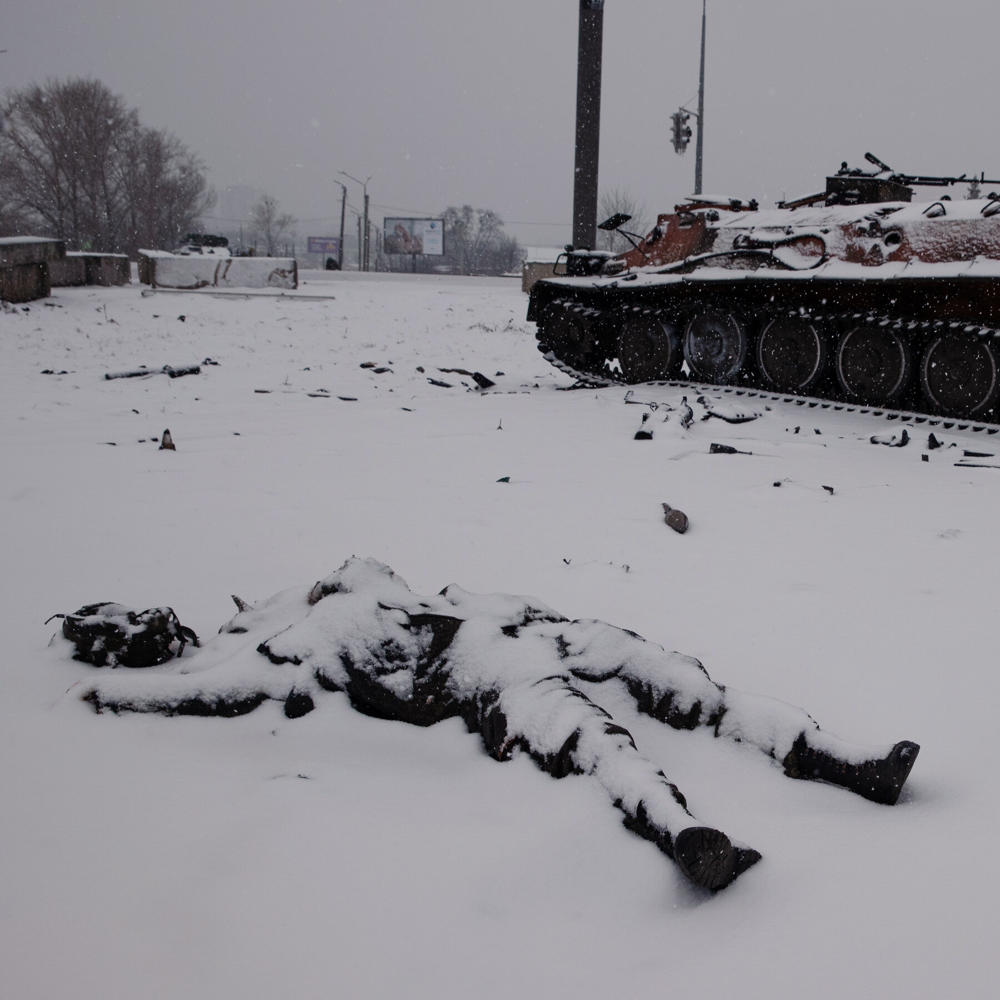

A dead Russian soldier in Kharkiv the day after the war started in February. Tyler Hicks/The New York Times

2 月战争开始后的第二天，一名死去的俄罗斯士兵在哈尔科夫。泰勒希克斯/纽约时报

How could one of the world’s most powerful militaries, led by a celebrated tactician like Mr. Putin, have faltered so badly against its much smaller, weaker rival? To piece together the answer, we drew from hundreds of Russian government emails, documents, invasion plans, military ledgers and propaganda directives. We listened to Russian phone calls from the battlefield and spoke with dozens of soldiers, senior officials and Putin confidants who have known him for decades.

世界上最强大的军队之一，在像普京这样的著名战术家的领导下，怎么会在面对比它小得多、弱得多的对手时步履蹒跚呢？为了拼凑出答案，我们从数百份俄罗斯政府电子邮件、文件、入侵计划、军事分类帐和宣传指令中提取了信息。我们从战场上听到了俄罗斯的电话，并与数十名认识他数十年的士兵、高级官员和普京亲信交谈。

A Russian logbook detailing the movement of airborne troops from Belarus toward Kyiv, including attacks and “nonstop fire” by Ukrainian forces. Ukraine’s military intelligence service, known as the G.U.R.

一份俄罗斯航海日志，详细记录了空降部队从白俄罗斯向基辅的行动，包括乌克兰军队的袭击和“不间断射击”。乌克兰的军事情报部门，称为 G.U.R.

The Times investigation found a stunning cascade of mistakes that started with Mr. Putin — profoundly isolated in the pandemic, obsessed with his legacy, convinced of his own brilliance — and continued long after drafted soldiers like Mikhail were sent to the slaughter.

《泰晤士报》的调查发现了一连串令人震惊的错误，这些错误始于普京先生——在大流行病中被深深地孤立，痴迷于他的遗产，坚信自己的才华——并在像米哈伊尔这样的应征士兵被送去屠杀之后很长一段时间内继续犯下错误。

At every turn, the failures ran deeper than previously known:  
在每一个转折点，失败都比以前知道的更深：  

In interviews, Putin associates said he spiraled into self-aggrandizement and anti-Western zeal, leading him to make the fateful decision to invade Ukraine in near total isolation, without consulting experts who saw the war as pure folly. Aides and hangers-on fueled his many grudges and suspicions, a feedback loop that one former confidant likened to the radicalizing effect of a social-media algorithm. Even some of the president’s closest advisers were left in the dark until the tanks began to move. As another longtime confidant put it, “Putin decided that his own thinking would be enough.”

在接受采访时，普京的同事表示，他陷入了自我膨胀和反西方的狂热之中，导致他在几乎完全孤立的情况下做出了入侵乌克兰的决定性决定，而没有咨询那些认为这场战争纯粹是愚蠢的专家。助手和随从助长了他的许多怨恨和怀疑，一位前知己将这种反馈循环比作社交媒体算法的激进化效果。在坦克开始移动之前，甚至总统的一些最亲密的顾问也被蒙在鼓里。正如另一位长期知己所说，“普京认为他自己的想法就足够了。”

The Russian military, despite Western assumptions about its prowess, was severely compromised, gutted by years of theft. Hundreds of billions of dollars had been devoted to modernizing the armed forces under Mr. Putin, but corruption scandals ensnared thousands of officers. One military contractor described frantically hanging enormous patriotic banners to hide the decrepit conditions at a major Russian tank base, hoping to fool a delegation of top brass. The visitors were even prevented from going inside to use the bathroom, he said, lest they discover the ruse.

俄罗斯军方尽管西方对其实力抱有假设，但由于多年的盗窃行为而受到严重损害。数千亿美元已投入普京领导下的武装部队现代化，但腐败丑闻却让数千名军官陷入困境。一位军事承包商描述说，他们疯狂地悬挂巨大的爱国横幅，以掩盖俄罗斯一个主要坦克基地的破旧状况，希望以此愚弄高级官员代表团。他说，访客甚至被禁止进入室内使用洗手间，以免他们发现这个诡计。

Once the invasion began, Russia squandered its dominance over Ukraine through a parade of blunders. It relied on old maps and bad intelligence to fire its missiles, leaving Ukrainian air defenses surprisingly intact, ready to defend the country. Russia’s vaunted hacking squads tried, and failed, to win in what some officials call the first big test of cyberweapons in actual warfare. Russian soldiers, many shocked they were going to war, used their cellphones to call home, allowing the Ukrainians to track them and pick them off in large numbers. And Russia’s armed forces were so stodgy and sclerotic that they did not adapt, even after enduring huge losses on the battlefield. While their planes were being shot down, many Russian pilots flew as if they faced no danger, almost like they were at an air show.

一旦入侵开始，俄罗斯就通过一连串的失误浪费了它对乌克兰的统治地位。它依靠旧地图和糟糕的情报来发射导弹，使乌克兰的防空系统出人意料地完好无损，随时准备保卫国家。俄罗斯自吹自擂的黑客小分队试图在一些官员称之为实际战争中网络武器的第一次大测试中获胜，但以失败告终。许多俄罗斯士兵对他们要打仗感到震惊，他们用手机给家里打电话，让乌克兰人跟踪并大量逮捕他们。而俄罗斯的武装力量又呆板又僵化，即使在战场上遭受了巨大的损失，他们也没有适应。当他们的飞机被击落时，许多俄罗斯飞行员飞行时就好像他们没有面临任何危险，几乎就像他们在参加飞行表演一样。

Stretched thin by its grand ambitions, Russia seized more territory than it could defend, leaving thousands of square miles in the hands of skeleton crews of underfed, undertrained and poorly equipped fighters. Many were conscripts or ragtag separatists from Ukraine’s divided east, with gear from the 1940s or little more than printouts from the internet describing how to use a sniper rifle, suggesting soldiers learned how to fight on the fly. With new weapons from the West in hand, the Ukrainians beat them back, yet Russian commanders kept sending waves of ground troops into pointless assaults, again and again. “Nobody is going to stay alive,” one Russian soldier said he realized after being ordered into a fifth march directly in the sights of Ukrainian artillery. Finally, he and his demoralized comrades refused to go.

俄罗斯因其雄心勃勃的野心而变得捉襟见肘，夺取的领土超出了其防御能力，将数千平方英里的领土落入了由食不果腹、训练不足和装备简陋的战士组成的骨干部队手中。许多人是来自乌克兰分裂的东部的应征入伍者或乌合之众的分离主义者，他们使用的是 1940 年代的装备，或者仅仅是来自互联网的打印输出，描述了如何使用狙击步枪，这表明士兵们学会了如何在飞行中作战。乌克兰人手里拿着来自西方的新武器，击退了他们，但俄罗斯指挥官却一次又一次地派出一波又一波的地面部队进行毫无意义的攻击。 “没有人会活下来，”一名俄罗斯士兵说，他在被命令直接在乌克兰炮兵的瞄准下进行第五次行军后意识到。最后，他和士气低落的战友们拒绝去。

A Soviet-era map of modern-day Ukraine, Belarus and Russia recovered from the battlefield.  
从战场上恢复的现代乌克兰、白俄罗斯和俄罗斯的苏联时代地图。  

Mr. Putin divided his war into fiefs, leaving no one powerful enough to challenge him. Many of his fighters are commanded by people who are not even part of the military, like his former bodyguard, the leader of Chechnya and a mercenary boss who has provided catering for Kremlin events. As the initial invasion failed, the atomized approach only deepened, chipping away at an already disjointed war effort. Now, Mr. Putin’s fractured armies often function like rivals, competing for weapons and, at times, viciously turning on one another. One soldier recounted how the clashes became violent, with a Russian tank commander deliberately charging at his supposed allies and blowing up their checkpoint.

普京先生将他的战争划分为多个封地，没有留下任何强大到足以挑战他的人。他的许多战士都由甚至不是军队成员的人指挥，比如他的前保镖、车臣领导人和为克里姆林宫活动提供餐饮服务的雇佣军老板。随着最初的入侵失败，原子化的方法只会加深，削弱已经脱节的战争努力。现在，普京四分五裂的军队经常像竞争对手一样运作，争夺武器，有时还会互相攻击。一名士兵讲述了冲突是如何变得暴力的，一名俄罗斯坦克指挥官故意冲向他所谓的盟友并炸毁他们的检查站。

Since the early days of the invasion, Mr. Putin has conceded, privately, that the war has not gone as planned.

自入侵初期以来，普京私下承认战争并未按计划进行。

During a meeting in March with Prime Minister Naftali Bennett of Israel, Mr. Putin admitted that the Ukrainians were tougher “than I was told,” according to two people familiar with the exchange. “This will probably be much more difficult than we thought. But the war is on their territory, not ours. We are a big country and we have patience.”

据两位知情人士透露，在 3 月与以色列总理纳夫塔利·贝内特 (Naftali Bennett) 会面时，普京承认乌克兰人“比我听说的要强硬”。 “这可能比我们想象的要困难得多。但战争发生在他们的领土上，而不是我们的领土上。我们是一个大国，我们有耐心。”

People who know Mr. Putin say he is ready to sacrifice untold lives and treasure for as long as it takes, and in a rare face-to-face meeting with the Americans last month the Russians wanted to deliver a stark message to President Biden: No matter how many Russian soldiers are killed or wounded on the battlefield, Russia will not give up.

认识普京的人说，他已经准备好不惜一切代价牺牲无数的生命和财富，在上个月与美国人的一次罕见的面对面会谈中，俄罗斯人想向拜登总统传达一个明确的信息：无论战场上有多少俄军士兵死伤，俄罗斯都不会善罢甘休。

One NATO member is warning allies that Mr. Putin is ready to accept the deaths or injuries of as many as 300,000 Russian troops — roughly three times his estimated losses so far.

一名北约成员国警告盟友，普京已准备好接受多达 30 万俄罗斯军队的伤亡——大约是他迄今为止估计损失的三倍。

Just days after facing blowback about the war from normally friendly leaders in September, Mr. Putin doubled down on the invasion, calling up hundreds of thousands of Russians in a draft that was supposed to turn the war in Russia’s favor, but has instead stirred growing anger at home. Soon after, hundreds of Russian soldiers were killed outside Pavlivka, including Mikhail’s drafted comrades in the blind advance of the 155th.

就在 9 月份遭到通常友好的领导人对这场战争的反击后几天，普京先生在入侵问题上加倍下注，召集了数十万俄罗斯人参加一项草案，该草案本应使战争对俄罗斯有利，但反而激起了越来越多的人在家生气。不久之后，数百名俄罗斯士兵在帕夫利夫卡外阵亡，其中包括米哈伊尔在第 155 步兵团盲目推进中征召的战友。

“Legs, guts. I mean, meat. Just meat,” another member of the platoon, Aleksandr, said from a hospital in Russia. “I know it sounds terrible, but you can’t describe it any other way. People were turned into hamburger.”

“腿，胆量。我是说，肉。只是肉，”该排的另一名成员亚历山大在俄罗斯的一家医院说。 “我知道这听起来很糟糕，但你不能用任何其他方式来形容它。人们变成了汉堡包。”

Aleksandr recounted how he and his fellow draftees had asked their instructor in Russia what they could possibly learn about firing a gun and becoming soldiers in the few weeks before being sent to Ukraine.

亚历山大讲述了他和他的同伴如何在被派往乌克兰之前的几周内询问他们在俄罗斯的导师，他们可以学到什么关于开枪和成为士兵的知识。

“He was honest: ‘Nothing,’” Aleksandr said the instructor responded.  
“他很诚实：‘没什么，’”Aleksandr 说教练回应道。  

Reporting was contributed by Aaron Krolik, Adam Satariano, Alan Yuhas, Andrew Higgins, Carlotta Gall, Christiaan Triebert, Eric Schmitt, Helene Cooper, Ivan Nechepurenko, Julian E. Barnes, Mykola Ponomarenko, Natalia Yermak, Oleg Matsnev, Paul Mozur, Ronen Bergman, Stanislav Kozliuk and Valerie Hopkins. Aleksandra Koroleva, Oksana Nesterenko and Milana Mazaeva contributed translations.

亚伦·克罗利克、亚当·萨塔里亚诺、艾伦·尤哈斯、安德鲁·希金斯、卡洛塔·加尔、克里斯蒂安·特里伯特、埃里克·施密特、海伦·库珀、伊万·内切普连科、朱利安·E·巴恩斯、米科拉·波诺马连科、娜塔莉亚·耶马克、奥列格·马茨涅夫、保罗·莫祖尔、罗嫩·伯格曼、斯坦尼斯拉夫·科兹柳克和瓦莱丽·霍普金斯。 Aleksandra Koroleva、Oksana Nesterenko 和 Milana Mazaeva 贡献了翻译。

Produced by Gray Beltran, Rumsey Taylor, Adam Dean, Mona Boshnaq, Gaia Tripoli and James Surdam. Maps by Scott Reinhard.

由 Gray Beltran、Rumsey Taylor、Adam Dean、Mona Boshnaq、Gaia Tripoli 和 James Surdam 制作。 Scott Reinhard 绘制的地图。

The more setbacks Mr. Putin endures on the battlefield, the more fears grow over how far he is willing to go. He has killed tens of thousands in Ukraine, leveled cities and targeted civilians for maximum pain — obliterating hospitals, schools and apartment buildings, while cutting off power and water to millions before winter. Each time Ukrainian forces score a major blow against Russia, the bombing of their country intensifies. And Mr. Putin has repeatedly reminded the world that he can use anything at his disposal, including nuclear arms, to pursue his notion of victory.

普京在战场上遭受的挫折越多，人们就越担心他能走多远。他在乌克兰杀害了数万人，将城市夷为平地，并以平民为目标，让他们遭受最大的痛苦——摧毁医院、学校和公寓楼，同时在冬天到来之前切断数百万人的电力和供水。每当乌克兰军队对俄罗斯造成重大打击时，对他们国家的轰炸就会加剧。普京先生一再提醒世界，他可以动用任何他可以支配的东西，包括核武器，来追求他的胜利理念。

  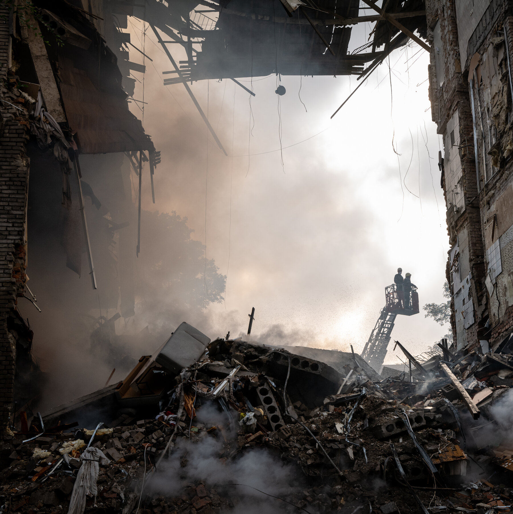

Emergency services at the site of a Russian missile strike on a residential building in Zaporizhzhia, in October. Nicole Tung for The New York Times

10 月，在俄罗斯导弹袭击扎波罗热一座住宅楼的现场提供紧急服务。 Nicole Tung for The New York Times

As far back as January, with the United States warning that Russia’s invasion of Ukraine was imminent, a retired Russian general named Leonid Ivashov saw disaster on the horizon. In a rare open letter, he warned that using force against Ukraine would threaten “the very existence of Russia as a state.”

早在 1 月，当美国警告俄罗斯即将入侵乌克兰时，一位名叫列昂尼德·伊瓦绍夫 (Leonid Ivashov) 的退休俄罗斯将军就看到了灾难即将来临。在一封罕见的公开信中，他警告说，对乌克兰使用武力将威胁“俄罗斯作为一个国家的存在”。

In a recent phone interview, General Ivashov said that his warnings before the war echoed what he had been hearing from nervous Russian military officials at the time. Though the Kremlin insisted an invasion was not on the table, some could tell otherwise. Service members told him that “victory in such a situation is impossible,” he said, but their superiors told them not to worry. A war would be a “walk in the park,” they were told.

在最近的一次电话采访中，伊瓦绍夫将军说，他在战前发出的警告与他当时从紧张的俄罗斯军方官员那里听到的相呼应。尽管克里姆林宫坚称入侵不在谈判桌上，但有些人可能持不同意见。服役人员告诉他，“在这种情况下是不可能取得胜利的，”他说，但他们的上级告诉他们不要担心。他们被告知，战争将是“在公园里散步”。

The last 10 months, he went on, have turned out to be “even more tragic” than predicted. Nimble Ukrainian generals and soldiers have outmaneuvered a much bigger, more lethal foe. The West, cheered by Ukraine’s successes, has provided ever more powerful weapons to drive the Russians back.

他继续说，过去 10 个月的结果比预期的“更加悲惨”。机敏的乌克兰将军和士兵战胜了一个更大、更致命的敌人。西方因乌克兰的成功而欢欣鼓舞，提供了更强大的武器来击退俄罗斯。

“Never in its history has Russia made such stupid decisions,” General Ivashov said. “Alas, today stupidity has triumphed — stupidity, greed, a kind of vengefulness and even a kind of malice.”

“俄罗斯历史上从未做出过如此愚蠢的决定，”伊瓦绍夫将军说。 “唉，今天愚蠢得胜了——愚蠢、贪婪、一种报复心，甚至是一种恶意。”

Mr. Putin’s spokesman, Dmitri S. Peskov, blames the West, and the weapons it has given Ukraine, for Russia’s unexpected difficulties in the war.

普京先生的发言人德米特里·S·佩斯科夫 (Dmitri S. Peskov) 将俄罗斯在战争中遭遇意外困难归咎于西方及其向乌克兰提供的武器。

“This is a big burden for us,” Mr. Peskov said, depicting Russia as taking on all of NATO’s military might in Ukraine. “It was just very hard to believe in such cynicism and in such bloodthirstiness on the part of the collective West.”

“这对我们来说是一个沉重的负担，”佩斯科夫先生说，并将俄罗斯描述为在乌克兰承担北约的所有军事力量。 “很难相信西方集体如此愤世嫉俗和嗜血成性。”

Some of the war’s original supporters are starting to reckon with the idea of defeat. Before the invasion, American intelligence agencies identified Oleg Tsaryov as a puppet leader the Kremlin could install once it took over Ukraine. His faith in the war has since slipped away.

一些战争的最初支持者开始考虑失败的想法。在入侵之前，美国情报机构将 Oleg Tsaryov 确定为克里姆林宫一旦接管乌克兰就可以安插的傀儡领导人。从那以后，他对战争的信心就消失了。

“I was there. I participated” in the invasion, Mr. Tsaryov told The Times during a phone interview. But, he said, he was never told the final details and “the Russian Army didn’t understand” the Ukrainians would fight back, thinking “everything would be easy.”

“我在那里。 “我参与了”入侵，Tsaryov 先生在接受电话采访时告诉时报。但是，他说，他从未被告知最终细节，“俄罗斯军队不理解”乌克兰人会反击，认为“一切都会很容易”。

Now, Mr. Tsaryov, a businessman from Ukraine, says he will be happy if the fighting simply ends along the current battle lines — with Russia having failed to capture and keep hold of a single regional capital since the invasion began.

现在，来自乌克兰的商人 Tsaryov 先生说，如果战斗只是沿着当前的战线结束，他会很高兴——因为自入侵开始以来，俄罗斯未能占领并控制一个地区首府。

“We’re losing Ukraine,” Mr. Tsaryov said. “We’ve already lost it.”  
“我们正在失去乌克兰，”察廖夫先生说。 “我们已经失去了它。”  

## **Blunders**  
“Tomorrow you are going to Ukraine.”

失误 “明天你要去乌克兰。”

Russian invasion plans obtained by The Times ordered troops to sprint hundreds of miles across Ukraine from multiple directions, anticipating little resistance.

泰晤士报获得的俄罗斯入侵计划命令军队从多个方向冲刺数百英里穿越乌克兰，预计阻力很小。

The attack came by land, sea and air.  
袭击来自陆地、海洋和空中。  

As missiles struck the southern city of Mykolaiv before dawn, a Ukrainian pilot, Oleksii, woke up to a phone call: Get to the runway, a fellow pilot told him.

黎明前导弹袭击了南部城市尼古拉耶夫，一名乌克兰飞行员 Oleksii 醒来时接到一个电话： 到跑道上，一位飞行员告诉他。

Oleksii bolted across the tarmac in the dark as the first Russian missiles landed, clambered into his Su-27 fighter jet and took off just as buildings across the airfield began to explode.

当第一批俄罗斯导弹降落时，Oleksii 在黑暗中冲过停机坪，爬上他的 Su-27 战斗机，并在机场对面的建筑物开始爆炸时起飞。

“At that moment, I understood that it was really something bad,” said Oleksii, 26, on condition that only his first name and rank, captain, be used. Some other soldiers and officials in this article were not authorized to speak publicly, or faced reprisals.

“那一刻，我明白这真的很糟糕，”26 岁的 Oleksii 说，条件是只使用他的名字和军衔，船长。这篇文章中的其他一些士兵和官员没有被授权公开发言，或面临报复。

Just before 6 a.m. Moscow time, Mr. Putin declared the opening of his “special military operation” in a televised address. It began with an aerial bombardment to take out Ukraine’s air defenses, communications and radar installations — to overwhelm its military and shatter its ability to fight back.

就在莫斯科时间早上 6 点之前，普京先生在电视讲话中宣布开始他的“特别军事行动”。它首先进行空中轰炸，摧毁乌克兰的防空、通信和雷达设施——以压倒其军队并粉碎其反击能力。

More than 150 missiles thundered into Ukraine from bombers, submarines and ships. As many as 75 Russian aircraft streaked into Ukrainian skies, about the size of Ukraine’s entire working air combat fleet, analysts and officials said.

超过 150 枚导弹从轰炸机、潜艇和舰船上轰鸣入乌克兰。分析人士和官员表示，多达 75 架俄罗斯飞机飞入乌克兰领空，相当于乌克兰整个现役空战机队的规模。

On his radar screen, Oleksii saw the blips of incoming missiles and enemy aircraft before getting his orders: Fly to a backup air base in central Ukraine. When he landed, he was astonished. Not only was his unit there, but a good portion of Ukraine’s remaining air force as well.

在他的雷达屏幕上，Oleksii 在收到命令之前看到了来袭导弹和敌机的光点：飞往乌克兰中部的后备空军基地。当他落地时，他惊呆了。不仅他的部队在那里，乌克兰剩余空军的很大一部分也在那里。

For days, he and his fellow pilots flew missions from their new base, wondering when Russian radar operators would finally notice them. A strike on their position could have been disastrous, gutting the Ukrainian defense, and the pilots assumed it was only a matter of time until one came. But it took four days for the Russians to attack, and most of the aircraft had moved to new locations by then, leaving Oleksii in amazement.

几天来，他和他的飞行员同事们从他们的新基地执行任务，想知道俄罗斯雷达操作员什么时候最终会注意到他们。对他们阵地的打击可能是灾难性的，摧毁乌克兰的防御，飞行员们认为攻击来袭只是时间问题。但是俄国人花了四天的时间才发动攻击，而此时大部分飞机已经转移到新的地点，让奥列克西惊奇不已。

“It was really simple,” he said. “I don’t know how they missed this opportunity.”  
“这真的很简单，”他说。 “我不知道他们是怎么错过这个机会的。”  

The failure to destroy Ukraine’s modest air defenses was one of the most significant blunders of the war, foiling Russia’s mighty air force early on. Interviews revealed why that happened — and how the Ukrainians managed to stay a step ahead of their invaders.

未能摧毁乌克兰适度的防空系统是战争中最重大的失误之一，它在早期挫败了俄罗斯强大的空军。采访揭示了发生这种情况的原因——以及乌克兰人如何设法比入侵者领先一步。

### Russia invades

Ukraine should have been overwhelmed. By one count, its fighter jets were outnumbered 15 to one in some early air battles. Russia’s planes were also more advanced, helping its pilots see farther and strike from greater distances. Russia had thousands of cruise and ballistic missiles that should have smothered Ukraine’s aging, Soviet-era defenses. That is what American and Ukrainian intelligence officials assumed, anyway, leading to predictions that Ukraine would fall within days.

乌克兰本应不堪重负。据一项统计，在一些早期的空战中，它的战斗机数量超过了 15 比 1。俄罗斯的飞机也更先进，帮助其飞行员看得更远，攻击距离更远。俄罗斯拥有数以千计的巡航导弹和弹道导弹，这些导弹本应扼杀乌克兰老化的苏联时代防御系统。无论如何，这就是美国和乌克兰情报官员的假设，导致人们预测乌克兰将在几天内沦陷。

So, Ukraine shuffled the deck. It moved some of its defenses — like Buk and S-300 missile launchers, along with its primary radio intelligence command and control center — to new sites before the war began, senior Ukrainian officials said. Russian missiles often hit the old locations instead. In all, as many as 60 percent of Russian cruise missiles missed their intended targets, American officials said.

因此，乌克兰重新洗牌。乌克兰高级官员说，它在战争开始前将一些防御设施——如 Buk 和 S-300 导弹发射器，以及主要的无线电情报指挥和控制中心——转移到了新地点。俄罗斯导弹经常击中旧地点。美国官员说，总共有多达 60% 的俄罗斯巡航导弹没有击中预定目标。

Part of Russia’s problem was agility. Even if Russian forces had spotted Oleksii and his fellow pilots bunched together at their new rendezvous point, American officials said, Russia’s military was so rigid and centralized that it typically needed 48 to 72 hours to update its intelligence and get approval to go after new targets — by which time the Ukrainians were gone.

俄罗斯的部分问题在于灵活性。美国官员说，即使俄罗斯军队发现 Oleksii 和他的飞行员同伴聚集在他们的新会合点，俄罗斯军队也非常严格和集中，通常需要 48 到 72 小时来更新情报并获得批准去追捕新目标- 到那时乌克兰人已经走了。

That same inflexibility made the Russians easy to hit. After failing to take out Ukraine’s defenses, many Russian pilots kept flying as if they had. Their ground-attack planes often flew sorties without backup from other fighter jets, the Ukrainians said, enabling outgunned pilots like Oleksii to catch them off-guard by flying at low altitudes, hidden from radar, and roaring up from below to shoot them down.

同样的僵化使俄国人很容易被击中。在未能摧毁乌克兰的防御后，许多俄罗斯飞行员继续飞行，就好像他们已经摧毁了一样。乌克兰人说，他们的地面攻击机经常在没有其他战斗机支援的情况下出击，这使得像 Oleksii 这样的机枪火力不足的飞行员能够在低空飞行，躲避雷达，并从下方咆哮着将他们击落，从而让他们措手不及。

  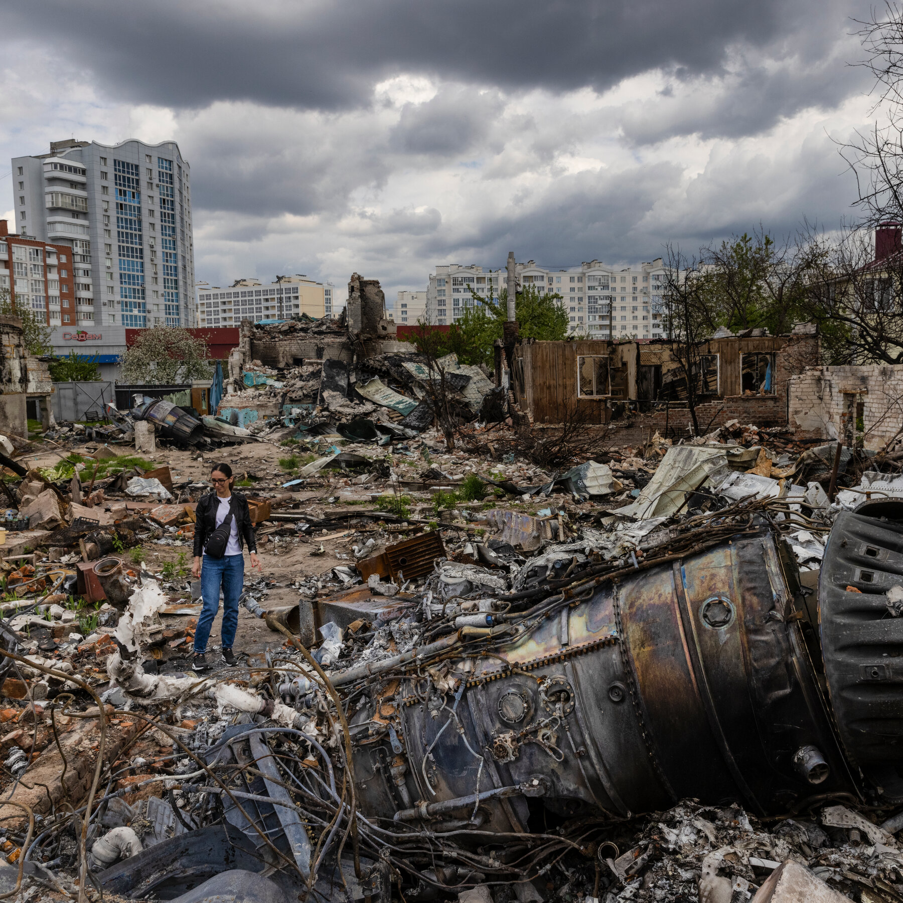

The debris of a Russian Su-34 aircraft that crashed into a residential neighborhood in Chernihiv in March. David Guttenfelder for The New York Times

3 月，一架俄罗斯 Su-34 飞机坠毁在切尔尼戈夫的一个居民区的残骸。纽约时报的大卫·古腾菲尔德

“Maybe the Russian Army didn’t read the Soviet books,” Oleksii said. “They flew straight without any cover. They had bombs, they had rockets, but they didn’t cover their attack aircraft.”

“也许俄罗斯军队没有读过苏联的书，”Oleksii 说。 “他们在没有任何掩护的情况下直飞。他们有炸弹，有火箭，但没有掩护他们的攻击机。”

Then in March, when Russian pilots finally changed tactics and started flying low enough to duck under Ukrainian air defense radar, they fell into the sights of Ukrainian missiles, including shoulder-fired Stingers provided by the United States.

然后在 3 月，当俄罗斯飞行员最终改变战术并开始低空飞行以躲避乌克兰防空雷达时，他们落入了乌克兰导弹的瞄准范围，包括美国提供的肩扛式毒刺导弹。

For Russian troops on the ground, it was a disaster.  
对于地面上的俄罗斯军队来说，这是一场灾难。  

Without air cover, they were suddenly far more vulnerable, throwing their troubled march toward Kyiv and other large cities further into disarray.

没有空中掩护，他们突然变得更加脆弱，使他们向基辅和其他大城市进军的困难重重变得更加混乱。

Though tens of thousands of them had amassed along Ukraine’s borders, hovering menacingly as if eager to strike, many never thought they were actually going to war. Like most of Russia, they figured it was just for show, to extract concessions from the West.

尽管数以万计的人聚集在乌克兰边境，气势汹汹地盘旋，好像急于发动袭击，但许多人从未想过他们真的要开战。像大多数俄罗斯人一样，他们认为这只是为了作秀，以迫使西方做出让步。

Interviews with Russian soldiers show how stunned they were when the orders came to invade. Cpl. Nikita Chibrin, a 27-year-old soldier in a motorized infantry brigade, said he had spent the month before in Belarus on what he and his fellow soldiers were told was a training exercise. On Feb. 23, he said, he and his unit were at their camp celebrating the Defender of the Fatherland holiday, snacking on candy they had been given for the occasion, when their commander approached.

对俄罗斯士兵的采访表明，当接到入侵命令时，他们是多么震惊。下士尼基塔·奇布林 (Nikita Chibrin) 是一名摩托化步兵旅的 27 岁士兵。他说，2 月 23 日，当他们的指挥官走近时，他和他的部队正在他们的营地庆祝祖国保卫者节，他们正在吃为此场合提供的糖果。

“Tomorrow you are going to Ukraine to fuck up some shit,” he said the commander told them. There was no further explanation.

“明天你们要去乌克兰搞砸了，”他说指挥官告诉他们。没有进一步的解释。

Before dawn on the 24th, Corporal Chibrin and his comrades loaded into a tracked armored personnel carrier. They had no instructions and no idea where they were headed, he said.

24日黎明前，奇布林下士和他的战友们登上一辆履带式装甲运兵车。他说，他们没有得到指示，也不知道要去哪里。

Another Russian soldier stationed in Belarus said he found out he was going to war only an hour before his unit began to march. The order was both simple and wildly optimistic: Follow the vehicle in front of you and reach Kyiv within 18 hours.

另一名驻扎在白俄罗斯的俄罗斯士兵说，在他的部队开始行军前一个小时，他才知道自己要参战。命令既简单又非常乐观：跟随您前面的车辆并在 18 小时内到达基辅。

According to the unit’s schedule and logbook — which were obtained by The Times and reviewed by three independent military analysts, who considered them authentic — the first vehicles in his convoy were supposed to punch down from Belarus and arrive on the outskirts of Kyiv by 2:55 p.m., even faster than the soldier was told.

根据该部队的日程安排和日志——由泰晤士报获得并由三名独立军事分析家审查过，他们认为它们是真实的——他的车队中的第一批车辆应该从白俄罗斯起飞，并在 2 点前抵达基辅郊区：下午 55 点，比士兵被告知的还要快。

A Russian military timetable showing a detailed schedule of movement for airborne troops set to depart Belarus, and arrive on Kyiv’s outskirts. Source: Ukraine’s military intelligence service, known as the G.U.R.

一份俄罗斯军事时间表显示了空降部队离开白俄罗斯并抵达基辅郊区的详细行动时间表。资料来源：乌克兰军事情报局，称为 G.U.R.

He didn’t come close. The massive vehicles were so heavy, ripping up the roads as they tried to move forward, that the convoy got bogged down immediately, the soldier said. It took more than a day just to cross the border into Ukraine.

他没有靠近。这名士兵说，这些巨大的车辆太重了，在它们试图向前行驶时撕裂了道路，以至于车队立即陷入困境。仅仅越过边境进入乌克兰就花了一天多的时间。

It got worse from there. The logbook recorded day after day of delays, Ukrainian attacks and hundreds of injuries, deaths and destroyed vehicles.

从那里开始变得更糟。日志记录了日复一日的延误、乌克兰袭击以及数百人受伤、死亡和被毁车辆。

Secret orders for a different Russian force — obtained by The Times and shared with four independent military analysts, all of whom said they were credible — were issued only hours before Mr. Putin’s announcement.

对另一支俄罗斯军队的秘密命令——由时报获得并与四名独立军事分析家分享，他们都说他们是可信的——是在普京宣布这一消息前几个小时发布的。

The orders, for a unit of the 26th Tank Regiment, were oddly overconfident, to the point of being contradictory. They anticipated a tangle of possible resistance from Ukrainian troops and planes, yet they still laid out a mostly uninhibited, 24-hour dash from Ukraine’s border with Russia to a point across the Dnipro River, about 250 miles away.

对于第 26 坦克团的一个单位，这些命令出奇地过于自信，以至于自相矛盾。他们预料到乌克兰军队和飞机可能会遇到一连串的抵抗，但他们仍然制定了从乌克兰与俄罗斯的边界到大约 250 英里外的第聂伯河对岸的几乎不受约束的 24 小时冲刺。

There, the unit would dig in, about two hours outside Kyiv, and block Ukrainian troops sweeping in from the south and east, the Russian war plans said. And no matter how fierce the enemy was, the unit was expected to complete the mission on its own.

俄罗斯的战争计划称，该部队将在距基辅约两小时车程的地方进行挖掘，并阻止乌克兰军队从南部和东部席卷而来。而且不管敌人多么凶猛，部队都得靠自己完成任务。

A document recovered from the 26th tank regiment detailing invasion plans issued on Feb. 23, 2022.  
从第 26 坦克团回收的一份文件详细说明了 2022 年 2 月 23 日发布的入侵计划。  

“There are no forces or equipment for reinforcements,” the orders said.  
“没有增援部队或设备，”命令说。  

Sure enough, the lumbering, largely unprotected Russian columns proved enticing targets.  
果然，笨拙、基本上没有保护的俄罗斯纵队被证明是诱人的目标。  

On March 17, Valeriy Zaluzhnyi, the commander of Ukrainian forces, posted a video of burning tanks that he said belonged to the 26th Tank Regiment in northeastern Ukraine — hundreds of kilometers short of its intended destination.

3 月 17 日，乌克兰军队指挥官瓦列里·扎卢日尼 (Valeriy Zaluzzhnyi) 发布了一段坦克燃烧的视频，他说这些坦克属于乌克兰东北部的第 26 坦克团，距离预定目的地还有数百公里。

The unit lost 16 vehicles in less than three weeks, according to Russian documents seized and published by Ukraine. The mother of one young tank soldier on the unit’s roster told Russian media that her son was brought home in pieces, identified only by his DNA.

根据乌克兰扣押和公布的俄罗斯文件，该部队在不到三周的时间里损失了 16 辆车。该部队花名册上一名年轻坦克兵的母亲告诉俄罗斯媒体，她的儿子被带回家时被撕成碎片，只能通过他的 DNA 来辨认。

Across Ukraine, the Russian losses mounted. A giant armored column of more than 30,000 troops at the core of Russia’s force pushing south toward the city of Chernihiv was eviscerated by a motley group of Ukrainian defenders outnumbered five to one, soldiers and senior officials said. The Ukrainians hid in the forest and picked apart the Russian column with shoulder-fired antitank weapons, like American-made Javelins.

在整个乌克兰，俄罗斯的损失越来越大。士兵和高级官员说，一支由 30,000 多名士兵组成的庞大装甲纵队作为俄罗斯军队的核心向南推进到切尔尼戈夫市，被一群五比一的乌克兰防御者击溃。乌克兰人躲在森林里，用美国制造的标枪等肩扛式反坦克武器摧毁了俄罗斯纵队。

A Ukrainian soldier carrying an NLAW anti-tank guided missile as he walks toward a destroyed Russian armored column at a junction near Ivankiv, northwest of Kyiv, filmed between Feb. 24-26. Lyubov Shelkovich, via Facebook

2 月 24 日至 26 日拍摄的一名乌克兰士兵携带一枚 NLAW 反坦克导弹走向基辅西北部伊万科夫附近交叉路口被摧毁的俄罗斯装甲纵队。柳博夫谢尔科维奇，来自 Facebook

One Russian soldier in the unit said he was shocked by the swiftness of the Ukrainian attack.  
该部队的一名俄罗斯士兵说，他对乌克兰袭击的速度之快感到震惊。  

“In the first battle, the column was ambushed, and I was wounded, and that’s it,” he said. “For 24 hours, I was missing a leg, lying in a field waiting for my unit to come get me.”

“在第一次战斗中，纵队遭到伏击，我受伤了，仅此而已，”他说。 “整整 24 小时，我都失去了一条腿，躺在田野里等待我的单位来接我。”

The rout near Chernihiv spoiled part of Russia’s plan to envelop Kyiv.  
切尔尼戈夫附近的溃败破坏了俄罗斯包围基辅的部分计划。  

  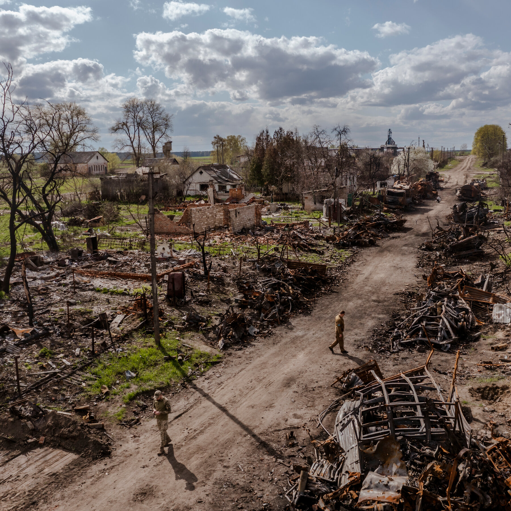

Ukrainian soldiers walking along a street where a column of Russian military vehicles was destroyed near Chernihiv in April. Daniel Berehulak for The New York Times

4 月，切尔尼戈夫附近，乌克兰士兵走在一条街道上，一列俄罗斯军车被摧毁。 Daniel Berehulak for The New York Times

A massacre at the Antonov Airport spoiled another.  
安东诺夫机场的一场大屠杀破坏了另一场大屠杀。  

Russian forces had counted on the element of surprise when wave upon wave of helicopters descended on the airport, home to the largest aircraft in the world: the An-225 Mriya, a cargo plane with a 290-foot wingspan that was an object of Ukrainian national pride.

当一波又一波的直升机降落在机场时，俄罗斯军队指望出其不意，这里有世界上最大的飞机：An-225 Mriya，一架翼展 290 英尺的货机，是乌克兰的目标民族自豪感。

Taking the airport would give Russian forces a beachhead to ferry in troops for the assault on Ukraine’s capital. But the Ukrainians expected as much. Using shoulder-fired missiles, they shot down Russian aircraft and killed as many as 300 Russian paratroopers, according to senior American and Ukrainian officials and the captured Russian logbook.

占领机场将为俄罗斯军队提供一个滩头阵地，以便运送部队攻击乌克兰首都。但乌克兰人的期望也是如此。根据美国和乌克兰高级官员以及缴获的俄罗斯航海日志，他们使用肩扛式导弹击落了俄罗斯飞机，并杀死了多达 300 名俄罗斯伞兵。

Fierce battles in the following days destroyed much of the airport, including [the prized Mriya cargo jet](https://www.nytimes.com/2022/04/22/world/europe/ukraine-airplane-russia-war-mriya.html), but thwarted Russia’s plans.

接下来几天的激烈战斗摧毁了机场的大部分，包括珍贵的 Mriya 货运喷气式飞机，但挫败了俄罗斯的计划。

“Yes, we lost our Mriya,” said Col. Yuriy Ignat, the spokesman for Ukraine’s Air Force Command. “But as a result the airport wasn’t lost.”

“是的，我们失去了 Mriya，”乌克兰空军司令部发言人 Yuriy Ignat 上校说。 “但结果机场并没有丢失。”

Russia not only botched the attack by land and air, but also put too much faith in another wing of its vaunted arsenal: hacking.

俄罗斯不仅搞砸了陆空攻击，而且过于相信其引以为傲的武器库的另一翼：黑客攻击。

Even before the first missiles and shots were fired, unit 74455 of the Russian Military Intelligence Directorate, or G.R.U., tried to infiltrate Ukrainian networks and shut them down.

甚至在发射第一批导弹和射击之前，俄罗斯军事情报局 (G.R.U.) 的 74455 部队就试图渗透乌克兰网络并将其关闭。

Officials in Washington, who had been working closely with the Ukrainians to bolster their cyberdefenses for years, had been holding their breath. States had mainly used hacking for acts of espionage and financial thievery, for subversion and sabotage. But nobody really knew how it would play out in a full-scale military conflict.

多年来一直与乌克兰密切合作以加强其网络防御的华盛顿官员一直屏住呼吸。国家主要将黑客用于间谍活动和金融窃取，用于颠覆和破坏活动。但没有人真正知道它在一场全面的军事冲突中会如何发挥作用。

“All this stuff that has been written about cyberwar has been speculative,” said a senior U.S. defense official. “For the first time, you have war and cyber together — the real thing.”

“所有这些关于网络战的文章都是推测性的，”一位美国高级国防官员说。 “这是第一次，你同时拥有战争和网络——真正的东西。”

The Russian hacking unit, known as Sandworm, had long menaced Ukraine, waging attacks against the power grid starting [in 2015](https://www.nytimes.com/2022/01/16/us/politics/microsoft-ukraine-cyberattack.html). But it was labor intensive, and only somewhat effective. By [one estimate](https://direct.mit.edu/isec/article/46/2/51/107693/The-Subversive-Trilemma-Why-Cyber-Operations-Fall), it took Sandworm about 19 months to prepare the attack on a power station in western Ukraine, yet it only caused a six-hour power outage.

被称为 Sandworm 的俄罗斯黑客组织长期威胁乌克兰，从 2015 年开始对电网发动攻击。但这是劳动密集型的，而且效果有限。据估计，Sandworm 花了大约 19 个月的时间准备攻击乌克兰西部的一座发电站，但它只造成了 6 小时的停电。

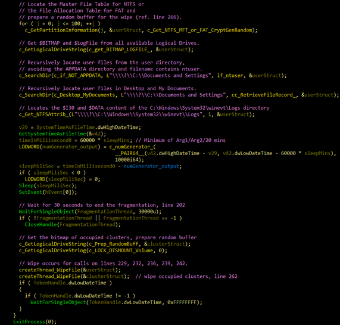

A snippet of code used by hackers to try to disable Ukrainian government computers. Cybersecurity and Infrastructure Security Agency

黑客用来试图禁用乌克兰政府计算机的代码片段。网络安全和基础设施安全局

A cyber cat-and-mouse game ensued, with the United States, Britain and other allies helping to shore up Ukrainian computers and stave off Russian intrusions.

一场网络猫捉老鼠的游戏随之而来，美国、英国和其他盟友帮助支持乌克兰的计算机并阻止俄罗斯的入侵。

On Feb. 23, hours before the invasion began, Sandworm took another swing, launching malware that infected several hundred Ukrainian government computers, officials said. The intrusion was detected quickly, the damage contained.

官方称，2 月 23 日，在入侵开始前几个小时，Sandworm 再次发起攻击，启动恶意软件感染了数百台乌克兰政府计算机。入侵被迅速检测到，损害也得到了遏制。

Then Sandworm struck again. But the code it used looked like it had been thrown together at the last minute, with programming errors — another fail.

然后沙虫再次袭击。但它使用的代码看起来像是在最后一分钟拼凑而成，存在编程错误——又一次失败。

Sandworm wasn’t done. In its boldest stroke yet, it went after the Ukrainian military’s satellite communications, used by soldiers in the field. It worked, and by 6:15 a.m. on Feb. 24, the system went down, right at Ukraine’s most vulnerable moment.

沙虫没有完成。在其迄今为止最大胆的举动中，它瞄准了战场上士兵使用的乌克兰军方卫星通信系统。它奏效了，到 2 月 24 日早上 6 点 15 分，系统在乌克兰最脆弱的时刻崩溃了。

It could have been a crippling blow. But the Ukrainian government had a backup plan: a separate satellite communications system, which it had tested only two months before, to make sure it was ready in the event of a Russian invasion.

这可能是一个致命的打击。但乌克兰政府有一个备用计划：一个单独的卫星通信系统，它仅在两个月前进行了测试，以确保在俄罗斯入侵时做好准备。

Russia had assumed its forces would march largely uncontested into Kyiv. When that didn’t happen, American officials suspect that Sandworm — like the rest of the Russian military — was caught off guard.

俄罗斯曾假设其军队将在很大程度上不受对抗地进军基辅。当这种情况没有发生时，美国官员怀疑沙虫——就像其他俄罗斯军队一样——措手不及。

Soon, Russia’s missteps went from the sophisticated to the mundane.  
很快，俄罗斯的失误就从复杂变成了平凡。  

With their plans for a speedy victory stymied, Russian forces were suddenly confronted with the most basic of problems: They hadn’t brought enough food, water or other supplies for a prolonged campaign. Soldiers resorted to looting grocery stores, hospitals and homes.

由于速战速决的计划受阻，俄罗斯军队突然面临最基本的问题：他们没有为长期战役带来足够的食物、水或其他物资。士兵们抢劫杂货店、医院和民宅。

Security camera footage showing Russian soldiers looting a shop, said to be in Kherson, on Feb. 28. u\_now, via Telegram

2 月 28 日，安全摄像头显示俄罗斯士兵洗劫一家商店，据称是在赫尔松。u\_now，来自 Telegram

“The guys were going from apartment to apartment and taking out large bags — looting in all its glory,” one Russian soldier wrote in mid-March in his diary, which was recovered by Ukrainian troops in eastern Ukraine and shared with a Times reporter embedded with them. “Some take only what they need, some take everything, from old nonfunctional phones to plasma TVs, computers, and expensive alcohol.”

一名俄罗斯士兵在 3 月中旬的日记中写道：“这些家伙从一个公寓到另一个公寓，拿出大袋子——抢劫。”跟他们。 “有些人只拿走他们需要的东西，有些人什么都拿走，从不能使用的旧手机到等离子电视、电脑和昂贵的酒。”

In the diary, the soldier recounts hunting for medicine, food and other essentials, describing the joy his men felt entering a grocery store.

在日记中，这名士兵讲述了寻找药品、食物和其他必需品的经历，描述了他的手下进入杂货店时的喜悦。

“We found everything that we lacked so much, even sweets,” the soldier wrote. “Everyone rejoiced like children.”  
“我们找到了我们非常缺乏的一切，甚至是糖果，”这名士兵写道。 “每个人都像孩子一样高兴。”  

A page from the diary of a Russian soldier, recovered by Ukrainian troops, that described scavenging for candy and socks.

乌克兰军队发现的一名俄罗斯士兵日记中的一页，其中描述了寻找糖果和袜子的情景。

He recounts nearly dying in a mortar attack and stalking a Ukrainian armored personnel carrier. But just as often, he appears concerned with basic provisions for himself and his comrades, describing how they scoured a hospital and came up with jam, cookies and raisins.

他讲述了在一次迫击炮袭击中差点丧命和跟踪一辆乌克兰装甲运兵车的经历。但同样经常，他似乎关心自己和他的同志们的基本规定，描述他们如何搜遍医院并想出果酱、饼干和葡萄干。

Two days later, he had more luck. “I found socks that are now worth their weight in gold,” he wrote.

两天后，他有了更多的运气。 “我发现现在的袜子值黄金重量，”他写道。

Some Russian troops panicked, and even resorted to self-sabotage. One Pentagon intelligence report said that Russian military drivers were poking holes in their gas tanks, disabling their own vehicles to avoid going into battle.

一些俄罗斯军队惊慌失措，甚至采取自毁手段。五角大楼的一份情报报告称，俄罗斯军方司机在他们的油箱上戳洞，使他们自己的车辆无法行驶以避免参战。

The commander of a Ukrainian tank repair depot said some 30 Russian T-80 tanks in seemingly perfect condition were taken and delivered to him at the beginning of the war. When his mechanics inspected, they found sand had been poured into the fuel tanks, rendering them inoperable.

乌克兰一家坦克维修站的指挥官说，大约 30 辆看似完美的俄罗斯 T-80 坦克在战争开始时被拿走并交付给他。当他的机械师检查时，他们发现沙子已经倒入油箱，导致它们无法使用。

Ukrainian law enforcement officials started noticing something else suspicious as well: a spike in foreign cellphone numbers near the border, in the forests between Ukraine and Belarus.

乌克兰执法官员也开始注意到其他可疑情况：在乌克兰和白俄罗斯之间的边境附近的森林中，外国手机号码激增。

Russian soldiers were using cellphones to call home, and suddenly popping up on Ukrainian networks. Officials who monitor the traffic during peacetime for criminal activity quickly realized they could see and hear the invaders approaching in real time.

俄罗斯士兵用手机给家里打电话，然后突然出现在乌克兰网络上。在和平时期监控交通以防止犯罪活动的官员很快意识到他们可以实时看到和听到入侵者的接近。

“We listened to the Russian soldiers as they panicked and called their friends and relatives,” said an official who oversees the phone intercepts. “They used ordinary phones to make decisions about their further moves.”

“我们听到俄罗斯士兵惊慌失措，打电话给他们的亲友，”一位负责电话拦截的官员说。 “他们使用普通电话来决定他们的进一步行动。”

Down long corridors guarded by locks with facial detection, behind doors sealed with wax to detect intruders, teams of women tracked the Russian troops from small listening booths while their friends and relatives grabbed rifles to patrol the streets.

沿着长长的走廊，由带有面部检测功能的锁把守，在用蜡密封的门后面以检测入侵者，妇女队伍从小型监听亭追踪俄罗斯军队，而她们的朋友和亲戚则拿起步枪在街上巡逻。

“We understood where the enemy was, what numbers they were using,” the official said.  
“我们知道敌人在哪里，他们使用的是什么数字，”这位官员说。  

The eavesdroppers passed the details to Ukraine’s armed forces to carry out ambushes and counterattacks. Maj. Gen. Kyrylo Budanov, the head of Ukraine’s military intelligence, said Ukrainian forces used cellphone signals and even TikTok videos to target a unit of Chechen soldiers known as the Kadyrovtsy, named for the strongman leader of Chechnya, Ramzan Kadyrov.

窃听者将细节传递给乌克兰武装部队进行伏击和反击。乌克兰军事情报局局长基里洛·布达诺夫少将说，乌克兰军队使用手机信号甚至 TikTok 视频瞄准了一支名为 Kadyrovtsy 的车臣士兵部队，该部队以车臣强人领导人拉姆赞·卡德罗夫 (Ramzan Kadyrov) 的名字命名。

It took 40 minutes from the time one video was uploaded to pinpoint the unit’s location near the Hostomel airport northwest of Kyiv, Mr. Budanov said. The Ukrainian military then hit them with three Tochka-U ballistic missiles, he said.

布达诺夫说，从一段视频上传到确定该单位位于基辅西北部 Hostomel 机场附近的位置，用了 40 分钟。他说，乌克兰军方随后用三枚 Tochka-U 弹道导弹击中了他们。

The Russians kept closing in on Kyiv, forcing the eavesdroppers tucked in listening rooms to make a quick decision: destroy their equipment and flee for their own safety, or hang on and continue gathering intelligence.

俄罗斯人不断逼近基辅，迫使躲在窃听室里的窃听者迅速做出决定：摧毁他们的设备并为自身安全逃离，或者坚持下去并继续收集情报。

They stayed.

“We didn’t lose Ukraine. We didn’t let the enemy move further,” the official said. “On the first days, when they made foolish mistakes, we used their foolish mistakes to our advantage.”

“我们没有失去乌克兰。我们没有让敌人进一步行动，”这位官员说。 “最初几天，当他们犯下愚蠢的错误时，我们利用他们的愚蠢错误为我们谋利。”

## **Hubris**  
“They saw a czar in him. He just went nuts.”

狂妄自大 “他们在他身上看到了沙皇。他简直疯了。”

Consumed by his legacy, stewing in resentment against the West, Mr. Putin drove his country to war to seal his place in Russian history.

被他的遗产消耗殆尽，对西方充满怨恨，普京先生将他的国家推向战争以巩固他在俄罗斯历史上的地位。

Fawning allies and aides fueled the conviction that Russia would easily overwhelm its neighbor.  
阿谀奉承的盟友和助手助长了俄罗斯会轻易压倒邻国的信念。  

He boasted of wielding a modernized military behemoth, a far cry from its post-Soviet shell. Watching from afar, the West believed him.

他吹嘘自己拥有一个现代化的军事庞然大物，与它在后苏联时代的外壳相去甚远。从远处看，西方相信了他。

William J. Burns, the director of the C.I.A., flew to Moscow, sat in a conference room near the Kremlin and waited until the formalities were over before explaining the real reason he had come.

中情局局长威廉·J·伯恩斯 (William J. Burns) 飞往莫斯科，坐在克里姆林宫附近的会议室里，等到手续办完才解释他来的真正原因。

It was early November 2021. The United States believed Mr. Putin was considering a full-scale invasion of Ukraine, Mr. Burns explained. If he proceeded down this path, Mr. Burns warned, the West would respond — decisively, in unison — and the consequences for Russia would be severe.

伯恩斯解释说，当时是 2021 年 11 月初。美国认为普京正在考虑全面入侵乌克兰。伯恩斯先生警告说，如果他继续沿着这条路走下去，西方将做出果断、一致的回应，而俄罗斯的后果将是严重的。

Nikolai Patrushev, the secretary of Mr. Putin’s security council, stiffened and looked Mr. Burns in the eye, officials in the room said. He abandoned his notes and extolled the prowess of Russia’s armed forces. They had been so thoroughly modernized under Mr. Putin that they now rivaled the United States militarily, he said.

房间里的官员说，普京的安全委员会秘书尼古拉·帕特鲁舍夫 (Nikolai Patrushev) 僵硬了，直视伯恩斯的眼睛。他放弃了他的笔记，并赞扬了俄罗斯武装部队的实力。他说，在普京的领导下，他们实现了如此彻底的现代化，以至于他们现在可以在军事上与美国匹敌。

“Patrushev didn’t qualify it,” said John Sullivan, the American ambassador to Russia at the time, who was there. “He was just looking at Burns and saying: ‘We can do this. We’re back.’ The way I would describe it was that this was already decided, and they were supremely confident. His message was, ‘It’s not going to be a problem for us to do what we want to do.’”

“帕特鲁舍夫没有资格，”当时在场的美国驻俄罗斯大使约翰沙利文说。 “他只是看着伯恩斯说：‘我们能做到。我们回来了。’我要描述的是，这已经决定了，而且他们非常有信心。他传达的信息是，‘做我们想做的事对我们来说不会成为问题。’”

Mr. Burns briefed Mr. Biden upon his return to Washington, officials said. Mr. Putin had all but made up his mind to take over Ukraine, Mr. Burns told him, and the Russians had absolute confidence victory would come swiftly.

官员们说，伯恩斯先生在返回华盛顿后向拜登先生做了简报。普京先生几乎下定决心要接管乌克兰，伯恩斯先生告诉他，俄罗斯人绝对相信胜利会很快到来。

To Mr. Putin, Ukraine is an artificial nation, used by the West to weaken Russia. He describes it as a cradle of Russian culture, a centerpiece of Russian identity that must be wrested back from the West and returned to Russia’s orbit.

对普京先生来说，乌克兰是一个人造国家，被西方用来削弱俄罗斯。他将其描述为俄罗斯文化的摇篮，是俄罗斯身份的核心，必须从西方手中夺回并回归俄罗斯的轨道。

In his eyes, that is the biggest unfinished mission of his 22 years in power, people who know him say.

认识他的人说，在他眼里，这是他执政 22 年来最大的未竟使命。

He began as an unassuming bureaucrat-turned-president on New Year’s Eve, 1999, seen by the inner circle of his predecessor, Boris N. Yeltsin, as a proficient manager who could bring stability without threatening the ruling elite.

1999 年新年前夕，他从一名谦逊的官僚变身为总统，在他的前任鲍里斯·叶利钦 (Boris N. Yeltsin) 的核心圈子看来，他是一位能在不威胁统治精英的情况下带来稳定的熟练管理者。

By his third decade in power, Mr. Putin seems transformed, people who have known him since the 1990s say. He styles himself as a pivotal figure astride a millennium of Russian history — as he hinted when he unveiled a statue of Vladimir the Great, the medieval prince of Kyiv, outside the Kremlin walls in 2016.

自 1990 年代以来就认识普京的人说，到执政的第三个十年，普京似乎发生了翻天覆地的变化。他将自己定位为横跨俄罗斯千年历史的关键人物——正如他在 2016 年在克里姆林宫墙外为中世纪基辅王子弗拉基米尔大帝的雕像揭幕时所暗示的那样。

That Vladimir “entered history as a uniter and protector of Russian lands,” Mr. Putin [said](http://kremlin.ru/events/president/news/53211).  
普京先生说，弗拉基米尔“作为俄罗斯土地的统一者和保护者进入了历史”。  

The Vladimir at Russia’s helm in the 21st century, Mr. Putin has increasingly made plain, sees himself as carrying on that tradition.

俄罗斯在 21 世纪掌舵的弗拉基米尔，普京先生越来越明确地认为自己继承了这一传统。

“If everyone around you is telling you for 22 years that you are a super-genius, then you will start to believe that this is who you are,” said Oleg Tinkov, a former Russian banking tycoon who turned against Mr. Putin this year. “Russian businesspeople, Russian officials, the Russian people — they saw a czar in him. He just went nuts.”

“如果 22 年来你周围的每个人都告诉你你是一个超级天才，那么你就会开始相信这就是你，”今年与普京背道而驰的前俄罗斯银行业大亨奥列格·廷科夫 (Oleg Tinkov) 说. “俄罗斯商人、俄罗斯官员、俄罗斯人民——他们在他身上看到了沙皇。他简直疯了。”

Mr. Putin rose to power as a deft politician. He could flash charm, humility and a smile, painting himself as a reasonable leader to Russians and foreigners. He knew how to control his facial muscles in tense conversations, leaving his eyes as the only guide to his emotions, people who know him said.

普京上台是作为一个灵巧的政治家。他可以展现魅力、谦逊和微笑，将自己描绘成俄罗斯人和外国人眼中的通情达理的领袖。认识他的人说，他知道如何在紧张的谈话中控制自己的面部肌肉，让眼睛成为他情绪的唯一向导。

But during his presidency, he increasingly wallowed in a swirl of grievances and obsessions: the West’s supposed disregard for the Soviet Union’s role in defeating Nazi Germany; the fear that NATO would base nuclear missiles in Ukraine to strike Moscow; modern-day gender politics in which, Mr. Putin often says, Mom and Dad are being replaced by “Parent No. 1 and Parent No. 2.”

但在他担任总统期间，他越来越多地陷入不满和困扰的漩涡中：西方理应无视苏联在击败纳粹德国方面的作用；担心北约将在乌克兰部署核导弹以打击莫斯科；普京先生经常说，在现代性别政治中，妈妈和爸爸正在被“第一号父母和第二号父母”所取代。

In the personalist system he has built, those quirks have global consequences.  
在他建立的个人主义体系中，这些怪癖具有全球影响。  

“What he thinks about obsessively, and quite possibly falsely,” has ended up shaping “the biography of the whole world,” said Konstantin Remchukov, a Moscow newspaper editor.

莫斯科一家报纸的编辑康斯坦丁·雷姆丘科夫 (Konstantin Remchukov) 说：“他执着地思考，而且很可能是错误的思考，”最终塑造了“整个世界的传记”。

Mr. Putin seemed to think that only he truly understood Ukraine. After annexing the Ukrainian peninsula of Crimea in 2014, Mr. Putin bragged that he had overruled his own advisers, who had considered the move too dangerous because of the risk of sanctions and a Ukrainian military response.

普京先生似乎认为只有他才真正了解乌克兰。在 2014 年吞并乌克兰的克里米亚半岛后，普京吹嘘说他已经否决了他自己的顾问，他们认为此举太危险，因为存在制裁和乌克兰军事反应的风险。

Back then, Mr. Putin’s instincts mostly proved right. The Ukrainian military [withdrew swiftly](https://www.nytimes.com/2014/03/20/world/europe/crimea.html) from Crimea — some soldiers and sailors switched sides to join Russia — and the West’s limited sanctions scarcely affected Russia’s economy, sealing Mr. Putin’s confidence.

当时，普京先生的直觉大多是正确的。乌克兰军队迅速撤出克里米亚——一些士兵和水手转而加入俄罗斯——而西方的有限制裁几乎没有影响俄罗斯经济，从而巩固了普京的信心。

“I took responsibility for everything,” Mr. Putin said after taking Crimea, according to a confidant. “I will be gone sooner or later, but Crimea will have been returned to Russia forever.”

据一位密友说，普京在拿下克里米亚后说：“我对一切负责。” “我迟早会离开，但克里米亚将永远归还给俄罗斯。”

  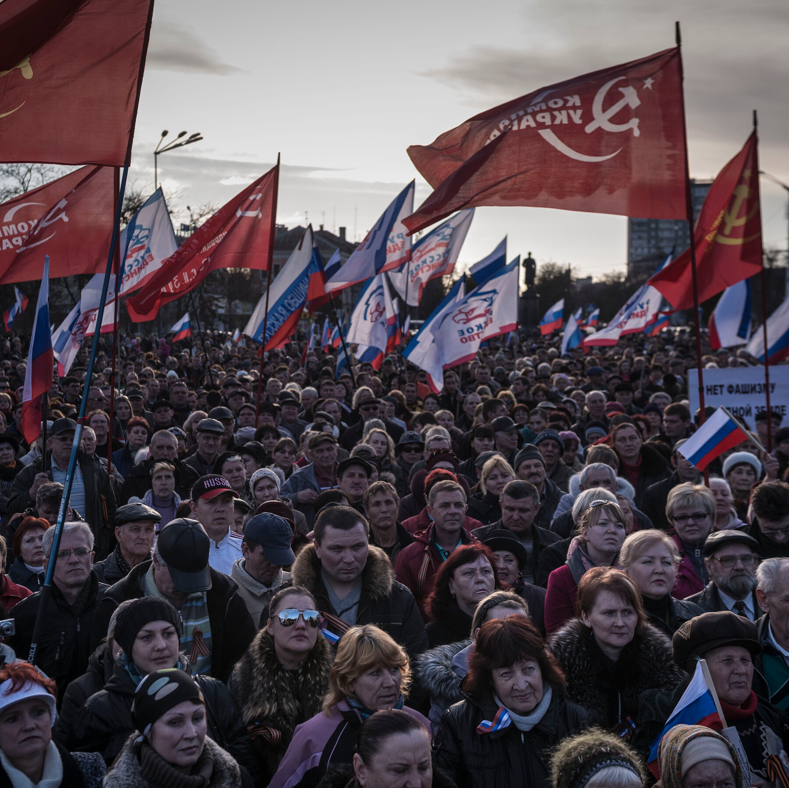

A pro-Russian rally on Crimea in 2014, the year Russia seized the peninsula. Sergey Ponomarev for The New York Times

2014 年在克里米亚举行的亲俄集会，那一年俄罗斯占领了半岛。 Sergey Ponomarev for 纽约时报

Many of the people closest to Mr. Putin had an incentive to cater to the boss’s rising self-regard — and to magnify the external threats and historical injustices that Mr. Putin saw himself as fighting against.

许多与普京最亲近的人都有动机去迎合这位老板日益高涨的自尊——并夸大普京认为自己正在与之抗争的外部威胁和历史不公。

A former Putin confidant compared the dynamic to the radicalization spiral of a social media algorithm, feeding users content that provokes an emotional reaction.

普京的一位前密友将动态与社交媒体算法的激进化螺旋进行了比较，向用户提供引起情绪反应的内容。

“They read his mood and they start to slip him that kind of stuff,” he said.  
“他们读懂了他的心情，然后开始向他灌输那种东西，”他说。  

By the summer of 2021, during a meeting that was supposed to be about the economy, Mr. Putin railed instead against the West and President George W. Bush’s withdrawal from the Antiballistic Missile Treaty in 2002, which Mr. Putin often cites as one of America’s great post-Cold War sins.

到 2021 年夏天，在一场本应讨论经济问题的会议上，普京转而抨击西方和总统乔治·W·布什 (George W. Bush) 于 2002 年退出《反弹道导弹条约》(Antiballistic Missile Treaty)，普京经常引用该条约作为其中之一美国在冷战后犯下的大罪。

“We tried to partner with the West for many years, but the partnership was not accepted, it didn’t work,” Mr. Putin said, recalled his guest, who sat on the other end of a long table.

“多年来，我们一直试图与西方合作，但这种合作没有被接受，没有奏效，”坐在长桌另一端的客人回忆说，普京先生说。

The words had a sort of finality to them, the visitor said: “It was like he was talking to himself, not to me.”

这些话对他们来说有一种终结性，来访者说：“就好像他在自言自语，而不是对我说话。”

The guest had spent three days in quarantine before meeting with Mr. Putin at a distance of roughly 15 feet. It was a “light” option the Kremlin offered to people who sought face time with Mr. Putin but wanted to avoid the lengthy quarantines required for an up-close meeting with him, even in the pandemic’s second year.

在与普京先生在大约 15 英尺的距离会面之前，这位客人已经隔离了三天。这是克里姆林宫向那些寻求与普京会面但希望避免与他近距离会面所需的长时间隔离的人提供的一个“轻松”选择，即使是在大流行的第二年。

 

Mr. Putin meeting with his defense minister and a top military official in February. The photo was released by Russian state media. Aleksey Nikolskyi/Sputnik, via Reuters

2 月，普京会见了他的国防部长和一名高级军事官员。这张照片由俄罗斯官方媒体发布。 Aleksey Nikolskyi/Sputnik，来自路透社

Mr. Putin’s isolation deepened his radicalization, people who know him say. He went 16 months without meeting a single Western leader in person. He held just about all his meetings by videoconference from nondescript rooms that left his exact location a mystery. Those who got to see him in person saw their influence rise in a system in which access to Mr. Putin — referred to as “the boss” or “V.V.,” his first initials, by insiders — is the most valuable of currencies.

认识普京的人说，普京的孤立加深了他的激进化。他有 16 个月没有亲自会见一位西方领导人。他几乎所有的会议都是在不起眼的房间里通过视频会议举行的，这让他的确切位置成为一个谜。那些亲眼见到过他的人发现，他们在一个系统中的影响力正在上升，在这个系统中，接近普京——被内部人士称为“老板”或“V.V.”，他名字的首字母缩写——是最有价值的货币。

“Our most important resource is not a medal, not money and not possession of anything,” said Konstantin Zatulin, a member of Parliament in Mr. Putin’s United Russia party. “Our main, most important resource is access to the president.”

“我们最重要的资源不是奖章，不是金钱，也不是拥有任何东西，”普京领导的统一俄罗斯党的议员康斯坦丁·扎图林 (Konstantin Zatulin) 说。 “我们主要、最重要的资源是与总统的接触。”

On that score, Yuri Kovalchuk, a conservative physicist and banking magnate who befriended Mr. Putin in the 1990s, did well during the pandemic. Mr. Kovalchuk bragged last year that he had spent several months in 2020 with Mr. Putin at his residence on Lake Valdai, between St. Petersburg and Moscow, according to a person who met with him then.

在这一点上，在 1990 年代与普京先生成为朋友的保守派物理学家和银行业大亨尤里·科瓦尔丘克 (Yuri Kovalchuk) 在大流行期间表现出色。据一位当时与他会面的人说，科瓦尔丘克先生去年吹嘘说，他在 2020 年与普京先生在他位于圣彼得堡和莫斯科之间的瓦尔代湖的住所度过了几个月。

Mr. Kovalchuk told the person that Mr. Putin’s main achievement was “militarization” — the creation of an army and a society ready for war.

科瓦尔丘克先生告诉该人士，普京先生的主要成就是“军事化”——建立了一支军队和一个为战争做好准备的社会。

The secretive Mr. Kovalchuk prides himself as a strategist who sees Russia locked in an existential battle with the West, according to people who know him. In the last decade, he has expanded his television and newspaper holdings, key parts of the Kremlin’s propaganda apparatus.

据认识他的人说，神秘的科瓦尔丘克先生以自己是一名战略家而自豪，他认为俄罗斯陷入了与西方的生死存亡之战。在过去十年中，他扩大了自己的电视和报纸资产，这是克里姆林宫宣传机构的重要组成部分。

A onetime Putin confidant said Mr. Kovalchuk sees himself “as a visionary,” and the pandemic, given the extraordinary precautions Mr. Putin took, emerged as an opportunity for Mr. Kovalchuk to deepen his imprint on the president — and the nation.

普京的一位曾经的亲信说，科瓦尔丘克先生认为自己是“一个有远见的人”，鉴于普京先生采取了非凡的预防措施，这场大流行病成为科瓦尔丘克先生加深对总统乃至整个国家的印象的机会。

Mr. Putin’s unfinished business with Ukraine also fed a growing personal animus toward Ukraine’s president, Volodymyr Zelensky.  
普京与乌克兰未竟的事业也助长了人们对乌克兰总统弗拉基米尔·泽连斯基 (Volodymyr Zelensky) 的个人敌意。  

 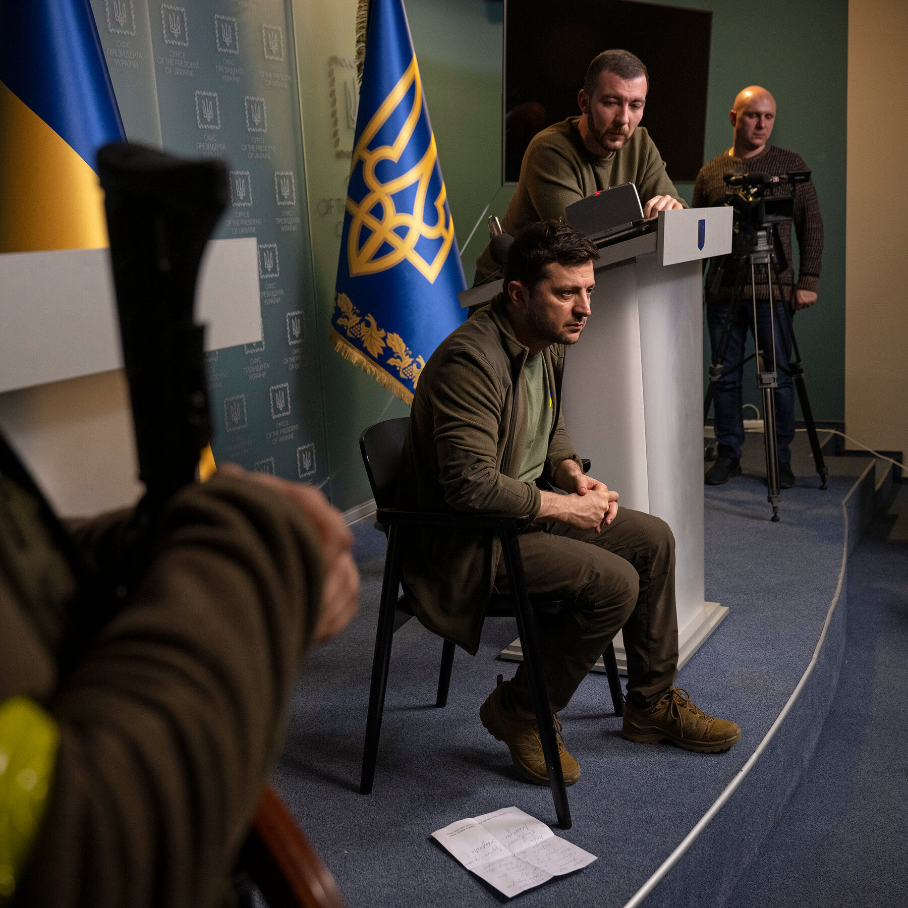

Ukraine’s president, Volodymyr Zelensky, at a news conference in Kyiv in March. Lynsey Addario for The New York Times

乌克兰总统泽连斯基 3 月在基辅举行的新闻发布会上。 Lynsey Addario for The New York Times

When Mr. Zelensky was elected in a landslide in 2019, the Kremlin saw him as someone it could work with: a Russian-speaking comedian who had lived in Moscow, performed on Russian television and won with a message of ending the war in eastern Ukraine that Russia had fueled.

When Mr. Zelensky was elected in a landslide in 2019, the Kremlin saw him as someone it could work with: a Russian-speaking comedian who had lived in Moscow, performed on Russian television and won with a message of ending the war in eastern Ukraine俄罗斯助长了。

And partly because Mr. Zelensky is Jewish, some in Moscow expected him to be tough on Ukraine’s nationalist wing, which venerated Ukrainian independence fighters who had fought alongside the Nazis in the closing battles of World War II.

部分因为泽连斯基是犹太人，莫斯科的一些人预计他会对乌克兰的民族主义势力采取强硬态度，该势力崇拜在二战末期与纳粹并肩作战的乌克兰独立斗士。

“I think he is sincerely willing” to compromise with Russia, Mr. Putin [said](http://en.kremlin.ru/events/president/news/61719) of Mr. Zelensky in 2019. “It is his sincere conviction, at least his striving.”

“我认为他真诚地愿意”与俄罗斯妥协，普京先生在 2019 年谈到泽伦斯基先生时说。“这是他真诚的信念，至少是他的努力。”

By early 2021, the Kremlin’s hopes had been dashed. Mr. Zelensky cracked down on pro-Russian interests in Ukraine, shutting down pro-Russian television channels and sanctioning Viktor Medvedchuk, a Ukrainian oligarch close to Mr. Putin.

到 2021 年初，克里姆林宫的希望破灭了。泽伦斯基打击亲俄在乌克兰的利益，关闭了亲俄电视频道，并制裁了与普京关系密切的乌克兰寡头维克多·梅德韦丘克 (Viktor Medvedchuk)。

Mr. Putin showed his frustration in a long meeting at his Sochi residence with Mr. Bennett, the new prime minister of Israel, in October 2021.

2021 年 10 月，普京先生在索契官邸与以色列新任总理贝内特先生进行了一次长时间的会谈，表达了他的沮丧情绪。

Mr. Putin charmed his guest, taking him into his private residence and pouring him a glass of whiskey. But when it came to Ukraine, Mr. Putin flashed anger. Mr. Bennett noted that Mr. Zelensky was interested in meeting Mr. Putin face to face.

普京先生迷住了他的客人，把他带到他的私人住所，并给他倒了一杯威士忌。但一谈到乌克兰，普京就怒火中烧。贝内特先生指出，泽伦斯基先生有兴趣与普京先生面对面会面。

“I have nothing to discuss with this person,” Mr. Putin shot back, according to two people familiar with the exchange. “What kind of Jew is he? He’s an enabler of Nazism.”

据两位知情人士透露，普京回击说：“我和这个人没什么好谈的。” “他是个什么样的犹太人？他是纳粹主义的推动者。”

Some Western officials believe that, by that point, Mr. Putin may have already decided to go to war. But in Russia, even among those with access to Mr. Putin or his inner circle, almost no one thought that the president was seriously considering a full-scale invasion, people close to the Kremlin said. They were sure he was bluffing.

一些西方官员认为，到那时，普京先生可能已经决定开战了。但在俄罗斯，接近克里姆林宫的人士说，即使在那些能接触到普京或其核心圈子的人中，也几乎没有人认为总统正在认真考虑全面入侵。他们确信他是在虚张声势。

Mr. Remchukov, the newspaper editor, was one of them. As the chairman of the 2018 election campaign of Mayor Sergei S. Sobyanin of Moscow — Mr. Putin’s former chief of staff — he felt well-connected enough to happily announce to his wife a week before the invasion, “Lena, there won’t be a war!”

报纸编辑雷姆丘科夫先生就是其中之一。作为莫斯科市长谢尔盖·索比亚宁 (Sergei S. Sobyanin) 2018 年竞选活动的主席——普京先生的前任幕僚长——他觉得自己人缘很好，在入侵前一周高兴地向妻子宣布，“莉娜，不会有成为一场战争！

That day, he had met for two hours with several senior military officials. Rather than betray any hint of tension, they bantered about Mr. Remchukov’s newly svelte physique, queried him in detail about his weight-loss regimen and casually discussed their vacation plans for early March.

那天，他与几位高级军官会面了两个小时。他们没有流露出任何紧张的迹象，而是取笑雷姆丘科夫先生新近变得苗条的体格，详细询问了他的减肥方案，并随意地讨论了他们 3 月初的假期计划。

After he came home and described the meeting to his wife, he said, “she kissed me and said: ‘What happiness!’”

他回家后向妻子描述了这次会面，他说，“她吻了我说：‘多么幸福啊！’”

The Americans, by contrast, feared the worst.  
相比之下，美国人担心最坏的情况。  

On Feb. 22, two days before the invasion, Ukraine’s foreign minister, Dmytro Kuleba, went to the Pentagon and said his nation desperately needed Stingers, the shoulder-fired antiaircraft missiles.

2 月 22 日，即入侵前两天，乌克兰外交部长德米特罗·库莱巴 (Dmytro Kuleba) 前往五角大楼表示，他的国家迫切需要 Stingers 这种肩扛式防空导弹。

Secretary of Defense Lloyd J. Austin III offered to help before asking how the Ukrainian government planned to keep running after the Russians invaded. “If you get pushed out of Kyiv,” he said, “where are you going to go?”

国防部长劳埃德·J·奥斯汀三世 (Lloyd J. Austin III) 在询问乌克兰政府计划如何在俄罗斯人入侵后继续运作之前提出提供帮助。 “如果你被赶出基辅，”他说，“你打算去哪里？”

Mr. Kuleba replied: “I can’t even acknowledge that. We’re not even going to talk about that or think about that.”

库勒巴先生回答说：“我什至无法承认这一点。我们甚至不会谈论它或考虑它。”

“Yeah, I got that,” Mr. Austin said. “But you need a plan.”  
“是的，我明白了，”奥斯汀先生说。 “但你需要一个计划。”  

Soon, Gen. Mark A. Milley, the chairman of the Joint Chiefs of Staff, joined in, launching into what a senior American defense official described as a “‘you’re going to die’ speech.”

很快，参谋长联席会议主席马克·A·米尔利将军也加入进来，发表了一位美国高级国防官员所说的“‘你会死’的演讲”。

“They’re going to roll into Kyiv in a few days,” General Milley said. “They’re coming in with tanks and columns of formations. You need to be ready for that. You need to be prepared. If you’re not, it’s going to be a slaughter.”

“他们将在几天内开进基辅，”米利将军说。 “他们带着坦克和编队进来。你需要为此做好准备。你需要做好准备。如果你不这样做，那将是一场屠杀。”

As General Milley spoke, Mr. Kuleba and members of his delegation sat back in their chairs, their eyes widening.

米利将军讲话时，库莱巴先生和他的代表团成员坐回椅子上，瞪大了眼睛。

The Ukrainian air force had trained with NATO members since 2011, and the partnership deepened after Russia took Crimea in 2014. Wary of another invasion, they carried out combat exercises in Ukraine and California, preparing the nation’s air force to take on its technologically superior enemy. In February, a secretive U.S. Air Force and Air National Guard team called Grey Wolf was set up at Ramstein Air Base in Germany to support the Ukrainians.

乌克兰空军自 2011 年以来一直与北约成员国一起训练，并在 2014 年俄罗斯占领克里米亚后加深了伙伴关系。出于对另一次入侵的警惕，他们在乌克兰和加利福尼亚进行了作战演习，让该国空军准备好应对其技术优势的敌人. 2 月，一支名为“灰狼”的秘密美国空军和空军国民警卫队在德国拉姆施泰因空军基地成立，以支持乌克兰人。

But General Milley still harbored serious doubts about Ukraine’s state of readiness. He had walked the halls of the Pentagon that winter with an enormous green map of Ukraine, with increasingly ominous projections from U.S. intelligence agencies of Russia’s invasion plans. What’s more, the American defense attaché at the embassy in Kyiv had spent weeks trying to get Ukraine’s defensive plans, and the ones she received minimized, in the Pentagon’s view, the Russian threat.

但米利将军仍然对乌克兰的战备状态深表怀疑。那年冬天，他带着一张巨大的乌克兰绿色地图在五角大楼的大厅里走来走去，美国情报机构对俄罗斯入侵计划的预测越来越不祥。更重要的是，美国驻基辅大使馆的国防专员花了数周时间试图获得乌克兰的防御计划，而在五角大楼看来，她收到的计划将俄罗斯的威胁降到最低。

Mr. Austin seemed somewhat uncomfortable at General Milley’s blunt admonishment of the Ukrainian foreign minister and chimed in, reassuringly: “We’re going to do what we can to help these guys.”

奥斯汀先生似乎对米利将军对乌克兰外交部长的直言不讳感到有些不自在，他插嘴安慰道：“我们将尽我们所能帮助这些人。”

The reality was slow to sink in for many in Moscow, too. Mr. Zatulin, a senior Putin ally in Russia’s Parliament, said he got his first inkling that the president was serious about an invasion in mid-February. Though known as a leading expert on Ukraine, Mr. Zatulin said he was never consulted on the possibility.

对于莫斯科的许多人来说，现实也很缓慢。扎图林是普京在俄罗斯议会的高级盟友，他说他在 2 月中旬第一次意识到总统对入侵是认真的。 Zatulin 先生虽然被称为乌克兰问题的主要专家，但他说从未就这种可能性征求过他的意见。

To the contrary, Mr. Zatulin said he was scheduled to give an address to the Russian Parliament on behalf of Mr. Putin’s United Russia party on Feb. 15 that was supposed to signal the opposite — that there would be no invasion unless Mr. Zelensky himself went on the offensive in Ukraine’s divided east. But just five minutes before the session was scheduled to start, Mr. Zatulin said, he got a message from an aide: The party’s leadership had canceled his speech.

相反，扎图林先生表示，他计划于 2 月 15 日代表普京先生的统一俄罗斯党向俄罗斯议会发表讲话，该讲话本应发出相反的信号——除非泽连斯基先生，否则不会发生入侵。他本人在乌克兰分裂的东部继续进攻。但就在会议预定开始前五分钟，扎图林先生说，他从一名助手那里收到一条消息：党的领导层取消了他的演讲。

“I was not ready for this turn of events,” Mr. Zatulin said. “Everything connected to this decision turned out to be a surprise not just for me, but also for a great many of the people in power.”

“我还没有准备好应对这一轮事件，”扎图林先生说。 “与这个决定有关的一切结果不仅让我感到惊讶，而且让很多当权者都感到惊讶。”

Mr. Peskov, Mr. Putin’s spokesman, insisted that he found out about the invasion only once it had begun. Likewise, Anton Vaino, Mr. Putin’s chief of staff, and Aleksei Gromov, Mr. Putin’s powerful media adviser, also said they did not know in advance, according to people who spoke to them about it.

普京的发言人佩斯科夫坚称，他是在入侵开始后才发现的。同样，普京的幕僚长安东·瓦伊诺 (Anton Vaino) 和普京有权势的媒体顾问阿列克谢·格罗莫夫 (Aleksei Gromov) 也表示，据与他们交谈过的人士说，他们事先并不知道。

The best that senior aides could do was to try to read Mr. Putin’s body language. Some reported with concern that “he’s got this warlike twinkle in his eyes,” a person close to the Kremlin said.

高级助手能做的最好的事情就是试着解读普京的肢体语言。一些接近克里姆林宫的人士表示，一些人担心地报告说，“他的眼中闪烁着好战的光芒”。

  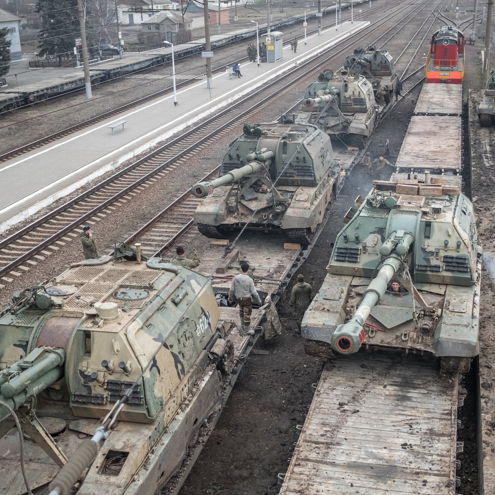

Russian howitzers being loaded onto train cars at a station outside Taganrog, Russia, days before the invasion. The New York Times

入侵前几天，俄罗斯榴弹炮在俄罗斯塔甘罗格郊外的一个车站被装上火车车厢。纽约时报

Sergei Markov, a former Kremlin adviser, said that amid Russia’s military buildup around Ukraine late last year, a deputy minister asked him if he knew what was going to happen.

前克里姆林宫顾问谢尔盖·马尔科夫说，去年年底俄罗斯在乌克兰周边集结军事力量，一位副部长问他是否知道会发生什么。

“That means that no one has told the deputy minister,” Mr. Markov said. “Even some members” of Russia’s security council “weren’t told until the last moment.”

“这意味着没有人告诉副部长，”马尔科夫先生说。 “甚至一些成员”俄罗斯安全委员会“直到最后一刻才被告知”。

Many elites found out too late.  
许多精英发现得太晚了。  

Russia’s main industrial association had been expecting to meet with Mr. Putin in February. On the agenda, among other things: the regulation of cryptocurrencies. But the meeting kept getting rescheduled, until finally, on Feb. 22 or Feb. 23, the Kremlin notified participants of the date: Feb. 24, the day Mr. Putin invaded Ukraine.

俄罗斯的主要工业协会一直期待在 2 月与普京会面。在议程上，除其他事项外：加密货币的监管。但会议一直在重新安排，直到最后，在 2 月 22 日或 2 月 23 日，克里姆林宫通知与会者日期：2 月 24 日，即普京入侵乌克兰的日子。

Andrey Melnichenko, a coal and fertilizer billionaire in that lobbying group, described how he woke up that day to the “madness” in Ukraine. But the meeting with Mr. Putin was still on, so a few hours later, he was at the Kremlin, as scheduled. In an anteroom, stunned tycoons were munching on sandwiches while awaiting the results of their coronavirus swabs to clear them to share Mr. Putin’s air.

该游说团体中的煤炭和化肥亿万富翁安德烈·梅尔尼琴科 (Andrey Melnichenko) 描述了他那天醒来时如何发现乌克兰的“疯狂”。但与普京的会面仍在继续，所以几个小时后，他如约到达了克里姆林宫。在一个接待室里，目瞪口呆的大亨们一边嚼着三明治，一边等待他们的冠状病毒拭子检测结果，以便与普京分享空气。

When Mr. Putin finally appeared, the television cameras were rolling. He told the assembled billionaires that he had no choice but to invade.

当普京先生终于现身时，电视摄像机正在转动。他告诉聚集的亿万富翁，他别无选择，只能入侵。

Mr. Putin met with a group of Russian oligarchs at the Kremlin on Feb. 24.  
2 月 24 日，普京在克里姆林宫会见了一群俄罗斯寡头。  

“What happened, in my view, is irrational,” said Mr. Melnichenko, describing his reaction to the invasion. “It was shock.”

“在我看来，发生的事情是不合理的，”梅尔尼琴科先生在描述他对入侵的反应时说。 “真是震惊。”

Another magnate recalled realizing — too late — that Mr. Putin was parading them in front of the television cameras, for all the world to see, for a carefully planned purpose. The point was “specifically to tar everyone there,” he said, “to get everyone sanctioned.”

另一位大亨回忆说——太晚了——普京先生在电视摄像机前炫耀他们，让全世界都看到，这是一个精心策划的目的。他说，重点是“专门给那里的每个人涂上焦油，让每个人都受到制裁”。

There was no going back. They, like the rest of Russia, were in this with Mr. Putin now.  
没有回头路了。与俄罗斯其他地区一样，他们现在与普京先生站在了一起。  

Sure enough, Mr. Melnichenko and all the other businessmen who appeared with Mr. Putin that day were hit with sanctions by the West in the months that followed.

果不其然，梅尔尼琴科先生和那天与普京先生一起出现的所有其他商人在随后的几个月里都受到了西方的制裁。

## **Internal Rot**  
“Everyone was stealing and lying.”

内部腐烂 “每个人都在偷窃和撒谎。”

Even as the Ukrainians rallied to beat back the Russian advance, Russian intelligence officers emailed instructions to state media, telling it to portray generous and triumphant Russian troops saving civilians from Ukraine’s villainous leaders.

就在乌克兰人集结起来击退俄罗斯的进攻时，俄罗斯情报官员通过电子邮件向官方媒体发出指示，告诉其描绘慷慨而胜利的俄罗斯军队从乌克兰邪恶的领导人手中拯救平民。

Russia’s main security service, the F.S.B., worked hand in glove with the military and state television to project the illusion of success — and to conceal the dysfunction.

俄罗斯的主要安全部门 F.S.B. 与军方和国家电视台密切合作，以营造成功的假象——并掩盖功能失调。

Defeats became accomplishments, as if reflected through a carnival mirror. Despite Russia’s humiliating failure to seize Ukraine’s capital, its military sent TV crews a video about Ukrainians supposedly throwing down their NATO-provided guns.

失败变成了成就，就像通过狂欢节的镜子反射出来的一样。尽管俄罗斯在夺取乌克兰首都方面遭遇耻辱性失败，但其军方向电视台工作人员发送了一段视频，内容是乌克兰人据称扔掉了北约提供的枪支。

As Russian troops retreated from areas around Kyiv in March, the F.S.B. boasted about the heroics of Russian special forces, claiming they stopped Ukrainians who terrorized pro-Russian civilians. In some cases, the agency even offered language to hide the source of the information: “A SOURCE CLOSE TO THE POWER STRUCTURES OF RUSSIA!!!!”

3 月，随着俄罗斯军队从基辅周边地区撤退，联邦安全局吹嘘俄罗斯特种部队的英勇，声称他们阻止了恐吓亲俄平民的乌克兰人。在某些情况下，该机构甚至提供语言来隐藏信息来源：“接近俄罗斯电力结构的来源！！！”

The messages, drawn from tens of thousands of emails leaked from Russia’s largest state-owned media company and reviewed by The Times, show how at least one engine of the Russian war effort purred along smoothly: the nation’s propaganda machine.

这些消息来自俄罗斯最大的国有媒体公司泄露的数万封电子邮件，并经时报审阅，显示了俄罗斯战争努力的至少一个引擎是如何顺利运转的：国家的宣传机器。

At times, Russia’s military and the F.S.B. directed coverage down to the video clips played and the time of publication. The emails, leaked from V.G.T.R.K., the state media giant that oversees some of Russia’s most-watched channels, portrayed Mr. Putin’s military as backed into a corner by NATO.

有时，俄罗斯军方和 F.S.B. 将报道细化到播放的视频片段和发布时间。这些电子邮件是从监管俄罗斯一些最受关注频道的国家媒体巨头 V.G.T.R.K. 泄露的，将普京的军队描绘成被北约逼到了墙角。

Once the full invasion began, the machine downplayed Russian atrocities, bolstered conspiracy theories and tried to portray Ukrainian troops as abandoning their posts. (After the emails were released by a group that publishes hacked documents, The Times verified the documents by confirming identities, email addresses and broadcasts on the air.)

一旦全面入侵开始，这台机器就会淡化俄罗斯的暴行，支持阴谋论，并试图将乌克兰军队描绘成放弃他们的职位。 （在一个发布被黑文件的组织发布电子邮件后，《纽约时报》通过确认身份、电子邮件地址和广播来验证这些文件。）

Off camera, state media employees had little to no idea what was actually happening. A state television journalist said in an interview that as late as April, his Kremlin sources were still assuring him that the war would be over within days.

在镜头外，官方媒体员工几乎不知道到底发生了什么。一名国家电视台记者在接受采访时说，直到 4 月，他的克里姆林宫消息人士仍在向他保证战争将在几天内结束。

A pro-Russian Ukrainian politician called for Mr. Zelensky to resign on a Russian state-run news channel.  
一位亲俄的乌克兰政客在俄罗斯国营新闻频道上呼吁泽伦斯基先生辞职。  

“Tomorrow morning, there’ll be a statement,” the journalist recalled one of his sources saying, only to be proved wrong the next day. “It was really kind of weird.”

“明天早上，会有一份声明，”这位记者回忆起他的一位消息人士说，但第二天就被证明是错误的。 “这真的有点奇怪。”

But while state broadcasters kept delivering upbeat assessments, Mr. Putin privately acknowledged that his military was struggling.  
但是，虽然国家广播公司不断发表乐观的评价，但普京先生私下承认他的军队正在苦苦挣扎。  

During the meeting in March with Mr. Bennett of Israel — when Mr. Putin conceded that the war would be “much more difficult than we thought” — he returned to the theme that has become a fixation of his presidency: his place in Russian history.

在 3 月与以色列的贝内特先生会面时——当时普京先生承认这场战争“比我们想象的要困难得多”——他回到了已经成为他总统任期的主题：他在俄罗斯历史上的地位.

### Ukraine recaptures the North 乌克兰收复北方

“I won’t be the Russian leader who stood by and did nothing,” he told Mr. Bennett, according to two people familiar with the exchange.

据两位知情人士透露，他对贝内特说：“我不会成为袖手旁观的俄罗斯领导人。”

Once again, Mr. Putin seemed convinced that future generations of Russians could be threatened by the West. He had spent years preparing for precisely such a clash, devoting hundreds of billions of dollars to Russia’s military, supposedly to modernize it and strip out the corruption that had sapped it in the 1990s.

普京似乎又一次相信，未来几代俄罗斯人可能会受到西方的威胁。他花了数年时间为这样一场冲突做准备，向俄罗斯军队投入了数千亿美元，据称是为了使其现代化并清除在 1990 年代削弱它的腐败。

But while Russia made significant headway, Western officials said, a culture of graft and fraud persisted under Mr. Putin that emphasized loyalty above honesty, or even skill. The result was a hodgepodge of elite troops and bedraggled conscripts, advanced tanks and battalions that were powerful only on paper.

但西方官员表示，虽然俄罗斯取得了重大进展，但在普京的领导下，贪污和欺诈文化依然存在，这种文化强调忠诚高于诚实，甚至高于技能。结果是精锐部队和衣衫褴褛的应征者、先进的坦克和仅在纸面上强大的营的大杂烩。

“Everyone was stealing and lying. This was a Soviet, and now Russian, tradition,” said Col. Vaidotas Malinionis, a retired Lithuanian commander who served in the Soviet military in the 1980s. Looking at satellite images of the army camp where he served, he said the old barracks and mess hall were still there, with no sign of modernization, and a few buildings had fallen down. “There has been no evolution at all, only regression,” he said.

“每个人都在偷窃和撒谎。这是苏联的传统，现在是俄罗斯的传统，”1980 年代在苏联军队服役的退休立陶宛指挥官 Vaidotas Malinionis 上校说。看着他服役的军营卫星照片，他说，老营房和食堂还在，没有现代化的迹象，有几栋楼倒塌了。 “根本没有进化，只有倒退，”他说。

European, American and Ukrainian officials warned against underestimating Russia, saying it had improved after its [muddled invasion](https://www.nytimes.com/2022/05/16/world/europe/russia-military-ukraine.html) of Georgia in 2008. The defense minister [overhauled the armed forces](https://www.nytimes.com/2022/01/27/world/europe/russia-military-putin-ukraine.html), forcibly retired about 40,000 officers and tried to impose more transparency on where money went.

欧洲、美国和乌克兰官员警告不要低估俄罗斯，称俄罗斯在 2008 年对格鲁吉亚的混乱入侵后有所改善。国防部长对武装部队进行了全面改革，强行让大约 40,000 名军官退休，并试图提高资金流向的透明度。

“He made a lot of enemies,” said Dara Massicot, a RAND researcher who studies the Russian military.  
“他树立了很多敌人，”研究俄罗斯军队的兰德公司研究员 Dara Massicot 说。  

Then, in 2012, that minister — in charge of dragging the military out of its post-Soviet dysfunction — became [embroiled in a corruption scandal](https://www.nytimes.com/2012/11/07/world/europe/putin-dismisses-russian-defense-minister.html) himself. Mr. Putin replaced him with Sergei K. Shoigu, who had no military experience but was seen as someone who could smooth ruffled feathers.

然后，在 2012 年，这位部长——负责将军队从后苏联解体的功能障碍中拖出来——自己也卷入了一场腐败丑闻。普京用谢尔盖·K·绍伊古 (Sergei K. Shoigu) 取代了他，谢尔盖·绍伊古 (Sergei K. Shoigu) 没有军事经验，但被视为能抚顺人心的人。

“Russia drew a lot of lessons from the Georgia war and started to rebuild their armed forces, but they built a new Potemkin village,” said Gintaras Bagdonas, the former head of Lithuania’s military intelligence. Much of the modernization drive was “just pokazukha,” he said, using a Russian term for window-dressing.

“俄罗斯从格鲁吉亚战争中吸取了很多教训，并开始重建他们的武装力量，但他们建立了一个新的波将金村，”立陶宛前军事情报局局长金塔拉斯巴格多纳斯说。他说，大部分现代化推动“只是 pokazukha”，用俄语来形容橱窗装饰。

Contractors like Sergei Khrabrykh, a former Russian Army captain, were recruited into the stagecraft. He said he got a panicked call in 2016 from a deputy defense minister. A delegation of officials was scheduled to tour a training base of one of Russia’s premier tank units, the Kantemirovskaya Tank Division, whose history dates to the victories of World War II.

像前俄罗斯陆军上尉谢尔盖·赫拉布赖赫这样的承包商被招募到舞台艺术中。他说，他在 2016 年接到了一位国防部副部长打来的惊慌失措的电话。一个官员代表团计划参观俄罗斯最重要的坦克部队之一的训练基地，即 Kantemirovskaya 坦克师，其历史可以追溯到二战的胜利。

Billions of rubles had been allocated for the base, Mr. Khrabrykh said, but most of the money was gone and virtually none of the work had been done. He said the minister begged him to transform it into a modern-looking facility before the delegation arrived.

Khrabrykh 先生说，已经为该基地分配了数十亿卢布，但大部分资金都花光了，而且几乎所有工作都没有完成。他说，部长请求他在代表团抵达之前将其改造成一座外观现代的设施。

“They needed to be guided around the territory and shown that the Kantemirovskaya Division was the coolest,” Mr. Khrabrykh said. He was given about $1.2 million and a month to do the job.

“他们需要被引导到领土周围，并展示 Kantemirovskaya 师是最酷的，”Khrabrykh 先生说。他得到了大约 120 万美元和一个月的时间来完成这项工作。

As he toured the base, Mr. Khrabrykh was stunned by the dilapidation. The Ministry of Defense had hailed the tank division as [a unit that would defend Moscow](https://ria.ru/20131016/970460238.html) in case of a NATO invasion. But the barracks were unfinished, with debris strewn across the floors, large holes in the ceiling and half-built cinder-block walls, according to photos Mr. Khrabrykh and his colleagues took. A tangle of electrical wires hung from a skinny pole.

参观基地时，Khrabrykh 先生被破败的景象惊呆了。国防部称赞坦克师是在北约入侵时保卫莫斯科的单位。但根据 Khrabrykh 和他的同事拍摄的照片，营房尚未完工，地板上散落着碎片，天花板上有大洞，煤渣砌块墙还建了一半。一根细细的杆子上挂着一团电线。

“Just about everything was destroyed,” he said.  
“几乎所有东西都被摧毁了，”他说。  

 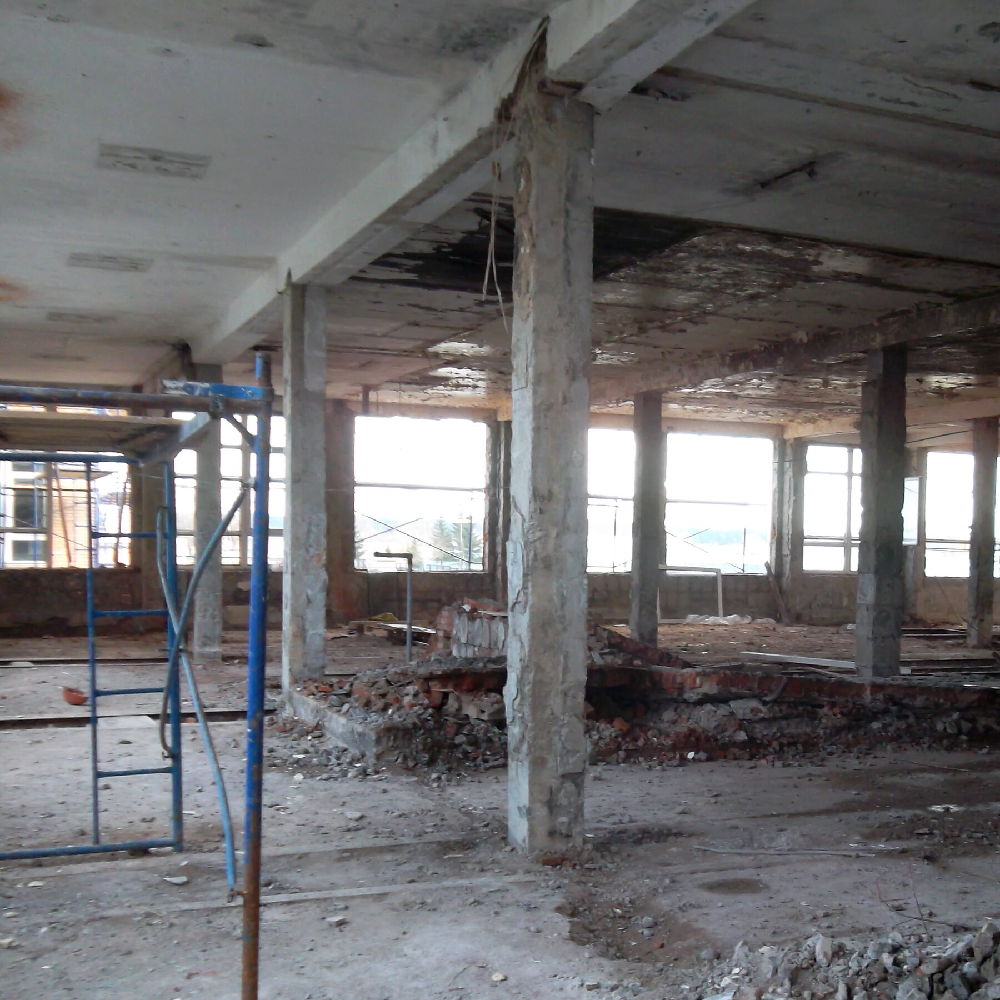

The interior of a tank base building. Sergei Khrabrykh  
坦克基地建筑的内部。谢尔盖·赫拉布里赫  

 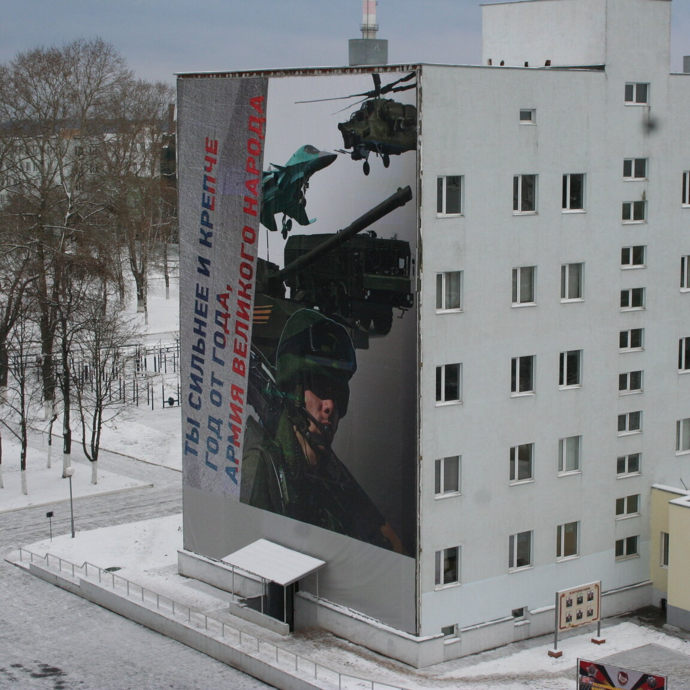

The same base after work was done to cover up its state. Sergei Khrabrykh  
完成工作以掩盖其状态后的同一基地。谢尔盖·赫拉布里赫  

Before the delegation arrived, Mr. Khrabrykh said, he quickly constructed cheap facades and hung banners, covered in pictures of tanks and boasting the army was “stronger and sturdier year by year,” to disguise the worst of the decay. On the tour, he said, the visitors were guided along a careful route through the best-looking part of the base — and kept away from the bathrooms, which had not been repaired.

Khrabrykh 先生说，在代表团抵达之前，他迅速建造了廉价的外墙并悬挂横幅，上面覆盖着坦克的图片，并吹嘘军队“一年比一年强大”，以掩饰最糟糕的衰败。他说，在参观过程中，游客们被引导沿着一条小心的路线穿过基地最好看的部分——并远离尚未修复的浴室。

After the invasion started, the Kantemirovskaya Division pressed into northeastern Ukraine, only to be ravaged by Ukrainian forces. Crews limped away with many of their [tanks](https://warontherocks.com/2022/09/the-tank-is-not-obsolete-and-other-observations-about-the-future-of-combat/) abandoned or destroyed.

入侵开始后，Kantemirovskaya 师向乌克兰东北部推进，却遭到乌克兰军队的蹂躏。船员们一瘸一拐地走了，许多坦克被遗弃或摧毁。

Russian prosecutors have pursued thousands of officers and others for corruption in recent years: One colonel was accused of embezzling money meant [for vehicle batteries](https://tass.ru/proisshestviya/13526073?utm_source=pasmi.ru&utm_medium=referral&utm_campaign=pasmi.ru&utm_referrer=pasmi.ru), another of [fraud around mobile kitchens](https://tass.ru/proisshestviya/11586041). The deputy chief of the general staff was [charged with defrauding the state over radio gear](https://www.kommersant.ru/doc/4248345?from=other_read), and a major general [sentenced to prison](https://www.kommersant.ru/doc/5216720) in the case.

近年来，俄罗斯检察官以腐败罪名起诉了数千名官员和其他人：一名上校被指控挪用用于购买汽车电池的资金，另一名上校则被指控围绕移动厨房进行欺诈。副总参谋长被控利用无线电设备诈骗国家，一名少将因该案被判入狱。

In 2019, Russia’s chief military prosecutor [said](https://tass.ru/obschestvo/6242472) that more than 2,800 officers had been disciplined over corruption violations in the past year alone.

2019 年，俄罗斯首席军事检察官表示，仅在过去一年，就有 2800 多名军官因腐败违法行为受到纪律处分。

After the invasion, American officials noticed that much of Russia’s equipment was poorly manufactured or in short supply. Tires on wheeled vehicles fell apart, stalling convoys, while soldiers [resorted to crowdfunding](https://www.nytimes.com/2022/05/28/world/europe/russian-soldiers-military-supplies.html) for clothes, crutches and other basic supplies as the war wore on.

入侵后，美国官员注意到俄罗斯的许多设备制造质量差或供应不足。轮式车辆的轮胎破裂，导致车队停滞不前，而随着战争的进行，士兵们不得不通过众筹来购买衣服、拐杖和其他基本用品。

But even more consequential than the corruption, officials and analysts said, were the ways Mr. Putin fundamentally misunderstood his own military.

但官员和分析人士表示，比腐败更严重的是普京从根本上误解了自己军队的方式。

Russia had, in fact, spent 20 years getting ready for a radically different kind of war.  
事实上，俄罗斯已经花了 20 年的时间准备一场完全不同的战争。  

It had not prepared its military to invade and occupy a country as big and powerful as Ukraine, officials and analysts said. Instead, Russia had largely organized its military to keep U.S. and NATO forces away by inflicting maximum damage from afar.

官员和分析人士说，它没有准备好军队入侵和占领像乌克兰这样强大的国家。相反，俄罗斯在很大程度上组织了军队，通过从远处造成最大破坏来阻止美国和北约部队。

Central to this strategy was a series of outposts — Kaliningrad by the Baltic, Crimea in the Black Sea, and the Syrian port of Tartus on the Mediterranean — to use long-range missiles to keep Western forces at bay. In the event of conflict, Russia intended to blind the enemy and destroy it from a distance, American officials said.

这一战略的核心是一系列前哨基地——波罗的海的加里宁格勒、黑海的克里米亚和地中海的叙利亚港口塔尔图斯——使用远程导弹将西方军队拒之门外。美国官员说，如果发生冲突，俄罗斯打算蒙蔽敌人并从远处摧毁它。

But in this case, Russia did not crush Ukraine with weeks of missile strikes in advance. It marched in quickly with forces on the ground.

但在这种情况下，俄罗斯并没有提前数周的导弹袭击粉碎乌克兰。它与地面部队一起迅速进军。

Unlike its more limited campaigns in places like Syria — or the big hypothetical war with NATO it had long planned for — the invasion of Ukraine was simply “not what the Russian military was designed to do,” putting it in a position it was probably “least prepared” to deal with, said Clint Reach, a researcher at RAND.

不像它在叙利亚等地的有限战役——或者它长期以来计划的与北约的大规模假想战争——入侵乌克兰根本“不是俄罗斯军队的目的”，使其处于可能“兰德公司的研究员克林特·瑞奇 (Clint Reach) 说：“准备最不充分”。

In other words, the Kremlin picked the “stupidest” of all potential military options by rushing forward and trying to take over Ukraine, said General Budanov, the Ukrainian military intelligence chief.

乌克兰军事情报局局长布达诺夫将军说，换句话说，克里姆林宫选择了所有潜在的军事选择中“最愚蠢的”，即冲上前去试图接管乌克兰。

Russia had not trained its infantry, air and artillery forces to work in concert, move quickly and then do it all again from a new location, officials said. It did not have a clear Plan B after the march on Kyiv failed, and commanders had long been afraid to report bad news to their bosses.

官员们说，俄罗斯没有训练其步兵、空军和炮兵协同作战、快速行动，然后从新地点再次行动。在基辅进军失败后，它没有明确的 B 计划，指挥官们长期以来一直不敢向上级报告坏消息。

### Russian aims get smaller 俄罗斯的目标越来越小

#### Throughout the summer, Russia makes incremental gains in the East.  
整个夏天，俄罗斯在东方取得了渐进的进展。  

“The collective system of circular, mutual self-deception is the herpes of the Russian Army,” the pro-Russian militia commander Aleksandr Khodakovsky [wrote on Telegram in June](https://t.me/aleksandr_skif/2279).

“循环、相互自欺欺人的集体系统是俄罗斯军队的疱疹，”亲俄民兵指挥官亚历山大·霍达科夫斯基 (Aleksandr Khodakovsky) 6 月在电报中写道。

The mounting failures drove a cadre of pro-Russian military bloggers to a boiling point. While still cheerleaders for the war, they began to openly criticize Russia’s performance.

越来越多的失败使一群亲俄军事博客作者达到了沸点。虽然他们仍然是战争的啦啦队，但他们开始公开批评俄罗斯的表现。

“I’ve been keeping quiet for a long time,” the blogger Yuri Podolyaka [said in May](https://t.me/yurasumy/3510), after hundreds of soldiers died in a river crossing. “Due to stupidity — I emphasize, because of the stupidity of the Russian command — at least one battalion tactical group was burned, possibly two.”

“我已经保持沉默很长时间了，”博主尤里·波多利亚卡 (Yuri Podolyaka) 在 5 月份说，当时数百名士兵在一次渡河中丧生。 “由于愚蠢——我强调，因为俄罗斯指挥部的愚蠢——至少有一个营战术组被烧毁，可能是两个。”

  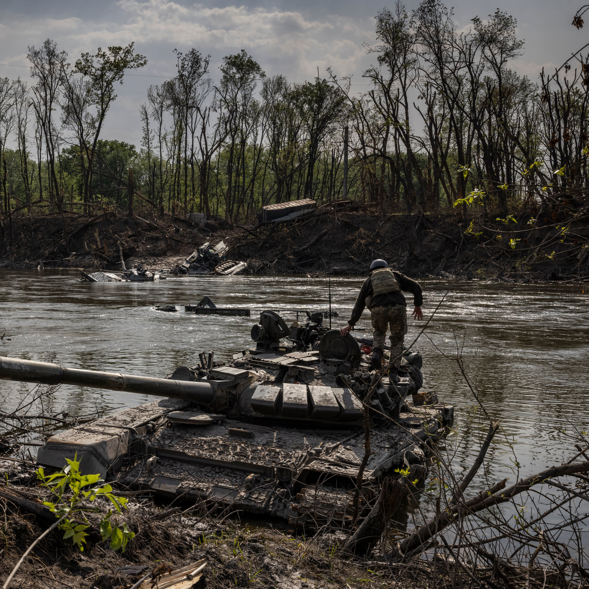

A Ukrainian soldier atop an abandoned Russian tank at a river crossing where hundreds of Russian soldiers died. Ivor Prickett for The New York Times

一名乌克兰士兵站在一辆废弃的俄罗斯坦克上，在一条河道上，数百名俄罗斯士兵在那里丧生。 Ivor Prickett for The New York Times

The fury eventually reached Mr. Putin himself. On the sidelines of his marquee annual economic conference in St. Petersburg in June, the president held a meeting that had become a tradition: a sit-down with news media chiefs. This time, though, the bloggers were the headline guests.

愤怒最终传到了普京本人身上。 6 月，总统在圣彼得堡召开了盛大的年度经济会议，期间举行了一次会议，这已成为一项传统：与新闻媒体负责人坐下来会面。不过这一次，博主们成了头条新闻嘉宾。

Mr. Putin sat alone at one end in a cavernous hall, according to one attendee, who provided a photo of the private gathering. Some of the bloggers took the floor and peppered Mr. Putin with messages and complaints from the front.

据一位提供了私人聚会照片的与会者说，普京先生独自坐在宽敞大厅的一端。一些博主发言，不断向普京先生发送来自前线的信息和抱怨。

“It became a very concrete conversation, a surprising one for us,” the person present said. “We’d never had such conversations.”

“这变成了一次非常具体的谈话，让我们感到惊讶，”在场的人说。 “我们从来没有进行过这样的对话。”

It appeared to the person there that Russia’s intelligence agencies were using the bloggers to shift the blame for the war’s failings to the Ministry of Defense. Mr. Zatulin, the Putin ally in Parliament, insisted he supported the war, but said a blame game has broken out, and took a side himself.

在那里的人看来，俄罗斯情报机构正在利用这些博客将战争失败的责任推给国防部。普京在议会的盟友扎图林坚称他支持这场战争，但表示一场相互指责的游戏已经爆发，他自己也站在了一边。

“Of course, to a certain degree, we now have an element of everyone wanting to dump the responsibility on someone else,” Mr. Zatulin said.

“当然，在某种程度上，我们现在有一个因素，每个人都想把责任推给别人，”扎图林先生说。

“But I think that the main miscalculations,” he added, “were made by the Defense Ministry and the General Staff” — the military’s top brass.

“但我认为主要的误判，”他补充说，“是国防部和总参谋部做出的”——军队的高层。

## **Collapsing Front**  
“Nobody is going to stay alive.”

崩溃的前线 “没有人会活着。”

Ruslan was 54 years old, at war in Ukraine, and seemed to be learning to use his weapon on the fly.

鲁斯兰当时 54 岁，正在乌克兰打仗，他似乎正在学习如何在飞行中使用他的武器。

In his pack, he had printouts from Wikipedia, describing the rifle he was carrying and instructions to help him shoot accurately.

在他的背包里，他有维基百科的打印件，描述了他携带的步枪和帮助他准确射击的说明。

He also carried pictures of enemy commanders, stamped “WANTED” in red.  
他还带着敌军指挥官的照片，上面印有红色的“通缉”字样。  

A photocopied letter offered motivation: “Soldiers, take care of yourself and come back home swiftly to your family and close ones healthy and alive,” it read. “Goodbye.”

一封影印的信提供了动力：“士兵们，照顾好自己，迅速回家，与家人和亲人一起健康活着，”信中写道。 “再见。”

His mission seemed clear enough. With his marksman’s rifle, bundle of papers and copies of his Russian passport in his pack, Ruslan was one of thousands of poorly trained, underequipped men asked to defend a huge swath of territory that Russia had seized in northeastern Ukraine.

他的使命似乎很明确。鲁斯兰带着他的射手步枪、一捆文件和他的俄罗斯护照复印件，是数千名训练有素、装备不足的士兵中的一员，他们被要求保卫俄罗斯在乌克兰东北部占领的大片领土。

By summer’s end, Russian leaders had sent their best troops [far to the south](https://www.nytimes.com/2022/08/08/world/europe/ukraine-russia-fighting-south-east.html), leaving skeleton crews behind. So when the Ukrainians swept in and [attacked the northeast](https://www.nytimes.com/2022/09/10/world/europe/ukraine-offensive-izium-donbas.html), hoping to recapture occupied land, soldiers like Ruslan were cut down or melted away in a chaotic retreat.

到夏天结束时，俄罗斯领导人已将他们最精锐的部队派往南方很远的地方，留下了骨干人员。因此，当乌克兰人横扫并进攻东北部，希望夺回被占领的土地时，像鲁斯兰这样的士兵在混乱的撤退中被砍倒或被融化。

Military analysts had warned of such a danger before the invasion. Even as tens of thousands of Russian soldiers massed ominously along Ukraine’s borders, they said, the Kremlin had not sent enough to occupy the entire country. The Russian war plans for the 26th Tank Regiment signaled the same problem: Expect no reinforcements.

军事分析家在入侵之前就警告过这种危险。他们说，尽管数万名俄罗斯士兵不祥地集结在乌克兰边境，但克里姆林宫派出的兵力还不足以占领整个国家。俄罗斯第 26 坦克团的战争计划表明了同样的问题：预计没有增援。

Russia managed to take territory, frequently at enormous cost. But how to keep it was often an afterthought.  
俄罗斯设法占领了领土，而且往往付出了巨大的代价。但如何保留它往往是事后才想到的。  

“The army, the generals, the soldiers weren’t ready,” said Mr. Tsaryov, the man American officials identified as a puppet leader the Kremlin could install in Ukraine.

“军队、将军和士兵都没有准备好，”Tsaryov 说，美国官员认为他是克里姆林宫可以安插在乌克兰的傀儡领导人。

  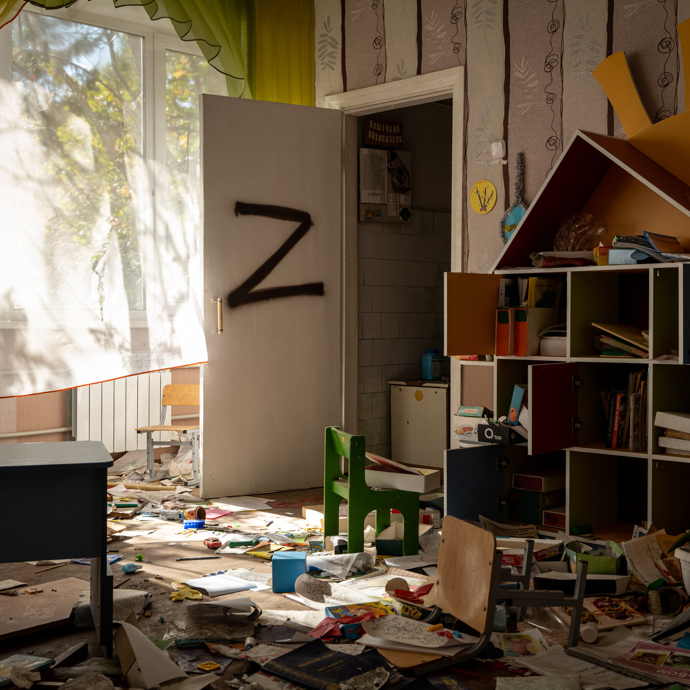

A kindergarten classroom near Izium was used as a base by retreating Russian soldiers and emblazoned with the military symbol “Z” in September. Nicole Tung for The New York Times

Izium 附近的幼儿园教室被撤退的俄罗斯士兵用作基地，并在 9 月装饰有军事符号“Z”。 Nicole Tung for The New York Times

He said the Russian Army had spread itself so thin across Ukraine after invading that it “would move through cities and not leave behind even a garrison, even a small one to stick up a Russian flag and defend it.”

他说，俄罗斯军队在入侵乌克兰后分散在整个乌克兰，“它会穿过城市，甚至不会留下一个驻军，即使是一个小驻军来竖起俄罗斯国旗并保卫它。”

In the northeastern region of Kharkiv, Russian commanders put men like Ruslan at roadblocks and moved on.  
在东北部的哈尔科夫地区，俄罗斯指挥官将鲁斯兰这样的人设置为路障，然后继续前进。  

### Ukrainians break through in the Kharkiv region  
乌克兰人在哈尔科夫地区取得突破  

He had little else besides the printouts in his pack, which Ukrainian soldiers recovered with what they believe to be his body in September. The rifle next to him suggested he was a sniper. But while snipers in modern militaries often go through weeks of additional special training, Ruslan’s teacher appeared to be the internet.

除了背包里的打印件外，他几乎没有别的东西，乌克兰士兵在 9 月份用他们认为是他的尸体的东西找到了这些打印件。他旁边的步枪表明他是一名狙击手。但是，虽然现代军队中的狙击手通常要接受数周的额外特殊训练，但鲁斯兰的老师似乎是互联网。

“Hello dear soldier!” read the unsigned letter in his pack. “You have to risk your life so that we can live peacefully. Thanks to you and your comrades our army remains so strong, mighty and can protect us from any enemy.”

“你好亲爱的士兵！”阅读他包裹里那封未署名的信。 “你必须冒着生命危险，这样我们才能和平地生活。多亏了你和你的战友，我们的军队仍然如此强大、强大，可以保护我们免受任何敌人的伤害。”

More than 50 pages of Russian documents, collected from three towns in the Kharkiv region and reviewed by The Times, show a timeless truth: Foot soldiers bear the outsize burden of combat.

从哈尔科夫地区的三个城镇收集并由《泰晤士报》审阅的 50 多页俄罗斯文件显示了一个永恒的事实：步兵承担着巨大的战斗负担。

The documents — shared with three independent military experts, who considered them credible — detail how Russia relied on bedraggled backup forces, many of them separatist fighters from Ukraine’s long conflict in its divided east, to hold territory as the regular Russian Army fought hundreds of miles away.

这些文件与三位认为可信的独立军事专家分享，详细说明了俄罗斯如何依靠衣衫褴褛的后备部队，其中许多是来自乌克兰分裂的东部长期冲突的分离主义战士，在俄罗斯正规军作战数百英里时守住领土离开。

The 202nd Rifle Regiment of the Luhansk People’s Republic — Kremlin-backed separatists in eastern Ukraine — was one of them. It had nearly 2,000 men, but was almost completely dependent on foot soldiers.

卢甘斯克人民共和国第 202 步兵团——乌克兰东部克里姆林宫支持的分裂分子——就是其中之一。它有近 2,000 名士兵，但几乎完全依赖步兵。

More than a dozen pages of its rosters detail the particulars of the unit’s suffering, down to a lack of warm clothing and boots.

十几页的花名册详细描述了该部队遭受苦难的细节，小到缺乏保暖的衣服和靴子。

Several of its soldiers were in their 50s, including one who experienced “cardiac failure,” while one of its youngest casualties, a 20-year-old named Vladimir, endured “frostbite of the lower limbs.” Yet another complained on a phone call intercepted by the Ukrainians that he had no armored vest and a helmet from the 1940s.

它的几名士兵在 50 多岁，其中一名经历过“心脏衰竭”，而其中一名最年轻的伤员，一名 20 岁的弗拉基米尔，遭受了“下肢冻伤”。还有一个人在乌克兰人截获的电话中抱怨说，他没有 1940 年代的装甲背心和头盔。

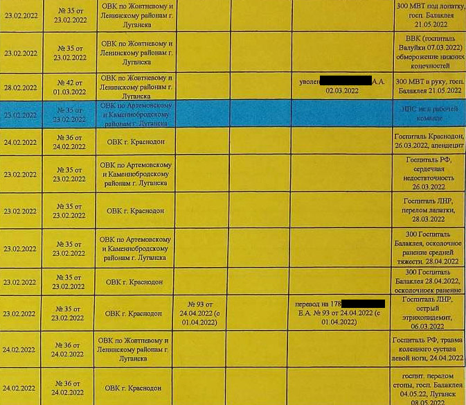

An excerpt from a roster of soldiers from the 202nd Rifle Regiment of the Luhansk People’s Republic.  
卢甘斯克人民共和国第 202 步兵团士兵名单的摘录。  

“Our battalion, for instance, has already gone more than three weeks without receiving ammunition from the army,” the pro-Russian militia commander, Mr. Khodakovsky, [said on Telegram](https://t.me/aleksandr_skif/2373) in September.

“例如，我们的营已经三个多星期没有收到军队的弹药，”亲俄罗斯的民兵指挥官 Khodakovsky 先生 9 月在电报中说。

In an interview, another soldier described having only the vaguest sense of how to use his weapon.  
在一次采访中，另一名士兵描述说他对如何使用他的武器只有最模糊的感觉。  

He recounted being advised to fire judiciously, one round at a time, rather than blasting his rifle uncontrollably. But he wasn’t sure how to do that. So, shortly before going into combat, he said, he turned to a commander and asked how to switch his rifle off fully automatic.

他回忆说，有人建议他谨慎开火，一次一发，而不是失控地开火。但他不确定该怎么做。因此，他说，在进入战斗前不久，他求助于一名指挥官，询问如何将他的步枪全自动关闭。

Russia came to rely on such battered, inexperienced troops after months of tactics that more closely resembled 1917 than 2022. Commanders sent waves of troops into the range of heavy artillery, eking out a few yards of territory at grievous tolls.

经过数月的战术（与 1917 年比 2022 年更相似）之后，俄罗斯开始依赖这些饱受摧残、缺乏经验的军队。指挥官们派出一波又一波的部队进入重型火炮的射程，以惨重的代价勉强控制了几码的领土。

When one Russian unit arrived in eastern Ukraine, it was quickly whittled down to a haggard few, according to one of its soldiers.

据其中一名士兵说，当一支俄罗斯部队抵达乌克兰东部时，它很快就被削减到只剩几人。

During fighting in the spring, he said, his commanders ordered an offensive, promising artillery to support the attack. It never came, he said, and his unit was devastated.

他说，在春季的战斗中，他的指挥官下令进攻，并承诺用大炮支援这次进攻。他说，它从来没有来过，他的部队被摧毁了。

Yet commanders sent them right back into the melee all the same.  
然而，指挥官们还是把他们送回了混战。  

“How much time has passed now? Nine months, I think?” he said. “In this whole time, nothing has changed. They have not learned. They have not drawn any conclusions from their mistakes.”

“现在过了多少时间？九个月，我想？他说。 “在这整个时间里，什么都没有改变。他们没有学到。他们没有从错误中得出任何结论。”

He recounted another battle in which commanders sent soldiers down the same path to the front, over and over. On each trip, he said, bodies fell around him. Finally, after being ordered to go a fifth time, he and his unit refused to go, he said.

他讲述了另一场战斗，指挥官们一次又一次地派遣士兵沿着同一条路前往前线。他说，在每次旅行中，尸体都在他周围倒下。最后，在第五次被命令去后，他和他的部队拒绝去，他说。

In all, he said, his unit lost about 70 percent of its soldiers to death and injury, ruining any faith he had in his commanders.

他说，他的部队总共损失了大约 70% 的士兵死伤，这摧毁了他对指挥官的信心。

“Nobody is going to stay alive,” he said. “One way or another, one weapon or another is going to kill you.”

“没有人会活着，”他说。 “无论哪种方式，一种或另一种武器都会杀死你。”

American officials realized early on that they had vastly overestimated Russia’s military. The morale of rank-and-file soldiers was so low, the Americans said, that Russia began moving its generals to the front lines to shore it up.

美国官员很早就意识到他们大大高估了俄罗斯的军队。美国人说，普通士兵的士气如此低落，以至于俄罗斯开始将其将军调往前线以支撑士气。

But the generals made a deadly mistake: They positioned themselves near antennas and communications arrays, making them easy to find, the Americans said.

但将军们犯了一个致命的错误：美国人说，他们将自己安置在天线和通信阵列附近，以便于找到它们。

Ukraine started killing Russian generals, yet the risky Russian visits to the front lines continued. Finally, in late April, the Russian chief of the general staff, Gen. Valery Gerasimov, made secret plans to go himself.

乌克兰开始杀害俄罗斯将军，但俄罗斯继续冒险前往前线。最后，在 4 月下旬，俄罗斯总参谋长瓦列里·格拉西莫夫 (Valery Gerasimov) 将军秘密计划亲自前往。

American officials said they found out, but kept the information from the Ukrainians, worried they would strike. Killing General Gerasimov could sharply escalate the conflict, officials said, and while the Americans were committed to helping Ukraine, they didn’t want to set off a war between the United States and Russia.

美国官员说他们发现了，但对乌克兰人隐瞒了这些信息，担心他们会发动袭击。官员们表示，杀死格拉西莫夫将军可能会使冲突急剧升级，虽然美国人致力于帮助乌克兰，但他们不想在美俄之间引发战争。

The Ukrainians learned of the general’s plans anyway, putting the Americans in a bind. After checking with the White House, senior American officials asked the Ukrainians to call off the attack.

乌克兰人无论如何都知道了将军的计划，这让美国人进退两难。在与白宫核实后，美国高级官员要求乌克兰人取消袭击。

“We told them not to do it,” a senior American official said. “We were like, ‘Hey, that’s too much.’”

“我们告诉他们不要这样做，”一位美国高级官员说。 “我们当时想，‘嘿，这太过分了。’”

The message arrived too late. Ukrainian military officials told the Americans that they had already launched their attack on the general's position.

消息来得太晚了。乌克兰军方官员告诉美国人，他们已经对将军的阵地发起了攻击。

Dozens of Russians were killed in the strike, officials said. General Gerasimov wasn’t one of them.  
官员说，数十名俄罗斯人在袭击中丧生。格拉西莫夫将军不是其中之一。  

Russian military leaders scaled back their visits to the front after that.  
此后，俄罗斯军方领导人缩减了对前线的访问。  

## **Divided Ranks**  
“Wagner almost always fights alone.”

分等级 “瓦格纳几乎总是独自战斗。”

They deployed tanks, heavy artillery and fighter jets.  
他们部署了坦克、重炮和战斗机。  

They pushed out their own propaganda and ran recruiting centers.  
他们推出自己的宣传并经营招募中心。  

And they fought on the front line in Ukraine.  
他们在乌克兰的前线作战。  

But they didn’t answer directly to the Russian military. They belonged to a mercenary group, known as Wagner.  
但他们没有直接回答俄罗斯军方。他们属于一个名为瓦格纳的佣兵团。  

And they became one of Mr. Putin’s shadow armies in Ukraine, often acting as a rival to the Russian military.

Wagner’s leader, Yevgeny Prigozhin, has long been a crony of the Russian president.  
瓦格纳的领导人叶夫根尼·普里戈任长期以来一直是俄罗斯总统的亲信。  

To join in Mr. Putin’s war, he has recruited prisoners, trashed the Russian military and competed with it for weapons.

为了加入普京先生的战争，他招募了俘虏，捣毁了俄罗斯军队并与其争夺武器。

More than 20 years into a murder sentence, Yevgeny Nuzhin saw his chance at salvation swoop in by helicopter.

在被判谋杀罪 20 多年后，叶夫根尼·努任 (Yevgeny Nuzhin) 乘直升机看到了获救的机会。

Mr. Prigozhin — the close confidant of Mr. Putin, known for stirring up trouble across [the Middle East](https://www.nytimes.com/2018/05/24/world/middleeast/american-commandos-russian-mercenaries-syria.html) [and Africa](https://www.nytimes.com/2022/05/31/world/africa/wagner-group-africa.html) with his mercenary army, Wagner — came to Mr. Nuzhin’s prison south of Moscow in August, looking for recruits.

普里戈任先生是普京先生的亲密知己，以其雇佣军瓦格纳在整个中东和非洲挑起事端而闻名。8 月，普里戈任先生来到位于莫斯科南部的努任先生监狱寻找新兵。

Heaving with patriotic fervor, Mr. Prigozhin gave the kind of speech he has delivered [at other Russian prisons](https://www.nytimes.com/2022/09/16/world/europe/russia-wagner-ukraine-video.html) in recent months, some shared online. In one, also from August, Mr. Prigozhin, dressed in a drab beige uniform, promised pardons for the inmates who made it back from Ukraine alive. Those who didn’t, he said, would “be buried in the alleys of the heroes.”

普里戈任先生怀着爱国热情发表了他最近几个月在俄罗斯其他监狱发表的那种演讲，有些人在网上分享。其中一次也是从 8 月开始，普里戈任先生身着单调的米色制服，承诺赦免从乌克兰活着回来的囚犯。他说，那些不这样做的人将“被埋葬在英雄的小巷里”。

He also issued a warning: Anyone thinking of deserting his forces once in Ukraine, he said in the video, would be shot.

他还发出警告：他在视频中说，任何想在乌克兰开小差的人都会被枪毙。

Mr. Nuzhin accepted Mr. Prigozhin’s offer, but ignored the warning.  
Nuzhin 先生接受了 Prigozhin 先生的提议，但没有理会警告。  

After two days at the front, where he spent his time collecting the bodies of dead Wagner soldiers, he used the cover of darkness to slip away and surrender to Ukrainian troops.

在前线待了两天后，他花了很多时间收集死去的瓦格纳士兵的尸体，然后利用黑暗的掩护溜走并向乌克兰军队投降。

“What good has Putin done in the time that he has been in power? Has he done anything good?” Mr. Nuzhin told The Times after being taken into Ukrainian custody. “I think this war is Putin’s grave.”

“普京执政期间做了什么好事？他做过什么好事吗？”努任先生在被乌克兰拘留后告诉《泰晤士报》。 “我认为这场战争是普京的坟墓。”

 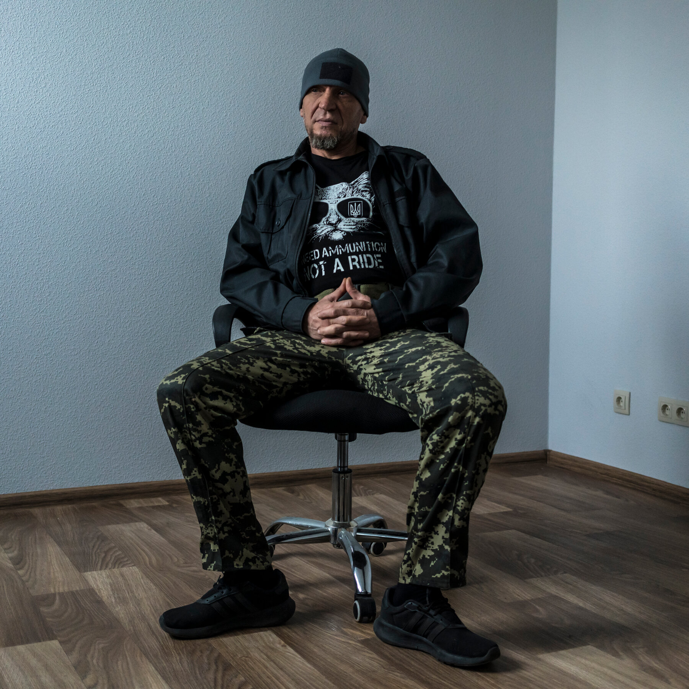

Yevgeny Nuzhin, 55, a Russian prisoner of war held by Ukraine, in October. Brendan Hoffman for The New York Times

10 月，55 岁的叶夫根尼·努任 (Yevgeny Nuzhin) 是一名被乌克兰关押的俄罗斯战俘。 《纽约时报》的布伦丹·霍夫曼 (Brendan Hoffman)

Mr. Putin’s reliance on mercenaries and convicts is one of the more unusual features of his war in Ukraine. Mr. Prigozhin is just one of a handful of strongmen active in the war, all of them managed by Mr. Putin, who has carved up the administration of much of Russia into competing fiefs run by people loyal to him above all.

普京对雇佣军和罪犯的依赖是他在乌克兰的战争中较为不寻常的特征之一。普里戈任先生只是为数不多的活跃在战争中的强人之一，他们都由普京先生管理，普京先生将俄罗斯大部分地区的行政管理划分为相互竞争的封地，这些封地首先由忠于他的人管理。

Beyond the mercenaries controlled by Mr. Prigozhin, who rose to prominence as a caterer of Kremlin events, there is also the Russian national guard, overseen by Mr. Putin’s former bodyguard. And there is the unit commanded by the Chechen leader, Mr. Kadyrov — whose fighters were found and attacked because of their misadventures on TikTok.

除了作为克里姆林宫活动承办人而声名鹊起的普里戈任控制的雇佣军外，还有俄罗斯国民警卫队，由普京的前保镖监督。还有车臣领导人卡德罗夫指挥的部队——他们的战士因在 TikTok 上遭遇不幸而被发现并遭到袭击。

As far as officials can tell, the Russian military has limited coordination with any of them.  
据官员所知，俄罗斯军方与他们中的任何一个的协调都有限。  

“There was no unified command, there was no single headquarters, there was no single concept and there was no unified planning of actions and command,” said General Ivashov, the retired Russian officer who warned the war would go badly. “It was destined to be a defeat.”

“没有统一的指挥部，没有单一的司令部，没有单一的概念，也没有统一的行动和指挥计划，”伊瓦绍夫将军说，这位退休的俄罗斯军官曾警告说战争会很糟糕。 “注定要失败。”

The splintered Russian forces have sparred openly. After Russian forces withdrew from northeast Ukraine in late summer, Mr. Kadyrov [called for](https://t.me/RKadyrov_95/2911) the Russian commander responsible to be demoted to private and shipped to the front, “to wash his shame away with blood.”

分裂的俄罗斯军队公开争吵。夏末俄罗斯军队从乌克兰东北部撤出后，卡德罗夫先生呼吁将负有责任的俄罗斯指挥官降职为二等兵并派往前线，“以鲜血洗刷他的耻辱”。

Mr. Prigozhin [weighed in](https://vk.com/concordgroup_official?w=wall-177427428_1219), too: “All these bastards should go with machine guns barefoot to the front.”  
Prigozhin 先生也发表了看法：“所有这些混蛋都应该赤脚拿着机枪冲到前线。”  

The public finger-pointing has added to a sense of disarray within the Russian war effort. Mr. Putin has replaced several top military commanders. Yet he has stuck with Mr. Shoigu, his defense minister, and with General Gerasimov, the chief of the military’s general staff, because firing them would amount to a public acknowledgment that the war is going badly, an admission Mr. Putin is loath to make, argued General Budanov, the Ukrainian military intelligence chief.

公众的指责加剧了俄罗斯战争努力的混乱感。普京先生更换了几位高级军事指挥官。然而，他一直支持他的国防部长绍伊古和军队总参谋长格拉西莫夫将军，因为解雇他们相当于公开承认战争进展不顺利，而普京不愿承认这一点乌克兰军事情报局局长布达诺夫将军争辩道。

“They are still trying to maintain the illusion that everything is going well,” he said.  
“他们仍在努力维持一切顺利的错觉，”他说。  

The friction has, at times, run all the way down to the troops in the battle zone.  
摩擦有时会一直蔓延到战区的部队。  

After a battlefield argument in the Zaporizhzhia region over the summer, a Russian tank commander drove his T-90 tank not at the enemy but toward a group of Russian national guard troops, firing at their checkpoint and blowing it up, said Fidar Khubaev, describing himself as а Russian drone operator who witnessed the episode.

菲达尔·库巴耶夫 (Fidar Khubaev) 说，在夏季扎波罗热地区的一场战场争吵之后，一名俄罗斯坦克指挥官驾驶他的 T-90 坦克没有向敌人开火，而是向一群俄罗斯国民警卫队开火，向他们的检查站开火并将其炸毁。他本人是目睹这一事件的俄罗斯无人机操作员。

“Those types of things happen there,” said Mr. Khubaev, adding that he fled Russia in the fall.  
“那些事情在那里发生，”库巴耶夫先生说，并补充说他在秋天逃离了俄罗斯。  

Of all the supplementary armies charging into Ukraine, Mr. Prigozhin’s Wagner has become especially pivotal. Its troops have received glowing coverage on Russian state television, and in November they were profiled in a documentary film called “Wagner: Contract with the Motherland” produced by RT, one of the Kremlin’s primary propaganda outlets.

在所有冲进乌克兰的补充军队中，普里戈任先生的瓦格纳变得尤为关键。它的军队在俄罗斯国家电视台得到了热烈的报道，11 月，克里姆林宫的主要宣传渠道之一 RT 制作了一部名为“瓦格纳：与祖国的契约”的纪录片，对他们进行了介绍。

“Until recently, Wagner has been one of the most closed and secretive organizations, but for us they have made a huge exception,” Andrey Yashchenko, the film’s presenter, says in the opening montage, which shows tanks rolling through rubble-strewn villages.

“直到最近，瓦格纳一直是最封闭、最隐秘的组织之一，但对我们来说，他们是一个巨大的例外，”影片的主持人安德烈·亚申科在开场蒙太奇中说道，画面显示坦克驶过满是废墟的村庄。

In the first five months of the war, there was almost no public mention of Wagner or Mr. Prigozhin’s involvement in Ukraine. By late summer, as the Russian military began to collapse under Ukrainian campaigns in the northeast and south, Mr. Prigozhin stepped into the spotlight.

在战争的前五个月里，几乎没有公开提及瓦格纳或普里戈任先生卷入乌克兰的事件。到夏末，随着俄罗斯军队在乌克兰东北部和南部的战役中开始崩溃，普里戈任先生走上了聚光灯下。

After years of denying any links to Wagner — and sometimes [its very existence](https://www.nytimes.com/2022/06/05/world/africa/wagner-russia-sudan-gold-putin.html) — Mr. Prigozhin suddenly went public, making a show of visiting his troops in Ukraine, handing out medals, attending funerals and trumpeting his independence on the battlefield.

在多年否认与瓦格纳有任何联系——有时甚至否认与瓦格纳的存在——之后，普里戈任突然公开露面，炫耀他在乌克兰的部队、颁发奖章、参加葬礼并在战场上宣扬自己的独立性。

Mr. Prigozhin attending a soldier’s funeral on Sept. 23. v1.ru  
9月23日，普里戈任先生参加军人葬礼。v1.ru  

“Wagner almost always fights alone,” he said in [an Oct. 14 post on the page of his catering company on VK](https://vk.com/concordgroup_official?w=wall-177427428_1289), a Russian social media site.

“瓦格纳几乎总是孤军奋战，”10 月 14 日，他在俄罗斯社交媒体网站 VK 上他的餐饮公司页面上的一篇帖子中说。

A Times analysis of videos in Ukraine found that Wagner troops are often showcasing some of Russia’s most advanced weaponry, including tanks, fighter aircraft and thermobaric rocket launchers. And because of his connection with the president, Mr. Prigozhin is given priority over other military units for arms and equipment, a senior European official said.

《纽约时报》对乌克兰视频的分析发现，瓦格纳部队经常展示俄罗斯最先进的武器，包括坦克、战斗机和温压火箭发射器。一位欧洲高级官员说，由于他与总统的关系，普里戈任先生在武器和装备方面比其他军事单位享有优先权。

Mr. Peskov, the Kremlin spokesman, denied that Russia’s separate fighting forces were causing confusion or division, insisting they all report to Russia’s top military brass. The prominence of Mr. Prigozhin and Mr. Kadyrov, he said, was merely a function of their public-relations efforts.

克里姆林宫发言人佩斯科夫先生否认俄罗斯独立的战斗部队造成混乱或分裂，坚称他们都向俄罗斯最高军事官员报告。他说，普里戈任先生和卡德罗夫先生的知名度仅仅是他们公关努力的结果。

“Some people are more active in the information space, some people are less active,” Mr. Peskov said. “But it doesn’t signify any, let’s say, independence.”

“有些人在信息领域更活跃，有些人则不那么活跃，”佩斯科夫先生说。 “但它并不意味着，比方说，独立。”

Despite its weaponry and bravado, Wagner has struggled on the battlefield. Some Ukrainian soldiers say it is a formidable foe. Yet for nearly six months, Wagner’s troops have been trying to seize the small industrial city of Bakhmut, in the eastern Donetsk region, and have been kept at bay by Ukrainian forces at great cost to both sides — prompting a rare public acknowledgment of Ukraine’s fighting prowess.

尽管拥有武器和虚张声势，瓦格纳仍在战场上挣扎。一些乌克兰士兵说这是一个可怕的敌人。然而，近六个月来，瓦格纳的部队一直试图夺取顿涅茨克东部地区的小型工业城市巴赫穆特，并被乌克兰军队拒之门外，双方付出了巨大代价——这促使人们罕见地公开承认乌克兰的战斗实力。

  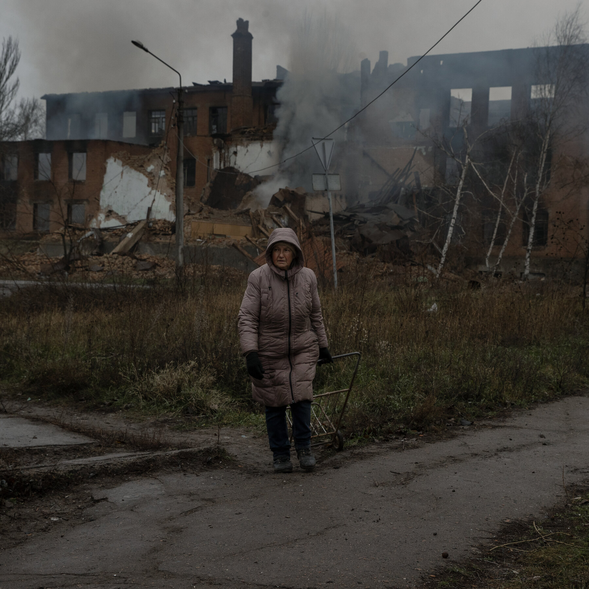

The frontline city of Bakhmut, where Wagner forces have fought for months. Tyler Hicks/The New York Times  
前线城市巴赫穆特，瓦格纳部队已经在这里战斗了数月。泰勒希克斯/纽约时报  

“The situation is difficult but stable,” Mr. Prigozhin said in the Oct. 14 post. “The Ukrainians are offering dignified resistance. The legend about Ukrainians running away is just that, a legend. Ukrainians are guys with steel balls just like us. This isn’t a bad thing. As Slavs, we should take pride in this.”

“形势艰难但稳定，”Prigozhin 先生在 10 月 14 日的帖子中说。 “乌克兰人正在进行有尊严的抵抗。乌克兰人逃跑的传说只是一个传说。乌克兰人和我们一样都是有钢球的人。这不是坏事。作为斯拉夫人，我们应该为此感到自豪。”

Hundreds of Wagner troops have been killed in the war, and several of the group’s fighter jets have been downed. The convicts Mr. Prigozhin has recruited appear to be little more than cannon fodder and make up a vast majority of casualties among Wagner forces, according to an assessment by Ukraine’s military intelligence agency, which said in October that about 8,000 Wagner troops were fighting in Ukraine.

数百名瓦格纳部队在战争中丧生，该集团的几架战斗机被击落。根据乌克兰军事情报机构的一项评估，普里戈任先生招募的罪犯似乎不过是炮灰，占瓦格纳部队伤亡人数的绝大多数，该机构在 10 月份表示，约有 8,000 名瓦格纳部队在乌克兰作战.

Another former Russian inmate recruited by Mr. Prigozhin said he was left in a shallow trench at the front lines near Bakhmut for four days with no food or water and little sense of what he was supposed to be doing, other than dragging away the many bodies of his dead comrades.

普里戈津先生招募的另一名前俄罗斯囚犯说，他被留在巴赫穆特附近前线的浅沟里四天，没有食物或水，除了拖走许多尸体外，几乎不知道自己应该做什么他死去的战友。

It was no wonder, he said, that some of Wagner’s recruits decided to flee.  
他说，难怪瓦格纳的一些新兵决定逃跑。  

To keep control, Mr. Prigozhin has resorted to extreme punishment, showing how the war has whittled away the vestiges of rule of law in Russia.

为了保持控制，普里戈任先生诉诸了极端的惩罚，展示了战争如何削弱了俄罗斯法治的残余。

Like Mr. Putin, whose spies have been accused of [poisoning](https://www.nytimes.com/2019/03/31/world/europe/russian-assassinations-putin-ukraine.html) and [assassinating](https://www.nytimes.com/2016/02/05/world/europe/alexander-litvinenko-poisoning-unfinished-business.html) perceived traitors all over the world, Mr. Prigozhin has said that treachery is the worst sin any Russian can commit. He has proposed setting up his own Gestapo-like police force to hunt down the disloyal, including, he has said, Russian businessmen “who leave our country in their business jets.”

就像普京先生一样，普京先生的间谍被指控在世界各地投毒和暗杀被认为是叛徒的人，普里戈任先生说，背叛是任何俄罗斯人可能犯下的最严重的罪行。他提议建立自己的类似盖世太保的警察部队来追捕不忠的人，包括他所说的“乘坐公务机离开我们国家的俄罗斯商人”。

The fate of Mr. Nuzhin serves as a grisly warning.  
Nuzhin 先生的命运是一个可怕的警告。  

Mindful of the pressures on prisoners of war and the risks they face, The Times has chosen to withhold their names. And, as with the other people we interviewed, we use documents and other evidence to vet their claims.

考虑到战俘面临的压力和面临的风险，时报选择隐瞒他们的姓名。而且，与我们采访的其他人一样，我们使用文件和其他证据来核实他们的说法。

In Mr. Nuzhin’s case, we did not publish our interview with him, but he also spoke to Ukrainian media, which broadcast portions of his account. Soon after, he was released in a prisoner swap — and ended up back in the hands of Wagner.

在努任先生的案例中，我们没有公布对他的采访，但他也接受了乌克兰媒体的采访，这些媒体播放了他的部分叙述。不久之后，他在一次囚犯交换中被释放——最终又回到了瓦格纳的手中。

He then appeared in a video on a pro-Russian Telegram account. In it, Mr. Nuzhin’s head was taped to a block. Looming over him was a man in camouflage, holding a sledgehammer.

然后，他出现在一个亲俄 Telegram 帐户的视频中。在视频中，努任先生的头被绑在一块木板上。一个身穿迷彩服、手拿大锤的人出现在他上方。

“I woke up in this basement, where I was told that I will be judged,” Mr. Nuzhin says in the video, his voice dry and gravelly. The sledgehammer then swings down and crushes his skull.

“我在这个地下室醒来，有人告诉我我会受到审判，”努任先生在视频中说，他的声音干涩而沙哑。然后大锤向下挥动，砸碎了他的头骨。

Shortly after, Mr. Prigozhin released [a statement](https://t.me/concordgroup_official/27) endorsing Mr. Nuzhin’s murder.  
不久之后，Prigozhin 先生发表声明支持谋杀 Nuzhin 先生。  

“Nuzhin betrayed his people, betrayed his comrades, betrayed them consciously,” the statement said. “He planned his escape. Nuzhin is a traitor.”

“努仁背叛了他的人民，背叛了他的同志，有意识地背叛了他们，”声明说。 “他计划逃跑。努任是叛徒。”

A day later, asked about the video on a conference call with journalists, Mr. Peskov said, “It’s not our business.”

一天后，佩斯科夫在与记者的电话会议上被问及这段视频时说，“这不关我们的事。”

## **Cannon Fodder**  
“They’ll have a glass of vodka for you.”

炮灰 “他们会给你一杯伏特加。”

For much of the war, Russian forces held onto a bright spot: the city of Kherson, the only regional capital they had captured since the invasion began.

在战争的大部分时间里，俄罗斯军队占据了一个亮点：赫尔松市，这是自入侵开始以来他们占领的唯一地区首府。

But the Russians withdrew from the city in November. Intercepted phone calls from Russian soldiers in the region showed their bitterness as they were coming under fire — with much of their anger directed at their commanders.

但是俄罗斯人在 11 月撤出了这座城市。在该地区截获的俄罗斯士兵的电话显示了他们在遭到炮火攻击时的痛苦——他们的大部分愤怒都指向了他们的指挥官。

##### 00:17

_Vadyulya, is it true that you give up your positions all the time?_  
Vadyulya，你真的一直放弃你的职位吗？  

_Yes._

_What is going on?_

_Darling I fucking don’t know. I don’t know what’s going on. Everybody asks just like you do: why the fuck are we retreating? Where is this fucking Russian army?_  
亲爱的我他妈的不知道。我不知道发生了什么。每个人都像你一样问：他妈的为什么要撤退？这该死的俄罗斯军队在哪里？  

The defeat carried a particular sting, because Russia had tried to assimilate the population of Kherson and stamp out Ukrainian identity.

这次失败带来了特别的刺痛，因为俄罗斯曾试图同化赫尔松的人口并消除乌克兰的身份。

##### 00:06

_What about the bastard?_  那混蛋呢？

_What is the news from Putin?_  普京的消息是什么？

_What is this scumbag bastard saying?_  这个人渣杂种在说什么？

Some soldiers felt sacrificed by hypocritical commanders trying to save themselves.  
一些士兵觉得被虚伪的指挥官试图自救而牺牲了。  

##### 00:18

_Some deputy commander of the army came here. A fucker._  
军队的一些副司令员来了。一个混蛋。  

_He saw all this fucking mess._  他看到了这该死的烂摊子。

_He said, ‘You could be sentenced if you leave your position, if you run away.’_  
他说，“如果你离开你的位置，如果你逃跑了，你可能会被判刑。”  

_Fucking imagine, when mortar shelling began, do you know how fast they fucking left?_  
他妈的想象一下，当迫击炮炮击开始时，你知道他们他妈的离开的速度有多快吗？  

_His wheels didn’t even get stuck in the mud._  
他的车轮甚至没有陷在泥里。  

Bracing for death, some soldiers slipped into despair.  
准备死亡，一些士兵陷入绝望。  

##### 00:10

_They’re preparing you to be cannon fodder._  
他们准备让你成为炮灰。  

_They’ll remember you for five fucking minutes._  
他们会记得你他妈的五分钟。  

_They’ll have a glass of vodka for you._  他们会给你一杯伏特加。

_And then fucking forget clean about you._  
然后他妈的忘了你。  

_Fuck._

The resignation exists in Moscow, too, where opposition to the war is common, but rarely expressed above whispers.  
莫斯科也存在辞职，反对战争在莫斯科很普遍，但很少以耳语表达。  

“We’re giving each other looks, but to say something is impossible,” one former Putin confidant in Moscow said, describing the atmosphere in the halls of power.

“我们在互相打量，但说什么是不可能的，”一位前普京亲信在莫斯科描述权力大厅的气氛时说。

  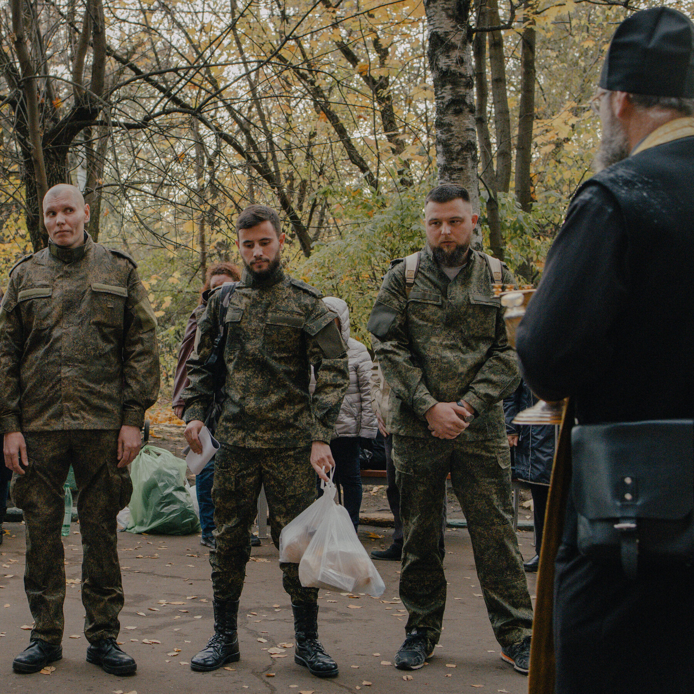

A priest blessing men conscripted into the Russian forces in Moscow in October. Nanna Heitmann for The New York Times

10 月，一名牧师在莫斯科为应征入伍的士兵祝福。 Nanna Heitmann for The New York Times

Mr. Tinkov, the former tycoon who founded one of Russia’s biggest banks, posted on Instagram in April that the war was “crazy” and excoriated Mr. Putin in an [interview with The Times](https://www.nytimes.com/2022/05/01/world/europe/oligarch-putin-oleg-tinkov.html), thinking he’d set the stage for more of Russia’s powerful to follow suit.

创办了俄罗斯最大银行之一的前大亨廷科夫先生 4 月份在 Instagram 上发帖称，这场战争是“疯狂的”，并在接受时报采访时痛斥普京先生，认为他为更多的俄罗斯战争奠定了基础。强大的效仿。

“Why didn’t anyone speak out after me?” Mr. Tinkov lamented.  
“为什么没有人跟着我说话？”廷科夫先生感叹道。  

One prominent Russian public figure who privately described the war as a “catastrophe” explained his silence by quoting the Soviet poet Yevgeny Yevtushenko.

一位私下将这场战争描述为“灾难”的俄罗斯知名公众人物引用苏联诗人叶夫根尼·叶夫图申科的话来解释他的沉默。

In the day of Galileo, one of his poems says, another scientist was also “well aware the earth revolved” around the sun, but he “had a large family to feed.”

在伽利略的时代，他的一首诗说，另一位科学家也“很清楚地球绕着太阳转”，但他“有一个大家庭要养活”。

By keeping Russia’s borders open, despite calls from hard-liners to shut them, Mr. Putin has allowed Russians unhappiest with the war — who might have otherwise protested — [to leave the country](https://www.nytimes.com/2022/03/13/world/europe/russia-exiles-putin-ukraine-war.html). And the West’s wide-ranging sanctions have not turned the elite against Mr. Putin, at least not publicly.

尽管强硬派呼吁关闭边界，普京仍保持俄罗斯边界开放，让对战争最不满的俄罗斯人——否则他们可能会抗议——离开了这个国家。西方广泛的制裁并没有让精英阶层转而反对普京，至少没有公开反对。

“In textbooks, they call this political terrorism,” said Mr. Melnichenko, the coal and fertilizer billionaire. “To say anything at gunpoint, even if you want to say it — it’s better not to.”

“在教科书中，他们称之为政治恐怖主义，”煤炭和化肥行业的亿万富翁梅尔尼琴科先生说。 “在枪口下说什么，即使你想说——最好不要说。”

Mr. Melnichenko has been penalized — unfairly, he insists — for the Russian invasion. The Italians said they [seized](https://www.reuters.com/world/europe/italy-seizes-russian-oligarch-melnichenkos-sailing-yacht-2022-03-12/) his 468-foot sailboat featuring an underwater observation pod in the keel, and sanctions forced him to abandon his longtime home in Switzerland. He now holds court on white couches in the lobby of a luxury hotel in Dubai.

梅尔尼琴科先生因俄罗斯入侵而受到惩罚——他坚称这是不公平的。意大利人说，他们没收了他 468 英尺长的帆船，帆船的龙骨上有一个水下观察舱，制裁迫使他放弃了他在瑞士的长期住所。他现在在迪拜一家豪华酒店大堂的白色沙发上主持会议。

Mr. Melnichenko offered some veiled criticism of the invasion, declaring that “any war is horrible — the faster it ends, the better.” But he insisted he was powerless to do anything to hasten its end, and that any further opinions “would trigger immediate risks.”

梅尔尼琴科先生对入侵提出了一些含蓄的批评，宣称“任何战争都是可怕的——结束得越快越好。”但他坚称，他无力做任何事情来加速它的结束，任何进一步的意见“都会引发直接的风险”。

### Ukrainians recapture Kherson in the South  
乌克兰人夺回南部的赫尔松  

Despite the sanctions, Mr. Putin sees himself on a far grander timeline than the election cycles and shifting political winds steering Western leaders, who come and go, those who know him say. In June, he [compared himself](https://www.nytimes.com/2022/06/09/world/europe/putin-peter-the-great.html) to Peter the Great as a leader “returning” and “strengthening” Russian lands.

尽管受到制裁，但普京认为自己的时间表比选举周期和不断变化的政治风向更宏大，西方领导人来来去去，了解他的人说。 6 月，他将自己与彼得大帝相提并论，认为自己是“回归”和“巩固”俄罗斯土地的领袖。

When the 18th-century czar founded St. Petersburg, Mr. Putin said, the Europeans did not consider that territory to be Russian — suggesting that Mr. Putin expects the West to someday come around and recognize his conquests as well.

普京先生说，当 18 世纪的沙皇建立圣彼得堡时，欧洲人并不认为那片领土是俄罗斯的——这表明普京先生希望西方有一天会回心转意并承认他的征服。

In late November, at his suburban Moscow residence, Mr. Putin [met with mothers of Russian soldiers](https://www.nytimes.com/2022/11/25/world/europe/putin-russia-soldiers-mothers-war.html). It was a distant echo of one of the lowest moments of his tenure: [his encounter](https://www.nytimes.com/2000/08/23/world/putin-meets-with-grieving-families-of-sub-s-crew-promises-payments-for-10-years.html) with the families of sailors aboard a sunken submarine in 2000, when a crying woman in a remote Arctic town [demanded](https://www.kommersant.ru/doc/17499), “Where is my son?”

11 月底，普京在莫斯科郊区的住所会见了俄罗斯士兵的母亲。这是他任期内最低谷时刻之一的遥远回声：2000 年，他在一艘沉没的潜艇上遇到了水手的家人，当时在一个偏远的北极小镇上，一名哭泣的妇女问道：“我的儿子呢？”

Twenty-two years later, the Kremlin was careful to prevent such outpourings of grief. Around a long table with individual teapots for the handpicked women — some of them state employees and pro-Kremlin activists — Mr. Putin showed no remorse for sending Russians to their deaths.

二十二年后，克里姆林宫小心翼翼地防止了这种悲痛的倾诉。普京围坐在一张长桌旁，为精心挑选的女性——其中一些是国家雇员和亲克里姆林宫的活动家——准备了单独的茶壶，对送俄罗斯人去死没有表现出任何悔意。

After all, he told one woman who said her son was killed in Ukraine, tens of thousands of Russians die each year from car accidents and alcohol abuse. Rather than drinking himself to death, he told her, her son died with a purpose.

毕竟，他告诉一位自称儿子在乌克兰遇害的妇女，每年有数万名俄罗斯人死于车祸和酗酒。他告诉她，与其喝死自己，她的儿子是有目的的。

“Some people, are they even living or not living? It’s unclear. And how they die, from vodka or something else, it’s also unclear,” Mr. Putin said. “But your son lived, you understand? He reached his goal.”

“有些人，到底是活着还是没活着？不清楚。他们是怎么死的，死于伏特加还是其他什么，也不清楚，”普京先生说。 “但是你的儿子活了下来，你明白吗？他达到了目的。”

He told another mother that her son was not only fighting “neo-Nazis” in Ukraine, but also correcting the mistakes after the collapse of the Soviet Union, when Russia “enthusiastically indulged in the fact” that the West was “trying to control us.”

他告诉另一位母亲，她的儿子不仅在乌克兰与“新纳粹分子”作斗争，还在苏联解体后纠正错误，当时俄罗斯“狂热地沉溺于”西方“试图控制我们”的事实”

“They have a different cultural code,” he told her. “They count the genders there by the dozens.”  
“他们有不同的文化准则，”他告诉她。 “他们按几十个来计算那里的性别。”  

It was a stark display of Mr. Putin’s preoccupations and revanchist politics. But several people who have known him for decades rejected any notion that he had grown irrational.

这是普京先生的当务之急和复仇主义政治的鲜明表现。但几个认识他几十年的人拒绝接受任何关于他变得不理性的说法。

“He’s not crazy and he’s not sick,” a person who has known Mr. Putin since the 1990s said. “He’s an absolute dictator who made a wrong decision — a smart dictator who made a wrong decision.”

“他没有疯，也没有病，”一位自 1990 年代以来就认识普京的人说。 “他是一个做出错误决定的绝对独裁者——一个做出错误决定的聪明独裁者。”

Mr. Putin has shown few hints that he’s willing to turn back now. Last month, the C.I.A. director, Mr. Burns, met for the first time since the invasion with Sergei Naryshkin, the director of the Foreign Intelligence Service of Russia. The meeting, at the headquarters of Turkish intelligence in Ankara, took place to reopen a direct, in-person line of communication between Washington and Moscow, but the tone was not one of reconciliation.

普京先生几乎没有表现出他愿意现在回头的暗示。上个月，C.I.A.伯恩斯局长与俄罗斯外国情报局局长谢尔盖纳雷什金在入侵后首次会面。这次会议在安卡拉的土耳其情报总部举行，目的是重新开放华盛顿和莫斯科之间直接的、面对面的沟通渠道，但基调并不是和解。

According to senior officials present, Mr. Naryshkin said Russia would never give up, no matter how many troops it lost on the battlefield. This month, Ukrainian leaders warned that Russia might be massing troops and arms to launch a new offensive by spring.

据在场高级官员透露，纳雷什金表示，无论在战场上损失多少军队，俄罗斯都不会放弃。本月，乌克兰领导人警告说，俄罗斯可能会集结军队和武器，以便在春季发动新的攻势。

The world has been debating Mr. Putin’s willingness to use a nuclear weapon in Ukraine. People who know him don’t discount the possibility, but they also believe he expects to defeat the West and Ukraine in a long-term, non-nuclear test of wills.

世界一直在争论普京先生是否愿意在乌克兰使用核武器。了解他的人不会低估这种可能性，但他们也相信他希望在长期的、非核的意志考验中击败西方和乌克兰。

As one senior NATO intelligence official put it, Russian generals “acknowledge the incompetence, lack of coordination, lack of training. They all recognize these problems.” Still, they seem confident of an “eventual victory” because, the official said, “Putin believes this is a game of chicken between him and the West, and he believes the West will blink first.”

正如一位北约高级情报官员所说，俄罗斯将军“承认自己无能、缺乏协调、缺乏训练。他们都认识到这些问题。”尽管如此，他们似乎对“最终胜利”充满信心，因为这位官员说，“普京认为这是他与西方之间的一场斗鸡游戏，他相信西方会先眨眼。”

Mr. Putin has already shown a talent for the long game, agreed Mr. Tinkov, the banking magnate who turned against the Kremlin, noting how the Russian leader had spent decades bringing Russia’s elite to heel.

反对克里姆林宫的银行业大亨廷科夫先生表示同意，普京先生已经展示了长期游戏的才能，并指出俄罗斯领导人如何花了数十年时间让俄罗斯精英就范。

“He slowly outplayed everyone, because the thing was: It was like he had unlimited time,” Mr. Tinkov said. “He is still behaving in this war as though he has an unlimited amount of time — as though he plans to live for 200 years.”

“他慢慢地打败了所有人，因为事情是：他好像拥有无限的时间，”廷科夫先生说。 “在这场战争中，他仍然表现得好像他有无限的时间——就好像他计划活 200 年一样。”

Domestically, the pressure on Mr. Putin has been fairly muted. For all the losses his army has endured, there have been no significant uprisings among Russian troops. Even the newly drafted continue to go without serious protest.

在国内，普京先生面临的压力相当小。尽管他的军队遭受了所有损失，但俄罗斯军队中没有发生重大起义。即使是新起草的人也继续没有受到严重抗议。

Aleksandr, the soldier drafted into the 155th, is still enraged at the way he and his comrades were dropped into Ukraine with few bullets for their aging rifles and forced to live in a cowshed with only a few meal packets to share. His commanders flat-out lied, he said, telling them they were going for additional training — when in fact they were sent to the front lines, where most were killed or grievously wounded.

被征召入第 155 步兵团的士兵亚历山大 (Aleksandr) 仍然对他和他的战友们被扔进乌克兰的方式感到愤怒，他们的老式步枪几乎没有子弹，被迫住在牛棚里，只有几包饭可以分享。他说，他的指挥官们公然撒谎，告诉他们他们要去接受额外的训练——但实际上他们被派往前线，大多数人在那里丧生或受重伤。

After months of fighting, Russia announced last month that it had finally captured Pavlivka, but soldiers said it came at tremendous cost.

经过数月的战斗，俄罗斯上个月宣布终于夺取了帕夫利夫卡，但士兵们表示这是付出了巨大的代价。

Aleksandr had been drafted in September along with three close childhood friends, he said. He and another suffered concussions. One lost both legs. The fourth is missing.

他说，Aleksandr 是在 9 月份与三位童年密友一起被征召入伍的。他和另一个人遭受了脑震荡。一个失去了双腿。第四个不见了。

But when he is discharged from the hospital, he said, he fully expects to return to Ukraine, and would do so willingly.

但他说，当他出院时，他非常期待回到乌克兰，并且愿意这样做。

“This is how we are raised,” he said. “We grew up in our country understanding that it doesn’t matter how our country treats us. Maybe this is bad. Maybe this is good. Maybe there are things we do not like about our government.”

“这就是我们的成长方式，”他说。 “我们在自己的国家长大，明白国家如何对待我们并不重要。也许这很糟糕。也许这很好。也许我们不喜欢我们的政府。”

But, he added, “when a situation like this arises, we get up and go.”  
但是，他补充说，“当出现这种情况时，我们起身离开。”  

  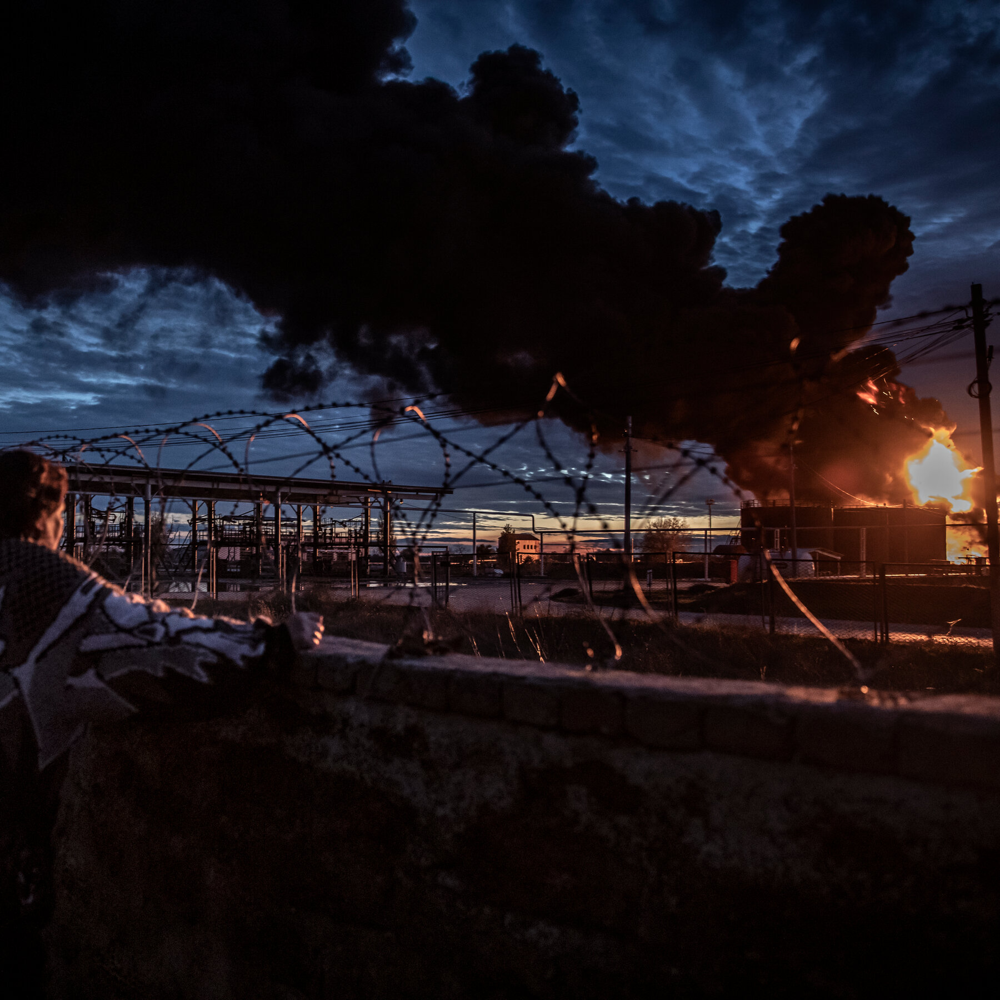

A burning oil depot that local residents said had been hit by a Russian mortar barrage in Kherson. Finbarr O'Reilly for The New York Times
