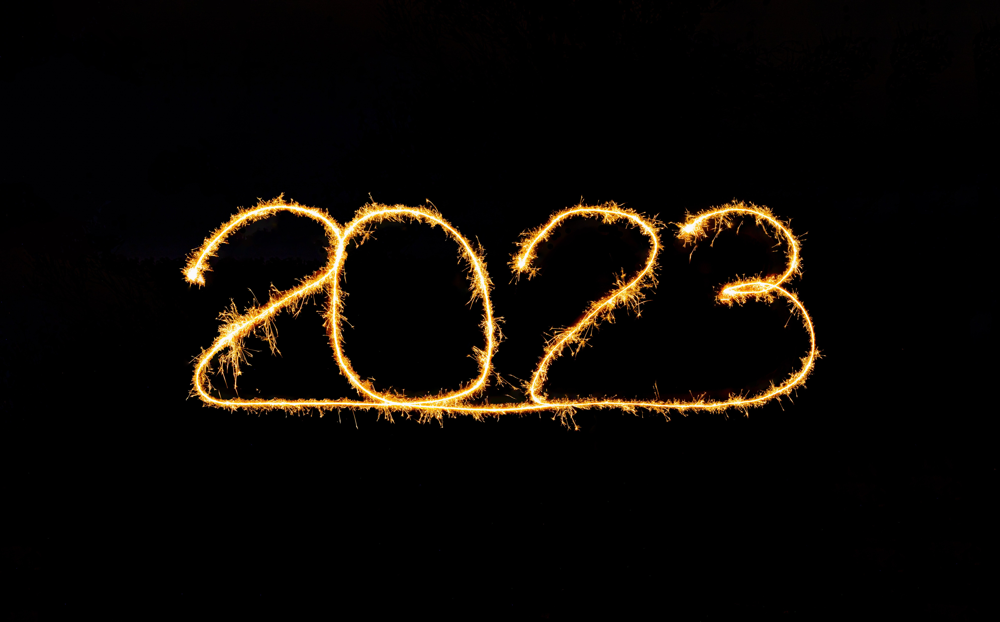

_Photo by_ [_Moritz Knöringer_](https://unsplash.com/@mokngr?utm_source=unsplash&utm_medium=referral&utm_content=creditCopyText)__ 摄影：Moritz Knöringer

In 1666, a 23-year-old Cambridge University student left campus and returned to his small hometown village to avoid the plague that was ravaging Europe at the time.

1666年，一位23岁的剑桥大学学生为了躲避当时席卷欧洲的瘟疫，离开校园回到家乡的小村庄。

The bright young man would spend his year in a perpetual state of creative and intellectual flow, leading to major discoveries and advancements across fields such as calculus, motion, gravity, and optics.

这位聪明的年轻人将在他的一年中永远处于创造性和智力流动的状态，从而导致微积分、运动、重力和光学等领域的重大发现和进步。

His name was Isaac Newton (Sir Isaac Newton as we know him today), and 1666 was his "Annus Mirabilis"—the miracle year.

他的名字叫艾萨克·牛顿（我们今天所知道的艾萨克·牛顿爵士），1666 年是他的“Annus Mirabilis”——奇迹之年。

I absolutely love this story. It's not about discovering gravity or inventing calculus—it's about the amazing possibilities of one year.

我非常喜欢这个故事。这不是关于发现引力或发明微积分——而是关于一年的惊人可能性。

It's about the incredible potential energy held within—waiting to be released.  
它是关于内在等待释放的令人难以置信的潜在能量。  

2023 is officially upon us. Will it be your _Annus Mirabilis_?  
2023 年正式来临。会是你的奇异年吗？  

To get you started, here are 23 actionable ideas to help you crush the year ahead—segmented into work, health, money, and personal categories.

为了帮助您开始，这里有 23 个可操作的想法，可帮助您在来年取得成功——分为工作、健康、金钱和个人类别。

_Action Note: To avoid overwhelm, simply pick ONE from each category and get started this week. Execute on those simple actions for a month before picking another one. Continue that process during the year. If you do that, I strongly suspect 2023 will be your best year ever._

行动注意事项：为避免不知所措，只需从每个类别中选择一个并在本周开始。在选择另一个之前，执行这些简单的操作一个月。在这一年中继续这个过程。如果你这样做，我强烈怀疑 2023 年将是你有史以来最好的一年。

## Work Actions

### #1: To identify what to prioritize and what to attempt to delegate or delete from your days, use my [Energy Calendar Technique](https://www.sahilbloom.com/newsletter/energy-calendars-how-to-negotiate-more).

#1：要确定优先考虑的事项以及尝试委派或删除的事项，请使用我的能量日历技术。

For one week, at the end of every weekday, go through and color-code your calendar from the day. Green for Energy Creating, Yellow for Neutral, and Red for Energy Draining. At the end of the week, look at your calendar and assess the trends: What are the common energy creating, neutral, and energy draining activities? Energy creating should be prioritized, while energy neutral and energy draining should be delegated or deleted over time.

在一周的时间里，在每个工作日结束时，从那天开始浏览并用颜色标记您的日历。绿色代表能量创造，黄色代表中性，红色代表能量消耗。在周末，查看您的日历并评估趋势：常见的能量创造活动、中性活动和能量消耗活动是什么？能量创造应该被优先考虑，而能量中和和能量消耗应该随着时间的推移被委派或删除。

### #2: Schedule rest or free time into your day.  
#2：安排休息或空闲时间到你的一天。  

Go into your calendar and add at least two 15-minute blocks for absolutely nothing. During these windows, don't check email or get anything done. Go for a walk, read something non-work related, sit and stare into space, whatever. Prioritize and protect these short bouts of rest as a key part of your daily systems, not a reward for your efforts. Growth requires this balance.

进入你的日历并添加至少两个 15 分钟的块，绝对没有。在这些时间段内，不要查看电子邮件或做任何事情。散散步，阅读一些与工作无关的东西，坐下来凝视太空等等。优先考虑并保护这些短暂的休息，将其作为您日常系统的重要组成部分，而不是对您努力的奖励。增长需要这种平衡。

### #3: Build a deep work practice by blocking 60-minute windows during which you have zero email, messaging, apps, or distractions.

#3：通过阻止 60 分钟的窗口来建立深度工作实践，在此期间您的电子邮件、消息、应用程序或干扰为零。

These windows should become sacred windows of progress on the important long-term tasks (not the urgent short-term ones). If you are like me, you might need a forcing function to shut everything down, so use an app like [Flow](https://flowapp.info/) to force the issue.

这些窗口应该成为重要的长期任务（而不是紧迫的短期任务）取得进展的神圣窗口。如果你像我一样，你可能需要一个强制功能来关闭一切，所以使用像 Flow 这样的应用程序来强制解决这个问题。

### #4: Reduce the impact of [attention residue](https://www.sahilbloom.com/newsletter/attention-residue-the-silent-productivity-killer) by taking breaks.  
#4：通过休息来减少注意力残留的影响。  

The simplest way to action this is to default to 25-minute calls/meetings (instead of 30 minutes) and take a simple walking or breathing break during the 5 minutes. Most calls/meetings have 5 minutes of wasted time on pleasantries (or terrible talk about the weather...), so just cut that and get straight to the point. Everyone is better off for having the breaks.

最简单的方法是默认为 25 分钟的电话/会议（而不是 30 分钟），并在 5 分钟内进行简单的步行或呼吸休息。大多数电话/会议都会有 5 分钟的时间浪费在愉快的谈话上（或者谈论糟糕的天气……），所以就把它剪掉，直奔主题。每个人都因休息而过得更好。

### #5: Use the Spaced Repetition Technique to retain anything new that you learn.  
#5：使用间隔重复技巧来记住你学到的任何新东西。  

With Spaced Repetition, information is consumed at increasing intervals until it's committed to long-term memory. If you first consume some new information at 8am, you'd have Rep 1 at 9am (1 hr later), Rep 2 at 12pm (3 hrs later), Rep 3 at 6pm (6 hrs later), Rep 4 at 6am (12 hrs later), and so on. The memory is reinforced at increasing intervals. Your brain is a muscle—each repetition is a "flex" of that muscle. By steadily increasing the intervals between reps, you are pushing the muscle with a steadily more challenging load. You're forcing the retention muscle to grow.

通过间隔重复，信息会以越来越长的间隔被消耗，直到它进入长期记忆。如果你在早上 8 点第一次使用一些新信息，你将在上午 9 点（1 小时后）有 Rep 1，在中午 12 点（3 小时后）有 Rep 2，在下午 6 点（6 小时后）有 Rep 3，在早上 6 点（12 点后）有 Rep 4小时后），依此类推。记忆以增加的间隔得到加强。你的大脑是一块肌肉——每次重复都是那块肌肉的“弯曲”。通过稳步增加代表之间的间隔，你正在用更具挑战性的负荷推动肌肉。你在强迫保留肌肉生长。

### #6: Use an [Eisenhower Matrix](https://twitter.com/SahilBloom/status/1606645640917880833?s=20&t=6LDOUZqpUcnEH6k7X_I__Q) to prioritize your tasks.  
#6：使用艾森豪威尔矩阵来确定任务的优先级。  

Learn the difference between urgent and important. Work towards delegating or deleting the unimportant tasks that are draining your time and mental energy. The goal is to spend more time on important tasks that further your long-term values, missions, goals, and principles.

了解紧急和重要之间的区别。努力委派或删除那些耗尽你的时间和精力的不重要的任务。目标是将更多时间花在重要任务上，以推进您的长期价值观、使命、目标和原则。

### #7: Batch email and message processing into 1-3 condensed windows during the day.  
#7：白天将电子邮件和消息批量处理到 1-3 个压缩窗口中。  

Parkinson's Law says that work expands to fill the time available for its completion. Force a time constraint on low-value, high energy draining tasks (like email!) to get them done efficiently.

帕金森定律说工作会扩展以填满完成它的可用时间。对低价值、高耗能任务（如电子邮件！）施加时间限制，以高效完成它们。

## Health Actions

### #8: To feel energized as soon as you get out of bed, try using my 5-5-5-30 Method.  
#8：要在起床后立即感到精力充沛，请尝试使用我的 5-5-5-30 方法。  

When you wake up, do 5 push-ups, 5 squats, 5 lunges, and a 30-second plank. You can do it while you are brewing coffee or right when you get out of bed. It will jumpstart your metabolism and give you a boost of energy to start the day.

醒来时，做 5 个俯卧撑、5 个下蹲、5 个弓步和 30 秒平板支撑。您可以在煮咖啡时或刚起床时进行操作。它会快速启动您的新陈代谢，让您精力充沛地开始新的一天。

### #9: Go for a 15 minute tech-free walk every morning.  
#9：每天早上进行 15 分钟的无科技步行。  

You don't need a fancy morning routine—just go for a walk. The sunlight, movement, and fresh air have a direct positive impact on your mood, circadian rhythm, metabolism, digestion, and more. Leave your phone at home (or put it on airplane mode). Let your creativity flow.

你不需要花哨的早晨例程——去散散步就可以了。阳光、运动和新鲜空气对您的情绪、昼夜节律、新陈代谢、消化等有直接的积极影响。将手机留在家里（或将其置于飞行模式）。让您的创造力流动起来。

### #10: If you want to put on muscle but are short on time, try the 60-day PLP Challenge.  
#10：如果您想增加肌肉但时间紧迫，请尝试 60 天 PLP 挑战。  

PLP stands for Pull-ups, Lunges, Pushups. On Day 1, you do 10 reps of each, on Day 2, you do 11 reps of each, on Day 3, you do 12 reps of each, and so on, all the way up to 69 reps. The slow, steady accumulation of volume creates impressive progress (I've gotten leaner and more dense from doing it in the past). Make sure to take care of your soft tissue quality if you do the challenge—use a foam roller and massage your shoulders and lats to avoid injury. You can also add PLP to your normal workouts to layer in a challenging, growth-driving element.

PLP 代表引体向上、弓步、俯卧撑。在第 1 天，每项重复 10 次，第二天，每项重复 11 次，第 3 天，每项重复 12 次，以此类推，一直到 69 次。缓慢、稳定地增加训练量会带来令人印象深刻的进步（我过去这样做的时候变得更瘦了，也更浓密了）。如果您进行挑战，请务必注意您的软组织质量——使用泡沫轴并按摩您的肩膀和背阔肌以避免受伤。您还可以将 PLP 添加到您的正常锻炼中，以加入具有挑战性的、促进增长的元素。

### #11: Get cold every single day.  
#11：每天都感冒。  

11 minutes of weekly cold water immersion (showers or full immersion) has been shown to have a whole host of mental and physical health benefits. I have personally experienced this over the last year, and can honestly say that the 4-7 minutes of daily cold exposure has changed my life—an incredible energy boost and dopamine surge that lasts for several hours. Do one hard thing in the morning that makes everything else feel much easier.

每周 11 分钟的冷水浸泡（淋浴或完全浸泡）已被证明对身心健康有很多好处。在过去的一年里，我亲身经历了这一点，并且可以诚实地说，每天 4-7 分钟的冷暴露改变了我的生活——令人难以置信的能量提升和持续数小时的多巴胺激增。早上做一件困难的事情，让其他一切都变得容易得多。

### #12: If you're struggling to fall asleep, try the 4-7-8 Method.  
#12：如果您难以入睡，请尝试 4-7-8 方法。  

Breathe in through your nose for a 4-second count, hold your breath for a 7-second count, and exhale for an 8-second count. It activates the parasympathetic nervous system, which triggers your body to turn to rest mode.

用鼻子吸气，数 4 秒，屏住呼吸，数 7 秒，然后呼气，数 8 秒。它会激活副交感神经系统，触发您的身体进入休息模式。

### #13: If you frequently encounter stressful situations that derail your days, try using the Lion’s Breath Technique to immediately reduce stress levels.

#13：如果你经常遇到让你的日子出轨的压力情况，尝试使用狮子的呼吸技巧来立即降低压力水平。

The Lion's Breath is a form of Pranayama (ancient breathing practice originating from yogic traditions in India) that has been shown to eliminate stress. It's simple: Sit in a comfortable position with a slight forward lean and your hands on the floor. Focus your gaze on the tip of your nose and inhale deeply through your nose. Open your mouth, stick your tongue out and down to your chin, exhale forcefully with a "HA!" sound. That is one "rep" of the technique. You'll want to take a few normal breaths through your nose with a relaxed face after each rep. Repeat this process 5-10 times, depending on time and your level of practice. Limit the forcefulness of the exhale if you're a beginner.

狮子呼吸法是调息法（源自印度瑜伽传统的古老呼吸法）的一种形式，已被证明可以消除压力。很简单：以舒适的姿势坐下，身体略微前倾，双手放在地板上。将目光集中在鼻尖上，用鼻子深深地吸气。张开嘴，伸出舌头抵住下巴，“哈！”的一声用力呼气。声音。那是该技术的一个“代表”。每次重复后，您都希望通过鼻子进行几次正常呼吸，并保持放松的表情。重复此过程 5-10 次，具体取决于时间和您的练习水平。如果您是初学者，请限制呼气的力度。

### #14: To eat healthier, commit to doing all of your shopping on the outer perimeter of the grocery store.  
#14：为了吃得更健康，请承诺在杂货店外围进行所有购物。  

The outer perimeter typically has all of the fresh produce, meats, fish, and dairy, while the middle aisles have all of the processed stuff. If you're trying to eat clean, stay on the outside. Do this for a month and you'll notice the results.

外围通常有所有新鲜农产品、肉类、鱼类和奶制品，而中间过道则有所有加工过的东西。如果你想吃得干净，那就呆在外面。这样做一个月，你会注意到结果。

## Personal Actions

### #15: Develop a simple [Power Down Ritual](https://www.sahilbloom.com/newsletter/how-to-power-down-to-reclaim-your-life) to more effectively separate work from your personal life.  
#15：制定一个简单的断电仪式，以更有效地将工作与个人生活分开。  

A Power Down Ritual is a fixed set of actions and behaviors that mentally and physically mark the end of your professional day. An example of my fixed sequence might look something like this: Check email for any final requests requiring action, check calendar for the following day and complete 15 minutes of prep work for initial priority tasks of the following morning, update any task lists for progress and confirm open items for next day. After this is completed, close down all applications and technology for the night.

断电仪式是一组固定的动作和行为，在精神上和身体上标志着您职业一天的结束。我的固定顺序的示例可能如下所示：检查电子邮件是否有任何需要采取行动的最终请求，检查第二天的日历并为第二天早上的初始优先任务完成 15 分钟的准备工作，更新任何任务列表以了解进度和确认第二天的未清项。完成后，关闭所有应用程序和技术以备不时之需。

### #16: Tell your partner one thing you appreciate about them every single night.  
#16：每晚告诉你的伴侣一件你欣赏他们的事情。  

As time passes in any relationship, it becomes easy to take the good for granted and focus on the stress or tensions. Don't fall into this trap. Highlight the good and watch the amazing impact it will have.

在任何关系中，随着时间的流逝，人们很容易将美好视为理所当然，而将注意力集中在压力或紧张上。不要落入这个陷阱。突出优点并观察它将产生的惊人影响。

### #17: Set [Character Alarms](https://www.sahilbloom.com/newsletter/character-alarms-harsh-truths-of-life-more) to get into character for a specific role or identity during the day.  
#17：设置角色警报以在白天进入特定角色或身份的角色。  

Figure out what role you need to play at different times and set alarms with labels that provide a nudge to "turn on" that character when that time hits. It's a simple behavioral intervention that can go a long way.

弄清楚您需要在不同时间扮演什么角色，并设置带有标签的警报，以便在该时间到来时“打开”该角色。这是一种简单的行为干预，可以大有帮助。

### #18: Make progress on something new with my [30-for-30 Approach](https://www.sahilbloom.com/newsletter/the-30-for-30-challenge).  
#18：使用我的 30 对 30 方法在新事物上取得进展。  

Do the new thing for 30 minutes per day for 30 straight days. 900 minutes of accumulated effort will yield surprisingly significant results. You can get started learning a new language, dramatically improve your physical fitness, pick up an instrument, or build a writing/reading practice.

连续 30 天每天做 30 分钟的新事物。 900 分钟的累积努力将产生意想不到的显着结果。您可以开始学习一门新语言、显着提高您的身体素质、学习乐器或建立写作/阅读练习。

### #19: Use the Feynman Technique for learning anything new.  
#19：使用费曼技术学习任何新事物。  

Identify a topic, try to explain it to a 5-year-old, study to fill in knowledge gaps exposed by the explanation, and iterate on the process accordingly. Teaching is the most powerful form of learning. Progress to teaching as quickly as possible and you will cement your learnings and highlight the gaps that need to be filled.

确定一个主题，尝试向一个 5 岁的孩子解释它，研究以填补解释所暴露的知识空白，并相应地重复这个过程。教学是最强大的学习形式。尽快进入教学阶段，您将巩固所学并突出需要填补的空白。

### #20: Take yourself out for a meal alone once each month.  
#20：每个月带自己出去吃一次饭。  

Carry a notebook and pen, bring your favorite book, and leave your phone in your bag. Let your mind run free. Flex that boredom muscle. It’s insanely freeing—a meditative experience. You'll learn new things about yourself and unlock new, creative ideas.

带上笔记本和笔，带上你最喜欢的书，把手机放在包里。让你的思想自由奔跑。弯曲那无聊的肌肉。这是一种疯狂的自由——一种冥想的体验。您将了解有关自己的新知识并解锁新的创意。

## Money Actions

### #21: Create an automated direct deposit for a small amount of money into an investment account every month.  
#21：创建一个自动直接存款，每月将少量资金存入投资账户。  

Never look at the account. Don't pay any attention to it. A $100 monthly investment into the S&P 500 for the last 10 years would be worth ~$20,000 today. Let it compound.

永远不要看账目。不要理会它。在过去 10 年中，每月向标准普尔 500 指数投资 100 美元，今天的价值约为 20,000 美元。让它复合。

### #22: Automate all simple financial tasks such as paying bills, credit cards, and investing.  
#22：自动化所有简单的财务任务，例如支付账单、信用卡和投资。  

When you have to think about these tasks every month, there is a small cognitive burden that reduces your capacity to focus on more important projects and opportunities. They are all easily automated (most of the services offer automated flows) and the digital systems tend to be accurate. Do quick accuracy checks once a quarter but avoid looking otherwise.

当您每个月都必须考虑这些任务时，认知负担就会降低，从而降低您专注于更重要的项目和机会的能力。它们都很容易实现自动化（大多数服务都提供自动化流程）并且数字系统往往是准确的。每季度进行一次快速准确性检查，但要避免另眼相看。

### #23: To save money and build wealth, make a rule to wait 48 hours before completing any non-essential material purchase.

#23：为了省钱和积累财富，制定一个规则，等待 48 小时后再完成任何非必需品的购买。

Once you put something in your shopping cart, walk away from the computer and come back 48 hours later. If you still want it, buy it. Most of the time, you'll realize you don't need it. Invest that money instead and watch it compound.

将东西放入购物车后，离开计算机并在 48 小时后回来。如果你还想要，就买吧。大多数时候，你会意识到你不需要它。相反，投资那笔钱，看着它复利。

## Creating Your _Annus Mirabilis_ 创造你的奇异年

The year ahead holds almost unlimited potential energy. It's your job to convert it into kinetic energy through movement and action.

未来一年拥有几乎无限的潜在能量。你的工作是通过运动和行动将其转化为动能。

I hope this piece gave you a few ideas on which you can act and start working towards creating your very own _Annus Mirabilis_.

我希望这篇文章能给你一些想法，你可以根据这些想法采取行动并开始努力创造你自己的奇迹年。

I'd love to hear from you:  
我很想听听你的意见：  

-   What is your one big goal for the year?  
    你今年的一个大目标是什么？  
    
-   Which of these actions do you plan to put to work this month to make progress against that goal?  
    您计划在本月采取哪些行动来实现该目标？  
    

Tweet at me @SahilBloom and I'll do my best to get back to everyone.  
发推给我@SahilBloom，我会尽力回复大家。  

As always, until next time...stay curious, friends!  
一如既往，直到下一次......保持好奇，朋友们！  

