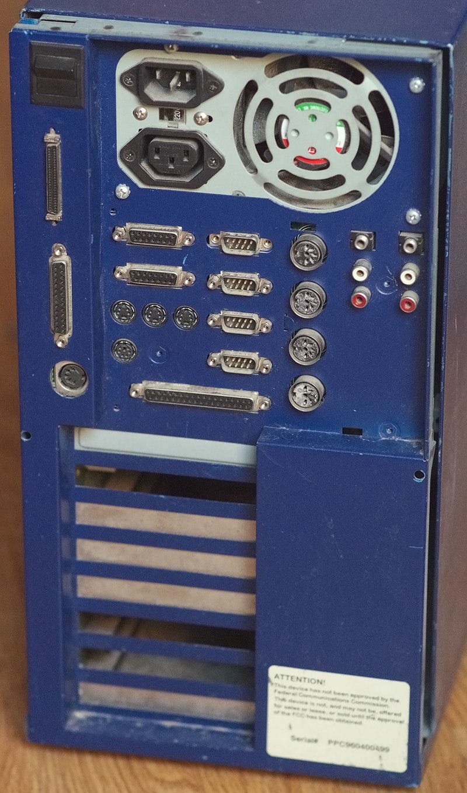
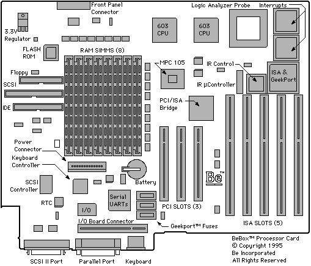
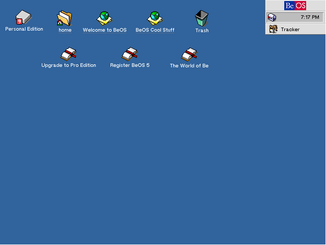
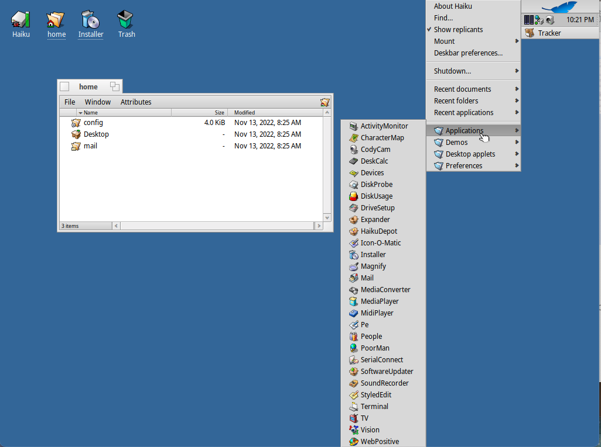
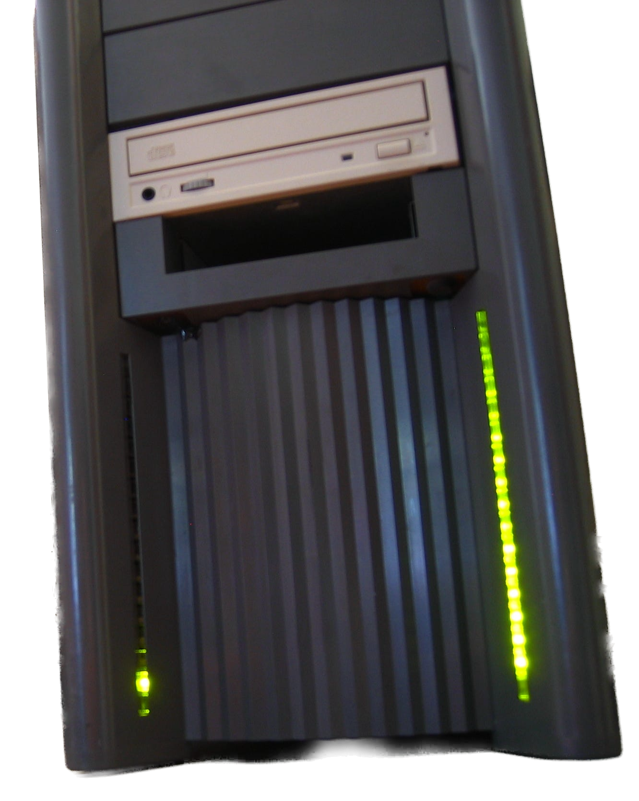
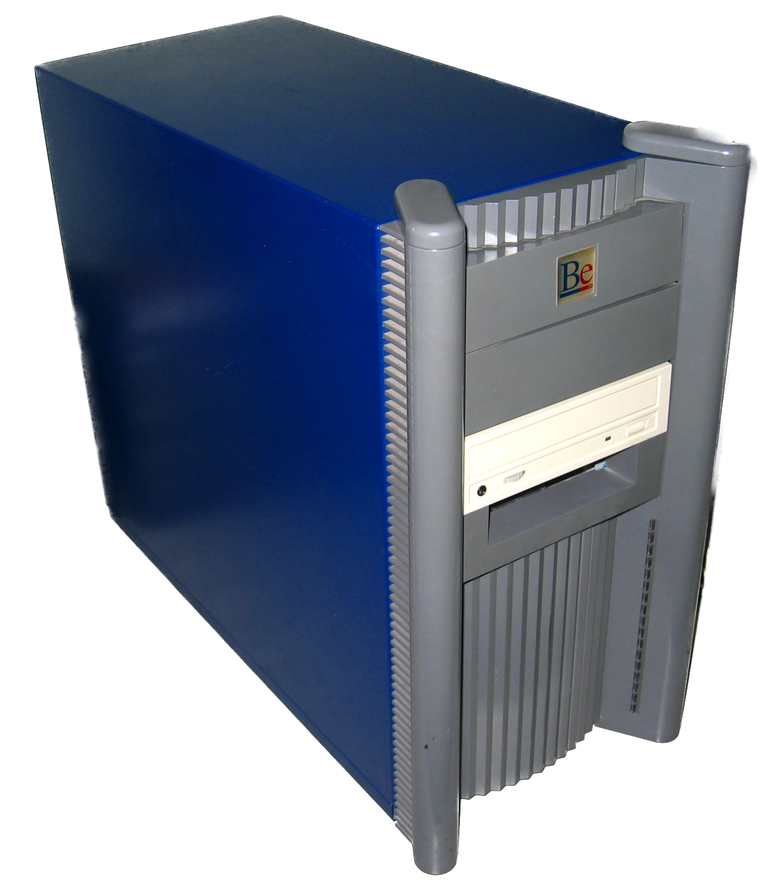
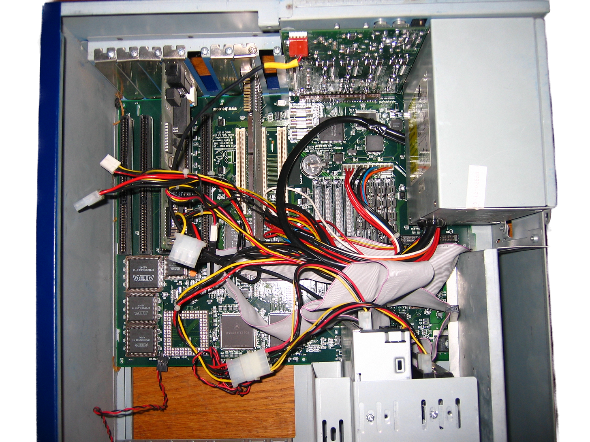
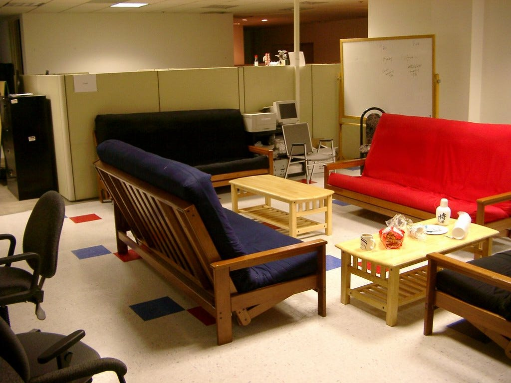

Jean-Louis Gassée was born in Paris France in 1944. From ‘68 to ‘74, he worked for Hewlett Packard in Europe. He was in charge of a project to develop the first scientific desktop computer from HP, and he was later promoted to sales manager for the European market. From ‘74 to ‘81, he served as the CEO of Data General in France. In 1981, Jean-Louis became the Director of European Operations for Apple Computer. A few years later, following the firing of Steve Jobs, Jean-Louis was promoted to be the President of Product Development. From what I can tell, he spent a lot of time and energy thwarting bad ideas from the rest of the company while at Apple, but he also stewarded many great projects: the Newton, the Macintosh Portable, the Macintosh II line, and the much loved SE/30. Sadly, in 1990, he suffered the same fate as Steve Jobs before him, and he was pushed out of the company by Sculley and the board. Steve Sakoman (developer of the Newton) was the VP of Product Development at Apple, and he left the company with Jean-Louis. Shortly after that, Erich Ringewald left Apple. He was the lead of the Apple “Pink” OS group, which was the group working on the next generation of Apple’s Macintosh operating system.

Jean-Louis Gassée 1944 年出生于法国巴黎。从 68 年到 74 年，他在欧洲的惠普公司工作。他负责开发惠普第一台科学台式电脑的项目，后来晋升为欧洲市场销售经理。从 74 年到 81 年，他担任法国 Data General 的首席执行官。 1981 年，让-路易斯成为 Apple Computer 的欧洲运营总监。几年后，史蒂夫·乔布斯被解雇后，让-路易斯被提升为产品开发总裁。据我所知，他在 Apple 期间花了很多时间和精力来阻止公司其他人的坏主意，但他也管理了许多伟大的项目：Newton、Macintosh Portable、Macintosh II 系列，以及许多喜欢 SE/30。可悲的是，1990年，他遭遇了与前任史蒂夫乔布斯相同的命运，被斯卡利和董事会赶出了公司。 Steve Sakoman（Newton 的开发者）是 Apple 的产品开发副总裁，他和 Jean-Louis 一起离开了公司。此后不久，Erich Ringewald 离开了 Apple。他是 Apple “Pink” OS 小组的负责人，该小组致力于开发下一代 Apple 的 Macintosh 操作系统。

These three gentlemen then set to work building a new company, Be Inc. The Chairman and CEO was Jean-Louis Gassée, the VP of Engineering was Steve Sakoman, and the CTO was Erich Ringewald. It becomes rather clear in just a bit that these three minds were required for what was to be created.

这三位先生随后着手建立一家新公司 Be Inc。董事长兼首席执行官是 Jean-Louis Gassée，工程副总裁是 Steve Sakoman，首席技术官是 Erich Ringewald。很快就会变得相当清楚，这三个头脑是要创造的东西所必需的。

Mr. Gassée is a rather opinionated man from what I can tell, and this isn’t new. He formed his opinions through experience in the industry over the course of decades. When he founded Be, he set his sights on an ambitious goal: fix the computer industry’s stagnation. From [an interview for Tech Head Stories](https://web.archive.org/web/20050312221625/http://testou.free.fr/tech-head.com/persona4.htm), 13th December 1995:

据我所知，Gassée 先生是一个相当固执己见的人，这并不是什么新鲜事。他通过几十年的行业经验形成了自己的观点。当他创立 Be 时，他将目光投向了一个雄心勃勃的目标：解决计算机行业的停滞问题。来自 Tech Head Stories 的采访，1995 年 12 月 13 日：

_About the BeBox_ 关于 BeBox

> The BeBox is a personal computer that relies on three ideas. The first idea is that we create a product that has a distinct architectural advantage in the freshness of its operating system. The most obvious example of this advantage is that every BeBox has two Power PC CPUs. Multi-processor PCs are actually quite easy to do on the hardware side of things: They're a very inexpensive way to increase computing power. And yet no one does it because they don't have the infrastructure, the the operating system, to support multiple CPUs. The other guys, Macintosh and Windows, they certainly won't be able to anytime soon. I know... I've lived inside one of these sausage factories; the layers of software “silt” are deadening, it's cancerous. It took Microsoft five years to go from Windows 3 to Windows 4. Apple will need six or seven years to move from System 7 to System 8. You know what I'm trying to say? Another example: we have a database engine built into the operating system. This is a dream of all PC makers, I can attest to that. Then there's very fast, rich I/O, multiple serial ports, MIDI ports... even a GEEK port that will let the bleeding edge hacker lift the hood and do unspeakable things to our computer.
> 
> BeBox 是一台基于三个理念的个人电脑。第一个想法是我们创建一个产品，在其操作系统的新鲜度方面具有独特的架构优势。这种优势最明显的例子是每个 BeBox 都有两个 Power PC CPU。多处理器 PC 实际上在硬件方面很容易实现：它们是提高计算能力的一种非常廉价的方式。但是没有人这样做，因为他们没有支持多 CPU 的基础设施，即操作系统。其他人，Macintosh 和 Windows，他们肯定不会很快做到。我知道……我住在这些香肠厂之一；软件“淤泥”层正在消音，它是癌变的。微软用了五年时间从 Windows 3 到 Windows 4。Apple 将需要六到七年时间从 System 7 到 System 8。你知道我想说什么吗？另一个例子：我们在操作系统中内置了一个数据库引擎。这是所有 PC 制造商的梦想，我可以证明这一点。然后是非常快速、丰富的 I/O、多个串行端口、MIDI 端口……甚至是一个 GEEK 端口，它可以让最前沿的黑客揭开引擎盖，对我们的计算机做一些无法形容的事情。

_About BeOS_ 关于 BeOS

> The second idea was that we wanted to help the software developers reach the market. There are so many software developers who are frustrated by the dominance of a few large predatory birds in their ecological niche. A fledgling software developer has a hard time developing, so to speak. Today, imagine that you are a young Windows programmer and that I'm a venture capitalist and you come and see me and say, “Mr. Gasse, do I have a deal for you.” “Yes?” “I have the word processor for Windows that will kill Microsoft Word.” What am I to do if I'm a caring venture capitalist? I have to open the drawer and instead of pulling out the checkbook I should pull out the Magnum .357 and give you the coup de grace because this will stop what otherwise would be a long, ugly, expensive agony for your family. You can't compete; you won't get the money and you can't buy the shelf space. What we offer is a much different way to reach the market: You write an application and put up a demonstration version on our Web site. I see the demo, I download the demo, I use it, I like it... so what do I do then? I use the telephone. (Some day we'll have credit cards flying over the Internet, but let's rely on the existing infrastructure. ) I call you and give you three numbers: my credit card number, my Internet address, and my machine serial number so you can customize your application for my machine.
> 
> 第二个想法是我们想帮助软件开发人员进入市场。有如此多的软件开发人员对少数大型食肉鸟类在其生态位中的主导地位感到沮丧。一个初出茅庐的软件开发人员很难开发，可以这么说。今天，假设您是一名年轻的 Windows 程序员，而我是一名风险投资家，您来看我时会说：“先生。加斯，我能给你做个交易吗？” “是的？” “我有 Windows 文字处理器，可以杀死 Microsoft Word。”如果我是一个有爱心的风险投资家，我该怎么办？我必须打开抽屉，而不是拿出支票簿，我应该拿出 Magnum .357 给你致命一击，因为这将阻止你的家人长期、丑陋、昂贵的痛苦。你无法竞争；你拿不到钱，也买不到货架空间。我们提供的是一种截然不同的进入市场的方式：您编写一个应用程序并在我们的网站上发布一个演示版本。我看到了演示，我下载了演示，我使用它，我喜欢它……那我该怎么办？我用电话。 （有一天我们会让信用卡在互联网上飞扬，但让我们依赖现有的基础设施。）我给你打电话并给你三个号码：我的信用卡号、我的互联网地址和我的机器序列号，这样你就可以定制你对我的机器的应用。

The BeBox was a seriously cool machine. It was first released in October of 1995, and it was a monster compared to other machines of the time.

BeBox 是一台非常酷的机器。它于 1995 年 10 月首次发布，与当时的其他机器相比简直就是怪物。

Press image of a BeBox, showing the Dual603 model  
BeBox 的新闻图片，显示 Dual603 模型  

Let’s start with the outside. So, there on the front, you have the traditional CDROM drive and floppy drive of the era. Then, there’s the Blinkenlights. The bottom-most right LED was used to show hard disk activity, and the other lights showed CPU load. The left array would light up corresponding to one CPU, and the right the other. Nothing there is too revolutionary (though quite cool), but let’s look at the back of this thing.

让我们从外面开始。所以，在前面，你有那个时代的传统 CDROM 驱动器和软盘驱动器。然后，还有 Blinkenlights。最右边的 LED 用于显示硬盘活动，其他灯显示 CPU 负载。左边的阵列会亮起对应一个 CPU，右边的则是另一个。没有什么太革命性的（虽然很酷），但让我们看看这个东西的背面。

BeBox Dual603, rear, from wikipedia  
BeBox Dual603，后方，来自维基百科  

So, here, you have four 9-pin D-sub serial ports, a PS/2 mouse port, two 15-pin D-sub joystick ports, four DIN MIDI ports (two in, two out), four RCA ports (two in, two out, stereo), two 3.5mm audio jacks (one in, one out), three 4-pin mini DIN infrared I/O ports (for the younger among my audience, infrared was common in the 90s), parallel, SCSI-2, AT keyboard, and 37-pin D-sub “GEEK port”. This port was a kind of GPIO interface implemented by Benoit Shilling.

所以，这里有四个 9 针 D-sub 串行端口、一个 PS/2 鼠标端口、两个 15 针 D-sub 游戏杆端口、四个 DIN MIDI 端口（两个输入、两个输出）、四个 RCA 端口（两个输入，两个输出，立体声），两个 3.5mm 音频插孔（一个输入，一个输出），三个 4 针迷你 DIN 红外线 I/O 端口（对于我听众中的年轻人，红外线在 90 年代很常见），并行， SCSI-2、AT 键盘和 37 针 D-sub“GEEK 端口”。这个端口是一种由 Benoit Shilling 实现的 GPIO 接口。

The pin configuration of the GEEK port, by Joakim Ögren  
GEEK 端口的引脚配置，作者：Joakim Ögren  

The BeBox shipped with two PowerPC 603 CPUs clocked at 66MHz. These are 32-bit RISC microprocessors on a 0.5 micron process. They featured a 8KB code cache, and 8KB data cache. Later models shipped with the 603e, which doubled both cache sizes, and bumped the clock to 133MHz. The 603e CPUs were on a 0.35 micron process. The BeBox allowed for eight 72-pin SIMMs which granted a maximum of 256MB of RAM. For expansion, the BeBox’s motherboard had three PCI slots, and it had five ISA slots. Another note on hardware that I feel is important is that this machine’s DAC allowed for 16-bit audio sampled at up to 48kHz; not shocking, but still rather impressive for the time.

BeBox 附带两个主频为 66MHz 的 PowerPC 603 CPU。这些是采用 0.5 微米工艺的 32 位 RISC 微处理器。它们具有 8KB 代码缓存和 8KB 数据缓存。后来的型号随附 603e，将缓存大小翻了一番，并将时钟提高到 133MHz。 603e CPU 采用 0.35 微米工艺。 BeBox 支持八个 72 针 SIMM，最多可提供 256MB 的 RAM。为了扩展，BeBox 的主板有三个 PCI 插槽和五个 ISA 插槽。另一个我认为很重要的关于硬件的注意事项是这台机器的 DAC 允许以高达 48kHz 的频率采样 16 位音频；并不令人震惊，但在当时仍然令人印象深刻。

There were other quite powerful workstation machines available in 1995, but I am not aware of any with quite so much I/O. To make full use of this beefy machine, Be Inc developed BeOS. The development team was made of twelve software engineers who hailed from companies including Apple, NeXT, and Sun. They worked for roughly five years to create a preemptive multitasking, multithreaded, symmetric multiprocessing, object-oriented, 32-bit operating system. The system was partially POSIX compliant, had an API written in C++, and used Bash for its CLI. Despite having Bash, the operating system was fully graphical. This OS even featured a 64-bit file system with database-like features (there’s even [a book about BFS](https://archive.org/stream/practical-file-system-design/practical-file-system-design_djvu.txt) if you’re interested).

1995 年还有其他功能非常强大的工作站机器可用，但我不知道有哪台机器具有如此多的 I/O。为了充分利用这台强大的机器，Be Inc 开发了 BeOS。开发团队由 12 名软件工程师组成，他们来自 Apple、NeXT 和 Sun 等公司。他们工作了大约五年，创建了一个抢占式多任务、多线程、对称多处理、面向对象的 32 位操作系统。该系统部分兼容 POSIX，有一个用 C++ 编写的 API，并使用 Bash 作为其 CLI。尽管有 Bash，操作系统是完全图形化的。该操作系统甚至具有 64 位文件系统，具有类似数据库的功能（如果您有兴趣，甚至还有一本关于 BFS 的书）。

BeOS Personal Edition Desktop BeOS 个人版桌面版

In the end, something less than two thousand of these sweet sweet machines were delivered. The BeBox did not succeed in the market. I’ve seen a million different reasons people give for why the BeBox failed, but I think the real answer to this question is rather quite simple: the PC compatibles. I’ve mentioned in other articles, here on ARF, that the PC platform with Windows was absolutely exploding during the 90s. We have in the BeBox yet another victim. As innovative and as cool as the BeBox and BeOS were, they weren’t compatible with PC software. With MS-DOS and Windows being so dominant, there wasn’t demand for a machine on which zero already purchased software could run (in the 90s, people bought software in boxes from physical stores, and that software cost large amounts of money). The other extremely powerful systems of the time period were all UNIX systems (AIX, HP-UX, Solaris, IRIX) and these could usually easily compile code written for other UNICES. Additionally, the software market for these UNIX systems was very niche. BeOS wasn’t a UNIX either. Neither software compatibility with the PC, nor software compatibility with UNIX…

最终，这些甜甜机交付了不到两千台。 BeBox 没有在市场上取得成功。我见过人们给出 BeBox 失败的一百万个不同原因，但我认为这个问题的真正答案相当简单：PC 兼容。我在其他文章中提到过，在 ARF 上，带有 Windows 的 PC 平台在 90 年代绝对是爆炸性的。我们在 BeBox 中还有另一个受害者。 BeBox 和 BeOS 既创新又酷，但它们与 PC 软件不兼容。由于 MS-DOS 和 Windows 如此占主导地位，因此不再需要一台可以运行零个已购买软件的机器（在 90 年代，人们从实体店购买盒装软件，而该软件需要花费大量金钱）。当时其他极其强大的系统都是 UNIX 系统（AIX、HP-UX、Solaris、IRIX），这些系统通常可以轻松编译为其他 UNICES 编写的代码。此外，这些 UNIX 系统的软件市场非常小众。 BeOS 也不是 UNIX。软件既不兼容 PC，也不兼容 UNIX……

With the demise of the BeBox, BeOS shifted into a pure software play, and they rapidly began [porting BeOS to other hardware](https://web.archive.org/web/19990219130825/http://www.be.com/products/beosreadylist.html). Of particular interest to BeOS were PowerPC and Intel x86.

随着 BeBox 的消亡，BeOS 转变为纯软件游戏，他们迅速开始将 BeOS 移植到其他硬件上。 BeOS 特别感兴趣的是 PowerPC 和 Intel x86。

As of 1996, Apple was looking to replace their varying OS projects. There were problems within Apple that made the development of a next generation OS nearly impossible, and to solve these problems Apple sought to purchase something that was close to their own vision. With BeOS having been ported to numerous hardware platforms including some Macintosh machines, and even having shipped pre-installed on some Macintosh clones, Gil Amelio (then CEO of Apple) initially approached Be Inc about BeOS. There’s conflicting information regarding the reasons for the failure of this deal, but Apple eventually chose to purchase NeXT. Macintosh OS X and current macOS is based upon NeXT Step (iOS, Watch OS, TVOS, and the rest are as well).

截至 1996 年，Apple 一直在寻求更换其不同的操作系统项目。 Apple 内部存在一些问题，使得下一代操作系统的开发几乎不可能，为了解决这些问题，Apple 试图购买与他们自己的愿景接近的东西。随着 BeOS 已经被移植到包括一些 Macintosh 机器在内的众多硬件平台，甚至已经预装在一些 Macintosh 克隆机上，Gil Amelio（当时的 Apple 首席执行官）最初就 BeOS 与 Be Inc 接洽。关于这笔交易失败的原因，众说纷纭，但苹果最终还是选择了收购 NeXT。 Macintosh OS X 和当前的 macOS 基于 NeXT Step（iOS、Watch OS、TVOS 等）。

From there, things only got worse for Be. The company lingered around until 2001 when it sold its copyrights to Palm for $11 million USD. In 2002, Be brought litigation against Microsoft for anticompetitive practices, but the suit was settled out of court for $23.25 million. After purchasing BeOS, Palm promptly discontinued the OS. Palm itself later had some problems, split, and sold. The rights to BeOS are now in the hands of Access Co along with PalmOS.

从那时起，Be 的情况只会变得更糟。该公司一直徘徊到 2001 年，当时它以 1100 万美元的价格将其版权卖给了 Palm。 2002 年，Be 以反竞争行为为由对微软提起诉讼，但该诉讼以 2325 万美元的价格庭外和解。购买 BeOS 后，Palm 立即停止了该操作系统。 Palm 本身后来也出现了一些问题，拆分并出售。 BeOS 的权利现在与 PalmOS 一起掌握在 Access Co 手中。

The funny thing is, BeOS was just too cool to die. Immediately upon its death, a German company called yellowTAB began developing the system as ZETA. ZETA was based upon BeOS 5.1.0. Ultimately, the company became insolvent, and Magnussoft purchased yellowTAB. Magnussoft failed to learn from the demise of yellowTAB. They continued to develop ZETA. Neither yellowTAB nor Magnussoft ever procured a license for BeOS, and [Access Co claimed that ZETA was an illegal distribution of BeOS](https://web.archive.org/web/20071007025153/http://www.zeta-os.com/cms/news.php?extend.50).

有趣的是，BeOS 实在是太酷了。在它死后，一家名为 yellowTAB 的德国公司立即开始开发名为 ZETA 的系统。 ZETA 基于 BeOS 5.1.0。最终，该公司资不抵债，Magnussoft 收购了 yellowTAB。 Magnussoft 未能从 yellowTAB 的消亡中吸取教训。他们继续开发 ZETA。 yellowTAB 和 Magnussoft 都没有获得 BeOS 的许可，Access Co 声称 ZETA 是 BeOS 的非法分发。

If you thought that that would be the end for BeOS, you are in error. Following the purchase of Be by Palm, an open source project was started whose aim was to recreate BeOS from scratch with full binary and source compatibility. This was OpenBeOS. The first release in 2002 was a community update to BeOS 5.0.3 with some open source replacements for Be code. The project name changed in 2004. With everything surrounding the demise of Be being highly litigious, it is no surprise that the project wished to avoid legal complications over their name. They chose Haiku.

如果您认为 BeOS 就此结束，那您就错了。在 Palm 收购 Be 之后，启动了一个开源项目，其目的是从头开始重新创建具有完全二进制和源代码兼容性的 BeOS。这就是 OpenBeOS。 2002 年的第一个版本是 BeOS 5.0.3 的社区更新，其中包含 Be 代码的一些开源替代品。项目名称在 2004 年更改。由于围绕 Be 消亡的所有事情都引起了高度诉讼，因此该项目希望避免因名称而引起的法律纠纷也就不足为奇了。他们选择了俳句。

Why did they choose the name Haiku? Error messages from some applications in BeOS [are written in haikus](https://8325.org/haiku/) (most notably, the NetPositive web browser). Additionally, they felt that the art of haiku was representative of the elegance and simplicity of BeOS.

他们为什么选择 Haiku 这个名字？ BeOS 中某些应用程序的错误消息是用俳句编写的（最著名的是 NetPositive 网络浏览器）。此外，他们认为俳句艺术代表了 BeOS 的优雅和简洁。

the Haiku boot logo Haiku 引导标志

[The Haiku project](https://www.haiku-os.org/) continues to this day, and the system is quite usable. As of today, the project is working toward the imminent release of Haiku OS Beta 4.

Haiku 项目一直持续到今天，该系统非常可用。截至今天，该项目正致力于即将发布的 Haiku OS Beta 4。

The Haiku desktop and menu from the latest nightly release  
最新夜间发布的 Haiku 桌面和菜单  

The Haiku WebPositive browser showing this website  
显示本网站的 Haiku WebPositive 浏览器  

Officially, Haiku only supports 32-bit and 64-bit x86 machines. Despite that and in the spirit of BeOS, Haiku does have ports to ARM, m68k, PowerPC, RISCV64, and SPARC.

正式地，Haiku 只支持 32 位和 64 位 x86 机器。尽管如此，本着 BeOS 的精神，Haiku 确实拥有 ARM、m68k、PowerPC、RISCV64 和 SPARC 的端口。

Haiku has improved from where Be left off. It has some support for FreeBSD driver compatibility, WiFi, a WINE port for Windows applications, a real package manager, and so on. There are still some problems that would prevent many from using Haiku as their daily driver (primary hardware support and a lack of 3D acceleration), but the project has moved quite quickly of late. I look forward to the day that I can run Haiku natively on M1 Macintosh.

Haiku 在 Be 停止的地方有所改进。它对 FreeBSD 驱动程序兼容性、WiFi、Windows 应用程序的 WINE 端口、真正的包管理器等有一些支持。仍然有一些问题会阻止许多人将 Haiku 用作他们的日常驱动程序（主要硬件支持和缺乏 3D 加速），但该项目最近进展很快。我期待有一天我可以在 M1 Macintosh 上本地运行 Haiku。

Thank you for reading Abort, Retry, Fail. This post is public so feel free to share it.  
感谢您阅读中止、重试、失败。这篇文章是公开的，所以请随意分享。  

[Share](https://www.abortretry.fail/p/be-is-nice-end-of-story?utm_source=substack&utm_medium=email&utm_content=share&action=share)

**Update -** here are some images shared by the HN user Helf  
更新 - 这是 HN 用户 Helf 分享的一些图片  

the Blinkenlights! 闪烁的灯光！

the back of the BeBox BeBox的背面

just a good shot of the Bebox  
只是 Bebox 的一张好照片  

the Bebox interior Bebox 内饰

the break room at the Be Inc office  
Be Inc办公室的休息室
