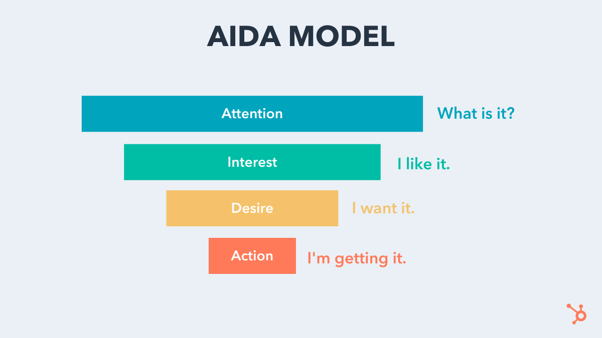
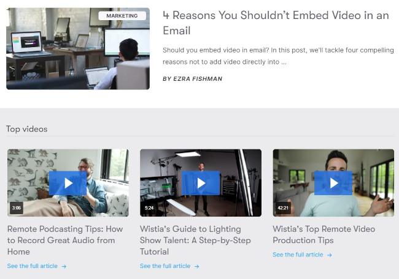
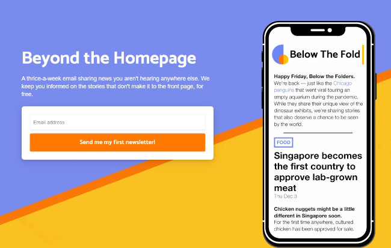
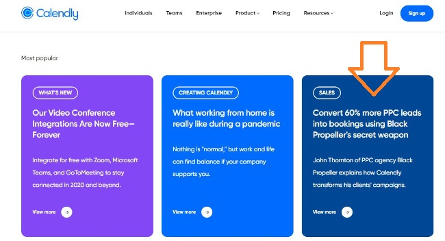
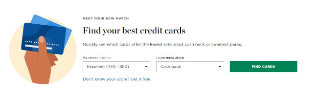

In the digital age, brands have based their entire [marketing strategy](https://blog.hubspot.com/marketing/content-marketing-plan) on the AIDA model. AIDA stands for Attention, Interest, Desire, and Action. Each term represents a stage of a consumer's buying journey. 

在数字时代，品牌的整个营销策略都基于 AIDA 模型。 AIDA 代表注意力、兴趣、欲望和行动。每个术语代表消费者购买旅程的一个阶段。

Before we cover how you can apply the AIDA model to your own content marketing strategy, let’s go over what it is and why it works.

在我们介绍如何将 AIDA 模型应用到您自己的内容营销策略之前，让我们先了解一下它是什么以及它为什么有效。

The AIDA model describes the four stages a consumer goes through before making a purchasing decision. The stages are Attention, Interest, Desire, and Action (AIDA). During these four stages, your content will ideally attract attention to your brand, generate interest in your product or service, stimulate a desire for it, and spur action to try or buy it.

AIDA 模型描述了消费者在做出购买决定之前经历的四个阶段。这些阶段是注意力、兴趣、欲望和行动 (AIDA)。在这四个阶段中，您的内容将理想地吸引人们对您的品牌的关注，对您的产品或服务产生兴趣，激发对它的渴望，并激发尝试或购买它的行动。

Brands use the AIDA model to determine the way they should craft and distribute marketing messages to their target audience at each stage of the [buyer’s journey](https://blog.hubspot.com/marketing/content-for-every-funnel-stage?_ga=2.229631577.472080424.1540241874-1401581832.1529422766).

品牌使用 AIDA 模型来确定他们应该在购买者旅程的每个阶段制作和向目标受众分发营销信息的方式。

The AIDA model is considered a hierarchy of effects model, which means consumers must move through each stage of the model to complete the desired action. Just like a typical [marketing funnel](https://blog.hubspot.com/blog/tabid/6307/bid/33711/the-steps-you-need-to-define-the-stages-of-your-sales-marketing-funnel.aspx), each stage has fewer consumers than the previous one.

AIDA 模型被认为是效果模型的层次结构，这意味着消费者必须经历模型的每个阶段才能完成所需的动作。就像典型的营销漏斗一样，每个阶段的消费者都比前一个阶段少。

## AIDA Model History AIDA 模型历史

In 1898, [Elias St. Elmo Lewis](https://en.wikipedia.org/wiki/E._St._Elmo_Lewis), an eventual inductee of the Advertising Hall of Fame, anonymously wrote a column about three advertising principles he found useful throughout his career in a printing magazine called _The Inland Printer_, [one of the most influential American magazines of the 19th century](https://www.americanheritage.com/content/inland-printer).

1898 年，最终入选广告名人堂的 Elias St. Elmo Lewis 在一本名为 The Inland Printer 的印刷杂志上匿名撰写了一篇专栏，介绍他认为在整个职业生涯中有用的三个广告原则，该杂志是美国最具影响力的杂志之一19世纪。

In his column, he states that a successful advertisement should always follow a specific formula.  
在他的专栏中，他指出成功的广告应该始终遵循特定的公式。  

> “The mission of an advertisement is to attract a reader, so that he will look at the advertisement and start to read it; then to interest him, so that he will continue to read it; then to convince him, so that when he has read it he will believe it. If an advertisement contains these three qualities of success, it is a successful advertisement.”
> 
> “广告的使命是吸引读者，让他看到广告并开始阅读；然后让他感兴趣，让他继续阅读；然后说服他，让他读了之后就相信了。如果一个广告包含这三个成功的品质，它就是一个成功的广告。”

In other words, copy is only good if it attracts attention, generates interest, and creates conviction, in that order.  
换句话说，文案只有在吸引注意力、产生兴趣并创造信念时才是好的，按照这个顺序。  

Over a century later, Lewis’ principles still ring true. They’re expressed as an acronym, AIDA, and widely used in the advertising industry.

一个多世纪后，刘易斯的原则仍然适用。它们以首字母缩写词 AIDA 表示，并广泛用于广告行业。

## How to Apply the AIDA Model to Your Marketing  
如何将 AIDA 模型应用到您的营销中  

By creating campaigns and structuring your website with the AIDA model in mind, you can get more control over your prospects' paths to a purchasing decision.

通过使用 AIDA 模型创建活动和构建您的网站，您可以更好地控制潜在客户做出购买决定的路径。

In theory, as they progress through each stage of the model, consumers who learn about your brand will develop certain feelings or emotions about your product or service, which is what ultimately compels them to act.

从理论上讲，随着模型的每个阶段的进展，了解您品牌的消费者会对您的产品或服务产生某种感觉或情绪，这最终会迫使他们采取行动。

Here's what you can do to implement AIDA:  
以下是您可以执行 AIDA 的操作：  

### Attract Attention 吸引眼球

If your content can [grab their attention](https://blog.hubspot.com/marketing/scientifically-proven-more-clicks-on-content) and [deeply engage them](https://blog.hubspot.com/marketing/how-to-write-addictive-articles), your target audience will start to become curious about what your company actually does.

如果您的内容能够吸引他们的注意力并深深地吸引他们，您的目标受众就会开始对您的公司实际做什么感到好奇。

In this stage, the consumer is asking, **"What is it?"**  
在这个阶段，消费者会问，“这是什么？”  

In order to get to this stage, you must first get your content in front of them. This comes with increased [brand awareness](https://blog.hubspot.com/marketing/14-ideas-to-grow-brand-awareness-at-lightning-speed) and effective messaging.

为了到达这个阶段，您必须首先将您的内容呈现在他们面前。这伴随着品牌知名度的提高和有效的信息传递。

#### Example

Effective content marketing is one method of attracting visitors to your website. If you [create content](https://blog.hubspot.com/marketing/content-creation) that solves their problems and focuses on their passions, you'll be able to draw them in and provide a solution. When executed effectively, your target audience should be able to discover your content through Google, social media, and other channels.

有效的内容营销是吸引访问者访问您网站的一种方法。如果您创建的内容可以解决他们的问题并关注他们的热情，那么您将能够吸引他们并提供解决方案。如果执行有效，您的目标受众应该能够通过 Google、社交媒体和其他渠道发现您的内容。

[Wistia](https://wistia.com/) does this well with their content marketing, producing not just educational blog posts that drive traffic but also entertaining or inspiring "shows." This tactic allows them to not just address the pains their prospects have but also go above and beyond to make solving that problem easier (and, in some cases, entertaining). Leaning into video as a medium instead of just blogging ties into their product and mission, keeping Wistia's solutions top of mind as prospects consume this content.

Wistia 在他们的内容营销方面做得很好，不仅制作了吸引流量的教育博客文章，还制作了娱乐性或鼓舞人心的“节目”。这种策略使他们不仅可以解决他们的前景所面临的痛苦，而且还可以超越并使解决该问题变得更容易（并且在某些情况下还很有趣）。将视频作为一种媒介，而不是仅仅将博客与他们的产品和使命联系起来，当潜在客户消费这些内容时，将 Wistia 的解决方案放在首位。

[Image Source 图片来源](https://wistia.com/learn)

### Generate Interest 产生兴趣

Once your target audience is interested in your product or service, they’ll want to learn more about your brand, the [benefits of your solution](https://blog.hubspot.com/marketing/features-vs-benefits-messaging-ht), and your potential fit with them.

一旦您的目标受众对您的产品或服务感兴趣，他们就会想更多地了解您的品牌、解决方案的优势以及您与他们的契合度。

In this stage, the goal is to get them to think, **"I like it."**  
在这个阶段，目标是让他们认为“我喜欢它”。  

In order to get to this stage, your content must be persuasive and engaging. While the first stage of AIDA is capturing their attention, this stage is about holding it. You can do this with a hook.

为了达到这个阶段，您的内容必须具有说服力和吸引力。虽然 AIDA 的第一阶段正在吸引他们的注意力，但这个阶段是要坚持下去。你可以用钩子来做到这一点。

#### Example

Let's say your content marketing was effective in drawing them to the website to learn about a pain, problem, or need they have. You might then "hook" them with engaging storytelling that demonstrates the _why_ behind your solution.

假设您的内容营销有效地将他们吸引到网站以了解他们的痛苦、问题或需求。然后，您可能会通过引人入胜的故事来“吸引”他们，展示解决方案背后的原因。

Stories resonate with humans, and it's a simple way to convey information in a way that stimulates empathy and curiosity.

故事能引起人类共鸣，这是一种以激发同理心和好奇心的方式传达信息的简单方式。

To [generate enough excitement](https://blog.hubspot.com/marketing/psychology-of-excitement) in your prospects to compel them to act, you need to make sure their affinity for your brand hits a certain threshold. The more aligned you are with their needs and values, the more likely you are to achieve success.

为了让您的潜在客户产生足够的兴奋感以迫使他们采取行动，您需要确保他们对您品牌的亲和力达到一定的门槛。您越符合他们的需求和价值观，您就越有可能取得成功。

[Below the Fold](https://www.belowthefold.news/) is a service that delivers relevant news articles to its users. It generates interest with its hook: "Stories that don't make it to the front page." The intrigue in this line opens up a loop (_What have I been missing without this service?_) while highlighting their value proposition of surfacing stories that aren't getting coverage but are still important.

Below the Fold 是一项向其用户提供相关新闻文章的服务。它用它的钩子引起了人们的兴趣：“没有登上头版的故事。”这一行的阴谋打开了一个循环（没有这项服务我错过了什么？）同时强调了他们的价值主张，即展示那些没有得到报道但仍然很重要的故事。

[Image Source 图片来源](https://www.belowthefold.news/)

### Stimulate Desire 激发欲望

People do business with those they know, like, and trust. The first two stages of the AIDA model establish the _know_ and the _like_.

人们与他们认识、喜欢和信任的人做生意。 AIDA 模型的前两个阶段建立知识等。

The goal of this stage is to change "I like it" to **"I want it."**  
这个阶段的目标是把“我喜欢”变成“我想要”。  

And that's done by cementing in the final piece of the puzzle: Trust.  
这是通过巩固拼图的最后一块来完成的：信任。  

To do this, keep serving them content. Make sure they subscribe to your blog, follow you on social media, and [download your offers](https://blog.hubspot.com/marketing/email-nurturing-strategy-engagement-1000). The more prospects interact with your brand, the more they’ll trust you, boosting the chances they’ll eventually buy your product or service.

为此，请继续为他们提供内容。确保他们订阅您的博客，在社交媒体上关注您，并下载您的优惠。潜在客户与您的品牌互动越多，他们就会越信任您，从而增加他们最终购买您的产品或服务的机会。

#### Example

The prospects you’re most likely to close are the consumers who envision a future with you -- they already enjoy consuming your content and think your product or service will be even better.

您最有可能关闭的潜在客户是那些与您一起展望未来的消费者——他们已经喜欢消费您的内容，并认为您的产品或服务会更好。

For this reason, you must institute a gap between _where they are_ and _where they could be_ with your solution. At the same time, you must establish social proof with case studies and testimonials.

出于这个原因，您必须在他们所处的位置和他们可以使用您的解决方案的位置之间建立一个差距。同时，您必须通过案例研究和推荐建立社会认同。

"Before and After" style content is a great example of how to stimulate desire while gaining trust. Check out the headline on this [case study by Calendly](https://calendly.com/blog/convert-60-more-ppc-leads-into-bookings-using-black-propellers-secret-weapon): "Convert 60% more PPC leads into bookings using Black Propeller's secret weapon." This helps a prospect envision a future with this product (_What would my life be like if I achieved similar results?_). The "before" is them at their current stage, and the "after" is the vision of them with a 60% increase in conversions. Then, if they read the full case study, they get exposed to [social proof](https://blog.hubspot.com/marketing/social-proof-examples) from a customer just like them.

“之前和之后”风格的内容是如何在获得信任的同时激发欲望的一个很好的例子。查看 Calendly 的这个案例研究的标题：“使用 Black Propeller 的秘密武器将 60% 以上的 PPC 线索转化为预订。”这有助于潜在客户设想该产品的未来（如果我取得类似的结果，我的生活会怎样？）。 “之前”是他们目前的阶段，“之后”是他们对转化率提高 60% 的愿景。然后，如果他们阅读了完整的案例研究，他们就会像他们一样接触到来自客户的社会证明。

[Image Source 图片来源](https://calendly.com/blog/convert-60-more-ppc-leads-into-bookings-using-black-propellers-secret-weapon)

### Spur Into Action 激励行动

After you generate enough desire for your product or service, give your prospects the chance to act on it. After all, what’s the point of creating content and building deep relationships with prospects if there isn’t a clear next step?

在您对您的产品或服务产生足够的渴望之后，让您的潜在客户有机会采取行动。毕竟，如果没有明确的下一步，创建内容和与潜在客户建立深厚的关系有什么意义呢？

The goal is to get them to decide, **"I'm getting it."**  
目标是让他们做出“我明白了”的决定。  

No matter what the "next step" is, you should compel them to respond with low-friction but high-incentive calls to action.

无论“下一步”是什么，你都应该迫使他们以低摩擦但高激励的行动号召做出回应。

#### Example

Whether they're far away or close to a purchasing decision, the next step that you present should be "high-value." In other words, it must help them in some way.

无论他们距离还是接近购买决定，您提出的下一步都应该是“高价值”。换句话说，它必须以某种方式帮助他们。

If they understand what the outcome of your offer is and find it valuable to them, they'll be more likely to act (since they aren't simply committing to a sales call or sales content).

如果他们了解您的报价的结果并发现它对他们有价值，他们将更有可能采取行动（因为他们不仅仅是承诺销售电话或销售内容）。

Consider exactly how you can provide that value while motivating them to engage with you.  
仔细考虑如何在激励他们与您互动的同时提供这种价值。  

The CTA for this "next step" or offer should be prominent, clear, and uncomplicated. Perhaps it's a button or banner that spells out what action they must take and what they get if they do. By eliminating friction in the process, you increase your likelihood of success.

此“下一步”或要约的 CTA 应该突出、清晰且简单。也许它是一个按钮或横幅，说明他们必须采取什么行动以及如果他们这样做会得到什么。通过消除过程中的摩擦，您可以增加成功的可能性。

[Nerdwallet](https://www.nerdwallet.com/), a personal finance site that provides resources on everything from credit to mortgages, has such a CTA. The idea is that they can engage their audience and compel them to action by offering a comparison tool. They highlight this tool directly on their homepage with a grabby headline and value-driven subheadline along with a high-contrast button. The setup is uncomplicated and friction-free. Nerdwallet is simultaneously able to generate leads while empowering and delighting those leads with high-value information.

Nerdwallet 是一个个人理财网站，提供从信贷到抵押贷款的各种资源，就拥有这样的 CTA。他们的想法是，他们可以通过提供比较工具来吸引观众并迫使他们采取行动。他们直接在主页上突出显示此工具，带有抢眼的标题和价值驱动的副标题以及高对比度按钮。设置简单且无摩擦。 Nerdwallet 能够同时产生潜在客户，同时通过高价值信息授权和取悦这些潜在客户。

[Image Source 图片来源](https://www.nerdwallet.com/)

## AIDA Drawbacks AIDA 缺点

Now that you are familiar with the AIDA framework and how it operates, you should also consider some of its limitations:

现在您已经熟悉了 AIDA 框架及其运作方式，您还应该考虑它的一些局限性：

### 1\. It doesn't take into account non-linear buyer's journeys.  
1\. 它没有考虑非线性买家的旅程。  

AIDA does a fantastic job of describing a linear thought process for a purchasing decision. However, not all purchasing decisions are linear.

AIDA 在描述购买决策的线性思维过程方面做得非常出色。然而，并非所有的购买决策都是线性的。

A prospective customer might get their interest peaked but ultimately choose a different solution, only coming back to the original provider if their needs aren't met.

潜在客户的兴趣可能会达到顶峰，但最终会选择不同的解决方案，只有在他们的需求未得到满足时才会返回原始提供商。

More commonly, someone might have a desire for a solution before being aware of it and taking action to find it (thus experiencing the Desire and Action before the Attention and Interest).

更常见的是，某人可能在意识到并采取行动找到解决方案之前就有了对解决方案的渴望（因此在注意和兴趣之前经历了渴望和行动）。

### 2\. It doesn't take into account impulse purchases or super short sales cycles.  
2\. 不考虑冲动购买或超短销售周期。  

In addition to a non-linear journey, a prospective customer might cycle through multiple stages of AIDA at the same time — all four for an impulse buy or emergency purchase.

除了非线性旅程之外，潜在客户可能会同时循环经历 AIDA 的多个阶段——所有四个阶段都是为了冲动购买或紧急购买。

### 3\. It's only a small piece of a holistic business strategy.  
3\. 这只是整体业务战略的一小部分。  

AIDA is also limited to first-time purchases. Some organizations try to align their strategy around marketing funnels like AIDA, but this is a mistake. Funnels have customers as an output when they should be at the center of a [growth strategy](https://growthgrader.hubspot.com/). After all, it's easier to retain and/or upsell an existing customer than acquire a new one. In addition, with a little [customer delight](https://blog.hubspot.com/service/customer-delight), you can earn testimonials and referrals, generating more attention, interest, and (therefore) customers.

AIDA 也仅限于首次购买。一些组织试图围绕 AIDA 等营销渠道调整他们的战略，但这是一个错误。当客户应该处于增长战略的中心时，漏斗将客户作为输出。毕竟，保留和/或追加销售现有客户比获得新客户更容易。此外，只要让客户感到高兴，您就可以获得推荐和推荐，从而产生更多的关注、兴趣和（因此）客户。

AIDA doesn't accommodate for this, which is why other models — like the [flywheel](https://www.hubspot.com/flywheel?hubs_post=blog.hubspot.com/marketing/aida-model&hubs_post-cta=flywheel) — are more appropriate for holistic business strategy.

AIDA 不适应这一点，这就是为什么其他模型（如飞轮）更适合整体业务战略的原因。

### 4\. Focusing on one AIDA element per marketing tactic may not be effective.  
4\. 每种营销策略只关注一个 AIDA 元素可能不会有效。  

Even when using a funnel for one particular aspect of your business rather than a holistic strategy, it can still be easy to fall into the trap of segmenting out the four letters of AIDA and applying one letter per each tactic in your marketing strategy. For example, you might think, "This blog post is to get their attention," and only focus on that. However, a blog post should ideally attract awareness and generate interest... and at least get them to take some kind of action before they leave your site.

即使在针对业务的某个特定方面而不是整体策略使用漏斗时，仍然很容易陷入将 AIDA 的四个字母分割开来并在营销策略中为每个策略应用一个字母的陷阱。例如，您可能会想，“这篇博文是为了引起他们的注意”，并且只关注这一点。但是，理想情况下，博客文章应该引起注意并产生兴趣……并且至少让他们在离开您的网站之前采取某种行动。

In other words, marketing should be able to cycle a prospect through multiple stages of AIDA. An effective ad, for example, might prompt three or four stages of AIDA, spurring a potential buyer to action.

换句话说，营销应该能够通过 AIDA 的多个阶段循环潜在客户。例如，一个有效的广告可能会提示 AIDA 的三个或四个阶段，从而促使潜在买家采取行动。

### 5\. It's almost too simple. 5\. 太简单了。

AIDA might also be effective in conceptualizing the buying process in a consumer's mind when they are faced with an ad or other piece of marketing collateral. However, AIDA may be too simplistic to describe the stages of a buying process, particularly for decisions that are more involved or nuanced. Today's buyers have more resources at their disposal to research, comparison shop, etc.

当消费者面对广告或其他营销材料时，AIDA 还可以有效地将消费者的购买过程概念化。然而，AIDA 可能过于简单，无法描述购买过程的各个阶段，尤其是对于涉及更多或更细微的决策。今天的买家有更多的资源可用于研究、比较商店等。

## Using the AIDA Framework 使用 AIDA 框架

Despite its drawbacks, the AIDA model is a sturdy framework for guiding your audience through the buyer’s journey and spurring them to act. And if you apply it to your content marketing, you’ll be leveraging a proven formula that can consistently engage, persuade, and convert an audience into customers. However, it starts with knowing your customer journey.

尽管存在缺点，但 AIDA 模型是一个坚固的框架，可以在购买者的旅程中引导您的受众并激励他们采取行动。如果您将其应用于您的内容营销，您将利用一个经过验证的公式，该公式可以持续吸引、说服并将受众转化为客户。然而，它始于了解您的客户旅程。

_Editor's note: This post was originally published in October 2018 and has been updated for comprehensiveness.  
编者注：这篇文章最初发表于 2018 年 10 月，为了全面性已经更新。  
_
