## 100

## **I Feel Bad About My Neck  
我觉得我的脖子不好  
**

## by Nora Ephron (2006) 诺拉·艾芙隆 (2006)

Perhaps better known for her screenwriting (_Silkwood_, _[When Harry Met Sally](https://www.theguardian.com/film/when-harry-met-sally)_, _Heartburn_), Ephron’s brand of smart theatrical humour is on best display in her essays. Confiding and self-deprecating, she has a way of always managing to sound like your best friend – even when writing about her apartment on New York’s Upper West Side. This wildly enjoyable collection includes her droll observations about ageing, vanity – and a scorching appraisal of Bill Clinton.

也许更出名的是她的编剧（Silkwood、When Harry Met Sally、Heartburn），Ephron 聪明的戏剧幽默品牌在她的文章中得到了最好的展示。她既自信又自嘲，总是设法让自己听起来像你最好的朋友——即使是在写她在纽约上西区的公寓时也是如此。这本非常有趣的合集包括她对衰老、虚荣心的滑稽观察，以及对比尔克林顿的尖锐评价。

  
_[Read the review](https://www.theguardian.com/books/2007/apr/07/featuresreviews.guardianreview10) 阅读评论_

## 99

## **Broken Glass 碎玻璃**

## by Alain Mabanckou (2005), translated by Helen Stevenson (2009)  
作者：Alain Mabanckou (2005)，海伦·史蒂文森 (Helen Stevenson) 译 (2009)  

The Congolese writer says he was “trying to break the French language” with _Broken Glass_ – a black comedy told by a disgraced teacher without much in the way of full stops or paragraph breaks. As Mabanckou’s unreliable narrator munches his “bicycle chicken” and drinks his red wine, it becomes clear he has the history of [Congo-Brazzaville](https://www.theguardian.com/world/congo-brazzaville) and the whole of French literature in his sights.

这位刚果作家说，他正在用《破碎的玻璃》“试图打破法语”——一部黑色喜剧，由一位名誉扫地的老师讲述，没有太多的句号或段落中断。当 Mabanckou 的不可靠的叙述者嚼着他的“自行车鸡”并喝着他的红酒时，很明显他已经将刚果 - 布拉柴维尔的历史和整个法国文学纳入了他的视野。

  
_[Read the review](https://www.theguardian.com/books/2009/feb/21/broken-glass-mabanckou-review) 阅读评论_

Daniel Craig and Rooney Mara in the 2011 film adaptation of The Girl With the Dragon Tattoo. Photograph: Allstar/Sony Pictures Releasing/Sportsphoto Ltd

Daniel Craig 和 Rooney Mara 在 2011 年改编的电影《龙纹身的女孩》中。照片：Allstar/Sony Pictures Releasing/Sportsphoto Ltd

## 98

## **The Girl** **With the Dragon Tattoo**  
龙纹身的女孩  

Radical journalist Mikael Blomkvist forms an unlikely alliance with troubled young hacker Lisbeth Salander as they follow a trail of murder and malfeasance connected with one of Sweden’s most powerful families in the first novel of the bestselling Millennium trilogy. The high-level intrigue beguiled millions of readers, brought “Scandi noir” to prominence and inspired innumerable copycats.

激进的记者 Mikael Blomkvist 与陷入困境的年轻黑客 Lisbeth Salander 结成了不太可能的联盟，因为他们在畅销的千年三部曲的第一部小说中追踪与瑞典最有权势的家族之一有关的谋杀和渎职行为。高层次的阴谋迷惑了数百万读者，使“黑色斯堪的纳维亚”声名鹊起，并激发了无数模仿者。

  
_[Read the review](https://www.theguardian.com/books/2008/jan/06/fiction.features) 阅读评论_

## 97

## **Harry Potter and the Goblet of Fire  
哈利·波特与火焰杯  
**

## by JK Rowling (2000) JK 罗琳 (2000)

A generation grew up on Rowling’s all-conquering magical fantasies, but countless adults have also been enthralled by her immersive world. Book four, the first of the doorstoppers, marks the point where the series really takes off. The Triwizard Tournament provides pace and tension, and Rowling makes her boy wizard look death in the eye for the first time.

一代人是在罗琳无所不能的魔法幻想中长大的，但无数成年人也被她身临其境的世界所吸引。第四本书，第一个门挡，标志着该系列真正起飞的时刻。三强争霸赛提供了节奏和紧张感，罗琳让她的男巫第一次直面死亡。

  
_[Read the review](https://www.theguardian.com/books/2007/jul/29/booksforchildrenandteenagers.harrypotter1) 阅读评论_

## 96

## **A Little Life 小生活**

## by Hanya Yanagihara (2015) 柳原羽也 (2015)

This operatically harrowing American gay melodrama became an unlikely bestseller, and one of the most divisive novels of the century so far. One man’s life is blighted by abuse and its aftermath, but also illuminated by love and friendship. Some readers wept all night, some condemned it as titillating and exploitative, but no one could deny its power.

这部歌剧般悲惨的美国同性恋情节剧出人意料地成为畅销书，并且成为本世纪迄今为止最具争议的小说之一。一个人的生活被虐待及其后果所毁坏，但也被爱和友谊照亮。一些读者哭了一整夜，一些人谴责它是挑逗和剥削，但没有人能否认它的力量。

  
_[Read the review](https://www.theguardian.com/books/2015/aug/05/a-little-life-hanya-yanagihara-review) 阅读评论_

## 95

## **Chronicles: Volume One 编年史：第一卷**

## by Bob Dylan (2004) 鲍勃·迪伦 (2004)

Dylan’s reticence about his personal life is a central part of the singer-songwriter’s brand, so the gaps and omissions in this memoir come as no surprise. The result is both sharp and dreamy, sliding in and out of different phases of Dylan’s career but rooted in his earliest days as a Woody Guthrie wannabe in New York City. Fans are still waiting for volume two.

迪伦对个人生活的沉默是这位创作型歌手品牌的核心部分，因此这本回忆录中的空白和遗漏也就不足为奇了。结果既尖锐又梦幻，在迪伦职业生涯的不同阶段滑进滑出，但植根于他早年在纽约市作为伍迪格思里崇拜者的日子。粉丝们仍在等待第二卷。

  
_[Read the review](https://www.theguardian.com/books/2004/oct/16/highereducation.biography) 阅读评论_

Bob Dylan in New York, 1963. Photograph: Don Hunstein  
Bob Dylan 在纽约，1963 年。摄影：Don Hunstein  

## 94

## **The Tipping Point 引爆点**

## by Malcolm Gladwell (2000) 马尔科姆·格拉德威尔 (2000)

The New Yorker staff writer examines phenomena from shoe sales to crime rates through the lens of epidemiology, reaching his own tipping point, when he became a rock-star intellectual and unleashed a wave of quirky studies of contemporary society. Two decades on, Gladwell is often accused of oversimplification and cherry picking, but his idiosyncratic bestsellers have helped shape 21st-century culture.

这位《纽约客》特约撰稿人通过流行病学的视角审视从鞋子销售到犯罪率的各种现象，达到了他自己的转折点，当时他成为了一名摇滚明星知识分子，并掀起了一股对当代社会的古怪研究浪潮。二十年过去了，格拉德威尔经常被指责过于简单化和采摘樱桃，但他那些与众不同的畅销书帮助塑造了 21 世纪的文化。

  
_[Read the review](https://www.theguardian.com/books/2002/feb/09/highereducation.shopping1) 阅读评论_

## 93

## **Darkmans 黑暗人**

## by Nicola Barker (2007) 尼古拉·巴克 (2007)

British fiction’s most anarchic author is as prolific as she is playful, but this freewheeling, visionary epic set around the Thames Gateway is her magnum opus. Barker brings her customary linguistic invention and wild humour to a tale about history’s hold on the present, as contemporary Ashford is haunted by the spirit of a medieval jester.

英国小说中最无政府主义的作家既多产又顽皮，但这部以泰晤士河口为背景的随心所欲、富有远见的史诗是她的代表作。巴克将她惯用的语言发明和狂野幽默带到了一个关于历史对现在的把握的故事中，因为当代阿什福德被中世纪小丑的精神所困扰。

  
_[Read the review](https://www.theguardian.com/books/2007/may/05/featuresreviews.guardianreview3) 阅读评论_

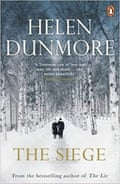

## 92

## **The Siege 围攻**

## by Helen Dunmore (2001) 海伦·邓莫尔 (2001)

The Levin family battle against starvation in this novel set during the German siege of Leningrad. Anna digs tank traps and dodges patrols as she scavenges for wood, but the hand of history is hard to escape.

这部小说以德军围困列宁格勒期间为背景，莱文一家与饥饿作斗争。安娜在寻找木材的同时挖掘坦克陷阱并躲避巡逻，但历史的魔爪难以逃脱。

  
_[Read the review](https://www.theguardian.com/books/2001/jun/02/fiction.reviews2) 阅读评论_

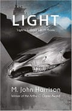

## 91

## **Light 光**

## by M John Harrison (2002) 约翰·哈里森 (M John Harrison) (2002)

One of the most underrated prose writers demonstrates the literary firepower of science fiction at its best. Three narrative strands – spanning far-future space opera, contemporary unease and virtual-reality pastiche – are braided together for a breathtaking metaphysical voyage in pursuit of the mystery at the heart of reality.

最被低估的散文作家之一充分展示了科幻小说的文学火力。三个叙事主线——跨越遥远未来的太空歌剧、当代的不安和虚拟现实的模仿——交织在一起，展开一场令人叹为观止的形而上学之旅，追寻现实核心的奥秘。

  
_[Read the review](https://www.theguardian.com/books/2002/nov/02/sciencefictionfantasyandhorror.iainbanks) 阅读评论_

## 90

## **Visitation 探视**

## by Jenny Erpenbeck (2008), translated by Susan Bernofsky (2010)  
Jenny Erpenbeck (2008)，苏珊·伯诺夫斯基 (Susan Bernofsky) 翻译 (2010)  

A grand house by a lake in the east of Germany is both the setting and main character of Erpenbeck’s third novel. The turbulent waves of 20th-century history crash over it as the house is sold by a Jewish family fleeing the Third Reich, requisitioned by the Russian army, reclaimed by exiles returning from Siberia, and sold again.

德国东部湖边的一座豪宅既是埃彭贝克第三部小说的背景，也是主人公。这座房子被一个逃离第三帝国的犹太家庭出售，被俄罗斯军队征用，被从西伯利亚返回的流亡者收回，并再次出售，20 世纪历史的汹涌波涛席卷了它。

  
_[Read the review](https://www.theguardian.com/books/2010/oct/30/visitation-jenny-erpenbeck-fiction-review) 阅读评论_

## 89

## **Bad Blood 坏血**

## by Lorna Sage (2000) 洛娜·塞奇 (2000)

A Whitbread prizewinning memoir, full of perfectly chosen phrases,  
Whitbread 获奖回忆录，充满了精心挑选的短语，  
  
that is one of the best accounts of family dysfunction ever written.  
这是有史以来对家庭功能障碍的最好描述之一。  
  
Sage grew up with her grandparents, who hated each other: he was a drunken philandering vicar; his wife, having found his diaries,

Sage 与她的祖父母一起长大，他们彼此憎恨：他是一个醉酒的花花公子牧师；他的妻子找到了他的日记，

  
blackmailed him and lived in another part of the house. The  
勒索他并住在房子的另一部分。这  
  
author gets unwittingly pregnant at 16, yet the story has a happy  
作者在 16 岁时意外怀孕，但故事却很幸福  
  
ending. 结尾。  
_[Read the review](https://www.theguardian.com/books/2000/sep/09/biography) 阅读评论_

## 88

## **Noughts** **& Crosses** 零和十字架

## by Malorie Blackman (2001) 马洛里·布莱克曼 (2001)

Set in an alternative Britain, this groundbreaking piece of young adult fiction sees black people, called the Crosses, hold all the power and influence, while the noughts – white people – are marginalised and segregated. The former children’s laureate’s series is a crucial work for explaining racism to young readers.

这部开创性的年轻成人小说以另类英国为背景，黑人被称为“十字架”，掌握着所有的权力和影响力，而无能者——白人——则被边缘化和隔离。这位前儿童文学奖得主的系列作品是向年轻读者解释种族主义的重要作品。

## 87

## **Priestdaddy 牧师爸爸**

## by Patricia Lockwood (2017) 帕特丽夏·洛克伍德 (2017)

This may not be the only account of living in a religious household in the American [midwest](https://www.theguardian.com/books/2019/apr/10/top-10-books-set-in-the-american-midwest) (in her youth, the author joined a group called God’s Gang, where they spoke in tongues), but it is surely the funniest. The author started out as the “poet laureate of Twitter”; her language is brilliant, and she has a completely original mind.

这可能不是唯一一个生活在美国中西部宗教家庭的故事（在她年轻的时候，作者加入了一个叫做上帝帮的团体，在那里他们说方言），但它肯定是最有趣的。作者最初是“推特的桂冠诗人”；她的语言很精彩，她有一个完全独创的思想。

  
_[Read the review](https://www.theguardian.com/books/2017/apr/27/priestdaddy-by-patricia-lockwood-review) 阅读评论_

A telling description of modern power … Yanis Varoufakis. Photograph: Alkis Konstantinidis/Reuters  
对现代力量的有力描述……Yanis Varoufakis。照片：Alkis Konstantinidis/路透社  

## 86

## **Adults in the Room 房间里的大人**

## by Yanis Varoufakis (2017) 亚尼斯·瓦鲁法基斯 (2017)

This memoir by the leather-jacketed economist of the six months he spent as Greece’s finance minister in 2015 at a time of economic and political crisis has been described as “one of the best political memoirs ever written”. He comes up against the IMF, the European institutions, Wall Street, billionaires and media owners and is told how the system works – as a result, his book is a telling description of modern power.

这位穿着皮夹克的经济学家在 2015 年经济和政治危机时期担任希腊财政部长六个月的回忆录被描述为“有史以来最好的政治回忆录之一”。他遇到了国际货币基金组织、欧洲机构、华尔街、亿万富翁和媒体所有者，并被告知该系统是如何运作的——因此，他的书是对现代权力的生动描述。

  
_[Read the review](https://www.theguardian.com/books/2017/may/15/adults-in-room-battle-europes-deep-establishment-yanis-varoufakis-review) 阅读评论_

## 85

## **The God Delusion 上帝的错觉**

## by Richard Dawkins (2006) 理查德·道金斯 (2006)

A key text in the days when the “New Atheism” was much talked about, _The God Delusion_ is a hard-hitting attack on religion, full of Dawkins’s confidence that faith produces fanatics and all arguments for God are ridiculous. What the evolutionary biologist lacks in philosophical sophistication, he makes up for in passion, and the book sold in huge numbers.

《上帝的错觉》是“新无神论”盛行时期的重要文本，是对宗教的强硬攻击，充满了道金斯的信心，即信仰产生狂热分子，所有支持上帝的论点都是荒谬的。这位进化生物学家在哲学的成熟度上有所欠缺，但他用热情弥补了这一点，这本书销量巨大。

  
_[Read the review](https://www.theguardian.com/books/2006/sep/23/scienceandnature.richarddawkins) 阅读评论_

## 84

## **The Cost of Living 生活费用**

## by Deborah Levy (2018) 黛博拉·利维 (2018)

Dazzling memoir … Deborah Levy. Photograph: Sheila Burnett  
Dazzling 回忆录……Deborah Levy。摄影：希拉伯内特  

“Chaos is supposed to be what we most fear but I have come to believe it might be what we most want ... ” The second part of Levy’s “living memoir”, in which she leaves her marriage, is a fascinating companion piece to her deep yet playful novels. Feminism, mythology and the daily grind come together for a book that combines emotion and intellect to dazzling effect.

“混乱应该是我们最害怕的，但我开始相信它可能是我们最想要的……”列维“生活回忆录”的第二部分，她离开了她的婚姻，是一个引人入胜的姊妹篇她深刻而有趣的小说。女权主义、神话和日常琐事汇聚一堂，将情感和智慧结合在一起，产生令人眼花缭乱的效果。

  
_[Read the review](https://www.theguardian.com/books/2018/apr/06/cost-living-deborah-levy-review-feminist-manifesto-divorced-simone-beauvoir) 阅读评论_

## 83

## **Tell Me How It Ends 告诉我结局如何**

## by Valeria Luiselli (2016), translated by Luiselli with Lizzie Davis (2017)  
作者：Valeria Luiselli (2016)，由 Luiselli 与 Lizzie Davis 翻译 (2017)  

As the hysteria over immigration to the US began to build in 2015, the Mexican novelist volunteered to work as an interpreter in New York’s federal immigration court. In this powerful series of essays she tells the poignant stories of the children she met, situating them in the wider context of the troubled relationship between the Americas.

随着 2015 年移民美国的歇斯底里情绪开始升温，这位墨西哥小说家自愿在纽约联邦移民法庭担任翻译。在这个有力的系列文章中，她讲述了她遇到的孩子们的辛酸故事，将他们置于美洲之间麻烦缠身的更广泛背景下。

  
_[Read the review](https://www.theguardian.com/books/2017/oct/22/tell-me-how-it-ends-valeria-luiselli-mexican-migrant-children-us-border) 阅读评论_

## 82

## **Coraline 卡萝兰**

## by Neil Gaiman (2002) 尼尔·盖曼 (2002)

From the Sandman comics to his fantasy epic American Gods to Twitter, Gaiman towers over the world of books. But this perfectly achieved children’s novella, in which a plucky young girl enters a parallel world where her “Other Mother” is a spooky copy of her real-life mum, with buttons for eyes, might be his finest hour: a properly scary modern myth which cuts right to the heart of childhood fears and desires.

从睡魔漫画到他的奇幻史诗《美国众神》再到 Twitter，盖曼屹立于书本世界。但这部完美的儿童中篇小说，其中一个勇敢的年轻女孩进入了一个平行世界，在那里她的“另一个母亲”是她现实生活中妈妈的阴森复制品，眼睛上有纽扣，这可能是他最好的时刻：一个适当可怕的现代神话这切入了童年恐惧和欲望的核心。

  
_[Read the review](https://www.theguardian.com/books/2002/aug/31/booksforchildrenandteenagers.neilgaiman) 阅读评论_

## 81

## **Harvest 收成**

## by Jim Crace (2013) 吉姆·克瑞斯 (2013)

Crace is fascinated by the moment when one era gives way to another. Here, it is the enclosure of the commons, a fulcrum of English history, that drives his story of dispossession and displacement. Set in a village without a name, the narrative dramatises what it’s like to see the world you know come to an end, in a severance of the connection between people and land that has deep relevance for our time of climate crisis and forced migration.

一个时代让位给另一个时代的那一刻让 Crace 着迷。在这里，正是公地的圈地，英国历史的一个支点，推动了他关于剥夺和流离失所的故事。故事发生在一个没有名字的村庄，讲述了看到你所知道的世界走到尽头的感觉，人与土地之间的联系被切断，这与我们这个气候危机和被迫迁移的时代有着深远的关联。

  
_[Read the review](https://www.theguardian.com/books/2013/feb/14/harvest-jim-crace-review) 阅读评论_

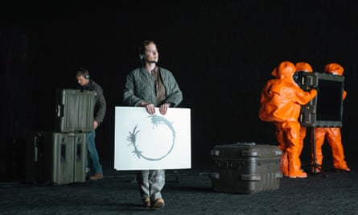

Amy Adams in Arrival, the 2015 film based on a short story by Ted Chiang. Photograph: Allstar/Paramount Pictures  
Amy Adams in Arrival，2015 年的电影，改编自 Ted Chiang 的短篇小说。照片：Allstar/Paramount Pictures  

## 80

## **Stories of Your Life and Others  
你和其他人的生活故事  
**

## by Ted Chiang (2002) 蒋泰德 (2002)

Melancholic and transcendent, Chiang’s eight, high-concept sci-fi stories exploring the nature of language, maths, religion and physics racked up numerous awards and a wider audience when ‘Story of Your Life’ was adapted into the 2016 film _[Arrival](https://www.theguardian.com/film/2016/sep/01/arrival-review-amy-adams-denis-villeneuve-alien-contact)_.

2016 年，《你的故事》被改编成电影《降临》，蒋的八部探索语言、数学、宗教和物理学本质的高概念科幻小说忧郁而超然，赢得了无数奖项和更广泛的观众。

  
_[Read the review](https://www.theguardian.com/books/2004/apr/24/featuresreviews.guardianreview23) 阅读评论_

## 79

## **The Spirit Level 精神层面**

## by Richard Wilkinson and Kate Pickett (2009)  
理查德·威尔金森和凯特·皮克特 (2009)  

An eye-opening study, based on overwhelming evidence, which revealed  
一项基于压倒性证据的令人大开眼界的研究揭示了  
  
that among rich countries, the “more equal societies almost always do  
在富裕国家中，“更平等的社会几乎总是  
  
better” for all. Growth matters less than inequality, the authors  
对所有人来说更好”。作者认为增长不如不平等重要  
  
argued: whether the issue is life expectancy, infant mortality, crime  
争论：问题是否是预期寿命、婴儿死亡率、犯罪率  
  
rates, obesity, literacy or recycling, the Scandinavian countries,  
率、肥胖、识字率或回收利用，斯堪的纳维亚国家，  
  
say, will always win out over, say, the UK.  
比如说，总会胜过英国。  
  
_[Read the review](https://www.theguardian.com/books/2009/mar/13/the-spirit-level) 阅读评论_

NK Jemisin explores urgent questions of power in The Fifth Season. Photograph: Laura Hanifin  
NK Jemisin 在第五季探讨了紧迫的权力问题。摄影：劳拉·哈尼芬  

## 78

## **The Fifth Season 第五季**

## by NK Jemisin (2015) NK 杰米辛 (2015)

[Jemisin](https://www.theguardian.com/books/2015/jul/27/nk-jemisin-interview-fantasy-science-fiction-writing-racism-sexism) became the first African American author to win the best novel category at the Hugo awards for her first book in the Broken Earth trilogy. In her intricate and richly imagined far future universe, the world is ending, ripped apart by relentless earthquakes and volcanoes. Against this apocalyptic backdrop she explores urgent questions of power and enslavement through the eyes of three women. “As this genre finally acknowledges that the dreams of the marginalised matter and that all of us have a future,” she said in her acceptance speech, “so will go the world. (Soon, I hope.)”

杰米辛凭借《破碎的地球》三部曲中的第一部作品，成为第一位获得雨果奖最佳小说类奖项的非裔美国作家。在她错综复杂、想象丰富的遥远未来宇宙中，世界正在走向终结，被无情的地震和火山撕裂。在这个世界末日的背景下，她通过三位女性的眼睛探讨了权力和奴役的紧迫问题。 “随着这一流派最终承认边缘化的梦想很重要，我们所有人都有未来，”她在获奖感言中说，“世界也会如此。 （很快，我希望。）”

## 77

## **Signs Preceding the End of the World  
世界末日前的征兆  
**

## by Yuri Herrera (2009), translated by Lisa Dillman (2015)  
尤里·埃雷拉 (Yuri Herrera) (2009)，丽莎·迪尔曼 (Lisa Dillman) 翻译 (2015)  

Makina sets off from her village in Mexico with a package from a local gangster and a message for her brother, who has been gone for three years. The story of her crossing to the US examines the blurring of boundaries, the commingling of languages and the blending of identities that complicate the idea of an eventual return.

Makina 带着一个当地黑帮的包裹和一条给她已经离开三年的哥哥的信息，从她在墨西哥的村庄出发。她穿越到美国的故事审视了边界的模糊、语言的混合和身份的融合，这些都使最终返回的想法变得复杂。

  
_[Read the review](https://www.theguardian.com/books/2015/apr/22/signs-preceding-the-end-of-the-world-yuri-herrera-review-mexican-migrants) 阅读评论_

## 76

## **Thinking, Fast and Slow 思考，快与慢**

## by Daniel Kahneman (2011) 丹尼尔·卡尼曼 (2011)

The Nobel laureate’s unexpected bestseller, on the minutiae of decision-making, divides the brain into two. System One makes judgments quickly, intuitively and automatically, as when a batsman decides whether to cut or pull. System Two is slow, calculated and deliberate, like long division. But psychologist Kahneman argues that, although System Two thinks it is in control, many of our decisions are really made by System One.

这位诺贝尔奖获得者出人意料的畅销书在决策制定的细节上将大脑一分为二。 System One 做出快速、直观和自动的判断，就像击球手决定是切球还是拉球一样。系统二是缓慢的、经过深思熟虑的，就像长除法一样。但心理学家卡尼曼认为，尽管系统二认为它处于控制之中，但我们的许多决定实际上是由系统一做出的。

  
_[Read the review](https://www.theguardian.com/books/2011/dec/13/thinking-fast-slow-daniel-kahneman) 阅读评论_

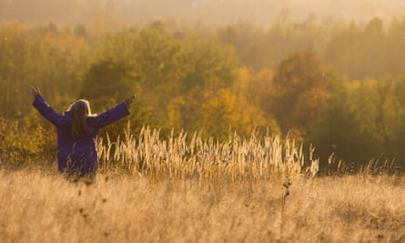

Spoor, the film adaptation of Drive Your Plow Over the Bones of the Dead.  
Spoor，电影改编自 Drive Your Plow Over the Bones of the Dead。  

## 75

## **Drive Your Plow Over the Bones of the Dead  
在死者的白骨上开犁  
**

## by Olga Tokarczuk (2009), translated by Antonia Lloyd-Jones (2018)  
奥尔加·托卡尔丘克 (Olga Tokarczuk) (2009)，安东尼娅·劳埃德·琼斯 (Antonia Lloyd-Jones) 翻译 (2018)  

In this existential eco-thriller, a William Blake-obsessed eccentric investigates the murders of men and animals in a remote Polish village. More accessible and focused than _Flights_, the novel that won Tokarczuk the Man International Booker prize, it is no less profound in its examination of how atavistic male impulses, emboldened by the new rightwing politics of Europe, are endangering people, communities and nature itself.

在这部关于生存主义的生态惊悚片中，一个痴迷于威廉·布莱克的怪人调查了一个偏远的波兰村庄发生的人畜谋杀案。比赢得托卡尔丘克国际布克奖的小说《飞行》更易读、更专注，它同样深刻地审视了欧洲新右翼政治助长的返祖男性冲动如何危及人类、社区和自然本身。

  
_[Read the review](https://www.theguardian.com/books/2018/sep/21/drive-your-plow-over-the-bones-of-the-dead-review) 阅读评论_

## 74

## **Days Without End 没有尽头的日子**

## by Sebastian Barry (2016) 塞巴斯蒂安·巴里 (2016)

In this savagely beautiful novel set during the Indian wars and American civil war, a young Irish boy flees famine-struck Sligo for Missouri. There he finds lifelong companionship with another emigrant, and they join the army on its brutal journey west, laying waste to Indian settlements. Viscerally focused and intense, yet imbued with the grandeur of the landscape, the book explores love, gender and survival with a rare, luminous power.

在这部以印第安人战争和美国内战为背景的野蛮美丽小说中，一个年轻的爱尔兰男孩逃离饥荒肆虐的斯莱戈前往密苏里州。在那里，他找到了与另一位移民终生的友谊，他们加入了军队，踏上了残酷的西部之旅，摧毁了印第安人的定居点。这本书以发自内心的专注和强烈，却又充满了壮丽的风景，以一种罕见的、发光的力量探索了爱情、性别和生存。

  
_[Read the review](https://www.theguardian.com/books/2016/oct/28/days-without-end-by-sebastian-barry-review) 阅读评论_

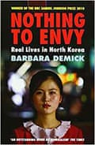

## 73

## **Nothing to Envy 没有什么值得羡慕的**

## by Barbara Demick (2009) 芭芭拉·德米克 (2009)

Los Angeles Times journalist Barbara Demick interviewed around 100 North Korean defectors for this propulsive work of narrative non-fiction, but she focuses on just six, all from the north-eastern city of Chongjin – closed to foreigners and less media-ready than Pyongyang. North Korea is revealed to be rife with poverty, corruption and violence but populated by resilient people with a remarkable ability to see past the propaganda all around them.

《洛杉矶时报》记者芭芭拉·德米克 (Barbara Demick) 为这部具有推动力的非虚构叙事作品采访了大约 100 名朝鲜叛逃者，但她只关注了六名，他们都来自东北部城市清津——对外国人不开放，媒体准备程度不如平壤。据透露，朝鲜充斥着贫困、腐败和暴力，但那里居住着坚韧不拔的人民，他们具有非凡的能力，能够看穿周围的宣传。

  
_[Read the review](https://www.theguardian.com/books/2010/apr/03/nothing-envy-korea-barbara-demick) 阅读评论_

## 72

## **The Age of Surveillance Capitalism  
监视资本主义时代  
**

## by Shoshana Zuboff (2019) 作者：Shoshana Zuboff (2019)

An agenda-setting book that is devastating about the extent to which big tech sets out to manipulate us for profit. Not simply another expression of the “techlash”, Zuboff’s ambitious study identifies a new form of capitalism, one involving the monitoring and shaping of our behaviour, often without our knowledge, with profound implications for democracy. “Once we searched Google, but now Google searches us.”

一本设定议程的书，它对大型科技公司为了利润而开始操纵我们的程度进行了毁灭性的描述。 Zuboff 的雄心勃勃的研究不仅仅是“技术冲击”的另一种表达方式，它确定了一种新的资本主义形式，一种涉及对我们行为的监控和塑造，通常在我们不知情的情况下，对民主具有深远的影响。 “曾经我们搜索谷歌，但现在谷歌搜索我们。”

  
_[Read the review](https://www.theguardian.com/books/2019/feb/02/age-of-surveillance-capitalism-shoshana-zuboff-review) 阅读评论_

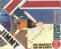

## 71

## **Jimmy Corrigan:** **The Smartest Kid on Earth**  
吉米·科里根：地球上最聪明的孩子  

## by Chris Ware (2000) 克里斯·韦尔 (2000)

At the time when Ware won the Guardian first book award, no graphic novel had previously won a generalist literary prize. Emotional and artistic complexity are perfectly poised in this account of a listless 36-year-old office dogsbody who is thrown into an existential crisis by an encounter with his estranged dad.

在 Ware 获得卫报第一图书奖时，此前还没有任何图画小说获得通才文学奖。情感和艺术的复杂性在这个描述中完美地展现了一个无精打采的 36 岁办公室狗身体，他因与他疏远的父亲的相遇而陷入生存危机。

  
_[Read the review](https://www.theguardian.com/books/2001/jul/21/biography.highereducation) 阅读评论_

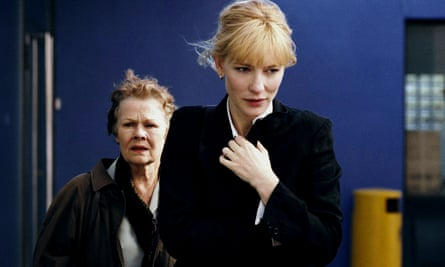

Judi Dench, left, and Cate Blanchett in the 2006 film adaptation of Notes on a Scandal. Photograph: Allstar/FOX SEARCHLIGHT/Sportsphoto Ltd./Allstar

Judi Dench（左）和 Cate Blanchett 在 2006 年改编的电影《丑闻笔记》中。照片：Allstar/FOX SEARCHLIGHT/Sportsphoto Ltd./Allstar

## 70

## **Notes on a Scandal 丑闻笔记**

## by Zoë Heller (2003) 佐伊·海勒 (2003)

Sheba, a middle-aged teacher at a London comprehensive, begins an affair with her 15-year-old student - but we hear about it from a fellow teacher, the needy Barbara, whose obsessive nature drives the narrative. With shades of Patricia Highsmith, this teasing investigation into sex, class and loneliness is a dark marvel.

希巴 (Sheba) 是伦敦一家综合性学校的中年教师，她开始与她 15 岁的学生发生婚外情——但我们是从一位贫穷的老师同事那里听说这件事的，她的强迫症天性推动了故事的发展。带着帕特里夏·海史密斯 (Patricia Highsmith) 的影子，这部对性、阶级和孤独的戏弄式调查是一个黑暗的奇迹。

  
_[Read the review](https://www.theguardian.com/books/2003/may/31/featuresreviews.guardianreview9) 阅读评论_

## 69

## **The Infatuations 迷恋**

## by Javier Marías (2011), translated by Margaret Jull Costa (2013)  
Javier Marías (2011)，Margaret Jull Costa 翻译 (2013)  

The Spanish master examines chance, love and death in the story of an apparently random killing that gradually reveals hidden depths. Marías constructs an elegant murder mystery from his trademark labyrinthine sentences, but this investigation is in pursuit of much meatier questions than whodunnit.

这位西班牙大师在一个看似随机的杀戮故事中审视了机会、爱情和死亡，逐渐揭示了隐藏的深度。玛丽亚斯从他标志性的迷宫般的句子中构建了一个优雅的谋杀之谜，但这项调查是为了寻找比 whodunnit 更真实的问题。

_[Read the review](https://www.theguardian.com/books/2013/mar/01/the-infatuations-javier-marias-review) 阅读评论_

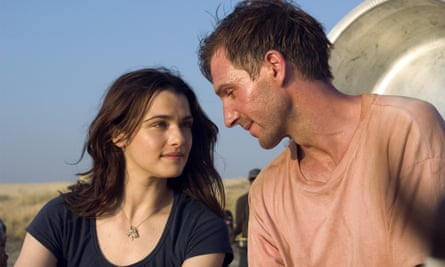

Rachel Weisz and Ralph Fiennes in the 2005 film adaptation of The Constant Gardener. Photograph: Jaap Buitendijk/AP  
Rachel Weisz 和 Ralph Fiennes 在 2005 年改编的电影《永恒的园丁》中。摄影：Jaap Buitendijk/AP  

## 68

## **The Constant Gardener 不变的园丁**

## by John le Carré (2001) 约翰·勒卡雷 (2001)

The master of the cold war thriller turned his attention to the new world order in this chilling investigation into the corruption powering big pharma in Africa. Based on the case of a rogue antibiotics trial that killed and maimed children in Nigeria in the 1990s, it has all the dash and authority of his earlier novels while precisely and presciently anatomising the dangers of a rampant neo-imperialist capitalism.

这部冷战惊悚片的大师将注意力转向了新的世界秩序，调查了非洲大型制药公司的腐败行为。基于 1990 年代在尼日利亚导致儿童死亡和致残的流氓抗生素试验案例，它具有他早期小说的所有冲劲和权威，同时准确而有先见之明地剖析了猖獗的新帝国主义资本主义的危险。

  
_[Read the review](https://www.theguardian.com/books/2000/dec/23/fiction.reviews) 阅读评论_

## 67

## **The Silence of the Girls 少女的沉默**

## by Pat Barker (2018) 帕特·巴克 (2018)

If the western literary canon is founded on Homer, then it is founded on women’s silence. Barker’s extraordinary intervention, in which she replays the events of the _Iliad_ from the point of view of the enslaved Trojan women, chimed with both the #MeToo movement and a wider drive to foreground suppressed voices. In a world still at war, it has chilling contemporary resonance.

如果说西方文学经典是建立在荷马的基础上，那么它就是建立在女性的沉默之上。巴克非凡的干预，她从被奴役的特洛伊妇女的角度重播了伊利亚特的事件，与#MeToo 运动和更广泛的前景压抑的声音相呼应。在一个仍处于战争状态的世界里，它在当代引起了令人不寒而栗的共鸣。

  
_[Read the review](https://www.theguardian.com/books/2018/aug/22/silence-of-the-girls-pat-barker-book-review-iliad) 阅读评论_

## 66

## **Seven Brief Lessons on Physics 物理七课**

## by Carlo Rovelli (2014) 卡罗·罗维利 (2014)

A theoretical physicist opens a window on to the great questions of the universe with this 96-page overview of modern physics. Rovelli’s keen insight and striking metaphors make this the best introduction to subjects including relativity, quantum mechanics, cosmology, elementary particles and entropy outside of a course in advanced physics.

一位理论物理学家通过这本 96 页的现代物理学概述打开了一扇通向宇宙重大问题的窗户。 Rovelli 敏锐的洞察力和惊人的隐喻使这本书成为高等物理学课程之外对相对论、量子力学、宇宙学、基本粒子和熵等学科的最佳介绍。

  
_[Read the review](https://www.theguardian.com/books/2015/oct/11/seven-brief-lessons-physics-carlo-rovelli-review-paean-science) 阅读评论_

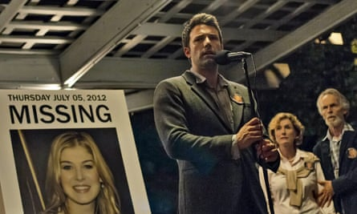

Ben Affleck in the 2014 film adaptation of Gone Girl. Photograph: Allstar/New Regency Pictures  
Ben Affleck 在 2014 年改编的电影《消失的爱人》中。照片：Allstar/New Regency Pictures  

## 65

## **Gone Girl 消失的爱人**

## by Gillian Flynn (2012) 吉莉安·弗林 (2012)

The deliciously dark US crime thriller that launched a thousand imitators and took the concept of the unreliable narrator to new heights. A woman disappears: we think we know whodunit, but we’re wrong. Flynn’s stylishly written portrait of a toxic marriage set against a backdrop of social and economic insecurity combines psychological depth with sheer unputdownable flair.

这部美味黑暗的美国犯罪惊悚片吸引了一千名模仿者，并将不可靠的叙述者的概念推向了新的高度。一个女人失踪了：我们认为我们知道侦探，但我们错了。弗林在社会和经济不安全的背景下，以时尚的笔触描绘了一段有毒的婚姻，结合了心理深度和绝对令人钦佩的天赋。

  
_[Read the review](https://www.theguardian.com/books/2012/may/20/gillian-flynn-gone-girl-review) 阅读评论_

## 64

## **On Writing 关于写作**

## by Stephen King (2000) 斯蒂芬·金 (2000)

Written after a near-fatal accident, this combination of memoir and masterclass by fiction’s most successful modern storyteller showcases the blunt, casual brilliance of King at his best. As well as being genuinely useful, it’s a fascinating chronicle of literary persistence, and of a lifelong love affair with language and narrative.

在一次近乎致命的事故后写成，这本由小说中最成功的现代说书人撰写的回忆录和大师班相结合，展示了金在其最佳状态下直率、随意的才华。除了真正有用之外，它还是一部引人入胜的文学坚持编年史，以及对语言和叙事的终生热爱。

  
_[Read the review](https://www.theguardian.com/books/2000/oct/07/biography.stephenking) 阅读评论_

## 63

## **The Immortal Life of Henrietta Lacks  
亨丽埃塔不朽的生命缺乏  
**

## by Rebecca Skloot (2010) 丽贝卡·斯克鲁特 (2010)

Henrietta Lacks was a black American who died in agony of cancer in a “coloured” hospital ward in 1951. Her cells, taken without her knowledge during a biopsy, went on to change medical history, being used around the world to develop countless drugs. Skloot skilfully tells the extraordinary scientific story, but in this book the voices of the Lacks children are crucial – they have struggled desperately even as billions have been made from their mother’s “HeLa” cells.

亨丽埃塔·拉克斯 (Henrietta Lacks) 是一名美国黑人，1951 年在“有色人种”医院病房中死于癌症的痛苦。她的细胞在她不知情的情况下进行活检，后来改变了医学史，在世界各地被用于开发无数药物。 Skloot 巧妙地讲述了非凡的科学故事，但在这本书中，Lacks 孩子的声音至关重要——即使从他们母亲的“海拉”细胞中赚取了数十亿美元，他们也在拼命挣扎。

  
_[Read the review](https://www.theguardian.com/books/2010/may/22/life-henrietta-lacks-rebecca-skloot) 阅读评论_

Benedict Cumberbatch in the TV adaptation of Edward St Aubyn’s Patrick Melrose novels. Photograph: Ollie Upton/Showtime  
Benedict Cumberbatch 在爱德华圣奥宾的帕特里克梅尔罗斯小说的电视改编中。摄影：Ollie Upton/Showtime  

## 62

## **Mother’s Milk 母乳**

## by Edward St Aubyn (2006) 爱德华·圣奥宾 (2006)

The fourth of the autobiographical Patrick Melrose novels finds the wealthy protagonist – whose flight from atrocious memories of child abuse into drug abuse was the focus of the first books – beginning to grope after redemption. Elegant wit and subtle psychology lift grim subject matter into seductive brilliance.

帕特里克梅尔罗斯自传体小说的第四部发现这位富有的主人公——他从虐待儿童的残忍记忆转变为吸毒是第一本书的重点——在救赎之后开始摸索。优雅的机智和微妙的心理将严峻的主题提升为诱人的光彩。

  
_[Read the review](https://www.theguardian.com/books/2006/jan/14/fiction.edwardstaubyn) 阅读评论_

## 61

## **This House of Grief 这个悲伤的房子**

## by Helen Garner (2014) 海伦·加纳 (2014)

A man drives his three sons into a deep pond and swims out, leaving them to drown. But was it an accident? This 2005 tragedy caught the attention of one of Australia’s greatest living writers. Garner puts herself centre stage in an account of Robert Farquharson’s trial that combines forensic detail and rich humanity.

一个男人把他的三个儿子赶到一个深池里，然后游了出来，让他们淹死了。但这是意外吗？这场 2005 年的悲剧引起了澳大利亚在世最伟大作家之一的注意。加纳 (Garner) 在对罗伯特·法夸森 (Robert Farquharson) 的审判的叙述中将自己置于中心位置，结合了法医细节和丰富的人性。

  
_[Read the review](https://www.theguardian.com/books/2016/jan/08/this-house-of-grief-helen-garner-review) 阅读评论_

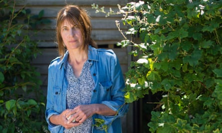

A mesmerising tapestry of the River Dart’s mutterings … Alice Oswald. Photograph: Jim Wileman/The Guardian  
达特河 (River Dart) 的喃喃自语令人着迷……爱丽丝·奥斯瓦尔德 (Alice Oswald)。摄影：Jim Wileman/The Guardian  

## 60

## **Dart 镖**

## by Alice Oswald (2002) 爱丽丝·奥斯瓦尔德 (2002)

This book-length poem is a mesmerising tapestry of “the river’s mutterings”, based on three years of recording conversations with people who live and work on the River Dart in Devon. From swimmers to sewage workers, boatbuilders to bailiffs, salmon fishers to ferryman, the voices are varied and vividly brought to life.

这首长诗是一幅迷人的“河流的喃喃自语”挂毯，基于三年来与在德文郡达特河上生活和工作的人们的对话录音。从游泳者到污水处理工人，从造船者到法警，从鲑鱼渔民到摆渡人，声音各不相同，栩栩如生。

  
_[Read the review](https://www.theguardian.com/books/2002/jul/13/featuresreviews.guardianreview13) 阅读评论_

## 59

## **The Beauty of the Husband 丈夫的美丽**

## by Anne Carson (2002) 安妮·卡森 (2002)

One of Canada’s most celebrated poets examines love and desire in a collection that describes itself as “a fictional essay in 39 tangos”. [Carson](https://www.theguardian.com/books/2006/dec/30/featuresreviews.guardianreview7) charts the course of a doomed marriage in loose-limbed lines that follow the switchbacks of thought and feeling from first meeting through multiple infidelities to arrive at eventual divorce.

加拿大最著名的诗人之一在一本自称为“39 首探戈的虚构散文”的诗集中审视了爱情和欲望。卡森用松散的线条描绘了一段注定要失败的婚姻的过程，这些线条遵循从第一次见面到多次不忠到最终离婚的思想和感觉的转变。

## 58

## **Postwar 战后**

## by Tony Judt (2005) 托尼·朱特 (2005)

This grand survey of Europe since 1945 begins with the devastation left behind by the second world war and offers a panoramic narrative of the cold war from its beginnings to the collapse of the Soviet bloc – a part of which Judt witnessed firsthand in Czechoslovakia’s velvet revolution. A very complex story is told with page-turning urgency and what may now be read as nostalgic faith in “the European idea”.

这部自 1945 年以来对欧洲的宏大调查从第二次世界大战留下的破坏开始，提供了从冷战开始到苏联集团解体的全景叙述——其中一部分是朱特在捷克斯洛伐克的天鹅绒革命中亲眼目睹的。一个非常复杂的故事以翻页的紧迫感讲述，现在可以理解为对“欧洲理念”的怀旧信仰。

  
_[Read the review](https://www.theguardian.com/books/2005/dec/03/featuresreviews.guardianreview4) 阅读评论_

## 57

## **The Amazing Adventures of Kavalier and Clay  
卡瓦利埃和克雷的奇妙历险记  
**

## by Michael Chabon (2000) 迈克尔·夏邦 (2000)

A love story to the golden age of comics in New York, Chabon’s Pulitzer-winner features two Jewish cousins, one smuggled out of occupied Prague, who create an anti-fascist comic book superhero called The Escapist. Their own adventures are as exciting and highly coloured as the ones they write and draw in this generous, open-hearted, deeply lovable rollercoaster of a book.

Chabon 的普利策奖得主是纽约漫画黄金时代的爱情故事，讲述了两位犹太堂兄弟，其中一位是从被占领的布拉格走私出来的，他们创作了一部名为 The Escapist 的反法西斯漫画超级英雄。他们自己的冒险经历与他们在这本慷慨、坦诚、深受喜爱的过山车式书中所写和绘制的冒险一样令人兴奋和色彩丰富。

  
_[Read the review](https://www.theguardian.com/books/2001/jul/08/features.review2) 阅读评论_

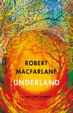

Photograph: Robert Macfarlane’s Underland (Hamish Hamilton).  
照片：罗伯特麦克法兰的地下世界（哈米什汉密尔顿）。  

## 56

## **Underland 地下世界**

## by Robert Macfarlane (2019) 罗伯特·麦克法兰 (2019)

A beautifully written and profound book, which takes the form of a  
一本文笔优美、意义深远的书，它采用了一种形式  
  
series of (often hair-raising and claustrophobic) voyages underground  
一系列（通常令人毛骨悚然和幽闭恐怖的）地下航行  
  
– from the fjords of the Arctic to the Parisian catacombs. Trips below  
– 从北极峡湾到巴黎地下墓穴。下面的行程  
  
the surface inspire reflections on “deep” geological time and raise  
表面激发了对“深层”地质时代的思考，并提高了  
  
urgent questions about the human impact on planet Earth.  
有关人类对地球影响的紧迫问题。  
  
[Read the review 阅读评论](https://www.theguardian.com/books/2019/may/08/underland-by-robert-macfarlane-review)

## 55

## **The Omnivore’s Dilemma 杂食动物的困境**

## by Michael Pollan (2006) 迈克尔·波伦 (2006)

An entertaining and highly influential book from the writer best known for his advice: “Eat food, not too much, mostly plants.” The author follows four meals on their journey from field to plate – including one from McDonald’s and a locally sourced organic feast. Pollan is a skilled, amusing storyteller and _The Omnivore’s Dilemma_ changed both food writing and the way we see food.

这位作家的一本有趣且极具影响力的书以其建议而闻名：“吃食物，不要太多，主要是植物。”作者追踪了他们从田间到餐桌的四顿饭——包括一顿来自麦当劳的和一顿当地采购的有机大餐。波伦是一位技巧娴熟、风趣幽默的讲故事的人，而《杂食者的困境》改变了美食写作和我们看待食物的方式。

  
_[Read the review](https://www.theguardian.com/books/2006/aug/12/featuresreviews.guardianreview22) 阅读评论_

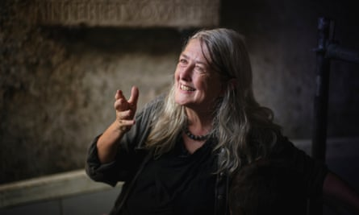

Mary Beard, whose slim manifesto Women & Power became an instant feminist classic. Photograph: Sarah Lee/The Guardian  
Mary Beard，其纤细的宣言女性与权力立即成为女权主义经典。摄影：Sarah Lee/The Guardian  

## 54

## **Women** **& Power** 女性与权力

## by Mary Beard (2017) 玛丽·比尔德 (2017)

Based on Beard’s lectures on women’s voices and how they have been silenced, _Women and Power_ was an enormous publishing success in the “[#MeToo](https://www.theguardian.com/world/metoo-movement)”’ year 2017. An exploration of misogyny, the origins of “gendered speech” in the classical era and the problems the male world has with strong women, this slim manifesto became an instant feminist classic.

基于比尔德关于女性声音以及她们如何被压制的演讲，女性与权力在 2017 年“[#MeToo](https://www.theguardian.com/world/metoo-movement)”年取得了巨大的出版成功。对厌女症的探索，古典时代“性别言论”的起源和男性世界对强势女性的问题，这个纤细的宣言立即成为女权主义经典。

  
_[Read the review](https://www.theguardian.com/books/2017/nov/05/mary-beard-women-and-power-review-modern-feminist-classic) 阅读评论_

## 53

## **True History of the Kelly Gang  
凯利帮的真实历史  
**

## by Peter Carey (2000) 彼得·凯里 (2000)

Carey’s second Booker winner is an irresistible tour de force of literary ventriloquism: the supposed autobiography of 19th-century Australian outlaw and “wild colonial boy” Ned Kelly, inspired by a fragment of Kelly’s own prose and written as a glorious rush of semi-punctuated vernacular storytelling. Mythic and tender by turns, these are tall tales from a lost frontier.

凯里的第二个布克奖得主是一部不可抗拒的腹语文学杰作：据称是 19 世纪澳大利亚亡命之徒和“野蛮殖民地男孩”奈德凯利的自传，灵感来自凯利自己散文的一段片段，写成半标点符号的光荣匆忙白话故事。神话和温柔交替，这些是来自失落边境的荒诞故事。

  
_[Read the review](https://www.theguardian.com/books/2001/jan/06/fiction.bookerprize2001) 阅读评论_

## 52

## **Small Island 小岛**

## by Andrea Levy (2004) 安德里亚·利维 (2004)

Pitted against a backdrop of prejudice, this London-set novel is told by four protagonists – Hortense and Gilbert, Jamaican migrants, and a stereotypically English couple, Queenie and Bernard. These varied perspectives, illuminated by love and loyalty, combine to create a thoughtful mosaic depicting the complex beginnings of Britain’s multicultural society.

在偏见的背景下，这部以伦敦为背景的小说由四个主角讲述——霍滕斯和吉尔伯特，牙买加移民，以及一对典型的英国夫妇奎妮和伯纳德。这些不同的观点，在爱和忠诚的照耀下，共同创造了一幅深思熟虑的马赛克，描绘了英国多元文化社会的复杂开端。

  
_[Read the review](https://www.theguardian.com/books/2004/feb/14/featuresreviews.guardianreview10) 阅读评论_

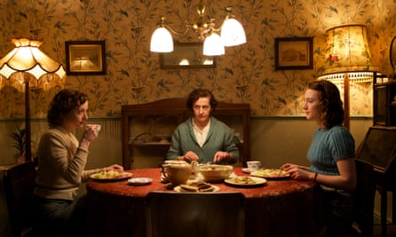

The 2015 film adaptation of Brooklyn. Photograph: Kerry Brown/AP  
2015 年改编的布鲁克林电影。摄影：Kerry Brown/美联社  

## 51

## **Brooklyn 布鲁克林**

## by Colm Tóibín (2009) 科尔姆·托宾 (2009)

Tóibín’s sixth novel is set in the 1950s, when more than 400,000 people left Ireland, and considers the emotional and existential impact of emigration on one young woman. Eilis makes a life for herself in New York, but is drawn back by the possibilities of the life she has lost at home. A universal story of love, endurance and missed chances, made radiant through Tóibín’s measured prose and tender understatement.

托宾的第六本小说以 1950 年代为背景，当时有超过 400,000 人离开了爱尔兰，并探讨了移民对一位年轻女性的情感和生存影响。艾丽丝在纽约为自己谋生，但她因在家中失去的生活的可能性而退缩。一个关于爱、忍耐和错失良机的普世故事，在托宾慎重的散文和温柔的轻描淡写中熠熠生辉。

  
_[Read the review](https://www.theguardian.com/books/2009/may/09/colm-toibin-brooklyn) 阅读评论_

## 50

## **Oryx and Crake 羚羊和 Crake**

## by Margaret Atwood (2003) 玛格丽特·阿特伍德 (2003)

In the first book in her dystopian MaddAddam trilogy, the Booker winner speculates about the havoc science can wreak on the world. The big warning here – don’t trust corporations to run the planet – is blaring louder and louder as the century progresses.

在她的反乌托邦 MaddAddam 三部曲的第一本书中，布克奖得主推测科学可能对世界造成的破坏。随着世纪的进步，这里的重大警告——不要相信公司来管理这个星球——的声音越来越响亮。

  
_[Read the review](https://www.theguardian.com/books/2003/may/10/bookerprize2003.bookerprize) 阅读评论_

## 49

## **Why Be Happy When You Could Be Normal?  
当你可以正常时为什么要快乐？  
**

## by Jeanette Winterson (2011) 珍妮特·温特森 (2011)

The title is the question Winterson’s adoptive mother asked as she threw her daughter out, aged 16, for having a girlfriend. The autobiographical story behind _Oranges Are Not the Only Fruit_, and the trials of Winterson’s later life, is urgent, wise and moving.

标题是温特森的养母在将 16 岁的女儿赶出去时提出的问题，因为她有一个女朋友。橘子不是唯一的水果背后的自传故事，以及温特森晚年生活的考验，是紧迫、睿智和感人的。

  
_[Read the review](https://www.theguardian.com/books/2011/nov/04/why-be-happy-jeanette-winterson-review) 阅读评论_

## 48  48

## **Night Watch 夜间值班**

## by Terry Pratchett (2002)  特里·普拉切特 (2002)

Pratchett’s mighty Discworld series is a high point in modern fiction: a parody of fantasy literature that deepened and darkened over the decades to create incisive satires of our own world. The 29th book, focusing on unlikely heroes, displays all his fierce intelligence, anger and wild humour, in a story that’s moral, humane – and hilarious.

普拉切特 (Pratchett) 强大的 Discworld 系列是现代小说的一个高峰：对奇幻文学的模仿在几十年里加深和黑暗，以创造对我们自己世界的尖锐讽刺。第 29 本书着眼于不太可能的英雄，在一个道德、人道和滑稽的故事中展示了他所有的敏锐智慧、愤怒和狂野的幽默。

  
_[Read the review](https://www.theguardian.com/books/2002/nov/09/sciencefictionfantasyandhorror.asbyatt) 阅读评论_

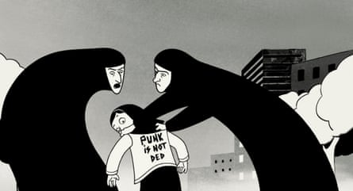

The 2008 film adaptation of Persepolis. Photograph: Marjane Satrapi et Vincent Paron/Publicity image from film company  
波斯波利斯 2008 年电影改编。摄影：Marjane Satrapi et Vincent Paron/电影公司宣传图片  

## 47

## **Persepolis 波斯波利斯**

## by Marjane Satrapi (2000-2003), translated by Mattias Ripa (2003-2004)  
Marjane Satrapi (2000-2003) 着，Mattias Ripa (2003-2004) 翻译  

Satrapi’s autobiographical graphic novel follows her coming-of-age in the lead up to and during the Iranian revolution. In this riotous memoir, Satrapi focuses on one young life to reveal a hidden history.

Satrapi 的自传图画小说讲述了她在伊朗革命前夕和革命期间的成长过程。在这本欢快的回忆录中，萨塔比聚焦于一个年轻的生命，以揭示一段不为人知的历史。

## 46

## **Human Chain 人链**

## by Seamus Heaney (2010) 谢默斯·希尼 (2010)

The Nobel laureate tends to the fragments of memory and loss with moving precision in his final poetry collection. A book of elegies and echoes, these poems are infused with a haunting sense of pathos, with a line often left hanging to suspend the reader in longing and regret.

这位诺贝尔奖获得者在他最后的诗集中以动人的精确度处理记忆和失落的碎片。一本充满挽歌和回声的诗，这些诗充满了挥之不去的悲怆感，常常悬着一行诗，让读者悬在思念和遗憾中。

  
_[Read the review](https://www.theguardian.com/books/2010/aug/21/seamus-heaney-human-chain-review) 阅读评论_

## 45

## **Levels of Life 生活水平**

## by Julian Barnes (2013) 朱利安·巴恩斯 (2013)

The British novelist combines fiction and non-fiction to form a searing essay on grief and love for his late wife, the literary agent Pat Kavanagh. Barnes divides the book into three parts with disparate themes – 19th-century ballooning, photography and marriage. Their convergence is wonderfully achieved.

这位英国小说家将虚构和非虚构作品结合起来，形成了一篇关于对已故妻子、文学经纪人帕特卡瓦纳 (Pat Kavanagh) 的悲伤和爱的灼热文章。巴恩斯将这本书分为三个不同主题的部分——19 世纪的热气球、摄影和婚姻。他们的融合非常出色地实现了。

  
_[Read the review](https://www.theguardian.com/books/2013/apr/10/levels-life-julian-barnes-review) 阅读评论_

## 44

## **Hope in the Dark 黑暗中的希望**

## by Rebecca Solnit (2004) 丽贝卡·索尔尼 (2004)

Writing against “the tremendous despair at the height of the Bush administration’s powers and the outset of the war in Iraq”, the US thinker finds optimism in political activism and its ability to change the world. The book ranges widely from the fall of the Berlin wall to the Zapatista uprising in Mexico, to the invention of Viagra.

这位美国思想家针对“布什政府权力鼎盛时期和伊拉克战争开始时的巨大绝望”，在政治激进主义及其改变世界的能力中找到了乐观情绪。这本书的范围很广，从柏林墙的倒塌到墨西哥的萨帕塔起义，再到伟哥的发明。

  
_[Read the review](https://www.theguardian.com/books/2005/jul/02/highereducation.globalisation) 阅读评论_

Claudia Rankine confronts the history of racism in the US. Photograph: Ricardo DeAratanha/LA Times via Getty Images  
Claudia Rankine 直面美国的种族主义历史。照片：Ricardo DeAratanha/LA Times via Getty Images  

## 43

## **Citizen: An American Lyric 公民：一首美国抒情诗**

## by Claudia Rankine (2014) 克劳迪娅·兰金 (2014)

From the slow emergency response in the black suburbs destroyed by hurricane Katrina to a mother trying to move her daughter away from a black passenger on a plane, the poet’s award-winning prose work confronts the history of racism in the US and asks: regardless of their actual status, who truly gets to be a citizen?

从被卡特里娜飓风摧毁的黑人郊区缓慢的应急反应，到一位母亲试图将她的女儿从飞机上的黑人乘客身边转移开，这位诗人屡获殊荣的散文作品直面美国的种族主义历史并发问：无论他们的实际身份，谁能真正成为公民？

  
_[Read the review](https://www.theguardian.com/books/2015/aug/30/claudia-rankine-citizen-american-lyric-review) 阅读评论_

## 42

## **Moneyball 点球成金**

## by Michael Lewis (2010) 迈克尔·刘易斯 (2010)

The author of _The Big Short_ has made a career out of rendering the most opaque subject matter entertaining and comprehensible: _Moneyball_ tells the story of how geeks outsmarted jocks to revolutionise baseball using maths. But you do not need to know or care about the sport, because – as with all Lewis’s best writing – it’s all about how the story is told.

The Big Short 的作者的职业生涯是将最晦涩的主题变得有趣和易于理解：Moneyball 讲述了极客如何智胜运动员，利用数学彻底改变棒球的故事。但你不需要了解或关心这项运动，因为——就像刘易斯所有最好的作品一样——一切都与故事的讲述方式有关。

  
_[Read the review](https://www.theguardian.com/books/booksblog/2011/jul/29/summer-readings-moneyball-michael-lewis) 阅读评论_

James McAvoy in the film adaptation of Atonement.  
James McAvoy 在改编的电影《赎罪》中。  

## 41

## **Atonement 赎罪**

## by Ian McEwan (2001) 伊恩·麦克尤恩 (2001)

There are echoes of DH Lawrence and EM Forster in McEwan’s finely tuned dissection of memory and guilt. The fates of three young people are altered by a young girl’s lie at the close of a sweltering day on a country estate in 1935. Lifelong remorse, the horror of war and devastating twists are to follow in an elegant, deeply felt meditation on the power of love and art.

麦克尤恩对记忆和罪恶感的细致剖析与 DH Lawrence 和 EM Forster 相呼应。 1935 年，在一个闷热的一天结束时，在一个乡村庄园里，一个年轻女孩的谎言改变了三个年轻人的命运。终生的悔恨、战争的恐怖和毁灭性的曲折将伴随着对权力的优雅、深刻的沉思爱与艺术。

  
_[Read the review](https://www.theguardian.com/books/2001/sep/22/fiction.ianmcewan) 阅读评论_

## 40

## **The Year of Magical Thinking 神奇思维之年**

## by Joan Didion (2005) 琼·迪迪翁 (2005)

With cold, clear, precise prose, Didion gives an account of the year her husband, the writer John Gregory Dunne, collapsed from a fatal heart attack in their home. Her devastating examination of grief and widowhood changed the nature of writing about bereavement.

狄迪恩用冷酷、清晰、精确的散文讲述了她的丈夫、作家约翰·格雷戈里·邓恩 (John Gregory Dunne) 那一年在家中因致命的心脏病发作而倒下的故事。她对悲伤和丧偶的毁灭性审视改变了关于丧亲之痛的写作性质。

  
_[Read the review](https://www.theguardian.com/books/2006/sep/17/features.review2) 阅读评论_

## 39

## **White Teeth 洁白的牙齿**

## by Zadie Smith (2000) 扎迪·史密斯 (2000)

Set around the unlikely bond between two wartime friends, Smith’s debut brilliantly captures Britain’s multicultural spirit, and offers a compelling insight into immigrant family life.

史密斯的处女作围绕两个战时朋友之间不太可能的联系展开，出色地捕捉了英国的多元文化精神，并提供了对移民家庭生活的令人信服的洞察力。

## 38

## **The Line of Beauty 美丽的线条**

## by Alan Hollinghurst (2004) 艾伦·霍林赫斯特 (2004)

Oxford graduate Nick Guest has the questionable good fortune of moving into the grand west London home of a rising Tory MP. Thatcher-era degeneracy is lavishly displayed as Nick falls in love with the son of a supermarket magnate, and the novel records how Aids began to poison gay life in London. In peerless prose, Hollinghurst captures something close to the spirit of an age.

牛津大学毕业生尼克·盖斯特 (Nick Guest) 搬进了一位冉冉升起的保守党议员在西伦敦的豪宅。尼克爱上了一位超市大亨的儿子，撒切尔时代的堕落得到了淋漓尽致的展现，小说记录了艾滋病如何开始毒害伦敦的同性恋生活。在无与伦比的散文中，霍林赫斯特抓住了接近时代精神的东西。

  
_[Read the review](https://www.theguardian.com/books/2004/apr/10/fiction.alanhollinghurst) 阅读评论_

## 37

## **The Green Road 绿色之路**

## by Anne Enright (2015) 安妮·恩莱特 (2015)

A reunion dominates the Irish novelist’s family drama, but the individual stories of the five members of the Madigan clan – the matriarch, Rosaleen, and her children, Dan, Emmet, Constance and Hanna, who escape and are bound to return – are beautifully held in balance. When the Madigans do finally come together halfway through the book, Enright masterfully reminds us of the weight of history and family.

重聚在这位爱尔兰小说家的家庭剧中占据主导地位，但 Madigan 家族的五位成员——女族长罗莎琳和她的孩子丹、埃米特、康斯坦斯和汉娜，他们逃脱并注定要回来——的个人故事被完美地举行了平衡。当马迪根人终于在书的中途走到一起时，恩莱特巧妙地提醒我们历史和家庭的重要性。

  
_[Read the review](https://www.theguardian.com/books/2015/may/14/the-green-road-anne-enright-review-kate-clanchy) 阅读评论_

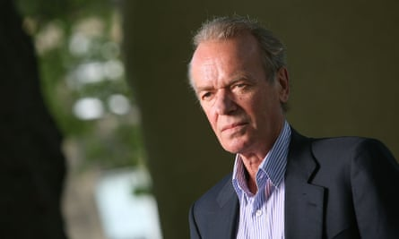

Martin Amis recalls his ‘velvet-suited, snakeskin-booted’ youth. Photograph: Jeremy Sutton-Hibbert/Getty Images  
Martin Amis 回忆起他的“天鹅绒套装，蛇皮靴”青年时代。照片：Jeremy Sutton-Hibbert/Getty Images  

## 36

## **Experience 经验**

## by Martin Amis (2000) 马丁·艾米斯 (2000)

Known for the firecracker phrases and broad satires of his fiction, Amis presented a much warmer face in his memoir. His life is haunted by the disappearance of his cousin Lucy, who is revealed 20 years later to have been murdered by Fred West. But Amis also has much fun recollecting his “velvet-suited, snakeskin-booted” youth, and paints a moving portrait of his father’s comic gusto as old age reduces him to a kind of “anti-Kingsley”.

艾米斯以其小说中的爆竹短语和宽泛的讽刺而闻名，在他的回忆录中展现了一张温暖得多的面孔。他的生活被表妹露西的失踪所困扰，20 年后露西被揭露是被弗雷德·韦斯特谋杀的。但 Amis 也很喜欢回忆他“身穿天鹅绒西装、脚穿蛇皮靴”的青年时代，并描绘了他父亲在晚年沦为某种“反金斯莱”时的喜剧热情的动人肖像。

  
_[Read the review](https://www.theguardian.com/books/2000/may/20/biography.martinamis) 阅读评论_

## 35

## **The Hare with Amber Eyes 琥珀色眼睛的野兔**

## by Edmund de Waal (2010) 埃德蒙·德瓦尔 (Edmund de Waal) (2010)

In this exquisite family memoir, the ceramicist explains how he came to inherit a collection of 264 _netsuke_ – small Japanese ornaments – from his great-uncle. The unlikely survival of the _netsuke_ entails De Waal telling a story that moves from Paris to Austria under the Nazis to Japan, and he beautifully conjures a sense of place. The book doubles as a set of profound reflections on objects and what they mean to us.

在这本精美的家庭回忆录中，这位陶艺家解释了他如何从他的叔祖父那里继承了 264 根根付（日本小饰品）的收藏。根付不太可能幸存下来，德瓦尔讲述了一个从纳粹统治下的巴黎到奥地利再到日本的故事，他巧妙地唤起了一种地方感。这本书兼作一系列对物体及其对我们的意义的深刻思考。

  
_[Read the review](https://www.theguardian.com/books/2010/jun/26/hare-amber-eyes-de-waal) 阅读评论_

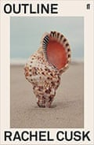

Outline by Rachel Cusk  大纲雷切尔卡斯克

## 34

## **Outline by Rachel 雷切尔的大纲**

## Cusk (2014) 卡斯克 (2014)

This startling work of autofiction, which signalled a new direction for Cusk, follows an author teaching a creative writing course over one hot summer in Athens. She leads storytelling exercises. She meets other writers for dinner. She hears from other people about relationships, ambition, solitude, intimacy and “the disgust that exists indelibly between men and women”. The end result is sublime.

这部令人吃惊的自传小说作品标志着卡斯克的新方向，讲述了一位作家在一个炎热的夏天在雅典教授创意写作课程的故事。她领导讲故事练习。她和其他作家共进晚餐。她从其他人那里听到关于人际关系、野心、孤独、亲密关系和“男女之间不可磨灭的厌恶”的故事。最终的结果是崇高的。

[Read the review 阅读评论](https://www.theguardian.com/books/2014/sep/03/outline-rachel-cusk-review-novel)

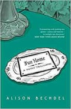

Fun Home by Alison Bechdel  Fun Home by Alison Bechdel

## 33

## **Fun Home 欢乐之家**

## by Alison Bechdel (2006) 艾莉森·贝克德尔 (2006)

The American cartoonist’s darkly humorous memoir tells the story of how her closeted gay father killed himself a few months after she came out as a lesbian. This pioneering work, which later became a musical, helped shape the modern genre of “graphic memoir”, combining detailed and beautiful panels with remarkable emotional depth.

这位美国漫画家的黑色幽默回忆录讲述了她出柜几个月后，她出柜的同性恋父亲如何自杀的故事。这部后来成为音乐剧的开创性作品帮助塑造了“图解回忆录”的现代流派，将细节精美的画面与非凡的情感深度相结合。

  
_[Read the review](https://www.theguardian.com/books/booksblog/2013/dec/28/comfort-reading-alison-bechdel-fun-home) 阅读评论_

## 32

## **The Emperor of All Maladies 万病之王**

## by Siddhartha Mukherjee (2010) 悉达多慕克吉 (2010)

“Normal cells are identically normal; malignant cells become unhappily malignant in unique ways.” In adapting the opening lines of _Anna Karenina_, Mukherjee sets out the breathtaking ambition of his study of cancer: not only to share the knowledge of a practising oncologist but to take his readers on a literary and historical journey.

“正常细胞同样正常；不幸的是，恶性细胞以独特的方式变得恶性。”在改编安娜卡列尼娜的开场白时，穆克吉提出了他研究癌症的惊人抱负：不仅要分享执业肿瘤学家的知识，还要带领他的读者踏上文学和历史之旅。

  
_[Read the review](https://www.theguardian.com/books/2011/jan/23/emperor-maladies-biography-cancer-siddhartha-mukherjee-review) 阅读评论_

## 31

## **The Argonauts 阿尔戈英雄**

## by Maggie Nelson (2015) 玛吉尼尔森 (2015)

An electrifying memoir that captured a moment in thinking about gender, and also changed the world of books. The story, told in fragments, is of Nelson’s pregnancy, which unfolds at the same time as her partner, the artist Harry Dodge, is beginning testosterone injections: “the summer of our changing bodies”. Strikingly honest, originally written, with a galaxy of intellectual reference points, it is essentially a love story; one that seems to make a new way of living possible.

一部激动人心的回忆录捕捉了思考性别的时刻，也改变了图书世界。这个故事以片段的形式讲述，是关于纳尔逊怀孕的故事，与此同时，她的伴侣艺术家哈里道奇开始注射睾丸激素：“我们身体变化的夏天”。出奇地诚实，最初是写的，有大量的知识参考点，它本质上是一个爱情故事；似乎使一种新的生活方式成为可能。

  
_[Read the review](https://www.theguardian.com/books/2015/apr/23/the-argonauts-maggie-nelson-review-harry-dodge-transgender) 阅读评论_

## 30

## **The Underground Railroad 地下铁路**

## by Colson Whitehead (2016) 科尔森怀特黑德 (2016)

A thrilling, genre-bending tale of escape from slavery in the American deep south, this Pulitzer prize-winner combines extraordinary prose and uncomfortable truths. Two slaves flee their masters using the underground railroad, the network of abolitionists who helped slaves out of the south, wonderfully reimagined by Whitehead as a steampunk vision of a literal train.

这位普利策奖获得者讲述了美国南部腹地逃离奴隶制的激动人心、风格迥异的故事，结合了非凡的散文和令人不安的真相。两名奴隶使用地下铁路逃离他们的主人，这是一个帮助奴隶离开南方的废奴主义者网络，怀特海将其奇妙地重新想象为蒸汽朋克对文字火车的想象。

  
_[Read the review](https://www.theguardian.com/books/2016/oct/09/the-underground-railroad-colson-whitehead-revie-luminous-furious-wildly-inventive) 阅读评论_

Uncomfortable truths … Colson Whitehead. Photograph: Ramin Talaie  
Uncomfortable 真相……Colson Whitehead。摄影：Ramin Talaie  

## 29

## **A Death in the Family 一个家庭的死亡**

## by Karl Ove Knausgaard (2009), translated by Don Bartlett (2012)  
作者：Karl Ove Knausgaard (2009)，由 Don Bartlett 翻译 (2012)  

The first instalment of Knausgaard’s relentlessly self-examining six-volume series My Struggle revolves around the life and death of his alcoholic father. Whether or not you regard him as the Proust of memoir, his compulsive honesty created a new benchmark for autofiction.

Knausgaard 坚持不懈地自我审视的六卷系列《我的奋斗》的第一部分围绕着他酗酒的父亲的生死展开。无论您是否将他视为回忆录中的普鲁斯特，他强迫性的诚实为自传小说创造了新的基准。

[Read the review 阅读评论](https://www.theguardian.com/books/2012/apr/25/death-in-family-karl-ove-knausgaard-review)

## 28

## **Rapture 狂喜**

## by Carol Ann Duffy (2005) 卡罗尔·安·达菲 (2005)

A moving, book-length poem from the UK’s first female poet laureate, _Rapture_ won the TS Eliot prize in 2005. From falling in love to betrayal and separation, Duffy reimagines romance with refreshing originality.

Rapture 是英国第一位女桂冠诗人的感人长诗，于 2005 年获得 TS 艾略特奖。从坠入爱河到背叛和分离，Duffy 以令人耳目一新的独创性重新构想了浪漫。

  
_[Read the review](https://www.theguardian.com/books/2006/jan/07/featuresreviews.guardianreview19) 阅读评论_

## 27

## **Hateship, Friendship, Courtship, Loveship, Marriage  
仇恨，友谊，求爱，爱情，婚姻  
**

## by Alice Munro (2001) 爱丽丝·蒙罗 (2001)

Canada’s observant and humane short story writer, who won the Nobel in 2013, is at her best in this collection. A housekeeper’s fate is changed by the pranks of her employer’s teenager daughter; an incorrigible flirt gracefully accepts his wife’s new romance in her care home. No character acts as at first expected in Munro’s stories, which are attuned to the tiniest shifts in perception.

2013 年获得诺贝尔奖的加拿大观察力敏锐且富有人情味的短篇小说作家在这本合集中表现最佳。雇主未成年女儿的恶作剧改变了女管家的命运；一个不可救药的调情者优雅地接受了他妻子在疗养院的新恋情。在门罗的故事中，没有一个角色表现得像最初预期的那样，这些故事与感知中最微小的变化相协调。

  
_[Read the review](https://www.theguardian.com/books/2001/nov/10/fiction.murielspark) 阅读评论_

## 26

## **Capital in the Twenty First Century  
二十一世纪的资本  
**

## by Thomas Piketty (2013), translated by Arthur Goldhammer (2014)  
Thomas Piketty (2013)，Arthur Goldhammer (2014) 翻译  

The beautifully written product of 15 years of research, _Capital_ made its author an intellectual star – the modern Marx – and opened readers’ eyes to how neoliberalism produces vastly increased inequalities. Full of data, theories and historical analysis, its message is clear, and prophetic: unless governments increase tax, the new and grotesque wealth levels of the rich will encourage political instability.

《资本论》是 15 年研究的精美作品，使其作者成为知识分子明星——现代马克思——并让读者看到新自由主义如何导致不平等现象急剧增加。它充满了数据、理论和历史分析，信息清晰且具有预见性：除非政府增加税收，否则富人新奇的财富水平将助长政治动荡。

  
_[Read the review](https://www.theguardian.com/books/2014/jul/17/capital-twenty-first-century-thomas-piketty-review) 阅读评论_

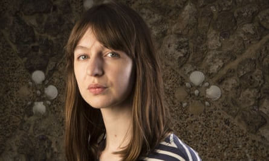

Sally Rooney focuses on the uncertainty of millennial life. Photograph: Richard Saker/The Observer  
Sally Rooney 关注千禧一代生活的不确定性。摄影：Richard Saker/The Observer  

## 25

## **Normal People 普通人**

## by Sally Rooney (2018) 莎莉·鲁尼 (2018)

Rooney’s second novel, a love story between two clever and damaged young people coming of age in contemporary Ireland, confirmed her status as a literary superstar. Her focus is on the dislocation and uncertainty of millennial life, but her elegant prose has universal appeal.

鲁尼的第二部小说讲述了两个在当代爱尔兰成年的聪明而受损的年轻人之间的爱情故事，确立了她作为文学巨星的地位。她的重点是千禧一代生活的错位和不确定性，但她优雅的散文具有普遍的吸引力。

  
_[Read the review](https://www.theguardian.com/books/2018/sep/01/normal-people-sally-rooney-review) 阅读评论_

## 24

## **A Visit from The Goon Squad  
打手小队来访  
**

## by Jennifer Egan (2011) 詹妮弗·伊根 (2011)

Inspired by both Proust and _The Sopranos_, Egan’s Pulitzer-winning comedy follows several characters in and around the US music industry, but is really a book about memory and kinship, time and narrative, continuity and disconnection.

伊根这部获得普利策奖的喜剧受到普鲁斯特和黑道家族的启发，讲述了美国音乐界内外的几个角色，但实际上是一本关于记忆和亲属关系、时间和叙事、连续性和分离的书。

  
_[Read the review](https://www.theguardian.com/books/2011/apr/02/jennifer-egan-goon-squad-review) 阅读评论_

## 23

## **The Noonday Demon 正午恶魔**

## by Andrew Solomon (2001) 安德鲁·所罗门 (2001)

Emerging from Solomon’s own painful experience, this “anatomy” of depression examines its many faces – plus its science, sociology and treatment. The book’s combination of honesty, scholarly rigour and poetry made it a benchmark in literary memoir and understanding of mental health.

从所罗门自己的痛苦经历中脱颖而出，这种抑郁症的“解剖学”审视了它的许多方面——加上它的科学、社会学和治疗。这本书将诚实、学术严谨和诗歌相结合，使其成为文学回忆录和理解心理健康的标杆。

[Read the review 阅读评论](https://www.theguardian.com/books/2001/may/19/booksonhealth)

## 22

## **Tenth of December 十二月十日**

## by George Saunders (2013) 乔治·桑德斯 (2013)

This warm yet biting collection of short stories by the Booker-winning American author will restore your faith in humanity. No matter how weird the setting – a futuristic prison lab, a middle-class home where human lawn ornaments are employed as a status symbol – in these surreal satires of post-crash life Saunders reminds us of the meaning we find in small moments.

这位获得布克奖的美国作家所著的这本温暖而辛辣的短篇小说集将重振您对人性的信心。无论场景多么古怪——一个未来主义的监狱实验室，一个中产阶级家庭，其中人类的草坪装饰品被用作身份的象征——在这些对崩溃后生活的超现实主义讽刺中，桑德斯提醒我们在小时刻发现的意义。

  
_[Read the review](https://www.theguardian.com/books/2013/jan/06/tenth-december-george-saunders-review) 阅读评论_

Chart-topping history of humanity … Yuval Noah Harari. Photograph: Olivier Middendorp  
Chart-topping 人类历史...... Yuval Noah Harari。摄影：奥利维尔·米登多普  

## 21

## **Sapiens 智人**

## by Yuval Noah Harari (2011), translated by Harari with John Purcell and Haim Watzman (2014)  
Yuval Noah Harari (2011)，由 Harari 与 John Purcell 和 Haim Watzman 翻译 (2014)  

In his Olympian history of humanity, Harari documents the numerous revolutions Homo sapiens has undergone over the last 70,000 years: from new leaps in cognitive reasoning to agriculture, science and industry, the era of information and the possibilities of biotechnology. Harari’s scope may be too wide for some, but this engaging work topped the charts and made millions marvel.

在他的奥林匹克人类历史中，哈拉里记录了智人在过去 7 万年中经历的无数次革命：从认知推理的新飞跃到农业、科学和工业、信息时代和生物技术的可能性。对某些人来说，哈拉里的范围可能太广了，但这部引人入胜的作品高居排行榜榜首，让数百万人惊叹不已。

  
_[Read the review](https://www.theguardian.com/books/2014/sep/11/sapiens-brief-history-humankind-yuval-noah-harari-review) 阅读评论_

## 20

## **Life After Life 生生世世**

## by Kate Atkinson (2013) 凯特·阿特金森 (2013)

Atkinson examines family, history and the power of fiction as she tells the story of a woman born in 1910 – and then tells it again, and again, and again. Ursula Todd’s multiple lives see her strangled at birth, drowned on a Cornish beach, trapped in an awful marriage and visiting Adolf Hitler at Berchtesgaden. But this dizzying fictional construction is grounded by such emotional intelligence that her heroine’s struggles always feel painfully, joyously real.

阿特金森在讲述一位出生于 1910 年的女性的故事时审视了家庭、历史和虚构的力量——然后一遍又一遍地讲述。乌苏拉·托德 (Ursula Todd) 的多重人生见证了她在出生时被勒死、溺死在康沃尔海滩、陷入糟糕的婚姻并在贝希特斯加登拜访阿道夫·希特勒。但这种令人眼花缭乱的虚构结构是以如此高的情商为基础的，以至于她的女主人公的挣扎总是让人感到痛苦、快乐的真实。

  
_[Read the review](https://www.theguardian.com/books/2013/mar/06/life-after-life-kate-atkinson-review) 阅读评论_

Portrait of an unconventional mind … A stage adaptation of The Curious Incident of the Dog in the Night-Time. Photograph: Alastair Muir/REX/Shutterstock

非传统思维的写照……《深夜小狗奇事》的舞台改编。照片：Alastair Muir/REX/Shutterstock

## 19

## **The Curious Incident of the Dog in the Night‑Time  
夜间狗的奇怪事件  
**

## by Mark Haddon (2003) 马克·哈登 (2003)

Fifteen-year-old Christopher John Francis Boone becomes absorbed in the mystery of a dog’s demise, meticulously investigating through diagrams, timetables, maps and maths problems. Haddon’s fascinating portrayal of an unconventional mind was a crossover hit with both adults and children and was adapted into a very successful stage play.

十五岁的克里斯托弗·约翰·弗朗西斯·布恩全神贯注于一只狗的死亡之谜，通过图表、时间表、地图和数学问题进行细致的调查。哈登对非传统思想的迷人描绘在成人和儿童中大受欢迎，并被改编成非常成功的舞台剧。

[Read the review 阅读评论](https://www.theguardian.com/books/2003/may/24/booksforchildrenandteenagers.bookerprize2003)

## 18

## **The Shock Doctrine 休克主义**

## by Naomi Klein (2007) 娜奥米·克莱因 (2007)

In this urgent examination of free-market fundamentalism, Klein argues – with accompanying reportage – that the social breakdowns witnessed during decades of neoliberal economic policies are not accidental, but in fact integral to the functioning of the free market, which relies on disaster and human suffering to function.

在这篇对自由市场原教旨主义的紧急考察中，克莱因通过相关报道指出，几十年来新自由主义经济政策所见证的社会崩溃并非偶然，而是自由市场运作不可或缺的一部分，而自由市场依赖于灾难和人类难以发挥作用。

  
_[Read the review](https://www.theguardian.com/books/2007/sep/15/politics) 阅读评论_

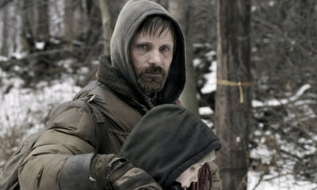

Viggo Mortensen and Kodi Smit-McPhee in The Road, based on Cormac McCarthy’s novel. Photograph: Allstar/Dimension Films/2929 Productions  
Viggo Mortensen 和 Kodi Smit-McPhee 在路上，根据 Cormac McCarthy 的小说改编。照片：Allstar/Dimension Films/2929 Productions  

## 17

## **The Road 马路**

## by Cormac McCarthy (2006) 科马克·麦卡锡 (2006)

A father and his young son, “each the other’s world entire”, trawl across the ruins of post-apocalyptic America in this terrifying but tender story told with biblical conviction. The slide into savagery as civilisation collapses is harrowing material, but McCarthy’s metaphysical efforts to imagine a cold dark universe where the light of humanity is winking out are what make the novel such a powerful ecological warning.

一位父亲和他年幼的儿子，“彼此的整个世界”，在这个以圣经的信念讲述的可怕但温柔的故事中，在后世界末日的美国废墟中搜寻。随着文明的崩溃，滑向野蛮是令人痛心的材料，但麦卡锡试图想象一个寒冷黑暗的宇宙的形而上学努力，人类的光芒正在闪烁，这使这部小说成为如此强大的生态警告。

  
_[Read the review](https://www.theguardian.com/books/2006/nov/04/featuresreviews.guardianreview4) 阅读评论_

## 16

## **The Corrections 更正**

## by Jonathan Franzen (2001) 乔纳森·弗兰岑 (2001)

The members of one ordinarily unhappy American family struggle to adjust to the shifting axes of their worlds over the final decades of the 20th century. Franzen’s move into realism reaped huge literary rewards: exploring both domestic and national conflict, this family saga is clever, funny and outrageously readable.

在 20 世纪的最后几十年里，一个通常不幸的美国家庭的成员努力适应他们世界不断变化的轴心。弗兰岑转向现实主义获得了巨大的文学回报：探索国内和国家冲突，这部家庭传奇巧妙、有趣且可读性极强。

  
_[Read the review](https://www.theguardian.com/books/2001/nov/09/fiction.reviews) 阅读评论_

## 15

## **The Sixth Extinction 第六次灭绝**

## by Elizabeth Kolbert (2014)

The science journalist examines with clarity and memorable detail the current crisis of plant and animal loss caused by human civilisation (over the past half billion years, there have been five mass extinctions on Earth; we are causing another). Kolbert considers both ecosystems – the Great Barrier Reef, the Amazon rainforest – and the lives of some extinct and soon-to-be extinct creatures including the Sumatran rhino and “the most beautiful bird in the world”, the black-faced honeycreeper of Maui.[Read the review](https://www.theguardian.com/books/2014/feb/14/sixth-extinction-unnatural-history-kolbert-review)

A smart study of innocence and experience … Sarah Waters. Photograph: Jeremy Sutton-Hibbert/Getty Images

## 14

## **Fingersmith**

## by Sarah Waters (2002)

Moving from the underworld dens of Victorian London to the boudoirs of country house gothic, and hingeing on the seduction of an heiress, Waters’s third novel is a drippingly atmospheric thriller, a smart study of innocence and experience, and a sensuous lesbian love story – with a plot twist to make the reader gasp.  
_[Read the review](https://www.theguardian.com/books/2002/feb/02/fiction.sarahwaters)_

## 13

## **Nickel and Dimed**

## by Barbara Ehrenreich (2001)

In this modern classic of reportage, Ehrenreich chronicled her attempts to live on the minimum wage in three American states. Working first as a waitress, then a cleaner and a nursing home aide, she still struggled to survive, and the stories of her co-workers are shocking. The US economy as she experienced it is full of routine humiliation, with demands as high as the rewards are low. Two decades on, this still reads like urgent news.  
_[Read the review](https://www.theguardian.com/books/2002/aug/31/highereducation.shopping)_

## 12

## **The Plot Against America**

## by Philip Roth (2004)

What if aviator Charles Lindbergh, who once called Hitler “a great man”, had won the US presidency in a landslide victory and signed a treaty with Nazi Germany? Paranoid yet plausible, Roth’s alternative-world novel is only more relevant in the age of Trump.  
_[Read the review](https://www.theguardian.com/books/2004/oct/02/fiction.philiproth)_

## 11

## **My Brilliant Friend**

## by Elena Ferrante (2011), translated by Ann Goldstein (2012)

Powerfully intimate and unashamedly domestic, the first in [Ferrante’s Neapolitan series](https://www.theguardian.com/books/2014/oct/31/elena-ferrante-literary-sensation-nobody-knows) established her as a literary sensation. This and the three novels that followed documented the ways misogyny and violence could determine lives, as well as the history of Italy in the late 20th century.

## 10

## **Half of a Yellow Sun**

## by Chimamanda Ngozi Adichie (2006)

When Nigerian author Adichie was growing up, the Biafran war “hovered over everything”. Her sweeping, evocative novel, which won the Orange prize, charts the political and personal struggles of those caught up in the conflict and explores the brutal legacy of colonialism in Africa.  
_[Read the review](https://www.theguardian.com/books/2006/aug/19/fiction.shopping2)_

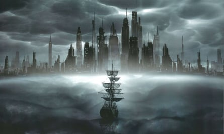

Dizzying narratives … the 2012 film adaptation of Cloud Atlas. Photograph: Allstar/Warner Bros Pictures/Sportsphoto Ltd/Allstar

## 9

## **Cloud Atlas**

## David Mitchell (2004)

The epic that made Mitchell’s name is a Russian doll of a book, nesting stories within stories and spanning centuries and genres with aplomb. From a 19th-century seafarer to a tale from beyond the end of civilisation, via 1970s nuclear intrigue and the testimony of a future clone, these dizzying narratives are delicately interlinked, highlighting the echoes and recurrences of the vast human symphony.  
_[Read the review](https://www.theguardian.com/books/2004/mar/06/fiction.asbyatt)_

## 8

## **Autumn**

## by Ali Smith (2016)

Smith began writing her Seasonal Quartet, a still-ongoing experiment in quickfire publishing, against the background of the EU referendum. The resulting “first Brexit novel” isn’t just a snapshot of a newly divided Britain, but a dazzling exploration into love and art, time and dreams, life and death, all done with her customary invention and wit.  
_[Read the review](https://www.theguardian.com/books/2016/oct/12/autumn-ali-smith-review)_

A meditation on what it means to be a black American today … Ta-Nehisi Coates. Photograph: Shahar Azran/WireImage

## 7

## **Between the World and Me**

## by Ta-Nehisi Coates (2015)

Coates’s impassioned meditation on what it means to be a black American today made him one of the country’s most important intellectuals and writers. Having grown up the son of a former Black Panther on the violent streets of Baltimore, he has a voice that is challenging but also poetic. _Between the World and Me_ takes the form of a letter to his teenage son, and ranges from the daily reality of racial injustice and police violence to the history of slavery and the civil war: white people, he writes, will never remember “the scale of theft that enriched them”.  
_[Read the review](https://www.theguardian.com/books/2015/oct/08/between-the-world-and-me-sukhdev-sandhu-review)_

## 6

## **The Amber Spyglass**

## by Philip Pullman (2000)

Children’s fiction came of age when the final part of Pullman’s His Dark Materials trilogy became the first book for younger readers to win the Whitbread book of the year award. Pullman has brought imaginative fire and storytelling bravado to the weightiest of subjects: religion, free will, totalitarian structures and the human drive to learn, rebel and grow. Here Asriel’s struggle against the Authority reaches its climax, Lyra and Will journey to the Land of the Dead, and Mary investigates the mysterious elementary particles that lend their name to his current trilogy: The Book of Dust. The Hollywood-fuelled commercial success achieved by JK Rowling may have eluded Pullman so far, but his sophisticated reworking of _Paradise Lost_ helped adult readers throw off any embarrassment at enjoying fiction written for children – and publishing has never looked back.  
_[Read the review](https://www.theguardian.com/books/2000/oct/28/booksforchildrenandteenagers.philippullman)_

## 5

## **Austerlitz**

## by WG Sebald (2001), translated by Anthea Bell (2001)

Sebald died in a car crash in 2001, but his genre-defying mix of fact and fiction, keen sense of the moral weight of history and interleaving of inner and outer journeys have had a huge influence on the contemporary literary landscape. His final work, the typically allusive life story of one man, charts the Jewish disapora and lost 20th century with heartbreaking power. _[Read the review](https://www.theguardian.com/books/2001/sep/29/fiction.reviews3)_

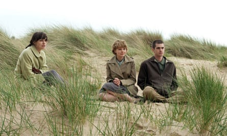

From left: Keira Knightley, Carey Mulligan and Andrew Garfield in the 2010 film adaptation of Never Let Me Go. Photograph: FoxSearch/Everett/Rex Features

## 4

## **Never Let Me Go**

## by Kazuo Ishiguro (2005)

From his 1989 Booker winner _The Remains of the Day_ to 2015’s _The Buried Giant_, Nobel laureate Ishiguro writes profound, puzzling allegories about history, nationalism and the individual’s place in a world that is always beyond our understanding. His sixth novel, a love triangle set among human clones in an alternative 1990s England, brings exquisite understatement to its exploration of mortality, loss and what it means to be human.  
_[Read the review](https://www.theguardian.com/books/2005/feb/26/bookerprize2005.bookerprize)_

## 3

## **Secondhand Time**

## by Svetlana Alexievich (2013), translated by Bela Shayevich (2016)

The [Belarusian Nobel laureate](https://www.theguardian.com/books/svetlana-alexievich) recorded thousands of hours of testimony from ordinary people to create this oral history of the Soviet Union and its end. Writers, waiters, doctors, soldiers, former Kremlin apparatchiks, gulag survivors: all are given space to tell their stories, share their anger and betrayal, and voice their worries about the transition to capitalism. An unforgettable book, which is both an act of catharsis and a profound demonstration of empathy.

## 2

## **Gilead**

## by Marilynne Robinson (2004)

Robinson’s meditative, deeply philosophical novel is told through letters written by elderly preacher John Ames in the 1950s to his young son who, when he finally reaches an adulthood his father won’t see, will at least have this posthumous one-sided conversation: “While you read this, I am imperishable, somehow more alive than I have ever been.” This is a book about legacy, a record of a pocket of America that will never return, a reminder of the heartbreaking, ephemeral beauty that can be found in everyday life. As Ames concludes, to his son and himself: “There are a thousand thousand reasons to live this life, every one of them sufficient.”  
_[Read the review](https://www.theguardian.com/books/2005/apr/16/fiction.alismith)_

Hilary Mantel captures ‘a sense of history listening and talking to itself’. Photograph: David Levenson/Getty Images

## 1

## **Wolf Hall**

## by Hilary Mantel (2009)

Mantel had been publishing for a quarter century before the project that made her a phenomenon, set to be concluded with the third part of the trilogy, _The Mirror and the Light_, next March. To read her story of the rise of Thomas Cromwell at the Tudor court, detailing the making of a new England and the self-creation of a new kind of man, is to step into the stream of her irresistibly authoritative present tense and find oneself looking out from behind her hero’s eyes. The surface details are sensuously, vividly immediate, the language as fresh as new paint; but her exploration of power, fate and fortune is also deeply considered and constantly in dialogue with our own era, as we are shaped and created by the past. In this book we have, as she intended, “a sense of history listening and talking to itself”.  
_[Read the review](https://www.theguardian.com/books/2009/may/02/wolf-hall-hilary-mantel)_
