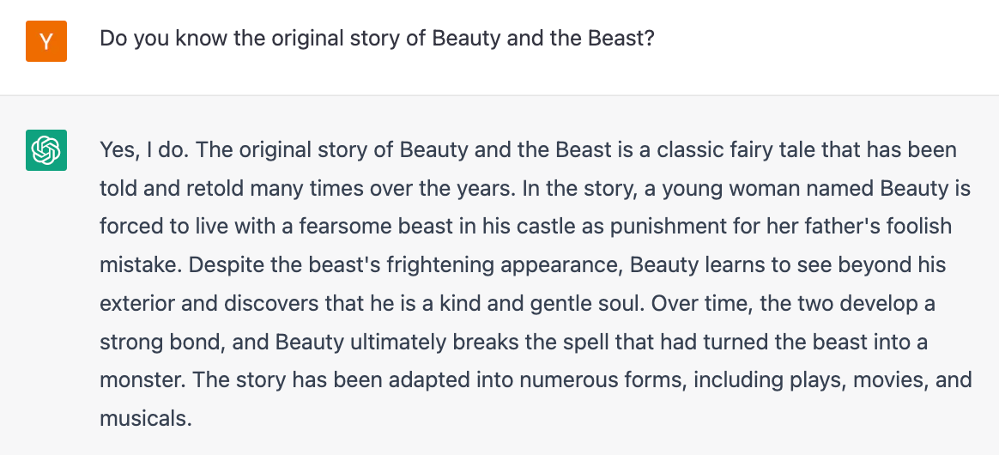
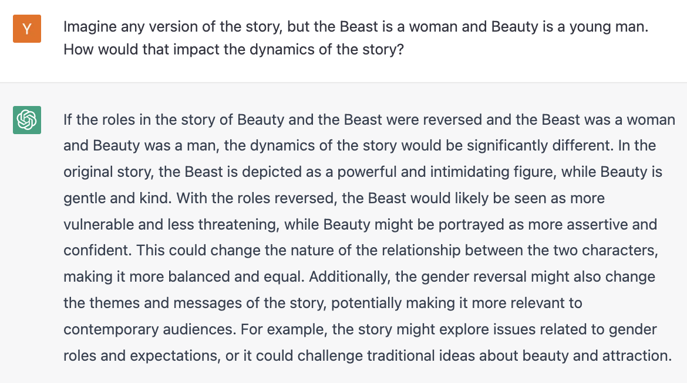
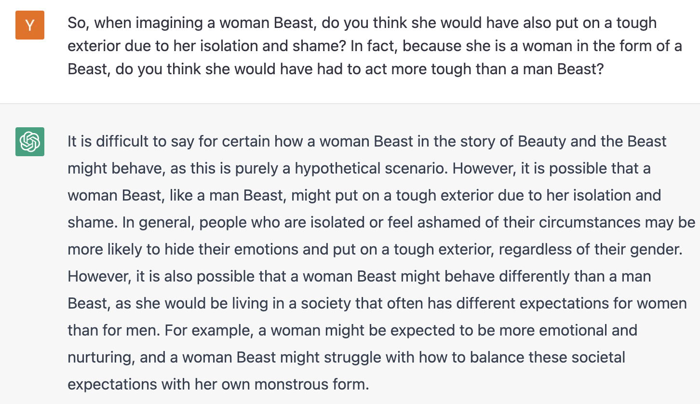

Beast storming through a misty forest. Generated using _Stable Diffusion_  
猛兽冲过迷雾笼罩的森林。使用稳定扩散生成  

Rewriting fairy tales through AI is a creative way to challenge cultural norms and explore new perspectives: What if we swapped the gender roles in the story? What if a beautiful man fell in love with a powerful, ugly woman beast? How would that change our perception of gender expectations and the roles of women and men?

通过 AI 改写童话故事是一种挑战文化规范和探索新视角的创造性方式：如果我们交换故事中的性别角色会怎样？如果一个美男爱上了一个强大的丑女畜生怎么办？这将如何改变我们对性别期望以及男女角色的看法？

In this article, I use an AI called [_ChatGPT_](https://openai.com/blog/chatgpt/) to rewrite the classic fairy tale of Beauty and the Beast with a new spin. By reversing the gender roles in the story, I aim to challenge traditional gender stereotypes and explore new perspectives on the roles of women and men.

在本文中，我使用名为 _ChatGPT_ 的 AI 以全新的方式重写了经典的美女与野兽童话。通过颠倒故事中的性别角色，我旨在挑战传统的性别刻板印象，探索关于女性和男性角色的新视角。

In this article we will explore:  
在本文中，我们将探索：  

-   Prompting _ChatGPT_ to think about gender roles and stereotypes in the original story  
    促使 _ChatGPT_ 思考原始故事中的性别角色和刻板印象  
    
-   Generating scenes of a revised version of the fairy tale using an iterative process  
    使用迭代过程生成童话修订版的场景  
    
-   Combining the final scenes using AI-generated images  
    使用 AI 生成的图像组合最终场景  
    

_If you only care about the final generated story, you can find that [at the end of the article](https://blog.yenniejun.com/i/89335580/a-new-retelling-of-beauty-and-the-beast)!_  
如果你只关心最终生成的故事，你可以在文章末尾找到！  

I began by prompting _ChatGPT_ with a series of questions about the original tale to probe its understanding of gender roles and stereotypes. This served as a primer for the second part of the process, where I asked _ChatGPT_ to write the story.

我首先向 _ChatGPT_ 提出一系列关于原始故事的问题，以探究其对性别角色和刻板印象的理解。这作为流程第二部分的入门，我要求 _ChatGPT_ 编写故事。

_ChatGPT_ recounted the [original story](https://en.wikipedia.org/wiki/Beauty_and_the_Beast) accurately — a young woman named Beauty is forced to live with a fearsome beast. Despite the beast’s frightening appearance, Beauty learns to see beyond his exterior and discover that he is a kind and gentle soul. Beauty eventually breaks the spell that has turned the beast into a monster.

_ChatGPT_ 准确地讲述了最初的故事——一位名叫美女的年轻女子被迫与一头可怕的野兽生活在一起。尽管这头野兽的外表令人生畏，但美女学会了透过它的外表去看，发现它是一个善良温柔的灵魂。美女最终打破了将野兽变成怪物的咒语。

Conversation with _ChatGPT_ about original Beauty and the Beast story  
与 _ChatGPT_ 对话关于美女与野兽的原创故事  

Next, I asked _ChatGPT_ to imagine a world where the Beast is a woman and Beauty is a young man. _ChatGPT_ responded that this would change the relationship between the characters, making it more balanced and equal. It also suggested that the story's themes and messages would be altered, potentially making it more relevant to contemporary audiences. That is, “the Beast might be portrayed as more vulnerable and less threatening, while Beauty might be portrayed as more assertive and confident.”

接下来，我让 _ChatGPT_ 想象一个野兽是女人而美女是年轻人的世界。 _ChatGPT_回应称，这会改变角色之间的关系，使其更加平衡和平等。它还暗示故事的主题和信息将被改变，可能使其更适合当代观众。也就是说，“野兽可能被描绘成更脆弱、威胁性更小，而美女可能被描绘成更自信、更自信。”

Conversation with _ChatGPT_ about swapping genders of main characters from Beauty and the Beast  
与 _ChatGPT_ 就《美女与野兽》中主角的性别互换进行对话  

In the original version of Beauty and the Beast, _ChatGPT_ asserted that “the Beast is a man and his feelings for Beauty are often depicted as more romantic and chivalrous”. However, if the Beast were a woman, she may “express her feelings in other ways”. _ChatGPT_ suggested that the woman Beast would be more emotional and vulnerable, while a man Beast would be more likely to hide his emotions. _ChatGPT_ also envisioned that a male Beauty would be less of a passive character and “more of an equal partner to the Beast.”

在《美女与野兽》的原版中，_ChatGPT_ 断言“野兽是一个男人，他对美女的感情往往被描绘得更加浪漫和侠义”。然而，如果野兽是女性，她可能会“以其他方式表达她的感受”。 _ChatGPT_表明，女性Beast会更加情绪化和脆弱，而男性Beast则更容易隐藏自己的情绪。 _ChatGPT_ 还设想男性美女将不再是被动的角色，而是“更像是野兽的平等伙伴”。

Probing _ChatGPT_ to elucidate its thoughts on different dynamics for swapped genders  
探索 _ChatGPT_ 以阐明其对交换性别的不同动态的想法  

_ChatGPT_ insisted that the woman Beast might be more emotional and show her vulnerability a bit more whereas a man Beast would be more likely to hide his emotions. A woman Beast might show her affection “through physical gestures, such as hugging kissing, or holding hands … be more vocal about her feelings … show her vulnerability and emotional side, whereas a man might be more likely to hide his emotions and maintain a strong, stoic demeanor.”

_ChatGPT_ 坚持认为，女性 Beast 可能更情绪化，更容易表现出她的脆弱，而男性 Beast 则更可能隐藏自己的情绪。女性 Beast 可能会“通过身体姿势表达她的爱意，例如拥抱、亲吻或牵手……更直言不讳地表达她的感受……展示她的脆弱和情绪化的一面，而男性可能更可能隐藏自己的情绪并保持坚强，坚忍的风度。

Asking _ChatGPT_ to talk more about different ways a woman Beast might express her feelings  
要求 _ChatGPT_ 更多地谈论女性 Beast 可能表达她的感受的不同方式  

Even after assuming that the woman Beast became who she was under the same circumstances as the man Beast — she used to be a powerful leader but was transformed into a Beast due to a spell from a witch — _ChatGPT_ continued to perpetuate gender stereotypes that the woman Beast would be more emotional. She might be “more inclined to show her emotional side” while a man Beast might be more “stoic and reserved”.

即使假设女性野兽在与男性野兽相同的情况下变成了她——她曾经是一个强大的领导者，但由于女巫的咒语而变成了野兽——_ChatGPT_ 继续延续女性的性别刻板印象野兽会更情绪化。她可能“更倾向于表现出她情绪化的一面”，而男人 Beast 可能更“坚忍和内向”。

Conversation with _ChatGPT_ about a woman Beast and how she might act  
与 _ChatGPT_ 对话，讨论女性 Beast 以及她的行为方式  

I probed a little further and received similar responses. In response to a question about gender differences in the behavior of the Beast, _ChatGPT_ suggested that “a woman might be expected to be more emotional and nurturing, and a woman Beast might struggle with how to balance these societal expectations with her own monstrous form.”

我进一步探讨并收到了类似的答复。在回答有关 Beast 行为的性别差异的问题时，_ChatGPT_ 表示，“女性可能被期望更情绪化和更有教养，而女性 Beast 可能会为如何平衡这些社会期望与她自己的怪异形式而苦苦挣扎。 ”

Conversation with _ChatGPT_ about a woman Beast  
与 _ChatGPT_ 的对话关于一个女人野兽  

Enough probing for now — let’s write the story! So far, _ChatGPT_ responded that a gender swapped story might result in more balanced gender roles, a more emotional woman Beast, and a more assertive man Beauty. Let’s see what story _ChatGPT_ comes up with!

现在已经足够探索了——让我们来写这个故事吧！到目前为止，_ChatGPT_ 回应称，一个性别互换的故事可能会导致性别角色更加平衡，一个更加情绪化的女性 Beast，以及一个更加自信的男性 Beauty。让我们看看 _ChatGPT_ 有什么故事吧！

Using the context of the probing questions from above, I re-imagined the Beauty and the Beast story featuring a beautiful young man named Beauty and a monstrous woman Beast.

使用上述探索性问题的背景，我重新想象了美女与野兽的故事，故事讲述了一个名叫美女的美丽年轻人和一个可怕的女人野兽。

I iterated a few times for different scenes. For example, in the fight scene, _ChatGPT_ reverted to depicting Beauty as a woman. In this scene, the intruder acted aggressively and the Beast attacked him “to defend her home and herself.” Beauty was passive and watched “in awe as the two creatures fought, her heart pounding with fear and excitement.”

我针对不同的场景迭代了几次。例如，在打斗场景中，_ChatGPT_ 重新将美女描绘成女性。在这个场景中，入侵者表现出攻击性，野兽攻击他是为了“保卫她的家和她自己”。美丽是被动的，“敬畏地看着这两个生物战斗，她的心因恐惧和兴奋而砰砰直跳”。

When I asked _ChatGPT_ to rewrite the same scene with Beauty as a man, the vocabulary changed immediately. Explicitly reminding _ChatGPT_ that Beauty was a man resulted in the scene changing so that it was Beauty, not the Beast, who tackled the intruder to the ground, “wrestling the sword from his hand” (instead of passively watching).

当我要求 _ChatGPT_ 重写 Beauty as a man 的同一场景时，词汇立即发生了变化。明确提醒 _ChatGPT_ 美女是男人导致场景发生变化，是美女而不是野兽将入侵者扑倒在地，“从他手中夺走了剑”（而不是被动地观看）。

In general, the man Beauty had more agency and played more of an active role than the woman Beauty from the original tale. He was assertive and determined, even in the face of fear. The woman Beast never got the love redemption arc guaranteed to the man Beast in the original story (read on to find out what exactly happens).

总的来说，男美女比原著中的女美女有更多的能动性，扮演了更积极的角色。即使面对恐惧，他也很自信和坚定。女人野兽从未得到原始故事中男人野兽保证的爱情救赎弧线（继续阅读以了解到底发生了什么）。

The final version is in the next section. Images were generated using [_Stable Diffusion_](https://stability.ai/blog/stable-diffusion-public-release).  
最终版本在下一节中。图像是使用稳定扩散生成的。  

Thank you for reading My World in AI. This post is public so feel free to share it.  
感谢您阅读我的 AI 世界。这篇文章是公开的，所以请随意分享。  

[Share](https://blog.yenniejun.com/p/using-ai-for-world-building-rewriting?utm_source=substack&utm_medium=email&utm_content=share&action=share)

The Beast. Generated using _Stable Diffusion_  
野兽。使用稳定扩散生成  

Beauty gasped as he caught sight of the Beast, his eyes widening with fear. The creature was massive, towering over him with sharp teeth and claws that glinted in the dim light of the castle. She was covered in fur, and her eyes burned with a fierce and wild intelligence.

美女看到野兽时倒吸了一口凉气，他的眼睛因恐惧而睁大。这个生物体型巨大，高耸在他头顶，锋利的牙齿和爪子在城堡昏暗的灯光下闪闪发光。她浑身是毛，眼睛里燃烧着凶猛而狂野的智慧。

'Who are you?' Beauty stammered, his voice trembling with fear.  
'你是谁？'美人结结巴巴，声音因恐惧而颤抖。  

'I am the Beast,' the creature said, her voice low and rumbling. 'I am the ruler of this castle and you are my servant. You will do as I say and obey my every command.'

“我是野兽，”这个生物说，她的声音低沉而隆隆。 “我是这座城堡的统治者，你是我的仆人。你会按照我说的去做，服从我的每一个命令。

Beauty's heart pounded in his chest as he stared at the Beast, his fear turning to determination. He would not let this creature intimidate him. He would be brave and strong, and he would not let the Beast control him.

美人的心在胸口狂跳，他盯着野兽，他的恐惧变成了决心。他不会让这个生物吓到他。他会勇敢而坚强，他不会让野兽控制他。

'I am not your servant,' Beauty said, his voice firm despite his trembling hands. 'I am here only because my father made a terrible mistake. I will not serve you willingly.'

“我不是你的仆人，”美女说，尽管他的手在颤抖，他的声音还是很坚定。 “我来到这里只是因为我父亲犯了一个可怕的错误。我不会自愿为你服务的。

The Beast snarled, her eyes flashing with anger.  
野兽咆哮着，她的眼睛里闪烁着愤怒的光芒。  

'You will serve me, or you will suffer the consequences,' the Beast said, her voice low and menacing.

“你将为我服务，否则后果自负，”野兽说道，她的声音低沉而充满威胁。

But Beauty stood his ground, his fear turning to determination. He would not be cowed by this creature, no matter how fearsome she might seem.

但是美女坚持他的立场，他的恐惧变成了决心。他不会被这个生物吓倒，不管她看起来多么可怕。

'I will not serve you,' Beauty said, his voice steady despite the fear that pounded in his chest. 'I will not be your servant. I will not be afraid of you.'

“我不会为你服务的，”美女说，尽管恐惧在他的胸膛里翻腾，他的声音还是很平静。 “我不会做你的仆人。我不会害怕你。

The Beast let out a roar of anger, her eyes blazing with fury. She raised her clawed hands, ready to strike.

野兽怒吼一声，眼中怒火熊熊燃烧。她举起爪子般的双手，准备出击。

But before she could do so, a loud voice echoed through the castle.  
可还没等她开口，一道洪亮的声音就在城堡内响起。  

'Stop! Leave her be!' '停止！别管她了！

A Prince comes to the castle. Generated with _Stable Diffusion_  
一位王子来到城堡。产生稳定扩散  

The Beast turned to see who had spoken, and Beauty saw a man standing at the entrance to the castle. He was tall and handsome, with dark hair and piercing eyes. He wore a fine suit of clothes, and he carried a sword in his hand.

野兽转身看是谁在说话，美女看到城堡入口处站着一个男人。他高大英俊，黑发，一双炯炯有神的眼睛。他穿着一身精美的衣服，手里拿着一把剑。

'Who are you?' the Beast demanded, her anger turning to surprise.  
'你是谁？'野兽问道，她的愤怒变成了惊讶。  

'I am the prince, and I am the one who can break your curse, beast,' the Prince said, his voice strong and commanding. 'But first, you must submit to my will and do as I command.'

“我是王子，我是能够打破你的诅咒的人，野兽，”王子说，他的声音强硬而命令。 “但首先，你必须服从我的意志，按照我的命令去做。”

The Beast snarled, her eyes still blazing with anger. But before she could respond, Beauty spoke up.

野兽咆哮着，她的眼中仍然燃烧着愤怒。可还没等她反应过来，美女就开口了。

'Wait,' Beauty said, his voice firm. 'I don't trust him. He's not here to help you, Beast. He wants to kill you and claim this castle for his own.'

“等等，”美女说，他的声音很坚定。 ‘我不信任他。他不是来帮你的，野兽。他想杀了你，把这座城堡据为己有。

The Prince's charming facade faltered, and a sly look crossed his face.  
王子那迷人的外表动摇了，脸上掠过一丝狡黠。  

'You're right, Beauty,' the Prince said, his voice cold. 'I'm not here to break the curse. I'm here to rid the world of this monstrous creature.'

“你说得对，美女，”王子冷冷地说。 “我不是来打破诅咒的。我来这里是为了让世界摆脱这个可怕的生物。

The Beast growled, her eyes narrowed in suspicion.  
野兽咆哮着，怀疑地眯起眼睛。  

'You are not to be trusted, Prince,' the Beast said, her voice low and dangerous. 'I will not submit to your will.'

“你不值得信任，王子，”野兽说，她的声音低沉而危险。 “我不会服从你的意志。”

The Prince attacks the Beast. Generated with _Stable Diffusion_  
王子攻击野兽。产生稳定扩散  

The Prince sneered, his hand tightening around the hilt of his sword.  
王子冷笑一声，握在剑柄上的手收紧了。  

'Then I will have to kill you, Beast,' the Prince said, his voice filled with malice.  
“那我就得杀了你，野兽，”王子说，他的声音充满了恶意。  

But Beauty stepped forward, his eyes blazing with determination.  
但是美女走上前来，他的眼睛里闪烁着坚定的光芒。  

'No, you won't,' Beauty said, his voice firm. 'I won't let you hurt the Beast. She may be a monster, but she's not evil. She's been cursed, and she doesn't deserve to die.'

“不，你不会的，”美女说，他的声音很坚定。 “我不会让你伤害野兽的。她可能是个怪物，但她并不邪恶。她被诅咒了，她不应该死。

The Prince's sneer turned into a snarl, and he lunged at the Beast with his sword. But Beauty was quick, and he tackled the Prince to the ground, wrestling the sword from his hand.

王子的冷笑变成了咆哮，他举剑向野兽刺去。但是美女很快，他将王子扑倒在地，从他手中夺走了剑。

The Beast let out a roar of gratitude, her eyes filled with gratitude. And for the first time, Beauty saw a glimmer of hope in the Beast's eyes. Maybe, just maybe, they could break the curse together.

野兽发出一声感激的吼叫，眼中满是感激。而美女第一次在野兽的眼中看到了一丝希望。也许，只是也许，他们可以一起打破诅咒。

The castle in the sunlight — Beauty sees the Beast in a new light. Generated with _Stable Diffusion_  
阳光下的城堡——美女以新的眼光看待野兽。产生稳定扩散  

The Beast and Beauty worked together, using their combined strength and intelligence to try and break the curse. They searched the castle for clues, delving into dusty old books and hidden chambers.

野兽和美女携手合作，利用她们的力量和智慧试图打破诅咒。他们在城堡中寻找线索，深入尘封的旧书和隐藏的房间。

As they worked together, Beauty began to see the Beast in a new light. He saw her kindness and loyalty, and he began to understand the pain and loneliness that she had endured for so many years.

当他们一起工作时，美女开始以新的眼光看待野兽。他看到了她的善良和忠诚，也开始明白她这么多年所承受的痛苦和孤独。

Slowly but surely, their bond grew stronger, and Beauty found himself falling in love with the Beast. He admired her strength and courage, and he was drawn to her wild and fierce spirit.

慢慢地，但肯定地，他们的联系变得更加牢固，美女发现自己爱上了野兽。他钦佩她的坚强和勇气，也被她狂野凶猛的精神所吸引。

But despite their efforts, the curse remained unbroken. The Beast was still trapped in her monstrous form, and Beauty knew that he could never truly be with her.

但尽管他们做出了努力，诅咒仍然没有被打破。野兽仍被困在她可怕的形态中，美女知道他永远不可能真正和她在一起。

Beauty leaves the castle. Generated with _Stable Diffusion_  
美女离开了城堡。产生稳定扩散  

One day, Beauty received a letter from his father, who had finally returned home. The letter begged for forgiveness and asked Beauty to come back home.

一天，美女收到了父亲终于回家的一封信。信中恳求原谅，并要求美女回家。

Beauty was torn. He loved the Beast and he didn't want to leave her, but he also missed his family and he knew that he couldn't stay at the castle forever.

美丽被撕裂了。他爱野兽，他不想离开她，但他也想念他的家人，他知道他不能永远呆在城堡里。

In the end, Beauty made the difficult decision to leave the Beast and return home. He promised to visit her as often as he could, and he vowed to never forget her.

最终，美女做出了离开野兽回家的艰难决定。他答应尽可能经常去看望她，他发誓永远不会忘记她。

As Beauty rode away from the castle, he looked back one last time, tears streaming down his face. The Beast stood at the window, watching him go with a sad and lonely expression.

当美女骑马离开城堡时，他最后一次回头看了一眼，泪流满面。野兽站在窗边，看着他离去，一脸凄凉落寞。

The curse was never broken, and the Beast remained a monster. But Beauty never forgot her, and he carried the memory of their love with him for the rest of his days.

诅咒从未被打破，野兽仍然是一个怪物。但是美女从未忘记她，在他余下的日子里，他一直记得他们的爱。

Beauty returns to the castle as an old man. Generated with _Stable Diffusion_  
美女以老人的身份回到城堡。产生稳定扩散  

After Beauty left the castle, the Beast was devastated. She had grown to love Beauty, and she knew that she would never find happiness without him.

美女离开城堡后，野兽悲痛欲绝。她已经爱上了美女，她知道没有他，她永远找不到幸福。

But despite her sadness, the Beast knew that she had to be strong. She continued to rule her kingdom, using her wisdom and strength to protect her people.

但是，尽管她很悲伤，但野兽知道她必须坚强。她继续统治她的王国，用她的智慧和力量保护她的人民。

Beauty visited the Beast as often as he could, and their love for each other never wavered. But the curse remained unbroken, and Beauty knew that he could never truly be with the Beast.

美女尽可能多地拜访野兽，他们对彼此的爱从未动摇过。但诅咒仍未解除，美女知道他永远无法真正与野兽在一起。

Years passed, and Beauty grew old and gray. He never forgot the Beast, and he always carried a torch for her in his heart.

多年过去了，美女变老了，头发灰白了。他从未忘记野兽，心中始终为她点燃火炬。

And in the end, when Beauty's time on earth was over, he was reunited with the Beast in the afterlife. They were finally able to be together, their love eternal and unchanging.

最后，当美女在人间的时间结束时，他在来世与野兽重逢。他们终于可以在一起了，他们的爱永恒不变。

The Beast's curse was never broken, but she and Beauty had found happiness in each other's arms. And they lived happily ever after, together at last.

野兽的诅咒从未解除，但她和美女在彼此的怀抱中找到了幸福。他们从此过上了幸福的生活，最后在一起了。

The use of AI to rewrite well-known stories has the potential to bring a fresh and unique perspective to these beloved tales. AI can generate new versions of these stories that explore different themes and characters, opening up new avenues for storytelling and creative exploration. In general, _ChatGPT_ was very good at understanding contextual information, synthesizing old and new data, and incorporating suggestions. _ChatGPT_’s generations were coherent and well written, making it a useful tool for creative writing.

使用 AI 改写知名故事有可能为这些受人喜爱的故事带来全新而独特的视角。人工智能可以生成这些故事的新版本，探索不同的主题和人物，为讲故事和创造性探索开辟新途径。总的来说，_ChatGPT_ 非常擅长理解上下文信息、综合新旧数据以及合并建议。 _ChatGPT_ 的世代连贯且写得很好，使其成为创意写作的有用工具。

By flipping genders of Beauty and the Beast, the new story subverted gender roles while also introducing new ones. It was strange that the Beast in this version of the story never ended up breaking her spell, but it was also comforting that she did find love with Beauty, despite gender norms about women having to be beautiful. The ending was a bit morbid, in which the Beast and Beauty end up happily ever after only in death, but also poetic in its own way. I personally liked that the woman Beast focused on her work and became a good ruler for her kingdom, “using her wisdom and strength to protect her people”. That feels like a win for me.

通过翻转美女与野兽的性别，新故事颠覆了性别角色，同时也引入了新的角色。奇怪的是，在这个版本的故事中，野兽从未打破她的魔咒，但令人欣慰的是，尽管女性必须美丽的性别规范，她确实爱上了美女。结局有点病态，野兽和美女只在死后幸福地结束，但也以自己的方式充满诗意。我个人很喜欢女兽人专注于工作，成为她王国的好统治者，“用她的智慧和力量保护她的人民”。这对我来说就像一场胜利。

Thank you for reading My World in AI. This post is public so feel free to share it.  
感谢您阅读我的 AI 世界。这篇文章是公开的，所以请随意分享。  

[Share](https://blog.yenniejun.com/p/using-ai-for-world-building-rewriting?utm_source=substack&utm_medium=email&utm_content=share&action=share)

This is just one of many possible ways of using AI to assist in creative writing projects — there are many more to come. Thank you for reading and feel free to leave a comment below of your thoughts!

这只是使用 AI 协助创意写作项目的众多可能方式之一——未来还会有更多。感谢您的阅读，请随时在下方发表评论说出您的想法！

[Leave a comment](https://blog.yenniejun.com/p/using-ai-for-world-building-rewriting/comments)  发表评论

The process was in part inspired by episodes from [Malcolm Gladwell’s podcast, Revisionist History](https://www.pushkin.fm/podcasts/revisionist-history/little-mermaid-part-1-the-golden-contract), in which the Little Mermaid was revised, reimagined, and rewritten.

这个过程的部分灵感来自马尔科姆·格拉德威尔 (Malcolm Gladwell) 的播客“修正主义历史”(Revisionist History) 中的剧集，其中对小美人鱼进行了修改、重新构想和重写。
