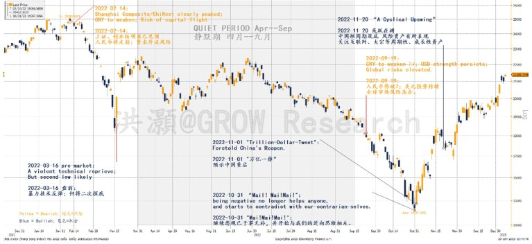
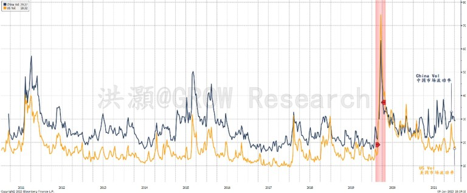
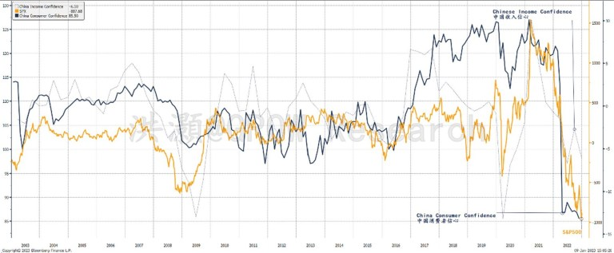
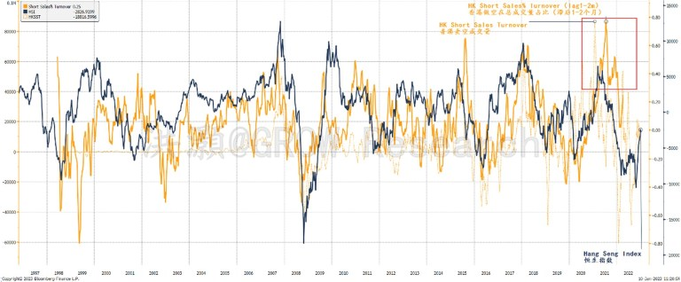
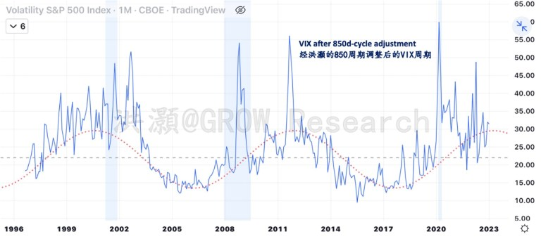
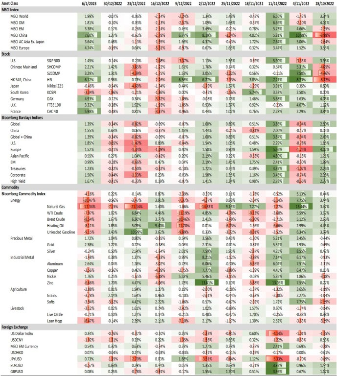
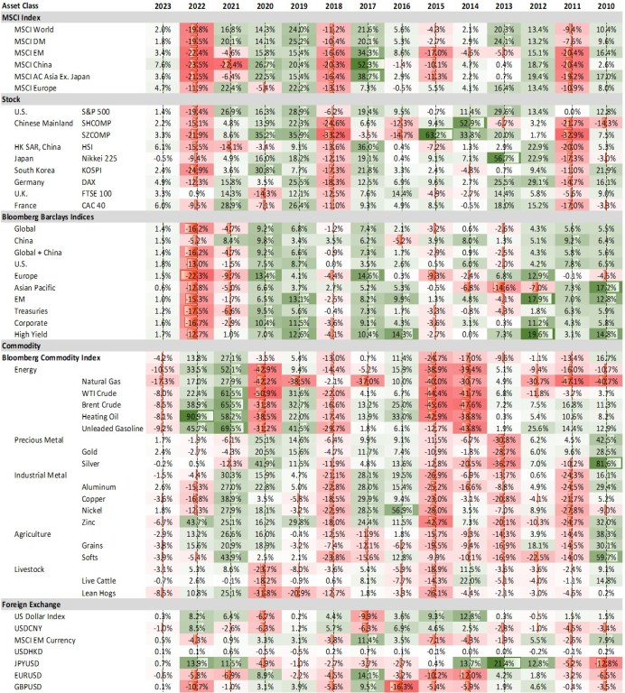
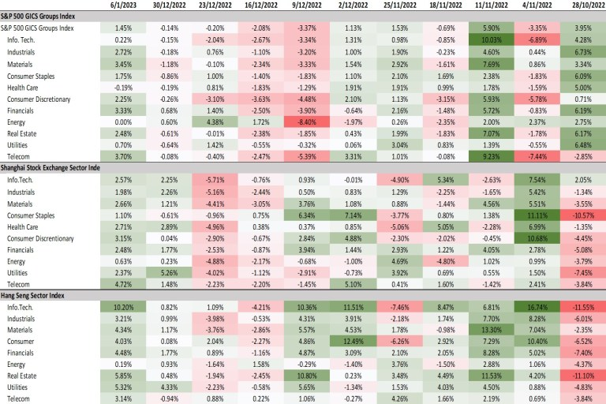
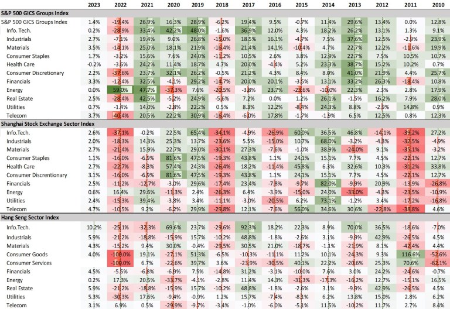

-   **Impermanence:** everything is ephemeral. At market extremes, bears are bulls. And vice versa.  
    无常：一切都是短暂的。在市场极端情况下，空头是多头。反之亦然。  
    
-   **Sentiment:** market swings between lusts and fears. The obsession with profit plunges us into emotional euphoria and panic. Rise above it.
    
    情绪：市场在欲望和恐惧之间摇摆。对利润的痴迷使我们陷入情绪亢奋和恐慌之中。超越它。
    
-   **Cycles:** The market runs in cycle. What is lost will be found again.  
    周期：市场在周期中运行。失去的会再找回来。  
    

**Impermanence 諸行無常**

Impermanence is an essential concept in Buddhism philosophy. It is the first state of the “_Three Marks of Existence_” in Buddhism, and deals with change. All existence is conditioned without exception. It is “_transient, evanescent, and inconstant_” (David & Stede). And “_all temporal things, whether material or mental, are compounded objects in a continuous change of condition, are subject to decline and destructions_.” (Buswell & Lopez)

无常是佛教哲学中的一个基本概念。它是佛教“三相”的第一个状态，处理变化。所有的存在都是有条件的，无一例外。它是“短暂的、消逝的和无常的”（大卫和斯蒂德）。并且“所有暂时的事物，无论是物质的还是精神的，都是条件不断变化的复合对象，都会衰落和毁灭。” （巴斯韦尔和洛佩兹）

If my work in 2022 were to be judged by the quality of my market calls, it would have been one of my more prescient years. But life is impermanent, and much more can happen in life than plan. Such market clairvoyance had not yielded fruits for my professional career for a large part of 2022. Instead, it felt like Casandra’s last days.

如果我在 2022 年的工作是根据我的市场预测质量来判断的，那将是我更有先见之明的一年。但是生活是无常的，生活中可能发生的事情比计划多得多。在 2022 年的大部分时间里，这种市场洞察力并没有为我的职业生涯带来成果。相反，感觉就像卡桑德拉的最后几天。

**Figure 1: Our Significant Calls in 2022.**  
图 1：我们在 2022 年的重要呼吁。  

_Source: Bloomberg, GROW Research_ 资料来源：彭博社，GROW Research

I have summarized my significant market calls during 2022 in Figure 1. On February 14, 2022, I warned that the Chinese market had “_clearly peaked_”, the Chinese Yuan would weaken, and capital flight was looming. I further warned that a depreciating Yuan suggested elevated global market risks. That was the global market peak in 2022.

我在图 1 中总结了我在 2022 年期间的重要市场预测。2022 年 2 月 14 日，我警告说中国市场已经“明显见顶”，人民币将走弱，资本外逃迫在眉睫。我进一步警告说，人民币贬值表明全球市场风险升高。那是 2022 年的全球市场峰值。

On March 16, 2022, I presaged an “imminent and violent technical rebound” due to epic short positions, but warned that _“a second low_” was likely. After an extended five-month of hiatus due to a career change, I called “**[_Mai! Mai! Mai!_](https://growinvestment.group/2022/10/31/hao-hong-mai-mai-mai/)**” on October 31 when China’s markets were enduring unprecedented waves of selling. And my follow-up tweet previewing China’s COVID reopening was dubbed “_**[Trillion-Dollar Tweet](https://growinvestment.group/2022/11/07/hao-hong-a-trillion-dollar-tweet/)**_”. Since then, Chinese assets rallied to their best months ever, and investors both on- and offshore are coming back in droves.

2022 年 3 月 16 日，由于大量空头头寸，我曾预测“即将出现剧烈的技术反弹”，但警告称可能会出现“第二个低点”。由于职业变化而中断了五个月的延长后，我打电话给“Mai！迈！麦！ 10 月 31 日，中国市场经历了前所未有的抛售浪潮。我的后续推文预览了中国的 COVID 重新开放，被称为“万亿美元推文”。从那以后，中国资产反弹至有史以来最好的月份，境内外投资者纷纷回归。

There were two big bear markets in China of 2022 – stocks for almost the entire year, and bonds in the last two months of 2022 (we will discuss the bear market in bonds in the later section). While my bearish stance on Chinese stocks have been proven right eventually, it clashed with how volatility was viewed in the Chinese culture.

2022年中国有两大熊市——几乎全年的股票熊市，以及2022年最后两个月的债券熊市（我们将在后面的部分讨论债券熊市）。虽然我对中国股市的看跌立场最终被证明是正确的，但它与中国文化对波动性的看法相冲突。

Even though the Chinese is master of cycles, the Chinese essentially hold a disapproving view of volatility – it is frown upon. The Chinese concept of time is circular – time revolves around in cycles, as opposed to the western linear view of time. Such different perceptions of time between east and west help explain why time travel has been such an enchanting subject of the western cinema, while reincarnation and afterlife have been a perpetual Chinese favorite.

尽管中国人精通周期，但中国人基本上不赞成波动——这是不受欢迎的。中国的时间观念是循环的——时间是循环的，这与西方的线性时间观相反。东西方对时间的这种不同理解有助于解释为什么时间旅行一直是西方电影如此迷人的主题，而轮回和来世一直是中国人的最爱。

Because of such a circular perception of time, the Chinese applies time to resolve risk. Back in the 90s when the Shanghai stock market was undergoing its most volatile phase due to “growing pain”, the management philosophy then was to stretch out the time duration of the decline, and over time spread out the losses among investors. Such philosophy had led to the introduction of the daily stop limits and the rules of t+1 settlement in the onshore market. As time goes in circle, the fallen stocks will eventually nirvana, or come back when given enough time. The state of fallen, in the eyes of Chinese, is impermanent.

由于时间的循环观念，中国人用时间来化解风险。上世纪90年代，沪市正处于“成长之痛”最震荡的时期，当时的管理理念是拉长下跌的时间，把损失分摊给投资者。这种理念导致在岸市场引入每日止损限额和 t+1 结算规则。随着时间的流逝，下跌的股票最终会涅盘，或者时间足够时会卷土重来。堕落的状态，在中国人看来，是无常的。

**Figure 2: China market volatility is consistently higher than that of the US market.**  
图2：中国市场的波动性一直高于美国市场。  

_Source: Bloomberg, GROW Research_ 资料来源：彭博社，GROW Research

Such bias against volatility, or the innate desire to suppress it, inevitably gives rise to clogs in the system, as systemic risks cannot be diversified but transferred. It also means that even for the financial professionals, risks cannot be efficiently identified and priced. The market function of appropriately pricing risks is thus distorted, and thus cannot function properly.

这种对波动性的偏见，或者抑制波动性的内在愿望，不可避免地会导致系统堵塞，因为系统性风险无法分散，只能转移。这也意味着即使是金融专业人士，也无法有效地识别风险和定价。适当定价风险的市场功能因此被扭曲，从而无法正常发挥作用。

In such a system, risk tends to be underpriced and thus over-rewarded. Simply put, the Chinese market tends to be over-priced with such distorted view of volatility. It explains why the Chinese onshore market is often overvalued, especially relative to its offshore counterparts such as Hong Kong, and is prone to bubble. The A/H premium is perennially well above 100%, and rose even higher after the Connect Scheme was launched (**Figure 2**).

在这样的系统中，风险往往被低估，因此回报过高。简而言之，中国市场往往因这种扭曲的波动性观点而被高估。这解释了为什么中国在岸市场经常被高估，尤其是相对于香港等离岸市场而言，而且容易出现泡沫。 A/H 溢价常年远高于 100%，并在互联互通推出后升得更高（图 2）。

It also explains why the onshore market is predisposed to bouts of volatility, as the overvaluation levels cannot be timely corrected, and systemic risks continue to accumulate – much like a dike trying to hold back a raging river during a severe flood. Towards the end, the mass of flood water would become so great that the dike would be overwhelmed. Or the dike would have to be manually breached to release the flood water.

这也解释了为什么在岸市场容易出现波动，因为高估水平无法及时纠正，系统性风险继续积累——就像在严重洪水期间试图阻挡汹涌河流的堤坝。到最后，洪水会变得如此之大，以至于堤坝不堪重负。或者必须手动破坏堤坝以释放洪水。

Such market construct also suggests that there would be a shortage of “bears” – traders who could freely hold an opposing view to the consensus. These bearish traders without an existing position can become liquidity providers as counter parties when the market plunges and prices fallen to a level where these ex-bears see value.

这种市场结构还表明，将缺乏“熊市”——可以自由地对共识持反对意见的交易员。当市场暴跌且价格跌至这些前空头者认为有价值的水平时，这些没有现有头寸的看跌交易者可以成为流动性提供者作为交易对手。

All market crises are liquidity crises. A lack of counter parties during market plunges would suggest that such plunges can be violent and precipitous. And thus, the complex for the “National Team” to the rescue.

所有的市场危机都是流动性危机。在市场暴跌期间缺乏交易对手将表明这种暴跌可能是猛烈和急剧的。因此，复杂的“国家队”来救援。

Further, can an unspoken bearish view affect the market functioning in any way? From an existentialism point of view, it certainly can. It does so by skewing the price of risks because of the inability to express an opposing view. Simply put, if everyone holds the same position, there would be no market, no trade and thus no liquidity.

此外，不言而喻的看跌观点会以任何方式影响市场运作吗？从存在主义的角度来看，它当然可以。由于无法表达相反的观点，它通过扭曲风险价格来做到这一点。简单地说，如果每个人都持有相同的头寸，就没有市场，没有交易，也就没有流动性。

In China, there has been much discussion about “_pricing power_” _(定价权_). The debate has been centering on who has the upper hand in setting market prices by comparison of the depth of pocket. But setting the price right is not about who has more money, but who has a more unbiased view. Big money may be able to briefly sway market prices to one end. But it “_cannot fool all people all the time_” (Lincoln) – just look at what happened in 2022 when many big growth companies crashed 80 percent back to earth. The market is an exchange of ideas, as much as it is an exchange of capital.

在中国，关于“定价权”的讨论很多。争论的焦点一直集中在通过比较资金深度来确定市场价格方面谁占据上风。但定价权不在于谁有更多的钱，而在于谁的观点更公正。一方面，巨额资金可能能够短暂地左右市场价格。但它“不能一直愚弄所有人”（林肯）——看看 2022 年发生的事情吧，当时许多大型成长型公司倒闭了 80%。市场是思想的交流，也是资本的交流。

The market ebbs and flows, much like life in a state of flux. But right market calls do not necessarily get rewarded. And market selloff indeed seeds the next phase of market recovery and rejuvenation. Reading investment classics never really results in real learning beyond consensus, except for perhaps a few good quotes. Real life is so much more. And such is the impermanence of the market, and life.

市场潮起潮落，就像生活在不断变化。但正确的市场判断并不一定会得到回报。市场抛售确实为下一阶段的市场复苏和复苏埋下了种子。阅读投资经典永远不会真正导致超越共识的真正学习，除了一些好的引述。现实生活远不止于此。这就是市场和生活的无常。

**Hopes & Fears 諸行是苦**

The second “_Mark of Existence_” in the Buddhism philosophy is the pervasive pain and sufferings, and how we anguish and perish with them. Such pain arises not only because everything in life is transient and impermanent, but also because of our longing for the evanescence and our attachment to them. This insatiable craving keeps us caught in “_samsara_”, trapped in endless cycle of rebirth and mundane existence that are considered suffering. It also refers to “_the endless cycle of attraction and rejection that perpetuates the ego_” (Payutto). In market terms, it is hopes and fears that weave the tapestry of market history. And most of us are mired within.

佛教哲学中的第二个“存在的标志”是无处不在的痛苦和苦难，以及我们如何与他们一起痛苦和灭亡。这种痛苦的产生，不仅是因为生命中的一切都是短暂和无常的，而且是因为我们对转瞬即逝的渴望和对它们的执着。这种贪得无厌的渴求使我们陷入“轮回”，陷入无尽的轮回和被认为是痛苦的世俗存在中。它还指“使自我永存的吸引和拒绝的无尽循环”（Payutto）。就市场而言，编织市场历史的是希望和恐惧。而我们大多数人都深陷其中。

The year 2022 is a prime example of this second “_Mark of Existence_”. The euphoria and depression in the Chinese market was palpable through epic market volatility. Early in the year when the Hang Seng was approaching its peak of 2022 at ~25,000, southbound funds rushed into Hong Kong and buying everything indiscriminatingly. Like every other episode of market euphoria, traders call this trade “usurping the pricing power of the Hong Kong market”.

2022 年是第二个“存在标志”的典型例子。通过史诗般的市场波动可以明显感受到中国市场的繁荣和萧条。年初，当恒生指数接近 2022 年的峰值 25,000 点左右时，南向资金涌入香港，大肆买入。与其他所有市场狂热事件一样，交易员称这种交易“篡夺了香港市场的定价权”。

We, too, at one stage early in 2022, were attracted to Hong Kong’s relatively lower valuation compared with that of the onshore market, some key technical levels that appeared well bought and supported, and Hong Kong market’s resilience in the backdrop of a weak US market. We eventually gave up this stance, as we noted that the Shanghai Composite and the Chinext “_had clearly peaked_” on February 14, 2022 (**Figure 1**).

在 2022 年初的一个阶段，我们也被吸引到香港相对于在岸市场的估值较低，一些关键的技术水平似乎买盘和支撑良好，以及香港市场在美国疲软背景下的弹性市场。我们最终放弃了这一立场，因为我们注意到上证综合指数和创业板指数已在 2022 年 2 月 14 日“明显见顶”（图 1）。

**Figure 3: China’s consumer/income confidence plunged with S&P 500 in 2022.**  
图 3：2022 年中国的消费者/收入信心随着标准普尔 500 指数暴跌。  

_Source: Bloomberg, GROW Research_ 资料来源：彭博社，GROW Research

In the March selloff, short position against the Hang Seng reached one of the worst in history. It was in part triggered by Russia’s FX reserve being frozen by the US authority due to Russian invasion of Ukraine. Consensus view was that the Hong Kong Dollar peg an anchor of Hong Kong’s economic stability and prosperity, could be in danger. As it was the first time the US dollar had been weaponized, rampant panic ensued. Market plunged in tandem with confidence (**Figure 3**), and the HKMA had to burn through its FX reserve at a record pace to defend the HKD peg.

在 3 月的抛售中，对恒生指数的空头头寸达到了历史上最糟糕的水平之一。部分原因是俄罗斯的外汇储备因俄罗斯入侵乌克兰而被美国当局冻结。一致认为，港元挂钩是香港经济稳定和繁荣的支柱，可能处于危险之中。由于这是美元首次被武器化，随之而来的是恐慌情绪。市场与信心一起暴跌（图 3），香港金管局不得不以创纪录的速度耗尽其外汇储备以捍卫港元挂钩。

But such record short positions are rocket fuel for short-covering rally (**Figure 4**). On March 16, 2022, pre-market, we issued a strong trading call to buy the Hang Seng. And the market responded immediately and strongly, surging ~ 30% in the ensuing few weeks. We did the same on October 31, 2022 with our report titled “[**_Mai! Mai! Mai!_**](https://growinvestment.group/2022/10/31/hao-hong-mai-mai-mai/)”. This time, the entire Chinese space responded immediately and strongly across the board. Our report marked the inception of the current trend reversal that is still unraveling.

但如此创纪录的空头头寸是空头回补反弹的火箭燃料（图 4）。 2022 年 3 月 16 日，盘前，我们发出买入恒生指数的强烈交易呼吁。市场立即做出强烈反应，在接下来的几周内飙升约 30%。我们在 2022 年 10 月 31 日做了同样的事情，我们的报告标题为“ Mai！迈！迈！ ”。这一次，整个华夏空间立即全线强烈响应。我们的报告标志着当前趋势逆转的开始，这种逆转仍在瓦解之中。

**Figure 4: Short positions in HK reached record in March 2022.**  
图 4：香港的空头头寸在 2022 年 3 月创下历史新高。  

_Source: Bloomberg, GROW Research_ 资料来源：彭博社，GROW Research

These market swings between extremes during 2022 show how human emotions shape the market course. The continuing urge to avoid trading loss and the greed for profit give rise to market panic and euphoria. In between it is the pervasive pain and sufferings, as traders anguish when trying to buy the bottom and sell the peak. Sell low buy high is more prevalent than the other way round. And people who catch the bottom tend to be different those who call the top. As such, everybody hurts. The hallmark of a true market guru is the ability to pick the top as well as the bottom, and do so consistently over many cycles. But it is few and far between.

2022 年这些极端之间的市场波动显示了人类情绪如何影响市场走势。避免交易损失的持续冲动和对利润的贪婪导致市场恐慌和兴奋。介于两者之间的是无处不在的痛苦和煎熬，因为交易员在试图在低点买入和在高点卖出时感到痛苦。低卖高买比反过来更普遍。而抓底的人往往与称顶的人不同。因此，每个人都会受到伤害。真正的市场大师的标志是能够选择顶部和底部，并在许多周期中始终如一地这样做。但它很少见。

**Cycles 諸法無我**

The third “_Mark of Existence_” in Buddhism philosophy is about selflessness – there is no permanent essence in any thing or phenomena, including oneself and all living beings. This is a much broader scope than impermanence. Even the belief “I am” is a transient conceit without substance. Such conceit is also a source of pain and suffering. To end it is a way to end all torments. This is a state that transcends impermanence.

佛教哲学中的第三个“存在之相”是关于无我——任何事物或现象都没有永恒的本质，包括自己和所有众生。这比无常的范围要广得多。甚至“我是”的信念也是一种没有实质内容的短暂自负。这种自负也是痛苦的根源。结束它是结束所有折磨的一种方式。这是超越无常的境界。

In late October the Hong Kong market was enduring unprecedented selloff to a valuation level unseen in history. One of my proprietary models, the EYBY model that had been key to my market calls, started to bottom out. The model uses relative valuation and my theory of economic cycles to allocate capital between bonds and stocks. It was surprising that the model suggested an impending economic cycle bottom and sent out a strong buy signal amid unrelenting selloffs and prevalent market depression (**Figure 5**).

10 月下旬，香港市场经历了前所未有的抛售，估值达到历史前所未见的水平。我的专有模型之一，曾经是我市场预测的关键的 EYBY 模型，开始触底反弹。该模型使用相对估值和我的经济周期理论在债券和股票之间分配资本。令人惊讶的是，该模型表明经济周期即将触底，并在持续抛售和普遍的市场萧条中发出强烈的买入信号（图 5）。

**Figure 5: The epic bottom reversal in our EYBY model based on cycles.**  
图 5：我们基于周期的 EYBY 模型中史诗般的底部反转。  

_Source: Bloomberg, GROW Research_ 资料来源：彭博社，GROW Research

For a person who had been non-consensually cautious for the most part of 2022, such bullish signal at the nadir of the market seemed to contradict most of the presumptions in my mind. After all, economic data then were dismal and kept getting worse, and conspiracy theories abound. Only valuation was getting cheaper. The stock market is such a place that when everything is on sale, people run away from it.

对于一个在 2022 年的大部分时间里都持非共识谨慎态度的人来说，市场最低点的这种看涨信号似乎与我脑海中的大部分假设相矛盾。毕竟，当时的经济数据惨淡且不断恶化，阴谋论层出不穷。只有估值越来越便宜。股市是这样一个地方，当一切都在出售时，人们就会逃离它。

Late October in 2022 was the darkest hour for Chinese assets. But as Scott Fitzgerald once wrote: “_The test of a first-rate intelligence is the ability to hold two opposing ideas in mind at the same time and still retain the ability to function. One should, for example, be able to see that things are hopeless yet be determined to make them otherwise_.” Even so, when I decided to change from bearish to bullish, it was not an easy call to make. I was going against the crowd, as well as going against myself.

2022年10月下旬，是中国资产最黑暗的时刻。但正如斯科特·菲茨杰拉德 (Scott Fitzgerald) 曾经写道：“一流智力的测试是能够同时在脑海中记住两个相反的想法，并且仍然保持运作的能力。例如，一个人应该能够看到事情是无望的，但仍下定决心改变现状。”即便如此，当我决定从看跌转为看涨时，做出决定并不容易。我反对人群，也反对我自己。

On October 31, 2022, I published a report titled “[**_Mai! Mai! Mai!_**](https://growinvestment.group/2022/10/31/hao-hong-mai-mai-mai/)”, which in Chinese means “**Buy! Buy! Buy!**”. I then followed up with our 2023 outlook report “**[_A Cyclical Recovery_](https://growinvestment.group/2022/11/21/hao-hong-outlook-2023-a-cyclical-recovery/)**” on November 20, 2022. The risk in global market also appeared to be subsiding from its high plateau at that juncture (**Figure 6**). And the rest is history.

2022年10月31日，我发表了一篇题为《麦！迈！迈！ ”，中文意思是“买！买！买！”。然后，我在 2022 年 11 月 20 日发布了我们的 2023 年展望报告“周期性复苏”。此时，全球市场的风险似乎也在从其高位稳定下来（图 6）。剩下的就是历史。

**Figure 6: The VIX cycle = 3 x 3.5 years.**  
图 6：VIX 周期 = 3 x 3.5 年。  

_Source: TradingView, GROW Research_  
资料来源：TradingView、GROW Research  

Meanwhile, another significant bear market in domestic bonds erupted, just as Chinese stocks were undergoing historic surge into a bull market. This bear market in Chinese bonds at the end of 2022 has been less discussed in the foreign investment community. As my EYBY model suggested at that juncture, capital should start to be rotated from bonds to stocks. Suddenly, some of the wealth management products (WMPs) based on bonds started to plunge. Market consensus used the rotation from bonds to stocks identified by my EYBY model as the explanation of the eruption of a severe bond bear market.

与此同时，就在中国股市经历历史性的飙升进入牛市之际，又一次国内债券大熊市爆发。 2022年底的中国债券熊市在外国投资界讨论较少。正如我的 EYBY 模型在那个时候建议的那样，资本应该开始从债券转向股票。一时之间，一些以债券为基础的理财产品开始暴跌。市场共识使用我的 EYBY 模型确定的从债券到股票的轮换来解释严重的债券熊市的爆发。

However, it is odd that an asset class rotation based on economic cycle and relative valuation could plunge the price of the safest asset in the market by 20% in a week, with one third of the WMPs breaking their book value.

然而，奇怪的是，基于经济周期和相对估值的资产类别轮动，能够让市场上最安全的资产价格在一周内暴跌20%，三分之一的理财产品跌破账面价值。

There has to be another explanation. As most managers of WMPs use hold-to-maturity strategy for the underlying bonds of their WMPs without any hedge. In a market that didn’t have too much volatility, and WMPs are managed by pooling funds together, it was easy to iron out any ripples in the value of WMPs without causing much havoc.

必须有另一种解释。由于大多数理财产品的管理人对其理财产品的基础债券使用持有至到期策略，而没有任何对冲。在一个没有太大波动的市场中，理财产品是通过汇集资金来管理的，很容易消除理财产品价值的任何波动，而不会造成太大的破坏。

But then WMPs management was changed to be net-asset-value based, with specific underlying assets to respective WMPs, rather than pooling funds. Consequently, unhedged positions in the underlying bonds of the WMPs due to a turn in economic cycle led to a sharp decline in the net asset value of the WMPs. And once the net value plunged, redemption waves ensued. It was a vicious cycle.

但随后理财产品的管理改为以资产净值为基础，将特定的基础资产分配给各个理财产品，而不是集合资金。因此，由于经济周期的转变，理财产品基础债券的未对冲头寸导致理财产品的资产净值急剧下降。一旦净值暴跌，赎回浪潮接踵而至。这是一个恶性循环。

This episode of a bond bear market just as stocks surging back into a bull market can reveal a lot. Apparently, WMP manager’s philosophy of hold-to-maturity to realize investment gains is diagonally opposite to our afore-discussions about market impermanence. And in an unhedged position, a small but abrupt change can ruin the best-laid plan.

债券熊市的这段插曲与股票飙升回牛市一样可以揭示很多东西。显然，理财经理持有至到期以实现投资收益的理念与我们之前关于市场无常的讨论正好相反。在未对冲的情况下，一个小而突然的变化可能会毁掉最周密的计划。

Further, such unhedged positions again suggest that the pricing efficiency in the Chinese market is very low. As in the stock market, there is few to take the opposite side of the trade and to offer hedging. Most are just complacent to huddle with peers in similar positions. Consequently, the market always runs out of liquidity during crisis. The market’s main function is to provide liquidity, rather than offering textbook market efficiency. Without diverse views, there will be no market and thus no liquidity.

此外，此类未对冲头寸再次表明中国市场的定价效率非常低。与股票市场一样，很少有人采取交易的另一方并提供对冲。大多数人只是满足于与处于类似职位的同行挤在一起。因此，市场在危机期间总是会耗尽流动性。市场的主要功能是提供流动性，而不是提供教科书般的市场效率。没有不同的观点，就没有市场，也就没有流动性。

It would be difficult to fathom such financial market would have any “pricing power” (_定价权_) – unless changes are initiated in the future. The market cannot rely on bailout every time it runs into trouble. A market that constantly requires intervention could not be deemed as a matured market with the efficiency to set pricing. It is at best a big crying baby.

很难想象这样的金融市场会有什么“定价权”（定价权）——除非未来开始改变。市场不能每次遇到麻烦都靠救助。一个不断需要干预的市场不能被视为具有定价效率的成熟市场。它充其量是一个哭闹的大婴儿。

In sum, the market runs in cycles. One asset’s fortune can mean dismay for another. Cycles transcend bulls and bears. Too much self-consciousness, obstinately holding onto one’s position with biases would blind us when the market starts to turn from extremes. And at market extremes, bears are bulls.

总之，市场是有周期的。一项资产的财富可能意味着另一项资产的沮丧。周期超越牛市和熊市。当市场开始从极端转向时，太多的自我意识，固执地坚持自己的立场会使我们蒙蔽。在市场极端情况下，空头就是多头。

**Conclusion: All Conditioned Existence一切有為法**  
结语：一切缘起一切有为法  

Suffering is essential in Buddhism philosophy. On the surface, this second “_Mark of Existence_” could well be an appropriate word that depict the year of “_Twenty Twenty, Too_”.

苦难在佛教哲学中是必不可少的。从表面上看，这第二个“存在的印记”很可能是一个恰当的词来形容“二十二十岁”这一年。

But central to Buddhism philosophy is about how one could transcend sufferings, by recognizing every existence and all living being are impermanent, or merely conditioned existence, including oneself. Such appreciation of impermanence in life and the detachment from evanescence that led to sufferings will mean enlightenment, freeing us from endless circle of senseless rebirth and mundane existence and delivering us to the state of no-self, or selflessness.

但佛教哲学的核心是关于一个人如何超越苦难，认识到每一个存在和所有众生都是无常的，或者仅仅是有条件的存在，包括自己。这种对生命无常的理解和对导致痛苦的无常的离弃意味着开悟，将我们从无止境的轮回和世俗存在中解脱出来，并使我们达到无我或无我的状态。

In short, Buddhism philosophy teaches us about the origin of pain, the suffering from pain and how to transcend it.

简而言之，佛教哲学教导我们痛苦的起源、痛苦的痛苦以及如何超越痛苦。

In investing, we could also learn from the teaching of the Buddha. The panic and euphoria events in the extraordinary 2022 are indeed impermanent. At market extremes, bulls are indistinguishable from bears, as their loaded positions that could only be liquidated. Failure to recognize this market impermanence is the source of pain. Failure to let the market express its view freely is the source of volatility.

在投资方面，我们也可以借鉴佛陀的教义。不平凡的2022年恐慌和欣快事件确实是无常的。在市场极端情况下，多头与空头无法区分，因为他们的头寸只能清算。未能认识到这种市场的无常性是痛苦的根源。不能让市场自由表达意见是波动的根源。

Market is here to provide liquidity, rather than offering academic market efficiency as consensus believes. But there will be no market efficiency without liquidity, and no market without diverse views. Many fail to recognize it, and the unquenched urge to pinpoint the market’s top and bottom anguishes the mass.

市场在这里是为了提供流动性，而不是像人们普遍认为的那样提供学术市场效率。但没有流动性就没有市场效率，没有不同观点就没有市场。许多人都没有意识到这一点，并且无法抑制地确定市场顶部和底部的冲动使大众感到痛苦。

And the Chinese bias against volatility is an opposing view to the Buddhism philosophy of impermanence. As risk is underappreciated and thus underpriced, a market with such false presumption is prone to overvaluation, and thus abrupt and precipitous turns. One must be able to hold two opposing views in mind and still be able to negotiate the torrents of greed and fear. Only when one nirvana from the attachment to permanence could one be truly free and become the master of trading.

而中国人对波动性的偏见与佛教无常哲学的观点是相反的。由于风险被低估并因此被低估，具有这种错误假设的市场容易被高估，从而出现突然和急剧的转变。一个人必须能够记住两种相反的观点，并且仍然能够谈判贪婪和恐惧的洪流。只有从执着常住中涅槃，才能真正解脱，成为交易高手。

  
“_All conditioned phenomena_ “一切因缘法

_Are like a dream, an illusion, a bubble, a shadow,_  
就像一场梦，一个幻觉，一个泡沫，一个影子，  

_Like dew or a flash of lightning._  
像露水或闪电。  

_Thus should we meditate upon them_”.  
我们应当如此默想它们”。  

**Hao Hong, CFA** 郝红，CFA

**Twitter: @HAOHONG\_CFA**  推特：@HAOHONG\_CFA

**Appendix**  附录

**Appendix 1: Performance of major asset classes (weekly)**  
附件一：主要资产类别表现（周报）  

_Source: Bloomberg, GROW Research (Updated on 06/01/2023, same below)_  
资料来源：Bloomberg，GROW Research（更新于 06/01/2023，下同）  

**Appendix 2: Performance of major asset classes (annual)**  
附录二：主要资产类别表现（年度）  

_Source: Bloomberg, GROW Research_ 资料来源：彭博社，GROW Research

**Appendix 3: Performance of major stock market sectors (weekly)**  
附件三：主要股票市场板块表现（周报）  

_Source: Bloomberg, GROW Research_ 资料来源：彭博社，GROW Research

**Appendix 4: Performance of major stock market sectors (annual)**  
附件四：主要股票市场板块表现（年度）  

_Source: Bloomberg, GROW Research_ 资料来源：彭博社，GROW Research

**Please click here to download the full report in PDF:**  
请点击此处下载 PDF 格式的完整报告：  

**[English Report: 《Lessons of 2022》](http://research.growim.com/20230111growresearchEN.pdf)**  
英文报告：《Lessons of 2022》  

**[中文版报告：《2022年启示录》](http://research.growim.com/20230111growresearchCN.pdf)**
